# 第八章：DQN 扩展

自从 DeepMind 在 2015 年发布其深度 Q 网络（DQN）模型的论文以来，许多改进方案已经被提出，并对基础架构进行了调整，显著提高了 DeepMind 基础 DQN 的收敛性、稳定性和样本效率。本章将深入探讨其中的一些思想。

2017 年 10 月，DeepMind 的 Hessel 等人发布了一篇名为《Rainbow: Combining improvements in deep reinforcement learning》的论文[Hes+18]，介绍了对 DQN 的六个最重要的改进；其中一些是在 2015 年发明的，但其他一些则较为近期。在这篇论文中，通过简单地结合这六个方法，达到了 Atari 游戏套件上的最先进成果。

自 2017 年以来，更多的论文被发表，并且最先进的结果被进一步推动，但论文中介绍的所有方法仍然是相关的，并在实践中广泛使用。例如，在 2023 年，Marc Bellemare 出版了《Distributional reinforcement learning》一书[BDR23]，书中讨论了论文中的一种方法。此外，所描述的改进相对简单易于实现和理解，因此在本版中我没有对这一章做重大修改。

我们将熟悉的 DQN 扩展如下：

+   N 步 DQN：如何通过简单地展开贝尔曼方程提高收敛速度和稳定性，以及为什么它不是终极解决方案

+   双 DQN：如何处理 DQN 对动作值的高估

+   噪声网络：如何通过给网络权重添加噪声来提高探索效率

+   优先回放缓冲区：为什么均匀采样我们的经验不是训练的最佳方式

+   对抗 DQN：如何通过使我们的网络架构更紧密地反映我们正在解决的问题，来提高收敛速度

+   分类 DQN：如何超越单一的期望动作值，处理完整的分布

本章将介绍所有这些方法。我们将分析这些方法背后的思想，以及如何实现它们，并与经典的 DQN 性能进行比较。最后，我们将分析结合所有方法的系统表现。

# 基础 DQN

为了开始，我们将实现与第六章相同的 DQN 方法，但利用第七章中描述的高级原语。这将使我们的代码更加简洁，这是好的，因为无关的细节不会使我们偏离方法的逻辑。同时，本书的目的并非教你如何使用现有的库，而是如何培养对强化学习方法的直觉，必要时，从零开始实现一切。从我的角度来看，这是一个更有价值的技能，因为库会不断变化，但对领域的真正理解将使你能够迅速理解他人的代码，并有意识地应用它。

在基本的 DQN 实现中，我们在本书的 GitHub 仓库中的 Chapter08 文件夹中有三个模块：

+   Chapter08/lib/dqn_model.py: DQN 神经网络（NN），与第六章相同，因此我不会重复它。

+   Chapter08/lib/common.py: 本章代码共享的常用函数和声明。

+   Chapter08/01_dqn_basic.py: 77 行代码，利用 PTAN 和 Ignite 库实现基本的 DQN 方法。

## 公共库

让我们从 lib/common.py 的内容开始。首先，我们有上一章中为 Pong 环境设置的超参数。这些超参数存储在一个数据类对象中，这是存储一组数据字段及其类型注释的标准方式。这样，我们可以轻松为不同、更复杂的 Atari 游戏添加另一个配置集，并允许我们对超参数进行实验：

```py
@dataclasses.dataclass 
class Hyperparams: 
    env_name: str 
    stop_reward: float 
    run_name: str 
    replay_size: int 
    replay_initial: int 
    target_net_sync: int 
    epsilon_frames: int 

    learning_rate: float = 0.0001 
    batch_size: int = 32 
    gamma: float = 0.99 
    epsilon_start: float = 1.0 
    epsilon_final: float = 0.1 

    tuner_mode: bool = False 
    episodes_to_solve: int = 500 

GAME_PARAMS = { 
    ’pong’: Hyperparams( 
        env_name="PongNoFrameskip-v4", 
        stop_reward=18.0, 
        run_name="pong", 
        replay_size=100_000, 
        replay_initial=10_000, 
        target_net_sync=1000, 
        epsilon_frames=100_000, 
        epsilon_final=0.02, 
    ),
```

lib/common.py 中的下一个函数名为 unpack_batch，它接收转移的批次并将其转换为适合训练的 NumPy 数组集合。来自 ExperienceSourceFirstLast 的每个转移都属于 ExperienceFirstLast 类型，这是一个数据类，包含以下字段：

+   state: 来自环境的观测值。

+   action: 代理执行的整数动作。

+   reward: 如果我们创建了 ExperienceSourceFirstLast 并设置了属性 steps_count=1，那么它只是即时奖励。对于更大的步数计数，它包含了这个步数内的奖励的折扣总和。

+   last_state: 如果转移对应于环境中的最后一步，那么这个字段为 None；否则，它包含经验链中的最后一个观测值。

unpack_batch 的代码如下：

```py
def unpack_batch(batch: tt.List[ExperienceFirstLast]): 
    states, actions, rewards, dones, last_states = [],[],[],[],[] 
    for exp in batch: 
        states.append(exp.state) 
        actions.append(exp.action) 
        rewards.append(exp.reward) 
        dones.append(exp.last_state is None) 
        if exp.last_state is None: 
            lstate = exp.state  # the result will be masked anyway 
        else: 
            lstate = exp.last_state 
        last_states.append(lstate) 
    return np.asarray(states), np.array(actions), np.array(rewards, dtype=np.float32), \ 
        np.array(dones, dtype=bool), np.asarray(last_states)
```

请注意我们如何处理批次中的最终转移。为了避免对这种情况的特殊处理，对于终止转移，我们将初始状态存储在 last_states 数组中。为了使我们的 Bellman 更新计算正确，我们必须在损失计算时使用 dones 数组对这些批次条目进行掩码。另一种解决方案是仅对非终止转移计算最后状态的值，但这会使我们的损失函数逻辑稍微复杂一些。

DQN 损失函数的计算由 calc_loss_dqn 函数提供，代码几乎与第六章相同。唯一的小改动是 torch.no_grad()，它阻止了 PyTorch 计算图被记录到目标网络中：

```py
def calc_loss_dqn( 
        batch: tt.List[ExperienceFirstLast], net: nn.Module, tgt_net: nn.Module, 
        gamma: float, device: torch.device) -> torch.Tensor: 
    states, actions, rewards, dones, next_states = unpack_batch(batch) 

    states_v = torch.as_tensor(states).to(device) 
    next_states_v = torch.as_tensor(next_states).to(device) 
    actions_v = torch.tensor(actions).to(device) 
    rewards_v = torch.tensor(rewards).to(device) 
    done_mask = torch.BoolTensor(dones).to(device) 

    actions_v = actions_v.unsqueeze(-1) 
    state_action_vals = net(states_v).gather(1, actions_v) 
    state_action_vals = state_action_vals.squeeze(-1) 
    with torch.no_grad(): 
        next_state_vals = tgt_net(next_states_v).max(1)[0] 
        next_state_vals[done_mask] = 0.0 

    bellman_vals = next_state_vals.detach() * gamma + rewards_v 
    return nn.MSELoss()(state_action_vals, bellman_vals)
```

除了核心的 DQN 函数外，common.py 还提供了与训练循环、数据生成和 TensorBoard 跟踪相关的多个实用工具。第一个这样的工具是一个小类，它在训练过程中实现了 epsilon 衰减。Epsilon 定义了代理执行随机动作的概率。它应从 1.0 开始（完全随机的代理），逐渐衰减到某个小值，比如 0.02 或 0.01。这个代码非常简单，但几乎在任何 DQN 中都需要，因此通过以下小类提供：

```py
class EpsilonTracker: 
    def __init__(self, selector: EpsilonGreedyActionSelector, params: Hyperparams): 
        self.selector = selector 
        self.params = params 
        self.frame(0) 

    def frame(self, frame_idx: int): 
        eps = self.params.epsilon_start - frame_idx / self.params.epsilon_frames 
        self.selector.epsilon = max(self.params.epsilon_final, eps)
```

另一个小函数是 batch_generator，它接收 ExperienceReplayBuffer（PTAN 类，在第七章中描述）并无限次生成从缓冲区中采样的训练批次。开始时，函数确保缓冲区包含所需数量的样本：

```py
def batch_generator(buffer: ExperienceReplayBuffer, initial: int, batch_size: int) -> \ 
        tt.Generator[tt.List[ExperienceFirstLast], None, None]: 
    buffer.populate(initial) 
    while True: 
        buffer.populate(1) 
        yield buffer.sample(batch_size)
```

最后，一个冗长但非常有用的函数叫做 setup_ignite，它附加了所需的 Ignite 处理器，显示训练进度并将度量写入 TensorBoard。让我们一块儿看这个函数：

```py
def setup_ignite( 
        engine: Engine, params: Hyperparams, exp_source: ExperienceSourceFirstLast, 
        run_name: str, extra_metrics: tt.Iterable[str] = (), 
        tuner_reward_episode: int = 100, tuner_reward_min: float = -19, 
): 
    handler = ptan_ignite.EndOfEpisodeHandler( 
        exp_source, bound_avg_reward=params.stop_reward) 
    handler.attach(engine) 
    ptan_ignite.EpisodeFPSHandler().attach(engine)
```

最初，setup_ignite 附加了 PTAN 提供的两个 Ignite 处理器：

+   EndOfEpisodeHandler，每当游戏回合结束时，它会触发 Ignite 事件。当回合的平均奖励超过某个边界时，它还可以触发事件。我们用它来检测游戏何时最终解决。

+   EpisodeFPSHandler，这是一个小类，跟踪每个回合所花费的时间以及我们与环境交互的次数。根据这些信息，我们计算每秒帧数（FPS），它是一个重要的性能度量指标。

然后，我们安装两个事件处理器：

```py
 @engine.on(ptan_ignite.EpisodeEvents.EPISODE_COMPLETED) 
    def episode_completed(trainer: Engine): 
        passed = trainer.state.metrics.get(’time_passed’, 0) 
        print("Episode %d: reward=%.0f, steps=%s, speed=%.1f f/s, elapsed=%s" % ( 
            trainer.state.episode, trainer.state.episode_reward, 
            trainer.state.episode_steps, trainer.state.metrics.get(’avg_fps’, 0), 
            timedelta(seconds=int(passed)))) 

    @engine.on(ptan_ignite.EpisodeEvents.BOUND_REWARD_REACHED) 
    def game_solved(trainer: Engine): 
        passed = trainer.state.metrics[’time_passed’] 
        print("Game solved in %s, after %d episodes and %d iterations!" % ( 
            timedelta(seconds=int(passed)), trainer.state.episode, 
            trainer.state.iteration)) 
        trainer.should_terminate = True 
        trainer.state.solved = True
```

其中一个事件处理器会在回合结束时被调用。它将在控制台上显示有关已完成回合的信息。另一个函数会在平均奖励超过超参数中定义的边界时被调用（在 Pong 的情况下是 18.0）。此函数显示关于已解决游戏的消息，并停止训练。

该函数的其余部分与我们想要跟踪的 TensorBoard 数据有关。首先，我们创建一个 TensorboardLogger：

```py
 now = datetime.now().isoformat(timespec=’minutes’).replace(’:’, ’’) 
    logdir = f"runs/{now}-{params.run_name}-{run_name}" 
    tb = tb_logger.TensorboardLogger(log_dir=logdir) 
    run_avg = RunningAverage(output_transform=lambda v: v[’loss’]) 
    run_avg.attach(engine, "avg_loss")
```

这是 Ignite 提供的一个特殊类，用于写入 TensorBoard。我们的处理函数将返回损失值，因此我们附加了 RunningAverage 转换（同样由 Ignite 提供），以获取随时间平滑的损失版本。

接下来，我们将要跟踪的度量值附加到 Ignite 事件：

```py
 metrics = [’reward’, ’steps’, ’avg_reward’] 
    handler = tb_logger.OutputHandler(tag="episodes", metric_names=metrics) 
    event = ptan_ignite.EpisodeEvents.EPISODE_COMPLETED 
    tb.attach(engine, log_handler=handler, event_name=event)
```

TensorboardLogger 可以跟踪来自 Ignite 的两组值：输出（由转换函数返回的值）和度量（在训练过程中计算并保存在引擎状态中）。EndOfEpisodeHandler 和 EpisodeFPSHandler 提供度量，这些度量在每个游戏回合结束时更新。因此，我们附加了 OutputHandler，每当回合完成时，它将把有关该回合的信息写入 TensorBoard。

接下来，我们跟踪训练过程中的另一组值，训练过程中的度量值：损失、FPS，以及可能与特定扩展逻辑相关的自定义度量：

```py
 ptan_ignite.PeriodicEvents().attach(engine) 
    metrics = [’avg_loss’, ’avg_fps’] 
    metrics.extend(extra_metrics) 
    handler = tb_logger.OutputHandler(tag="train", metric_names=metrics, 
                                      output_transform=lambda a: a) 
    event = ptan_ignite.PeriodEvents.ITERS_100_COMPLETED 
    tb.attach(engine, log_handler=handler, event_name=event)
```

这些值会在每次训练迭代时更新，但我们将进行数百万次迭代，因此我们每进行 100 次训练迭代就将值存储到 TensorBoard；否则，数据文件会非常大。所有这些功能看起来可能很复杂，但它为我们提供了从训练过程中收集的统一度量集。事实上，Ignite 并不复杂，考虑到它所提供的灵活性。common.py 就到这里。

## 实现

现在，让我们看一下 01_dqn_basic.py，它创建了所需的类并开始训练。我将省略不相关的代码，只关注重要部分（完整版本可以在 GitHub 仓库中找到）。首先，我们创建环境：

```py
 env = gym.make(params.env_name) 
    env = ptan.common.wrappers.wrap_dqn(env) 

    net = dqn_model.DQN(env.observation_space.shape, env.action_space.n).to(device) 
    tgt_net = ptan.agent.TargetNet(net)
```

在这里，我们应用一组标准包装器。我们在第六章中讨论了这些包装器，并且在下一章中，当我们优化 Pong 求解器的性能时，还会再次涉及到它们。然后，我们创建 DQN 模型和目标网络。

接下来，我们创建代理，并传入一个 epsilon-greedy 动作选择器：

```py
 selector = ptan.actions.EpsilonGreedyActionSelector(epsilon=params.epsilon_start) 
    epsilon_tracker = common.EpsilonTracker(selector, params) 
    agent = ptan.agent.DQNAgent(net, selector, device=device)
```

在训练过程中，epsilon 将由我们之前讨论过的 EpsilonTracker 类进行减少。这将减少随机选择的动作数量，并给予我们的神经网络更多的控制权。

接下来，两个非常重要的对象是 ExperienceSourceFirstLast 和 ExperienceReplayBuffer：

```py
 exp_source = ptan.experience.ExperienceSourceFirstLast( 
        env, agent, gamma=params.gamma, env_seed=common.SEED) 
    buffer = ptan.experience.ExperienceReplayBuffer( 
        exp_source, buffer_size=params.replay_size)
```

ExperienceSourceFirstLast 接收代理和环境，并在游戏回合中提供过渡。这些过渡将被保存在经验回放缓冲区中。

然后我们创建优化器并定义处理函数：

```py
 optimizer = optim.Adam(net.parameters(), lr=params.learning_rate) 

    def process_batch(engine, batch): 
        optimizer.zero_grad() 
        loss_v = common.calc_loss_dqn(batch, net, tgt_net.target_model, 
                                      gamma=params.gamma, device=device) 
        loss_v.backward() 
        optimizer.step() 
        epsilon_tracker.frame(engine.state.iteration) 
        if engine.state.iteration % params.target_net_sync == 0: 
            tgt_net.sync() 
        return { 
            "loss": loss_v.item(), 
            "epsilon": selector.epsilon, 
        }
```

处理函数将在每批过渡时被调用以训练模型。为此，我们调用 common.calc_loss_dqn 函数，然后对结果进行反向传播。该函数还会要求 EpsilonTracker 减少 epsilon，并进行定期的目标网络同步。

最后，我们创建 Ignite Engine 对象：

```py
 engine = Engine(process_batch) 
    common.setup_ignite(engine, params, exp_source, NAME) 
    engine.run(common.batch_generator(buffer, params.replay_initial, params.batch_size))
```

我们使用来自 common.py 的函数进行配置，并运行训练过程。

## 超参数调优

为了使我们对 DQN 扩展的比较更加公平，我们还需要调优超参数。这一点至关重要，因为即使对于相同的游戏（Pong），使用固定的训练参数集可能在我们改变方法细节时给出较差的结果。

原则上，我们代码中的每个显式或隐式常量都可以进行调优，例如：

+   网络配置：层的数量和大小，激活函数，dropout 等

+   优化参数：方法（原生 SGD、Adam、AdaGrad 等）、学习率和其他优化器参数

+   探索参数：𝜖 的衰减率，最终 𝜖 值

+   Bellman 方程中的折扣因子 γ

但是，我们调整的每个新参数都会对所需的试验训练量产生乘法效应，因此调节过多的超参数可能需要进行数百次甚至上千次训练。像 Google 和 Meta 这样的大公司拥有比我们这些个人研究者更多的 GPU 资源，所以我们需要在这里保持平衡。

在我的例子中，我将演示如何进行超参数调优，但我们只会在少数几个值上进行搜索：

+   学习率

+   折扣因子 γ

+   我们正在考虑的 DQN 扩展特定的参数

有几个库可能对超参数调整有所帮助。这里，我使用的是 Ray Tune（[`docs.ray.io/en/latest/tune/index.xhtml`](https://docs.ray.io/en/latest/tune/index.xhtml)），它是 Ray 项目的一部分——一个用于机器学习和深度学习的分布式计算框架。从高层次来看，你需要定义：

+   你希望探索的超参数空间（值的边界或显式列出的尝试值列表）

+   该函数执行使用特定超参数值的训练，并返回你想要优化的度量。

这可能看起来与机器学习问题非常相似，事实上它确实是——这也是一个优化问题。但它有一些显著的不同：我们正在优化的函数是不可微分的（因此无法执行梯度下降来推动超参数朝向期望的度量方向），而且优化空间可能是离散的（例如，你无法用 2.435 层的神经网络进行训练，因为我们无法对一个不平滑的函数求导）。

在后续章节中，我们会稍微触及一下这个问题，讨论黑箱优化方法（第十七章）和离散优化中的强化学习（第二十一章），但现在我们将使用最简单的方法——超参数的随机搜索。在这种情况下，`ray.tune`库会随机多次采样具体的参数，并调用函数以获得度量。最小（或最大）的度量值对应于在此次运行中找到的最佳超参数组合。

在这一章中，我们的度量（优化目标）将是代理需要玩多少局游戏才能解决游戏（即在 Pong 中达到大于 18 的平均得分）。

为了说明调整的效果，对于每个 DQN 扩展，我们使用一组固定的参数（与第六章相同）检查训练动态，并使用在 20-30 轮调整后找到的最佳超参数进行训练。如果你愿意，你可以做自己的实验，优化更多的超参数。最有可能的是，这将使你能够找到一个更好的训练配置。

这个过程的核心实现是在`common.tune_params`函数中。让我们看看它的代码。我们从类型声明和超参数空间开始：

```py
TrainFunc = tt.Callable[ 
    [Hyperparams, torch.device, dict], 
    tt.Optional[int] 
] 

BASE_SPACE = { 
    "learning_rate": tune.loguniform(1e-5, 1e-4), 
    "gamma": tune.choice([0.9, 0.92, 0.95, 0.98, 0.99, 0.995]), 
}
```

在这里，我们首先定义训练函数的类型，它接收一个`Hyperparams`数据类、一个要使用的`torch.device`，以及一个包含额外参数的字典（因为我们即将介绍的某些 DQN 扩展可能需要除了在`Hyperparams`中声明的参数以外的额外参数）。

函数的结果可以是一个整数值，表示在达到 18 分的得分之前我们玩了多少局游戏，或者是 None，如果我们决定提前停止训练。这是必需的，因为某些超参数组合可能无法收敛或收敛得太慢，因此为了节省时间，我们会在不等待太久的情况下停止训练。

然后我们定义超参数搜索空间——这是一个具有字符串键（参数名）和可能值探索的 `tune` 声明的字典。它可以是一个概率分布（均匀、对数均匀、正态等）或要尝试的显式值列表。你还可以使用 `tune.grid_search` 声明，提供一个值列表。在这种情况下，将尝试所有值。

在我们的例子中，我们从对数均匀分布中采样学习率，并从一个包含 6 个值（范围从 0.9 到 0.995）的列表中采样 gamma。

接下来，我们有 `tune_params` 函数：

```py
def tune_params( 
        base_params: Hyperparams, train_func: TrainFunc, device: torch.device, 
        samples: int = 10, extra_space: tt.Optional[tt.Dict[str, tt.Any]] = None, 
): 
    search_space = dict(BASE_SPACE) 
    if extra_space is not None: 
        search_space.update(extra_space) 
    config = tune.TuneConfig(num_samples=samples) 

    def objective(config: dict, device: torch.device) -> dict: 
        keys = dataclasses.asdict(base_params).keys() 
        upd = {"tuner_mode": True} 
        for k, v in config.items(): 
            if k in keys: 
                upd[k] = v 
        params = dataclasses.replace(base_params, **upd) 
        res = train_func(params, device, config) 
        return {"episodes": res if res is not None else 10**6}
```

该函数给定以下参数：

+   用于训练的基础超参数集

+   训练函数

+   使用的 Torch 设备

+   在回合中执行的样本数量

+   具有搜索空间的附加字典

在此函数中，我们有一个目标函数，它从采样的字典中创建 `Hyperparameters` 对象，调用训练函数，并返回字典（这是 ray.tune 库的要求）。

`tune_params` 函数的其余部分很简单：

```py
 obj = tune.with_parameters(objective, device=device) 
    if device.type == "cuda": 
        obj = tune.with_resources(obj, {"gpu": 1}) 
    tuner = tune.Tuner(obj, param_space=search_space, tune_config=config) 
    results = tuner.fit() 
    best = results.get_best_result(metric="episodes", mode="min") 
    print(best.config) 
    print(best.metrics)
```

在这里，我们包装目标函数，以传递 Torch 设备并考虑 GPU 资源。这是为了让 Ray 能够正确地并行化调优过程。如果你机器上安装了多个 GPU，它将并行运行多个训练。然后，我们只需创建 `Tuner` 对象，并要求它执行超参数搜索。

与超参数调优相关的最后一部分代码在 `setup_ignite` 函数中。它检查训练过程是否没有收敛，如果没有收敛，则停止训练以避免无限等待。为此，我们在超参数调优模式下安装 Ignite 事件处理程序：

```py
 if params.tuner_mode: 
        @engine.on(ptan_ignite.EpisodeEvents.EPISODE_COMPLETED) 
        def episode_completed(trainer: Engine): 
            avg_reward = trainer.state.metrics.get(’avg_reward’) 
            max_episodes = params.episodes_to_solve * 1.1 
            if trainer.state.episode > tuner_reward_episode and \ 
                    avg_reward < tuner_reward_min: 
                trainer.should_terminate = True 
                trainer.state.solved = False 
            elif trainer.state.episode > max_episodes: 
                trainer.should_terminate = True 
                trainer.state.solved = False 
            if trainer.should_terminate: 
                print(f"Episode {trainer.state.episode}, " 
                      f"avg_reward {avg_reward:.2f}, terminating")
```

在这里，我们检查两个条件：

+   如果平均奖励低于 `tuner_reward_min`（这是 `setup_ignite` 函数的一个参数，默认为 -19），并且在 100 局游戏后（由 `tuner_reward_episode` 参数提供），这意味着我们几乎不可能收敛。

+   我们已经玩了超过 `max_episodes` 局游戏，仍然没有解决游戏。在默认配置中，我们将此限制设置为 500 局游戏。

在这两种情况下，我们都会停止训练并将 `solved` 属性设置为 `False`，这将在调优过程中返回一个较高的常数指标值。

这就是超参数调优代码的全部内容。在运行并检查结果之前，让我们首先使用我们在第六章中使用的参数开始一次单次训练。

## 使用常见参数的结果

如果我们使用参数 `--params common` 运行训练，我们将使用来自 `common.py` 模块的超参数训练 Pong 游戏。作为选项，你可以使用 `--params best` 命令行来训练该 DQN 扩展的最佳值。

好的，让我们使用以下命令开始训练：

```py
Chapter08$ ./01_dqn_basic.py --dev cuda --params common 
A.L.E: Arcade Learning Environment (version 0.8.1+53f58b7) 
[Powered by Stella] 
Episode 1: reward=-21, steps=848, speed=0.0 f/s, elapsed=0:00:11 
Episode 2: reward=-21, steps=850, speed=0.0 f/s, elapsed=0:00:11 
Episode 3: reward=-19, steps=1039, speed=0.0 f/s, elapsed=0:00:11 
Episode 4: reward=-21, steps=884, speed=0.0 f/s, elapsed=0:00:11 
Episode 5: reward=-19, steps=1146, speed=0.0 f/s, elapsed=0:00:11 
Episode 6: reward=-20, steps=997, speed=0.0 f/s, elapsed=0:00:11 
Episode 7: reward=-21, steps=972, speed=0.0 f/s, elapsed=0:00:11 
Episode 8: reward=-21, steps=882, speed=0.0 f/s, elapsed=0:00:11 
Episode 9: reward=-21, steps=898, speed=0.0 f/s, elapsed=0:00:11 
Episode 10: reward=-20, steps=947, speed=0.0 f/s, elapsed=0:00:11 
Episode 11: reward=-21, steps=762, speed=227.7 f/s, elapsed=0:00:12 
Episode 12: reward=-20, steps=991, speed=227.8 f/s, elapsed=0:00:17 
Episode 13: reward=-21, steps=762, speed=227.9 f/s, elapsed=0:00:20 
Episode 14: reward=-20, steps=948, speed=227.9 f/s, elapsed=0:00:24 
Episode 15: reward=-20, steps=992, speed=228.0 f/s, elapsed=0:00:28 
......
```

输出中的每一行都是在游戏回合结束时写入的，显示回合奖励、步数、速度和总训练时间。对于基础的 DQN 版本和常见的超参数，通常需要大约 70 万帧和约 400 局游戏才能达到 18 的平均奖励，因此需要耐心。在训练过程中，我们可以在 TensorBoard 中查看训练过程的动态，里面显示了ε值、原始奖励值、平均奖励和速度的图表。以下图表显示了每回合的奖励和步数（底部 x 轴表示墙钟时间，顶部 x 轴表示回合数）：

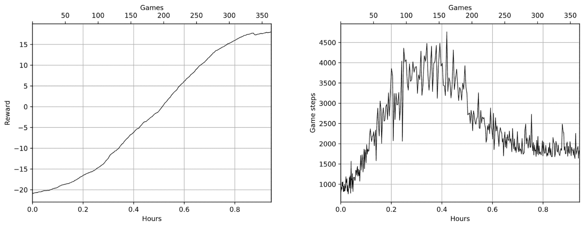

图 8.1：奖励图（左）和每回合步数图（右）


图 8.2：训练速度图（左）和平均训练损失图（右）

还值得注意的是每回合步数在训练过程中是如何变化的。最开始时，步数增加，因为我们的网络开始赢得越来越多的游戏，但在达到某个水平后，步数减少了 2 倍并几乎保持不变。这是由我们的γ参数驱动的，它会随着时间的推移折扣智能体的奖励，所以它不仅仅是尽可能多地积累奖励，还要高效地完成任务。

## 调整过的基准 DQN

在使用命令行参数--tune 30（这在一块 GPU 上花费了大约一天）运行基准 DQN 之后，我找到了以下参数，这可以在 340 回合内解决 Pong 问题（而不是 360 回合）：

```py
 learning_rate=9.932831968547505e-05, 
    gamma=0.98,
```

如你所见，学习率几乎与之前一样（10^(−4)），但γ值较低（0.98 对比 0.99）。这可能表明 Pong 有相对较短的子轨迹与动作-奖励因果关系，因此减少γ对训练有稳定作用。

在下图中，你可以看到调整过和未调整版本的奖励与每个回合步数的比较（区别非常小）：

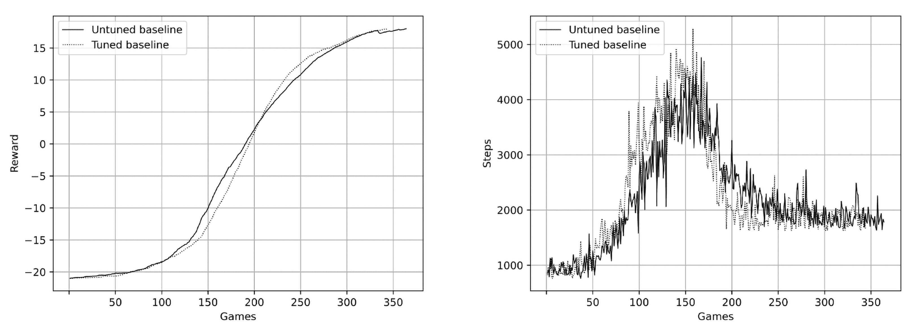

图 8.3：调整过的和未调整超参数的奖励图（左）和每回合步数图（右）

现在我们有了基准 DQN 版本，并准备探索 Hessel 等人提出的改进方法。

# N 步 DQN

我们将要实现并评估的第一个改进是一个比较老的方法。它最早由 Sutton 在论文《通过时间差分方法学习预测》[Sut88]中提出。为了理解这个方法，我们再看一遍 Q-learning 中使用的 Bellman 更新：

![π (a |s) = P[At = a|St = s] ](img/eq26.png)

这个方程是递归的，这意味着我们可以用自身来表示 Q(s[t+1],a[t+1])，从而得到这个结果：

![π (a |s) = P[At = a|St = s] ](img/eq27.png)

值 r[a,t+1]表示在时间 t + 1 时发出动作 a 后的局部奖励。然而，如果我们假设在 t + 1 步时的动作 a 是最优选择或接近最优选择，我们可以省略 max[a]操作，得到以下结果：

![π (a |s) = P[At = a|St = s] ](img/eq28.png)

这个值可以反复展开，次数不限。正如你可能猜到的，这种展开可以轻松应用到我们的 DQN 更新中，通过用更长的 n 步转移序列替换一步转移采样。为了理解为什么这种展开可以帮助我们加速训练，让我们考虑图 8.4 中的示例。这里，我们有一个简单的四状态环境（s[1]、s[2]、s[3]、s[4]），除了终止状态 s[4] 外，每个状态都有唯一可执行的动作：

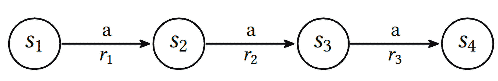

图 8.4：一个简单环境的转移图

那么，一步情况下会发生什么呢？我们总共有三个更新是可能的（我们不使用 max，因为只有一个可执行动作）：

1.  Q(s[1],a) ←r[1] + γQ(s[2],a)

1.  Q(s[2],a) ←r[2] + γQ(s[3],a)

1.  Q(s[3],a) ←r[3]

假设在训练开始时，我们按照这个顺序完成之前的更新。前两个更新将没有用，因为我们当前的 Q(s[2],a) 和 Q(s[3],a) 是不正确的，且包含初始的随机值。唯一有用的更新是更新 3，它会将奖励 r[3] 正确地分配给终止状态之前的状态 s[3]。

现在让我们一次次执行这些更新。在第二次迭代时，Q(s[2],a) 会被赋予正确的值，但 Q(s[1],a) 的更新仍然会带有噪声。直到第三次迭代，我们才会为每个 Q 获得有效的值。所以，即使是在一步情况下，也需要三步才能将正确的值传播到所有状态。

现在让我们考虑一个两步的情况。这个情况同样有三个更新：

1.  Q(s[1],a) ←r[1] + γr[2] + γ²Q(s[3],a)

1.  Q(s[2],a) ←r[2] + γr[3]

1.  Q(s[3],a) ←r[3]

在这种情况下，在第一次更新循环中，正确的值将分别分配给 Q(s[2],a) 和 Q(s[3],a)。在第二次迭代中，Q(s[1],a) 的值也将得到正确更新。因此，多步操作提高了值的传播速度，从而改善了收敛性。你可能会想，“如果这样这么有帮助，那我们不妨将 Bellman 方程展开 100 步。这样会让我们的收敛速度加快 100 倍吗？”不幸的是，答案是否定的。尽管我们有所期待，我们的 DQN 完全无法收敛。

为了理解为什么如此，我们再次回到我们的展开过程，特别是我们省略了 max[a]。这样做对吗？严格来说，答案是否定的。我们在中间步骤省略了 max 操作，假设我们在经验收集过程中（或者我们的策略）是最优的。假如不是呢？例如，在训练初期，我们的智能体是随机行为的。在这种情况下，我们计算出的 Q(s[t],a[t]) 值可能小于该状态的最优值（因为某些步骤是随机执行的，而不是通过最大化 Q 值来遵循最有希望的路径）。我们展开 Bellman 方程的步数越多，我们的更新可能就越不准确。

我们的大型经验回放缓冲区将使情况变得更糟，因为它会增加从旧的糟糕策略（由旧的糟糕 Q 近似所决定）获得过渡的机会。这将导致当前 Q 近似的错误更新，从而很容易破坏我们的训练进程。这个问题是强化学习方法的一个基本特征，正如我们在第四章简要提到的，当时我们讨论了强化学习方法的分类。

有两大类方法：

+   基于非策略的方法：第一类基于非策略的方法不依赖于“数据的新鲜度”。例如，简单的 DQN 就是基于非策略的，这意味着我们可以使用几百万步之前从环境中采样的非常旧的数据，这些数据仍然对学习有用。这是因为我们只是用即时奖励加上最佳行动价值的当前折扣近似来更新动作的价值 Q(s[t],a[t])。即使动作 a[t]是随机采样的，也无关紧要，因为对于这个特定的动作 a[t]，在状态 s[t]下，我们的更新是正确的。这就是为什么在基于非策略的方法中，我们可以使用一个非常大的经验缓冲区，使我们的数据更接近独立同分布（iid）。

+   基于策略的方法：另一方面，基于策略的方法严重依赖于根据我们正在更新的当前策略来采样的训练数据。这是因为基于策略的方法试图间接（如之前的 n 步 DQN）或直接（本书第三部分的内容完全是关于这种方法）改进当前策略。

那么，哪种方法更好呢？嗯，这取决于。基于非策略的方法允许你在先前的大量数据历史上进行训练，甚至在人工示范上进行训练，但它们通常收敛较慢。基于策略的方法通常更快，但需要更多来自环境的新鲜数据，这可能会很昂贵。试想一下，使用基于策略的方法训练一个自动驾驶汽车。在系统学会避开墙壁和树木之前，你得花费大量的撞车成本！

你可能会有一个问题：为什么我们要讨论一个 n 步 DQN，如果这个“n 步性”会使它变成一个基于策略的方法，这将使我们的大型经验缓冲区变得没用？实际上，这通常不是非黑即白的。你仍然可以使用 n 步 DQN，如果它有助于加速 DQN 的训练，但你需要在选择 n 时保持谨慎。小的值，如二或三，通常效果很好，因为我们在经验缓冲区中的轨迹与一步过渡差别不大。在这种情况下，收敛速度通常会成比例地提高，但 n 值过大可能会破坏训练过程。因此，步数应该进行调优，但加速收敛通常使得这样做是值得的。

## 实现

由于 ExperienceSourceFirstLast 类已经支持多步 Bellman 展开，因此我们的 n 步版本的 DQN 非常简单。我们只需要对基础 DQN 进行两个修改，就能将其转换为 n 步版本：

+   在 ExperienceSourceFirstLast 创建时，通过 steps_count 参数传递我们希望展开的步骤数。

+   将正确的 gamma 值传递给 calc_loss_dqn 函数。这个修改非常容易被忽视，但却可能对收敛性产生不利影响。由于我们的 Bellman 现在是 n 步的，经验链中最后一个状态的折扣系数将不再是γ，而是γ^n。

你可以在 Chapter08/02_dqn_n_steps.py 中找到整个示例，这里只展示了修改过的行：

```py
 exp_source = ptan.experience.ExperienceSourceFirstLast( 
        env, agent, gamma=params.gamma, env_seed=common.SEED, 
        steps_count=n_steps 
    )
```

n_steps 值是在命令行参数中传递的步数计数；默认使用四步。

另一个修改是在传递给 calc_loss_dqn 函数的 gamma 值：

```py
 loss_v = common.calc_loss_dqn( 
            batch, net, tgt_net.target_model, 
            gamma=params.gamma**n_steps, device=device)
```

## 结果

训练模块 Chapter08/02_dqn_n_steps.py 可以像以前一样启动，增加了命令行选项-n，表示展开 Bellman 方程的步骤数。这些是我们基线和 n 步 DQN 的图表（使用相同的参数集），其中 n 值为 2 和 3。正如你所见，Bellman 展开大大加速了收敛速度：

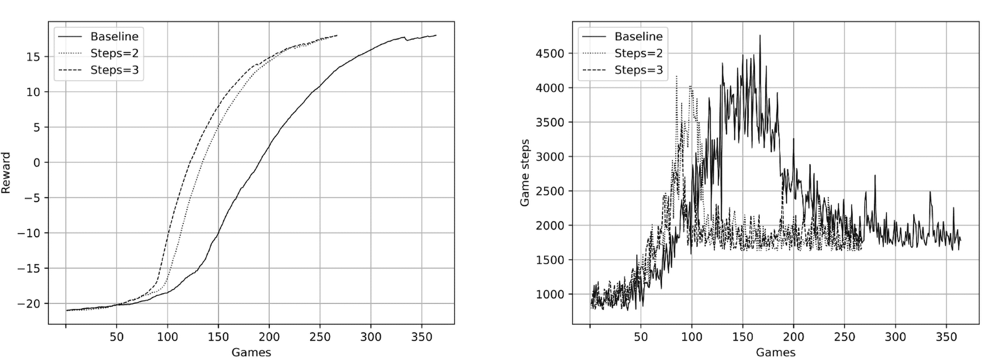

图 8.5：基本（单步）DQN 和 n 步版本的奖励和步骤数

如图所示，三步 DQN 的收敛速度显著快于简单 DQN，这是一个不错的改进。那么，n 值更大呢？图 8.6 展示了 n = 3…6 的奖励动态：

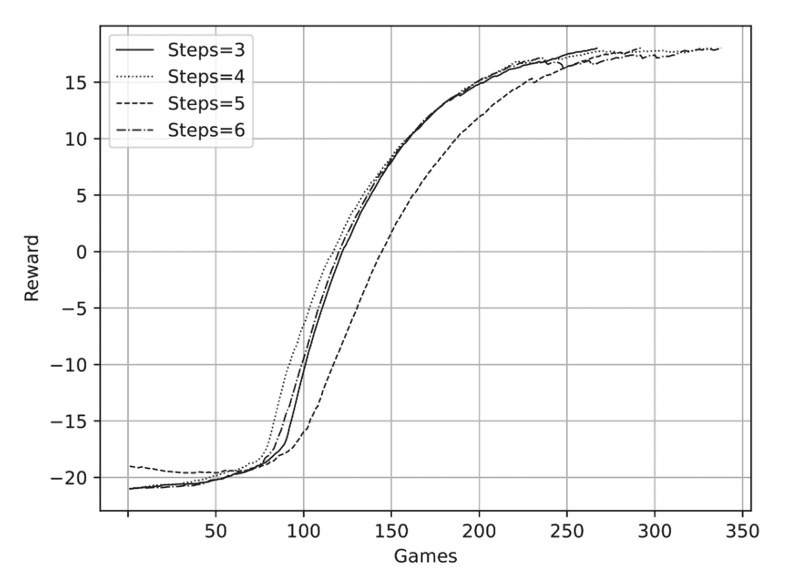

图 8.6：n = 3…6 的奖励动态，使用相同的超参数

如你所见，从三步到四步有所提升，但远不如之前的改进。n = 5 的变体表现更差，几乎与 n = 2 相当。n = 6 也是如此。所以，在我们的情况下，n = 3 看起来是最优的。

## 超参数调优

在这个扩展中，超参数调优是针对每个 n 值从 2 到 7 单独进行的。以下表格显示了最佳参数以及它们解决游戏所需的游戏次数：

| n | 学习率 | γ | 游戏次数 |
| --- | --- | --- | --- |
| 2 | 3.97 ⋅ 10^(−5) | 0.98 | 293 |
| 3 | 7.82 ⋅ 10^(−5) | 0.98 | 260 |
| 4 | 6.07 ⋅ 10^(−5) | 0.98 | 290 |
| 5 | 7.52 ⋅ 10^(−5) | 0.99 | 268 |
| 6 | 6.78 ⋅ 10^(−5) | 0.995 | 261 |
| 7 | 8.59 ⋅ 10^(−5) | 0.98 | 284 |

表 8.1：每个 n 值的最佳超参数（学习率和 gamma）

这张表格也验证了未调优版本比较的结论——对两步和三步展开 Bellman 方程可以提高收敛性，但进一步增加 n 会导致更差的结果。n = 6 的结果与 n = 3 相当，但 n = 4 和 n = 5 的结果更差，因此我们应该停在 n = 3。

图 8.7 比较了基线和 N 步 DQN 调优版本的训练动态，分别为 n = 2 和 n = 3。

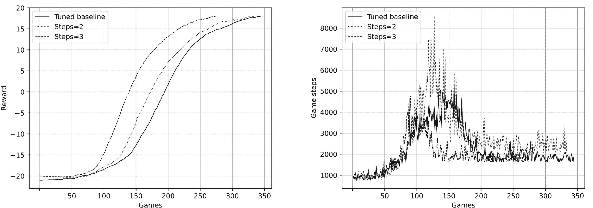

图 8.7：超参数调整后的奖励和步数

# Double DQN

如何改进基本 DQN 的下一个富有成效的想法来自 DeepMind 研究人员在标题为深度强化学习中的双重 Q 学习的论文中[VGS16]。在论文中，作者证明了基本 DQN 倾向于高估 Q 值，这可能对训练性能有害，并且有时可能导致次优策略。这背后的根本原因是 Bellman 方程中的 max 操作，但其严格证明有点复杂（您可以在论文中找到完整的解释）。作为解决这个问题的方法，作者建议稍微修改贝尔曼更新。

在基本 DQN 中，我们的 Q 的目标值看起来像这样：

![π (a |s) = P[At = a|St = s] ](img/eq29.png)

Q′(s[t+1],a) 是使用我们的目标网络计算的 Q 值，其权重每隔 n 步从训练网络复制一次。论文的作者建议选择使用训练网络为下一个状态选择动作，但从目标网络获取 Q 值。因此，目标 Q 值的新表达式如下所示：

![π (a |s) = P[At = a|St = s] ](img/eq30.png)

作者证明了这个简单的小改进完全修复了高估问题，并称这种新架构为双重 DQN。

## 实施

核心实现非常简单。我们需要做的是稍微修改我们的损失函数。但是让我们再进一步，比较基本 DQN 和双重 DQN 生成的动作值。根据论文作者的说法，我们的基线 DQN 应该对于相同状态的预测值始终较高。为了做到这一点，我们存储一组随机保留的状态，并周期性地计算评估集中每个状态的最佳动作的均值。

完整的示例位于 Chapter08/03_dqn_double.py 中。让我们先看一下损失函数：

```py
def calc_loss_double_dqn( 
        batch: tt.List[ptan.experience.ExperienceFirstLast], 
        net: nn.Module, tgt_net: nn.Module, gamma: float, device: torch.device): 
    states, actions, rewards, dones, next_states = common.unpack_batch(batch) 

    states_v = torch.as_tensor(states).to(device) 
    actions_v = torch.tensor(actions).to(device) 
    rewards_v = torch.tensor(rewards).to(device) 
    done_mask = torch.BoolTensor(dones).to(device)
```

我们将使用这个函数而不是 common.calc_loss_dqn，它们都共享大量代码。主要区别在于下一个 Q 值的估计：

```py
 actions_v = actions_v.unsqueeze(-1) 
    state_action_vals = net(states_v).gather(1, actions_v) 
    state_action_vals = state_action_vals.squeeze(-1) 
    with torch.no_grad(): 
        next_states_v = torch.as_tensor(next_states).to(device) 
        next_state_acts = net(next_states_v).max(1)[1] 
        next_state_acts = next_state_acts.unsqueeze(-1) 
        next_state_vals = tgt_net(next_states_v).gather(1, next_state_acts).squeeze(-1) 
        next_state_vals[done_mask] = 0.0 
        exp_sa_vals = next_state_vals.detach() * gamma + rewards_v 
    return nn.MSELoss()(state_action_vals, exp_sa_vals)
```

前面的代码片段以稍微不同的方式计算损失。在双重 DQN 版本中，我们使用我们的主训练网络计算下一个状态中要采取的最佳动作，但与此动作对应的值来自目标网络。

这部分可以通过将 next_states_v 与 states_v 合并，并仅调用我们的主网络一次来更快地实现，但这会使代码不太清晰。

函数的其余部分与之相同：我们遮盖已完成的剧集，并计算网络预测的 Q 值与近似 Q 值之间的均方误差（MSE）损失。

我们考虑的最后一个函数计算了我们保留状态的值：

```py
@torch.no_grad() 
def calc_values_of_states(states: np.ndarray, net: nn.Module, device: torch.device): 
    mean_vals = [] 
    for batch in np.array_split(states, 64): 
        states_v = torch.tensor(batch).to(device) 
        action_values_v = net(states_v) 
        best_action_values_v = action_values_v.max(1)[0] 
        mean_vals.append(best_action_values_v.mean().item()) 
    return np.mean(mean_vals)
```

这里并没有什么复杂的内容：我们只是将保留的状态数组划分成相等的块，并将每个块传递给网络以获得动作值。从这些值中，我们选择最大值的动作（对于每个状态），并计算这些值的平均值。由于我们的状态数组在整个训练过程中是固定的，并且这个数组足够大（在代码中，我们存储了 1,000 个状态），我们可以比较这两个 DQN 变体中的均值动态。03_dqn_double.py 文件中的其余部分几乎相同；两个不同之处是使用了我们调整过的损失函数，并且定期评估时保持了随机抽取的 1,000 个状态。这一过程发生在 process_batch 函数中：

```py
 if engine.state.iteration % EVAL_EVERY_FRAME == 0: 
            eval_states = getattr(engine.state, "eval_states", None) 
            if eval_states is None: 
                eval_states = buffer.sample(STATES_TO_EVALUATE) 
                eval_states = [ 
                    np.asarray(transition.state) 
                    for transition in eval_states 
                ] 
                eval_states = np.asarray(eval_states) 
                engine.state.eval_states = eval_states 
            engine.state.metrics["values"] = \ 
                common.calc_values_of_states(eval_states, net, device)
```

## 结果

我的实验表明，使用常见的超参数时，双重 DQN 对奖励动态有负面影响。有时，双重 DQN 会导致更好的初始动态，训练的智能体学会如何更快地赢得更多的游戏，但达到最终奖励边界需要更长时间。你可以在其他游戏上进行自己的实验，或者尝试原始论文中的参数。

以下是实验中的奖励图表，其中双重 DQN 稍微优于基线版本：

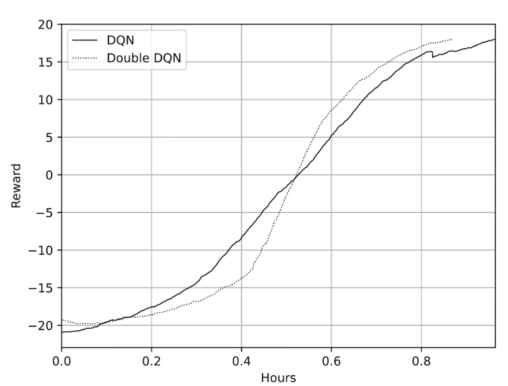

图 8.8：双重 DQN 和基线 DQN 的奖励动态

除了标准度量外，示例还输出了保留状态集的均值，这些均值显示在图 8.9 中。


图 8.9：网络预测的保留状态的值

如你所见，基本的 DQN 会高估值，因此值在达到某一水平后会下降。相比之下，双重 DQN 则增长得更加稳定。在我的实验中，双重 DQN 对训练时间的影响很小，但这并不一定意味着双重 DQN 没有用，因为 Pong 是一个简单的环境。在更复杂的游戏中，双重 DQN 可能会给出更好的结果。

## 超参数调节

对于双重 DQN，超参数调节也不是特别成功。经过 30 次实验后，学习率和 gamma 的最佳值能在 412 局游戏内解决 Pong 问题，但这比基线 DQN 更差。

# 噪声网络

下一步改进是针对另一个 RL 问题：环境探索。我们将参考的论文叫做《Noisy networks for exploration》[For+17]，它提出了一个非常简单的想法，即在训练过程中学习探索特征，而不是依赖与探索相关的独立调度。

一个经典的 DQN 通过选择随机动作来实现探索，这依赖于一个特别定义的超参数𝜖，该超参数会随着时间的推移从 1.0（完全随机动作）逐渐降低至一个较小的比率，例如 0.1 或 0.02。这个过程在简单的环境中表现良好，尤其是在游戏中没有太多非平稳性的短期回合内；但是即使是在这些简单的情况下，也需要调参来提高训练过程的效率。

在《噪声网络》论文中，作者提出了一个相当简单的解决方案，尽管如此，它仍然表现得非常有效。他们向网络的全连接层的权重中添加噪声，并在训练过程中通过反向传播调整这些噪声的参数。

这种方法不应与“网络决定在哪些地方探索更多”混淆，这是一种更加复杂的方法，并且得到了广泛的支持（例如，参见关于内在动机和基于计数的探索方法的文章[Ost+17]， [Mar+17 ]）。我们将在第二十一章讨论高级探索技术。

作者提出了两种添加噪声的方式，实验表明这两种方法都有效，但它们有不同的计算开销：

+   独立高斯噪声：对于每个全连接层的权重，我们都有一个从正态分布中抽取的随机值。噪声的参数μ和σ存储在该层内，并通过反向传播进行训练，就像训练标准线性层的权重一样。这种“噪声层”的输出计算方式与线性层相同。

+   分解高斯噪声：为了最小化需要采样的随机值数量，作者建议只保留两个随机向量：一个是输入大小，另一个是层的输出大小。然后，通过计算这两个向量的外积，创建层的随机矩阵。

## 实现

在 PyTorch 中，两种方法都可以非常直接地实现。我们需要做的是创建自定义的 nn.Linear 层，权重计算方式为 w[i,j] = μ[i,j] + σ[i,j] ⋅𝜖[i,j]，其中μ和σ是可训练参数，𝜖∼𝒩(0,1)是每次优化步骤后从正态分布中采样的随机噪声。

本书的早期版本使用了我自己实现的这两种方法，但现在我们将直接使用我在第七章提到的流行 TorchRL 库中的实现。我们来看一下实现的相关部分（完整代码可以在 TorchRL 仓库中的 torchrl/modules/models/exploration.py 中找到）。以下是 NoisyLinear 类的构造函数，它创建了我们需要优化的所有参数：

```py
class NoisyLinear(nn.Linear): 
    def __init__( 
        self, in_features: int, out_features: int, bias: bool = True, 
        device: Optional[DEVICE_TYPING] = None, dtype: Optional[torch.dtype] = None, 
        std_init: float = 0.1, 
    ): 
        nn.Module.__init__(self) 
        self.in_features = int(in_features) 
        self.out_features = int(out_features) 
        self.std_init = std_init 

        self.weight_mu = nn.Parameter( 
            torch.empty(out_features, in_features, device=device, 
                        dtype=dtype, requires_grad=True) 
        ) 
        self.weight_sigma = nn.Parameter( 
            torch.empty(out_features, in_features, device=device, 
                        dtype=dtype, requires_grad=True) 
        ) 
        self.register_buffer( 
            "weight_epsilon", 
            torch.empty(out_features, in_features, device=device, dtype=dtype), 
        ) 
        if bias: 
            self.bias_mu = nn.Parameter( 
                torch.empty(out_features, device=device, dtype=dtype, requires_grad=True) 
            ) 
            self.bias_sigma = nn.Parameter( 
                torch.empty(out_features, device=device, dtype=dtype, requires_grad=True) 
            ) 
            self.register_buffer( 
                "bias_epsilon", torch.empty(out_features, device=device, dtype=dtype), 
            ) 
        else: 
            self.bias_mu = None 
        self.reset_parameters() 
        self.reset_noise()
```

在构造函数中，我们为μ和σ创建了矩阵。此实现继承自 torch.nn.Linear，但调用了 nn.Module.__init__()方法，因此不会创建标准 Linear 权重和偏置缓冲区。

为了使新的矩阵可训练，我们需要将它们的张量包装在 nn.Parameter 中。register_buffer 方法在网络中创建一个不会在反向传播期间更新的张量，但会由 nn.Module 机制处理（例如，它会通过 cuda()调用被复制到 GPU）。为层的偏置创建了额外的参数和缓冲区。最后，我们调用 reset_parameters()和 reset_noise()方法，执行创建的可训练参数和带有 epsilon 值的缓冲区的初始化。

在以下三个方法中，我们根据论文初始化可训练参数μ和σ：

```py
 def reset_parameters(self) -> None: 
        mu_range = 1 / math.sqrt(self.in_features) 
        self.weight_mu.data.uniform_(-mu_range, mu_range) 
        self.weight_sigma.data.fill_(self.std_init / math.sqrt(self.in_features)) 
        if self.bias_mu is not None: 
            self.bias_mu.data.uniform_(-mu_range, mu_range) 
            self.bias_sigma.data.fill_(self.std_init / math.sqrt(self.out_features)) 

    def reset_noise(self) -> None: 
        epsilon_in = self._scale_noise(self.in_features) 
        epsilon_out = self._scale_noise(self.out_features) 
        self.weight_epsilon.copy_(epsilon_out.outer(epsilon_in)) 
        if self.bias_mu is not None: 
            self.bias_epsilon.copy_(epsilon_out) 

    def _scale_noise( 
            self, size: Union[int, torch.Size, Sequence]) -> torch.Tensor: 
        if isinstance(size, int): 
            size = (size,) 
        x = torch.randn(*size, device=self.weight_mu.device) 
        return x.sign().mul_(x.abs().sqrt_())
```

μ的矩阵初始化为均匀随机值。σ的初始值是常量，取决于层中神经元的数量。

对于噪声初始化，使用了因式分解高斯噪声——我们采样两个随机向量并计算外积以获得𝜖的矩阵。外积是一个线性代数操作，当两个大小相同的向量产生一个填充了每个向量元素组合乘积的方阵时就会发生。其余的很简单：我们重新定义权重和偏置属性，这些属性在 nn.Linear 层中是预期的，因此 NoisyLinear 可以在任何使用 nn.Linear 的地方使用：

```py
 @property 
    def weight(self) -> torch.Tensor: 
        if self.training: 
            return self.weight_mu + self.weight_sigma * self.weight_epsilon 
        else: 
            return self.weight_mu 

    @property 
    def bias(self) -> Optional[torch.Tensor]: 
        if self.bias_mu is not None: 
            if self.training: 
                return self.bias_mu + self.bias_sigma * self.bias_epsilon 
            else: 
                return self.bias_mu 
        else: 
            return None
```

这个实现很简单，但有一个非常微妙的细节——𝜖值在每次优化步骤后并不会更新（文档中没有提到这一点）。这个问题已经在 TorchRL 仓库中报告，但在当前稳定版本中，我们必须显式调用 reset_noise()方法。希望这个问题能得到修复，NoisyLinear 层能够自动更新噪声。

从实现角度来看，就是这样。现在我们需要做的就是将经典的 DQN 转换为噪声网络变体，只需将 nn.Linear（这是我们 DQN 网络中的最后两层）替换为 NoisyLinear 层。当然，您需要移除与 epsilon-greedy 策略相关的所有代码。

为了在训练期间检查内部噪声水平，我们可以监控噪声层的信噪比（SNR），其计算方式为 RMS(μ)∕RMS(σ)，其中 RMS 是相应权重的均方根。在我们的例子中，SNR 显示噪声层的静态成分比注入噪声大多少倍。

## 结果

训练后，TensorBoard 图表显示出更好的训练动态。模型在 250 局游戏后达到了平均得分 18，相比基准 DQN 的 350 分有所提升。但由于噪声网络需要额外的操作，它们的训练速度稍慢（194 FPS 对比基准的 240 FPS），所以在时间上，差异不那么引人注目。但仍然，结果看起来很好：

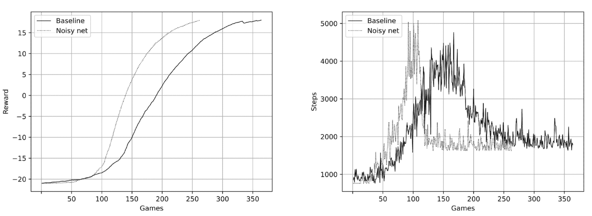

图 8.10：与基准 DQN 相比的噪声网络

在查看信噪比（SNR）图表（图 8.11）后，您可能会注意到两个层的噪声水平都迅速下降了。

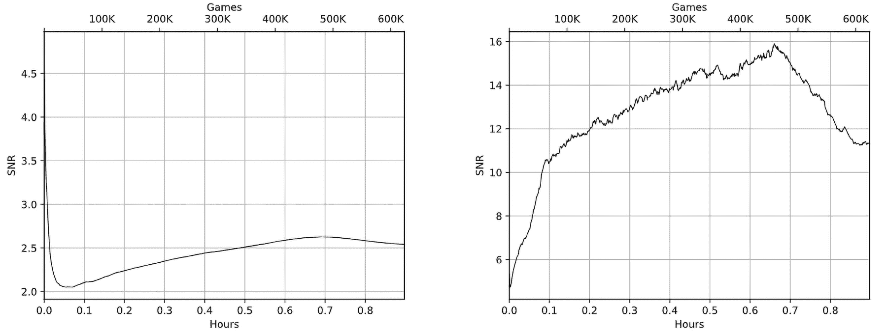

图 8.11：第 1 层（左）和第 2 层（右）的 SNR 变化

第一层的噪声比率已经从变化到接近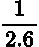。第二层更有趣，因为它的噪声水平从最初的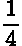降低到了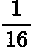，但在 450K 帧之后（大致与原始奖励接近 20 分时的时间相同），最后一层的噪声水平开始再次上升，推动代理更深入地探索环境。这是非常有意义的，因为在达到高分水平后，代理基本上已经知道如何玩得很好，但仍然需要“打磨”自己的行动，以进一步提高结果。

## 超参数调优

调优后，最佳参数集能够在 273 轮后解决游戏问题，相比基准方法有了改进：

```py
 learning_rate=7.142520950425814e-05, 
    gamma=0.99,
```

以下是调优后的基准 DQN 与调优后的噪声网络奖励动态和步数的比较图：

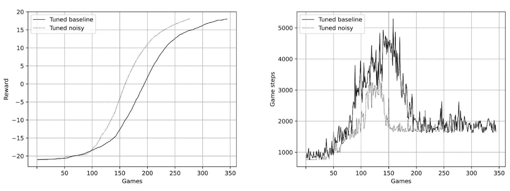

图 8.12：调优后的基准 DQN 与调优后的噪声网络比较

在两张图中，我们看到噪声网络带来的改进：达到 21 分所需的游戏次数减少，并且在训练过程中，游戏的步数减少。

# 优先级回放缓冲区

下一项关于如何改进 DQN 训练的非常有用的想法是在 2015 年提出的，出现在论文《优先经验回放》[Sch+15]中。这种方法尝试通过根据训练损失对回放缓冲区中的样本进行优先级排序，从而提高样本的效率。

基本的 DQN 使用回放缓冲区来打破我们回合中即时转移之间的相关性。正如我们在第六章讨论的那样，我们在回合中经历的示例会高度相关，因为大多数时候，环境是“平滑”的，并且根据我们的行动变化不大。然而，随机梯度下降（SGD）方法假设我们用于训练的数据具有独立同分布（iid）特性。为了解决这个问题，经典 DQN 方法使用了一个大容量的转移缓冲区，并通过随机均匀采样来获取下一个训练批次。

论文的作者质疑了这种均匀随机采样策略，并证明通过根据训练损失给缓冲区样本分配优先级，并按优先级比例采样缓冲区样本，我们可以显著提高 DQN 的收敛性和策略质量。该方法的基本思想可以用“对令你感到惊讶的数据进行更多训练”来解释。这里的关键点是保持在“异常”样本上进行训练与在缓冲区其余部分上训练之间的平衡。如果我们仅关注缓冲区的一小部分样本，可能会丧失独立同分布（i.i.d.）特性，简单地在这个子集上过拟合。

从数学角度来看，缓冲区中每个样本的优先级计算公式为 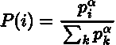，其中 p[i] 是缓冲区中第 i 个样本的优先级，α 是表示我们对优先级给予多少重视的参数。如果 α = 0，我们的采样将像经典的 DQN 方法一样变得均匀。较大的 α 值则会更加强调高优先级的样本。因此，这是另一个需要调节的超参数，论文中建议的 α 初始值为 0.6。

论文中提出了几种定义优先级的选项，其中最流行的是将其与这个特定样本在贝尔曼更新中的损失成比例。新加入缓冲区的样本需要被赋予一个最大优先级值，以确保它们能尽快被采样。

通过调整样本的优先级，我们实际上是在数据分布中引入偏差（我们比其他转换更频繁地采样某些转换），如果希望 SGD 能够有效工作，我们需要对这种偏差进行补偿。为了得到这个结果，研究的作者使用了样本权重，这些权重需要与单个样本的损失相乘。每个样本的权重值定义为 w[i] = (N ⋅P(i))^(−β)，其中 β 是另一个超参数，应该在 0 和 1 之间。

当 β = 1 时，采样引入的偏差得到了完全补偿，但作者表明，开始时将 β 设置在 0 到 1 之间，并在训练过程中逐渐增加到 1，有利于收敛。

## 实现

为了实现这个方法，我们必须在代码中做出一些特定的修改：

+   首先，我们需要一个新的重放缓冲区，它将跟踪优先级、根据优先级采样批次、计算权重，并在损失值已知后让我们更新优先级。

+   第二个变化将是损失函数本身。现在我们不仅需要为每个样本引入权重，还需要将损失值回传到重放缓冲区，以调整采样转换的优先级。

在主模块 Chapter08/05_dqn_prio_replay.py 中，我们已经实现了所有这些修改。为了简化，新的优先级重放缓冲区类使用与我们之前的重放缓冲区非常相似的存储方案。不幸的是，新的优先级要求使得无法以 𝒪(1) 时间复杂度实现采样（换句话说，采样时间将随着缓冲区大小的增加而增长）。如果我们使用简单的列表，每次采样新的一批样本时，我们需要处理所有优先级，这使得我们的采样时间复杂度与缓冲区大小成正比，达到 𝒪(N)。如果我们的缓冲区很小，比如 100k 样本，这并不是什么大问题，但对于现实中的大型缓冲区，样本数量达到数百万时，这可能成为一个问题。有其他支持在 𝒪(log N) 时间内进行高效采样的存储方案，例如，使用线段树数据结构。各种库中都有这些优化后的缓冲区版本——例如，TorchRL 中就有。

PTAN 库还提供了一个高效的优先级重放缓冲区，位于类 ptan.experience.PrioritizedReplayBuffer 中。您可以更新示例，使用更高效的版本，并检查其对训练性能的影响。

但是，现在让我们先看看朴素版本，其源代码可以在 lib/dqn_extra.py 中找到。

在开始时，我们定义了β增加率的参数：

```py
BETA_START = 0.4 
BETA_FRAMES = 100_000
```

我们的β将在前 100k 帧中从 0.4 变化到 1.0。

接下来是优先级重放缓冲区类：

```py
class PrioReplayBuffer(ExperienceReplayBuffer): 
    def __init__(self, exp_source: ExperienceSource, buf_size: int, 
                 prob_alpha: float = 0.6): 
        super().__init__(exp_source, buf_size) 
        self.experience_source_iter = iter(exp_source) 
        self.capacity = buf_size 
        self.pos = 0 
        self.buffer = [] 
        self.prob_alpha = prob_alpha 
        self.priorities = np.zeros((buf_size, ), dtype=np.float32) 
        self.beta = BETA_START
```

优先级重放缓冲区的类继承自 PTAN 中的简单重放缓冲区，该缓冲区将样本存储在一个循环缓冲区中（它允许我们保持固定数量的条目，而无需重新分配列表）。我们的子类使用 NumPy 数组来保持优先级。

需要定期调用 update_beta()方法，以根据计划增加β值。populate()方法需要从 ExperienceSource 对象中提取给定数量的转换并将其存储在缓冲区中：

```py
 def update_beta(self, idx: int) -> float: 
        v = BETA_START + idx * (1.0 - BETA_START) / BETA_FRAMES 
        self.beta = min(1.0, v) 
        return self.beta 

    def populate(self, count: int): 
        max_prio = self.priorities.max(initial=1.0) 
        for _ in range(count): 
            sample = next(self.experience_source_iter) 
            if len(self.buffer) < self.capacity: 
                self.buffer.append(sample) 
            else: 
                self.buffer[self.pos] = sample 
            self.priorities[self.pos] = max_prio 
            self.pos = (self.pos + 1) % self.capacity
```

由于我们的转换存储实现为循环缓冲区，因此我们在此缓冲区中有两种不同的情况：

+   当我们的缓冲区尚未达到最大容量时，我们只需要将新的转换追加到缓冲区中。

+   如果缓冲区已经满了，我们需要覆盖最旧的转换，该转换由 pos 类字段跟踪，并调整该位置为缓冲区大小的模。

在示例方法中，我们需要使用我们的α超参数将优先级转换为概率：

```py
 def sample(self, batch_size: int) -> tt.Tuple[ 
        tt.List[ExperienceFirstLast], np.ndarray, np.ndarray 
    ]: 
        if len(self.buffer) == self.capacity: 
            prios = self.priorities 
        else: 
            prios = self.priorities[:self.pos] 
        probs = prios ** self.prob_alpha 
        probs /= probs.sum()
```

然后，使用这些概率，我们从缓冲区中采样，以获得一批样本：

```py
 indices = np.random.choice(len(self.buffer), batch_size, p=probs) 
        samples = [self.buffer[idx] for idx in indices]
```

最后一步，我们计算批处理中样本的权重：

```py
 total = len(self.buffer) 
        weights = (total * probs[indices]) ** (-self.beta) 
        weights /= weights.max() 
        return samples, indices, np.array(weights, dtype=np.float32)
```

该函数返回三个对象：批处理、索引和权重。批处理样本的索引是更新采样项目优先级所必需的。

优先级重放缓冲区的最后一个函数允许我们更新处理过的批次的新优先级：

```py
 def update_priorities(self, batch_indices: np.ndarray, batch_priorities: np.ndarray): 
        for idx, prio in zip(batch_indices, batch_priorities): 
            self.priorities[idx] = prio
```

调用者有责任在批处理的损失计算后使用此函数。

我们示例中的下一个自定义函数是损失计算。由于 PyTorch 中的 MSELoss 类不支持权重（这是可以理解的，因为 MSE 是回归问题中使用的损失，但样本加权通常用于分类损失），我们需要计算 MSE 并显式地将结果与权重相乘：

```py
def calc_loss(batch: tt.List[ExperienceFirstLast], batch_weights: np.ndarray, 
              net: nn.Module, tgt_net: nn.Module, gamma: float, 
              device: torch.device) -> tt.Tuple[torch.Tensor, np.ndarray]: 
    states, actions, rewards, dones, next_states = common.unpack_batch(batch) 

    states_v = torch.as_tensor(states).to(device) 
    actions_v = torch.tensor(actions).to(device) 
    rewards_v = torch.tensor(rewards).to(device) 
    done_mask = torch.BoolTensor(dones).to(device) 
    batch_weights_v = torch.tensor(batch_weights).to(device) 

    actions_v = actions_v.unsqueeze(-1) 
    state_action_vals = net(states_v).gather(1, actions_v) 
    state_action_vals = state_action_vals.squeeze(-1) 
    with torch.no_grad(): 
        next_states_v = torch.as_tensor(next_states).to(device) 
        next_s_vals = tgt_net(next_states_v).max(1)[0] 
        next_s_vals[done_mask] = 0.0 
        exp_sa_vals = next_s_vals.detach() * gamma + rewards_v 
    l = (state_action_vals - exp_sa_vals) ** 2 
    losses_v = batch_weights_v * l 
    return losses_v.mean(), (losses_v + 1e-5).data.cpu().numpy()
```

在损失计算的最后部分，我们实现了相同的 MSE 损失，但显式地写出了我们的表达式，而不是使用库函数。这样可以考虑样本的权重，并为每个样本保持单独的损失值。这些值将传递给优先级重放缓冲区以更新优先级。每个损失值都会加上一个小值，以处理损失值为零的情况，这种情况会导致重放缓冲区中条目的优先级为零。

在我们程序的主要部分，只有两个更新：回放缓冲区的创建和我们的处理函数。缓冲区创建很简单，所以我们只需要看一下新的处理函数：

```py
 def process_batch(engine, batch_data): 
        batch, batch_indices, batch_weights = batch_data 
        optimizer.zero_grad() 
        loss_v, sample_prios = calc_loss( 
            batch, batch_weights, net, tgt_net.target_model, 
            gamma=params.gamma, device=device) 
        loss_v.backward() 
        optimizer.step() 
        buffer.update_priorities(batch_indices, sample_prios) 
        epsilon_tracker.frame(engine.state.iteration) 
        if engine.state.iteration % params.target_net_sync == 0: 
            tgt_net.sync() 
        return { 
            "loss": loss_v.item(), 
            "epsilon": selector.epsilon, 
            "beta": buffer.update_beta(engine.state.iteration), 
        }
```

这里有几个变化：

+   现在我们的批次包含三种实体：数据批次、采样项的索引和样本的权重。

+   我们称之为新的损失函数，它接受权重并返回额外项的优先级。这些优先级会传递给 `buffer.update_priorities()` 函数，以便重新调整我们采样的项的优先级。

+   我们调用缓冲区的 `update_beta()` 方法，根据计划改变 beta 参数。

## 结果

这个例子可以像往常一样训练。根据我的实验，优先级回放缓冲区几乎花费了相同的时间来解决环境：差不多一个小时。但它花费了更少的训练迭代和回合。因此，墙时钟时间几乎相同，主要是由于回放缓冲区效率较低，当然，这可以通过适当的 𝒪(log N) 实现来解决缓冲区的问题。

这里是基线与优先级回放缓冲区（右侧）奖励动态的比较。横坐标是游戏回合：

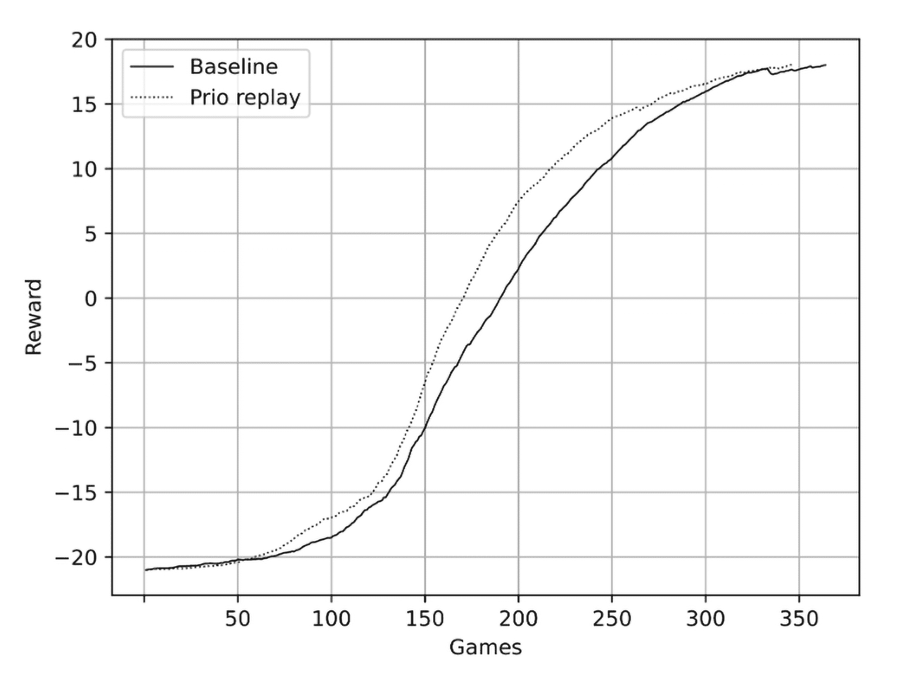

图 8.13：与基础 DQN 比较的优先级回放缓冲区奖励动态

在 TensorBoard 图表中还可以看到另一个不同之处，就是优先级回放缓冲区的损失值明显较低。以下图表展示了这一比较：

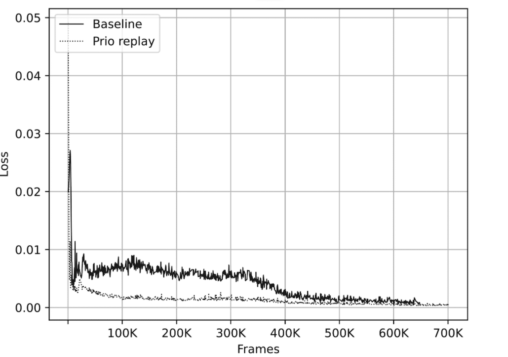

图 8.14：训练过程中损失的比较

较低的损失值也是可以预期的，并且是我们实现有效的良好迹象。优先级的核心思想是更多地训练那些损失值较高的样本，使得训练更加高效。但这里有一个风险：训练中的损失值并不是优化的主要目标；我们可以有非常低的损失值，但由于缺乏探索，最终学习到的策略可能远未达到最优。

## 超参数调优

对优先级回放缓冲区的超参数调优是通过为 α 引入一个额外的参数进行的，α 的值从 0.3 到 0.9（步长为 0.1）之间的固定列表中采样。最佳组合能够在 330 个回合后解决 Pong 问题，并且 α = 0.6（与论文中的相同）：

```py
 learning_rate=8.839010139505506e-05, 
    gamma=0.99,
```

以下是比较调整后的基线 DQN 与调整后的优先级回放缓冲区的图表：

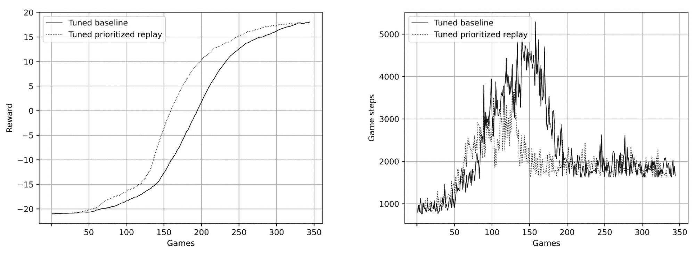

图 8.15：调整后的基线 DQN 和调整后的优先级回放缓冲区比较

在这里，我们看到优先级回放缓冲区的游戏玩法改进更快，但达到 21 分所需的游戏数量几乎相同。在右边的图表（以游戏步骤为单位）中，优先级回放缓冲区的表现也略优。

# 对抗 DQN

这一改进于 2015 年在论文《Dueling Network Architectures for Deep Reinforcement Learning》中提出 [Wan+16]。这篇论文的核心观点是，网络试图近似的 Q 值 Q(s,a) 可以分为两个部分：状态的值 V (s) 和该状态下动作的优势 A(s,a)。

你之前见过 V (s) 这一量，它是第五章中值迭代方法的核心。它等于从该状态出发可以获得的折扣预期奖励。优势 A(s,a) 旨在弥合 V (s) 和 Q(s,a) 之间的差距，因为根据定义，Q(s,a) = V (s) + A(s,a)。换句话说，优势 A(s,a) 只是增量，表示从该状态采取某一特定动作带来的额外奖励。优势可以是正值也可以是负值，通常可以具有任何大小。例如，在某个临界点，选择某一动作而非另一动作可能会让我们失去很多总奖励。

Dueling 论文的贡献在于明确区分了网络架构中的价值和优势，这带来了更好的训练稳定性、更快的收敛速度以及在 Atari 基准测试中更好的结果。与经典 DQN 网络的架构差异如下图所示。经典的 DQN 网络（上图）从卷积层提取特征，并通过全连接层将其转换为 Q 值向量，每个动作对应一个 Q 值。另一方面，Dueling DQN（下图）从卷积层提取特征，并通过两条独立的路径处理它们：一条路径负责预测 V (s)，即一个单一的数值，另一条路径预测各个动作的优势值，维度与经典情况下的 Q 值相同。之后，我们将 V (s) 加到每个 A(s,a) 的值上，从而得到 Q(s,a)，这个值像通常的 Q 值一样被使用并训练。图 8.16（来自论文）比较了基本的 DQN 和 Dueling DQN：

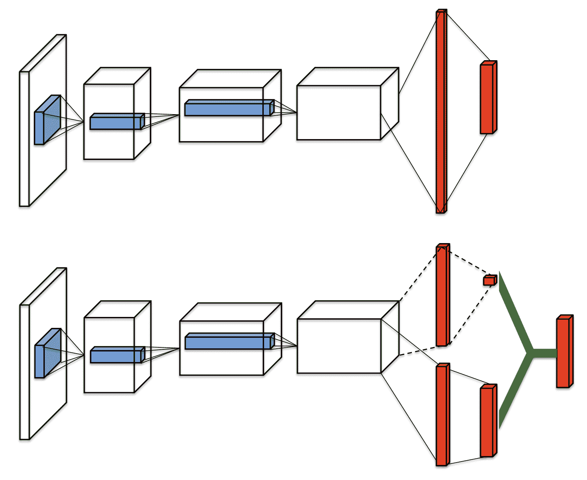

图 8.16：基本的 DQN（上图）和 Dueling 架构（下图）

这些架构的变化并不足以确保网络按我们希望的方式学习 V (s) 和 A(s,a)。例如，网络可能预测某个状态的 V (s) = 0 和 A(s) = [1,2,3,4]，这种情况是完全错误的，因为预测的 V (s) 不是该状态的期望值。我们还需要设定一个额外的约束：我们希望任何状态下优势的均值为零。在这种情况下，前述例子的正确预测应该是 V (s) = 2.5 和 A(s) = [−1.5,−0.5,0.5,1.5]。

这个约束可以通过多种方式强制执行，例如通过损失函数；但在 Dueling 论文中，作者提出了一种非常优雅的解决方案：从网络的 Q 表达式中减去优势的均值，这样可以有效地将优势的均值拉至零：

![π (a |s) = P[At = a|St = s] ](img/eq36.png)

这使得将经典 DQN 转变为双 DQN 的修改非常简单：只需要改变网络架构，而不影响实现的其他部分。

## 实现

完整的示例可以在 Chapter08/06_dqn_dueling.py 中找到。所有的改动都在网络架构中，因此这里我只展示网络类（位于 lib/dqn_extra.py 模块中）。

卷积部分与之前完全相同：

```py
class DuelingDQN(nn.Module): 
    def __init__(self, input_shape: tt.Tuple[int, ...], n_actions: int): 
        super(DuelingDQN, self).__init__() 

        self.conv = nn.Sequential( 
            nn.Conv2d(input_shape[0], 32, kernel_size=8, stride=4), 
            nn.ReLU(), 
            nn.Conv2d(32, 64, kernel_size=4, stride=2), 
            nn.ReLU(), 
            nn.Conv2d(64, 64, kernel_size=3, stride=1), 
            nn.ReLU(), 
            nn.Flatten() 
        )
```

我们没有定义一个单一的完全连接层路径，而是创建了两种不同的变换：一种用于优势，另一种用于价值预测：

```py
 size = self.conv(torch.zeros(1, *input_shape)).size()[-1] 
        self.fc_adv = nn.Sequential( 
            nn.Linear(size, 256), 
            nn.ReLU(), 
            nn.Linear(256, n_actions) 
        ) 
        self.fc_val = nn.Sequential( 
            nn.Linear(size, 256), 
            nn.ReLU(), 
            nn.Linear(256, 1) 
        )
```

此外，为了保持模型中的参数数量与原始网络相当，两条路径中的内部维度从 512 减少到 256。得益于 PyTorch 的表达能力，forward()函数中的变化也非常简单：

```py
 def forward(self, x: torch.ByteTensor): 
        adv, val = self.adv_val(x) 
        return val + (adv - adv.mean(dim=1, keepdim=True)) 

    def adv_val(self, x: torch.ByteTensor): 
        xx = x / 255.0 
        conv_out = self.conv(xx) 
        return self.fc_adv(conv_out), self.fc_val(conv_out)
```

在这里，我们计算批次样本的价值和优势并将它们加在一起，减去优势的均值以获得最终的 Q 值。一个微妙但重要的区别是在计算张量的第二维度上的均值，这会为我们批次中的每个样本生成一个均值优势的向量。

## 结果

训练一个对抗 DQN 后，我们可以将其与经典 DQN 在 Pong 基准测试中的收敛性进行比较。与基础 DQN 版本相比，对抗架构的收敛速度更快：

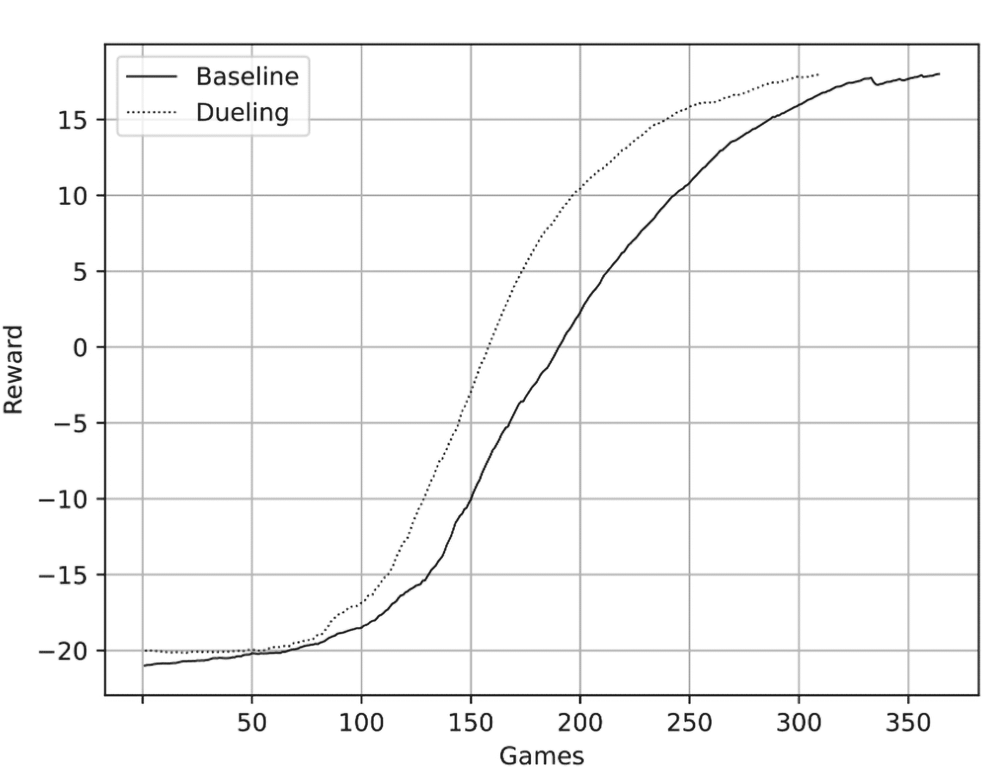

图 8.17：对抗 DQN 与基线版本的奖励动态比较

我们的示例还输出了对于一组固定状态的优势和价值，如下图所示。它们符合我们的预期：优势与零差异不大，但随着时间推移，价值在不断提高（并且类似于 Double DQN 部分中的值）：

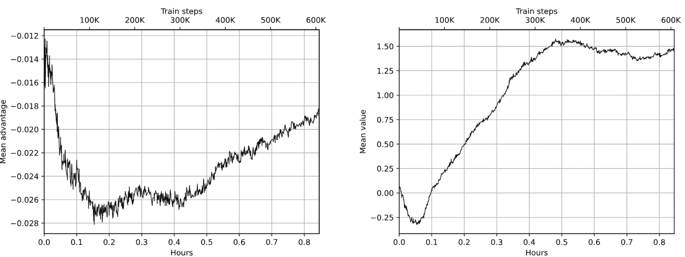

图 8.18：固定状态集上的均值优势（左）和价值（右）

## 超参数调整

超参数的调整并未带来很大收获。在 30 次调整迭代后，没有任何学习率和 gamma 的组合能够比常用参数组合更快收敛。

# 类别化 DQN

我们的 DQN 改进工具箱中的最后一种方法，也是最复杂的一种，来自 DeepMind 于 2017 年 6 月发表的论文《强化学习的分布式视角》[BDM17]。尽管这篇论文已经有几年历史，但它仍然非常相关，且这一领域的研究仍在持续进行中。2023 年出版的《分布式强化学习》一书中，作者们更详细地描述了该方法[BDR23]。

在论文中，作者质疑了 Q 学习中的基本元素——Q 值——并尝试用更通用的 Q 值概率分布来替代它们。让我们来理解这个概念。Q 学习和价值迭代方法都使用表示动作或状态的数值，展示从某个状态或某个动作和状态组合中能够获得多少总奖励。然而，将所有未来可能的奖励压缩成一个数字，实际可行吗？在复杂的环境中，未来可能是随机的，会给我们带来不同的值和不同的概率。

比如，想象一下你每天从家里开车去上班的通勤情境。大多数时候，交通不算太堵，通常你能在大约 30 分钟内到达目的地。这并不一定是准确的 30 分钟，但平均下来是 30 分钟。偶尔，也会发生一些情况，比如道路维修或事故，导致交通堵塞，你的通勤时间可能是平常的三倍。你的通勤时间的概率可以用“通勤时间”这一随机变量的分布来表示，分布如下图所示：

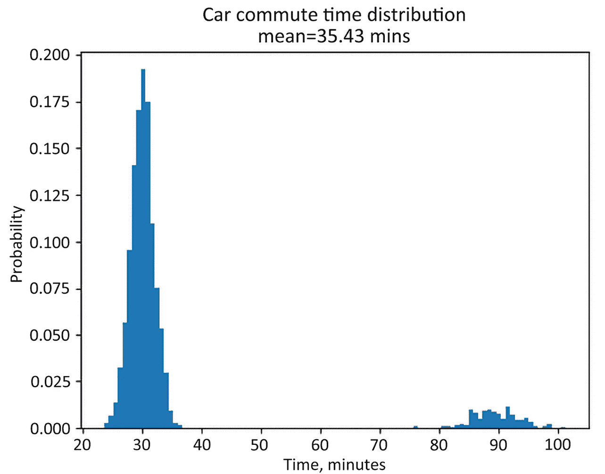

图 8.19：通勤时间的概率分布

现在，假设你有另一种上班的方式：坐火车。虽然需要稍微多花点时间，因为你需要从家里到火车站，再从火车站到办公室，但相比开车，火车更可靠（在一些国家，如德国，情况可能不同，但我们假设使用瑞士的火车作为例子）。比如说，火车的通勤时间平均是 40 分钟，偶尔会有火车延误的情况，通常会增加 20 分钟的额外时间。火车通勤时间的分布如下图所示：

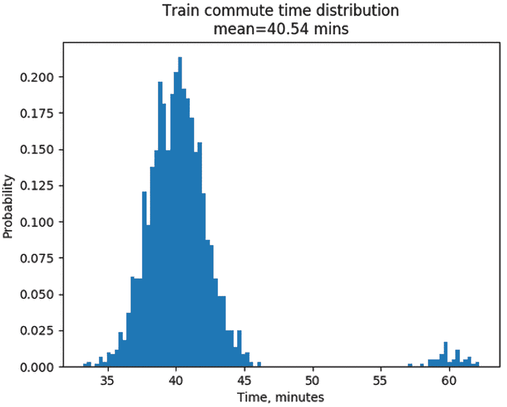

图 8.20：开车通勤时间的概率分布

假设现在我们要做出通勤方式的选择。如果我们只知道开车和火车的平均通勤时间，那么开车看起来更有吸引力，因为开车的平均通勤时间是 35.43 分钟，比火车的 40.54 分钟要短。

然而，如果我们看完整的分布图，我们可能会选择坐火车，因为即使在最坏的情况下，火车的通勤时间也只有一个小时，而开车则是一个小时 30 分钟。换成统计语言，开车的分布具有更高的方差，因此在你必须在 60 分钟内到达办公室的情况下，火车更为合适。

在马尔可夫决策过程（MDP）场景中，情况变得更加复杂，因为决策需要按顺序进行，而且每个决策可能会影响未来的情况。比如在通勤例子中，可能是你需要安排一个重要会议的时间，而这个安排可能会受到你选择的通勤方式的影响。在这种情况下，使用均值奖励值可能会丧失关于环境动态的很多信息。

完全相同的观点是由《强化学习的分布式视角》一文的作者提出的[9]。为什么我们要限制自己，试图为一个动作预测一个平均值，而忽略了其潜在值可能具有复杂的分布？也许直接处理分布会对我们有所帮助。论文中展示的结果表明，事实上，这个想法可能是有帮助的，但代价是引入了更复杂的方法。我在这里不会给出严格的数学定义，但总体思路是为每个动作预测值的分布，类似于我们汽车/火车例子中的分布。作为下一步，作者们展示了贝尔曼方程可以推广到分布的情况，并且它的形式为 Z(x,a)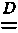R(x,a) + γZ(x′,a′)，这与我们熟悉的贝尔曼方程非常相似，但现在 Z(x,a)和 R(x,a)是概率分布，而不是单一数值。符号 AB 表示分布 A 和 B 的相等。

得到的分布可以用来训练我们的网络，以便为给定状态下的每个动作提供更好的值分布预测，方法与 Q 学习完全相同。唯一的区别在于损失函数，现在必须用适合分布比较的内容替代它。这里有几个可用的替代方法，例如，Kullback-Leibler（KL）散度（或交叉熵损失），它通常用于分类问题，或者 Wasserstein 度量。在论文中，作者为 Wasserstein 度量提供了理论依据，但在实践中尝试应用时，遇到了一些限制。所以，最终论文中使用了 KL 散度。

## 实现

如前所述，这个方法相当复杂，所以我花了一些时间来实现它并确保其正常工作。完整代码在 Chapter08/07_dqn_distrib.py 中，其中使用了 lib/dqn_extra.py 中的 distr_projection 函数来执行分布投影。在检查之前，我需要先简单说明一下实现逻辑。

方法的核心部分是我们正在逼近的概率分布。有很多方法可以表示这个分布，但论文的作者选择了一个相当通用的参数化分布，基本上是将一组固定数值均匀分布在一个数值范围上。这个数值范围应该覆盖可能的累计折扣奖励范围。在论文中，作者做了多个不同数量的原子实验，但最佳结果是在值的范围从 Vmin=-10 到 Vmax=10 中将范围划分为 N_ATOMS=51 个区间时获得的。

对于每个原子（我们有 51 个），我们的网络预测未来折扣值落在此原子范围内的概率。方法的核心部分是代码，它执行下一个状态最佳动作的分布收缩，使用 gamma，向分布中添加局部奖励，并将结果投影回到原始原子中。这个逻辑在 dqn_extra.distr_projection 函数中实现。一开始，我们分配了一个数组来保存投影结果：

```py
def distr_projection(next_distr: np.ndarray, rewards: np.ndarray, 
                     dones: np.ndarray, gamma: float): 
    batch_size = len(rewards) 
    proj_distr = np.zeros((batch_size, N_ATOMS), dtype=np.float32) 
    delta_z = (Vmax - Vmin) / (N_ATOMS - 1)
```

这个函数接受形状为(batch_size, N_ATOMS)的分布批次，奖励数组，已完成回合的标志以及我们的超参数：Vmin, Vmax, N_ATOMS 和 gamma。delta_z 变量表示我们值范围中每个原子的宽度。

在以下代码中，我们遍历原始分布中的每个原子，并计算该原子将由 Bellman 操作符投影到的位置，同时考虑我们的值范围：

```py
 for atom in range(N_ATOMS): 
        v = rewards + (Vmin + atom * delta_z) * gamma 
        tz_j = np.minimum(Vmax, np.maximum(Vmin, v))
```

例如，第一个原子，索引为 0，对应的值为 Vmin=-10，但对于奖励 +1 的样本，将投影到值 −10 ⋅ 0.99 + 1 = −8.9。换句话说，它将向右移动（假设 gamma=0.99）。如果该值超出了由 Vmin 和 Vmax 给出的值范围，我们会将其裁剪到边界内。

在下一行，我们计算样本投影到的原子编号：

```py
 b_j = (tz_j - Vmin) / delta_z
```

当然，样本可以投影到原子之间。在这种情况下，我们将源原子中的值分配到其之间的两个原子中。这个分配需要小心处理，因为目标原子可能恰好落在某个原子的位置。在这种情况下，我们只需要将源分布值添加到目标原子。

以下代码处理当投影原子正好落在目标原子上的情况。否则，b_j 将不是整数值，变量 l 和 u（分别对应投影点下方和上方的原子索引）：

```py
 l = np.floor(b_j).astype(np.int64) 
        u = np.ceil(b_j).astype(np.int64) 
        eq_mask = u == l 
        proj_distr[eq_mask, l[eq_mask]] += next_distr[eq_mask, atom]
```

当投影点落在原子之间时，我们需要将源原子的概率分配到下方和上方的原子之间。这通过以下代码中的两行来实现：

```py
 ne_mask = u != l 
        proj_distr[ne_mask, l[ne_mask]] += next_distr[ne_mask, atom] * (u - b_j)[ne_mask] 
        proj_distr[ne_mask, u[ne_mask]] += next_distr[ne_mask, atom] * (b_j - l)[ne_mask]
```

当然，我们需要正确处理回合的最终过渡。在这种情况下，我们的投影不应考虑下一个分布，而应仅具有与获得的奖励对应的 1 的概率。

然而，我们需要再次考虑原子，并在奖励值落在原子之间时，正确地分配概率。此情况由以下代码分支处理，该分支会为已设置“done”标志的样本将结果分布归零，然后计算最终的投影结果：

```py
 if dones.any(): 
        proj_distr[dones] = 0.0 
        tz_j = np.minimum(Vmax, np.maximum(Vmin, rewards[dones])) 
        b_j = (tz_j - Vmin) / delta_z 
        l = np.floor(b_j).astype(np.int64) 
        u = np.ceil(b_j).astype(np.int64) 
        eq_mask = u == l 
        eq_dones = dones.copy() 
        eq_dones[dones] = eq_mask 
        if eq_dones.any(): 
            proj_distr[eq_dones, l[eq_mask]] = 1.0 
        ne_mask = u != l 
        ne_dones = dones.copy() 
        ne_dones[dones] = ne_mask 
        if ne_dones.any(): 
            proj_distr[ne_dones, l[ne_mask]] = (u - b_j)[ne_mask] 
            proj_distr[ne_dones, u[ne_mask]] = (b_j - l)[ne_mask] 
    return proj_distr
```

为了给你演示这个函数的作用，让我们看一下通过该函数处理的人工制作的分布图（图表 8.21）。我用它们来调试函数并确保其按预期工作。这些检查的代码在 Chapter08/adhoc/distr_test.py 中。

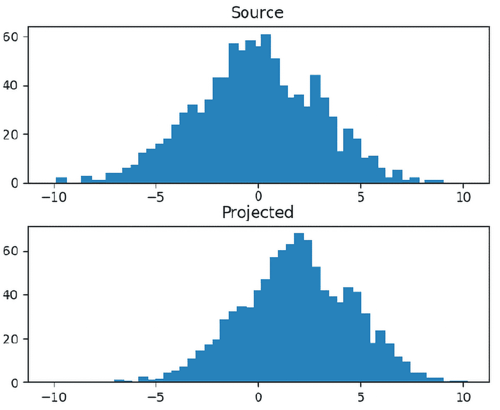

图表 8.21：应用于正态分布的概率分布变换的样本

图表顶部的 8.21（名为源）是一个正态分布，其中μ = 0，σ = 3。第二张图（名为投影）是从分布投影得到的，γ = 0.9，并且向右偏移，reward=2。

在我们传递 done=True 的情况下，使用相同数据，结果将会有所不同，并显示在图表 8.22 中。在这种情况下，源分布将被完全忽略，结果将只有预期奖励。

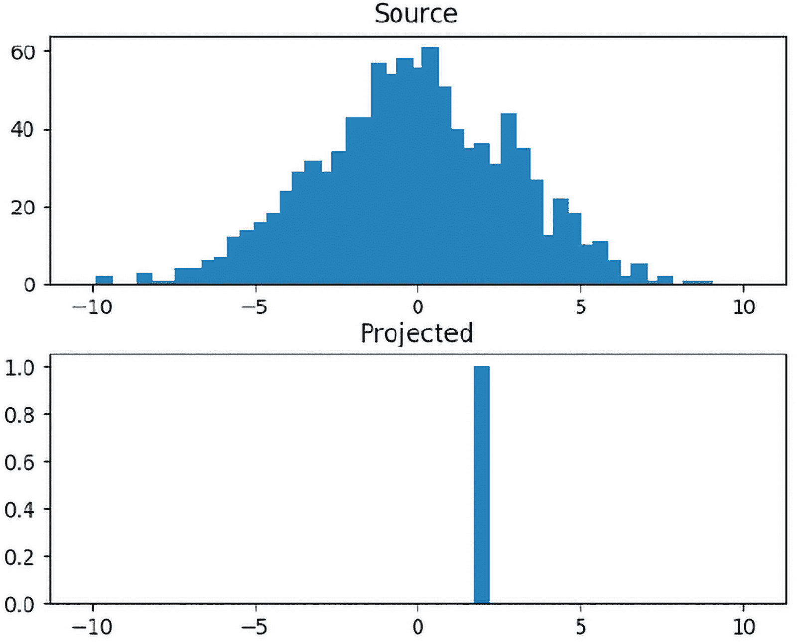

图表 8.22：在剧集最后一步的分布投影

该方法的实现位于 Chapter08/07_dqn_distrib.py 中，它具有一个可选的命令行参数--img-path。如果给出此选项，它必须是一个目录，在训练期间将以固定状态的概率分布存储图像。这对于监视模型如何从开始的均匀概率收敛到更多尖峰概率质量很有用。我的实验中的示例图像显示在图表 8.24 和图表 8.25 中。

我这里只展示实现的基本部分。方法的核心部分，distr_projection 函数已经覆盖过了，它是最复杂的部分。现在缺失的是网络架构和修改的损失函数，我们将在这里描述它们。

让我们从网络开始，该网络位于 lib/dqn_extra.py 中，在 DistributionalDQN 类中：

```py
Vmax = 10 
Vmin = -10 
N_ATOMS = 51 
DELTA_Z = (Vmax - Vmin) / (N_ATOMS - 1) 

class DistributionalDQN(nn.Module): 
    def __init__(self, input_shape: tt.Tuple[int, ...], n_actions: int): 
        super(DistributionalDQN, self).__init__() 

        self.conv = nn.Sequential( 
            nn.Conv2d(input_shape[0], 32, kernel_size=8, stride=4), 
            nn.ReLU(), 
            nn.Conv2d(32, 64, kernel_size=4, stride=2), 
            nn.ReLU(), 
            nn.Conv2d(64, 64, kernel_size=3, stride=1), 
            nn.ReLU(), 
            nn.Flatten() 
        ) 
        size = self.conv(torch.zeros(1, *input_shape)).size()[-1] 
        self.fc = nn.Sequential( 
            nn.Linear(size, 512), 
            nn.ReLU(), 
            nn.Linear(512, n_actions * N_ATOMS) 
        ) 

        sups = torch.arange(Vmin, Vmax + DELTA_Z, DELTA_Z) 
        self.register_buffer("supports", sups) 
        self.softmax = nn.Softmax(dim=1)
```

主要区别在于全连接层的输出。现在它输出 n_actions * N_ATOMS 值的向量，即 6×51 = 306 对于 Pong。对于每个动作，它需要预测 51 个原子上的概率分布。每个原子（称为支持）具有一个值，该值对应于特定的奖励。这些原子的奖励均匀分布在-10 到 10 之间，这给出了步长为 0.4 的网格。这些支持存储在网络的缓冲区中。

forward()方法将预测的概率分布作为 3D 张量（批次，动作和支持）返回：

```py
 def forward(self, x: torch.ByteTensor) -> torch.Tensor: 
        batch_size = x.size()[0] 
        xx = x / 255 
        fc_out = self.fc(self.conv(xx)) 
        return fc_out.view(batch_size, -1, N_ATOMS) 

    def both(self, x: torch.ByteTensor) -> tt.Tuple[torch.Tensor, torch.Tensor]: 
        cat_out = self(x) 
        probs = self.apply_softmax(cat_out) 
        weights = probs * self.supports 
        res = weights.sum(dim=2) 
        return cat_out, res
```

除了 forward()，我们还定义了 both()方法，它一次计算原子和 Q 值的概率分布。

网络还定义了几个辅助函数，以简化 Q 值的计算并在概率分布上应用 softmax：

```py
 def qvals(self, x: torch.ByteTensor) -> torch.Tensor: 
        return self.both(x)[1] 

    def apply_softmax(self, t: torch.Tensor) -> torch.Tensor: 
        return self.softmax(t.view(-1, N_ATOMS)).view(t.size())
```

最后的变化是新的损失函数，它必须应用分布投影，而不是贝尔曼方程，并计算预测分布与投影分布之间的 KL 散度：

```py
def calc_loss(batch: tt.List[ExperienceFirstLast], net: dqn_extra.DistributionalDQN, 
              tgt_net: dqn_extra.DistributionalDQN, gamma: float, 
              device: torch.device) -> torch.Tensor: 
    states, actions, rewards, dones, next_states = common.unpack_batch(batch) 
    batch_size = len(batch) 

    states_v = torch.as_tensor(states).to(device) 
    actions_v = torch.tensor(actions).to(device) 
    next_states_v = torch.as_tensor(next_states).to(device) 

    # next state distribution 
    next_distr_v, next_qvals_v = tgt_net.both(next_states_v) 
    next_acts = next_qvals_v.max(1)[1].data.cpu().numpy() 
    next_distr = tgt_net.apply_softmax(next_distr_v) 
    next_distr = next_distr.data.cpu().numpy() 

    next_best_distr = next_distr[range(batch_size), next_acts] 
    proj_distr = dqn_extra.distr_projection(next_best_distr, rewards, dones, gamma) 

    distr_v = net(states_v) 
    sa_vals = distr_v[range(batch_size), actions_v.data] 
    state_log_sm_v = F.log_softmax(sa_vals, dim=1) 
    proj_distr_v = torch.tensor(proj_distr).to(device) 

    loss_v = -state_log_sm_v * proj_distr_v 
    return loss_v.sum(dim=1).mean()
```

上面的代码并不复杂；它只是准备调用 distr_projection 和 KL 散度，定义如下：

![π (a |s) = P[At = a|St = s] ](img/eq38.png)

为了计算概率的对数，我们使用 PyTorch 的 log_softmax 函数，它以数值稳定的方式将对数和 softmax 结合在一起。

## 结果

根据我的实验，分布式版本的 DQN 收敛速度稍慢且不太稳定，低于原始的 DQN，这并不令人惊讶，因为网络输出现在大了 51 倍，且损失函数发生了变化。如果没有进行超参数调优（将在下一小节中描述），分布式版本需要多 20% 的回合数才能解决游戏。

另一个可能重要的因素是，Pong 游戏太简单，难以得出结论。在《A Distributional Perspective》一文中，作者报告了当时（2017 年出版）大部分 Atari 基准游戏的最先进得分（Pong 并不在其中）。

以下是比较分布式 DQN 奖励动态和损失的图表。正如你所看到的，分布式方法的奖励动态比基准 DQN 差：


图 8.23：奖励动态（左）和损失下降（右）

可能有趣的是，观察训练过程中概率分布的动态。如果你使用`--img-path`参数（提供目录名）开始训练，训练过程将会保存一个固定状态集的概率分布图。例如，以下图示展示了训练开始时（经过 30k 帧）一个状态下所有六个动作的概率分布：

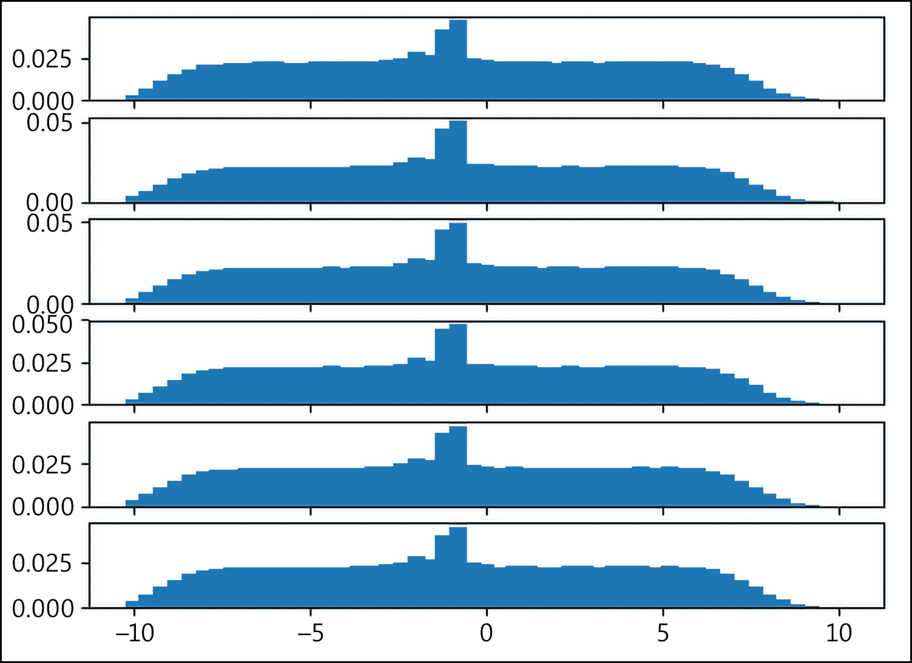

图 8.24：训练开始时的概率分布

所有的分布都很宽（因为网络还未收敛），中间的峰值对应于网络期望从其动作中获得的负奖励。经过 500k 帧训练后的相同状态如下图所示：

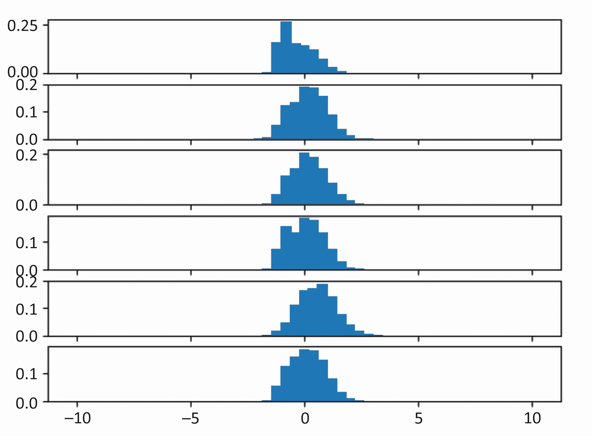

图 8.25：训练网络产生的概率分布

现在我们可以看到，不同的动作有不同的分布。第一个动作（对应于 NOOP，即不做任何动作）其分布向左偏移，因此在该状态下通常什么也不做会导致失败。第五个动作，即 RIGHTFIRE，其均值向右偏移，因此这个动作会带来更好的得分。

## 超参数调优

超参数调优的效果并不显著。经过 30 次调优迭代后，没有任何学习率和 gamma 的组合能够比常规的参数集更快地收敛。

# 综合所有内容

你现在已经看到了论文《Rainbow: Combining Improvements in Deep Reinforcement Learning》中提到的所有 DQN 改进，但这些改进是以递增方式完成的，（我希望）这种方式有助于理解每个改进的思路和实现。论文的主要内容是将这些改进结合起来并检查结果。在最终的示例中，我决定将类别 DQN 和双重 DQN 从最终系统中排除，因为它们在我们的试验环境中并未带来太大的改进。如果你愿意，你可以将它们添加进来并尝试使用不同的游戏。完整的示例代码可以在 Chapter08/08_dqn_rainbow.py 中找到。

首先，我们需要定义我们的网络架构以及为其做出贡献的方法：

+   对抗 DQN：我们的网络将有两个独立的路径，一个用于状态分布的价值，另一个用于优势分布。在输出端，这两个路径将相加，从而提供动作的最终价值概率分布。为了强制优势分布具有零均值，我们将在每个原子中减去具有均值优势的分布。

+   噪声网络：我们在价值和优势路径中的线性层将是 nn.Linear 的噪声变体。

除了网络架构的变化，我们还将使用优先回放缓冲区来保持环境转移，并按比例从 MSE 损失中采样。

最后，我们将展开 Bellman 方程，使用 n 步法。

我不打算重复所有的代码，因为前面的章节已经给出了各个方法，而且结合这些方法的最终结果应该是显而易见的。如果你遇到任何问题，可以在 GitHub 上找到代码。

## 结果

以下是与基准 DQN 比较的平滑奖励和步骤计数图表。在这两者中，我们都可以看到游戏数量方面的显著改善：

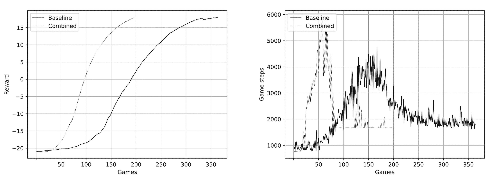

图 8.26：基准 DQN 与组合系统的比较

除了平均奖励，值得检查一下原始奖励图表，结果比平滑奖励更为戏剧化。它显示我们的系统能够非常迅速地从负面结果跳跃到正面——仅仅经过 100 场游戏，它几乎赢得了每一场比赛。因此，我们又花了 100 场比赛才使平滑奖励达到 +18：

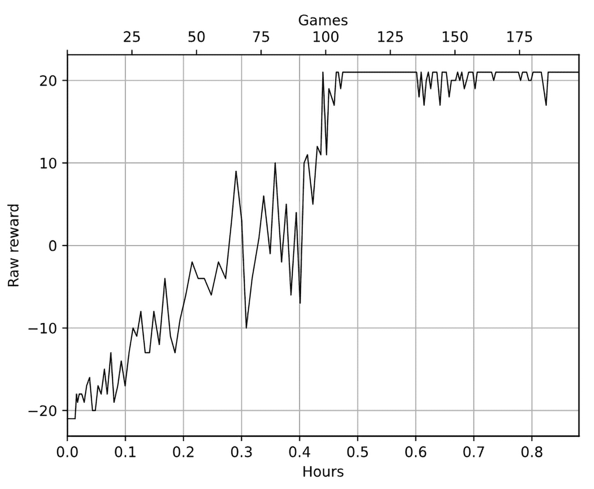

图 8.27：组合系统的原始奖励

作为一个缺点，组合系统的速度比基准系统慢，因为我们采用了更复杂的神经网络架构和优先回放缓冲区。FPS 图表显示，组合系统从 170 FPS 开始，因𝒪(n)缓冲区复杂性而降至 130 FPS：

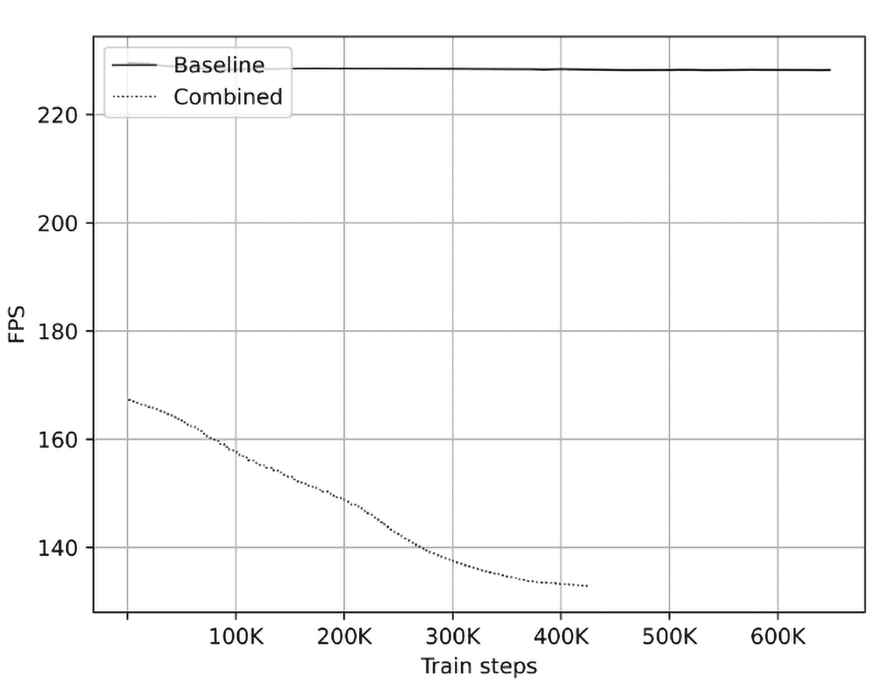

图 8.28：性能比较（以每秒帧数计）

## 超参数调优

调优仍然像之前那样进行，且在“解决游戏前玩过的游戏数”方面，能够进一步提升组合系统的训练效果。以下是调优后的基线 DQN 与调优后的组合系统的比较图表：

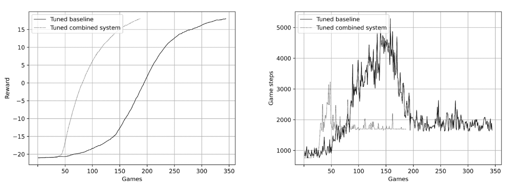

图 8.29：已调优基线 DQN 与已调优组合系统的对比

另一个显示调优效果的图表是对比调优前后的原始游戏奖励。调优后的系统开始在 40 局游戏后就获得最高分，这非常令人印象深刻：

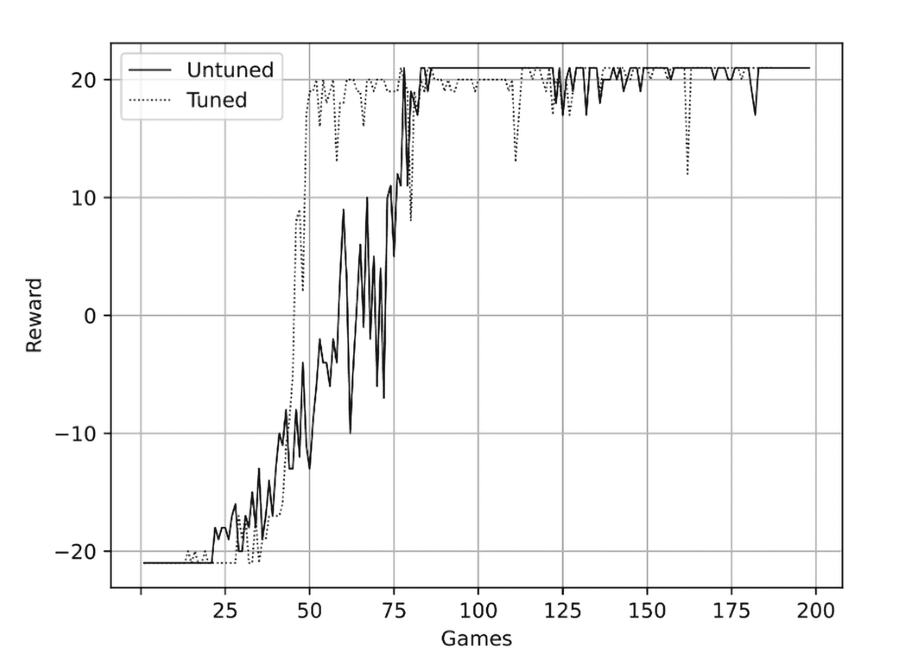

图 8.30：未调优和已调优组合 DQN 的原始奖励

# 总结

在本章中，我们回顾并实现了自 2015 年首次发布 DQN 论文以来，研究人员发现的许多 DQN 改进。这份清单远未完整。首先，关于方法列表，我使用了 DeepMind 发布的论文《Rainbow：结合深度强化学习的改进》[Hes+18]，因此方法列表无疑偏向于 DeepMind 的论文。其次，强化学习如今发展非常迅速，几乎每天都有新论文发布，即使我们只局限于一种强化学习模型，比如 DQN，也很难跟上进展。本章的目标是让你了解该领域已经发展出的一些不同的实际方法。

在下一章中，我们将继续从工程角度讨论 DQN 的实际应用，谈论如何在不触及底层方法的情况下提升 DQN 的性能。

# 加入我们的 Discord 社区

与其他用户、深度学习专家以及作者本人一起阅读本书。提问、为其他读者提供解决方案，通过“问我任何问题”环节与作者聊天，更多内容尽在其中。扫描二维码或访问链接加入社区。[`packt.link/rl`](https://packt.link/rl)


