# 第九章：加速强化学习（RL）的方法

在第八章中，你看到了一些实用的技巧，可以使深度 Q 网络（DQN）方法更加稳定并加速收敛。它们涉及基本的 DQN 方法修改（例如向网络注入噪声或展开 Bellman 方程）来获得更好的策略，同时减少训练所需的时间。但在本章中，我们将探索另一种方法：调整方法的实现细节，以提高训练速度。这是一种纯粹的工程方法，但它同样重要，因为在实践中非常有用。

在本章中，我们将：

+   取用上一章中的 Pong 环境，并尽量以最快速度解决它

+   以逐步的方式，使用完全相同的商品硬件将 Pong 游戏的解决速度提高近 2 倍

# 为什么速度很重要

首先，我们来谈谈为什么速度如此重要，为什么我们要优化它。也许并不明显，但过去二十年里硬件性能有了巨大的提升。近二十年前，我曾参与一个项目，专注于为一个航空发动机设计公司构建一个用于计算流体力学（CFD）仿真的超级计算机。该系统由 64 台服务器组成，占据了三组 42 英寸的机架，并且需要专门的冷却和电力子系统。仅硬件部分（不包括冷却）就花费了大约 100 万美元。

在 2005 年，这台超级计算机在前苏联超级计算机中排名第四，是业内安装的最快系统。它的理论性能为 922 GFLOPS（几乎每秒一万亿次浮点运算），但与 12 年后发布的 GTX 1080 Ti 相比，这堆铁块的所有能力看起来显得微不足道。

一块单独的 GTX 1080 Ti 能够执行 11,340 GFLOPS，性能是 2005 年的超级计算机的 12.3 倍。而且它发布时，每个 GPU 的价格仅为 $700！如果我们按每花费 $1 的计算能力来算，那么每个 GFLOP 的价格下降了超过 17,500 倍。这个数字在最新的（撰写时）H100 GPU 上更为惊人，H100 提供了 134 teraflops 的性能（使用 FP32 操作）。

许多人多次提到，人工智能（AI）的进步（以及机器学习（ML）的一般进展）是由数据可用性和计算能力的提升所推动的，我认为这绝对是正确的。想象一下，一些计算在一台机器上需要一个月才能完成（这在计算流体力学（CFD）和其他物理仿真中非常常见）。如果我们能将速度提高五倍，那么原本需要耐心等待一个月的时间将缩短为六天。提高 100 倍的速度意味着这个一个月的计算将只需要八小时完成，那么你一天之内就能完成三次计算！如今，只花相同的钱就能获得 20,000 倍的计算能力，真是太酷了。顺便提一下，速度提高 20,000 倍意味着我们原本需要一个月的计算问题只需要两到三分钟就能完成！

这种情况不仅发生在“巨型计算机”（也称为高性能计算）领域；基本上，它无处不在。现代微控制器的性能特点已经与我们 15 年前使用的桌面计算机相当（例如，你可以花 50 美元打造一台便携计算机，配备运行 120 MHz 的 32 位微控制器，能够运行 Atari 2600 模拟器：[`hackaday.io/project/80627-badge-for-hackaday-conference-2018-in-belgrade`](https://hackaday.io/project/80627-badge-for-hackaday-conference-2018-in-belgrade)） 。我甚至没有提到现代智能手机，它们通常配有四到八个核心、图形处理单元（GPU）以及数 GB 的内存。

当然，那里有很多复杂的因素。这不仅仅是将十年前用过的相同代码现在神奇地让它运行得快上几千倍。可能正好相反：你甚至可能完全无法运行它，因为库、操作系统接口以及其他因素的变化。（你是否曾尝试读取十年前写入的 CD-RW 磁盘？）如今，要充分发挥现代硬件的能力，你需要将代码并行化，这意味着你必须处理大量关于分布式系统、数据局部性、通信以及硬件和库内部特性的细节。高级库尽力隐藏这些复杂性，但如果你想高效地使用这些库，就无法忽视这些问题。然而，这绝对是值得的——记住，一整个月的耐心等待可以缩短为三分钟。另一方面，为什么我们要加速操作，可能并不完全明显。毕竟，一个月并不算太长；只需将计算机锁在服务器室，然后去度个假！但请想一下准备和使这个计算过程正常运行的整个过程。你可能已经注意到，即使是简单的机器学习问题，初次尝试时也几乎不可能做到完美实现。

它们需要多次试运行，才能找到合适的超参数并修复所有的错误和代码，准备好进行干净的发布。在物理仿真、强化学习研究、大数据处理和编程领域，确实存在完全相同的过程。因此，如果我们能够让某个程序运行得更快，它不仅对单次运行有利，还能让我们快速迭代，进行更多的实验，这可能显著加速整个过程，并提高最终结果的质量。

我记得职业生涯中有一个情境，当时我们在部门内部部署了一个 Hadoop 集群，我们当时正在开发一个网页搜索引擎（类似 Google，但用于俄罗斯网站）。在部署之前，即使是进行简单的数据实验，也需要几个星期的时间。几 TB 的数据分布在不同的服务器上；你需要在每台机器上运行多次代码，收集和合并中间结果，处理偶尔发生的硬件故障，并完成许多与问题无关的手动任务。将 Hadoop 平台集成到数据处理后，实验所需的时间减少到了几个小时，这完全改变了游戏规则。从那时起，开发人员能够更轻松、更快速地进行更多实验，而不必为不必要的细节烦恼。实验的数量（以及进行实验的意愿）显著增加，这也提高了最终产品的质量。

另一个支持优化的理由是我们可以处理的问题的规模。让某种方法运行得更快可能意味着两件事：我们可以更快得到结果，或者我们可以增加问题的规模（或其他衡量问题复杂性的标准）。复杂性增加在不同情况下可能有不同的含义，比如得到更准确的结果，减少对现实世界的简化，或者考虑更多的数据，但几乎总是，这是好事。

回到本书的主题，让我们概述一下强化学习方法如何通过加速来受益。首先，即使是最先进的强化学习方法也不是非常高效，这意味着训练需要多次与环境进行交互（在雅达利的情况下是数百万次），才能学到一个好的策略，这可能需要几周的训练。如果我们能加速这个过程，我们就可以更快地得到结果，进行更多的实验，并找到更好的超参数。除此之外，如果我们的代码更快，我们甚至可以增加应用这些方法时问题的复杂性。

在现代强化学习（RL）中，雅达利游戏被认为已经解决；即使是所谓的“困难探索游戏”，如《蒙特祖玛的复仇》，也可以被训练到超人类的准确度。因此，新的研究前沿需要更复杂的问题，具有更丰富的观察和行动空间，这必然需要更多的训练时间和硬件。这样的研究已经由 DeepMind 和 OpenAI 开始（从我的角度来看，这也增加了问题的复杂性，可能有点过头了），他们从雅达利转向了更具挑战性的问题，如蛋白质折叠（AlphaFold 系统）和大型语言模型（LLMs）。这些问题需要成千上万的 GPU 并行工作。

我想以一个小小的警告结束这段介绍：所有的性能优化只有在核心方法正常工作的情况下才有意义（这在强化学习和机器学习的情况下并不总是显而易见）。正如一位在线课程的讲师所说：“有一个慢而正确的程序，比一个快但不正确的程序要好得多。”

# 基准线

在本章中，我们将使用你已经熟悉的 Atari Pong 环境，并尝试加速其收敛速度。作为基准，我们将使用第八章中使用的相同简单 DQN，超参数也将保持一致。为了比较我们改动的效果，我们将使用两个特征：

+   每秒钟我们从环境中消耗的帧数（FPS）。这表示我们在训练过程中与环境的交互速度。在强化学习的文献中，通常会标明智能体在训练过程中观察到的帧数，正常的数字范围是 2500 万到 5000 万帧。因此，如果我们的 FPS=200，那么需要的时间为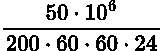 ≈ 2.89 天。在这种计算中，需要考虑到强化学习文献通常报告的是原始环境帧数。但如果使用了帧跳跃（几乎总是使用），则帧数需要除以这个因子，通常是 4。在我们的测量中，我们计算的是智能体与环境的交互帧数，因此“原始环境 FPS”将是其四倍。

+   游戏解决之前的墙钟时间。当最后 100 个回合的平滑奖励达到 18 时，我们停止训练（Pong 游戏的最高分是 21）。这个边界值可以提高，但通常 18 已经是一个很好的指标，表明智能体几乎掌握了游戏，进一步精炼策略仅仅是训练时间的问题。我们检查墙钟时间，因为单纯的 FPS 并不是训练加速的最佳指标。

由于我们在代码中进行的操作，我们可以获得非常高的 FPS，但收敛可能会受到影响。仅凭这个数值也不能作为我们改进效果的可靠指标，因为训练过程是随机的。即使指定了随机种子（我们需要明确设置 PyTorch、Gym 和 NumPy 的种子），并行化（在后续步骤中会使用）也会为过程增加随机性，几乎无法避免。所以，我们能做的最好的是多次运行基准测试并取平均值。但单次运行的结果不能作为决策的依据。

由于上述提到的随机性，本章中的所有图表都是通过对同一实验的 5 次运行结果进行平均得到的。所有基准测试都使用相同的机器，配置为 Intel i5-7600K CPU、GTX 1080 Ti GPU，CUDA 版本 12.3，以及 NVIDIA 驱动版本 545.29.06。

我们的第一个基准将是基线版本，位于 Chapter09/01_baseline.py。我这里不提供源代码，因为它已经在前一章中给出，并且在此与前面相同。在训练过程中，代码会向 TensorBoard 写入几个指标：

+   reward: 来自剧集的原始未折扣奖励；x 轴是剧集的编号。

+   avg_reward: 与奖励相同，但通过使用 α = 0.98 的滑动平均进行平滑处理。

+   steps: 剧集持续的步数。通常，在开始时，代理会迅速失败，所以每个剧集大约有 1,000 步。然后，代理学会了更好的行为，所以步数增加到 3,000–4,000，并且奖励也增加；但是，最终，当代理掌握了游戏时，步数会降回到 2,000 步，因为策略被优化到尽可能快地获胜（由于折扣因子 γ）。事实上，这种剧集长度的下降可能表明过拟合了环境，这在强化学习中是一个巨大的问题。然而，处理这个问题超出了我们实验的范围。

+   loss: 训练中的损失，每 100 次迭代采样一次。它应该在 2⋅10^(−3)…1⋅10^(−2) 之间，偶尔会有增加，当代理发现新的行为时，导致奖励与 Q 值学习的奖励不同。

+   avg_loss: 损失的平滑版本。

+   epsilon: 当前 𝜖 的值——采取随机行动的概率。

+   avg_fps: 代理与环境通信的速度（每秒观察数），通过滑动平均进行平滑处理。

在图 9.1 和图 9.2 中，图表是从 5 次基线运行中平均得出的。如之前所示，每个图表都绘制了两个 x 轴：底部是小时为单位的墙钟时间，上面是步数（图 9.1 中为剧集数，图 9.2 中为训练迭代次数）：

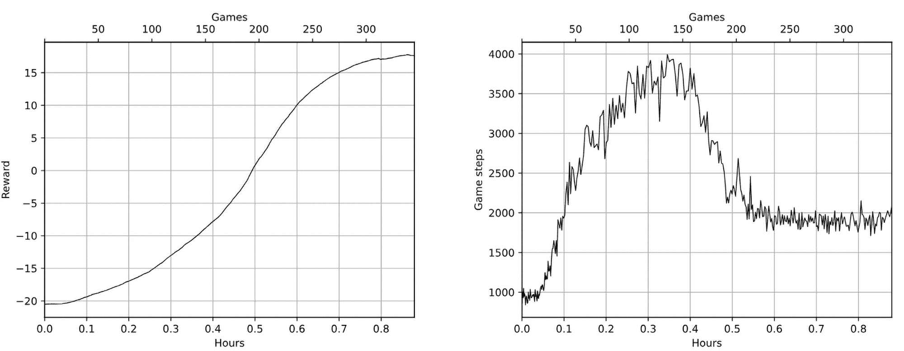

图 9.1：基线版本中的奖励和剧集长度

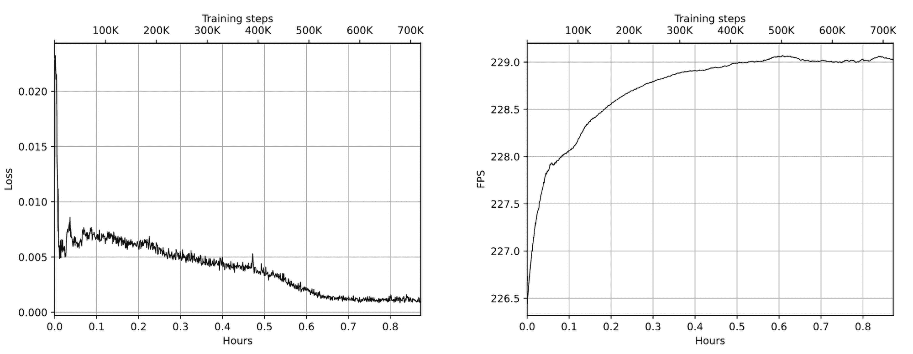

图 9.2：基线版本训练中的损失和 FPS

# PyTorch 中的计算图

我们的第一个例子不会集中在加速基线上，而是展示一种常见的、并不总是显而易见的情况，这种情况可能会影响性能。在第 3 章中，我们讨论了 PyTorch 如何计算梯度：它会构建你对张量执行的所有操作的图，当你调用最终损失的 backward() 方法时，所有模型参数中的梯度会被自动计算出来。

这种方法有效，但强化学习代码通常比传统的监督学习训练要复杂得多，因此我们当前训练的强化学习模型也在用于获取代理在环境中需要执行的动作。第 6 章中讨论的目标网络使得这一过程更加复杂。因此，在 DQN 中，神经网络（NN）通常在三种不同的情况中使用：

+   当我们希望计算由网络预测的 Q 值，以根据 Bellman 方程得到相对于参考 Q 值的损失时

+   当我们应用目标网络来获取下一个状态的 Q 值，以计算 Bellman 近似时

+   当代理想要决定执行的动作时

在我们的训练中，我们只需要在第一种情况下计算梯度。在第六章中，我们通过显式调用 detach()来避免计算梯度，这个 detach 非常重要，因为它防止了梯度“从意外的方向”流入我们的模型，如果没有它，DQN 可能根本无法收敛。在第三种情况下，梯度通过将网络结果转换为 NumPy 数组来停止。

我们在第六章中的代码是有效的，但我们错过了一个细节：三种情况下创建的计算图。这个问题不大，但创建计算图仍然会使用一些资源（无论是速度还是内存），而这些资源会浪费，因为即使我们没有对某个图调用 backward()，PyTorch 也会创建这个计算图。为了解决这个问题，有一个非常好的选项：装饰器 torch.no_grad()。

Python 中的装饰器是一个非常广泛的话题。它们为开发者提供了很多功能（如果使用得当），但超出了本书的讨论范围。在这里，我仅给出一个示例，我们定义了两个函数：

```py
>>> import torch 
>>> @torch.no_grad 
... def fun_a(t): 
...    return t*2 
... 
>>> def fun_b(t): 
...    return t*2 
...
```

这两个函数做的是相同的事情，都是将参数翻倍，但第一个函数使用了 torch.no_grad()装饰器，第二个则是普通函数。这个装饰器暂时禁用传递给函数的所有张量的梯度计算。如你所见，尽管张量 t 需要计算梯度，但从 fun_a（被装饰的函数）返回的结果并没有梯度：

```py
>>> t = torch.ones(3, requires_grad=True) 
>>> t 
tensor([1., 1., 1.], requires_grad=True) 
>>> a = fun_a(t) 
>>> b = fun_b(t) 
>>> b 
tensor([2., 2., 2.], grad_fn=<MulBackward0>) 
>>> a 
tensor([2., 2., 2.])
```

但是这个效果仅限于装饰器函数内部：

```py
>>> a*t 
tensor([2., 2., 2.], grad_fn=<MulBackward0>)
```

函数 torch.no_grad()也可以作为上下文管理器使用（这是另一个强大的 Python 概念，我建议你学习它），用于停止某段代码中的梯度计算：

```py
>>> with torch.no_grad(): 
...    c = t*2 
... 
>>> c 
tensor([2., 2., 2.])
```

这个功能为你提供了一种非常方便的方式，能够指示你代码中应该完全排除梯度计算的部分。这在 ptan.agent.DQNAgent（以及 PTAN 提供的其他代理）和 common.calc_loss_dqn 函数中已经完成。但是如果你正在编写自定义代理或实现自己的代码，很容易忘记这一点。

为了评估不必要的图计算的效果，我在 Chapter09/00_slow_grads.py 中提供了修改后的基准代码，它与原代码完全相同，但代理和损失计算部分没有使用 torch.no_grad()。以下图表展示了这一效果：

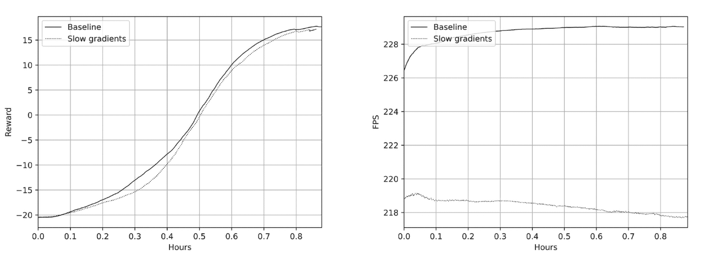

图 9.3：基准版本与没有 torch.no_grad()版本之间的奖励和 FPS 比较

正如你所看到的，速度损失并不大（大约 10FPS），但在网络更大且结构更复杂的情况下，这可能会有所不同。我曾看到在更复杂的递归神经网络中，加入 torch.no_grad()后，性能提升了 50%。

# 多个环境

我们通常用来加速深度学习训练的第一个思路是增加批量大小。这同样适用于深度强化学习领域，但你需要小心。在普通的监督学习中，简单的规则“较大的批量更好”通常是成立的：只要你的 GPU 内存允许，就增加批量，较大的批量通常意味着在单位时间内处理更多样本，这得益于强大的 GPU 并行计算。

强化学习的情况稍有不同。在训练过程中，两个事情是同时发生的：

+   你的网络经过训练，可以在当前数据上获得更好的预测

+   你的代理探索环境

随着代理探索环境并学习其行为的结果，训练数据会发生变化。在射击游戏的例子中，代理可能会随机运行一段时间，被怪物击中并在训练缓冲区中只获得“死亡无处不在”的痛苦经验。但过了一段时间，代理会发现它有一把可以使用的武器。这种新的经验可能会极大地改变我们用于训练的数据。强化学习的收敛通常依赖于训练和探索之间的微妙平衡。如果我们只是增加批量大小而没有调整其他选项，我们很容易在当前数据上过拟合（在射击游戏的例子中，代理可能开始认为“早死”是最小化痛苦的唯一选择，甚至永远不会发现它拥有的枪）。

因此，在 Chapter09/02_n_envs.py 中的示例中，我们的代理使用多个相同环境的副本来收集训练数据。在每次训练迭代中，我们将所有环境中的样本填充到重放缓冲区，然后按比例增大批量大小。这也使得我们能够稍微加速推理时间，因为我们可以在神经网络的一次前向传递中，对所有 N 个环境执行动作决策。在实现方面，前面的逻辑只需要对代码进行几处修改：

+   由于 PTAN 原生支持多个环境，我们需要做的就是将 N 个 Gym 环境传递给 ExperienceSource 实例

+   代理代码（在我们的例子中是 DQNAgent）已经为神经网络的批处理应用进行了优化

为了解决这个问题，修改了几段代码。生成批次的函数现在在每次训练迭代中执行多个步骤（等于环境总数）：

```py
def batch_generator(buffer: ptan.experience.ExperienceReplayBuffer, 
                    initial: int, batch_size: int, steps: int): 
    buffer.populate(initial) 
    while True: 
        buffer.populate(steps) 
        yield buffer.sample(batch_size)
```

经验源接受多个环境的数组，而不是单一环境：

```py
 envs = [ 
        ptan.common.wrappers.wrap_dqn(gym.make(params.env_name)) 
        for _ in range(args.envs) 
    ] 
    params.batch_size *= args.envs 
    exp_source = ptan.experience.ExperienceSourceFirstLast( 
        envs, agent, gamma=params.gamma, env_seed=common.SEED)
```

其他变化仅是对常量的小调整，用于调整 FPS 追踪器和补偿ε衰减的速度（随机步骤的比例）。由于环境数量是需要调优的新超参数，我进行了几个实验，N 的范围是从 2 到 6。以下图表展示了平均的动态：

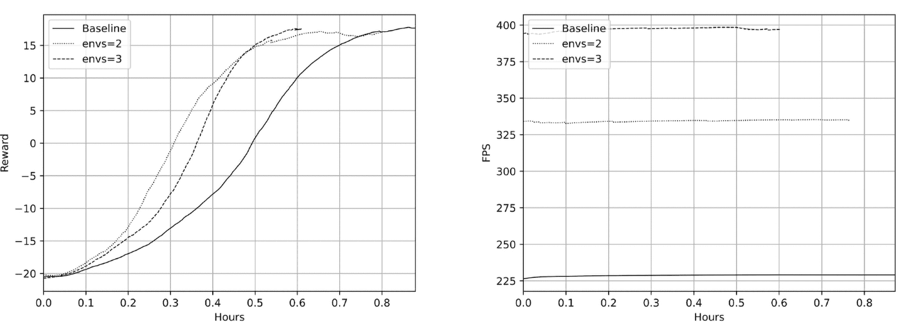

图 9.4：基准、两个和三个环境中的奖励与 FPS

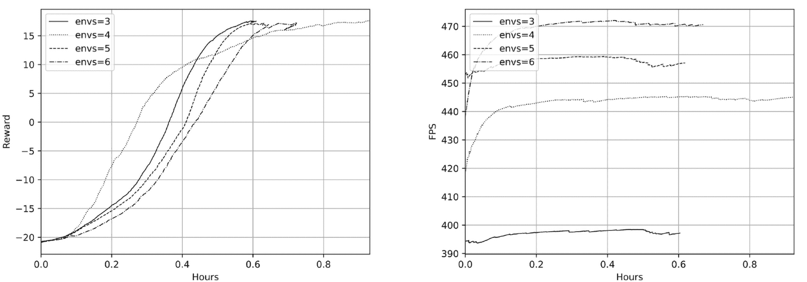

图 9.5：n = 3…6 时的奖励与 FPS

正如你从图表中看到的，增加一个额外的环境提供了 47%的 FPS 增益（从 227 FPS 到 335 FPS），并加速了约 10%的收敛速度（从 52 分钟到 48 分钟）。同样的效果也来自于增加第三个环境（398 FPS，36 分钟），但是尽管 FPS 进一步增加，增加更多环境对收敛速度产生了负面影响。因此，看起来 N = 3 差不多是我们的超参数的最优值，但当然，你可以自由调整和实验。这也说明了为什么我们不仅监控 FPS 的原始速度，还要观察智能体解决游戏的速度。

# 在不同进程中进行游戏和训练

从高层次来看，我们的训练过程包含以下步骤的重复：

1.  请求当前网络选择动作，并在我们的环境阵列中执行这些动作。

1.  将观察值放入重放缓冲区。

1.  从重放缓冲区随机抽取训练批次。

1.  在这一批次上进行训练。

前两步的目的是将环境中的样本（包括观察、动作、奖励和下一个观察）填充到重放缓冲区中。最后两步用于训练我们的网络。

以下是前面步骤的示意图，旨在使潜在的并行性更为明显。在左侧显示了训练流程。训练步骤使用了环境、重放缓冲区和我们的神经网络（NN）。实线表示数据和代码流动。虚线代表神经网络在训练和推理中的使用。

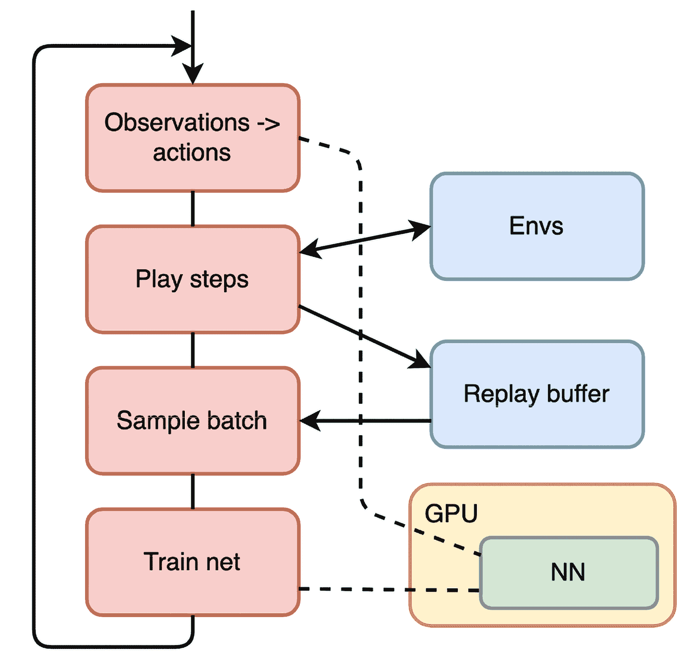

图 9.6：训练过程的顺序图

正如你所见，前两个步骤与下部仅通过重放缓冲区和神经网络通信。这使得我们可以将这两部分在不同的并行进程中分开。以下图是该方案的示意图：

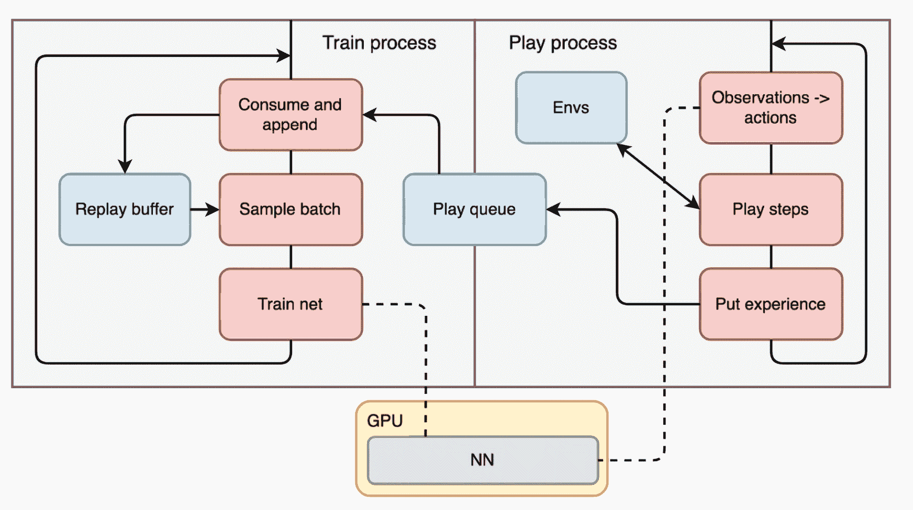

图 9.7：训练和游戏步骤的并行版本

在我们的 Pong 环境中，这看起来像是对代码的一个不必要的复杂化，但这种分离在某些情况下可能非常有用。想象一下你有一个非常慢且复杂的环境，每一步都需要数秒的计算。这并不是一个人为的例子；例如，过去的 NeurIPS 竞赛，如 Learning to Run、AI for Prosthetics Challenge 和 Learn to Move（[`www.aicrowd.com/challenges/neurips-2019-learn-to-move-walk-around`](https://www.aicrowd.com/challenges/neurips-2019-learn-to-move-walk-around)）中使用了非常缓慢的神经肌肉模拟器，因此你必须将经验收集与训练过程分开。在这种情况下，你可以有许多并行的环境，将经验传递给中央训练过程。

为了将我们的串行代码转变为并行代码，需要做一些修改。在文件 Chapter09/03_parallel.py 中，你可以找到这个示例的完整源码。接下来，我将只关注主要的区别。

首先，我们使用 torch.multiprocessing 模块来替代标准的 Python multiprocessing 模块：

```py
import torch.multiprocessing as mp 

@dataclass 
class EpisodeEnded: 
    reward: float 
    steps: int 
    epsilon: float 

def play_func(params: common.Hyperparams, net: dqn_model.DQN, 
              dev_name: str, exp_queue: mp.Queue): 
    env = gym.make(params.env_name) 
    env = ptan.common.wrappers.wrap_dqn(env) 
    device = torch.device(dev_name) 

    selector = ptan.actions.EpsilonGreedyActionSelector(epsilon=params.epsilon_start) 
    epsilon_tracker = common.EpsilonTracker(selector, params) 
    agent = ptan.agent.DQNAgent(net, selector, device=device) 
    exp_source = ptan.experience.ExperienceSourceFirstLast( 
        env, agent, gamma=params.gamma, env_seed=common.SEED) 

    for frame_idx, exp in enumerate(exp_source): 
        epsilon_tracker.frame(frame_idx//2) 
        exp_queue.put(exp) 
        for reward, steps in exp_source.pop_rewards_steps(): 
            ee = EpisodeEnded(reward=reward, steps=steps, epsilon=selector.epsilon) 
            exp_queue.put(ee)
```

标准库中的版本提供了几个用于处理在独立进程中执行的代码的原语，例如 mp.Queue（分布式队列）、mp.Process（子进程）等。PyTorch 提供了一个对标准 multiprocessing 库的封装，它允许在进程间共享 torch 张量，而无需复制它们。这是通过共享内存实现的，针对 CPU 张量使用共享内存，或者针对 GPU 上的张量使用 CUDA 引用。这种共享机制消除了在单台计算机内部进行通信时的主要瓶颈。当然，在真正分布式的通信中，你需要自行序列化数据。

函数 play_func 实现了我们的“播放进程”，并将在由主进程启动的单独子进程中运行。它的职责是从环境中获取经验并将其推送到共享队列中。此外，它将关于回合结束的信息封装成一个数据类，并将其推送到同一个队列中，以便训练过程可以获得关于回合奖励和步数的信息。

函数 batch_generator 被类 BatchGenerator 所替代：

```py
class BatchGenerator: 
    def __init__(self, buffer_size: int, exp_queue: mp.Queue, 
                 fps_handler: ptan_ignite.EpisodeFPSHandler, 
                 initial: int, batch_size: int): 
        self.buffer = ptan.experience.ExperienceReplayBuffer( 
            experience_source=None, buffer_size=buffer_size) 
        self.exp_queue = exp_queue 
        self.fps_handler = fps_handler 
        self.initial = initial 
        self.batch_size = batch_size 
        self._rewards_steps = [] 
        self.epsilon = None 

    def pop_rewards_steps(self) -> tt.List[tt.Tuple[float, int]]: 
        res = list(self._rewards_steps) 
        self._rewards_steps.clear() 
        return res 

    def __iter__(self): 
        while True: 
            while self.exp_queue.qsize() > 0: 
                exp = self.exp_queue.get() 
                if isinstance(exp, EpisodeEnded): 
                    self._rewards_steps.append((exp.reward, exp.steps)) 
                    self.epsilon = exp.epsilon 
                else: 
                    self.buffer._add(exp) 
                    self.fps_handler.step() 
            if len(self.buffer) < self.initial: 
                continue 
            yield self.buffer.sample(self.batch_size)
```

这个类提供了一个批次的迭代器，并且通过方法 pop_reward_steps()额外模拟了 ExperienceSource 接口。这个类的逻辑很简单：它消费队列（由“播放进程”填充），如果接收到 EpisodeEnded 对象，它会记住关于 epsilon 的信息和游戏所经历的步骤数；否则，该对象就是一条需要添加到重放缓冲区的经验。从队列中，我们消费当前可用的所有对象，然后从缓冲区中抽样训练批次并返回。

在训练过程的开始，我们需要告诉 torch.multiprocessing 使用哪种启动方法：

```py
if __name__ == "__main__": 
    warnings.simplefilter("ignore", category=UserWarning) 
    mp.set_start_method(’spawn’)
```

它们有几个，但 spawn 是最灵活的。

然后，创建用于通信的队列，并将 play_func 作为单独的进程启动。我们传递的参数包括神经网络（NN）、超参数以及用于经验的队列：

```py
 exp_queue = mp.Queue(maxsize=2) 
    proc_args = (params, net, args.dev, exp_queue) 
    play_proc = mp.Process(target=play_func, args=proc_args) 
    play_proc.start()
```

其余的代码几乎相同，唯一不同的是我们使用 BatchGenerator 实例作为 Ignite 和 EndOfEpisodeHandler 的数据源（后者需要使用方法 pop_rewards_steps()）。以下图表是从我的基准测试中获得的：

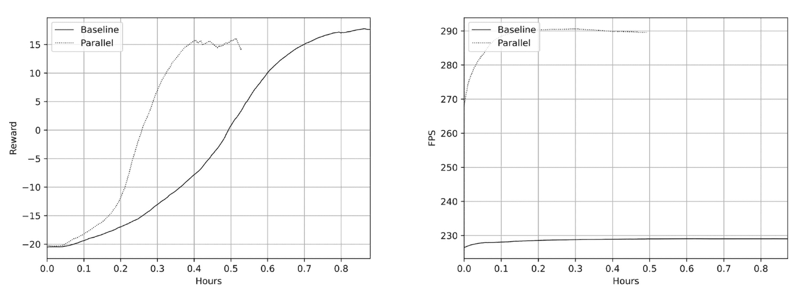

图 9.8：基线版本和并行版本中的奖励和 FPS

如你所见，在 FPS 方面，我们获得了 27% 的提升：并行版本的 FPS 为 290，而基线为 228。解决环境的平均时间减少了 41%。

就 FPS 增加而言，尽管并行版本比前一节中的最佳结果（使用 3 个游戏环境时，我们获得了接近 400 FPS）看起来要差，但收敛速度更快。

# 调整封装器

我们实验序列中的最后一步是调整应用于环境的封装器。这个步骤很容易被忽视，因为封装器通常是写一次或从其他代码借用后应用到环境中的，并且被留在那里。但你应该意识到它们在方法的速度和收敛性方面的重要性。例如，DeepMind 风格的正常 Atari 游戏封装器堆栈如下：

1.  NoopResetEnv：对游戏重置应用随机数量的 NOOP 操作。在某些 Atari 游戏中，需要这个操作来去除奇怪的初始观察值。

1.  MaxAndSkipEnv：对 N 次观察应用最大值（默认四次），并将其作为该步的观察返回。这样解决了某些 Atari 游戏中的“闪烁”问题，因为这些游戏在偶数帧和奇数帧上绘制屏幕的不同部分（这是 Atari 开发者常用的做法，以克服平台的限制并增加游戏精灵的复杂度）。

1.  EpisodicLifeEnv：在某些游戏中，这会检测丢失的生命并将其转化为该集的结束。这显著提高了收敛性，因为我们的回合变得更短（一次生命而非游戏逻辑给出的多次生命）。这仅对 Atari 2600 学习环境支持的某些游戏相关。

1.  FireResetEnv：在游戏重置时执行 FIRE 操作。有些游戏需要这个操作才能开始游戏。如果没有这个操作，我们的环境就变成了部分可观察的马尔可夫决策过程（POMDP），这使得无法收敛。

1.  WarpFrame：也称为 ProcessFrame84， 将图像转换为灰度并将其调整为 84 × 84 大小。

1.  ClipRewardEnv：将奖励裁剪到 −1…1 范围，这统一了不同 Atari 游戏中分数的广泛变化。例如，Pong 的分数范围可能是 −21…21，而 River Raid 游戏的分数可能是 0…∞。

1.  FrameStack：将 N 个连续的观察堆叠到栈中（默认是四个）。正如我们在第六章中讨论的那样，在某些游戏中，这是实现马尔可夫性质所必需的。例如，在 Pong 游戏中，从单一的一帧图像中无法得知球的运动方向。

这些包装器的代码经过了许多人的精心优化，并且存在多个版本。个人最喜欢的是 Stable Baselines3，它是 OpenAI Baselines 项目的一个分支。你可以在这里找到它：[`stable-baselines3.readthedocs.io/.`](https://stable-baselines3.readthedocs.io/.)

但你不应该将这段代码视为最终的真理源，因为你的具体环境可能有不同的需求和细节。例如，如果你有兴趣加速 Atari 套件中的某个特定游戏，NoopResetEnv 和 MaxAndSkipEnv（更准确地说，是 MaxAndSkipEnv 中的最大池化操作）可能并不需要。另一个可以调整的地方是 FrameStack 包装器中的帧数。通常做法是使用四帧，但你需要理解，这个数字是 DeepMind 和其他研究人员在对完整的 Atari 2600 游戏套件进行训练时使用的，该套件目前包含超过 50 个游戏。对于你的特定情况，使用两帧的历史可能足以提供性能提升，因为神经网络需要处理的数据会更少。

最后，图像调整大小可能是包装器的瓶颈，因此你可能需要优化包装器使用的库，例如重新构建它们或替换为更快速的版本。2020 年之前，将 OpenCV2 库替换为 pillow-simd 库能提高大约 50 帧每秒的速度。如今，OpenCV2 使用了优化的重新缩放操作，因此这种替换已不再有效。但你仍然可以尝试不同的缩放方法和不同的库。

在这里，我们将对 Pong 的包装器应用以下更改：

+   禁用 NoopResetEnv

+   用简化版本替换 MaxAndSkipEnv，只跳过四帧而不进行最大池化。

+   只保留两个帧在 FrameStack 中

为了检查我们调整的综合效果，我们将把上面的更改添加到前两节所做的修改中：多个环境和并行执行游戏与训练。

由于这些更改并不复杂，我们就不展示具体代码了（完整代码可以在文件 Chapter09/04_wrappers_n_env.py、Chapter09/04_wrappers_parallel.py 和 Chapter09/lib/atari_wrappers.py 中找到）：

+   库 atari_wrappers.py 相当简单——它包含了 PTAN 中 wrap_dqn 函数的副本和 Stable Baselines3 中的 AtariWrapper 类。

+   在 AtariWrapper 中，MaxAndSkipEnv 类被一个简化版本替代，去除了帧间的最大池化操作。

+   两个模块，04_wrappers_n_env.py 和 04_wrappers_prallel.py，仅仅是我们之前见过的 02_n_env.py 和 03_parallel.py 的副本，环境创建经过调整。

就是这样！以下是两种版本的奖励动态和 FPS 图表：

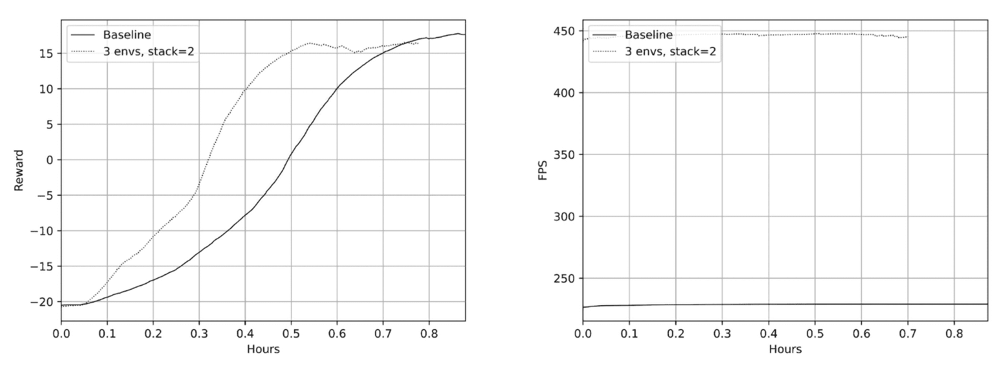

图 9.9：基准版和“3 个环境与 2 帧版本”的奖励与 FPS

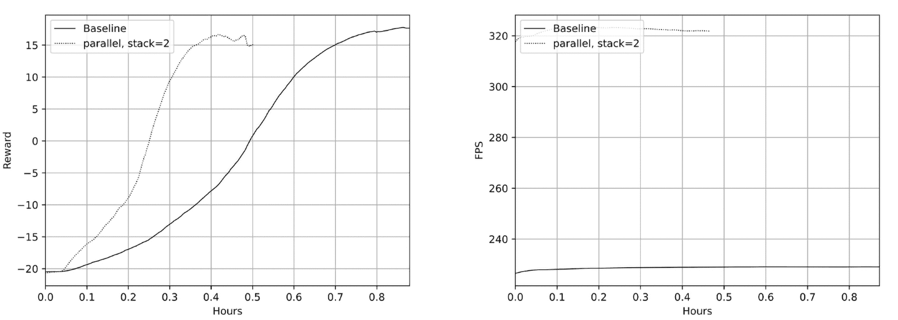

图 9.10：基准版和“并行与 2 帧版本”的奖励与 FPS

出于好奇，我还尝试将 FrameStack 中保持的帧数减少到仅一个帧（你可以通过命令行参数 --stack 1 重复实验）。令人惊讶的是，这样的版本也能解决游戏，但所需的游戏次数显著增加，训练变得不稳定（大约 8 次训练中的 3 次完全没有收敛）。这可能表明，只有一个帧的 Pong 并不是 POMDP，代理仍然可以仅凭一个帧作为观察，学习如何赢得游戏。但训练效率肯定会受到影响。

# 基准结果

我已将我们的实验总结在以下表格中。百分比显示相对于基准版的变化：

| 步骤 | FPS | FPS Δ | 时间（分钟） | 时间 Δ |
| --- | --- | --- | --- | --- |
| 基准 | 229 |  | 52.2 |  |
| 没有 torch.no.grad() | 219 | -4.3% | 51.0 | -2.3% |
| 3 个环境 | 395 | +72.5% | 36.0 | -31.0% |
| 并行版本 | 290 | +26.6% | 31.2 | -40.2% |
| 包装器 + 3 个环境 | 448 | +95.6% | 47.4 | -9.2% |
| 包装器 + 并行 | 325 | +41.9% | 30.0 | -42.5% |

表 9.1：优化结果

# 摘要

在这一章中，你看到了几种通过纯工程方法提高 RL 方法性能的方式，这与第八章中介绍的“算法”或“理论”方法形成对比。从我的角度来看，这两种方法是互补的，一个优秀的 RL 从业者需要既了解研究人员发现的最新技巧，也要了解实现细节。

在下一章，我们将开始将我们的 DQN 知识应用于股票交易作为实际示例。
