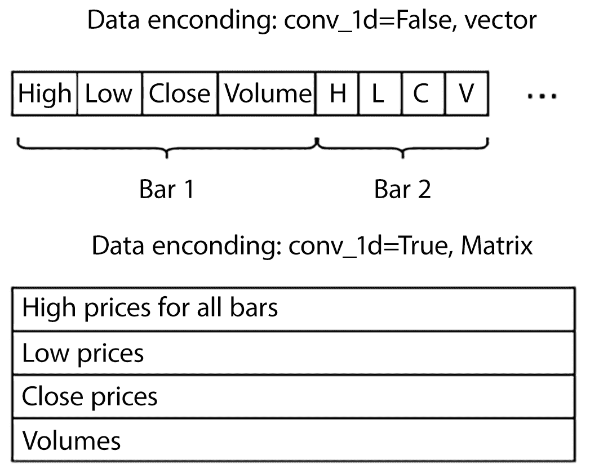

# 第十章：使用强化学习进行股票交易

本章我们不会学习解决玩具强化学习（RL）问题的新方法，而是尝试利用我们在深度 Q 网络（DQN）方面的知识来处理更实际的金融交易问题。我不能保证代码会让你在股市或外汇市场上变得超级富有，因为我的目标远没有那么雄心勃勃：我想展示如何超越雅达利游戏，并将强化学习应用于不同的实际领域。

在本章中，我们将：

+   实现我们自己的 OpenAI Gym 环境以模拟股市

+   应用你在第六章和第八章中学到的 DQN 方法，训练一个智能体进行股票交易，以最大化利润

# 为什么做交易？

每天在市场上交易的金融工具种类繁多：商品、股票和货币。即使是天气预报也可以通过所谓的“天气衍生品”进行买卖，这只是现代世界和金融市场复杂性的一个表现。如果你的收入取决于未来的天气条件，就像种植作物的企业一样，你可能会通过购买天气衍生品来对冲风险。所有这些不同的物品都有随时间变化的价格。交易是买卖金融工具的活动，目的是为了不同的目标，如获取利润（投资）、从未来的价格波动中获得保护（对冲）或只是获取所需的东西（例如购买钢铁或将美元兑换为日元支付合同）。

自从第一个金融市场建立以来，人们就一直在尝试预测未来的价格走势，因为这能带来很多好处，比如“从无中赚取利润”或保护资本免受突如其来的市场波动。这一问题被认为是复杂的，因此有很多金融顾问、投资基金、银行和个人交易者在尝试预测市场，并寻找最佳的买卖时机以最大化利润。

问题是：我们能否从强化学习的角度来看待这个问题？假设我们对市场有一些观察，并且我们需要做出一个决策：买入、卖出或等待。如果我们在价格上涨之前买入，我们的利润将是正的；否则，我们将获得负奖励。我们试图做的是尽可能获得更多的利润。市场交易和强化学习之间的联系非常明显。首先，让我们更清楚地定义问题陈述。

# 问题陈述与关键决策

金融领域庞大而复杂，因此你很容易花费几年时间每天学习新的内容。在我们的例子中，我们将仅仅使用强化学习（RL）工具稍微触及一下表面，问题将尽可能简单地被表述，使用价格作为观察值。我们将研究我们的智能体是否能够学习在最佳时机购买一只股票，并在随后平仓以最大化利润。这个例子的目的是展示 RL 模型的灵活性，以及你通常需要采取的第一步来将 RL 应用到实际的使用案例中。

正如你已经知道的，要制定 RL 问题，需要三件事：环境观察、可能的动作和奖励系统。在之前的章节中，所有三者已经给定，并且环境的内部机制是隐藏的。现在我们处于不同的情况，所以我们需要自己决定智能体将看到什么以及它可以采取哪些动作。奖励系统也没有严格的规则，而是由我们对领域的感觉和知识引导，这给了我们很大的灵活性。

灵活性在这种情况下既是好事，也是坏事。好的一面是，我们可以自由地传递一些我们认为对高效学习很重要的信息给智能体。例如，除了价格，你还可以向交易智能体提供新闻或重要统计数据（这些被认为对金融市场有很大影响）。坏的一面是，这种灵活性通常意味着为了找到一个优秀的智能体，你需要尝试许多不同的数据表示方式，而哪些方式更有效通常并不明显。在我们的案例中，我们将实现最基本的交易智能体，以其最简单的形式，就像我们在第一章中讨论的那样：

+   **观察：** 观察将包括以下信息：

    +   N 个过去的时段，其中每个时段都有开盘价、最高价、最低价和收盘价。

    +   一个指示，表明股票在一段时间前已被购买（一次只能购买一只股票）。

    +   我们当前持仓（已购入的股票）所带来的盈亏。

+   **动作：** 在每一步，每一分钟的时段结束后，智能体可以采取以下之一的动作：

    +   什么都不做：跳过当前的时段，不采取任何行动。

    +   买入股票：如果智能体已经拥有股票，则不会进行购买；否则，我们将支付佣金，通常是当前价格的一小部分。

    +   平仓：如果我们没有之前购买的股票，什么都不会发生；否则，我们将支付交易佣金。

+   **奖励：** 智能体收到的奖励可以通过以下方式表达：

    +   作为第一种选择，我们可以将奖励分成多个步骤，在我们持有股票期间每一步的奖励将等于最后一个时段的价格波动。

    +   或者，智能体可以在平仓动作之后才收到奖励，并一次性获得全部奖励。

    初看起来，两种变体应该有相同的最终结果，只是收敛速度可能不同。然而，在实践中，差异可能是巨大的。我的实现中的环境支持这两种变体，因此您可以实验它们之间的差异。

另一个需要做出的决策是如何在我们的环境观察中表示价格。理想情况下，我们希望我们的代理能够独立于实际的价格值，并考虑相对变动，比如“股票在上一根 K 线中增长了 1%”或“股票下降了 5%”。这是合理的，因为不同股票的价格可能不同，但它们可能有类似的变动模式。在金融领域，有一门分析学科叫做技术分析，专门研究这种模式，并通过它们来进行预测。我们希望我们的系统能够发现这些模式（如果它们存在）。为了实现这一点，我们将把每根 K 线的开盘、最高、最低和收盘价格转换为三个数值，表示开盘价的百分比形式的最高价、最低价和收盘价。

这种表示方法有其自身的缺点，因为我们可能会失去关于关键价格水平的信息。例如，已知市场有一个倾向，即从整数价格水平（如每个比特币 70,000 美元）和过去曾经是转折点的价格水平反弹。然而，正如前面所说，我们这里只是玩弄数据并检查这个概念。以相对价格变动的形式表示将有助于系统在价格水平中发现重复的模式（如果存在的话），而不管绝对价格位置如何。潜在地，神经网络（NN）可能会自己学会这一点（只需从绝对价格值中减去均价），但相对表示简化了神经网络的任务。

# 数据

在我们的例子中，我们将使用 2015-2016 年期间的俄罗斯股市价格，这些数据存放在 Chapter10/data/ch10-small-quotes.tgz 中，模型训练之前需要解压。

在档案中，我们有包含 M1 条形图的 CSV 文件，这意味着每行对应一个时间单位内的单一分钟，并且该分钟内的价格变动由四个价格记录：

+   开盘：一分钟开始时的价格

+   高：区间内的最高价格

+   最低：最低价格

+   收盘：这一分钟时间区间的最后价格

每一分钟的时间间隔称为一个 K 线，它让我们能够了解这一时间段内的价格变动。例如，在 YNDX_160101_161231.csv 文件中（包含 2016 年 Yandex 公司股票数据），我们有 130,000 行数据，格式如下：

```py
<DATE>,<TIME>,<OPEN>,<HIGH>,<LOW>,<CLOSE>,<VOL> 
20160104,100100,1148.90000,1148.90000,1148.90000,1148.90000,0 
20160104,100200,1148.90000,1148.90000,1148.90000,1148.90000,50 
20160104,100300,1149.00000,1149.00000,1149.00000,1149.00000,33 
20160104,100400,1149.00000,1149.00000,1149.00000,1149.00000,4 
20160104,100500,1153.00000,1153.00000,1153.00000,1153.00000,0 
20160104,100600,1156.90000,1157.90000,1153.00000,1153.00000,43 
20160104,100700,1150.60000,1150.60000,1150.40000,1150.40000,5 
20160104,100800,1150.20000,1150.20000,1150.20000,1150.20000,4 
20160104,100900,1150.50000,1150.50000,1150.50000,1150.50000,2 
20160104,101000,1150.00000,1150.00000,1150.00000,1150.00000,43 
20160104,101100,1149.70000,1149.70000,1149.70000,1149.70000,0 
20160104,101200,1150.20000,1150.20000,1149.50000,1149.70000,165 
...
```

前两列是日期和分钟时间；接下来的四列是开盘、最高、最低和收盘价格；最后一个值表示在该 K 线期间执行的买卖订单数量（也称为成交量）。成交量的具体解释取决于市场，但通常它能让你了解市场的活跃度。

表示这些价格的典型方式被称为蜡烛图，每个条形图显示为一根蜡烛。以下是 Yandex 2016 年 2 月一天部分报价的图表：


图 10.1：2016 年 2 月 Yandex 的价格数据

存档中包含 2016 年和 2015 年的 M1 数据文件。我们将使用 2016 年的数据进行模型训练，使用 2015 年的数据进行验证（但顺序是任意的，你可以交换它们，甚至使用不同的时间间隔并检查效果）。

# 交易环境

由于我们有很多代码需要与 Gym API 配合工作，我们将实现交易功能，遵循 Gym 的 Env 类，您应该已经熟悉这个类了。我们的环境在 Chapter10/lib/environ.py 模块中的 StocksEnv 类中实现。它使用几个内部类来保持其状态并编码观察。

首先让我们看看公共 API 类：

```py
import typing as tt 
import gymnasium as gym 
from gymnasium import spaces 
from gymnasium.utils import seeding 
from gymnasium.envs.registration import EnvSpec 
import enum 
import numpy as np 
from . import data 

DEFAULT_BARS_COUNT = 10 
DEFAULT_COMMISSION_PERC = 0.1 

class Actions(enum.Enum): 
    Skip = 0 
    Buy = 1 
    Close = 2
```

我们将所有可用的操作编码为枚举字段，并仅提供三个操作：什么都不做，买入单一股票，关闭现有仓位。

在我们的市场模型中，我们只允许购买单一股票，不支持扩展现有仓位或开设“卖空仓位”（即当你卖出你没有的股票时，预计未来股价会下降）。这是一个有意的决策，因为我试图保持例子简洁，避免过于复杂。为什么不尝试用其他选项进行实验呢？

接下来，我们有环境类：

```py
class StocksEnv(gym.Env): 
    spec = EnvSpec("StocksEnv-v0")
```

字段规范对于 gym.Env 兼容性是必需的，并将我们的环境注册到 Gym 的内部注册表中。

这个类提供了两种方式来创建其实例：

```py
 @classmethod 
    def from_dir(cls, data_dir: str, **kwargs): 
        prices = { 
            file: data.load_relative(file) 
            for file in data.price_files(data_dir) 
        } 
        return StocksEnv(prices, **kwargs)
```

如前面的代码所示，第一种方式是调用类方法 from_dir，将数据目录作为参数。在这种情况下，它将从目录中的 CSV 文件加载所有报价，并构建环境。为了处理我们格式的价格数据，Chapter10/lib/data.py 中有几个辅助函数。另一种方式是直接构造类实例。在这种情况下，你应该传递价格字典，该字典必须将报价名称映射到 data.py 中声明的 Prices 数据类。这个对象有五个字段，包含开盘、最高、最低、收盘和成交量的时间序列，这些字段都是一维的 NumPy 数组。data.py 模块还提供了几个帮助函数，如将价格转换为相对格式、枚举给定目录中的文件等。

以下是环境的构造函数：

```py
 def __init__( 
            self, prices: tt.Dict[str, data.Prices], 
            bars_count: int = DEFAULT_BARS_COUNT, 
            commission: float = DEFAULT_COMMISSION_PERC, 
            reset_on_close: bool = True, state_1d: bool = False, 
            random_ofs_on_reset: bool = True, 
            reward_on_close: bool = False, volumes=False 
    ):
```

它接受很多参数来调整环境的行为和观察表示：

+   prices: 包含一个或多个股票价格的数据字典，其中键是工具的名称，值是一个容器对象 data.Prices，包含价格数据数组。

+   bars_count: 我们在观察中传入的条形数量。默认情况下，这是 10 个条形。

+   commission: 我们在买卖股票时需要支付给经纪人的股价百分比。默认情况下，它是 0.1%。

+   reset_on_close: 如果此参数设置为 True（默认设置），则每当代理请求我们关闭现有仓位（即卖出股票）时，我们将停止当前回合。否则，回合将继续，直到时间序列结束，即一年数据。

+   conv_1d: 这个布尔参数用于在传递给代理的观察值中切换不同的价格数据表示方式。如果设置为 True，观察值将具有二维形状，不同价格成分的后续条目将按行组织。例如，最高价格（该条目的最大价格）放在第一行，最低价格放在第二行，收盘价格放在第三行。这种表示方式适用于对时间序列进行 1D 卷积，在这种情况下，数据中的每一行都像 Atari 2D 图像中的不同色彩平面（红色、绿色或蓝色）。如果我们将此选项设置为 False，我们将得到一个包含每个条目组成部分的单一数据数组。这种组织方式适合全连接网络架构。两种表示方式见图 10.2。

+   random_ofs_on_reset: 如果该参数为 True（默认值），则在每次重置环境时，都会选择时间序列中的随机偏移量。否则，我们将从数据的开头开始。

+   reward_on_close: 这个布尔参数在前面讨论的两种奖励方案之间切换。如果设置为 True，代理仅在“收盘”动作时获得奖励。否则，我们会在每个条目上给予一个小奖励，对应于该条目期间的价格波动。

+   volumes: 这个参数控制观察值中的成交量，默认情况下是禁用的。



图 10.2：神经网络的不同数据表示方式

现在我们将继续查看环境构造器：

```py
 self._prices = prices 
        if state_1d: 
            self._state = State1D(bars_count, commission, reset_on_close, 
                                  reward_on_close=reward_on_close, volumes=volumes) 
        else: 
            self._state = State(bars_count, commission, reset_on_close, 
                                reward_on_close=reward_on_close, volumes=volumes) 
        self.action_space = spaces.Discrete(n=len(Actions)) 
        self.observation_space = spaces.Box( 
            low=-np.inf, high=np.inf, shape=self._state.shape, dtype=np.float32) 
         self.random_ofs_on_reset = random_ofs_on_reset
```

StocksEnv 类的大部分功能实现于两个内部类：State 和 State1D。它们负责观察值的准备、我们购买的股票状态和奖励。它们实现了我们数据在观察值中的不同表示方式，我们稍后会查看它们的代码。在构造器中，我们创建了 Gym 所需的状态对象、动作空间和观察空间字段。

该方法定义了我们环境的 reset()功能：

```py
 def reset(self, *, seed: int | None = None, options: dict[str, tt.Any] | None = None): 
        # make selection of the instrument and it’s offset. Then reset the state 
        super().reset(seed=seed, options=options) 
        self._instrument = self.np_random.choice(list(self._prices.keys())) 
        prices = self._prices[self._instrument] 
        bars = self._state.bars_count 
        if self.random_ofs_on_reset: 
            offset = self.np_random.choice(prices.high.shape[0]-bars*10) + bars 
        else: 
            offset = bars 
        self._state.reset(prices, offset) 
        return self._state.encode(), {}
```

根据 gym.Env 的语义，我们随机切换将要处理的时间序列，并选择该时间序列中的起始偏移量。选定的价格和偏移量被传递给我们的内部状态实例，然后使用其 encode()函数请求初始观察值。

该方法需要处理代理选择的动作，并返回下一个观察值、奖励和完成标志：

```py
 def step(self, action_idx: int) -> tt.Tuple[np.ndarray, float, bool, bool, dict]: 
        action = Actions(action_idx) 
        reward, done = self._state.step(action) 
        obs = self._state.encode() 
        info = { 
            "instrument": self._instrument, 
            "offset": self._state._offset 
        } 
        return obs, reward, done, False, info
```

所有的实际功能都在我们的状态类中实现，因此这个方法只是对状态方法调用的一个简单包装。

gym.Env 的 API 允许你定义 render() 方法处理器，它应该以人类或机器可读的格式渲染当前状态。通常，这个方法用于查看环境状态的内部内容，对调试或追踪代理行为非常有用。例如，市场环境可以将当前价格渲染为图表，以可视化代理在那一刻所看到的内容。我们的环境不支持渲染（因为这个功能是可选的），所以我们根本不定义这个函数。

现在让我们来看一下内部的 environ.State 类，它实现了环境功能的核心：

```py
class State: 
    def __init__(self, bars_count: int, commission_perc: float, reset_on_close: bool, 
                 reward_on_close: bool = True, volumes: bool = True): 
        assert bars_count > 0 
        assert commission_perc >= 0.0 
        self.bars_count = bars_count 
        self.commission_perc = commission_perc 
        self.reset_on_close = reset_on_close 
        self.reward_on_close = reward_on_close 
        self.volumes = volumes 
        self.have_position = False 
        self.open_price = 0.0 
        self._prices = None 
        self._offset = None
```

构造函数仅仅是检查并将参数保存在对象的字段中，没有做其他事情。

reset() 方法在每次环境请求重置时被调用，必须保存传入的价格数据和起始偏移量：

```py
 def reset(self, prices: data.Prices, offset: int): 
        assert offset >= self.bars_count-1 
        self.have_position = False 
        self.open_price = 0.0 
        self._prices = prices 
        self._offset = offset
```

一开始，我们没有购买任何股票，因此我们的状态中有 `have_position=False` 和 `open_price=0.0`。

shape 属性返回包含编码状态的 NumPy 数组维度的元组：

```py
 @property 
    def shape(self) -> tt.Tuple[int, ...]: 
        # [h, l, c] * bars + position_flag + rel_profit 
        if self.volumes: 
            return 4 * self.bars_count + 1 + 1, 
        else: 
            return 3 * self.bars_count + 1 + 1,
```

State 类被编码为一个单一的向量（图 10.2 中的顶部部分），该向量包括价格（可选的成交量）和两个数字，表示是否持有股票以及仓位利润。

encode() 方法将当前偏移量的价格打包成一个 NumPy 数组，这将作为代理的观察值：

```py
 def encode(self) -> np.ndarray: 
        res = np.ndarray(shape=self.shape, dtype=np.float32) 
        shift = 0 
        for bar_idx in range(-self.bars_count+1, 1): 
            ofs = self._offset + bar_idx 
            res[shift] = self._prices.high[ofs] 
            shift += 1 
            res[shift] = self._prices.low[ofs] 
            shift += 1 
            res[shift] = self._prices.close[ofs] 
            shift += 1 
            if self.volumes: 
                res[shift] = self._prices.volume[ofs] 
                shift += 1 
        res[shift] = float(self.have_position) 
        shift += 1 
        if not self.have_position: 
            res[shift] = 0.0 
        else: 
            res[shift] = self._cur_close() / self.open_price - 1.0 
        return res
```

这个辅助方法计算当前 K 线的收盘价：

```py
 def _cur_close(self) -> float: 
        open = self._prices.open[self._offset] 
        rel_close = self._prices.close[self._offset] 
        return open * (1.0 + rel_close)
```

传递给 State 类的价格相对于开盘价是相对形式：高、低和收盘价组件是相对于开盘价的比例。我们在讨论训练数据时已经讨论过这种表示法，它（可能）有助于我们的代理学习与实际价格值无关的价格模式。

step() 方法是 State 类中最复杂的代码部分：

```py
 def step(self, action: Actions) -> tt.Tuple[float, bool]: 
        reward = 0.0 
        done = False 
        close = self._cur_close()
```

它负责在我们的环境中执行一步操作。退出时，它必须返回一个百分比形式的奖励，并指示剧集是否结束。

如果代理决定购买一只股票，我们会改变状态并支付佣金：

```py
 if action == Actions.Buy and not self.have_position: 
            self.have_position = True 
            self.open_price = close 
            reward -= self.commission_perc
```

在我们的状态下，我们假设在当前 K 线的收盘价进行即时订单执行，这对我们来说是一个简化；通常，订单可能在不同的价格上执行，这被称为价格滑点。

如果我们有持仓，且代理要求我们平仓，我们需要再次支付佣金，在重置模式下改变已完成标志，给整个仓位一个最终的奖励，并改变我们的状态：

```py
 elif action == Actions.Close and self.have_position: 
            reward -= self.commission_perc 
            done |= self.reset_on_close 
            if self.reward_on_close: 
                reward += 100.0 * (close / self.open_price - 1.0) 
            self.have_position = False 
            self.open_price = 0.0
```

在函数的其余部分，我们修改当前偏移量并给予最后一根 K 线运动的奖励：

```py
 self._offset += 1 
        prev_close = close 
        close = self._cur_close() 
        done |= self._offset >= self._prices.close.shape[0]-1 

        if self.have_position and not self.reward_on_close: 
            reward += 100.0 * (close / prev_close - 1.0) 

        return reward, done
```

这就是 State 类的全部内容，让我们来看一下 State1D，它具有相同的行为，仅仅是重写了传递给代理的状态表示：

```py
class State1D(State): 
    @property 
    def shape(self) -> tt.Tuple[int, ...]: 
        if self.volumes: 
            return 6, self.bars_count 
        else: 
            return 5, self.bars_count
```

这种表示的形状有所不同，因为我们的价格被编码为适用于 1D 卷积操作符的 2D 矩阵。

该方法根据当前偏移量、是否需要成交量以及是否拥有股票，将价格编码到我们的矩阵中：

```py
 def encode(self) -> np.ndarray: 
        res = np.zeros(shape=self.shape, dtype=np.float32) 
        start = self._offset-(self.bars_count-1) 
        stop = self._offset+1 
        res[0] = self._prices.high[start:stop] 
        res[1] = self._prices.low[start:stop] 
        res[2] = self._prices.close[start:stop] 
        if self.volumes: 
            res[3] = self._prices.volume[start:stop] 
            dst = 4 
        else: 
            dst = 3 
        if self.have_position: 
            res[dst] = 1.0 
            res[dst+1] = self._cur_close() / self.open_price - 1.0 
        return res
```

这就是我们的交易环境。与 Gym API 的兼容性使得我们能够将其插入到我们用来处理 Atari 游戏的熟悉类中。现在我们来做这个。

# 模型

在本示例中，使用了两种 DQN 架构：一个是简单的三层前馈网络，另一个是使用 1D 卷积作为特征提取器的网络，后接两层全连接层输出 Q 值。它们都使用了第八章中描述的对战架构。同时，也使用了双重 DQN 和两步贝尔曼展开。其余过程与经典 DQN 相同（见第六章）。这两种模型位于 Chapter10/lib/models.py 中，并且非常简单。我们先从前馈模型开始：

```py
class SimpleFFDQN(nn.Module): 
    def __init__(self, obs_len: int, actions_n: int): 
        super(SimpleFFDQN, self).__init__() 

        self.fc_val = nn.Sequential( 
            nn.Linear(obs_len, 512), 
            nn.ReLU(), 
            nn.Linear(512, 512), 
            nn.ReLU(), 
            nn.Linear(512, 1) 
        ) 

        self.fc_adv = nn.Sequential( 
            nn.Linear(obs_len, 512), 
            nn.ReLU(), 
            nn.Linear(512, 512), 
            nn.ReLU(), 
            nn.Linear(512, actions_n) 
        ) 

    def forward(self, x: torch.Tensor) -> torch.Tensor: 
        val = self.fc_val(x) 
        adv = self.fc_adv(x) 
        return val + (adv - adv.mean(dim=1, keepdim=True))
```

前馈模型使用独立的网络进行 Q 值和优势预测。

卷积模型具有一个常见的特征提取层，使用 1D 卷积操作，并且有两个全连接头用于输出状态值和动作优势：

```py
class DQNConv1D(nn.Module): 
    def __init__(self, shape: tt.Tuple[int, ...], actions_n: int): 
        super(DQNConv1D, self).__init__() 

        self.conv = nn.Sequential( 
            nn.Conv1d(shape[0], 128, 5), 
            nn.ReLU(), 
            nn.Conv1d(128, 128, 5), 
            nn.ReLU(), 
            nn.Flatten(), 
        ) 
        size = self.conv(torch.zeros(1, *shape)).size()[-1] 

        self.fc_val = nn.Sequential( 
            nn.Linear(size, 512), 
            nn.ReLU(), 
            nn.Linear(512, 1) 
        ) 

        self.fc_adv = nn.Sequential( 
            nn.Linear(size, 512), 
            nn.ReLU(), 
            nn.Linear(512, actions_n) 
        ) 

    def forward(self, x: torch.Tensor) -> torch.Tensor: 
        conv_out = self.conv(x) 
        val = self.fc_val(conv_out) 
        adv = self.fc_adv(conv_out) 
        return val + (adv - adv.mean(dim=1, keepdim=True))
```

如你所见，该模型与我们在 Atari 示例中使用的 DQN Dueling 架构非常相似。

# 训练代码

在本示例中，我们有两个非常相似的训练模块：一个用于前馈模型，另一个用于 1D 卷积。对于这两个模块，除了第八章中提供的内容外，没有任何新的内容：

+   它们使用 epsilon-greedy 动作选择来进行探索。epsilon 在前 100 万步内从 1.0 线性衰减到 0.1。

+   正在使用一个简单的经验回放缓冲区，大小为 100k，最初填充有 10k 个过渡。

+   每 1,000 步，我们会计算固定状态集合的均值，以检查训练过程中 Q 值的动态变化。

+   每 100k 步，我们进行验证：在训练数据和之前未见过的报价上各进行 100 轮测试。验证结果会记录在 TensorBoard 中，包括平均利润、平均条数以及持股比例。此步骤可以帮助我们检查是否存在过拟合情况。

训练模块位于 Chapter10/train_model.py（前馈模型）和 Chapter10/train_model_conv.py（含 1D 卷积层）。两个版本都接受相同的命令行选项。

要开始训练，您需要使用 `--data` 选项传递训练数据，可以是单个 CSV 文件或包含文件的整个目录。默认情况下，训练模块使用 2016 年的 Yandex 行情（文件 `data/YNDX_160101_161231.csv`）。对于验证数据，有一个 `--val` 选项，默认使用 Yandex 2015 年的行情。另一个必需选项是 `-r`，用于传递运行名称。此名称将用作 TensorBoard 运行名称和用于创建保存模型的目录。

# 结果

现在我们已经实施了它们，让我们比较一下我们两个模型的表现，首先从前馈变体开始。

## 前馈模型

在训练过程中，代理每次获得的平均奖励都在缓慢但稳步增长。在 300k 个 episode 后，增长放缓。以下是显示训练期间原始奖励和简单移动平均值的图表（图 10.3）：


图 10.3: 训练过程中的奖励。原始值（左）和平滑后（右）

另一对图表（图 10.4）显示了在相同的训练数据上进行测试时，不执行随机动作（𝜖 = 0）所获得的奖励：


图 10.4: 测试的奖励。原始值（左）和平滑后（右）

训练和测试奖励图表显示，代理正在学习如何随时间增加利润。


图 10.5: episode 的长度。原始值（左）和平滑后（右）

每个 episode 的长度在 100k 个 episode 后也有所增加，因为代理学到了持有股份可能是有利的。

此外，我们监控随机状态集的预测值。以下图表显示，在训练过程中网络对这些状态变得越来越乐观：


图 10.6: 随机状态集的预测值

到目前为止，所有图表看起来都很好，但所有这些图表都是使用训练数据获取的。很棒，我们的代理正在学习如何在历史数据上获利。但它会在以前从未见过的数据上工作吗？为了检查这一点，我们在 2,015 年的报价上进行验证，奖励显示在图 10.7 中：


图 10.7: 验证数据集上的奖励。原始值（左）和平滑后（右）

这张图有点令人失望：奖励没有上升趋势。在图表的平滑版本中，我们甚至可能看到相反的情况——奖励在训练的第一小时后缓慢下降（在那个时刻，我们在图 10.5 上有了显著的训练周期增长）。这可能是代理过拟合的表现，过拟合始于 100 万次训练迭代。然而，在训练的前 4 小时，奖励仍然高于-0.2%（这是我们环境中的经纪商佣金——买入股票时是 0.1%，卖出时也是 0.1%），意味着我们的代理比随机的“买入卖出猴子”表现得更好。

在训练过程中，我们的代码会保存模型以供以后实验使用。每当我们持有状态集上的平均 Q 值更新最大值，或当验证集上的奖励突破以前的记录时，它都会这样做。还有一个工具可以加载模型，并使用命令行选项在你提供的价格上进行交易，并绘制利润随时间变化的图表。该工具名为`Chapter10/run_model.py`，使用方式如下：

```py
Chapter10$ ./run_model.py -d data/YNDX_160101_161231.csv -m saves/simple-t1/mean_value-0.277.data -b 10 -n YNDX16
```

该工具接受的选项如下：

+   -d：这是用于的报价路径。在所示命令中，我们将模型应用于它训练时的数据。

+   -m：这是模型文件的路径。默认情况下，训练代码会将其保存在`saves`目录中。

+   -b：此选项显示在上下文中传递给模型的条形图数。它必须与训练时使用的条形图数量匹配，默认值为 10，可以在训练代码中更改。

+   -n：这是附加到生成的图像上的后缀。

+   --commission：此选项允许你重新定义经纪商的佣金，默认值为 0.1%。

最后，工具会创建一个总利润动态图（以百分比表示）。以下是 Yandex 2016 年报价（用于训练）的奖励图：


图 10.8：训练数据上的交易利润（左）与验证数据上的交易利润（右）

在训练数据上的结果看起来非常惊人：仅仅一年就获得了 150%的利润。然而，在验证数据集上的结果要差得多，正如我们从 TensorBoard 中的验证图表中看到的那样。

为了检查我们的系统在零佣金下是否有盈利，我们可以使用`--commission 0.0`选项重新运行相同的数据：


图 10.9：没有经纪商佣金的验证数据交易利润

我们有一些回撤较大的糟糕日子，但整体结果还是不错的：没有佣金时，我们的代理是可以盈利的。当然，佣金并不是唯一的问题。我们的订单模拟非常原始，并没有考虑到现实中的情况，例如价格差距和订单执行的滑点。

如果我们选择在验证集上获得最佳奖励的模型，奖励动态会稍好一些。盈利能力较低，但在未见过的报价上的回撤要低得多（并且在以下图表中启用了佣金）：


图 10.10：最佳验证奖励模型的奖励。训练数据（左）和验证数据（右）

但是，当然，基于验证数据选择最佳模型是作弊——通过使用验证结果来选择模型，我们实际上破坏了验证的意义。因此，上述图表仅用于说明有些模型即使在未见过的数据上也能表现得还不错。

## 卷积模型

本示例中实现的第二个模型使用一维卷积滤波器从价格数据中提取特征。这使我们能够在不显著增加网络规模的情况下，增加每步操作中代理所看到的上下文窗口中的条形数量。默认情况下，卷积模型示例使用 50 个条形数据作为上下文。训练代码位于 Chapter10/train_model_conv.py，并且接受与前馈版本相同的一组命令行参数。

训练动态几乎相同，但在验证集上的奖励稍微高一些，并且开始过拟合得更晚：


图 10.11：训练过程中的奖励。原始值（左）和平滑值（右）


图 10.12：验证数据集上的奖励。原始值（左）和平滑值（右）

# 待尝试的事项

如前所述，金融市场庞大且复杂。我们尝试的方法只是一个开始。使用强化学习（RL）来创建一个完整且有利可图的交易策略是一个庞大的项目，可能需要数月的专注工作。然而，我们可以尝试一些方法来更好地理解这个主题：

+   我们的数据表示方式显然并不完美。我们没有考虑重要的价格水平（支撑位和阻力位）、整数价格值和其他金融市场信息。将这些信息纳入观察范围可能是一个具有挑战性的问题，您可以尝试进一步探索。

+   在不同时间框架下分析市场价格。像一分钟条形数据这样的低级数据非常嘈杂（因为它们包含了由单个交易导致的大量小幅价格波动），就像用显微镜观察市场一样。在更大的尺度下，如一小时或一天的条形数据，您可以看到数据运动中的大规模、长周期趋势，这对价格预测可能非常重要。

    原则上，我们的代理可以同时从多个尺度上查看价格，考虑到的不仅仅是最近的低级别波动，还包括整体趋势（近年来的自然语言处理（NLP）创新，如 transformers、注意力机制和长时间上下文窗口，可能在这里非常有帮助）。

+   需要更多的训练数据。单只股票一年的数据仅有 13 万条数据，这可能不足以捕捉所有市场情形。理想情况下，真实生活中的代理应该在更大的数据集上进行训练，例如过去 10 年或更长时间内数百只股票的价格数据。

+   尝试不同的网络架构。卷积模型比前馈模型稍微快一点收敛，但有很多需要优化的地方：层数、卷积核大小、残差架构、注意力机制等等。

+   自然语言处理（NLP）与金融数据分析之间有许多相似之处：两者都处理人类创作的、具有可变长度的数据序列。你可以尝试将价格条表示为某种“金融语言”中的“词汇”（例如，“价格上涨 1%”→符号 A，“价格上涨 2%”→符号 B），然后将 NLP 方法应用于这种语言。例如，从“句子”中训练嵌入，以捕捉金融市场的结构，或者使用变换器（transformers）甚至大规模语言模型（LLMs）进行数据预测和分类。

# 总结

在本章中，我们看到一个强化学习的实际例子，并实现了一个交易代理和一个自定义的 Gym 环境。我们尝试了两种不同的架构：一种是将价格历史作为输入的前馈网络，另一种是 1D 卷积网络。两种架构都使用了 DQN 方法，并且加入了第八章中描述的一些扩展。

这是本书第二部分的最后一章。在第三部分，我们将讨论另一类强化学习方法：策略梯度。我们已经简单提到过这种方法，但在接下来的章节中，我们将深入探讨这一主题，介绍 REINFORCE 方法以及该家族中最好的方法：异步优势演员-评论员（Asynchronous Advantage Actor-Critic），也称为 A3C。

# 留下您的评论！

感谢您从 Packt Publishing 购买本书——我们希望您喜欢它！您的反馈对我们至关重要，帮助我们不断改进和成长。阅读完毕后，请花一点时间在亚马逊上留下评论；这只需要一分钟，但对像您这样的读者意义重大。扫描下方二维码，获取您选择的免费电子书。[`packt.link/NzOWQ`](https://packt.link/NzOWQ)


# 第三部分

# 基于策略的方法
