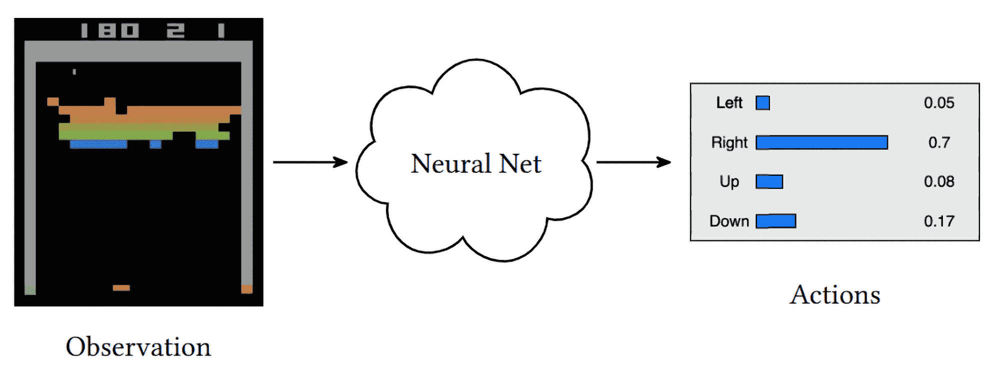
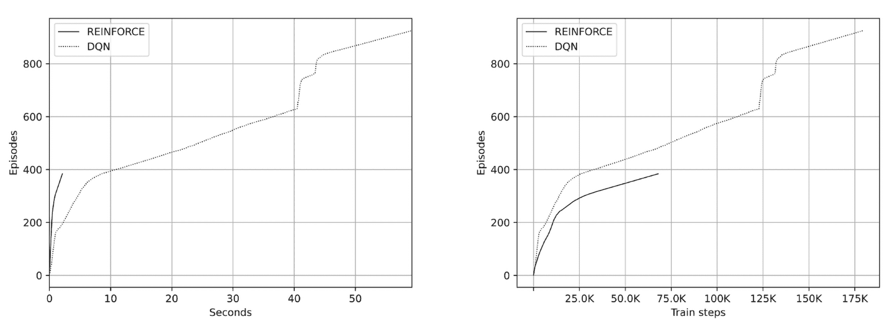
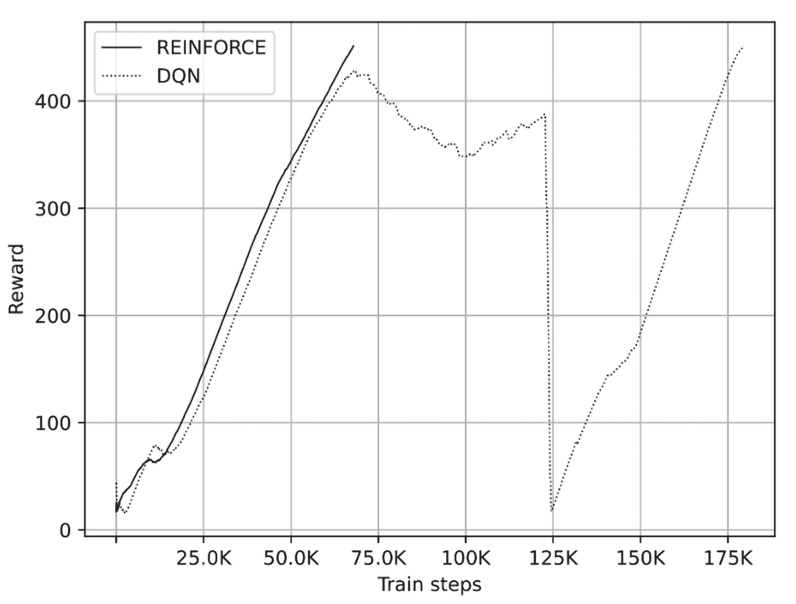
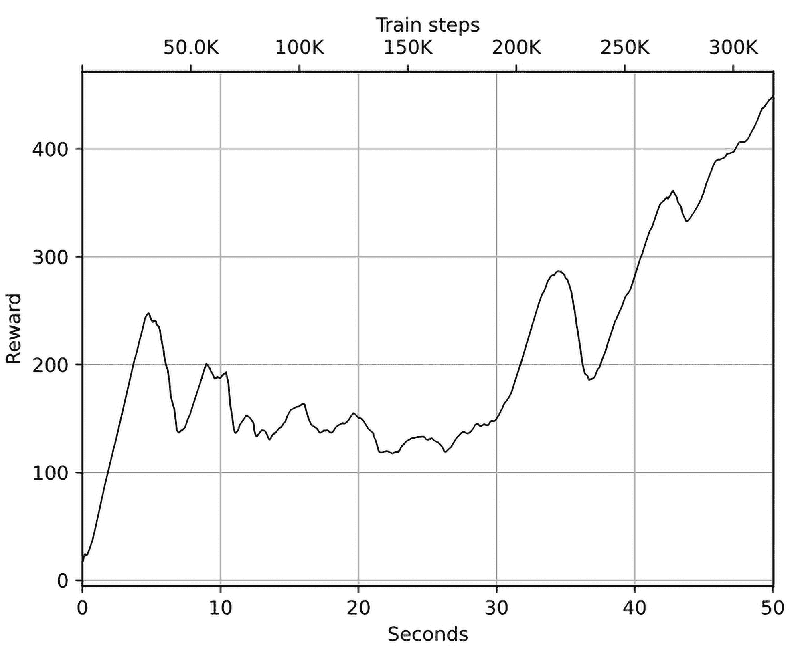
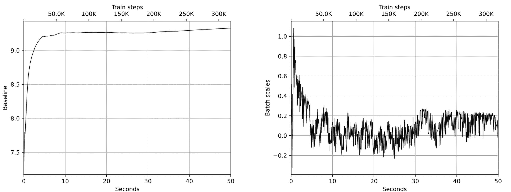
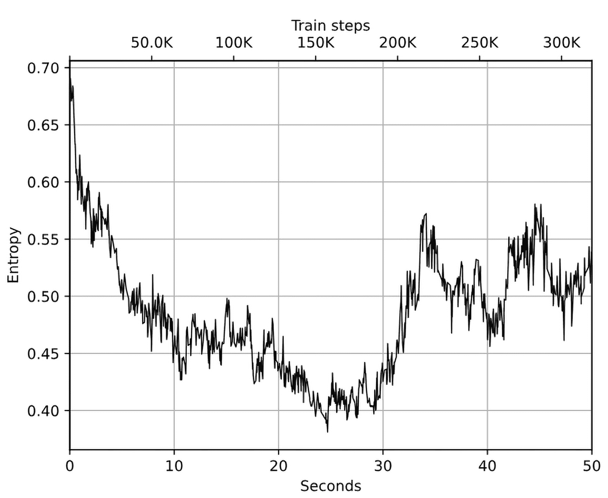
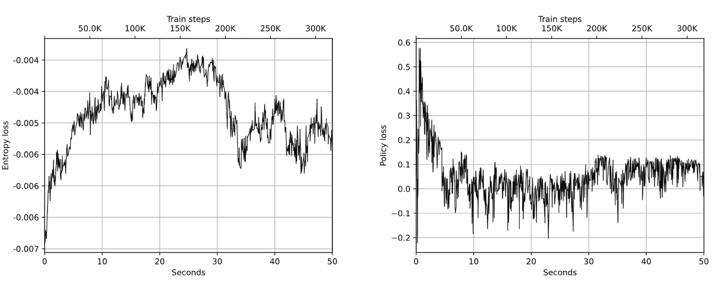
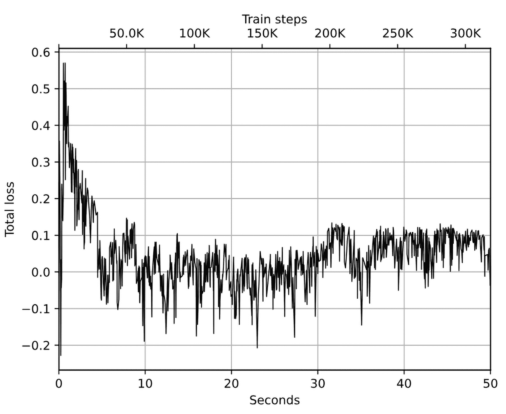
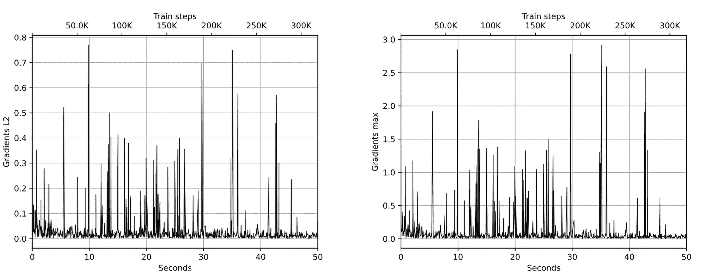
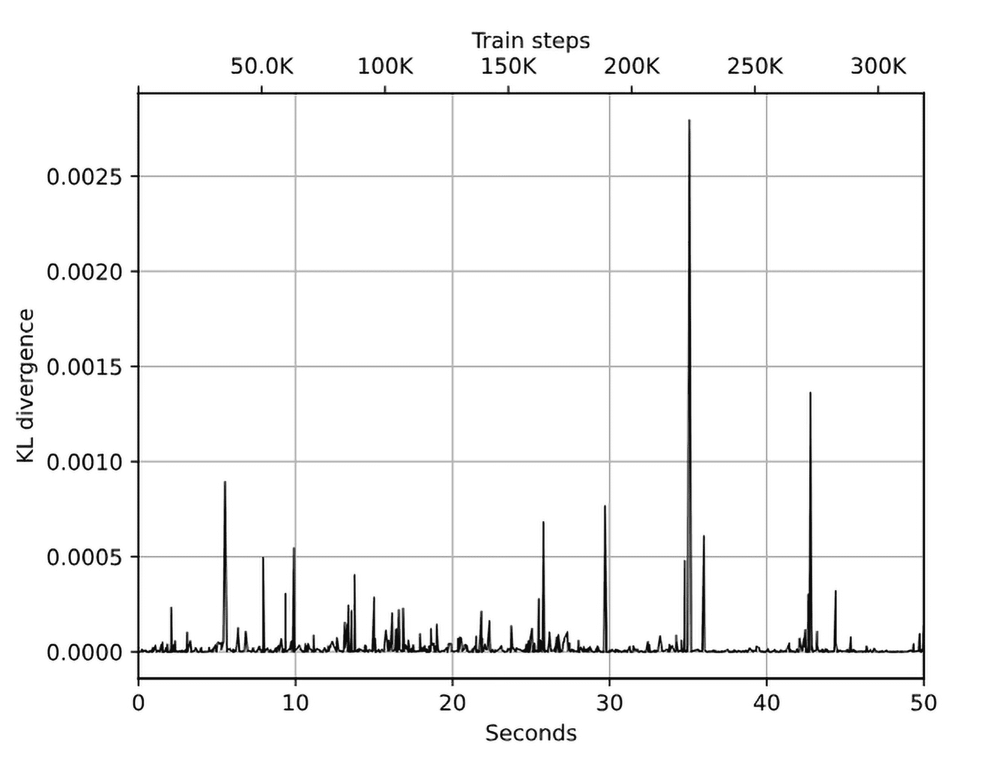

# 第十一章：策略梯度

在本书第三部分的第一章中，我们将考虑一种处理马尔可夫决策过程（MDP）问题的替代方法，这些方法形成了一个完整的策略梯度方法系列。在某些情况下，这些方法比基于值的方法效果更好，因此熟悉它们非常重要。

在这一章中，我们将：

+   概述这些方法、它们的动机，以及与我们已知的 Q 学习方法相比，它们的优缺点。

+   从一个简单的策略梯度方法——REINFORCE 开始，尝试将其应用到我们的 CartPole 环境中，并与深度 Q 网络（DQN）方法进行比较。

+   讨论原始 REINFORCE 方法的问题以及如何通过策略梯度（PG）方法来解决这些问题，这是一种向更高级方法 A3C 迈进的步骤，我们将在下一章详细讨论。

# 值与策略

在进入本章的主要内容——策略梯度之前，让我们回顾一下本书第二部分涵盖的各种方法的共同特征。值迭代和 Q 学习的核心主题是状态的值（V[s]）或状态和动作的值（Q[s,a]）。值被定义为我们从这个状态中获得的折扣总奖励，或者从这个状态发出特定动作所获得的奖励。如果我们知道这个量，我们在每一步的决策就变得简单且显而易见：我们只需要在值的基础上贪婪地行动，这就能确保我们在整个回合结束时获得一个较好的总奖励。因此，状态的值（在值迭代方法中）或状态+动作的值（在 Q 学习中）在我们与最佳奖励之间架起了一座桥梁。为了得到这些值，我们使用了贝尔曼方程，它通过下一个步骤的值来表示当前步骤的值。

在第一章中，我们定义了在每个状态下告诉我们该做什么的实体为策略。正如 Q 学习方法一样，当值告诉我们如何行动时，它们实际上是在定义我们的策略。正式来说，这可以写成π(s) = arg max[a]Q(s,a)，这意味着在每个状态 s 下，我们的策略π的结果是具有最大 Q 值的动作。

策略与值的关系是显而易见的，所以我没有将策略单独作为一个实体进行强调，我们的大部分时间都在讨论值以及如何正确地近似它们。现在是时候关注这个关系以及策略本身了。

## 为什么是策略？

策略是一个值得深入探讨的有趣话题，原因有很多。首先，当我们处理强化学习问题时，策略正是我们需要寻找的内容。当智能体获得观察结果并需要决定下一步行动时，它需要的是策略，而不是状态或特定动作的值。我们确实关心总奖励，但在每个状态下，我们可能对状态的确切值并不感兴趣。

想象一下这种情况：你正在丛林中走路，突然意识到有一只饥饿的老虎藏在灌木丛中。你有几种选择，比如跑步、躲藏或者试图把背包扔向它，但问“跑步这个动作的确切值是多少？它大于什么都不做的动作值吗？”有点傻。你并不太关心这个值，因为你需要迅速做出决定，仅此而已。我们的 Q 学习方法通过近似状态的值并尝试选择最佳备选方案来间接回答策略问题，但如果我们对值不感兴趣，为什么要做多余的工作呢？

策略可能更受欢迎的另一个原因是当环境有很多动作，或者在极端情况下，具有连续动作空间的问题。为了能够根据 Q(s,a)决定最佳动作，我们需要解决一个小的优化问题，寻找能够最大化 Q(s,a)的 a。在一个具有多个离散动作的 Atari 游戏中，这不是问题：我们只是近似所有动作的值，并选择 Q 值最大的动作。如果我们的动作不是一个小的离散集合，而是附有标量值，如方向盘角度或我们希望从老虎那里逃跑的速度，那么这个优化问题变得非常困难，因为 Q 通常是由一个高度非线性的神经网络（NN）表示的，因此找到能最大化函数值的参数可能会很棘手。在这种情况下，避免使用值并直接处理策略要可行得多。

策略学习的额外好处之一是具有随机性的环境。正如你在第八章看到的，在一个分类 DQN 中，我们的智能体可以通过处理 Q 值的分布而非期望均值，获得很大的收益，因为我们的网络能够更精确地捕捉到潜在的概率分布。正如你在下一节将看到的，策略自然表示为行动的概率，这一步与分类 DQN 方法的方向一致。

## 策略表示

现在你已经了解了策略的好处，让我们试试看。那么，我们如何表示策略呢？在 Q 值的情况下，它们是由返回动作值的标量的神经网络（NN）参数化的。如果我们希望我们的网络对动作进行参数化，我们有几种选择。最简单的方式可能就是直接返回动作的标识符（在离散动作集合的情况下）。然而，这并不是处理离散集合的最佳方式。一个更常见的解决方案，在分类任务中被广泛使用，是返回我们动作的概率分布。换句话说，对于 N 个互斥的动作，我们返回 N 个数字，表示在给定状态下采取每个动作的概率（我们将状态作为输入传递给网络）。这种表示方法在下图中展示：



图 11.1：离散动作集的神经网络策略近似

将动作表示为概率的这种方式有一个额外的优势，就是平滑的表示：如果我们稍微改变网络的权重，网络的输出也会发生轻微变化。在离散数值输出的情况下，即使权重做了小幅调整，也可能导致跳跃到不同的动作。然而，如果我们的输出是概率分布，权重的微小变化通常会导致输出分布的轻微变化，例如稍微增加某个动作的概率，而其他动作的概率相应减少。这是一个非常好的特性，因为梯度优化方法的核心就是稍微调整模型的参数来改进结果。

## 策略梯度

我们已经决定了策略的表示方式，但到目前为止我们还没有看到的是如何改变网络的参数来改善策略。如果你还记得第四章，我们通过交叉熵方法解决了一个非常相似的问题：我们的网络将观察值作为输入，并返回动作的概率分布。实际上，交叉熵方法是我们在本书这一部分将讨论的方法的“弟弟”。首先，我们将了解一种叫做 REINFORCE 的方法，它与交叉熵方法仅有细微的区别，但在此之前，我们需要了解一些我们将在本章及后续章节中使用的数学符号。

我们将策略梯度定义为∇J ≈𝔼[Q(s,a)∇log π(a|s)]。当然，这有强有力的证明，但这并不是最重要的。我们更感兴趣的是这个表达式的含义。

策略梯度定义了我们需要改变网络参数的方向，以根据累积的总奖励来改进策略。梯度的大小与所采取的动作的值成正比，这个值在公式中表示为 Q(s,a)，梯度等于所采取动作的对数概率的梯度。这意味着我们试图增加那些给我们带来较好总奖励的动作的概率，并减少那些带来较差最终结果的动作的概率。公式中的期望符号𝔼只是表示我们对在环境中采取的几个步骤的梯度进行平均。

从实际应用的角度来看，策略梯度方法可以通过优化这个损失函数来实现：ℒ = −Q(s,a)log π(a|s)。负号很重要，因为在随机梯度下降（SGD）过程中，损失函数是被最小化的，但我们希望最大化我们的策略梯度。你将在本章及后续章节中看到策略梯度方法的代码示例。

# REINFORCE 方法

你刚刚看到的策略梯度公式是大多数基于策略的方法所使用的，但具体细节可能会有所不同。一个非常重要的点是如何精确地计算梯度尺度，Q(s,a)。在第四章的交叉熵方法中，我们播放了几个回合，计算了每个回合的总奖励，并训练来自奖励优于平均水平的回合的转移。这种训练过程是一个策略梯度方法，对于来自好回合（有较大总奖励）的状态-动作对，Q(s,a) = 1，而对于来自差回合的状态-动作对，Q(s,a) = 0。

交叉熵方法即使在那些简单的假设下也能起作用，但显而易见的改进是用 Q(s,a)来进行训练，而不仅仅是 0 和 1。为什么这样会有帮助？答案是可以更精细地区分回合。例如，来自总奖励为 10 的回合的转移应该比来自奖励为 1 的回合的转移对梯度贡献更大。另一个使用 Q(s,a)而不仅仅是 0 或 1 常数的原因是，在回合的开始增加好动作的概率，并减少接近回合结束时的动作概率。在交叉熵方法中，我们选取“精英”回合，并训练其动作，而不管动作在回合中的偏移量。通过使用 Q(s,a)（包括折扣因子γ），我们在回合开始时对好动作给予更多重视，而不是回合结束时的动作。这正是 REINFORCE 方法的思想。其步骤如下：

1.  使用随机权重初始化网络。

1.  播放 N 个完整的回合，保存它们的(s,a,r,s′)转移。

1.  对每个回合 k 的每一步 t，计算随后的步骤的折扣总奖励：

    ![π (a |s) = P[At = a|St = s] ](img/eq40.png)

1.  计算所有转移的损失函数：

    ![π (a |s) = P[At = a|St = s] ](img/eq41.png)

1.  执行 SGD 更新权重，最小化损失。

1.  从第 2 步开始重复，直到收敛为止。

该算法与 Q 学习有几个重要的不同之处：

+   不需要显式探索：在 Q 学习中，我们使用了ε-greedy 策略来探索环境，并防止我们的智能体陷入一个非最优策略中。现在，使用网络返回的概率，探索过程会自动进行。最开始，网络以随机权重初始化，返回均匀概率分布。这种分布对应于智能体的随机行为。

+   不使用回放缓冲区：策略梯度方法属于在线方法类，这意味着我们不能使用旧策略获得的数据进行训练。这既有好的一面，也有坏的一面。好的一面是，这类方法通常收敛较快。坏的一面是，它们通常比离策略方法（如 DQN）需要更多的环境交互。

+   不需要目标网络：在这里，我们使用 Q 值，但它们是从我们在环境中的经验中获得的。在 DQN 中，我们使用目标网络来打破 Q 值逼近中的相关性，但我们不再进行逼近了。在下一章，你会看到目标网络技巧在策略梯度方法中仍然是有用的。

## CartPole 示例

为了看到这个方法的实际效果，我们来检查在熟悉的 CartPole 环境中实现 REINFORCE 方法的代码。该示例的完整代码位于 Chapter11/02_cartpole_reinforce.py。

一开始，我们定义了超参数（省略了导入部分）：

```py
GAMMA = 0.99 
LEARNING_RATE = 0.01 
EPISODES_TO_TRAIN = 4
```

EPISODES_TO_TRAIN 值指定了我们将用于训练的完整回合数。

以下网络也应该对你来说很熟悉：

```py
class PGN(nn.Module): 
    def __init__(self, input_size: int, n_actions: int): 
        super(PGN, self).__init__() 

        self.net = nn.Sequential( 
            nn.Linear(input_size, 128), 
            nn.ReLU(), 
            nn.Linear(128, n_actions) 
        ) 

    def forward(self, x: torch.Tensor) -> torch.Tensor: 
        return self.net(x)
```

注意，尽管我们的网络返回的是概率，但我们并没有对输出应用 softmax 非线性激活函数。这样做的原因是，我们将使用 PyTorch 的 log_softmax 函数一次性计算 softmax 输出的对数。这样计算方法在数值上更稳定；但是，我们需要记住，网络的输出不是概率，而是原始得分（通常称为 logits）。

下一个函数有点棘手：

```py
def calc_qvals(rewards: tt.List[float]) -> tt.List[float]: 
    res = [] 
    sum_r = 0.0 
    for r in reversed(rewards): 
        sum_r *= GAMMA 
        sum_r += r 
        res.append(sum_r) 
    return list(reversed(res))
```

它接受一个包含整个回合奖励的列表，并需要为每一步计算折扣后的总奖励。为了高效地做到这一点，我们从局部奖励列表的末尾计算奖励。实际上，回合的最后一步将具有与其局部奖励相等的总奖励。倒数第二步的总奖励将是 r[t−1] + γ ⋅r[t]（如果 t 是最后一步的索引）。

我们的 sum_r 变量包含前一步的总奖励，因此要获取当前步骤的总奖励，我们需要将 sum_r 乘以 γ 并加上该步骤的局部奖励。

训练循环之前的准备步骤应该对你来说也很熟悉：

```py
if __name__ == "__main__": 
    env = gym.make("CartPole-v1") 
    writer = SummaryWriter(comment="-cartpole-reinforce") 

    net = PGN(env.observation_space.shape[0], env.action_space.n) 
    print(net) 

    agent = ptan.agent.PolicyAgent( 
        net, preprocessor=ptan.agent.float32_preprocessor, apply_softmax=True) 
    exp_source = ExperienceSourceFirstLast(env, agent, gamma=GAMMA) 

    optimizer = optim.Adam(net.parameters(), lr=LEARNING_RATE)
```

唯一的新元素是来自 PTAN 库的 agent 类。在这里，我们使用 ptan.agent.PolicyAgent，它需要为每个观测做出动作决策。由于我们的网络现在返回的是动作的概率分布，为了选择要执行的动作，我们需要从网络中获取概率，然后从该概率分布中进行随机采样。

当我们使用 DQN 时，网络的输出是 Q 值，因此如果某个动作的值为 0.4，另一个动作的值为 0.5，那么第二个动作就会被 100% 的概率优先选择。在概率分布的情况下，如果第一个动作的概率为 0.4，第二个动作的概率为 0.5，我们的智能体应该以 40% 的概率选择第一个动作，以 50% 的概率选择第二个动作。当然，我们的网络也可以决定 100% 选择第二个动作，在这种情况下，第一个动作的概率为 0，第二个动作的概率为 1。

这个差异很重要，需要理解，但实现上的变化不大。我们的 PolicyAgent 内部调用 NumPy 的 random.choice()函数，并使用网络的概率。apply_softmax 参数指示它首先通过调用 softmax 将网络输出转换为概率。第三个参数 preprocessor 是为了绕过 Gymnasium 中的 CartPole 环境返回的观察值是 float64 类型，而 PyTorch 需要 float32 类型的问题。

在开始训练循环之前，我们需要一些变量：

```py
 total_rewards = [] 
    done_episodes = 0 

    batch_episodes = 0 
    batch_states, batch_actions, batch_qvals = [], [], [] 
    cur_rewards = []
```

前两个变量 total_rewards 和 done_episodes 用于报告，包含回合的总奖励和已完成回合的计数。接下来的几个变量用于收集训练数据。cur_rewards 列表包含当前正在进行的回合的局部奖励。当该回合结束时，我们使用 calc_qvals()函数从局部奖励计算折扣后的总奖励，并将其添加到 batch_qvals 列表中。batch_states 和 batch_actions 列表包含我们在上次训练中看到的状态和动作。

以下代码片段是训练循环的开始：

```py
 for step_idx, exp in enumerate(exp_source): 
        batch_states.append(exp.state) 
        batch_actions.append(int(exp.action)) 
        cur_rewards.append(exp.reward) 

        if exp.last_state is None: 
            batch_qvals.extend(calc_qvals(cur_rewards)) 
            cur_rewards.clear() 
            batch_episodes += 1
```

我们从经验源中获得的每个经验包含状态、动作、局部奖励和下一个状态。如果回合已结束，下一个状态将为 None。对于非终止的经验条目，我们只需将状态、动作和局部奖励保存在列表中。在回合结束时，我们将局部奖励转换为 Q 值，并增加回合计数器。

训练循环的这一部分在回合结束时执行，负责报告当前进展并将指标写入 TensorBoard：

```py
 new_rewards = exp_source.pop_total_rewards() 
        if new_rewards: 
            done_episodes += 1 
            reward = new_rewards[0] 
            total_rewards.append(reward) 
            mean_rewards = float(np.mean(total_rewards[-100:])) 
            print(f"{step_idx}: reward: {reward:6.2f}, mean_100: {mean_rewards:6.2f}, " 
                  f"episodes: {done_episodes}") 
            writer.add_scalar("reward", reward, step_idx) 
            writer.add_scalar("reward_100", mean_rewards, step_idx) 
            writer.add_scalar("episodes", done_episodes, step_idx) 
            if mean_rewards > 450: 
                print(f"Solved in {step_idx} steps and {done_episodes} episodes!") 
                break
```

当自上次训练步骤以来经过足够的回合时，我们可以优化收集到的示例。第一步，我们将状态、动作和 Q 值转换为适当的 PyTorch 格式：

```py
 if batch_episodes < EPISODES_TO_TRAIN: 
            continue 

        optimizer.zero_grad() 
        states_t = torch.as_tensor(np.asarray(batch_states)) 
        batch_actions_t = torch.as_tensor(np.asarray(batch_actions)) 
        batch_qvals_t = torch.as_tensor(np.asarray(batch_qvals))
```

然后，我们根据步骤计算损失：

```py
 logits_t = net(states_t) 
        log_prob_t = F.log_softmax(logits_t, dim=1) 
        batch_idx = range(len(batch_states)) 
        act_probs_t = log_prob_t[batch_idx, batch_actions_t] 
        log_prob_actions_v = batch_qvals_t * act_probs_t 
        loss_t = -log_prob_actions_v.mean()
```

在这里，我们要求网络将状态计算为 logits，并计算其对数和 softmax。在第三行，我们从所采取的动作中选择对数概率，并用 Q 值进行缩放。在最后一行，我们平均这些缩放后的值并取负数，以获得需要最小化的损失。再强调一下，这个负号非常重要，因为我们的策略梯度需要最大化，以改善策略。由于 PyTorch 中的优化器是最小化损失函数的，因此我们需要取策略梯度的负值。

剩余的代码很清晰：

```py
 loss_t.backward() 
        optimizer.step() 

        batch_episodes = 0 
        batch_states.clear() 
        batch_actions.clear() 
        batch_qvals.clear() 

    writer.close()
```

在这里，我们执行反向传播来收集变量中的梯度，并要求优化器执行 SGD 更新。在训练循环结束时，我们重置回合计数器并清空列表，以便收集新的数据。

## 结果

作为参考，我在 CartPole 环境中实现了 DQN，使用的超参数几乎与我们的 REINFORCE 示例相同。你可以在 Chapter11/01_cartpole_dqn.py 中找到它。两个示例都不需要任何命令行参数，并且它们应该在不到一分钟的时间内收敛：

```py
Chapter11$ ./02_cartpole_reinforce.py 
PGN( 
  (net): Sequential( 
   (0): Linear(in_features=4, out_features=128, bias=True) 
   (1): ReLU() 
   (2): Linear(in_features=128, out_features=2, bias=True) 
  ) 
) 
31: reward:  31.00, mean_100:  31.00, episodes: 1 
42: reward:  11.00, mean_100:  21.00, episodes: 2 
54: reward:  12.00, mean_100:  18.00, episodes: 3 
94: reward:  40.00, mean_100:  23.50, episodes: 4 
159: reward:  65.00, mean_100:  31.80, episodes: 5 
... 
65857: reward: 500.00, mean_100: 440.60, episodes: 380 
66357: reward: 500.00, mean_100: 442.42, episodes: 381 
66857: reward: 500.00, mean_100: 445.59, episodes: 382 
67357: reward: 500.00, mean_100: 448.24, episodes: 383 
67857: reward: 500.00, mean_100: 451.31, episodes: 384 
Solved in 67857 steps and 384 episodes!
```

DQN 和 REINFORCE 的收敛动态如下图所示。你的训练动态可能会因训练的随机性而有所不同。



图 11.2：随着时间推移的回合数（左）和训练步骤（右）

这两张图表比较了随时间推移和训练步骤的回合数。

下一张图表比较了平滑的回合奖励：



图 11.3：两种方法的奖励动态

如你所见，方法几乎以相同的速度收敛（REINFORCE 略快），但当平均奖励超过 400 时，DQN 出现了问题，必须几乎从头开始。

如果你还记得第四章，交叉熵方法需要大约 40 个批次，每个批次 16 个回合来解决 CartPole 环境，总共是 640 个回合。REINFORCE 方法能够在不到 400 个回合内完成同样的任务，这是一个很好的改进。

## 基于策略与基于价值的方法

现在让我们暂时回顾一下我们刚才看到的代码，并检查这些方法家族之间的差异：

+   策略方法直接优化我们关心的内容：我们的行为。价值方法，如 DQN，通过间接的方式来做同样的事情，先学习价值，然后根据这个价值提供策略。

+   策略方法是在线的，需要来自环境的新样本。价值方法可以从旧的数据中受益，这些数据来自于旧的策略、人类示范以及其他来源。

+   策略方法通常较为低效，意味着它们需要更多与环境的交互。价值方法可以从大规模的回放缓冲区中受益。然而，样本效率并不意味着价值方法在计算效率上更高，实际上，往往是相反的。

+   在前面的示例中，在训练过程中，我们只需要访问一次神经网络，以获得行动的概率。在 DQN 中，我们需要处理两批状态：一批是当前状态，另一批是贝尔曼更新中的下一个状态。

如你所见，似乎没有强烈的倾向偏向某个方法家族。在某些情况下，策略方法会是更自然的选择，比如在连续控制问题中，或者在环境访问便宜且快速的情况下。然而，也有许多情况是价值方法会大放异彩，比如最近 DQN 变体在 Atari 游戏上的最新成果。理想情况下，你应该熟悉这两种方法家族，并理解它们的优缺点。

在下一节中，我们将讨论 REINFORCE 方法的局限性、改进方法，以及如何将政策梯度方法应用到我们最喜欢的 Pong 游戏中。

# REINFORCE 问题

在前一节中，我们讨论了 REINFORCE 方法，它是交叉熵方法的自然扩展。不幸的是，REINFORCE 和交叉熵方法仍然存在一些问题，这使得它们都仅限于简单的环境中。

## 需要完整的回合

首先，我们仍然需要等待完整的回合结束才能开始训练。更糟糕的是，REINFORCE 和交叉熵方法在使用更多回合进行训练时表现更好（只是因为更多的回合意味着更多的训练数据，这意味着更准确的政策梯度）。这种情况在 CartPole 的短回合中是可以接受的，因为一开始我们几乎无法保持杆子超过 10 步；但在 Pong 中，情况完全不同：每个回合可能持续数百甚至数千帧。从训练的角度来看，这同样糟糕，因为我们的训练批次变得非常大；从样本效率的角度来看，我们需要与环境进行大量的交互才能执行一次训练步骤。

完整回合要求的目的是尽可能准确地获得 Q 估计。当我们讨论 DQN 时，你会看到，实际上，用一阶贝尔曼方程替换折扣奖励的精确值与我们的估计是可以的：Q(s,a) = r[a] + γV (s′)。为了估计 V(s)，我们使用了自己的 Q 估计，但在政策梯度的情况下，我们不再有 V(s) 或 Q(s,a)。

为了解决这个问题，存在两种方法：

+   我们可以要求我们的网络估计 V(s)，并使用这个估计来获得 Q。这种方法将在下一章讨论，它被称为演员-评论员方法，是政策梯度家族中最流行的方法。

+   另外，我们可以执行贝尔曼方程，展开 N 步，这将有效利用当 γ 小于 1 时，价值贡献递减的事实。事实上，当 γ = 0.9 时，第 10 步的价值系数将是 0.9¹⁰ ≈ 0.35。在第 50 步时，这个系数将是 0.9⁵⁰ ≈ 0.00515，这对总奖励的贡献非常小。当 γ = 0.99 时，所需的步数会变大，但我们仍然可以这样做。

## 高梯度方差

在策略梯度公式中，∇J ≈𝔼[Q(s,a)∇log π(a|s)]，我们得到了与给定状态下的折扣奖励成正比的梯度。然而，这个奖励的范围受到环境的高度依赖。例如，在 CartPole 环境中，我们每当保持杆子垂直时，就会得到 1 的奖励。如果我们能保持五步，我们将获得总的（未折扣的）奖励为 5。如果我们的智能体非常聪明，能够保持杆子，例如 100 步，总奖励将是 100。两者之间的价值差异是 20 倍，这意味着失败样本的梯度尺度将比成功样本低 20 倍。如此巨大的差异会严重影响我们的训练动态，因为一次幸运的经历会在最终梯度中占主导地位。

从数学角度来看，策略梯度具有较高的方差，在复杂环境中我们需要采取措施来解决这个问题；否则，训练过程可能会变得不稳定。通常处理这种情况的方法是从 Q 中减去一个称为基准值的值。基准值的可能选择如下：

+   一个常数值，通常是折扣奖励的平均值

+   折扣奖励的移动平均值

+   状态的价值，V (s)

为了说明基准值对训练的影响，在 Chapter11/03_cartpole_reinforce_baseline.py 中，我实现了第二种计算基准值的方法（奖励的平均值）。与您已经看到的版本唯一不同的是在 calc_qvals()函数中。我这里不打算讨论结果；您可以自己进行实验。

## 探索问题

即使策略表示为概率分布，智能体仍然有很大概率会收敛到某个局部最优策略，并停止探索环境。在 DQN 中，我们通过 epsilon-greedy 行动选择来解决这个问题：以 epsilon 的概率，智能体采取一个随机行动，而不是由当前策略决定的行动。当然，我们也可以使用相同的方法，但策略梯度方法允许我们走一条更好的路径，称为熵奖励。

在信息论中，熵是衡量系统不确定性的一个指标。应用到智能体的策略中，熵显示了智能体在选择行动时的不确定性。用数学符号表示，策略的熵定义为 H(π) = −∑ π(a|s)log π(a|s)。熵的值总是大于零，当策略均匀时，熵有一个单一的最大值；换句话说，所有动作的概率相同。当我们的策略对于某一动作的概率为 1，其他动作的概率为 0 时，熵最小，这意味着智能体完全确定该做什么。为了防止智能体陷入局部最小值，我们从损失函数中减去熵，惩罚智能体对采取的行动过于确定。

## 样本的高度相关性

正如我们在第六章中讨论的那样，单个回合中的训练样本通常高度相关，这对于 SGD 训练来说是不好的一点。在 DQN 的情况下，我们通过拥有一个大小从 100,000 到几百万个观察值的大型重放缓冲区来解决这个问题。这个解决方案对于策略梯度类方法就不适用了，因为这些方法属于在策略类。其含义很简单：使用旧策略生成的旧样本，我们会得到该旧策略的策略梯度，而不是当前策略的。

显而易见，但不幸的是错误的解决方案是减少重放缓冲区的大小。这在一些简单的案例中可能有效，但一般来说，我们需要由当前策略生成的新鲜训练数据。为了解决这个问题，通常使用并行环境。其想法很简单：我们不与一个环境进行通信，而是使用多个环境，并利用它们的过渡作为训练数据。

# CartPole 上的策略梯度方法

如今，几乎没有人再使用原始的策略梯度方法，因为更稳定的演员-评论家方法已经存在。然而，我仍然想展示策略梯度的实现，因为它建立了非常重要的概念和衡量标准，用于检查策略梯度方法的性能。

## 实现

我们将从一个简单得多的 CartPole 环境开始，在接下来的部分中，我们将检查其在我们最喜欢的 Pong 环境中的表现。以下示例的完整代码可在 Chapter11/04_cartpole_pg.py 中找到。

除了已经熟悉的超参数外，我们还有两个新的超参数：

```py
GAMMA = 0.99 
LEARNING_RATE = 0.001 
ENTROPY_BETA = 0.01 
BATCH_SIZE = 8 

REWARD_STEPS = 10
```

ENTROPY_BETA 值是熵奖励的规模，REWARD_STEPS 值指定了展开 Bellman 方程的步数，用以估算每个过渡的折扣总奖励。

以下是网络架构：

```py
class PGN(nn.Module): 
    def __init__(self, input_size: int, n_actions: int): 
        super(PGN, self).__init__() 

        self.net = nn.Sequential( 
            nn.Linear(input_size, 128), 
            nn.ReLU(), 
            nn.Linear(128, n_actions) 
        ) 

    def forward(self, x: torch.Tensor) -> torch.Tensor: 
        return self.net(x)
```

这与之前 CartPole 示例中的完全相同：一个隐藏层有 128 个神经元的两层网络。准备代码也与之前相同，除了经验源需要展开 Bellman 方程 10 步。

以下是与 04_cartpole_pg.py 不同的部分：

```py
 exp_source = ptan.experience.ExperienceSourceFirstLast( 
        env, agent, gamma=GAMMA, steps_count=REWARD_STEPS)
```

在训练循环中，我们维护每个过渡的折扣奖励之和，并用它来计算策略尺度的基准：

```py
 for step_idx, exp in enumerate(exp_source): 
        reward_sum += exp.reward 
        baseline = reward_sum / (step_idx + 1) 
        writer.add_scalar("baseline", baseline, step_idx) 
        batch_states.append(exp.state) 
        batch_actions.append(int(exp.action)) 
        batch_scales.append(exp.reward - baseline)
```

在损失计算中，我们使用与之前相同的代码来计算策略损失（即负的策略梯度）：

```py
 optimizer.zero_grad() 
        logits_t = net(states_t) 
        log_prob_t = F.log_softmax(logits_t, dim=1) 
        act_probs_t = log_prob_t[range(BATCH_SIZE), batch_actions_t] 
        log_prob_actions_t = batch_scale_t * act_probs_t 
        loss_policy_t = -log_prob_actions_t.mean()
```

然后，我们通过计算批次的熵并从损失中减去它，来向损失中添加熵奖励。由于熵对于均匀概率分布有最大值，而我们希望将训练推动到这个最大值，所以我们需要从损失中减去熵。

```py
 prob_t = F.softmax(logits_t, dim=1) 
        entropy_t = -(prob_t * log_prob_t).sum(dim=1).mean() 
        entropy_loss_t = -ENTROPY_BETA * entropy_t 
        loss_t = loss_policy_t + entropy_loss_t 

        loss_t.backward() 
        optimizer.step()
```

然后，我们计算新策略与旧策略之间的 Kullback-Leibler (KL) 散度。KL 散度是信息论中的一个概念，用来衡量一个概率分布与另一个预期概率分布的差异，就像我们在第四章中所看到的那样。在我们的例子中，它被用来比较优化步骤前后模型返回的策略：

```py
 new_logits_t = net(states_t) 
        new_prob_t = F.softmax(new_logits_t, dim=1) 
        kl_div_t = -((new_prob_t / prob_t).log() * prob_t).\ 
            sum(dim=1).mean() 
        writer.add_scalar("kl", kl_div_t.item(), step_idx)
```

KL 的高峰通常是一个不好的信号，因为这意味着我们的策略与之前的策略相差太远，这在大多数情况下都是不好的做法（因为我们的神经网络是一个高维空间中的非常非线性函数，模型权重的如此大变化可能会对策略产生非常强的影响）。

最后，我们计算这一步训练中的梯度统计数据。通常，展示梯度的最大值和 L2 范数（即向量的长度）图表是一种好的实践，这可以帮助我们了解训练动态。

```py
 grad_max = 0.0 
        grad_means = 0.0 
        grad_count = 0 
        for p in net.parameters(): 
            grad_max = max(grad_max, p.grad.abs().max().item()) 
            grad_means += (p.grad ** 2).mean().sqrt().item() 
            grad_count += 1
```

在训练循环结束时，我们将所有希望在 TensorBoard 中监视的值进行转储：

```py
 writer.add_scalar("baseline", baseline, step_idx) 
        writer.add_scalar("entropy", entropy, step_idx) 
        writer.add_scalar("loss_entropy", l_entropy, step_idx) 
        writer.add_scalar("loss_policy", l_policy, step_idx) 
        writer.add_scalar("loss_total", l_total, step_idx) 
        writer.add_scalar("grad_l2", grad_means / grad_count, step_idx) 
        writer.add_scalar("grad_max", grad_max, step_idx) 
        writer.add_scalar("batch_scales", bs_smoothed, step_idx) 

        batch_states.clear() 
        batch_actions.clear() 
        batch_scales.clear()
```

## 结果

在这个例子中，我们将在 TensorBoard 中绘制许多图表。让我们从熟悉的图表开始：奖励。如以下图所示，动态和表现与 REINFORCE 方法没有太大不同：



图 11.4：策略梯度法的奖励动态

接下来的两个图表与我们的基线和策略梯度的尺度相关。我们预计基线将收敛到 1 + 0.99 + 0.99² + … + 0.99⁹，大约为 9.56。策略梯度的尺度应围绕零波动。这正是我们在下图中看到的：



图 11.5：基线值（左）与批次尺度（右）

熵随着时间的推移从 0.69 降到 0.52（图 11.6）。起始值对应于具有两个动作的最大熵，大约为 0.69：

![π (a |s) = P[At = a|St = s] ](img/eq42.png) ![π (a |s) = P[At = a|St = s] ](img/eq43.png)

熵在训练过程中减少，如下图所示，这表明我们的策略正在从均匀分布转向更确定性的动作：



图 11.6：训练过程中的熵

下一组图表（图 11.7 和图 11.8）与损失相关，包括策略损失、熵损失及其总和。熵损失经过缩放，是前面熵图的镜像版本。策略损失显示了在批次上计算的策略梯度的均值、尺度和方向。在这里，我们应检查两者的相对大小，以防熵损失过度主导。



图 11.7：熵损失（左）与策略损失（右）



图 11.8：总损失

最后一组图表（图 11.9 和图 11.10）显示了梯度的 L2 值、L2 的最大值和 KL 值。我们的梯度在整个训练过程中看起来很健康：它们不太大也不太小，没有出现巨大的波动。KL 图表也看起来正常，虽然有一些波动，但它们并不大，并且没有超过 10^(-3)：



图 11.9：梯度 L2（左）和最大值（右）



图 11.10：KL 散度

# Pong 上的策略梯度方法

正如我们在前一节中看到的，标准的策略梯度方法在简单的 CartPole 环境中表现良好，但在更复杂的环境中却表现得出奇的差。

对于相对简单的 Atari 游戏《Pong》，我们的 DQN 能够在 100 万帧内完全解决它，并且在仅仅 10 万帧内就显示出了正向奖励动态，而策略梯度方法则未能收敛。由于策略梯度训练的不稳定性，很难找到合适的超参数，并且对初始化非常敏感。这并不意味着策略梯度方法不好，因为正如你在下一章将看到的，只需稍微调整网络架构以获得更好的基线梯度，策略梯度方法就会变成最好的方法之一（异步优势演员评论员方法）。当然，也有很大的可能性我的超参数完全错误，或者代码中存在一些隐藏的 BUG，或者可能有其他未预见的问题。无论如何，失败的结果仍然有价值，至少它能展示不良收敛动态。

## 实现

你可以在 Chapter11/05_pong_pg.py 中找到完整的示例代码。

与前一个示例代码相比，主要有三个区别：

+   基线是通过对过去 100 万个过渡进行移动平均来估算的，而不是对所有示例进行估算。为了加速移动平均的计算，创建了一个由 deque 支持的缓冲区：

    ```py
    class MeanBuffer: 
        def __init__(self, capacity: int): 
            self.capacity = capacity 
            self.deque = collections.deque(maxlen=capacity) 
            self.sum = 0.0 

        def add(self, val: float): 
            if len(self.deque) == self.capacity: 
                self.sum -= self.deque[0] 
            self.deque.append(val) 
            self.sum += val 

        def mean(self) -> float: 
            if not self.deque: 
                return 0.0 
            return self.sum / len(self.deque)
    ```

+   使用了多个并发环境。这个示例中的第二个区别是使用多个环境，这一功能由 PTAN 库提供支持。我们唯一需要做的就是将 Env 对象数组传递给 ExperienceSource 类，其他的都由系统自动完成。在多个环境的情况下，经验源会以轮询的方式请求它们的过渡，从而为我们提供更少相关的训练样本。

+   梯度被裁剪以提高训练的稳定性。与 CartPole 示例的最后一个区别是梯度裁剪，它是使用 PyTorch 的 clip_grad_norm 函数（来自 torch.nn.utils 包）进行的。

最佳变体的超参数如下：

```py
GAMMA = 0.99 
LEARNING_RATE = 0.0001 
ENTROPY_BETA = 0.01 
BATCH_SIZE = 128 

REWARD_STEPS = 10 
BASELINE_STEPS = 1000000 
GRAD_L2_CLIP = 0.1 

ENV_COUNT = 32
```

## 结果

尽管我付出了很多努力使示例收敛，但结果并不理想。即使经过超参数调优（约 400 个超参数样本），最佳结果在训练 1 百万步后，平均奖励仍然约为−19.7。

你可以自己尝试，代码位于 Chapter11/05_pong_pg.py 和 Chapter11/05_pong_pg_tune.py 中。但我只能得出结论，Pong 对于原始的 PG 方法来说过于复杂。

# 总结

在这一章中，你看到了另一种解决强化学习问题的方法：策略梯度方法，它与我们熟悉的 DQN 方法有许多不同之处。我们探索了一种名为 REINFORCE 的基本方法，它是我们在 RL 领域交叉熵方法的一个推广。这个策略梯度方法很简单，但在应用到 Pong 环境时，未能产生良好的结果。

在下一章中，我们将考虑通过结合基于值的方法和基于策略的方法，来提高策略梯度方法的稳定性。
