# 第十三章：TextWorld 环境

本章中，我们将使用强化学习（RL）来解决基于文本的互动小说游戏，使用微软研究院发布的环境——TextWorld。这将很好地展示强化学习如何应用于具有丰富观察空间的复杂环境。此外，我们还将稍微涉及一下深度自然语言处理（NLP）方法，并与大语言模型（LLMs）进行一些互动。

在本章中，我们将：

+   简要回顾互动小说的历史

+   研究 TextWorld 环境

+   实现简单的基准深度 Q 网络（DQN）方法，然后尝试通过对观察进行若干调整来改善它

+   使用 Hugging Face Hub 中的预训练变压器（transformers）为我们的智能体实现句子嵌入

+   使用 OpenAI ChatGPT 检查现代大语言模型（LLMs）在互动小说游戏中的能力

# 互动小说

正如你已经看到的，电脑游戏不仅对人类有娱乐性，还由于其复杂的观察和行动空间、游戏过程中的长决策序列以及自然的奖励系统，为强化学习研究人员提供了具有挑战性的问题。

像 Atari 2600 上的街机游戏只是游戏行业众多类型中的一种。让我们退一步，从历史的角度快速回顾一下。Atari 2600 平台在 70 年代末和 80 年代初的受欢迎程度达到了巅峰。随后进入了 Z80 及其克隆机的时代，演变成现在的 PC 兼容平台和游戏主机时代。随着时间的推移，电脑游戏在复杂性、色彩和图形细节方面不断发展，这不可避免地提高了硬件需求。这一趋势使得强化学习研究人员和从业者在应用强化学习方法到更现代的游戏时遇到困难。例如，几乎每个人都能训练一个强化学习智能体来解决 Atari 游戏，但对于《星际争霸 II》来说，DeepMind 不得不花费数周的电力，利用图形处理单元（GPU）集群。当然，这项工作对未来的研究至关重要，因为它使我们能够检验想法并优化方法，但《星际争霸 II》和《Dota》这类游戏的复杂性使得它们对大多数人来说费用过高。

有几种方法可以解决这个问题：

+   第一个方法是选择那些“介于”Atari 和《星际争霸》复杂性之间的游戏。幸运的是，来自 Z80、NES、Sega 和 C64 平台的游戏多得不可计数。

+   另一种方法是选择一个具有挑战性的游戏，但简化其环境。有几个 Doom 环境（可以在 Gym 中获得），例如，它们使用游戏引擎作为平台，但目标比原始游戏简单得多，比如导航走廊、收集武器或射击敌人。这些微型游戏在《星际争霸 II》中也可以找到。

+   第三种完全不同的方法是，选择一些可能在观察上并不复杂，但需要长期规划、复杂的状态空间探索，并且具有物体间具有挑战性互动的游戏。这一类的例子是著名的雅达利游戏《Montezuma’s Revenge》，即使对于现代的强化学习方法来说，这款游戏依然具有挑战性。

最后一种方法颇具吸引力，因为它的资源可获得性加上仍然具有达到强化学习方法极限的复杂性。另一个例子是基于文本的游戏，这些游戏也被称为互动小说。这个类型的游戏现在几乎消失了，被现代游戏和硬件的发展所淘汰，但在雅达利和 Z80 时代，互动小说和传统游戏是同时提供的。这些游戏并不依赖丰富的图形来展示游戏状态（70 年代的硬件难以实现这一点），而是依赖玩家的思维和想象力。

游戏过程通过文本传达，当游戏的当前状态描述呈现给玩家时，例如：你正站在一条小路的尽头，前方是一座小砖砌建筑。你周围是一片森林。一条小溪从建筑物中流出，沿着山谷流下。

如图 13.1 所示，这是 1976 年冒险游戏的开端，这也是这一类型游戏的第一款。游戏中的动作通过自由文本命令的形式呈现，通常结构简单，词汇量有限，例如，“动词 + 名词”。

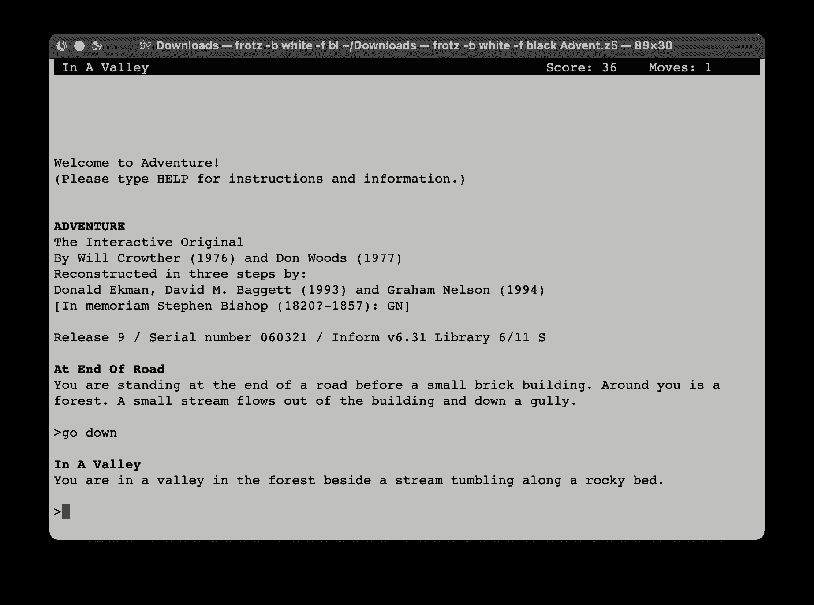

图 13.1：互动小说游戏过程的示例

尽管描述简洁，在 80 年代和 90 年代初，数百款大小游戏由个人开发者和商业工作室开发。这些游戏有时需要数小时的游戏时间，包含成千上万的地点，并有许多物体可供互动。例如，图 13.2 展示了 1980 年 Infocom 发布的 Zork I 游戏地图的一部分。


图 13.2：Zork I 地图的地下部分（为了更好的可视化，请参考 https://packt.link/gbp/9781835882702）

如你所想，这类游戏的挑战几乎可以无限增加，因为它们可以包括物体之间的复杂交互、游戏状态的探索、与其他角色的沟通以及其他现实生活场景。在互动小说档案馆网站上，有许多此类游戏可以体验：[`ifarchive.org`](http://ifarchive.org)。

2018 年 6 月，微软研究院发布了一个开源项目，旨在为研究人员和强化学习爱好者提供一种简单的方式，使用熟悉的工具实验文本游戏。这个名为 TextWorld 的项目可以在 GitHub 上找到（[`github.com/microsoft/TextWorld`](https://github.com/microsoft/TextWorld)），并提供了以下功能：

+   一个用于基于文本的游戏的 Gym 环境。它支持两种格式的游戏：Z-machine 字节码（支持版本 1-8）和 Glulx 游戏。

+   一个游戏生成器，允许你生成具有预定义复杂度的随机生成任务，如物品数量、描述和任务长度。

+   调整（对于生成的游戏）环境复杂度的能力，可以通过查看游戏状态来实现。例如，可以启用中间奖励，每当代理在正确的方向上迈出一步时，就会给予正向奖励。接下来的部分将描述几个这样的因素。

随着本章内容的推进，我们将尝试几个游戏，以探索环境的能力，并实现多个版本的训练代码来解决生成的游戏。你需要通过提供的脚本生成它们：`Chapter13/game/make_games.sh`。它将生成 21 个长度为 5 的游戏，使用不同的种子值确保游戏之间的变化性。这些游戏的复杂度不会很高，但你可以将它们作为自己实验和验证想法的基础。

# 环境

截至目前，TextWorld 环境仅支持 Linux 和 macOS 平台（对于 Windows，你可以使用 Docker 容器），并且内部依赖于 Inform 7 系统（[`inform7.com`](https://inform7.com)）。该项目有两个网页：一个是微软研究网页（[`www.microsoft.com/en-us/research/project/textworld/`](https://www.microsoft.com/en-us/research/project/textworld/)），包含有关环境的一般信息；另一个在 GitHub 上（[`github.com/microsoft/TextWorld`](https://github.com/microsoft/TextWorld)），描述了安装和使用方式。让我们从安装开始。

## 安装

安装可以通过简单的 pip 命令：`pip install textworld==1.6.1`完成。本章中的所有示例都使用最新的 1.6.1 版本包进行了测试。

安装后，可以在 Python 代码中导入该包，并提供两个命令行工具用于游戏生成和游戏玩法：tw-make 和 tw-play。如果你有雄心勃勃的计划，要解决来自[`ifarchive.org`](http://ifarchive.org)的全功能交互式小说游戏，则不需要它们，但在我们的例子中，我们将从人工生成的任务开始，以简化流程。

## 游戏生成

tw-make 工具允许你生成具有以下特点的游戏：

+   游戏场景：例如，你可以选择一个经典任务，目标是使用物品并遵循一系列动作，或是一个“收集金币”场景，玩家需要在各个场景中找到金币。

+   游戏主题：你可以设置游戏的内部环境，但目前只存在“房子”和“基础”两种主题。

+   对象属性：你可以为对象添加形容词；例如，它可能是“绿色的钥匙”打开箱子，而不仅仅是“钥匙”。

+   游戏可以拥有的并行任务数量：默认情况下，游戏中只有一个动作序列可以找到，但你可以更改此设置，允许游戏拥有子目标和替代路径。

+   任务的长度：你可以定义玩家在达到游戏的结局或解决方案之前需要采取多少步。

+   随机种子：你可以使用这些种子来生成可复现的游戏。

生成的游戏可以是 Glulx 或 Z-machine 格式，这些是标准的便携式虚拟机指令，广泛用于普通游戏，并且被多个互动小说解释器支持，因此你可以像玩普通互动小说游戏一样玩生成的游戏。

让我们生成一些游戏，看看它们带来什么：

```py
$ tw-make tw-coin_collector --output t1 --seed 10 --level 5 --format ulx 
Global seed: 10 
Game generated: t1.ulx
```

该命令会生成三个文件：t1.ulx、t1.ni 和 t1.json。第一个包含要加载到解释器中的字节码，其他两个是扩展数据，环境可以利用这些数据在游戏过程中提供额外的信息。

要在互动模式下玩游戏，你可以使用任何支持 Glulx 格式的互动小说解释器，或者使用提供的工具 tw-play，这可能不是玩互动小说游戏的最便捷方式，但它可以让你检查结果：

```py
$ tw-play t1.ulx 
Using TWInform7\. 
... 

Hey, thanks for coming over to the TextWorld today, there 
is something I need you to do for me. First thing I need you 
to do is to try to venture east. Then, venture south. After 
that, try to go to the south. Once you succeed at that, try 
to go west. If you can finish that, pick-up the coin from 
the floor of the chamber. Once that’s all handled, you can stop! 

-= Spare Room =- 
You are in a spare room. An usual one. 

You don’t like doors? Why not try going east, that entranceway 
is unblocked. 

> _
```

## 观察和动作空间。

生成并玩游戏可能很有趣，但 TextWorld 的核心价值在于它能为生成的或现有的游戏提供强化学习接口。让我们来看看我们可以用刚刚在上一节中生成的游戏做些什么：

```py
>>> from textworld import gym 
>>> from textworld.gym import register_game 
>>> env_id = register_game("t1.ulx") 
>>> env_id 
’tw-v0’ 
>>> env = gym.make(env_id) 
>>> env 
<textworld.gym.envs.textworld.TextworldGymEnv object at 0x102f77350> 
>>> r = env.reset() 
>>> print(r[1]) 
{} 
>>> print(r[0][1205:]) 
$$ 

Hey, thanks for coming over to the TextWorld today, there is something I need you to do for me. First thing I need you to do is to try to venture east. Then, venture south. After that, try to go to the south. Once you succeed at that, try to go west. If you can finish that, pick-up the coin from the floor of the chamber. Once that’s all handled, you can stop! 

-= Spare Room =- 
You are in a spare room. An usual one. 

You don’t like doors? Why not try going east, that entranceway is unblocked.
```

在这里，我们注册了生成的游戏并创建了环境。你可能注意到我们没有使用 Gymnasium 的 make() 函数，而是使用了来自 textworld 模块的同名函数。这不是错误。事实上，在撰写时，最新的 TextWorld 版本移除了对 Gym API 包的依赖，并提供了自己的环境类，它与 Env 类非常相似（但不完全相同）。

我认为这个移除是暂时的，且是从 OpenAI Gym 向 Farama Gymnasium 过渡的一部分。但目前，在使用 TextWorld 时，我们必须考虑几个方面：

+   你必须使用 textworld.gym.make() 函数来创建游戏，而不是 gym.make()。

+   创建的环境没有观察和动作空间的规格。默认情况下，观察和动作都是字符串类型。

+   环境中的 step() 函数不会返回 is_truncated 标志，只会返回观察、奖励、标志 is_done 和一个包含额外信息的字典。因此，你不能将 Gymnasium 的包装器应用于这个环境——必须创建一个小的“适配器”包装器。

在 TextWorld 的早期版本中，他们提供了分词功能，但这些功能已被移除，因此我们需要自己处理文本预处理。

现在，让我们来看一下游戏引擎提供的额外信息。

## 额外的游戏信息。

在我们开始规划第一个训练代码之前，我们需要讨论一个我们将使用的 TextWorld 额外功能。正如你可能猜到的，甚至是一个简单的问题也可能对我们来说太具挑战性：

+   观察是由最多 200 个标记组成的文本序列，这些标记来自大小为 1250 的词汇表。动作可以长达 8 个标记。生成的游戏有五个动作需要按正确的顺序执行。因此，我们随机找到正确的 8 × 5 = 40 个标记的正确序列的机会大约是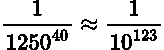。即便是最快的 GPU，这个概率也不太乐观。当然，我们有开始和结束序列标记，我们可以考虑这些来提高我们的成功机会；不过，即使如此，随机探索找到正确的动作序列的概率依然很小。

+   另一个挑战是环境的部分可观察马尔可夫决策过程（POMDP）特性，这源于游戏中我们的物品栏通常不显示的事实。在互动小说游戏中，通常只有在某些明确的命令下（如查看物品栏）才会显示角色拥有的物品。但我们的智能体并不了解先前的状态。因此，从它的角度来看，在执行命令 take apple 之后，情况与之前完全相同（唯一的区别是苹果不再出现在场景描述中）。我们可以通过堆叠状态来处理这个问题，就像我们在 Atari 游戏中所做的那样，但我们需要明确地进行，并且智能体需要处理的信息量将显著增加。

说了这么多，我们应该对环境做一些简化。幸运的是，TextWorld 为这种变通提供了方便的手段。在游戏注册过程中，我们可以传递额外的标志，将更多结构化的信息添加到观察空间中。以下是我们可以窥探的内部信息列表：

+   当前房间的独立描述，就像通过 look 命令获得的那样

+   当前物品栏

+   当前地点的名称

+   当前世界状态的事实

+   上一条动作和执行的上一条命令

+   当前状态下可接受的命令列表

+   赢得游戏所需执行的动作序列

此外，除了每一步提供的额外结构化观察之外，我们还可以要求 TextWorld 在我们朝正确方向移动时每次给我们提供中间奖励。正如你可能猜到的，这对于加速收敛非常有帮助。

我们可以添加的附加信息中最有用的功能是可接受的命令，这极大地减少了我们的动作空间，从 1250⁴⁰降到只有十几个，并且中间奖励可以引导训练朝正确的方向发展。为了启用这些额外信息，我们需要向 register_game()方法传递一个可选的参数：

```py
>>> from textworld import gym, EnvInfos 
>>> from textworld.gym import register_game 
>>> env_id = register_game("t1.ulx", request_infos=EnvInfos(inventory=True, intermediate_reward=True, admissible_commands=True, description=True)) 
>>> env = gym.make(env_id) 
>>> r = env.reset() 
>>> r[1] 
{’description’: "-= Spare Room =-\nYou are in a spare room. An usual one.\n\n\n\nYou don’t like doors? Why not try going east, that entranceway is unblocked.", ’admissible_commands’: [’go east’, ’inventory’, ’look’], ’inventory’: ’You are carrying nothing.’, ’intermediate_reward’: 0}
```

如你所见，现在环境中提供了之前为空的字典中的额外信息。在这种状态下，只有三个命令是有意义的（向东走、查看物品和观察）。让我们试试第一个命令：

```py
>>> r = env.step(’go east’) 
>>> r[1:] 
(0, False, {’description’: "-= Attic =-\nYou make a grand eccentric entrance into an attic.\n\n\n\nYou need an unblocked exit? You should try going south. You don’t like doors? Why not try going west, that entranceway is unblocked.", ’admissible_commands’: [’go south’, ’go west’, ’inventory’, ’look’], ’inventory’: ’You are carrying nothing.’, ’intermediate_reward’: 1})
```

命令已被接受，我们获得了 1 的中间奖励。好的，太棒了。现在我们已经具备了解决 TextWorld 问题所需的一切来实现我们的第一个基准 DQN 代理！但在此之前，我们需要稍微深入一下自然语言处理（NLP）领域。

# 深度 NLP 基础

在这一小节中，我将带你了解深度 NLP 的构建模块和标准方法。这个领域正在以惊人的速度发展，尤其是在现在，ChatGPT 和大语言模型（LLMs）已经在聊天机器人和文本处理方面设定了新标准。

本节内容仅涉及表面，涵盖了最常见和标准的构建模块。其中一些，如 RNN 和 LSTM，可能看起来已经过时——但我依然认为这没关系，因为了解历史背景是很重要的。对于简单任务，你可以根据任务的需求选择最合适的工具，即使它们现在不再流行。

## 循环神经网络（RNN）

NLP 有其独特性，使其与计算机视觉或其他领域不同。其中一个特点是处理可变长度的对象。在不同层次上，NLP 处理的对象可能具有不同的长度；例如，一种语言中的单词可能包含多个字符。句子是由可变长度的单词序列组成的。段落或文档由不同数量的句子构成。这种可变性并非 NLP 特有，它也出现在不同的领域中，比如信号处理或视频处理。即便是标准的计算机视觉问题，也可以视为某种对象的序列，比如图像字幕问题，在这种问题中，神经网络（NN）可以集中关注同一图像的不同区域，以便更好地描述图像。

RNN 提供了应对这种可变性的标准构建模块之一。RNN 是一个具有固定输入和输出的网络，它被应用于一系列对象，并且能够在这个序列中传递信息。这个信息被称为隐藏状态，通常只是一个包含若干数字的向量。

在下图中，我们有一个 RNN，其输入是一个固定大小的数字向量；输出是另一个向量。与标准的前馈神经网络（NN）或卷积神经网络（CNN）不同的是，这里有两个额外的门：一个输入门和一个输出门。额外的输入门将上一个项的隐藏状态传递到 RNN 单元，而额外的输出门则将转换后的隐藏状态提供给下一个序列：

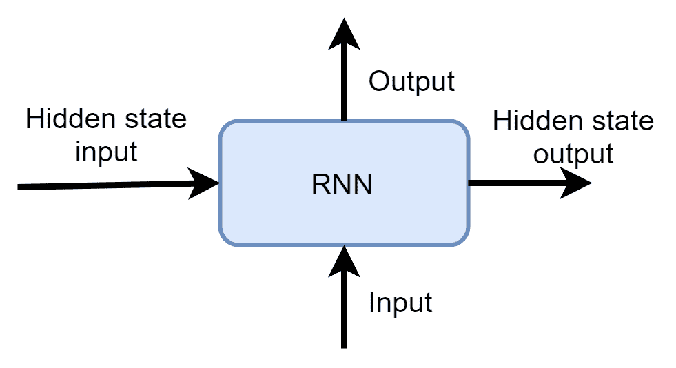

图 13.3：RNN 构建模块的结构

由于 RNN 有两个输入，它可以应用于任何长度的输入序列，只需将前一个输入产生的隐藏状态传递给下一个输入即可。在图 13.4 中，RNN 被应用于句子"this is a cat"，并为序列中的每个单词生成输出。在应用过程中，我们对每个输入项都使用相同的 RNN，但通过传递隐藏状态，它现在可以沿着序列传递信息：

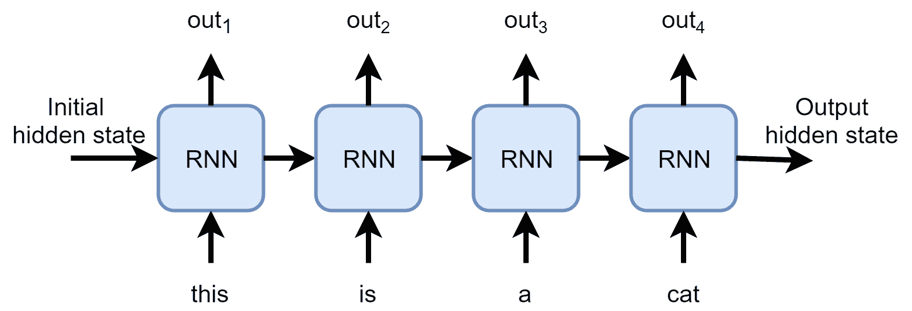

图 13.4：RNN 如何应用于句子

这类似于卷积神经网络（CNN），当我们对图像的不同位置应用相同的一组过滤器时，区别在于卷积神经网络无法传递隐藏状态。

尽管这个模型很简单，但它为标准的前馈神经网络模型增加了额外的自由度。前馈神经网络的输出由其输入决定，对于某个固定输入总是产生相同的输出（当然是在推理过程中，而非训练过程中）。RNN 的输出不仅依赖于输入，还依赖于隐藏状态，而隐藏状态可能会被神经网络自身改变。因此，神经网络可以将序列开始时的信息传递到序列末尾，并根据不同的上下文为相同的输入生成不同的输出。这种上下文依赖性在 NLP 中非常重要，因为在自然语言中，单个词语在不同的上下文中可能有完全不同的含义，而整个句子的意义可能仅凭一个词的变化而发生变化。

当然，这种灵活性也有其成本。循环神经网络（RNN）通常需要更多的训练时间，并且可能会产生一些奇怪的行为，如训练过程中的损失波动或突然的遗忘。然而，研究界已经做了大量工作，并且仍在努力使 RNN 变得更加实用和稳定，因此 RNN 及其现代替代品，如变换器（transformers），可以被视为需要处理变长输入的系统的标准构建模块。

在我们的示例中，我们将使用 RNN 的演化版本——长短期记忆（LSTM）模型，该模型最早由 Sepp Hochreiter 和 Jürgen Schmidhuber 于 1995 年在论文《LSTM 可以解决长期延迟问题》中提出，并于 1996 年在神经信息处理系统（NIPS）会议上发布[HS96]。这个模型与我们刚刚讨论的 RNN 非常相似，但它具有更复杂的内部结构，以解决一些 RNN 的问题。

## 词嵌入

现代深度学习驱动的自然语言处理（NLP）另一个标准构建模块是词嵌入，也称为 word2vec，这是一种最流行的训练方法，用于处理简单任务。这个想法源于在神经网络中表示语言序列的问题。通常，神经网络处理的是固定大小的数字向量，但在 NLP 中，我们通常使用单词或字符作为模型的输入。

虽然像 word2vec 这样的旧方法通常用于较简单的任务，并且在该领域仍然非常相关，但其他方法，如 BERT 和变换器，广泛应用于更复杂的任务。我们将在本章后面简要讨论变换器。

一个可能的解决方案是对我们的词典进行 one-hot 编码，也就是每个单词在输入向量中都有自己独立的位置，当我们在输入序列中遇到这个单词时，将该位置设置为 1。这是神经网络处理一些相对较小的离散项集并希望以神经网络友好的方式表示它们时的标准方法。不幸的是，one-hot 编码由于几个原因并不十分有效：

+   我们的输入集通常不小。如果我们只想对最常用的英语词典进行编码，它至少包含几千个单词。牛津英语词典有 170,000 个常用词和 50,000 个过时或稀有词汇。这仅仅是已建立的词汇表，还不包括俚语、新词、科学术语、缩写、拼写错误、笑话、Twitter/X 的梗等等。而且这只是针对英语语言！

+   与单词的 one-hot 表示相关的第二个问题是词汇表频率的不均衡。有一些非常频繁的单词集，像 "a" 和 "cat"，但也有大量不常用的单词，像 "covfefe" 或 "bibliopole"，这些罕见的单词可能在一个非常大的文本语料库中只出现一两次。因此，我们的 one-hot 表示在空间方面非常低效。

+   简单的 one-hot 表示的另一个问题是无法捕捉到单词之间的关系。例如，一些单词是同义词，具有相同的含义，但它们会被不同的向量表示。一些单词常常一起使用，如 "United Nations" 或 "fair trade"，而这一事实也未能在 one-hot 表示中体现出来。

为了克服这一切，我们可以使用词嵌入，它将某个词汇表中的每个单词映射为一个密集的、固定长度的数字向量。这些数字不是随机的，而是通过大规模文本语料库训练得到的，以捕捉单词的上下文。词嵌入的详细描述超出了本书的范围，但这是一种非常强大且广泛使用的自然语言处理（NLP）技术，用于表示单词、字符和其他序列中的对象。现在，你可以将它们理解为只是将单词映射为数字向量，而这种映射对于神经网络（NN）能够区分单词之间的差异非常方便。为了获得这种映射，有两种方法。首先，你可以下载所需语言的预训练向量。有多个可用的嵌入源，只需在 Google 上搜索“GloVe 预训练向量”或“word2vec 预训练”（GloVe 和 word2vec 是训练这些向量的不同方法，产生相似的结果）。获取嵌入的另一种方法是自行在你的数据集上进行训练。为此，你可以使用特殊工具，如 fastText（[`fasttext.cc/`](https://fasttext.cc/)，Facebook 的开源工具），或直接随机初始化嵌入并允许模型在正常训练过程中调整它们。

此外，LLMs（以及一般的任何序列到序列架构）可以生成非常高质量的文本嵌入。OpenAI 的 ChatGPT API 有一个特殊请求，可以将任何文本转换为嵌入向量。

## 编码器-解码器架构

另一个在 NLP 中广泛使用的模型是编码器-解码器模型，或称 seq2seq。它最初来自机器翻译，当你的系统需要接受源语言中的一系列单词，并在目标语言中生成另一系列单词时使用。seq2seq 的基本思想是使用一个 RNN 来处理输入序列，并将该序列编码成某个固定长度的表示。这种 RNN 被称为编码器。然后，你将编码后的向量输入到另一个 RNN 中，称为解码器，解码器必须生成目标语言中的结果序列。下面是这个思想的一个示例，我们正在将英文句子翻译成俄语：

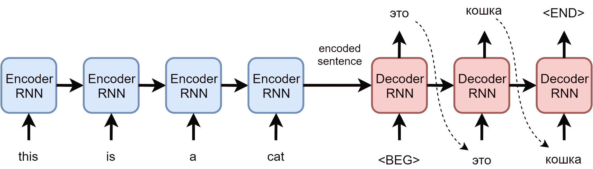

图 13.5：机器翻译中的编码器-解码器架构

这个模型（通过大量现代化的调整和扩展）仍然是机器翻译的主要工作马，但它足够通用，可以应用于更广泛的领域，例如音频处理、图像标注和视频字幕生成。在我们的 TextWorld 示例中，我们将使用它来生成来自环境的变大小观察的嵌入。

RNN 在某些上下文中依然非常有效，但近年来，随着更复杂的 Transformer 模型的引入，NLP 领域发生了重大进展。接下来，我们将看看 Transformer 架构。

## Transformer 模型

Transformer 是在 2017 年由谷歌的 Vaswani 等人提出的架构，发表于论文《Attention is all you need》[Vas17]。从高层次看，它使用了我们刚刚讨论的相同的编码器-解码器架构，但对底层构建模块进行了若干改进，这些改进对于解决现有 RNN 问题至关重要：

+   位置信息编码：它将关于输入和输出序列位置的信息注入到嵌入中。

+   注意力机制：这个概念是在 2015 年提出的，可以看作是一种可训练的方式，使得系统能够集中注意力于输入序列的特定部分。在 transformer 中，注意力机制得到了广泛应用（从论文标题中可以猜到这一点）。

目前，transformer 是几乎所有自然语言处理（NLP）和深度学习（DL）系统的核心，包括大型语言模型（LLMs）。我不会深入探讨这一架构，因为关于这个话题有很多资源，但如果你感兴趣，可以查看以下文章：[`jalammar.github.io/illustrated-transformer/`](https://jalammar.github.io/illustrated-transformer/)。

现在我们已经拥有了实现第一个基线 DQN 智能体来解决 TextWorld 问题所需的一切。

# 基线 DQN

回到我们的 TextWorld 环境，以下是主要的挑战：

+   文本序列本身可能会成为问题，正如我们在本章前面讨论的那样。序列长度的可变性可能导致 RNN 中的梯度消失和爆炸、训练缓慢以及收敛问题。除此之外，我们的 TextWorld 环境提供了几个需要单独处理的此类序列。例如，我们的场景描述字符串对智能体可能有完全不同的含义，而物品栏字符串则描述我们的物品。

+   另一个障碍是动作空间。正如你在上一节中看到的，TextWorld 可能会为我们提供在每个状态下可以执行的命令列表。它显著减少了我们需要从中选择的动作空间，但也存在其他复杂性。其中之一是可接受命令列表会根据状态的不同而变化（不同位置可能允许执行不同的命令）。另一个问题是，可接受命令列表中的每一项都是一个由单词组成的序列。

我们有可能通过构建一个包含所有可能命令的字典，并将其作为一个离散的、固定大小的动作空间，从而消除这两种变动性。在简单的游戏中，这可能有效，因为位置和物体的数量并不大。你可以尝试这个方法作为练习，但我们将沿着不同的路径前进。

到目前为止，你只见过离散的动作空间，其中包含少量预定义的动作，这影响了 DQN 的架构：网络的输出通过一次传递预测所有动作的 Q 值，这在训练和模型应用过程中都非常方便（因为我们无论如何都需要所有动作的 Q 值来找到最大 Q 值）。但这种 DQN 架构的选择并不是方法决定的，因此如果需要，我们可以进行调整。我们关于动作数量可变的问题可能通过这种方式得到解决。为了更好地理解这种方式，让我们来看一下 TextWorld 基线 DQN 的架构，如下图所示：

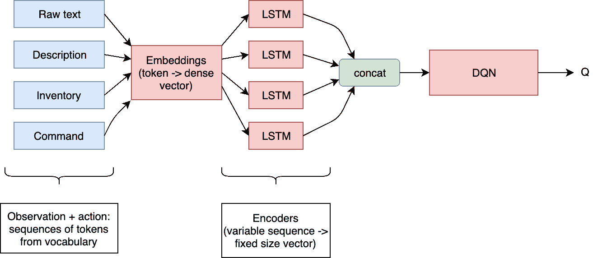

图 13.6：TextWorld 基线 DQN 的架构

图中的主要部分由预处理模块占据。在网络的输入端（图左边的模块），我们得到的是由各个观察部分（“原始文本”、“描述”和“库存”）组成的可变序列，以及一个需要评估的动作命令序列。这个命令将从可接受命令列表中选取，网络的目标是为当前游戏状态和该特定命令预测一个 Q 值。这个方法与我们之前使用的 DQN 有所不同，但由于我们无法预先知道每个状态下将评估哪些命令，因此我们将单独评估每个命令。

这四个输入序列（即我们词汇表中词元 ID 的列表）将通过嵌入层，然后输入到不同的 LSTM RNN 中。

LSTM 网络（在图中称为“编码器”，因为 LSTM 是编码器的具体实现）的目标是将可变长度的序列转换为固定大小的向量。每个输入部分都会由其自己的 LSTM 进行处理，使用独立的权重，这使得网络能够捕捉来自不同输入序列的不同数据。在本章后面，我们将用来自 Hugging Face Hub 的预训练变换器替换 LSTM，来验证在相同问题上使用一个更智能、更大模型的效果。

编码器的输出会被拼接成一个单一的向量，并传递给主 DQN 网络。由于我们的可变长度序列已被转换为固定大小的向量，DQN 网络很简单：只有几层前馈层，输出一个 Q 值。这在计算上效率较低，但作为基准来说是可以接受的。

完整的源代码位于 Chapter13 目录中，包含以下模块：

+   train_basic.py：一个基线训练程序

+   lib/common.py：设置 Ignite 引擎和超参数的公共工具

+   lib/preproc.py：包括嵌入和编码器类的预处理管道

+   lib/model.py：包含帮助函数的 DQN 模型和 DQN 代理

本章不会展示完整的源代码。相反，我们将在后续的部分仅解释最重要或最棘手的部分。

## 观察预处理

让我们从管道的最左侧部分开始（图 13.6）。在输入端，我们将获得多个令牌列表，分别用于单独的状态观察和我们即将评估的命令。正如你已经看到的，TextWorld 环境生成的是字符串和包含扩展信息的字典，所以我们需要对字符串进行分词并去除不相关的信息。这是 `TextWorldPreproc` 类的职责，该类定义在 `lib/preproc.py` 模块中：

```py
class TextWorldPreproc(gym.Wrapper): 
    log = logging.getLogger("TextWorldPreproc") 

    OBS_FIELD = "obs" 

    def __init__( 
            self, env: gym.Env, vocab_rev: tt.Optional[tt.Dict[str, int]], 
            encode_raw_text: bool = False, 
            encode_extra_fields: tt.Iterable[str] = (’description’, ’inventory’), 
            copy_extra_fields: tt.Iterable[str] = (), 
            use_admissible_commands: bool = True, keep_admissible_commands: bool = False, 
            use_intermediate_reward: bool = True, tokens_limit: tt.Optional[int] = None, 
            reward_wrong_last_command: tt.Optional[float] = None 
    ): 
        super(TextWorldPreproc, self).__init__(env) 
        self._vocab_rev = vocab_rev 
        self._encode_raw_text = encode_raw_text 
        self._encode_extra_field = tuple(encode_extra_fields) 
        self._copy_extra_fields = tuple(copy_extra_fields) 
        self._use_admissible_commands = use_admissible_commands 
        self._keep_admissible_commands = keep_admissible_commands 
        self._use_intermedate_reward = use_intermediate_reward 
        self._num_fields = len(self._encode_extra_field) + int(self._encode_raw_text) 
        self._last_admissible_commands = None 
        self._last_extra_info = None 
        self._tokens_limit = tokens_limit 
        self._reward_wrong_last_command = reward_wrong_last_command 
        self._cmd_hist = []
```

该类实现了 `gym.Wrapper` 接口，因此它将按照我们需要的方式转换 TextWorld 环境中的观察和动作。构造函数接受多个标志，这简化了未来的实验。例如，您可以禁用使用可接受命令或中间奖励、设置令牌的限制或更改要处理的观察字段集。

接下来，`num_fields` 属性返回观察序列的数量，用于了解编码后的观察形状：

```py
 @property 
    def num_fields(self): 
        return self._num_fields 

    def _maybe_tokenize(self, s: str) -> str | tt.List[int]: 
        if self._vocab_rev is None: 
            return s 
        tokens = common.tokenize(s, self._vocab_rev) 
        if self._tokens_limit is not None: 
            tokens = tokens[:self._tokens_limit] 
        return tokens
```

`_maybe_tokenize()` 方法执行输入字符串的分词处理。如果没有提供词汇表，则字符串会原样返回。我们将在 transformer 版本中使用此功能，因为 Hugging Face 库会执行它们自己的分词处理。

`_encode()` 方法是观察数据转换的核心：

```py
 def _encode(self, obs: str, extra_info: dict) -> dict: 
        obs_result = [] 
        if self._encode_raw_text: 
            obs_result.append(self._maybe_tokenize(obs)) 
        for field in self._encode_extra_field: 
            extra = extra_info[field] 
            obs_result.append(self._maybe_tokenize(extra)) 
        result = {self.OBS_FIELD: obs_result} 
        if self._use_admissible_commands: 
            result[KEY_ADM_COMMANDS] = [ 
                self._maybe_tokenize(cmd) for cmd in extra_info[KEY_ADM_COMMANDS] 
            ] 
            self._last_admissible_commands = extra_info[KEY_ADM_COMMANDS] 
        if self._keep_admissible_commands: 
            result[KEY_ADM_COMMANDS] = extra_info[KEY_ADM_COMMANDS] 
            if ’policy_commands’ in extra_info: 
                result[’policy_commands’] = extra_info[’policy_commands’] 
        self._last_extra_info = extra_info 
        for field in self._copy_extra_fields: 
            if field in extra_info: 
                result[field] = extra_info[field] 
        return result
```

前述方法接受观察字符串和扩展信息字典，并返回一个包含以下键的单一字典：

+   `obs`：包含输入序列的令牌 ID 列表的列表。

+   `admissible_commands`：当前状态下可用命令的列表。每个命令都会被分词并转换为令牌 ID 列表。

此外，该方法会记住额外的信息字典和原始的可接受命令列表。这对于训练来说不是必须的，但在模型应用期间非常有用，能够根据命令的索引获取回命令文本。

定义了 `_encode()` 方法后，`reset()` 和 `step()` 方法的实现就很简单了——我们在编码观察数据并处理中间奖励（如果启用）：

```py
 def reset(self, seed: tt.Optional[int] = None): 
        res, extra = self.env.reset() 
        self._cmd_hist = [] 
        return self._encode(res, extra), extra 

    def step(self, action): 
        if self._use_admissible_commands: 
            action = self._last_admissible_commands[action] 
            self._cmd_hist.append(action) 
        obs, r, is_done, extra = self.env.step(action) 
        if self._use_intermedate_reward: 
            r += extra.get(’intermediate_reward’, 0) 
        if self._reward_wrong_last_command is not None: 
            if action not in self._last_extra_info[KEY_ADM_COMMANDS]: 
                r += self._reward_wrong_last_command 
        return self._encode(obs, extra), r, is_done, False, extra
```

值得注意的是，`step()` 方法期望从封装的环境中返回 4 项，但实际上返回了 5 项。这隐藏了我们之前讨论的 TextWorld 环境与现代 Gym 接口的不兼容问题。

最后，有两个属性可以访问记住的状态：

```py
 @property 
    def last_admissible_commands(self): 
        if self._last_admissible_commands: 
            return tuple(self._last_admissible_commands) 
        return None 

    @property 
    def last_extra_info(self): 
        return self._last_extra_info
```

为了说明前述类的应用方式及其如何处理观察内容，让我们来看一下下面的小型交互示例。在这里，我们注册了游戏，并请求库存、中间奖励、可接受的命令和场景描述：

```py
>>> from textworld import gym, EnvInfos 
>>> from lib import preproc, common 
>>> env_id = gym.register_game("games/simple1.ulx", request_infos=EnvInfos(inventory=True, intermediate_reward=True, admissible_commands=True, description=True)) 
>>> env = gym.make(env_id) 
>>> env.reset()[1] 
{’intermediate_reward’: 0, ’inventory’: ’You are carrying: a type D latchkey, a teacup and a sponge.’, ’description’: "-= Spare Room =-\nThis might come as a shock to you, but you’ve just walked into a spare room. You can barely contain your excitement.\n\nYou can make out a closed usual looking crate close by. You can make out a rack. However, the rack, like an empty rack, has nothing on it.\n\nThere is an exit to the east. Don’t worry, it is unblocked. You don’t like doors? Why not try going south, that entranceway is unguarded.", ’admissible_commands’: [’drop sponge’, ’drop teacup’, ’drop type D latchkey’, ’examine crate’, ’examine rack’, ’examine sponge’, ’examine teacup’, ’examine type D latchkey’, ’go east’, ’go south’, ’inventory’, ’look’, ’open crate’, ’put sponge on rack’, ’put teacup on rack’, ’put type D latchkey on rack’]}
```

所以，这就是我们从 TextWorld 环境中获得的原始观察数据。现在让我们提取游戏词汇并应用我们的预处理器：

```py
>>> vocab, action_space, obs_space = common.get_games_spaces(["games/simple1.ulx"]) 
>>> vocab 
{0: ’a’, 1: ’about’, 2: ’accomplished’, 3: ’an’, 4: ’and’, 5: ’appears’, 6: ’are’, 7: ’arrive’, 8: ’as’, 9: ’barely’, 10: ’be’, 11: ’because’, 12: ’begin’, 13: ’being’, 14: ’believe’ 
.... 
>>> len(vocab) 
192 
>>> vocab_rev = common.build_rev_vocab(vocab) 
>>> vocab_rev 
{’a’: 0, ’about’: 1, ’accomplished’: 2, ’an’: 3, ’and’: 4, ’appears’: 5, ’are’: 6, ’arrive’: 7 
... 
>>> pr_env = preproc.TextWorldPreproc(env, vocab_rev) 
>>> r = pr_env.reset() 
>>> r[0] 
{’obs’: [[142, 132, 166, 106, 26, 8, 0, 136, 167, 188, 17, 188, 86, 180, 82, 0, 142, 132, 188, 20, 9, 27, 191, 57, 188, 20, 103, 121, 0, 24, 178, 101, 35, 23, 18, 188, 20, 103, 121, 0, 129, 77, 161, 129, 94, 3, 50, 129, 73, 111, 115, 85, 163, 84, 3, 58, 167, 161, 44, 152, 186, 85, 84, 172, 188, 152, 94, 41, 184, 110, 169, 72, 141, 159, 53, 84, 173], [188, 6, 0, 170, 36, 92, 0, 157, 4, 0, 143]], ’admissible_commands’: [[42, 143], [42, 157], [42, 170, 36, 92], [55, 35], [55, 129], [55, 143], [55, 157], [55, 170, 36, 92], [71, 44], [71, 141], [83], [100], [117, 35], [127, 143, 115, 129], [127, 157, 115, 129], [127, 170, 36, 92, 115, 129]]} 
>>> r[1] 
{’intermediate_reward’: 0, ’inventory’: ’You are carrying: a type D latchkey, a teacup and a sponge.’, ’description’: "-= Spare Room =-\nThis might come as a shock to you, but you’ve just walked into a spare room. You can barely contain your excitement.\n\nYou can make out a closed usual looking crate close by. You can make out a rack. However, the rack, like an empty rack, has nothing on it.\n\nThere is an exit to the east. Don’t worry, it is unblocked. You don’t like doors? Why not try going south, that entranceway is unguarded.", ’admissible_commands’: [’drop sponge’, ’drop teacup’, ’drop type D latchkey’, ’examine crate’, ’examine rack’, ’examine sponge’, ’examine teacup’, ’examine type D latchkey’, ’go east’, ’go south’, ’inventory’, ’look’, ’open crate’, ’put sponge on rack’, ’put teacup on rack’, ’put type D latchkey on rack’]}
```

让我们尝试执行一个动作。第 0 个动作对应于可接受命令列表中的第一个条目，在我们的例子中是“丢掉海绵”：

```py
>>> r[1][’inventory’] 
’You are carrying: a type D latchkey, a teacup and a sponge.’ 
>>> obs, reward, is_done, _, info = pr_env.step(0) 
>>> info[’inventory’] 
’You are carrying: a type D latchkey and a teacup.’ 
>>> reward 
0
```

如你所见，我们不再有海绵，但这并不是正确的动作，因此没有给予中间奖励。

好吧，这个表示法仍然不能直接输入到神经网络中，但它已经比之前更接近我们想要的形式了。

## 嵌入和编码器

预处理管道中的下一步由两个类实现：

+   Encoder：一个 LSTM 单元的包装器，将一个单一序列（在应用了嵌入后）转换成一个固定大小的向量

+   预处理器：该类负责应用嵌入和使用相应的编码器类转换单个序列

Encoder 类比较简单，所以我们先从它开始：

```py
class Encoder(nn.Module): 
    def __init__(self, emb_size: int, out_size: int): 
        super(Encoder, self).__init__() 
        self.net = nn.LSTM(input_size=emb_size, hidden_size=out_size, batch_first=True) 

    def forward(self, x): 
        self.net.flatten_parameters() 
        _, hid_cell = self.net(x) 
        return hid_cell[0].squeeze(0)
```

逻辑是：我们应用 LSTM 层，并在处理完序列后返回其隐藏状态。

Preprocessor 类要复杂一些，因为它结合了多个 Encoder 实例，并且也负责嵌入：

```py
class Preprocessor(nn.Module): 
    def __init__(self, dict_size: int, emb_size: int, num_sequences: int, 
                 enc_output_size: int, extra_flags: tt.Sequence[str] = ()): 
        super(Preprocessor, self).__init__() 
        self._extra_flags = extra_flags 
        self._enc_output_size = enc_output_size 
        self.emb = nn.Embedding(num_embeddings=dict_size, embedding_dim=emb_size) 
        self.encoders = [] 
        for idx in range(num_sequences): 
            enc = Encoder(emb_size, enc_output_size) 
            self.encoders.append(enc) 
            self.add_module(f"enc_{idx}", enc) 
        self.enc_commands = Encoder(emb_size, enc_output_size)
```

在构造函数中，我们创建了一个嵌入层，该层将我们词典中的每个标记映射到一个固定大小的稠密向量。然后，我们为每个输入序列创建了`num_sequences`个 Encoder 实例，并创建了一个额外的实例来编码命令标记。

内部方法`_apply_encoder()`接受一批序列（每个序列是一个标记 ID 的列表）并使用编码器进行转换：

```py
 def _apply_encoder(self, batch: tt.List[tt.List[int]], encoder: Encoder): 
        dev = self.emb.weight.device 
        batch_t = [self.emb(torch.tensor(sample).to(dev)) for sample in batch] 
        batch_seq = rnn_utils.pack_sequence(batch_t, enforce_sorted=False) 
        return encoder(batch_seq)
```

在早期版本的 PyTorch 中，我们需要在应用 RNN 之前对可变长度的序列进行排序。从 PyTorch 1.0 版本开始，这已经不再需要，因为排序和转换由 PackedSequence 类内部处理。为了启用此功能，我们需要传递`enforce_sorted=False`参数。

`encode_observations()`方法接受一批观察结果（来自 TextWorldPreproc）并将其编码成一个张量：

```py
 def encode_observations(self, observations: tt.List[dict]) -> torch.Tensor: 
        sequences = [obs[TextWorldPreproc.OBS_FIELD] for obs in observations ] 
        res_t = self.encode_sequences(sequences) 
        if not self._extra_flags: 
            return res_t 
        extra = [[obs[field] for field in self._extra_flags] for obs in observations] 
        extra_t = torch.Tensor(extra).to(res_t.device) 
        res_t = torch.cat([res_t, extra_t], dim=1) 
        return res_t
```

除了可变序列外，我们还可以将额外的“标志”字段直接传递到编码后的张量中。这个功能将在后续的实验和对基本方法的扩展中使用。

最后，`encode_sequences()`和`encode_commands()`两个方法被用来将不同的编码器应用于可变长度序列的批处理：

```py
 def encode_sequences(self, batches): 
        data = [] 
        for enc, enc_batch in zip(self.encoders, zip(*batches)): 
            data.append(self._apply_encoder(enc_batch, enc)) 
        res_t = torch.cat(data, dim=1) 
        return res_t 

    def encode_commands(self, batch): 
        return self._apply_encoder(batch, self.enc_commands)
```

## DQN 模型和代理

在做了所有这些准备工作之后，让我们看看我们代理的“大脑”：DQN 模型。它应该接受`num_sequences × encoder_size`的向量并产生一个单一的标量值。但是与其他 DQN 模型的不同之处在于，我们应用模型的方式：

```py
class DQNModel(nn.Module): 
    def __init__(self, obs_size: int, cmd_size: int, hid_size: int = 256): 
        super(DQNModel, self).__init__() 

        self.net = nn.Sequential( 
            nn.Linear(obs_size + cmd_size, hid_size), 
            nn.ReLU(), 
            nn.Linear(hid_size, 1) 
        ) 

    def forward(self, obs, cmd): 
        x = torch.cat((obs, cmd), dim=1) 
        return self.net(x) 

    @torch.no_grad() 
    def q_values(self, obs_t, commands_t): 
        result = [] 
        for cmd_t in commands_t: 
            qval = self(obs_t, cmd_t.unsqueeze(0))[0].cpu().item() 
            result.append(qval) 
        return result
```

在之前的代码中，`forward()`方法接受两个批次——观察结果和命令——为每一对生成 Q 值批次。另一个方法`q_values()`接受由预处理器类生成的一个观察结果和编码后的命令张量，随后应用模型并返回每个命令的 Q 值列表。

在 model.py 模块中，我们有 DQNAgent 类，它接收预处理器并实现 PTAN Agent 接口，以隐藏决策过程中的观察预处理细节。

## 训练代码

在所有准备和预处理工作完成后，其余的代码与我们在之前章节中实现的几乎相同，因此我不会重复训练代码；我只会描述训练逻辑。

要训练模型，必须使用 Chapter13/train_basic.py 工具。它允许通过几个命令行参数来改变训练行为：

+   -g 或 --game：这是游戏文件的前缀，位于 games 目录中。提供的脚本会生成几个名为 simpleNN.ulx 的游戏，其中 NN 是游戏的种子值。

+   -s 或 --suffices：这是训练期间使用的游戏数量。如果指定 1（默认值），则训练只会在文件 simple1.ulx 上进行。如果指定 -s 10，则会注册并使用编号从 1 到 10 的 10 个游戏进行训练。此选项用于增加训练游戏的多样性，因为我们的目标不仅是学习如何玩具体的游戏，还希望（如果可能的话）学习如何在其他类似的游戏中表现。

+   -v 或 --validation：这是用于验证的游戏的后缀。默认值为 -val，并定义将用于检查我们训练智能体泛化能力的游戏文件。

+   --params：这表示将使用的超参数。lib/common.py 中定义了两组：small 和 medium。第一组具有较少的嵌入和编码向量，非常适合快速解决少数几个游戏；然而，当使用许多游戏进行训练时，这一组会遇到收敛困难的问题。

+   --dev：该选项指定计算使用的设备名称。

+   -r 或 --run：这是运行的名称，通常用作保存目录和 TensorBoard 的名称。

在训练过程中，每进行 100 次训练迭代会执行一次验证，并在当前网络上运行验证游戏。奖励和步骤数会记录在 TensorBoard 中，帮助我们理解智能体的泛化能力。强化学习中的泛化一直是一个大问题，因为在有限的轨迹集上，训练过程有过拟合到某些状态的倾向，这并不能保证在未见过的游戏中表现良好。与 Atari 游戏相比，后者的游戏玩法通常变化不大，互动小说游戏的可变性可能更高，因为它们有不同的任务、物品以及沟通方式。因此，检查我们的智能体能在不同游戏之间如何泛化是一个有趣的实验。

## 训练结果

默认情况下，脚本 games/make_games.sh 会生成 20 个游戏，名称从 simple1.ulx 到 simple20.ulx，还有一个用于验证的游戏：simple-val.ulx。

首先，让我们在一个游戏上训练智能体，使用较小的超参数设置：

```py
$ ./train_basic.py -s 1 --dev cuda -r t1 
Registered env tw-simple-v0 for game files [’games/simple1.ulx’] 
Game tw-simple-v1, with file games/simple-val.ulx will be used for validation 
Episode 1: reward=0 (avg 0.00), steps=50 (avg 50.00), speed=0.0 f/s, elapsed=0:00:04 
Episode 2: reward=1 (avg 0.02), steps=50 (avg 50.00), speed=0.0 f/s, elapsed=0:00:04 
1: best avg training reward: 0.020, saved 
Episode 3: reward=-2 (avg -0.02), steps=50 (avg 50.00), speed=0.0 f/s, elapsed=0:00:04 
Episode 4: reward=6 (avg 0.10), steps=30 (avg 49.60), speed=0.0 f/s, elapsed=0:00:04 
...
```

选项 -s 指定将用于训练的游戏索引数量。在这种情况下，只会使用一个。当游戏中的平均步数降到 15 以下时，训练就会停止，这意味着智能体已经找到了正确的步骤序列，并能够高效地完成游戏。

对于单场游戏，解决游戏只需要 3 分钟和大约 120 回合。下图展示了训练过程中的奖励和步数变化：

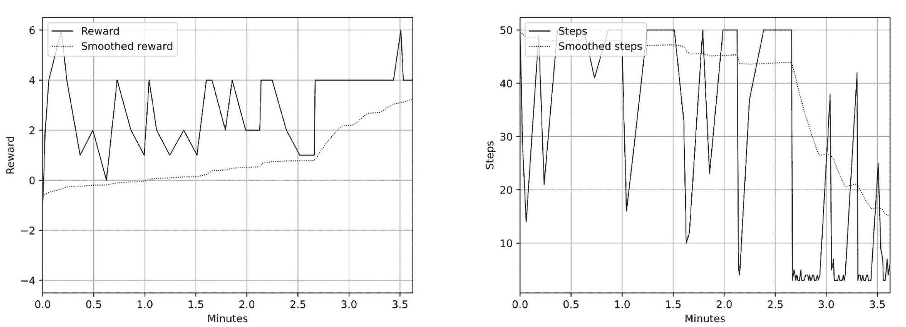

图 13.7：在一场游戏中训练的奖励（左）和回合步数（右）

但是，如果我们检查验证奖励（即在游戏 simple-val.ulx 上获得的奖励），我们会看到它随着时间的推移没有任何改善。在我的情况下，验证奖励是零，验证回合的步数是 50（这是默认的时间限制）。这仅仅意味着学到的智能体没有办法进行泛化。

如果我们尝试增加用于训练的游戏数量，收敛将需要更多的时间，因为网络需要在不同的状态中发现更多的动作序列。以下是 20 场游戏（传递选项 -s 20）的奖励和步数图表：

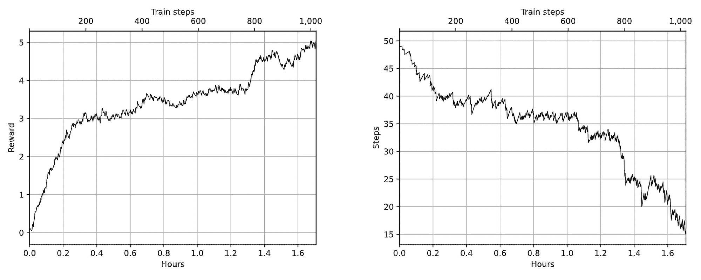

图 13.8：在 20 场游戏中训练的奖励（左）和回合步数（右）

如你所见，收敛大约需要两个小时，但我们的这个小型超参数集依然能够提升在训练过程中进行的 20 场游戏中的表现。

如下图所示，验证指标现在稍微有些有趣 —— 在训练结束时，智能体能够获得 2 分（最大为 6 分），并且在训练的中间阶段，它获得了 4 分。但验证游戏中的步数仍然是 50，这意味着智能体只是半随机地四处走动并执行一些动作。表现并不令人印象深刻。

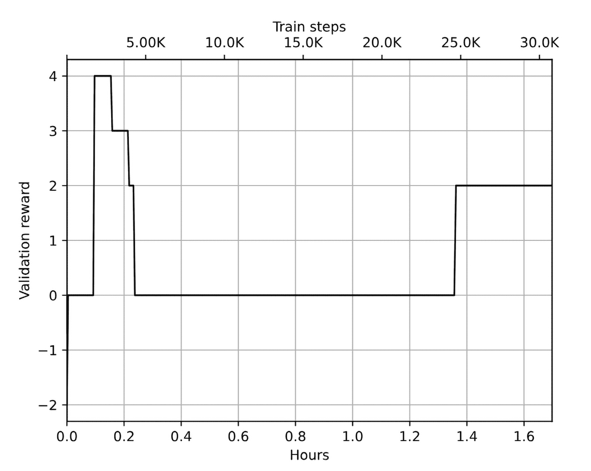

图 13.9：在 20 场游戏中训练时的验证奖励

我没有在这个智能体上尝试不同的超参数（你可以通过 -s medium 来做到这一点）。

# 调整观察值

我们的第一次尝试将是在给智能体提供更多的信息。在这里，我将简要介绍所做的更改以及它们对训练结果的影响。你可以在 Chapter13/train_preproc.py 中找到完整的示例。

## 跟踪访问过的房间

首先，你会注意到我们的智能体无法判断当前房间是否已经访问过。当智能体已经知道通往目标的最佳路径时，可能不需要这个信息（因为生成的游戏总是有不同的房间）。但如果策略不完美，可能会有用，能明确指示我们是否在一遍遍地访问同一个房间。

为了将这些知识输入到观察中，我在 preproc.LocationWrapper 类中实现了一个简单的房间跟踪，它跟踪整个回合中访问过的房间。然后，这个标志会作为一个单一的 1（如果之前访问过该房间）或 0（如果是新位置）被拼接到智能体的观察中。

要使用这个扩展来训练我们的智能体，可以通过额外的命令行选项--seen-rooms 运行 train_preproc.py。

以下是将我们基准版本与这个额外观察在 20 局游戏中的比较图表。如你所见，训练游戏的奖励几乎相同，但验证奖励有所提高——我们几乎在整个训练过程中都能获得非零的验证奖励。不过，验证游戏中的步骤数仍然是 50。

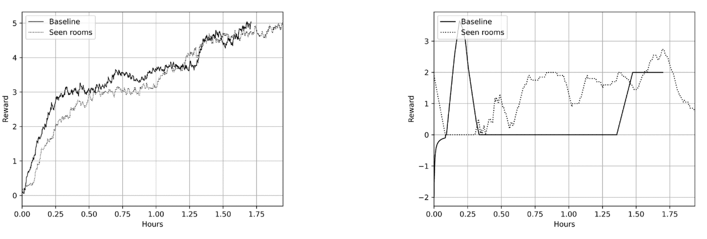

图 13.10：20 局游戏中的训练奖励（左）和验证奖励（右）

但在对 200 局游戏进行尝试后（你需要更改脚本来生成这些游戏），我得到了一个有趣的结果：经过 14 小时的训练和 8000 个回合后，智能体不仅在验证游戏中获得了最高分，而且能够高效地做到这一点（步骤数小于 10）。这在图 13.11 和图 13.12 中展示。

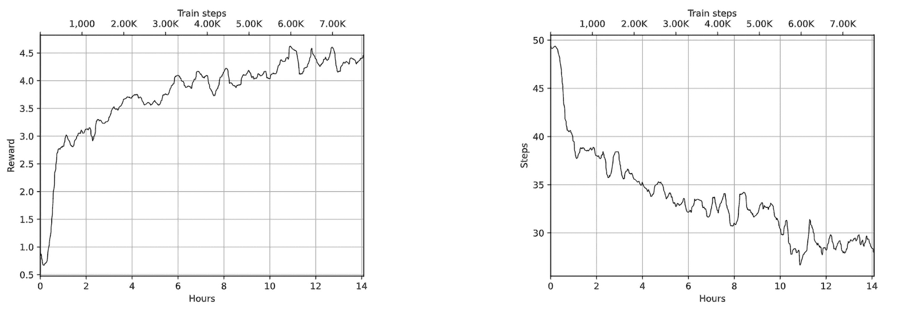

图 13.11：200 局游戏中的训练奖励（左）和回合步骤（右）

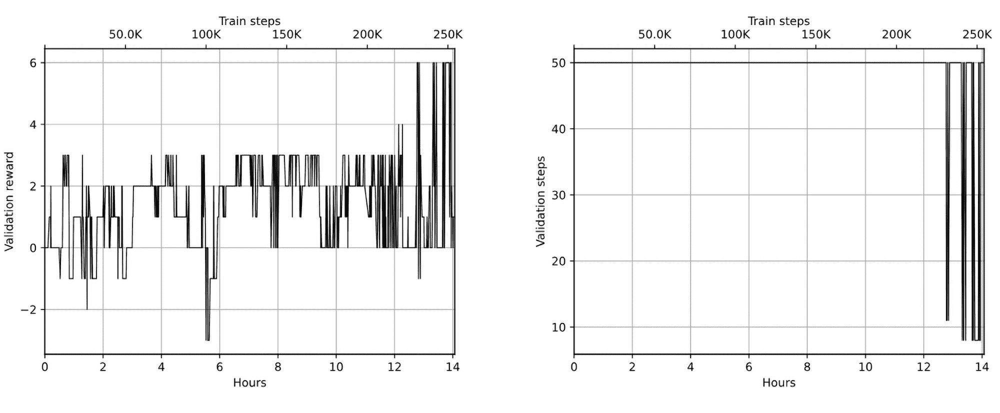

图 13.12：验证奖励（左）和回合步骤（右）

## 相对动作

改进智能体学习的第二次尝试是关于动作空间的。从原则上讲，我们的智能体任务是导航房间并在周围的物体上执行特定的操作（例如打开储物柜并取出东西）。因此，导航在学习过程中是一个非常重要的方面。

目前，我们通过执行“绝对坐标”命令来移动，例如“向北走”或“向东走”，这些命令是特定于房间的，因为不同的房间可能有不同的出口可用。此外，在执行某些动作后，逆动作（返回原房间）依赖于第一个动作。例如，如果我们在一个有北方出口的房间，使用了这个出口后，我们需要执行“向南走”来返回。但我们的智能体没有动作历史的记忆，所以在向北走后，我们不知道如何返回。

在上一节中，我们添加了有关房间是否被访问的信息。现在，我们将绝对动作转化为相对动作。为了实现这一点，我们的包装器`preproc.RelativeDirectionsWrapper`会跟踪我们的“朝向方向”，并根据朝向方向将“向北走”或“向东走”命令替换为“向左走”、“向右走”、“向前走”或“向后走”。例如，当我们处在一个出口朝北的房间里且我们的朝向是北时，我们需要执行“向前走”命令以使用出口。然后，我们可以执行“向后走”命令返回原来的房间。希望这种转化能让我们的模型更轻松地在 TextWorld 游戏中导航。

要启用此扩展，你需要使用`--relative-actions`命令行选项运行`train_preproc.py`。此扩展还需要启用“已见房间”，因此在这里，我们测试了这两项修改结合后的效果。在 20 场游戏中，训练动态和验证结果与基准版本非常相似（如图 13.13 所示）：

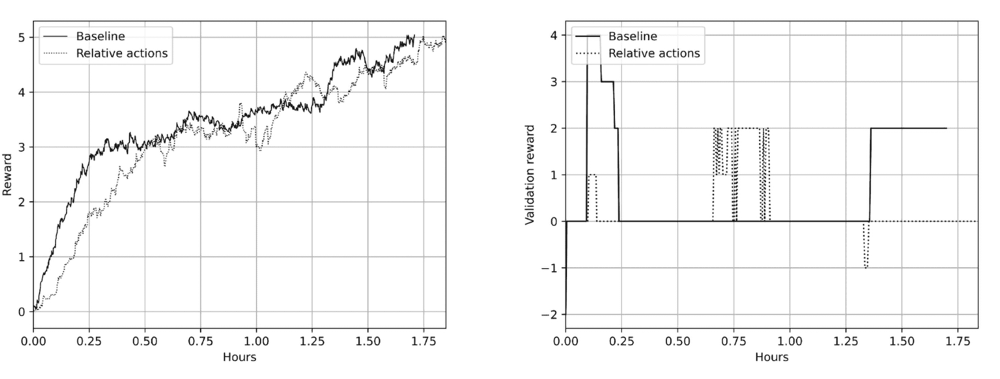

图 13.13：20 场游戏中的训练奖励（左）和验证奖励（右）

但在 200 场游戏上，智能体在仅 2.5 小时内就能在验证游戏中获得最高分（而不是“已见房间”扩展中的 13 小时）。验证中的步数也减少到了不到 10 步。但不幸的是，经过进一步训练后，验证指标恢复到较低的验证分数，因此智能体对游戏进行了过拟合，并遗忘了它已掌握的技能：

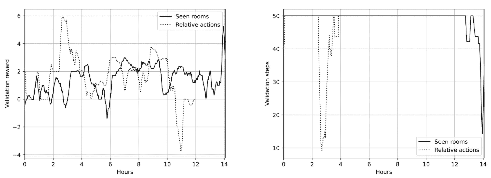

图 13.14：200 场游戏中的验证奖励（左）和回合步数（右）

## 观察中的目标

另一个想法是将游戏目标传递给智能体的观察值。目标在游戏开始时以文本形式呈现，例如：首先，我需要你做的事情是尝试向东前进。然后，向南前进。之后，尝试向南走。完成后，尝试向西走。如果你能完成这些，捡起房间地板上的硬币。完成所有这些后，你可以停止！

这些信息可能对智能体规划行动有所帮助，因此让我们将其添加到编码向量中。我们不需要实现另一个包装器，因为现有的包装器已经足够灵活。只需要向它们传递几个额外的参数。要启用目标，你需要使用`--objective`命令行参数运行`train_preproc.py`。

在 20 场游戏中的结果几乎与基准线完全相同，结果如图 13.15 所示：

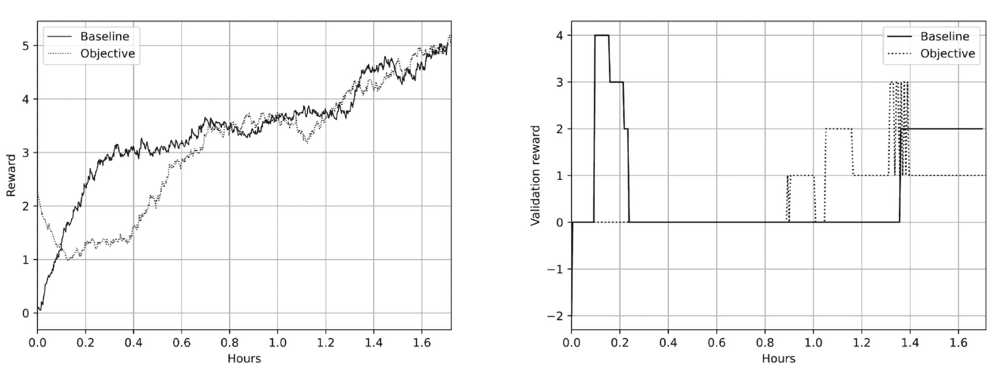

图 13.15：20 场游戏中的训练奖励（左）和验证奖励（右）

在 200 场游戏上的训练比之前的修改效果差：在验证过程中，得分在 2 到 4 之间，但从未达到 6 分。奖励和验证奖励的图表如图 13.16 所示：

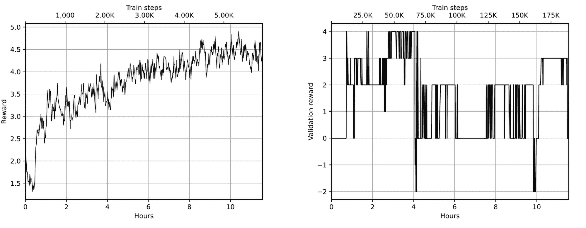

图 13.16：在 200 局游戏中的训练奖励（左）和验证奖励（右）

# Transformer

接下来我们将尝试的是预训练语言模型，这是现代自然语言处理中的事实标准。得益于像 [Hugging Face Hub](https://huggingface.co/docs/hub/en/index) 这样的公共模型库，我们不需要从头开始训练这些模型，这可能会非常耗费资源。我们只需要将预训练模型接入我们的架构，并对网络的一小部分进行微调，适应我们的数据集。

有各种各样的模型——不同的大小、它们所预训练的语料库、训练技术等等。但所有这些模型都使用一个简单的 API，因此将它们接入我们的代码非常简单直接。

首先，我们需要安装库。对于我们的任务，我们将使用包 `sentence-transformers==2.6.1`，你需要手动安装。一旦安装完成，你就可以用它计算任何给定字符串的嵌入：

```py
>>> from sentence_transformers import SentenceTransformer 
>>> tr = SentenceTransformer("sentence-transformers/all-MiniLM-L6-v2") 
>>> tr.get_sentence_embedding_dimension() 
384 
>>> r = tr.encode("You’re standing in an ordinary boring room") 
>>> type(r) 
<class ’numpy.ndarray’> 
>>> r.shape 
(384,) 
>>> r2 = tr.encode(["sentence 1", "sentence 2"], convert_to_tensor=True) 
>>> type(r2) 
<class ’torch.Tensor’> 
>>> r2.shape 
torch.Size([2, 384])
```

这里我们使用的是 all-MiniLM-L6-v2 模型，它相对较小——22M 参数，训练于 12 亿个标记。你可以在 Hugging Face 网站上找到更多信息：[`huggingface.co/sentence-transformers/all-MiniLM-L6-v2`](https://huggingface.co/sentence-transformers/all-MiniLM-L6-v2)。

在我们的案例中，我们将使用高级接口，我们将包含句子的字符串输入，库和模型会为我们完成所有转换工作。不过，如果需要，仍然有很多灵活性。

`preproc.TransformerPreprocessor` 类实现了与我们旧的 `Preprocessor` 类（使用 LSTM 进行嵌入）相同的接口，我不会展示代码，因为它非常直观。

要使用 Transformer 训练我们的智能体，需要运行 Chapter13/train_tr.py 模块。在训练过程中，Transformer 显得比较慢（在我的机器上是 2 FPS 对比 6 FPS），这并不令人惊讶，因为模型比 LSTM 模型复杂得多。不过，在 20 局和 200 局的训练中，动态表现更好。在图 13.17 中，你可以看到 Transformer 和基线版本的训练奖励及回合步数。基线版本需要 1,000 个回合才能达到 15 步，而 Transformer 只需要 400 个回合。对 20 局游戏的验证结果比基线版本差（最大得分为 2）：

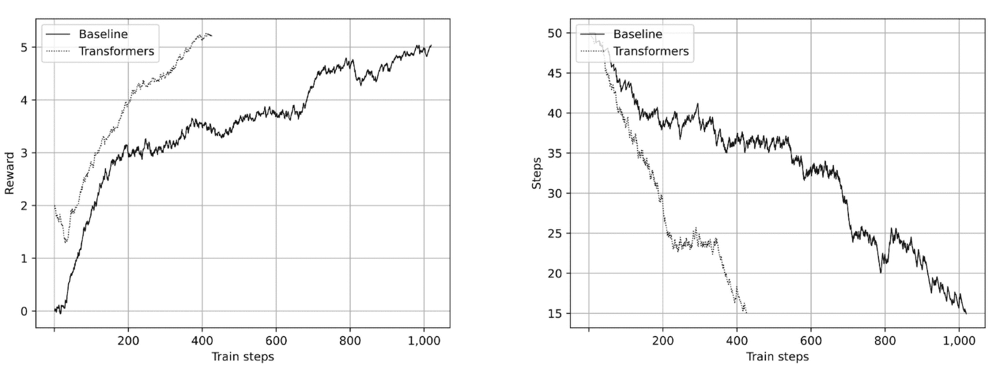

图 13.17：在 20 局游戏中的训练奖励（左）和训练回合长度（右）

在 200 局游戏中也是相同的情况——智能体学习效率更高（以游戏数量计算），但验证结果并不理想。这可以通过 Transformer 的容量大得多来解释——它们产生的嵌入几乎是我们的基线模型的 20 倍（384 对比 20），所以智能体更容易记住正确的步骤序列，而不是试图找到高层次的通用观察到行动的映射关系。

# ChatGPT

为了结束对 TextWorld 的讨论，让我们尝试另一种方法——使用 LLM。在 2022 年底公开发布后，OpenAI 的 ChatGPT 迅速流行开来，几乎改变了聊天机器人和基于文本的助手的格局。仅仅一年时间，数百个新的使用场景出现，并且数千个使用 LLM 技术的应用程序被开发出来。让我们尝试将这项技术应用到解决 TextWorld 游戏的问题上。

## 设置

首先，您需要在[`openai.com`](https://openai.com)上注册一个账号。我们将从一个基于网页的交互式聊天开始实验，目前可以免费试用且无需注册（在撰写时），但接下来的示例将使用 ChatGPT API，您需要在[`platform.openai.com`](https://platform.openai.com)生成一个 API 密钥。一旦密钥创建完成，您需要将其设置为您正在使用的 shell 中的环境变量 OPENAI_API_KEY。

我们还将使用 langchain 库从 Python 与 ChatGPT 进行通信，因此请使用以下命令安装它：

```py
$ pip install langchain==0.1.15 langchain-openai==0.1.2
```

请注意，这些包非常动态，新版本可能会破坏兼容性。

## 交互模式

在我们的第一个示例中，我们将使用基于网页的 ChatGPT 接口，要求其根据房间描述和游戏目标生成游戏指令。代码位于 Chapter13/chatgpt_interactive.py，功能如下：

1.  启动命令行中给定的游戏 ID 的 TextWorld 环境

1.  为 ChatGPT 创建包含指令、游戏目标和房间描述的提示

1.  将该提示写入控制台

1.  从控制台读取要执行的指令

1.  在环境中执行该指令

1.  从第 2 步开始重复，直到达到步数限制或游戏解决

所以，您的任务是复制生成的提示并将其粘贴到[`chat.openai.com`](https://chat.openai.com)的网页界面中。ChatGPT 将生成必须输入到控制台中的指令。

完整的代码非常简单且简短。它只有一个 play_game 函数，使用创建的环境执行游戏循环：

```py
 env_id = register_game( 
            gamefile=f"games/{args.game}{index}.ulx", 
            request_infos=EnvInfos(description=True, objective=True), 
        ) 
        env = gym.make(env_id)
```

在环境创建过程中，我们只需要额外的两项信息：房间描述和游戏目标。原则上，这两者都可以从自由文本观察中提取，因此我们可以从这些文本中解析它们。但为了方便起见，我们要求 TextWorld 明确提供这些信息。

在 play_game 函数的开头，我们重置环境并生成初始提示：

```py
def play_game(env, max_steps: int = 20) -> bool: 
    commands = [] 

    obs, info = env.reset() 

    print(textwrap.dedent("""\ 
    You’re playing the interactive fiction game. 
    Here is the game objective: %s 

    Here is the room description: %s 

    What command do you want to execute next? Reply with 
    just a command in lowercase and nothing else. 
    """)  % (info[’objective’], info[’description’])) 

    print("=== Send this to chat.openai.com and type the reply...")
```

我没有花太多时间设计它，因为基本上，第一次尝试就成功了，我确信它可以得到改进。最后一句话“仅以小写形式回复一个指令，且不包含其他内容”可以防止聊天机器人过于冗长，并帮助我们省去解析输出的麻烦。

然后我们执行循环，直到游戏解决或达到步数限制：

```py
 while len(commands) < max_steps: 
        cmd = input(">>> ") 
        commands.append(cmd) 
        obs, r, is_done, info = env.step(cmd) 
        if is_done: 
            print(f"You won in {len(commands)} steps! " 
                  f"Don’t forget to congratulate ChatGPT!") 
            return True 

        print(textwrap.dedent("""\ 
        Last command result: %s 
        Room description: %s 

        What’s the next command? 
        """) % (obs, info[’description’])) 
        print("=== Send this to chat.openai.com and type the reply...") 

    print(f"Wasn’t able to solve after {max_steps} steps, commands: {commands}") 
    return False
```

后续提示则简单得多——我们只提供获得的观察结果（命令的结果）和新的房间描述。我们无需再次传递目标，因为网页界面会保留对话的上下文，所以聊天机器人知道我们的先前指令。

让我们来看一个游戏测试（种子 1）。为了减少冗长，我删除了房间描述；否则，内容会占用几页书。但你应该完整复制生成的文本：

```py
$ ./chatgpt_interactive.py 1 
Starting game 1 

You’re playing the interactive fiction game. 
Here is the game objective: Get ready to pick stuff up and put it in places, because you’ve just entered TextWorld! Here is your task for today. First stop, go to the south. And then, head east. With that over with, make an effort to go north. With that accomplished, ensure that the type D locker is open. Then, take the keyboard from the type D locker. That’s it! 

Here is the room description: -= Spare Room =- 
What command do you want to execute next? Reply with 
just a command in lowercase and nothing else. 

=== Send this to chat.openai.com and type the reply... 
>>> go south 
Last command result: -= Dish-Pit =- 
Room description: -= Dish-Pit =- 
What’s the next command? 

=== Send this to chat.openai.com and type the reply... 
>>> go east 
Last command result: -= Cookhouse =- 
Room description: -= Cookhouse =- 
What’s the next command? 

=== Send this to chat.openai.com and type the reply... 
>>> go north 
Last command result: -= Studio =- 
Room description: -= Studio =- 
What’s the next command? 

=== Send this to chat.openai.com and type the reply... 
>>> open type d locker 
Last command result: You open the type D locker, revealing a keyboard. 
Room description: -= Studio =- 
What’s the next command? 

=== Send this to chat.openai.com and type the reply... 
>>> take keyboard 
You won in 5 steps! Don’t forget to congratulate ChatGPT!
```

如你所见，LLM 能够完美地解决任务。更令人惊叹的是，整体任务更为复杂——我们要求它生成命令，而不是像本章前面那样从“可接受命令”列表中做出决策。

## ChatGPT API

由于复制粘贴既乏味又无聊，让我们通过 ChatGPT API 来自动化我们的代理。我们将使用 langchain 库（[`python.langchain.com/`](https://python.langchain.com/)），它提供了足够的灵活性和控制力，可以充分利用 LLM 功能。

完整的代码示例在 Chapter13/chatgpt_auto.py 中。这里，我将介绍核心函数 play_game():

```py
from langchain_openai import ChatOpenAI 
from langchain_core.output_parsers import StrOutputParser 
from langchain_core.prompts import ChatPromptTemplate, MessagesPlaceholder 

def play_game(env, max_steps: int = 20) -> bool: 
    prompt_init = ChatPromptTemplate.from_messages([ 
        ("system", "You’re playing the interactive fiction game. " 
                   "Reply with just a command in lowercase and nothing else"), 
        ("system", "Game objective: {objective}"), 
        ("user", "Room description: {description}"), 
        ("user", "What command you want to execute next?"), 
    ]) 
    llm = ChatOpenAI() 
    output_parser = StrOutputParser()
```

我们的初始提示与之前相同——我们指示聊天机器人游戏的类型，并要求它仅回复将要输入游戏的命令。

然后我们重置环境并生成第一条消息，传递 TextWorld 的信息：

```py
 commands = [] 

    obs, info = env.reset() 
    init_msg = prompt_init.invoke({ 
        "objective": info[’objective’], 
        "description": info[’description’], 
    }) 

    context = init_msg.to_messages() 
    ai_msg = llm.invoke(init_msg) 
    context.append(ai_msg) 
    cmd = output_parser.invoke(ai_msg)
```

变量上下文非常重要，它包含了我们到目前为止所有消息的列表（包括来自人类和聊天机器人的消息）。我们将把这些消息传递给聊天机器人，以保留游戏的过程。这是必要的，因为游戏目标只展示一次，不会重复。如果没有历史记录，代理没有足够的信息来执行所需的步骤序列。另一方面，传递大量文本给聊天机器人可能导致高成本（因为 ChatGPT API 按处理的 token 计费）。我们的游戏不长（5 到 7 步就能完成任务），所以这不是一个主要问题，但对于更复杂的游戏，历史记录可能需要优化。

然后是游戏循环，和我们在交互式版本中看到的非常相似，但没有控制台通信：

```py
 prompt_next = ChatPromptTemplate.from_messages([ 
        MessagesPlaceholder(variable_name="chat_history"), 
        ("user", "Last command result: {result}"), 
        ("user", "Room description: {description}"), 
        ("user", "What command you want to execute next?"), 
    ]) 

    for _ in range(max_steps): 
        commands.append(cmd) 
        print(">>>", cmd) 
        obs, r, is_done, info = env.step(cmd) 
        if is_done: 
            print(f"I won in {len(commands)} steps!") 
            return True 

        user_msgs = prompt_next.invoke({ 
            "chat_history": context, 
            "result": obs.strip(), 
            "description": info[’description’], 
        }) 
        context = user_msgs.to_messages() 
        ai_msg = llm.invoke(user_msgs) 
        context.append(ai_msg) 
        cmd = output_parser.invoke(ai_msg)
```

在后续提示中，我们传递了对话历史、上一个命令的结果、当前房间的描述，并请求下一条命令。

我们还限制了步骤数量，以防止代理陷入循环（有时会发生）。如果在 20 步之后游戏未完成，我们会退出循环：

```py
 print(f"Wasn’t able to solve after {max_steps} steps, commands: {commands}") 
    return False
```

我曾在 20 个 TextWorld 游戏（种子 1 到 20）上实验过前面的代码，它成功解决了 20 个游戏中的 9 个。大多数失败的情况是由于代理进入了循环——发出了错误的命令，TextWorld 没有正确解析（例如“拿起钥匙”而不是“从箱子里拿起钥匙”），或者在导航上卡住了。

在两款游戏中，ChatGPT 失败是因为生成了“exit”命令，这会使 TextWorld 立即停止。很可能，检测到这个命令或禁止在提示中生成它，可能会增加解决游戏的数量。但即使如此，代理在没有任何预训练的情况下解决了 9 款游戏，依然是相当令人印象深刻的结果。从 ChatGPT 的成本来看，运行实验的处理费用为 450K 个 token，花费了我$0.20。对于这样有趣的体验，价格并不高！

# 总结

在本章中，你已经看到 DQN 如何应用于互动小说游戏，这是一个有趣且具有挑战性的领域，位于强化学习（RL）和自然语言处理（NLP）的交叉点。你学习了如何利用 NLP 工具处理复杂的文本数据，并在有趣且充满挑战的互动小说环境中进行实验，未来有许多实际实验的机会。此外，我们还使用了 Hugging Face 库中的 transformer 模型，并与 ChatGPT 进行了实验。

在下一章中，我们将继续探索“野外的 RL”，并检查 RL 方法在网页自动化中的适用性。
