# 第十四章：网络导航

我们将现在看看强化学习（RL）的其他一些实际应用：网页导航和浏览器自动化。这是一个非常实用的例子，展示了 RL 方法如何应用于实际问题，包括你可能遇到的复杂问题以及如何应对它们。

在这一章中，我们将：

+   一般讨论网页导航和浏览器自动化的实际应用

+   探索如何通过强化学习方法解决网页导航问题

+   让我们深入了解一个非常有趣，但常常被忽视且有些被遗弃的强化学习（RL）基准测试，它是由 OpenAI 实现的，叫做 Mini World of Bits（MiniWoB）。

# 网页导航的演变

当网络被发明时，它起初是一些仅包含文本的网页，通过超链接互相连接。如果你感兴趣，这里是第一篇网页的主页，[`info.cern.ch`](http://info.cern.ch)，其中包含文本和链接。你能做的唯一事情就是阅读文本并点击链接在页面之间导航。

几年后，1995 年，互联网工程任务组（IETF）发布了 HTML 2.0 规范，这个版本对 Tim Berners-Lee 发明的原始版本进行了大量扩展。其中一些扩展包括表单和表单元素，允许网页作者为他们的网站添加互动功能。用户可以输入和更改文本、切换复选框、选择下拉列表以及点击按钮。这些控件的集合类似于简约的图形用户界面（GUI）应用程序控件。不同之处在于，这一切发生在浏览器窗口内部，用户交互的数据和 UI 控件都是由服务器页面定义的，而不是由本地安装的应用程序定义的。

快进 29 年，现在我们有了 JavaScript、HTML5 画布以及在浏览器中运行的 Microsoft Office 应用程序。桌面和网页之间的边界已经变得如此微薄和模糊，以至于你可能无法分辨你正在使用的应用程序是 HTML 页面还是本地应用程序。然而，仍然是浏览器理解 HTML，并使用 HTTP 与外界通信。

从本质上讲，网页导航被定义为用户与一个或多个网站进行互动的过程。用户可以点击链接、输入文本，或者进行其他任何操作来实现他们的目标，例如发送电子邮件、查找法国大革命的确切日期，或查看最近的 Facebook 通知。所有这些都将通过网页导航来完成，那么问题就来了：我们的程序能学会如何做同样的事情吗？

# 浏览器自动化与强化学习（RL）

长期以来，自动化网站交互主要集中在网站测试和网页抓取等非常实际的任务上。网站测试在你（或其他人）开发并希望确保其按预期运行的复杂网站上尤为重要。例如，如果你有一个已经重新设计并准备在实际网站上部署的登录页面，那么你希望确保当输入错误密码时，或者用户点击“我忘记密码”等情况时，新设计能够正确处理。一个复杂的网站可能包含数百或数千个需要在每次发布时测试的用例，因此所有这些功能应该实现自动化。

网页抓取解决了大规模从网站提取数据的问题。例如，如果你想建立一个系统，聚合你所在城市所有比萨店的价格，你可能需要处理数百个不同的网站，这样构建和维护起来可能会很有问题。网页抓取工具尝试解决与网站交互的问题，提供从简单的 HTTP 请求和随后的 HTML 解析到完全模拟用户移动鼠标、点击按钮、用户反应延迟等的各种功能。

浏览器自动化的标准方法通常允许你通过程序控制真实的浏览器，如 Chrome 或 Firefox，它能够观察网页数据，如文档对象模型（DOM）树和对象在屏幕上的位置，并执行相应的操作，如移动鼠标、按下某些键、点击返回按钮，或执行一些 JavaScript 代码。与强化学习（RL）问题设置的联系显而易见：我们的代理通过发出操作和观察状态与网页和浏览器互动。奖励并不是那么明显，应该是任务特定的，比如成功填写表单或到达包含所需信息的页面。能够学习浏览器任务的系统的实际应用与之前的用例相关，包括以下内容：

+   在非常大的网站进行网页测试时，使用低级浏览器操作来定义测试过程非常繁琐，比如“将鼠标移动到左边五个像素，再按左键”。你想做的是给系统提供一些示范，让它能够概括并在所有类似的情况下重复所展示的操作，或者至少让它在用户界面重新设计、按钮文本更改等情况下足够健壮。

+   有很多情况下，你无法提前知道问题是什么，例如，当你希望系统探索网站的薄弱环节，如安全漏洞时。在这种情况下，RL（强化学习）代理可以非常快速地尝试大量奇怪的操作，比人类能做到的要快得多。当然，安全测试的操作空间非常庞大，所以随机点击不会像经验丰富的人类测试者那样有效。在这种情况下，基于 RL 的系统可以潜在地结合人类的先验知识和经验，同时保持探索的能力，并从这种探索中学习。

+   另一个可能受益于 RL 浏览器自动化的领域是网页抓取和数据提取。举个例子，你可能需要从成千上万的不同网站上提取数据，比如酒店网站、租车代理商或全球各地的其他企业。通常，在你获取到所需数据之前，需要填写带有参数的表单，考虑到不同网站的设计、布局和自然语言的灵活性，这成为了一个非常复杂的任务。在这样的任务中，RL 代理可以通过可靠地大规模提取数据，节省大量的时间和精力。

# 浏览器自动化中的挑战

使用 RL 进行浏览器自动化的潜在实际应用非常吸引人，但有一个非常严重的缺点：它们的规模太大，无法用于研究和方法比较。事实上，实施一个完整的网页抓取系统可能需要团队几个月的努力，而且大多数问题与 RL 本身并不直接相关，比如数据收集、浏览器引擎通信、输入和输出表示，以及许多其他涉及实际生产系统开发的问题。

通过解决所有这些问题，我们可能会陷入“只见树木，不见森林”的困境。这也是为什么研究人员喜欢使用基准数据集，如 MNIST、ImageNet 和 Atari 套件的原因。然而，并不是每个问题都适合作为基准。一方面，基准应该足够简单，以便快速实验并进行方法比较；另一方面，基准必须具有挑战性，并留有改进的空间。例如，Atari 基准包括各种各样的游戏，从可以在半小时内解决的非常简单的游戏（比如 Pong），到直到最近才得以完全解决的相对复杂的游戏（比如《蒙特祖玛的复仇》，需要复杂的行动规划）。根据我所知，浏览器自动化领域只有一个这样的基准，这使得这个基准被 RL 社区遗忘的情况变得更加糟糕。为了尝试解决这个问题，我们将在本章中看看这个基准。首先让我们了解它的历史。

# MiniWoB 基准

2016 年 12 月，OpenAI 发布了一个名为 MiniWoB 的数据集，其中包含 80 个基于浏览器的任务。这些任务在像素级别上进行观察（严格来说，除了像素，任务的文本描述也会提供给代理），并且应该通过鼠标和键盘操作与虚拟网络计算（VNC）客户端进行交互。VNC 是一种标准的远程桌面协议，VNC 服务器允许客户端通过网络使用鼠标和键盘与服务器的图形用户界面（GUI）应用程序进行交互。

80 个任务在复杂性和所需的代理动作方面差异很大。有些任务即使对于强化学习（RL）来说也非常简单，例如“点击对话框的关闭按钮”或“按下单个按钮”，但有些任务需要多个步骤，例如“展开折叠的组并点击带有某些文本的链接”或“使用日期选择工具选择特定日期”（且该日期在每次执行时随机生成）。有些任务对于人类来说很简单，但需要字符识别，例如“标记带有此文本的复选框”（文本是随机生成的）。以下是一些 MiniWoB 问题的截图：

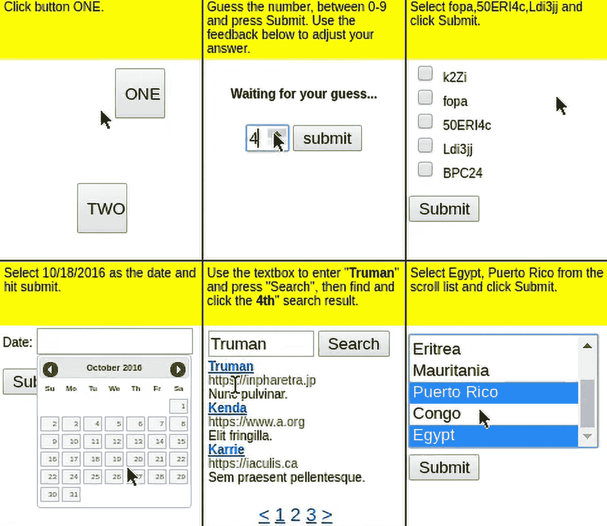

图 14.1：MiniWoB 环境

不幸的是，尽管 MiniWoB 拥有出色的创意和挑战性，但在最初发布后，几乎被 OpenAI 放弃了。几年后，一组斯坦福大学的研究人员发布了一个更新版，名为 MiniWoB++，它增加了更多的游戏并重构了架构。

# MiniWoB++

MiniWoB++ 不再使用 VNC 协议和真实的网页浏览器，而是使用 Selenium（[`www.selenium.dev`](https://www.selenium.dev)）库来实现网页浏览器自动化，这大大提高了环境的性能和稳定性。

目前，MiniWoB++ 正在由 Farama Foundation 进行维护（[`miniwob.farama.org/`](https://miniwob.farama.org/)），这对 RL 社区来说是一个好消息。在本章中，我们将使用他们的最新版本，但在进入代理的 RL 部分之前，我们需要了解 MiniWoB++ 的工作原理。

## 安装

原始的 MiniWoB 使用了 VNC 和 OpenAI Universe，这在安装和使用过程中带来了许多复杂性。本书前一版提供了一个定制的 Docker 镜像，并附带详细的安装说明。现在，安装过程简单多了：你不再需要处理 Docker 和 VNC。Selenium 库（它是浏览器自动化的事实标准）隐藏了与浏览器通信的所有复杂性，浏览器在后台以无头模式启动。Selenium 支持多种浏览器，但 MiniWoB++ 开发者推荐使用 Chrome 或 Chromium，因为其他浏览器可能会以不同的方式渲染环境。

除了 MiniWoB++包（可以通过`pip install miniwob==1.0`进行安装）外，您还需要在机器上安装 chromedriver。ChromeDriver 是一个小型二进制文件，它与浏览器进行通信，并以“测试模式”运行浏览器。ChromeDriver 的版本必须与已安装的 Chrome 版本匹配（可以通过访问 Chrome → 关于 Google Chrome 来检查）。因此，请从以下网站下载适用于您平台和 Chrome 版本的 chromedriver 压缩包：[`googlechromelabs.github.io/chrome-for-testing/`](https://googlechromelabs.github.io/chrome-for-testing/)。

注意：除了 ChromeDriver 压缩包外，它们还提供了完整版本的 Chrome 压缩包，您很可能不需要它。例如，针对 Mac M2 硬件的 Chrome v123 的 chromedriver 可以通过此 URL 下载：[`storage.googleapis.com/chrome-for-testing-public/123.0.6312.122/mac-arm64/chromedriver-mac-arm64.zip`](https://storage.googleapis.com/chrome-for-testing-public/123.0.6312.122/mac-arm64/chromedriver-mac-arm64.zip)。该压缩包中包含一个单独的 chromedriver 二进制文件，您需要将其放到 shell 的某个路径中（在 Mac 和 Linux 机器上，您可以使用`which chromedriver`命令，它会返回二进制文件的完整路径。如果没有返回，您需要修改 PATH）。要测试您的安装，可以使用一个简单的程序，Chapter14/adhoc/01_wob_create.py。如果一切正常，浏览器窗口会出现任务并显示 2 秒钟。

## 动作与观察

与我们迄今为止处理过的 Atari 游戏和其他 Gym 环境相比，MiniWoB 展示了一个更加通用的动作空间。Atari 游戏使用六到七个离散动作，对应于控制器的按钮和摇杆方向。CartPole 的动作空间甚至更小，仅有两个动作。然而，浏览器给我们的智能体提供了更多的灵活性，允许它做更多的事情。首先，完整的键盘，包括控制键和每个键的上下状态，都被暴露。因此，从 MiniWoB 的角度来看，您的智能体可以选择同时按下 10 个按钮，这完全没问题。动作空间的第二部分是鼠标：您可以将鼠标移动到任意坐标，并控制其按钮的状态。这显著增加了智能体需要学习如何处理的动作空间维度。此外，鼠标还允许双击和鼠标滚轮上下滚动事件。

在观察空间方面，MiniWoB 也比我们迄今为止处理过的环境更为丰富。完整的观察数据以字典形式表示，包含以下数据：

+   包含任务描述的文本，例如点击按钮 ONE，或者你在井字棋中扮演 X，赢得比赛

+   屏幕的像素值，以 RGB 格式表示

+   包含所有 DOM 元素的列表，来自底层网页，并带有属性（尺寸、颜色、字体等）

除此之外，你还可以访问底层浏览器，获取更多的信息（比如获取一些未直接提供的信息，如 CSS 属性或原始 HTML 数据）。

如你所见，这组任务为实验提供了很大的灵活性：你可以专注于任务的视觉部分，工作在像素级别；你可以使用 DOM 信息（环境允许你点击特定元素）；或者使用 NLP 组件——理解任务描述并规划行动。

## 简单示例

为了获得一些关于 MiniWoB 的实际经验，让我们来看一下你用来验证安装的程序，你可以在 Chapter14/adhoc/01_wob_create.py 中找到它。

首先，我们需要在 Gymnasium 中注册 MiniWoB 环境，这是通过 register_envs()函数完成的：

```py
import time 
import gymnasium as gym 
import miniwob 
from miniwob.action import ActionTypes 

RENDER_ENV = True 

if __name__ == "__main__": 
    gym.register_envs(miniwob)
```

事实上，register_envs()函数什么也不做，因为所有环境都在模块导入时注册。但是现代的 IDE 足够智能，会开始抱怨未使用的模块，因此这个方法给 IDE 留下了模块在代码中被使用的印象。

然后我们使用标准的 gym.make()方法创建一个环境：

```py
 env = gym.make(’miniwob/click-test-2-v1’, render_mode=’human’ if RENDER_ENV else None) 
    print(env) 
    try: 
        obs, info = env.reset() 
        print("Obs keys:", list(obs.keys())) 
        print("Info dict:", info) 
        assert obs["utterance"] == "Click button ONE." 
        assert obs["fields"] == (("target", "ONE"),) 
        print("Screenshot shape:", obs[’screenshot’].shape)
```

在我们的示例中，我们使用的是 click-test-2 问题，它要求你随机点击网页上放置的两个按钮中的一个。Farama 网站提供了一个非常方便的环境列表，你可以自己动手实验。click-test-2 问题可以在这里找到：[`miniwob.farama.org/environments/click-test-2/`](https://miniwob.farama.org/environments/click-test-2/)。

在创建环境时，我们传入了 render_mode 参数。如果它等于’human’，则浏览器窗口将在后台显示。在图 14.2 中，你可以看到窗口：

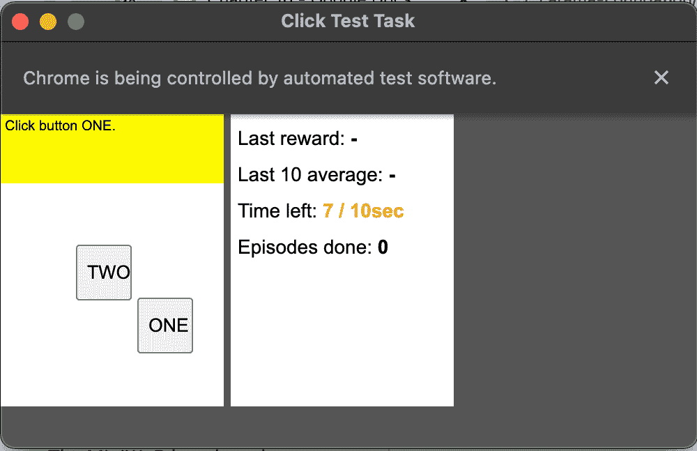

图 14.2：click-test-2 环境

如果我们运行程序，它会显示环境对象以及关于观察的信息（这是一个相当大的字典，所以我只输出它的键的列表）。下面是代码显示的部分：

```py
$ python adhoc/01_wob_create.py 
<OrderEnforcing<PassiveEnvChecker<ClickTest2Env<miniwob/click-test-2-v1>>>> 
Obs keys: [’utterance’, ’dom_elements’, ’screenshot’, ’fields’] 
Info dict: {’done’: False, ’env_reward’: 0, ’raw_reward’: 0, ’reason’: None, ’root_dom’: [1] body @ (0, 0) classes=[] children=1} 
Screenshot shape: (210, 160, 3)
```

如你所见，我们有话语（这是需要执行的任务）、DOM 元素、与 Atari 平台完全相同尺寸的截图（我不认为这只是巧合！）以及字段列表，字段是 DOM 树中任务特定的重要元素。

现在，让我们回到我们的代码。以下代码片段在 dom_elements 列表中查找我们需要点击的元素以执行任务：

```py
 if RENDER_ENV: 
            time.sleep(2) 

        target_elems = [e for e in obs[’dom_elements’] if e[’text’] == "ONE"] 
        assert target_elems 
        print("Target elem:", target_elems[0])
```

代码正在遍历 dom_elements 观察对象的字段，筛选出包含文本 ONE 的元素。找到的元素具有相当丰富的属性集：

```py
Target elem: {’ref’: 4, ’parent’: 3, ’left’: array([80.], dtype=float32), ’top’: array([134.], dtype=float32), ’width’: array([40.], dtype=float32), ’height’: array([40.], dtype=float32), ’tag’: ’button’, ’text’: ’ONE’, ’value’: ’’, ’id’: ’subbtn’, ’classes’: ’’, ’bg_color’: array([0.9372549, 0.9372549, 0.9372549, 1\.      ], dtype=float32), ’fg_color’: array([0., 0., 0., 1.], dtype=float32), ’flags’: array([0, 0, 0, 1], dtype=int8)}
```

现在，让我们来看代码的最后一部分，在这里我们获取元素的引用（它是一个整数标识符），并创建 CLICK_ELEMENT 动作：

```py
 action = env.unwrapped.create_action( 
            ActionTypes.CLICK_ELEMENT, ref=target_elems[0]["ref"]) 
        obs, reward, terminated, truncated, info = env.step(action) 
        print(reward, terminated, info) 
    finally: 
        env.close()
```

正如我们之前提到的，MiniWoB 提供了一组丰富的操作可以执行。这个特别的操作模拟了在特定 DOM 元素上进行鼠标点击。

作为此操作的结果，我们应该获得一个奖励，实际上确实会发生：

```py
0.7936 True {’done’: True, ’env_reward’: 0.7936, ’raw_reward’: 1, ’reason’: None, ’elapsed’: 2.066638231277466}
```

如果你通过设置 RENDER_ENV = False 禁用渲染，控制台和浏览器中发生的所有事情将不会显示。此模式还会导致更高的奖励，因为奖励会随时间减少。我机器上的完全无头模式在 0.09 秒内获得了 0.9918 的奖励。

# 简单的点击方法

为了开始网页导航，让我们实现一个简单的 A3C 代理，根据图像观察决定应该点击哪里。这种方法只能解决 MiniWoB 套件的一个小子集，稍后我们将讨论这种方法的局限性。现在，它将帮助我们更好地理解问题。

与上一章一样，我在这里不会讨论完整的源代码。相反，我们将专注于最重要的功能，并简要概述其余部分。完整的源代码可以在 GitHub 仓库中找到。

## 网格操作

当我们讨论 MiniWoB 的架构和组织时，我们提到过，动作空间的丰富性和灵活性为强化学习代理带来了许多挑战。浏览器中的活动区域只有 210 × 160 像素，但即使是这么小的区域，我们的代理也可能需要执行移动鼠标、点击、拖动对象等操作。仅仅是鼠标就可能成为一个难题，因为在极端情况下，代理可能需要执行几乎无限多种不同的动作，例如在某个位置按下鼠标按钮并拖动鼠标到另一个位置。在我们的示例中，我们通过只考虑在活动网页区域内某些固定网格点的点击来大大简化问题。我们动作空间的示意图如下所示：

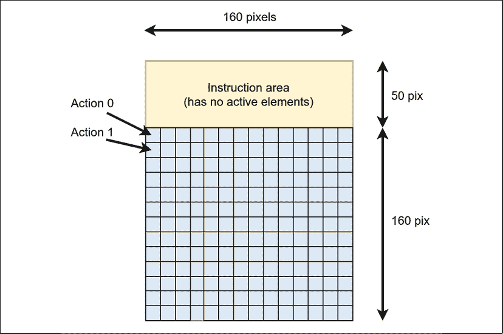

图 14.3：网格动作空间

在 MiniWob 的原始版本中，这种操作的封装器已经存在于 OpenAI Universe 中。但由于 MiniWoB++ 中无法使用它，我在 lib/wob.py 模块中自行实现了它。我们来快速查看代码，从构造函数开始：

```py
WIDTH = 160 
HEIGHT = 210 
X_OFS = 0 
Y_OFS = 50 
BIN_SIZE = 10 
WOB_SHAPE = (3, HEIGHT, WIDTH) 

class MiniWoBClickWrapper(gym.ObservationWrapper): 
    FULL_OBS_KEY = "full_obs" 

    def __init__(self, env: gym.Env, keep_text: bool = False, 
                 keep_obs: bool = False, bin_size: int = BIN_SIZE): 
        super(MiniWoBClickWrapper, self).__init__(env) 
        self.bin_size = bin_size 
        self.keep_text = keep_text 
        self.keep_obs = keep_obs 
        img_space = spaces.Box(low=0, high=255, shape=WOB_SHAPE, dtype=np.uint8) 
        if keep_text: 
            self.observation_space = spaces.Tuple( 
                (img_space, spaces.Text(max_length=1024))) 
        else: 
            self.observation_space = img_space 
        self.x_bins = WIDTH // bin_size 
        count = self.x_bins * ((HEIGHT - Y_OFS) // bin_size) 
        self.action_space = spaces.Discrete(count)
```

在构造函数中，我们创建了观察空间（它是一个 3 × 210 × 160 的张量）和动作空间，动作空间将是 256 个离散动作，针对 10\ 的 bin 大小。作为一个选项，我们可以要求封装器保存要执行的任务的文本。此功能将在本章的后续示例中使用。

然后我们提供一个类方法，用于创建具有特定配置的环境：

```py
 @classmethod 
    def create(cls, env_name: str, bin_size: int = BIN_SIZE, keep_text: bool = False, 
               keep_obs: bool = False, **kwargs) -> "MiniWoBClickWrapper": 
        gym.register_envs(miniwob) 
        x_bins = WIDTH // bin_size 
        y_bins = (HEIGHT - Y_OFS) // bin_size 
        act_cfg = ActionSpaceConfig( 
            action_types=(ActionTypes.CLICK_COORDS, ), coord_bins=(x_bins, y_bins)) 
        env = gym.make(env_name, action_space_config=act_cfg, **kwargs) 
        return MiniWoBClickWrapper( 
            env, keep_text=keep_text, keep_obs=keep_obs, bin_size=bin_size)
```

除了创建环境并进行封装外，我们还请求了一个自定义的 ActionSpaceConfig，它会考虑到我们网格的尺寸。通过这种定制，我们需要传递网格单元的 (x,y) 坐标来执行点击操作。接着，我们定义了一个辅助方法，它将完整的观察字典转换为我们所需的格式。reset() 方法只是调用了这个方法：

```py
 def _observation(self, observation: dict) -> np.ndarray | tt.Tuple[np.ndarray, str]: 
        text = observation[’utterance’] 
        scr = observation[’screenshot’] 
        scr = np.transpose(scr, (2, 0, 1)) 
        if self.keep_text: 
            return scr, text 
        return scr 

    def reset(self, *, seed: int | None = None, options: dict[str, tt.Any] | None = None) \ 
            -> tuple[gym.core.WrapperObsType, dict[str, tt.Any]]: 
        obs, info = self.env.reset(seed=seed, options=options) 
        if self.keep_obs: 
            info[self.FULL_OBS_KEY] = obs 
        return self._observation(obs), info
```

现在，封装器的最后一部分，step() 方法：

```py
 def step(self, action: int) -> tt.Tuple[ 
        gym.core.WrapperObsType, gym.core.SupportsFloat, bool, bool, dict[str, tt.Any] 
    ]: 
        b_x, b_y = action_to_bins(action, self.bin_size) 
        new_act = { 
            "action_type": 0, 
            "coords": np.array((b_x, b_y), dtype=np.int8), 
        } 
        obs, reward, is_done, is_tr, info = self.env.step(new_act) 
        if self.keep_obs: 
            info[self.FULL_OBS_KEY] = obs 
        return self._observation(obs), reward, is_done, is_tr, info 

def action_to_bins(action: int, bin_size: int = BIN_SIZE) -> tt.Tuple[int, int]: 
    row_bins = WIDTH // bin_size 
    b_y = action // row_bins 
    b_x = action % row_bins 
    return b_x, b_y
```

为了执行动作，我们需要将网格单元的索引（在 0...255 范围内）转换为该单元格的 (x, y) 坐标。然后，作为底层 MiniWoB 环境的动作，我们传递一个包含 action_type=0（这是我们在环境创建中使用的 ActionSpaceConfig 中的索引）和包含这些单元格坐标的 NumPy 数组的字典。

为了说明包装器，GitHub 仓库中的 adhoc/03_clicker.py 文件有一个小程序，它使用暴力破解方法在 click-dialog-v1 任务中。目标是使用带有叉号的角落按钮关闭随机放置的对话框。在这个示例中（我们不在这里展示代码），我们依次点击所有 256 个网格单元，以说明包装器。

## 我们实现的 RL 部分

随着观察和动作的转换，RL 部分相当简单。我们将使用 A3C 方法来训练代理，代理需要从 160 × 210 的观察中决定点击哪个网格单元。除了策略，它是 256 个网格单元的概率分布，我们的代理还会估算状态的价值，这将在策略梯度估算中作为基准。

这个示例中有几个模块：

+   lib/common.py：本章中各个示例共享的方法，包括已熟悉的 RewardTracker 和 unpack_batch 函数

+   lib/model.py：包含模型的定义，我们将在下一节中查看

+   lib/wob.py：包含 MiniWoB 特定的代码，如环境包装器和其他实用函数

+   wob_click_train.py：用于训练点击器模型的脚本

+   wob_click_play.py：加载模型权重并在单一环境中使用它们，记录观察并统计奖励的脚本。

这些模块中的代码没有新内容，因此这里没有展示。你可以在 GitHub 仓库中找到它。

## 模型和训练代码

这个模型非常简单，使用了你在其他 A3C 示例中看到的相同模式。我没有花太多时间优化和微调架构和超参数，所以最终结果可能会有显著改进（你可以根据你在本书中学到的内容自己尝试进行改进）。以下是具有两个卷积层、单层策略和价值头的模型定义：

```py
class Model(nn.Module): 
    def __init__(self, input_shape: tt.Tuple[int, ...], n_actions: int): 
        super(Model, self).__init__() 

        self.conv = nn.Sequential( 
            nn.Conv2d(input_shape[0], 64, 5, stride=5), 
            nn.ReLU(), 
            nn.Conv2d(64, 64, 3, stride=2), 
            nn.ReLU(), 
            nn.Flatten(), 
        ) 
        size = self.conv(torch.zeros(1, *input_shape)).size()[-1] 
        self.policy = nn.Linear(size, n_actions) 
        self.value = nn.Linear(size, 1) 

    def forward(self, x: torch.ByteTensor) -> tt.Tuple[torch.Tensor, torch.Tensor]: 
        xx = x / 255.0 
        conv_out = self.conv(xx) 
        return self.policy(conv_out), self.value(conv_out)
```

你将在 wob_click_train.py 中找到训练脚本，它与第十二章中的完全相同。我们使用 AsyncVectorEnv 和 8 个并行环境，它会在后台启动 8 个 Chrome 实例。如果你的机器内存允许，你可以增加这个数量，并检查它对训练的影响。

## 训练结果

默认情况下，训练使用 click-dialog-v1 问题，训练大约花费了 8 分钟，达到了平均奖励 0.9。图 14.4 显示了平均奖励和步骤数的图表：

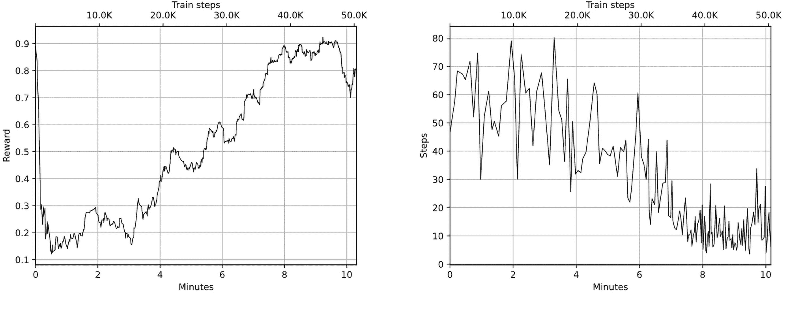

图 14.4：训练奖励（左）和每集步数计数（右）

右侧的 episode_steps 图表显示了智能体在集结束前应该执行的平均动作次数。理想情况下，对于这个问题，次数应该是 1，因为智能体唯一需要执行的动作是点击对话框的关闭按钮。然而，实际上，智能体在集结束之前会看到七到九帧图像。这发生的原因有两个：对话框关闭按钮上的叉号可能会有延迟出现，并且容器内的浏览器会在智能体点击和奖励获得之间添加一个时间间隙。

要检查已学习的策略，你可以使用 wob_click_play.py 工具，它加载模型并在一个环境中使用它。它可以播放多个回合以测试模型的平均性能：

```py
$ ./wob_click_play.py -m saves/best_0.923_45400.dat --verbose 
0 0.0 False {’done’: False, ’env_reward’: 0, ’raw_reward’: 0, ’reason’: None, ’elapsed’: 0.1620042324066162, ’root_dom’: [1] body @ (0, 0) classes=[] children=2} 
1 0.9788 True {’done’: True, ’env_reward’: 0.9788, ’raw_reward’: 1, ’reason’: None, ’elapsed’: 0.19491100311279297} 
Round 0 done 
Done 1 rounds, mean steps 2.00, mean reward 0.979
```

如果以--render 命令行选项开始，浏览器窗口将在智能体的操作过程中显示。

## 简单点击限制

不幸的是，所展示的方法只能用来解决相对简单的问题，比如点击对话框。如果你尝试将它用于更复杂的任务，收敛性是很难实现的。原因有很多。

首先，我们的智能体是无状态的，这意味着它仅根据观察结果来决定行动，而不考虑之前的行为。你可能还记得在第一章中，我们讨论了马尔可夫决策过程（MDP）的马尔可夫性质，这个性质使我们能够丢弃所有之前的历史，只保留当前的观察结果。即使在 MiniWoB 中相对简单的问题中，这一马尔可夫性质也可能被违反。例如，有一个问题叫做点击按钮序列（截图见图 14.5，该环境的文档可以在[`miniwob.farama.org/environments/click-button-sequence/`](https://miniwob.farama.org/environments/click-button-sequence/)找到），要求我们的智能体先点击按钮 ONE，再点击按钮 TWO。即使我们的智能体幸运地按要求的顺序随机点击按钮，它也无法从单一图像中分辨出下一个需要点击的按钮。

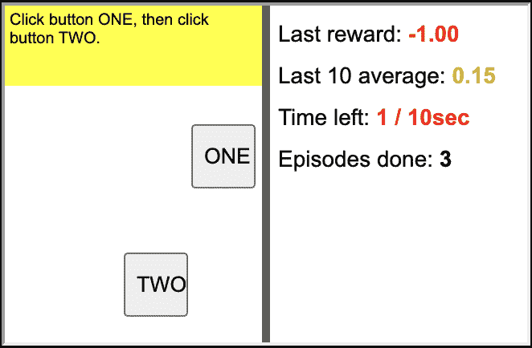

图 14.5：一个无状态智能体可能难以解决的环境示例

尽管这个问题很简单，我们仍然不能使用我们的强化学习方法来解决它，因为 MDP 的形式化不再适用。这样的問題被称为部分可观测的马尔可夫决策过程，或 POMDP（我们在第六章中简要讨论了这些），通常的处理方法是允许智能体保持某种状态。这里的挑战是找到平衡点，即在保持最小相关信息的同时，避免通过将所有内容都加入观察结果而让智能体被不相关信息淹没。

我们在这个例子中可能面临的另一个问题是，解决问题所需的数据可能不在图像中，或者可能以不方便的形式出现。例如，两个问题，点击选项卡 ([`miniwob.farama.org/environments/click-tab/`](https://miniwob.farama.org/environments/click-tab/)) 和点击复选框 ([`miniwob.farama.org/environments/click-checkboxes/`](https://miniwob.farama.org/environments/click-checkboxes/))，如图 14.6 所示：

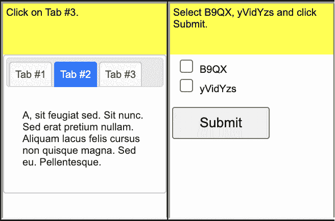

图 14.6：文本描述在某些环境中的重要性示例

在第一个例子中，你需要点击三个选项卡中的一个，但每次需要点击的选项卡是随机选择的。需要点击哪个选项卡会在描述中显示（通过一个文本字段提供观察，并显示在环境页面的顶部），但我们的代理只能看到像素，这使得将顶部的数字与随机点击结果的输出联系起来变得复杂。对于点击复选框的问题，情况更为糟糕，因为需要点击几个带有随机生成文本的复选框。防止过拟合问题的一个可能方法是使用某种光学字符识别（OCR）网络，将观察中的图像转换为文本形式。另一种方法（将在下一节中展示）是将文本描述融入到代理的观察中。

另一个问题可能与代理需要探索的动作空间的维度有关。即使是单次点击问题，动作的数量也可能非常庞大，因此代理可能需要很长时间才能发现如何执行操作。这里的一个可能解决方案是将示范引入训练中。例如，在图 14.7 中，有一个名为 count-sides ([`miniwob.farama.org/environments/count-sides/`](https://miniwob.farama.org/environments/count-sides/)) 的问题。目标是点击对应于形状边数的按钮：

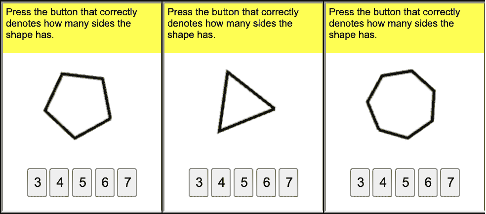

图 14.7：count-sides 环境示例

通过将人工示范加入训练，解决了这个问题。在我的实验中，从零开始训练经过一天的训练后没有任何进展。然而，在加入几十个正确点击的示范之后，代理在 15 分钟的训练时间内成功解决了这个问题。当然，我们可以花时间进一步微调超参数，但示范的效果确实令人印象深刻。本章后面我们将研究如何记录并注入人工示范以改善收敛性。

# 添加文本描述

为了改进我们的点击器代理，第一步是将问题的文本描述添加到模型中。我已经提到过，一些问题包含在文本描述中提供的关键信息，比如需要点击的标签索引或代理需要检查的条目列表。这些信息也显示在图像观察的顶部，但像素并不总是简单文本的最佳表示。

为了考虑到这一点，我们需要将模型的输入从仅图片扩展到图片和文本数据。在上一章中我们已经处理了文本，因此递归神经网络（RNN）是一个显而易见的选择（也许对于这样的玩具问题来说不是最佳选择，但它具有灵活性和可扩展性）。

## 实现

在本节中，我们将只关注实现的最重要部分。你可以在 Chapter16/wob_click_mm_train.py 模块中找到完整的代码。与我们的点击器模型相比，文本扩展并没有增加太多内容。

首先，我们应该要求 MiniWoBClickWrapper 保留从观察中获得的文本。本章前面已经展示了这个类的完整源代码，在 Grid actions 部分。为了保留文本，我们应该将 keep_text=True 传递给包装器构造函数，这样该类将返回一个包含 NumPy 数组和文本字符串的元组，而不仅仅是包含图像的 NumPy 数组。然后，我们需要准备我们的模型，以便能够处理这样的元组，而不是一批 NumPy 数组。这需要在两个地方完成：在我们的代理中（当我们使用模型来选择动作时）以及在训练代码中。为了以适合模型的方式适配观察，我们可以使用 PTAN 库的特殊功能，称为预处理器。其核心思想非常简单：预处理器是一个可调用的函数，需要将观察列表转换为可以传递给模型的形式。默认情况下，预处理器将 NumPy 数组列表转换为 PyTorch 张量，并可以选择将其复制到 GPU 内存中。然而，有时需要更复杂的转换，例如在我们的例子中，当我们需要将图像打包到张量中时，但文本字符串需要特殊处理。在这种情况下，你可以重新定义默认的预处理器并将其传递给 ptan.Agent 类。

理论上，预处理器功能可以移到模型本身中，得益于 PyTorch 的灵活性，但默认的预处理器简化了我们的工作，特别是在观察仅仅是 NumPy 数组的情况下。以下是来自 lib/model.py 模块的预处理器类的源代码：

```py
MM_EMBEDDINGS_DIM = 50 
MM_HIDDEN_SIZE = 128 
MM_MAX_DICT_SIZE = 100 

TOKEN_UNK = "#unk" 

class MultimodalPreprocessor: 
    log = logging.getLogger("MulitmodalPreprocessor") 

    def __init__(self, max_dict_size: int = MM_MAX_DICT_SIZE, 
                 device: torch.device = torch.device(’cpu’)): 
        self.max_dict_size = max_dict_size 
        self.token_to_id = {TOKEN_UNK: 0} 
        self.next_id = 1 
        self.tokenizer = TweetTokenizer(preserve_case=True) 
        self.device = device 

    def __len__(self): 
        return len(self.token_to_id)
```

在前面代码的构造函数中，我们创建了一个从令牌到标识符的映射（该映射将动态扩展），并从 nltk 包中创建了分词器。

接下来，我们有了`__call__()`方法，它将转换批次：

```py
 def __call__(self, batch: tt.Tuple[tt.Any, ...] | tt.List[tt.Tuple[tt.Any, ...]]): 
        tokens_batch = [] 

        if isinstance(batch, tuple): 
            batch_iter = zip(*batch) 
        else: 
            batch_iter = batch 
        for img_obs, txt_obs in batch_iter: 
            tokens = self.tokenizer.tokenize(txt_obs) 
            idx_obs = self.tokens_to_idx(tokens) 
            tokens_batch.append((img_obs, idx_obs)) 
        tokens_batch.sort(key=lambda p: len(p[1]), reverse=True) 
        img_batch, seq_batch = zip(*tokens_batch) 
        lens = list(map(len, seq_batch))
```

我们的预处理器的目标是将一批（图像，文本）元组转换为两个对象：第一个是形状为（batch_size, 3, 210, 160）的图像数据张量，第二个包含来自文本描述的令牌批次，形式为打包序列。打包序列是 PyTorch 数据结构，适用于高效的 RNN 处理。我们在第十三章中讨论过这个问题。

事实上，批次可以有两种不同的形式：它可以是一个包含图像批次和文本批次的元组，或者它可以是一个包含单个（图像，文本令牌）样本的元组列表。这是因为 `VectorEnv` 对 gym.Tuple 观测空间的处理方式不同。但这些细节在这里并不太重要；我们只是通过检查批次变量的类型并进行必要的处理来处理这种差异。

作为转换的第一步，我们对文本字符串进行标记化，并将每个令牌转换为整数 ID 列表。然后，我们按令牌长度降序对批次进行排序，这是底层 cuDNN 库对高效 RNN 处理的要求。

然后，我们将图像转换为张量，将序列转换为填充序列，这是一个批次大小 × 最长序列长度的矩阵。我们在前一章中见过这个：

```py
 img_v = torch.FloatTensor(np.asarray(img_batch)).to(self.device) 
        seq_arr = np.zeros( 
            shape=(len(seq_batch), max(len(seq_batch[0]), 1)), dtype=np.int64) 
        for idx, seq in enumerate(seq_batch): 
            seq_arr[idx, :len(seq)] = seq 
            if len(seq) == 0: 
                lens[idx] = 1 
        seq_v = torch.LongTensor(seq_arr).to(self.device) 
        seq_p = rnn_utils.pack_padded_sequence(seq_v, lens, batch_first=True) 
        return img_v, seq_p
```

以下的 `tokens_to_idx()` 函数将令牌列表转换为 ID 列表：

```py
 def tokens_to_idx(self, tokens): 
        res = [] 
        for token in tokens: 
            idx = self.token_to_id.get(token) 
            if idx is None: 
                if self.next_id == self.max_dict_size: 
                    self.log.warning("Maximum size of dict reached, token " 
                                     "’%s’ converted to #UNK token", token) 
                    idx = 0 
                else: 
                    idx = self.next_id 
                    self.next_id += 1 
                    self.token_to_id[token] = idx 
            res.append(idx) 
        return res
```

问题在于，我们无法预先知道从文本描述中得到的词典大小。一种方法是按字符级别进行处理，将每个字符输入到 RNN 中，但这将导致序列过长，难以处理。另一种解决方案是硬编码一个合理的词典大小，比如 100 个令牌，并为我们从未见过的令牌动态分配令牌 ID。在这个实现中，采用了后者的方法，但它可能不适用于包含随机生成字符串的 MiniWoB 问题文本描述。对此问题的潜在解决方案是，使用字符级别的标记化或使用预定义的词典。

现在，让我们来看一下我们的模型类：

```py
class ModelMultimodal(nn.Module): 
    def __init__(self, input_shape: tt.Tuple[int, ...], n_actions: int, 
                 max_dict_size: int = MM_MAX_DICT_SIZE): 
        super(ModelMultimodal, self).__init__() 

        self.conv = nn.Sequential( 
            nn.Conv2d(input_shape[0], 64, 5, stride=5), 
            nn.ReLU(), 
            nn.Conv2d(64, 64, 3, stride=2), 
            nn.ReLU(), 
            nn.Flatten(), 
        ) 
        size = self.conv(torch.zeros(1, *input_shape)).size()[-1] 

        self.emb = nn.Embedding(max_dict_size, MM_EMBEDDINGS_DIM) 
        self.rnn = nn.LSTM(MM_EMBEDDINGS_DIM, MM_HIDDEN_SIZE, batch_first=True) 
        self.policy = nn.Linear(size + MM_HIDDEN_SIZE*2, n_actions) 
        self.value = nn.Linear(size + MM_HIDDEN_SIZE*2, 1)
```

区别在于一个新的嵌入层，它将整数令牌 ID 转换为密集的令牌向量，并且使用长短期记忆（LSTM）RNN。卷积层和 RNN 层的输出被拼接并输入到策略和值头部，因此它们输入的维度是图像和文本特征的组合。

这个函数将图像和 RNN 特征拼接成一个单一的张量：

```py
 def _concat_features(self, img_out: torch.Tensor, 
                         rnn_hidden: torch.Tensor | tt.Tuple[torch.Tensor, ...]): 
        batch_size = img_out.size()[0] 
        if isinstance(rnn_hidden, tuple): 
            flat_h = list(map(lambda t: t.view(batch_size, -1), rnn_hidden)) 
            rnn_h = torch.cat(flat_h, dim=1) 
        else: 
            rnn_h = rnn_hidden.view(batch_size, -1) 
        return torch.cat((img_out, rnn_h), dim=1)
```

最后，在 `forward()` 函数中，我们期望预处理器准备的两个对象：一个包含输入图像的张量和批次的打包序列：

```py
 def forward(self, x: tt.Tuple[torch.Tensor, rnn_utils.PackedSequence]): 
        x_img, x_text = x 

        emb_out = self.emb(x_text.data) 
        emb_out_seq = rnn_utils.PackedSequence(emb_out, x_text.batch_sizes) 
        rnn_out, rnn_h = self.rnn(emb_out_seq) 

        xx = x_img / 255.0 
        conv_out = self.conv(xx) 
        feats = self._concat_features(conv_out, rnn_h) 
        return self.policy(feats), self.value(feats)
```

图像通过卷积处理，文本数据则输入到 RNN 中；然后，将结果拼接，并计算策略和值结果。

这就是大部分新代码。训练的 Python 脚本 wob_click_mm_train.py，基本上是 wob_click_train.py 的复制版，仅在包装器创建、模型和预处理器上做了些许修改。

## 结果

我在点击按钮环境中进行了多个实验（[`miniwob.farama.org/environments/click-button/`](https://miniwob.farama.org/environments/click-button/)），目标是从多个随机按钮中做出选择。在图 14.8 中，展示了该环境中的几种情况：

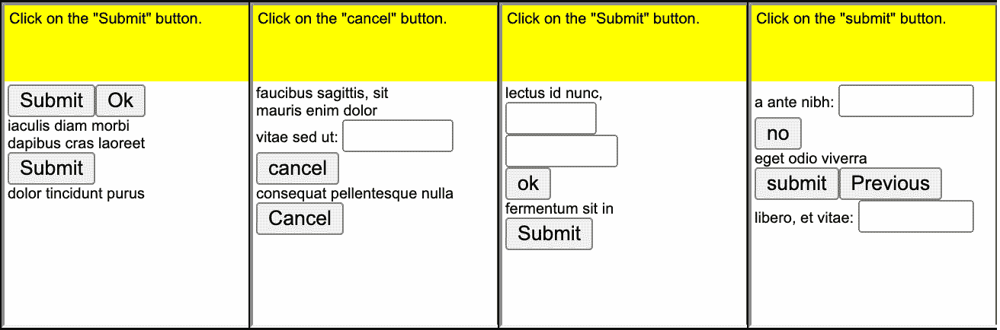

图 14.8：点击按钮环境中的任务

如图 14.9 所示，经过 3 小时的训练，模型已经学会了如何点击（回合中的平均步骤计数减少到 5-7），并获得了平均奖励 0.2\。但随后训练没有产生明显效果。这可能表明超参数需要调整，或者是环境的模糊性。在这种情况下，我注意到该环境有时会显示多个相同标题的按钮，但只有一个按钮给出正奖励。图 14.8 的第一部分中就有这样的例子，那里有两个相同的“提交”按钮。

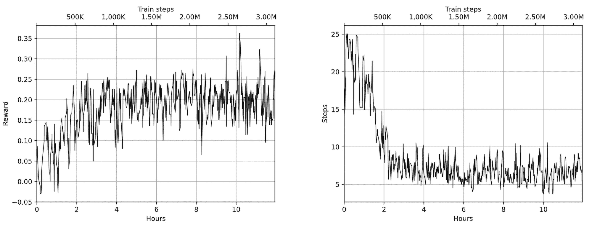

图 14.9：点击按钮中的训练奖励（左）和回合中的步骤计数（右）

另一个文本描述重要的环境是点击标签（click-tab），要求智能体随机点击一个特定的标签。截图见图 14.10。

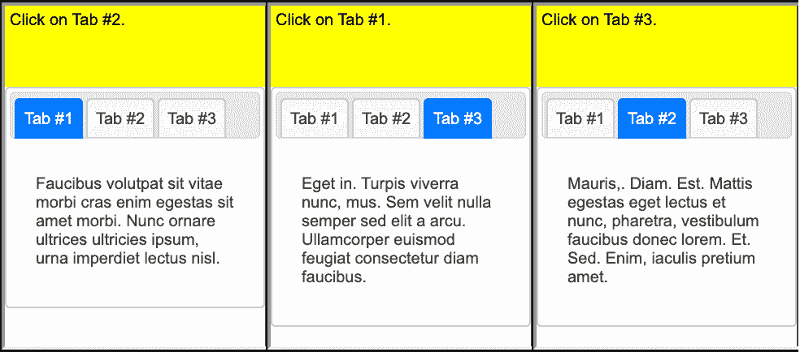

图 14.10：点击标签环境中的任务

在这个环境中，训练并不成功，这有点奇怪，因为这个任务看起来比点击按钮更简单（点击的位置是固定的）。很可能需要进行超参数调优。这是另一个有趣的挑战，你可以通过实验来解决，运用你到目前为止获得的知识。

# 人类示范

为了改善训练过程，我们尝试加入人类示范。示范的思想很简单：为了帮助我们的智能体发现解决任务的最佳方法，我们展示一些我们认为是解决问题所需的行为示例。这些示例可能不是最佳的解决方案，也不完全准确，但它们应该足够好，能为智能体展示出有前景的探索方向。

事实上，这是一个非常自然的做法，因为所有人类学习都是基于一些由老师、父母或其他人提供的先前示例。这些示例可以是书面形式的（例如，食谱书），或者是以示范的形式给出，你需要多次重复才能掌握（例如，舞蹈课程）。这种形式的训练比随机搜索更有效。试想一下，如果只通过试错来学习如何刷牙，那会有多么复杂和漫长。当然，依赖示范学习也有风险，示范可能是错误的，或者不是解决问题的最有效方式；但总体来说，它比随机搜索要有效得多。

我们之前的所有示例都遵循了这个工作流程：

1.  他们没有使用任何先验知识，而是从随机权重初始化开始，这导致在训练初期执行的是随机动作。

1.  经过几次迭代后，智能体发现某些状态下的某些动作能带来更有前景的结果（通过更高优势的 Q 值或策略），并开始偏好这些动作而不是其他的动作。

1.  最终，这个过程导致了一个或多或少的最优策略，使得智能体在结束时获得了高奖励。

当我们的动作空间维度较低且环境行为不太复杂时，这种方法效果很好，但仅仅是将动作数量翻倍，就需要至少两倍的观察量。以我们的点击器智能体为例，我们在活动区域有 256 种不同的动作，对应 10 × 10 的网格，这比 CartPole 环境中的动作多了 128 倍。由此可见，训练过程时间很长，并且可能根本无法收敛。

维度问题可以通过多种方式解决，比如更智能的探索方法、训练时更高效的采样（一次性训练）、引入先验知识（迁移学习）等手段。当前有大量研究致力于使强化学习更好、更快，我们可以确信，许多突破正在前方等待着我们。在本节中，我们将尝试通过将人类记录的示范融入训练过程来采用更传统的方法。

你可能还记得我们关于策略内和策略外方法的讨论（这些内容在第四章和第八章中有提到）。这与我们的人类演示非常相关，因为严格来说，我们不能将策略外数据（人类观察-行动对）与策略内方法（在我们这里是 A3C）一起使用。这是因为策略内方法的性质：它们使用当前策略收集的样本来估计策略梯度。如果我们仅仅将人类记录的样本输入到训练过程中，估计出的梯度将适用于人类策略，而不适用于我们的神经网络（NN）所给出的当前策略。为了解决这个问题，我们需要稍微“作弊”一下，从监督学习的角度来看待我们的任务。具体来说，我们将使用对数似然目标来推动我们的神经网络根据演示来采取行动。

通过这种方式，我们并不是用监督学习取代强化学习。相反，我们是利用监督学习技术来帮助我们的强化学习方法。从根本上说，这并不是我们第一次做类似的事情；例如，Q-learning 中的价值函数训练就是纯粹的监督学习。

在深入实现细节之前，我们需要解决一个非常重要的问题：我们如何以最方便的形式获取演示？

## 记录演示

在 MiniWoB++ 和过渡到 Selenium 之前，记录演示在技术上是具有挑战性的。特别是，必须捕获并解码 VNC 协议，才能提取浏览器的屏幕截图以及用户执行的操作。在本书的前一版中，我提供了自己的 VNC 协议解析器版本来记录演示。

幸运的是，这些挑战现在大多已经消失。现在没有 VNC 了，浏览器已经在本地进程中启动（之前是在 Docker 容器内），所以我们几乎可以直接与之通信。

Farama MiniWoB++ 配有一个 Python 脚本，可以将演示记录到 JSON 文件中。该脚本可以通过 `python -m miniwob.scripts.record` 命令启动，详细文档请见 [`miniwob.farama.org/content/demonstrations/`](https://miniwob.farama.org/content/demonstrations/)。

不幸的是，它有一个局限性：在观察数据中，它仅捕捉网页的 DOM 结构，并没有像素级的信息。由于本章的示例大量使用像素，使用此脚本记录的演示是无效的。为了解决这个问题，我实现了自己版本的工具来记录包括浏览器像素在内的演示。它被命名为 Chapter14/record_demo.py，可以通过以下方式启动：

```py
$ ./record_demo.py -o demos/test -g tic-tac-toe-v1 -d 1 
Bottle v0.12.25 server starting up (using WSGIRefServer())... 
Listening on http://localhost:8032/ 
Hit Ctrl-C to quit. 

WARNING:root:Cannot call {’action_type’: 0} on instance 0, which is already done 
127.0.0.1 - - [26/Apr/2024 12:19:49] "POST /record HTTP/1.1" 200 17 
Saved in  demos/test/tic-tac-toe_0426101949.json 
New episode starts in 1 seconds...
```

该命令以 render_mode='human'启动环境，显示浏览器窗口并允许与页面进行交互。在后台，它记录观测数据（带有截图），当回合结束时，它将截图与您的动作结合，并将所有内容存储在由-o 命令行选项指定的目录中的 JSON 文件中。使用-g 命令行选项可以更改环境，-d 参数设置回合之间的延迟时间（秒）。如果没有给定-d 选项，您需要在控制台按 Enter 键来开始一个新回合。以下截图显示了记录示范的过程：

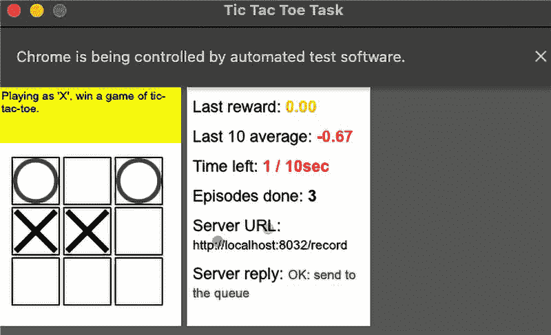

图 14.11：记录井字棋的人类示范

在 Chapter14/demos 目录中，我存储了用于实验的示范，但当然，您可以使用提供的脚本记录自己的示范。

## 使用示范进行训练

现在我们知道如何记录示范数据，但还有一个问题没有解答：我们的训练过程需要如何修改才能融入人类示范？最简单的解决方案，尽管如此非常有效，是使用我们在第四章中训练交叉熵方法时使用的对数似然目标。为了实现这一点，我们需要将我们的 A3C 模型视为一个分类问题，在其策略头部产生输入观测的分类。在其最简单的形式中，值头部将保持不变，但实际上，训练它并不困难：我们知道在示范过程中获得的奖励，因此需要做的就是计算每个观测直到回合结束的折扣奖励。

要检查它是如何实现的，让我们看一下 Chapter16/wob_click_train.py 中的相关代码片段。首先，我们可以通过在命令行中传递 demo <DIR>选项来传递包含示范数据的目录。这将启用以下代码块中显示的分支，其中我们从指定目录加载示范样本。demos.load_demo_dir()函数会自动从给定目录中的 JSON 文件加载示范，并将它们转换为 ExperienceFirstLast 实例：

```py
 demo_samples = None 
    if args.demo: 
        demo_samples = demos.load_demo_dir(args.demo, gamma=GAMMA, steps=REWARD_STEPS) 
        print(f"Loaded {len(demo_samples)} demo samples")
```

与示范训练相关的第二段代码在训练循环内部，并在任何正常批次之前执行。示范训练是以一定的概率进行的（默认情况下为 0.5），由 DEMO_PROB 超参数指定：

```py
 if demo_samples and step_idx < DEMO_FRAMES: 
                    if random.random() < DEMO_PROB: 
                        random.shuffle(demo_samples) 
                        demo_batch = demo_samples[:BATCH_SIZE] 
                        model.train_demo(net, optimizer, demo_batch, writer, 
                                         step_idx, device=device)
```

逻辑很简单：以概率 DEMO_PROB，我们从示范数据中采样 BATCH_SIZE 个样本，并对该批数据进行一轮训练。

实际的训练非常简单明了，通过 model.train_demo()函数执行：

```py
def train_demo(net: Model, optimizer: torch.optim.Optimizer, 
               batch: tt.List[ptan.experience.ExperienceFirstLast], writer, step_idx: int, 
               preprocessor=ptan.agent.default_states_preprocessor, 
               device: torch.device = torch.device("cpu")): 
    batch_obs, batch_act = [], [] 
    for e in batch: 
        batch_obs.append(e.state) 
        batch_act.append(e.action) 
    batch_v = preprocessor(batch_obs) 
    if torch.is_tensor(batch_v): 
        batch_v = batch_v.to(device) 
    optimizer.zero_grad() 
    ref_actions_v = torch.LongTensor(batch_act).to(device) 
    policy_v = net(batch_v)[0] 
    loss_v = F.cross_entropy(policy_v, ref_actions_v) 
    loss_v.backward() 
    optimizer.step() 
    writer.add_scalar("demo_loss", loss_v.item(), step_idx)
```

我们将观察和动作列表拆分开来，预处理观察以将其转换为 PyTorch 张量，并将它们放置在 GPU 上。然后，我们请求 A3C 网络返回策略，并计算结果与目标动作之间的交叉熵损失。从优化的角度来看，我们正在推动网络朝着演示中采取的动作前进。

## 结果

为了检查演示的效果，我在计数侧面问题上进行了两组训练，使用相同的超参数：一组没有演示，另一组使用了 25 个演示回合，这些回合可以在 demos/count-sides 目录中找到。

差异非常显著。从零开始的训练在 12 小时的训练和 400 万帧后，达到了最佳平均奖励 -0.4，但在训练动态上没有任何显著的改善。另一方面，使用演示的训练在仅仅 30,000 帧的训练后，达到了平均奖励 0.5，这仅用了 8 分钟。图 14.12 显示了奖励和步骤数量。

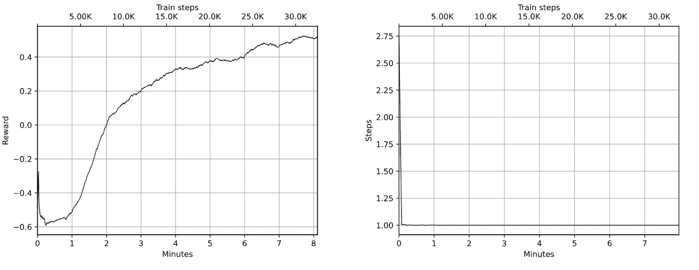

图 14.12：训练奖励（左）和在带有演示的计数侧面的步骤数量（右）

我实验过的一个更具挑战性的问题是井字游戏，可以在 tic-tac-toe 环境中找到。图 14.13 展示了我记录的一个演示游戏过程（可在 demos/tic-tac-toe 目录中找到）。圆点表示点击发生的位置：

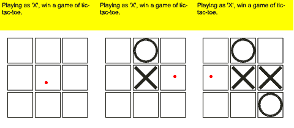

图 14.13：演示井字游戏

经过两小时的训练，最佳平均奖励达到了 0.05，这意味着代理可以赢得一些游戏，但有些游戏会失败或以平局结束。在图 14.14 中，展示了奖励动态和回合步骤数量的图表。

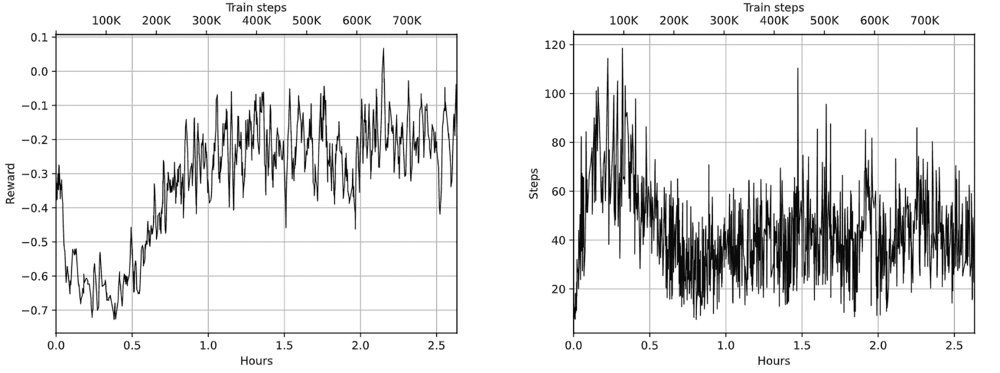

图 14.14：带有演示的井字游戏训练奖励（左）和回合步骤数量（右）

# 尝试的事项

本章中，我们只是开始通过查看 MiniWoB++ 中最简单的环境来进行实验，整个集合包含了 100 多个问题，因此前方还有许多未知的领域。如果你想练习，以下是你可以尝试的几个项目：

+   测试演示在噪声点击下的鲁棒性。

+   点击方法的动作空间可以通过预测点击位置的 x 和 y 坐标来改进。

+   可以使用 DOM 数据来替代（或补充）屏幕像素。然后，预测将是要点击的树的元素。

+   尝试其他问题。这些问题种类繁多，要求生成键盘事件、规划动作序列等。

+   最近，LaVague 项目发布了（[`github.com/lavague-ai/LaVague`](https://github.com/lavague-ai/LaVague)），该项目使用大型语言模型（LLMs）进行网页自动化。他们的方法是要求 LLM 生成 Selenium Python 代码以执行特定任务。将其与 MiniWoB++ 问题进行对比将非常有趣。

# 摘要

在本章中，您看到了强化学习方法在浏览器自动化中的实际应用，并使用了 MiniWoB++ 基准。我相信，浏览器自动化（以及与人类使用的软件进行交流）是未来人工智能发展的一个重要里程碑。

本章结束了本书的第三部分。下一部分将致力于更复杂和更新的与连续动作空间、非梯度方法以及其他更先进的强化学习方法相关的内容。

在下一章中，我们将讨论连续控制问题，这是强化学习领域中的一个重要子领域，既具有理论意义也具有实践意义。

# 留下评论！

感谢您购买本书，感谢 Packt 出版社的支持——我们希望您喜欢这本书！您的反馈对我们来说非常宝贵，能够帮助我们改进和成长。阅读完后，请花点时间在亚马逊上留下评论；这只需一分钟，但对像您这样的读者来说却意义重大。扫描下面的二维码，免费领取您选择的电子书。[`packt.link/NzOWQ`](https://packt.link/NzOWQ)


# 第四部分

# 高级强化学习（RL）
