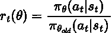
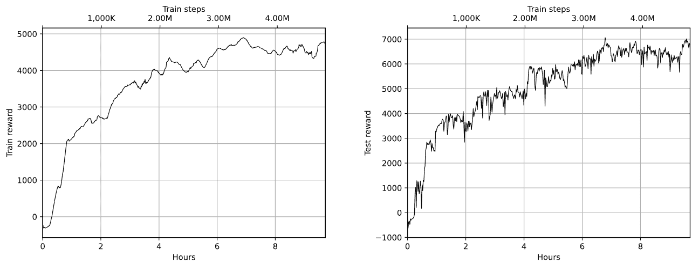

# 第十六章：信任区域方法

在本章中，我们将探讨一些改进随机策略梯度方法稳定性的策略。已有一些尝试使得策略改进更加稳定，本章我们将重点介绍三种方法：

+   近端策略优化（PPO）

+   信任区域策略优化（TRPO）

+   使用 Kronecker 分解信任区域的优势演员-评论员方法（A2C）.

此外，我们还将这些方法与一种相对较新的离策略方法——软演员-评论员方法（SAC）进行比较，SAC 是深度确定性策略梯度方法（DDPG）的演变，DDPG 方法在第十五章中有详细描述。为了与 A2C 基准方法进行比较，我们将使用所谓的“运动训练环境”中的几个环境——这些环境与 Farama Gymnasium 一起提供（使用 MuJoCo 和 PyBullet）。我们还将对 PyBullet 和 MuJoCo 进行正面比较（我们在第十五章中讨论了这些内容）。

我们将要讨论的方法的目的是提高训练过程中策略更新的稳定性。这里存在一个两难困境：一方面，我们希望尽可能快地训练，在随机梯度下降（SGD）更新过程中采取较大的步伐。另一方面，策略的大幅更新通常是个坏主意。策略是一个高度非线性的事物，因此大幅更新可能会破坏我们刚刚学习到的策略。

在强化学习（RL）领域，情况可能会变得更糟，因为你无法通过后续的更新从一个不好的策略更新中恢复过来。相反，糟糕的策略会提供不良的经验样本，这些样本会在后续的训练步骤中使用，可能会彻底破坏我们的策略。因此，我们要尽一切可能避免进行大的更新。一个简单的解决方案是使用较小的学习率，在随机梯度下降（SGD）过程中采取小步伐，但这会显著减慢收敛速度。

为了打破这个恶性循环，研究人员已做出多次尝试，评估我们的策略更新对未来结果的影响。一个流行的方法是信任区域优化扩展，它限制了优化过程中采取的步伐，从而限制对策略的影响。其主要思想是在损失优化过程中通过检查旧策略和新策略之间的 Kullback-Leibler（KL）散度来防止剧烈的策略更新。当然，这只是一个非正式的解释，但它可以帮助你理解这一思想，特别是因为这些方法相当数学化（尤其是 TRPO）。

# 环境

本书的早期版本使用了来自 OpenAI 的 Roboschool 库（[`openai.com/index/roboschool`](https://openai.com/index/roboschool)）来说明信任区域方法。但是最终，OpenAI 停止了对 Roboschool 的支持并弃用了该库。

但其他来源仍然提供这些环境：

+   PyBullet：我们在前一章中实验过的物理模拟器，包含支持 Gym 的各种环境。PyBullet 可能有些过时（最新版本发布于 2022 年），但通过一些小修改，它仍然可以正常工作。

+   Farama Gymnasium MuJoCo 环境：MuJoCo 是我们在第十五章中讨论的物理模拟器。自从它开源以来，MuJoCo 已被应用到多个产品中，包括 Gymnasium，它提供了多个环境：[`gymnasium.farama.org/environments/mujoco/`](https://gymnasium.farama.org/environments/mujoco/)。

在本章中，我们将探讨两个问题：HalfCheetah-v4，模拟一个两条腿的生物，和 Ant-v4，模拟一个四条腿的生物。它们的状态和动作空间与我们在第十五章中看到的 Minitaur 环境非常相似：状态包括关节的特征，而动作是这些关节的激活。每个问题的目标是尽可能地移动，同时最小化能量消耗。下图展示了这两个环境的截图：


图 16.1：猎豹和蚂蚁环境的截图

在我们的实验中，我们将使用 PyBullet 和 MuJoCo 对这两个模拟器进行速度和训练动态方面的比较（但请注意，PyBullet 和 MuJoCo 环境的内部结构可能不同，因此训练动态的比较可能并不总是可靠的）。要安装带有 MuJoCo 扩展的 Gymnasium，你需要在 Python 环境中运行以下命令：`pip install gymnasium[mujoco]==0.29.0`。

# A2C 基准

为了建立基准结果，我们将以与前一章非常相似的方式使用 A2C 方法。完整的源代码位于 Chapter16/01_train_a2c.py 和 Chapter16/lib/model.py 文件中。这个基准与我们之前使用的版本有一些区别：

+   训练过程中使用 16 个并行环境来收集经验。

+   它们在模型结构和我们进行探索的方式上有所不同。

## 实现

为了说明这个基准和之前讨论的版本之间的区别，我们来看看模型和代理类。

Actor 和 Critic 被放置在不同的网络中，且不共享权重。它们遵循第十五章中使用的方法，我们的 Critic 估计动作的均值和方差。然而，现在，方差不再是基础网络的单独头部；它只是模型的一个参数。这个参数将在训练过程中通过 SGD 进行调整，但它不依赖于观察结果。

Actor 网络有两个 64 个神经元的隐藏层，每个层都有 tanh 非线性（将输出压缩到−1…1 范围内）。方差被建模为一个单独的网络参数，并被解释为标准差的对数：

```py
HID_SIZE = 64 

class ModelActor(nn.Module): 
    def __init__(self, obs_size: int, act_size: int): 
        super(ModelActor, self).__init__() 

        self.mu = nn.Sequential( 
            nn.Linear(obs_size, HID_SIZE), 
            nn.Tanh(), 
            nn.Linear(HID_SIZE, HID_SIZE), 
            nn.Tanh(), 
            nn.Linear(HID_SIZE, act_size), 
            nn.Tanh(), 
        ) 
        self.logstd = nn.Parameter(torch.zeros(act_size)) 

    def forward(self, x: torch.Tensor) -> torch.Tensor: 
        return self.mu(x)
```

评论网络也有两个相同大小的隐藏层，并且只有一个输出值，即 V(s)的估计值，这是状态的折扣值：

```py
class ModelCritic(nn.Module): 
    def __init__(self, obs_size: int): 
        super(ModelCritic, self).__init__() 

        self.value = nn.Sequential( 
            nn.Linear(obs_size, HID_SIZE), 
            nn.ReLU(), 
            nn.Linear(HID_SIZE, HID_SIZE), 
            nn.ReLU(), 
            nn.Linear(HID_SIZE, 1), 
        ) 

    def forward(self, x: torch.Tensor) -> torch.Tensor: 
        return self.value(x)
```

将状态转换为动作的智能体也仅通过从状态中获得预测均值，并根据当前 logstd 参数的值应用具有方差的噪声来工作：

```py
class AgentA2C(ptan.agent.BaseAgent): 
    def __init__(self, net, device: torch.device): 
        self.net = net 
        self.device = device 

    def __call__(self, states: ptan.agent.States, agent_states: ptan.agent.AgentStates): 
        states_v = ptan.agent.float32_preprocessor(states) 
        states_v = states_v.to(self.device) 

        mu_v = self.net(states_v) 
        mu = mu_v.data.cpu().numpy() 
        logstd = self.net.logstd.data.cpu().numpy() 
        rnd = np.random.normal(size=logstd.shape) 
        actions = mu + np.exp(logstd) * rnd 
        actions = np.clip(actions, -1, 1) 
        return actions, agent_states
```

## 结果

训练工具 01_train_a2c.py 可以以两种不同的模式启动：使用 PyBullet 作为物理模拟器（无需额外的命令行选项）或使用 MuJoCo（如果提供了--mujoco 参数）。

默认情况下，使用 HalfCheetah 环境，它模拟了一个可以用腿跳跃的平地双足生物。通过-e ant 选项，你可以切换到 Ant 环境，这是一个三维的四足蜘蛛。你还可以尝试 Gymnasium 和 PyBullet 随附的其他环境，但这需要调整 common.py 模块。

PyBullet 中 HalfCheetah 的结果如图 16.2 所示。我机器上的表现（使用 GPU）在训练过程中大约是 1,600 帧每秒，因此 100M 的训练步骤总共花费了 20 小时。


图 16.2：PyBullet 中 HalfCheetah 训练过程中的奖励（左）和测试奖励（右）

动力学表明，通过给予优化更多时间，策略可能会进一步改进，但对于我们进行方法比较的目的来说，现有的结果应该足够。当然，如果你感兴趣且时间充裕，可以运行更长时间，找到策略停止改进的点。根据研究论文，HalfCheetah 的最高分数大约在 4,000 到 5,000 之间。

要使用 MuJoCo 作为物理仿真引擎，必须使用--mujoco 命令行选项启动训练。MuJoCo 的性能为 5,100 帧每秒，比 PyBullet 快三倍，这非常棒。此外，训练的动态性更好，因此在 90M 训练步骤（大约需要 5 小时）中，模型得到了 4,500 的奖励。MuJoCo 的图形显示在图 16.3 中：


图 16.3：MuJoCo 中 HalfCheetah 训练过程中的奖励（左）和测试奖励（右）

差异可以通过更准确的仿真来解释，但也可以归因于观察空间的不同和底层模型的差异。PyBullet 的模型为智能体提供了 26 个观察参数，而 MuJoCo 只有 17 个，因此这两个模型并不完全相同。

要在 Ant 环境中测试我们的模型，必须将-e ant 命令行选项传递给训练过程。该模型更为复杂（由于模型的三维特性和使用了更多的关节），因此仿真速度较慢。在 PyBullet 上，速度约为 1,400 帧每秒。在 MuJoCo 上，速度为 2,500 帧每秒。

MuJoCo Ant 环境还额外检查“健康状态”——如果模拟生物的倾斜角度超过某个特定角度，回合将被终止。默认启用此检查，并且它对训练有非常负面的影响——在训练的早期阶段，我们的方法无法弄清楚如何让蚂蚁站立起来。环境中的奖励是旅行的距离，但由于这个提前终止，我们的训练没有机会发现这一点。结果，训练过程永远停滞在局部最小值中，无法取得进展。为了克服这个问题，我们需要通过传递--no-unhealthy 命令行选项来禁用此健康检查（仅在 MuJoCo 训练中需要执行此操作）。

原则上，您可以实现更高级的探索方法，如 OU 过程（在第十五章中讨论）或其他方法（在第十八章中讨论）来解决我们刚刚讨论的问题。

Ant 环境的训练结果如图 16.4 和图 16.5 所示。


图 16.4：PyBullet 上 Ant 训练过程中的奖励（左）与测试奖励（右）


图 16.5：MuJoCo 上 Ant 训练过程中的奖励（左）与测试奖励（右）

正如您从图 16.5 中的 MuJoCo 图表中看到的，测试奖励在训练的前 1 亿步几乎没有增加，但随后增长到 5,000 分（最佳模型在测试中得到了 5,380 分）。这个结果相当令人印象深刻。根据[`paperswithcode.com`](https://paperswithcode.com)网站的数据，Ant 在 MuJoCo 环境中的最新技术水平是 4,362.9，由 IQ-Learn 在 2021 年获得：[`paperswithcode.com/sota/mujoco-games-on-ant`](https://paperswithcode.com/sota/mujoco-games-on-ant)。

## 视频记录

与上一章一样，存在一个工具可以基准测试训练好的模型并录制代理的动作视频。由于本章中的所有方法共享相同的演员网络，因此该工具对本章所示的所有方法都是通用的：02_play.py。

在训练过程中，您需要传递存储在`saves`目录中的模型文件，通过-e ant 命令行更改环境，并使用--mujoco 参数启用 MuJoCo 引擎。这一点很重要，因为 PyBullet 和 MuJoCo 中的相同环境有不同的观察量，因此物理引擎必须与模型匹配。

您可以找到最佳 A2C 模型的单独视频，网址如下：

+   HalfCheetah 在 PyBullet 上的表现（得分 2,189）：[`youtu.be/f3ZhjnORQm0`](https://youtu.be/f3ZhjnORQm0)

+   HalfCheetah 在 MuJoCo 上的表现（得分 4,718）：[`youtube.com/shorts/SpaWbS0hM8I`](https://youtube.com/shorts/SpaWbS0hM8I)

+   PyBullet 上的 Ant（得分 2,425）：[`youtu.be/SIUM_Q24zSk`](https://youtu.be/SIUM_Q24zSk)

+   Ant 在 MuJoCo 上的表现（得分 5380）：[`youtube.com/shorts/mapOraGKtG0`](https://youtube.com/shorts/mapOraGKtG0)

# PPO

PPO 方法来自 OpenAI 团队，在 TRPO 之后提出，TRPO 是 2015 年提出的。然而，我们将从 PPO 开始，因为它比 TRPO 简单得多。它最早是在 2017 年由 Schulman 等人提出的论文《Proximal Policy Optimization Algorithms》中提出的[Sch+17]。

相对于经典的 A2C 方法，核心的改进在于估计策略梯度时所使用的公式发生了变化。PPO 方法并不是使用所采取动作的对数概率的梯度，而是使用了一个不同的目标：新旧策略之间的比率，按优势进行缩放。

数学形式中，A2C 的目标可以写作这样

![π (a |s) = P[At = a|St = s] ](img/eq60.png)

这意味着我们对模型𝜃的梯度被估计为策略π的对数与优势 A 的乘积。

在 PPO 中提出的新目标是以下内容：

![π (a |s) = P[At = a|St = s] ](img/eq55.png)

改变目标函数的原因与第四章中涉及的交叉熵方法相同：重要性采样。然而，如果我们只是盲目地开始最大化这个值，它可能会导致策略权重的非常大更新。为了限制更新，采用了剪切目标。如果我们将新旧策略之间的比率写为 ，那么剪切目标可以写为

![π (a |s) = P[At = a|St = s] ](img/eq57.png)

这个目标将旧策略和新策略之间的比率限制在区间[1 −𝜖,1 + 𝜖]内，因此通过变化𝜖，我们可以限制更新的大小。

与 A2C 方法的另一个区别在于我们如何估计优势。在 A2C 论文中，从 T 步的有限视野估计中获得的优势是以下形式

![π (a |s) = P[At = a|St = s] ](img/eq58.png)

在 PPO 论文中，作者使用了更一般的估计方法

![π (a |s) = P[At = a|St = s] ](img/eq59.png)

其中σ[t] = r[t] + γV (s[t+1]) −V (s[t])。

原始的 A2C 估计是提出的方法的一个特例，当λ = 1 时。PPO 方法还使用了稍微不同的训练程序：从环境中获取一长串样本，然后在执行多个训练周期之前，估算整个序列的优势。

## 实现

示例的代码被分布在两个源代码文件中：Chapter16/04_train_ppo.py 和 Chapter16/lib/model.py。演员、评论员和代理类与我们在 A2C 基线中的类完全相同。

区别在于训练程序和我们计算优势的方式，但让我们从超参数开始：

```py
GAMMA = 0.99 
GAE_LAMBDA = 0.95 

TRAJECTORY_SIZE = 2049 
LEARNING_RATE_ACTOR = 1e-5 
LEARNING_RATE_CRITIC = 1e-4 

PPO_EPS = 0.2 
PPO_EPOCHES = 10 
PPO_BATCH_SIZE = 64
```

GAMMA 的值已经很熟悉，但 GAE_LAMBDA 是一个新的常数，用于指定优势估计中的λ因子。作者在 PPO 论文中选择了 0.95 的值。

该方法假设在每次子迭代中将从环境中获得大量的过渡。（如本节前面所述，描述 PPO 时提到，在训练过程中，它对采样的训练批次执行多次 epoch。）我们还为演员和评论者使用两个不同的优化器（因为它们没有共享权重）。

对于每一批 TRAJECTORY_SIZE 样本，我们执行 PPO_EPOCHES 次 PPO 目标的迭代，每次使用 64 个样本的小批量。值 PPO_EPS 指定新旧策略比率的裁剪值。以下函数接受带有步骤的轨迹，并计算演员的优势值和评论者训练的参考值。我们的轨迹不是单个回合，而是可以由多个回合连接而成：

```py
def calc_adv_ref(trajectory: tt.List[ptan.experience.Experience], 
                 net_crt: model.ModelCritic, states_v: torch.Tensor, gamma: float, 
                 gae_lambda: float, device: torch.device): 
    values_v = net_crt(states_v) 
    values = values_v.squeeze().data.cpu().numpy()
```

第一阶段，我们要求评论者将状态转换为值。

下一个循环将获得的值与经验点结合起来：

```py
 last_gae = 0.0 
    result_adv = [] 
    result_ref = [] 
    for val, next_val, (exp,) in zip( 
            reversed(values[:-1]), reversed(values[1:]), reversed(trajectory[:-1])):
```

对于每个轨迹步骤，我们需要当前值（从当前状态获得）和后续步骤的值（以使用 Bellman 方程进行估计）。我们还以反向顺序遍历轨迹，以便在一步中计算更近期的优势值。

```py
 if exp.done_trunc: 
            delta = exp.reward - val 
            last_gae = delta 
        else: 
            delta = exp.reward + gamma * next_val - val 
            last_gae = delta + gamma * gae_lambda * last_gae
```

在每一步中，我们的行动依赖于该步骤的 done_trunc 标志。如果这是回合的终止步骤，我们不需要考虑之前的奖励。（记住，我们是以反向顺序处理轨迹的。）因此，我们在该步骤的 delta 值只是即时奖励减去该步骤预测的值。如果当前步骤不是终止步骤，delta 将等于即时奖励加上后续步骤的折扣值，再减去当前步骤的值。在经典的 A2C 方法中，这个 delta 用作优势估计，但这里使用的是平滑版本，因此优势估计（在 last_gae 变量中跟踪）是通过折扣因子γ^λ计算的所有 delta 的总和。

该函数的目标是为评论者计算优势值和参考值，因此我们将它们保存在列表中：

```py
 result_adv.append(last_gae) 
        result_ref.append(last_gae + val)
```

在函数的最后，我们将值转换为张量并返回：

```py
 adv_v = torch.FloatTensor(np.asarray(list(reversed(result_adv)))) 
    ref_v = torch.FloatTensor(np.asarray(list(reversed(result_ref)))) 
    return adv_v.to(device), ref_v.to(device)
```

在训练循环中，我们使用 PTAN 库中的 ExperienceSource(steps_count=1)类收集所需大小的轨迹。此配置提供来自环境的单个步骤，存储在 Experience 数据类实例中，其中包含状态、动作、奖励和终止标志。以下是训练循环中的相关部分：

```py
 trajectory.append(exp) 
            if len(trajectory) < TRAJECTORY_SIZE: 
                continue 

            traj_states = [t[0].state for t in trajectory] 
            traj_actions = [t[0].action for t in trajectory] 
            traj_states_v = torch.FloatTensor(np.asarray(traj_states)) 
            traj_states_v = traj_states_v.to(device) 
            traj_actions_v = torch.FloatTensor(np.asarray(traj_actions)) 
            traj_actions_v = traj_actions_v.to(device) 
            traj_adv_v, traj_ref_v = common.calc_adv_ref( 
                trajectory, net_crt, traj_states_v, GAMMA, GAE_LAMBDA, device=device)
```

当我们拥有足够大的轨迹用于训练时（由 TRAJECTORY_SIZE 超参数给出），我们将状态和所采取的动作转换为张量，并使用已经描述的函数来获取优势和参考值。尽管我们的轨迹相当长，但我们的环境观察足够小，因此可以一次性处理我们的批次。在 Atari 帧的情况下，可能会导致 GPU 内存错误。接下来的步骤中，我们计算所采取动作的概率的对数。这个值将作为目标函数中 PPO 的 π[𝜃[old]]。此外，我们还将优势的均值和方差归一化，以提高训练稳定性：

```py
 mu_v = net_act(traj_states_v) 
            old_logprob_v = model.calc_logprob(mu_v, net_act.logstd, traj_actions_v) 

            traj_adv_v = traj_adv_v - torch.mean(traj_adv_v) 
            traj_adv_v /= torch.std(traj_adv_v)
```

接下来的两行删除了轨迹中的最后一个条目，以反映我们的优势和参考值比轨迹长度少一步的事实（因为我们在 `calc_adv_ref` 函数内部的循环中移动了值）：

```py
 trajectory = trajectory[:-1] 
            old_logprob_v = old_logprob_v[:-1].detach()
```

当所有准备工作完成后，我们对轨迹进行多个训练周期。对于每个批次，我们从相应的数组中提取部分数据，并分别进行评论员和演员训练：

```py
 for epoch in range(PPO_EPOCHES): 
                for batch_ofs in range(0, len(trajectory), PPO_BATCH_SIZE): 
                    batch_l = batch_ofs + PPO_BATCH_SIZE 
                    states_v = traj_states_v[batch_ofs:batch_l] 
                    actions_v = traj_actions_v[batch_ofs:batch_l] 
                    batch_adv_v = traj_adv_v[batch_ofs:batch_l] 
                    batch_adv_v = batch_adv_v.unsqueeze(-1) 
                    batch_ref_v = traj_ref_v[batch_ofs:batch_l] 
                    batch_old_logprob_v = old_logprob_v[batch_ofs:batch_l]
```

要训练评论员，我们需要做的就是计算之前计算好的参考值的均方误差（MSE）损失：

```py
 opt_crt.zero_grad() 
                    value_v = net_crt(states_v) 
                    loss_value_v = F.mse_loss(value_v.squeeze(-1), batch_ref_v) 
                    loss_value_v.backward() 
                    opt_crt.step()
```

在演员训练中，我们最小化了负剪切目标：

![π (a |s) = P[At = a|St = s]](img/eq61.png) ![π (a |s) = P[At = a|St = s]](img/eq62.png)

为了实现这一点，我们使用以下代码：

```py
 opt_act.zero_grad() 
                    mu_v = net_act(states_v) 
                    logprob_pi_v = model.calc_logprob(mu_v, net_act.logstd, actions_v) 
                    ratio_v = torch.exp(logprob_pi_v - batch_old_logprob_v) 
                    surr_obj_v = batch_adv_v * ratio_v 
                    c_ratio_v = torch.clamp(ratio_v, 1.0 - PPO_EPS, 1.0 + PPO_EPS) 
                    clipped_surr_v = batch_adv_v * c_ratio_v 
                    loss_policy_v = -torch.min(surr_obj_v, clipped_surr_v).mean() 
                    loss_policy_v.backward() 
                    opt_act.step()
```

## 结果

在我们两个测试环境中训练后，PPO 方法的收敛速度明显快于 A2C 方法。在 PyBullet 上使用 HalfCheetah 时，PPO 在 8 小时的训练和 25M 训练步后，达到了 1,800 的平均训练奖励和 2,500 的测试奖励。A2C 在 110M 步和 20 小时后得到了较低的结果。图 16.6 显示了比较图表。


图 16.6：在 PyBullet 上训练期间的奖励（左）和测试奖励（右）对于 HalfCheetah

但在使用 MuJoCo 的 HalfCheetah 上，情况正好相反——PPO 的增长速度要慢得多，我在 50M 训练步（12 小时）后停止了训练。图 16.7 显示了这些图表。


图 16.7：在 MuJoCo 上训练期间的奖励（左）和测试奖励（右）对于 HalfCheetah

在查看了模型的视频后（稍后会提供链接），我们可能猜测低分的原因——我们的智能体学会了如何将猎豹翻转到背部并在这个位置前进。在训练过程中，它无法从这个次优的“局部最大值”中脱离出来。很可能多次运行训练会得到更好的策略。另一种解决方法可能是优化超参数。同样，这也是你可以尝试实验的内容。

在 Ant 环境中，PPO 在 PyBullet 和 MuJoCo 上的表现都优于 A2C，并且能够几乎是 A2C 的两倍速度达到相同的奖励水平。这个对比展示在图 16.8 和图 16.9 中：


图 16.8：PyBullet 上 Ant 训练过程中的奖励（左）和测试奖励（右）


图 16.9：MuJoCo 上 Ant 训练过程中的奖励（左）和测试奖励（右）

如之前所述，您可以使用 02_play.py 工具来基准测试保存的模型，并录制学习到的策略在实际中的表现。这是我训练实验中最佳模型的列表：

+   PyBullet 上的 HalfCheetah（得分 2,567）：[`youtu.be/Rai-smyfyeE`](https://youtu.be/Rai-smyfyeE)。代理学会了如何用后腿做远跳。

+   MuJoCo 上的 HalfCheetah（得分 1,623）：[`youtube.com/shorts/VcyzNtbVzd4`](https://youtube.com/shorts/VcyzNtbVzd4)。这是一段非常有趣的视频：猎豹翻身并以这种方式向前移动。

+   PyBullet 上的 Ant（得分 2,560）：[`youtu.be/8lty_Mdjnfs`](https://youtu.be/8lty_Mdjnfs)。Ant 策略比 A2C 好得多——它能稳定地向前移动。

+   MuJoCo 上的 Ant（得分 5,108）：[`youtube.com/shorts/AcXxH2f_KWs`](https://youtube.com/shorts/AcXxH2f_KWs)。这个模型更快；很可能，MuJoCo 模型中的蚂蚁重量低于 PyBullet 模型中的蚂蚁。

# TRPO

TRPO 由伯克利研究人员于 2015 年在 Schulman 等人的论文《信任区域策略优化》（Trust region policy optimization）中提出[Sch15]。这篇论文是提升随机策略梯度优化的稳定性和一致性的一个步骤，并在各种控制任务中取得了良好的结果。

不幸的是，论文和方法相当数学化，因此理解细节可能比较困难。实现部分也存在同样的问题，它使用共轭梯度法来高效地解决约束优化问题。

作为第一步，TRPO 方法将状态的折扣访问频率定义如下：

![π (a |s) = P[At = a|St = s] ](img/eq63.png)

在这个方程中，P(s[i] = s) 等于在采样轨迹的第 i 个位置上遇到状态 s 的采样概率。

然后，TRPO 将优化目标定义为

![π (a |s) = P[At = a|St = s] ](img/eq64.png)

其中

![π (a |s) = P[At = a|St = s] ](img/eq65.png)

是策略的期望折扣奖励，π̃ = arg max[a]Aπ 定义了确定性策略。为了解决大规模策略更新的问题，TRPO 对策略更新定义了额外的约束，该约束表示为旧策略与新策略之间的最大 KL 散度，形式如下：

![π (a |s) = P[At = a|St = s] ](img/eq66.png)

提醒一下，KL 散度衡量的是概率分布之间的相似度，计算公式如下：

![π (a |s) = P[At = a|St = s] ](img/eq67.png)

我们在第四章和第十一章中遇到过 KL 散度。

## 实现

GitHub 或其他开源代码库中大多数可用的 TRPO 实现都非常相似，这可能是因为它们都源自最初的 John Schulman TRPO 实现：[`github.com/joschu/modular_rl`](https://github.com/joschu/modular_rl)。我版本的 TRPO 也没有太大不同，使用了该代码库中的核心函数，这些函数实现了共轭梯度方法（TRPO 用于解决约束优化问题）：[`github.com/ikostrikov/pytorch-trpo`](https://github.com/ikostrikov/pytorch-trpo)。

完整的例子可以在 03_train_trpo.py 和 lib/trpo.py 中找到，训练循环与 PPO 的示例非常相似：我们采样预定义长度的轨迹转移，并使用 PPO 部分讨论的平滑公式计算优势估计（历史上，这个估计最早是在 TRPO 论文中提出的）。接下来，我们用计算出的参考值进行一次使用 MSE 损失的评论者训练步骤，并执行一次 TRPO 更新步骤，这一步骤包括使用共轭梯度方法找到我们应走的方向，并在该方向上进行线性搜索，找到一个保持所需 KL 散度的步长。

以下是执行这两个步骤的训练循环部分：

```py
 opt_crt.zero_grad() 
            value_v = net_crt(traj_states_v) 
            loss_value_v = F.mse_loss(value_v.squeeze(-1), traj_ref_v) 
            loss_value_v.backward() 
            opt_crt.step()
```

为了执行 TRPO 步骤，我们需要提供两个函数：第一个函数计算当前演员策略的损失，这个损失使用新的和旧的策略之间的比例，乘以优势估计。第二个函数则计算旧策略和当前策略之间的 KL 散度：

```py
 def get_loss(): 
                mu_v = net_act(traj_states_v) 
                logprob_v = model.calc_logprob(mu_v, net_act.logstd, traj_actions_v) 
                dp_v = torch.exp(logprob_v - old_logprob_v) 
                action_loss_v = -traj_adv_v.unsqueeze(dim=-1)*dp_v 
                return action_loss_v.mean() 

            def get_kl(): 
                mu_v = net_act(traj_states_v) 
                logstd_v = net_act.logstd 
                mu0_v = mu_v.detach() 
                logstd0_v = logstd_v.detach() 
                std_v = torch.exp(logstd_v) 
                std0_v = std_v.detach() 
                v = (std0_v ** 2 + (mu0_v - mu_v) ** 2) / (2.0 * std_v ** 2) 
                kl = logstd_v - logstd0_v + v - 0.5 
                return kl.sum(1, keepdim=True) 

            trpo.trpo_step(net_act, get_loss, get_kl, args.maxkl, 
                           TRPO_DAMPING, device=device)
```

换句话说，PPO 方法实际上就是 TRPO，它使用简单的策略比例剪切来限制策略更新，而不是使用复杂的共轭梯度和线性搜索。

## 结果

在 HalfCheetah 环境中，TRPO 能够获得比 PPO 和 A2C 更好的奖励。在图 16.10 中，展示了 PyBullet 训练的结果。在 MuJoCo 上，结果更加令人印象深刻——最佳奖励超过了 5000。MuJoCo 的图示见图 16.11：


图 16.10：PyBullet 环境中 HalfCheetah 的训练奖励（左）和测试奖励（右）


图 16.11：MuJoCo 环境中 HalfCheetah 的训练奖励（左）和测试奖励（右）

不幸的是，Ant 环境显示出远不如预期的稳定收敛性。图 16.12 和图 16.13 比较了 A2C 和 TRPO 在训练和测试奖励上的表现：


图 16.12：PyBullet 环境中 Ant 的训练奖励（左）和测试奖励（右）


图 16.13：MuJoCo 环境中 Ant 的训练奖励（左）和测试奖励（右）

最佳动作的视频记录可以像以前一样进行。这里有一些最佳 TRPO 模型的视频：

+   PyBullet 中的半豹（得分 2,419）：[`youtu.be/NIfkt2lVT74`](https://youtu.be/NIfkt2lVT74)。前腿关节没有使用。

+   MuJoCo 中的半豹（得分 5,753）：[`youtube.com/shorts/FLM2t-XWDLc?feature=share`](https://youtube.com/shorts/FLM2t-XWDLc?feature=share)。这真是一只飞快的豹子！

+   PyBullet 中的蚂蚁（得分 834）：[`youtu.be/Ny1WBPVluNQ`](https://youtu.be/Ny1WBPVluNQ)。训练卡在了一个“静止不动”的局部最小值。

+   MuJoCo 中的蚂蚁（得分 993）：[`youtube.com/shorts/9sybZGvXQFs`](https://youtube.com/shorts/9sybZGvXQFs)。与 PyBullet 相同——智能体只是站着不动，哪里也不去。

# ACKTR

我们将比较的第三种方法 ACKTR，采用了不同的方式来解决 SGD 稳定性问题。在吴等人于 2017 年发表的论文《一种用于深度强化学习的可扩展信任域方法，基于克罗内克近似》（Scalable trust-region method for deep reinforcement learning using Kronecker-factored approximation）[Wu+17]中，作者结合了二阶优化方法和信任域方法。

二阶方法的思想是通过对优化函数进行二阶导数（换句话说，就是它的曲率）的计算，来改进传统的 SGD，从而提高优化过程的收敛性。为了让事情更复杂，处理二阶导数通常需要构建并反转一个 Hessian 矩阵，而这个矩阵可能非常庞大，因此实际的方法通常会以某种方式对其进行近似。这个领域目前在研究中非常活跃，因为开发稳健且可扩展的优化方法对于整个机器学习领域至关重要。

一种二阶方法叫做克罗内克近似曲率（K-FAC），由 James Martens 和 Roger Grosse 在他们 2015 年发表的论文《使用克罗内克近似曲率优化神经网络》（Optimizing neural networks with Kronecker-factored approximate curvature）[MG15]中提出。然而，详细描述这种方法远远超出了本书的范围。

## 实现

目前这个方法的实现并不多，而且没有任何一个是 PyTorch 的官方实现（很遗憾）。据我所知，有两个版本的 K-FAC 优化器可以与 PyTorch 一起使用；一个来自 Ilya Kostrikov（[`github.com/ikostrikov/pytorch-a2c-ppo-acktr`](https://github.com/ikostrikov/pytorch-a2c-ppo-acktr)），另一个来自 Nicholas Gao（[`github.com/n-gao/pytorch-kfac`](https://github.com/n-gao/pytorch-kfac)）。我只试过第一个版本；你可以尝试第二个版本。K-FAC 也有 TensorFlow 版本，随 OpenAI Baselines 提供，但将其移植并在 PyTorch 上测试可能会有难度。

对于我的实验，我采用了 Kostrikov 的 K-FAC 实现并将其适配到现有代码中，这需要替换优化器并额外调用 backward()来收集 Fisher 信息。评论员的训练方式与 A2C 相同。完整的示例代码位于 05_train_acktr.py 中，本文未展示，因为它基本上与 A2C 相同。唯一的区别是使用了不同的优化器。

## 结果

总体来看，ACKTR 方法在这两种环境和物理引擎中都非常不稳定。这可能是由于超参数的调优不足，或者实现中存在一些 bug。

HalfCheetah 实验的结果如图 16.14 和图 16.15 所示。


图 16.14：训练期间的奖励（左）和在 PyBullet 上测试的奖励（右），针对 HalfCheetah


图 16.15：训练期间的奖励（左）和在 MuJoCo 上测试的奖励（右），针对 HalfCheetah

在 Ant 环境中，ACKTR 方法在 PyBullet 上的表现较差，与在 MuJoCo 上训练相比没有奖励改进。图 16.16 展示了 PyBullet 的图表。


图 16.16：训练期间的奖励（左）和在 PyBullet 上测试的奖励（右），针对 Ant

# SAC

在最后一节中，我们将检查一种相对较新的方法，称为 SAC，该方法由伯克利研究人员提出，并在 2018 年 Haarnoja 等人发布的论文《Soft actor-critic: Off-policy maximum entropy deep reinforcement learning》中介绍[Haa+18]。

目前，这被认为是解决连续控制问题的最佳方法之一，并且得到了广泛应用。该方法的核心思想与 DDPG 方法更接近，而不是 A2C 策略梯度方法。我们将与 PPO 的表现进行直接比较，PPO 长期以来被认为是连续控制问题的标准方法。

SAC 方法的核心思想是熵正则化，它在每个时间戳上添加一个与该时间戳策略熵成正比的奖励。从数学符号表示，我们要寻找的策略是：

![π (a |s) = P[At = a|St = s] ](img/eq68.png)

这里，H(P) = 𝔼 [x∼P] [−log P(x)] 是分布 P 的熵。换句话说，我们通过奖励智能体进入熵值最大化的状态，类似于第十八章中提到的高级探索方法。此外，SAC 方法融合了剪切双 Q 技巧，在此技巧中，除了值函数外，我们还学习两个预测 Q 值的网络，并选择其中的最小值进行 Bellman 近似。研究人员认为，这有助于解决训练过程中 Q 值过度估计的问题。这个问题在第八章中已讨论过，但采用了不同的方法进行处理。

因此，总共我们训练四个网络：策略网络π(s)、值网络 V(s,a)和两个 Q 网络 Q1 与 Q2。对于值网络 V(s,a)，使用目标网络。因此，SAC 训练流程总结如下：

+   Q 网络通过使用目标值网络进行 Bellman 近似，使用 MSE 目标进行训练：yq = r+γV tgt（对于非终止步骤）

+   V 网络通过使用 MSE 目标和以下目标进行训练：yv = min[i=1,2]Qi −α log π𝜃，其中ã是从策略π𝜃中采样的

+   策略网络π[𝜃]通过最大化以下目标来以 DDPG 风格进行训练：Q1) −α log π𝜃|s)，其中ã[𝜃]是从π𝜃中采样的

## 实现

SAC 方法的实现位于 06_train_sac.py 中。该模型由以下网络组成，这些网络在 lib/model.py 中定义：

+   ModelActor：这是我们在本章前面示例中使用的相同策略。由于策略方差没有通过状态来参数化（logstd 字段不是网络，只是一个张量），因此训练目标并不完全符合 SAC 方法。从一方面来说，这可能会影响收敛性和性能，因为 SAC 方法的核心思想是熵正则化，而没有参数化方差的话无法实现这一点。另一方面，它减少了模型中的参数数量。如果你感兴趣的话，可以通过对策略进行参数化方差扩展该示例，并实现一个完整的 SAC 方法。

+   ModelCritic：这是与前面示例相同的值网络。

+   ModelSACTwinQ：这两个网络将状态和动作作为输入，预测 Q 值。

实现该方法的第一个函数是 unpack_batch_sac()，它定义在 lib/common.py 中。它的目标是获取轨迹步骤的批次并为 V 网络和双 Q 网络计算目标值：

```py
@torch.no_grad() 
def unpack_batch_sac(batch: tt.List[ptan.experience.ExperienceFirstLast], 
                     val_net: model.ModelCritic, twinq_net: model.ModelSACTwinQ, 
                     policy_net: model.ModelActor, gamma: float, ent_alpha: float, 
                     device: torch.device): 
    states_v, actions_v, ref_q_v = unpack_batch_a2c(batch, val_net, gamma, device) 

    mu_v = policy_net(states_v) 
    act_dist = distr.Normal(mu_v, torch.exp(policy_net.logstd)) 
    acts_v = act_dist.sample() 
    q1_v, q2_v = twinq_net(states_v, acts_v) 

    ref_vals_v = torch.min(q1_v, q2_v).squeeze() - \ 
                 ent_alpha * act_dist.log_prob(acts_v).sum(dim=1) 
    return states_v, actions_v, ref_vals_v, ref_q_v
```

函数的第一步使用已经定义的 unpack_batch_a2c()方法，该方法解包批次，将状态和动作转换为张量，并通过 Bellman 近似计算 Q 网络的参考值。完成此步骤后，我们需要从双 Q 值的最小值减去缩放的熵系数来计算 V 网络的参考值。熵是通过当前策略网络计算的。如前所述，我们的策略具有参数化的均值，但方差是全局的，并不依赖于状态。

在主要训练循环中，我们使用先前定义的函数，并进行三种不同的优化步骤：V 网络、Q 网络和策略网络。以下是 06_train_sac.py 中定义的训练循环的相关部分：

```py
 batch = buffer.sample(BATCH_SIZE) 
                states_v, actions_v, ref_vals_v, ref_q_v = common.unpack_batch_sac( 
                        batch, tgt_crt_net.target_model, twinq_net, act_net, GAMMA, 
                        SAC_ENTROPY_ALPHA, device)
```

一开始，我们解包批次以获取 Q 和 V 网络的张量和目标。

双 Q 网络通过相同的目标值进行优化：

```py
 twinq_opt.zero_grad() 
                q1_v, q2_v = twinq_net(states_v, actions_v) 
                q1_loss_v = F.mse_loss(q1_v.squeeze(), ref_q_v.detach()) 
                q2_loss_v = F.mse_loss(q2_v.squeeze(), ref_q_v.detach()) 
                q_loss_v = q1_loss_v + q2_loss_v 
                q_loss_v.backward() 
                twinq_opt.step()
```

评论者网络也通过使用已经计算的目标值和简单的 MSE 目标进行优化：

```py
 crt_opt.zero_grad() 
                val_v = crt_net(states_v) 
                v_loss_v = F.mse_loss(val_v.squeeze(), ref_vals_v.detach()) 
                v_loss_v.backward() 
                crt_opt.step()
```

最后，我们优化行为者网络：

```py
 act_opt.zero_grad() 
                acts_v = act_net(states_v) 
                q_out_v, _ = twinq_net(states_v, acts_v) 
                act_loss = -q_out_v.mean() 
                act_loss.backward() 
                act_opt.step()
```

与之前给出的公式相比，代码缺少了熵正则化项，实际上对应的是 DDPG 训练。由于我们的方差不依赖于状态，它可以从优化目标中省略。

## 结果

我在 HalfCheetah 和 Ant 环境中进行了 9 到 13 小时的 SAC 训练，观察数据为 5M。结果有点矛盾。一方面，SAC 的样本效率和奖励增长动态优于 PPO 方法。例如，SAC 只需 0.5M 观察就能在 HalfCheetah 上达到 900 的奖励，而 PPO 需要超过 1M 观察才能达到相同的策略。在 MuJoCo 环境中，SAC 找到了获得 7,063 奖励的策略，这是一个绝对的记录（展示了该环境上的最先进表现）。

另一方面，由于 SAC 是离策略方法，训练速度较慢，因为我们进行了比传统的在策略方法更多的计算。在我的机器上，5M 帧的 HalfCheetah 训练花费了 10 小时。作为提醒，A2C 在同样时间内完成了 50M 观察。

这展示了在本书中你已多次看到的在策略和离策略方法之间的权衡：如果你的环境反应速度快，且观察数据易得，那么像 PPO 这样的在策略方法可能是最佳选择。但如果你的观察数据难以获得，离策略方法将更有效，但需要更多的计算。

图 16.17 和图 16.18 展示了 HalfCheetah 上的奖励动态：


图 16.17：PyBullet 中 HalfCheetah 的训练奖励（左）和测试奖励（右）



图 16.18：MuJoCo 中 HalfCheetah 的训练奖励（左）和测试奖励（右）

在 Ant 环境中的结果则差得多——根据得分，学习到的策略几乎无法维持。PyBullet 的图像见图 16.19；MuJoCo 的图像见图 16.20：


图 16.19：PyBullet 中 Ant 的训练奖励（左）和测试奖励（右）


图 16.20：MuJoCo 中 Ant 的训练奖励（左）和测试奖励（右）

这里是最佳 SAC 模型的视频：

+   PyBullet 中的 HalfCheetah（得分 1,765）：[`youtu.be/80afu9OzQ5s`](https://youtu.be/80afu9OzQ5s)。我们的生物在这里显得有点笨拙。

+   MuJoCo 中的 HalfCheetah（得分 7,063）：[`youtube.com/shorts/0Ywn3LTJxxs`](https://youtube.com/shorts/0Ywn3LTJxxs)。这个结果非常令人印象深刻——一只超快的猎豹。

+   PyBullet 中的 Ant（得分 630）：[`youtu.be/WHqXJ3VqX4k`](https://youtu.be/WHqXJ3VqX4k)。在几步之后，蚂蚁因某种原因被卡住了。

# 总体结果

为了简化方法的比较，我将所有与最佳奖励相关的数据汇总在下面的表格中：

| 方法 | HalfCheetah | Ant |
| --- | --- | --- |
|  | PyBullet | MuJoCo | PyBullet | MuJoCo |
| A2C | 2,189 | 4,718 | 2,425 | 5,380 |
| PPO | 2,567 | 1,623 | 2,560 | 5,108 |
| TRPO | 2,419 | 5,753 | 834 | 993 |
| ACKTR | 250 | 3,100 | 1,820 | — |
| SAC | 1,765 | 7,063 | 630 | — |

表 16.1：总结表

如你所见，没有单一的获胜方法——某些方法在某些环境中表现良好，但在其他环境中效果较差。原则上，我们可以称 A2C 和 PPO 为相当一致的方法，因为它们在各个环境中都能取得不错的结果（PPO 在 MuJoCo 上的“后空翻猎豹”可能归因于不好的初始种子，因此重新训练可能会产生更好的策略）。

# 总结

在这一章中，我们检查了三种不同的方法，目的是提高随机策略梯度的稳定性，并将它们与 A2C 在两个连续控制问题上的实现进行比较。连同上一章介绍的方法（DDPG 和 D4PG），这些方法是处理连续控制领域的基本工具。最后，我们检查了一种相对较新的离策略方法，它是 DDPG 的扩展：SAC。我们只是触及了这个话题的表面，但这可能是一个很好的起点，可以进一步深入研究。这些方法在机器人技术及相关领域中广泛应用。

在下一章中，我们将转向最近越来越流行的另一类强化学习方法：黑箱或无梯度方法。

# 加入我们的 Discord 社区

与其他用户、深度学习专家以及作者本人一起阅读本书。提问、为其他读者提供解决方案、通过问我任何问题环节与作者互动，等等。扫描二维码或访问链接加入社区。[`packt.link/rl`](https://packt.link/rl)


