# 第十八章：高级探索

在本章中，我们将讨论强化学习（RL）中的探索主题。书中多次提到，探索/利用困境是强化学习中的一个基本问题，对于高效学习非常重要。然而，在之前的例子中，我们使用了一种相当简单的探索环境的方法，即大多数情况下的 𝜖-greedy 行动选择。现在是时候深入探讨强化学习中的探索子领域，因为更复杂的环境可能需要比 𝜖-greedy 方法更好的探索策略。

更具体地，我们将涵盖以下关键主题：

+   为什么探索是强化学习中如此基本的话题

+   𝜖-greedy 方法的有效性

+   替代方法及其在不同环境中的工作原理

我们将实现所描述的方法，解决一个名为 MountainCar 的玩具问题，尽管它依然具有挑战性。这将帮助我们更好地理解这些方法、它们如何实现以及它们的行为。之后，我们将尝试解决一个来自 Atari 套件的更难问题。

# 为什么探索很重要

本书讨论了许多环境和方法，几乎每一章都提到了探索。很可能你已经对为什么有效地探索环境很重要有了一些想法，所以我将只讨论主要的原因。

在此之前，定义“有效探索”可能会有帮助。在理论强化学习中，已有严格的定义，但高层次的概念既简单又直观。当我们不再浪费时间在已经被智能体见过并且熟悉的环境状态中时，探索就是有效的。智能体不应一遍遍做相同的动作，而是需要寻找新的经验。正如我们之前讨论过的，探索必须与利用相平衡，后者是相反的概念，指的是利用我们的知识以最有效的方式获得最好的奖励。现在让我们快速讨论一下为什么我们最初会对有效探索感兴趣。

首先，良好的环境探索可能对我们学习良好策略的能力产生根本性影响。如果奖励稀疏，且智能体只有在某些罕见条件下才能获得良好的奖励，那么它可能在许多回合中只会经历一次正奖励，因此学习过程有效且充分地探索环境的能力，可能会带来更多能够从中学习到的良好奖励样本。

在一些情况下，这种情况在强化学习的实际应用中非常常见，缺乏良好的探索可能意味着代理根本无法体验到正向奖励，这样其他一切就变得无用。如果你没有好的样本来学习，你可以拥有最有效的强化学习方法，但它唯一能学到的就是没有办法获得好的奖励。这正是许多实际中有趣的问题的情况。例如，我们将在本章稍后详细了解 MountainCar 环境，它的动力学非常简单，但由于奖励稀疏，解决起来相当棘手。

另一方面，即使奖励不是稀疏的，有效的探索也能提高训练速度，因为它有助于更好的收敛性和训练稳定性。这是因为我们从环境中采样变得更加多样化，且与环境的通信需求减少。因此，我们的强化学习方法有机会在更短的时间内学习到更好的策略。

# 𝜖-greedy 有什么问题吗？

在全书中，我们使用了𝜖-greedy 探索策略作为一种简单但仍然可接受的环境探索方法。𝜖-greedy 背后的基本思想是以𝜖的概率采取随机动作；否则，（以 1 −𝜖的概率）我们按照策略（贪婪地）执行动作。通过调整超参数 0 ≤𝜖 ≤ 1，我们可以改变探索的比例。这种方法在本书中描述的大多数基于值的方法中都有使用。类似的思想也被应用于基于策略的方法，当我们的网络返回一个动作的概率分布时。为了防止网络对动作变得过于确定（通过为某个特定动作返回 1 的概率，为其他动作返回 0 的概率），我们添加了熵损失，它实际上是概率分布的熵乘以某个超参数。在训练的早期阶段，这个熵损失推动我们的网络采取随机动作（通过正则化概率分布）。但在后期，当我们足够探索了环境且奖励相对较高时，策略梯度就主导了这种熵正则化。但是，这个超参数需要调整才能正常工作。

从高层次来看，两种方法做的事情是相同的：为了探索环境，我们将随机性引入到我们的动作中。然而，最近的研究表明，这种方法距离理想状态还有很大差距：

+   在值迭代方法中，轨迹中的某些随机动作会引入偏差，影响我们对 Q 值的估计。贝尔曼方程假设下一个状态的 Q 值是通过选择 Q 值最大的动作来获得的。换句话说，轨迹的其余部分应来自我们的最优行为。然而，使用𝜖-贪婪策略时，我们可能不会选择最优动作，而是随机选择一个动作，这段轨迹将会长期保存在回放缓冲区中，直到我们的𝜖值衰减并且旧样本被从缓冲区中删除。在此之前，我们将学习到错误的 Q 值。

+   随着随机动作的注入，我们的策略在每一步都会发生变化。根据𝜖值或熵损失系数定义的频率，我们的轨迹会不断地在随机策略和当前策略之间切换。这可能导致在需要多个步骤才能到达环境状态空间中某些孤立区域时，状态空间的覆盖不充分。

为了说明最后一个问题，让我们考虑一个简单的例子，取自 Strehl 和 Littman 的论文《基于模型的区间估计分析：马尔可夫决策过程》，该论文于 2008 年发表[SL08]。这个例子称为“River Swim”，它模拟了一个智能体需要跨越的河流。环境包含六个状态和两个动作：左移和右移。状态 1 和状态 6 位于河流的两侧，状态 2 到状态 5 位于水中。

图 18.1 显示了前两个状态（状态 1 和状态 2）的转移图：

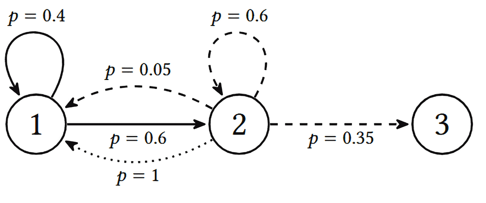

图 18.1：River Swim 环境的前两个状态的转移

在第一个状态（标有“1”的圆圈）中，智能体站在河岸上。唯一的动作是右移（通过实线表示），意味着进入河流并逆流游泳到达状态 2。然而，水流很强，从状态 1 向右游泳的动作成功的概率只有 60%（从状态 1 到状态 2 的实线）。以 40%的概率，水流将我们留在状态 1（连接状态 1 与自身的实线）。

在第二个状态（标有“2”的圆圈）中，我们有两个动作：左移，通过虚线连接状态 2 和状态 1（该动作总是成功的，因为当前的流水会将我们冲回河岸），以及右移（虚线），意味着逆流游泳到达状态 3。如前所述，逆流游泳很困难，因此从状态 2 到状态 3 的概率仅为 35%（连接状态 2 和状态 3 的虚线）。以 60%的概率，我们的左移动作最终会停留在同一状态（连接状态 2 和状态 2 的弯曲虚线）。但有时，尽管我们努力，左移动作最终会使我们回到状态 1，这种情况发生的概率为 5%（连接状态 2 和状态 1 的弯曲虚线）。

如我所说，River Swim 有六个状态，但状态 3、4 和 5 的转换与状态 2 相同。最后一个状态 6 与状态 1 相似，因此在该状态下只有一个动作可用：左，即游回去。在图 18.2 中，你可以看到完整的转换图（这只是我们之前见过的图的克隆，右转动作的转换用实线表示，左转动作的转换用虚线表示）：

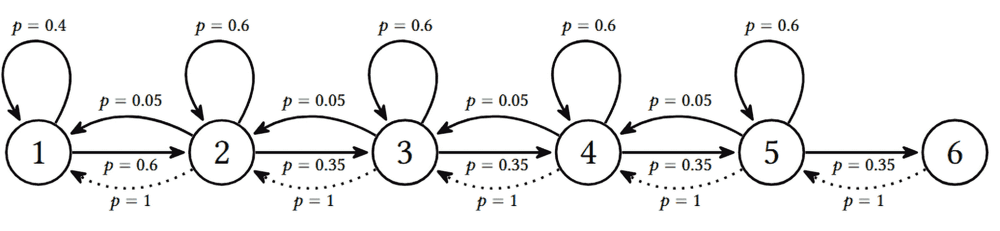

图 18.2：River Swim 环境的完整转换图

就奖励而言，代理在状态 1 到状态 5 之间的转换获得 1 的小奖励，但进入状态 6 时会获得 1,000 的高奖励，作为对逆流游泳所有努力的补偿。

尽管环境本身很简单，但其结构为 𝜖-贪婪策略能够完全探索状态空间带来了问题。为了检查这一点，我实现了这个环境的一个非常简单的模拟，你可以在 Chapter18/riverswim.py 中找到它。模拟中的代理总是随机行动（𝜖 = 1），模拟结果是各种状态访问的频率。代理在一个回合中可以采取的步数限制为 10，但可以通过命令行进行更改。我们不会在这里详细讲解整个代码；你可以在 GitHub 仓库中查看。现在，我们来看一下实验结果：

```py
Chapter18$ ./riverswim.py 
1:     40 
2:     39 
3:     17 
4:     3 
5:     1 
6:     0
```

在之前的输出中，每一行显示了状态编号以及在模拟过程中访问该状态的次数。使用默认的命令行选项，进行了 100 步（10 个回合）的模拟。正如你所看到的，代理从未到达状态 6，并且仅在状态 5 中出现过一次。通过增加回合数，情况稍有改善，但并没有太大变化：

```py
Chapter18$ ./riverswim.py -n 1000 
1:     441 
2:     452 
3:     93 
4:     12 
5:     2 
6:     0
```

模拟了 10 倍回合后，我们仍然没有访问状态 6，因此代理完全不知道那里有如此高的奖励。

只有在模拟了 10,000 个回合后，我们才成功到达状态 6，但仅仅 5 次，占所有步骤的 0.05%：

```py
Chapter18$ ./riverswim.py -n 10000 
1:     4056 
2:     4506 
3:     1095 
4:     281 
5:     57 
6:     5
```

因此，即使采用最好的强化学习方法，训练的效率也不太可能很高。此外，在这个例子中，我们只有六个状态。想象一下，如果有 20 或 50 个状态，效率会低到什么程度，而这并非不可能；例如，在 Atari 游戏中，可能需要做出数百个决策才能发生一些有趣的事情。如果你愿意，可以使用 riverswim.py 工具进行实验，工具允许你更改随机种子、回合中的步数、总步数，甚至环境中的状态数。

这个简单的例子说明了在探索中随机动作的问题。通过随机行动，我们的智能体并没有积极地去探索环境，它只是希望随机动作能为其经验带来一些新东西，但这并不总是最好的做法。

现在让我们讨论一些更高效的探索方法。

# 探索的替代方法

在本节中，我们将为您提供一组探索问题的替代方法的概述。这并不是现有方法的详尽列表，而是提供一个领域概况。

我们将探索以下三种探索方法：

+   策略中的随机性，当我们在获取样本时向所使用的策略中添加随机性。本方法家族中的方法是噪声网络，我们在第八章中已经讲过。

+   基于计数的方法，它们记录智能体在特定状态下出现的次数。我们将检查两种方法：直接计数状态和伪计数方法。

+   基于预测的方法，它们尝试根据状态和预测的质量来预测某些内容。我们可以判断智能体对该状态的熟悉程度。为了说明这种方法，我们将通过观察策略蒸馏方法来进行说明，该方法在像《蒙特祖玛的复仇》这样的难度较大的 Atari 游戏中取得了最先进的成果。

在实现这些方法之前，让我们尝试更详细地理解它们。

## 噪声网络

让我们从一个我们已经熟悉的方法开始。我们在第八章中提到过噪声网络方法，当时我们提到 Hessel 等人[Hes+18]并讨论了深度 Q 网络（DQN）的扩展。其思路是向网络的权重中添加高斯噪声，并通过反向传播来学习噪声参数（均值和方差），这与我们学习模型的权重的方式相同。在那一章中，这种简单的方法显著提升了 Pong 游戏的训练效果。

从高层次看，这可能看起来与𝜖-贪婪方法非常相似，但 Fortunato 等人[For+17]声称存在差异。这个差异在于我们如何将随机性应用到网络中。在𝜖-贪婪方法中，随机性是添加到动作中的。而在噪声网络中，随机性被注入到网络的部分（接近输出的几个全连接层），这意味着将随机性添加到我们当前的策略中。此外，噪声的参数可能会在训练过程中学习，因此训练过程可能会根据需要增加或减少这种策略的随机性。

根据论文，噪声层中的噪声需要不时进行采样，这意味着我们的训练样本不是由当前策略生成的，而是由多个策略的集成生成的。这样一来，我们的探索变得有针对性，因为加到权重上的随机值会产生不同的策略。

## 基于计数的方法

这一类方法基于一个直觉：访问那些之前没有被探索过的状态。在简单的情况下，当状态空间不太大并且不同的状态很容易区分时，我们只需计算看到状态或状态+动作的次数，并倾向于前往那些计数较低的状态。

这可以作为额外的奖励来实现，这种奖励不是来自环境，而是来自状态的访问次数。在文献中，这种奖励被称为内在奖励。在这个语境中，环境中的奖励被称为外在奖励。制定这种奖励的一种方式是使用强盗探索方法：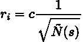。这里，Ñ(s)是我们看到状态 s 的次数或伪计数，值 c 定义了内在奖励的权重。

如果状态的数量很少，比如在表格学习的情况下（我们在第五章讨论过），我们可以直接对其进行计数。在更困难的情况下，当状态太多时，需要引入一些对状态的转换，例如哈希函数或某些状态的嵌入（我们稍后会在本章更详细地讨论）。

对于伪计数方法，Ñ(s)被分解为密度函数和访问的状态总数，给定Ñ(s) = ρ(x)n(x)，其中ρ(x)是“密度函数”，表示状态 x 的可能性，并通过神经网络进行近似。有几种不同的方法可以做到这一点，但它们可能很难实现，所以我们在本章不会讨论复杂的情况。如果你感兴趣，可以参考 Georg Ostrovski 等人发表的《基于计数的探索与神经密度模型》[Ost+17]。

引入内在奖励的一个特殊情况叫做好奇心驱动的探索，当我们完全不考虑来自环境的奖励时。在这种情况下，训练和探索完全由智能体经验的新颖性驱动。令人惊讶的是，这种方法可能非常有效，不仅能发现环境中的新状态，还能学习出相当不错的策略。

## 基于预测的方法

第三类探索方法基于从环境数据中预测某些东西的另一个想法。如果智能体能够做出准确的预测，意味着智能体已经在这种情况下经历了足够多的时间，因此不值得再去探索它。

但是如果发生了一些不寻常的情况，且我们的预测偏差很大，这可能意味着我们需要关注当前所处的状态。做这件事有很多不同的方式，但在本章中，我们将讨论如何实现这一方法，正如 Burda 等人在 2018 年提出的《通过随机网络蒸馏进行探索》一文中所提出的那样[Bur+18]。作者们在所谓的硬探索游戏中（如 Atari）达到了最先进的结果。

论文中使用的方法非常简单：我们添加了内在奖励，该奖励通过一个神经网络（NN）（正在训练中）从另一个随机初始化（未训练）神经网络预测输出的能力来计算。两个神经网络的输入是当前的观察值，内在奖励与预测的均方误差（MSE）成正比。

# MountainCar 实验

在这一部分，我们将尝试在一个简单但仍具有挑战性的环境中实现并比较不同探索方法的效果，这个环境可以归类为一个“经典强化学习”问题，与我们熟悉的 CartPole 问题非常相似。但与 CartPole 相比，MountainCar 问题在探索角度上要困难得多。

问题的示意图如图 18.3 所示，图中有一辆小车从山谷的底部开始。汽车可以向左或向右移动，目标是到达右侧山顶。

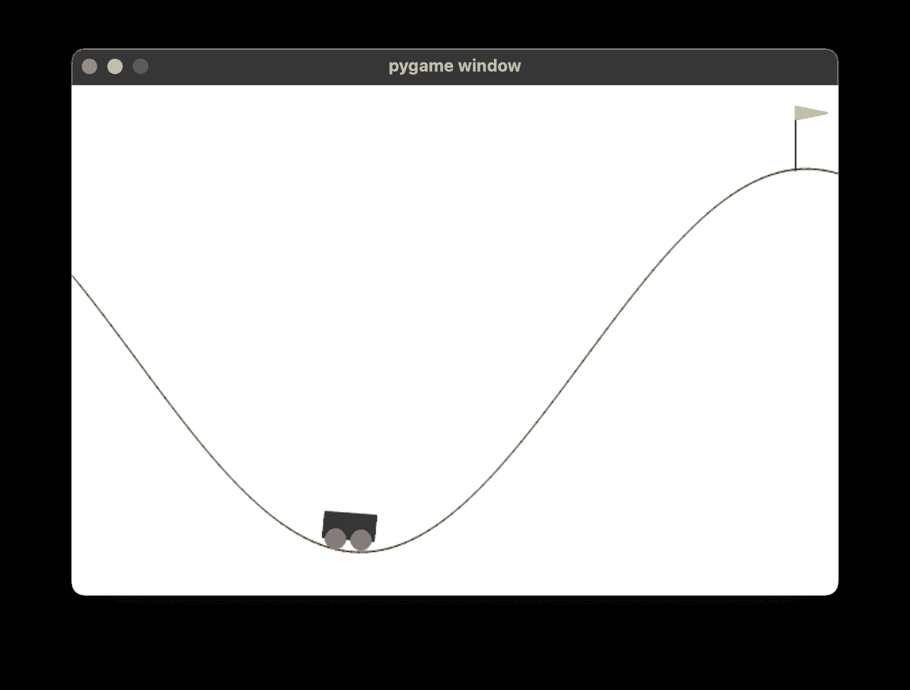

图 18.3：MountainCar 环境

这里的诀窍在于环境的动态和动作空间。为了到达山顶，动作需要以特定的方式应用，使汽车前后摆动以加速。换句话说，智能体需要在多个时间步骤内应用动作，使汽车加速并最终到达山顶。

显然，这种动作协调并不是通过随机动作轻松实现的，因此从探索的角度来看，这个问题很难，且与我们的 River Swim 示例非常相似。

在 Gym 中，这个环境的名称是 MountainCar-v0，且它有一个非常简单的观察和动作空间。观察值只有两个数字：第一个数字表示汽车的水平位置，第二个数字表示汽车的速度。动作可以是 0、1 或 2，其中 0 表示将汽车推向左侧，1 表示不施加任何力量，2 表示将汽车推向右侧。以下是一个在 Python REPL 中非常简单的示意：

```py
>>> import gymnasium as gym 
>>> e = gym.make("MountainCar-v0") 
>>> e.reset() 
(array([-0.56971574,  0\.       ], dtype=float32), {}) 
>>> e.observation_space 
Box([-1.2  -0.07], [0.6  0.07], (2,), float32) 
>>> e.action_space 
Discrete(3) 
>>> e.step(0) 
(array([-0.570371  , -0.00065523], dtype=float32), -1.0, False, False, {}) 
>>> e.step(0) 
(array([-0.57167655, -0.00130558], dtype=float32), -1.0, False, False, {}) 
>>> e.step(0) 
(array([-0.57362276, -0.00194625], dtype=float32), -1.0, False, False, {})
```

正如你所看到的，在每一步中，我们获得的奖励是-1，因此智能体需要学习如何尽快到达目标，以便获得尽可能少的总负奖励。默认情况下，步数限制为 200，所以如果我们没有达到目标（这通常是发生的情况），我们的总奖励就是−200。

## DQN + 𝜖-greedy

我们将使用的第一个方法是我们传统的 𝜖-greedy 探索方法。它在源文件 Chapter18/mcar_dqn.py 中实现。我不会在这里包含源代码，因为你已经很熟悉它了。这个程序在 DQN 方法的基础上实现了各种探索策略，允许我们通过 -p 命令行选项在它们之间进行选择。要启动正常的 𝜖-greedy 方法，需要传递 -p egreedy 选项。在训练过程中，我们将 𝜖 从 1.0 降低到 0.02，持续进行 10⁵ 步训练。

训练速度相当快；进行 10⁵ 步训练只需两到三分钟。但从图 18.4 和图 18.5 中展示的图表可以明显看出，在这 10⁵ 步（即 500 回合）中，我们一次都没有达到目标状态。这是个坏消息，因为我们的 𝜖 已经衰减，意味着我们在未来不会进行更多的探索。

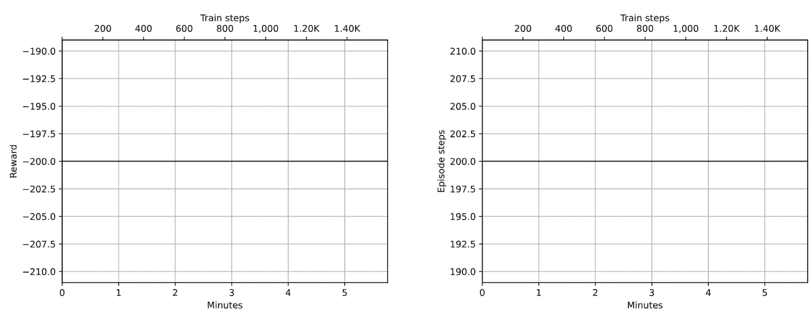

图 18.4：在 DQN 训练过程中使用 𝜖-greedy 策略时的奖励（左）和步数（右）

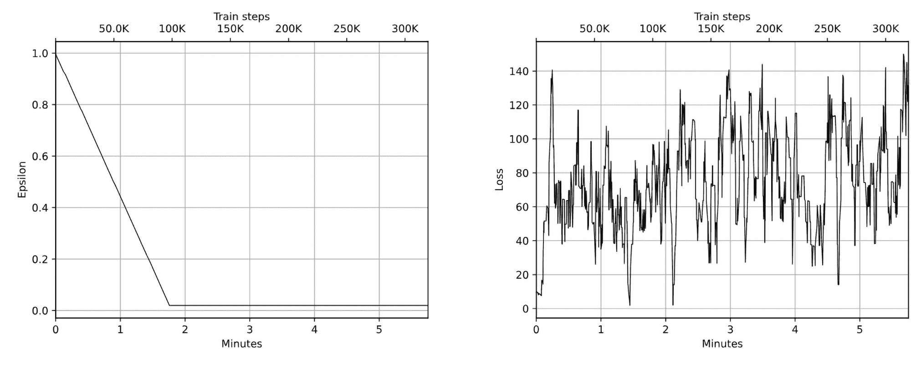

图 18.5：训练过程中 𝜖（左）和损失（右）的变化

我们仍然执行的 2% 随机动作远远不够，因为达到山顶需要数十步协调的动作（MountainCar 上的最佳策略总奖励大约为 -80）。现在我们可以继续训练几百万步，但我们从环境中获得的数据将只是回合，每回合需要 200 步，且总奖励为 -200。这再次说明了探索的重要性。无论我们使用什么训练方法，如果没有适当的探索，我们可能根本无法训练成功。那么，我们应该怎么做呢？如果我们想继续使用 𝜖-greedy，唯一的选择就是进行更长时间的探索（通过调整 𝜖 衰减的速度）。你可以尝试调整 -p egreedy 模式的超参数，但我走到了极端，实施了 -p egreedy-long 超参数集。在这个方案中，我们将 𝜖 保持为 1.0，直到至少有一个回合的总奖励超过 -200。完成这个目标后，我们开始正常训练，将 𝜖 从 1.0 降低到 0.02，持续训练 10⁶ 帧。在初始探索阶段，由于没有进行训练，这个过程通常会比正常训练快 5 到 10 倍。要在这种模式下开始训练，我们使用以下命令行：./mcar_dqn.py -n t1 -p egreedy-long。

不幸的是，即使改进了 𝜖-greedy 策略，仍然由于环境的复杂性未能解决问题。我让这个版本运行了五个小时，但在 500k 个回合后，它仍然没有遇到过一次目标，所以我放弃了。当然，你可以尝试更长时间。

## DQN + 噪声网络

为了将噪声网络方法应用于我们的 MountainCar 问题，我们只需将网络中的两层之一替换为 NoisyLinear 类，最终架构如下：

```py
MountainCarNoisyNetDQN( 
  (net): Sequential( 
   (0): Linear(in_features=2, out_features=128, bias=True) 
   (1): ReLU() 
   (2): NoisyLinear(in_features=128, out_features=3, bias=True) 
  ) 
)
```

`NoisyLinear` 类与第八章版本的唯一区别在于，此版本有一个显式的方法 `sample_noise()` 来更新噪声张量，因此我们需要在每次训练迭代时调用此方法；否则，噪声将在训练过程中保持不变。这个修改是为了未来与基于策略的方法进行实验所需的，这些方法要求噪声在相对较长的轨迹期间保持恒定。无论如何，这个修改很简单，我们只需不时调用这个方法。在 DQN 方法中，它会在每次训练迭代时被调用。和第八章一样，`NoisyLinear` 的实现来自于 TorchRL 库。代码与之前相同，所以要激活噪声网络，你需要使用 -p noisynet 命令行来运行训练。

在图 18.6 中，你可以看到三小时训练的图表：

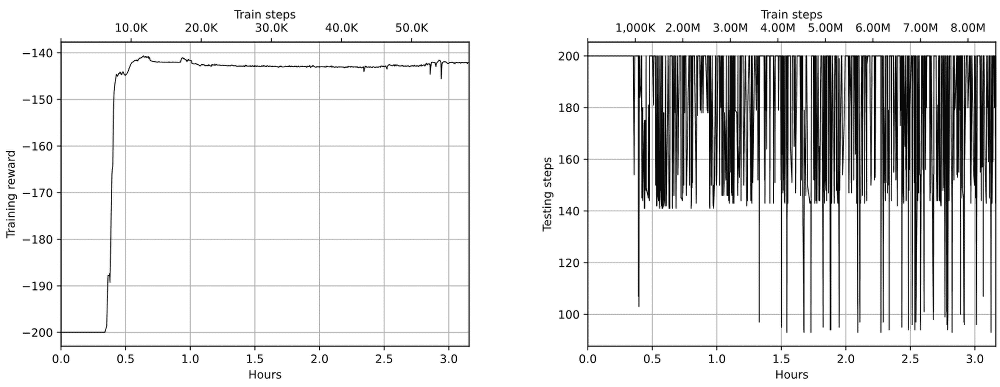

图 18.6：DQN 带噪声网络探索的训练奖励（左）和测试步骤（右）

如你所见，训练过程未能达到代码中要求的平均测试奖励 -130，但在仅仅 7k 训练步（20 分钟训练）后，我们发现了目标状态，相比于 𝜖-greedy 方法在经过 5 小时的试错后依然没有找到任何目标状态，这已是很大的进步。

从测试步骤图（图 18.6 右侧）中我们可以看到，有一些测试的步骤数不到 100 步，这非常接近最优策略。但这些测试次数不足以将平均测试奖励推低到 -130 以下。

## DQN + 状态计数

我们将应用于 DQN 方法的最后一种探索技术是基于计数的。由于我们的状态空间只有两个浮点值，我们将通过将数值四舍五入到小数点后三位来离散化观察，这应该能够提供足够的精度来区分不同的状态，但仍能将相似的状态聚集在一起。对于每个单独的状态，我们将记录该状态出现的次数，并利用这个计数为智能体提供额外的奖励。对于一个离策略方法来说，在训练过程中修改奖励可能不是最好的做法，但我们将会考察其效果。

如同之前一样，我不会提供完整的源代码；我只会强调与基础版本的不同之处。首先，我们为环境应用包装器，以跟踪计数器并计算内在奖励值。你可以在 lib/common.py 模块中找到包装器的代码，下面是它的展示。

让我们先来看一下构造函数：

```py
class PseudoCountRewardWrapper(gym.Wrapper): 
    def __init__(self, env: gym.Env, hash_function = lambda o: o, 
                 reward_scale: float = 1.0): 
        super(PseudoCountRewardWrapper, self).__init__(env) 
        self.hash_function = hash_function 
        self.reward_scale = reward_scale 
        self.counts = collections.Counter()
```

在构造函数中，我们传入要包装的环境、可选的哈希函数（用于观察结果）以及固有奖励的规模。我们还创建了一个计数器容器，它将哈希后的状态映射为我们看到该状态的次数。

然后，我们定义辅助函数：

```py
 def _count_observation(self, obs) -> float: 
        h = self.hash_function(obs) 
        self.counts[h] += 1 
        return np.sqrt(1/self.counts[h])
```

这个函数将计算状态的固有奖励值。它对观察结果应用哈希，更新计数器，并使用我们已经看到的公式计算奖励。

包装器的最后一个方法负责环境的步骤：

```py
 def step(self, action): 
        obs, reward, done, is_tr, info = self.env.step(action) 
        extra_reward = self._count_observation(obs) 
        return obs, reward + self.reward_scale * extra_reward, done, is_tr, info
```

在这里，我们调用辅助函数来获取奖励，并返回外部奖励和固有奖励组件的总和。

要应用这个包装器，我们需要将哈希函数传递给它：

```py
def counts_hash(obs: np.ndarray): 
    r = obs.tolist() 
    return tuple(map(lambda v: round(v, 3), r))
```

三位数字可能太多了，所以你可以尝试使用另一种方式来哈希状态。

要开始训练，请将 -p counts 参数传递给训练程序。在图 18.7 中，你可以看到带有训练和测试奖励的图表。由于训练环境被我们包装在伪计数奖励包装器中，因此训练期间的值高于测试期间的值。

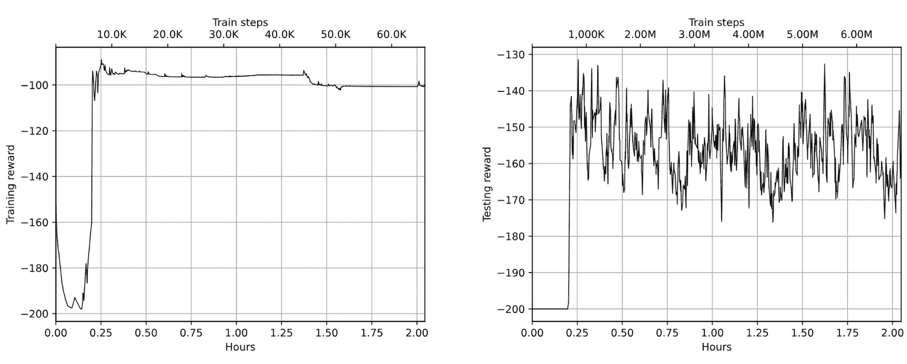

图 18.7：DQN 训练奖励（左）和测试奖励（右），带伪计数奖励加成

如你所见，我们未能通过这种方法获得 -130 的平均测试奖励，但我们非常接近。它只用了 10 分钟就发现了目标状态，这也是相当令人印象深刻的。

## PPO 方法

我们将在 MountainCar 问题上进行的另一组实验与在线策略方法 Proximal Policy Optimization（PPO）相关，我们在第十六章中讨论过。选择这个方法的动机有几个：

+   首先，正如你在 DQN 方法 + 噪声网络的案例中看到的那样，当好的示例很少时，DQN 在快速适应这些示例方面会遇到困难。这可以通过增加重放缓冲区的大小并切换到优先缓冲区来解决，或者我们可以尝试使用在线策略方法，这些方法根据获得的经验立即调整策略。

+   选择这个方法的另一个原因是训练过程中奖励的修改。基于计数的探索和策略蒸馏引入了固有奖励组件，这个组件可能会随着时间的推移而变化。基于值的方法可能对基础奖励的修改比较敏感，因为它们基本上需要在训练过程中重新学习值。而在线策略方法不应该有任何问题，因为奖励的增加只是使具有较高奖励的样本在策略梯度中更加重要。

+   最后，检查我们的探索策略在两种 RL 方法家族中的表现是很有趣的。

为了实现这种方法，在文件 Chapter18/mcar_ppo.py 中，我们有一个结合了各种探索策略的 PPO 实现，应用于 MountainCar。代码与第十六章中的 PPO 实现差别不大，所以我不会在这里重复。要启动没有额外探索调整的普通 PPO，你应该运行命令`./mcar_ppo.py -n t1 -p ppo`。在这个版本中，没有专门做探索的操作——我们完全依赖于训练开始时的随机权重初始化。

提醒一下，PPO 属于策略梯度方法家族，在训练过程中限制旧策略与新策略之间的 Kullback-Leibler 散度，避免了剧烈的策略更新。我们的网络有两个部分：演员和评论家。演员网络返回我们行为的概率分布（我们的策略），评论家估计状态的价值。评论家使用均方误差（MSE）损失进行训练，而演员则由我们在第十六章讨论的 PPO 代理目标驱动。除了这两种损失，我们通过应用由超参数β缩放的熵损失来对策略进行正则化。到目前为止没有什么新内容。以下是 PPO 网络结构：

```py
MountainCarBasePPO( 
  (actor): Sequential( 
   (0): Linear(in_features=2, out_features=64, bias=True) 
   (1): ReLU() 
   (2): Linear(in_features=64, out_features=3, bias=True) 
  ) 
  (critic): Sequential( 
   (0): Linear(in_features=2, out_features=64, bias=True) 
   (1): ReLU() 
   (2): Linear(in_features=64, out_features=1, bias=True) 
  ) 
)
```

我在训练了三个小时后停止了训练，因为没有看到任何改进。目标状态在一个小时和 30k 轮次后找到了。图 18.8 中的图表展示了训练过程中的奖励动态：

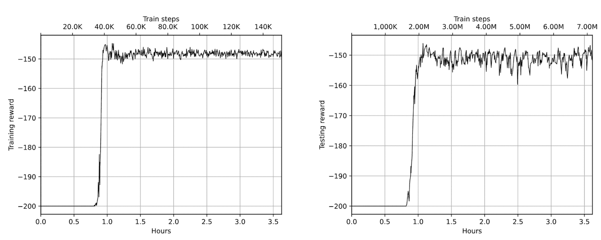

图 18.8：在普通 PPO 上的训练奖励（左）和测试奖励（右）

由于 PPO 的结果并不十分令人印象深刻，让我们尝试通过额外的探索技巧来扩展它。

## PPO + 噪声网络

与 DQN 方法类似，我们可以将噪声网络探索方法应用到 PPO 方法中。为此，我们需要用 NoisyLinear 层替换演员网络的输出层。只有演员网络需要受到影响，因为我们只希望将噪声注入到策略中，而不是价值估计中。

有一个微妙的细节与噪声网络的应用有关：即随机噪声需要在哪个地方进行采样。在第八章中，当你首次接触噪声网络时，噪声是在每次 `forward()` 通过 NoisyLinear 层时进行采样的。根据原始研究论文，对于离策略方法，这是可以的，但对于在策略方法，它需要以不同的方式进行。实际上，当我们进行在策略训练时，我们获得的是当前策略产生的训练样本，并计算策略梯度，这应该推动策略朝着改进的方向前进。噪声网络的目标是注入随机性，但正如我们所讨论的，我们更倾向于有针对性的探索，而不是在每一步之后就随机地改变策略。考虑到这一点，NoisyLinear 层中的随机成分不需要在每次 `forward()` 传递之后更新，而应该更少的频率进行更新。在我的代码中，我在每个 PPO 批次（即 2,048 次转换）时重新采样噪声。

和之前一样，我训练了 PPO+NoisyNets 3 小时。但在这种情况下，目标状态在 30 分钟和 18k 回合后就被找到，这是一个更好的结果。此外，根据训练步数统计，训练过程成功地让小车以最优方式行驶了几次（步数小于 100）。但是，这些成功并没有导致最终的最优策略。图 18.9 中的图表展示了训练过程中的奖励动态：

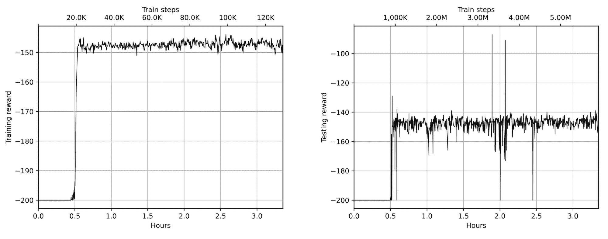

图 18.9：PPO 使用噪声网络的训练奖励（左）和测试奖励（右）

## PPO + 状态计数

在这种情况下，使用三位数哈希的基于计数的方式在 PPO 方法中得到了完全相同的实现，并可以通过在训练过程中传递 -p counts 来触发。

在我的实验中，该方法能够在 1.5 小时内解决环境问题（获得平均奖励高于 -130），并且需要 61k 回合。以下是控制台输出的最后部分：

```py
Episode 61454: reward=-159.17, steps=168, speed=4581.6 f/s, elapsed=1:37:18 
Episode 61455: reward=-158.46, steps=164, speed=4609.0 f/s, elapsed=1:37:18 
Episode 61456: reward=-158.41, steps=164, speed=4582.3 f/s, elapsed=1:37:18 
Episode 61457: reward=-152.73, steps=158, speed=4556.4 f/s, elapsed=1:37:18 
Episode 61458: reward=-154.08, steps=159, speed=4548.1 f/s, elapsed=1:37:18 
Episode 61459: reward=-154.85, steps=162, speed=4513.0 f/s, elapsed=1:37:18 
Test done: got -91.000 reward after 91 steps, avg reward -129.999 
Reward boundary has crossed, stopping training. Congrats!
```

如图 18.10 所示，从图表中可以看到，训练在 23k 回合后发现了目标状态。之后又花了 40k 回合来优化策略，达到了最优步数：

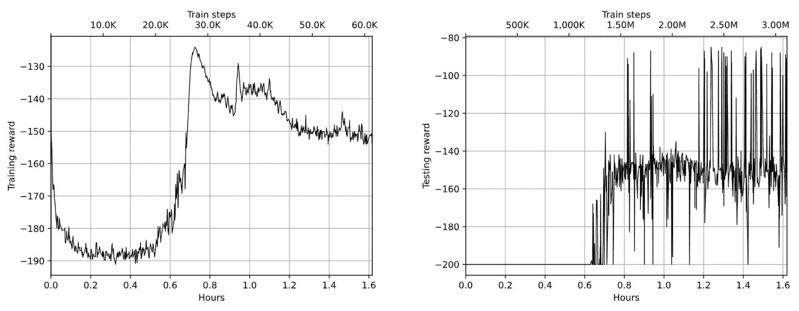

图 18.10：PPO 使用伪计数奖励加成的训练奖励（左）和测试奖励（右）

## PPO + 网络蒸馏

作为我们 MountainCar 实验中的最终探索方法，我实现了 Burda 等人提出的网络蒸馏方法[Bur+18]。在这种方法中，引入了两个额外的神经网络（NN）。这两个网络都需要将观察值映射为一个数字，方式与我们的价值头部相同。不同之处在于它们的使用方式。第一个神经网络是随机初始化并保持未训练的，这将成为我们的参考神经网络。第二个神经网络经过训练，以最小化第二个和第一个神经网络之间的均方误差（MSE）损失。此外，神经网络输出之间的绝对差异作为内在奖励组件。

这背后的想法是，代理程序探索某些状态得越好，我们第二个（训练过的）神经网络就越能预测第一个（未经训练的）神经网络的输出。这将导致将较小的内在奖励添加到总奖励中，从而减少样本分配的策略梯度。

在论文中，作者建议训练单独的价值头来预测内在和外在奖励成分，但在这个例子中，我决定保持简单，只是在包装器中添加了这两个奖励，就像我们在基于计数的探索方法中所做的那样。这样可以最小化代码的修改数量。

关于那些额外的神经网络架构，我做了一个小实验，并尝试了两个神经网络的几种架构。最佳结果是参考神经网络具有三层，训练神经网络只有一层。这有助于防止训练神经网络的过拟合，因为我们的观察空间并不是很大。两个神经网络都实现在 lib/ppo.py 模块的 MountainCarNetDistillery 类中：

```py
class MountainCarNetDistillery(nn.Module): 
    def __init__(self, obs_size: int, hid_size: int = 128): 
        super(MountainCarNetDistillery, self).__init__() 

        self.ref_net = nn.Sequential( 
            nn.Linear(obs_size, hid_size), 
            nn.ReLU(), 
            nn.Linear(hid_size, hid_size), 
            nn.ReLU(), 
            nn.Linear(hid_size, 1), 
        ) 
        self.ref_net.train(False) 

        self.trn_net = nn.Sequential( 
            nn.Linear(obs_size, 1), 
        ) 

    def forward(self, x): 
        return self.ref_net(x), self.trn_net(x) 

    def extra_reward(self, obs): 
        r1, r2 = self.forward(torch.FloatTensor([obs])) 
        return (r1 - r2).abs().detach().numpy()[0][0] 

    def loss(self, obs_t): 
        r1_t, r2_t = self.forward(obs_t) 
        return F.mse_loss(r2_t, r1_t).mean()
```

除了返回两个神经网络输出的 forward()方法外，该类还包括两个帮助方法，用于计算内在奖励和获取两个神经网络之间的损失。

要开始训练，需要将参数 -p distill 传递给 mcar_ppo.py 程序。在我的实验中，解决问题需要 33k 个周期，比噪声网络少了近两倍。正如早些时候讨论的那样，我的实现中可能存在一些错误和低效性，因此欢迎您修改以使其更快更高效：

```py
Episode 33566: reward=-93.27, steps=149, speed=2962.8 f/s, elapsed=1:23:48 
Episode 33567: reward=-82.13, steps=144, speed=2968.6 f/s, elapsed=1:23:48 
Episode 33568: reward=-83.77, steps=143, speed=2973.7 f/s, elapsed=1:23:48 
Episode 33569: reward=-93.59, steps=160, speed=2974.0 f/s, elapsed=1:23:48 
Episode 33570: reward=-83.04, steps=143, speed=2979.7 f/s, elapsed=1:23:48 
Episode 33571: reward=-97.96, steps=158, speed=2984.5 f/s, elapsed=1:23:48 
Episode 33572: reward=-92.60, steps=150, speed=2989.8 f/s, elapsed=1:23:48 
Test done: got -87.000 reward after 87 steps, avg reward -129.549 
Reward boundary has crossed, stopping training. Congrats!
```

显示有关训练和测试奖励的图表如图 18.11 所示。在图 18.12 中，显示了总损失和蒸馏损失。

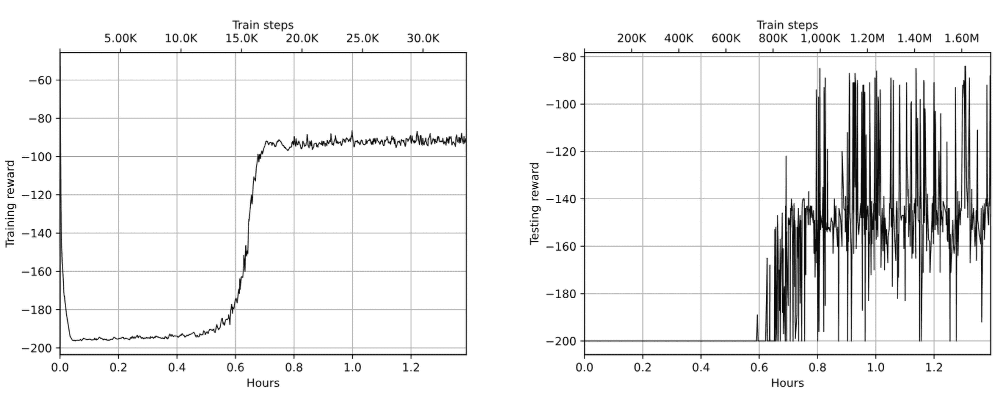

Figure 18.11: PPO 与网络蒸馏的训练奖励（左）和测试奖励（右）

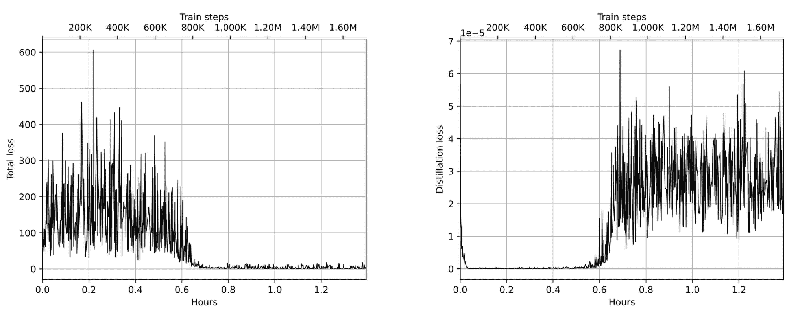

Figure 18.12: 总损失（左）和蒸馏损失（右）

与之前一样，由于内在奖励成分的存在，训练周期在图中有更高的奖励。从蒸馏损失图中可以明显看出，在代理程序发现目标状态之前，一切都是无聊和可预测的，但一旦它找出如何在 200 步之前结束这一情况，损失就显著增加。

## 方法比较

为了简化我们在 MountainCar 上进行的实验比较，我将所有数字放入以下表格中：

| Method | 找到目标状态 | 解决 |
| --- | --- | --- |
|  | Episodes | Time | Episodes | Time |
| DQN + 𝜖-greedy | x | x | x | x |
| DQN + noisy nets | 8k | 15 min | x | x |
| PPO | 40k | 60 min | x | x |
| PPO + noisy nets | 20k | 30 min | x | x |
| PPO + counts | 25k | 36 min | 61k | 90 min |
| PPO + distillation | 16k | 36 min | 33k | 84 min |

Table 18.1: 实验总结

正如你所看到的，带有探索扩展的 DQN 和 PPO 都能够解决 MountainCar 环境。具体方法的选择取决于你和你具体的情况，但重要的是要意识到你可能会使用不同的探索方法。

# Atari 实验

MountainCar 环境是一个非常好的快速实验探索方法，但为了总结这一章，我包含了带有我们描述过的探索调整的 DQN 和 PPO 方法的 Atari 版本，以便检查一个更复杂的环境。

作为主要环境，我使用了 Seaquest，这是一个潜艇需要击败鱼类和敌人潜艇，并拯救水下宇航员的游戏。这个游戏没有像《蒙特祖玛的复仇》那么有名，但它仍然可以算作是中等难度的探索，因为要继续游戏，你需要控制氧气的水平。当氧气变低时，潜艇需要升到水面一段时间。如果没有这个操作，游戏将在 560 步后结束，且最大奖励为 20。然而，一旦智能体学会如何补充氧气，游戏几乎可以无限继续，并为智能体带来 10k-100k 的分数。令人惊讶的是，传统的探索方法在发现这一点时有困难；通常，训练会在 560 步时卡住，之后氧气耗尽，潜艇就会死掉。

Atari 的一个负面方面是每次实验至少需要半天的训练才能检查效果，因此我的代码和超参数距离最佳状态还有很大差距，但它们可能作为你自己实验的起点是有用的。当然，如果你发现了改进代码的方法，请在 GitHub 上分享你的发现。

和之前一样，有两个程序文件：atari_dqn.py，实现了带有𝜖-贪婪和噪声网络探索的 DQN 方法；atari_ppo.py，实现了 PPO 方法，带有可选的噪声网络和网络蒸馏方法。要在超参数之间切换，需要使用命令行选项-p。

在接下来的章节中，让我们看看我通过几次代码运行得到的结果。

## DQN + 𝜖-贪婪

与其他在 Atari 上尝试过的方法相比，𝜖-贪婪表现最好，这可能会让人感到惊讶，因为它在本章前面的 MountainCar 实验中给出了最差的结果。但这在现实中是很常见的，并且可能会带来新的研究方向，甚至突破。经过 13 小时的训练，它能够达到 18 的平均奖励，最大奖励为 25。根据显示步骤数的图表，只有少数几个回合能够发现如何获取氧气，因此，或许经过更多的训练，这种方法可以突破 560 步的限制。在图 18.13 中，显示了平均奖励和步骤数的图表：

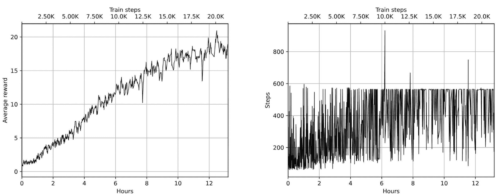

图 18.13：DQN 与𝜖-贪婪的平均训练奖励（左）和步骤数（右）

## DQN + 噪声网络

带有噪声网络的 DQN 表现更差——经过 6 小时的训练，它的奖励值只能达到 6。在图 18.14 中，显示了相关的图表：

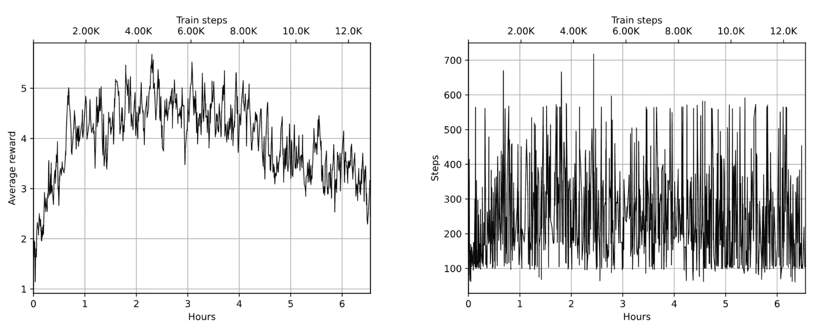

图 18.14：在带有噪声网络的 DQN 上的平均训练奖励（左）和步数（右）

## PPO

PPO 实验的表现更差——所有的组合（原生 PPO、噪声网络和网络蒸馏）都没有奖励进展，平均奖励只能达到 4。这有点令人惊讶，因为在本书的上一版中，使用相同代码的实验能获得更好的结果。这可能表明代码或我使用的训练环境中存在一些细微的 bug。你可以自己尝试这些方法！

# 概述

在本章中，我们讨论了为什么𝜖-贪心探索在某些情况下不是最佳方法，并检查了现代的替代探索方法。探索的主题要广泛得多，还有很多有趣的方法未被涉及，但我希望你能够对这些新方法以及它们如何在自己的问题中实施和使用有一个整体的印象。

在下一章中，我们将探讨另一种在复杂环境中探索的方法：带有人工反馈的强化学习（RLHF）。
