# 第十九章：通过人类反馈的强化学习

在本章中，我们将介绍一种相对较新的方法，解决了当期望的行为很难通过明确的奖励函数定义时的情况——通过人类反馈的强化学习（RLHF）。这也与探索相关（因为该方法允许人类推动学习朝着新的方向发展），这是我们在第十八章中讨论过的问题。令人惊讶的是，这种方法最初是为强化学习领域中的一个非常特定的子问题开发的，结果在大型语言模型（LLM）中取得了巨大的成功。如今，RLHF 已成为现代 LLM 训练流程的核心，没有它，近期的惊人进展是不可能实现的。

由于本书并不涉及 LLM 和现代聊天机器人，我们将纯粹聚焦于 OpenAI 和 Google 的 Christiano 等人所提出的原始论文《来自人类偏好的深度强化学习》[Chr+17]，该论文描述了 RLHF 方法如何应用于强化学习问题和环境。但在方法概述中，我会简要解释这种方法是如何在 LLM 训练中使用的。

在本章中，我们将：

+   看看人类反馈在强化学习中的应用，以解决奖励目标不明确和探索的问题。

+   从零开始实现一个 RLHF 流程，并在 SeaQuest Atari 游戏中进行测试，以教会它新的行为。

# 复杂环境中的奖励函数

在深入讨论 RLHF 方法之前，让我们先讨论一下这一概念背后的动机。正如我们在第一章中讨论的，奖励是强化学习的核心概念。没有奖励，我们就像瞎子——我们已经讨论过的所有方法都严重依赖于环境提供的奖励值：

+   在基于价值的方法（本书第二部分）中，我们使用奖励来近似 Q 值，以评估行为并选择最优的行动。

+   在基于策略的方法（第三部分）中，奖励的使用更加直接——作为策略梯度的尺度。去掉所有数学内容后，我们基本上优化了我们的策略，以偏好那些能够带来更多累计未来奖励的行为。

+   在黑箱方法（第十七章）中，我们使用奖励来做出关于代理变体的决策：应该保留它们以供将来使用，还是丢弃？

在我们实验过的几乎所有强化学习环境中，奖励函数都是预定义的——在 Atari 游戏中，我们有得分；在 FrozenLake 环境中，它是一个明确的目标位置；在模拟机器人中，它是行进的距离，等等。唯一的例外是在第十章，我们自己实现了环境（股票交易系统），并且必须决定如何设计奖励。即便在那个例子中，应该使用什么作为奖励也相当明显。

不幸的是，在现实生活中，确定应作为奖励的内容并非总是那么简单。让我们来看几个例子。如果我们在训练聊天机器人解决一组任务时，除了确保任务正确完成外，还必须考虑完成任务的方式。如果我们问系统“明天的天气预报是什么？”它回答正确但语气粗鲁，应该因其不礼貌的回答而受到负面奖励吗？如果是相反的情况——回答非常礼貌，但信息错误呢？如果我们只优化一个标准（比如信息的正确性），我们可能会得到一个“能工作”的系统，但它在现实生活中却不可用——因为它太笨拙，没人愿意使用。

另一个“单一优化因素”的例子是从 A 点到 B 点的货物运输。运输公司并不仅仅通过一切手段最大化他们的利润。此外，他们还面临着大量的限制和规定，如驾驶规则、工作时间、劳动法规等。如果我们仅在系统中优化一个标准，最终可能会得到“穿越邻居的栅栏——这是最快的路。”因此，在现实生活中，追求单一的最大化标准是例外而非常态。大多数情况下，我们有多个参数共同作用于最终结果，我们需要在它们之间找到某种平衡。即使在我们之前见过的雅达利游戏中，分数也可能是不同“子目标”之和的结果。一个非常好的例子是我们在上一章实验过的《SeaQuest》游戏。如果你以前没玩过，可以在浏览器中进行体验，以更好地理解：[`www.retrogames.cz/play_221-Atari2600.php`](https://www.retrogames.cz/play_221-Atari2600.php)。

在这款游戏中，你控制潜艇，并根据以下活动获得分数：

+   射击邪恶的鱼类和敌方潜艇

+   救援潜水员并将他们带回水面

+   避免敌人火力和水面上的船只（它们出现在游戏的后期关卡）

由于氧气有限，潜艇必须定期上浮以补充氧气。大多数现代强化学习方法在发现射击鱼类和潜艇的奖励时没有问题——从试错开始，经过几小时的训练，智能体就能学会如何通过射击获得奖励。

但发现通过拯救潜水员来得分要困难得多，因为只有在收集了六个潜水员并成功到达水面后才会给予奖励。通过试错法发现氧气补充也很困难，因为我们的神经网络对氧气、潜水艇以及潜水艇突然死亡如何与屏幕底部的仪表相关联没有先验知识。我们的强化学习方法与𝜖-贪婪探索可以看作是一个刚出生的婴儿随机按按钮并因正确的动作序列而获得奖励，这可能需要很长时间才能执行正确的长序列。

结果是，在《SeaQuest》中的大多数训练回合都受到平均得分 300 和 500 游戏步骤的限制。潜水艇因缺氧而死，随机的表面访问过于稀少，以至于无法发现游戏可以玩得更久。同时，从未见过这个游戏的人能够在几分钟的游戏时间里找出如何补充氧气并拯救潜水员。

潜在地，我们可以通过将氧气纳入奖励函数（例如作为补充氧气的额外奖励）来帮助我们的智能体，并以某种方式解释氧气为何重要，但这可能会引发环境调整的恶性循环——正是我们通过使用强化学习方法所试图避免的那些努力。

如你所料，RLHF 正是能够让我们避免这种低级奖励函数调整的方法，使得人类能够对智能体的行为提供反馈。

# 理论背景

让我们来看一下 OpenAI 和 Google 研究人员在 2017 年发布的原始 RLHF 方法[Chr+17]。自从这篇论文发布后（尤其是在 ChatGPT 发布之后），该方法成为了一个活跃的研究领域。有关最新的进展，你可以查看[`github.com/opendilab/awesome-RLHF`](https://github.com/opendilab/awesome-RLHF)上的论文。此外，我们还将讨论 RLHF 在大语言模型（LLM）训练过程中的作用。

## 方法概述

论文的作者实验了两类问题：几种来自 MuJoCo 模拟机器人环境（类似于我们在第十五章和第十六章讨论的连续控制问题）和几种 Atari 游戏。

核心思想是保持原始的强化学习模型，但用一个神经网络替代来自环境的奖励，这个神经网络叫做奖励预测器，它是通过人类收集的数据进行训练的。这个网络（在论文中表示为 r̂(o,a)）接受观察和动作，并返回该动作的即时奖励浮动值。

该奖励预测器的训练数据并非直接由人类提供，而是从人类偏好中推断出来：人们会看到两个短视频片段，其中展示了智能体的行为，并被问到“哪一个更好？”换句话说，奖励预测器的训练数据是两个情节片段 σ¹ 和 σ²（包含观察和动作的固定长度序列 (o[t],a[t])) 和来自人类的标签 μ，表示哪个片段更受偏好。给定的答案选项有“第一个”，“第二个”，“两个都好”和“无法判断”。

网络 r̂ (o,a) 是通过使用标签与函数 p̂[σ¹ ≻σ²] 之间的交叉熵损失来训练的，p̂[σ¹ ≻σ²] 是对人类偏好 σ¹ 相较于 σ² 的概率的估计：

![π (a |s) = P[At = a|St = s] ](img/eq71.png)

换句话说，我们对片段中的每一步预测奖励进行求和，取每个奖励的指数，然后对总和进行归一化。交叉熵损失是使用二分类的标准公式计算的：

![π (a |s) = P[At = a|St = s] ](img/eq72.png)

μ[1] 和 μ[2] 的值是根据人类的判断分配的。如果第一个片段比第二个片段更受偏好，则 μ[1] = 1，μ[2] = 0。若第二个片段更好，则 μ[2] = 1，μ[1] = 0。如果人类认为两个片段都很好，则两个 μ 都设置为 0.5。与其他方法相比，这种奖励模型有几个优点：

+   通过使用神经网络进行奖励预测，我们可以显著减少所需的标签数量。极端情况下，可能要求人类标注策略的每个动作，但在强化学习的情况下，这是不可行的，因为在环境中会有数百万次交互发生。在高层目标的情况下，这几乎是不可能完成的任务。

+   我们不仅给网络反馈好的行为，还给它反馈我们不喜欢的行为。如果你记得，在第十四章中，我们使用记录下来的人工示范来训练网络自动化代理。但人工示范只展示了正面例子（“做这个”），没有办法包含负面例子（“不要做那个”）。此外，人工示范更难收集，且可能包含更多的错误。

+   通过询问人类偏好，我们可以处理那些人类能够识别我们想要的行为，但不一定能复制的情况。例如，控制第十六章中的四足蚂蚁机器人对人类来说可能非常具有挑战性。同时，我们也没有检测出机器人行为正常或策略错误时的困难。

在 RLHF 论文中，作者实验了不同的奖励模型训练方法及其在强化学习训练过程中的使用。在他们的设置中，三种不同的过程同时运行：

1.  使用的 RL 训练方法（A2C）使用当前的 r̂ (o, a) 网络进行奖励预测。随机轨迹段 σ = (o[i], a[i]) 被存储在标注数据库中。

1.  人类标注者采样了一对段落（σ¹, σ²），并为其分配标签 μ，标签被存储在标注数据库中。

1.  奖励模型 r̂ (o, a) 会定期在来自数据库的标注对上进行训练，并发送到 RL 训练过程中。

该过程如图 19.1 所示。

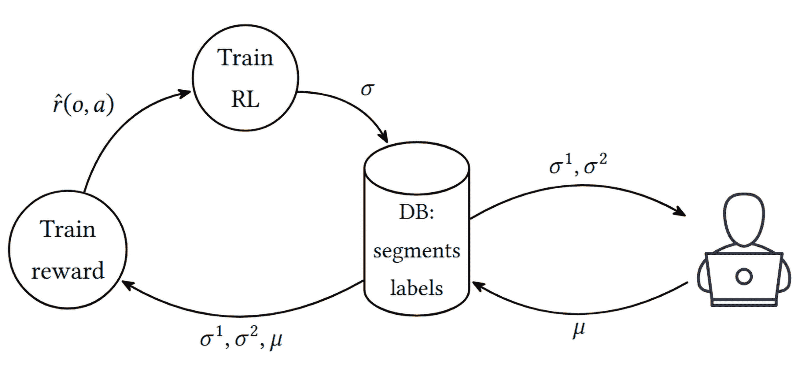

图 19.1: RLHF 结构

如前所述，本文讨论了两类问题：Atari 游戏和连续控制。在这两类问题上，结果并不特别显著——有时传统的 RL 比 RLHF 更好，有时则相反。但 RLHF 真正突出的地方是在大语言模型（LLM）的训练流程中。我们在开始 RLHF 实验之前，简要讨论一下为什么会发生这种情况。

## RLHF 和 LLMs

ChatGPT 于 2022 年底发布，很快成为了一个大热话题。对于普通用户来说，它甚至比 2012 年的 AlexNet 还要有影响力，因为 AlexNet 是“技术性的东西”——它推动了边界，但很难解释它到底有多特别。ChatGPT 不一样：发布仅一个月后，它的用户数量就突破了 1 亿，而几乎每个人都在谈论它。

ChatGPT（以及任何现代 LLM）训练流程的核心是 RLHF。因此，这种微调大模型的方法迅速流行开来，并且在研究兴趣上也有所增长。由于这不是一本关于 LLM 的书，我将简要描述该流程以及 RLHF 是如何融入其中的，因为从我的角度来看，这是一个有趣的应用案例。

从高层次来看，LLM 训练由三个阶段组成：

1.  预训练：在这里，我们在一个庞大的文本语料库上对语言模型进行初步训练。基本上，我们会尽可能获取所有的信息并进行无监督的语言模型训练。数据量（及其成本）是巨大的——用于 LLaMA 训练的 RedPajama 数据集包含 1.2 万亿个标记（大约相当于 1500 万本书）。

    在这个阶段，我们的随机初始化模型学习语言的规律性和深层次的联系。但由于数据量庞大，我们不能仅仅挑选这些数据——它们可能是假新闻、仇恨言论帖子，或是你在互联网上随便可以找到的其他怪异内容。

1.  监督微调：在这一步，我们会在预定义的精选示例对话上对模型进行微调。此处使用的数据集是手动创建并验证正确性的，数据量显著较小——大约为 10K-100K 个示例对话。

    这些数据通常由该领域的专家创建，需要大量的精力来制作并进行复核。

1.  RLHF 微调（也称为“模型对齐”）：这一步使用了我们已经描述过的相同过程：生成的对话对呈现给用户进行标注，奖励模型基于这些标签进行训练，并在 RL 算法中使用这个奖励模型来微调 LLM 模型，使其遵循人类的偏好。标注样本的数量比监督微调步骤要多（大约 1M 对），但因为比较两个对话要比从头开始创建一个合适的对话简单得多，所以这不是问题。

正如你可能猜到的，第一步是最耗费资源和时间的：你必须处理大量的文本并通过变换器进行处理。但同时，这些步骤的重要性是完全不同的。在最后一步，系统不仅学习如何解决呈现的问题，还会得到生成问题答案时是否符合社会接受方式的反馈。

RLHF 方法非常适合这个任务——只需要一对对话，它就能学习代表标注者隐式“偏好模型”的奖励模型，应用于像聊天机器人这样复杂的事物。显式地做这件事（例如通过奖励函数）可能是一个具有很大不确定性的挑战性问题。

# RLHF 实验

为了更好地理解我们刚才讨论的流程，让我们自己动手实现它（因为“做是最好的学习方法”）。在上一章中，我们尝试了 Atari SeaQuest 环境，从探索角度来看，这个环境有一定难度，因此利用这个环境并检查我们能通过人类反馈取得什么成就是合乎逻辑的。

为了限制本章的范围并使例子更具可复现性，我对 RLHF 论文 [Chr+17] 中描述的实验进行了以下修改：

+   我专注于单一的 SeaQuest 环境。目标是提高代理在与第十八章中 A2C 结果的对比中的游戏表现——平均得分为 400，回合步数为 500 步（由于缺氧）。

+   我将其从异步标注和奖励模型训练的过程，分成了单独的步骤：

    1.  执行了 A2C 训练，将轨迹段存储在本地文件中。此训练可选择性地加载并使用奖励模型网络，这使得我们可以在训练后迭代奖励模型，标记更多的样本。

    1.  Web UI 让我可以为随机的轨迹段对打上标签，并将标签存储在一个 JSON 文件中。

    1.  奖励模型在这些段落和标签上进行了训练。训练结果被存储在磁盘上。

+   我避免了所有与奖励模型训练相关的变体：没有 L2 正则化，没有集成方法等。

+   标签的数量显著减少：在每次实验中，我标记了额外的 100 对回合段，并重新训练了模型。

+   动作明确地加入了奖励模型中。详情请参阅“奖励模型”一节。

+   奖励模型在 A2C 训练中用于对保存的最佳模型进行微调。为了说明背景，在论文中，模型是从零开始训练的，并通过并行的 RLHF 标注和奖励模型重训练得到了改善。

## 使用 A2C 进行初始训练

为了获得第一个模型（我们称之为“版本 0”或简称 v0），我使用了标准的 A2C 代码，并配合本书前面已经多次讨论过的 Atari 包装器。

要开始训练，您需要运行 Chapter19/01_a2c.py 模块，除了基本的 A2C 训练外，它还包含一个命令行选项，用于启用奖励模型（我们在前面的章节中介绍过），但在此步骤中我们不需要它。

目前，要开始基本模型的训练，请使用以下命令行：

```py
Chapter19$ ./01_a2c.py --dev cuda -n v0 --save save/v0 --db-path db-v0 
A.L.E: Arcade Learning Environment (version 0.8.1+53f58b7) 
[Powered by Stella] 
AtariA2C( 
  (conv): Sequential( 
   (0): Conv2d(4, 32, kernel_size=(8, 8), stride=(4, 4)) 
   (1): ReLU() 
   (2): Conv2d(32, 64, kernel_size=(4, 4), stride=(2, 2)) 
   (3): ReLU() 
   (4): Conv2d(64, 64, kernel_size=(3, 3), stride=(1, 1)) 
   (5): ReLU() 
   (6): Flatten(start_dim=1, end_dim=-1) 
  ) 
  (policy): Sequential( 
   (0): Linear(in_features=3136, out_features=512, bias=True) 
   (1): ReLU() 
   (2): Linear(in_features=512, out_features=18, bias=True) 
  ) 
  (value): Sequential( 
   (0): Linear(in_features=3136, out_features=512, bias=True) 
   (1): ReLU() 
   (2): Linear(in_features=512, out_features=1, bias=True) 
  ) 
) 
0: Testing model... 
Got best reward 40.00 and steps 213.0 in 10 episodes 
1024: done 1 games, mean reward 0.000, steps 70, speed 312.22 f/s 
1056: done 2 games, mean reward 0.000, steps 72, speed 1188.69 f/s 
1104: done 3 games, mean reward 0.000, steps 75, speed 1216.18 f/s
```

以下是命令行选项的描述：

+   --dev: 用于计算的设备名称。

+   -n: 运行的名称，用于 TensorBoard。

+   --save: 在测试后将存储最佳模型的目录名称。每训练 100 批次，我们会对当前模型在 SeaQuest 上进行 10 次测试剧集，禁用奖励剪切（以获取原始分数范围），如果这 10 轮中的最佳奖励或步骤数超过我们之前的记录，我们会将模型保存到文件中。这些文件稍后将用于微调。

+   --db-path: 在训练过程中将存储随机剧集片段的目录名称。这些数据稍后将用于奖励模型的标注和训练。

让我们讨论一下剧集片段数据库（简称 DB）。其结构非常简单：每个用于训练的环境（总共有 16 个）都有一个从 0 到 15 的标识符，这个标识符用作 --db-path 命令行参数所给定目录下的子目录。因此，每个环境都会在自己的目录中独立存储随机片段。存储逻辑是通过 Gym API Wrapper 子类实现的，这个子类叫做 `EpisodeRecorderWrapper`，位于 lib/rlhf.py 模块中。

让我们来看一下包装器的源代码。最初，我们声明了两个超参数，EPISODE_STEPS，它定义了片段的长度，以及 START_PROB，它表示开始剧集记录的概率：

```py
# how many transitions to store in episode 
EPISODE_STEPS = 50 
# probability to start episode recording 
START_PROB = 0.00005 

@dataclass(frozen=True) 
class EpisodeStep: 
    obs: np.ndarray 
    act: int 

class EpisodeRecorderWrapper(gym.Wrapper): 
    def __init__(self, env: gym.Env, db_path: pathlib.Path, env_idx: int, 
                 start_prob: float = START_PROB, steps_count: int = EPISODE_STEPS): 
        super().__init__(env) 
        self._store_path = db_path / f"{env_idx:02d}" 
        self._store_path.mkdir(parents=True, exist_ok=True) 
        self._start_prob = start_prob 
        self._steps_count = steps_count 
        self._is_storing = False 
        self._steps: tt.List[EpisodeStep] = [] 
        self._prev_obs = None 
        self._step_idx = 0
```

我们将剧集片段存储为一系列 `EpisodeStep` 对象，这些对象只是我们在该步骤中所采取的观察和动作。重置环境的方法非常简单——它会更新包装器的 _step_idx 字段（这是我们在该环境中已执行步骤的计数器），并根据 _is_store 字段将观察值存储在 _prev_obs 字段中。如果 _is_store 字段为 True，则表示我们正在进行片段记录。

我们的片段有固定数量的环境步骤（默认为 50 步），它们独立于剧集边界进行记录（换句话说，如果我们在潜艇死亡前不久开始片段记录，那么在调用 reset() 方法后，我们会记录下一剧集的开始）：

```py
 def reset(self, *, seed: int | None = None, options: dict[str, tt.Any] | None = None) \ 
            -> tuple[WrapperObsType, dict[str, tt.Any]]: 
        self._step_idx += 1 
        res = super().reset(seed=seed, options=options) 
        if self._is_storing: 
            self._prev_obs = deepcopy(res[0]) 
        return res
```

如果你愿意，你可以尝试这种逻辑，因为原则上，剧集结束后的观察数据与剧集结束前的观察和动作是独立的。但这样会使剧集片段数据的处理更复杂，因为数据长度将变得可变。

包装器的主要逻辑在 step()方法中，也不是很复杂。每次动作时，如果我们正在录制，就存储该步骤；否则，我们会生成一个随机数来决定是否开始录制：

```py
 def step(self, action: WrapperActType) -> tuple[ 
        WrapperObsType, SupportsFloat, bool, bool, dict[str, tt.Any] 
    ]: 
        self._step_idx += 1 
        obs, r, is_done, is_tr, extra = super().step(action) 
        if self._is_storing: 
            self._steps.append(EpisodeStep(self._prev_obs, int(action))) 
            self._prev_obs = deepcopy(obs) 

            if len(self._steps) >= self._steps_count: 
                store_segment(self._store_path, self._step_idx, self._steps) 
                self._is_storing = False 
                self._steps.clear() 
        elif random.random() <= self._start_prob: 
            # start recording 
            self._is_storing = True 
            self._prev_obs = deepcopy(obs) 
        return obs, r, is_done, is_tr, extra
```

默认情况下，开始录制的概率很小（START_PROB = 0.00005，即 0.005%的几率），但由于训练过程中我们进行的大量步骤，我们仍然有足够的片段可以标注。例如，在 1200 万环境步骤（约 5 小时的训练）之后，数据库中包含了 2,500 个录制的片段，占用了 12GB 的磁盘空间。

方法 step()使用函数 store_segment()存储 EpisodeStep 对象的列表，这实际上是对步骤列表的 pickle.dumps()调用：

```py
def store_segment(root_path: pathlib.Path, step_idx: int, steps: tt.List[EpisodeStep]): 
    out_path = root_path / f"{step_idx:08d}.dat" 
    dat = pickle.dumps(steps) 
    out_path.write_bytes(dat) 
    print(f"Stored {out_path}")
```

在讨论训练结果之前，我需要提到一个关于包装器使用的小细节，虽然它不大，但很重要。为了让标注更容易，我们存储在数据库中的观察数据是来自标准 Atari 包装器之前的。这虽然增加了我们需要存储的数据量，但人工标注者将看到原始的、色彩丰富的 Atari 屏幕，分辨率为原始的 160 × 192，而不是降级后的灰度图像。

为了实现这一点，包装器在原始 Gymnasium 环境之后、Atari 包装器之前应用。以下是 01_a2c.py 模块中的相关代码片段：

```py
 def make_env() -> gym.Env: 
        e = gym.make("SeaquestNoFrameskip-v4") 
        if reward_path is not None: 
            p = pathlib.Path(reward_path) 
            e = rlhf.RewardModelWrapper(e, p, dev=dev, metrics_queue=metrics_queue) 
        if db_path is not None: 
            p = pathlib.Path(db_path) 
            p.mkdir(parents=True, exist_ok=True) 
            e = rlhf.EpisodeRecorderWrapper(e, p, env_idx=env_idx) 
        e = ptan.common.wrappers.wrap_dqn(e) 
        # add time limit after all wrappers 
        e = gym.wrappers.TimeLimit(e, TIME_LIMIT) 
        return e
```

训练过程的超参数来自论文（学习率下降计划、网络架构、环境数量等）。我让它训练了 5 小时，进行了 1200 万次观察。测试结果的图表显示在图 19.2 中。

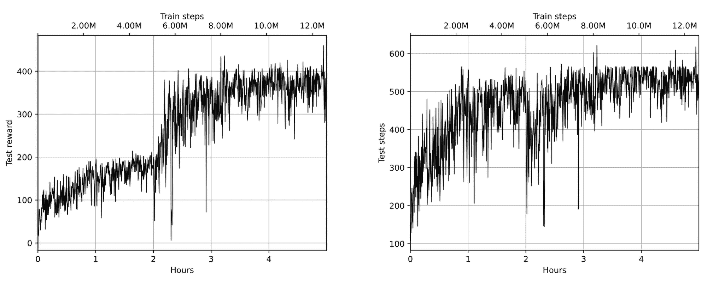

图 19.2：A2C 训练过程中的奖励（左）和步骤（右）

最佳模型能够达到 460 的奖励水平（环境中没有奖励裁剪），虽然很不错，但与时不时补充氧气所能达到的结果相比要差得多。

该模型的游戏视频可以在[`youtu.be/R_H3pXu-7cw`](https://youtu.be/R_H3pXu-7cw)观看。正如你从视频中看到的，我们的智能体几乎完美地掌握了射击鱼类的技巧，但它在浮在底部的局部最优解上卡住了（可能因为在那里更安全，敌方潜艇不在那里），并且对氧气补充一无所知。

你可以使用工具 01_play.py 从模型文件录制自己的视频，输入模型文件名即可。

## 标注过程

在 A2C 训练过程中，我们获得了 12GB 的 2,500 个随机剧集片段。每个片段包含 50 个步骤，包含屏幕观察和智能体在每一步采取的动作。现在我们已经准备好进行 RLHF 管道的标注过程。

在标注过程中，我们需要随机抽取剧集片段对并展示给用户，询问“哪个更好？”。答案应存储用于奖励模型的训练。正是这个逻辑在 02_label_ui.py 中实现。

标注过程的 UI 作为一个 web 应用实现，使用了 NiceGUI 库（[`nicegui.io/`](https://nicegui.io/)）。NiceGUI 允许用 Python 实现现代 web 应用 UI，并提供了一套丰富的交互式 UI 控件，如按钮、列表、弹出对话框等。原则上，你不需要了解 JavaScript 和 CSS（但如果你熟悉它们也无妨）。如果你以前从未使用过 NiceGUI，也没问题；你只需在 Python 环境中通过以下命令安装它：

```py
pip install nicegui==1.4.26
```

要启动标注 UI（在安装 NiceGUI 包之后），你需要指定存储剧集片段的数据库路径：

```py
Chapter19$ ./02_label_ui.py -d db-v0 
NiceGUI ready to go on http://localhost:8080, http://172.17.0.1:8080, http://172.18.0.1:8080, and http://192.168.10.8:8080
```

界面通过 HTTP 提供服务（所以，可以在浏览器中打开），并监听所有机器接口上的 8080 端口，这在你将其部署到远程服务器时非常方便（但你需要意识到可能的外部访问风险，因为标注 UI 完全没有身份验证和授权）。如果你想更改端口或将范围限制到特定的网络接口，只需修改 02_label_ui.py。让我们看一下标注界面的截图：

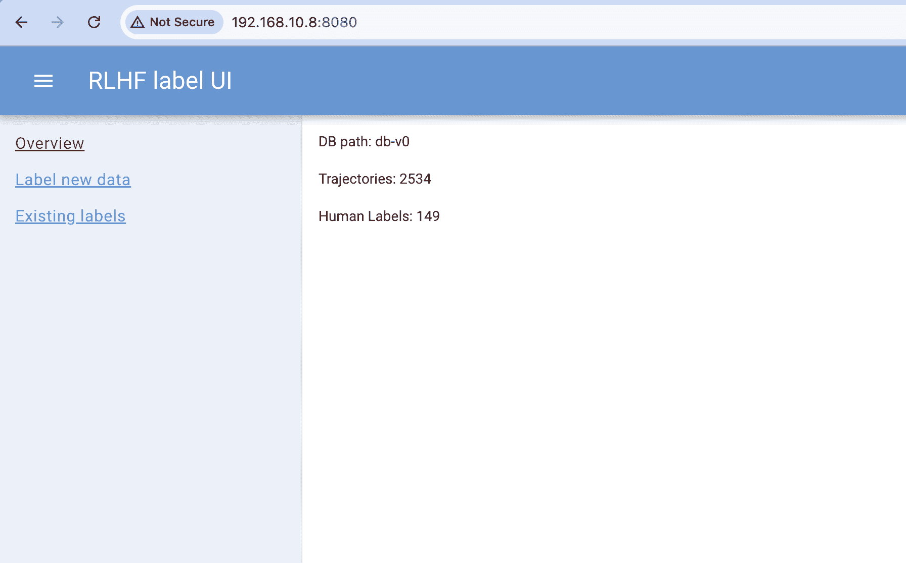

图 19.3：带有数据库信息的标注 UI 部分

这个界面非常基础：左侧有三个链接，指向 UI 功能的不同部分：

+   概览显示数据库路径、其中包含的片段总数以及已创建的标签数量。

+   标注新数据样本随机配对片段并允许你为其添加标签。

+   “现有标签”显示所有标签，并允许在需要时修改标签。

如有需要，可以通过点击左上角的按钮（带有三个横线）隐藏或显示包含链接的列表。最多的时间花费在“标注新数据”部分，见图 ??：

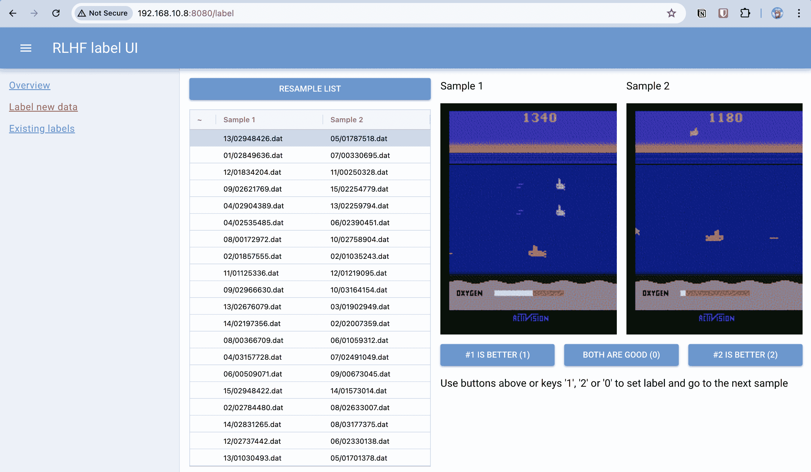

图 19.4：添加新标签的界面（为了更好地可视化，参考 https://packt.link/gbp/9781835882702）

这里我们有一个包含 20 对随机抽取的剧集片段的列表，可以进行标注。当列表中的条目被选择时，界面会显示这两段片段（作为代码实时生成的动画 GIF）。用户可以点击三个按钮中的一个来添加标签：

+   #1 更好（1）：将第一个片段标记为首选。在奖励模型训练过程中，这样的条目会有 μ[1] = 1.0 和 μ[2] = 0.0。

+   两者都好（0）：将两个片段标记为同样好（或差），赋值 μ[1] = 0.5 和 μ[2] = 0.5。

+   #2 更好（2）：将第二个片段标记为首选（μ[1] = 0.0 和 μ[2] = 1.0）。

你可以通过使用键盘上的 0（“两者都好”）、1（“第一个更好”）或 2（“第二个更好”）来分配标签，而无需点击 UI 按钮。标签分配完成后，UI 会自动选择列表中的下一个未标记条目，这样整个标记过程仅使用键盘就能完成。当你完成列表中的所有标签后，可以点击 RESAMPLE LIST 按钮加载 20 个新的样本进行标记。

在每个标签被分配后（通过点击 UI 按钮或按下键盘键），这些标签会存储在 DB 目录根目录下的 JSON 文件 labels.json 中。该文件采用简单的 JSON 行格式，每行都是一个包含段落路径（相对于 DB 根目录）和已分配标签的条目：

```py
Chapter19$ head db-v0/labels.json 
{"sample1":"14/00023925.dat","sample2":"10/00606788.dat","label":0} 
{"sample1":"02/01966114.dat","sample2":"10/01667833.dat","label":2} 
{"sample1":"00/02432057.dat","sample2":"06/01410909.dat","label":1} 
{"sample1":"01/02293138.dat","sample2":"11/00997214.dat","label":0} 
{"sample1":"10/00091149.dat","sample2":"11/01262679.dat","label":2} 
{"sample1":"12/01394239.dat","sample2":"04/01792088.dat","label":2} 
{"sample1":"10/01390371.dat","sample2":"09/00077676.dat","label":0} 
{"sample1":"10/01390371.dat","sample2":"09/00077676.dat","label":1} 
{"sample1":"12/02339611.dat","sample2":"00/02755898.dat","label":2} 
{"sample1":"06/00301623.dat","sample2":"06/00112361.dat","label":2}
```

如果需要，可以通过使用“现有标签”链接（如图 19.5 所示）来查看现有标签，该界面几乎与“标记新数据”相同，不同之处在于它显示的不是 20 个新采样的对，而是已经标记的对。这些对可以通过点击按钮或使用前面描述的键盘快捷键进行更改。

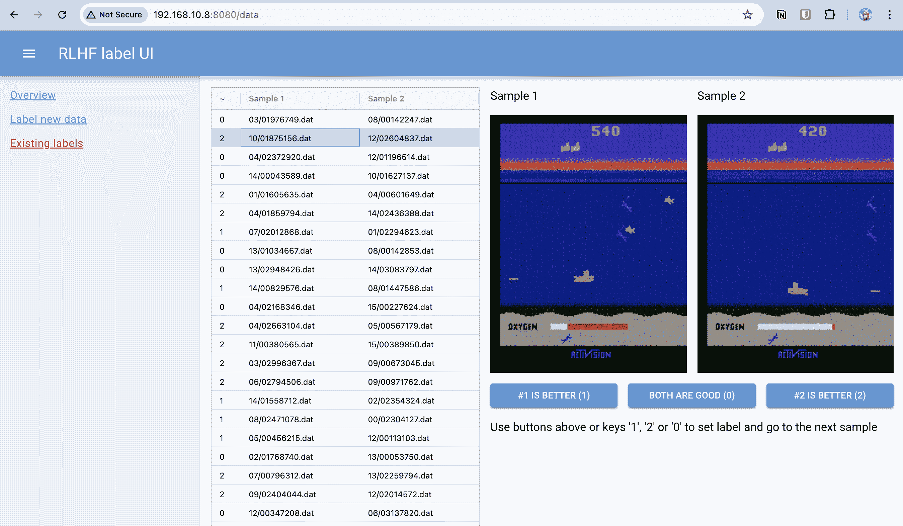

图 19.5：查看和编辑旧标签的界面（为了更好的可视化，参见 https://packt.link/gbp/9781835882702 ）

在我的实验中，我进行了第一轮标记，共标记了 100 对样本，主要关注潜水艇出现在水面上的罕见情况（标记为好）和氧气不足时更为常见的情况（标记为坏）。在其他情况下，我更倾向于选择那些鱼群被正确击中的段落。有了这些标签，我们就可以进入下一步：奖励模型训练。

## 奖励模型训练

奖励模型网络大多数结构来自论文，唯一的不同在于如何处理动作。在论文中，作者没有明确说明如何考虑动作，只是提到“对于奖励预测器，我们使用 84 × 84 的图像作为输入（与策略的输入相同），并将 4 帧图像堆叠在一起，形成总共 84 × 84 × 4 的输入张量。”根据这一点，我假设奖励模型通过帧之间的动态“隐式”地扣除动作。我在实验中没有尝试这种方法，而是决定通过将 one-hot 编码与从卷积层获得的向量拼接在一起，显式地向网络展示动作。作为一个练习，你可以修改我的代码，使用论文中的方法并比较结果。其余的架构和训练参数与论文中的相同。接下来，让我们看一下奖励模型网络的代码：

```py
class RewardModel(nn.Module): 
    def __init__(self, input_shape: tt.Tuple[int, ...], n_actions: int): 
        super().__init__() 

        self.conv = nn.Sequential( 
            nn.Conv2d(input_shape[0], 16, kernel_size=7, stride=3), 
            nn.BatchNorm2d(16), 
            nn.Dropout(p=0.5), 
            nn.LeakyReLU(), 
            nn.Conv2d(16, 16, kernel_size=5, stride=2), 
            nn.BatchNorm2d(16), 
            nn.Dropout(p=0.5), 
            nn.LeakyReLU(), 
            nn.Conv2d(16, 16, kernel_size=3, stride=1), 
            nn.BatchNorm2d(16), 
            nn.Dropout(p=0.5), 
            nn.LeakyReLU(), 
            nn.Conv2d(16, 16, kernel_size=3, stride=1), 
            nn.BatchNorm2d(16), 
            nn.Dropout(p=0.5), 
            nn.LeakyReLU(), 
            nn.Flatten(), 
        ) 
        size = self.conv(torch.zeros(1, *input_shape)).size()[-1] 
        self.out = nn.Sequential( 
            nn.Linear(size + n_actions, 64), 
            nn.LeakyReLU(), 
            nn.Linear(64, 1), 
        ) 

    def forward(self, obs: torch.ByteTensor, acts: torch.Tensor) -> torch.Tensor: 
        conv_out = self.conv(obs / 255) 
        comb = torch.hstack((conv_out, acts)) 
        out = self.out(comb) 
        return out
```

正如你所看到的，卷积层与批量归一化、丢弃层和 leaky ReLU 激活函数结合使用。

奖励模型的训练在 03_reward_train.py 中实现，过程没有什么复杂的。我们从 JSON 文件中加载标注数据（你可以在命令行中传递多个数据库来用于训练），使用 20% 的数据进行测试，并计算二元交叉熵目标，这在 calc_loss() 函数中实现：

```py
def calc_loss(model: rlhf.RewardModel, s1_obs: torch.ByteTensor, 
              s1_acts: torch.Tensor, s2_obs: torch.ByteTensor, 
              s2_acts: torch.Tensor, mu: torch.Tensor) -> torch.Tensor: 
    batch_size, steps = s1_obs.size()[:2] 

    s1_obs_flat = s1_obs.flatten(0, 1) 
    s1_acts_flat = s1_acts.flatten(0, 1) 
    r1_flat = model(s1_obs_flat, s1_acts_flat) 
    r1 = r1_flat.view((batch_size, steps)) 
    R1 = torch.sum(r1, 1) 

    s2_obs_flat = s2_obs.flatten(0, 1) 
    s2_acts_flat = s2_acts.flatten(0, 1) 
    r2_flat = model(s2_obs_flat, s2_acts_flat) 
    r2 = r2_flat.view((batch_size, steps)) 
    R2 = torch.sum(r2, 1) 
    R = torch.hstack((R1.unsqueeze(-1), R2.unsqueeze(-1))) 
    loss_t = F.binary_cross_entropy_with_logits(R, mu) 
    return loss_t
```

最初，我们的观察和动作张量具有以下结构：观察为(batch,time,colors,height,width)，动作为(batch,time,actions)，其中 time 是序列的时间维度。更具体地说，观察张量的大小为 64 × 50 × 3 × 210 × 160，动作的大小为 64 × 50 × 18。

作为损失计算的第一步，我们展平前两个维度，去除时间维度，并应用模型计算奖励值 r̂(o,a)。之后，我们恢复时间维度，并根据我们已经讨论过的论文公式沿时间维度求和。然后，我们的损失计算是应用 torch 函数来计算二元交叉熵。

在每个训练周期中，我们计算测试损失（基于 20% 的数据），并在新损失低于先前测试损失的最小值时保存奖励模型。如果训练损失连续四个周期增长，我们将停止训练。

在前一节中设置的标签数量（几百个）下，训练非常快速——大约十几个周期和几分钟时间。以下是示例训练过程。命令行参数 -o 指定保存最佳模型的目录名称：

```py
Chapter19$ ./03_reward_train.py --dev cuda -n v0-rw -o rw db-v0 
Namespace(dev=’cuda’, name=v0-rw’, out=’rw’, dbs=[’db-v0’]) 
Loaded DB from db-v0 with 149 labels and 2534 paths 
RewardModel( 
  (conv): Sequential( 
   (0): Conv2d(3, 16, kernel_size=(7, 7), stride=(3, 3)) 
   (1): BatchNorm2d(16, eps=1e-05, momentum=0.1, affine=True, track_running_stats=True) 
   (2): Dropout(p=0.5, inplace=False) 
   (3): LeakyReLU(negative_slope=0.01) 
   (4): Conv2d(16, 16, kernel_size=(5, 5), stride=(2, 2)) 
   (5): BatchNorm2d(16, eps=1e-05, momentum=0.1, affine=True, track_running_stats=True) 
   (6): Dropout(p=0.5, inplace=False) 
   (7): LeakyReLU(negative_slope=0.01) 
   (8): Conv2d(16, 16, kernel_size=(3, 3), stride=(1, 1)) 
   (9): BatchNorm2d(16, eps=1e-05, momentum=0.1, affine=True, track_running_stats=True) 
   (10): Dropout(p=0.5, inplace=False) 
   (11): LeakyReLU(negative_slope=0.01) 
   (12): Conv2d(16, 16, kernel_size=(3, 3), stride=(1, 1)) 
   (13): BatchNorm2d(16, eps=1e-05, momentum=0.1, affine=True, track_running_stats=True) 
   (14): Dropout(p=0.5, inplace=False) 
   (15): LeakyReLU(negative_slope=0.01) 
   (16): Flatten(start_dim=1, end_dim=-1) 
  ) 
  (out): Sequential( 
   (0): Linear(in_features=8978, out_features=64, bias=True) 
   (1): LeakyReLU(negative_slope=0.01) 
   (2): Linear(in_features=64, out_features=1, bias=True) 
  ) 
) 
Epoch 0 done, train loss 0.131852, test loss 0.132976 
Save model for 0.13298 test loss 
Epoch 1 done, train loss 0.104426, test loss 0.354560 
Epoch 2 done, train loss 0.159513, test loss 0.170160 
Epoch 3 done, train loss 0.054362, test loss 0.066557 
Save model for 0.06656 test loss 
Epoch 4 done, train loss 0.046695, test loss 0.121662 
Epoch 5 done, train loss 0.055446, test loss 0.064895 
Save model for 0.06490 test loss 
Epoch 6 done, train loss 0.024505, test loss 0.025308 
Save model for 0.02531 test loss 
Epoch 7 done, train loss 0.015864, test loss 0.045814 
Epoch 8 done, train loss 0.024745, test loss 0.054631 
Epoch 9 done, train loss 0.027670, test loss 0.054107 
Epoch 10 done, train loss 0.025979, test loss 0.048673 
Best test loss was less than current for 4 epoches, stop
```

## 将 A2C 与奖励模型相结合

一旦奖励模型训练完成，我们最终可以尝试将其用于 RL 训练。为此，我们使用相同的工具 01_a2c.py，但提供几个额外的参数：

+   -r 或 --reward：这是奖励模型的路径，用于加载和使用。通过此选项，我们不使用环境奖励，而是使用模型从我们决定采取的观察和动作中获得奖励。这作为额外的环境包装器实现；我们稍后会详细介绍。

+   -m 或 --model：这是要加载的演员模型的路径（存储在先前 A2C 训练轮次中）。由于我正在使用 RLHF 进行微调，而不是从头开始使用奖励模型训练，因此需要演员模型。原则上，你可以尝试使用奖励模型从零开始训练，但我的实验结果并不十分成功。

+   --finetune：启用微调模式：卷积层被冻结，学习率降低 10 倍。没有这些修改，演员很快就会忘记所有先前的知识，奖励几乎降到零。

因此，要使用我们刚刚训练的奖励模型，命令行看起来像这样：

./01_a2c.py --dev cuda -n v1 -r rw/reward-v0.dat --save save/v1 -m save/v0/model_rw=460-steps=580.dat --finetune

在检查实验结果之前，让我们看看奖励模型如何在 RL 训练过程中使用。为了最小化所需的改动，我实现了一个环境包装器，它被添加在原始环境和 Atari 包装器之间，因为奖励模型需要一个未经缩放的全彩游戏图像。

包装器的代码在 lib/rlhf.py 中，名为 RewardModelWrapper。包装器的构造函数从数据文件中加载模型并分配一些字段。根据论文，奖励模型预测的奖励经过标准化，使其均值为零，方差为一。因此，为了进行标准化，包装器维护了最后 100 个奖励值，使用 collections.deque。此外，包装器还可以有一个队列，用于发送指标。该指标包含关于标准化值和来自底层环境的真实总和的信息：

```py
class RewardModelWrapper(gym.Wrapper): 
    KEY_REAL_REWARD_SUM = "real_reward_sum" 
    KEY_REWARD_MU = "reward_mu" 
    KEY_REWARD_STD = "reward_std" 

    def __init__(self, env: gym.Env, model_path: pathlib.Path, dev: torch.device, 
                 reward_window: int = 100, metrics_queue: tt.Optional[queue.Queue] = None): 
        super().__init__(env) 
        self.device = dev 
        assert isinstance(env.action_space, gym.spaces.Discrete) 
        s = env.observation_space.shape 
        self.total_actions = env.action_space.n 
        self.model = RewardModel( 
            input_shape=(s[2], s[0], s[1]), n_actions=self.total_actions) 
        self.model.load_state_dict(torch.load(model_path, map_location=torch.device(’cpu’), 
                                              weights_only=True)) 
        self.model.eval() 
        self.model.to(dev) 
        self._prev_obs = None 
        self._reward_window = collections.deque(maxlen=reward_window) 
        self._real_reward_sum = 0.0 
        self._metrics_queue = metrics_queue
```

在 reset()方法中，我们只需要记住观察并重置奖励计数器：

```py
 def reset(self, *, seed: int | None = None, options: dict[str, tt.Any] | None = None) \ 
            -> tuple[WrapperObsType, dict[str, tt.Any]]: 
        res = super().reset(seed=seed, options=options) 
        self._prev_obs = deepcopy(res[0]) 
        self._real_reward_sum = 0.0 
        return res
```

包装器的主要逻辑在 step()函数中，但并不复杂：我们将模型应用于观察和动作，标准化奖励，并返回它，而不是返回真实的奖励。从性能角度来看，模型应用效率不是很高，可能需要优化（因为我们有多个环境并行运行），但我决定先实现简单版本，把优化留给你作为练习：

```py
 def step(self, action: WrapperActType) -> tuple[ 
        WrapperObsType, SupportsFloat, bool, bool, dict[str, tt.Any] 
    ]: 
        obs, r, is_done, is_tr, extra = super().step(action) 
        self._real_reward_sum += r 
        p_obs = np.moveaxis(self._prev_obs, (2, ), (0, )) 
        p_obs_t = torch.as_tensor(p_obs).to(self.device) 
        p_obs_t.unsqueeze_(0) 
        act = np.eye(self.total_actions)[[action]] 
        act_t = torch.as_tensor(act, dtype=torch.float32).to(self.device) 
        new_r_t = self.model(p_obs_t, act_t) 
        new_r = float(new_r_t.item()) 

        # track reward for normalization 
        self._reward_window.append(new_r) 
        if len(self._reward_window) == self._reward_window.maxlen: 
            mu = np.mean(self._reward_window) 
            std = np.std(self._reward_window) 
            new_r -= mu 
            new_r /= std 
            self._metrics_queue.put((self.KEY_REWARD_MU, mu)) 
            self._metrics_queue.put((self.KEY_REWARD_STD, std)) 

        if is_done or is_tr: 
            self._metrics_queue.put((self.KEY_REAL_REWARD_SUM, self._real_reward_sum)) 
        self._prev_obs = deepcopy(obs) 
        return obs, new_r, is_done, is_tr, extra
```

剩下的训练部分相同。我们只需在环境创建函数中注入新的包装器（如果命令行中给定了奖励模型文件）：

```py
 def make_env() -> gym.Env: 
        e = gym.make("SeaquestNoFrameskip-v4") 
        if reward_path is not None: 
            p = pathlib.Path(reward_path) 
            e = rlhf.RewardModelWrapper(e, p, dev=dev, metrics_queue=metrics_queue) 
        if db_path is not None: 
            p = pathlib.Path(db_path) 
            p.mkdir(parents=True, exist_ok=True) 
            e = rlhf.EpisodeRecorderWrapper(e, p, env_idx=env_idx) 
        e = ptan.common.wrappers.wrap_dqn(e) 
        # add time limit after all wrappers 
        e = gym.wrappers.TimeLimit(e, TIME_LIMIT) 
        return e
```

使用这段代码，我们现在可以将之前的模型与之前制作的标签结合起来。

## 使用 100 个标签进行微调

我使用从基本 A2C 训练中得到的最佳模型进行了训练，在测试中，该模型在 580 步内获得了 460 的奖励。此外，我启用了将回合片段采样到新 DB 目录（此处为 v1）的功能，因此完整的命令行如下：

./01_a2c.py --dev cuda -n v1 -r rw/reward-v0.dat --save save/v1 -m save/v0/model_rw=460-steps=580.dat --finetune --db-path v1 该模型很快就开始过拟合，在 2M 步（3 小时）后，我停止了训练。图 19.6 显示了测试结果（奖励和步骤数）：

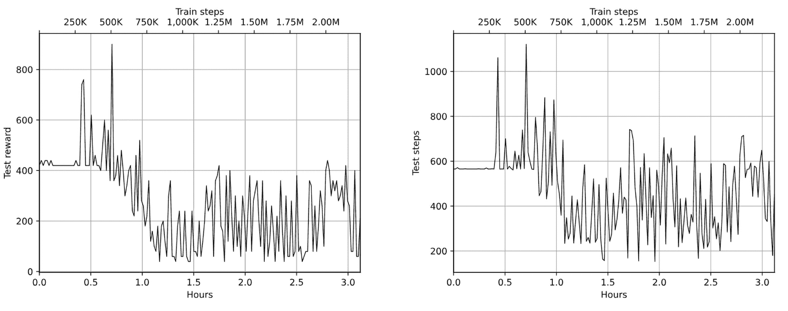

图 19.6：微调过程中测试奖励（左）和步骤（右）

图 19.7 显示了训练奖励（由模型预测）和总损失：

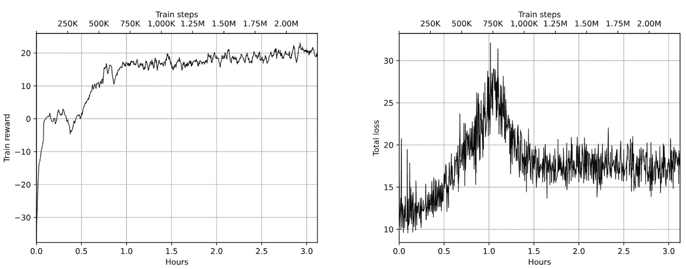

图 19.7：微调过程中训练奖励（左）和总损失（右）

最佳模型保存在 500K 训练步时，它能够在 1,120 步内获得 900 的奖励。与原始模型相比，这是一个相当大的改进。

该模型的视频记录可以在这里查看：[`youtu.be/LnPwuyVrj9g`](https://youtu.be/LnPwuyVrj9g)。从游戏玩法来看，我们看到代理学会了如何补充氧气，并且现在在屏幕中央停留了一段时间。我也有印象它更有意地选择了潜水员（但我并没有为这种行为做具体标注）。总体来说，这个方法有效，并且仅凭 100 个标签就能教会代理一些新东西，真的很令人印象深刻。

让我们通过更多的标注进一步改进模型。

## 第二轮实验

在第二轮实验中，我做了更多的标注：50 对来自 v0 数据库，50 对来自微调过程中存储的片段（v1 数据库）。在微调过程中生成的数据库（v1）包含了更多的潜艇漂浮在水面的片段，这证明我们的管道运行正常。在标注时，我也更加重视氧气补充的片段。

标注后，我重新训练了奖励模型，这只用了几分钟。然后，使用奖励模型对最佳 v1 模型（奖励为 900，步数为 1,120）进行了微调。

图 19.8 和图 19.9 包含了测试结果的图表、奖励训练和损失：

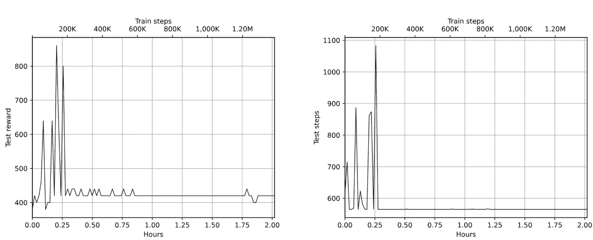

图 19.8：微调过程中的测试奖励（左）和步数（右）

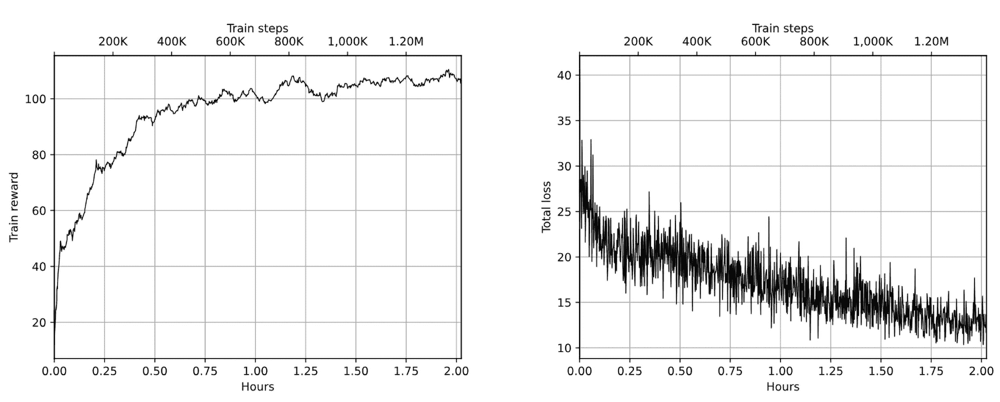

图 19.9：微调过程中的训练奖励（左）和总损失（右）

在 1.5M 步（2 小时）之后，训练停滞了，但最佳模型并不比 v1 的最佳模型更好：最佳模型在 1,084 步中获得了 860 的奖励。

## 第三轮实验

在这里，我在标注时更加注意，不仅优先考虑氧气补充，还考虑了更好的鱼类射击和潜水员接取。不幸的是，100 对标签中只出现了几个潜水员的例子，因此需要更多的标注来教会代理这种行为。

关于潜水员，代理可能没有接取他们，因为潜水员与背景非常难以区分，在灰度图像中是不可见的。为了解决这个问题，我们可以调整 Atari 包装器中的对比度。

在奖励模型重新训练后，开始了 A2C 的微调。我也运行了大约 2M 步，持续了 3 小时，结果很有趣。在训练结束时（查看图 19.10 和图 19.11），测试中的船只达到了 5,000 步（这是我在环境中设定的限制），但得分相对较低。很可能，潜艇只是停留在水面上，这是非常安全的，但这不是我们想要的——这可能是由于标注样本的原因。奇怪的是，当我尝试录制这些后期模型的视频时，它们的行为发生了变化，步数也明显较低，这可能是测试中的某个 bug。

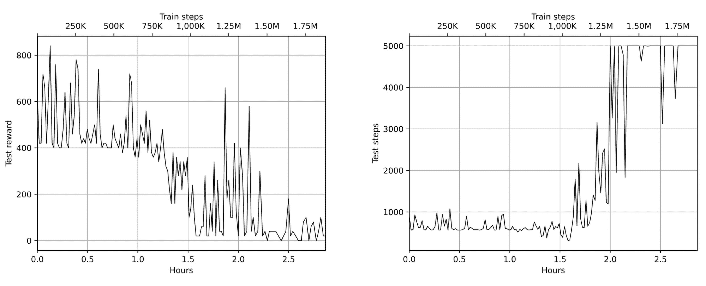

图 19.10：微调过程中的测试奖励（左）和步骤数（右）

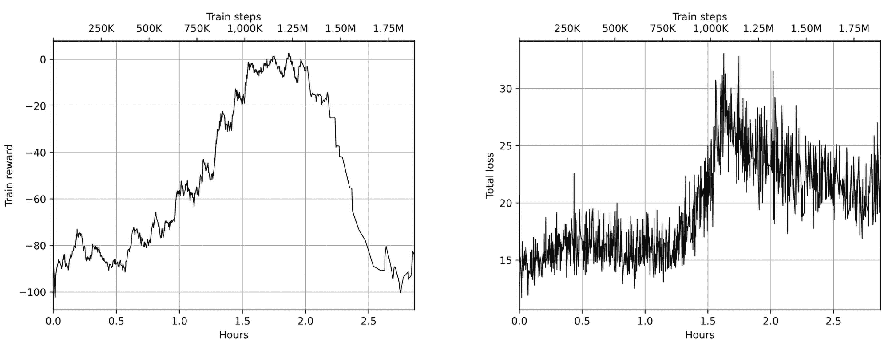

图 19.11：微调过程中训练奖励（左）和总损失（右）

在过拟合之前，训练生成了几种比 v2 模型更好的策略。例如，在这个录音中，代理进行了两次氧气补充，并在 1,613 步中获得了 1,820 分：[`youtu.be/DVe_9b3gdxU`](https://youtu.be/DVe_9b3gdxU)。

## 总体结果

在下表中，我总结了实验回合的相关信息和我们得到的结果。

| 步骤 | 标签 | 奖励 | 步骤数 | 视频 |
| --- | --- | --- | --- | --- |
| 初始 | 无 | 460 | 580 | [`youtu.be/R_H3pXu-7cw`](https://youtu.be/R_H3pXu-7cw) |
| v1 | 100 | 900 | 1120 | [`youtu.be/LnPwuyVrj9g`](https://youtu.be/LnPwuyVrj9g) |
| v2 | 200 | 860 | 1083 |  |
| v3 | 300 | 1820 | 1613 | [`youtu.be/DVe_9b3gdxU`](https://youtu.be/DVe_9b3gdxU) |

表 19.1：实验回合总结

正如你所看到的，凭借仅仅 300 个标签，我们成功将分数提高了近 4 倍。作为一个练习，你可以尝试教代理捡起潜水员，如果做得好，可能会得到更好的成绩。

另一个可能值得尝试的实验是微调原始 v0 模型，而不是前一步中的最佳模型。这可能会导致更好的结果，因为训练在过拟合之前有更多时间。

# 总结

在本章中，我们了解了 RLHF 在 RL 工具箱中的新加入。这种方法是 LLM 训练流程的核心，可以提高模型的质量。在本章中，我们实现了 RLHF，并将其应用于 SeaQuest Atari 游戏，这应该向你展示了这种方法如何在 RL 流水线中用于模型改进。

在下一章中，我们将讨论另一类 RL 方法：AlphaGo、AlphaZero 和 MuZero。
