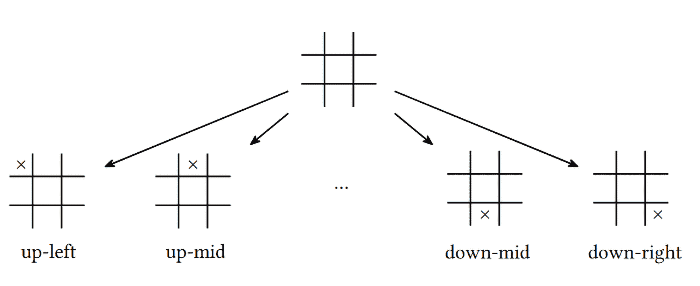

# 第二十章：AlphaGo Zero 和 MuZero

基于模型的方法通过建立环境模型并在训练过程中使用它，帮助我们减少与环境的通信量。在本章中，我们通过探讨在我们拥有环境模型，但这个环境被两个竞争方使用的情况，来了解基于模型的方法。这种情况在棋类游戏中非常常见，游戏规则固定且整个局面可观察，但我们有一个对手，其主要目标是阻止我们赢得比赛。

几年前，DeepMind 提出了一个非常优雅的解决此类问题的方法。该方法不需要任何先前的领域知识，且智能体仅通过自我对弈来改善其策略。这个方法被称为 AlphaGo Zero，并在 2017 年推出。随后，在 2020 年，他们通过去除对环境模型的要求，扩展了该方法，使其能够应用于更广泛的强化学习问题（包括 Atari 游戏）。这个方法叫做 MuZero，我们也将详细探讨它。正如你将在本章中看到的，MuZero 比 AlphaGo Zero 更通用，但也伴随着更多需要训练的网络，可能导致更长的训练时间和更差的结果。从这个角度来看，我们将详细讨论这两种方法，因为在某些情况下，AlphaGo Zero 可能更具应用价值。

在本章中，我们将：

+   讨论 AlphaGo Zero 方法的结构

+   实现连接 4（Connect 4）游戏的玩法方法

+   实现 MuZero 并与 AlphaGo Zero 进行比较

# 比较基于模型和非基于模型的方法

在第四章中，我们看到了几种不同的方式来分类强化学习方法。我们区分了三大类：

+   基于价值和基于策略

+   基于策略和离策略

+   非基于模型和基于模型

到目前为止，我们已经涵盖了第一类和第二类中方法的足够示例，但我们迄今为止讨论的所有方法都是 100% 非基于模型的。然而，这并不意味着非基于模型的方法比基于模型的方法更重要或更好。从历史上看，由于样本效率高，基于模型的方法一直被应用于机器人领域和其他工业控制中。这也部分是因为硬件的成本以及从真实机器人中获得的样本的物理限制。具有较大自由度的机器人并不容易获得，因此强化学习研究者更专注于计算机游戏和其他样本相对便宜的环境。然而，机器人学的理念正渗透到强化学习中，因此，谁知道呢，也许基于模型的方法很快会成为关注的重点。首先，让我们讨论一下我们在本书中使用的非基于模型方法与基于模型方法的区别，包括它们的优缺点以及它们可能的应用场景。

在这两种方法的名称中，“模型”指的是环境的模型，它可以有多种形式，例如，通过当前状态和动作为我们提供新的状态和奖励。迄今为止涵盖的所有方法都没有做出任何努力去预测、理解或模拟环境。我们感兴趣的是正确的行为（以最终奖励为准），无论是直接指定（策略）还是间接指定（价值），这些都是基于观察得出的。观察和奖励的来源是环境本身，在某些情况下可能非常缓慢和低效。

在基于模型的方法中，我们试图学习环境模型，以减少对“真实环境”的依赖。总体而言，模型是一种黑箱，近似我们在第一章中讨论过的真实环境。如果我们有一个准确的环境模型，我们的智能体可以通过使用这个模型，而非在现实世界中执行动作，轻松地产生它所需的任何轨迹。

在某种程度上，强化学习研究的常见试验场也是现实世界的模型；例如，MuJoCo 和 PyBullet 是物理模拟器，用来避免我们需要构建拥有真实驱动器、传感器和摄像头的真实机器人来训练我们的智能体。这个故事在 Atari 游戏或 TORCS（开放赛车模拟器）中也是一样：我们使用模拟某些过程的计算机程序，这些模型可以快速而廉价地执行。即使是我们的 CartPole 例子，也是对一个附有杆的真实小车的简化近似。（顺便提一句，在 PyBullet 和 MuJoCo 中，还有更真实的 CartPole 版本，具备 3D 动作和更精确的模拟。）

使用基于模型的方法而非无模型方法有两个动机：

+   第一个也是最重要的原因是样本效率，源于对真实环境的依赖较少。理想情况下，通过拥有一个精确的模型，我们可以避免接触真实世界，仅使用训练好的模型。在实际应用中，几乎不可能拥有一个精确的环境模型，但即便是一个不完美的模型，也能显著减少所需样本的数量。

    例如，在现实生活中，你不需要对某个动作（如系鞋带或过马路）有绝对精确的心理图像，但这个图像有助于你进行规划和预测结果。

+   基于模型方法的第二个原因是环境模型在不同目标之间的可转移性。如果你拥有一个优秀的机器人操控臂模型，你可以在不重新训练的情况下，利用它完成各种不同的目标。

这类方法有很多细节，但本章的目的是为你提供一个概览，并更深入地探讨应用于棋盘游戏的基于模型的方法。

# 基于模型的方法在棋盘游戏中的应用

大多数棋类游戏提供了与街机场景不同的设定。Atari 游戏系列假设一个玩家在某个环境中做决策，该环境具有复杂的动态。通过从他们的行动结果中进行泛化和学习，玩家能够提升技能，增加最终得分。然而，在棋类游戏的设定中，游戏规则通常非常简单和紧凑。使游戏复杂的因素是棋盘上不同位置的数量，以及存在一个对手，他有着未知的策略，试图赢得比赛。

对于棋类游戏，观察游戏状态的能力和明确规则的存在使得分析当前局势成为可能，这在 Atari 游戏中并不适用。这种分析意味着我们需要获取当前的游戏状态，评估我们可以进行的所有可能动作，然后选择最好的行动作为我们的动作。为了能够评估所有可能的动作，我们需要某种游戏模型来捕捉游戏规则。

评估的最简单方法是遍历所有可能的动作，并在执行动作后递归地评估该位置。最终，这个过程将引导我们到达最终位置，届时将不再有可能的移动。通过将游戏结果反向传播，我们可以估算任何位置上任何动作的预期值。这种方法的一种变体叫做极小极大法（minimax），它的核心是在我们试图做出最强的移动时，对手则试图为我们做出最坏的移动，因此我们在游戏状态树中迭代地最小化和最大化最终的游戏目标（该过程将在后面详细描述）。

如果不同位置的数量足够小，可以完全分析，比如井字游戏（只有 138 个终局状态），那么从我们当前拥有的任何状态出发，遍历这个游戏树并找出最佳行动并不成问题。不幸的是，这种暴力破解方法即使对于中等复杂度的游戏也不可行，因为配置数量呈指数增长。例如，在跳棋游戏中，整个游戏树有 5 ⋅ 10²⁰ 个节点，这对于现代硬件来说是一个相当大的挑战。在更复杂的游戏中，比如国际象棋或围棋，这个数字更大，因此完全分析从每个状态可以到达的所有位置几乎是不可能的。为了解决这个问题，通常会使用某种近似方法，在某个深度上分析游戏树。通过结合精心的搜索和停止标准（称为树剪枝）以及智能的预定义位置评估，我们可以制作一个能在相当高水平上进行复杂游戏的计算机程序。

# AlphaGo Zero 方法

2017 年底，DeepMind 在《自然》杂志上发表了由 Silver 等人撰写的文章《无须人类知识的围棋游戏掌握》[SSa17]，介绍了一种名为 AlphaGo Zero 的新方法，该方法能够在没有任何先验知识（除了规则）的情况下，达到超越人类的水平来玩复杂的游戏，如围棋和国际象棋。该代理能够通过不断自我对弈并反思结果来改进其策略。不需要大型的游戏数据库、手工特征或预训练的模型。该方法的另一个优点是其简洁性和优雅性。

在本章的示例中，我们将尝试理解并实现这种方法，应用于游戏“连接四”（也叫“四连棋”或“直线四”），以便自行评估其效果。

首先，我们将讨论该方法的结构。整个系统包含几个部分，在我们实现它们之前，需要先理解这些部分。

## 概述

从高层次来看，该方法由三个组件组成，所有这些将在后面详细解释，因此如果这一部分没有完全清楚，不必担心：

+   我们不断地使用蒙特卡罗树搜索（MCTS）算法遍历游戏树，其核心思想是半随机地走过游戏状态，扩展它们并收集关于每一步动作和潜在游戏结果的统计数据。由于游戏树庞大，深度和宽度都非常大，我们并不尝试构建完整的树，而是随机抽样其最有前景的路径（这就是该方法名称的来源）。

+   在每一时刻，我们都有当前最强的玩家，这是通过自我对弈生成数据的模型（这一概念将在后面详细讨论，但现在你只需要知道它指的是同一个模型与自己对弈）。最初，这个模型具有随机的权重，因此它的行动是随机的，就像一个四岁的孩子在学习棋子如何移动。然而，随着时间的推移，我们用它的更好变种替换这个最强的玩家，生成越来越有意义和复杂的游戏场景。自我对弈意味着同一个当前最强的模型在棋盘的两边同时使用。这看起来可能没什么用处，因为让同一个模型与自己对弈的结果大约是 50%的概率，但实际上这正是我们所需要的：我们的最佳模型能够展示其最佳技能的游戏样本。这个类比很简单：通常看外围选手与领头选手的比赛并不特别有趣；领头选手会轻松获胜。更有趣、更吸引人的情景是大致相等技能的选手对抗。因此，任何锦标赛的决赛总是比之前的比赛更受关注：决赛中的两个队伍或选手通常都擅长比赛，因此他们需要发挥出最佳水平才能获胜。

+   方法中的第三个组成部分是学徒模型的训练过程，该模型是在最佳模型通过自我对弈所收集的数据上训练的。这个模型可以比作一个孩子，坐在旁边不断分析两位成年人下的棋局。定期地，我们会进行几场这位训练模型与我们当前最佳模型的比赛。当学徒能够在大多数游戏中击败最佳模型时，我们宣布该训练模型为新的最佳模型，然后继续这一过程。

尽管这看起来简单甚至有些天真，AlphaGo Zero 仍然能够击败所有之前的 AlphaGo 版本，成为世界上最强的围棋玩家，且没有任何先验知识，只有规则。Silver 等人发布的论文[SSa17]之后，DeepMind 将该方法适应于国际象棋，并发布了名为《通过自我对弈和通用强化学习算法掌握国际象棋和将棋》的论文[Sil+17]，其中从零开始训练的模型击败了当时最强的国际象棋程序 Stockfish，而 Stockfish 是经过十多年人类专家开发的。

现在，让我们详细了解该方法的三个组成部分。

## MCTS

为了理解 MCTS 的工作原理，我们来考虑井字游戏的一个简单子树，如图 20.1 所示。开始时，游戏场地为空，交叉玩家（X）需要选择一个位置。第一次移动有九个不同的选择，所以我们的根节点有九个不同的分支，指向相应的状态。



图 20.1：井字游戏的游戏树

在任何游戏状态下的可选动作数量称为分支因子，它展示了游戏树的分支密度。一般来说，这个值不是常数，可能会有所变化，因为并不是所有的动作都是可行的。在井字游戏的情况下，可用的动作数量可能从游戏开始时的九个变化到叶节点时的零个。分支因子可以帮助我们估计游戏树的增长速度，因为每一个可用动作都会导致下一层的可执行动作。

对于我们的例子，在交叉玩家（X）走完一步后，零（0）在每个九个位置上有八个选择，这使得在树的第二层共有 9 × 8 个位置。树中节点的总数最多可达 9! = 362880，但实际数量较少，因为并非所有的游戏都会走到最大深度。

井字游戏虽然很简单，但如果我们考虑更复杂的游戏，比如思考一下在国际象棋游戏开始时白方的第一步可以走的数量（是 20），或者在围棋中白方棋子可以放置的位置数量（19 × 19 棋盘上总共有 361 个位置），整个树中游戏位置的数量迅速变得庞大。每新增一层，状态数量就会被上一层的平均动作数所乘。

为了应对这种组合爆炸，随机采样开始发挥作用。在一般的 MCTS 中，我们进行多次深度优先搜索，从当前游戏状态开始，随机选择动作或使用某些策略，策略中应该包含足够的随机性。每次搜索都继续进行，直到达到游戏的结束状态，然后根据游戏的结果更新访问过的树分支的权重。这个过程类似于值迭代方法，当我们玩过回合后，回合的最后一步会影响所有前面步骤的值估计。这是一个通用的 MCTS 方法，还有许多与扩展策略、分支选择策略及其他细节相关的变种。在 AlphaGo Zero 中，使用的是 MCTS 的变种。对于每个边（表示从某个位置的走法），这组统计信息被存储：

+   边的先验概率，P(s,a)

+   一个访问计数，N(s,a)

+   一个动作值，Q(s,a)

每次搜索从根状态开始，沿着最有前途的动作前进，这些动作是根据效用值 U(s,a)选择的，效用值与

![π (a |s) = P[At = a|St = s] ](img/eq73.png)

在选择过程中加入随机性，以确保足够探索游戏树。每次搜索可能会有两种结果：游戏的最终状态被达成，或者我们遇到一个尚未探索的状态（换句话说，尚未有已知的值）。在后一种情况下，策略神经网络（NN）用于获得先验概率和状态估计值，然后创建一个新的树节点，其中 N(s,a) ← 0，P(s,a) ← p[net]（这是网络返回的走法概率），且 Q(s,a) ← 0。除了动作的先验概率外，网络还返回游戏结果的估计值（或从当前玩家视角来看状态的价值）。

一旦我们获得了该值（通过达到最终游戏状态或通过使用神经网络扩展节点），会执行一个叫做值备份的过程。在此过程中，我们遍历游戏路径并更新每个访问过的中间节点的统计信息；特别地，访问计数 N(s,a)会增加 1，Q(s,a)会更新为当前状态下游戏结果的值。由于两个玩家交替进行操作，最终的游戏结果会在每次备份步骤中改变符号。

这个搜索过程会进行多次（在 AlphaGo Zero 中，进行 1,000 到 2,000 次搜索），收集足够的关于动作的统计信息，以便在根节点使用 N(s,a)计数器作为选择的动作概率。

## 自对弈

在 AlphaGo Zero 中，神经网络用于近似动作的先验概率并评估位置，这与优势演员-评论员（A2C）双头设置非常相似。在网络的输入中，我们传入当前的游戏位置（并加入若干个先前的局面），并返回两个值：

+   策略头返回行动的概率分布。

+   值头估算从玩家视角看待的游戏结果。这个值是未折扣的，因为围棋中的每一步都是确定性的。当然，如果在某个游戏中存在随机性，比如在西洋双陆棋中，就应该使用折扣。

如前所述，我们保持当前最优网络，该网络不断进行自对弈以收集用于训练学徒网络的数据。每一步自对弈游戏都从当前状态开始，执行多次蒙特卡洛树搜索（MCTS），以收集足够的游戏子树统计信息来选择最佳行动。选择依赖于当前的棋步和设置。对于自对弈游戏，为了在训练数据中产生足够的方差，初始几步的选择是随机的。然而，在经过一定数量的步骤后（这也是方法中的超参数），行动选择变得确定性，并且我们选择访问计数最大的行动，N(s,a)。在评估游戏中（当我们对训练中的网络与当前最优模型进行对比时），所有步骤都是确定性的，仅根据最大访问计数来选择行动。

一旦自对弈游戏结束并且最终结果已知，游戏的每一步都会被加入到训练数据集中，数据集是一个元组列表（s[t],π[t],r[t]），其中 s[t]是游戏状态，π[t]是通过 MCTS 采样计算的行动概率，r[t]是玩家在步骤 t 时的游戏结果。

## 训练与评估

当前最优网络的两个克隆之间的自对弈过程为我们提供了一系列训练数据，这些数据包含了通过自对弈游戏获得的状态、行动概率和位置值。凭借这些数据，在训练过程中，我们从重放缓冲区中抽取小批量的训练样本，并最小化值头预测与实际位置值之间的均方误差（MSE），以及预测概率与采样概率之间的交叉熵损失，π。

如前所述，在几个训练步骤后，训练好的网络会被评估，这包括当前最优网络与训练网络之间的多轮对弈。一旦训练网络的表现显著优于当前最优网络，我们将训练网络复制到最优网络中，并继续该过程。

# 用 AlphaGo Zero 玩“连接四”

为了观察该方法的实际应用，我们可以为一个相对简单的游戏——Connect 4 实现 AlphaGo Zero。这个游戏是两人对战，棋盘大小为 6 × 7。每位玩家有不同颜色的棋盘，轮流将棋子放入七列中的任何一列。棋子会下落到最底部，垂直堆叠。游戏的目标是率先形成一条水平、垂直或对角线，由四个相同颜色的棋子组成。为了展示游戏，图 20.2 中显示了两个位置。在第一种情况下，第一位玩家刚刚获胜，而在第二种情况下，第二位玩家即将形成一组。


图 20.2：Connect 4 中的两个游戏位置

尽管游戏简单，但它大约有 4.5 × 10¹² 种不同的游戏状态，这对于计算机来说，使用暴力破解是具有挑战性的。这个示例由几个工具和库模块组成：

+   Chapter20/lib/game.py：一个低级别的游戏表示，包含用于执行移动、编码和解码游戏状态以及其他与游戏相关的功能。

+   Chapter20/lib/mcts.py：MCTS 实现，支持 GPU 加速扩展叶节点和节点备份。这里的核心类还负责保持游戏节点统计数据，这些数据在搜索过程中会被重复使用。

+   Chapter20/lib/model.py：神经网络及其他与模型相关的功能，例如游戏状态与模型输入之间的转换，以及单局游戏的进行。

+   Chapter20/train.py：将所有内容连接起来的主要训练工具，并生成新最佳网络的模型检查点。

+   Chapter20/play.py：组织模型检查点之间自动化比赛的工具。它接受多个模型文件，并进行一定数量的对局，以形成排行榜。

+   Chapter20/telegram-bot.py：这是一个用于 Telegram 聊天平台的机器人，允许用户与任何模型文件对战并记录统计数据。此机器人曾用于示例结果的人类验证。

现在让我们讨论一下游戏的核心——游戏模型。

## 游戏模型

整个方法依赖于我们预测行动结果的能力；换句话说，我们需要能够在执行一步之后，得到最终的游戏状态。这比我们在 Atari 环境和 Gym 中遇到的要求要强得多，因为在这些环境中，你无法指定一个想要从其进行行动的状态。因此，我们需要一个包含游戏规则和动态的模型。幸运的是，大多数棋盘游戏都有简单且紧凑的规则集，这使得模型实现变得直截了当。

在我们的示例中，Connect 4 的完整游戏状态由 6 × 7 游戏场地单元的状态和谁将要移动的指示符表示。对我们的示例来说，重要的是使游戏状态表示占用尽可能少的内存，同时仍能高效工作。内存需求由在 MCTS（蒙特卡洛树搜索）过程中存储大量游戏状态的必要性决定。由于我们的游戏树非常庞大，在 MCTS 过程中能够保持的节点越多，最终对移动概率的近似就越准确。因此，理论上，我们希望能够在内存中保留数百万甚至数十亿个游戏状态。

考虑到这一点，游戏状态表示的紧凑性可能会对内存需求和训练过程的性能产生巨大影响。然而，游戏状态表示必须便于操作，例如，在检查棋盘是否有获胜位置、进行操作或从某个状态找到所有有效的操作时。

为了保持这一平衡，两个游戏场地的表示在 Chapter20/lib/game.py 中实现：

+   第一个编码形式非常节省内存，只需 63 位即可编码完整的场地，这使得它在 64 位架构的机器中非常快速且轻量。

+   另一种解码后的游戏场地表示形式是一个长度为 7 的列表，每个条目是一个表示某列磁盘的整数列表。这种形式需要更多内存，但操作起来很方便。

我不会展示 Chapter20/lib/game.py 的完整代码，但如果需要，可以在仓库中找到。这里，我们只需快速查看它提供的常量和函数列表：

```py
GAME_ROWS = 6 
GAME_COLS = 7 
BITS_IN_LEN = 3 
PLAYER_BLACK = 1 
PLAYER_WHITE = 0 
COUNT_TO_WIN = 4 

INITIAL_STATE = encode_lists([[]] * GAME_COLS)
```

前面代码中的前两个常量定义了游戏场地的维度，并且在代码中到处使用，因此你可以尝试更改它们，实验更大或更小的游戏变体。BITS_IN_LEN 值用于状态编码函数，并指定用于编码列高度（即当前磁盘数）的位数。在 6 × 7 的游戏中，每列最多可以有六个磁盘，因此三个位足以表示从零到七的值。如果更改了行数，您需要相应地调整 BITS_IN_LEN。

PLAYER_BLACK 和 PLAYER_WHITE 值定义了在解码游戏表示中使用的值，最后，COUNT_TO_WIN 设置了获胜所需形成的连线长度。因此，理论上你可以通过在 game.py 中更改四个数字，尝试修改代码并训练代理进行例如在 20 × 40 场地上五子连珠的游戏。

INITIAL_STATE 值包含了一个初始游戏状态的编码表示，其中 GAME_COLS 为空列表。

剩下的代码由函数组成。其中一些是内部使用的，但有些则提供了一个在示例中到处使用的游戏接口。让我们快速列出它们：

+   encode_lists(state_lists)：此函数将游戏状态从解码表示转换为编码表示。参数必须是一个包含 GAME_COLS 列表的列表，每个列的内容按从底到顶的顺序指定。换句话说，要将新棋子放置在堆栈的顶部，我们只需要将其附加到相应的列表中。该函数的结果是一个具有 63 位的整数，表示游戏状态。

+   decode_binary(state_int)：此函数将字段的整数表示转换回列表形式。

+   possible_moves(state_int)：此函数返回一个列表，其中包含可用于从给定编码游戏状态移动的列的索引。列从左到右编号，从零到六。

+   move(state_int, col, player)：文件中的核心函数，结合游戏动态和胜负检查。在参数中，它接受编码形式的游戏状态、放置棋子的列以及当前移动的玩家索引。列索引必须有效（即存在于 possible_moves(state_int) 的结果中），否则会引发异常。该函数返回一个包含两个元素的元组：执行移动后的新编码游戏状态以及一个布尔值，表示该移动是否导致玩家获胜。由于玩家只能在自己移动后获胜，因此一个布尔值足够了。当然，也有可能出现平局状态（当没有人获胜，但没有剩余的有效移动时）。此类情况需要在调用 move() 函数后，调用 possible_moves() 函数进行检查。

+   render(state_int)：此函数返回一个字符串列表，表示字段的状态。该函数在 Telegram 机器人中用于将字段状态发送给用户。

## 实现 MCTS

MCTS 在 Chapter20/lib/mcts.py 中实现，并由一个名为 MCTS 的类表示，该类负责执行一批 MCTS 并保持在过程中收集的统计数据。代码不算很大，但仍有一些棘手的部分，所以让我们仔细检查一下。

构造函数没有任何参数，除了 c_puct 常量，它在节点选择过程中使用。Silver 等人 [SSa17] 提到过可以调整它以增加探索性，但我并没有在任何地方重新定义它，也没有对此进行实验。构造函数的主体创建了一个空容器，用于保存有关状态的统计信息：

```py
class MCTS: 
    def __init__(self, c_puct: float = 1.0): 
        self.c_puct = c_puct 
        # count of visits, state_int -> [N(s, a)] 
        self.visit_count: tt.Dict[int, tt.List[int]] = {} 
        # total value of the state’s act, state_int -> [W(s, a)] 
        self.value: tt.Dict[int, tt.List[float]] = {} 
        # average value of actions, state_int -> [Q(s, a)] 
        self.value_avg: tt.Dict[int, tt.List[float]] = {} 
        # prior probability of actions, state_int -> [P(s,a)] 
        self.probs: tt.Dict[int, tt.List[float]] = {}
```

所有字典中的关键字都是编码后的游戏状态（整数），值是列表，保存我们拥有的各种动作参数。每个容器上方的注释使用的值符号与 AlphaGo Zero 论文中的符号相同。

clear() 方法清除状态，但不会销毁 MCTS 对象。当我们将当前最佳模型切换为新模型时，收集的统计数据会变得过时，从而触发这一过程：

```py
 def clear(self): 
        self.visit_count.clear() 
        self.value.clear() 
        self.value_avg.clear() 
        self.probs.clear()
```

`find_leaf()` 方法在搜索过程中使用，用于对游戏树进行单次遍历，从由 `state_int` 参数提供的根节点开始，一直向下遍历，直到遇到以下两种情况之一：到达最终游戏状态或发现一个尚未探索的叶节点。在搜索过程中，我们会跟踪访问过的状态和执行过的动作，以便稍后更新节点的统计信息：

```py
 def find_leaf(self, state_int: int, player: int): 
        states = [] 
        actions = [] 
        cur_state = state_int 
        cur_player = player 
        value = None
```

每次循环迭代都处理我们当前所在的游戏状态。对于该状态，我们提取做出决策所需的统计信息：

```py
 while not self.is_leaf(cur_state): 
            states.append(cur_state) 

            counts = self.visit_count[cur_state] 
            total_sqrt = m.sqrt(sum(counts)) 
            probs = self.probs[cur_state] 
            values_avg = self.value_avg[cur_state]
```

动作的决策基于动作效用（action utility），它是 Q(s,a) 和根据访问次数缩放的先验概率的和。搜索过程的根节点会向概率中添加额外的噪声，以提高搜索过程的探索性。当我们从不同的游戏状态执行 MCTS 时，这种额外的 Dirichlet 噪声（根据论文中使用的参数）确保我们沿路径尝试了不同的动作：

```py
 if cur_state == state_int: 
                noises = np.random.dirichlet([0.03] * game.GAME_COLS) 
                probs = [0.75 * prob + 0.25 * noise for prob, noise in zip(probs, noises)] 
            score = [ 
                value + self.c_puct*prob*total_sqrt/(1+count) 
                for value, prob, count in zip(values_avg, probs, counts) 
            ]
```

在我们计算出动作的得分后，我们需要为该状态屏蔽无效的动作。（例如，当列已满时，我们不能在顶部再放一个棋盘。）之后，选择得分最高的动作并记录下来：

```py
 invalid_actions = set(range(game.GAME_COLS)) - \ 
                              set(game.possible_moves(cur_state)) 
            for invalid in invalid_actions: 
                score[invalid] = -np.inf 
            action = int(np.argmax(score)) 
            actions.append(action)
```

为了结束循环，我们请求游戏引擎进行一步操作，返回新的状态以及玩家是否赢得游戏的标识。最终的游戏状态（胜、负或平）不会被添加到 MCTS 统计信息中，因此它们将始终是叶节点。该函数返回叶节点玩家的游戏值（如果尚未到达最终状态，则为 None）、叶节点状态下的当前玩家、搜索过程中访问过的状态列表以及所执行的动作列表：

```py
 cur_state, won = game.move(cur_state, action, cur_player) 
            if won: 
                value = -1.0 
            cur_player = 1-cur_player 
            # check for the draw 
            moves_count = len(game.possible_moves(cur_state)) 
            if value is None and moves_count == 0: 
                value = 0.0 

        return value, cur_state, cur_player, states, actions
```

MCTS 类的主要入口点是 `search_batch()` 函数，该函数执行多个批次的搜索。每个搜索包括找到树的叶节点、可选地扩展叶节点以及进行回溯。这里的主要瓶颈是扩展操作，这需要使用神经网络（NN）来获取动作的先验概率和估计的游戏值。为了提高扩展的效率，我们在搜索多个叶节点时使用小批量（mini-batch）方法，但然后在一次神经网络执行中进行扩展。这种方法有一个缺点：由于在一个批次中执行多个 MCTS，我们得到的结果与串行执行时的结果不同。

确实，最初当我们在 MCTS 类中没有存储任何节点时，我们的第一次搜索将扩展根节点，第二次搜索将扩展它的一些子节点，依此类推。然而，单个搜索批次最初只能扩展一个根节点。当然，后来批次中的单独搜索可以沿着不同的游戏路径进行扩展，但最初，mini-batch 扩展在探索方面远不如顺序 MCTS 高效。

为了补偿这一点，我仍然使用小批量，但执行几个小批量：

```py
 def is_leaf(self, state_int): 
        return state_int not in self.probs 

    def search_batch(self, count, batch_size, state_int, player, net, device="cpu"): 
        for _ in range(count): 
            self.search_minibatch(batch_size, state_int, player, net, device)
```

在小批量搜索中，我们首先执行叶节点搜索，从相同的状态开始。如果搜索已找到最终的游戏状态（此时返回值不等于 None），则不需要扩展，并且我们将结果保存用于备份操作。否则，我们存储叶节点以便稍后扩展：

```py
 def search_minibatch(self, count, state_int, player, net, device="cpu"): 
        backup_queue = [] 
        expand_states = [] 
        expand_players = [] 
        expand_queue = [] 
        planned = set() 
        for _ in range(count): 
            value, leaf_state, leaf_player, states, actions = \ 
                self.find_leaf(state_int, player) 
            if value is not None: 
                backup_queue.append((value, states, actions)) 
            else: 
                if leaf_state not in planned: 
                    planned.add(leaf_state) 
                    leaf_state_lists = game.decode_binary(leaf_state) 
                    expand_states.append(leaf_state_lists) 
                    expand_players.append(leaf_player) 
                    expand_queue.append((leaf_state, states, actions))
```

为了扩展，我们将状态转换为模型所需的形式（在 model.py 库中有一个特殊的函数），并请求我们的网络返回该批状态的先验概率和值。我们将使用这些概率创建节点，并将在最终的统计更新中备份这些值。

```py
 if expand_queue: 
            batch_v = model.state_lists_to_batch(expand_states, expand_players, device) 
            logits_v, values_v = net(batch_v) 
            probs_v = F.softmax(logits_v, dim=1) 
            values = values_v.data.cpu().numpy()[:, 0] 
            probs = probs_v.data.cpu().numpy()
```

节点创建仅仅是为每个动作在访问计数和动作值（总值和平均值）中存储零。在先验概率中，我们存储从网络中获得的值：

```py
 for (leaf_state, states, actions), value, prob in \ 
                    zip(expand_queue, values, probs): 
                self.visit_count[leaf_state] = [0]*game.GAME_COLS 
                self.value[leaf_state] = [0.0]*game.GAME_COLS 
                self.value_avg[leaf_state] = [0.0]*game.GAME_COLS 
                self.probs[leaf_state] = prob 
                backup_queue.append((value, states, actions))
```

备份操作是 MCTS 中的核心过程，它在搜索过程中更新已访问状态的统计数据。所采取动作的访问计数会递增，总值会相加，并且通过访问计数对平均值进行归一化。

在备份过程中正确跟踪游戏的价值非常重要，因为我们有两个对手，并且在每一轮中，价值的符号都会发生变化（因为当前玩家的胜利位置对对手来说是一个失败的游戏状态）：

```py
 for value, states, actions in backup_queue: 
            cur_value = -value 
            for state_int, action in zip(states[::-1], actions[::-1]): 
                self.visit_count[state_int][action] += 1 
                self.value[state_int][action] += cur_value 
                self.value_avg[state_int][action] = self.value[state_int][action] / \ 
                                                    self.visit_count[state_int][action] 
                cur_value = -cur_value
```

类中的最终函数返回动作的概率和游戏状态的动作值，使用在 MCTS 过程中收集的统计数据：

```py
 def get_policy_value(self, state_int, tau=1): 
        counts = self.visit_count[state_int] 
        if tau == 0: 
            probs = [0.0] * game.GAME_COLS 
            probs[np.argmax(counts)] = 1.0 
        else: 
            counts = [count ** (1.0 / tau) for count in counts] 
            total = sum(counts) 
            probs = [count / total for count in counts] 
        values = self.value_avg[state_int] 
        return probs, values
```

在这里，有两种概率计算模式，由τ参数指定。如果τ等于零，选择变得确定性，因为我们选择访问频率最高的动作。在其他情况下，使用的分布为

![π (a |s) = P[At = a|St = s] ](img/eq74.png)

使用了该方法，这同样提高了探索性。

## 模型

使用的神经网络是一个残差卷积网络，具有六层，是原始 AlphaGo Zero 方法中使用的网络的简化版。对于输入，我们传递编码后的游戏状态，该状态由两个 6 × 7 的通道组成。第一个通道包含当前玩家的棋子位置，第二个通道在对手的棋子位置处值为 1.0。这样的表示方式使我们能够使网络对于玩家不变，并从当前玩家的视角分析局面。

网络由常见的主体部分与残差卷积滤波器组成。由它们产生的特征被传递到策略头和价值头，这两个部分是卷积层和全连接层的结合。策略头返回每个可能动作（放置棋子的列）的 logits 和一个单一的浮动值。详细内容请见 lib/model.py 文件。

除了模型外，这个文件还包含两个函数。第一个名为 state_lists_to_batch()，它将以列表形式表示的游戏状态批次转换为模型的输入格式。此函数使用一个辅助函数 _encode_list_state，它将状态转换为 NumPy 数组：

```py
def _encode_list_state(dest_np, state_list, who_move): 
    assert dest_np.shape == OBS_SHAPE 
    for col_idx, col in enumerate(state_list): 
        for rev_row_idx, cell in enumerate(col): 
            row_idx = game.GAME_ROWS - rev_row_idx - 1 
            if cell == who_move: 
                dest_np[0, row_idx, col_idx] = 1.0 
            else: 
                dest_np[1, row_idx, col_idx] = 1.0 

def state_lists_to_batch(state_lists, who_moves_lists, device="cpu"): 
    assert isinstance(state_lists, list) 
    batch_size = len(state_lists) 
    batch = np.zeros((batch_size,) + OBS_SHAPE, dtype=np.float32) 
    for idx, (state, who_move) in enumerate(zip(state_lists, who_moves_lists)): 
        _encode_list_state(batch[idx], state, who_move) 
    return torch.tensor(batch).to(device)
```

第二种方法叫做 play_game，对于训练和测试过程都非常重要。它的目的是模拟两个神经网络（NNs）之间的游戏，执行 MCTS，并可选地将采取的步骤存储在回放缓冲区中：

```py
def play_game(mcts_stores: tt.Optional[mcts.MCTS | tt.List[mcts.MCTS]], 
              replay_buffer: tt.Optional[collections.deque], net1: Net, net2: Net, 
              steps_before_tau_0: int, mcts_searches: int, mcts_batch_size: int, 
              net1_plays_first: tt.Optional[bool] = None, 
              device: torch.device = torch.device("cpu")): 
    if mcts_stores is None: 
        mcts_stores = [mcts.MCTS(), mcts.MCTS()] 
    elif isinstance(mcts_stores, mcts.MCTS): 
        mcts_stores = [mcts_stores, mcts_stores]
```

如您在前面的代码中看到的，函数接受许多参数：

+   MCTS 类实例，它可以是单个实例、两个实例的列表或 None。我们需要在这里保持灵活性，以适应此函数的不同用途。

+   一个可选的回放缓冲区。

+   在游戏中使用的神经网络（NNs）。

+   在进行行动概率计算的参数从 1 更改为 0 之前，需要进行的游戏步骤数。

+   要执行的 MCTS 数量。

+   MCTS 批量大小。

+   哪个玩家先行动。

在游戏循环之前，我们初始化游戏状态并选择第一个玩家。如果没有提供谁先行动的信息，则随机选择：

```py
 state = game.INITIAL_STATE 
    nets = [net1, net2] 
    if net1_plays_first is None: 
        cur_player = np.random.choice(2) 
    else: 
        cur_player = 0 if net1_plays_first else 1 
    step = 0 
    tau = 1 if steps_before_tau_0 > 0 else 0 
    game_history = []
```

在每一回合，我们执行 MCTS 以填充统计数据，然后获取行动的概率，随后通过采样得到行动：

```py
 result = None 
    net1_result = None 

    while result is None: 
        mcts_stores[cur_player].search_batch( 
            mcts_searches, mcts_batch_size, state, 
            cur_player, nets[cur_player], device=device) 
        probs, _ = mcts_stores[cur_player].get_policy_value(state, tau=tau) 
        game_history.append((state, cur_player, probs)) 
        action = np.random.choice(game.GAME_COLS, p=probs)
```

然后，使用游戏引擎模块中的函数更新游戏状态，并处理不同的游戏结束情况（如胜利或平局）：

```py
 if action not in game.possible_moves(state): 
            print("Impossible action selected") 
        state, won = game.move(state, action, cur_player) 
        if won: 
            result = 1 
            net1_result = 1 if cur_player == 0 else -1 
            break 
        cur_player = 1-cur_player 
        # check the draw case 
        if len(game.possible_moves(state)) == 0: 
            result = 0 
            net1_result = 0 
            break 
        step += 1 
        if step >= steps_before_tau_0: 
            tau = 0
```

在函数的末尾，我们将从当前玩家的视角填充回放缓冲区，记录行动的概率和游戏结果。这些数据将用于训练网络：

```py
 if replay_buffer is not None: 
        for state, cur_player, probs in reversed(game_history): 
            replay_buffer.append((state, cur_player, probs, result)) 
            result = -result 

    return net1_result, step
```

## 训练

拥有所有这些功能后，训练过程只需将它们按正确顺序组合。训练程序可以在 train.py 中找到，里面包含的逻辑已经描述过：在循环中，我们当前最好的模型不断地与自己对弈，将步骤保存到回放缓冲区。另一个网络使用这些数据进行训练，最小化从 MCTS 采样的行动概率和策略头结果之间的交叉熵。同时，价值头预测的均方误差（MSE），即游戏结果与实际游戏结果之间的误差，也会加入到总损失中。

定期地，正在训练的网络和当前最佳网络进行 100 场比赛，如果当前网络能够赢得其中超过 60%的比赛，则会同步网络的权重。这个过程会不断重复，最终希望找到越来越精通游戏的模型。

## 测试与比较

在训练过程中，每当当前最佳模型被训练好的模型替换时，都会保存模型的权重。因此，我们得到了多个强度不同的智能体。从理论上讲，后来的模型应该比前面的模型更好，但我们希望亲自验证这一点。为此，有一个工具 play.py，它接受多个模型文件，并进行锦标赛，每个模型与其他所有模型进行指定回合数的比赛。每个模型的获胜次数将代表该模型的相对强度。

## 结果

为了加快训练速度，我故意将训练过程中的超参数设置为较小的值。例如，在自对弈的每一步中，只执行了 10 次 MCTS，每次使用一个批量大小为 8 的小批次。这与高效的小批次 MCTS 和快速的游戏引擎相结合，使得训练非常迅速。

基本上，在仅仅进行了一小时的训练和 2,500 场自对弈比赛后，产生的模型已经足够复杂，可以让人享受对战的乐趣。当然，它的水平远低于一个孩子的水平，但它展现出一些基本的策略，而且每隔一回合才犯一次错误，这已经是很好的进步。

我已经进行了两轮训练，第一次学习率为 0.1，第二次学习率为 0.001。每个实验训练了 10 小时，进行了 40K 场游戏。在图 20.3 中，您可以看到关于胜率的图表（当前评估策略与当前最佳策略的胜负比）。如您所见，两个学习率值都在 0.5 附近波动，有时会激增到 0.8-0.9：


图 20.3：使用两种学习率进行训练的胜率；学习率=0.1（左）和学习率=0.001（右）

图 20.4 显示了两次实验的总损失情况，没有明显的趋势。这是由于当前最佳策略的不断切换，导致训练好的模型不断被重新训练。


图 20.4：使用两种学习率进行训练的总损失；学习率=0.1（左）和学习率=0.001（右）

锦标赛验证因模型种类繁多而变得复杂，因为每对模型需要进行若干场比赛以评估它们的强度。一开始，我为每个在每次实验中存储的模型运行了 10 轮（分别进行）。为此，您可以像这样运行 play.py 工具：

```py
./play.py --cuda -r 10 saves/v2/best\_* > semi-v2.txt
```

但是对于 100 个模型来说，可能需要一些时间，因为每个模型需要与其他所有模型进行 10 回合的比赛。

所有测试结束后，该工具会在控制台上打印所有比赛的结果以及模型的排行榜。以下是实验 1（学习率=0.1）的前 10 名：

```py
saves/t1/best_088_39300.dat:     w=1027, l=732, d=1 
saves/t1/best_025_09900.dat:     w=1024, l=735, d=1 
saves/t1/best_022_08200.dat:     w=1023, l=737, d=0 
saves/t1/best_021_08100.dat:     w=1017, l=743, d=0 
saves/t1/best_009_03400.dat:     w=1010, l=749, d=1 
saves/t1/best_014_04700.dat:     w=1003, l=757, d=0 
saves/t1/best_008_02700.dat:     w=998, l=760, d=2 
saves/t1/best_010_03500.dat:     w=997, l=762, d=1 
saves/t1/best_029_11800.dat:     w=991, l=768, d=1 
saves/t1/best_007_02300.dat:     w=980, l=779, d=1
```

以下是实验 2（学习率=0.001）的前 10 名：

```py
saves/t2/best_069_41500.dat:     w=1023, l=757, d=0 
saves/t2/best_070_42200.dat:     w=1016, l=764, d=0 
saves/t2/best_066_38900.dat:     w=1005, l=775, d=0 
saves/t2/best_071_42600.dat:     w=1003, l=777, d=0 
saves/t2/best_059_33700.dat:     w=999, l=781, d=0 
saves/t2/best_049_27500.dat:     w=990, l=790, d=0 
saves/t2/best_068_41300.dat:     w=990, l=789, d=1 
saves/t2/best_048_26700.dat:     w=983, l=796, d=1 
saves/t2/best_058_32100.dat:     w=982, l=797, d=1 
saves/t2/best_076_45200.dat:     w=982, l=795, d=3
```

为了检查我们的训练是否生成了更好的模型，我在图 20.5 中绘制了模型的胜率与其索引的关系。Y 轴是相对胜率，X 轴是索引（训练过程中索引会增加）。如你所见，每个实验中的模型质量都在提高，但学习率较小的实验有更一致的表现。


图 20.5：训练过程中最佳模型的胜率，学习率=0.1（左）和学习率=0.001（右）

我没有对训练做太多的超参数调优，所以它们肯定可以改进。你可以自己尝试实验一下。

将结果与不同学习率进行比较也很有趣。为此，我选取了每个实验中的 10 个最佳模型，并进行了 10 轮比赛。以下是该比赛的前 10 名排行榜：

```py
saves/t2/best_059_33700.dat:     w=242, l=138, d=0 
saves/t2/best_058_32100.dat:     w=223, l=157, d=0 
saves/t2/best_071_42600.dat:     w=217, l=163, d=0 
saves/t2/best_068_41300.dat:     w=210, l=170, d=0 
saves/t2/best_076_45200.dat:     w=208, l=171, d=1 
saves/t2/best_048_26700.dat:     w=202, l=178, d=0 
saves/t2/best_069_41500.dat:     w=201, l=179, d=0 
saves/t2/best_049_27500.dat:     w=199, l=181, d=0 
saves/t2/best_070_42200.dat:     w=197, l=183, d=0 
saves/t1/best_021_08100.dat:     w=192, l=188, d=0
```

如你所见，使用学习率为 0.001 的模型在联合比赛中领先，优势明显。

# MuZero

AlphaGo Zero（2017 年发布）的继任者是 MuZero，这一方法由 DeepMind 的 Schrittwieser 等人在 2020 年发布的论文《通过学习的模型规划掌握 Atari、围棋、国际象棋和将棋》[Sch+20]中描述。在该方法中，作者尝试通过去除对精确游戏模型的需求来泛化该方法，但仍将其保持在基于模型的范畴内。正如我们在 AlphaGo Zero 的描述中所见，游戏模型在训练过程中被广泛使用：在 MCTS 阶段，我们使用游戏模型来获取当前状态下的可用动作以及应用该动作后的新游戏状态。此外，游戏模型还提供了最终的游戏结果：我们是赢了还是输了游戏。

乍一看，似乎几乎不可能从训练过程中去除模型，但 MuZero 不仅展示了如何做到这一点，而且还打破了先前 AlphaGo Zero 在围棋、国际象棋和将棋中的记录，并在 57 个 Atari 游戏中建立了最先进的成果。

在本章的这一部分，我们将详细讨论该方法，实现它，并与使用 Connect 4 的 AlphaGo Zero 进行比较。

## 高级模型

首先，让我们从高层次来看 MuZero。与 AlphaGo Zero 一样，核心是 MCTS，它会被多次执行，用于计算关于当前位于树根的游戏状态可能未来结果的统计数据。在这个搜索之后，我们计算访问计数器，指示动作执行的频率。

但与其使用游戏模型来回答“如果我从这个状态执行这个动作，我会得到什么状态？”这个问题，MuZero 引入了两个额外的神经网络：

1.  表示 h𝜃 →s：计算游戏观察的隐藏状态

1.  动力学 g𝜃 →r,s′：将动作 a 应用于隐藏状态 s，将其转化为下一个状态 s′（并获得即时奖励 r）

如你所记得，在 AlphaGo Zero 中，只使用了一个网络 f𝜃 →π,v，它预测了当前状态 s 的策略π和值 v。MuZero 的操作使用了三个网络，它们同时进行训练。我稍后会解释训练是如何进行的，但现在我们先集中讨论 MCTS。

在图 20.6 中，MCTS 过程以示意图的方式展示，指明了我们使用神经网络计算的值。作为第一步，我们使用表示网络 h[𝜃]，计算当前游戏观察 o 的隐藏状态 s⁰。

得到隐藏状态后，我们可以使用网络 f[𝜃]来计算该状态的策略π⁰和值 v⁰——这些量表示我们应该采取的动作（π⁰）以及这些动作的预期结果（v⁰）。

我们使用策略和价值（结合动作的访问计数统计）来计算该动作的效用值 U(s,a)，与 AlphaGo Zero 中的方法类似。然后，选择具有最大效用值的动作进行树的下降。如果这是我们第一次从此状态节点选择该动作（换句话说，该节点尚未展开），我们使用神经网络 g𝜃 →r¹,s¹来获得即时奖励 r¹和下一个隐藏状态 s¹。


图 20.6：MuZero 中的蒙特卡洛树搜索

这个过程会一遍又一遍地重复数百次，累积动作的访问计数器，不断扩展树中的节点。在每次节点扩展时，从 f[𝜃]获得的节点值会被添加到沿着搜索路径的所有节点中，直到树的根部。在 AlphaGo Zero 的论文中，这个过程被称为“备份”，而在 MuZero 的论文中则使用了“反向传播”这个术语。但本质上，含义是相同的——将扩展节点的值添加到树的根部，改变符号。

经过一段时间（在原始 MuZero 方法中是 800 次搜索），动作的访问次数已经足够准确（或者我们认为它们足够准确），可以用作选择动作和训练时策略的近似值。

## 训练过程

如上所述，MCTS 用于单一的游戏状态（位于树的根部）。在所有搜索轮次结束后，我们根据搜索过程中执行的动作频率，从该根状态中选择一个动作。然后，在环境中执行选定的动作，获得下一个状态和奖励。之后，使用下一个状态作为搜索树的根，执行另一个 MCTS。

这个过程允许我们生成回合。我们将它们存储在回放缓存中并用于训练。为了准备训练批次，我们从回放缓存中抽取一个回合并随机选择回合中的偏移量。然后，从回合中的这个位置开始，我们展开回合直到固定的步数（在 MuZero 论文中，使用的是五步展开）。在展开的每个步骤中，以下数据会被累积：

+   从 MCTS 获取的动作频率作为策略目标（使用交叉熵损失训练）。

+   到回合结束为止的折扣奖励和奖励总和被用作价值目标（使用均方误差损失训练）。

+   即时奖励被用作动态网络预测的奖励值的目标（同样使用均方误差损失进行训练）。

除此之外，我们记住在每个展开步骤中采取的动作，这将作为动态网络的输入，g𝜃 →r,s′。

一旦批次生成，我们将表示网络 h𝜃 应用到游戏观察值（展开回合的第一个步骤）。然后，我们通过计算当前隐藏状态下的策略 π 和价值 v 来重复展开过程，计算它们的损失，并执行动态网络步骤以获得下一个隐藏状态。这个过程会重复五步（展开的长度）。Schrittwieser 等人通过将梯度按 0.5 的比例缩放来处理展开的步骤，但在我的实现中，我只是将损失乘以这个常数来获得相同的效果。

# 使用 MuZero 的 Connect 4

现在我们已经讨论了方法，接下来让我们查看其在 Connect 4 中的实现及结果。实现由几个模块组成：

+   lib/muzero.py：包含 MCTS 数据结构和函数、神经网络和批次生成逻辑

+   train-mu.py：训练循环，实现自我对弈以生成回合，训练，并定期验证当前训练的模型与最佳模型的对比（与 AlphaGo Zero 方法相同）。

+   play-mu.py：执行一系列模型对战，以获得它们的排名

## 超参数和 MCTS 树节点

大部分 MuZero 超参数被放入一个单独的数据类中，以简化在代码中传递它们：

```py
@dataclass 
class MuZeroParams: 
    actions_count: int = game.GAME_COLS 
    max_moves: int = game.GAME_COLS * game.GAME_ROWS >> 2 + 1 
    dirichlet_alpha: float = 0.3 
    discount: float = 1.0 
    unroll_steps: int = 5 

    pb_c_base: int = 19652 
    pb_c_init: float = 1.25 

    dev: torch.device = torch.device("cpu")
```

我不会在这里解释这些参数。我们在讨论相关代码片段时会进行解释。

MuZero 的 MCTS 实现与 AlphaGo Zero 的实现有所不同。在我们的 AlphaGo Zero 实现中，每个 MCTS 节点都有一个唯一的游戏状态标识符，这个标识符是一个整数。因此，我们将整个树保存在多个字典中，将游戏状态映射到节点的属性，比如访问计数器、子节点的状态等等。每次看到游戏状态时，我们只需更新这些字典。

然而，在 MuZero 中，每个 MCTS 节点现在由一个隐藏状态标识，该隐藏状态是一个浮点数列表（因为隐藏状态是由神经网络生成的）。因此，我们无法直接比较两个隐藏状态以检查它们是否相同。为了解决这个问题，我们现在以“正确”的方式存储树——作为引用子节点的节点，这从内存的角度来看效率较低。以下是核心 MCTS 数据结构：表示树节点的对象。对于构造函数，我们只需创建一个空的未展开节点：

```py
class MCTSNode: 
    def __init__(self, prior: float, first_plays: bool): 
        self.first_plays: bool = first_plays 
        self.visit_count = 0 
        self.value_sum = 0.0 
        self.prior = prior 
        self.children: tt.Dict[Action, MCTSNode] = {} 
        # node is not expanded, so has no hidden state 
        self.h = None 
        # predicted reward 
        self.r = 0.0
```

节点的扩展在 expand_node 方法中实现，这将在介绍模型之后展示。现在，如果节点有子节点（动作），并且通过神经网络计算出了隐藏状态、策略和价值，则节点会被扩展。节点的价值是通过将所有子节点的价值求和并除以访问次数得到的：

```py
 @property 
    def is_expanded(self) -> bool: 
        return bool(self.children) 

    @property 
    def value(self) -> float: 
        return 0 if not self.visit_count else self.value_sum / self.visit_count
```

select_child 方法在 MCTS 搜索过程中执行动作选择。这个选择通过选择由 ucb_value 函数返回的最大值对应的子节点来完成，这个函数将在稍后展示：

```py
 def select_child(self, params: MuZeroParams, min_max: MinMaxStats) -> \ 
            tt.Tuple[Action, "MCTSNode"]: 
        max_ucb, best_action, best_node = None, None, None 
        for action, node in self.children.items(): 
            ucb = ucb_value(params, self, node, min_max) 
            if max_ucb is None or max_ucb < ucb: 
                max_ucb = ucb 
                best_action = action 
                best_node = node 
        return best_action, best_node
```

ucb_value 方法实现了节点的上置信界（UCB）计算，它与我们为 AlphaGo Zero 讨论的公式非常相似。UCB 是从节点的价值和先验乘以一个系数计算得到的：

```py
def ucb_value(params: MuZeroParams, parent: MCTSNode, child: MCTSNode, 
              min_max: MinMaxStats) -> float: 
    pb_c = m.log((parent.visit_count + params.pb_c_base + 1) / 
                 params.pb_c_base) + params.pb_c_init 
    pb_c *= m.sqrt(parent.visit_count) / (child.visit_count + 1) 
    prior_score = pb_c * child.prior 
    value_score = 0.0 
    if child.visit_count > 0: 
        value_score = min_max.normalize(child.value + child.r) 
    return prior_score + value_score
```

MCTSNode 类的另一个方法是 get_act_probs()，它返回从访问计数器获得的近似概率。这些概率作为策略网络训练的目标。这个方法有一个特殊的“温度系数”，允许我们在训练的不同阶段调整熵：如果温度接近零，我们会将较高的概率分配给访问次数最多的动作。如果温度较高，分布会变得更加均匀：

```py
 def get_act_probs(self, t: float = 1) -> tt.List[float]: 
        child_visits = sum(map(lambda n: n.visit_count, self.children.values())) 
        p = np.array([(child.visit_count / child_visits) ** (1 / t) 
                      for _, child in sorted(self.children.items())]) 
        p /= sum(p) 
        return list(p)
```

MCTSNode 的最后一个方法是 select_action()，它使用 get_act_probs()方法来选择动作，并处理以下几种特殊情况：

+   如果节点中没有子节点，则动作是随机执行的

+   如果温度系数太小，我们选择访问次数最多的动作

+   否则，我们使用 get_act_probs()根据温度系数获取每个动作的概率，并根据这些概率选择动作

```py
 def select_action(self, t: float, params: MuZeroParams) -> Action: 
        act_vals = list(sorted(self.children.keys())) 

        if not act_vals: 
            res = np.random.choice(params.actions_count) 
        elif t < 0.0001: 
            res, _ = max(self.children.items(), key=lambda p: p[1].visit_count) 
        else: 
            p = self.get_act_probs(t) 
            res = int(np.random.choice(act_vals, p=p)) 
        return res
```

前面的代码可能看起来有点复杂且与当前内容无关，但当我们讨论 MuZero 模型和 MCTS 搜索过程时，它会变得更加清晰：

## 模型

正如我们之前提到的，MuZero 使用了三个神经网络（NN）用于不同的目的。让我们来看看它们。你可以在 GitHub 的 lib/muzero.py 模块中找到所有相关代码。

第一个模型是表示模型，h𝜃 →s，它将游戏观测映射到隐藏状态。观测与 AlphaGo Zero 代码中的完全相同——我们有一个 2 × 6 × 7 大小的张量，其中 6 × 7 是棋盘的大小，两个平面分别是当前玩家和对手棋子的独热编码位置。隐藏状态的维度由超参数 HIDDEN_STATE_SIZE=64 给出：

```py
class ReprModel(nn.Module): 
    def __init__(self, input_shape: tt.Tuple[int, ...]): 
        super(ReprModel, self).__init__() 
        self.conv_in = nn.Sequential( 
            nn.Conv2d(input_shape[0], NUM_FILTERS, kernel_size=3, padding=1), 
            nn.BatchNorm2d(NUM_FILTERS), 
            nn.LeakyReLU() 
        ) 
        # layers with residual 
        self.conv_1 = nn.Sequential( 
            nn.Conv2d(NUM_FILTERS, NUM_FILTERS, kernel_size=3, padding=1), 
            nn.BatchNorm2d(NUM_FILTERS), 
            nn.LeakyReLU() 
        ) 
        self.conv_2 = nn.Sequential( 
            nn.Conv2d(NUM_FILTERS, NUM_FILTERS, kernel_size=3, padding=1), 
            nn.BatchNorm2d(NUM_FILTERS), 
            nn.LeakyReLU() 
        ) 
        self.conv_3 = nn.Sequential( 
            nn.Conv2d(NUM_FILTERS, NUM_FILTERS, kernel_size=3, padding=1), 
            nn.BatchNorm2d(NUM_FILTERS), 
            nn.LeakyReLU() 
        ) 
        self.conv_4 = nn.Sequential( 
            nn.Conv2d(NUM_FILTERS, NUM_FILTERS, kernel_size=3, padding=1), 
            nn.BatchNorm2d(NUM_FILTERS), 
            nn.LeakyReLU() 
        ) 
        self.conv_5 = nn.Sequential( 
            nn.Conv2d(NUM_FILTERS, NUM_FILTERS, kernel_size=3, padding=1), 
            nn.BatchNorm2d(NUM_FILTERS), 
            nn.LeakyReLU(), 
        ) 
        self.conv_out = nn.Sequential( 
            nn.Conv2d(NUM_FILTERS, 16, kernel_size=1), 
            nn.BatchNorm2d(16), 
            nn.LeakyReLU(), 
            nn.Flatten() 
        ) 

        body_shape = (NUM_FILTERS,) + input_shape[1:] 
        size = self.conv_out(torch.zeros(1, *body_shape)).size()[-1] 
        self.out = nn.Sequential( 
            nn.Linear(size, 128), 
            nn.ReLU(), 
            nn.Linear(128, HIDDEN_STATE_SIZE), 
        )
```

网络的结构几乎与 AlphaGo Zero 示例中的相同，唯一的区别是它返回隐藏状态向量，而不是策略和价值。

由于网络块是残差的，每一层需要特殊处理：

```py
 def forward(self, x): 
        v = self.conv_in(x) 
        v = v + self.conv_1(v) 
        v = v + self.conv_2(v) 
        v = v + self.conv_3(v) 
        v = v + self.conv_4(v) 
        v = v + self.conv_5(v) 
        c_out = self.conv_out(v) 
        out = self.out(c_out) 
        return out
```

第二个模型是预测模型，f𝜃 →π,v，它接受隐藏状态并返回策略和值。在我的示例中，我为策略和值使用了两层头：

```py
class PredModel(nn.Module): 
    def __init__(self, actions: int): 
        super(PredModel, self).__init__() 
        self.policy = nn.Sequential( 
            nn.Linear(HIDDEN_STATE_SIZE, 128), 
            nn.ReLU(), 
            nn.Linear(128, actions), 
        ) 

        self.value = nn.Sequential( 
            nn.Linear(HIDDEN_STATE_SIZE, 128), 
            nn.ReLU(), 
            nn.Linear(128, 1), 
        ) 

    def forward(self, x) -> tt.Tuple[torch.Tensor, torch.Tensor]: 
        return self.policy(x), self.value(x).squeeze(1)
```

我们的第三个模型是动态模型，g𝜃 →r,s′，它接受隐藏状态和独热编码的动作，并返回即时奖励和下一个状态：

```py
class DynamicsModel(nn.Module): 
    def __init__(self, actions: int): 
        super(DynamicsModel, self).__init__() 
        self.reward = nn.Sequential( 
            nn.Linear(HIDDEN_STATE_SIZE + actions, 128), 
            nn.ReLU(), 
            nn.Linear(128, 1), 
        ) 

        self.hidden = nn.Sequential( 
            nn.Linear(HIDDEN_STATE_SIZE + actions, 128), 
            nn.ReLU(), 
            nn.Linear(128, 128), 
            nn.ReLU(), 
            nn.Linear(128, HIDDEN_STATE_SIZE), 
        ) 

    def forward(self, h: torch.Tensor, a: torch.Tensor) -> \ 
            tt.Tuple[torch.Tensor, torch.Tensor]: 
        x = torch.hstack((h, a)) 
        return self.reward(x).squeeze(1), self.hidden(x)
```

为了方便起见，所有三个网络都保存在 MuZeroModels 类中，它提供了所需的功能：

```py
class MuZeroModels: 
    def __init__(self, input_shape: tt.Tuple[int, ...], actions: int): 
        self.repr = ReprModel(input_shape) 
        self.pred = PredModel(actions) 
        self.dynamics = DynamicsModel(actions) 

    def to(self, dev: torch.device): 
        self.repr.to(dev) 
        self.pred.to(dev) 
        self.dynamics.to(dev)
```

该类提供了从其他实例同步网络的方法。我们将使用它来存储验证后的最佳模型。

此外，还有两个方法用于存储和加载网络的权重：

```py
 def sync(self, src: "MuZeroModels"): 
        self.repr.load_state_dict(src.repr.state_dict()) 
        self.pred.load_state_dict(src.pred.state_dict()) 
        self.dynamics.load_state_dict(src.dynamics.state_dict()) 

    def get_state_dict(self) -> tt.Dict[str, dict]: 
        return { 
            "repr": self.repr.state_dict(), 
            "pred": self.pred.state_dict(), 
            "dynamics": self.dynamics.state_dict(), 
        } 

    def set_state_dict(self, d: dict): 
        self.repr.load_state_dict(d[’repr’]) 
        self.pred.load_state_dict(d[’pred’]) 
        self.dynamics.load_state_dict(d[’dynamics’])
```

现在我们已经了解了模型，接下来就可以进入实现 MCTS 逻辑和游戏循环的函数。

## MCTS 搜索

首先，我们有两个执行类似任务的函数，但在不同的情况下：

+   make_expanded_root()从给定的游戏状态创建 MCTS 树的根节点。对于根节点，我们没有父节点，因此不需要应用动态神经网络；相反，我们通过表示网络从编码的游戏观测中获取节点的隐藏状态。

+   expand_node()扩展非根 MCTS 节点。在这种情况下，我们使用神经网络通过父节点的隐藏状态生成子节点的隐藏状态。

在第一个函数的开始，我们创建一个新的 MCTSNode，将游戏状态解码为列表表示，并将其转换为张量。然后，使用表示网络获取节点的隐藏状态：

```py
def make_expanded_root(player_idx: int, game_state_int: int, params: MuZeroParams, 
                       models: MuZeroModels, min_max: MinMaxStats) -> MCTSNode: 
    root = MCTSNode(1.0, player_idx == 0) 
    state_list = game.decode_binary(game_state_int) 
    state_t = state_lists_to_batch([state_list], [player_idx], device=params.dev) 
    h_t = models.repr(state_t) 
    root.h = h_t[0].cpu().numpy()
```

使用隐藏状态，我们获得节点的策略和价值，并将策略的对数值转化为概率，然后添加一些随机噪声以增加探索性：

```py
 p_t, v_t = models.pred(h_t) 
    # logits to probs 
    p_t.exp_() 
    probs_t = p_t.squeeze(0) / p_t.sum() 
    probs = probs_t.cpu().numpy() 
    # add dirichlet noise 
    noises = np.random.dirichlet([params.dirichlet_alpha] * params.actions_count) 
    probs = probs * 0.75 + noises * 0.25
```

由于我们得到了概率，我们创建了子节点并反向传播节点的价值。反向传播（backpropagate()）方法稍后会进行讨论；它会沿着搜索路径增加节点的价值。对于根节点，我们的搜索路径只有根节点，所以只有一步（在下一个方法 expand_node()中，路径可能会更长）：

```py
 for a, prob in enumerate(probs): 
        root.children[a] = MCTSNode(prob, not root.first_plays) 
    v = v_t.cpu().item() 
    backpropagate([root], v, root.first_plays, params, min_max) 
    return root
```

expand_node()方法类似，但用于非根节点，因此它使用父节点的隐藏状态执行动态步骤：

```py
def expand_node(parent: MCTSNode, node: MCTSNode, last_action: Action, 
                params: MuZeroParams, models: MuZeroModels) -> float: 
    h_t = torch.as_tensor(parent.h, dtype=torch.float32, device=params.dev) 
    h_t.unsqueeze_(0) 
    p_t, v_t = models.pred(h_t) 
    a_t = torch.zeros(params.actions_count, dtype=torch.float32, device=params.dev) 
    a_t[last_action] = 1.0 
    a_t.unsqueeze_(0) 
    r_t, h_next_t = models.dynamics(h_t, a_t) 
    node.h = h_next_t[0].cpu().numpy() 
    node.r = float(r_t[0].cpu().item())
```

其余的逻辑相同，唯一不同的是非根节点没有添加噪声：

```py
 p_t.squeeze_(0) 
    p_t.exp_() 
    probs_t = p_t / p_t.sum() 
    probs = probs_t.cpu().numpy() 
    for a, prob in enumerate(probs): 
        node.children[a] = MCTSNode(prob, not node.first_plays) 
    return float(v_t.cpu().item())
```

`backpropagate()`函数用于将折扣值添加到搜索路径上的节点。每个级别的值符号会发生变化，以表明玩家的回合正在变化。所以，我们的正值意味着对手的负值，反之亦然：

```py
def backpropagate(search_path: tt.List[MCTSNode], value: float, first_plays: bool, 
                  params: MuZeroParams, min_max: MinMaxStats): 
    for node in reversed(search_path): 
        node.value_sum += value if node.first_plays == first_plays else -value 
        node.visit_count += 1 
        value = node.r + params.discount * value 
        min_max.update(value)
```

`MinMaxStats`类的实例用于在搜索过程中保存树的最小值和最大值。然后，这些极值被用来规范化结果值。

有了这些函数，让我们现在来看一下实际的 MCTS 搜索逻辑。首先，我们创建一个根节点，然后执行几轮搜索。在每一轮中，我们通过跟随 UCB 值函数来遍历树。当我们找到一个未展开的节点时，我们展开它，并将值回传到树的根节点。

```py
@torch.no_grad() 
def run_mcts(player_idx: int, root_state_int: int, params: MuZeroParams, 
             models: MuZeroModels, min_max: MinMaxStats, 
             search_rounds: int = 800) -> MCTSNode: 
    root = make_expanded_root(player_idx, root_state_int, params, models, min_max) 
    for _ in range(search_rounds): 
        search_path = [root] 
        parent_node = None 
        last_action = 0 
        node = root 
        while node.is_expanded: 
            action, new_node = node.select_child(params, min_max) 
            last_action = action 
            parent_node = node 
            node = new_node 
            search_path.append(new_node) 
        value = expand_node(parent_node, node, last_action, params, models) 
        backpropagate(search_path, value, node.first_plays, params, min_max) 
    return root
```

如你所见，这个实现使用了神经网络，但没有对节点进行批处理。MuZero 的 MCTS 过程的问题在于搜索过程是确定性的，并且由节点的值（当节点被展开时更新）和访问计数器驱动。因此，批处理没有效果，因为如果不展开节点，重复搜索将导致树中的相同路径，因此必须一个个地展开。这是使用神经网络的一个非常低效的方式，负面地影响了整体性能。在这里，我的目的不是实现 MuZero 的最优版本，而是为你展示一个可行的原型，所以我没有进行优化。作为一个练习，你可以修改实现，使得多个进程并行进行 MCTS 搜索。作为另一种选择（或者附加功能），你可以在 MCTS 搜索过程中添加噪声，并像我们讨论 AlphaGo Zero 时那样使用批处理。

## 训练数据和游戏过程

为了存储训练数据，我们有一个`Episode`类，它保存一系列`EpisodeStep`对象，并附带额外的信息：

```py
@dataclass 
class EpisodeStep: 
    state: int 
    player_idx: int 
    action: int 
    reward: int 

class Episode: 
    def __init__(self): 
        self.steps: tt.List[EpisodeStep] = [] 
        self.action_probs: tt.List[tt.List[float]] = [] 
        self.root_values: tt.List[float] = [] 

    def __len__(self): 
        return len(self.steps) 

    def add_step(self, step: EpisodeStep, node: MCTSNode): 
        self.steps.append(step) 
        self.action_probs.append(node.get_act_probs()) 
        self.root_values.append(node.value)
```

现在，让我们来看一下`play_game()`函数，它使用 MCTS 搜索多次来玩完整的一局游戏。在函数的开始部分，我们创建游戏状态和所需的对象：

```py
@torch.no_grad() 
def play_game( 
        player1: MuZeroModels, player2: MuZeroModels, params: MuZeroParams, 
        temperature: float, init_state: tt.Optional[int] = None 
) -> tt.Tuple[int, Episode]: 
    episode = Episode() 
    state = game.INITIAL_STATE if init_state is None else init_state 
    players = [player1, player2] 
    player_idx = 0 
    reward = 0 
    min_max = MinMaxStats()
```

在游戏循环的开始，我们检查游戏是否平局，然后运行 MCTS 搜索以积累统计数据。之后，我们使用从动作频率（而不是 UCB 值）中随机采样来选择一个动作：

```py
 while True: 
        possible_actions = game.possible_moves(state) 
        if not possible_actions: 
            break 

        root_node = run_mcts(player_idx, state, params, players[player_idx], min_max) 
        action = root_node.select_action(temperature, params) 

        # act randomly on wrong move 
        if action not in possible_actions: 
            action = int(np.random.choice(possible_actions))
```

一旦选择了动作，我们就会在游戏环境中执行一个动作，并检查是否有胜负情况。然后，过程会重复：

```py
 new_state, won = game.move(state, action, player_idx) 
        if won: 
            if player_idx == 0: 
                reward = 1 
            else: 
                reward = -1 
        step = EpisodeStep(state, player_idx, action, reward) 
        episode.add_step(step, root_node) 
        if won: 
            break 
        player_idx = (player_idx + 1) % 2 
        state = new_state 
    return reward, episode
```

最后，我们有一个方法从回放缓冲区中抽取一批训练数据（回放缓冲区是一个`Episode`对象的列表）。如果你记得，训练数据是通过从一个随机位置开始展开随机回合来创建的。这是为了应用动态网络并用实际数据优化它。因此，我们的批量数据不是一个张量，而是一个张量的列表，每个张量都是展开过程中一个步骤的表示。

为了准备批量采样，我们创建了所需大小的空列表：

```py
def sample_batch( 
        episode_buffer: tt.Deque[Episode], batch_size: int, params: MuZeroParams, 
) -> tt.Tuple[ 
    torch.Tensor, tt.Tuple[torch.Tensor, ...], tt.Tuple[torch.Tensor, ...], 
    tt.Tuple[torch.Tensor, ...], tt.Tuple[torch.Tensor, ...], 
]: 
    states = [] 
    player_indices = [] 
    actions = [[] for _ in range(params.unroll_steps)] 
    policy_targets = [[] for _ in range(params.unroll_steps)] 
    rewards = [[] for _ in range(params.unroll_steps)] 
    values = [[] for _ in range(params.unroll_steps)]
```

然后我们随机抽取一个回合，并在这个回合中选择一个偏移位置：

```py
 for episode in np.random.choice(episode_buffer, batch_size): 
        assert isinstance(episode, Episode) 
        ofs = np.random.choice(len(episode) - params.unroll_steps) 
        state = game.decode_binary(episode.steps[ofs].state) 
        states.append(state) 
        player_indices.append(episode.steps[ofs].player_idx)
```

之后，我们会展开一个特定步数（本文中为五步）。在每一步，我们记住动作、即时奖励和动作的概率。之后，我们通过对直到回合结束的折扣奖励求和来计算值目标：

```py
 for s in range(params.unroll_steps): 
            full_ofs = ofs + s 
            actions[s].append(episode.steps[full_ofs].action) 
            rewards[s].append(episode.steps[full_ofs].reward) 
            policy_targets[s].append(episode.action_probs[full_ofs]) 

            value = 0.0 
            for step in reversed(episode.steps[full_ofs:]): 
                value *= params.discount 
                value += step.reward 
            values[s].append(value)
```

在数据准备好后，我们将其转换为张量。动作使用 eye() NumPy 函数和索引进行独热编码：

```py
 states_t = state_lists_to_batch(states, player_indices, device=params.dev) 
    res_actions = tuple( 
        torch.as_tensor(np.eye(params.actions_count)[a], 
                        dtype=torch.float32, device=params.dev) 
        for a in actions 
    ) 
    res_policies = tuple( 
        torch.as_tensor(p, dtype=torch.float32, device=params.dev) 
        for p in policy_targets 
    ) 
    res_rewards = tuple( 
        torch.as_tensor(r, dtype=torch.float32, device=params.dev) 
        for r in rewards 
    ) 
    res_values = tuple( 
        torch.as_tensor(v, dtype=torch.float32, device=params.dev) 
        for v in values 
    ) 
    return states_t, res_actions, res_policies, res_rewards, res_values
```

我这里不打算展示完整的训练循环；我们使用当前最佳模型进行自我对弈，以填充回放缓冲区。完整的训练代码在 train-mu.py 模块中。以下代码用于优化网络：

```py
 states_t, actions, policy_tgt, rewards_tgt, values_tgt = \ 
                mu.sample_batch(replay_buffer, BATCH_SIZE, params) 

            optimizer.zero_grad() 
            h_t = net.repr(states_t) 
            loss_p_full_t = None 
            loss_v_full_t = None 
            loss_r_full_t = None 
            for step in range(params.unroll_steps): 
                policy_t, values_t = net.pred(h_t) 
                loss_p_t = F.cross_entropy(policy_t, policy_tgt[step]) 
                loss_v_t = F.mse_loss(values_t, values_tgt[step]) 
                # dynamic step 
                rewards_t, h_t = net.dynamics(h_t, actions[step]) 
                loss_r_t = F.mse_loss(rewards_t, rewards_tgt[step]) 
                if step == 0: 
                    loss_p_full_t = loss_p_t 
                    loss_v_full_t = loss_v_t 
                    loss_r_full_t = loss_r_t 
                else: 
                    loss_p_full_t += loss_p_t * 0.5 
                    loss_v_full_t += loss_v_t * 0.5 
                    loss_r_full_t += loss_r_t * 0.5 
            loss_full_t = loss_v_full_t + loss_p_full_t + loss_r_full_t 
            loss_full_t.backward() 
            optimizer.step()
```

# MuZero 结果

我进行了 15 小时的训练，进行了 3400 个回合（你看，训练速度并不快）。策略和价值损失如图 20.7 所示。正如自我对弈训练中常见的那样，图表没有明显的趋势：


图 20.7：MuZero 训练的策略（左）和值（右）损失

在训练过程中，存储了近 200 个当前最好的模型，我通过使用 play-mu.py 脚本在比赛模式下进行检查。以下是前 10 个模型：

```py
saves/mu-t5-6/best_010_00210.dat:        w=339, l=41, d=0 
saves/mu-t5-6/best_015_00260.dat:        w=298, l=82, d=0 
saves/mu-t5-6/best_155_02510.dat:        w=287, l=93, d=0 
saves/mu-t5-6/best_150_02460.dat:        w=273, l=107, d=0 
saves/mu-t5-6/best_140_02360.dat:        w=267, l=113, d=0 
saves/mu-t5-6/best_145_02410.dat:        w=266, l=114, d=0 
saves/mu-t5-6/best_165_02640.dat:        w=253, l=127, d=0 
saves/mu-t5-6/best_005_00100.dat:        w=250, l=130, d=0 
saves/mu-t5-6/best_160_02560.dat:        w=236, l=144, d=0 
saves/mu-t5-6/best_135_02310.dat:        w=220, l=160, d=0
```

如你所见，最佳模型是训练初期存储的模型，这可能表明了收敛性不良（因为我并没有调节很多超参数）。

图 20.8 展示了模型胜率与模型索引的关系图，这个图与策略损失有很大关联，这是可以理解的，因为较低的策略损失应当带来更好的游戏表现：


图 20.8：训练过程中存储的最佳模型的胜率

# MuZero 与 Atari

在我们的示例中，我们使用了“连接 4”这款两人棋盘游戏，但我们不应忽视 MuZero 的泛化能力（使用隐藏状态），使得它能够应用于更经典的强化学习场景。在 Schrittwieser 等人[Sch+20]的论文中，作者成功地将这一方法应用于 57 款 Atari 游戏。当然，这个方法需要针对这些场景进行调优和适配，但核心思想是相同的。这部分留给你作为练习，自己尝试。

# 总结

在这一章节中，我们实现了由 DeepMind 创建的 AlphaGo Zero 和 MuZero 基于模型的方法，这些方法旨在解决棋类游戏。该方法的核心思想是通过自我对弈来提升智能体的实力，而无需依赖于人类游戏或其他数据源的先验知识。这类方法在多个领域具有实际应用，如医疗（蛋白质折叠）、金融和能源管理。在下一章中，我们将讨论另一种实际 RL 方向：离散优化问题，它在各种现实问题中发挥着重要作用，从调度优化到蛋白质折叠。

# 加入我们的 Discord 社区

与其他用户、深度学习专家以及作者本人一起阅读本书。提出问题，为其他读者提供解决方案，通过“问我任何问题”环节与作者互动，还有更多内容。扫描二维码或访问链接加入社区。[`packt.link/rl`](https://packt.link/rl)


