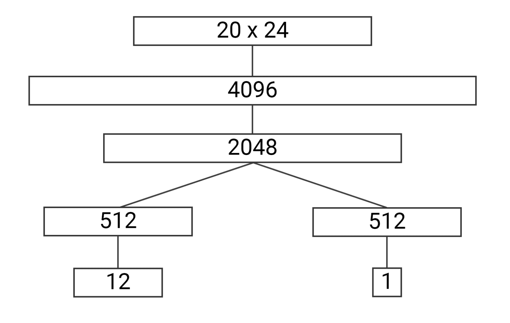

# 第二十一章：离散优化中的强化学习（RL）

深度强化学习（RL）的普遍看法是它主要用于玩游戏。考虑到历史上该领域的首次成功是在 2015 年由 DeepMind 在雅达利游戏套件上取得的（[`deepmind.com/research/dqn/`](https://deepmind.com/research/dqn/))，这并不令人惊讶。雅达利基准测试套件对于 RL 问题非常成功，直到现在，许多研究论文仍然用它来展示他们方法的效率。随着 RL 领域的发展，经典的 53 款雅达利游戏逐渐变得越来越不具挑战性（在撰写本文时，几乎所有游戏都已被超人级精度解决），研究人员正在转向更复杂的游戏，如《星际争霸》和《Dota 2》。

这种观点，尤其是在媒体中较为常见，是我在本书中试图加以平衡的。我通过将雅达利游戏与其他领域的实例结合起来，包括股票交易、自然语言处理（NLP）问题、网页导航自动化、连续控制、棋盘游戏和机器人技术，来对其进行补充。事实上，RL 非常灵活的马尔可夫决策过程（MDP）模型潜在地可以应用于各种领域；计算机游戏只是复杂决策的一种便捷且引人注目的示例。

在本章中，我们将探索 RL 应用中的一个新领域：离散优化（这是一门研究离散结构上的优化问题的数学分支），通过著名的魔方谜题来展示。我尝试提供对 UCI 研究员 McAleer 等人撰写的论文《无人工知识解决魔方》的详细描述[McA+18]。此外，我们还将介绍我对论文中所述方法的实现（该实现位于本书 GitHub 仓库的 Chapter21 目录中），并讨论改进该方法的方向。我将论文方法的描述与我版本中的代码片段结合起来，以通过具体实现来说明这些概念。

更具体地说，在本章中，我们将：

+   简要讨论离散优化的基础知识

+   逐步讲解 McAleer 等人[McA+18]应用 RL 方法解决魔方优化问题的过程

+   探讨我在尝试重现论文结果过程中所做的实验以及未来方法改进的方向

让我们从魔方和离散优化的一般概述开始。

# 魔方与离散优化

我相信你知道魔方是什么，因此我不会过多介绍这个谜题的通用描述（[`en.wikipedia.org/wiki/Rubik\%27s_Cube`](https://en.wikipedia.org/wiki/Rubik/))，而是专注于它与数学和计算机科学的联系。

如果没有明确说明，"魔方"指的是 3 × 3 × 3 经典的鲁比克魔方。基于原始的 3 × 3 × 3 谜题有很多变种，但它们仍然远不如经典版本流行。

尽管从机械原理和任务本身来看，魔方相对简单，但在所有通过旋转面实现的变换中，魔方却是一个相当棘手的物体。经过计算，总共通过旋转魔方可以到达约 4.33 ⋅ 10¹⁹个不同的状态。这些只是通过旋转魔方能到达的状态，而不需要拆解魔方；如果将魔方拆解后重新组装，最终可以获得多出 12 倍的状态，总数约为 5.19 ⋅ 10²⁰，但这些“额外”状态使得魔方在不拆解的情况下无法解决。

所有这些状态通过魔方面的旋转密切交织在一起。例如，如果我们在某个状态下将左侧顺时针旋转，则会到达一个状态，在该状态下，逆时针旋转同一面会取消变换的效果，并恢复到原始状态。

但是，如果我们连续三次进行左侧顺时针旋转，那么返回到原始状态的最短路径只需进行一次左侧顺时针旋转，而不是三次逆时针旋转（虽然逆时针旋转也是可能的，但并不是最优的）。由于魔方有 6 条边，每条边可以旋转 2 个方向，因此总共有 12 种可能的旋转。有时，半圈旋转（即两次连续的同向旋转）也被视为不同的旋转，但为了简便起见，我们将其视为魔方的两种不同变换。

在数学中，有几个领域研究这类对象。其中之一是抽象代数，这是数学中一个非常广泛的分支，研究带有运算的抽象对象集合。从这些角度来看，鲁比克魔方是一个相当复杂的群体（[`en.wikipedia.org/wiki/Group_theory`](https://en.wikipedia.org/wiki/Group_theory)），具有许多有趣的性质。

魔方不仅仅是状态和变换，它是一个谜题，主要目标是找到一个旋转序列，以解决魔方作为最终目标。这类问题通过组合优化进行研究，组合优化是应用数学和理论计算机科学的一个子领域。这个学科有很多具有高实际价值的著名问题，例如：

+   旅行商问题 ([`en.wikipedia.org/wiki/Travelling_salesman_problem`](https://en.wikipedia.org/wiki/Travelling_salesman_problem))：在图中找到最短的闭合路径

+   蛋白质折叠模拟 ([`en.wikipedia.org/wiki/Protein_folding`](https://en.wikipedia.org/wiki/Protein_folding))：寻找蛋白质的可能三维结构

+   资源分配：如何在消费者之间分配固定的资源集，以达到最佳目标

这些问题的共同点是状态空间巨大，单纯通过检查所有可能的组合来找到最佳解是不切实际的。我们的“玩具魔方问题”也属于同类问题，因为 4.33 ⋅ 10¹⁹ 的状态空间使得暴力破解方法非常不实用。

# 最优性与上帝之数

使得组合优化问题棘手的原因在于，我们并不是在寻找任何解法；我们实际上关注的是问题的最优解。那么，二者有什么区别呢？魔方发明之后，人们就知道如何达到目标状态（但 Ernő Rubik 花了大约一个月的时间才弄明白他自己发明的魔方的第一个解法，这应该是一次令人沮丧的经历）。如今，有很多不同的魔方解法或方案：初学者方法（逐层法）、Jessica Fridrich 方法（在速解者中非常流行）等。

所有这些方法的差异在于所需的步骤数。例如，一个非常简单的初学者方法需要大约 100 次旋转才能解出魔方，只需记住 5…7 种旋转序列。相比之下，目前的世界纪录是在 3.13 秒内解出魔方，这需要更少的步骤，但需要记住更多的旋转序列。Fridrich 方法的平均步数大约是 55 步，但你需要熟悉 120 种不同的旋转序列。当然，关键问题是：解决任何给定魔方状态的最短动作序列是什么？令人惊讶的是，魔方发明 50 年后，人类仍然不知道这个问题的完整答案。直到 2010 年，谷歌的研究人员才证明，解决任何魔方状态所需的最小步数是 20 步。这个数字也被称为上帝之数（不要与自然界中到处可见的“黄金比例”或“神圣比例”混淆）。当然，平均而言，最优解的步数更短，因为只有少数几个状态需要 20 步，而某个单一状态根本不需要任何步骤（即已解状态）。这个结果仅证明了最小步数；它并没有找到具体的解法。如何为任何给定的状态找到最优解仍然是一个悬而未决的问题。

# 魔方求解方法

在 McAleer 等人发表论文之前，解决魔方问题的研究方向主要有两个：

+   通过使用群论，可以显著减少需要检查的状态空间。使用这种方法的最流行的解决方案之一是 Kociemba 算法（[`en.wikipedia.org/wiki/Optimal_solutions_for_Rubik\%27s_Cube#Kociemba’s_algorithm`](https://en.wikipedia.org/wiki/Optimal_solutions_for_Rubik/))。

+   通过使用暴力搜索并辅以人工编写的启发式方法，我们可以将搜索引导至最有前景的方向。一个生动的例子是 Korf 的算法（[`en.wikipedia.org/wiki/Optimal_solutions_for_Rubik\%27s_Cube#Korf’s_algorithm`](https://en.wikipedia.org/wiki/Optimal_solutions_for_Rubik/))，它使用 A* 搜索和一个庞大的模式数据库来排除不良的方向。

McAleer 等人 [McA+18] 提出了第三种方法（称为自学迭代，或 ADI）：通过对大量随机打乱的魔方进行神经网络（NN）训练，可以得到一个策略，该策略会指引我们朝着解决状态前进。该训练不依赖于领域的先验知识；所需的唯一条件是魔方本身（不是物理魔方，而是其计算机模型）。这与前两种方法形成对比，后者需要大量的领域知识并付出人力将其实现为计算机代码。

这种方法与我们在前一章讨论的 AlphaGo Zero 方法有很多相似之处：我们需要一个环境模型，并使用蒙特卡洛树搜索（MCTS）来避免对完整状态空间的探索。

在随后的章节中，我们将详细介绍这一方法；我们将从数据表示开始。在我们的魔方问题中，有两个实体需要被编码：动作和状态。

## 动作

动作是我们可以从任何给定魔方状态执行的旋转，如前所述，我们总共有 12 个动作。对于每一面，我们有两个不同的动作，分别对应于该面的顺时针和逆时针旋转（90^∘ 或 −90^∘）。一个小但非常重要的细节是，旋转是从希望的面朝向你的位置执行的。对于前面来说，这一点显而易见，但对于后面来说，由于旋转的镜像特性，可能会产生混淆。

动作的名称取自我们旋转的魔方面：左、右、上、下、前和后。面名称的第一个字母被用来表示。例如，右侧顺时针旋转的动作命名为 R。逆时针旋转有不同的表示方法；有时用撇号（R′）、小写字母（r）或波浪号（R̃）来表示。前两种表示方法在计算机代码中不太实用，因此在我的实现中，我使用小写字母表示逆时针旋转。对于右侧，我们有两个动作：R 和 r；左侧也有两个动作：L 和 l，依此类推。

在我的代码中，动作空间是通过 Python 枚举在 libcube/cubes/cube3x3.py 文件中的 Action 类实现的，其中每个动作都映射为唯一的整数值：

```py
class Action(enum.Enum): 
    R = 0 
    L = 1 
    T = 2 
    D = 3 
    F = 4 
    B = 5 
    r = 6 
    l = 7 
    t = 8 
    d = 9 
    f = 10 
    b = 11
```

此外，我们描述了一个包含反向动作的字典：

```py
_inverse_action = { 
    Action.R: Action.r,   Action.r: Action.R, 
    Action.L: Action.l,   Action.l: Action.L, 
    Action.T: Action.t,   Action.t: Action.T, 
    Action.D: Action.d,   Action.d: Action.D, 
    Action.F: Action.f,   Action.f: Action.F, 
    Action.B: Action.b,   Action.b: Action.B, 
}
```

## 状态

状态是立方体上彩色贴纸的特定配置，正如之前讨论的那样，我们的状态空间非常大（4.33 ⋅ 10¹⁹ 种不同状态）。但是，状态的数量并不是我们面临的唯一复杂性；此外，在选择特定状态表示方式时，我们有不同的目标希望达成：

+   避免冗余：在极端情况下，我们可以仅通过记录每一面上每个贴纸的颜色来表示立方体的状态。但如果仅计算这种组合的数量，我们得到的是 6^(6⋅8) = 6⁴⁸ ≈ 2.25 ⋅ 10³⁷，这比我们立方体的状态空间大小要大得多，这意味着这种表示方式具有高度冗余；例如，它允许立方体的所有面都有相同的颜色（除了中心的小立方体）。如果你想知道我是如何得到 6^(6⋅8) 的，这很简单：我们有六个面，每个面有八个小立方体（我们不算中心立方体），所以我们总共有 48 个贴纸，每个贴纸可以涂成六种颜色之一。

+   内存效率：如你即将看到的，在训练过程中，尤其是在模型应用期间，我们将需要在计算机内存中保持大量不同的立方体状态，这可能会影响过程的性能。因此，我们希望表示方式尽可能紧凑。

+   变换的性能：另一方面，我们需要实现所有应用于状态的操作，这些操作需要快速执行。如果我们的表示方式在内存上非常紧凑（例如使用位编码），但每次旋转立方体的面时都需要进行冗长的解包过程，那么我们的训练可能会变得过于缓慢。

+   神经网络友好性：并不是每种数据表示方式都同样适合作为神经网络的输入。这不仅在我们的案例中成立，在机器学习中普遍如此。例如，在自然语言处理（NLP）中，常用词袋模型或词嵌入；在计算机视觉中，图像从 JPEG 解码为原始像素；随机森林则要求数据经过大量特征工程；等等。

在论文中，立方体的每个状态都表示为一个 20 × 24 的张量，采用 one-hot 编码。为了理解这是如何实现的，以及为什么它具有这种形状，让我们从论文中所示的图 21.1 开始：


图 21.1：我们需要在立方体上跟踪的贴纸被标记为较浅的颜色

在这里，浅色标记了我们需要追踪的块的贴纸；其他贴纸（以较深的颜色显示）是冗余的，无需追踪。如你所知，立方体由三种类型的块组成：8 个角块，每个有 3 个贴纸；12 个侧块，每个有 2 个贴纸；以及 6 个中心块，每个有 1 个贴纸。乍一看，可能不太明显，但中心块完全不需要追踪，因为它们不能改变相对位置，只能旋转。因此，关于中心块，我们只需要就立方体的对齐方式（立方体在空间中的方向）达成一致并保持一致。

在我的实现中，白色面始终在顶部，前面是红色，左面是绿色，依此类推。这样使得我们的状态具有旋转不变性，基本上意味着整个立方体的所有可能旋转被视为相同的状态。

由于中心块完全不被追踪，在图中，它们被标记为较深的颜色。那么剩下的块呢？显然，每种类型的块（角块或侧块）都有其独特的颜色组合。例如，我的方向（白色在顶部，红色在前面，依此类推）下，组装后的立方体中，左上角的角块正对我们，颜色是绿色、白色和红色。没有其他角块有这些颜色组合（如有疑问请检查）。侧块也是如此。

由于这个原因，要找到某个特定角块的位置，我们只需要知道其中一个贴纸的位置。选择哪个贴纸完全是任意的，但一旦选择了，就必须坚持下去。如前图所示，我们追踪来自顶部的八个贴纸，来自底部的八个贴纸，以及四个额外的侧面贴纸：两个在前面，两个在后面。这样我们就有了 20 个需要追踪的贴纸。

现在，让我们讨论一下张量维度中的 24 是怎么来的。总的来说，我们有 20 个不同的贴纸需要追踪，那么它们在哪些位置可能会出现，取决于立方体的变换？这取决于我们正在追踪的块的类型。我们从角块开始讲起。总共有八个角块，立方体的变换可以把它们重新排列成任何顺序。所以，任何特定的角块都可以出现在八个可能的角位置中。

此外，每个角块都可以旋转，所以我们的“绿色、白色和红色”角块可能有三种不同的方向：

+   白色在顶部，绿色在左侧，红色在前面

+   绿色在顶部，红色在左侧，白色在前面

+   红色在顶部，白色在左侧，绿色在前面

因此，为了准确指示角块的定位和方向，我们有 8 × 3 = 24 种不同的组合。对于 12 个边块，它们只有两个贴纸，因此只有两种可能的方向，这同样给我们提供了 24 种组合，但它们来自不同的计算：12 × 2 = 24。最后，我们有 20 个立方体小块需要跟踪，8 个角块和 12 个边块，每个小块都有 24 个可能的状态。

一种非常流行的将此类数据输入神经网络的方法是独热编码（one-hot encoding），即对象的具体位置为 1，其他位置填充为 0。这样我们最终得到的状态表示是一个形状为 20 × 24 的张量。

从冗余度的角度来看，这种表示法与总状态空间更加接近；可能的组合数量为 24²⁰ ≈ 4.02 ⋅ 10²⁷。它仍然大于立方体状态空间（可以说它大得多，因为 10⁸的因子非常大），但比编码每个贴纸的所有颜色要好。这种冗余来自于立方体变换的复杂特性；例如，不能仅旋转一个角块（或翻转一个边块），而使其他所有块保持不变。数学特性超出了本书的范围，但如果你有兴趣，我推荐亚历山大·弗雷（Alexander Frey）和大卫·辛格马斯特（David Singmaster）所著的《魔方数学手册》[FS20]。

你可能已经注意到，立方体状态的张量表示有一个显著的缺点：内存低效。实际上，通过将状态保持为 20 × 24 的浮点张量，我们使用了 4 × 20 × 24 = 1,920 字节的内存，这在训练过程中需要保持成千上万的状态以及在解立方体时需要保持百万个状态的情况下非常庞大（正如你稍后会了解的那样）。为了克服这个问题，在我的实现中，我使用了两种表示法：一种张量用于神经网络输入，另一种更紧凑的表示法则用于长期存储不同的状态。这种紧凑的状态被保存为一组列表，编码角块和边块的置换及其方向。这个表示法不仅更加节省内存（160 字节），而且在实现变换时也更为方便。

为了说明这一点，接下来是立方体 3 × 3 库 libcube/cubes/cube3x3.py 的部分内容，负责紧凑表示。

变量`initial_state`是立方体已解状态的编码。在其中，我们跟踪的角块和边块贴纸处于其原始位置，两个方向列表都设置为 0，表示立方体小块的初始方向：

```py
State = collections.namedtuple("State", field_names=[ 
    ’corner_pos’, ’side_pos’, ’corner_ort’, ’side_ort’]) 

initial_state = State(corner_pos=tuple(range(8)), side_pos=tuple(range(12)), 
                      corner_ort=tuple([0]*8), side_ort=tuple([0]*12))
```

立方体的变换有点复杂，包含了许多表格，记录了应用不同旋转后的立方体块重新排列。我不会把这段代码放在这里；如果你感兴趣，可以从 libcube/cubes/cube3x3.py 中的 transform(state, action) 函数开始。检查该代码的单元测试也可能会有所帮助。

除了动作、紧凑状态表示和变换外，模块 cube3x3.py 还包括一个将立方体状态的紧凑表示（作为名为 State 的元组）转换为张量形式的函数。这个功能由 encode_inplace() 方法提供。

另一个已实现的功能是通过应用 render() 函数将紧凑的状态渲染为人类友好的形式。这个功能对于调试立方体变换非常有用，但在训练代码中并未使用。

# 训练过程

现在你知道了如何将立方体的状态编码成 20 × 24 的张量，让我们来探索神经网络架构，理解它是如何训练的。

## 神经网络架构

图 21.2，来自 McAleer 等人的论文，展示了网络架构：



图 21.2：神经网络架构将观察（顶部）转化为动作和值（底部）

作为输入，它接受已经熟悉的立方体状态表示形式，作为一个 20 × 24 的张量，并输出两个结果：

+   策略是一个包含 12 个数字的向量，表示我们行动的概率分布。

+   值是一个标量，估计传递的状态的“好坏”。值的具体含义将在下一节中讨论。

在我的实现中，架构与论文中的完全一致，模型位于模块 libcube/model.py 中。在输入和输出之间，网络有多个全连接层，使用指数线性单元（ELU）激活函数，如论文中所讨论的：

```py
class Net(nn.Module): 
    def __init__(self, input_shape, actions_count): 
        super(Net, self).__init__() 

        self.input_size = int(np.prod(input_shape)) 
        self.body = nn.Sequential( 
            nn.Linear(self.input_size, 4096), 
            nn.ELU(), 
            nn.Linear(4096, 2048), 
            nn.ELU() 
        ) 
        self.policy = nn.Sequential( 
            nn.Linear(2048, 512), 
            nn.ELU(), 
            nn.Linear(512, actions_count) 
        ) 
        self.value = nn.Sequential( 
            nn.Linear(2048, 512), 
            nn.ELU(), 
            nn.Linear(512, 1) 
        ) 

    def forward(self, batch, value_only=False): 
        x = batch.view((-1, self.input_size)) 
        body_out = self.body(x) 
        value_out = self.value(body_out) 
        if value_only: 
            return value_out 
        policy_out = self.policy(body_out) 
        return policy_out, value_out
```

forward() 调用可以有两种模式：既可以获取策略和值，也可以在 value_only=True 时，仅获取值。这在只有值头部结果需要关注时可以节省一些计算。

## 训练

在这个网络中，策略告诉我们应该对状态应用什么变换，而值则估计状态的好坏。但是，大问题仍然存在：我们如何训练这个网络？

如前所述，论文中提出的训练方法称为自学迭代（ADI）。让我们来看看它的结构。我们从目标状态（已组装的立方体）开始，应用一系列预定义长度 N 的随机变换。这样我们就得到了一个包含 N 个状态的序列。

对于序列中的每个状态 s，我们执行以下过程：

1.  对 s 应用所有可能的变换（共 12 种）。

1.  将这 12 个状态传递给我们当前的神经网络，要求输出值。这为 s 的每个子状态提供了 12 个值。

1.  s 的目标值计算公式为 y[v[i]] = maxa+R(A(s,a)))，其中 A(s,a) 是对状态 s 执行动作 a 后的状态，R(s) 等于 1 如果 s 是目标状态，其他情况为 -1。

1.  s 的目标策略使用相同的公式进行计算，但我们取的是 argmax 而非 max：y[p[i]] = arg maxa + R(A(s,a)))。这意味着我们的目标策略将在子状态的最大值位置上为 1，在其他所有位置上为 0。

这个过程如图 21.3 所示，取自论文。生成了一个混乱序列，x[0],x[1],…x[N]，其中魔方 x[i] 被展开显示。对于这个状态 x[i]，我们通过应用前述公式，从展开状态中为策略头和值头生成目标。


图 21.3：训练数据生成

使用这个过程，我们可以生成任何我们需要的训练数据。

# 模型应用

好的，假设我们已经使用刚才描述的过程训练好了模型。我们应该如何使用它来解决打乱的魔方呢？从网络的结构上看，你可能会想出一个明显的，但并不成功的方法：

1.  将我们想要解决的魔方的当前状态输入模型。

1.  从策略头获取最大动作（或从结果分布中采样）。

1.  对魔方执行该动作。

1.  重复该过程，直到达到已解决的状态。

理论上，这种方法应该可行，但在实践中，它存在一个严重的问题：它不可行！主要原因在于我们的模型质量。由于状态空间的庞大和神经网络的性质，我们无法训练出一个神经网络，在任何输入状态下都能准确地返回最优动作。我们的模型并不是直接告诉我们如何做才能得到已解决的状态，而是展示了我们应该探索的有前景的方向。这些方向可能会把我们带得更接近解决方案，但有时也可能会误导我们，因为这个特定状态在训练过程中从未见过。别忘了，状态空间有 4.33 ⋅ 10¹⁹ 个，即使使用每秒数十万个状态的图形处理单元（GPU）训练速度，经过一个月的训练，我们也只能看到状态空间中的一小部分，大约为 0.0000005%。因此，必须使用更复杂的方法。

有一类非常流行的方法，称为 MCTS，其中一种方法在上一章中已有介绍。这些方法有很多变种，但总体思路可以通过与众所周知的暴力搜索方法进行比较来描述，比如广度优先搜索（BFS）或深度优先搜索（DFS）。在 BFS 和 DFS 中，我们通过尝试所有可能的动作并探索从这些动作得到的所有状态，来对我们的状态空间进行穷举搜索。这种行为与之前描述的过程正好相反（当我们有某种东西可以告诉我们在每个状态下应该去哪里时）。但 MCTS 在这些极端之间提供了一种选择：我们想进行搜索，并且有一些关于我们应该去哪里的信息，但在某些情况下，这些信息可能不可靠、嘈杂，甚至完全错误。然而，有时这些信息能够帮助我们发现可能加速搜索过程的有前景的方向。

正如我提到的，MCTS 是一系列方法，它们在具体细节和特点上有所不同。在论文中，使用了一种叫做上置信界 1（Upper Confidence Bound 1）的方法。这种方法作用于树形结构，其中节点代表状态，边表示连接这些状态的动作。在大多数情况下，整个树是巨大的，因此我们不能尝试构建整个树，而只能构建其中的一小部分。

一开始，我们从一个只包含一个节点的树开始，这个节点就是我们当前的状态。在每一步的 MCTS 中，我们沿着树向下走，探索树中的某条路径，可能会遇到两种选择：

+   我们当前的节点是叶节点（我们还没有探索这个方向）

+   我们当前的节点位于树的中间，并且有子节点。

对于叶节点，我们通过对状态应用所有可能的动作来“扩展”它。所有结果状态都会被检查是否是目标状态（如果已找到已解的魔方的目标状态，我们的搜索就结束了）。叶节点状态会被传递到模型，并且来自值头和策略头的输出会被存储以供后续使用。

如果节点不是叶节点，我们就知道它的子节点（可达的状态），并且我们从网络中获得了值和策略的输出。因此，我们需要做出决定，选择应该跟随哪条路径（换句话说，选择哪一个动作更有可能被探索）。这个决策并非易事，这就是我们在本书中先前讲过的探索与利用问题。一方面，来自网络的策略告诉我们该怎么做。但如果它是错误的呢？这个问题可以通过探索周围的状态来解决，但我们不希望总是进行探索（因为状态空间是巨大的）。因此，我们应该保持平衡，这直接影响到搜索过程的性能和结果。

为了解决这个问题，对于每个状态，我们保持一个计数器，记录每个可能的动作（共有 12 个），每当该动作在搜索过程中被选择时，计数器会增加。为了决定跟随哪个动作，我们使用这个计数器；一个动作被采取得越多，它在未来被选择的可能性就越小。

此外，模型返回的值也被用于这个决策过程中。这个值作为当前状态的值与其子状态的最大值进行跟踪。这使得最有前景的路径（从模型的角度来看）能够从父状态中被看到。

总结来说，从非叶节点的树中选择的动作是通过以下公式来选择的：

![π (a |s) = P[At = a|St = s] ](img/eq75.png) ![π (a |s) = P[At = a|St = s] ](img/eq76.png)

这里，N[s[t]](a)表示在状态 s[t]中选择动作 a 的次数。P[s[t]](a)是模型为状态 s[t]返回的策略，W[s[t]](a)是模型对于状态 s[t]在分支 a 下所有子状态的最大值。

这个过程会一直重复，直到找到解决方案或耗尽时间预算。为了加速这一过程，MCTS 通常以并行方式实现，由多个线程执行多个搜索。在这种情况下，可能会从 A[t]中减去一些额外的损失，以防止多个线程探索树的相同路径。

解决这个过程难题的最后一部分是，一旦我们到达目标状态，如何从 MCTS 树中获取解决方案。论文的作者尝试了两种方法：

+   初步方法：一旦我们遇到目标状态，我们就使用从根状态到目标状态的路径作为解决方案。

+   BFS 方法：在达到目标状态后，在 MCTS 树上执行 BFS，以找到从根节点到该状态的最短路径。

根据作者的说法，第二种方法比初步方法找到的解决方案更短，这并不令人惊讶，因为 MCTS 过程的随机性可能会在解决路径中引入循环。

# 结果

论文中发布的最终结果相当令人印象深刻。在一个配有三块 GPU 的机器上训练了 44 小时后，网络学会了解决魔方，达到了与人类设计的求解器相同的水平（有时甚至更好）。最终模型与前面提到的两种求解器进行了比较：Kociemba 两阶段求解器和 Korf。论文中提出的方法名为 DeepCube。

为了比较效率，所有方法使用了 640 个随机打乱的魔方。打乱的深度为 1,000 步。解决方案的时间限制为一小时，DeepCube 和 Kociemba 求解器都能在该时间限制内解决所有魔方。Kociemba 求解器非常快速，其中位解决时间仅为一秒，但由于该方法中硬编码规则的实现，它的解决方案并不总是最短的。

DeepCube 方法花费了更多的时间，中位数时间大约为 10 分钟，但它能够与 Kociemba 解法的解答长度相匹配，或者在 55% 的情况下表现得更好。从个人角度来看，55% 的表现并不足以证明神经网络在性能上有显著优势，但至少它们并不逊色。

在图 21.4 中，展示了所有求解器的解答长度分布。正如你所看到的，由于 Korf 求解器解决魔方所需的时间过长，它没有在 1,000 次混乱测试中进行比较。为了将 DeepCube 的表现与 Korf 求解器进行比较，创建了一个更简单的 15 步混乱测试集：


图 21.4：不同求解器找到的解答长度

# 代码大纲

现在你已经了解了一些背景，让我们切换到代码部分，代码位于书籍 GitHub 仓库的 Chapter21 目录中。在本节中，我将简要概述我的实现和关键设计决策，但在此之前，我必须强调关于代码的重要细节，以便设定正确的期望：

+   我不是一个研究人员，所以这段代码的最初目标只是重新实现论文中的方法。不幸的是，论文中关于超参数的细节非常少，所以我不得不做很多实验，尽管如此，我的结果与论文中发布的结果差异很大。

+   与此同时，我尽量将所有内容实现得更通用，以简化后续的实验。例如，魔方状态和变换的具体细节被抽象化，这使得我们可以通过添加新模块来实现更多类似于 3×3 魔方的谜题。在我的代码中，已实现了 2×2 和 3×3 魔方，但任何具有固定可预测动作集合的完全可观察环境都可以被实现并进行实验。具体细节将在本节稍后（在“魔方环境”小节中）给出。

+   代码的清晰性和简洁性被置于性能之前。当然，当有机会在不引入过多开销的情况下提高性能时，我会这么做。例如，仅仅通过将混乱魔方的生成和前向网络传递分开，训练过程的速度提高了五倍。但如果性能要求将一切重构为多 GPU 和多线程模式，我宁愿保持简单。一个很明确的例子是 MCTS 过程，通常会实现为多线程代码共享树结构。它通常可以加速数倍，但需要在进程之间进行复杂的同步。因此，我的 MCTS 版本是串行的，仅对批量搜索做了微小的优化。

总体而言，代码包含以下部分：

1.  魔方环境，定义了观察空间、可能的动作以及状态到网络的准确表示。这个部分在 libcube/cubes 模块中实现。

1.  神经网络部分，描述了我们将要训练的模型、训练样本的生成和训练循环。它包括训练工具 train.py 和模块 libcube/model.py。

1.  立方体的求解器或搜索过程，包括求解器（solver.py）工具和实现 MCTS 的 libcube/mcts.py 模块。

1.  各种工具被用来将其他部分粘合在一起，如包含超参数的配置文件和用于生成立方体问题集的工具。

## 立方体环境

正如你已经看到的，组合优化问题是相当庞大和多样的。即使是狭义的立方体类谜题，也包括了几十种变体。最流行的包括 2 × 2 × 2、3 × 3 × 3 和 4 × 4 × 4 的魔方，Square-1 和 Pyraminx（[`ruwix.com/twisty-puzzles/`](https://ruwix.com/twisty-puzzles/)）。与此同时，本文中提出的方法是相当通用的，不依赖于先验领域知识、动作数量和状态空间大小。对问题的关键假设包括：

+   环境的状态需要是完全可观察的，观察结果需要能够区分不同的状态。这对魔方来说是成立的，因为我们可以看到所有面的状态，但对于大多数扑克牌变体来说，这不成立，例如我们看不到对手的牌。

+   动作的数量需要是离散且有限的。我们可以对魔方采取的动作数量是有限的，但如果我们的动作空间是“将方向盘旋转角度 α ∈ [−120^∘…120^∘]”，那么我们面对的将是一个不同的问题领域，正如你在涉及连续控制问题的章节中已经看到的那样。

+   我们需要有一个可靠的环境模型；换句话说，我们必须能够回答类似“将动作 a[i] 应用于状态 s[j] 后会得到什么结果？”这样的问题。如果没有这个，ADI 和 MCTS 都无法应用。这是一个强要求，对于大多数问题，我们没有这样的模型，或者其输出是相当嘈杂的。另一方面，在像国际象棋或围棋这样的游戏中，我们有这样的模型：游戏规则。

    与此同时，正如我们在上一章（关于 MuZero 方法）中看到的，你可以使用神经网络来逼近模型，但代价是性能会降低。

+   此外，我们的领域是确定性的，因为对相同的状态应用相同的动作总是会得到相同的最终状态。反例可能是西洋双陆棋，每回合玩家投掷骰子来决定他们可能进行的步数。很可能，这种方法也可以推广到这种情况。

为了简化方法在与 3 × 3 立方体不同领域中的应用，所有具体的环境细节被移到单独的模块中，并通过抽象接口 CubeEnv 与其余代码进行通信，该接口在 libcube/cubes/_env.py 模块中进行了描述。让我们来看看它的接口。

如下代码片段所示，类的构造函数接受一组参数：

+   环境的名称。

+   环境状态的类型。

+   魔方的初始（已组装）状态实例。

+   检查特定状态是否表示已组装魔方的谓词函数。对于 3×3 魔方来说，这可能是多余的，因为我们可以直接将其与传递给`initial_state`参数的初始状态进行比较；但对于 2×2 和 4×4 等魔方，可能有多个最终状态，因此需要单独的谓词函数来处理这种情况。

+   可以应用于状态的动作枚举。

+   转换函数，接受状态和动作，并返回结果状态。

+   逆函数，将每个动作映射到其逆操作。

+   渲染函数，用于以人类可读的形式表示状态。

+   编码状态张量的形状。

+   将紧凑状态表示编码为适合神经网络的形式的函数。

```py
class CubeEnv: 
    def __init__(self, name, state_type, initial_state, is_goal_pred, 
                 action_enum, transform_func, inverse_action_func, 
                 render_func, encoded_shape, encode_func): 
        self.name = name 
        self._state_type = state_type 
        self.initial_state = initial_state 
        self._is_goal_pred = is_goal_pred 
        self.action_enum = action_enum 
        self._transform_func = transform_func 
        self._inverse_action_func = inverse_action_func 
        self._render_func = render_func 
        self.encoded_shape = encoded_shape 
        self._encode_func = encode_func
```

如你所见，魔方环境与 Gym API 不兼容；我故意使用这个例子来说明如何超越 Gym 的限制。

CubeEnv API 中的一些方法仅仅是构造函数传递的函数的包装器。这允许新的环境在一个单独的模块中实现，注册到环境注册表中，并为其余代码提供一致的接口：

```py
 def __repr__(self): 
        return "CubeEnv(%r)" % self.name 

    def is_goal(self, state): 
        assert isinstance(state, self._state_type) 
        return self._is_goal_pred(state) 

    def transform(self, state, action): 
        assert isinstance(state, self._state_type) 
        assert isinstance(action, self.action_enum) 
        return self._transform_func(state, action) 

    def inverse_action(self, action): 
        return self._inverse_action_func(action) 

    def render(self, state): 
        assert isinstance(state, self._state_type) 
        return self._render_func(state) 

    def encode_inplace(self, target, state): 
        assert isinstance(state, self._state_type) 
        return self._encode_func(target, state)
```

类中的所有其他方法提供基于这些原始操作的扩展统一功能。

方法`sample_action()`提供了随机选择一个动作的功能。如果传递了`prev_action`参数，我们会排除逆向动作，从而避免生成短循环，例如 R →r 或 L →l：

```py
 def sample_action(self, prev_action=None): 
        while True: 
            res = self.action_enum(random.randrange(len(self.action_enum))) 
            if prev_action is None or self.inverse_action(res) != prev_action: 
                return res
```

方法`scramble()`将一系列动作（作为参数传递）应用于魔方的初始状态，并返回最终状态：

```py
 def scramble(self, actions): 
        s = self.initial_state 
        for action in actions: 
            s = self.transform(s, action) 
        return s
```

方法`scramble_cube()`提供了随机打乱魔方的功能，并返回所有中间状态。如果`return_inverse`参数为 False，函数返回包含每一步打乱过程的(depth, state)元组列表。如果参数为 True，它返回一个包含三个值的元组：(depth, state, inv_action)，这些值在某些情况下是必需的：

```py
 def scramble_cube(self, scrambles_count, return_inverse=False, include_initial=False): 
        assert isinstance(scrambles_count, int) 
        assert scrambles_count > 0 

        state = self.initial_state 
        result = [] 
        if include_initial: 
            assert not return_inverse 
            result.append((1, state)) 
        prev_action = None 
        for depth in range(scrambles_count): 
            action = self.sample_action(prev_action=prev_action) 
            state = self.transform(state, action) 
            prev_action = action 
            if return_inverse: 
                inv_action = self.inverse_action(action) 
                res = (depth+1, state, inv_action) 
            else: 
                res = (depth+1, state) 
            result.append(res) 
        return result
```

方法`explore_states()`实现了 ADI 的功能，并对给定的魔方状态应用所有可能的动作。返回值是一个元组，其中第一个列表包含扩展状态，第二个列表包含标记这些状态是否为目标状态的标志：

```py
 def explore_state(self, state): 
        res_states, res_flags = [], [] 
        for action in self.action_enum: 
            new_state = self.transform(state, action) 
            is_init = self.is_goal(new_state) 
            res_states.append(new_state) 
            res_flags.append(is_init) 
        return res_states, res_flags
```

通过这种通用功能，类似的环境可以被实现并轻松地插入到现有的训练和测试方法中，只需要非常少的样板代码。作为示例，我提供了我在实验中使用的 2 × 2 × 2 立方体和 3 × 3 × 3 立方体。它们的内部实现位于 libcube/cubes/cube2x2.py 和 libcube/cubes/cube3x3.py，你可以将它们作为基础来实现你自己的此类环境。每个环境需要通过创建 CubeEnv 类的实例并将该实例传递给 libcube/cubes/_env.py 中定义的 register() 函数来注册自己。以下是来自 cube2x2.py 模块的相关代码：

```py
_env.register(_env.CubeEnv(name="cube2x2", state_type=State, initial_state=initial_state, 
                           is_goal_pred=is_initial, action_enum=Action, 
                           transform_func=transform, inverse_action_func=inverse_action, 
                           render_func=render, encoded_shape=encoded_shape, 
                           encode_func=encode_inplace))
```

完成此步骤后，可以通过使用 `libcube.cubes.get()` 方法来获取立方体环境，该方法以环境名称作为参数。其余的代码仅使用 CubeEnv 类的公共接口，这使得代码与立方体类型无关，并简化了可扩展性。

## 训练

训练过程在工具 train.py 和模块 libcube/model.py 中实现，它是对论文中描述的训练过程的直接实现，有一个区别：该代码支持两种计算网络值头目标值的方法。方法之一与论文中描述的完全相同，另一种是我的修改，我将在后续部分详细解释。

为了简化实验并使结果可复现，所有训练的参数都在单独的 .ini 文件中指定，该文件提供了以下训练选项：

+   将要使用的环境名称；目前，cube2x2 和 cube3x3 可用。

+   运行的名称，在 TensorBoard 名称和目录中用于保存模型。

+   在 ADI 中将使用哪种目标值计算方法。我实现了两种方法：一种是论文中描述的，另一种是我的修改方法，从我的实验来看，这种方法具有更稳定的收敛性。

+   训练参数：批量大小、CUDA 使用、学习率、学习率衰减等。

你可以在仓库的 ini 文件夹中找到我的实验示例。在训练过程中，参数的 TensorBoard 指标会被写入 runs 文件夹。具有最佳损失值的模型会保存在 saves 目录中。

为了让你了解配置文件的样子，以下是 ini/cube2x2-paper-d200.ini，它定义了一个使用论文中的值计算方法和 200 步混合的 2 × 2 立方体实验：

```py
[general] 
cube_type=cube2x2 
run_name=paper 

[train] 
cuda=True 
lr=1e-5 
batch_size=10000 
scramble_depth=200 
report_batches=10 
checkpoint_batches=100 
lr_decay=True 
lr_decay_gamma=0.95 
lr_decay_batches=1000
```

要开始训练，你需要将 .ini 文件传递给 train.py 工具；例如，以下是如何使用前述 .ini 文件来训练模型：

```py
$ ./train.py -i ini/cube2x2-paper-d200.ini -n t1
```

额外的参数 -n 用于指定运行的名称，该名称将与 .ini 文件中的名称结合，作为 TensorBoard 系列的名称。

## 搜索过程

训练的结果是一个包含网络权重的模型文件。该文件可以用于使用 MCTS 求解魔方，MCTS 实现位于工具 solver.py 和模块 libcube/mcts.py 中。

求解工具非常灵活，可以在多种模式下使用：

1.  通过传递 -p 选项来解决给定的一个打乱的魔方，作为逗号分隔的动作索引列表。例如，-p 1,6,1 表示通过应用第二个动作、然后第七个动作，最后再次应用第二个动作来打乱魔方。动作的具体含义依赖于环境，通过 -e 选项传递。你可以在魔方环境模块中找到动作及其索引。例如，2×2 魔方上，动作 1,6,1 表示 L → R′ → L 的变换。

1.  从文本文件中读取排列（每行一个魔方），并解决它们。文件名通过 -i 选项传递。文件夹 cubes_tests 中有几个示例问题。你可以使用 gen_cubes.py 工具生成自己的随机问题集，该工具允许你设置随机种子、打乱深度以及其他选项。

1.  生成一个随机的打乱，给定的深度并解决它。

1.  通过增加复杂度（打乱深度）运行一系列测试，解决问题，并写入包含结果的 CSV 文件。通过传递 -o 选项启用此模式，它对于评估训练模型的质量非常有用，但完成这些操作可能需要大量时间。可选地，可以生成带有这些测试结果的图表。

在所有情况下，你需要通过 -e 选项传递环境名称，并通过 -m 选项传递模型的权重文件。此外，还有其他参数，允许你调整 MCTS 选项以及时间或搜索步数的限制。你可以在 solver.py 的代码中找到这些选项的名称。

# 实验结果

不幸的是，论文没有提供关于该方法的许多重要细节，如训练超参数、训练过程中魔方被打乱的深度以及获得的收敛性。为了填补这些空白，我尝试了不同的超参数值（.ini 文件可在 GitHub 仓库中找到），但我的结果与论文中发布的结果差异很大。我观察到，原始方法的训练收敛性非常不稳定。即使使用较小的学习率和较大的批量大小，训练最终仍会发散，值损失成分会呈指数增长。图 21.5 和图 21.6 展示了这种行为的例子（来自 2×2 环境）：


图 21.5：在论文方法训练期间，值头预测的值


图 21.6：论文方法典型运行中的策略损失（左）和值损失（右）

在进行多次实验后，我得出结论，这种行为是由于方法中提出了错误的值目标。实际上，在公式 `y[v[i]] = maxa + R(A(s,a)))` 中，网络返回的值 `vs` 总是加到实际奖励 `R(s)` 上，即使是目标状态。这样，网络返回的实际值可能是任何值：−100、10⁶，或者 3.1415。这对于神经网络训练来说并不是一个理想的情况，尤其是当使用均方误差（MSE）目标时。

为了检查这一点，我通过为目标状态分配一个 0 目标，修改了目标值计算的方法：

![π (a |s) = P[At = a|St = s] ](img/eq77.png)

可以通过在 .ini 文件中指定参数 `value_targets_method` 为 `zero_goal_value` 来启用这个目标，而不是默认的 `value_targets_method=paper`。

通过这个简单的修改，训练过程更快地收敛到了网络值头返回的稳定值。这种收敛的一个例子展示在图 21.7 和图 21.8 中：


图 21.7：训练期间值头预测的值


图 21.8：修改值计算后，策略损失（左）和值损失（右）

## 2 × 2 立方体

在论文中，作者报告了在一台配有三块 Titan Xp GPU 的机器上训练了 44 小时。在训练过程中，他们的模型查看了 80 亿个立方体状态。这些数字对应于训练速度 50,000 立方体/秒。我的实现使用单个 GTX 1080 Ti 显示为 15,000 立方体/秒，速度相当。因此，要在单个 GPU 上重复训练过程，我们需要等待近六天，这对于实验和超参数调优来说并不实用。

为了克服这一点，我实现了一个简单得多的 2 × 2 立方体环境，训练只需要一两个小时。为了重现我的训练，仓库中有两个 .ini 文件：

+   ini/cube2x2-paper-d200.ini：使用了论文中描述的值目标方法

+   ini/cube2x2-zero-goal-d200.ini: 目标值被设置为 0，用于目标状态

两种配置都使用了 10k 状态的批次和 200 的打乱深度，训练参数相同。训练结束后，使用这两种配置分别生成了两个模型：

+   论文方法：损失 0.032572

+   零目标方法：损失 0.012226

为了进行公平的比较，我为深度 1…50（共 1000 个测试立方体）生成了 20 个测试打乱，保存在 `cubes_test/3ed` 中，并在每种方法生成的最佳模型上运行了 `solver.py` 工具。对于每个测试打乱，搜索的限制被设置为 30,000。该工具生成了 CSV 文件（保存在 `csvs/3ed` 中），其中包含每个测试结果的详细信息。

我的实验表明，论文中描述的模型能够解决 55%的测试魔方，而带零目标修改的模型解决了 100%。两种模型在不同混乱深度下的结果如图 21.9 所示。在左图中，显示了解决魔方的比例。在右图中，显示了每个混乱深度所需的平均 MCTS 搜索步数。正如你所见，修改版本在找到解时需要显著（3 倍至 5 倍）更少的 MCTS 搜索次数，因此学到的策略更好。


图 21.9：已解 2 × 2 魔方的比例（左）和不同混乱深度下需要的平均 MCTS 搜索次数

最后，让我们检查一下找到的解的长度。在图 21.10 中，绘制了天真的方法和 BFS 解的长度。从这些图中可以看出，天真的解比 BFS 找到的解长得多（长了 10 倍）。这样的差异可能是未调优 MCTS 参数的迹象，这些参数是可以改进的。在天真的解中，零目标找到的解更短（这可能再次表明一个更好的策略）。


图 21.10：天真方法（左）和 BFS 方法（右）生成解法的比较

## 3 × 3 魔方

3 × 3 魔方模型的训练要重得多；我们这里仅仅是刚刚触及表面。但我有限的实验表明，零目标修改训练方法大大提高了训练稳定性和最终模型质量。训练大约需要 20 小时，因此进行大量实验需要时间和耐心。

我的结果没有论文中报告的那样亮眼：我能够获得的最佳模型可以解决最多**12…15**深度的魔方混乱问题，但在更复杂的问题上总是失败。可能，利用更多的中央处理单元（CPU）核心和并行 MCTS，这些数字可以得到改进。为了获取数据，搜索过程限制为 100k 步，并且每个混乱深度生成了五个随机混乱（可在 repo 中的 cubes_tests/3ed 找到）。但再次强调，修改版本显示出了更好的结果——使用论文方法训练的模型只能解决混乱深度为 9 的问题，而修改版本能够达到 13 的深度。

图 21.11 显示了论文中提出的方法和带零值目标的修改版本的解法率比较（左图）。图的右侧显示了平均 MCTS 搜索次数。


图 21.11：两种方法解决的 3 × 3 魔方比例（左）和平均 MCTS 搜索次数

图 21.12 显示了找到的最优解的长度。如前所述，天真搜索产生的解比 BFS 优化后的解长。BFS 的解长几乎完美地与混乱深度对齐：


图 21.12：3 × 3 魔方的朴素（左）与广度优先搜索（右）解法长度对比

理论上，在深度达到 20 后，它应该会饱和（因为“神数”是 20），但我的版本无法解决任何打乱深度超过 13 的魔方，因此很难判断。

# 进一步的改进和实验

有许多方向和方法可以尝试：

+   更多输入和网络工程：魔方是一个复杂的物体，因此简单的前馈神经网络可能不是最佳模型。可能，网络可以从卷积中大大受益。

+   训练中的振荡和不稳定性可能是强化学习中常见的步骤间相关性问题的信号。通常的方法是目标网络，我们使用旧版本的网络来获取自举值。

+   优先重放缓冲区可能有助于提高训练速度。

+   我的实验显示，样本的加权（与打乱深度成反比）有助于获得一个更好的策略，能够解决稍微打乱的魔方，但可能会减慢对更深状态的学习。可能，随着训练的进行，这种加权可以做成自适应的，使得它在后期训练阶段不那么激进。

+   可以将熵损失加入训练中，以规范化我们的策略。

+   2×2 立方体模型没有考虑到立方体没有中央小方块这一事实，因此整个立方体可以旋转。对于 2 × 2 立方体来说，这可能并不十分重要，因为状态空间较小，但对于 4 × 4 立方体来说，相同的观察将变得至关重要。

+   需要更多实验以获得更好的训练和蒙特卡罗树搜索（MCTS）参数。

# 摘要

在这一章中，我们讨论了离散优化问题——优化领域的一个子领域，处理像图或集合这样的离散结构。我们通过使用魔方这一众所周知但仍具挑战性的问题来检验强化学习的适用性。但总体来说，这一话题远比拼图问题广泛——同样的方法可以用于优化日程安排、最优路径规划和其他实际问题。

在本书的最后一章，我们将讨论强化学习中的多智能体问题。
