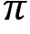
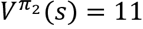
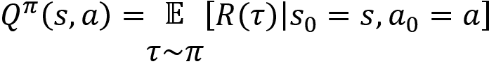
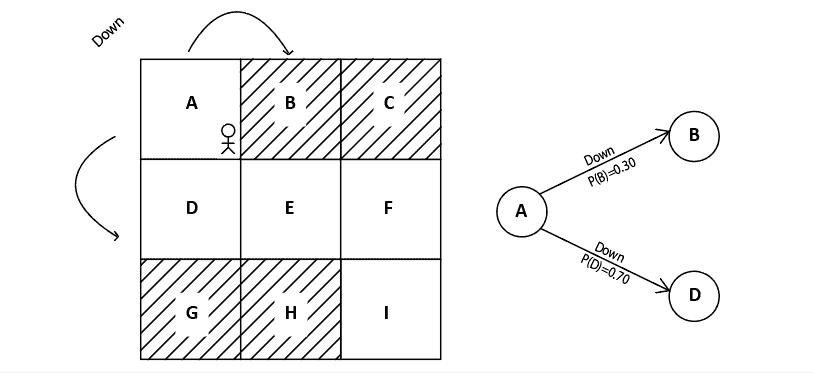

# 第一章：强化学习的基本原理

**强化学习**（**RL**）是**机器学习**（**ML**）的一个领域。与其他机器学习范式（如监督学习和无监督学习）不同，强化学习通过与环境互动，以试验和错误的方式进行工作。

强化学习是人工智能领域最活跃的研究方向之一，被认为它将使我们更接近实现人工通用智能。强化学习在过去几年中迅速发展，应用范围广泛，从构建推荐系统到自动驾驶汽车都有涉及。这个发展迅速的主要原因是深度强化学习的出现，它是深度学习与强化学习的结合。随着新型强化学习算法和库的涌现，强化学习显然是机器学习领域最具前景的方向之一。

在本章中，我们将通过探讨强化学习中的几个重要且基本的概念，建立强化学习的坚实基础。

本章将涵盖以下内容：

+   强化学习的关键元素

+   强化学习的基本概念

+   强化学习算法

+   强化学习与其他机器学习范式的区别

+   马尔可夫决策过程

+   强化学习的基本概念

+   强化学习的应用

+   强化学习术语

我们将从定义 *强化学习的关键元素* 开始这一章节。这将有助于解释 *强化学习的基本概念*。

# 强化学习的关键元素

让我们先来理解强化学习中的一些关键元素。

## 智能体

智能体是一个学习做出智能决策的软件程序。我们可以说智能体是强化学习环境中的学习者。例如，棋手可以视为一个智能体，因为他学习如何做出最佳的棋步（决策）以赢得比赛。同样，超级马里奥游戏中的马里奥也可以被视为智能体，因为马里奥在游戏中探索并学习如何做出最佳的行动。

## 环境

环境是智能体的世界。智能体存在于环境中。例如，在我们的棋局示例中，棋盘就称为环境，因为棋手（智能体）在棋盘（环境）内学习如何下棋。同样，在超级马里奥游戏中，马里奥的世界被称为环境。

## 状态与动作

状态是智能体能够处于的环境中的某个位置或时刻。我们了解到，智能体始终存在于环境中，并且环境中有许多位置，智能体可以停留在这些位置上，这些位置被称为状态。例如，在我们的棋局示例中，棋盘上的每个位置都称为状态。状态通常用 `s` 来表示。

智能体通过与环境互动，从一个状态移动到另一个状态，执行一个动作。在棋局环境中，动作是玩家（智能体）执行的棋步。动作通常用 `a` 来表示。

## 奖励

我们学到，代理者通过执行动作与环境交互，并从一个状态移动到另一个状态。根据动作，代理者会得到一个奖励。奖励只是一个数值，比如，执行一个好的动作得到+1，执行一个坏的动作得到-1。我们如何判断一个动作是好还是坏？

在我们的象棋游戏例子中，如果代理者走了一步吃掉对手的棋子，那么这被认为是一个好动作，代理者会得到积极奖励。同样地，如果代理者的一步棋导致对手吃掉代理者的棋子，那么这被认为是一个坏动作，代理者会得到负面奖励。奖励用`r`来表示。

# 强化学习的基本思想

让我们从一个类比开始。假设我们正在教一只狗（代理者）接住一个球。我们不是明确地教狗去接球，而是只是把球扔出去，每次狗接住球时我们给它一块饼干（奖励）。如果狗没有接住球，我们就不给它饼干。因此，狗将会找出是哪个动作让它得到了饼干并重复那个动作。这样，狗就会理解接住球让它得到了饼干，并会尝试重复接住球。通过这种方式，狗将学会接住球，并且会努力最大化它可以得到的饼干数量。

类似地，在强化学习设置中，我们不会教代理者要做什么或如何做；相反，我们会为代理者的每个动作给予奖励。当代理者执行一个好的动作时，我们会给予积极奖励，这样代理者就能理解它已经执行了一个好的动作，并会重复这个动作。如果代理者执行的动作是坏的，那么我们会给予负面奖励，这样代理者就能理解它执行了一个坏的动作，并且不会重复这个动作。

因此，强化学习可以被视为一个试错学习过程，代理者尝试不同的动作并学习到给予积极奖励的好动作。

在狗的类比中，狗代表着代理者，当狗接住球时给它一块饼干是积极奖励，不给饼干则是负面奖励。因此，狗（代理者）探索不同的动作，即接住球和不接住球，并且理解接住球是一个好的动作，因为这会给狗带来积极奖励（得到一块饼干）。

让我们通过一个更简单的例子进一步探讨强化学习的概念。假设我们想教一个机器人（代理者）在不撞到山的情况下行走，如*图 1.1* 所示：

图 1.1: 机器人行走

我们不会明确教机器人避免朝着山的方向走。相反，如果机器人撞到山并被卡住，我们会给机器人一个负奖励，例如-1。这样，机器人就能明白撞到山是错误的行为，它将不会再重复这一行为：

图 1.2：机器人撞到山脉

同样，当机器人朝着正确的方向走且没有撞到山时，我们会给机器人一个正奖励，例如+1。这样，机器人就会明白不撞到山是一个好的动作，它将会重复这一动作：

图 1.3：机器人避开山脉

因此，在强化学习的环境中，智能体探索不同的动作，并根据获得的奖励学习最佳动作。

现在我们对强化学习的基本原理有了一个大致的了解，接下来的章节中，我们将进一步深入，学习强化学习中涉及的重要概念。

# 强化学习算法

一个典型的强化学习算法的步骤如下：

1.  首先，智能体通过执行一个动作与环境进行交互。

1.  通过执行一个动作，智能体从一个状态转移到另一个状态。

1.  然后，智能体会根据它所执行的动作获得一个奖励。

1.  基于奖励，智能体将理解该行为是好是坏。

1.  如果某个动作是好的，也就是说，智能体收到了正奖励，那么智能体会倾向于执行该动作；否则，智能体会尝试其他动作，寻找能获得正奖励的行动。

强化学习（RL）基本上是一个试错学习过程。现在，让我们回顾一下我们的国际象棋游戏示例。智能体（软件程序）就是下棋的玩家。因此，智能体通过执行一个动作（走棋）与环境（棋盘）进行交互。如果智能体因为某个动作获得正奖励，那么它会倾向于执行该动作；否则，它会寻找其他能够获得正奖励的动作。

最终，智能体的目标是最大化它所获得的奖励。如果智能体得到好的奖励，那就意味着它做出了好的动作。如果智能体做出了好的动作，那就意味着它能够赢得比赛。因此，智能体通过最大化奖励来学习如何赢得比赛。

## 网格世界中的强化学习智能体

让我们通过另一个简单的例子来进一步巩固对强化学习的理解。考虑以下的网格世界环境：

图 1.4：网格世界环境

环境中的位置`A`到`I`被称为环境的状态。智能体的目标是从状态`A`出发，达到状态`I`，并且不经过阴影状态（`B`、`C`、`G`和`H`）。因此，为了实现目标，每当智能体访问阴影状态时，我们会给予一个负奖励（例如-1），而当它访问非阴影状态时，我们会给予一个正奖励（例如+1）。环境中的动作包括*向上*、*向下*、*向右*和*向左*。智能体可以执行这四个动作中的任何一个，以从状态`A`到达状态`I`。

当智能体第一次与环境互动时（第一轮），它不太可能在每个状态中执行正确的动作，因此它会得到负奖励。也就是说，在第一轮中，智能体在每个状态中执行了一个随机动作，这可能导致智能体收到负奖励。但经过一系列迭代后，智能体通过获得的奖励学会在每个状态中执行正确的动作，从而帮助它实现目标。让我们详细探讨这个过程。

**第一轮**

正如我们所学，在第一轮中，智能体在每个状态中执行了一个随机动作。例如，看看下面的图。在第一轮中，智能体从状态`A`向*右*移动，达到了新状态`B`。但是由于`B`是一个阴影状态，智能体将收到负奖励，因此智能体会明白在状态`A`时，*向右*并不是一个好的动作。当它下次访问状态`A`时，它会尝试不同的动作，而不是向*右*移动：

图 1.5：第一轮中智能体执行的动作

正如*图 1.5*所示，从状态`B`，智能体向*下*移动，达到了新状态`E`。由于`E`是一个非阴影状态，智能体将获得正奖励，因此智能体明白了从状态`B`向下移动是一个好的动作。

从状态`E`，智能体向*右*移动，达到了状态`F`。由于`F`是一个非阴影状态，智能体获得了正奖励，它会明白从状态`E`向*右*移动是一个好的动作。从状态`F`，智能体向*下*移动，达到了目标状态`I`并获得了正奖励，因此智能体会明白从状态`F`向下移动是一个好的动作。

**第二轮**

在第二轮中，智能体从状态`A`出发，不再选择*向右*移动，而是尝试了一种不同的动作，因为智能体在上一轮学到，*向右*在状态`A`并不是一个好的动作。

因此，正如*图 1.6*所示，在这一轮中，智能体从状态`A`向*下*移动，达到了状态`D`。由于`D`是一个非阴影状态，智能体获得了正奖励，现在智能体明白了在状态`A`时，*向下*是一个好的动作：

图 1.6：第二轮中智能体执行的动作

如前图所示，从状态`D`，智能体向*下*移动并到达状态`G`。但由于`G`是一个阴影状态，智能体将获得负奖励，因此智能体会明白，在状态`D`时向*下*移动不是一个好的动作，当它下次访问状态`D`时，它会尝试不同的动作，而不是向*下*移动。

从状态`G`，智能体向*右*移动并到达状态`H`。由于`H`是一个阴影状态，智能体会收到负奖励，并理解在状态`G`时向*右*移动不是一个好的动作。

从状态`H`，智能体向*右*移动并到达目标状态`I`，并获得正奖励，因此智能体会明白，在状态`H`时向*右*移动是一个好的动作。

**迭代 3**

在第三次迭代中，智能体从状态`A`向*下*移动，因为在第二次迭代中，我们的智能体学到在状态`A`时向*下*移动是一个好的动作。因此，智能体从状态`A`向*下*移动并到达下一个状态`D`，如*图 1.7*所示：

图 1.7：智能体在迭代 3 中采取的动作

现在，从状态`D`，智能体尝试了一个不同的动作，而不是向*下*移动，因为在第二次迭代中，我们的智能体已经学到在状态`D`时向*下*移动不是一个好的动作。所以，在这一迭代中，智能体从状态`D`向*右*移动并到达状态`E`。

从状态`E`，智能体向*右*移动，因为智能体已经在第一次迭代中学到在状态`E`时向*右*移动是一个好的动作，并到达状态`F`。

现在，从状态`F`，智能体向*下*移动，因为智能体在第一次迭代中学到在状态`F`时向*下*移动是一个好的动作，并到达目标状态`I`。

*图 1.8* 显示了第三次迭代的结果：

图 1.8：智能体成功到达目标状态，未经过阴影状态

如我们所见，我们的智能体已经成功学会了从状态`A`到达目标状态`I`，且没有经过阴影状态，这是基于奖励的学习结果。

通过这种方式，智能体将在每个状态中尝试不同的动作，并根据获得的奖励理解某个动作是好还是坏。智能体的目标是最大化奖励。因此，智能体总是会尝试执行能够获得正奖励的好动作，当智能体在每个状态中执行好动作时，最终会帮助它实现目标。

注意，这些迭代在强化学习术语中被称为“回合”。我们将在本章稍后部分详细学习回合。

# RL 与其他机器学习范式的区别

我们可以将机器学习（ML）分为三种类型：

+   监督学习

+   无监督学习

+   强化学习（RL）

在监督学习中，机器通过训练数据进行学习。训练数据由输入和输出的标签对组成。因此，我们使用训练数据训练模型（智能体），使得模型能够将其学习泛化到新的、未见过的数据上。这叫做监督学习，因为训练数据充当了监督者的角色，因为它有标签对输入和输出，并指导模型完成给定的任务。

现在，让我们通过一个例子来理解监督学习和强化学习之间的区别。考虑我们在本章前面讨论的狗的类比。在监督学习中，为了教狗抓球，我们将通过指定左转、右转、向前走七步、抓住球等方式明确地教它，形成训练数据。但是在强化学习中，我们只会扔一个球，每当狗抓住球时，我们就给它一块饼干（奖励）。因此，狗会通过尽量获取更多饼干（奖励）来学习抓球。

让我们再考虑一个例子。假设我们想用监督学习训练模型下棋。在这种情况下，我们将拥有训练数据，数据中包括玩家在每种状态下可以进行的所有棋步，并且有标签指示每步是否是好棋。然后，我们训练模型从这些训练数据中学习，而在强化学习（RL）中，我们的智能体不会获得任何形式的训练数据；相反，我们只会为智能体的每个行动给予奖励。接着，智能体通过与环境互动来学习，并根据获得的奖励选择其行动。

类似于监督学习，在无监督学习中，我们也根据训练数据训练模型（智能体）。但在无监督学习中，训练数据不包含任何标签；也就是说，它仅包含输入而没有输出。无监督学习的目标是确定输入中的隐藏模式。有一种常见的误解认为强化学习是一种无监督学习，但实际上并不是。在无监督学习中，模型学习隐藏的结构，而在强化学习中，模型通过最大化奖励来学习。

例如，考虑一个电影推荐系统。假设我们想给用户推荐一部新电影。在无监督学习中，模型（智能体）会根据用户（或与用户有相似档案的用户）之前观看过的电影，找出与之相似的电影，并推荐新电影给用户。

在强化学习中，智能体不断接收来自用户的反馈。这些反馈代表奖励（奖励可以是用户对其看过的电影评分、看电影的时间、看预告片的时间等等）。基于这些奖励，RL 智能体将理解用户的电影偏好，然后根据这些信息推荐新电影。

由于强化学习代理是通过奖励来学习的，它能够理解用户的电影偏好是否发生变化，并根据用户变化后的电影偏好动态地推荐新电影。

因此，我们可以说，在监督学习和无监督学习中，模型（代理）是基于给定的训练数据集进行学习的，而在强化学习中，代理是通过直接与环境互动来学习的。因此，强化学习本质上是代理与其环境之间的互动。

在深入学习强化学习的基本概念之前，我们将介绍一个常用的过程，帮助在强化学习环境中做出决策。

# 马尔可夫决策过程

**马尔可夫决策过程**（**MDP**）提供了解决强化学习问题的数学框架。几乎所有的强化学习问题都可以被建模为一个 MDP。MDP 广泛应用于解决各种优化问题。在本节中，我们将了解 MDP 是什么以及它如何在强化学习中被使用。

要理解 MDP，首先我们需要了解马尔可夫性质和马尔可夫链。

## 马尔可夫性质和马尔可夫链

马尔可夫性质声明，未来只依赖于现在，而不依赖于过去。马尔可夫链，也叫做马尔可夫过程，由一系列严格遵循马尔可夫性质的状态组成；也就是说，马尔可夫链是一个仅依赖当前状态来预测下一个状态的概率模型，而不依赖于之前的状态。换句话说，未来是条件独立于过去的。

例如，如果我们想预测天气，并且我们知道当前状态是“多云”，我们可以预测下一个状态可能是“雨天”。我们仅通过考虑当前状态（多云），而不是考虑之前的状态（如晴天、风天等），得出下一个状态很可能是“雨天”。

然而，并不是所有过程都符合马尔可夫性质。例如，掷骰子（下一个状态）与骰子上显示的前一个数字（当前状态）无关。

从一个状态过渡到另一个状态叫做转移，其概率称为转移概率。我们用  来表示转移概率。它表示从状态 `s` 过渡到下一个状态  的概率。假设我们的马尔可夫链中有三个状态（多云、雨天和风天）。然后，我们可以通过一个叫做马尔可夫表的表格来表示从一个状态到另一个状态的转移概率，如*表 1.1*所示：

表 1.1：一个马尔可夫表的示例

从*表 1.1*中，我们可以观察到：

+   从状态“多云”出发，我们以 70%的概率过渡到“雨天”状态，并以 30%的概率过渡到“风天”状态。

+   从状态“雨天”出发，我们以 80%的概率过渡到相同的“雨天”状态，并以 20%的概率过渡到“多云”状态。

+   从状态“风天”出发，我们以 100%的概率过渡到“雨天”状态。

我们还可以将马尔可夫链的转移信息表示为状态图，如 *图 1.9* 所示：

图 1.9：马尔可夫链的状态图

我们还可以将转移概率表示为一个矩阵，称为转移矩阵，如 *图 1.10* 所示：

图 1.10：转移矩阵

因此，最后我们可以说，马尔可夫链或马尔可夫过程由一组状态及其转移概率组成。

## 马尔可夫奖励过程

**马尔可夫奖励过程** (**MRP**) 是马尔可夫链的扩展，增加了奖励函数。也就是说，我们已经知道马尔可夫链包括状态和转移概率。MRP 包括状态、转移概率以及奖励函数。

奖励函数告诉我们在每个状态中获得的奖励。例如，基于我们之前的天气示例，奖励函数告诉我们在“多云”状态下获得的奖励，在“有风”状态下获得的奖励，依此类推。奖励函数通常表示为 `R`(`s`)。

因此，MRP 包括状态 `s`、一个转移概率  和一个奖励函数 `R`(`s`)。

## 马尔可夫决策过程

**马尔可夫决策过程** (**MDP**) 是包含动作的 MRP 的扩展。也就是说，我们已经知道 MRP 包括状态、转移概率和奖励函数。MDP 包括状态、转移概率、奖励函数，以及动作。我们了解到，马尔可夫性质表明下一个状态仅依赖于当前状态，而不依赖于之前的状态。那么，马尔可夫性质是否适用于 RL 环境？是的！在 RL 环境中，智能体仅基于当前状态做出决策，而不依赖于过去的状态。因此，我们可以将 RL 环境建模为一个 MDP。

让我们通过一个例子来理解这个概念。在任何环境下，我们都可以使用 MDP 来建模环境。例如，考虑我们之前学习过的网格世界环境。*图 1.11* 显示了网格世界环境，智能体的目标是从状态 `A` 到达状态 `I`，而不经过阴影状态：

图 1.11：网格世界环境

智能体仅根据当前所在的状态做出决策（行动），而不依赖于过去的状态。因此，我们可以将环境建模为一个 MDP。我们知道，MDP 包括状态、动作、转移概率和奖励函数。现在，让我们了解这如何与 RL 环境相关：

**状态** – 环境中存在的状态集合。因此，在网格世界环境中，我们有状态 `A` 到 `I`。

**动作** - 代理在每个状态下可以执行的一组动作。代理执行某个动作，并从一个状态移动到另一个状态。因此，在网格世界环境中，动作集包括*up*、*down*、*left*和*right*。

**转移概率** - 转移概率用表示。它表示在执行动作`a`时，从状态`s`转移到下一个状态的概率。如果你观察，在 MRP 中，转移概率仅是，即从状态`s`转移到状态的概率，并不包括动作。但在 MDP 中，我们包含了动作，因此转移概率用表示。

例如，在我们的网格世界环境中，假设在执行*right*动作时，从`A`状态转移到`B`状态的转移概率为 100%。这可以表示为`P`(`B`|`A`, right) = 1.0。我们还可以在状态图中查看此情况，如*图 1.12*所示：

图 1.12：从 A 到 B 执行右移的转移概率

假设我们的代理处于`C`状态，并且在执行*down*动作时，从`C`状态转换到`F`状态的转移概率为 90%，则可以表示为`P`(`F`|`C`, down) = 0.9。我们还可以在状态图中查看此情况，如*图 1.13*所示：

图 1.13：从 C 到 F 执行下移的转移概率

**奖励函数** - 奖励函数用表示。它表示我们的代理在执行动作`a`时，从状态`s`转换到状态时获得的奖励。

假设在执行*right*动作时，从`A`状态转换到`B`状态时，我们获得的奖励是-1，则可以表示为`R`(`A`, right, `B`) = -1。我们还可以在状态图中查看此情况，如*图 1.14*所示：

图 1.14：从 A 到 B 执行右移的奖励

假设我们的代理处于`C`状态，并且假设在执行*down*动作时，从`C`状态转换到`F`状态时，我们获得的奖励是+1，则可以表示为`R`(`C`, down, `F`) = +1。我们还可以在状态图中查看此情况，如*图 1.15*所示：

图 1.15：从 C 到 F 执行下移的奖励

因此，一个强化学习环境可以表示为一个具有状态、动作、转移概率和奖励函数的马尔可夫决策过程（MDP）。但是，等等！为什么要用 MDP 来表示强化学习环境呢？一旦我们将环境建模为 MDP，就可以轻松解决强化学习问题。例如，一旦我们用 MDP 建模了我们的网格世界环境，那么就可以轻松地找到如何从状态 `A` 到达目标状态 `I`，而不经过阴影状态。我们将在接下来的章节中学习更多内容。接下来，我们将探讨更多强化学习的基本概念。

# 强化学习的基本概念

在这一部分，我们将学习几个重要的强化学习基本概念。

## 数学基础

在继续之前，让我们快速回顾一下高中时学习的期望值，因为我们将在本书中多次涉及期望值。

### 期望值

假设我们有一个变量 `X`，它的取值为 1, 2, 3, 4, 5, 6。为了计算 `X` 的平均值，我们只需将 `X` 的所有值相加，然后除以 `X` 的取值个数。因此，`X` 的平均值是 (1+2+3+4+5+6)/6 = 3.5。

现在，假设 `X` 是一个随机变量。随机变量的取值基于随机实验，例如掷骰子、抛硬币等。随机变量会以一定的概率取不同的值。假设我们正在掷一颗公平的骰子，那么可能的结果（`X`）是 1、2、3、4、5 和 6，每个结果出现的概率都是 1/6，如 *表 1.2* 所示：

表 1.2：掷骰子的概率

我们如何计算随机变量 `X` 的平均值呢？由于每个值都有发生的概率，我们不能直接取平均值。所以，我们要计算加权平均值，也就是将 `X` 的各个值与它们对应的概率相乘后求和，这就是期望值。随机变量 `X` 的期望值可以定义为：

因此，随机变量 `X` 的期望值是 `E`(`X`) = 1(1/6) + 2(1/6) + 3(1/6) + 4(1/6) + 5(1/6) + 6(1/6) = 3.5。

期望值也称为期望值。因此，随机变量 `X` 的期望值为 3.5。所以，当我们提到期望或随机变量的期望值时，本质上是指加权平均值。

现在，我们将探讨一个随机变量函数的期望值。设 ，然后我们可以写成：

表 1.3：掷骰子的概率

随机变量函数的期望值可以通过以下方式计算：

因此，`f`(`X`) 的期望值为 `E`(`f`(`X`)) = 1(1/6) + 4(1/6) + 9(1/6) + 16(1/6) + 25(1/6) + 36(1/6) = 15.1。

## 动作空间

请考虑 *图 1.16* 中所示的网格世界环境：

图 1.16：网格世界环境

在上述网格世界环境中，智能体的目标是从状态`A`出发，达到状态`I`，并且不经过阴影状态。在每个状态中，智能体可以执行四种动作中的任何一种——*向上*、*向下*、*向左*和*向右*——来实现目标。环境中所有可能动作的集合被称为动作空间。因此，对于这个网格世界环境，动作空间为[*向上*，*向下*，*向左*，*向右*]。

我们可以将动作空间分为两种类型：

+   离散动作空间

+   连续动作空间

**离散动作空间**：当我们的动作空间由离散的动作组成时，它被称为离散动作空间。例如，在网格世界环境中，我们的动作空间由四个离散动作组成，即向上、向下、向左、向右，因此它被称为离散动作空间。

**连续动作空间**：当我们的动作空间由连续的动作组成时，它被称为连续动作空间。例如，假设我们正在训练一个智能体驾驶汽车，那么我们的动作空间将包含几个具有连续值的动作，比如我们需要驾驶汽车的速度、我们需要转动方向盘的角度等。当我们的动作空间由连续动作组成时，这种情况称为连续动作空间。

## 政策

策略定义了智能体在环境中的行为。策略告诉智能体在每个状态下应该执行什么动作。例如，在网格世界环境中，我们有状态`A`到`I`，以及四个可能的动作。策略可能告诉智能体在状态`A`执行*向下*的动作，在状态`D`执行*向右*的动作，依此类推。

为了首次与环境交互，我们初始化一个随机策略，即随机策略告诉智能体在每个状态下执行一个随机动作。因此，在初始迭代中，智能体在每个状态下执行一个随机动作，并根据它获得的奖励来判断该动作是好是坏。经过一系列迭代后，智能体将学会在每个状态下执行能带来正奖励的好动作。因此，我们可以说，通过一系列迭代，智能体将学习到一个能够获得正奖励的好策略。

这个好策略被称为最优策略。最优策略是能让智能体获得好奖励并帮助智能体实现目标的策略。例如，在我们的网格世界环境中，最优策略告诉智能体在每个状态下执行某个动作，使得智能体能够从状态`A`到达状态`I`，并且不经过阴影状态。

最优策略如*图 1.17*所示。正如我们所观察到的，智能体根据最优策略在每个状态下选择动作，并从起始状态`A`到达终止状态`I`，而不会经过阴影状态：

图 1.17：网格世界环境中的最优策略

因此，最优策略告诉智能体在每个状态下执行正确的动作，以便智能体可以获得良好的奖励。

策略可以分为以下几种：

+   一种确定性策略

+   一种随机策略

### 确定性策略

我们刚才讨论的策略叫做确定性策略。确定性策略告诉智能体在某个状态下执行一个特定的动作。因此，确定性策略将状态映射到一个特定的动作，通常用  表示。给定某个时刻 `t` 的状态 `s`，确定性策略告诉智能体执行特定的动作 `a`。它可以表示为：

例如，考虑我们网格世界的例子。给定状态 `A`，确定性策略  告诉智能体执行动作 *下*。这可以表示为：

因此，根据确定性策略，每当智能体访问状态 `A` 时，它会执行动作 *下*。

### 随机策略

与确定性策略不同，随机策略并不直接将一个状态映射到某个特定的动作，而是将状态映射到动作空间上的概率分布。

也就是说，我们了解到，给定一个状态，确定性策略会告诉智能体在该状态下执行一个特定的动作，因此，每次智能体访问该状态时，它总是执行相同的特定动作。而在随机策略中，给定一个状态，随机策略会返回一个关于动作空间的概率分布。因此，智能体每次访问该状态时，不再总是执行相同的动作，而是基于随机策略返回的概率分布执行不同的动作。

让我们通过一个例子来理解这个问题；我们知道，我们的网格世界环境的动作空间包含四个动作，分别是 [*上、下、左、右*]。给定状态 `A`，随机策略返回关于动作空间的概率分布 [0.10, 0.70, 0.10, 0.10]。因此，每次智能体访问状态 `A` 时，它不会每次都选择相同的特定动作，而是有 10% 的概率选择 *上*，70% 的概率选择 *下*，10% 的概率选择 *左*，以及 10% 的概率选择 *右*。

确定性策略和随机策略之间的区别如 *图 1.18* 所示。正如我们所观察到的，确定性策略将状态映射到一个特定的动作，而随机策略将状态映射到动作空间上的概率分布：

图 1.18：确定性策略和随机策略之间的区别

因此，随机策略将状态映射到动作空间上的一个概率分布，通常用  表示。假设在时刻 `t` 有一个状态 `s` 和一个动作 `a`，那么我们可以将随机策略表示为：

或者它也可以表示为 。

我们可以将随机策略分为两种类型：

+   类别策略

+   高斯策略

#### 类别策略

当动作空间是离散时，随机策略被称为类别策略。也就是说，当动作空间是离散时，随机策略使用类别概率分布来选择动作。例如，在之前例子中的网格世界环境中，由于环境的动作空间是离散的，我们根据类别概率分布（离散分布）选择动作。正如*图 1.19*所示，给定状态`A`，我们根据动作空间上的类别概率分布选择一个动作：

图 1.19：从状态 A 出发的下一步动作概率（离散动作空间）

#### 高斯策略

当我们的动作空间是连续时，随机策略被称为高斯策略。也就是说，当动作空间是连续时，随机策略使用高斯概率分布来选择动作。我们通过一个简单的例子来理解这一点。假设我们正在训练一个智能体驾驶汽车，并且假设在我们的动作空间中有一个连续的动作。让这个动作是汽车的速度，汽车速度的取值范围从 0 到 150 公里每小时。然后，随机策略使用高斯分布在动作空间上选择动作，如*图 1.20*所示：

图 1.20：高斯分布

在接下来的章节中，我们将更深入地了解高斯策略。

## 回合

智能体通过执行一些动作与环境进行交互，从初始状态出发，直到最终状态为止。这个从初始状态到最终状态的智能体与环境的交互过程被称为回合。例如，在一款赛车视频游戏中，智能体通过从初始状态（比赛起点）开始，直到最终状态（比赛终点）为止来进行游戏。这被视为一个回合。回合通常也被称为轨迹（智能体所经过的路径），并且表示为！。

智能体可以玩任意数量的回合，并且每个回合彼此独立。那么，玩多个回合有什么意义呢？为了学习最优策略，也就是告诉智能体在每个状态下执行正确动作的策略，智能体需要玩多个回合。

例如，假设我们正在玩一款赛车游戏；第一次玩时，可能不会赢得比赛，所以我们会玩几次游戏，逐步了解游戏并发现一些有效的获胜策略。类似地，在第一轮中，智能体可能无法赢得比赛，它会玩多个回合，逐步了解游戏环境，并找出一些有效的获胜策略。

假设我们从时间步长 `t` = 0 的初始状态开始游戏，并在时间步长 `T` 时达到最终状态，那么 episode 信息包含了从初始状态到最终状态的智能体与环境交互，例如状态、动作和奖励，即 (`s₀`, `a₀`, `r₀`, `s₁`, `a₁`, `r₁`, …,`sₜ`)。

*图 1.21* 显示了一个 episode/轨迹的示例：

图 1.21：一个 episode 的示例

让我们通过网格世界环境来加深对 episode 和最优策略的理解。我们了解到，在网格世界环境中，智能体的目标是从初始状态 `A` 到达最终状态 `I`，而不经过阴影状态。当智能体访问未阴影状态时，它会获得 +1 奖励；当它访问阴影状态时，它会获得 -1 奖励。

当我们说生成一个 episode 时，它意味着从初始状态到最终状态的过程。智能体使用随机策略生成第一个 episode，探索环境，并在多个 episode 后，学习到最优策略。

**Episode 1**

如*图 1.22*所示，在第一个 episode 中，智能体使用随机策略，在每个状态中从初始状态到最终状态随机选择动作并观察奖励：

图 1.22：Episode 1

**Episode 2**

在第二个 episode 中，智能体尝试使用不同的策略来避免在上一个 episode 中获得的负奖励。例如，如我们在上一个 episode 中观察到的，智能体在状态 `A` 选择了动作 *右* 并获得了负奖励，因此在本 episode 中，智能体没有在状态 `A` 选择动作 *右*，而是尝试了不同的动作，比如 *下*，正如 *图 1.23* 所示：

图 1.23：Episode 2

**Episode n**

因此，在一系列 episode 后，智能体会学习到最优策略，也就是将智能体从状态 `A` 带到最终状态 `I`，并且不经过阴影状态的策略，正如 *图 1.24* 所示：

图 1.24：Episode n

## 集合任务与连续任务

一个强化学习任务可以被分类为：

+   一个集合任务

+   一个连续任务

**集合任务**：顾名思义，集合任务是具有终止/最终状态的任务。也就是说，集合任务由多个 episode 组成，因此它们有一个终止状态。例如，在一场赛车游戏中，我们从起点（初始状态）开始，达到终点（终止状态）。

**连续任务**：与集合任务不同，连续任务不包含任何 episode，因此没有终止状态。例如，个人助理机器人没有终止状态。

## Horizon

Horizon 是智能体与环境交互的时间步长。我们可以将 Horizon 分为两类：

+   有限 Horizon

+   无限 Horizon

**有限时域**：如果智能体与环境的交互在某个特定时间步停止，则称之为有限时域。例如，在回合任务中，智能体从时间步 `t` = 0 的初始状态开始，并在时间步 `T` 达到最终状态。由于智能体与环境的交互在时间步 `T` 处停止，因此被视为有限时域。

**无限时域**：如果智能体与环境的交互永不停止，则称之为无限时域。例如，我们了解到，连续任务没有终止状态。这意味着在连续任务中，智能体与环境的交互将永不停止，因此被视为无限时域。

## 回报和折扣因子

回报可以定义为智能体在一个回合中获得的奖励之和。回报通常用 `R` 或 `G` 来表示。假设智能体从初始状态开始，在时间步 `t` = 0 处，并在时间步 `T` 处达到最终状态，那么智能体获得的回报可以表示为：

让我们通过一个例子来理解这一点；考虑轨迹（回合） ：

图 1.25：轨迹/回合 

轨迹的回报是奖励的总和，也就是 。

因此，我们可以说智能体的目标是最大化回报，也就是最大化在回合中获得的奖励总和（累计奖励）。我们如何最大化回报呢？如果我们在每个状态下都采取正确的行动，就能最大化回报。那么，我们如何在每个状态下执行正确的行动呢？我们可以通过使用最优策略在每个状态下执行正确的行动。这样，我们就能通过最优策略最大化回报。因此，最优策略就是通过在每个状态下采取正确的行动来获得最大回报（奖励总和）的策略。

好的，我们如何为连续任务定义回报呢？我们了解到，连续任务中没有终止状态，因此我们可以将回报定义为奖励的总和，直到无穷大：

但是我们如何最大化一个求和到无穷大的回报呢？我们引入一个新的术语，叫做折扣因子 ，并将回报重新写为：

好吧，那么这个折扣因子！是如何帮助我们的呢？它通过决定我们给未来奖励和即时奖励赋予多少重要性来帮助我们防止回报值达到无穷大。折扣因子的值范围从 0 到 1。当我们将折扣因子设置为小值（接近 0）时，意味着我们更重视即时奖励而非未来奖励。当我们将折扣因子设置为较大值（接近 1）时，意味着我们更重视未来奖励而非即时奖励。让我们通过一个具有不同折扣因子值的例子来理解这一点。

### 小折扣因子

让我们将折扣因子设置为一个小值，比如 0.2，也就是将！，然后我们可以写成：

从这个方程中，我们可以观察到每个时间步长的奖励都受到折扣因子的加权。随着时间步长的增加，折扣因子（权重）下降，因此未来时间步长的奖励的重要性也会减少。也就是说，从方程中我们可以观察到：

+   在时间步长 0 时，奖励`r₀`受到折扣因子 1 的加权。

+   在时间步长 1 时，奖励`r₁`受到一个大幅降低的折扣因子 0.2 的加权。

+   在时间步长 2 时，奖励`r₂`受到一个大幅降低的折扣因子 0.04 的加权。

如我们所观察到的，随后的时间步长中的折扣因子大幅降低，因此比起未来时间步长的奖励，当前奖励`r₀`的重要性被赋予更多。因此，当我们将折扣因子设置为小值时，我们更重视即时奖励而非未来奖励。

### 大折扣因子

让我们将折扣因子设置为一个较大值，比如 0.9，也就是将，，然后我们可以写成：

从这个方程中，我们可以推断出，随着时间步长的增加，折扣因子（权重）会下降；然而，它并不像前一种情况那样大幅下降，因为这里我们一开始就设定了！。因此，在这种情况下，我们可以说我们更重视未来奖励。也就是说，从方程中我们可以观察到：

+   在时间步长 0 时，奖励`r₀`受到折扣因子 1 的加权。

+   在时间步长 1 时，奖励`r₁`受到一个稍微降低的折扣因子 0.9 的加权。

+   在时间步长 2 时，奖励`r₂`受到一个稍微降低的折扣因子 0.81 的加权。

如我们所观察到的，折扣因子对于随后的时间步长有所下降，但与之前的情况不同，折扣因子的下降幅度并不大。因此，当我们将折扣因子设置为较大值时，我们更重视未来奖励而非即时奖励。

### 当我们将折扣因子设置为 0 时，会发生什么？

当我们将折扣因子设置为 0 时，即 ，这意味着我们只考虑即时回报 `r₀`，而不考虑未来时间步获得的回报。因此，当我们将折扣因子设置为 0 时，代理将永远不会学习，因为它只会考虑即时回报 `r₀`，如这里所示：

正如我们所观察到的，当我们设置  时，我们的回报将仅为即时回报 `r₀`。

### 当我们将折扣因子设置为 1 时会发生什么？

当我们将折扣因子设置为 1 时，即 ，这意味着我们考虑所有未来的回报。因此，当我们将折扣因子设置为 1 时，代理将永远学习，寻找所有未来的回报，这可能导致无限大，如下所示：

正如我们所观察到的，当我们设置  时，我们的回报将是到无限的回报之和。

因此，我们已经了解到，当我们将折扣因子设置为 0 时，代理将永远不会学习，只考虑即时回报，而当我们将折扣因子设置为 1 时，代理将永远学习，寻找导致无限大的未来回报。所以，折扣因子的最佳值介于 0.2 和 0.8 之间。

但问题是，为什么我们应该关心即时和未来的回报呢？我们根据任务的不同，给予即时回报和未来回报不同的权重。在某些任务中，未来的回报比即时回报更为重要，反之亦然。在象棋游戏中，目标是击败对方的国王。如果我们更重视即时回报，例如通过我们的兵击败对方的棋子，那么代理将学会执行这个子目标，而不是学习实际的目标。所以，在这种情况下，我们给予未来回报更大的重要性，而在某些情况下，我们更倾向于即时回报而不是未来回报。如果今天给你巧克力和 13 天后给你巧克力，你更愿意选择哪一种？

在接下来的两个部分中，我们将分析强化学习的两个基本函数。

## 值函数

值函数，也称为状态值函数，表示状态的值。状态的值是代理从该状态开始，遵循策略  所获得的回报。状态的值或值函数通常用 `V`(`s`) 表示，可以表示为：

其中 `s₀` = `s` 表示起始状态是 `s`。状态的值称为状态值。

让我们通过一个例子来理解值函数。假设我们在网格世界环境中，按照某个策略  生成了轨迹 ，如 *图 1.26* 所示：

图 1.26：值函数示例

现在，我们如何计算我们轨迹中所有状态的值呢？我们了解到，状态的值是从该状态出发，遵循策略  获得的回报（奖励之和）。前述轨迹是通过策略  生成的，因此我们可以说，状态的值是从该状态开始的轨迹的回报（奖励之和）：

+   状态 `A` 的值是从状态 `A` 开始的轨迹的回报。因此，`V`(`A`) = 1+1+ -1+1 = 2。

+   状态 `D` 的值是从状态 `D` 开始的轨迹的回报。因此，`V`(`D`) = 1-1+1 = 1。

+   状态 `E` 的值是从状态 `E` 开始的轨迹的回报。因此，`V`(`E`) = -1+1 = 0。

+   状态 `H` 的值是从状态 `H` 开始的轨迹的回报。因此，`V`(`H`) = 1。

那么，最终状态 `I` 的值是多少呢？我们知道，状态的值是从该状态开始的回报（奖励之和）。我们知道，在从一个状态过渡到另一个状态时会获得奖励。由于 `I` 是最终状态，我们从最终状态没有进行任何过渡，因此没有奖励，也没有最终状态 `I` 的值。

简而言之，状态的值是从该状态开始的轨迹的回报。

等等！这里有一个小变化：我们不再直接将回报作为状态的值，而是使用期望回报。因此，值函数或状态 `s` 的值可以定义为智能体按照策略  从状态 `s` 开始所获得的期望回报。它可以表示为：

现在的问题是，为什么是期望回报？为什么我们不能直接将状态的值计算为回报呢？因为我们的回报是一个随机变量，它会根据某些概率取不同的值。

让我们通过一个简单的例子来理解这个概念。假设我们有一个随机策略 。我们了解到，不像将状态直接映射到动作的确定性策略，随机策略将状态映射到动作空间上的概率分布。因此，随机策略根据概率分布选择动作。

假设我们在状态 `A` 中，随机策略返回的动作空间概率分布为 [0.0, 0.80, 0.00, 0.20]。这意味着，在状态 `A` 中，按照随机策略，我们 80%的时间执行动作 *down*，即 ，20%的时间执行动作 *right*，即 。

因此，在状态 `A` 中，我们的随机策略  80%的时间选择动作 *down*，20%的时间选择动作 *right*，并且假设我们的随机策略在状态 `D` 和 `E` 中选择动作 *right*，在状态 `B` 和 `F` 中选择动作 *down* 100%的时间。

首先，我们使用随机策略  生成一个情景 ，如*图 1.27*所示：

图 1.27：情景 

为了更好地理解，我们只关注状态`A`的值。状态`A`的值是从状态`A`开始的轨迹的回报（奖励的总和）。因此，。

假设我们使用相同的随机策略  生成另一个情景 ，如*图 1.28*所示：

图 1.28：情景 

状态`A`的值是从状态`A`开始的轨迹的回报（奖励的总和）。因此，。

如你所见，尽管我们使用相同的策略，但轨迹  和  中状态`A`的值是不同的。这是因为我们的策略是随机策略，它在状态`A`下 80%的时间执行动作*down*，20%的时间执行动作*right*。因此，当我们使用策略  生成轨迹时，轨迹  会在 80%的时间发生，轨迹  会在 20%的时间发生。因此，回报在 80%的时间为 4，在 20%的时间为 2。

因此，我们不会直接将状态的值作为回报，而是将期望回报作为参考，因为回报有一定的概率取不同的值。期望回报本质上是加权平均数，即回报与其概率的乘积之和。因此，我们可以写作：

状态`A`的值可以表示为：

因此，状态的值是从该状态开始的轨迹的期望回报。

请注意，值函数依赖于策略，也就是说，状态的值会根据我们选择的策略而变化。根据不同的策略，可以有许多不同的值函数。最优值函数`V`*(`s`)与其他所有值函数相比，能够产生最大的值。它可以表示为：

例如，假设我们有两个策略  和 。假设使用策略  时状态`s`的值为 ，使用策略  时状态`s`的值为 。那么状态`s`的最优值将是 ，因为它是最大的。给出最大状态值的策略称为最优策略 。因此，在这种情况下， 是最优策略，因为它给出了最大的状态值。

我们可以通过一个叫做值表（value table）的表格来查看值函数。假设我们有两个状态 `s₀` 和 `s₁`，那么值函数可以表示为：

表 1.4：值表

从值表中，我们可以看出处于状态 `s₁` 比处于状态 `s₀` 更好，因为 `s₁` 的值更高。因此，我们可以说状态 `s₁` 是最优状态。

## Q 函数

Q 函数，也称为状态-动作值函数，表示一个状态-动作对的值。状态-动作对的值是智能体从状态 `s` 开始并执行动作 `a`，根据策略  所获得的回报。状态-动作对的值或 Q 函数通常用 `Q`(`s`,`a`) 表示，称为 `Q` 值或状态-动作值。其表达式为：

请注意，值函数和 Q 函数之间唯一的区别在于，在值函数中我们计算的是一个状态的值，而在 Q 函数中我们计算的是一个状态-动作对的值。让我们通过一个例子来理解 Q 函数。考虑使用策略  生成的轨迹 *图 1.29*：

图 1.29：轨迹/回合示例

我们了解到 Q 函数计算的是一个状态-动作对的值。假设我们需要计算状态-动作对 `A`-*down* 的 Q 值。也就是说，计算在状态 `A` 下执行动作 *down* 的 Q 值。那么 Q 值就是从状态 `A` 开始并执行动作 *down* 的轨迹的回报：

假设我们需要计算状态-动作对 `D`-*right* 的 Q 值。也就是说，计算在状态 `D` 下执行动作 *right* 的 Q 值。Q 值将是从状态 `D` 开始并执行动作 *right* 的轨迹的回报：

类似地，我们可以计算所有状态-动作对的 Q 值。与我们学习的值函数类似，不是直接将回报作为状态-动作对的 Q 值，而是使用期望回报，因为回报是一个随机变量，并且它的值有一定的概率会发生变化。因此，我们可以将 Q 函数重新定义为：

这意味着 Q 值是智能体从状态 `s` 开始并执行动作 `a`，根据策略  所获得的期望回报。

与值函数类似，Q 函数依赖于策略，即 Q 值会根据我们选择的策略而变化。根据不同的策略，可能会有许多不同的 Q 函数。最优 Q 函数是所有 Q 函数中具有最大 Q 值的那个，可以表示为：

最优策略  是给予最大 Q 值的策略。

像价值函数一样，Q 函数也可以以表格的形式展示。它被称为 Q 表。假设我们有两个状态 `s₀` 和 `s₁`，以及两个动作 0 和 1；那么 Q 函数可以表示如下：

表 1.5：Q 表

正如我们所观察到的，Q 表表示所有可能的状态-动作对的 Q 值。我们了解到，最优策略是能够为我们的智能体带来最大回报（奖励的总和）的策略。我们可以通过从 Q 表中选择每个状态下具有最大 Q 值的动作来提取最优策略。因此，我们的最优策略将在状态 `s₀` 选择动作 1，在状态 `s₁` 选择动作 0，因为它们的 Q 值较高，如 *表 1.6* 所示：

表 1.6：从 Q 表中提取的最优策略

因此，我们可以通过计算 Q 函数来提取最优策略。

## 基于模型的学习与无模型学习

现在，让我们来看看两种不同的学习类型：基于模型的学习和无模型学习。

**基于模型的学习**：在基于模型的学习中，智能体将拥有环境的完整描述。我们知道，转移概率告诉我们通过执行动作 `a` 从状态 `s` 转移到下一个状态  的概率。奖励函数告诉我们，在执行动作 `a` 从状态 `s` 转移到下一个状态  时所获得的奖励。当智能体知道其环境的模型动态时，即智能体知道其环境的转移概率时，这种学习被称为基于模型的学习。因此，在基于模型的学习中，智能体利用模型动态来找到最优策略。

**无模型学习**：无模型学习是指智能体不知道其环境的模型动态。也就是说，在无模型学习中，智能体尝试在没有模型动态的情况下找到最优策略。

接下来，我们将探索智能体所处的不同类型的环境。

## 不同类型的环境

在本章开始时，我们了解到环境是智能体的世界，智能体生活/停留在环境中。我们可以将环境分类为不同的类型。

### 确定性环境与随机环境

**确定性环境**：在确定性环境中，我们可以确定当智能体在状态 `s` 执行动作 `a` 时，它总是到达状态 。例如，假设我们有一个网格世界环境。假设智能体处于状态 `A`，当它从状态 `A` 向 *下* 移动时，它总是到达状态 `D`。因此，环境被称为确定性环境：

图 1.30：确定性环境

**随机环境**：在随机环境中，我们不能说通过在状态 `s` 执行动作 `a` 代理总是到达状态 ，因为在随机环境中会有一定的随机性。例如，假设我们的网格世界环境是一个随机环境。假设我们的代理处于状态 `A`，现在如果它从状态 `A` 向下移动，那么代理并不总是到达状态 `D`。相反，它 70%的概率到达状态 `D`，30%的概率到达状态 `B`。也就是说，如果代理在状态 `A` 下移，那么它以 70%的概率到达状态 `D`，以 30%的概率到达状态 `B`，正如*图 1.31*所示：

图 1.31：随机环境

### 离散环境与连续环境

**离散环境**：离散环境是指环境的动作空间是离散的。例如，在网格世界环境中，我们的动作空间是离散的，包含了动作[*上*，*下*，*左*，*右*]，因此我们的网格世界环境是离散的。

**连续环境**：连续环境是指环境的动作空间是连续的。例如，假设我们正在训练一个代理来驾驶一辆车，那么我们的动作空间将是连续的，其中包括多个连续的动作，如改变车速、旋转方向盘所需的角度等。在这种情况下，我们环境的动作空间是连续的。

### 逐步环境与非逐步环境

**逐步环境**：在逐步环境中，代理的当前动作不会影响未来的动作，因此逐步环境也被称为非顺序环境。

**非逐步环境**：在非逐步环境中，代理的当前动作会影响未来的动作，因此非逐步环境也被称为顺序环境。例如，国际象棋棋盘是一个顺序环境，因为代理的当前动作会影响未来的动作。

### 单代理与多代理环境

+   **单代理环境**：当我们的环境只包含一个代理时，它被称为单代理环境。

+   **多代理环境**：当我们的环境包含多个代理时，它被称为多代理环境。

我们已经覆盖了强化学习的许多概念。现在，我们将通过看看一些令人兴奋的强化学习应用来结束本章。

# 强化学习的应用

强化学习（RL）在过去几年中发展迅速，应用范围广泛，从玩游戏到自动驾驶汽车。导致这一发展的主要原因之一是**深度强化学习**（**DRL**），它是 RL 和深度学习的结合。我们将在接下来的章节中学习各种最先进的深度 RL 算法，所以请期待！在这一节中，我们将探讨一些 RL 的现实应用：

+   **制造业**：在制造业中，智能机器人通过强化学习被训练成能够将物品放置到正确的位置。使用智能机器人能够减少人工成本并提高生产力。

+   **动态定价**：强化学习的一个热门应用是动态定价。动态定价意味着我们根据需求和供应来调整产品的价格。我们可以训练强化学习代理来实现产品的动态定价，目标是最大化收入。

+   **库存管理**：强化学习广泛应用于库存管理，这是一个至关重要的业务活动。这些活动包括供应链管理、需求预测以及处理多个仓库操作（例如将产品放置在仓库中以高效管理空间）。

+   **推荐系统**：强化学习广泛应用于构建推荐系统，在这些系统中，用户的行为不断变化。例如，在音乐推荐系统中，用户的行为或音乐偏好会随时间变化。因此，在这些情况下，使用强化学习代理非常有用，因为代理会通过与环境的交互不断学习。

+   **神经架构搜索**：为了让神经网络以良好的准确性执行给定任务，网络的架构非常重要，必须正确设计。通过强化学习，我们可以自动化复杂神经架构搜索的过程，通过训练代理来寻找给定任务的最佳神经架构，目标是最大化准确性。

+   **自然语言处理（NLP）**：随着深度强化学习算法的普及，强化学习已广泛应用于多个自然语言处理任务，如抽象文本摘要、聊天机器人等。

+   **金融**：强化学习广泛应用于金融投资组合管理，即不断将资金重新分配到不同的金融产品中。强化学习也被用于预测和交易商业交易市场。摩根大通成功地利用强化学习为大宗订单提供更好的交易执行结果。

# 强化学习术语

我们已经学习了强化学习的几个重要基本概念。在本节中，我们将回顾一些对于理解接下来章节非常有用的术语。

**代理**：代理是学习做出智能决策的软件程序，例如一个能够智能下棋的软件程序。

**环境**：环境是代理的世界。如果我们继续使用象棋的例子，棋盘就是代理进行象棋游戏的环境。

**状态**：状态是代理可能处于的环境中的一个位置或时刻。例如，棋盘上的所有位置都被称为状态。

**动作**：代理通过执行动作与环境交互，并从一个状态转移到另一个状态，例如棋子所做的移动就是动作。

**奖励**：奖励是代理根据其动作获得的数值。可以将奖励视为一个分数。例如，代理因执行一个好动作而获得 +1 分（奖励），因执行一个坏动作而获得 -1 分（奖励）。

**动作空间**：环境中所有可能动作的集合称为动作空间。当我们的动作空间由离散动作组成时，称为离散动作空间；当我们的动作空间由连续动作组成时，称为连续动作空间。

**策略**：代理根据策略做出决策。策略告诉代理在每个状态下应该执行什么动作。它可以被看作是代理的大脑。如果一个策略能精确地将一个状态映射到一个特定动作，则称之为确定性策略。与确定性策略不同，随机策略将状态映射到动作空间上的概率分布。最优策略是能带来最大奖励的策略。

**回合**：代理与环境从初始状态到终止状态的交互称为一个回合。回合通常被称为轨迹或展开。

**回合任务和连续任务**：如果一个 RL 任务有终止状态，则称为回合任务；如果任务没有终止状态，则称为连续任务。

**时间跨度**：时间跨度可以视为代理的生命周期，即代理与环境交互的时间步长。如果代理-环境交互在某一特定时间步长结束，则称为有限时间跨度；如果代理与环境的交互持续到永远，则称为无限时间跨度。

**回报**：回报是代理在一个回合中获得的所有奖励的总和。

**折扣因子**：折扣因子帮助我们控制是否要重视即时奖励还是未来奖励。折扣因子的值范围从 0 到 1。当折扣因子接近 0 时，意味着我们更重视即时奖励；而折扣因子接近 1 时，意味着我们更重视未来奖励而非即时奖励。

**价值函数**：价值函数或状态的价值是指代理在按照策略从状态 `s` 开始时所期望的回报。

**Q 函数**：Q 函数或状态-动作对的价值意味着代理在按照策略从状态 `s` 开始并执行动作 `a` 时所期望的回报。

**基于模型和无模型学习**：当代理尝试通过模型动力学学习最优策略时，这称为基于模型的学习；而当代理尝试在没有模型动力学的情况下学习最优策略时，这称为无模型学习。

**确定性和随机性环境**：当一个智能体在状态`s`下执行动作`a`，并且每次都到达状态  时，环境被称为确定性环境。当一个智能体在状态`s`下执行动作`a`，并且每次根据某些概率分布到达不同的状态时，环境被称为随机性环境。

# 总结

我们从理解强化学习的基本思想开始。本章中，我们了解到强化学习是一个基于试错的学习过程，学习依赖于奖励。接着，我们探讨了强化学习与其他机器学习范式（如监督学习和无监督学习）的不同。随后，我们了解了马尔可夫决策过程（MDP），并学习了如何将强化学习的环境建模为 MDP。接着，我们理解了强化学习中的几个重要基本概念，在本章结尾时，我们还探讨了强化学习的一些实际应用。

因此，在本章中，我们学习了强化学习的几个基本概念。在下一章，我们将通过使用一个流行的工具包 Gym，实施我们在本章中学习的所有基本概念，开始我们的*实践强化学习*之旅。

# 问题

让我们通过回答以下问题来评估我们新获得的知识：

1.  强化学习（RL）与其他机器学习（ML）范式有何不同？

1.  在强化学习的设定中，什么被称为环境？

1.  确定性策略和随机性策略有什么区别？

1.  什么是一个回合（episode）？

1.  为什么我们需要折扣因子？

1.  值函数与 Q 函数有什么区别？

1.  确定性环境和随机性环境有何不同？

# 进一步阅读

进一步的信息，请参阅以下链接：

**强化学习**：由*L. P. Kaelbling, M. L. Littman, A. W. Moore*编写的调查报告，访问链接：[`arxiv.org/abs/cs/9605103`](https://arxiv.org/abs/cs/9605103)
