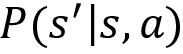
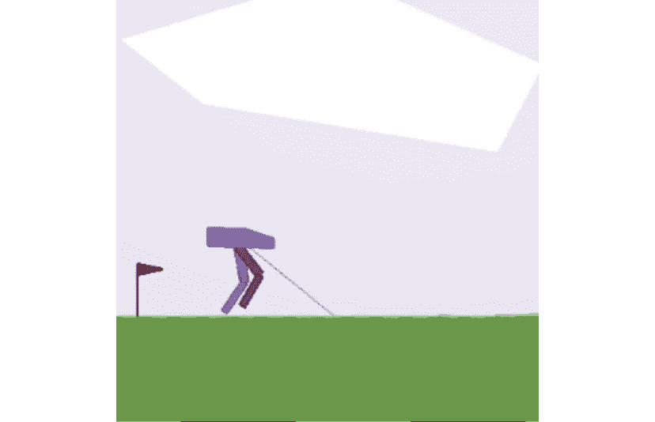

# 第二章：Gym 工具包指南

OpenAI 是一个 **人工智能** (**AI**) 研究组织，旨在构建 **人工通用智能** (**AGI**)。OpenAI 提供了一个著名的工具包，叫做 Gym，用于训练强化学习代理。

假设我们需要训练我们的代理驾驶一辆汽车。我们需要一个环境来训练代理。我们能在现实世界的环境中训练代理驾驶汽车吗？不能，因为我们已经知道强化学习（RL）是一个试错学习过程，所以在训练代理时，它会在学习过程中犯很多错误。例如，假设我们的代理撞到另一辆车，并获得了负奖励。它将学到撞击其他车辆不是一个好的动作，并会尝试避免再次执行这个动作。但我们不能通过让 RL 代理撞车来训练它在现实环境中驾驶对吧？这就是为什么我们使用模拟器，并在模拟环境中训练 RL 代理的原因。

有许多工具包提供了一个模拟环境，用于训练强化学习（RL）代理。一个流行的工具包是 Gym。Gym 提供了多种环境，用于训练 RL 代理，从经典控制任务到 Atari 游戏环境应有尽有。我们可以通过各种 RL 算法训练我们的 RL 代理，使其在这些模拟环境中学习。在本章中，首先，我们将安装 Gym，然后我们将探索各种 Gym 环境。我们还将通过在 Gym 环境中进行实验，实践我们在上一章学到的概念。

在本书中，我们将使用 Gym 工具包来构建和评估强化学习算法，因此在本章中，我们将熟悉 Gym 工具包。

在本章中，我们将学习以下主题：

+   设置我们的机器

+   安装 Anaconda 和 Gym

+   理解 Gym 环境

+   在 Gym 环境中生成一个回合

+   探索更多 Gym 环境

+   随机代理的倒立摆平衡

+   一名代理玩网球游戏

# 设置我们的机器

在本节中，我们将学习如何安装一些运行全书代码所需的依赖项。首先，我们将学习如何安装 Anaconda，然后我们将探索如何安装 Gym。

## 安装 Anaconda

Anaconda 是一个开源的 Python 发行版，广泛用于科学计算和处理大量数据。它提供了一个优秀的包管理环境，支持 Windows、Mac 和 Linux 操作系统。Anaconda 自带 Python，并且包括许多用于科学计算的流行包，如 NumPy、SciPy 等。

要下载 Anaconda，请访问[`www.anaconda.com/download/`](https://www.anaconda.com/download/)，你将在该页面上看到适用于不同平台的 Anaconda 下载选项。如果你使用的是 Windows 或 macOS，你可以根据你的机器架构直接下载图形安装程序，并使用图形安装程序安装 Anaconda。

如果你使用的是 Linux，请按照以下步骤操作：

1.  打开终端并输入以下命令以下载 Anaconda：

    ```py
    wget https://repo.continuum.io/archive/Anaconda3-5.0.1-Linux-x86_64.sh 
    ```

1.  下载完成后，我们可以使用以下命令安装 Anaconda：

    ```py
    bash Anaconda3-5.0.1-Linux-x86_64.sh 
    ```

在成功安装 Anaconda 之后，我们需要创建一个虚拟环境。为什么需要虚拟环境呢？假设我们正在进行项目 A，该项目使用 NumPy 版本 1.14，而项目 B 使用 NumPy 版本 1.13。那么，要在项目 B 中工作，我们要么降级 NumPy，要么重新安装 NumPy。在每个项目中，我们使用的是不同版本的库，这些库在其他项目中不可用。为了避免每次新项目都需要降级、升级版本或重新安装库，我们使用虚拟环境。

虚拟环境是为特定项目创建的一个隔离环境，使得每个项目可以拥有自己独立的依赖项，并且不会影响其他项目。我们将使用以下命令创建一个名为`universe`的虚拟环境：

```py
conda create --name universe python=3.6 anaconda 
```

请注意，我们使用的是 Python 版本 3.6。虚拟环境创建完成后，我们可以使用以下命令激活它：

```py
source activate universe 
```

就这样！现在我们已经学会了如何安装 Anaconda 并创建虚拟环境，在接下来的章节中，我们将学习如何安装 Gym。

## 安装 Gym 工具包

在本节中，我们将学习如何安装 Gym 工具包。在继续之前，首先让我们激活虚拟环境`universe`：

```py
source activate universe 
```

现在，安装以下依赖项：

```py
sudo apt-get update
sudo apt-get install golang libcupti-dev libjpeg-turbo8-dev make tmux htop chromium-browser git cmake zlib1g-dev libjpeg-dev xvfb libav-tools xorg-dev python-opengl libboost-all-dev libsdl2-dev swig
conda install pip six libgcc swig
conda install opencv 
```

我们可以通过`pip`直接安装 Gym。请注意，本书中将使用 Gym 版本 0.15.4。我们可以使用以下命令安装 Gym：

```py
pip install gym==0.15.4 
```

我们也可以通过克隆 Gym 仓库来安装 Gym，如下所示：

```py
cd ~
git clone https://github.com/openai/gym.git
cd gym
pip install -e '.[all]' 
```

### 常见错误修复

如果在安装 Gym 时遇到以下任何错误，以下命令将有所帮助：

+   **构建 pachi-py 轮文件失败**或**构建 pachi-py atari-py 轮文件失败**：

    ```py
    sudo apt-get update
    sudo apt-get install xvfb libav-tools xorg-dev libsdl2-dev swig cmake 
    ```

+   **构建 mujoco-py 轮文件失败**：

    ```py
    git clone https://github.com/openai/mujoco-py.git
    cd mujoco-py
    sudo apt-get update
    sudo apt-get install libgl1-mesa-dev libgl1-mesa-glx libosmesa6-dev python3-pip python3-numpy python3-scipy
    pip3 install -r requirements.txt
    sudo python3 setup.py install 
    ```

+   **错误：命令'gcc'以退出状态 1 失败**：

    ```py
    sudo apt-get update
    sudo apt-get install python-dev 
    sudo apt-get install libevent-dev 
    ```

现在我们已经成功安装了 Gym，在接下来的章节中，让我们开始我们的强化学习实践之旅。

# 创建我们的第一个 Gym 环境

我们已经了解到，Gym 提供了多种环境用于训练强化学习代理。为了清楚地理解 Gym 环境的设计，我们将从基本的 Gym 环境开始。之后，我们将理解其他复杂的 Gym 环境。

让我们介绍一个最简单的环境之一，叫做 Frozen Lake 环境。*图 2.1*显示了 Frozen Lake 环境。正如我们所观察到的，在 Frozen Lake 环境中，智能体的目标是从初始状态**S**开始，到达目标状态**G**：


图 2.1：Frozen Lake 环境

在上述环境中，以下内容适用：

+   **S**表示起始状态

+   **F**表示冰冻状态

+   **H**表示洞穴状态

+   **G**表示目标状态

因此，智能体必须从状态**S**开始，达到目标状态**G**。但是有一个问题，如果智能体访问了状态**H**（即洞穴状态），那么智能体将掉进洞里并死亡，如*图 2.2*所示：


图 2.2：智能体掉进洞里

因此，我们需要确保智能体从**S**开始并达到**G**，而不掉进洞穴状态**H**，如*图 2.3*所示：


图 2.3：智能体达到目标状态

上述环境中的每个格子被称为一个状态，因此我们有 16 个状态（**S**到**G**），并且我们有 4 个可能的动作，分别是*上*、*下*、*左*和*右*。我们了解到，我们的目标是从**S**到达**G**，而不经过**H**。因此，我们为目标状态**G**分配+1 奖励，为所有其他状态分配 0 奖励。

因此，我们已经了解了 Frozen Lake 环境是如何工作的。现在，为了在 Frozen Lake 环境中训练我们的智能体，首先，我们需要通过 Python 从头开始编写代码来创建环境。但幸运的是，我们不必这么做！因为 Gym 提供了各种环境，我们可以直接导入 Gym 工具包并创建一个 Frozen Lake 环境。

现在，我们将学习如何使用 Gym 创建我们的 Frozen Lake 环境。在运行任何代码之前，请确保你已经激活了我们的虚拟环境`universe`。首先，让我们导入 Gym 库：

```py
import gym 
```

接下来，我们可以使用`make`函数创建一个 Gym 环境。`make`函数需要环境 ID 作为参数。在 Gym 中，Frozen Lake 环境的 ID 是`FrozenLake-v0`。因此，我们可以按如下方式创建我们的 Frozen Lake 环境：

```py
env = gym.make("FrozenLake-v0") 
```

创建环境后，我们可以使用`render`函数查看我们的环境长什么样：

```py
env.render() 
```

上述代码呈现了以下环境：


图 2.4：Gym 的 Frozen Lake 环境

如我们所观察到的，Frozen Lake 环境由 16 个状态（**S**到**G**）组成，正如我们所学到的那样。状态**S**被高亮显示，表示这是我们当前的状态，也就是说，智能体处于状态**S**。因此，每当我们创建一个环境时，智能体总是从初始状态开始，在我们的案例中，初始状态是状态**S**。

就是这样！使用 Gym 创建环境就是这么简单。在下一部分，我们将通过结合上一章中学到的所有概念，进一步了解 Gym 环境。

## 探索环境

在上一章中，我们了解到强化学习环境可以被建模为 **马尔可夫决策过程**（**MDP**），MDP 包括以下内容：

+   **状态**：环境中存在的一组状态。

+   **动作**：代理在每个状态下可以执行的动作集合。

+   **转移概率**：转移概率用  表示。它表示执行某个动作 *a* 时，从状态 *s* 转移到状态  的概率。

+   **奖励函数**：奖励函数用  表示。它表示代理从状态 *s* 转移到状态  时，执行动作 *a* 所获得的奖励。

现在，让我们理解如何从我们刚刚使用 Gym 创建的 Frozen Lake 环境中获取上述所有信息。

### 状态

状态空间由我们所有的状态组成。我们可以通过输入 `env.observation_space` 来获取环境中状态的数量，如下所示：

```py
print(env.observation_space) 
```

上面的代码将打印：

```py
Discrete(16) 
```

这意味着我们的状态空间中有 16 个离散状态，从状态 **S** 到 **G**。注意，在 Gym 中，状态会被编码为数字，因此状态 **S** 会被编码为 0，状态 **F** 会被编码为 1，以此类推，如 *图 2.5* 所示：


图 2.5：十六个离散状态

### 动作

我们了解到，动作空间由环境中所有可能的动作组成。我们可以通过使用 `env.action_space` 来获取动作空间：

```py
print(env.action_space) 
```

上面的代码将打印：

```py
Discrete(4) 
```

它显示我们在动作空间中有 `4` 个离散动作，分别是 *左*、*下*、*右* 和 *上*。注意，和状态类似，动作也会被编码成数字，如 *表 2.1* 所示：


表 2.1：四个离散动作

### 转移概率和奖励函数

现在，让我们来看一下如何获取转移概率和奖励函数。我们了解到，在随机环境中，我们不能说通过执行某个动作 *a*，代理就能总是精确到达下一个状态 ，因为会有一些与随机环境相关的随机性，执行动作 *a* 时，代理从状态 *s* 到达下一个状态 的概率是存在的。

假设我们处于状态 2（**F**）。现在，如果我们在状态 2 执行动作 1（*下移*），我们可以到达状态 6，如 *图 2.6* 所示：


图 2.6：代理从状态 2 执行下移动作

我们的 Frozen Lake 环境是一个随机环境。当我们的环境是随机时，执行动作 1（*下移*）在状态 2 时，我们不一定总是能到达状态 6；我们还会以一定的概率到达其他状态。所以，当我们在状态 2 执行动作 1（*下移*）时，我们以 0.33333 的概率到达状态 1，以 0.33333 的概率到达状态 6，以 0.33333 的概率到达状态 3，如 *图 2.7* 所示：


图 2.7：状态 2 中智能体的转移概率

如我们所见，在随机环境中，我们以一定的概率到达下一个状态。现在，让我们学习如何使用 Gym 环境获取这个转移概率。

我们可以通过输入 `env.P[state][action]` 来获取转移概率和奖励函数。因此，要获取通过执行动作 *right* 从状态 **S** 转移到其他状态的转移概率，我们可以输入 `env.P[S][right]`。但是我们不能直接输入状态 **S** 和动作 *right*，因为它们是以数字编码的。我们知道状态 **S** 编码为 0，动作 *right* 编码为 2，因此，为了获取执行动作 *right* 后状态 **S** 的转移概率，我们输入 `env.P[0][2]`，如下面所示：

```py
print(env.P[0][2]) 
```

上述代码将打印：

```py
[(0.33333, 4, 0.0, False),
 (0.33333, 1, 0.0, False),
 (0.33333, 0, 0.0, False)] 
```

这意味着什么？我们的输出形式为 `[(转移概率, 下一个状态, 奖励, 是否终止状态?)]`。这意味着，如果我们在状态 0 (**S**) 执行动作 2 (*right*)，则：

+   我们以 0.33333 的概率到达状态 4 (**F**)，并获得 0 奖励。

+   我们以 0.33333 的概率到达状态 1 (**F**)，并获得 0 奖励。

+   我们以 0.33333 的概率到达相同的状态 0 (**S**)，并获得 0 奖励。

*图 2.8* 显示了转移概率：


图 2.8：状态 0 中智能体的转移概率

因此，当我们输入 `env.P[state][action]` 时，我们将得到以下形式的结果：`[(转移概率, 下一个状态, 奖励, 是否终止状态?)]`。最后一个值是布尔值，告诉我们下一个状态是否是终止状态。由于 4、1 和 0 不是终止状态，因此给出的值为 false。

`env.P[0][2]` 的输出如 *表 2.2* 所示，以便更清楚地理解：


表 2.2：`env.P[0][2]` 的输出

让我们通过另一个例子来理解这个问题。假设我们处于状态 3 (**F**)，如 *图 2.9* 所示：


图 2.9：状态 3 中的智能体

假设我们在状态 3 (**F**) 执行动作 1 (*down*)。那么，通过执行动作 1 (*down*)，状态 3 (**F**) 的转移概率如下所示：

```py
print(env.P[3][1]) 
```

上述代码将打印：

```py
[(0.33333, 2, 0.0, False),
 (0.33333, 7, 0.0, True),
 (0.33333, 3, 0.0, False)] 
```

如我们所学，输出的形式为 `[(转移概率, 下一个状态, 奖励, 是否终止状态?)]`。这意味着如果我们在状态 3 (**F**) 执行动作 1 (*down*)，那么：

+   我们以 0.33333 的概率到达状态 2 (**F**)，并获得 0 奖励。

+   我们以 0.33333 的概率到达状态 7 (**H**)，并获得 0 奖励。

+   我们以 0.33333 的概率到达相同的状态 3 (**F**)，并获得 0 奖励。

*图 2.10* 显示了转移概率：


图 2.10：状态 3 中智能体的转移概率

`env.P[3][1]` 的输出如 *表 2.3* 所示，以便更清楚地理解：


表 2.3：`env.P[3][1]` 的输出

正如我们所观察到的，在输出的第二行中，我们有 `(0.33333, 7, 0.0, True)`，这里的最后一个值被标记为`True`。这意味着状态 7 是一个终止状态。也就是说，如果我们在状态 3 (**F**) 执行动作 1 (*下*)，则我们会以 0.33333 的概率到达状态 7 (**H**)，并且由于 7 (**H**) 是一个洞，智能体如果到达状态 7 (**H**) 就会死亡。因此，7 (**H**) 是一个终止状态，所以它被标记为`True`。

因此，我们已经学会了如何在 Gym 环境中获取状态空间、动作空间、转移概率和奖励函数。在接下来的部分，我们将学习如何生成一个回合。

## 在 Gym 环境中生成一个回合

我们了解到，从初始状态到终止状态的智能体-环境交互过程被称为一个回合。在这一部分，我们将学习如何在 Gym 环境中生成一个回合。

在我们开始之前，我们通过重置环境来初始化状态；重置操作将智能体带回初始状态。我们可以使用 `reset()` 函数来重置环境，具体如下所示：

```py
state = env.reset() 
```

### 动作选择

为了让智能体与环境进行互动，它必须在环境中执行一些动作。所以，首先，让我们学习如何在 Gym 环境中执行一个动作。假设我们处于状态 3 (**F**)，如*图 2.11*所示：


图 2.11：智能体处于冻结湖环境中的状态 3

假设我们需要执行动作 1 (*下*) 并移动到新的状态 7 (**H**)。我们该如何做呢？我们可以使用 `step` 函数来执行一个动作。只需将我们的动作作为参数输入 `step` 函数。于是，我们可以在状态 3 (**F**) 中使用 `step` 函数执行动作 1 (*下*)，如以下所示：

```py
env.step(1) 
```

现在，让我们使用 `render` 函数渲染我们的环境：

```py
env.render() 
```

如*图 2.12*所示，智能体在状态 3 (**F**) 中执行动作 1 (*下*) 并到达下一个状态 7 (**H**)：


图 2.12：智能体处于冻结湖环境中的状态 7

注意，每当我们使用 `env.step()` 执行动作时，它会输出一个包含 4 个值的元组。所以，当我们在状态 3 (**F**) 中使用 `env.step(1)` 执行动作 1 (*下*) 时，它会给出如下输出：

```py
(7, 0.0, True, {'prob': 0.33333}) 
```

正如你可能已经猜到的，这意味着当我们在状态 3 (**F**) 执行动作 1 (*下*) 时：

+   我们到达了下一个状态 7 (**H**)。

+   智能体获得了奖励 `0.0`。

+   由于下一个状态 7 (**H**) 是终止状态，因此它被标记为 `True`。

+   我们以 0.33333 的概率到达下一个状态 7 (**H**)。

所以，我们可以将这些信息存储为：

```py
(next_state, reward, done, info) = env.step(1) 
```

因此：

+   `next_state` 表示下一个状态。

+   `reward` 表示获得的奖励。

+   `done`表示我们的回合是否已经结束。也就是说，如果下一个状态是终止状态，那么我们的回合将结束，`done`将标记为`True`，否则它将标记为`False`。

+   `info`—除了转移概率外，在某些情况下，我们还会获得其他信息，并将其保存为 info，这些信息用于调试目的。

我们还可以从我们的动作空间中采样动作，并执行一个随机动作以探索我们的环境。我们可以使用`sample`函数采样一个动作：

```py
random_action = env.action_space.sample() 
```

在从我们的动作空间中采样了一个动作后，我们使用我们的步进函数执行采样的动作：

```py
next_state, reward, done, info = env.step(random_action) 
```

现在我们已经学会了如何在环境中选择动作，让我们看看如何生成一个回合。

### 生成一个回合

现在让我们学习如何生成一个回合。回合是智能体与环境的交互，从初始状态开始，到终止状态结束。智能体通过在每个状态下执行一些动作与环境进行交互。如果智能体到达终止状态，回合结束。因此，在 Frozen Lake 环境中，如果智能体到达终止状态，即坑洞状态（**H**）或目标状态（**G**），回合就会结束。

让我们了解如何使用随机策略生成一个回合。我们了解到，随机策略在每个状态下选择一个随机动作。因此，我们将通过在每个状态下采取随机动作来生成一个回合。所以在回合的每个时间步长中，我们在每个状态下采取一个随机动作，如果智能体到达终止状态，回合就会结束。

首先，让我们设置时间步长的数量：

```py
num_timesteps = 20 
```

对于每个时间步长：

```py
for t in range(num_timesteps): 
```

通过从动作空间中采样，随机选择一个动作：

```py
 random_action = env.action_space.sample() 
```

执行选择的操作：

```py
 next_state, reward, done, info = env.step(random_action) 
```

如果下一个状态是终止状态，则退出。这意味着我们的回合结束：

```py
 if done:
        break 
from the action space, and our episode will end if the agent reaches the terminal state:
```

```py
import gym
env = gym.make("FrozenLake-v0")
state = env.reset()
print('Time Step 0 :')
env.render()
num_timesteps = 20
for t in range(num_timesteps):
  random_action = env.action_space.sample()
  new_state, reward, done, info = env.step(random_action)
  print ('Time Step {} :'.format(t+1))
  env.render()
  if done:
    break 
```

上述代码将打印出类似于*图 2.13*的内容。请注意，每次运行上述代码时，你可能会得到不同的结果，因为智能体在每个时间步长中都在执行一个随机动作。

如下输出所示，在每个时间步长上，智能体在每个状态下执行一个随机动作，并且一旦智能体到达终止状态，我们的回合就结束。如*图 2.13*所示，在第 4 个时间步长，智能体到达了终止状态**H**，因此回合结束：


图 2.13：智能体在每个时间步长所采取的动作

我们不仅可以生成一个回合，还可以通过在每个状态下执行一些随机动作来生成一系列回合：

```py
import gym
env = gym.make("FrozenLake-v0")
**num_episodes =** **10**
num_timesteps = 20 
**for** **i** **in** **range(num_episodes):**

    state = env.reset()
    print('Time Step 0 :')
    env.render()
    for t in range(num_timesteps):
        random_action = env.action_space.sample()

        new_state, reward, done, info = env.step(random_action)
        print ('Time Step {} :'.format(t+1))
        env.render()
        if done:
            break 
```

因此，我们可以通过从动作空间中采样，在每个状态下选择一个随机动作来生成一个回合。但等等！这样做有什么用？我们为什么需要生成一个回合？

在上一章中，我们了解到，智能体可以通过生成多个回合来找到最优策略（即在每个状态下选择正确的动作）。但是在前面的例子中，我们仅仅是在所有回合中在每个状态下采取了随机动作。那么智能体怎么能找到最优策略呢？那么，在 Frozen Lake 环境中，智能体如何找到最优策略，告诉智能体如何从状态**S**到达状态**G**，而不经过坑洞状态**H**呢？

这就是我们需要强化学习算法的地方。强化学习的核心是寻找最优策略，也就是在每个状态下告诉我们该执行什么动作的策略。我们将在接下来的章节中，通过生成一系列的训练回合，学习如何通过各种强化学习算法来找到最优策略。在本章中，我们将重点了解 Gym 环境以及 Gym 的各种功能，因为我们将在本书的整个过程中使用 Gym 环境。

到目前为止，我们已经理解了如何使用基本的 Frozen Lake 环境来工作，但 Gym 还有许多其他功能，以及一些非常有趣的环境。在下一部分，我们将学习其他 Gym 环境，并探索 Gym 的功能。

# 更多 Gym 环境

在本节中，我们将探索几个有趣的 Gym 环境，并探索 Gym 的不同功能。

## 经典控制环境

Gym 提供了多个经典控制任务的环境，如小车-摆杆平衡、摆动倒立摆、山地车爬坡等。让我们了解如何为小车-摆杆平衡任务创建一个 Gym 环境。小车-摆杆环境如下所示：


图 2.14：小车-摆杆示例

小车-摆杆平衡是经典控制问题之一。如*图 2.14*所示，摆杆连接在小车上，我们的智能体目标是保持摆杆平衡在小车上，也就是说，智能体的目标是保持摆杆竖直地立在小车上，如*图 2.15*所示：


图 2.15：目标是保持摆杆竖直

因此，智能体试图左右推动小车，以保持摆杆竖直立在小车上。我们的智能体执行两种动作，即将小车推向左侧和将小车推向右侧，以保持摆杆竖直立在小车上。你也可以查看这个非常有趣的视频，[`youtu.be/qMlcsc43-lg`](https://youtu.be/qMlcsc43-lg)，展示了强化学习智能体如何通过左右移动小车来平衡小车上的摆杆。

现在，让我们学习如何使用 Gym 创建小车-摆杆环境。Gym 中小车-摆杆环境的环境 ID 是 `CartPole-v0`，所以我们可以使用 `make` 函数来创建小车-摆杆环境，如下所示：

```py
env = gym.make("CartPole-v0") 
```

创建环境后，我们可以使用 `render` 函数查看环境：

```py
env.render() 
```

我们还可以使用 `close` 函数关闭渲染的环境：

```py
env.close() 
```

### 状态空间

现在，让我们来看一下我们小车-杆环境的状态空间。等等！这里的状态是什么？在 Frozen Lake 环境中，我们有 16 个离散状态，从**S**到**G**。但是在这里我们如何描述状态呢？我们能通过小车位置来描述状态吗？可以！请注意，小车位置是一个连续值。所以，在这种情况下，我们的状态空间将是连续值，不像 Frozen Lake 环境中我们的状态空间是离散值（**S**到**G**）。

但是，仅凭小车位置我们无法完全描述环境的状态。因此，我们还包括了小车速度、杆角度和杆端的速度。因此，我们可以通过一个值数组来描述我们的状态空间，如下所示：

```py
array([cart position, cart velocity, pole angle, pole velocity at the tip]) 
```

注意，所有这些值都是连续的，也就是说：

1.  小车位置的值范围从`-4.8`到`4.8`。

1.  小车速度的值范围从`-Inf`到`Inf`（到）。

1.  杆角度的值范围从`-0.418`弧度到`0.418`弧度。

1.  杆端的杆速度的值范围从`-Inf`到`Inf`。

因此，我们的状态空间包含一个由连续值组成的数组。让我们学习如何从 Gym 中获取这一点。为了获取状态空间，我们可以直接输入`env.observation_space`，如下所示：

```py
print(env.observation_space) 
```

前面的代码将输出：

```py
Box(4,) 
```

`Box`意味着我们的状态空间由连续值组成，而不是离散值。也就是说，在 Frozen Lake 环境中，我们的状态空间是`Discrete(16)`，表示我们有 16 个离散状态（**S**到**G**）。但现在我们的状态空间表示为`Box(4,)`，这意味着我们的状态空间是连续的，并由 4 个值组成的数组表示。

例如，让我们重置我们的环境，看看我们的初始状态空间会是什么样子。我们可以使用`reset`函数来重置环境：

```py
print(env.reset()) 
```

前面的代码将输出：

```py
array([ 0.02002635, -0.0228838 ,  0.01248453,  0.04931007]) 
```

注意，这里状态空间是随机初始化的，因此每次运行前面的代码时，我们将获得不同的值。

前面代码的结果意味着我们的初始状态空间由 4 个值的数组组成，分别表示小车位置、小车速度、杆角度和杆端的杆速度。也就是说：


图 2.16：初始状态空间

好的，我们如何获取我们状态空间的最大值和最小值？我们可以使用`env.observation_space.high`获取状态空间的最大值，使用`env.observation_space.low`获取状态空间的最小值。

例如，让我们来看一下我们状态空间的最大值：

```py
print(env.observation_space.high) 
```

前面的代码将输出：

```py
[4.8000002e+00 3.4028235e+38 4.1887903e-01 3.4028235e+38] 
```

这意味着：

1.  小车位置的最大值是`4.8`。

1.  我们了解到，小车速度的最大值是`+Inf`，我们知道无穷大并不是真正的数字，因此它用最大的正实数`3.4028235e+38`来表示。

1.  杆角度的最大值是`0.418`弧度。

1.  杆尖的最大速度值为`+Inf`，因此使用最大正实数值`3.4028235e+38`来表示。

类似地，我们可以得到我们的状态空间的最小值为：

```py
print(env.observation_space.low) 
```

上述代码将输出：

```py
[-4.8000002e+00 -3.4028235e+38 -4.1887903e-01 -3.4028235e+38] 
```

它说明：

1.  推车位置的最小值是`-4.8`。

1.  我们了解到推车速度的最小值是`-Inf`，而且我们知道无穷大实际上不是一个数值，因此使用最大负实数值`-3.4028235e+38`来表示。

1.  杆角的最小值是`-0.418`弧度。

1.  杆尖的最小速度值为`-Inf`，因此使用最大负实数值`-3.4028235e+38`来表示。

### 动作空间

现在，让我们来看看动作空间。我们已经学到，在 Cart-Pole 环境中，我们执行两个动作，即将推车向左推和将推车向右推，因此动作空间是离散的，因为我们只有两个离散的动作。

为了获得动作空间，我们可以直接输入`env.action_space`，如下所示：

```py
print(env.action_space) 
```

上述代码将输出：

```py
Discrete(2) 
```

正如我们所观察到的，`Discrete(2)`表示我们的动作空间是离散的，并且我们在动作空间中有两个动作。请注意，动作会编码为数字，如*表 2.4*所示：


表 2.4：两个可能的动作

### 使用随机策略进行 Cart-Pole 平衡

让我们创建一个具有随机策略的智能体，也就是说，我们创建一个在环境中选择随机动作并尝试平衡杆子的智能体。每当杆子在推车上竖直时，智能体会获得+1 奖励。我们将生成超过 100 个回合，看看每个回合中获得的返回值（奖励总和）。让我们一步步学习。

首先，让我们创建我们的 Cart-Pole 环境：

```py
import gym
env = gym.make('CartPole-v0') 
```

设置回合数和每回合的时间步数：

```py
num_episodes = 100
num_timesteps = 50 
```

对于每个回合：

```py
for i in range(num_episodes): 
```

将返回值设置为`0`：

```py
 Return = 0 
```

通过重置环境来初始化状态：

```py
 state = env.reset() 
```

对于每一步：

```py
 for t in range(num_timesteps): 
```

渲染环境：

```py
 env.render() 
```

通过从环境中采样随机选择一个动作：

```py
 random_action = env.action_space.sample() 
```

执行随机选择的动作：

```py
 next_state, reward, done, info = env.step(random_action) 
```

更新返回值：

```py
 Return = Return + reward 
```

如果下一个状态是终止状态，则结束回合：

```py
 if done:
            break 
```

每经过 10 个回合，打印返回值（奖励总和）：

```py
 if i%10==0:
        print('Episode: {}, Return: {}'.format(i, Return)) 
```

关闭环境：

```py
env.close() 
```

上述代码将输出每 10 个回合获得的奖励总和：

```py
Episode: 0, Return: 14.0
Episode: 10, Return: 31.0
Episode: 20, Return: 16.0
Episode: 30, Return: 9.0
Episode: 40, Return: 18.0
Episode: 50, Return: 13.0
Episode: 60, Return: 25.0
Episode: 70, Return: 21.0
Episode: 80, Return: 17.0
Episode: 90, Return: 14.0 
```

因此，我们了解了一个有趣且经典的控制问题——Cart-Pole 平衡问题，以及如何使用 Gym 创建 Cart-Pole 平衡环境。Gym 提供了其他几个经典控制环境，如*图 2.17*所示：


图 2.17：经典控制环境

你也可以通过使用 Gym 创建上述任何环境进行实验。我们可以在这里查看 Gym 提供的所有经典控制环境：[`gym.openai.com/envs/#classic_control`](https://gym.openai.com/envs/#classic_control)。

## Atari 游戏环境

你是 Atari 游戏的粉丝吗？如果是的话，那你一定会对这一部分感兴趣。Atari 2600 是一款由 Atari 公司推出的视频游戏主机。Atari 游戏主机提供了几款非常受欢迎的游戏，包括 Pong、Space Invaders、Ms. Pac-Man、Break Out、Centipede 等等。训练我们的强化学习代理玩 Atari 游戏是一个既有趣又具有挑战性的任务。通常，大多数强化学习算法都会在 Atari 游戏环境中进行测试，以评估算法的准确性。

在这一部分，我们将学习如何使用 Gym 创建 Atari 游戏环境。Gym 提供了大约 59 个 Atari 游戏环境，包括 Pong、Space Invaders、Air Raid、Asteroids、Centipede、Ms. Pac-Man 等等。Gym 提供的某些 Atari 游戏环境展示在 *图 2.18* 中，激起你的兴趣：


图 2.18：Atari 游戏环境

在 Gym 中，每个 Atari 游戏环境有 12 个不同的变体。我们以 Pong 游戏环境为例来理解这一点。Pong 游戏环境将有 12 个不同的变体，具体说明如下所述。

## 一般环境

+   **Pong-v0 和 Pong-v4**：我们可以通过环境 ID 创建一个 Pong 环境，ID 可以是 Pong-v0 或 Pong-v4。那么，环境的状态是什么呢？由于我们处理的是游戏环境，我们可以直接将游戏屏幕的图像作为状态。但我们不能直接处理原始图像，所以我们将使用游戏屏幕的像素值作为状态。我们将在接下来的章节中详细了解这一点。

+   **Pong-ram-v0 和 Pong-ram-v4**：这与 Pong-v0 和 Pong-v4 类似。但在这里，环境的状态是 Atari 机器的 RAM，即 128 字节，而不是游戏屏幕的像素值。

### 确定性环境

+   **PongDeterministic-v0 和 PongDeterministic-v4**：在这种类型中，顾名思义，每次初始化环境时，游戏的初始位置都会相同，环境的状态是游戏屏幕的像素值。

+   **Pong-ramDeterministic-v0 和 Pong-ramDeterministic-v4**：这与 PongDeterministic-v0 和 PongDeterministic-v4 类似，但这里的状态是 Atari 机器的 RAM。

### 不跳帧

+   **PongNoFrameskip-v0 和 PongNoFrameskip-v4**：在这种类型中，游戏帧不会被跳过；所有游戏画面对代理都是可见的，状态是游戏屏幕的像素值。

+   **Pong-ramNoFrameskip-v0 和 Pong-ramNoFrameskip-v4**：这与 PongNoFrameskip-v0 和 PongNoFrameskip-v4 类似，但这里的状态是 Atari 机器的 RAM。

因此，在 Atari 环境中，我们的环境状态将是游戏屏幕或 Atari 机器的 RAM。请注意，与 Pong 游戏类似，所有其他 Atari 游戏在 Gym 环境中的 ID 都以相同的方式命名。例如，假设我们想创建一个确定性的 Space Invaders 环境，那么我们只需使用 ID `SpaceInvadersDeterministic-v0`创建它。如果我们想创建一个没有帧跳过的 Space Invaders 环境，那么我们可以使用 ID `SpaceInvadersNoFrameskip-v0`来创建它。

我们可以在这里查看 Gym 提供的所有 Atari 游戏环境：[`gym.openai.com/envs/#atari`](https://gym.openai.com/envs/#atari)。

### 状态和动作空间

现在，让我们详细探讨 Atari 游戏环境的状态空间和动作空间。

#### 状态空间

在这一部分，我们将理解 Gym 环境中 Atari 游戏的状态空间。我们通过 Pong 游戏来学习这一点。我们已经了解，在 Atari 环境中，环境的状态将是游戏屏幕的像素值或 Atari 机器的 RAM。首先，让我们理解状态空间，其中环境的状态是游戏屏幕的像素值。

让我们使用`make`函数创建一个 Pong 环境：

```py
env = gym.make("Pong-v0") 
```

这里，游戏屏幕是我们环境的状态。因此，我们将把游戏屏幕的图像作为状态。然而，我们不能直接处理原始图像，因此我们将把图像（游戏屏幕）的像素值作为我们的状态。图像像素的维度将是`3`，包含图像的高度、宽度和通道数。

因此，我们的环境状态将是一个包含游戏屏幕像素值的数组：

```py
 [Image height, image width, number of the channel] 
```

请注意，像素值的范围是从 0 到 255。为了获取状态空间，我们只需输入`env.observation_space`，如下所示：

```py
print(env.observation_space) 
```

上面的代码将输出：

```py
Box(210, 160, 3) 
```

这表示我们的状态空间是一个形状为[`210`,`160`,`3`]的三维数组。正如我们所学，`210`表示图像的高度，`160`表示图像的宽度，而`3`表示通道数。

例如，我们可以重置环境并查看初始状态空间的样子。我们可以使用重置函数来重置环境：

```py
print(env.reset()) 
```

上面的代码将输出一个表示初始游戏屏幕像素值的数组。

现在，让我们创建一个 Pong 环境，其中环境的状态是 Atari 机器的 RAM，而不是游戏屏幕的像素值：

```py
env = gym.make("Pong-ram-v0") 
```

让我们看看状态空间：

```py
print(env.observation_space) 
```

上面的代码将输出：

```py
Box(128,) 
```

这意味着我们的状态空间是一个包含 128 个值的一维数组。我们可以重置环境并查看初始状态空间的样子：

```py
print(env.reset()) 
```

请注意，这适用于 Gym 环境中的所有 Atari 游戏。例如，如果我们创建一个 Space Invaders 环境，将环境的状态定义为游戏画面的像素值，那么我们的状态空间将是一个形状为`Box(210, 160, 3)`的三维数组。然而，如果我们将环境的状态定义为 Atari 机器的 RAM，那么我们的状态空间将是一个形状为`Box(128,)`的数组。

#### 动作空间

现在让我们探索动作空间。一般来说，Atari 游戏环境的动作空间有 18 个动作，这些动作被编码为从 0 到 17，如*表 2.5*所示：


表 2.5：Atari 游戏环境动作

请注意，所有前述的 18 个动作并不适用于所有的 Atari 游戏环境，动作空间因游戏而异。例如，有些游戏只使用前六个动作作为其动作空间，有些游戏只使用前九个动作，而其他游戏则使用全部 18 个动作。让我们通过一个例子来理解这一点，使用 Pong 游戏：

```py
env = gym.make("Pong-v0")
print(env.action_space) 
```

上述代码将打印：

```py
Discrete(6) 
```

代码显示我们在 Pong 的动作空间中有`6`个动作，动作从`0`到`5`进行编码。因此，Pong 游戏中的可能动作是 noop（无动作）、fire、up、right、left 和 down。

现在让我们看看 Road Runner 游戏的动作空间。以防你以前没有遇到过这个游戏，游戏画面如下所示：


图 2.19：Road Runner 环境

让我们查看 Road Runner 游戏的动作空间：

```py
env = gym.make("RoadRunner-v0")
print(env.action_space) 
```

上述代码将打印：

```py
Discrete(18) 
```

这向我们展示了 Road Runner 游戏中的动作空间包含所有 18 个动作。

### 玩网球游戏的智能体

在本节中，让我们探索如何创建一个智能体来玩网球游戏。我们将创建一个随机策略的智能体，这意味着智能体将从动作空间中随机选择一个动作并执行。

首先，让我们创建我们的网球环境：

```py
import gym
env = gym.make('Tennis-v0') 
```

让我们查看网球环境：

```py
env.render() 
```

上述代码将显示以下内容：


图 2.20：网球游戏环境

设置回合数和每个回合的时间步数：

```py
num_episodes = 100
num_timesteps = 50 
```

每个回合：

```py
for i in range(num_episodes): 
```

将回报设置为`0`：

```py
 Return = 0 
```

通过重置环境初始化状态：

```py
 state = env.reset() 
```

每个回合的每一步：

```py
 for t in range(num_timesteps): 
```

渲染环境：

```py
 env.render() 
```

通过从环境中采样随机选择一个动作：

```py
 random_action = env.action_space.sample() 
```

执行随机选择的动作：

```py
 next_state, reward, done, info = env.step(random_action) 
```

更新回报：

```py
 Return = Return + reward 
```

如果下一个状态是终止状态，则结束该回合：

```py
 if done:
            break 
```

每 10 个回合打印回报（奖励的总和）：

```py
 if i%10==0:
        print('Episode: {}, Return: {}'.format(i, Return)) 
```

关闭环境：

```py
env.close() 
```

上述代码将输出每 10 个回合获得的回报（奖励总和）：

```py
Episode: 0, Return: -1.0
Episode: 10, Return: -1.0
Episode: 20, Return: 0.0
Episode: 30, Return: -1.0
Episode: 40, Return: -1.0
Episode: 50, Return: -1.0
Episode: 60, Return: 0.0
Episode: 70, Return: 0.0
Episode: 80, Return: -1.0
Episode: 90, Return: 0.0 
```

### 记录游戏

我们刚刚学习了如何创建一个代理，随机选择一个动作并玩网球游戏。那么，我们能否同时记录代理玩游戏的过程并将其保存为视频呢？当然可以！Gym 提供了一个包装类，我们可以用它将代理的游戏过程保存为视频。

为了录制游戏，我们的系统应该支持 FFmpeg。FFmpeg 是一个用于处理媒体文件的框架。因此，在继续之前，请确保你的系统支持 FFmpeg。

我们可以使用`Monitor`包装器来录制我们的游戏，如下代码所示。它需要三个参数：环境；我们想保存录制文件的目录；以及 force 选项。如果我们设置`force = False`，则意味着每次保存新录制时都需要创建一个新目录；如果我们设置`force = True`，目录中的旧录制文件将被清除并替换为新录制：

```py
env = gym.wrappers.Monitor(env, 'recording', force=True) 
```

我们只需要在创建环境后添加前述的代码行。让我们通过一个简单的例子来看看录制是如何工作的。我们让代理随机玩一次网球游戏并记录代理的游戏过程作为视频：

```py
import gym
env = gym.make('Tennis-v0')
#Record the game
env = gym.wrappers.Monitor(env, 'recording', force=True)
env.reset()
for _ in range(5000):
    env.render()
    action = env.action_space.sample() 
    next_state, reward, done, info = env.step(action)
    if done:
        break
env.close() 
```

一旦这一局结束，我们将看到一个名为**recording**的新目录，在这个目录中，我们可以找到 MP4 格式的视频文件，其中记录了我们代理的游戏过程，如*图 2.21*所示：


图 2.21：网球游戏玩法

## 其他环境

除了我们讨论过的经典控制和 Atari 游戏环境外，Gym 还提供了几种不同类别的环境。让我们了解更多关于它们的信息。

### Box2D

Box2D 是一个二维模拟器，主要用于训练我们的代理执行连续控制任务，如行走。例如，Gym 提供了一个名为`BipedalWalker-v2`的 Box2D 环境，我们可以用它来训练代理行走。`BipedalWalker-v2`环境如*图 2.22*所示：



图 2.22：双足行走者环境

我们可以在这里查看 Gym 提供的其他 Box2D 环境：[`gym.openai.com/envs/#box2d`](https://gym.openai.com/envs/#box2d)。

### MuJoCo

**MuJoCo**代表**带接触的多关节动力学**，是用于训练代理执行连续控制任务的最流行模拟器之一。例如，MuJoCo 提供了一个有趣的环境，名为`HumanoidStandup-v2`，我们可以用它来训练代理站立。`HumanoidStandup-v2`环境如*图 2.23*所示：


图 2.23：类人站立环境

我们可以在这里查看 Gym 提供的其他 MuJoCo 环境：[`gym.openai.com/envs/#mujoco`](https://gym.openai.com/envs/#mujoco)。

### 机器人学

Gym 提供了几个用于执行目标任务的环境，适用于 fetch 和 shadow hand 机器人。例如，Gym 提供了一个名为 `HandManipulateBlock-v0` 的环境，我们可以用它来训练我们的智能体，通过机器人手操作一个盒子。`HandManipulateBlock-v0` 环境如 *图 2.24* 所示：


图 2.24：手部操作块环境

我们可以在这里查看 Gym 提供的多个机器人环境：[`gym.openai.com/envs/#robotics`](https://gym.openai.com/envs/#robotics)。

### 玩具文本

玩具文本是最简单的基于文本的环境。我们已经在本章开头了解了其中一个环境，即 Frozen Lake 环境。我们可以在这里查看 Gym 提供的其他有趣的玩具文本环境：[`gym.openai.com/envs/#toy_text`](https://gym.openai.com/envs/#toy_text)。

### 算法

我们能否让我们的强化学习（RL）智能体解决一些有趣的问题，而不仅仅是玩游戏？当然可以！算法环境提供了多个有趣的问题，比如复制给定的序列、执行加法等。我们可以利用 RL 智能体来解决这些问题，学习如何进行计算。例如，Gym 提供了一个名为 `ReversedAddition-v0` 的环境，我们可以用它来训练我们的智能体加多位数。

我们可以在这里查看 Gym 提供的算法环境：[`gym.openai.com/envs/#algorithmic`](https://gym.openai.com/envs/#algorithmic)。

# 环境简介

我们已经了解了几种类型的 Gym 环境。如果我们能在一个地方查看所有环境的信息，那该多好！没问题！Gym 的 Wiki 提供了所有环境的描述，包括环境 ID、状态空间、动作空间和奖励范围，以表格的形式呈现：[`github.com/openai/gym/wiki/Table-of-environments`](https://github.com/openai/gym/wiki/Table-of-environments)。

我们还可以使用 `registry.all()` 方法查看 Gym 中所有可用的环境：

```py
from gym import envs
print(envs.registry.all()) 
```

上述代码将打印出 Gym 中所有可用的环境。

因此，在本章中，我们了解了 Gym 工具包以及 Gym 提供的几个有趣的环境。在接下来的章节中，我们将学习如何在 Gym 环境中训练我们的 RL 智能体，以找到最优策略。

# 总结

本章开始时，我们通过安装 Anaconda 和 Gym 工具包来理解如何设置我们的机器。我们学习了如何使用 `gym.make()` 函数创建一个 Gym 环境。随后，我们还探索了如何使用 `env.observation_space` 获取环境的状态空间，以及使用 `env.action_space` 获取环境的动作空间。接着，我们学习了如何使用 `env.P` 获取环境的转移概率和奖励函数。之后，我们还学习了如何使用 Gym 环境生成一个回合。我们明白了在每个回合的步骤中，我们通过 `env.step()` 函数选择一个动作。

我们了解了 Gym 环境中的经典控制方法。我们学习了经典控制环境的连续状态空间，以及它们是如何存储在数组中的。我们还学习了如何使用一个随机智能体来平衡一个杆子。随后，我们了解了有趣的 Atari 游戏环境，学习了 Atari 游戏环境在 Gym 中的命名方式，然后我们探索了它们的状态空间和动作空间。我们还学习了如何使用包装类记录智能体的游戏过程，并在本章结束时，发现了 Gym 提供的其他环境。

在下一章中，我们将学习如何使用两种有趣的算法，称为值迭代和策略迭代，来找到最优策略。

# 问题

让我们通过回答以下问题来评估我们新获得的知识：

1.  Gym 工具包的用途是什么？

1.  我们如何在 Gym 中创建一个环境？

1.  我们如何获取 Gym 环境的动作空间？

1.  我们如何可视化 Gym 环境？

1.  列举一些 Gym 提供的经典控制环境。

1.  我们如何使用 Gym 环境生成一个回合？

1.  Atari Gym 环境的状态空间是什么？

1.  我们如何记录智能体的游戏过程？

# 进一步阅读

查看以下资源以获取更多信息：

+   要了解更多关于 Gym 的信息，请访问 [`gym.openai.com/docs/`](http://gym.openai.com/docs/)。

+   我们还可以查看 Gym 仓库，了解 Gym 环境是如何编码的：[`github.com/openai/gym`](https://github.com/openai/gym)。
