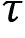
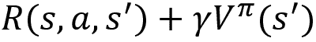
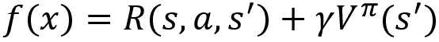
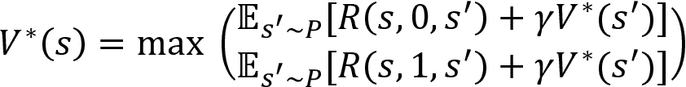
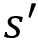
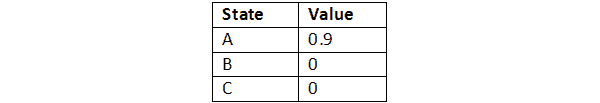
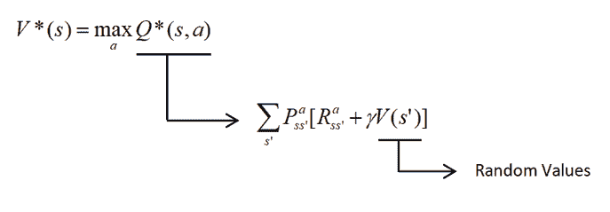
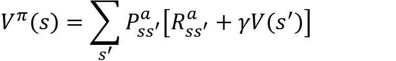
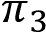

# 第三章：贝尔曼方程和动态规划

在上一章中，我们学习到，在强化学习中，我们的目标是找到最优策略。最优策略是在每个状态下选择正确的动作，使得智能体可以获得最大回报并实现其目标。在本章中，我们将学习两种有趣的经典强化学习算法——值迭代和策略迭代方法，我们可以使用它们来找到最优策略。

在直接探讨值迭代和策略迭代方法之前，我们首先将学习贝尔曼方程。贝尔曼方程在强化学习中无处不在，广泛用于求解最优值函数和 Q 函数。我们将理解贝尔曼方程是什么，以及它如何找到最优值函数和 Q 函数。

在理解贝尔曼方程之后，我们将学习两种有趣的动态规划方法——值迭代和策略迭代，它们使用贝尔曼方程来寻找最优策略。在本章结束时，我们将学习如何通过使用值迭代和策略迭代方法来找到最优策略，解决冻结湖问题。

在本章中，我们将学习以下主题：

+   贝尔曼方程

+   贝尔曼最优性方程

+   值函数和 Q 函数之间的关系

+   动态规划 – 值迭代和策略迭代方法

+   使用值迭代和策略迭代方法解决冻结湖问题

# 贝尔曼方程

贝尔曼方程以理查德·贝尔曼（Richard Bellman）命名，帮助我们解决**马尔可夫决策过程**（**MDP**）。当我们说解决 MDP 时，我们指的是找到最优策略。

如本章引言中所述，贝尔曼方程在强化学习中无处不在，广泛用于递归地求解最优值函数和 Q 函数。计算最优值函数和 Q 函数非常重要，因为一旦我们得到了最优值函数或最优 Q 函数，我们就可以利用它们推导出最优策略。

在本节中，我们将学习贝尔曼方程究竟是什么，以及如何使用它来找到最优值函数和 Q 函数。

## 值函数的贝尔曼方程

贝尔曼方程指出，状态的值可以通过即时奖励与下一个状态的折扣值之和来获得。假设我们在状态 `s` 执行动作 `a`，并移动到下一个状态  并获得奖励 `r`，那么值函数的贝尔曼方程可以表示为：


在上述方程中，以下内容适用：

+    表示在状态 `s` 执行动作 `a` 并移动到下一个状态时所获得的即时奖励 

+    是折扣因子

+    表示下一个状态的值

让我们通过一个例子来理解贝尔曼方程。假设我们使用某个策略  生成一条轨迹 ：


图 3.1：轨迹

假设我们需要计算状态 `s[2]` 的值。根据贝尔曼方程，状态 `s[2]` 的值表示为：


在上述方程中， 表示我们在状态 `s[2]` 中执行动作 `a[2]` 并移动到状态 `s[3]` 时获得的即时奖励。从轨迹中可以看出，即时奖励  为 `r[2]`。而项  是下一个状态的折扣值。

因此，根据贝尔曼方程，状态 `s[2]` 的值表示为：


因此，价值函数的贝尔曼方程可以表示为：


其中，上标  表示我们正在使用策略 。右侧项  通常被称为 **贝尔曼备份**。

上述贝尔曼方程仅在我们拥有确定性环境时有效。假设我们的环境是随机的，那么在这种情况下，当我们在状态 `s` 中执行动作 `a` 时，并不能保证我们的下一个状态总是 ，它也可能是其他状态。例如，看看 *图 3.2* 中的轨迹。

如我们所见，当我们在状态 `s[1]` 中执行动作 `a[1]` 时，以 0.7 的概率到达状态 s[2]，以 0.3 的概率到达状态 s[3]：


图 3.2：在状态 `s[1]` 中执行动作 `a[1]` 的转移概率

因此，当我们在状态 `s[1]` 中执行动作 `a[1]` 时，下一个状态为 `s[2]` 的概率为 70%，为 `s[3]` 的概率为 30%。我们了解到，贝尔曼方程是即时奖励和下一个状态的折扣值之和。但是，当由于环境中的随机性，无法保证下一个状态时，我们该如何定义贝尔曼方程呢？

在这种情况下，我们可以稍微修改贝尔曼方程，引入期望值（加权平均），也就是说，将贝尔曼备份与下一个状态的转移概率相乘，再求和：


在上述方程中，以下内容适用：

+    表示通过在状态 `s` 中执行动作 `a` 到达  的转移概率

+    表示贝尔曼备份

让我们通过考虑刚才使用的相同轨迹来更好地理解这个方程。正如我们所注意到的，当我们在状态 `s[1]` 中执行动作 `a[1]` 时，我们以 0.70 的概率到达 `s[2]`，以 0.30 的概率到达 `s[3]`。因此，我们可以写成：


因此，包含环境中的随机性，利用期望（加权平均）的价值函数的贝尔曼方程表达为：


好的，但如果我们的策略是一个随机策略呢？我们了解到，使用随机策略时，我们是基于概率分布来选择动作；也就是说，在某个状态下，不是执行相同的动作，而是根据动作空间中的概率分布选择一个动作。让我们通过一个不同的轨迹来理解这一点，如*图 3.3*所示。正如我们所见，在状态`s[1]`下，以 0.8 的概率选择动作`a[1]`，并到达状态`s[2]`，以 0.2 的概率选择动作`a[2]`，并到达状态`s[3]`：


图 3.3：使用随机策略的轨迹

因此，当我们使用随机策略时，下一状态将不再是固定的，它会是多个状态中的某一个，且具有一定的概率。那么，如何定义包括随机策略的贝尔曼方程呢？

+   我们了解到，要将环境中的随机性包含进贝尔曼方程中，我们采取了期望（加权平均），也就是说，贝尔曼备份的总和乘以下一个状态的对应转移概率。

+   类似地，要将策略的随机性包含在贝尔曼方程中，我们可以使用期望（加权平均），也就是说，将贝尔曼备份乘以相应的动作概率的总和。

因此，我们最终的价值函数贝尔曼方程可以写为：


上述方程也被称为**贝尔曼期望方程**，是价值函数的贝尔曼期望方程。我们也可以将上面的方程表达为期望形式。让我们回顾一下期望的定义：


在方程(1)中，、和分别表示随机环境和随机策略的概率。

因此，我们可以将价值函数的贝尔曼方程写为：


## Q 函数的贝尔曼方程

现在，让我们学习如何计算状态-动作价值函数的贝尔曼方程，也就是 Q 函数。Q 函数的贝尔曼方程与价值函数的贝尔曼方程非常相似，除了一个小的区别。与价值函数的贝尔曼方程类似，Q 函数的贝尔曼方程指出，某个状态-动作对的 Q 值可以通过即时奖励与下一个状态-动作对的折扣 Q 值的总和得到：


在上述方程中，适用以下内容：

+   表示在状态`s`下执行动作`a`并移动到下一个状态时获得的即时奖励！[](img/B15558_03_034.png)

+   是折扣因子。

+    是下一个状态-动作对的 Q 值

让我们通过一个例子来理解这个问题。假设我们使用某个策略  生成一个轨迹 ，如图*3.4*所示：


图 3.4：轨迹

假设我们需要计算状态-动作对(`s[2]`, `a[2]`)的 Q 值。那么，根据 Bellman 方程，我们可以写出：


在上述方程中，`R`(`s[2]`, `a[2]`, `a[3]`)表示我们在执行动作`a[2]`时，从状态`s[2]`转移到状态`s[3]`所获得的即时奖励。从前面的轨迹中，我们可以看出，即时奖励`R`(`s[2]`, `a[2]`, `s[3]`)是`r[2]`。而项  表示下一个状态-动作对的折扣 Q 值。因此：


因此，Q 函数的 Bellman 方程可以表示为：


其中，上标  表示我们正在使用策略 ，右侧项  是**Bellman 备份**。

类似于我们在值函数的 Bellman 方程中学到的内容，上述 Bellman 方程仅在我们拥有确定性环境时有效，因为在随机环境中我们的下一个状态不总是相同的，它将基于一个概率分布。假设我们有一个随机环境，那么当我们在状态`s`中执行动作`a`时，并不能保证我们的下一个状态总是 ；它也有可能是其他状态，且具有一定的概率。

所以，就像我们在上一节中所做的那样，我们可以使用期望（加权平均），即 Bellman 备份的和乘以下一个状态的相应转移概率，重新写出 Q 函数的 Bellman 方程：


类似地，当我们使用随机策略时，我们的下一个状态不一定总是相同的；它将是具有一定概率的不同状态。所以，为了包括策略的随机性，我们可以通过期望（加权平均）的方式重新写出 Bellman 方程，即 Bellman 备份的和乘以相应的动作概率，就像我们在值函数的 Bellman 方程中所做的那样。因此，Q 函数的 Bellman 方程可以表示为：


等等！上述方程有一个小变化。为什么在 Q 函数的情况下需要添加项？因为在值函数 `V`(`s`) 中，我们只给定一个状态 `s`，并根据策略选择一个动作 `a`。因此，我们添加了项来包括策略的随机性。但在 Q 函数 `Q`(`s`, `a`) 的情况下，我们既给定了状态 `s`，又给定了动作 `a`，因此我们不需要在方程中添加项，因为我们并不是根据策略来选择任何动作 `a`。

然而，如果你查看上面的方程，我们需要根据策略选择动作，以计算下一个状态-动作对的 Q 值，因为不会给定。因此，我们可以将项放置在下一个状态-动作对的 Q 值之前。这样，我们的最终贝尔曼 Q 函数方程可以写为：


方程（3）也被称为 Q 函数的贝尔曼期望方程。我们还可以将方程（3）表示为期望形式：


现在我们已经理解了贝尔曼期望方程是什么，在下一节中，我们将学习贝尔曼最优性方程，并探讨它如何有助于找到最优的贝尔曼值和 Q 函数。

## 贝尔曼最优性方程

贝尔曼最优性方程给出了最优贝尔曼值和 Q 函数。首先，让我们看看最优贝尔曼值函数。我们已经学过，值函数的贝尔曼方程可以表示为：


在第一章中，我们学习了值函数依赖于策略，即状态的值根据我们选择的策略而变化。根据不同的策略，可能会有很多不同的值函数。最优值函数，，是相较于所有其他值函数，能够产生最大值的函数。同样，根据不同的策略，也可能会有许多不同的贝尔曼值函数。最优贝尔曼值函数是具有最大值的那个。

好的，如何计算具有最大值的最优贝尔曼值函数呢？

我们可以通过选择产生最大值的动作来计算最优贝尔曼值函数。但是我们不知道哪个动作能产生最大值，所以我们计算所有可能动作下的状态值，然后选择最大值作为该状态的值。

也就是说，我们不再使用某个策略  来选择行动，而是通过计算所有可能行动的状态值，然后选择最大值作为状态的值。由于我们没有使用任何策略，因此可以去掉对策略的期望 ，并对行动取最大值，将最优贝尔曼值函数表示为：


这与贝尔曼方程是一样的，只不过这里我们对所有可能的行动取最大值，而不是对策略取期望（加权平均），因为我们只关心最大值。让我们通过一个例子来理解这一点。假设我们在状态 `s` 中，并且该状态下有两个可能的行动。假设这两个行动分别是 0 和 1。那么  由以下公式给出：



从上述公式中可以观察到，我们使用所有可能的行动（0 和 1）来计算状态值，然后选择最大值作为状态的值。

现在，让我们来看一下最优贝尔曼 Q 函数。我们已经学到，Q 函数的贝尔曼方程表示为：


就像我们在学习最优贝尔曼值函数时一样，**我们不再通过策略来选择在下一个状态**  **的行动** ，**而是选择在该状态**  **下所有可能的行动，并计算最大 Q 值**。可以表示为：


让我们通过一个例子来理解这一点。假设我们在状态 `s` 中，并采取了一个行动 `a`。我们在状态 `s` 中执行行动 `a`，到达下一个状态 。我们需要计算下一个状态的 Q 值 。在状态  中可能有多种行动。假设我们在状态  中有两个行动 0 和 1，那么我们可以将最优贝尔曼 Q 函数写为：


因此，总结一下，值函数和 Q 函数的贝尔曼最优性方程是：


我们还可以展开期望，并将前面的贝尔曼最优性方程改写为：


## 值函数与 Q 函数之间的关系

让我们稍微绕一下，回顾一下我们在*第一章*《强化学习基础》中学到的值函数和 Q 函数。我们学到，状态的值（值函数）表示从该状态开始，按照某个策略  进行的期望回报：


同样，状态-行动对的 Q 值（Q 函数）表示从该状态-行动对开始，按照某个策略  进行的期望回报：


我们已经学到，最优值函数给出了最大的状态值：


最优 Q 函数给出了最大的状态-动作值（Q 值）：


我们能否推导出最优值函数与最优 Q 函数之间的关系？我们知道，当我们从一个状态`s`开始时，最优值函数具有最大的期望回报，而最优 Q 函数在我们从状态`s`执行某个动作`a`时，具有最大的期望回报。因此，我们可以说，最优值函数是所有可能动作中最优 Q 值的最大值，可以表示为以下形式（即，我们可以从 Q 推导出 V）：


好的，现在让我们回到贝尔曼方程。在继续之前，我们先回顾一下贝尔曼方程：

+   **贝尔曼期望方程的值函数和 Q 函数**：

    +   

    +   

+   **贝尔曼** **最优性** **方程的值函数和 Q 函数**：

    +   

    +   

我们学到的是，最优贝尔曼 Q 函数可以表示为：


如果我们有一个最优值函数 ，那么我们可以使用它来推导出之前的最优贝尔曼 Q 函数（即，我们可以从`V`推导出`Q`）：


上述方程是强化学习中最有用的恒等式之一，我们将在接下来的章节中看到它如何帮助我们找到最优策略。

因此，总结一下，我们学到的是可以从`Q`推导出`V`：


并从`V`推导出`Q`：


将方程（8）代入方程（7），我们可以写成：


如我们所观察到的，我们刚刚获得了最优贝尔曼值函数。现在我们理解了贝尔曼方程以及值函数与 Q 函数之间的关系，接下来我们可以继续学习如何利用这些方程来找到最优策略。

# 动态规划

**动态规划**（**DP**）是一种解决复杂问题的技术。在动态规划中，我们不是将复杂问题作为一个整体来解决，而是将问题分解为简单的子问题，然后对于每个子问题，我们计算并存储解决方案。如果出现相同的子问题，我们就不再重新计算，而是使用已计算的结果。因此，动态规划有助于大幅减少计算时间。它在计算机科学、数学、生物信息学等广泛领域都有应用。

现在，我们将学习两种使用动态规划来寻找最优策略的重要方法。这两种方法是：

+   值迭代

+   策略迭代

请注意，动态规划是一种基于模型的方法，这意味着它只有在已知环境的模型动态（转移概率）的情况下，才能帮助我们找到最优策略。如果我们没有模型动态，就无法应用动态规划方法。

接下来的部分将通过手动计算进行说明，为了更好的理解，建议用纸笔跟着一起做。

## 值迭代

在值迭代方法中，我们试图找到最优策略。我们学习到，最优策略是指示代理在每个状态下执行正确动作的策略。为了找到最优策略，首先需要计算出最优值函数，一旦得到了最优值函数，我们可以利用它推导出最优策略。那么，如何计算最优值函数呢？我们可以使用最优贝尔曼方程来计算值函数。我们学习到，根据贝尔曼最优性方程，最优值函数可以计算为：


在*值函数与 Q 函数之间的关系*部分，我们学习了在给定值函数的情况下，如何推导 Q 函数：


将（10）代入（9），我们可以写为：


因此，我们可以通过仅对最优 Q 函数取最大值来计算最优值函数。因此，为了计算某一状态的值，我们需要计算所有状态-动作对的 Q 值。然后，我们选择最大的 Q 值作为该状态的值。

让我们通过一个例子来理解这一点。假设我们有两个状态，`s[0]`和`s[1]`，在这些状态下我们有两个可能的动作；假设这些动作是 0 和 1。首先，我们计算所有可能状态-动作对的 Q 值。*表 3.1*显示了所有可能状态-动作对的 Q 值：


表 3.1：所有可能状态-动作对的 Q 值

然后，在每个状态中，我们选择最大的 Q 值作为该状态的最优值。因此，状态`s[0]`的值为 3，状态`s[1]`的值为 4。状态的最优值（值函数）如*表 3.2*所示：


表 3.2：最优状态值

一旦我们获得了最优值函数，就可以使用它来提取最优策略。

现在，我们对值迭代方法如何找到最优值函数有了基本的理解。在下一部分，我们将详细了解值迭代方法是如何工作的，以及它如何从最优值函数中找到最优策略。

### 值迭代算法

值迭代的算法如下：

1.  通过对 Q 函数取最大值来计算最优值函数，即！[](img/B15558_03_088.png)

1.  从计算出的最优值函数中提取最优策略

让我们详细了解并学习上述两个步骤是如何工作的。为了更好的理解，我们手动执行值迭代。考虑*图 3.5*中显示的小型网格世界环境。假设我们处于状态*`A`*，我们的目标是到达状态*`C`*，并且不经过阴影状态*`B`*，假设我们有两个动作，0——左/右，和 1——上/下：


图 3.5：网格世界环境

你能想出这里的最优策略是什么吗？这里的最优策略是告诉我们在状态*`A`*执行动作 1，这样我们就可以到达*`C`*而不经过*`B`*。现在我们将看到如何使用值迭代找到这个最优策略。

*表 3.3* 显示了状态*`A`*的模型动态：


表 3.3：状态 A 的模型动态

#### 步骤 1 – 计算最优值函数

我们可以通过计算 Q 函数的最大值来计算最优值函数。


也就是说，我们计算所有状态-动作对的 Q 值，然后选择最大 Q 值作为状态的值。

状态 `s` 和动作 `a` 的 Q 值可以计算为：


为了简化符号，我们可以将  表示为 ，将  表示为 ，并将前面的公式重写为：


因此，使用前面的公式，我们可以计算 Q 函数。如果你查看这个公式，要计算 Q 函数，我们需要过渡概率 、奖励函数 **，**以及下一个状态的值 。模型动态为我们提供了过渡概率  和奖励函数 。但是下一个状态的值  呢？我们还不知道任何状态的值。所以，我们将用随机值或零初始化值函数（状态值），如*表 3.4*所示，并计算 Q 函数。


表 3.4：初始值表

**迭代 1**：

让我们计算状态*`A`*的 Q 值。状态*`A`*有两个动作，分别是 0 和 1。因此，首先让我们计算状态*`A`*和动作 0 的 Q 值（注意，我们在整个章节中都使用折扣因子 ）：


现在，让我们计算状态*`A`*和动作 1 的 Q 值：


在计算了状态*`A`*中两个动作的 Q 值之后，我们可以更新 Q 表，如*表 3.5*所示：


表 3.5：Q 表

我们了解到，状态的最优值就是 Q 函数的最大值。也就是说，。通过查看*表 3.5*，我们可以说，状态*`A`*的值，`V`(`A`)，是 `Q`(`A`, 1)，因为 `Q`(`A`, 1) 的值比 `Q`(`A`, 0) 高。因此，`V`(`A`) = 0.9。

我们可以在我们的值表中更新状态*`A`*的值，如*表 3.6*所示：



表 3.6：更新后的值表

类似地，为了计算状态*`B`*的值`V`(B)，我们计算`Q`(B, 0)和`Q`(B, 1)的 Q 值，并选择最高的 Q 值作为状态*`B`*的值。 同样地，为了计算其他状态的值，我们计算所有状态-动作对的 Q 值，并选择最大的 Q 值作为状态的值。

在计算所有状态的值之后，我们的更新后的值表可能类似于*表 3.7*。 这是第一次迭代的结果：


表 3.7: 第 1 次迭代的值表

然而，作为第一次迭代的结果得到的值函数（值表）在不是最优的。 但为什么？ 我们了解到最优值函数是最优 Q 函数的最大值。 也就是说，。 因此，为了找到最优值函数，我们需要最优 Q 函数。 但是 Q 函数可能在第一次迭代中并不是最优的，因为我们是基于随机初始化的状态值计算 Q 函数的。

正如下文所示，当我们开始计算 Q 函数时，我们使用了随机初始化的状态值。



因此，在下一次迭代中，在计算 Q 函数时，我们可以使用作为第一次迭代结果得到的更新的状态值。

换句话说，在第二次迭代中，为了计算值函数，我们计算所有状态-动作对的 Q 值，并选择最大的 Q 值作为状态的值。 为了计算 Q 值，我们需要知道状态值，在第一次迭代中，我们使用随机初始化的状态值。 但在第二次迭代中，我们使用从第一次迭代得到的更新的状态值（值表）如下所示：


**第 2 次迭代**：

让我们计算状态*`A`*的 Q 值。 请记住，在计算 Q 值时，我们使用来自上一次迭代的更新的状态值。

首先，让我们计算状态*`A`*和动作 0 的 Q 值：


现在，让我们计算状态*`A`*和动作 1 的 Q 值：


如我们所见，由于状态 A 中动作 1 的 Q 值高于动作 0，因此状态 A 的值变为 1.44。 类似地，我们计算所有状态的值并更新值表。 *表 3.8* 显示了更新后的值表：


表 3.8: 第 2 次迭代的值表

**第 3 次迭代**：

我们重复前一次迭代中看到的相同步骤，并通过选择最大的 Q 值来计算所有状态的值。 请记住，在计算 Q 值时，我们使用来自上一次迭代的更新的状态值（值表）。 因此，我们使用第 2 次迭代中得到的更新的状态值来计算 Q 值。

*表 3.9* 显示作为第三次迭代结果得到的更新的状态值：


表 3.9: 第 3 次迭代的值表

所以，我们重复这些步骤进行多次迭代，直到找到最优值函数。但是我们怎么知道是否找到了最优值函数呢？当值函数（值表）在多次迭代中没有变化，或者变化非常小的时候，我们可以说我们已经达到了收敛，也就是说，我们找到了最优值函数。

好的，我们如何判断值表是否发生变化，或者与上次迭代相比没有变化呢？我们可以计算当前迭代得到的值表与上次迭代得到的值表之间的差异。如果差异非常小——例如，差异小于一个非常小的阈值——那么我们可以说我们已经达到了收敛，因为值函数变化不大。

例如，假设*表 3.10*显示的是**迭代 4**得到的值表：


表 3.10：迭代 4 得到的值表

如我们所见，迭代 4 和迭代 3 得到的值表之间的差异非常小。所以，我们可以说我们已经达到了收敛，并且我们将迭代 4 得到的值表作为我们的最优值函数。请注意，上面的例子只是为了更好地理解；在实际操作中，我们不可能只通过四次迭代就达到收敛——通常需要多次迭代。

现在我们已经找到了最优值函数，在接下来的步骤中，我们将使用这个最优值函数来提取最优策略。

#### 步骤 2 – 从步骤 1 中获得的最优值函数中提取最优策略

作为*步骤 1*的结果，我们得到了最优值函数：


表 3.11：最优值表（值函数）

现在，我们如何从获得的最优值函数中提取最优策略呢？

我们通常使用 Q 函数来计算策略。我们知道 Q 函数为每个状态-动作对提供 Q 值。一旦我们得到了所有状态-动作对的 Q 值，我们就可以通过在每个状态中选择具有最大 Q 值的动作来提取策略。例如，考虑*表 3.12*中的 Q 表。它显示了所有状态-动作对的 Q 值。现在，我们可以通过选择状态`s[0]`中的动作 1 和状态`s[1]`中的动作 0（因为它们具有最大的 Q 值）来从 Q 函数（Q 表）中提取策略。


表 3.12：Q 表

好的，现在我们使用*步骤 1*中获得的最优值函数来计算 Q 函数。一旦我们得到 Q 函数，我们就可以通过选择每个状态中具有最大 Q 值的动作来提取策略。由于我们是使用最优值函数来计算 Q 函数的，因此从 Q 函数中提取的策略将是最优策略。

我们了解到，Q 函数可以通过以下方式计算：


现在，在计算 Q 值时，我们使用从*步骤 1* 获得的最优价值函数。在计算 Q 函数后，我们可以通过选择具有最大 Q 值的动作来提取最优策略：


例如，我们可以使用最优价值函数计算状态 *`A`* 中所有动作的 Q 值。在状态 *`A`* 中，动作 0 的 Q 值计算如下：


在状态 *`A`* 中，动作 1 的 Q 值计算如下：


由于 `Q`(`A`, 1) 高于 `Q`(`A`, 0)，因此我们的最优策略会在状态 *`A`* 中选择动作 1 作为最优动作。*表 3.13* 显示了使用最优价值函数计算所有状态-动作对的 Q 值后的 Q 表：


表 3.13：Q 表

从这个 Q 表中，我们选择每个状态中 Q 值最大的动作作为最优策略。因此，我们的最优策略会在状态 *`A`* 中选择动作 1，在状态 *`B`* 中选择动作 1，在状态 *`C`* 中选择动作 1。

因此，根据我们的最优策略，如果我们在状态 *`A`* 执行动作 1，我们可以到达状态 *`C`*，而不经过状态 *`B`*。

在本节中，我们学习了如何使用价值迭代法计算最优策略。在下一节中，我们将学习如何使用 Gym 工具包在冰湖环境中实现价值迭代法来计算最优策略。

### 使用价值迭代法解决冰湖问题

在上一章中，我们了解了冰湖环境。冰湖环境如*图 3.6*所示：


图 3.6：冰湖环境

让我们回顾一下冰湖环境。在*图 3.6*所示的冰湖环境中，以下内容适用：

+   *`S`* 表示起始状态

+   *`F`* 表示冻结状态

+   *`H`* 表示洞穴状态

+   *`G`* 表示目标状态

我们了解到，在冰湖环境中，我们的目标是从起始状态 *`S`* 到达目标状态 *`G`*，同时避免经过洞穴状态 *`H`*。也就是说，在尝试从起始状态 *`S`* 到达目标状态 *`G`* 时，如果代理访问了洞穴状态 *`H`*，它就会掉进洞里并死亡，如*图 3.7*所示：


图 3.7：代理掉进洞里

因此，我们希望代理避免洞穴状态 *`H`*，以到达目标状态 *`G`*，如以下所示：


图 3.8：代理到达目标状态

我们如何实现这个目标呢？也就是说，如何从 *`S`* 状态到达 *`G`* 状态，而不经过 *`H`* 状态？我们了解到，最优策略会告诉代理在每个状态中执行正确的动作。因此，如果我们找到最优策略，就能从 *`S`* 到达 *`G`*，而不经过 *`H`*。好吧，我们如何找到最优策略？我们可以使用刚才学习的价值迭代法来找到最优策略。

请记住，所有的状态（*`S`* 到 *`G`*）将在 Gym 工具包中从 0 到 16 编码，所有四个动作——*左*，*下*，*上*，*右*——将在 Gym 工具包中从 0 到 3 编码。

在这一部分中，我们将学习如何使用值迭代方法找到最优策略，使得代理可以从 *`S`* 状态到达 *`G`* 状态，而不会经过 *`H`*。

首先，让我们导入必要的库：

```py
import gym
import numpy as np 
```

现在，让我们使用 Gym 创建 Frozen Lake 环境：

```py
env = gym.make('FrozenLake-v0') 
```

让我们使用 `render` 函数查看 Frozen Lake 环境：

```py
env.render() 
```

上述代码将显示：


图 3.9：Gym 冻湖环境

如我们所见，代理处于状态 *`S`*，并且必须到达状态 *`G`*，而不能经过 *`H`* 状态。所以，让我们学习如何使用值迭代方法计算最优策略。

在值迭代方法中，我们执行两个步骤：

1.  通过对 Q 函数取最大值来计算最优值函数，也就是 

1.  从计算得到的最优值函数中提取最优策略

首先，让我们学习如何计算最优值函数，然后我们将看到如何从计算得到的最优值函数中提取最优策略。

#### 计算最优值函数

我们将定义一个名为 `value_iteration` 的函数，在这个函数中，我们通过对 Q 函数取最大值来迭代计算最优值函数，也就是 。为了更好地理解，我们将仔细查看该函数的每一行代码，最后再看完整的函数，这将更有助于理解。

定义 `value_iteration` 函数，它以环境作为参数：

```py
def value_iteration(env): 
```

设置迭代次数：

```py
 num_iterations = 1000 
```

设置用于检查值函数收敛的阈值：

```py
 threshold = 1e-20 
```

我们还将折扣因子  设置为 1：

```py
 gamma = 1.0 
```

现在，我们将通过将所有状态的值初始化为零来初始化值表：

```py
 value_table = np.zeros(env.observation_space.n) 
```

对于每次迭代：

```py
 for i in range(num_iterations): 
```

更新值表，也就是说，我们在每次迭代时使用上一迭代中的更新值表（状态值）：

```py
 updated_value_table = np.copy(value_table) 
```

现在，我们通过取 Q 值的最大值来计算值函数（状态值）：


其中 。

因此，对于每个状态，我们计算该状态下所有动作的 Q 值，然后将状态的值更新为具有最大 Q 值的值：

```py
 for s in range(env.observation_space.n): 
```

计算所有动作的 Q 值，：

```py
 Q_values = [sum([prob*(r + gamma * updated_value_table[s_])
                             for prob, s_, r, _ in env.P[s][a]]) 
                                   for a in range(env.action_space.n)] 
```

将状态的值更新为最大 Q 值，：

```py
 value_table[s] = max(Q_values) 
```

计算完值表，也就是所有状态的值后，我们检查当前迭代中获得的值表与前一次迭代中的值表之间的差异是否小于或等于阈值。如果差异小于阈值，我们就跳出循环并返回值表作为我们的最优值函数，如下代码所示：

```py
 if (np.sum(np.fabs(updated_value_table - value_table)) <= threshold):
             break

    return value_table 
value_iteration function is shown to provide more clarity:
```

```py
def value_iteration(env):

    num_iterations = 1000
    threshold = 1e-20
    gamma = 1.0    

    value_table = np.zeros(env.observation_space.n)

    for i in range(num_iterations):
        updated_value_table = np.copy(value_table) 

        for s in range(env.observation_space.n):

            Q_values = [sum([prob*(r + gamma * updated_value_table[s_])
                             for prob, s_, r, _ in env.P[s][a]])
                                   for a in range(env.action_space.n)]

            value_table[s] = max(Q_values)

        if (np.sum(np.fabs(updated_value_table - value_table)) <= threshold):
             break

    return value_table 
```

现在我们已经通过取 Q 值的最大值计算了最优值函数，让我们看看如何从最优值函数中提取最优策略。

#### 从最优值函数中提取最优策略

在前一步中，我们计算了最优值函数。现在，让我们看看如何从计算出的最优值函数中提取最优策略。

首先，我们定义一个名为`extract_policy`的函数，接收`value_table`作为参数：

```py
def extract_policy(value_table): 
```

将折扣因子  设置为 1：

```py
 gamma = 1.0 
```

首先，我们将策略初始化为零，也就是将所有状态的动作都设置为零：

```py
 policy = np.zeros(env.observation_space.n) 
```

现在，我们使用从前一步获得的最优值函数来计算 Q 函数。我们了解到 Q 函数可以这样计算：


在计算了 Q 函数后，我们可以通过选择具有最大 Q 值的动作来提取策略。由于我们使用最优值函数来计算 Q 函数，从 Q 函数提取出的策略将是最优策略。


如以下代码所示，对于每个状态，我们计算该状态下所有动作的 Q 值，然后通过选择具有最大 Q 值的动作来提取策略。

对于每个状态：

```py
 for s in range(env.observation_space.n): 
```

计算该状态下所有动作的 Q 值，：

```py
 Q_values = [sum([prob*(r + gamma * value_table[s_])
                             for prob, s_, r, _ in env.P[s][a]])
                                   for a in range(env.action_space.n)] 
```

通过选择具有最大 Q 值的动作来提取策略，：

```py
 policy[s] = np.argmax(np.array(Q_values))

    return policy 
extract_policy function is shown here to give us more clarity: 
```

```py
def extract_policy(value_table):
    gamma = 1.0

    policy = np.zeros(env.observation_space.n) 

    for s in range(env.observation_space.n):

        Q_values = [sum([prob*(r + gamma * value_table[s_])
                             for prob, s_, r, _ in env.P[s][a]]) 
                                   for a in range(env.action_space.n)]

        policy[s] = np.argmax(np.array(Q_values)) 

    return policy 
```

就是这样！现在，我们将看看如何在我们的 Frozen Lake 环境中提取最优策略。

#### 将所有内容结合起来

我们了解到，在 Frozen Lake 环境中，我们的目标是找到最优策略，在每个状态下选择正确的动作，以便我们能够从状态*`A`*到达状态*`G`*，而不经过陷阱状态。

首先，我们通过传递我们的 Frozen Lake 环境作为参数，使用我们的`value_iteration`函数计算最优值函数：

```py
optimal_value_function = value_iteration(env) 
```

接下来，我们使用我们的`extract_policy`函数从最优值函数中提取最优策略：

```py
optimal_policy = extract_policy(optimal_value_function) 
```

我们可以打印出获得的最优策略：

```py
print(optimal_policy) 
```

上述代码将打印出以下内容。正如我们所观察到的，我们的最优策略告诉我们在每个状态下执行正确的动作：

```py
[0\. 3\. 3\. 3\. 0\. 0\. 0\. 0\. 3\. 1\. 0\. 0\. 0\. 2\. 1\. 0.] 
```

现在我们已经了解了什么是值迭代，以及如何执行值迭代方法来计算我们 Frozen Lake 环境中的最优策略，在下一部分，我们将学习另一个有趣的方法，叫做策略迭代。

## 策略迭代

在值迭代方法中，我们首先通过迭代地在 Q 函数（Q 值）上取最大值来计算最优值函数。一旦我们找到了最优值函数，就可以使用它来提取最优策略。而在策略迭代中，我们尝试通过迭代地使用策略来计算最优值函数，一旦找到了最优值函数，就可以用它来提取最优策略。

首先，让我们学习如何使用策略计算价值函数。假设我们有一个策略 ，我们如何使用这个策略  来计算价值函数呢？在这里，我们可以使用贝尔曼方程。我们知道，根据贝尔曼方程，我们可以使用策略  来计算价值函数，如下所示：


假设我们的策略是一个确定性策略，因此我们可以从前面的方程中去掉项 ，因为策略中没有随机性，并将我们的贝尔曼方程改写为：


为了简化符号，我们可以将  记作 ，将  记作 ，并将前面的方程改写为：



因此，通过使用上述方程，我们可以使用策略来计算价值函数。我们的目标是找到最优价值函数，因为一旦我们找到了最优价值函数，我们就可以用它来提取最优策略。

我们不会被提供任何策略作为输入。因此，我们将初始化一个随机策略，并使用这个随机策略来计算价值函数。然后，我们检查计算得到的价值函数是否是最优的。由于它是基于随机策略计算的，它将不是最优的。

所以，我们将从计算得到的价值函数中提取一个新的策略，然后我们将使用提取的新的策略来计算新的价值函数，再检查新的价值函数是否最优。如果它是最优的，我们就停止，否则我们将在一系列迭代中重复这些步骤。为了更好地理解，参见以下步骤：

**迭代 1**：让  为随机策略。我们使用这个随机策略来计算价值函数 。由于是基于随机策略计算的，我们的价值函数将不是最优的。因此，从  中，我们提取出一个新的策略 。

**迭代 2**：现在，我们使用从上一轮迭代中得到的新策略  来计算新的价值函数 ，然后检查  是否是最优的。如果它是最优的，我们就停止，否则从这个价值函数  中，我们提取出一个新的策略 。

**迭代 3**：现在，我们使用从上一轮迭代中得到的新策略  来计算新的价值函数 ，然后检查  是否是最优的。如果它是最优的，我们就停止，否则从这个价值函数  中，我们提取出一个新的策略 。

我们重复这个过程多次迭代，直到我们找到最优价值函数 ，如下所示：


上述步骤称为策略评估与改进。策略评估意味着在每一步中，我们通过检查使用该策略计算的价值函数是否最优来评估策略。策略改进意味着在每一步中，我们找到新的改进策略以计算最优价值函数。

一旦我们找到了最优的价值函数 ，那么这意味着我们也找到了最优策略。也就是说，如果  是最优的，那么用于计算  的策略将是最优策略。

为了更好地理解策略迭代是如何工作的，让我们通过以下伪代码步骤进行分析。在第一次迭代中，我们将初始化一个随机策略并用它来计算价值函数：

```py
policy = random_policy
value_function = compute_value_function(policy) 
```

由于我们是使用随机策略计算的价值函数，因此计算出来的价值函数并非最优。因此，我们需要找到一个新的策略，用它来计算最优的价值函数。

因此，我们从使用随机策略计算得到的价值函数中提取出一个新的策略：

```py
new_policy = extract_policy(value_function) 
```

现在，我们将使用这个新策略来计算新的价值函数：

```py
policy = new_policy 
value_function = compute_value_function(policy) 
```

如果新的价值函数是最优的，我们就停止，否则我们将重复前面的步骤多次，直到找到最优价值函数。以下伪代码可以帮助我们更好地理解：

```py
policy = random_policy
for i in range(num_iterations): 
    value_function = compute_value_function(policy)
    new_policy = extract_policy(value_function)
    if value_function = optimal:
        break
    else:
        policy = new_policy 
```

等等！我们怎么判断我们的价值函数是最优的呢？如果价值函数在迭代过程中不再变化，那么我们可以说我们的价值函数是最优的。那么，如何检查价值函数在迭代过程中没有发生变化呢？

我们知道，价值函数是使用策略计算的。如果策略在迭代过程中没有变化，那么我们的价值函数在迭代过程中也不会变化。因此，当策略在迭代过程中不再变化时，我们可以说我们找到了最优的价值函数。

因此，在一系列迭代中，当策略和新策略变得相同时，我们可以说我们已经得到了最优的价值函数。以下是为了清晰起见给出的最终伪代码：

```py
policy = random_policy
for i in range(num_iterations): 
    value_function = compute_value_function(policy)
    new_policy = extract_policy(value_function)
**if** **policy == new_policy:**
        break
    else:
        policy = new_policy 
```

因此，当策略不再变化时，也就是当策略和新策略变得相同时，我们可以说我们已经得到了最优的价值函数，而用于计算最优价值函数的策略就是最优策略。

请记住，在价值迭代方法中，我们通过对 Q 函数（Q 值）进行最大化迭代来计算最优价值函数，一旦我们找到了最优价值函数，就从中提取出最优策略。但在策略迭代方法中，我们是通过策略的迭代来计算最优价值函数，一旦我们找到了最优价值函数，那么用于计算最优价值函数的策略将是最优策略。

现在，我们已经基本理解了策略迭代方法的工作原理，接下来我们将进入细节，学习如何手动计算策略迭代。

### 算法 – 策略迭代

策略迭代算法的步骤如下：

1.  初始化一个随机策略

1.  使用给定策略计算价值函数

1.  使用步骤 2 获得的价值函数提取新的策略

1.  如果提取的策略与步骤 2 中使用的策略相同，则停止；否则，将提取的新的策略发送到步骤 2，并重复步骤 2 至步骤 4

现在，让我们深入了解具体细节，学习前述步骤是如何工作的。为了清楚理解，让我们手动执行策略迭代。我们使用在值迭代方法中相同的网格世界环境。假设我们处于状态*`A`*，目标是到达状态*`C`*，而不经过阴影状态*`B`*，假设我们有两个动作，0 – *左*/*右*和 1 – *上*/*下*：


图 3.10：网格世界环境

我们知道，在上述环境中，最优策略是告诉我们在状态*`A`*执行动作 1，以便我们可以到达*`C`*而不经过*`B`*。现在，我们将看到如何通过策略迭代找到这个最优策略。

*表 3.14*展示了状态*`A`*的模型动态：


表 3.14：状态 A 的模型动态

#### 步骤 1 – 初始化一个随机策略

首先，我们将初始化一个随机策略。如下所示，我们的随机策略指示我们在状态*`A`*执行动作 1，在状态*`B`*执行动作 0，在状态*`C`*执行动作 1：


#### 步骤 2 – 使用给定的策略计算价值函数

这一步与我们在值迭代中计算价值函数的方式完全相同，但有一个小小的区别。在值迭代中，我们通过在 Q 函数上取最大值来计算价值函数。但在策略迭代中，我们将使用策略来计算价值函数。

为了更好地理解这一点，让我们快速回顾一下在值迭代中是如何计算价值函数的。在值迭代中，我们通过在最优 Q 函数上取最大值来计算最优价值函数，具体如下所示：


其中 

在策略迭代中，我们使用策略  来计算价值函数，这与值迭代不同，后者是通过在 Q 函数上取最大值来计算价值函数。使用策略  计算的价值函数可以通过以下方式得到：


如果你看看前面的公式，要计算值函数，我们需要转移概率 、奖励函数  和下一个状态的值 。转移概率  和奖励函数  的值可以从模型动态中获得。那么，下一个状态的值  呢？我们还不知道任何状态的值。所以，我们将值函数（状态值）初始化为随机值或零，如*图 3.15* 所示，并计算值函数：


表 3.15：初始值表

**第一次迭代**：

让我们计算状态*`A`*的值（请注意，这里我们只计算策略给定的动作的值，不像在值迭代中，我们计算了所有动作的 Q 值并选择最大值）。

因此，策略给定的状态*`A`*的动作是 1，我们可以计算状态*`A`*的值，如下所示（请注意，在本节中，我们使用了折扣因子 ）：


同样，我们使用策略给定的动作来计算所有状态的值。*表 3.16* 显示了第一次迭代结果中更新后的状态值：


表 3.16：第一次迭代的值表

然而，*表 3.16* 中第一次迭代得到的值函数（值表）将不准确。也就是说，给定政策的状态值（值函数）将不准确。

请注意，与值迭代方法不同，这里我们并没有检查我们的值函数是否最优；我们只是检查我们的值函数是否根据给定的策略准确计算。

值函数将不准确，因为当我们开始使用给定的策略计算值函数时，我们使用了随机初始化的状态值：


因此，在下一次迭代中，在计算值函数时，我们将使用第一次迭代结果中得到的更新后的状态值：


**第二次迭代**：

现在，在第二次迭代中，我们使用策略  来计算值函数。记住，在计算值函数时，我们将使用第一次迭代中得到的更新后的状态值（值表）。

例如，让我们计算状态 A 的值：


类似地，我们使用策略给定的动作来计算所有状态的值。*表 3.17* 显示了第二次迭代结果中更新后的状态值：


表 3.17：第二次迭代的值表

**第三次迭代**：

同样，在第 3 次迭代中，我们使用策略计算价值函数，并在计算价值函数时，使用第 2 次迭代获得的更新后的状态值（价值表）。

*表 3.18*显示了通过第三次迭代更新后的状态值：


表 3.18：第 3 次迭代的价值表

我们对这个过程进行多次迭代，直到价值表不再变化或变化非常小。例如，假设*表 3.19*显示了**第 4 次迭代**得到的价值表：


表 3.19：第 4 次迭代的价值表

如我们所见，从第 4 次迭代和第 3 次迭代获得的价值表之间的差异非常小。因此，我们可以说，价值表在多次迭代中变化不大，我们在此迭代中停止，并将其作为最终的价值函数。

#### 第 3 步 – 使用上一阶段得到的价值函数提取新策略

通过*第 2 步*的结果，我们得到了价值函数，这是使用给定的随机策略计算的。然而，由于该价值函数是基于随机策略计算的，它并不是最优的。因此，我们将从上一阶段获得的价值函数中提取新策略。从上一阶段获得的价值函数（价值表）显示在*表 3.20*中：


表 3.20：上一阶段的价值表

好的，我们如何从价值函数中提取新策略呢？（提示：此步骤与如何在价值迭代方法的*第 2 步*中根据价值函数提取策略完全相同。）

为了提取新策略，我们使用从上一阶段获得的价值函数（价值表）计算 Q 函数。一旦计算出 Q 函数，我们就选择在每个状态中具有最大值的动作作为新策略。我们知道 Q 函数可以通过以下方式计算：


现在，在计算 Q 值时，我们使用从上一阶段获得的价值函数。

例如，让我们计算在状态*`A`*中所有动作的 Q 值，使用从上一阶段获得的价值函数。状态*`A`*中动作 0 的 Q 值计算为：


状态*`A`*中动作 1 的 Q 值计算为：


*表 3.21*显示了计算所有状态-动作对的 Q 值后的 Q 表：


表 3.21：Q 表

从这个`Q`表中，我们选择在每个状态中具有最大值的动作作为新策略。


#### 第 4 步 – 检查新策略

现在我们将检查从*第 3 步*提取的新策略是否与我们在*第 2 步*中使用的策略相同。如果相同，我们就停止，否则我们将提取的新策略送回*第 2 步*并重复*第 2 步*至*第 4 步*。

因此，在本节中，我们学习了如何使用策略迭代法计算最优策略。在下一节中，我们将学习如何使用 Gym 工具包在 Frozen Lake 环境中实现策略迭代法以计算最优策略。

### 使用策略迭代法解决 Frozen Lake 问题

我们学到，在 Frozen Lake 环境中，我们的目标是从起始状态 *`S`* 到达目标状态 *`G`*，而不经过洞穴状态 *`H`*。现在，让我们学习如何在 Frozen Lake 环境中使用策略迭代法计算最优策略。

首先，让我们导入必要的库：

```py
import gym
import numpy as np 
```

现在，让我们使用 Gym 创建 Frozen Lake 环境：

```py
env = gym.make('FrozenLake-v0') 
```

我们学到，在策略迭代中，我们是通过迭代使用策略来计算价值函数。一旦我们找到了最优价值函数，那么用于计算最优价值函数的策略就是最优策略。

所以，首先，让我们学习如何使用策略计算价值函数。

#### 使用策略计算价值函数

这一步与我们在价值迭代法中计算价值函数的方法完全相同，只是有一点小区别。这里，我们使用策略来计算价值函数，而在价值迭代法中，我们是通过取 Q 值的最大值来计算价值函数。现在，让我们学习如何定义一个函数，使用给定的策略来计算价值函数。

让我们定义一个名为 `compute_value_function` 的函数，它将策略作为参数：

```py
def compute_value_function(policy): 
```

现在，让我们定义迭代次数：

```py
 num_iterations = 1000 
```

定义阈值：

```py
 threshold = 1e-20 
```

将折扣因子  的值设置为 1.0：

```py
 gamma = 1.0 
```

现在，我们将通过将所有状态值初始化为零来初始化价值表：

```py
 value_table = np.zeros(env.observation_space.n) 
```

对于每次迭代：

```py
 for i in range(num_iterations): 
```

更新价值表；也就是说，我们学到了在每次迭代中，我们使用来自前一次迭代的更新后的价值表（状态值）：

```py
 updated_value_table = np.copy(value_table) 
```

现在，我们使用给定的策略计算价值函数。我们学到，价值函数可以根据某些策略  按如下方式计算：


因此，对于每个状态，我们根据策略选择动作，然后使用选择的动作更新状态的值，如下所示。

对于每个状态：

```py
 for s in range(env.observation_space.n): 
```

根据策略在状态中选择动作：

```py
 a = policy[s] 
```

使用选择的动作计算状态的值，：

```py
 value_table[s] = sum(
                [prob * (r + gamma * updated_value_table[s_])
                    for prob, s_, r, _ in env.P[s][a]]) 
```

在计算完价值表，也就是所有状态的值后，我们检查当前迭代中获得的价值表与前一次迭代之间的差值是否小于或等于阈值。如果小于或等于，我们就结束循环，并将价值表作为给定策略的准确价值函数返回：

```py
 if (np.sum(np.fabs(updated_value_table - value_table)) <= threshold):
             break

    return value_table 
```

现在我们已经计算了策略的价值函数，让我们看看如何从价值函数中提取策略。

#### 从价值函数中提取策略

这一步与在值迭代方法中从值函数中提取策略的方式完全相同。因此，类似于我们在值迭代方法中学到的那样，我们定义一个叫做`extract_policy`的函数，给定值函数来提取策略：

```py
def extract_policy(value_table):

    gamma = 1.0
    policy = np.zeros(env.observation_space.n) 
    for s in range(env.observation_space.n):

        Q_values = [sum([prob*(r + gamma * value_table[s_])
                             for prob, s_, r, _ in env.P[s][a]]) 
                                   for a in range(env.action_space.n)] 

        policy[s] = np.argmax(np.array(Q_values)) 

    return policy 
```

#### 综合起来

首先，让我们定义一个叫做`policy_iteration`的函数，该函数将环境作为参数：

```py
def policy_iteration(env): 
```

设置迭代次数：

```py
 num_iterations = 1000 
```

我们了解到，在策略迭代方法中，我们从初始化一个随机策略开始。所以，我们将初始化一个随机策略，在所有状态下选择动作 0：

```py
 policy = np.zeros(env.observation_space.n) 
```

每次迭代：

```py
 for i in range(num_iterations): 
```

使用策略计算值函数：

```py
 value_function = compute_value_function(policy) 
```

从计算得到的值函数中提取新的策略：

```py
 new_policy = extract_policy(value_function) 
```

如果`policy`和`new_policy`相同，则退出循环：

```py
 if (np.all(policy == new_policy)):
            break 
```

否则将当前的`policy`更新为`new_policy`

```py
 policy = new_policy

    return policy 
```

现在，让我们学习如何在 Frozen Lake 环境中执行策略迭代并找到最优策略。所以，我们只需将 Frozen Lake 环境传递给我们的`policy_iteration`函数，如下所示，并获得最优策略：

```py
optimal_policy = policy_iteration(env) 
```

我们可以打印出最优策略：

```py
print(optimal_policy) 
```

上面的代码将输出以下内容：

```py
array([0., 3., 3., 3., 0., 0., 0., 0., 3., 1., 0., 0., 0., 2., 1., 0.]) 
```

如我们所见，我们的最优策略告诉我们在每个状态下执行正确的动作。因此，我们学会了如何执行策略迭代方法来计算最优策略。

# 动态规划（DP）是否适用于所有环境？

在动态规划中，也就是在值迭代和策略迭代方法中，我们尝试找到最优策略。

**值迭代**：在值迭代方法中，我们通过对 Q 函数（Q 值）进行迭代计算最大值来得到最优值函数：


其中！[](img/B15558_03_123.png)。找到最优值函数后，我们从中提取最优策略。

**策略迭代**：在策略迭代方法中，我们通过迭代计算策略来得到最优值函数：


我们将从随机策略开始并计算值函数。一旦找到最优值函数，那么用来生成最优值函数的策略就是最优策略。

如果你看一下前面的两个方程，为了找到最优策略，我们计算值函数和 Q 函数。但为了计算值函数和 Q 函数，我们需要知道环境的转移概率 ，而当我们不知道环境的转移概率时，就无法计算值函数和 Q 函数来找到最优策略。

也就是说，动态规划是一种基于模型的方法，要应用此方法，我们需要知道环境的模型动态（转移概率），而当我们不知道模型动态时，就无法应用动态规划方法。

好的，当我们不知道环境的模型动态时，如何找到最优策略呢？在这种情况下，我们可以使用无模型方法。在下一章中，我们将学习一种有趣的无模型方法，叫做蒙特卡洛方法，看看它如何在不需要模型动态的情况下找到最优策略。

# 总结

我们通过理解价值函数和 Q 函数的贝尔曼方程开始本章内容。我们了解到，根据贝尔曼方程，一个状态的值是即时奖励与下一个状态的折扣值之和，而一个状态-动作对的值是即时奖励与下一个状态-动作对的折扣值之和。接着我们学习了最优贝尔曼值函数和 Q 函数，后者给出了最大值。

接下来，我们学习了价值函数与 Q 函数之间的关系。我们了解到，价值函数可以从 Q 函数中提取，公式为 ，然后我们学习了 Q 函数如何从价值函数中提取，公式为 。

后来我们学习了两种有趣的方法，分别是价值迭代和策略迭代，它们使用动态规划来找到最优策略。

在价值迭代方法中，首先我们通过对 Q 函数取最大值来迭代计算最优价值函数。找到最优价值函数后，我们使用它来提取最优策略。而在策略迭代方法中，我们尝试通过策略迭代计算最优价值函数。一旦找到最优价值函数，使用该价值函数生成的策略就会被提取为最优策略。

# 问题

让我们尝试回答以下问题，以评估我们对本章所学知识的掌握程度：

1.  定义贝尔曼方程。

1.  贝尔曼期望方程与贝尔曼最优方程有何区别？

1.  我们如何从 Q 函数推导出价值函数？

1.  我们如何从价值函数推导出 Q 函数？

1.  价值迭代涉及哪些步骤？

1.  策略迭代涉及哪些步骤？

1.  策略迭代与价值迭代有什么不同？
