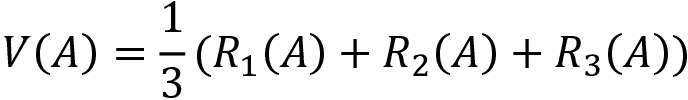
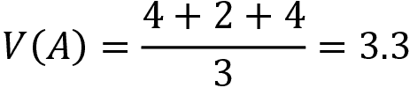
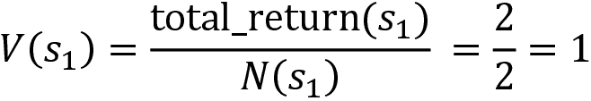
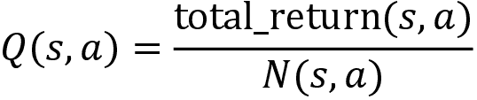
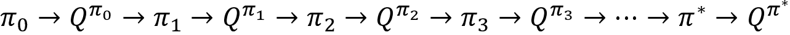

# 第四章：蒙特卡罗方法

在上一章中，我们学习了如何使用两种有趣的动态规划方法：值迭代和策略迭代来计算最优策略。动态规划是一种基于模型的方法，需要环境的模型动态来计算价值和 Q 函数，从而找到最优策略。

但假设我们没有环境的模型动态。在这种情况下，我们如何计算价值和 Q 函数呢？这时我们就会使用无模型的方法。无模型方法不需要环境的模型动态来计算价值和 Q 函数，从而找到最优策略。一个常见的无模型方法就是**蒙特卡罗**（**MC**）方法。

我们将从理解蒙特卡罗方法开始，然后介绍强化学习中两个重要的任务类型：预测任务和控制任务。随后，我们将学习蒙特卡罗方法如何在强化学习中应用，并了解它相比于上一章我们学习的动态规划方法有哪些优势。接下来，我们将了解蒙特卡罗预测方法及其不同类型，并学习如何使用蒙特卡罗预测方法训练智能体玩二十一点。

接下来，我们将学习蒙特卡罗控制方法以及不同类型的蒙特卡罗控制方法。之后，我们将学习如何使用蒙特卡罗控制方法训练智能体玩二十一点。

总结来说，在本章中，我们将学习以下内容：

+   理解蒙特卡罗方法

+   预测与控制任务

+   蒙特卡罗预测方法

+   使用蒙特卡罗预测方法玩二十一点

+   蒙特卡罗控制方法

+   使用蒙特卡罗控制方法玩二十一点

# 理解蒙特卡罗方法

在理解蒙特卡罗方法在强化学习中的应用之前，首先让我们了解蒙特卡罗方法是什么以及它是如何工作的。蒙特卡罗方法是一种统计技术，通过抽样来找到近似解。

例如，蒙特卡罗方法通过抽样来近似随机变量的期望值，当样本量增大时，近似效果会更好。假设我们有一个随机变量`X`，并且需要计算`X`的期望值；也就是*E(X)*，那么我们可以通过将`X`的值乘以它们各自的概率并求和来计算，如下所示：


但我们能否用蒙特卡罗方法来近似计算期望值呢？可以！我们可以通过对`X`进行`N`次抽样，并计算`X`的平均值来估算`X`的期望值，具体如下：


当`N`更大时，我们的近似值将更准确。因此，通过蒙特卡罗方法，我们可以通过采样来逼近解决方案，并且当样本量较大时，我们的近似值会更好。

在接下来的章节中，我们将学习蒙特卡罗方法在强化学习中是如何被使用的。

# 预测与控制任务

在强化学习中，我们执行两个重要的任务，它们是：

+   预测任务

+   控制任务

## 预测任务

在预测任务中，给定一个策略  作为输入，我们尝试使用给定策略预测值函数或 Q 函数。那么这样做有什么用呢？我们的目标是评估给定的策略。也就是说，我们需要判断给定策略是好是坏。我们如何判断呢？如果代理使用给定策略获得了良好的回报，那么我们可以说这个策略是好的。因此，为了评估给定的策略，我们需要了解代理使用该策略时能获得的回报。为了获得回报，我们通过给定策略预测值函数或 Q 函数。

也就是说，我们学到值函数或状态的值表示代理从该状态开始，遵循某个策略  所获得的期望回报。因此，通过使用给定策略  预测值函数，我们可以理解代理在每个状态下，如果使用给定策略  时所获得的期望回报。如果回报很好，那么我们可以说给定的策略是好的。

同样，我们已经学到，Q 函数或 Q 值表示代理从状态`s`和动作`a`开始，遵循策略  时获得的期望回报。因此，通过使用给定策略  预测 Q 函数，我们可以理解代理在每个状态-动作对中，如果使用给定策略时所获得的期望回报。如果回报很好，那么我们可以说给定的策略是好的。

因此，我们可以通过计算值函数和 Q 函数来评估给定策略 。

请注意，在预测任务中，我们不会对给定的输入策略做任何修改。我们保持给定的策略不变，并使用给定策略预测值函数或 Q 函数，得到期望的回报。基于期望回报，我们评估给定的策略。

## 控制任务

与预测任务不同，在控制任务中，我们不会获得任何策略作为输入。在控制任务中，我们的目标是找到最优策略。因此，我们将从初始化一个随机策略开始，并尝试迭代地找到最优策略。也就是说，我们尝试找到一个能提供最大回报的最优策略。

简而言之，在预测任务中，我们通过预测价值函数或 Q 函数来评估给定的输入策略，这有助于我们理解如果一个智能体使用给定的策略，它所获得的期望回报；而在控制任务中，我们的目标是找到最优策略，并且不会提供任何策略作为输入；因此，我们将从初始化一个随机策略开始，并且通过迭代的方式来寻找最优策略。

现在我们已经理解了预测和控制任务是什么，在下一节中，我们将学习如何使用蒙特卡罗方法执行预测和控制任务。

# 蒙特卡罗预测

在本节中，我们将学习如何使用蒙特卡罗方法来执行预测任务。我们已经学到，在预测任务中，我们会给定一个策略，然后通过预测价值函数或 Q 函数来评估该策略。首先，我们将学习如何使用蒙特卡罗方法预测给定策略的价值函数。接下来，我们将学习如何预测给定策略的 Q 函数。好了，让我们开始这一节。

为什么我们需要使用蒙特卡罗方法来预测给定策略的价值函数？为什么我们不能使用前一章学到的动态规划方法来预测价值函数呢？我们学到，要使用动态规划方法计算价值函数，我们需要知道模型的动态（转移概率），而当我们不知道模型动态时，就需要使用无模型方法。

蒙特卡罗方法是一种无模型方法，这意味着它不需要模型动态来计算价值函数。

首先，让我们回顾一下价值函数的定义。价值函数，或者说状态`s`的价值，可以定义为从状态`s`开始并遵循策略的智能体所获得的期望回报！[](img/B15558_04_010.png)。它可以表示为：


好的，我们如何使用蒙特卡罗方法来估计状态的价值（价值函数）呢？在本章开始时，我们了解到蒙特卡罗方法通过采样来近似随机变量的期望值，并且当样本量增大时，近似效果会更好。我们能否利用蒙特卡罗方法的这个概念来预测状态的价值呢？可以！

为了使用蒙特卡罗方法近似状态的价值，我们将按照给定策略！[](img/B15558_04_012.png)进行若干`N`次试验采样（轨迹），然后我们计算状态的价值，作为这些试验中状态的平均回报，它可以表示为：


从前面的方程中，我们可以理解，状态`s`的价值可以通过计算在若干`N`次试验中，状态`s`的平均回报来近似。当`N`增大时，我们的近似会更准确。

简而言之，在蒙特卡洛预测方法中，我们通过在`N`个回合中取一个状态的平均回报来近似该状态的值，而不是取期望回报。

好的，让我们通过一个例子更好地理解蒙特卡洛方法如何估计状态的值（价值函数）。我们以我们最喜欢的网格世界环境为例，该环境在*第一章*《强化学习基础》中已介绍，如*图 4.1*所示。我们的目标是从状态`A`到达状态`I`，而不经过阴影状态，代理在访问未阴影状态时获得+1 奖励，在访问阴影状态时获得-1 奖励：


图 4.1：网格世界环境

假设我们有一个随机策略 。假设在状态`A`中，我们的随机策略  80%的时间选择动作*下*，20%的时间选择动作*右*，并且在状态`D`和`E`中选择动作*右*，在状态`B`和`F`中选择动作*下*，且选择的概率为 100%。

首先，我们使用给定的随机策略  生成一个回合 ，如*图 4.2*所示：


图 4.2：回合 

为了更好地理解，让我们只关注状态`A`。现在让我们计算状态`A`的回报。一个状态的回报是从该状态开始的轨迹上的奖励总和。因此，状态`A`的回报计算为 `R`1 = 1+1+1+1 = 4，其中`R[1]`中的下标 1 表示来自回合 1 的回报。

假设我们生成了另一集 ，使用与*图 4.3*所示相同的随机策略 ：


图 4.3：回合 

现在让我们计算状态`A`的回报。状态`A`的回报是 `R`2 = -1+1+1+1 = 2。

假设我们生成了另一集 ，使用与*图 4.4*所示相同的随机策略 ：


图 4.4：回合 

现在让我们计算状态`A`的回报。状态`A`的回报是 `R`3 = 1+1+1+1 = 4。

因此，我们生成了三个回合，并计算了状态`A`在所有三个回合中的回报。现在，我们如何计算状态`A`的值呢？我们了解到，在蒙特卡洛方法中，状态的值可以通过计算该状态在`N`个回合中的平均回报来近似（轨迹）：


我们需要计算状态`A`的值，因此我们可以通过取状态`A`在`N`个回合中的平均回报来计算它，如下所示：


我们生成了三个回合，因此：



因此，状态`A`的价值为 3.3。同样地，我们可以通过仅仅计算该状态在三个回合中的平均回报来计算所有其他状态的价值。

为了便于理解，在前面的例子中，我们只生成了三个回合。为了找到更好、更准确的状态价值估计，我们应该生成更多回合（而不仅仅是三个），并计算状态的平均回报作为该状态的价值。

因此，在蒙特卡洛预测方法中，使用给定的输入策略  来预测一个状态的价值（价值函数），我们通过给定的策略生成一些 `N` 个回合，然后计算该状态的价值作为这些 `N` 个回合中该状态的平均回报。

请注意，在计算状态的回报时，我们也可以包括折扣因子并计算折扣回报，但为了简化起见，我们这里不包括折扣因子。

现在，我们已经对蒙特卡洛预测方法如何预测给定策略的价值函数有了基本的了解，接下来让我们通过理解蒙特卡洛预测方法的算法来更详细地探讨这一方法。

## MC 预测算法

蒙特卡洛预测算法如下所示：

1.  让 total_return(`s`) 表示一个状态在多个回合中的回报总和，`N`(`s`) 表示计数器，即该状态在多个回合中被访问的次数。将 total_return(`s`) 和 `N`(`s`) 对所有状态初始化为零。策略  作为输入。

1.  对于 `M` 次迭代：

    1.  使用策略  生成一个回合

    1.  将回合中获得的所有奖励存储在名为 rewards 的列表中

    1.  对于回合中的每一步 `t`：

        1.  将状态 `sₜ` 的回报计算为 `R`(`sₜ`) = sum(rewards[t:])

        1.  更新状态 `sₜ` 的回报总和为 total_returns(`sₜ`) = total_return(`sₜ`) + R(`sₜ`)

        1.  更新计数器为 `N`(`sₜ`) = `N`(`sₜ`) + 1

1.  通过仅仅计算平均值来求一个状态的价值，即：

上述算法表明，状态的价值就是该状态在多个回合中的平均回报。

为了更好地理解前面的算法是如何工作的，我们通过一个简单的例子手动计算每个状态的价值。假设我们需要计算三个状态 `s[0]`、`s[1]` 和 `s[2]` 的价值。我们知道，在从一个状态过渡到另一个状态时，我们会获得奖励。因此，最终状态的奖励将为 0，因为我们不会从最终状态进行任何过渡。因此，最终状态 `s[2]` 的价值为零。现在，我们需要找到两个状态 `s[0]` 和 `s[1]` 的价值。

接下来的章节将通过手动计算进行说明，便于理解，请准备好笔和纸跟随练习。

**步骤 1**：

如*表 4.1*所示，将所有状态的 total_returns(`s`) 和 `N`(`s`) 初始化为零：


表 4.1：初始值

假设我们给定一个随机策略 ；在状态 `s[0]`，我们的随机策略以 50% 的概率选择动作 0，50% 的概率选择动作 1，而在状态 `s[1]` 以 100% 的概率选择动作 1。

**步骤 2：第一次迭代**：

使用给定的输入策略生成一个回合，如*图 4.5*所示：


图 4.5：使用给定策略生成回合 

将在该回合中获得的所有奖励存储在名为 rewards 的列表中。因此，rewards = [1, 1]。

首先，我们计算状态 `s[0]` 的回报（即从 `s[0]` 开始的奖励总和）：


更新表格中状态 `s[0]` 的总回报如下：


更新表格中状态 `s[0]` 被访问的次数如下：


现在，让我们计算状态 `s[1]` 的回报（即从 `s[1]` 开始的奖励总和）：


更新表格中状态 `s[1]` 的总回报如下：


更新表格中状态 `s[1]` 被访问的次数如下：


经过第一次迭代后的更新表格如下：


表 4.2：第一次迭代后的更新表格

**第二次迭代：**

假设我们使用相同的给定策略生成另一个回合，正如*图 4.6*所示：


图 4.6：使用给定策略生成回合 

将在该回合中获得的所有奖励存储在名为 rewards 的列表中。因此，rewards = [3, 1]。

首先，我们计算状态 `s[0]` 的回报（即从 `s[0]` 开始的奖励总和）：


更新表格中状态 `s[0]` 的总回报如下：


更新表格中状态 `s[0]` 被访问的次数如下：


现在，让我们计算状态 `s[1]` 的回报（即从 `s[1]` 开始的奖励总和）：


更新表格中状态 `s[1]` 的回报如下：


更新状态被访问的次数：


我们在第二次迭代后的更新表格如下：


表 4.3：第二次迭代后的更新表格

由于我们正在手动计算，为了简单起见，我们就止步于两次迭代；也就是说，我们只生成了两个回合。

**步骤 3：**

现在，我们可以计算状态的值如下：


因此：



因此，我们通过在多个回合中计算平均回报来估算状态的值。注意，在上述示例中，为了进行手动计算，我们只生成了两个回合，但为了更好地估算状态的值，我们应该生成多个回合，然后计算这些回合的平均回报（而不仅仅是 2 个回合）。

## 蒙特卡洛预测的类型

我们刚刚学到了蒙特卡洛预测算法的工作原理。我们可以将蒙特卡洛预测算法分为两种类型：

+   首次访问蒙特卡洛方法

+   每次访问蒙特卡洛方法

### 首次访问蒙特卡洛方法

我们已经学过，在蒙特卡洛预测方法中，我们通过在多个回合中取一个状态的平均回报来估计该状态的值。我们知道，在每个回合中，一个状态可能会被访问多次。在首次访问蒙特卡洛方法中，如果同一状态在同一个回合中再次被访问，我们不会再次计算该状态的回报。例如，考虑一个代理玩蛇梯游戏的情况。如果代理踩到蛇，那么很有可能它会回到一个之前访问过的状态。因此，当代理重新访问相同的状态时，我们不会第二次计算该状态的回报。

以下展示了首次访问蒙特卡洛算法；正如粗体部分所述，只有在状态 `sₜ` 在回合中第一次出现时，我们才会计算该状态的回报：

1.  设 total_return(`s`) 为该状态在多个回合中的回报总和，`N`(`s`) 为计数器，即该状态在多个回合中被访问的次数。将所有状态的 total_return(`s`) 和 `N`(`s`) 初始化为零。输入给定策略 

1.  对于 `M` 次迭代：

    1.  使用策略生成一个回合 

    1.  将回合中获得的所有奖励存储在名为 rewards 的列表中

    1.  对于回合中的每一步 `t`：

        **如果** **状态 s**[t] **在回合中首次出现：**

        1.  计算状态 `sₜ` 的回报为 `R`(`sₜ`) = sum(rewards[t:])

        1.  将状态 `sₜ` 的总回报更新为 total_return(`sₜ`) = total_return(`sₜ`) + R(`sₜ`)

        1.  更新计数器为 `N`(`sₜ`) = `N`(`sₜ`) + 1

1.  通过取平均值来计算状态的值，即：

### 每次访问蒙特卡洛方法

如你所料，每次访问蒙特卡洛方法正好是首次访问蒙特卡洛方法的相反。在这里，我们每次访问到一个状态时，都会计算该状态的回报。每次访问蒙特卡洛算法与我们之前在本节开始时看到的算法是相同的，具体如下：

1.  设 total_return(`s`) 为该状态在多个回合中的回报总和，`N`(`s`) 为计数器，即该状态在多个回合中被访问的次数。将所有状态的 total_return(`s`) 和 `N`(`s`) 初始化为零。输入给定策略 

1.  对于 `M` 次迭代：

    1.  使用策略生成一个回合 

    1.  将回合中获得的所有奖励存储在名为 rewards 的列表中

    1.  对于回合中的每一步 `t`：

        1.  计算状态 `sₜ` 的回报为 `R`(`sₜ`) = sum(rewards[t:])

        1.  更新状态 `sₜ` 的总回报：total_return(`sₜ`) = total_return(`sₜ`) + R(`sₜ`)

        1.  更新计数器：`N`(`sₜ`) = `N`(`sₜ`) + 1

1.  通过计算一个状态的平均值来获得该状态的值，即：

请记住，第一次访问 MC（First-Visit MC）和每次访问 MC（Every-Visit MC）方法之间的唯一区别在于，在第一次访问 MC 方法中，我们只计算某个状态在该回合第一次出现时的回报；而在每次访问 MC 方法中，我们会在每次访问该状态时计算回报。我们可以根据所解决的问题选择使用第一次访问 MC 或每次访问 MC 方法。

现在我们已经理解了蒙特卡洛预测方法如何预测给定策略的值函数，在下一节中，我们将学习如何实现蒙特卡洛预测方法。

## 实现蒙特卡洛预测方法

如果你喜欢玩纸牌游戏，那么这一节肯定会让你感兴趣。在这一节中，我们将学习如何使用蒙特卡洛预测方法来玩二十一点。在深入之前，先让我们了解一下二十一点游戏的规则和玩法。

### 了解二十一点游戏

二十一点，也被称为**21 点**，是最受欢迎的纸牌游戏之一。游戏由玩家和庄家组成。玩家的目标是使所有牌的总和为 21 或比庄家的牌总和更大，但不得超过 21。如果满足其中一个条件，玩家就赢得游戏；否则庄家赢得游戏。让我们更详细地了解这一点。

**Jack（J）**、**King（K）** 和 **Queen（Q）** 的牌值都将视为 10。**Ace（A）** 的值可以是 1 或 11，这取决于玩家的选择。也就是说，玩家可以决定在游戏中 **Ace** 的值是 1 还是 11。其他牌（`2` 到 **10**）的值即为其面值。例如，牌 `2` 的值为 2，牌 `3` 的值为 3，依此类推。

我们了解到，这个游戏由玩家和庄家组成。游戏中可以有多个玩家，但只有一个庄家。所有玩家与庄家竞争，而不是与其他玩家竞争。我们来考虑一个只有一个玩家和一个庄家的情况。让我们通过玩游戏并分析不同的情况来理解二十一点。假设我们是玩家，正在与庄家竞争。

**案例 1：当玩家赢得游戏时**

最初，玩家会被发两张牌。两张牌都面朝上，也就是说，玩家的两张牌对庄家都是可见的。类似地，庄家也会发两张牌，但庄家的一张牌面朝上，另一张面朝下。也就是说，庄家只展示他们的一张牌。

如我们在*图 4.7*中所见，玩家有两张卡牌（都面朝上），而庄家也有两张卡牌（其中一张面朝上）：


图 4.7：玩家的总牌面为 20，庄家有一张牌面朝下的 2

现在，玩家执行两个动作中的一个，即**要牌**和**停牌**。如果我们（玩家）选择执行**要牌**，我们将再拿一张牌。如果我们选择**停牌**，则表示我们不再需要任何牌，并告诉庄家亮出他们的所有牌。无论谁的牌面总和等于 21，或者比对方更大但不超过 21，就赢得游戏。

我们了解到，`J`、`K`和`Q`的牌值为 10。如*图 4.7*所示，我们手中有`J`和`K`两张牌，它们的总和是 20（10+10）。因此，我们的牌面总和已经是一个大数，并且没有超过 21。所以我们选择**停牌**，这一动作告诉庄家亮出他们的牌。如*图 4.8*所示，庄家现在已展示出他们的所有牌，庄家的牌面总和为 12，而我们的（玩家的）牌面总和为 20，这个总和更大，并且也没有超过 21，因此我们赢得了游戏。


图 4.8：玩家获胜！

**案例 2：玩家输掉游戏**

*图 4.9*显示我们有两张牌，庄家也有两张牌，但庄家只有一张牌是我们可见的：


图 4.9：玩家的总牌面为 13，庄家有一张牌面朝下的 7

现在，我们必须决定是（执行动作）“要牌”还是“停牌”。*图 4.9*显示我们有两张牌，`K`和`3`，它们的总和是 13（10+3）。让我们稍微乐观一些，希望庄家的牌面总和不会超过我们的。因此，我们选择**停牌**，这一动作告诉庄家亮出他们的牌。如*图 4.10*所示，庄家的牌面总和为 17，而我们的总和只有 13，所以我们输掉了游戏。也就是说，庄家的牌面总和比我们大，并且没有超过 21，因此庄家赢得了游戏，而我们输了：


图 4.10：庄家获胜！

**案例 3：玩家爆掉**

*图 4.11*显示我们有两张牌，庄家也有两张牌，但庄家只有一张牌是我们可见的：


图 4.11：玩家的总牌面为 8，庄家有一张牌面朝下的 10

现在，我们必须决定是（执行动作）“要牌”还是“停牌”。我们已经了解到，游戏的目标是让牌面总和为 21，或者比庄家的牌面总和大，但不超过 21。目前，我们的牌面总和是 3+5 = 8。因此，我们选择**要牌**，以便增加我们的牌面总和。在我们**要牌**之后，我们收到了如*图 4.12*所示的新牌：


图 4.12：玩家的总牌面为 18，庄家有一张牌面朝下的 10

如我们所见，我们得到了新的一张牌。现在，我们的牌的总点数是 3+5+10 = 18。再次，我们需要决定是否（执行操作）要牌或停牌。让我们有点贪心，选择（执行操作）**要牌**，以便我们可以稍微增加我们的点数。如*图 4.13*所示，我们**要牌**并得到了一张新牌，但现在我们的牌的总点数变为 3+5+10+10 = 28，超过了 21，这就是所谓的**爆掉**，我们输掉了游戏：


图 4.13：玩家爆掉了！

**案例 4：可用的 A**

我们知道`A`的点数可以是 1 或 11，玩家可以在游戏过程中决定`A`的点数。让我们学习一下这是如何运作的。如*图 4.14*所示，我们被发了两张牌，庄家也有两张牌，其中只有一张庄家的牌是面朝上的：


图 4.14：玩家的点数是 10，庄家的点数是 5，且有一张牌是面朝下的

如我们所见，我们的牌的总点数是 5+5 = 10。因此，我们选择**要牌**以便可以增加我们的点数。如*图 4.15*所示，在执行要牌操作后，我们获得了一张新牌，它是一张`A`。现在，我们可以决定将`A`的点数定为 1 或 11。如果我们将`A`的点数定为 1，那么我们的牌的总点数将是 5+5+1 = 11。如果我们将`A`的点数定为 11，那么我们的牌的总点数将是 5+5+11 = 21。在这种情况下，我们将`A`的点数定为 11，以便我们的点数变为 21。

因此，我们将`A`的点数定为 11 并赢得了游戏，在这种情况下，`A`被称为可用的`A`，因为它帮助我们赢得了游戏：


图 4.15：玩家将`A`视为 11 并赢得了游戏

**案例 5：不可用的 A**

*图 4.16*显示我们有两张牌，庄家也有两张牌，其中一张是面朝上的：


图 4.16：玩家的点数是 13，庄家的点数是 10，且有一张牌是面朝下的

如我们所见，我们的牌的总点数是 13（10+3）。我们（执行操作）**要牌**，以便我们可以稍微增加我们的点数：


图 4.17：玩家必须将`A`视为 1，否则将爆掉

如*图 4.17*所示，我们**要牌**并获得了一张新牌，它是一张`A`。现在我们可以决定将`A`的点数定为 1 或 11。如果我们选择 11，那么我们的点数将变为 10+3+11 = 23。如我们所观察到的，当我们将`A`定为 11 时，我们的总点数超过了 21，因此我们输了游戏。因此，我们不选择将`A`定为 11，而是将`A`的点数定为 1，这样我们的总点数就变为 10+3+1 = 14。

同样，我们需要决定是执行（执行动作）hit 还是 stand。假设我们选择站立，希望庄家的牌面总和低于我们的牌面总和。正如 *图 4.18* 所示，执行站立动作后，庄家的两张牌都会显示，庄家的牌总和是 20，而我们的只有 14，所以我们输了游戏，在这种情况下，**Ace** 被称为**不可用的** **Ace**，因为它并没有帮助我们赢得游戏。


图 4.18：玩家的牌是 14，庄家的牌是 20，庄家获胜

**案例 6：当游戏是平局时**

如果玩家和庄家的牌面总和相同，比如都是 20，则游戏称为平局。

现在我们已经了解了如何玩 blackjack，接下来让我们在 blackjack 游戏中实现蒙特卡洛预测方法。但在继续之前，首先让我们了解一下 Gym 中 blackjack 环境的设计。

### Gym 库中的 blackjack 环境

导入 Gym 库：

```py
import gym 
```

blackjack 环境的 ID 是 `Blackjack-v0`。因此，我们可以使用如下的 `make` 函数来创建 blackjack 游戏：

```py
env = gym.make('Blackjack-v0') 
```

现在，让我们看看 blackjack 环境的状态；我们可以重置环境并查看初始状态：

```py
print(env.reset()) 
```

请注意，每次运行前面的代码时，我们可能会得到不同的结果，因为初始状态是随机初始化的。前面的代码将打印如下内容：

```py
(15, 9, True) 
```

如我们所见，状态表示为一个元组，那么这意味着什么呢？我们了解到，在 blackjack 游戏中，玩家会得到两张牌，并且还可以看到庄家的其中一张牌。因此，`15`表示我们手中牌的总值，`9`表示庄家一张牌的面值，`True`表示我们有可用的 Ace，如果没有可用的 Ace，则为`False`。

因此，在 blackjack 环境中，状态表示为由三个值组成的元组：

1.  我们手中牌的总和

1.  庄家一张牌的面值

1.  布尔值——如果我们有可用的 Ace，则为`True`，如果没有可用的 Ace，则为`False`

让我们看看 blackjack 环境的动作空间：

```py
print(env.action_space) 
```

前面的代码将打印：

```py
Discrete(2) 
```

如我们所见，这意味着我们的动作空间中有两个动作，分别是 0 和 1：

+   动作**stand**用 0 来表示

+   动作**hit**用 1 来表示

好的，那么奖励如何呢？奖励将按照如下方式分配：

+   如果我们赢得游戏，奖励为**+1.0**

+   如果我们输掉游戏，奖励为**-1.0**

+   如果游戏是平局，奖励为`0`

现在我们已经理解了 Gym 中 blackjack 环境的设计，接下来让我们在 blackjack 游戏中实现 MC 预测方法。首先，我们将研究每次访问的 MC，然后学习如何实现首次访问的 MC 预测。

### 每次访问的 MC 预测与 blackjack 游戏

为了清晰理解这一部分，你应该回顾一下我们之前学习的每次访问蒙特卡罗方法。现在，让我们一步步理解如何用黑杰克游戏实现每次访问的蒙特卡罗预测：

导入必要的库：

```py
import gym
import pandas as pd
from collections import defaultdict 
```

创建一个黑杰克环境：

```py
env = gym.make('Blackjack-v0') 
```

#### 定义策略

我们了解到，在预测方法中，我们将获得一个输入策略，并预测该输入策略的价值函数。因此，现在我们首先定义一个策略函数，作为输入策略。也就是说，我们定义了一个输入策略，其价值函数将在接下来的步骤中进行预测。

如下所示的代码，我们的策略函数以状态作为输入，如果**state[0]**，即我们牌的总和，值大于 19，那么它将返回动作`0`（停牌），否则它将返回动作`1`（要牌）：

```py
def policy(state):
    return 0 if state[0] > 19 else 1 
```

我们定义了一个最优策略：当我们的牌的总和已经大于 19 时，执行动作 0（停牌）更有意义。也就是说，当总和大于 19 时，我们不必执行动作 1（要牌），以避免再拿到一张牌可能导致我们输掉游戏或爆掉。

例如，让我们通过重置环境生成一个初始状态，如下所示：

```py
state = env.reset()
print(state) 
```

假设前面的代码打印了以下内容：

```py
(20, 5, False) 
```

正如我们所注意到的，`state[0] = 20`；也就是说，我们牌的总和是 20，因此在这种情况下，我们的策略将返回动作 0（停牌），如下所示：

```py
print(policy(state)) 
```

前面的代码将打印：

```py
0 
```

现在我们已经定义了策略，在接下来的部分中，我们将预测该策略的价值函数（状态值）。

#### 生成一集

接下来，我们使用给定的策略生成一集，因此我们定义了一个名为`generate_episode`的函数，该函数以策略作为输入，并使用给定的策略生成一集。

首先，让我们设定时间步数：

```py
num_timesteps = 100 
```

为了更清楚地理解，让我们逐行查看这个函数：

```py
def generate_episode(policy): 
```

让我们定义一个名为`episode`的列表，用于存储集：

```py
 episode = [] 
```

通过重置环境来初始化状态：

```py
 state = env.reset() 
```

然后，对于每一个时间步：

```py
 for t in range(num_timesteps): 
```

根据给定的策略选择动作：

```py
 action = policy(state) 
```

执行动作并存储下一个状态信息：

```py
 next_state, reward, done, info = env.step(action) 
```

将状态、动作和奖励存入我们的集列表：

```py
 episode.append((state, action, reward)) 
```

如果下一个状态是最终状态，则跳出循环，否则将下一个状态更新为当前状态：

```py
 if done:
            break

        state = next_state
    return episode 
```

让我们看看`generate_episode`函数的输出是什么样子的。请注意，我们使用之前定义的策略生成了一集：

```py
print(generate_episode(policy)) 
```

前面的代码会打印如下内容：

```py
[((10, 2, False), 1, 0), ((20, 2, False), 0, 1.0)] 
```

如我们所见，我们的输出是**[(state, action, reward)]**的形式。如前所述，我们的集里有两个状态。在状态 `(10, 2, False)` 下，我们执行了动作 1（要牌），并且收到了 0 的奖励；在状态 `(20, 2, False)` 下，我们执行了动作 0（停牌），并且收到了 1.0 的奖励。

现在我们已经学会了如何使用给定的策略生成回合，接下来，我们将学习如何使用每次访问 MC 方法计算状态的值（值函数）。

#### 计算值函数

我们了解到，为了预测值函数，我们通过给定的策略生成多个回合，并将状态的值计算为多个回合中的平均回报。让我们看看如何实现这一点。

首先，我们将`total_return`和`N`定义为字典，分别用于存储回合中每个状态的总回报和该状态被访问的次数：

```py
total_return = defaultdict(float)
N = defaultdict(int) 
```

设置我们希望生成的迭代次数，即回合数：

```py
num_iterations = 500000 
```

然后，对于每次迭代：

```py
for i in range(num_iterations): 
```

使用给定的策略生成回合；即，使用我们之前定义的策略函数生成回合：

```py
 episode = generate_episode(policy) 
```

存储从回合中获得的所有状态、动作和奖励：

```py
 states, actions, rewards = zip(*episode) 
```

然后，对于回合中的每一步：

```py
 for t, state in enumerate(states): 
```

计算状态的回报`R`，作为奖励的总和，`R`(`sₜ`) = sum(rewards[t:])：

```py
 R = (sum(rewards[t:])) 
```

将状态的`total_return`更新为 total_return(`sₜ`) = total_return(`sₜ`) + R(`sₜ`)：

```py
 total_return[state] =  total_return[state] + R 
```

将状态在回合中被访问的次数更新为`N`(`sₜ`) = `N`(`sₜ`) + 1：

```py
 N[state] =  N[state] + 1 
```

在计算了`total_return`和`N`后，我们可以将它们转换为 pandas 数据框，以便更好地理解。请注意，这只是为了清晰地理解算法；我们不一定非得转换为 pandas 数据框，我们也可以仅通过使用字典来高效实现。

将`total_returns`字典转换为数据框：

```py
total_return = pd.DataFrame(total_return.items(),columns=['state', 'total_return']) 
```

将计数器`N`字典转换为数据框：

```py
N = pd.DataFrame(N.items(),columns=['state', 'N']) 
```

按状态合并两个数据框：

```py
df = pd.merge(total_return, N, on="state") 
```

查看数据框的前几行：

```py
df.head(10) 
```

上述代码将显示如下内容。正如我们所观察到的，我们有状态的总回报和访问次数：


图 4.19：状态的总回报和被访问的次数

接下来，我们可以计算状态的值作为平均回报：


因此，我们可以写出：

```py
df['value'] = df['total_return']/df['N'] 
```

我们来看一下数据框的前几行：

```py
df.head(10) 
```

上述代码将显示类似这样的内容：


图 4.20：值被计算为每个状态回报的平均值

正如我们可以观察到的，现在我们有了状态的值，这只是该状态在多个回合中的回报平均值。因此，我们成功地使用每次访问 MC 方法预测了给定策略的值函数。

好的，接下来我们检查一些状态的值，并了解根据给定策略我们估算的值函数有多准确。回想一下，当我们开始时，为了生成回合，我们使用了最优策略，当总和大于 19 时选择动作 0（停牌），当总和低于 19 时选择动作 1（要牌）\。

让我们评估状态 `(21,9,False)` 的值。正如我们所看到的，我们的牌面总和已经是 21，因此这是一个好状态，应该有较高的值。让我们看看我们估算的状态值：

```py
df[df['state']==(21,9,False)]['value'].values 
```

上述代码将打印类似如下内容：

```py
array([1.0]) 
```

如我们所观察到的，状态的值较高。

现在，让我们检查状态 `(5,8,False)` 的值。正如我们所注意到的，牌面总和仅为 5，即使庄家的单张牌值很高，达到了 8，在这种情况下，状态的值应该较低。让我们看看我们估算的状态值：

```py
df[df['state']==(5,8,False)]['value'].values 
```

上述代码将打印类似如下内容：

```py
array([-1.0]) 
```

如我们所见，状态的值较低。

因此，我们已经学会了如何使用每次访问蒙特卡洛预测方法预测给定策略的值函数。在下一节中，我们将学习如何使用首次访问蒙特卡洛方法计算状态的值。

### 使用黑杰克游戏的首次访问蒙特卡洛（MC）预测

使用首次访问蒙特卡洛方法预测值函数的方法与使用每次访问蒙特卡洛方法预测值函数的方式完全相同，唯一的区别是，这里我们只计算状态第一次在回合中出现时的返回值。首次访问蒙特卡洛的代码与我们在每次访问蒙特卡洛中看到的代码相同，只不过在这里，我们只计算状态第一次出现时的返回值，具体代码如下所示：

```py
for i in range(num_iterations):

    episode = generate_episode(env,policy)
    states, actions, rewards = zip(*episode)
    for t, state in enumerate(states):
 **if** **state** **not****in** **states[**`0`**:t]:**
            R = (sum(rewards[t:]))
            total_return[state] = total_return[state] + R
            N[state] = N[state] + 1 
```

你可以从本书的 GitHub 仓库获取完整代码，并将获得与我们在每次访问蒙特卡洛部分看到的类似结果。

因此，我们已经学会了如何使用首次访问和每次访问蒙特卡洛方法预测给定策略的值函数。

## 增量均值更新

在首次访问蒙特卡洛和每次访问蒙特卡洛中，我们通过计算多个回合中状态的平均返回值（算术均值）来估算状态的值，具体如下所示：


我们不仅可以使用算术均值来近似状态的值，还可以使用增量均值，公式如下所示：


那么，为什么我们需要增量均值呢？考虑到我们的环境是非平稳的。在这种情况下，我们不需要将所有回合的状态返回值取平均。由于环境是非平稳的，我们可以忽略早期回合的返回值，仅使用最新回合的返回值来计算平均值。因此，我们可以使用增量均值来计算状态的值，具体如下所示：


其中  和 `Rₜ` 是状态 `sₜ` 的返回值。

## 蒙特卡洛预测（Q 函数）

到目前为止，我们已经学会了如何使用蒙特卡洛方法预测给定策略的值函数。在本节中，我们将看到如何使用蒙特卡洛方法预测给定策略的 Q 函数。

使用蒙特卡罗（MC）方法预测给定策略的 Q 函数与我们在前一节中预测价值函数的方式完全相同，只是这里我们使用状态-动作对的回报，而在价值函数的情况下，我们使用状态的回报。也就是说，就像我们通过计算多个回合中状态的平均回报来逼近状态的价值（价值函数），我们也可以通过计算多个回合中状态-动作对的平均回报来逼近状态-动作对的价值（Q 函数）。

因此，我们使用给定的策略  生成多个回合，然后计算 total_return(`s`, `a`)，即跨多个回合的状态-动作对回报之和，并且我们还计算 `N`(`s`, `a`)，即状态-动作对跨多个回合被访问的次数。然后，我们计算 Q 函数或 Q 值，即状态-动作对的平均回报，如下所示：



例如，考虑一个小示例。假设我们有两个状态 `s[0]` 和 `s[1]`，并且我们有两个可能的动作 0 和 1。现在，我们计算 total_return(`s`, `a`) 和 `N`(`s`, `a`)。假设我们计算后的表格如下所示，见 *表 4.4*：


表 4.4：两个状态中两个动作的结果

一旦我们得到这个，就可以通过简单地取平均来计算 Q 值，即：


因此，我们可以计算所有状态-动作对的 Q 值，如下所示：


使用蒙特卡罗方法预测 Q 函数的算法如下所示。如我们所见，它与我们使用状态回报预测价值函数的方式完全相同，只是这里我们使用状态-动作对的回报来预测 Q 函数：

1.  让 total_return(`s`, `a`) 为跨多个回合的状态-动作对回报之和，`N`(`s`, `a`) 为状态-动作对跨多个回合被访问的次数。将所有状态-动作对的 total_return(`s`, `a`) 和 `N`(`s`, `a`) 初始化为零。策略  作为输入给定。

1.  对于 `M` 次迭代：

    1.  使用策略  生成一个回合

    1.  将回合中获得的所有奖励存储在名为 rewards 的列表中

    1.  对于回合中的每一步 `t`：

        1.  计算状态-动作对的回报，`R`(`sₜ`, `aₜ`) = sum(rewards[t:])

        1.  更新状态-动作对的总回报，total_return(`sₜ`, `aₜ`) = total_return(`sₜ`, `aₜ`) + R(`sₜ`, `aₜ`)

        1.  更新计数器，`N`(`sₜ`, `aₜ`) = `N`(`sₜ`, `aₜ`) + 1

1.  通过简单地取平均来计算 Q 函数（Q 值），即：

回想一下，在 MC 预测值函数时，我们学到了两种类型的 MC——首次访问 MC 和每次访问 MC。在首次访问 MC 中，我们仅计算状态第一次在回合中被访问时的回报，而在每次访问 MC 中，我们计算状态每次在回合中被访问时的回报。

类似地，在 MC 预测 Q 函数时，我们有两种类型的 MC——首次访问 MC 和每次访问 MC。在首次访问 MC 中，我们仅计算状态-动作对第一次在回合中被访问时的回报，而在每次访问 MC 中，我们计算状态-动作对每次在回合中被访问时的回报。

如前一节所述，除了使用算术平均值外，我们还可以使用增量平均值。我们学到的是，状态的值可以通过增量平均值来计算，公式如下：


类似地，我们也可以使用增量平均值计算 Q 值，如下所示：


现在我们已经学会了如何使用蒙特卡洛方法执行预测任务，在接下来的部分，我们将学习如何使用蒙特卡洛方法执行控制任务。

# 蒙特卡洛控制

在控制任务中，我们的目标是找到最优策略。与预测任务不同，在这里，我们不会给定任何策略作为输入。因此，我们将从初始化一个随机策略开始，然后我们尝试通过迭代找到最优策略。也就是说，我们尝试找到一个能带来最大回报的最优策略。在本节中，我们将学习如何使用蒙特卡洛方法执行控制任务以找到最优策略。

好的，我们学到的是，在控制任务中我们的目标是找到最优策略。首先，我们如何计算一个策略？我们学到的是，策略可以从 Q 函数中提取。也就是说，如果我们有一个 Q 函数，那么我们可以通过在每个状态中选择具有最大 Q 值的动作来提取策略，正如下图所示：


因此，为了计算策略，我们需要计算 Q 函数。那么，我们如何计算 Q 函数呢？我们可以像在 MC 预测方法中那样计算 Q 函数。也就是说，在 MC 预测方法中，我们学到的是，当给定一个策略时，我们可以使用该策略生成多个回合，并计算 Q 函数（Q 值），作为状态-动作对在多个回合中的平均回报。

我们可以在这里执行相同的步骤来计算 Q 函数。但在控制方法中，我们并没有给定任何策略作为输入。因此，我们将初始化一个随机策略，然后使用这个随机策略计算 Q 函数。也就是说，就像我们在预测方法中学到的那样，我们使用随机策略生成多个回合。然后，我们计算 Q 函数（Q 值），作为状态-动作对在多个回合中的平均回报，正如下图所示：


假设在计算 Q 函数作为状态-动作对的平均回报后，我们的 Q 函数看起来像*表 4.5*：


表 4.5：Q 表

从之前的 Q 函数中，我们可以通过选择每个状态下具有最大 Q 值的动作来提取新的策略。也就是说，。因此，我们的新策略在状态`s[0]`选择动作 0，在状态`s[1]`选择动作 1，因为它们具有最大的 Q 值。

然而，这个新策略不一定是最优策略，因为这个新策略是从 Q 函数中提取的，而 Q 函数是使用随机策略计算的。也就是说，我们初始化了一个随机策略，并使用该随机策略生成了多个回合，然后通过取多个回合中的状态-动作对的平均回报来计算 Q 函数。因此，我们使用随机策略计算 Q 函数，所以从 Q 函数中提取出的新策略将不会是最优策略。

但是，现在我们已经从 Q 函数中提取出了新的策略，我们可以使用这个新策略在下一次迭代中生成新的回合并计算新的 Q 函数。然后，从这个新的 Q 函数中，我们提取出新的策略。我们反复执行这些步骤，直到找到最优策略。以下步骤清晰地解释了这一过程：

**第 1 次迭代—**设！[](img/B15558_04_081.png)为随机策略。我们使用这个随机策略生成一个回合，然后通过取状态-动作对的平均回报来计算 Q 函数！[](img/B15558_04_082.png)。然后，从这个 Q 函数！[](img/B15558_04_083.png)中，我们提取出新的策略！[](img/B15558_04_084.png)。这个新策略！[](img/B15558_04_085.png)将不会是最优策略，因为它是从 Q 函数中提取的，而 Q 函数是使用随机策略计算的。

**第 2 次迭代—**因此，我们使用从上一次迭代中推导出的新策略！[](img/B15558_04_086.png)来生成回合并计算新的 Q 函数！[](img/B15558_04_087.png)，作为状态-动作对的平均回报。然后，从这个 Q 函数！[](img/B15558_04_088.png)中，我们提取出新的策略！[](img/B15558_03_158.png)。如果策略！[](img/B15558_03_158.png)是最优的，我们就停止，否则进入第 3 次迭代。

**第 3 次迭代—**现在，我们使用从上一次迭代中推导出的新策略！[](img/B15558_03_159.png)来生成回合并计算新的 Q 函数！[](img/B15558_04_092.png)。然后，从这个 Q 函数！[](img/B15558_04_092.png)中，我们提取出新的策略！[](img/B15558_04_094.png)。如果！[](img/B15558_04_094.png)是最优的，我们就停止，否则进入下一次迭代。

我们重复这个过程进行多次迭代，直到找到最优策略！[](img/B15558_04_096.png)，如*图 4.21*所示：



图 4.21：寻找最优策略的路径

这一步称为策略评估与改进，类似于我们在*第三章*《贝尔曼方程与动态规划》中讨论的策略迭代方法。策略评估意味着在每一步我们评估策略；策略改进意味着在每一步我们通过选择最大 Q 值来改进策略。请注意，这里我们采用贪婪方式选择策略，即通过选择最大 Q 值来选择策略 ，因此我们可以称我们的策略为贪婪策略。

现在我们对 MC 控制方法的基本工作原理有了基本了解，在下一节中，我们将深入探讨 MC 控制方法的算法，并对其进行更详细的学习。

## MC 控制算法

以下步骤展示了蒙特卡洛控制算法。正如我们观察到的，与 MC 预测方法不同，这里我们不会给出任何策略。因此，我们首先通过初始化随机策略并使用该随机策略生成一个回合作为第一轮迭代。然后，我们将计算 Q 函数（Q 值），作为状态-动作对的平均回报。

一旦得到 Q 函数，我们通过选择每个状态中具有最大 Q 值的动作来提取新策略。在下一次迭代中，我们使用提取出的新策略生成一个回合，并计算新的 Q 函数（Q 值），作为状态-动作对的平均回报。我们重复这些步骤多次迭代，以找到最优策略。

还有一点，我们需要注意，就像我们在首次访问 MC 预测方法中学习到的那样，这里我们只计算状态-动作对在回合中首次访问时的回报。

为了更好地理解，我们可以将 MC 控制算法与 Q 函数的 MC 预测进行比较。我们可以观察到的一个区别是，在这里，我们在每次迭代中计算 Q 函数。但如果你注意到，在 Q 函数的 MC 预测中，我们是在所有迭代完成后计算 Q 函数。这里在每次迭代中计算 Q 函数的原因是，我们需要 Q 函数来提取新策略，以便在下一次迭代中使用提取的新策略生成回合：

1.  让 total_return(`s`, `a`)表示一个状态-动作对在多个回合中的回报总和，`N`(`s`, `a`)表示该状态-动作对在多个回合中被访问的次数。将所有状态-动作对的 total_return(`s`, `a`)和`N`(`s`, `a`)初始化为零，并初始化一个随机策略 

1.  对于`M`次迭代：

    1.  使用策略生成一个回合 

    1.  将回合中获得的所有奖励存储在名为 rewards 的列表中

    1.  对于每个回合中的步骤`t`：

        如果(`sₜ`, `aₜ`)在该回合中是第一次出现：

        1.  计算状态-动作对的回报，`R`(`sₜ`, `aₜ`) = sum(rewards[t:])

        1.  更新状态-行动对的总回报，公式为：total_return(`sₜ`, `aₜ`) = total_return(`sₜ`, `aₜ`) + R(`sₜ`, `aₜ`)

        1.  更新计数器，公式为：`N`(`sₜ`, `aₜ`) = `N`(`sₜ`, `aₜ`) + 1

        1.  通过简单取平均值来计算 Q 值，即：

    1.  使用 Q 函数计算新的更新策略 ：

从前面的算法中，我们可以观察到，我们使用策略生成一个历程。然后，对于历程中的每一步，我们计算状态-行动对的回报，并计算 Q 函数`Q`(`sₜ`, `aₜ`)作为平均回报，然后从这个 Q 函数中提取出新的策略。我们重复这一步骤，迭代地找到最优策略。这样，我们就学会了如何使用蒙特卡洛方法执行控制任务。

我们可以将控制方法分为两类：

+   在策略控制

+   脱策略控制

**在策略控制—**在在策略控制方法中，智能体使用一种策略进行行为，并尝试改进相同的策略。也就是说，在在策略方法中，我们使用一种策略生成历程，并迭代地改进相同的策略，以找到最优策略。例如，刚刚学习过的 MC 控制方法可以称为在策略 MC 控制，因为我们使用策略生成历程，并且在每次迭代中尝试改进相同的策略，以计算最优策略。

**脱策略控制—**在脱策略控制方法中，智能体使用一种策略`b`进行行为，并尝试改进另一种策略**。也就是说，在脱策略方法中，我们使用一种策略生成历程，并迭代地尝试改进另一种策略，以找到最优策略。

在接下来的章节中，我们将详细学习前面两种控制方法的具体工作原理。

## 在策略蒙特卡洛控制

有两种类型的在策略蒙特卡洛控制方法：

+   蒙特卡洛探索启动

+   使用 epsilon-greedy 策略的蒙特卡洛方法

### 蒙特卡洛探索启动

我们已经了解了蒙特卡洛控制方法的工作原理。有一点我们可能需要考虑的是探索。一个状态下可能有多个动作：有些动作是最优的，而有些则不是。为了理解一个动作是否最优，智能体必须通过执行该动作来进行探索。如果智能体从不探索一个特定的动作，它就永远不知道该动作是否是一个好动作。那么，如何解决这个问题呢？也就是说，我们如何确保足够的探索？这就是蒙特卡洛探索启动帮助我们的地方。

在 MC 探索起始状态方法中，我们为所有状态-动作对设置一个非零的概率，使其成为初始状态-动作对。因此，在生成情节之前，首先我们随机选择初始状态-动作对，然后按照策略  从该初始状态-动作对开始生成情节。接着，在每次迭代中，我们的策略将更新为贪心策略（选择最大 Q 值；更多细节请参见下一节关于 *蒙特卡洛与 epsilon-greedy 策略*）。

以下步骤展示了 MC 控制探索起始状态的算法。它本质上与我们之前在 MC 控制算法部分学到的相同，只是这里我们选择一个初始状态-动作对，并从该初始状态-动作对开始生成情节，如粗体部分所示：

1.  令 total_return(`s`, `a`) 为多个情节中状态-动作对的回报之和，`N`(`s`, `a`) 为多个情节中状态-动作对的访问次数。将所有状态-动作对的 total_return(`s`, `a`) 和 `N`(`s`, `a`) 初始化为零，并初始化一个随机策略 

1.  对于 `M` 次迭代：

    1.  **随机选择初始状态 s**`0` **和初始动作 a**`0` **，使得所有状态-动作对的概率大于 0**

    1.  使用策略  从选择的初始状态 `s[0]` 和初始动作 `a[0]` 开始生成一个情节

    1.  将情节中获得的所有奖励存储在名为 rewards 的列表中

    1.  对于情节中的每一步 `t`：

        如果 (`sₜ`, `aₜ`) 在该情节中第一次出现：

        1.  计算状态-动作对的回报，`R`(`sₜ`, `aₜ`) = sum(rewards[t:])

        1.  更新状态-动作对的总回报：total_return(`sₜ`, `aₜ`) = total_return(`sₜ`, `aₜ`) + R(`sₜ`, `aₜ`)

        1.  更新计数器：`N`(`sₜ`, `aₜ`) = `N`(`sₜ`, `aₜ`) + 1

        1.  通过直接取平均值来计算 Q 值，即：

    1.  使用 Q 函数计算更新后的策略 ：

探索起始状态方法的主要缺点之一是它不适用于每个环境。也就是说，我们不能随机选择任何状态-动作对作为初始状态-动作对，因为在某些环境中，可能只有一个状态-动作对可以作为初始状态-动作对。因此，我们不能随机选择状态-动作对作为初始状态-动作对。

例如，假设我们正在训练一个智能体玩赛车游戏；我们不能将情节从一个随机位置作为初始状态开始，也不能随机选择一个动作作为初始动作，因为我们有一个固定的单一起始状态和动作作为初始状态和动作。

因此，为了解决探索起始状态的问题，在下一节中，我们将学习蒙特卡洛控制方法，采用一种新的策略类型——epsilon-greedy 策略。

### 带有 epsilon-贪婪策略的蒙特卡洛方法

在继续之前，首先让我们理解什么是 epsilon-贪婪策略，因为它在强化学习中无处不在。

首先，让我们了解什么是贪婪策略。贪婪策略是选择当前时刻可用的最佳动作。例如，假设我们处于某个状态`A`，在该状态中有四个可能的动作。设这些动作为*上*、*下*、*左*和*右*。但假设我们的代理只在状态`A`中探索了两个动作，*上*和*右*，这两个动作在状态`A`中的 Q 值如*表 4.6*所示：


表 4.6：代理在状态 A 中仅探索了两个动作

我们了解到，贪婪策略选择当前时刻可用的最佳动作。因此，贪婪策略会检查 Q 表并选择在状态`A`中具有最大 Q 值的动作。正如我们所看到的，动作*上*具有最大的 Q 值。所以我们的贪婪策略在状态`A`中选择动作*上*。

但贪婪策略有一个问题，那就是它从不探索其他可能的动作；相反，它总是选择当前时刻可用的最佳动作。在前面的例子中，贪婪策略总是选择动作*上*。但在状态`A`中，可能有其他动作比代理尚未探索的动作*上*更优。也就是说，在状态`A`中，我们仍然有两个未探索的动作——*下*和*左*——它们可能比动作*上*更优。

所以，现在的问题是，代理是否应该探索状态中的所有其他动作，并将具有最大 Q 值的动作作为最佳动作，还是仅从已探索的动作中利用最优动作。这就是所谓的**探索-利用困境**。

假设从我们工作地点到家有很多条路线，而到目前为止我们只探索了两条路线。因此，为了回家，我们可以从已探索的两条路线中选择最快的那一条。然而，还有许多其他我们尚未探索的路线，它们可能比我们目前的最优路线更好。问题是我们是否应该探索新路线（探索），还是应该始终使用当前的最优路线（利用）。

为了避免这种困境，我们引入了一种新的策略，称为 epsilon-贪婪策略。在这种策略中，所有动作都有一个非零的概率（epsilon）被尝试。以概率 epsilon，我们随机探索不同的动作；以概率 1-epsilon，我们选择具有最大 Q 值的动作。也就是说，以概率 epsilon，我们选择一个随机动作（探索），以概率 1-epsilon，我们选择最佳动作（利用）。

在 epsilon-greedy 策略中，如果我们将 epsilon 的值设置为 0，那么它就变成了一个贪婪策略（仅利用），而当我们将 epsilon 的值设置为 1 时，我们将总是进行探索。因此，epsilon 的值必须在 0 和 1 之间进行最佳选择。

假设我们设置 epsilon = 0.5；然后我们将从均匀分布中生成一个随机数，如果该随机数小于 epsilon（0.5），则选择一个随机动作（探索）；但如果随机数大于或等于 epsilon，则选择最佳动作，也就是具有最大 Q 值的动作（利用）。

因此，通过这种方式，我们以 epsilon 的概率探索我们之前未见过的动作，并以 1-epsilon 的概率从已探索的动作中选择最佳动作。正如*图 4.22*所示，如果我们从均匀分布中生成的随机数小于 epsilon，则选择一个随机动作。如果随机数大于或等于 epsilon，则选择最佳动作：


图 4.22：epsilon-greedy 策略

以下代码片段展示了 epsilon-greedy 策略的 Python 实现：

```py
def epsilon_greedy_policy(state, epsilon):
    if random.uniform(0,1) < epsilon:
         return env.action_space.sample()
    else:
         return max(list(range(env.action_space.n)), key = lambda x: q[(state,x)]) 
```

现在我们已经理解了什么是 epsilon-greedy 策略，以及它是如何用来解决探索与利用困境的，在下一节中，我们将研究如何在蒙特卡洛控制方法中使用 epsilon-greedy 策略。

#### 使用 epsilon-greedy 策略的 MC 控制算法

使用 epsilon-greedy 策略的蒙特卡洛控制算法本质上与我们之前学习的 MC 控制算法相同，唯一不同的是，在这里我们基于 epsilon-greedy 策略选择动作，以避免探索与利用的困境。以下步骤展示了使用 epsilon-greedy 策略的蒙特卡洛算法：

1.  令 total_return(`s`, `a`) 为某状态-动作对在多个回合中的回报总和，`N`(`s`, `a`) 为该状态-动作对在多个回合中被访问的次数。初始化所有状态-动作对的 total_return(`s`, `a`) 和 `N`(`s`, `a`) 为零，并初始化一个随机策略！[](img/B15558_03_055.png)

1.  对于`M`次迭代：

    1.  使用策略生成一个回合！[](img/B15558_04_117.png)

    1.  将回合中获得的所有奖励存储在名为 rewards 的列表中

    1.  对回合中的每一步* t *：

        如果 (`sₜ`, `aₜ`) 是回合中第一次出现的情况：

        1.  计算状态-动作对的回报，`R`(`sₜ`, `aₜ`) = sum(rewards[t:])

        1.  更新状态-动作对的总回报为 total_return(`sₜ`, `aₜ`) = total_return(`sₜ`, `aₜ`) + R(`sₜ`, `aₜ`)

        1.  更新计数器为 `N`(`sₜ`, `aₜ`) = `N`(`sₜ`, `aₜ`) + 1

        1.  通过直接取平均值来计算 Q 值，即！[](img/B15558_04_101.png)

    1.  使用 Q 函数计算更新后的策略 。设 。策略  以概率  选择最佳动作 ，以概率  选择随机动作：

正如我们所观察到的，在每次迭代中，我们使用策略  生成回合，并且我们在每次迭代中都尝试改进相同的策略  来计算最优策略。

### 实现基于策略的 MC 控制：

现在，让我们学习如何使用 epsilon-greedy 策略实现 MC 控制方法来玩黑杰克游戏；也就是说，我们将看到如何使用 MC 控制方法在黑杰克游戏中找到最优策略。

首先，导入必要的库：

```py
import gym
import pandas as pd
import random
from collections import defaultdict 
```

创建一个黑杰克环境：

```py
env = gym.make('Blackjack-v0') 
```

初始化字典，用于存储 Q 值：

```py
Q = defaultdict(float) 
```

初始化字典，用于存储状态-动作对的总回报：

```py
total_return = defaultdict(float) 
```

初始化字典，用于存储状态-动作对的访问次数：

```py
N = defaultdict(int) 
```

#### 定义 epsilon-greedy 策略：

我们了解到，我们是基于 epsilon-greedy 策略选择动作的，因此我们定义了一个名为 `epsilon_greedy_policy` 的函数，它接受状态和 Q 值作为输入，并返回在给定状态下要执行的动作：

```py
def epsilon_greedy_policy(state,Q): 
```

将 epsilon 值设置为 0.5：

```py
 epsilon = 0.5 
```

从均匀分布中随机采样一个值；如果采样值小于 epsilon，则选择一个随机动作，否则选择具有最大 Q 值的最佳动作，如下所示：

```py
 if random.uniform(0,1) < epsilon:
        return env.action_space.sample()
    else:
        return max(list(range(env.action_space.n)), key = lambda x: Q[(state,x)]) 
```

#### 生成一个回合：

现在，让我们使用 epsilon-greedy 策略生成一个回合。我们定义一个名为 `generate_episode` 的函数，它接受 Q 值作为输入并返回回合。

首先，设置时间步数：

```py
num_timesteps = 100 
```

现在，让我们定义函数：

```py
def generate_episode(Q): 
```

初始化一个列表，用于存储回合：

```py
 episode = [] 
```

使用 `reset` 函数初始化状态：

```py
 state = env.reset() 
```

然后，对于每个时间步：

```py
 for t in range(num_timesteps): 
```

根据 epsilon-greedy 策略选择动作：

```py
 action = epsilon_greedy_policy(state,Q) 
```

执行所选动作并存储下一个状态信息：

```py
 next_state, reward, done, info = env.step(action) 
```

在回合列表中存储状态、动作和奖励：

```py
 episode.append((state, action, reward)) 
```

如果下一个状态是终止状态，则跳出循环，否则将下一个状态更新为当前状态：

```py
 if done:
            break

        state = next_state
    return episode 
```

#### 计算最优策略：

现在，让我们学习如何计算最优策略。首先，设置我们想要生成的迭代次数，即回合数：

```py
num_iterations = 500000 
```

对于每次迭代：

```py
for i in range(num_iterations): 
```

我们了解到，在策略控制方法中，我们不会提供任何策略作为输入。因此，在第一次迭代时，我们初始化一个随机策略，并通过计算 Q 值迭代地改进策略。由于我们从 Q 函数中提取策略，所以不需要显式定义策略。随着 Q 值的改进，策略也会隐式改进。也就是说，在第一次迭代时，我们通过从初始化的 Q 函数中提取策略（epsilon-greedy）来生成回合。经过一系列迭代后，我们会找到最优的 Q 函数，因此也找到了最优的策略。

所以，在这里我们传递初始化的 Q 函数来生成一个回合：

```py
 episode = generate_episode(Q) 
```

获取回合中的所有状态-动作对：

```py
 all_state_action_pairs = [(s, a) for (s,a,r) in episode] 
```

将回合中获得的所有奖励存储在奖励列表中：

```py
 rewards = [r for (s,a,r) in episode] 
```

每个回合中的每一步：

```py
 for t, (state, action,_) in enumerate(episode): 
```

如果状态-动作对在该回合中首次出现：

```py
 if not (state, action) in all_state_action_pairs[0:t]: 
```

计算状态-动作对的回报 `R`，作为奖励的总和，`R`(`sₜ`, `aₜ`) = sum(rewards[t:])：

```py
 R = sum(rewards[t:]) 
```

更新状态-动作对的总回报为 total_return(`sₜ`, `aₜ`) = total_return(`sₜ`, `aₜ`) + R(`sₜ`, `aₜ`)：

```py
 total_return[(state,action)] = total_return[(state,action)] + R 
```

更新状态-动作对被访问的次数为 `N`(`sₜ`, `aₜ`) = `N`(`sₜ`, `aₜ`) + 1：

```py
 N[(state, action)] += 1 
```

通过简单地取平均值来计算 Q 值，即：


```py
 Q[(state,action)] = total_return[(state, action)] / N[(state, action)] 
```

因此，在每次迭代中，Q 值都会改进，策略也会随之改进。

所有迭代结束后，我们可以查看 pandas 数据框中每个状态-动作对的 Q 值，以获得更清晰的了解。首先，让我们将 Q 值字典转换为 pandas 数据框：

```py
df = pd.DataFrame(Q.items(),columns=['state_action pair','value']) 
```

让我们看一下数据框的前几行：

```py
df.head(11) 
```


图 4.23：状态-动作对的 Q 值

正如我们所观察到的，我们得到了所有状态-动作对的 Q 值。现在我们可以通过选择每个状态中具有最大 Q 值的动作来提取策略。例如，假设我们在状态 `(21,8, True)` 中。现在，我们应该执行动作 0（stand）还是动作 1（hit）？在这里执行动作 0（stand）更有意义，因为我们卡牌的总值已经是 21，如果执行动作 1（hit），游戏就会爆掉。

请注意，由于随机性，你可能会得到与这里显示的不同的结果。

让我们查看该状态 `(21,8, True)` 中所有动作的 Q 值：

```py
df[124:126] 
```

前面的代码将打印出以下内容：


图 4.24：状态 (21,8, True) 的 Q 值

正如我们所观察到的，与动作 1（hit）相比，动作 0（stand）的 Q 值最大。因此，我们在状态 `(21,8, True)` 下执行动作 0。同样地，通过这种方式，我们可以通过选择每个状态中具有最大 Q 值的动作来提取策略。

在下一节中，我们将学习一种使用两种不同策略的非策略控制方法。

## 非策略蒙特卡洛控制

离策略蒙特卡洛方法是另一种有趣的蒙特卡洛控制方法。在离策略方法中，我们使用两个策略，分别称为行为策略和目标策略。顾名思义，我们使用行为策略来进行操作（生成情节），而我们试图改进另一种策略，称为目标策略。

在在策略方法中，我们使用策略 生成情节，并且我们迭代地改进相同的策略 ，以找到最优策略。但在离策略方法中，我们使用一个名为行为策略`b`的策略生成情节，并且我们试图迭代地改进一个不同的策略，称为目标策略 。

也就是说，在在策略方法中，我们已经了解到，智能体使用策略 生成情节。然后，对于情节中的每个步骤，我们计算状态-动作对的回报，并将 Q 函数`Q`(`sₜ`, `aₜ`)作为平均回报来计算，然后从这个 Q 函数中提取一个新策略 。我们重复这一步骤，迭代地找到最优策略 。

但是在离策略方法中，智能体使用称为行为策略`b`的策略生成情节。然后，对于情节中的每个步骤，我们计算状态-动作对的回报，并将 Q 函数`Q`(`sₜ`, `aₜ`)作为平均回报来计算，然后从这个 Q 函数中提取一个新策略，称为目标策略 。我们重复这一步骤，迭代地找到最优的目标策略 。

行为策略通常设置为ε-greedy 策略，因此智能体会使用ε-greedy 策略探索环境并生成情节。与行为策略不同，目标策略设置为贪婪策略，因此目标策略在每个状态下始终选择最佳动作。

现在让我们具体了解离策略蒙特卡洛方法是如何工作的。首先，我们将 Q 函数初始化为随机值。然后，我们使用行为策略生成情节，行为策略为ε-greedy 策略。也就是说，从 Q 函数中，我们以 1-ε的概率选择最佳动作（即具有最大 Q 值的动作），以ε的概率选择随机动作。然后，对于情节中的每个步骤，我们计算状态-动作对的回报，并将 Q 函数`Q`(`sₜ`, `aₜ`)作为平均回报来计算。为了计算 Q 函数，我们可以使用增量均值，而不是使用算术均值。我们可以按照以下方式使用增量均值来计算 Q 函数：


在计算 Q 函数后，我们通过选择每个状态下具有最大 Q 值的动作来提取目标策略 ，如下所示：


算法如下所示：

1.  将 Q 函数 `Q`(`s`, `a`) 初始化为随机值，将行为策略 `b` 设置为ε-贪婪策略，同时将目标策略  设置为贪婪策略。

1.  对于 `M` 次回合：

    1.  使用行为策略 `b` 生成一个回合

    1.  初始化返回值 `R` 为 0

    1.  对于回合中的每一步 `t`，`t` = `T`-1, `T`-2,…, 0：

        1.  计算返回值为 `R` = `R`+`rₜ`[+1]

        1.  计算 Q 值为 

        1.  计算目标策略 

1.  返回目标策略 

正如我们从前面的算法中观察到的，首先我们将所有状态-动作对的 Q 值设置为随机值，然后使用行为策略生成一个回合。接着在每个回合的每一步，我们使用增量平均来计算更新后的 Q 函数（Q 值），然后从更新后的 Q 函数中提取目标策略。正如我们所注意到的，在每次迭代中，Q 函数在不断改进，且由于我们是从 Q 函数中提取目标策略，我们的目标策略在每次迭代中也会不断改进。

同时需要注意的是，由于这是一种非策略方法，回合是使用行为策略生成的，而我们则尝试改进目标策略。

但是等等！这里有一个小问题。由于我们是从 Q 函数中找到目标策略 ，而 Q 函数是基于由另一种策略——行为策略生成的回合计算出来的，因此我们的目标策略会不准确。原因是行为策略和目标策略的分布会有所不同。因此，为了纠正这一点，我们引入了一种新的技术，叫做**重要性采样**。这是一种通过给定来自另一个分布的样本来估计一个分布的值的技术。

假设我们想要计算一个函数 `f`(`x`) 的期望，其中 `x` 的值是从分布 `p`(`x`) 中采样的，也就是 ；那么我们可以写成：


使用重要性采样方法，我们通过一个不同的分布 `q`(`x`) 来估计期望；也就是说，我们不从 `p`(`x`) 中采样 `x`，而是使用一个不同的分布 `q`(`x`)，如下面所示：


该比率  被称为重要性采样比率或重要性修正。

好的，重要性采样怎么帮助我们呢？我们了解到，使用重要性采样，我们可以通过使用重要性采样比率从另一个分布中采样来估计一个分布的值。在非策略控制中，我们可以使用来自行为策略的样本（回合）通过重要性采样比率来估计目标策略。

重要性采样有两种类型：

+   普通重要性采样

+   加权重要性采样

在普通重要性采样中，重要性采样比率将是目标策略与行为策略的比率 ，而在加权重要性采样中，重要性采样比率将是目标策略与行为策略的加权比率 。

现在我们来理解如何在脱策略蒙特卡罗方法中使用加权重要性采样。设`W`为权重，`C`(`sₜ`, `aₜ`)表示所有回合的权重累加和。我们了解到，计算 Q 函数（Q 值）时使用增量平均值，如下所示：


现在，我们略微修改了 Q 函数计算，采用加权重要性采样，如下所示：


脱策略蒙特卡罗方法的算法如下。首先，我们使用行为策略生成一个回合，然后将返回值`R`初始化为 0，权重`W`初始化为 1。接着，在回合的每一步，我们计算返回值并更新累积权重为 `C`(`sₜ`, `aₜ`) = `C`(`sₜ`, `aₜ`) + `W`。更新累积权重后，我们更新 Q 值为 。

从 Q 值中，我们提取目标策略为 。当行为策略和目标策略给定的动作 `aₜ` 不同，则退出循环并生成下一个回合；否则，我们将权重更新为 。

脱策略蒙特卡罗方法的完整算法在以下步骤中进行了说明：

1.  将 Q 函数 `Q`(`s`, `a`) 初始化为随机值，将行为策略 `b` 设置为 epsilon-贪婪策略，目标策略  设置为贪婪策略，并将累积权重初始化为 `C`(`s`, `a`) = 0

1.  对于`M`个回合：

    1.  使用行为策略 `b` 生成一个回合

    1.  将返回值`R`初始化为 0，权重`W`初始化为 1

    1.  对于回合中的每一步 `t`，`t` = `T`-1, `T`-2,…, 0：

        1.  将返回值计算为 `R` = `R` + `rₜ`[+1]

        1.  更新累积权重 `C`(`sₜ`, `aₜ`) = `C`(`sₜ`, `aₜ`) + `W`

        1.  更新 Q 值，如 

        1.  计算目标策略 

        1.  如果 ，则退出

        1.  更新权重为 

1.  返回目标策略 

# MC 方法适用于所有任务吗？

我们了解到，蒙特卡罗是一种无模型方法，因此它不需要环境的模型动态来计算值函数和 Q 函数，从而找到最优策略。蒙特卡罗方法通过仅计算状态的平均返回值和状态-动作对的平均返回值，分别来计算值函数和 Q 函数。

但是蒙特卡洛方法的一个问题是，它仅适用于回合任务。我们了解到，在蒙特卡洛方法中，我们通过取状态的平均回报来计算状态的值，而回报是回合的奖励总和。但是当没有回合时，也就是当我们的任务是连续任务（非回合任务）时，就无法应用蒙特卡洛方法。

好的，当我们有一个连续任务并且不知道环境的模型动态时，如何计算该状态的值呢？在这里，我们使用另一种有趣的无模型方法，称为时间差分学习。下一章，我们将准确了解时间差分学习是如何工作的。

# 总结

我们通过理解蒙特卡洛方法开始了本章的学习。我们了解到，在蒙特卡洛方法中，我们通过采样来近似随机变量的期望，当样本量更大时，近似结果会更好。接着，我们学习了预测和控制任务。在预测任务中，我们通过预测价值函数或 Q 函数来评估给定的策略，这有助于我们理解如果智能体使用给定的策略，预期会得到的回报。在控制任务中，我们的目标是找到最优策略，且不会给出任何策略作为输入，因此我们从初始化一个随机策略开始，并通过迭代方法寻找最优策略。

接下来，我们学习了如何使用蒙特卡洛方法执行预测任务。我们了解到，状态的值和状态-动作对的值可以通过分别取状态和状态-动作对在多个回合中的平均回报来计算。

我们还学习了首次访问 MC 和每次访问 MC 方法。在首次访问 MC 中，我们仅计算状态在回合中第一次访问时的回报，而在每次访问 MC 中，我们每次访问状态时都会计算回报。

然后，我们探讨了如何使用蒙特卡洛方法执行控制任务。我们学习了两种不同的控制方法——在策略控制和离策略控制。

在策略梯度方法中，我们使用一种策略生成回合，并且通过迭代改进同一策略来找到最优策略。我们首先学习了蒙特卡洛控制探索起始方法，在这种方法中，我们将所有状态-动作对的概率设置为非零概率，以确保进行探索。后来，我们学习了使用ε-贪婪策略的蒙特卡洛控制方法，在这种方法中，我们以概率ε选择一个随机动作（探索），以概率 1-ε选择最优动作（利用）。

在本章的最后，我们讨论了离策略蒙特卡洛控制方法，在这种方法中，我们使用两种不同的策略：行为策略（用于生成回合）和目标策略（用于找到最优策略）。

# 问题

让我们通过回答以下问题来评估我们对蒙特卡洛方法的理解：

1.  什么是蒙特卡洛方法？

1.  为什么蒙特卡洛方法比动态规划更受青睐？

1.  预测任务与控制任务有什么区别？

1.  蒙特卡洛预测方法是如何预测价值函数的？

1.  首次访问蒙特卡洛（first-visit MC）与每次访问蒙特卡洛（every-visit MC）有何不同？

1.  为什么我们使用增量均值更新（incremental mean updates）？

1.  基于策略控制（on-policy control）与离策略控制（off-policy control）有什么区别？

1.  什么是ε-贪婪策略（epsilon-greedy policy）？
