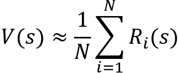
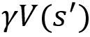
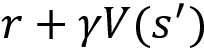
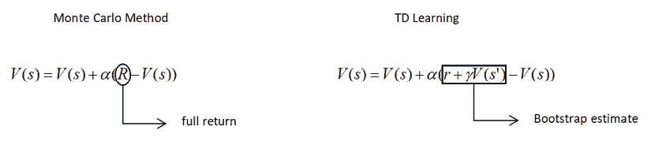
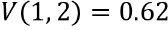
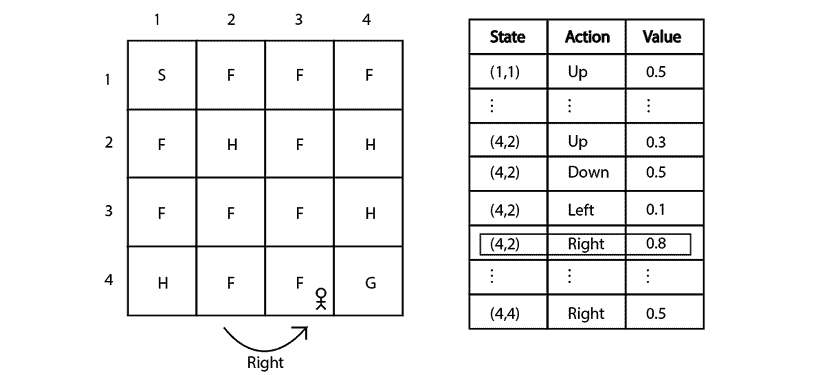
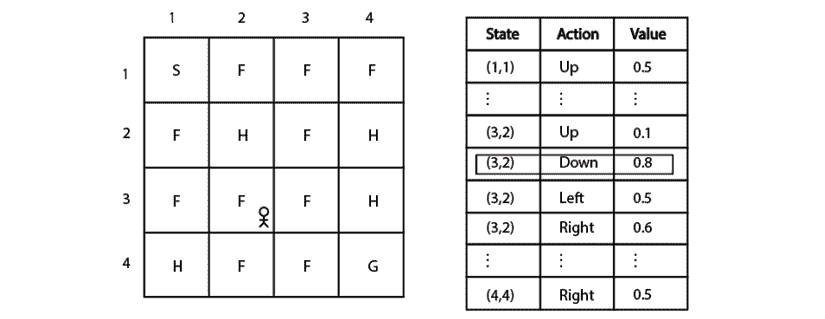

# 第五章：理解时间差学习

**时间差**（**TD**）学习是最受欢迎且广泛使用的无模型方法之一。原因在于，TD 学习结合了我们在前几章中介绍的**动态规划**（**DP**）方法和**蒙特卡洛**（**MC**）方法的优点。

本章开始时，我们将了解与 DP 和 MC 方法相比，TD 学习究竟有哪些好处。随后，我们将学习如何使用 TD 学习进行预测任务。接下来，我们将学习如何使用一种称为 SARSA 的基于策略 TD 控制方法和一种称为 Q 学习的离策略 TD 控制方法来执行 TD 控制任务。

我们还将学习如何在 Frozen Lake 环境中使用 SARSA 和 Q 学习方法找到最优策略。在本章结束时，我们将比较 DP、MC 和 TD 方法。

因此，在本章中，我们将学习以下主题：

+   TD 学习

+   TD 预测方法

+   TD 控制方法

+   基于策略 TD 控制 – SARSA

+   离策略 TD 控制 – Q 学习

+   实现 SARSA 和 Q 学习以找到最优策略

+   Q 学习和 SARSA 的区别

+   比较 DP、MC 和 TD 方法

# TD 学习

TD 学习算法由理查德·S·萨顿（Richard S. Sutton）于 1988 年提出。在本章的介绍中，我们了解到，TD 方法之所以受到欢迎，是因为它结合了 DP 和 MC 方法的优点。那么，这些优点到底是什么呢？

首先，让我们快速回顾一下 DP 和 MC 方法的优缺点。

**动态规划**——DP 方法的优点是它使用贝尔曼方程来计算一个状态的价值。也就是说，我们已经了解到，根据贝尔曼方程，状态的价值可以通过即时奖励和下一个状态的折扣价值的总和来获得。这被称为自举（bootstrapping）。也就是说，计算一个状态的价值时，我们不必等到回合结束，相反，通过使用贝尔曼方程，我们可以仅根据下一个状态的价值来估算当前状态的价值，这就是所谓的自举。

记得我们如何在动态规划（DP）方法中估计价值函数吗（价值迭代和策略迭代）？我们将价值函数（一个状态的价值）估计为：


正如你可能记得的那样，我们学习到，为了找到一个状态的价值，我们不必等到回合结束。相反，我们进行自举，也就是说，我们通过估算下一个状态的价值来估算当前状态的价值 `V`(`s`) 。

然而，动态规划的缺点在于，只有在我们知道环境的模型动态时才能使用 DP 方法。也就是说，DP 是一种基于模型的方法，我们应该知道转移概率才能使用它。当我们不知道环境的模型动态时，就无法应用 DP 方法。

**蒙特卡罗方法**—MC 方法的优点在于它是一种无模型方法，这意味着它不需要已知环境的模型动态即可估算值函数和 Q 函数。

然而，MC 方法的缺点在于，为了估算状态值或 Q 值，我们需要等到回合结束，而如果回合较长，这将消耗大量时间。此外，我们无法将 MC 方法应用于连续任务（非回合任务）。

现在，让我们回到 TD 学习。TD 学习算法考虑了 DP 和 MC 方法的优点。因此，像在 DP 中一样，我们执行自举（bootstrapping），这样我们就不必等到回合结束才能计算状态值或 Q 值；像 MC 方法一样，它是一种无模型方法，因此在计算状态值或 Q 值时不需要环境的模型动态。现在我们已经了解了 TD 学习算法的基本理念，让我们深入细节，学习它是如何工作的。

类似于我们在*第四章*中学到的*蒙特卡罗方法*，我们可以将 TD 学习算法应用于预测任务和控制任务，因此我们可以将 TD 学习分为：

+   TD 预测

+   TD 控制

在上一章中，我们学习了预测方法和控制方法的含义。让我们在继续之前稍作回顾。

在预测方法中，给定一个策略作为输入，我们尝试使用该策略预测值函数或 Q 函数。如果我们使用给定的策略预测值函数，那么我们就能知道，如果代理按照该策略行动，它在每个状态中的表现如何。换句话说，我们可以知道代理在每个状态下，如果遵循给定策略，它能获得的预期回报。

在控制方法中，我们没有给定一个策略作为输入，控制方法的目标是找到最优策略。因此，我们初始化一个随机策略，然后我们尝试通过迭代找到最优策略。也就是说，我们尝试找到一个给我们最大回报的最优策略。

首先，让我们看看如何使用 TD 学习来执行预测任务，然后我们将学习如何使用 TD 学习来执行控制任务。

# TD 预测

在 TD 预测方法中，给定一个策略作为输入，我们尝试使用该策略估算值函数。TD 学习像 DP 一样进行自举（bootstrapping），因此它不需要等到回合结束，而像 MC 方法一样，它不需要环境的模型动态来计算值函数或 Q 函数。现在，让我们看看 TD 学习的更新规则是如何设计的，考虑到前述的优点。

在 MC 方法中，我们通过取回报来估算一个状态的值：


然而，单一的回报值无法完美地近似一个状态的值。因此，我们生成`N`个回合，并将一个状态的值计算为该状态在`N`个回合中的平均回报值：



但是使用 MC 方法时，我们需要等到回合结束后才能计算状态的值，而当回合较长时，这需要花费大量时间。MC 方法的另一个问题是，我们无法将其应用于非回合任务（连续任务）。

因此，在 TD 学习中，我们利用自举（bootstrapping）并估计状态的值，如下所示：


上面的方程告诉我们，我们只需要考虑即时奖励 `r` 和下一个状态的折扣值  就能估计状态的值。如你从上述方程中所观察到的，与我们在 DP 方法（值迭代和策略迭代）中学到的相似，我们进行了自举，但在这里我们无需了解模型动态。

因此，使用 TD 学习，状态的值被近似为：


然而，单一的  值不能完美地近似状态的值。因此，我们可以取一个均值，而不是算术平均数，我们可以使用增量均值。

在 MC 方法中，我们学会了如何使用增量均值来估计状态的值，其公式如下：


类似地，在 TD 学习中，我们可以使用增量均值来估计状态的值，如下所示：


这个方程被称为 TD 学习更新规则。正如我们所观察到的，TD 学习与 MC 方法之间的唯一区别是：在 MC 方法中，我们使用完整回合计算得到的总回报 `R` 来计算状态值，而在 TD 学习方法中，我们使用自举估计值 ，因此我们无需等到回合结束才能计算状态的值。这样，我们就可以将 TD 学习应用于非回合任务。以下展示了 MC 方法和 TD 学习之间的区别：



图 5.1：MC 与 TD 学习的比较

因此，我们的 TD 学习更新规则是：


我们了解到， 是状态 `V`(`s`) 的一个估计值。因此，我们可以将  称为 TD 目标。这样，从  中减去 `V`(`s`) 就意味着我们在从目标值中减去预测值，这通常称为 TD 误差。好的，那么那个  呢？它基本上是学习率，也叫步长。即：


我们的 TD 学习更新规则基本上意味着：

*状态的值 = 状态的值 + 学习率（奖励 + 折扣因子（下一个状态的值） - 状态的值）*

现在我们已经了解了 TD 学习更新规则以及 TD 学习如何用于估计状态的值，在接下来的章节中，我们将深入探讨 TD 预测算法，并更清晰地理解 TD 学习方法。

## TD 预测算法

我们了解到，在预测任务中，给定一个策略后，我们根据该策略估计值函数。因此，我们可以说，在每个状态下，智能体如果按照给定策略行动，期望获得的回报是多少。

我们了解到，TD 学习更新规则如下所示：


因此，通过这个方程，我们可以估计给定策略的值函数。

在直接查看算法之前，为了更好地理解，我们先手动计算并看看如何准确地使用 TD 学习更新规则估计状态的值。

接下来的章节通过手动计算进行解释，为了更好理解，建议拿起笔和纸跟着一起做。

让我们在“冻结湖泊”环境中探索 TD 预测。我们已经了解到，在“冻结湖泊”环境中，智能体的目标是从起始状态 `S` 到达目标状态 `G`，并避免经过洞穴状态 `H`。如果智能体到达状态 `G`，我们给予奖励 1，如果经过其他状态，我们则给予奖励 0。*图 5.2* 显示了“冻结湖泊”环境：


图 5.2：冻结湖泊环境

我们的动作空间有四个动作，分别是 *上*、*下*、*左* 和 *右*，而我们有从 `S` 到 `G` 的 16 个状态。为了更方便理解，暂时不将状态和动作编码成数字，我们直接使用它们的名称。也就是说，假设状态 `S` 为 **(1,1)**，状态 `F` 为 **(1,2)**，依此类推，直到最后的状态 `G`，即 **(4,4)**。

现在，让我们学习如何在“冻结湖泊”环境中执行 TD 预测。我们知道，在 TD 预测方法中，给定一个策略后，我们根据该策略预测状态值函数（状态的价值）。假设我们给定了以下策略。它基本上告诉我们在每个状态下应执行的动作：


表 5.1：一个策略

现在，我们将看到如何使用 TD 学习方法估计前述策略的值函数。在继续之前，我们首先将所有状态的值初始化为随机值，如下所示：


图 5.3：用随机值初始化状态

假设我们处于状态 **(1,1)**，根据给定的策略，我们执行 *右* 向的动作并移动到下一个状态 **(1,2)**，并获得奖励 `r` 为 0。我们将学习率  设置为 0.1，折扣因子  设置为 1。现在，如何更新状态的值呢？

回顾 TD 更新方程：


将状态 `V`(`s`) 中的 `V`(1,1) 和下一个状态  中的 `V`(1,2) 代入前面的方程中，我们可以得到：


将奖励 `r` = 0、学习率  和折扣因子  代入，我们可以写成：


我们可以从前面的价值表中获得状态值。也就是说，从前面的价值表中可以观察到状态**(1,1)**的值是 0.9，下一状态**(1,2)**的值是 0.6。将这些值代入前面的方程中，我们可以写成：


因此，状态**(1,1)**的值变为：


所以，我们将状态**(1,1)**的值更新为**0.87**，如*图 5.4*所示：


图 5.4: 状态 (1,1) 的值被更新

现在我们处于状态**(1,2)**。根据给定的策略，在状态**(1,2)**中我们选择*右*动作，移动到下一个状态**(1,3)**并获得奖励 `r` 为 0。我们可以计算状态的值如下：


将状态 `V`(`s`) 的值替换为 `V`(1,2)，将下一个状态  替换为 `V`(1,3)，我们可以写成：


将奖励 `r` = 0、学习率  和折扣因子  代入，我们可以写成：


从前面的价值表中，我们可以观察到状态**(1,2)**的值是 0.6，下一状态**(1,3)**的值是 0.8，因此我们可以写成：


因此，状态**(1,2)**的值变为：



所以，我们将状态**(1,2)**的值更新为**0.62**，如*图 5.5*所示：


图 5.5: 状态 (1,2) 的值被更新

现在我们处于状态**(1,3)**。根据我们的策略，我们选择*左*动作，移动到下一个状态**(1,2)**并获得奖励 `r` 为 0。我们可以计算状态的值如下：


将状态 `V`(`s`) 的值替换为 `V`(1,3)，将下一个状态  替换为 `V`(1,2)，我们得到：


将奖励 `r` = 0、学习率  和折扣因子  代入，我们可以写成：


请注意，我们在每一步都使用更新后的值，即状态**(1,2)**的值在上一阶段被更新为 0.62，如前面的价值表所示。因此，我们将 `V`(1,2) 替换为 0.62，将 `V`(1,3) 替换为 0.8：


因此，状态**(1,3)**的值变为：


所以，我们将状态**(1,3)**的值更新为**0.782**，如*图 5.6*所示：


图 5.6: 状态 (1,3) 的值被更新

因此，通过这种方式，我们使用给定的策略计算每个状态的值。然而，仅为一个回合计算状态的值是不准确的。因此，我们将这些步骤重复多次，计算状态值的准确估计（值函数）。

TD 预测算法如下所示：

1.  初始化一个带有随机值的值函数 `V`(`s`)。给定一个策略 。

1.  对于每个回合：

    1.  初始化状态 `s`

    1.  对于每个步骤：

        1.  根据给定策略  在状态 `s` 中执行动作 `a`，获取奖励 `r`，并移动到下一个状态 

        1.  将状态的值更新为 ：

        1.  更新  （这一步意味着我们将下一个状态  更新为当前状态 `s`）

        1.  如果 `s` 不是终止状态，则重复 *步骤 1* 到 `4`

现在我们已经了解了 TD 预测方法如何预测给定策略的值函数，在下一节中，让我们学习如何实现 TD 预测方法，预测冻结湖环境中状态的值。

### 在冻结湖环境中预测状态的值

我们已经了解，在预测方法中，策略作为输入给定，我们使用给定的策略预测值函数。所以，让我们初始化一个随机策略，并使用该随机策略预测冻结湖环境中的值函数（状态值）。

首先，让我们导入必要的库：

```py
import gym
import pandas as pd 
```

现在，我们使用 Gym 创建冻结湖环境：

```py
env = gym.make('FrozenLake-v0') 
```

定义随机策略，通过从动作空间中采样返回随机动作：

```py
def random_policy():
    return env.action_space.sample() 
```

让我们定义一个字典来存储状态的值，并将所有状态的值初始化为 `0.0`：

```py
V = {}
for s in range(env.observation_space.n):
    V[s]=0.0 
```

初始化折扣因子  和学习率 ：

```py
alpha = 0.85
gamma = 0.90 
```

设置回合数和每个回合中的时间步数：

```py
num_episodes = 50000
num_timesteps = 1000 
```

#### 计算状态的值

现在，让我们使用给定的随机策略计算值函数（状态值）。

对于每个回合：

```py
for i in range(num_episodes): 
```

通过重置环境来初始化状态：

```py
 s = env.reset() 
```

对于回合中的每个步骤：

```py
 for t in range(num_timesteps): 
```

根据随机策略选择一个动作：

```py
 a = random_policy() 
```

执行选择的动作并存储下一个状态信息：

```py
 s_, r, done, _ = env.step(a) 
```

计算状态的值，如  所示：

```py
 V[s] += alpha * (r + gamma * V[s_]-V[s]) 
```

更新下一个状态为当前状态 ：

```py
 s = s_ 
```

如果当前状态是终止状态，则跳出：

```py
 if done:
            break 
```

在所有迭代完成后，我们将根据给定的随机策略得到所有状态的值。

#### 评估状态的值

现在，让我们评估我们的值函数（状态值）。首先，让我们将值字典转换为 pandas 数据框以便更清晰地查看：

```py
df = pd.DataFrame(list(V.items()), columns=['state', 'value']) 
```

在检查状态的值之前，让我们回顾一下在 Gym 中，所有 Frozen Lake 环境中的状态将被编码为数字。由于我们有 16 个状态，所有状态将被编码为数字 0 到 15，如 *图 5.7* 所示：


图 5.7：状态编码为数字

现在，让我们检查状态的值：

```py
df 
```

前面的代码将打印：


图 5.8：值表

正如我们所观察到的，现在我们已经得到了所有状态的值。状态 14 的值很高，因为我们可以轻松地从状态 14 达到目标状态 15，而且正如我们所见，所有终端状态（洞状态和目标状态）的值都是零。

请注意，由于我们初始化了一个随机策略，每次运行前面的代码时可能会得到不同的结果。

现在我们已经理解了如何利用 TD 学习进行预测任务，在下一节中，我们将学习如何将 TD 学习应用于控制任务。

# TD 控制

在控制方法中，我们的目标是找到最优策略，因此我们将从一个初始随机策略开始，并尝试迭代找到最优策略。在前一章中，我们学习到控制方法可以分为两类：

+   在策略控制

+   离策略控制

我们在前一章中学到了在策略和离策略控制的含义。在继续之前，让我们简要回顾一下。在 **在策略控制** 中，代理使用一个策略行为并尝试改进同一策略。也就是说，在在策略方法中，我们使用一个策略生成情节并迭代改进相同的策略以找到最优策略。在 **离策略控制** 方法中，代理使用一个策略行为并尝试改进一个不同的策略。也就是说，在离策略方法中，我们使用一个策略生成情节，并尝试迭代改进一个不同的策略以找到最优策略。

现在，我们将学习如何使用 TD 学习执行控制任务。首先，我们将学习如何执行在策略 TD 控制，然后我们将学习关于离策略 TD 控制。

## 在策略 TD 控制 - SARSA

在本节中，我们将研究流行的在策略 TD 控制算法，称为 **SARSA**，其代表了**状态-动作-奖励-状态-动作**。我们知道，在 TD 控制中，我们的目标是找到最优策略。首先，我们如何从策略中提取策略？我们可以从 Q 函数中提取策略。也就是说，一旦我们有了 Q 函数，我们就可以通过选择每个状态中具有最大 Q 值的动作来提取策略。

好的，我们如何在 TD 学习中计算 Q 函数？首先，让我们回顾一下如何计算值函数。在 TD 学习中，值函数计算为：


我们可以简单地将这个更新规则重写为 Q 函数的形式：


现在，我们使用前述的 TD 学习更新规则计算 Q 函数，然后从中提取策略。我们也可以将前述的更新规则称为 SARSA 更新规则。

但是等等！在预测方法中，我们给定了一个策略作为输入，因此我们在环境中根据该策略进行操作，并计算了价值函数。但在这里，我们没有输入策略。那么，我们如何在环境中行动呢？

首先，我们将 Q 函数初始化为随机值或零。然后，我们从这个随机初始化的 Q 函数中提取策略并在环境中进行操作。我们的初始策略肯定不是最优的，因为它是从随机初始化的 Q 函数中提取的，但每一轮后我们会更新 Q 函数（Q 值）。因此，在每一轮后，我们可以使用更新后的 Q 函数来提取新策略。这样，通过一系列回合后，我们将获得最优策略。

我们需要注意的一个重要点是，在 SARSA 方法中，我们并不是让我们的策略贪婪地执行，而是使用 epsilon-贪婪策略。也就是说，在贪婪策略中，我们总是选择具有最大 Q 值的操作。但是，使用 epsilon-贪婪策略时，我们以概率 epsilon 选择一个随机动作，并以概率 1-epsilon 选择最佳动作（即具有最大 Q 值的动作）。

在直接查看算法之前，为了更好地理解，我们首先手动计算并观察 Q 函数（Q 值）是如何通过 SARSA 更新规则估算的，以及我们如何找到最优策略。

让我们考虑相同的冰冻湖环境。在继续之前，我们将 Q 表（Q 函数）初始化为随机值。*图 5.9* 展示了冰冻湖环境以及包含随机值的 Q 表：


图 5.9：冰冻湖环境和带有随机值的 Q 表

假设我们处于状态 **(4,2)**。现在我们需要在这个状态下选择一个动作。我们如何选择动作呢？我们知道，在 SARSA 方法中，我们根据 epsilon-贪婪策略选择动作。以概率 epsilon，我们选择一个随机动作；以概率 1-epsilon，我们选择最佳动作（即具有最大 Q 值的动作）。假设我们使用概率 1-epsilon 选择最佳动作。因此，在状态 **(4,2)** 中，我们选择 *右*，因为它相对于其他动作具有最高的 Q 值，如下所示：


图 5.10：我们的智能体处于状态 **(4,2)**

好的，那么，我们在状态 **(4,2)** 执行 *右* 操作并移动到下一个状态 **(4,3)**，正如 *图 5.11* 所示：



图 5.11：我们在状态 (4,2) 执行具有最大 Q 值的动作

因此，我们在状态 **(4,2)** 向 *右* 移动到下一个状态 **(4,3)** 并获得了奖励 `r` 为 0。我们将学习率  设置为 0.1，折扣因子  设置为 1。那么，我们该如何更新 Q 值呢？

让我们回顾一下 SARSA 更新规则：


将状态-动作对 `Q`(`s`,`a`) 替换为 `Q`((4,2), right) 和下一个状态  替换为 **(4,3)**，代入前面的方程，我们可以写出：


将奖励 `r` = 0，学习率 ，折扣因子  代入方程，我们可以写出：


从之前的 Q 表中，我们可以观察到 `Q`((4,2), right) 的 Q 值为 **0.8**。因此，代入 `Q`((4,2), right) 为 **0.8**，我们可以将前面的方程重写为：


好的，那项  怎么处理呢？如前面的方程所示，我们有一项 ，它表示下一个状态-动作对的 Q 值。

因为我们已经移动到下一个状态 **(4,3)**，所以我们需要在此状态下选择一个动作，以便计算下一个状态-动作对的 Q 值。因此，我们使用相同的 epsilon-greedy 策略来选择动作。也就是说，我们以概率 epsilon 随机选择一个动作，或者以概率 1-epsilon 选择具有最大 Q 值的最佳动作。

假设我们使用概率 epsilon 并选择随机动作。在状态 **(4,3)**，我们随机选择 *right* 动作，如 *图 5.12* 所示。如你所见，尽管 *right* 动作的 Q 值不是最大，但我们仍然以概率 epsilon 随机选择了它：


图 5.12：我们在状态 (4,3) 执行了一个随机动作

因此，现在我们的更新规则变为：


从前面的 Q 表中，我们可以看到 **Q((4,3), right)** 的 Q 值为 **0.9**。因此，代入 **Q((4,3), right)** 的值 **0.9**，我们可以将上面的方程重写为：


因此，我们的 Q 值变为：


因此，通过这种方式，我们在每一步骤中更新 Q 函数，通过更新状态-动作对的 Q 值来实现。完成一个回合后，我们从更新后的 Q 函数中提取出新的策略，并使用该新策略在环境中执行动作。（记住我们的策略始终是 epsilon-greedy 策略）。我们重复这些步骤进行若干回合，以找到最优策略。下面给出的 SARSA 算法将帮助我们更好地理解这一点。

SARSA 算法如下所示：

1.  初始化 Q 函数 `Q`(`s`, `a`)，并赋予随机值

1.  对于每个回合：

    1.  初始化状态 `s`

    1.  从 `Q`(`s`, `a`) 中提取一个策略，并选择在状态 `s` 下执行的动作 `a`

    1.  对于每一步骤：

        1.  执行动作 `a` 并移动到下一个状态 ，然后观察奖励 `r`

        1.  在状态  下，使用 epsilon-greedy 策略选择动作 

        1.  将 Q 值更新为 

        1.  更新  和 （将下一个状态 -动作  对更新为当前状态 `s`-动作 `a` 对）

        1.  如果 `s` 不是终止状态，则重复 *步骤 1* 至 *步骤 5*

既然我们已经了解了 SARSA 算法是如何工作的，那么在接下来的部分，我们将实现 SARSA 算法以找到最优策略。

### 使用 SARSA 计算最优策略

现在，让我们实现 SARSA 来在 Frozen Lake 环境中找到最优策略。

首先，让我们导入必要的库：

```py
import gym
import random 
```

现在，我们使用 Gym 创建 Frozen Lake 环境：

```py
env = gym.make('FrozenLake-v0') 
```

让我们定义一个字典来存储状态-动作对的 Q 值，并将所有状态-动作对的 Q 值初始化为 `0.0`：

```py
Q = {}
for s in range(env.observation_space.n):
    for a in range(env.action_space.n):
        Q[(s,a)] = 0.0 
```

现在，让我们定义 epsilon-greedy 策略。我们从均匀分布中生成一个随机数，如果随机数小于 epsilon，则选择随机动作，否则选择具有最大 Q 值的最佳动作：

```py
def epsilon_greedy(state, epsilon):
    if random.uniform(0,1) < epsilon:
        return env.action_space.sample()
    else:
        return max(list(range(env.action_space.n)), key = lambda x: Q[(state,x)]) 
```

初始化折扣因子 ，学习率  和 epsilon 值：

```py
alpha = 0.85
gamma = 0.90
epsilon = 0.8 
```

设置回合数和每回合的时间步数：

```py
num_episodes = 50000
num_timesteps = 1000 
```

#### 计算策略

对于每一回合：

```py
for i in range(num_episodes): 
```

通过重置环境初始化状态：

```py
 s = env.reset() 
```

使用 epsilon-greedy 策略选择动作：

```py
 a = epsilon_greedy(s,epsilon) 
```

对于每个步骤，在这一回合中：

```py
 for t in range(num_timesteps): 
```

执行所选动作并存储下一个状态信息：

```py
 s_, r, done, _ = env.step(a) 
```

使用 epsilon-greedy 策略在下一个状态  中选择动作 ：

```py
 a_ = epsilon_greedy(s_,epsilon) 
```

计算状态-动作对的 Q 值，公式为 ：

```py
 Q[(s,a)] += alpha * (r + gamma * Q[(s_,a_)]-Q[(s,a)]) 
```

更新  和 （将下一个状态 -动作  对更新为当前状态 `s`-动作 `a` 对）：

```py
 s = s_
        a = a_ 
```

如果当前状态是终止状态，则跳出：

```py
 if done:
            break 
```

请注意，在每次迭代中我们都会更新 Q 函数。经过所有迭代后，我们将得到最优的 Q 函数。一旦我们有了最优的 Q 函数，就可以通过选择每个状态下具有最大 Q 值的动作来提取最优策略。

## 脱策略 TD 控制 - Q 学习

在这一部分，我们将学习一种称为 Q 学习的脱策略 TD 控制算法。它是强化学习中非常流行的算法之一，我们将看到这一算法在其他章节中也会出现。Q 学习是一种脱策略算法，这意味着我们使用两种不同的策略，一种策略用于在环境中行为（选择动作），另一种策略用于寻找最优策略。

我们了解到，在 SARSA 方法中，我们使用 epsilon-greedy 策略在状态 `s` 中选择动作 `a`，然后转移到下一个状态 ，并使用此处显示的更新规则来更新 Q 值：


在前面的公式中，为了计算下一个状态-动作对的 Q 值，，我们需要选择一个动作。因此，我们使用相同的 epsilon-贪心策略选择动作，并更新下一个状态-动作对的 Q 值。

但是与 SARSA 不同，在 Q 学习中，我们使用两种不同的策略。一个是 epsilon-贪心策略，另一个是贪心策略。为了在环境中选择一个动作，我们使用 epsilon-贪心策略，但在更新下一个状态-动作对的 Q 值时，我们使用贪心策略。

也就是说，我们在状态`s`中使用 epsilon-贪心策略选择动作`a`，并移动到下一个状态 ，然后使用下面的更新规则更新 Q 值：


在前面的公式中，为了计算下一个状态-动作对的 Q 值，，我们需要选择一个动作。在这里，我们使用贪心策略选择动作，并更新下一个状态-动作对的 Q 值。我们知道，贪心策略总是选择具有最大 Q 值的动作。因此，我们可以将公式修改为：


从前面的公式中可以观察到，**max** 操作符意味着在状态  中，我们选择具有最大 Q 值的动作 。

因此，总结一下，在 Q 学习方法中，我们使用 epsilon-贪心策略在环境中选择动作，但在计算下一个状态-动作对的 Q 值时，我们使用贪心策略。因此，Q 学习的更新规则如下：


让我们通过手动计算 Q 值来更好地理解这一点，使用我们的 Q 学习更新规则。我们使用相同的冻结湖示例。我们将 Q 表初始化为随机值。*图 5.13* 显示了冻结湖环境，以及包含随机值的 Q 表：


图 5.13：带有随机初始化 Q 表的冻结湖环境

假设我们处于状态**(3,2)**。现在，我们需要选择该状态中的某个动作。我们如何选择动作呢？我们使用 epsilon-贪心策略选择一个动作。因此，以概率 epsilon，我们选择一个随机动作，而以概率 1-epsilon，我们选择具有最大 Q 值的最佳动作。

假设我们使用概率 1-epsilon 选择最佳动作。因此，在状态**(3,2)** 中，我们选择*向下*动作，因为它相对于该状态中的其他动作具有最高的 Q 值，正如*图 5.14* 所示：



图 5.14：我们在状态（3,2）中执行具有最大 Q 值的动作

好的，所以，我们在状态**(3,2)** 中执行*向下*动作，并如*图 5.15* 所示移动到下一个状态**(4,2)**。


图 5.15：我们移动到状态（4,2）

因此，我们在状态 **(3,2)** 中向 *down* 方向移动，进入下一个状态 **(4,2)** 并获得奖励 `r` 为 0。我们将学习率  设为 0.1，折扣因子  设为 1。现在，我们如何更新 Q 值呢？

让我们回顾一下我们的 Q 学习更新规则：


将状态-动作对 `Q`(`s`,`a`) 替换为 `Q`((3,2), down)，并将下一个状态  替换为 **(4,2)**，我们可以将前面的方程写成：


将奖励 `r` = 0、学习率  和折扣因子  代入方程中，我们可以写出：


从之前的 Q 表中，我们可以观察到 `Q`((3,2), down) 的值为 **0.8**。因此，将 `Q`((3,2), down) 替换为 **0.8**，我们可以将前面的方程改写为：


如我们所见，在前面的方程中，我们有一个项 ，它表示我们在移动到新状态 **(4,2)** 后，下一状态-动作对的 Q 值。为了计算下一个状态的 Q 值，首先我们需要选择一个动作。在这里，我们使用贪心策略选择动作，即选择具有最大 Q 值的动作。

如 *图 5.16* 所示，*right* 动作在状态 **(4,2)** 中具有最大 Q 值。因此，我们选择 *right* 动作，并更新下一个状态-动作对的 Q 值：


图 5.16：我们在状态 (4,2) 中执行具有最大 Q 值的动作

因此，现在我们的更新规则变为：


从之前的 Q 表中，我们可以观察到 `Q`((4,2), right) 的值为 **0.8**。因此，将 `Q`((4,2), right) 的值替换为 **0.8**，我们可以将上述方程改写为：


因此，我们的 Q 值变为：


同样，我们为所有状态-动作对更新 Q 值。也就是说，我们在环境中选择动作时使用 epsilon-greedy 策略，而在更新下一个状态-动作对的 Q 值时使用贪心策略。这样，我们为每个状态-动作对更新 Q 值。

因此，通过这种方式，我们在每一步的训练过程中更新 Q 函数，更新状态-动作对的 Q 值。我们将在每一步从更新后的 Q 函数中提取新的策略，并使用这个新策略。（记住，我们在环境中选择动作时使用 epsilon-greedy 策略，但在更新下一个状态-动作对的 Q 值时使用贪心策略。）经过若干回合后，我们将得到最优的 Q 函数。以下给出的 Q 学习算法将帮助我们更好地理解这一点。

Q 学习算法如下所示：

1.  初始化一个随机值的 Q 函数 `Q`(`s`, `a`)

1.  对于每一回合：

    1.  初始化状态 `s`

    1.  对于回合中的每一步：

        1.  从 `Q`(`s`, `a`) 中提取策略，并选择一个动作 `a` 在状态 `s` 中执行

        1.  执行动作 `a`，转移到下一个状态 ，并观察奖励 `r`

        1.  更新 Q 值为 

        1.  更新 （将下一个状态 更新为当前状态 `s`）

        1.  如果 `s` 不是终止状态，重复 *步骤 1* 到 *步骤 5*

现在我们已经了解了 Q 学习算法是如何工作的，在下一节中，让我们实现 Q 学习以找到最优策略。

### 使用 Q 学习计算最优策略

现在，让我们在 Frozen Lake 环境中实现 Q 学习，找到最优策略。

首先，让我们导入必要的库：

```py
import gym
import numpy as np
import random 
```

现在，我们使用 Gym 创建 Frozen Lake 环境：

```py
env = gym.make('FrozenLake-v0') 
```

我们先定义一个字典来存储状态-动作对的 Q 值，并将所有状态-动作对的 Q 值初始化为`0.0`：

```py
Q = {}
for s in range(env.observation_space.n):
    for a in range(env.action_space.n):
        Q[(s,a)] = 0.0 
```

现在，让我们定义ε-贪婪策略。我们从均匀分布中生成一个随机数，如果该随机数小于ε，则选择一个随机动作，否则选择具有最大 Q 值的最佳动作：

```py
def epsilon_greedy(state, epsilon):
    if random.uniform(0,1) < epsilon:
        return env.action_space.sample()
    else:
        return max(list(range(env.action_space.n)), key = lambda x: Q[(state,x)]) 
```

初始化折扣因子 、学习率  和ε值：

```py
alpha = 0.85
gamma = 0.90
epsilon = 0.8 
```

设置回合数和每个回合中的时间步数：

```py
num_episodes = 50000
num_timesteps = 1000 
```

计算策略。

对于每个回合：

```py
for i in range(num_episodes): 
```

通过重置环境来初始化状态：

```py
 s = env.reset() 
```

对于回合中的每一步：

```py
 for t in range(num_timesteps): 
```

使用ε-贪婪策略选择动作：

```py
 a = epsilon_greedy(s,epsilon) 
```

执行选择的动作并存储下一个状态的信息：

```py
 s_, r, done, _ = env.step(a) 
```

现在，让我们计算状态-动作对的 Q 值为 。

首先，选择下一个状态 中具有最大 Q 值的动作 ：

```py
 a_ = np.argmax([Q[(s_, a)] for a in range(env.action_space.n)]) 
```

现在，我们可以计算状态-动作对的 Q 值为：

```py
 Q[(s,a)] += alpha * (r + gamma * Q[(s_,a_)]-Q[(s,a)]) 
```

更新 （将下一个状态 更新为当前状态 `s`）：

```py
 s = s_ 
```

如果当前状态是终止状态，则中断：

```py
 if done:
            break 
```

所有迭代完成后，我们将得到最优 Q 函数。然后，我们可以通过选择每个状态中具有最大 Q 值的动作来提取最优策略。

## Q 学习和 SARSA 的区别

理解 Q 学习和 SARSA 之间的区别非常重要。所以，让我们回顾一下 Q 学习和 SARSA 的不同之处。

SARSA 是一个基于策略的算法，这意味着我们使用一个单一的ε-贪婪策略来选择环境中的动作，并计算下一个状态-动作对的 Q 值。SARSA 的更新规则如下所示：


Q 学习是一个基于策略外的算法，这意味着我们在环境中使用ε-贪婪策略来选择动作，但在计算下一个状态-动作对的 Q 值时，我们使用贪婪策略。Q 学习的更新规则如下所示：


# 比较 DP、MC 和 TD 方法

到目前为止，我们已经学习了几种有趣且重要的强化学习算法，例如 DP（值迭代和策略迭代）、MC 方法和 TD 学习方法，来寻找最优策略。这些被称为经典强化学习中的关键算法，理解这三种算法之间的区别非常重要。因此，在本节中，我们将回顾 DP、MC 和 TD 学习方法之间的区别。

**动态规划**（**DP**），即值迭代和策略迭代方法，是一种基于模型的方法，意味着我们使用环境的模型动态来计算最优策略。当我们没有环境的模型动态时，无法应用 DP 方法。

我们还学习了**蒙特卡罗**（**MC**）方法。MC 是一种无模型方法，意味着我们在不使用环境模型动态的情况下计算最优策略。但我们在使用 MC 方法时遇到的一个问题是，它仅适用于回合任务，而不适用于连续任务。

我们学习了一种有趣的无模型方法，称为**时间差分**（**TD**）学习。TD 学习结合了通过自举进行的动态规划（DP）和通过无模型方法进行的蒙特卡罗（MC）方法的优势。

恭喜你学习了所有重要的强化学习算法。在下一章中，我们将探讨一个案例研究，称为多臂赌博机问题。

# 总结

我们通过理解 TD 学习是什么以及它如何结合 DP 和 MC 方法的优势来开始本章。我们了解到，像 DP 一样，TD 学习也进行自举；像 MC 方法一样，TD 学习是一种无模型方法。

后来，我们学习了如何使用 TD 学习执行预测任务，然后我们研究了 TD 预测方法的算法。

接下来，我们学习了如何使用 TD 学习进行控制任务。首先，我们学习了名为 SARSA 的在政策 TD 控制方法，然后我们学习了名为 Q 学习的离政策 TD 控制方法。我们还学习了如何使用 SARSA 和 Q 学习方法在 Frozen Lake 环境中找到最优策略。

我们还学习了 SARSA 和 Q 学习方法的区别。我们理解到，SARSA 是一种在政策算法，这意味着我们使用一个单一的 epsilon-greedy 策略在环境中选择一个动作，并计算下一个状态-动作对的 Q 值；而 Q 学习是一种离政策算法，这意味着我们使用 epsilon-greedy 策略在环境中选择一个动作，但在计算下一个状态-动作对的 Q 值时使用贪心策略。章节末尾，我们对 DP、MC 和 TD 方法进行了比较。

在下一章中，我们将探讨一个有趣的问题，称为多臂赌博机问题。

# 问题

让我们通过回答以下问题来评估我们新获得的知识：

1.  TD 学习与 MC 方法有何不同？

1.  使用 TD 学习方法有什么优势？

1.  什么是 TD 误差？

1.  TD 学习的更新规则是什么？

1.  TD 预测方法是如何工作的？

1.  什么是 SARSA？

1.  Q 学习与 SARSA 有何不同？

# 进一步阅读

欲了解更多信息，请参考以下链接：

+   **通过时间差方法学习预测**，作者为*理查德·S·萨顿*，可在[`link.springer.com/content/pdf/10.1007/BF00115009.pdf`](https://link.springer.com/content/pdf/10.1007/BF00115009.pdf)查看。
