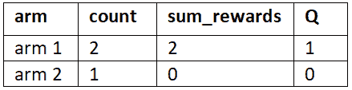
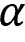

# 第六章：案例研究——MAB 问题

在前面的章节中，我们已经学习了强化学习的基本概念，并且了解了几种有趣的强化学习算法。我们学习了基于模型的方法——动态规划，以及无模型的方法——蒙特卡洛方法，随后我们学习了时间差分方法，它结合了动态规划和蒙特卡洛方法的优点。

在本章中，我们将学习强化学习中的经典问题之一——**多臂土匪**（**MAB**）问题。我们首先理解 MAB 问题，然后学习几种探索策略，包括 epsilon-greedy、softmax 探索、上置信界和汤普森采样，来解决 MAB 问题。接着，我们将学习 MAB 在实际用例中的应用。

接下来，我们将了解如何通过将其构造为 MAB 问题来找到用户最常点击的最佳广告横幅。在本章结束时，我们将学习上下文土匪及其在不同用例中的应用。

本章我们将学习以下内容：

+   MAB 问题

+   Epsilon-greedy 方法

+   Softmax 探索

+   上置信界算法

+   汤普森采样算法

+   MAB 的应用

+   使用 MAB 找到最佳广告横幅

+   上下文土匪

# MAB 问题

MAB 问题是强化学习中的经典问题之一。MAB 是一种老虎机，我们拉动臂（杠杆），根据某种概率分布获得支付（奖励）。单个老虎机叫做单臂土匪（one-armed bandit），当有多个老虎机时，称为 MAB 或`k`臂土匪，其中`k`表示老虎机的数量。

*图 6.1*展示了一个三臂土匪：


图 6.1：三臂土匪老虎机

老虎机是赌场中最受欢迎的游戏之一，我们拉动臂并获得奖励。如果获得 0 奖励，则输了游戏；如果获得+1 奖励，则赢得游戏。可以有多个老虎机，每个老虎机称为一个臂。例如，老虎机 1 称为臂 1，老虎机 2 称为臂 2，以此类推。因此，每当我们说臂`n`时，实际上是指老虎机`n`。

每个臂都有自己的概率分布，表示赢得游戏和输掉游戏的概率。例如，假设我们有两个臂。如果拉动臂 1（老虎机 1）时，赢的概率为 0.7，拉动臂 2（老虎机 2）时，赢的概率为 0.5。

然后，如果我们拉动臂 1，70%的时间我们会赢得游戏并获得+1 奖励；如果拉动臂 2，50%的时间我们会赢得游戏并获得+1 奖励。

因此，我们可以说，拉臂 1 是值得的，因为它让我们在 70% 的情况下赢得了游戏。然而，这种臂的概率分布（老虎机）不会直接给我们。我们需要找出哪个臂最能帮助我们赢得游戏并提供良好的奖励。

好的，我们如何找到这个臂呢？

假设我们拉臂 1 一次并获得 +1 奖励，拉臂 2 一次并获得 0 奖励。由于臂 1 给出了 +1 奖励，我们不能仅仅通过拉一次臂 1 就得出它是最佳臂的结论。我们需要多次拉这两个臂，并计算每个臂的平均奖励，然后选择给予最大平均奖励的臂作为最佳臂。

设臂为 `a`，并定义拉臂 `a` 得到的平均奖励为：


`Q`(`a`) 表示臂 `a` 的平均奖励。

最优臂 `a` 是给我们带来最大平均奖励的臂，即：


好的，我们已经了解到，给出最大平均奖励的臂是最优臂。那么我们如何找到这个臂呢？

我们进行多轮游戏，每一轮只能拉一个臂。假设在第一轮我们拉臂 1 并观察奖励，在第二轮我们拉臂 2 并观察奖励。类似地，在每一轮中，我们继续拉臂 1 或臂 2 并观察奖励。在完成几轮游戏后，我们计算每个臂的平均奖励，然后选择具有最大平均奖励的臂作为最佳臂。

但这种方法并不是找到最佳臂的好办法。假设我们有 20 个臂；如果我们每一轮都拉一个不同的臂，那么在大多数回合中我们会输掉游戏并获得 0 奖励。除了找到最佳臂之外，我们的目标还应该是最小化识别最佳臂的成本，这通常被称为遗憾。

因此，我们需要在最小化遗憾的同时找到最佳臂。也就是说，我们需要找到最佳臂，但我们不希望最终选择那些让我们在大多数回合中输掉游戏的臂。

那么，我们是应该每一轮探索一个不同的臂，还是只选择在之前回合中获得良好奖励的臂呢？这就引出了探索-利用困境（exploration-exploitation dilemma），我们在*第四章*《蒙特卡罗方法》中学习过。为了应对这个问题，我们使用 epsilon-greedy 方法，以概率 1-epsilon 选择之前获得良好奖励的臂，并以概率 epsilon 随机选择一个臂。经过若干轮后，我们选择具有最大平均奖励的臂作为最佳臂。

类似于 epsilon-贪婪算法，还有几种不同的探索策略帮助我们克服探索与利用的困境。在接下来的章节中，我们将详细学习几种不同的探索策略，并了解它们如何帮助我们找到最优臂，但首先，让我们来看看如何创建一个 bandit。

## 在 Gym 中创建一个 bandit

在继续之前，让我们学习如何使用 Gym 工具包创建一个 bandit 环境。Gym 并没有预先包装好的 bandit 环境，因此我们需要创建一个 bandit 环境并将其与 Gym 集成。我们将使用 Jesse Cooper 提供的开源版本 bandit 环境，而不是从零开始创建 bandit 环境。

首先，让我们克隆 Gym bandits 仓库：

```py
git clone https://github.com/JKCooper2/gym-bandits 
```

接下来，我们可以使用 `pip` 安装它：

```py
cd gym-bandits
pip install -e . 
```

安装完成后，我们导入 `gym_bandits` 和 `gym` 库：

```py
import gym_bandits
import gym 
```

`gym_bandits` 提供了多个版本的 bandit 环境。我们可以在 [`github.com/JKCooper2/gym-bandits`](https://github.com/JKCooper2/gym-bandits) 上查看不同的 bandit 版本。

让我们创建一个简单的 2 臂 bandit，其环境 ID 为 `BanditTwoArmedHighLowFixed-v0`：

```py
env = gym.make("BanditTwoArmedHighLowFixed-v0") 
```

由于我们创建了一个双臂 bandit，所以我们的行动空间将是 `2`（因为有两个臂），如下所示：

```py
print(env.action_space.n) 
```

上面的代码将输出：

```py
2 
```

我们也可以通过以下方式检查臂的概率分布：

```py
print(env.p_dist) 
```

上面的代码将输出：

```py
[0.8, 0.2] 
```

它表示使用臂 1 时，我们有 80% 的概率赢得游戏，而使用臂 2 时，我们有 20% 的概率赢得游戏。我们的目标是找出拉臂 1 还是臂 2 更能让我们在大多数情况下赢得游戏。

现在我们已经学习了如何在 Gym 中创建 bandit 环境，接下来的章节中，我们将探索不同的探索策略来解决 MAB 问题，并将它们与 Gym 一起实现。

## 探索策略

在本章开始时，我们学习了 MAB 问题中的探索与利用困境。为了克服这个困境，我们使用不同的探索策略来找到最优臂。这里列出了不同的探索策略：

+   Epsilon-贪婪算法

+   Softmax 探索

+   上置信界限

+   Thomson 采样

现在，我们将详细探讨所有这些探索策略，并实现它们来找到最优臂。

### Epsilon-贪婪算法

我们在之前的章节中学习了 epsilon-贪婪算法。使用 epsilon-贪婪时，我们以概率 1-epsilon 选择最优臂，以概率 epsilon 随机选择一个臂。让我们通过一个简单的例子，详细学习如何通过 epsilon-贪婪方法找到最优臂。

假设我们有两个臂——臂 1 和臂 2。假设使用臂 1 时我们有 80% 的概率赢得游戏，而使用臂 2 时我们只有 20% 的概率赢得游戏。所以，我们可以说臂 1 是最好的臂，因为它让我们赢得游戏的概率是 80%。现在，让我们学习如何通过 epsilon-贪婪方法来找出这个最优臂。

首先，我们初始化 `count`（臂被拉动的次数）、`sum_rewards`（从拉动臂获得的奖励总和）和 `Q`（拉动臂获得的平均奖励），正如*表 6.1*所示：


表 6.1：将变量初始化为零

**第一轮**：

假设，在游戏的第一轮中，我们以 epsilon 的概率选择一个随机的臂，假设我们随机拉动臂 1，并观察奖励。让拉动臂 1 所获得的奖励为 1\。因此，我们更新我们的表格，将臂 1 的 `count` 设置为 1，臂 1 的 `sum_rewards` 设置为 1，因此，第一轮后，臂 1 的平均奖励 `Q` 为 1，正如*表 6.2*所示：


表 6.2：第一轮后的结果

**第二轮**：

假设，在第二轮中，我们以 1-epsilon 的概率选择最好的臂。最好的臂是那个具有最大平均奖励的臂。所以，我们查看我们的表格，看看哪个臂具有最大的平均奖励。由于臂 1 拥有最大平均奖励，我们拉动臂 1，观察奖励，并让拉动臂 1 所获得的奖励为 1\。

因此，我们更新我们的表格，将臂 1 的 `count` 设置为 2，臂 1 的 `sum_rewards` 设置为 2，因此，第二轮后，臂 1 的平均奖励 `Q` 为 1，正如*表 6.3*所示：


表 6.3：第二轮后的结果

**第三轮**：

假设，在第三轮中，我们以 epsilon 的概率选择一个随机的臂。假设我们随机拉动臂 2，并观察奖励。让拉动臂 2 所获得的奖励为 0\。因此，我们更新我们的表格，将臂 2 的 `count` 设置为 1，臂 2 的 `sum_rewards` 设置为 0，因此，第三轮后，臂 2 的平均奖励 `Q` 为 0，正如*表 6.4*所示：



表 6.4：第三轮后的结果

**第四轮**：

假设，在第四轮中，我们以 1-epsilon 的概率选择最好的臂。因此，我们拉动臂 1，因为它具有最大平均奖励。让拉动臂 1 所获得的奖励这次为 0。现在，我们更新我们的表格，将臂 1 的 `count` 设置为 3，臂 2 的 `sum_rewards` 设置为 2，因此，第四轮后，臂 1 的平均奖励 `Q` 将是 0.66，正如*表 6.5*所示：


表 6.5：第四轮后的结果

我们为多个轮次重复这个过程；也就是说，在多个游戏轮次中，我们以 1-epsilon 的概率拉动最好的臂，并以 epsilon 的概率拉动一个随机的臂。

*表 6.6* 显示了游戏进行 100 轮后的更新表格：


表 6.6：100 轮后的结果

从*表 6.6*中，我们可以得出结论，臂 1 是最好的臂，因为它具有最大平均奖励。

#### 实现 epsilon-greedy

现在，让我们学习实现 epsilon-greedy 方法来找到最好的臂。首先，让我们导入必要的库：

```py
import gym
import gym_bandits
import numpy as np 
```

为了更好地理解，我们只创建一个具有两个臂的赌博机：

```py
env = gym.make("BanditTwoArmedHighLowFixed-v0") 
```

让我们检查一下这个臂的概率分布：

```py
print(env.p_dist) 
```

上述代码将输出：

```py
[0.8, 0.2] 
```

我们可以观察到，使用臂 1 时，我们有 80% 的概率赢得游戏，使用臂 2 时，我们有 20% 的概率赢得游戏。这里，最佳臂是臂 1，因为使用臂 1 时，我们有 80% 的概率获胜。现在，让我们看看如何使用 epsilon-greedy 方法找到这个最佳臂。

首先，让我们初始化变量。

初始化 `count` 以存储每个臂被拉取的次数：

```py
count = np.zeros(2) 
```

初始化`sum_rewards`以存储每个臂的奖励总和：

```py
sum_rewards = np.zeros(2) 
```

初始化`Q`以存储每个臂的平均奖励：

```py
Q = np.zeros(2) 
```

设置回合数（迭代次数）：

```py
num_rounds = 100 
```

现在，让我们定义 `epsilon_greedy` 函数。

首先，我们从均匀分布中生成一个随机数。如果随机数小于 epsilon，那么我们拉取一个随机臂；否则，我们拉取具有最大平均奖励的最佳臂，如下所示：

```py
def epsilon_greedy(epsilon):

    if np.random.uniform(0,1) < epsilon:
        return env.action_space.sample()
    else:
        return np.argmax(Q) 
```

现在，让我们开始游戏，并尝试使用 epsilon-greedy 方法找到最佳臂。

对于每一回合：

```py
for i in range(num_rounds): 
```

根据 epsilon-greedy 方法选择臂：

```py
 arm = epsilon_greedy(epsilon=0.5) 
```

拉取臂并存储奖励和下一个状态信息：

```py
 next_state, reward, done, info = env.step(arm) 
```

将臂的计数增加`1`：

```py
 count[arm] += 1 
```

更新臂的奖励总和：

```py
 sum_rewards[arm]+=reward 
```

更新臂的平均奖励：

```py
 Q[arm] = sum_rewards[arm]/count[arm] 
```

在所有回合结束后，我们查看每个臂获得的平均奖励：

```py
print(Q) 
```

上述代码将打印出如下内容：

```py
[0.83783784 0.34615385] 
```

现在，我们可以选择平均奖励最大化的臂作为最佳臂：


由于臂 1 的平均奖励高于臂 2，我们的最佳臂将是臂 1：

```py
print('The optimal arm is arm {}'.format(np.argmax(Q)+1)) 
```

上述代码将打印出：

```py
The optimal arm is arm 1 
```

因此，我们已经使用 epsilon-greedy 方法找到了最佳臂。

### Softmax 探索

Softmax 探索，也称为 Boltzmann 探索，是另一种有用的探索策略，用于找到最佳臂。

在 epsilon-greedy 策略中，我们学习到，以 1-epsilon 的概率选择最佳臂，以 epsilon 的概率选择随机臂。正如你可能注意到的，在 epsilon-greedy 策略中，所有非最佳臂被平等地探索。也就是说，所有非最佳臂被选择的概率是均匀的。例如，假设我们有 4 个臂，其中臂 1 是最佳臂。那么我们就会均匀地探索非最佳臂——[臂 2，臂 3，臂 4]。

假设臂 3 永远不是一个好臂，它总是给出 0 的奖励。在这种情况下，我们可以花更多时间探索臂 2 和臂 4，而不是再探索臂 3。但 epsilon-greedy 方法的问题在于，它会平等地探索所有非最佳臂。因此，所有非最佳臂——[臂 2，臂 3，臂 4]——将被平等地探索。

为了避免这种情况，如果我们可以优先选择臂 2 和臂 4，而不是臂 3，那么我们就可以更频繁地探索臂 2 和臂 4，而不是臂 3。

好的，但我们如何能优先选择某些臂呢？我们可以通过基于平均奖励 `Q` 为所有臂分配一个概率来实现臂的优先选择。拥有最大平均奖励的臂将有更高的概率，而所有非最佳臂的选择概率将与它们的平均奖励成正比。

例如，正如*表 6.7*所示，臂 1 是最佳臂，因为它有较高的平均奖励`Q`。因此，我们给臂 1 分配较高的概率。臂 2、3 和 4 是非最佳臂，我们需要探索它们。正如我们所观察到的，臂 3 的平均奖励为 0。因此，我们不会均匀地选择所有的非最佳臂，而是将更多的优先级给予臂 2 和臂 4，而非臂 3。所以，臂 2 和 4 的概率将高于臂 3：


表 6.7：四臂老虎机的平均奖励

因此，在 softmax 探索中，我们是基于概率来选择臂的。每个臂的概率与其平均奖励成正比：


等等，概率应该加起来等于 1，对吧？平均奖励（Q 值）加起来并不等于 1。因此，我们使用 softmax 函数将它们转换为概率，如下所示：


所以，现在根据概率来选择臂。然而，在最初的几轮中，我们不知道每个臂的正确平均奖励，因此在初期基于平均奖励的概率选择臂会不准确。为了避免这种情况，我们引入了一个新的参数，叫做`T`。`T`被称为温度参数。

我们可以用温度`T`重新写出之前的方程，如下所示：


好的，那么这个`T`怎么帮助我们呢？当`T`较高时，所有的臂被选择的概率相等；而当`T`较低时，具有最大平均奖励的臂将具有较高的选择概率。因此，我们在最初的几轮将`T`设置为较大的数值，在经过一系列轮次后，我们逐渐降低`T`的值。这意味着在最初的轮次中，我们平等地探索所有的臂，而在经过一系列轮次后，我们选择概率较高的最佳臂。

让我们通过一个简单的例子来理解这一点。假设我们有四个臂，从臂 1 到臂 4。假设我们拉动了臂 1 并获得了奖励 1，那么臂 1 的平均奖励将是 1，而所有其他臂的平均奖励将是 0，正如*表 6.8*所示：


表 6.8：每个臂的平均奖励

现在，如果我们使用方程（1）中给出的 softmax 函数将平均奖励转换为概率，那么我们的概率如下所示：


表 6.9：每个臂的概率

正如我们所观察到的，臂 1 的概率为 47%，而其他所有臂的概率为 17%。但是，我们不能仅仅通过拉动一次臂 1 就为臂 1 分配高概率。因此，我们将`T`设置为一个较大的数字，比如`T` = 30，并根据方程（2）计算概率。现在我们的概率变成了：


表 6.10：T=30 时每个臂的概率

如我们所见，现在所有臂被选中的概率相等。现在我们根据这个概率探索各个臂，经过若干回合后，`T`值将被降低，我们会将较高的概率分配给最优臂。假设经过大约 30 回合后，所有臂的平均奖励为：


表 6.11：经过 30 多轮后的每个臂的平均奖励

我们了解到，`T`的值在多轮中会逐渐减少。假设`T`的值减少，现在为 0.3（`T`=0.3）；此时概率将变为：


表 6.12：当前 T 值设置为 0.3 时每个臂的概率

如我们所见，臂 1 相较于其他臂有较高的概率。因此，我们选择臂 1 作为最佳臂，并在接下来的回合中根据它们的概率探索非最佳臂——[臂 2, 臂 3, 臂 4]。

因此，在初始回合中，我们并不知道哪个臂是最佳臂。因此，我们不是根据平均奖励为臂分配较高的概率，而是为所有臂分配相等的概率，并且在初始回合中设置较高的`T`值，随着若干回合的进行，我们逐步减少`T`的值，并为具有较高平均奖励的臂分配较高的概率。

#### 实现软最大探索

现在，让我们学习如何实现软最大探索方法来找到最佳臂。首先，我们导入必要的库：

```py
import gym
import gym_bandits
import numpy as np 
```

让我们以在ε-贪婪部分看到的同一个二臂老虎机为例：

```py
env = gym.make("BanditTwoArmedHighLowFixed-v0") 
```

现在，让我们初始化变量。

初始化`count`用于存储每个臂被拉动的次数：

```py
count = np.zeros(2) 
```

初始化`sum_rewards`用于存储每个臂的奖励总和：

```py
sum_rewards = np.zeros(2) 
```

初始化`Q`用于存储每个臂的平均奖励：

```py
Q = np.zeros(2) 
```

设置回合数（迭代次数）：

```py
num_rounds = 100 
```

现在，我们定义具有温度`T`的软最大函数：


```py
def softmax(T): 
```

根据前面的公式计算每个臂的概率：

```py
 denom = sum([np.exp(i/T) for i in Q])
    probs = [np.exp(i/T)/denom for i in Q] 
```

根据计算的臂的概率分布选择臂：

```py
 arm = np.random.choice(env.action_space.n, p=probs)

    return arm 
```

现在，让我们开始游戏，并尝试使用软最大探索方法找到最佳臂。

让我们从将温度`T`设置为一个较大的数值开始，比如`50`：

```py
T = 50 
```

对于每一回合：

```py
for i in range(num_rounds): 
```

根据软最大探索方法选择臂：

```py
 arm = softmax(T) 
```

拉动臂并存储奖励和下一状态信息：

```py
 next_state, reward, done, info = env.step(arm) 
```

将该臂的计数增加 1：

```py
 count[arm] += 1 
```

更新该臂的奖励总和：

```py
 sum_rewards[arm]+=reward 
```

更新该臂的平均奖励：

```py
 Q[arm] = sum_rewards[arm]/count[arm] 
```

降低温度`T`：

```py
 T = T*0.99 
```

所有回合结束后，我们检查 Q 值，也就是每个臂的平均奖励：

```py
print(Q) 
```

上面的代码会输出类似于以下内容：

```py
[0.77700348 0.1971831 ] 
```

如我们所见，臂 1 的平均奖励高于臂 2，因此我们选择臂 1 作为最优臂：

```py
print('The optimal arm is arm {}'.format(np.argmax(Q)+1)) 
```

上面的代码会输出：

```py
The optimal arm is arm 1 
```

因此，我们已经通过软最大探索方法找到了最优臂。

### 上置信区间

在这一部分，我们将探讨另一个有趣的算法，叫做**上置信界限**（**UCB**），它用于解决探索与开发的困境。UCB 算法基于一个叫做“面对不确定性时的乐观主义”的原则。让我们通过一个简单的例子，了解 UCB 算法是如何工作的。

假设我们有两个臂——臂 1 和臂 2。假设我们通过随机拉臂 1 和臂 2 玩了 20 轮游戏，发现臂 1 的平均奖励是 0.6，臂 2 的平均奖励是 0.5。但是我们怎么确定这个平均奖励是准确的呢？也就是说，我们怎么确定这个平均奖励代表了真实的平均值（总体均值）呢？这时，我们就需要使用置信区间。

置信区间表示真实值所在的区间。因此，在我们的设置中，置信区间表示臂的真实平均奖励所在的区间。

例如，从*图 6.2*中，我们可以看到臂 1 的置信区间是 0.2 到 0.9，这表明臂 1 的平均奖励位于 0.2 到 0.9 之间。0.2 是下置信界限，0.9 是上置信界限。类似地，我们可以观察到臂 2 的置信区间是 0.5 到 0.7，这表明臂 2 的平均奖励位于 0.5 到 0.7 之间，其中 0.5 是下置信界限，0.7 是上置信界限。


图 6.2：臂 1 和臂 2 的置信区间

好的，从*图 6.2*中我们可以看到臂 1 和臂 2 的置信区间。那么，我们该如何做出决策呢？也就是说，我们如何决定是拉臂 1 还是拉臂 2？如果我们仔细观察，可以看到臂 1 的置信区间较大，而臂 2 的置信区间较小。

当置信区间较大时，我们对平均值的确定性较低。由于臂 1 的置信区间较大（0.2 到 0.9），我们无法确定拉动臂 1 时能获得什么奖励，因为平均奖励可能从 0.2 低至 0.9 高。所以，臂 1 存在很大的不确定性，我们不能确定臂 1 会给出高奖励还是低奖励。

当置信区间较小时，我们对平均值较为确定。由于臂 2 的置信区间较小（0.5 到 0.7），我们可以确定拉臂 2 时会得到一个不错的奖励，因为我们的平均奖励在 0.5 到 0.7 的范围内。

但是，臂 2 的置信区间为什么小，臂 1 的置信区间为什么大呢？在本节的开头，我们了解到我们通过随机拉动臂 1 和臂 2 玩了 20 回合游戏，并计算了臂 1 和臂 2 的平均奖励。假设臂 2 已经被拉动了 15 次，而臂 1 只被拉动了 5 次。由于臂 2 被拉动了很多次，臂 2 的置信区间很小，表示有确定的平均奖励。由于臂 1 被拉动的次数较少，臂的置信区间较大，表示有不确定的平均奖励。因此，这表明臂 2 比臂 1 探索得更多。

好的，回到我们的问题，我们应该拉动臂 1 还是臂 2？在 UCB 中，我们总是选择具有高上置信边界的臂，所以在我们的例子中，我们选择臂 1，因为它的上置信边界高达 0.9。但为什么我们必须选择具有最高上置信边界的臂呢？选择具有最高上界的臂帮助我们选择给出最大奖励的臂。

但这里有一个小问题。当置信区间较大时，我们无法确定平均奖励。例如，在我们的例子中，我们选择了臂 1，因为它有一个很高的上置信边界为 0.9；然而，由于臂 1 的置信区间较大，我们的平均奖励可能在 0.2 到 0.9 之间，因此我们甚至可能获得较低的奖励。但这没关系，我们仍然选择臂 1，因为它促进了探索。当臂被充分探索时，置信区间变得较小。

当我们通过选择具有高 UCB 的臂来进行几轮游戏时，我们两臂的置信区间将变得更窄，并表示更准确的平均值。例如，正如我们在*图 6.3*中看到的那样，在进行几轮游戏后，两臂的置信区间变小，并表示一个更准确的平均值：


图 6.3：几轮后臂 1 和臂 2 的置信区间

从*图 6.3*中，我们可以看到两臂的置信区间较小，并且我们有一个更准确的平均值，由于在 UCB 中我们选择具有最高 UCB 的臂，因此我们选择臂 2 作为最佳臂。

因此，在 UCB 中，我们总是选择具有最高上置信边界的臂。在初始回合中，我们可能不会选择最佳臂，因为臂的置信区间在初始回合中较大。但在一系列回合中，置信区间变得较小，我们选择了最佳臂。

让`N`(`a`)表示臂`a`被拉动的次数，`t`表示总回合数，则臂`a`的上置信边界可以计算为：


我们选择具有最高上置信边界的臂作为最佳臂：


UCB 算法如下所示：

1.  选择上置信边界高的臂

1.  拉动臂并获得奖励

1.  更新臂的平均奖励和置信区间

1.  对 *步骤 1* 到 *步骤 3* 进行若干轮重复

#### 实现 UCB

现在，让我们学习如何实现 UCB 算法来找到最佳臂。

首先，让我们导入必要的库：

```py
import gym
import gym_bandits
import numpy as np 
```

让我们创建与上一节看到的相同的双臂赌博机：

```py
env = gym.make("BanditTwoArmedHighLowFixed-v0") 
```

现在，让我们初始化这些变量。

初始化 `count` 用于存储某个臂被拉动的次数：

```py
count = np.zeros(2) 
```

初始化 `sum_rewards` 用于存储每个臂的奖励总和：

```py
sum_rewards = np.zeros(2) 
```

初始化 `Q` 用于存储每个臂的平均奖励：

```py
Q = np.zeros(2) 
```

设置轮次数（迭代次数）：

```py
num_rounds = 100 
```

现在，我们定义 **UCB 函数**，它返回具有最高 UCB 的最佳臂：

```py
def UCB(i): 
```

初始化 `numpy` 数组，用于存储所有臂的 UCB：

```py
 ucb = np.zeros(2) 
```

在计算 UCB 之前，我们至少探索每个臂一次，因此在前两轮中，我们直接选择与轮次编号对应的臂：

```py
 if i < 2:
        return i 
```

如果轮次大于 2，则我们按照公式（3）计算所有臂的 UCB，并返回具有最高 UCB 的臂：

```py
 else:
        for arm in range(2):
            ucb[arm] = Q[arm] + np.sqrt((2*np.log(sum(count))) / count[arm])
        return (np.argmax(ucb)) 
```

现在，让我们玩这个游戏，试着通过 UCB 方法找到最佳臂。

每一轮：

```py
for i in range(num_rounds): 
```

基于 UCB 方法选择臂：

```py
 arm = UCB(i) 
```

拉动臂并存储奖励和下一个状态信息：

```py
 next_state, reward, done, info = env.step(arm) 
```

将该臂的计数增加 `1`：

```py
 count[arm] += 1 
```

更新臂的奖励总和：

```py
 sum_rewards[arm]+=reward 
```

更新臂的平均奖励：

```py
 Q[arm] = sum_rewards[arm]/count[arm] 
```

在所有回合结束后，我们可以选择具有最大平均奖励的最佳臂：

```py
print('The optimal arm is arm {}'.format(np.argmax(Q)+1)) 
```

上述代码将打印：

```py
The optimal arm is arm 1 
```

因此，我们使用 UCB 方法找到了最佳臂。

### 汤普森采样

**汤普森采样**（**TS**）是另一种有趣的探索策略，用于克服探索与利用之间的困境，并且它基于贝塔分布。因此，在深入研究汤普森采样之前，我们首先了解一下贝塔分布。贝塔分布是一种概率分布函数，表示为：


其中  和  是伽马函数。

分布的形状由两个参数控制！[](img/B15558_06_013.png) 和 。当  和  的值相同时，我们将得到一个对称分布。

例如，正如 *图 6.4* 所示，由于  和  的值相等，我们得到了一个对称分布：


图 6.4：对称贝塔分布

当  的值大于  时，我们会得到一个接近 1 而非 0 的概率。例如，正如 *图 6.5* 所示，由于  和  的值相同，我们有一个接近 1 而非 0 的高概率：


图 6.5：贝塔分布，其中 

当  的值大于  时，我们将有一个接近 0 而不是 1 的高概率。例如，如下图所示，由于  和  的值，我们有一个接近 0 而不是 1 的高概率：


图 6.6：伽玛分布，其中 

现在我们对贝塔分布有了基本的了解，让我们探讨一下汤普森采样是如何工作的，以及它是如何利用贝塔分布的。理解每个臂部的真实分布非常重要，因为一旦我们知道臂部的真实分布，我们就能轻松了解该臂是否会给我们带来良好的奖励；也就是说，我们可以了解拉动该臂是否能帮助我们赢得比赛。例如，假设我们有两个臂——臂 1 和臂 2。*图 6.7* 显示了这两个臂的真实分布：


图 6.7：臂 1 和臂 2 的真实分布

从*图 6.7*中我们可以看到，拉臂 1 比拉臂 2 更好，因为臂 1 的高概率接近 1，而臂 2 的高概率接近 0。因此，如果我们拉臂 1，我们将获得奖励 1 并赢得比赛，但如果我们拉臂 2，我们将获得奖励 0 并输掉比赛。因此，一旦我们知道臂部的真实分布，我们就能理解哪个臂部是最好的臂。

但是我们怎么才能了解臂 1 和臂 2 的真实分布呢？这就是我们使用汤普森采样方法的地方。汤普森采样是一种基于概率的方法，它是基于先验分布的。

首先，我们从臂 1 和臂 2 中各取 `n` 个样本并计算它们的分布。然而，在初始的几次迭代中，臂 1 和臂 2 的计算分布将不会与真实分布相同，因此我们称之为先验分布。正如*图 6.8*所示，我们有臂 1 和臂 2 的先验分布，并且它与真实分布有所不同：


图 6.8：臂 1 和臂 2 的先验分布

但是通过一系列迭代，我们会学到臂 1 和臂 2 的真实分布，正如*图 6.9*所示，经过一系列迭代后，臂的先验分布看起来与真实分布相同：


图 6.9：先验分布趋向真实分布

一旦我们学到所有臂的真实分布，那么我们就可以轻松选择最优臂部。好吧，但我们究竟是如何学习到真实分布的呢？让我们更详细地探索一下。

在这里，我们使用贝塔分布作为先验分布。假设我们有两个臂部，那么我们将有两个贝塔分布（先验分布），并且我们将初始化两者！[](img/B15558_05_055.png) 和  为相同的值，比如 3，正如*图 6.10*所示：


图 6.10：初始化的臂 1 和臂 2 的先验分布看起来相同

正如我们所看到的，由于我们将 alpha 和 beta 初始化为相同的值，臂 1 和臂 2 的 beta 分布看起来是一样的。

在第一轮中，我们只是从这两个分布中随机抽取一个值，并选择具有最大抽样值的臂。假设臂 1 的抽样值较高，所以在这种情况下，我们拉动臂 1。假设我们通过拉动臂 1 赢得了游戏，那么我们通过将臂 1 分布的 alpha 值增加 1 来更新其分布；也就是说，我们更新 alpha 值为 。正如*图 6.11*所示，臂 1 分布的 alpha 值已增加，并且我们可以看到，臂 1 的 beta 分布与臂 2 相比，在接近 1 的地方具有略高的概率：


图 6.11：第一轮后臂 1 和臂 2 的先验分布

在下一轮中，我们再次从这两个分布中随机抽取一个值，并选择具有最大抽样值的臂。假设在这一轮中，我们仍然从臂 1 获得了最大抽样值。那么我们再次拉动臂 1。假设我们通过拉动臂 1 赢得了游戏，那么我们通过将臂 1 的 alpha 值更新为  来更新臂 1 的分布。正如*图 6.12*所示，臂 1 分布的 alpha 值已增加，且臂 1 的 beta 分布在接近 1 的地方具有略高的概率：


图 6.12：第二轮后臂 1 和臂 2 的先验分布

类似地，在下一轮中，我们再次从这些分布中随机抽取一个值，并拉动具有最大值的臂。假设这次我们从臂 2 获得了最大值，因此我们拉动臂 2 并进行游戏。假设我们通过拉动臂 2 输掉了游戏。那么我们通过将臂 2 的 beta 值更新为  来更新臂 2 的分布。正如*图 6.13*所示，臂 2 分布的 beta 值已增加，并且臂 2 的 beta 分布在接近 0 的地方具有略高的概率：


图 6.13：第三轮后臂 1 和臂 2 的先验分布

同样，在下一轮中，我们从臂 1 和臂 2 的 beta 分布中随机抽取一个值。假设臂 2 的抽样值较高，因此我们拉动臂 2。假设我们再次通过拉动臂 2 输掉了游戏。那么我们通过将臂 2 的 beta 值更新为  来更新臂 2 的分布。正如*图 6.14*所示，臂 2 分布的 beta 值增加了 1，并且臂 2 的 beta 分布在接近 0 的地方具有略高的概率：


图 6.14：第四轮后臂 1 和臂 2 的先验分布

好的，你注意到我们在做什么吗？如果通过拉取某个臂我们赢得了游戏，我们实际上是在增加该臂分布的 alpha 值，否则我们增加 beta 值。如果我们在多轮中重复这样做，就能学到该臂的真实分布。假设经过若干轮后，我们的分布将像*图 6.15*一样。正如我们所见，两个臂的分布都接近真实分布：


图 6.15：经过若干轮后，臂 1 和臂 2 的先验分布

现在，如果我们从这些分布中抽取一个值，那么从臂 1 中抽取的值总是高的，我们总是拉臂 1 并赢得游戏。

汤普森抽样方法的步骤如下：

1.  用相等的 alpha 和 beta 值初始化所有`k`臂的 beta 分布：

1.  从所有`k`臂的 beta 分布中抽取一个值：

1.  拉取抽取值高的臂

1.  如果我们赢得游戏，则将分布的 alpha 值更新为 

1.  如果我们输掉游戏，则将分布的 beta 值更新为 

1.  重复*步骤 2*到*步骤 5*多轮

#### 实现汤普森抽样

现在，让我们学习如何实现汤普森抽样方法来找到最佳臂。

首先，让我们导入必要的库：

```py
import gym
import gym_bandits
import numpy as np 
```

为了更好理解，让我们创建前一节中看到的相同的双臂老虎机：

```py
env = gym.make("BanditTwoArmedHighLowFixed-v0") 
```

现在，让我们初始化变量。

初始化`count`用于存储每个臂被拉取的次数：

```py
count = np.zeros(2) 
```

初始化`sum_rewards`用于存储每个臂的奖励总和：

```py
sum_rewards = np.zeros(2) 
```

初始化`Q`用于存储每个臂的平均奖励：

```py
Q = np.zeros(2) 
```

为两个臂初始化 alpha 值为`1`：

```py
alpha = np.ones(2) 
```

为两个臂初始化 beta 值为`1`：

```py
beta = np.ones(2) 
```

设置轮次数量（迭代次数）：

```py
num_rounds = 100 
```

现在，让我们定义`thompson_sampling`函数。

如下代码所示，我们从两个臂的 beta 分布中随机抽取值，并返回具有最大抽取值的臂：

```py
def thompson_sampling(alpha,beta):

    samples = [np.random.beta(alpha[i]+1,beta[i]+1) for i in range(2)]
    return np.argmax(samples) 
```

现在，让我们开始游戏，并尝试使用汤普森抽样方法找到最佳臂。

对于每一轮：

```py
for i in range(num_rounds): 
```

根据汤普森抽样方法选择臂：

```py
 arm = thompson_sampling(alpha,beta) 
```

拉取臂并存储奖励和下一状态信息：

```py
 next_state, reward, done, info = env.step(arm) 
```

将臂的计数增加 1：

```py
 count[arm] += 1 
```

更新臂的奖励总和：

```py
 sum_rewards[arm]+=reward 
```

更新臂的平均奖励：

```py
 Q[arm] = sum_rewards[arm]/count[arm] 
```

如果我们赢得游戏，即奖励为 1，则将 alpha 值更新为 ，否则将 beta 值更新为 ：

```py
 if reward==1:
        alpha[arm] = alpha[arm] + 1
    else:
        beta[arm] = beta[arm] + 1 
```

所有轮次结束后，我们可以选择拥有最高平均奖励的臂作为最优臂：

```py
print('The optimal arm is arm {}'.format(np.argmax(Q)+1)) 
```

上述代码将输出：

```py
The optimal arm is arm 1 
```

因此，我们使用汤普森抽样方法找到了最优臂。

# MAB 的应用

到目前为止，我们已经了解了 MAB 问题以及如何使用各种探索策略来解决它。但我们的目标不仅仅是使用这些算法来玩老虎机。我们可以将这些不同的探索策略应用到几个不同的使用场景中。

例如，强盗可以作为 AB 测试的替代方案。AB 测试是最常用的经典测试方法之一。假设我们有我们网站的两个版本的登陆页面。假设我们想知道哪个版本的登陆页面最受用户喜欢。在这种情况下，我们进行 AB 测试，以了解哪个版本的登陆页面最受用户喜欢。于是，我们将版本 1 的登陆页面展示给一组特定的用户，将版本 2 的登陆页面展示给另一组用户。然后我们衡量几个指标，如点击率、网站平均停留时间等，以了解哪个版本的登陆页面最受用户喜欢。一旦我们了解了哪个版本的登陆页面最受用户喜爱，我们将开始将该版本展示给所有用户。

因此，在 AB 测试中，我们为探索和利用安排了独立的时间段。也就是说，AB 测试有两个不同的专用时间段来进行探索和利用。但 AB 测试的问题在于，它会带来较高的后悔值。我们可以使用解决 MAB 问题时使用的各种探索策略来最小化后悔值。因此，我们可以通过在探索和利用中同时进行自适应操作，而不是完全分开地进行探索和利用，从而优化 AB 测试的效果。

强盗广泛应用于网站优化、最大化转化率、在线广告、活动策划等领域。

# 使用强盗找到最佳广告横幅

在本节中，让我们看看如何使用强盗找到最好的广告横幅。假设我们正在运行一个网站，并且我们有五个不同的广告横幅，用于展示同一个广告，并且假设我们想弄清楚哪个广告横幅最受用户喜欢。

我们可以将这个问题框架化为一个 MAB 问题。五个广告横幅代表了强盗的五个臂，如果用户点击广告，则奖励为+1；如果用户没有点击广告，则奖励为 0。因此，为了找出哪个广告横幅最受用户点击，即哪个广告横幅可以为我们带来最大奖励，我们可以使用各种探索策略。在本节中，我们只使用 epsilon-greedy 方法来找出最好的广告横幅。

首先，让我们导入必要的库：

```py
import pandas as pd
import numpy as np
import matplotlib.pyplot as plt
import seaborn as sns
%matplotlib inline
plt.style.use('ggplot') 
```

## 创建数据集

现在，让我们创建一个数据集。我们生成一个包含五列的列表示五个广告横幅的数据集，并生成 100,000 行，其中每行的值为 0 或 1，表示用户是否点击了广告横幅（1）或未点击（0）：

```py
df = pd.DataFrame()
for i in range(5):
    df['Banner_type_'+str(i)] = np.random.randint(0,2,100000) 
```

让我们来看一下数据集的前几行：

```py
df.head() 
```

上述代码将打印以下内容。正如我们所见，我们有五个广告横幅（0 到 4），每行由 0 或 1 的值组成，表示广告横幅是否被点击（1）或未被点击（0）。


图 6.14：每个横幅的点击次数

## 初始化变量

现在，让我们初始化一些重要的变量。

设置迭代次数：

```py
num_iterations = 100000 
```

定义横幅的数量：

```py
num_banner = 5 
```

初始化 `count` 以存储横幅被点击的次数：

```py
count = np.zeros(num_banner) 
```

初始化 `sum_rewards` 以存储每个横幅获得的奖励总和：

```py
sum_rewards = np.zeros(num_banner) 
```

初始化 `Q` 以存储每个横幅的平均奖励：

```py
Q = np.zeros(num_banner) 
```

定义一个列表来存储已选择的横幅：

```py
banner_selected = [] 
```

## 定义 epsilon-greedy 方法

现在，让我们定义 epsilon-greedy 方法。我们从均匀分布中生成一个随机值。如果随机值小于 epsilon，则选择一个随机横幅；否则，选择具有最大平均奖励的最佳横幅：

```py
def epsilon_greedy_policy(epsilon):

    if np.random.uniform(0,1) < epsilon:
        return np.random.choice(num_banner)
    else:
        return np.argmax(Q) 
```

## 运行赌博机测试

现在，我们运行 epsilon-greedy 策略来找出哪一个广告横幅是最好的。

对于每次迭代：

```py
for i in range(num_iterations): 
```

使用 epsilon-greedy 策略选择横幅：

```py
 banner = epsilon_greedy_policy(0.5) 
```

获取横幅的奖励：

```py
 reward = df.values[i, banner] 
```

增加计数器：

```py
 count[banner] += 1 
```

存储奖励总和：

```py
 sum_rewards[banner]+=reward 
```

计算平均奖励：

```py
 Q[banner] = sum_rewards[banner]/count[banner] 
```

将横幅存储到已选择的横幅列表中：

```py
 banner_selected.append(banner) 
```

在所有轮次结束后，我们可以选择平均奖励最大的一面作为最佳横幅：

```py
print( 'The best banner is banner {}'.format(np.argmax(Q))) 
```

上述代码将输出：

```py
The best banner is banner 2 
```

我们还可以绘制并查看哪一面横幅被选择得最多：

```py
ax = sns.countplot(banner_selected)
ax.set(xlabel='Banner', ylabel='Count')
plt.show() 
```

上述代码将绘制以下内容。正如我们所见，横幅 2 被选择的次数最多：


图 6.15：横幅 2 是最佳广告横幅

通过这种方式，我们学会了如何通过将问题框架化为 MAB 问题来找到最佳广告横幅。

# 上下文赌博机

我们刚刚学会了如何使用赌博机来为用户找到最好的广告横幅。但每个用户的横幅偏好是不同的。也就是说，用户 A 喜欢横幅 1，但用户 B 可能更喜欢横幅 3，依此类推。每个用户都有自己的偏好。因此，我们需要根据每个用户的需求个性化广告横幅。我们该如何做到这一点呢？这时，我们就需要使用上下文赌博机。

在 MAB 问题中，我们只执行动作并获得奖励。但在上下文赌博机中，我们根据环境的状态采取行动，状态包含了上下文信息。

例如，在广告横幅示例中，状态指定了用户行为，我们将根据状态（用户行为）采取行动（显示横幅），以便获得最大奖励（广告点击）。

上下文赌博机广泛应用于根据用户行为个性化内容。它们还用于解决推荐系统面临的冷启动问题。Netflix 使用上下文赌博机根据用户行为个性化电视节目的艺术作品。

# 总结

我们从理解 MAB 问题是什么以及如何通过几种探索策略来解决它开始。本章首先介绍了 epsilon-greedy 方法，在该方法中，我们以概率 epsilon 随机选择一个臂，并以概率 1-epsilon 选择最好的臂。接下来，我们学习了 softmax 探索方法，在该方法中，我们根据概率分布选择臂，每个臂的概率与其平均奖励成正比。

继而，我们学习了 UCB 算法，在该算法中，我们选择具有最高上置信界限的臂。然后，我们探索了 Thomspon 采样方法，其中我们基于贝塔分布学习臂的分布。

进一步学习后，我们了解了 MAB 如何作为 AB 测试的替代方法，以及如何通过将问题框定为 MAB 问题来找到最佳的广告横幅。在本章的结尾，我们还对上下文赌博机有了概述。

在下一章中，我们将学习几种对深度强化学习至关重要的有趣深度学习算法。

# 问题

通过回答以下问题，来评估我们在本章中获得的知识：

1.  什么是 MAB 问题？

1.  epsilon-greedy 策略如何选择一个臂？

1.  在 softmax 探索中，`T` 的意义是什么？

1.  我们如何计算上置信界限？

1.  当贝塔分布中的 alpha 值大于 beta 值时会发生什么？

1.  Thompson 采样中涉及的步骤是什么？

1.  什么是上下文赌博机？

# 进一步阅读

更多信息，请查阅以下有趣的资源：

+   **多臂赌博机介绍** *由 Aleksandrs Slivkins* 撰写，[`arxiv.org/pdf/1904.07272.pdf`](https://arxiv.org/pdf/1904.07272.pdf)

+   **多臂老虎机和上下文赌博机的实际应用调查** *由 Djallel Bouneffouf, Irina Rish* 撰写，[`arxiv.org/pdf/1904.10040.pdf`](https://arxiv.org/pdf/1904.10040.pdf)

+   **协同过滤赌博机** *由 Shuai Li, Alexandros Karatzoglou, Claudio Gentile* 撰写，[`arxiv.org/pdf/1502.03473.pdf`](https://arxiv.org/pdf/1502.03473.pdf)
