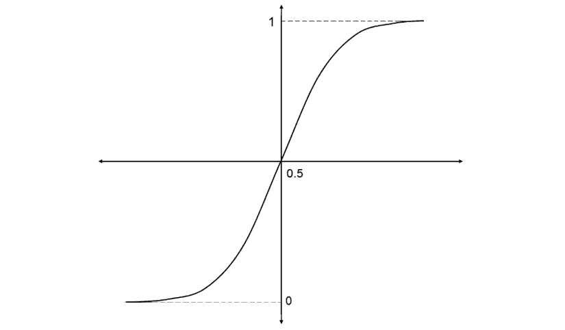
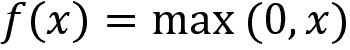
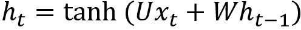
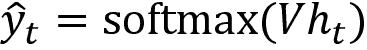
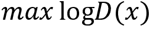

# 第七章：深度学习基础

在前几章中，我们已经学习了几个强化学习算法是如何工作的，以及它们如何找到最优策略。在接下来的章节中，我们将学习**深度强化学习**（**DRL**），它是深度学习和强化学习的结合。为了理解 DRL，我们需要具备深度学习的坚实基础。因此，在本章中，我们将学习几种重要的深度学习算法。

深度学习是机器学习的一个子集，核心是神经网络。深度学习已经存在了十多年，但现在之所以如此流行，是因为计算能力的进步和海量数据的可获取性。借助这些大量数据，深度学习算法能够超越经典的机器学习算法。

我们将从理解生物神经元和人工神经元开始，然后学习**人工神经网络**（**ANN**）及其实现方法。接下来，我们将学习一些有趣的深度学习算法，如**循环神经网络**（**RNN**）、**长短期记忆网络**（**LSTM**）、**卷积神经网络**（**CNN**）和**生成对抗网络**（**GAN**）。

本章我们将学习以下内容：

+   生物神经元与人工神经元

+   ANNs

+   RNNs

+   LSTM RNNs

+   CNNs

+   GANs

让我们从理解生物神经元和人工神经元的工作原理开始本章内容。

# 生物神经元与人工神经元

在继续之前，我们首先要探索神经元是什么，以及我们大脑中的神经元是如何工作的，然后再学习人工神经元。

**神经元**可以被定义为人脑的基本计算单元。神经元是我们大脑和神经系统的基本单位。我们的大脑大约包含 1000 亿个神经元。每个神经元通过一种叫做**突触**的结构与其他神经元相连接，突触负责接收来自外部环境的输入信息（通过感觉器官），向我们的肌肉发送运动指令，并执行其他活动。

神经元还可以通过一种叫做**树突**的分支结构从其他神经元接收输入。这些输入会被加强或削弱，也就是说，它们根据重要性进行加权，然后在细胞体（**胞体**）中相加。从细胞体中，这些加权后的输入会被处理并通过**轴突**传递，最终送到其他神经元。

*图 7.1* 显示了一个基本的单一生物神经元：


图 7.1：生物神经元

现在，让我们看看人工神经元是如何工作的。假设我们有三个输入 `x[1]`、`x[2]` 和 `x[3]`，用来预测输出 `y`。这些输入分别乘以权重 `w[1]`、`w[2]` 和 `w[3]`，并按以下方式相加：


但是，为什么要将这些输入与权重相乘呢？因为在计算输出 `y` 时，并不是所有输入都同等重要。假设 `x[2]` 在计算输出时比其他两个输入更重要。那么，我们会为 `w[2]` 分配一个比其他两个权重更高的值。这样，在将权重与输入相乘后，`x[2]` 的值将大于其他两个输入。简单来说，权重是用来增强输入的。在将输入与权重相乘后，我们将它们加在一起，再加上一个称为偏置 `b` 的值：


如果你仔细观察前面的公式，它可能看起来很熟悉。`z` 看起来像是线性回归的公式，不是吗？它不就是一条直线的方程吗？我们知道，直线方程是这样的：


在这里，`m` 是权重（系数），`x` 是输入，`b` 是偏置（截距）。

是的。那么，神经元和线性回归有什么区别呢？在神经元中，我们通过应用一个叫做**激活**或**传输函数**的函数 `f`(.)，为结果 `z` 引入了非线性。因此，我们的输出变成了：


*图 7.2* 显示了一个单一的人工神经元：


图 7.2：人工神经元

所以，一个神经元接收输入 `x`，将其与权重 `w` 相乘，再加上偏置 `b`，形成 `z`，然后我们对 `z` 应用激活函数，得到输出 `y`。

# 人工神经网络及其层次结构

虽然神经元非常酷，但我们不能仅依靠一个神经元来执行复杂任务。这就是我们大脑拥有数十亿个神经元，按层堆叠形成网络的原因。同样，人工神经元也被按层排列。每一层都将以某种方式连接，以便信息从一层传递到另一层。

一个典型的人工神经网络包括以下层：

+   输入层

+   隐藏层

+   输出层

每一层都有一组神经元，且一层的神经元与其他层的所有神经元都有交互。然而，同一层的神经元之间不会相互作用。这是因为相邻层的神经元之间有连接或边缘，但同一层的神经元之间没有任何连接。我们用**节点**或**单元**来表示人工神经网络中的神经元。

*图 7.3* 显示了一个典型的人工神经网络（ANN）：


图 7.3：人工神经网络（ANN）

## 输入层

**输入层** 是我们将输入数据提供给网络的地方。输入层中神经元的数量就是我们提供给网络的输入数量。每个输入都会对预测输出产生一定影响。然而，输入层并不执行任何计算；它仅用于将外界的信息传递给网络。

## 隐藏层

输入层和输出层之间的任何层都称为**隐藏层**。它处理从输入层接收到的输入。隐藏层负责推导输入和输出之间的复杂关系。也就是说，隐藏层识别数据集中的模式。它主要负责学习数据表示和提取特征。

隐藏层的数量可以是任意的；然而，我们必须根据使用场景选择隐藏层的数量。对于非常简单的问题，我们只需要使用一个隐藏层，但在执行复杂任务（如图像识别）时，我们使用许多隐藏层，每一层负责提取重要特征。当我们有许多隐藏层时，网络被称为**深度神经网络**。

## 输出层

在处理完输入后，隐藏层将其结果发送到输出层。顾名思义，输出层发出最终输出。输出层的神经元数量取决于我们希望网络解决的问题类型。

如果是二分类问题，则输出层中的神经元数量为 1，表示输入属于哪个类别。如果是多分类问题，比如有五个类别，并且我们希望得到每个类别的概率作为输出，则输出层中的神经元数量为五，每个神经元输出一个概率。如果是回归问题，则输出层只有一个神经元。

# 探索激活函数

**激活函数**，也称为**传输函数**，在神经网络中起着至关重要的作用。它用于引入神经网络中的非线性。正如我们之前所学，我们将激活函数应用于输入，输入会被权重乘以并加上偏置，即`f`(`z`)，其中 *z = (输入 * 权重) + 偏置*，`f`(.) 是激活函数。

如果不应用激活函数，那么神经元就仅仅类似于线性回归。激活函数的目的是引入非线性变换，以学习数据中复杂的潜在模式。

现在，让我们看一些常用的激活函数。

## Sigmoid 函数

**Sigmoid 函数**是最常用的激活函数之一。它将值缩放到 0 和 1 之间。Sigmoid 函数可以定义如下：


它是一个 S 形曲线，如*图 7.4*所示：



图 7.4：Sigmoid 函数

它是可微的，这意味着我们可以在任意两个点之间找到曲线的斜率。它是**单调**的，这意味着它要么完全是非递增的，要么是非递减的。Sigmoid 函数也被称为**逻辑斯蒂**函数。我们知道概率值介于 0 和 1 之间，而由于 Sigmoid 函数将值压缩到 0 到 1 之间，它被用于预测输出的概率。

## tanh 函数

**双曲正切**（**tanh**）函数输出的值介于-1 到+1 之间，表示如下：


它也类似于 S 形曲线。与 sigmoid 函数中心在 0.5 不同，tanh 函数是以 0 为中心，如下图所示：


图 7.5：tanh 函数

## 修正线性单元函数

**修正线性单元**（**ReLU**）函数是另一个最常用的激活函数之一。它输出一个从零到无穷大的值。它本质上是一个**分段**函数，可以表示如下：


也就是说，当`x`的值小于零时，`f`(`x`)返回零；当`x`的值大于或等于零时，`f`(`x`)返回`x`。它也可以表示如下：



*图 7.6*显示了 ReLU 函数：


图 7.6：ReLU 函数

如我们在前面的图示中看到的，当我们将任何负输入传递给 ReLU 函数时，它会将负输入转换为零。

## softmax 函数

**softmax 函数**本质上是 sigmoid 函数的推广。它通常应用于网络的最后一层，并且在执行多类分类任务时使用。它给出每个类别的输出概率，因此，softmax 值的总和总是等于 1。

它可以表示如下：


如*图 7.7*所示，softmax 函数将其输入转换为概率：


图 7.7：Softmax 函数

现在我们已经了解了不同的激活函数，在接下来的部分中，我们将学习人工神经网络（ANNs）中的前向传播。

# 人工神经网络中的前向传播

在本节中，我们将看到人工神经网络如何学习，其中神经元堆叠在不同的层中。网络中的层数等于隐藏层的数量加上输出层的数量。在计算网络的层数时，我们不考虑输入层。考虑一个包含一个输入层`x`、一个隐藏层`h`和一个输出层`y`的两层神经网络，如下图所示：


图 7.8：ANN 中的前向传播

假设我们有两个输入，`x[1]`和`x[2]`，我们需要预测输出，。由于我们有两个输入，输入层中的神经元数量为两个。我们将隐藏层的神经元数量设为四个，输出层的神经元数量设为一个。现在，输入会与权重相乘，然后我们加上偏差，并将结果值传递到隐藏层，在那里应用激活函数。

在此之前，我们需要初始化权重矩阵。在实际中，我们不知道哪些输入比其他输入更重要，能够进行加权并计算输出。因此，我们随机初始化权重和偏置值。从输入层到隐藏层之间的权重和偏置值分别表示为 `W`[xh] 和 `b[h]`。那权重矩阵的维度呢？权重矩阵的维度必须是 *当前层神经元的数量* x *下一层神经元的数量*。为什么是这样呢？

因为这是一个基本的矩阵乘法规则。要乘以任意两个矩阵 *AB*，矩阵 `A` 的列数必须等于矩阵 `B` 的行数。所以，权重矩阵 `W`[xh] 的维度应该是 *输入层神经元的数量* x *隐藏层神经元的数量*，即 2 x 4：


上述方程表示， 。现在，这个值传递到隐藏层。在隐藏层，我们对 `z[1]` 应用激活函数。我们使用 sigmoid 激活函数 。然后，我们可以写成：


应用激活函数后，我们再次将结果 `a[1]` 与新的权重矩阵相乘，并加上在隐藏层和输出层之间流动的新偏置值。我们可以分别将这个权重矩阵和偏置表示为 `W`[hy] 和 `b[y]`。权重矩阵 `W`[hy] 的维度是 *隐藏层神经元的数量* x *输出层神经元的数量*。由于我们在隐藏层有四个神经元，输出层有一个神经元，`W`[hy] 的矩阵维度将是 4 x 1。因此，我们将 `a[1]` 与权重矩阵 `W`[hy] 相乘，并加上偏置 `b[y]`，然后将结果 `z[2]` 传递给下一个层，即输出层：


现在，在输出层，我们对 `z[2]` 应用 sigmoid 函数，得到一个输出值：


从输入层到输出层的整个过程称为 **前向传播**。因此，为了预测输出值，输入从输入层传播到输出层。在传播过程中，它们会乘以每一层上的各自权重，并应用激活函数。完整的前向传播步骤如下所示：


前面的前向传播步骤可以通过以下 Python 代码实现：

```py
def forward_prop(X):
    z1 = np.dot(X,Wxh) + bh
    a1 = sigmoid(z1)
    z2 = np.dot(a1,Why) + by
    y_hat = sigmoid(z2)

    return y_hat 
```

正向传播很酷，对吧？但我们怎么知道神经网络生成的输出是否正确呢？我们定义了一个新的函数，称为**成本函数**（`J`），也叫**损失函数**（`L`），它告诉我们神经网络的表现如何。成本函数有很多种不同的类型。我们将使用均方误差作为成本函数，可以定义为实际输出和预测输出之间平方差的平均值：


这里，`n`是训练样本的数量，`y`是实际输出，是预测输出。

好的，我们了解到成本函数是用来评估神经网络的，也就是说，它告诉我们神经网络在预测输出方面的好坏。但是问题是，我们的网络到底是怎么学习的呢？在正向传播中，网络只是试图预测输出。那么它是如何学习预测正确的输出呢？在下一部分，我们将探讨这个问题。

# 神经网络是如何学习的？

如果成本或损失非常高，那么说明我们的网络没有预测出正确的输出。因此，我们的目标是最小化成本函数，使得神经网络的预测更加准确。我们如何最小化成本函数呢？也就是说，我们如何最小化损失/成本呢？我们已经了解到，神经网络是通过正向传播来进行预测的。那么，如果我们能够在正向传播中改变一些值，我们就能预测出正确的输出并最小化损失。但我们可以改变正向传播中的哪些值呢？显然，我们不能改变输入和输出。现在，我们剩下的就是权重和偏置值。记住，我们刚开始是随机初始化了权重矩阵。由于这些权重是随机的，它们不可能是完美的。现在，我们将更新这些权重矩阵（`W`[xh] 和 `W`[hy]），使得我们的神经网络能够给出正确的输出。我们如何更新这些权重矩阵呢？这时出现了一种新技术，叫做**梯度下降法**。

通过梯度下降法，神经网络可以学习到随机初始化的权重矩阵的最优值。有了这些最优的权重值，我们的网络就可以预测正确的输出并最小化损失。

现在，我们将探讨如何使用梯度下降法学习权重的最优值。梯度下降法是最常用的优化算法之一。它用于最小化成本函数，从而帮助我们最小化误差并获得可能的最低误差值。但梯度下降法是如何找到最优权重的呢？我们从一个类比开始。

想象一下，我们站在山顶，如下图所示，想要到达山的最低点。山上可能有许多看起来像是最低点的地方，但我们必须找到那个真正最低的点。

也就是说，我们不应该停留在一个点，认为它是最低点，尽管全局最低点存在：


图 7.9：梯度下降的类比

类似地，我们可以将成本函数表示如下。它是成本与权重的图像。我们的目标是最小化成本函数。也就是说，我们必须到达成本最小的最低点。下图中的实心黑点表示随机初始化的权重。如果我们将这个点向下移动，就可以到达成本最小的点：


图 7.10：梯度下降

那么我们如何将这个点（初始权重）向下移动呢？我们如何下降并到达最低点？梯度用于从一个点移动到另一个点。因此，我们可以通过计算成本函数相对于该点（初始权重）的梯度来移动这个点（初始权重），即 。

梯度是导数，实际上是切线的斜率，如下图所示。因此，通过计算梯度，我们可以下降（向下移动）并到达成本最小的最低点。梯度下降是一种一阶优化算法，这意味着我们在执行更新时只考虑一阶导数：


图 7.11：梯度下降

因此，使用梯度下降，我们将权重移动到成本最小的位置。但仍然，如何更新权重呢？

通过前向传播，我们到达了输出层。现在，我们将从输出层反向传播网络到输入层，并计算成本函数相对于输出层和输入层之间所有权重的梯度，以便我们最小化误差。计算完梯度后，我们将使用权重更新规则来更新旧的权重：


这意味着 *权重 = 权重 - α* x *梯度*。

那么  是什么？它被称为**学习率**。如以下图所示，如果学习率较小，那么我们会向下迈出较小的一步，梯度下降的速度可能会很慢。

如果学习率较大，那么我们会迈出较大的一步，梯度下降的速度会很快，但我们可能无法到达全局最小值，而是停留在局部最小值。因此，学习率应该选择得最优：


图 7.12：学习率的影响

这个从输出层反向传播网络到输入层并使用梯度下降更新网络权重以最小化损失的过程被称为**反向传播**。现在我们已经对反向传播有了基本了解，我们将通过一步步详细学习来加深理解。接下来我们将探讨一些有趣的数学内容，所以戴上你的微积分帽子，跟着步骤走。

所以，我们有两个权重，一个是 `W`[xh]，即输入到隐藏层的权重，另一个是 `W`[hy]，即从隐藏层到输出层的权重。我们需要找到这两个权重的最优值，以使我们得到最少的误差。因此，我们需要计算成本函数 `J` 关于这些权重的导数。由于我们正在进行反向传播，也就是从输出层到输入层，所以我们的第一个权重将是 `W`[hy]。因此，现在我们需要计算 `J` 对 `W`[hy] 的导数。我们如何计算导数呢？首先，让我们回顾一下我们的成本函数 `J`：


我们不能直接从前面的方程计算导数，因为没有 `W`[hy] 项。所以，我们不是直接计算导数，而是计算偏导数。让我们回顾一下我们的前向传播方程：


首先，我们将计算关于  的偏导数，然后从  中计算关于 `z[2]` 的偏导数。从 `z[2]` 开始，我们可以直接计算导数 `W`[hy]。这基本上就是链式法则。所以，`J` 对 `W`[hy] 的导数变为如下：


现在，我们将计算前述方程中的每一项：


在这里， 是我们的 Sigmoid 激活函数的导数。我们知道 Sigmoid 函数是 ，所以 Sigmoid 函数的导数将是 。

接下来我们有：


因此，将前述所有项代入方程 *(1)*，我们可以写成：


现在我们需要计算 `J` 关于下一个权重 `W`[xh] 的导数。

同样，由于我们在 `J` 中没有任何 `W`[xh] 项，我们不能直接计算 `W`[xh] 的导数。所以，我们需要使用链式法则。让我们再次回顾前向传播的步骤：


现在，根据链式法则，`J` 对 `W`[xh] 的导数为：


我们已经看到如何计算前述方程中的前两项；现在，我们将看到如何计算其余的项：


因此，将前述所有项代入方程 *(3)*，我们可以写成：


在我们计算了两个权重的梯度，`W`[hy] 和 `W`[xh] 之后，我们将根据权重更新规则更新初始权重：


就这样！这就是我们如何更新网络权重并最小化损失。现在，让我们看看如何在 Python 中实现反向传播算法。

在公式*(2)*和*(4)*中，我们都有项，因此为了避免重复计算，我们将其命名为`delta2`：

```py
delta2 = np.multiply(-(y-yHat),sigmoidPrime(z2)) 
```

现在，我们计算关于`W`[hy]的梯度。参见公式*(2)*：

```py
dJ_dWhy = np.dot(a1.T,delta2) 
```

我们计算关于`W`[xh]的梯度。参见公式*(4)*：

```py
delta1 = np.dot(delta2,Why.T)*sigmoidPrime(z1)
dJ_dWxh = np.dot(X.T,delta1) 
```

我们将根据权重更新规则公式*(5)*和*(6)*更新权重，具体如下：

```py
Wxh = Wxh - alpha * dJ_dWhy
Why = Why - alpha * dJ_dWxh 
```

反向传播的完整代码如下所示：

```py
def backword_prop(y_hat, z1, a1, z2):
    delta2 = np.multiply(-(y-y_hat),sigmoid_derivative(z2))
    dJ_dWhy = np.dot(a1.T, delta2)
    delta1 = np.dot(delta2,Why.T)*sigmoid_derivative(z1)
    dJ_dWxh = np.dot(X.T, delta1) 
    Wxh = Wxh - alpha * dJ_dWhy
    Why = Why - alpha * dJ_dWxh
    return Wxh,Why 
```

就这样。除此之外，还有不同变种的梯度下降方法，如随机梯度下降、小批量梯度下降、Adam、RMSprop 等。

在继续之前，让我们熟悉一些在神经网络中常用的术语：

+   **前向传播**：前向传播意味着从输入层向输出层传播。

+   **反向传播**：反向传播意味着从输出层回传到输入层。

+   **周期（Epoch）**：周期指定神经网络看到全部训练数据的次数。因此，我们可以说一个周期等于对所有训练样本进行一次前向传播和一次反向传播。

+   **批量大小**：批量大小指定我们在一次前向传播和一次反向传播中使用的训练样本数。

+   **迭代次数**：迭代次数指的是传递的次数，其中*一次传递 = 一次前向传播 + 一次反向传播*。

假设我们有 12,000 个训练样本，并且我们的批量大小为 6,000。然后我们需要两次迭代来完成一个周期。也就是说，在第一次迭代中，我们传递前 6,000 个样本，并执行一次前向传播和一次反向传播；在第二次迭代中，我们传递接下来的 6,000 个样本，并执行一次前向传播和一次反向传播。经过两次迭代后，我们的神经网络将看到全部 12,000 个训练样本，这样就完成了一个周期。

# 综合起来

将我们到目前为止学习的所有概念结合起来，我们将看到如何从零开始构建一个神经网络。我们将理解神经网络如何学习执行 XOR 门操作。XOR 门仅当且仅当其输入中恰好有一个为 1 时返回 1，否则返回 0，如*表 7.1*所示：


表 7.1：XOR 运算

## 从零开始构建神经网络

为了执行 XOR 门操作，我们构建了一个简单的两层神经网络，如下图所示。如你所见，我们有一个包含两个节点的输入层、一个包含五个节点的隐藏层和一个包含一个节点的输出层：


图 7.13：人工神经网络（ANN）

我们将逐步理解神经网络如何学习 XOR 逻辑：

1.  首先，导入所需的库：

    ```py
    import numpy as np
    import matplotlib.pyplot as plt
    %matplotlib inline 
    ```

1.  准备数据，如前面所示的 XOR 表：

    ```py
    X = np.array([ [0, 1], [1, 0], [1, 1],[0, 0] ])
    y = np.array([ [1], [1], [0], [0]]) 
    ```

1.  定义每一层的节点数：

    ```py
    num_input = 2
    num_hidden = 5
    num_output = 1 
    ```

1.  随机初始化权重和偏置。首先，我们初始化输入到隐藏层的权重：

    ```py
    Wxh = np.random.randn(num_input,num_hidden)
    bh = np.zeros((1,num_hidden)) 
    ```

1.  现在，我们初始化隐藏层到输出层的权重：

    ```py
    Why = np.random.randn (num_hidden,num_output)
    by = np.zeros((1,num_output)) 
    ```

1.  定义 Sigmoid 激活函数：

    ```py
    def sigmoid(z):
        return 1 / (1+np.exp(-z)) 
    ```

1.  定义 sigmoid 函数的导数：

    ```py
    def sigmoid_derivative(z):
         return np.exp(-z)/((1+np.exp(-z))**2) 
    ```

1.  定义前向传播：

    ```py
    def forward_prop(x,Wxh,Why):
        z1 = np.dot(x,Wxh) + bh
        a1 = sigmoid(z1)
        z2 = np.dot(a1,Why) + by
        y_hat = sigmoid(z2)

        return z1,a1,z2,y_hat 
    ```

1.  定义反向传播：

    ```py
    def backword_prop(y_hat, z1, a1, z2):
        delta2 = np.multiply(-(y-y_hat),sigmoid_derivative(z2))
        dJ_dWhy = np.dot(a1.T, delta2)
        delta1 = np.dot(delta2,Why.T)*sigmoid_derivative(z1)
        dJ_dWxh = np.dot(x.T, delta1) 
        return dJ_dWxh, dJ_dWhy 
    ```

1.  定义成本函数：

    ```py
    def cost_function(y, y_hat):
        J = 0.5*sum((y-y_hat)**2)

        return J 
    ```

1.  设置学习率和训练迭代次数：

    ```py
    alpha = 0.01
    num_iterations = 5000 
    ```

1.  现在，让我们通过以下代码开始训练网络：

    ```py
    cost =[]
    for i in range(num_iterations):
        z1,a1,z2,y_hat = forward_prop(X,Wxh,Why)    
        dJ_dWxh, dJ_dWhy = backword_prop(y_hat, z1, a1, z2)

        #update weights
        Wxh = Wxh -alpha * dJ_dWxh
        Why = Why -alpha * dJ_dWhy

        #compute cost
        c = cost_function(y, y_hat)

        cost.append(c) 
    ```

1.  绘制成本函数：

    ```py
    plt.grid()
    plt.plot(range(num_iterations),cost)
    plt.title('Cost Function')
    plt.xlabel('Training Iterations')
    plt.ylabel('Cost') 
    ```

如你在下图中所观察到的，损失随着训练迭代次数的增加而减少：


图 7.14：成本函数

因此，我们对人工神经网络（ANNs）及其学习方式有了整体的理解。

# 递归神经网络

*The sun rises in the ____.*

如果我们被要求预测前面句子中的空白部分，我们可能会说是 east。为什么我们会预测单词 east 是正确的呢？因为我们读了整个句子，理解了上下文，并预测单词 east 是一个合适的词来完成这个句子。

如果我们使用前馈神经网络（在上一节中学习的网络）来预测空白，它将无法预测正确的单词。这是因为在前馈网络中，每个输入都是独立的，它们仅根据当前输入进行预测，而不会记住之前的输入。

因此，网络的输入将仅是空白前的单词，即单词*the*。仅凭这个单词作为输入，我们的网络无法预测正确的单词，因为它无法理解句子的上下文，这意味着它不知道前面的一系列单词，因此无法理解句子的上下文并预测出一个合适的下一个单词。

在这里我们使用**递归神经网络**（**RNNs**）。它们不仅仅基于当前输入来预测输出，还会基于之前的隐藏状态进行预测。为什么它们必须基于当前输入和之前的隐藏状态来预测输出呢？为什么不能只使用当前输入和之前的输入呢？

这是因为之前的输入只会存储关于前一个单词的信息，而之前的隐藏状态将捕获网络到目前为止所看到的句子中所有单词的上下文信息。基本上，之前的隐藏状态就像记忆一样，它捕获了句子的上下文。有了这些上下文信息和当前输入，我们就可以预测相关的单词。

例如，让我们来看这个句子，*The sun rises in the ____.* 如下图所示，我们首先将单词*the*作为输入，然后将下一个单词*sun*作为输入；但同时，我们还会传递之前的隐藏状态，`h[0]`。因此，每次我们传递输入单词时，我们也会传递之前的隐藏状态作为输入。

在最后一步，我们传递单词 *the*，以及之前的隐藏状态 `h[3]`，它捕获了网络迄今为止看到的单词序列的上下文信息。因此，`h[3]` 充当记忆并存储网络已看到的所有前面的单词的信息。通过 `h[3]` 和当前输入单词（*the*），我们可以预测下一个相关的单词：


图 7.15：RNN

简而言之，RNN 使用前一个隐藏状态作为记忆，这个记忆捕获并存储网络迄今为止看到的上下文信息（输入）。

RNN 被广泛应用于涉及顺序数据的应用场景，如时间序列、文本、音频、语音、视频、天气等。它们在各种 **自然语言处理**（**NLP**）任务中得到了广泛应用，如语言翻译、情感分析、文本生成等。

## 前馈网络与 RNN 之间的区别

RNN 与前馈网络的比较见 *图 7.16*：


图 7.16：前馈网络与 RNN 的区别

如前图所示，RNN 在隐藏层中包含一个循环连接，这意味着我们使用前一个隐藏状态以及输入来预测输出。

还是不明白？让我们来看一下 RNN 的展开版本。但等等，RNN 的展开版本是什么？

这意味着我们将网络展开以适应完整的序列。假设我们有一个包含 `T` 个单词的输入句子；那么，我们将有从 0 到 `T`-1 的层，每个单词对应一个层，如 *图 7.17* 所示：


图 7.17：展开的 RNN

如 *图 7.17* 所示，在时间步 `t` = 1 时，输出 `y[1]` 是基于当前输入 `x[1]` 和前一个隐藏状态 `h[0]` 预测的。类似地，在时间步 `t` = 2 时，`y[2]` 是基于当前输入 `x[2]` 和前一个隐藏状态 `h[1]` 预测的。这就是 RNN 的工作原理；它通过当前输入和前一个隐藏状态来预测输出。

## RNN 中的前向传播

让我们看看 RNN 如何利用前向传播来预测输出；但在我们直接进入之前，先来了解一下符号的定义：


图 7.18：RNN 中的前向传播

上面的图示说明了以下内容：

+   `U` 表示输入到隐藏层的权重矩阵

+   `W` 表示隐藏到隐藏层的权重矩阵

+   `V` 表示隐藏到输出层的权重矩阵

在时间步 `t` 上的隐藏状态 `h` 可以通过以下公式计算：



即，*时间步的隐藏状态，t = tanh([输入到隐藏层的权重 x 输入]* + *[隐藏到隐藏层的权重 x 前一个隐藏状态]*)。

时间步 `t` 上的输出可以通过以下公式计算：



即，*时间步的输出，t = softmax（隐藏到输出层的权重* x *时间步 t 上的隐藏状态）*。

我们也可以像下图所示表示 RNN。正如你所看到的，隐藏层由一个 RNN 模块表示，这意味着我们的网络是一个 RNN，且前一个隐藏状态被用于预测输出：


图 7.19：RNN 中的前向传播

*图 7.20* 显示了在 RNN 的展开版本中前向传播的工作方式：


图 7.20：展开版本——RNN 中的前向传播

我们用随机值初始化初始隐藏状态 `h`[init]。正如你在前面的图中看到的，输出，，是基于当前输入，`x[0]`，和前一个隐藏状态（即初始隐藏状态 `h`[init]）预测的，使用以下公式：


类似地，看看输出是如何计算的，。它使用当前输入，`x[1]`，以及前一个隐藏状态，`h[0]`：


因此，在前向传播中预测输出时，RNN 使用当前输入和前一个隐藏状态。

## 反向传播

我们刚刚了解了 RNN 中前向传播的工作原理以及它是如何预测输出的。现在，我们计算每个时间步 `t` 的损失 `L`，以确定 RNN 预测输出的效果如何。我们使用交叉熵损失作为损失函数。时间步 `t` 的损失 `L` 可以表示为：


这里，`y[t]` 是实际输出，而  是在时间步 `t` 预测的输出。

最终的损失是所有时间步损失的总和。假设我们有 `T` - 1 层，那么最终的损失可以表示为：


*图 7.21* 显示了最终的损失是通过所有时间步的损失总和获得的：


图 7.21：RNN 中的反向传播

我们计算了损失，现在我们的目标是最小化损失。我们怎么做才能最小化损失呢？我们可以通过找到 RNN 的最佳权重来最小化损失。正如我们所学，RNN 中有三种权重：从输入到隐藏的权重 `U`，从隐藏到隐藏的权重 `W`，以及从隐藏到输出的权重 `V`。

我们需要为这三种权重找到最佳值，以最小化损失。我们可以使用我们喜欢的梯度下降算法来找到最佳权重。我们从计算损失函数关于所有权重的梯度开始，然后根据以下权重更新规则更新权重：


然而，RNN 有一个问题。梯度计算涉及计算相对于激活函数的梯度。当我们计算相对于 sigmoid 或 tanh 函数的梯度时，梯度会变得非常小。当我们在多个时间步上进一步反向传播并乘以梯度时，梯度会趋向变得越来越小。这就是所谓的消失梯度问题。

由于梯度随时间消失，我们无法学习关于长期依赖的信息，也就是说，RNN 无法在记忆中长时间保留信息。消失梯度问题不仅出现在 RNN 中，还出现在其他深度网络中，特别是在我们有多个隐藏层并使用 sigmoid/tanh 函数时。

解决消失梯度问题的一个方法是使用 ReLU 作为激活函数。然而，我们有一个 RNN 的变体叫做**长短期记忆**（**LSTM**），它能够有效地解决消失梯度问题。我们将在接下来的部分看到它是如何工作的。

# LSTM 来解救

在反向传播 RNN 时，我们学习了一个问题，叫做**消失梯度**。由于消失梯度问题，我们无法正确训练网络，这导致 RNN 无法在记忆中保持长序列。为了理解这个问题的含义，假设我们有一个简单的句子：

*The sky is __*.

RNN 可以根据它所看到的信息轻松预测空白处为*蓝色*，但它无法涵盖长期的依赖关系。这是什么意思？我们通过以下句子来更好地理解这个问题：

*Archie 在中国生活了 13 年。他喜欢听好音乐。他是漫画迷。他能流利地说 __。*

现在，如果我们被要求预测前一句话中的缺失词，我们会预测它是*中文*，但我们是如何预测的呢？我们简单地记住了前面的句子，并理解到 Archie 在中国生活了 13 年。这使我们得出结论，Archie 可能会说流利的中文。而 RNN 则无法将所有这些信息保存在记忆中，进而说出 Archie 能流利地讲中文。

由于消失梯度问题，它无法在记忆中长时间回忆/记住信息。也就是说，当输入序列较长时，RNN 的记忆（隐藏状态）无法保存所有信息。为了解决这个问题，我们使用了 LSTM 单元。

LSTM 是 RNN 的一种变体，能够解决消失梯度问题，并在需要时将信息保留在记忆中。基本上，RNN 单元在隐藏层中被 LSTM 单元替代，如*图 7.22*所示：


图 7.22：LSTM 网络

在下一部分中，我们将了解 LSTM 单元是如何工作的。

## 理解 LSTM 单元

LSTM 单元有什么特别之处？LSTM 单元是如何实现长期依赖的？它是如何知道哪些信息需要保留，哪些信息需要从记忆中丢弃的？

这一切都是通过名为**门**的特殊结构实现的。如以下图所示，一个典型的 LSTM 单元由三个特殊的门组成，分别是输入门、输出门和遗忘门：


图 7.23：LSTM 门

这三个门负责决定从记忆中添加、输出和忘记哪些信息。有了这些门，LSTM 单元能够有效地仅在需要时保留信息在记忆中。*图 7.24* 展示了一个典型的 LSTM 单元：


图 7.24：LSTM 单元

如果你查看 LSTM 单元，顶部的水平线被称为单元状态。它是信息流动的地方。单元状态上的信息将通过 LSTM 门不断更新。现在，我们将了解这些门的功能：

**遗忘门**：遗忘门负责决定哪些信息不应该出现在单元状态中。请看以下语句：

*哈里是个好歌手。他住在纽约。赞恩也是个好歌手。*

一旦我们开始谈论赞恩，网络会理解主题已经从哈里转移到赞恩，哈里的信息不再需要。现在，遗忘门会从单元状态中删除/忘记哈里的信息。

**输入门**：输入门负责决定哪些信息应该被存储在记忆中。我们来看同一个例子：

*哈里是个好歌手。他住在纽约。赞恩也是个好歌手。*

因此，在遗忘门从单元状态中删除信息后，输入门决定哪些信息必须存在于记忆中。这里，由于哈里的信息被遗忘门从单元状态中移除，输入门决定更新单元状态，将赞恩的信息加入其中。

**输出门**：输出门负责决定在某一时刻 `t` 从单元状态中展示哪些信息。现在，考虑以下句子：

*赞恩的首张专辑取得了巨大成功。祝贺 __。*

这里，"congrats" 是一个形容词，用来描述名词。输出层将预测赞恩（名词），以填补空白。

因此，使用 LSTM，我们可以克服 RNN 中遇到的梯度消失问题。在下一节中，我们将学习另一种有趣的算法——**卷积神经网络**（**CNN**）。

# 什么是 CNN？

CNN，也称为**卷积神经网络**，是计算机视觉任务中最广泛使用的深度学习算法之一。假设我们正在执行图像识别任务。请看以下图像。

我们希望我们的 CNN 能识别出它包含一匹马：


图 7.25：包含一匹马的图像

我们如何做到这一点呢？当我们将图像输入计算机时，它基本上会将图像转换为一个像素值矩阵。像素值的范围是 0 到 255，矩阵的维度是[*图像宽度* x *图像高度* x *通道数*]。灰度图像有一个通道，彩色图像有三个通道，分别是**红色、绿色和蓝色**（**RGB**）。

假设我们有一张彩色输入图像，宽度为 11，高度为 11，即 11 x 11，那么我们的矩阵维度将是*[11* x *11* x *3]*。如*11 x 11 x 3*所示，11 x 11 表示图像的宽度和高度，3 表示通道数，因为我们有一张彩色图像。所以，我们将得到一个 3D 矩阵。

但是，3D 矩阵很难可视化，因此，为了便于理解，我们假设输入是灰度图像。由于灰度图像只有一个通道，所以我们将得到一个二维矩阵。

如下图所示，输入的灰度图像将被转换为一个像素值矩阵，像素值的范围是 0 到 255，像素值表示该点的像素强度：


图 7.26：输入图像被转换为像素值矩阵

输入矩阵中给出的值只是为了帮助我们理解而设置的任意值。

好的，现在我们有了一个像素值输入矩阵。接下来会发生什么呢？CNN 是如何理解图像包含一匹马的呢？CNN 由以下三个重要层组成：

+   卷积层

+   池化层

+   全连接层

在这三层的帮助下，CNN 识别出图像中包含马的特征。接下来我们将详细探讨这些层。

## 卷积层

卷积层是 CNN 的第一个也是核心的层。它是 CNN 的构建块之一，用于从图像中提取重要特征。

我们有一张马的图片。你认为有哪些特征可以帮助我们理解这是马的图片呢？我们可以说是身体结构、面部、四肢、尾巴等等。但卷积神经网络（CNN）是如何理解这些特征的呢？这就是我们使用卷积操作的地方，卷积操作将从图像中提取出所有能够表征马的关键特征。所以，卷积操作帮助我们理解图像的内容。

好的，这个卷积操作到底是什么？它是如何执行的？它如何提取重要特征？我们来详细了解一下。

正如我们所知，每个输入图像都由一个像素值矩阵表示。除了输入矩阵，我们还需要另一个矩阵，称为**滤波器矩阵**。

滤波器矩阵也称为**核**，或者简单地称为**滤波器**，如*图 7.27*所示：


图 7.27：输入和滤波器矩阵

我们取滤波器矩阵，将它滑动到输入矩阵上一个像素，执行逐元素相乘，求和结果，最终得到一个数字。是不是有点让人困惑呢？让我们通过以下示意图更好地理解：


图 7.28：卷积操作

正如你在上面的示意图中看到的，我们将滤波器矩阵放在输入矩阵上方，执行逐元素相乘，求和结果，得到了一个数字。证明如下：


现在，我们将滤波器在输入矩阵上滑动一个像素，并执行相同的步骤，如*图 7.29*所示：


图 7.29：卷积操作

证明如下：


接下来，我们将滤波器矩阵滑动一个像素，并执行相同的操作，如*图 7.30*所示：


图 7.30：卷积操作

证明如下：


现在，再次，我们将滤波器矩阵滑动一个像素到输入矩阵上，并执行相同的操作，如*图 7.31*所示：


图 7.31：卷积操作

也就是说：


好的，我们在这里做什么？我们基本上是将滤波器矩阵滑动到整个输入矩阵上，每次滑动一个像素，执行逐元素相乘并将结果相加，最终产生一个新的矩阵，称为**特征图**或**激活图**。这就是所谓的**卷积操作**。

正如我们所学，卷积操作用于提取特征，新的矩阵，即特征图，表示提取的特征。如果我们绘制特征图，那么我们就可以看到卷积操作提取出的特征。

*图 7.32*展示了实际图像（输入图像）和卷积后的图像（特征图）。我们可以看到，我们的滤波器已经从实际图像中检测到了边缘作为特征：


图 7.32：将实际图像转换为卷积后的图像

使用各种滤波器从图像中提取不同的特征。例如，如果我们使用锐化滤波器，，它将会锐化我们的图像，如下图所示：


图 7.33：锐化后的图像

因此，我们已经了解到，利用滤波器，我们可以通过卷积操作从图像中提取重要特征。因此，我们不仅可以使用一个滤波器，还可以使用多个滤波器从图像中提取不同的特征，并生成多个特征图。这样，特征图的深度将是滤波器的数量。如果我们使用七个滤波器来提取图像中的不同特征，那么我们的特征图的深度将是七：


图 7.34：特征图

好的，我们已经学会了不同的滤波器从图像中提取不同的特征。但问题是，我们如何为滤波器矩阵设置正确的值，以便能够从图像中提取重要的特征呢？别担心！我们只需要随机初始化滤波器矩阵，而滤波器矩阵的最佳值——能够从图像中提取重要特征的值——会通过反向传播学习到。但是，我们只需要指定滤波器的大小以及我们想要使用的滤波器数量。

### 步长

我们刚刚学习了卷积操作是如何工作的。我们以一个像素为单位，用滤波器矩阵滑动输入矩阵并执行卷积操作。但我们不一定要每次只滑动一个像素，也可以选择按任意数量的像素滑动输入矩阵。

滤波器矩阵滑动输入矩阵的像素数量称为**步长**。

如果我们将步长设置为 2，那么我们就会以两个像素为单位，用滤波器矩阵滑动输入矩阵。*图 7.35*展示了一个步长为 2 的卷积操作：


图 7.35：步长操作

那么我们如何选择步长呢？我们刚刚了解到，步长是指我们滑动滤波器矩阵时沿某一方向移动的像素数量。所以，当步长设置为较小的数字时，我们可以比设置较大步长时更详细地编码图像的特征。然而，较大的步长值所需的计算时间比较小步长值要少。

### 填充

在卷积操作中，我们是用滤波器矩阵在输入矩阵上滑动。但在某些情况下，滤波器无法完美地适配输入矩阵。这里是什么意思呢？举个例子，假设我们正在进行步长为 2 的卷积操作。在某些情况下，当我们将滤波器矩阵移动两个像素时，它会到达边界，而滤波器矩阵无法适配输入矩阵。也就是说，滤波器矩阵的一部分超出了输入矩阵，如下图所示：


图 7.36：填充操作

在这种情况下，我们执行填充操作。我们可以简单地用零填充输入矩阵，使得滤波器能够适配输入矩阵，如*图 7.37*所示。用零填充输入矩阵的操作称为**相同填充**或**零填充**：


图 7.37：相同填充

我们也可以选择不使用零填充，而是直接丢弃滤波器无法适配的输入矩阵区域。这称为**有效填充**：


图 7.38：有效填充

## 池化层

好的，现在我们已经完成了卷积操作。通过卷积操作，我们得到了特征图。但是特征图的维度太大了。为了减少特征图的维度，我们进行池化操作。池化操作减少了特征图的维度，只保留必要的细节，从而减少计算量。

例如，为了从图像中识别马，我们需要提取并仅保留马的特征；我们可以简单地丢弃不需要的特征，例如图像的背景等。池化操作也叫做**下采样**或**子采样**操作，它使得 CNN 具有平移不变性。因此，池化层通过只保留重要特征来减少空间维度。

有不同类型的池化操作，包括最大池化、平均池化和求和池化。

在最大池化中，我们在输入矩阵上滑动滤波器，并简单地从滤波窗口中取最大值，如*图 7.39*所示：


图 7.39：最大池化

在平均池化中，我们在滤波窗口内取输入矩阵的平均值，在求和池化中，我们将滤波窗口内输入矩阵的所有值求和。

## 全连接层

到目前为止，我们已经了解了卷积层和池化层的工作原理。一个 CNN 可以有多个卷积层和池化层。然而，这些层仅仅从输入图像中提取特征并生成特征图；也就是说，它们只是特征提取器。

给定任何图像，卷积层从图像中提取特征并生成特征图。现在，我们需要对这些提取的特征进行分类。因此，我们需要一个算法来分类这些提取的特征，并告诉我们这些特征是马的特征，还是其他的特征。为了进行分类，我们使用前馈神经网络。我们将特征图扁平化并将其转换为一个向量，然后将其作为输入传递给前馈网络。

前馈网络将这个扁平化的特征图作为输入，应用激活函数，例如 sigmoid，并返回输出，指出图像是否包含马；这被称为全连接层，下面的图示展示了这一过程：


图 7.40：全连接层

让我们看看这些如何融合在一起。

# CNN 的架构

*图 7.41*展示了 CNN 的架构：


图 7.41：CNN 架构

正如你所注意到的，首先我们将输入图像传递给卷积层，在这里我们应用卷积操作，从图像中提取重要特征并创建特征图。然后，我们将特征图传递给池化层，在池化层中，特征图的维度将会被降低。

如前面的图所示，我们可以有多个卷积层和池化层，同时也需要注意，池化层不一定必须跟在每个卷积层之后；可以有多个卷积层，之后才接池化层。

所以，在卷积层和池化层之后，我们将结果特征图展平，并将其输入到全连接层，这基本上是一个前馈神经网络，依据特征图对给定的输入图像进行分类。

现在我们已经了解了卷积神经网络（CNN）的工作原理，在接下来的部分，我们将学习另一个有趣的算法——生成对抗网络。

# 生成对抗网络

**生成对抗网络**（**GAN**）最早由 Ian J. Goodfellow、Jean Pouget-Abadie、Mehdi Mirza、Bing Xu、David Warde-Farley、Sherjil Ozair、Aaron Courville 和 Yoshua Bengio 在他们 2014 年的论文《生成对抗网络》中提出。

生成对抗网络（GAN）广泛用于生成新的数据点。它们可以应用于任何类型的数据集，但通常用于生成图像。生成对抗网络的一些应用包括生成逼真的人脸图像、将灰度图像转换为彩色图像、将文本描述转化为逼真的图像等。

近年来，生成对抗网络（GAN）已经发展得非常成熟，能够生成非常逼真的图像。下图展示了生成对抗网络在五年内生成图像的演变过程：


图 7.42：生成对抗网络的演变过程

对生成对抗网络（GAN）感到兴奋了吗？现在，我们将详细了解它们是如何工作的。在继续之前，让我们考虑一个简单的类比。假设你是警察，你的任务是找出伪钞，而伪钞制造者的角色是制造假钞并欺骗警察。

伪钞制造者不断尝试制造出与真钞几乎无法区分的假钞，但警察的任务是判断钞票是真是假。所以，伪钞制造者和警察实际上是在进行一场双人对抗游戏，其中一个试图战胜另一个。生成对抗网络的工作原理也类似。它们由两个重要的组件组成：

+   生成器

+   判别器

你可以将生成器看作是伪钞制造者，而判别器则类似于警察。也就是说，生成器的角色是制造假钞，而判别器的角色是识别这些钞票是真是假。

在不深入细节的情况下，我们首先对 GAN 有一个基本的了解。假设我们希望我们的 GAN 生成手写数字。我们该如何做到呢？首先，我们将获取一个包含手写数字的数据库，比如 MNIST 数据集。生成器学习我们数据集中的图像分布。因此，它学习训练集中手写数字的分布。一旦它学习到数据集中的图像分布，我们向生成器输入随机噪声，它将根据学到的分布，将随机噪声转换为类似于我们训练集中手写数字的新图像：


图 7.43: 生成器

判别器的目标是执行分类任务。给定一张图像，它将其分类为真实或虚假；也就是说，判断该图像是来自训练集，还是由生成器生成的图像：


图 7.44: 判别器

GAN 的生成器组件基本上是一个生成模型，而判别器组件基本上是一个判别模型。因此，生成器学习类别的分布，判别器学习类别的决策边界。

如*图 7.45*所示，我们向生成器输入随机噪声，生成器将这些随机噪声转换为一张新的图像，这张图像与我们训练集中的图像相似，但不完全相同。由生成器生成的图像称为假图像，而训练集中的图像称为真实图像。我们将真实图像和假图像都输入判别器，判别器告诉我们它们是“真实”的概率。如果图像是假的，它返回 0；如果图像是真的，它返回 1：


图 7.45: GAN

现在我们对生成器和判别器有了基本了解，我们将详细研究每个组件。

## 解析生成器

GAN 的生成器组件是一个生成模型。我们所说的生成模型有两种类型——**隐式**和**显式**密度模型。隐式密度模型不使用任何显式密度函数来学习概率分布，而显式密度模型顾名思义，使用显式密度函数。GAN 属于第一类。也就是说，它们是一个隐式密度模型。让我们详细研究并理解 GAN 是如何成为一个隐式密度模型的。

假设我们有一个生成器，`G`。它基本上是一个由  参数化的神经网络。生成器网络的作用是生成新的图像。它们是如何做到这一点的呢？生成器的输入应该是什么？

我们从一个正态分布或均匀分布中采样一个随机噪声，`z`，其概率分布为 `P[z]`。我们将这个随机噪声 `z` 作为输入传递给生成器，然后生成器将这个噪声转换为一张图像：


惊讶吧？生成器是如何将随机噪声转换为逼真的图像的呢？

假设我们有一个包含人脸图像的数据集，我们希望生成器生成一张新的面部图像。首先，生成器通过学习我们训练集中的图像概率分布来学习面部的所有特征。一旦生成器学会了正确的概率分布，它就能生成全新的面部图像。

那么，生成器是如何学习训练集的分布的呢？也就是说，生成器是如何学习训练集中人脸图像的分布的？

生成器其实不过是一个神经网络。那么，发生的事情是，神经网络隐式地学习了我们训练集中的图像分布；我们把这个分布叫做生成器分布，`P[g]`。在第一次迭代时，生成器生成的是一张非常嘈杂的图像。但经过多次迭代后，它学会了我们训练集的确切概率分布，并通过调整其参数学会生成正确的图像。

需要注意的是，我们并没有使用均匀分布`P[z]`来学习训练集的分布。它只是用来采样随机噪声，我们将这些随机噪声作为输入馈送给生成器。生成器网络隐式地学习了我们训练集的分布，我们把这个分布叫做生成器分布，`P[g]`，这就是我们称生成器网络为隐式密度模型的原因。

现在我们理解了生成器，让我们来看看鉴别器。

## 拆解鉴别器

如名字所示，鉴别器是一个判别模型。假设我们有一个鉴别器，`D`。它也是一个神经网络，并且由参数化。

鉴别器的目标是区分两类图像。也就是说，给定一张图像`x`，它必须识别该图像是来自真实分布还是伪造分布（生成器分布）。也就是说，鉴别器必须识别输入的图像是来自训练集，还是来自生成器生成的伪造图像：


我们把训练集的分布叫做真实数据分布，用`P[r]`表示。我们知道生成器分布用`P[g]`表示。

所以，鉴别器`D`本质上是在尝试判断图像`x`是来自`P[r]`还是`P[g]`。

## 那么，它们是如何学习的呢？

到目前为止，我们只研究了生成器和鉴别器的作用，但它们究竟是如何学习的呢？生成器是如何学会生成新的真实图像的，鉴别器又是如何学会正确区分图像的呢？

我们知道生成器的目标是生成一张图像，使得它能够欺骗鉴别器，让鉴别器相信生成的图像来自真实分布。

在第一次迭代中，生成器生成了一张噪声图像。当我们将此图像输入鉴别器时，它可以轻松地检测到该图像来自生成器分布。生成器将此视为一种损失并尝试改进自身，因为它的目标是欺骗鉴别器。也就是说，如果生成器知道鉴别器容易将生成的图像检测为虚假图像，那么这意味着它没有生成类似于训练集中图像的图像。这暗示着它还没有学习到训练集的概率分布。

因此，生成器调整其参数，以学习训练集的正确概率分布。正如我们所知，生成器是一个神经网络，我们只需通过反向传播更新网络的参数。一旦它学会了真实图像的概率分布，就能够生成与训练集中图像相似的图像。

好的，鉴别器呢？它是如何学习的？如我们所知，鉴别器的作用是区分真实和虚假图像。

如果鉴别器错误地分类了生成的图像；也就是说，如果鉴别器将虚假图像分类为真实图像，那么就意味着鉴别器没有学会区分真实和虚假图像。因此，我们通过反向传播更新鉴别器网络的参数，使得鉴别器学会区分真实和虚假图像。

因此，基本上，生成器通过学习真实数据分布`P[r]`来试图欺骗鉴别器，而鉴别器则试图判断图像是来自真实分布还是虚假分布。那么问题来了，我们应该在何时停止训练网络，因为生成器和鉴别器在相互竞争？

基本上，GAN 的目标是生成与训练集中图像相似的图像。假设我们想生成一张人脸——我们学习训练集中图像的分布，然后生成新的面孔。因此，对于生成器，我们需要找到最佳的鉴别器。这是什么意思呢？

我们知道，生成器分布由`P[g]`表示，而真实数据分布由`P[r]`表示。如果生成器完美地学习了真实数据的分布，那么`P[g]`就等于`P[r]`，正如*图 7.46*所示：


图 7.46：生成器和真实数据分布

当`P[g]` = `P[r]`时，鉴别器无法区分输入图像是来自真实分布还是虚假分布，因此它会返回 0.5 作为概率，因为当两者分布相同时，鉴别器会变得混淆。

因此，对于生成器，最佳的鉴别器可以定义如下：


因此，当判别器对所有生成器生成的图像返回 0.5 的概率时，我们可以说生成器已经学习到了训练集图像的分布，并成功欺骗了判别器。

## GAN 的架构

*图 7.47* 显示了 GAN 的架构：


图 7.47：GAN 的架构

如前面的图示所示，生成器 `G` 将随机噪声 `z` 作为输入，通过从均匀分布或正态分布中采样，隐式学习训练集的分布并生成假图像。

我们从真实数据分布  和假数据分布  中采样图像 `x`，并将其输入到判别器 `D` 中。我们将真实图像和假图像输入判别器，判别器执行二分类任务。也就是说，当图像是假的时，它返回 0，当图像是真的时，它返回 1。

## 揭开损失函数的神秘面纱

现在我们将研究 GAN 的损失函数。在继续之前，先回顾一下符号：

+   作为生成器输入的噪声用 `z` 表示

+   噪声 `z` 的采样来自均匀分布或正态分布，该分布用 `P[z]` 表示

+   输入图像由 `x` 表示

+   真实数据分布或训练集的分布用 `P[r]` 表示

+   假数据分布或生成器的分布用 `P[g]` 表示

当我们写出  时，意味着图像 `x` 是从真实分布 `P[r]` 中采样的。同样， 表示图像 `x` 是从生成器分布 `P[g]` 中采样的，而  则意味着生成器输入 `z` 是从均匀分布 `P[z]` 中采样的。

我们已经了解到，生成器和判别器都是神经网络，且它们都会通过反向传播来更新其参数。现在我们需要找到最优的生成器参数  和判别器参数 。

### 判别器损失

现在我们将看看判别器的损失函数。我们知道判别器的目标是分类图像是真实的还是假的。我们用 `D` 来表示判别器。

判别器的损失函数如下所示：


这意味着什么呢？让我们逐个理解这些术语。

#### 第一项

让我们来看第一项：


这里， 表示我们从真实数据分布 `P[r]` 中采样输入 `x`，因此 `x` 是一张真实图像。

`D`(`x`) 表示我们将输入图像 `x` 提供给判别器 `D`，判别器将返回输入图像 `x` 是真实图像的概率。由于 `x` 是从真实数据分布 `P[r]` 中采样的，我们知道 `x` 是一张真实图像。因此，我们需要最大化 `D`(`x`) 的概率：


但我们不是最大化原始概率，而是最大化对数概率，因此，我们可以写出以下内容：



所以，我们的最终方程变为以下形式：


 表示从真实数据分布中采样的输入图像为真实图像的对数似然期望。

#### 第二项

现在，让我们看一下第二项：


这里， 表示我们从均匀分布 `P[z]` 中采样一个随机噪声 `z`。`G`(`z`) 表示生成器 `G` 以随机噪声 `z` 作为输入，并根据其隐式学习的分布 `P[g]` 返回一张假图像。

`D`(`G`(`z`)) 表示我们将生成器生成的假图像输入到判别器 `D` 中，判别器将返回该假输入图像是一个真实图像的概率。

如果我们从 1 中减去 `D`(`G`(`z`))，那么它将返回假输入图像是一个假图像的概率：


由于我们知道 `z` 不是一张真实的图像，判别器将最大化这个概率。也就是说，判别器最大化 `z` 被分类为假图像的概率，因此我们写出：


我们不是最大化原始概率，而是最大化对数概率：


 表示生成器生成的输入图像为假图像的对数似然期望。

#### 最后一项

所以，结合这两项，判别器的损失函数表示为：


这里， 和  分别是生成器和判别器网络的参数。因此，判别器的目标是找到合适的 ，以便它可以正确地分类图像。

### 生成器损失

生成器的损失函数如下：


我们知道生成器的目标是欺骗判别器，将假图像分类为真实图像。

在 *判别器损失* 部分，我们看到  表示将假输入图像分类为假图像的概率，而判别器最大化正确将假图像分类为假的概率。

但生成器希望最小化这个概率。由于生成器希望欺骗判别器，它最小化假输入图像被判别器分类为假图像的概率。因此，生成器的损失函数可以表示为：


# 总损失

我们刚刚了解了生成器和判别器的损失函数，通过结合这两者，我们将最终的损失函数写为：


因此，我们的目标函数本质上是一个 min-max 目标函数，也就是对判别器进行最大化，对生成器进行最小化，并且我们通过反向传播相应的网络来找到最优的生成器参数！[](img/B15558_07_104.png)，和判别器参数！[](img/B15558_07_105.png)。

因此，我们进行梯度上升；也就是说，对判别器进行最大化：


另外，我们进行梯度下降；也就是说，对生成器进行最小化：


# 概要

我们通过理解生物神经元和人工神经元开始了本章的学习。然后我们学习了 ANN 及其层次结构。我们了解了不同类型的激活函数以及它们如何在网络中引入非线性。

后来，我们学习了神经网络中的前向传播和反向传播。接着，我们学习了如何实现一个 ANN。接下来，我们了解了 RNN 以及它们与前馈网络的不同之处。然后，我们学习了 RNN 的一个变种——LSTM。接着，我们学习了 CNN，了解了它们如何使用不同类型的层，并详细探讨了 CNN 的架构。

在本章结束时，我们了解了一个有趣的算法——GAN。我们理解了 GAN 的生成器和判别器组件，并且详细探讨了 GAN 的架构。接着，我们详细研究了 GAN 的损失函数。

在下一章，我们将学习一个最受欢迎的深度学习框架——TensorFlow。

# 问题

让我们通过回答以下问题来评估我们对深度学习算法的理解：

1.  什么是激活函数？

1.  定义 softmax 函数。

1.  什么是一个 epoch？

1.  RNN 的一些应用是什么？

1.  解释消失梯度问题。

1.  有哪些不同类型的池化操作？

1.  解释 GAN 的生成器和判别器组件。

# 进一步阅读

+   若要了解更多关于深度学习算法的内容，可以查看我出版的书籍《**Python 深度学习算法实战**》，该书同样由 Packt 出版，链接：[`www.packtpub.com/in/big-data-and-business-intelligence/hands-deep-learning-algorithms-python`](https://www.packtpub.com/in/big-data-and-business-intelligence/hands-deep-learning-algorithms-python)。
