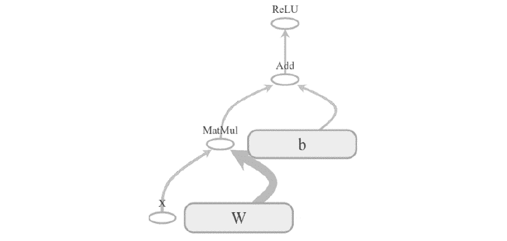
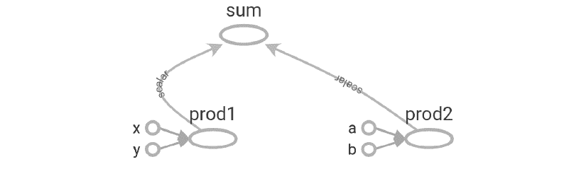
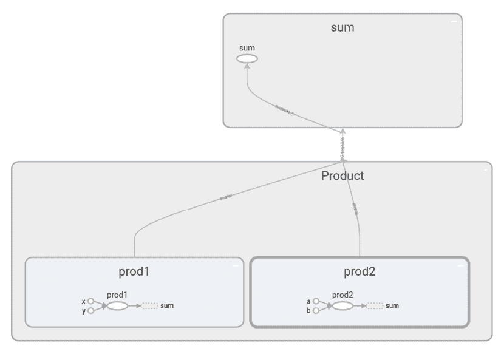
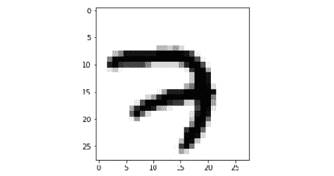
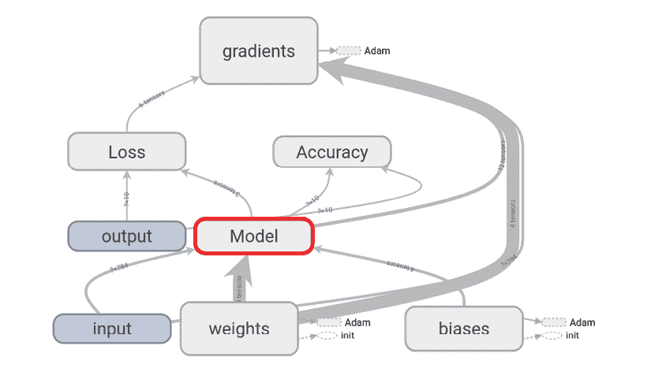
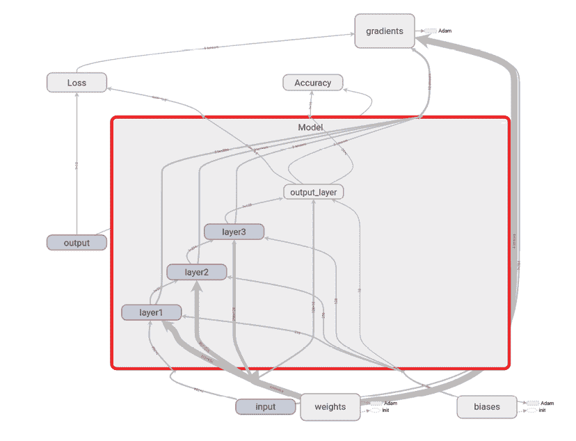
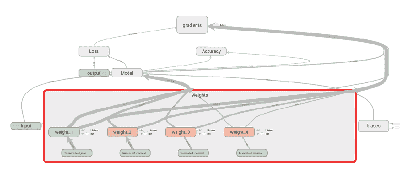
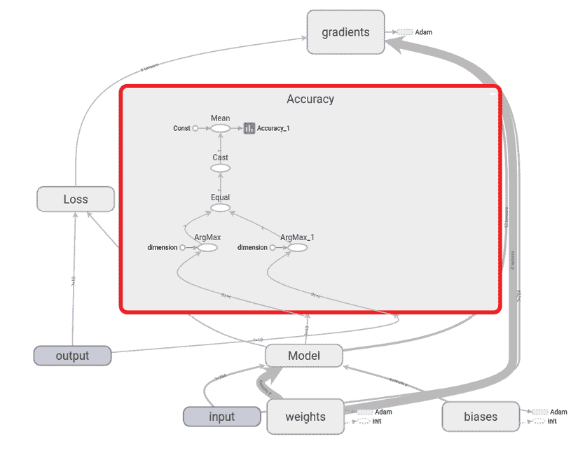
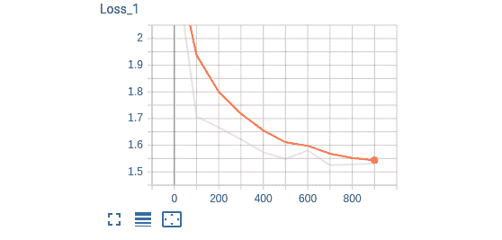
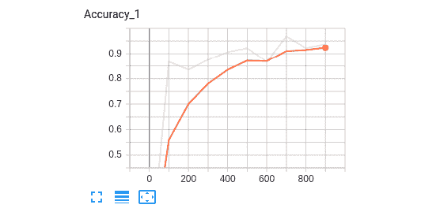

# 第八章：TensorFlow 入门

TensorFlow 是最受欢迎的深度学习库之一。在接下来的章节中，我们将使用 TensorFlow 构建深度强化学习模型。因此，在本章中，我们将熟悉 TensorFlow 及其功能。

我们将了解什么是计算图，以及 TensorFlow 如何使用它们。我们还将探讨 TensorBoard，这是 TensorFlow 提供的一个可视化工具，用于可视化模型。接下来，我们将理解如何使用 TensorFlow 构建神经网络来执行手写数字分类。

接下来，我们将学习 TensorFlow 2.0，它是 TensorFlow 的最新版本。我们将了解 TensorFlow 2.0 与其先前版本的不同之处，以及它如何使用 Keras 作为其高级 API。

在本章中，我们将学习以下内容：

+   TensorFlow

+   计算图和会话

+   变量、常量和占位符

+   TensorBoard

+   TensorFlow 中的手写数字分类

+   TensorFlow 中的数学运算

+   TensorFlow 2.0 和 Keras

# 什么是 TensorFlow？

TensorFlow 是 Google 的一个开源软件库，广泛用于数值计算。它是构建深度学习模型时使用最广泛的库之一，具有高度的可扩展性，并能在多个平台上运行，例如 Windows、Linux、macOS 和 Android。最初由 Google Brain 团队的研究人员和工程师开发。

TensorFlow 支持在各种设备上执行，包括 CPU、GPU、TPU（张量处理单元）、移动平台和嵌入式平台。由于其灵活的架构和易于部署，它已成为许多研究人员和科学家构建深度学习模型时的热门选择。

在 TensorFlow 中，每个计算都是通过数据流图表示的，也称为 **计算图**，其中节点代表操作（如加法或乘法），边代表张量。数据流图也可以在许多不同的平台上共享和执行。TensorFlow 提供了一种可视化工具，叫做 TensorBoard，用于可视化数据流图。

TensorFlow 2.0 是 TensorFlow 的最新版本。在接下来的章节中，我们将使用 TensorFlow 2.0 构建深度强化学习模型。然而，理解 TensorFlow 1.x 的工作原理也很重要。所以，首先，我们将学习如何使用 TensorFlow 1.x，然后再深入了解 TensorFlow 2.0。

你可以通过在终端输入以下命令，轻松通过 `pip` 安装 TensorFlow：

```py
pip install tensorflow==1.13.1 
```

我们可以通过运行以下简单的 `Hello TensorFlow!` 程序来检查 TensorFlow 是否安装成功：

```py
import tensorflow as tf
hello = tf.constant("Hello TensorFlow!")
sess = tf.Session()
print(sess.run(hello)) 
```

前面的程序应该打印出`Hello TensorFlow!`。如果你遇到任何错误，那么可能是你没有正确安装 TensorFlow。

# 理解计算图和会话

如我们所学，TensorFlow 中的每一个计算都由一个计算图表示。计算图由多个节点和边组成，其中节点是数学运算，如加法和乘法，边是张量。计算图在资源优化方面非常高效，并且促进了分布式计算。

计算图由多个 TensorFlow 操作组成，排列成一个节点图。

计算图帮助我们理解网络架构，尤其在构建复杂神经网络时。例如，假设我们考虑一个简单的层，*h* = Relu(*WX* + *b*)。其计算图将如下所示：



图 8.1：计算图

计算图中有两种依赖关系，分别称为直接依赖和间接依赖。假设我们有节点`b`，其输入依赖于节点`a`的输出；这种依赖关系称为**直接依赖**，如以下代码所示：

```py
a = tf.multiply(8,5)
b = tf.multiply(a,1) 
```

当节点 `b` 的输入不依赖于节点 `a` 时，这称为**间接依赖**，如以下代码所示：

```py
a = tf.multiply(8,5)
b = tf.multiply(4,3) 
```

因此，如果我们能够理解这些依赖关系，就能在可用资源中分配独立的计算，减少计算时间。每当我们导入 TensorFlow 时，默认图会自动创建，我们创建的所有节点都会与该默认图关联。我们还可以创建自己的图，而不是使用默认图，这在构建相互独立的多个模型时非常有用。可以使用`tf.Graph()`创建一个 TensorFlow 图，如下所示：

```py
graph = tf.Graph()
with graph.as_default():
     z = tf.add(x, y, name='Add') 
```

如果我们想清除默认图（即清除图中先前定义的变量和操作），则可以使用`tf.reset_default_graph()`来实现。

## 会话

如前所述，创建了一个计算图，其节点上包含操作，边缘上连接张量。为了执行该图，我们使用一个 TensorFlow 会话。

可以使用`tf.Session()`来创建 TensorFlow 会话，如以下代码所示：

```py
sess = tf.Session() 
```

创建会话后，我们可以使用`sess.run()`方法来执行我们的计算图。

TensorFlow 中的每一个计算都由一个计算图表示，因此我们需要运行计算图来进行所有计算。也就是说，要在 TensorFlow 中进行任何计算，我们需要创建一个 TensorFlow 会话。

执行以下代码以乘法运算两个数字：

```py
a = tf.multiply(3,3)
print(a) 
```

与打印 `9` 不同，前面的代码将打印一个 TensorFlow 对象，`Tensor("Mul:0", shape=(), dtype=int32)`。

如前所述，每当我们导入 TensorFlow 时，默认的计算图会自动创建，所有节点都会附加到该图上。因此，当我们打印 `a` 时，它只会返回 TensorFlow 对象，因为 `a` 的值尚未计算，计算图尚未执行。

为了执行计算图，我们需要初始化并运行 TensorFlow 会话，如下所示：

```py
a = tf.multiply(3,3)
with tf.Session as sess:
    print(sess.run(a)) 
```

前面的代码打印出 `9`。

现在我们已经了解了会话，接下来的部分将学习变量、常量和占位符。

# 变量、常量和占位符

变量、常量和占位符是 TensorFlow 的基础元素。然而，这三者之间经常会产生混淆。让我们逐一查看每个元素，并了解它们之间的区别。

## 变量

变量是用来存储值的容器。变量作为输入用于计算图中的多个其他操作。可以使用 `tf.Variable()` 函数来创建变量，如下列代码所示：

```py
x = tf.Variable(13) 
```

让我们使用 `tf.Variable()` 创建一个名为 `W` 的变量，如下所示：

```py
W = tf.Variable(tf.random_normal([500, 111], stddev=0.35), name="weights") 
```

正如前面的代码所示，我们通过从标准差为 `0.35` 的正态分布中随机抽取值来创建一个变量 `W`。

`tf.Variable()` 中的 `name` 参数是什么？

它用于设置计算图中变量的名称。所以，在前面的代码中，Python 将变量保存为 `W`，但在 TensorFlow 图中，它将被保存为 `weights`。

在定义变量后，我们需要初始化计算图中的所有变量。可以使用 `tf.global_variables_initializer()` 来完成这一步。

一旦创建了会话，我们运行初始化操作，初始化所有已定义的变量，只有在此之后才能运行其他操作，如下列代码所示：

```py
x = tf.Variable(1212)
init = tf.global_variables_initializer()
with tf.Session() as sess:
  sess.run(init) 
  print(sess.run(x)) 
```

## 常量

常量与变量不同，常量的值不能改变。也就是说，常量是不可变的。一旦赋值，它们在整个程序中都无法更改。我们可以使用 `tf.constant()` 创建常量，如下列代码所示：

```py
 x = tf.constant(13) 
```

## 占位符和馈送字典

我们可以把占位符看作变量，在其中只定义类型和维度，但不分配值。占位符的值将在运行时输入。我们使用占位符将数据传递给计算图。占位符在定义时没有值。

占位符可以通过 `tf.placeholder()` 来定义。它有一个可选参数 `shape`，表示数据的维度。如果 `shape` 设置为 `None`，则可以在运行时输入任何大小的数据。占位符可以这样定义：

```py
 x = tf.placeholder("float", shape=None) 
```

简单来说，我们使用 `tf.Variable` 来存储数据，而使用 `tf.placeholder` 来输入外部数据。

为了更好地理解占位符，我们考虑一个简单的例子：

```py
x = tf.placeholder("float", None)
y = x+3
with tf.Session() as sess:
    result = sess.run(y)
    print(result) 
```

如果我们运行上述代码，它将返回一个错误，因为我们正在尝试计算 `y`，其中 `y = x + 3`，而 `x` 是一个占位符，其值尚未分配。正如我们所学，占位符的值将在运行时分配。我们通过 `feed_dict` 参数来分配占位符的值。`feed_dict` 参数实际上是一个字典，其中键代表占位符的名称，值代表占位符的值。

如以下代码所示，我们设置了`feed_dict = {x:5}`，这意味着`x`占位符的值为`5`：

```py
with tf.Session() as sess:
    result = sess.run(y, feed_dict={x: 5})
    print(result) 
```

上述代码返回`8.0`。

就是这样。在下一节中，我们将学习 TensorBoard。

# 引入 TensorBoard

TensorBoard 是 TensorFlow 的可视化工具，可用于可视化计算图。它还可以用来绘制各种定量指标以及几个中间计算的结果。当我们训练一个非常深的神经网络时，如果我们必须调试网络，就会变得非常混乱。因此，如果我们能够在 TensorBoard 中可视化计算图，就可以轻松理解这些复杂的模型、调试它们并优化它们。TensorBoard 还支持共享。

如*图 8.2*所示，TensorBoard 面板由多个标签组成——**标量（SCALARS）**、**图像（IMAGES）**、**音频（AUDIO）**、**图形（GRAPHS）**、**分布（DISTRIBUTIONS）**、**直方图（HISTOGRAMS）**和**嵌入（EMBEDDINGS）**：


图 8.2：TensorBoard

这些标签是相当直观的。**SCALARS** 标签显示我们程序中使用的标量变量的有用信息。例如，它显示了一个名为 `loss` 的标量变量在多个迭代过程中如何变化。

**GRAPHS** 标签显示计算图。**DISTRIBUTIONS** 和 **HISTOGRAMS** 标签显示一个变量的分布。例如，我们模型的权重分布和直方图可以在这两个标签下看到。**EMBEDDINGS** 标签用于可视化高维向量，如词嵌入。

让我们构建一个基本的计算图并在 TensorBoard 中可视化它。假设我们有四个常量，如下所示：

```py
x = tf.constant(1,name='x')
y = tf.constant(1,name='y')
a = tf.constant(3,name='a')
b = tf.constant(3,name='b') 
```

让我们将 `x` 和 `y` 以及 `a` 和 `b` 相乘，并将结果分别存储为 `prod1` 和 `prod2`，如以下代码所示：

```py
prod1 = tf.multiply(x,y,name='prod1')
prod2 = tf.multiply(a,b,name='prod2') 
```

将 `prod1` 和 `prod2` 相加，并将结果存储在 `sum` 中：

```py
sum = tf.add(prod1,prod2,name='sum') 
```

现在，我们可以在 TensorBoard 中可视化所有这些操作。要在 TensorBoard 中可视化，我们首先需要保存事件文件。这可以通过使用`tf.summary.FileWriter()`来完成。它有两个重要的参数，`logdir`和`graph`。

正如其名称所示，`logdir` 指定了我们要存储图形的目录，而 `graph` 指定了我们要存储的图形：

```py
with tf.Session() as sess:
    writer = tf.summary.FileWriter(logdir='./graphs',graph=sess.graph)
    print(sess.run(sum)) 
```

在上述代码中，`./graphs` 是我们存储事件文件的目录，`sess.graph` 指定了我们 TensorFlow 会话中的当前图。因此，我们将 TensorFlow 会话的当前图存储在 `graphs` 目录中。

要启动 TensorBoard，请打开终端，定位到工作目录，并输入以下命令：

```py
tensorboard --logdir=graphs --port=8000 
```

`logdir`参数表示事件文件存储的目录，`port`是端口号。运行上述命令后，打开浏览器并输入`http://localhost:8000/`。

在 TensorBoard 面板下的**GRAPHS**标签中，你可以看到计算图：



图 8.3：计算图

如你所见，我们定义的所有操作在图中都有清晰的展示。

## 创建命名范围

范围作用用于减少复杂性，并通过将相关节点分组在一起来帮助我们更好地理解模型。拥有命名空间有助于我们将相似的操作分组在图中。当我们构建复杂架构时，这非常有用。可以使用`tf.name_scope()`来创建范围。在前面的例子中，我们执行了两个操作，`Product`和`sum`。我们可以将它们简单地分组到两个不同的命名范围中，分别为`Product`和`sum`。

在上一节中，我们看到`prod1`和`prod2`执行乘法并计算结果。我们将定义一个名为`Product`的命名范围，并将`prod1`和`prod2`操作分组，如下所示：

```py
with tf.name_scope("Product"):
    with tf.name_scope("prod1"):
        prod1 = tf.multiply(x,y,name='prod1')

    with tf.name_scope("prod2"):
        prod2 = tf.multiply(a,b,name='prod2') 
```

现在，定义`sum`的命名范围：

```py
with tf.name_scope("sum"):
    sum = tf.add(prod1,prod2,name='sum') 
```

将文件存储在`graphs`目录中：

```py
with tf.Session() as sess:
    writer = tf.summary.FileWriter('./graphs', sess.graph)
    print(sess.run(sum)) 
```

在 TensorBoard 中可视化图形：

```py
tensorboard --logdir=graphs --port=8000 
```

如你所见，现在我们只有两个节点，**sum**和**Product**：


图 8.4：计算图

一旦我们双击节点，就可以看到计算是如何进行的。如你所见，**prod1**和**prod2**节点被分组在**Product**范围下，它们的结果被传送到**sum**节点，在那里进行相加。你可以看到**prod1**和**prod2**节点是如何计算它们的值的：



图 8.5：详细的计算图

上述图仅是一个简单的示例。当我们处理一个有许多操作的复杂项目时，命名范围帮助我们将相似的操作分组在一起，并使我们更好地理解计算图。

现在我们已经了解了 TensorFlow，在接下来的章节中，让我们看看如何使用 TensorFlow 构建手写数字分类。

# 使用 TensorFlow 进行手写数字分类

将我们迄今为止学到的所有概念结合起来，我们将看到如何使用 TensorFlow 构建一个神经网络来识别手写数字。如果你最近在玩深度学习，那么你一定接触过 MNIST 数据集。它被称为深度学习的*hello world*。它包含了 55,000 个手写数字数据点（0 到 9）。

在本节中，我们将了解如何使用神经网络识别这些手写数字，并掌握 TensorFlow 和 TensorBoard 的使用。

## 导入所需的库

作为第一步，让我们导入所有所需的库：

```py
import warnings
warnings.filterwarnings('ignore')
import tensorflow as tf
from tensorflow.examples.tutorials.mnist import input_data
tf.logging.set_verbosity(tf.logging.ERROR)
import matplotlib.pyplot as plt
%matplotlib inline 
```

## 加载数据集

使用以下代码加载数据集：

```py
mnist = input_data.read_data_sets("data/mnist", one_hot=True) 
```

在前面的代码中，`data/mnist` 表示我们存储 MNIST 数据集的位置，而 `one_hot=True` 表示我们正在对标签进行 one-hot 编码（0 到 9）。

我们将通过执行以下代码查看我们数据中的内容：

```py
print("No of images in training set {}".format(mnist.train.images.shape))
print("No of labels in training set {}".format(mnist.train.labels.shape))
print("No of images in test set {}".format(mnist.test.images.shape))
print("No of labels in test set {}".format(mnist.test.labels.shape))
No of images in training set (55000, 784)
No of labels in training set (55000, 10)
No of images in test set (10000, 784)
No of labels in test set (10000, 10) 
```

我们的训练集中有 `55000` 张图像，每张图像的大小是 `784`，并且我们有 `10` 个标签，实际上是 0 到 9。同样，我们的测试集中有 `10000` 张图像。

现在，我们将绘制一个输入图像，以查看它的样子：

```py
img1 = mnist.train.images[0].reshape(28,28)
plt.imshow(img1, cmap='Greys') 
```

因此，我们的输入图像如下所示：



图 8.6：训练集中数字 7 的图像

## 定义每一层神经元的数量

我们将构建一个四层神经网络，其中包含三层隐藏层和一层输出层。由于输入图像的大小是 `784`，我们将 `num_input` 设置为 `784`，并且因为我们有 10 个手写数字（0 到 9），我们将输出层设置为 10 个神经元。

我们定义每一层神经元的数量如下：

```py
#number of neurons in input layer
num_input = 784
#num of neurons in hidden layer 1
num_hidden1 = 512
#num of neurons in hidden layer 2
num_hidden2 = 256
#num of neurons in hidden layer 3
num_hidden_3 = 128
#num of neurons in output layer
num_output = 10 
```

## 定义占位符

如我们所学，我们首先需要为 `input` 和 `output` 定义占位符。占位符的值将在运行时通过 `feed_dict` 提供：

```py
with tf.name_scope('input'):
    X = tf.placeholder("float", [None, num_input])
with tf.name_scope('output'):
    Y = tf.placeholder("float", [None, num_output]) 
```

由于我们有一个四层网络，我们有四个权重和四个偏置。我们通过从截断正态分布中抽取值来初始化权重，标准差为 `0.1`。记住，权重矩阵的维度应该是*前一层神经元的数量* x *当前层神经元的数量*。例如，权重矩阵 `w3` 的维度应该是*隐藏层 2 中神经元的数量* x *隐藏层 3 中神经元的数量*。

我们通常会将所有权重定义在一个字典中，如下所示：

```py
with tf.name_scope('weights'):

 weights = {
 'w1': tf.Variable(tf.truncated_normal([num_input, num_hidden1], stddev=0.1),name='weight_1'),
 'w2': tf.Variable(tf.truncated_normal([num_hidden1, num_hidden2], stddev=0.1),name='weight_2'),
 'w3': tf.Variable(tf.truncated_normal([num_hidden2, num_hidden_3], stddev=0.1),name='weight_3'),
 'out': tf.Variable(tf.truncated_normal([num_hidden_3, num_output], stddev=0.1),name='weight_4'),
 } 
```

偏置的形状应该是当前层神经元的数量。例如，`b2` 偏置的维度是隐藏层 2 中神经元的数量。我们将偏置值设置为常量；在所有层中都设置为 `0.1`：

```py
with tf.name_scope('biases'):
    biases = {
        'b1': tf.Variable(tf.constant(0.1, shape=[num_hidden1]),name='bias_1'),
        'b2': tf.Variable(tf.constant(0.1, shape=[num_hidden2]),name='bias_2'),
        'b3': tf.Variable(tf.constant(0.1, shape=[num_hidden_3]),name='bias_3'),
        'out': tf.Variable(tf.constant(0.1, shape=[num_output]),name='bias_4')
    } 
```

## 前向传播

现在我们将定义前向传播操作。我们将在所有层中使用 ReLU 激活函数。在最后几层，我们将应用 `sigmoid` 激活函数，如下所示的代码所示：

```py
with tf.name_scope('Model'):

    with tf.name_scope('layer1'):
        layer_1 = tf.nn.relu(tf.add(tf.matmul(X, weights['w1']), biases['b1']) )

    with tf.name_scope('layer2'):
        layer_2 = tf.nn.relu(tf.add(tf.matmul(layer_1, weights['w2']), biases['b2']))

    with tf.name_scope('layer3'):
        layer_3 = tf.nn.relu(tf.add(tf.matmul(layer_2, weights['w3']), biases['b3']))

    with tf.name_scope('output_layer'):
         y_hat = tf.nn.sigmoid(tf.matmul(layer_3, weights['out']) + biases['out']) 
```

## 计算损失和反向传播

接下来，我们将定义我们的损失函数。我们将使用 softmax 交叉熵作为我们的损失函数。TensorFlow 提供了 `tf.nn.softmax_cross_entropy_with_logits()` 函数来计算 softmax 交叉熵损失。它接受两个参数作为输入，`logits` 和 `labels`：

+   `logits` 参数指定我们网络预测的 `logits`；例如，`y_hat`

+   `labels` 参数指定实际的标签；例如，真实标签，`Y`

我们使用 `tf.reduce_mean()` 计算 `loss` 函数的平均值：

```py
with tf.name_scope('Loss'):
        loss = tf.reduce_mean(tf.nn.softmax_cross_entropy_with_logits(logits=y_hat,labels=Y)) 
```

现在，我们需要使用反向传播来最小化损失。别担心！我们不需要手动计算所有权重的导数。相反，我们可以使用 TensorFlow 的 `optimizer`：

```py
learning_rate = 1e-4
optimizer = tf.train.AdamOptimizer(learning_rate).minimize(loss) 
```

## 计算准确率

我们按照以下方式计算模型的准确率：

+   `y_hat`参数表示我们模型中每个类别的预测概率。由于我们有`10`个类别，因此我们会有`10`个概率。如果在位置`7`的概率较高，那么意味着我们的网络以较高的概率将输入图像预测为数字`7`。`tf.argmax()`函数返回最大值的索引。因此，`tf.argmax(y_hat,1)`给出概率较高的索引。如果在索引`7`的概率较高，它就返回`7`。

+   `Y`参数表示实际标签，它们是独热编码的值。也就是说，`Y`参数除了实际图像的位置以外，其他位置都是 0，而在实际图像的位置上值为`1`。例如，如果输入图像是`7`，那么`Y`在所有索引位置的值都是 0，只有在索引`7`的位置上值为`1`。因此，`tf.argmax(Y,1)`返回`7`，因为在这个位置上我们有一个高值`1`。

因此，`tf.argmax(y_hat,1)`给出预测的数字，而`tf.argmax(Y,1)`给出我们实际的数字。

`tf.equal(x, y)`函数将`x`和`y`作为输入，并返回*(x == y)*元素级别的真值。因此，`correct_pred = tf.equal(predicted_digit, actual_digit)`在实际数字与预测数字相同的位置为`True`，而在两者不相同的位置为`False`。我们使用 TensorFlow 的类型转换操作`tf.cast(correct_pred, tf.float32)`将`correct_pred`中的布尔值转换为浮动值。在将它们转换为浮动值后，我们使用`tf.reduce_mean()`求平均值。

因此，`tf.reduce_mean(tf.cast(correct_pred, tf.float32))`给出我们平均的正确预测：

```py
with tf.name_scope('Accuracy'):

    predicted_digit = tf.argmax(y_hat, 1)
    actual_digit = tf.argmax(Y, 1)

    correct_pred = tf.equal(predicted_digit,actual_digit)
    accuracy = tf.reduce_mean(tf.cast(correct_pred, tf.float32)) 
```

## 创建一个汇总

我们还可以在 TensorBoard 中可视化我们模型的损失和准确度在多次迭代过程中的变化。所以，我们使用`tf.summary()`来获取变量的汇总。由于损失和准确度是标量变量，我们使用`tf.summary.scalar()`，如下代码所示：

```py
tf.summary.scalar("Accuracy", accuracy)
tf.summary.scalar("Loss", loss) 
```

接下来，我们将所有在图中使用的汇总合并，使用`tf.summary.merge_all()`。我们这样做是因为当我们有许多汇总时，运行和存储它们会变得低效，因此我们在会话中只运行一次，而不是多次运行：

```py
merge_summary = tf.summary.merge_all() 
```

## 训练模型

现在，是时候训练我们的模型了。正如我们所学的，首先我们需要初始化所有变量：

```py
init = tf.global_variables_initializer() 
```

定义批处理大小、迭代次数和学习率，如下所示：

```py
learning_rate = 1e-4
num_iterations = 1000
batch_size = 128 
```

启动 TensorFlow 会话：

```py
with tf.Session() as sess: 
```

初始化所有变量：

```py
 sess.run(init) 
```

保存事件文件：

```py
 summary_writer = tf.summary.FileWriter('./graphs', graph=tf.get_default_graph() 
```

训练模型若干次迭代：

```py
 for i in range(num_iterations): 
```

根据批处理大小获取一批数据：

```py
 batch_x, batch_y = mnist.train.next_batch(batch_size) 
```

训练网络：

```py
 sess.run(optimizer, feed_dict={ X: batch_x, Y: batch_y}) 
```

打印每 100^(次)迭代的`loss`和`accuracy`：

```py
 if i % 100 == 0:
            batch_loss, batch_accuracy,summary = sess.run(
                [loss, accuracy, merge_summary],
                feed_dict={X: batch_x, Y: batch_y}
                )
            #store all the summaries    
            summary_writer.add_summary(summary, i)
            print('Iteration: {}, Loss: {}, Accuracy: {}'.format(i,batch_loss,batch_accuracy)) 
```

正如你从下面的输出中可以注意到的那样，损失在不断减少，准确度在不断增加：

```py
Iteration: 0, Loss: 2.30789709091, Accuracy: 0.1171875
Iteration: 100, Loss: 1.76062202454, Accuracy: 0.859375
Iteration: 200, Loss: 1.60075569153, Accuracy: 0.9375
Iteration: 300, Loss: 1.60388696194, Accuracy: 0.890625
Iteration: 400, Loss: 1.59523034096, Accuracy: 0.921875
Iteration: 500, Loss: 1.58489584923, Accuracy: 0.859375
Iteration: 600, Loss: 1.51407408714, Accuracy: 0.953125
Iteration: 700, Loss: 1.53311181068, Accuracy: 0.9296875
Iteration: 800, Loss: 1.57677125931, Accuracy: 0.875
Iteration: 900, Loss: 1.52060437202, Accuracy: 0.9453125 
```

## 在 TensorBoard 中可视化图表

训练后，我们可以在 TensorBoard 中可视化我们的计算图，如*图 8.7*所示。如你所见，我们的**Model**接受**input**、**weights**和**biases**作为输入，并返回输出。我们根据模型的输出计算**Loss**和**Accuracy**。我们通过计算**gradients**并更新**weights**来最小化损失：



图 8.7：计算图

如果我们双击并展开**Model**，我们可以看到该模型有三层隐藏层和一层输出层：



图 8.8：扩展模型节点

同样，我们可以双击并查看每个节点。例如，如果我们打开**weights**，我们可以看到四个权重是如何通过截断正态分布初始化的，以及它是如何通过 Adam 优化器更新的：



图 8.9：扩展权重节点

正如我们所学，计算图帮助我们理解每个节点发生了什么。

我们可以通过双击**Accuracy**节点查看准确度是如何计算的：



图 8.10：扩展准确度节点

记得我们还存储了`loss`和`accuracy`变量的摘要。我们可以在 TensorBoard 的**SCALARS**标签下找到它们。*图 8.11*展示了损失如何随着迭代逐步减少：



图 8.11：损失函数图

*图 8.12*展示了准确度随着迭代次数的增加而提升：



图 8.12 准确度图

就这样。在下一节中，我们将学习 TensorFlow 中另一个有趣的特性——急切执行模式。

# 引入急切执行模式

TensorFlow 中的急切执行模式更加符合 Python 编程风格，允许快速原型开发。与图模式不同，在图模式下，我们每次执行操作时都需要构建一个图，而急切执行模式遵循命令式编程范式，任何操作都可以立即执行，无需构建图，就像在 Python 中一样。因此，使用急切执行模式，我们可以告别会话和占位符。它还使得调试过程更加简便，因为会立即出现运行时错误，而不是像图模式那样需要先运行会话。例如，在图模式下，为了计算任何内容，我们必须运行会话。如下面的代码所示，要计算`z`的值，我们必须运行 TensorFlow 会话：

```py
x = tf.constant(11)
y = tf.constant(11)
z = x*y
with tf.Session() as sess:
    print(sess.run(z)) 
```

使用急切执行模式时，我们不需要创建会话；我们可以像在 Python 中一样直接计算`z`。为了启用急切执行模式，只需调用`tf.enable_eager_execution()`函数：

```py
x = tf.constant(11)
y = tf.constant(11)
z = x*y
print(z) 
```

它将返回以下内容：

```py
<tf.Tensor: id=789, shape=(), dtype=int32, numpy=121> 
```

为了获取输出值，我们可以打印以下内容：

```py
z.numpy()
121 
```

尽管急切执行模式实现了命令式编程范式，但在本书中，我们将以非急切模式来研究大多数示例，以便更好地理解从零开始的算法。在下一节中，我们将学习如何使用 TensorFlow 进行数学运算。

# TensorFlow 中的数学运算

现在，我们将使用急切执行模式探索 TensorFlow 中的一些操作：

```py
x = tf.constant([1., 2., 3.])
y = tf.constant([3., 2., 1.]) 
```

让我们从一些基本的算术运算开始。

使用 `tf.add` 将两个数字相加：

```py
sum = tf.add(x,y)
sum.numpy()
array([4., 4., 4.], dtype=float32) 
```

`tf.subtract` 函数用于计算两个数字之间的差值：

```py
difference = tf.subtract(x,y)
difference.numpy()
array([-2.,  0.,  2.], dtype=float32) 
```

`tf.multiply` 函数用于乘法运算两个数：

```py
product = tf.multiply(x,y)
product.numpy()
array([3., 4., 3.], dtype=float32) 
```

使用 `tf.divide` 除以两个数字：

```py
division = tf.divide(x,y)
division.numpy()
array([0.33333334, 1\.        , 3\.        ], dtype=float32) 
```

点积可以按以下方式计算：

```py
dot_product = tf.reduce_sum(tf.multiply(x, y))
dot_product.numpy()
10.0 
```

接下来，我们来找出最小值和最大值的索引：

```py
x = tf.constant([10, 0, 13, 9]) 
```

最小值的索引使用 `tf.argmin()` 计算：

```py
tf.argmin(x).numpy()
1 
```

最大值的索引使用 `tf.argmax()` 计算：

```py
tf.argmax(x).numpy()
2 
```

运行以下代码，找到 `x` 和 `y` 之间的平方差：

```py
x = tf.Variable([1,3,5,7,11])
y = tf.Variable([1])
tf.math.squared_difference(x,y).numpy()
[  0,   4,  16,  36, 100] 
```

让我们尝试类型转换；即，将一种数据类型转换为另一种。

打印 `x` 的类型：

```py
print(x.dtype)
tf.int32 
```

我们可以使用 `tf.cast` 将 `x` 的类型从 `tf.int32` 转换为 `tf.float32`，如以下代码所示：

```py
x = tf.cast(x, dtype=tf.float32) 
```

现在，检查 `x` 的类型。它将是 `tf.float32`，如下所示：

```py
print(x.dtype)
tf.float32 
```

将两个矩阵连接起来：

```py
x = [[3,6,9], [7,7,7]]
y = [[4,5,6], [5,5,5]] 
```

按行连接矩阵：

```py
tf.concat([x, y], 0).numpy()
array([[3, 6, 9],
       [7, 7, 7],
       [4, 5, 6],
       [5, 5, 5]], dtype=int32) 
```

使用以下代码按列连接矩阵：

```py
tf.concat([x, y], 1).numpy()
array([[3, 6, 9, 4, 5, 6],
       [7, 7, 7, 5, 5, 5]], dtype=int32) 
```

使用 `stack` 函数堆叠 `x` 矩阵：

```py
tf.stack(x, axis=1).numpy()
array([[3, 7],
       [6, 7],
       [9, 7]], dtype=int32) 
```

现在，让我们看看如何执行 `reduce_mean` 操作：

```py
x = tf.Variable([[1.0, 5.0], [2.0, 3.0]])
x.numpy()
array([[1., 5.],
       [2., 3.]] 
```

计算 `x` 的平均值；即，(*1.0* + *5.0* + *2.0* + *3.0*) / *4*：

```py
tf.reduce_mean(input_tensor=x).numpy()
2.75 
```

计算行的平均值；即，(*1.0*+*5.0*)/*2,* (*2.0*+*3.0*)/*2*：

```py
tf.reduce_mean(input_tensor=x, axis=0).numpy()
array([1.5, 4\. ], dtype=float32) 
```

计算列的平均值；即，(*1.0*+*5.0*)/*2.0,* (*2.0*+*3.0*)/*2.0*：

```py
tf.reduce_mean(input_tensor=x, axis=1, keepdims=True).numpy()
array([[3\. ],
       [2.5]], dtype=float32) 
```

从概率分布中绘制随机值：

```py
tf.random.normal(shape=(3,2), mean=10.0, stddev=2.0).numpy()
tf.random.uniform(shape = (3,2), minval=0, maxval=None, dtype=tf.float32,).numpy() 
```

计算 softmax 概率：

```py
x = tf.constant([7., 2., 5.])
tf.nn.softmax(x).numpy()
array([0.8756006 , 0.00589975, 0.11849965], dtype=float32) 
```

现在，我们来看看如何计算梯度。

定义 `square` 函数：

```py
def square(x):
  return tf.multiply(x, x) 
```

使用 `tf.GradientTape` 可以计算前面 `square` 函数的梯度，如下所示：

```py
with tf.GradientTape(persistent=True) as tape:
     print(square(6.).numpy())
36.0 
```

# TensorFlow 2.0 和 Keras

TensorFlow 2.0 具有一些非常酷的特性。默认启用了急切执行模式。它提供了简化的工作流程，并使用 Keras 作为构建深度学习模型的主要 API。它也向后兼容 TensorFlow 1.x 版本。

要安装 TensorFlow 2.0，请打开终端并输入以下命令：

```py
pip install tensorflow==2.0.0-alpha0 
```

由于 TensorFlow 2.0 使用 Keras 作为高层 API，我们将在下一节中讨论 Keras 的工作原理。

## Bonjour Keras

Keras 是另一个广泛使用的深度学习库。它由 Google 的 François Chollet 开发。以其快速原型设计著称，它使得模型构建变得简单。它是一个高级库，这意味着它不会自己执行任何低级操作，比如卷积。它使用一个后端引擎来完成这些操作，如 TensorFlow。Keras API 可在 `tf.keras` 中找到，TensorFlow 2.0 使用它作为主要 API。

在 Keras 中构建模型涉及四个重要步骤：

1.  定义模型

1.  编译模型

1.  拟合模型

1.  评估模型

### 定义模型

第一步是定义模型。Keras 提供了两种不同的 API 来定义模型：

+   顺序 API

+   函数式 API

#### 定义顺序模型

在一个顺序模型中，我们将每一层堆叠在一起：

```py
from keras.models import Sequential
from keras.layers import Dense 
```

首先，让我们将模型定义为`Sequential()`模型，如下所示：

```py
model = Sequential() 
```

现在，定义第一个层，如下所示：

```py
model.add(Dense(13, input_dim=7, activation='relu')) 
```

在前面的代码中，`Dense`表示一个全连接层，`input_dim`表示输入的维度，`activation`指定了我们使用的激活函数。我们可以堆叠任意数量的层，一个接一个。

定义下一个使用`relu`激活函数的层，如下所示：

```py
model.add(Dense(7, activation='relu')) 
```

定义使用`sigmoid`激活函数的输出层：

```py
model.add(Dense(1, activation='sigmoid')) 
```

顺序模型的最终代码块如下所示。正如你所看到的，Keras 代码比 TensorFlow 代码要简单得多：

```py
model = Sequential()
model.add(Dense(13, input_dim=7, activation='relu'))
model.add(Dense(7, activation='relu'))
model.add(Dense(1, activation='sigmoid')) 
```

#### 定义一个功能模型

功能模型比顺序模型提供了更多的灵活性。例如，在功能模型中，我们可以轻松地将任何一层连接到另一层，而在顺序模型中，每一层都是按顺序堆叠的。功能模型在创建复杂模型时非常有用，例如有向无环图、具有多个输入值、多个输出值和共享层的模型。现在，我们将看到如何在 Keras 中定义功能模型。

第一步是定义输入维度：

```py
input = Input(shape=(2,)) 
```

现在，我们将使用`Dense`类定义第一个具有`10`个神经元并使用`relu`激活的全连接层，如下所示：

```py
layer1 = Dense(10, activation='relu') 
```

我们定义了`layer1`，但是`layer1`的输入来自哪里？我们需要在末尾使用括号表示法指定`layer1`的输入，如下所示：

```py
layer1 = Dense(10, activation='relu')(input) 
```

我们定义下一个层`layer2`，具有`13`个神经元和`relu`激活。`layer2`的输入来自`layer1`，因此在末尾的括号中添加，如以下代码所示：

```py
layer2 = Dense(10, activation='relu')(layer1) 
```

现在，我们可以使用`sigmoid`激活函数定义输出层。输出层的输入来自`layer2`，因此这将在末尾的括号中添加：

```py
output = Dense(1, activation='sigmoid')(layer2) 
```

定义完所有层后，我们使用`Model`类定义模型，在这里我们需要指定`inputs`和`outputs`，如以下代码所示：

```py
model = Model(inputs=input, outputs=output) 
```

完整的功能模型代码如下所示：

```py
input = Input(shape=(2,))
layer1 = Dense(10, activation='relu')(input)
layer2 = Dense(10, activation='relu')(layer1)
output = Dense(1, activation='sigmoid')(layer2)
model = Model(inputs=input, outputs=output) 
```

### 编译模型

现在我们已经定义了模型，下一步是编译它。在这个阶段，我们设置模型的学习方式。编译模型时，我们需要定义三个参数：

+   `optimizer`参数：这定义了我们想要使用的优化算法；例如，梯度下降法。

+   `loss`参数：这是我们试图最小化的目标函数；例如，均方误差或交叉熵损失。

+   `metrics`参数：这是我们用来评估模型性能的度量指标；例如，`accuracy`。我们也可以指定多个度量指标。

运行以下代码来编译模型：

```py
model.compile(loss='binary_crossentropy', optimizer='sgd', metrics=['accuracy']) 
```

### 训练模型

我们已经定义并编译了模型。现在，我们将训练模型。训练模型可以通过 `fit` 函数完成。我们需要指定特征 `x`、标签 `y`、训练轮数 `epochs` 和 `batch_size`，如下所示：

```py
model.fit(x=data, y=labels, epochs=100, batch_size=10) 
```

### 评估模型

在训练模型后，我们将在测试集上评估模型：

```py
model.evaluate(x=data_test,y=labels_test) 
```

我们还可以在同一个训练集上评估模型，这将帮助我们理解训练的准确性：

```py
model.evaluate(x=data,y=labels) 
```

就是这样。接下来我们将在下一节中学习如何使用 TensorFlow 进行 MNIST 数字分类任务。

## 使用 TensorFlow 2.0 进行 MNIST 数字分类

现在，我们将看到如何使用 TensorFlow 2.0 进行 MNIST 手写数字分类。与 TensorFlow 1.x 相比，它只需要几行代码。正如我们所学，TensorFlow 2.0 使用 Keras 作为其高级 API，我们只需要在 Keras 代码中添加 `tf.keras`。

让我们从加载数据集开始：

```py
mnist = tf.keras.datasets.mnist 
```

使用以下代码创建训练集和测试集：

```py
(x_train,y_train), (x_test, y_test) = mnist.load_data() 
```

通过将 `x` 的值除以 `x` 的最大值，即 `255.0`，来归一化训练集和测试集：

```py
x_train, x_test = tf.cast(x_train/255.0, tf.float32), tf.cast(x_test/255.0, tf.float32)
y_train, y_test = tf.cast(y_train,tf.int64),tf.cast(y_test,tf.int64) 
```

按如下定义顺序模型：

```py
model = tf.keras.models.Sequential() 
```

现在，让我们给模型添加层。我们使用一个三层的网络，隐藏层使用 ReLU 函数，最后一层使用 softmax：

```py
model.add(tf.keras.layers.Flatten())
model.add(tf.keras.layers.Dense(256, activation="relu"))
model.add(tf.keras.layers.Dense(128, activation="relu"))
model.add(tf.keras.layers.Dense(10, activation="softmax")) 
```

通过运行以下代码行来编译模型：

```py
model.compile(optimizer='sgd', loss='sparse_categorical_crossentropy', metrics=['accuracy']) 
```

训练模型：

```py
model.fit(x_train, y_train, batch_size=32, epochs=10) 
```

评估模型：

```py
model.evaluate(x_test, y_test) 
```

就这样！使用 Keras API 编写代码就是这么简单。

# 总结

我们通过了解 TensorFlow 以及它如何使用计算图开始了本章的学习。我们了解到，TensorFlow 中的计算通过计算图表示，计算图由多个节点和边组成，其中节点是数学运算，例如加法和乘法，边则是张量。

接下来，我们了解了变量是用于存储值的容器，它们作为输入用于计算图中的多个其他操作。我们还了解到占位符类似于变量，它们仅定义类型和维度，但不赋值，值将在运行时提供。接下来，我们了解了 TensorBoard，这是 TensorFlow 的可视化工具，可以用来可视化计算图。我们还探索了急切执行，它更加符合 Python 风格，并支持快速原型开发。

我们理解到，与图模式不同，图模式下每次执行操作时都需要构建图，而急切执行（eager execution）遵循命令式编程范式，任何操作都可以立即执行，无需构建图，就像我们在 Python 中做的那样。

在下一章中，我们将通过理解一种流行的深度强化学习算法——**深度 Q 网络**（**DQN**），开始我们的**深度强化学习**（**DRL**）之旅。

# 问题

让我们通过回答以下问题来检验我们对 TensorFlow 的理解：

1.  什么是 TensorFlow 会话？

1.  定义一个占位符。

1.  什么是 TensorBoard？

1.  为什么急切执行模式有用？

1.  使用 Keras 构建模型的所有步骤有哪些？

1.  Keras 的函数式模型与其顺序模型有何不同？

# 进一步阅读

你可以通过查看其官方文档来了解更多关于 TensorFlow 的信息，链接：[`www.tensorflow.org/tutorials`](https://www.tensorflow.org/tutorials)。
