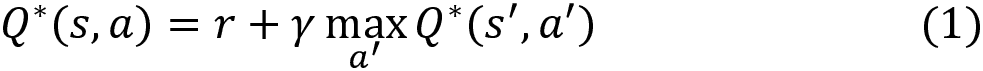

# 第九章：深度 Q 网络及其变体

在本章中，我们将从一种非常流行的**深度强化学习**（**DRL**）算法——**深度 Q 网络**（**DQN**）开始。理解 DQN 非常重要，因为许多最先进的 DRL 算法都是基于 DQN 的。DQN 算法首次由 Google 的 DeepMind 研究人员于 2013 年在论文《*通过深度强化学习玩 Atari 游戏*》中提出。他们描述了 DQN 架构，并解释了为什么它能以接近人类水平的准确度玩 Atari 游戏。本章首先将介绍深度 Q 网络到底是什么，以及它如何在强化学习中使用。接下来，我们将深入探讨 DQN 的算法。然后，我们将学习如何实现 DQN 来玩 Atari 游戏。

在了解了 DQN 后，我们将详细讲解几种 DQN 的变体，如双重 DQN、带优先经验重放的 DQN、对战 DQN 和深度递归 Q 网络。

本章将涵盖以下主题：

+   什么是 DQN？

+   DQN 算法

+   使用 DQN 玩 Atari 游戏

+   双重 DQN

+   带优先经验重放的 DQN

+   对战 DQN

+   深度递归 Q 网络

# 什么是 DQN？

强化学习的目标是找到最优策略，即给我们带来最大回报（本回合奖励总和）的策略。为了计算策略，首先我们需要计算 Q 函数。一旦我们得到了 Q 函数，就可以通过在每个状态中选择具有最大 Q 值的动作来提取策略。例如，假设我们有两个状态 `A` 和 `B`，并且我们的动作空间由两个动作组成；假设这两个动作是 *上* 和 *下*。因此，为了找出在状态 `A` 和 `B` 中应该执行哪个动作，我们首先计算所有状态-动作对的 Q 值，如 *表 9.1* 所示：


表 9.1：状态-动作对的 Q 值

一旦我们获得了所有状态-动作对的 Q 值，我们将在每个状态中选择具有最大 Q 值的动作。因此，我们在状态 `A` 中选择动作 *上*，在状态 `B` 中选择动作 *下*，因为它们具有最大 Q 值。我们在每次迭代中改进 Q 函数，一旦获得了最优 Q 函数，就可以从中提取最优策略。

现在，让我们重新审视我们的网格世界环境，如 *图 9.1* 所示：


图 9.1：网格世界环境

我们了解到，在网格世界环境中，智能体的目标是从状态 `A` 到达状态 `I`，并且不能经过阴影状态，在每个状态中，智能体必须执行四个动作之一——*上*、*下*、*左*、*右*。

要计算策略，首先我们计算所有状态-动作对的 Q 值。这里，状态的数量是 9（`A` 到 `I`），我们的动作空间中有 4 个动作，因此我们的 Q 表将包含 9 x 4 = 36 行，包含所有可能的状态-动作对的 Q 值。一旦我们获得 Q 值，我们就可以通过选择每个状态下具有最大 Q 值的动作来提取策略。但是，全面计算所有状态-动作对的 Q 值是否是一种好的方法呢？让我们更详细地探讨一下这个问题。

假设我们有一个环境，其中有 1,000 个状态，每个状态下有 50 个可能的动作。在这种情况下，我们的 Q 表将包含 1,000 x 50 = 50,000 行，包含所有可能的状态-动作对的 Q 值。在这种环境中，状态和动作数量非常大时，全面计算所有可能的状态-动作对的 Q 值将非常昂贵。

不采用这种方式计算 Q 值，我们能否使用任何函数逼近器来近似它们，例如神经网络？当然可以！我们可以用参数  来对 Q 函数进行参数化，并计算 Q 值，其中参数  只是我们神经网络的参数。因此，我们只需将环境的状态输入到神经网络中，它就会返回该状态下所有可能动作的 Q 值。一旦我们获得 Q 值，就可以选择 Q 值最大的动作作为最优动作。

例如，我们考虑我们的网格世界环境。如*图 9.2*所示，我们只需将状态`D`作为输入传递给网络，它就会返回状态`D`下所有动作的 Q 值，分别是*向上*、*向下*、*向左*和*向右*。然后，我们选择具有最大 Q 值的动作。由于动作*向右*的 Q 值最大，我们在状态`D`下选择动作*向右*：


图 9.2：深度 Q 网络

由于我们使用神经网络来近似 Q 值，因此神经网络被称为 Q 网络，如果我们使用深度神经网络来近似 Q 值，那么这个深度神经网络就被称为**深度 Q 网络**（**DQN**）。

我们可以用  来表示我们的 Q 函数，其中下标中的参数  表示我们的 Q 函数由  参数化，且  只是我们神经网络的参数。

我们将网络参数  初始化为随机值，并近似 Q 函数（Q 值），但是由于我们将  初始化为随机值，近似的 Q 函数将不是最优的。因此，我们通过多次迭代训练网络，找到最优的参数 。一旦找到最优的 ，我们就得到了最优的 Q 函数。然后我们可以从最优的 Q 函数中提取最优策略。

好的，但我们怎么训练我们的网络呢？训练数据和损失函数是什么？是分类任务还是回归任务？现在我们基本理解了 DQN 的工作原理，接下来的部分，我们将深入细节并解答所有这些问题。

## 理解 DQN

在本节中，我们将了解 DQN 是如何工作的。我们知道，使用 DQN 来近似给定输入状态下所有动作的 Q 值。Q 值只是一个连续的数字，因此我们本质上是使用 DQN 执行一个回归任务。

好的，那么训练数据呢？我们使用一个叫做重放缓冲区的缓冲区来收集智能体的经验，并根据这些经验来训练我们的网络。让我们详细探讨重放缓冲区。

### 重放缓冲区

我们知道，智能体通过执行某个动作 `a` 从状态 `s` 转移到下一个状态 ，然后获得奖励 `r`。我们可以将这个转换信息  保存到一个叫做重放缓冲区或经验回放的缓冲区中。重放缓冲区通常用  表示。这个转换信息基本上就是智能体的经验。我们将在多个回合中将智能体的经验存储在重放缓冲区中。使用重放缓冲区存储智能体经验的关键思想是，我们可以通过从缓冲区中采样经验（转换）来训练我们的 DQN。一个重放缓冲区如下所示：


图 9.3：重放缓冲区

以下步骤帮助我们理解如何将转换信息保存在重放缓冲区中 ：

1.  初始化重放缓冲区 。

1.  对于每一轮执行 *步骤 3*。

1.  对于回合中的每一步：

    1.  执行一次转换，即在状态 `s` 下执行一个动作 `a`，移动到下一个状态 ，并获得奖励 `r`。

    1.  将转换信息  存储到重放缓冲区  中。

如前面步骤所解释的，我们在多轮中收集智能体的转换信息，并将其保存在重放缓冲区中。为了更清楚地理解这一点，假设我们有以下两个回合/轨迹：

**回合 1**：


图 9.4：轨迹 1

**回合 2**：


图 9.5：轨迹 2

现在，这些信息将存储在重放缓冲区中，正如 *图 9.6* 所示：


图 9.6：重放缓冲区

如*图 9.6*所示，我们通过将过渡信息按顺序堆叠来存储它。我们通过从重放缓冲区中采样一个小批量的过渡来训练网络。等等！这里有一个小问题。由于我们将智能体的经验（过渡）一个接一个地按顺序堆叠，智能体的经验将高度相关。例如，如前图所示，过渡将与上下行的行相关。如果我们用这些相关的经验来训练网络，那么我们的神经网络将很容易出现过拟合。因此，为了应对这一问题，我们从重放缓冲区中随机采样一个小批量的过渡来训练网络。

请注意，重放缓冲区的大小是有限的，也就是说，重放缓冲区只会存储固定量的智能体经验。因此，当缓冲区满时，我们会用新经验替换旧经验。重放缓冲区通常实现为队列结构（先进先出）而不是列表。因此，如果缓冲区已满，当新经验进入时，我们会移除旧经验并将新经验添加到缓冲区中。

我们已经知道，我们通过从缓冲区随机采样一个小批量的经验来训练网络。那么，训练到底是如何进行的呢？我们的网络是如何利用这个小批量的样本来近似最优 Q 函数的呢？这正是我们在下一节中讨论的内容。

### 损失函数

我们已经了解到，在 DQN 中，我们的目标是预测 Q 值，这只是一个连续值。因此，在 DQN 中，我们基本上执行的是一个回归任务。我们通常使用**均方误差**（**MSE**）作为回归任务的损失函数。MSE 可以定义为目标值与预测值之间的平均平方差，如下所示：


其中`y`是目标值，！[](img/B15558_09_020.png)是预测值，`K`是训练样本的数量。

现在，让我们学习如何在 DQN 中使用 MSE 并训练网络。我们可以通过最小化目标 Q 值和预测 Q 值之间的 MSE 来训练网络。首先，我们如何获得目标 Q 值呢？我们的目标 Q 值应该是最优 Q 值，这样我们就可以通过最小化最优 Q 值和预测 Q 值之间的误差来训练网络。但是我们如何计算最优 Q 值呢？这就是贝尔曼方程帮助我们的地方。在*第三章*，*贝尔曼方程与动态规划*中，我们了解到最优 Q 值可以通过贝尔曼最优性方程来获得：


其中！[](img/B15558_09_022.png)表示在执行动作`a`时，我们在状态`s`下获得的即时奖励`r`，并移动到下一个状态！[](img/B15558_09_016.png)，因此我们可以将！[](img/B15558_09_024.png)表示为`r`：


在上述方程中，我们可以去除期望值。我们将通过从重放缓冲区随机采样 `K` 个转移，并取平均值来近似期望值；稍后我们将学习更多内容。

因此，根据 Bellman 最优方程，最优 Q 值就是奖励与下一个状态-动作对的折扣最大 Q 值之和，即：



因此，我们可以将损失定义为目标值（最优 Q 值）与预测值（DQN 预测的 Q 值）之间的差异，并将损失函数 `L` 表示为：


将方程 (1) 代入上述方程，我们可以写出：


我们知道我们使用由  参数化的网络来计算预测的 Q 值。那么我们如何计算目标值呢？也就是说，我们已经学到，目标值是奖励与下一个状态-动作对的折扣最大 Q 值之和。我们如何计算下一个状态-动作对的 Q 值呢？


类似于预测的 Q 值，我们可以使用相同的 DQN 参数化来计算目标中下一个状态-动作对的 Q 值！[](img/B15558_09_001.png)。因此，我们可以将损失函数重写为：


如图所示，目标值和预测的 Q 值都由  参数化。

我们不再仅仅计算目标 Q 值和预测 Q 值之间的差异来计算损失，而是使用均方误差（MSE）作为我们的损失函数。我们已经学到，我们将智能体的经验存储在一个叫做重放缓冲区的缓冲区中。因此，我们从重放缓冲区随机采样一个 `K` 数量的转移小批量！[](img/B15558_09_012.png)，并通过最小化 MSE 来训练网络，如下所示：


图 9.7：DQN 的损失函数

因此，我们的损失函数可以表示为：


为了简化符号表示，我们可以将目标值表示为 `y`，并将上述方程重写为：


其中 。我们已经学到，目标值就是奖励与下一个状态-动作对的折扣最大 Q 值之和。但是如果下一个状态  是终止状态呢？如果下一个状态  是终止状态，则我们无法计算 Q 值，因为我们在终止状态中不进行任何动作，因此在这种情况下，目标值将只是奖励，如下所示：


因此，我们的损失函数表示为：


我们通过最小化损失函数来训练我们的网络。我们可以通过寻找最优参数  来最小化损失函数。因此，我们使用梯度下降法来寻找最优参数 。我们计算损失函数的梯度 ，并按如下方式更新我们的网络参数 ：


### 目标网络

在上一节中，我们学到了通过最小化损失函数来训练网络，该损失函数是目标值与预测值之间的均方误差（MSE），如下所示：


然而，我们的损失函数存在一个小问题。我们已经了解到，目标值只是奖励和下一个状态-动作对的折扣最大 Q 值之和。我们通过相同的网络参数来计算下一个状态-动作对的 Q 值，这些参数由  表示，如下所示：


问题是，由于目标值和预测值都依赖于相同的参数 ，这将导致 MSE 的不稳定，并且网络学习效果较差。这还会导致训练过程中出现大量的发散。

让我们通过一个简单的例子来理解这一点。我们将使用任意数字来使其更容易理解。我们知道我们试图最小化目标值与预测值之间的差异。因此，在每次迭代中，我们计算损失的梯度并更新我们的网络参数 ，以使预测值与目标值相同。

假设在第一次迭代中，目标值为 13，预测值为 11。那么我们更新参数 ，使预测值与目标值 13 匹配。但是在下一次迭代中，目标值变为 15，而预测值变为 13，因为我们更新了网络参数 。因此，我们再次更新参数 ，使预测值与目标值 15 匹配。但是在下一次迭代中，目标值变为 17，而预测值变为 15，因为我们更新了网络参数 。

正如*表 9.2*所示，在每次迭代中，预测值都会尽量与目标值相同，而目标值则不断变化：


表 9.2：目标值和预测值

这是因为预测值和目标值都依赖于相同的参数 。如果我们更新 ，那么目标值和预测值都会发生变化。因此，预测值不断试图与目标值相同，但由于网络参数  的更新，目标值也在不断变化。

我们如何避免这种情况？我们能否冻结目标值一段时间，只计算预测值，使得我们的预测值与目标值匹配？可以！为此，我们引入了另一个神经网络，称为目标网络，用于计算下一个状态-动作对的 Q 值。目标网络的参数用  表示。因此，我们的主深度 Q 网络用于预测 Q 值，并通过梯度下降学习最佳参数 。目标网络会冻结一段时间，然后通过复制主深度 Q 网络参数  来更新目标网络参数 。冻结目标网络一段时间后，再通过主网络参数  更新目标网络参数 ，有助于稳定训练过程。

所以，现在我们的损失函数可以重写为：


因此，下一个状态-动作对的 Q 值由目标网络通过参数  计算，预测的 Q 值由我们的主网络通过参数  计算：


为了简化符号，我们可以用 `y` 来表示我们的目标值，并将前面的方程重写为：


其中 。

我们已经学习了与 DQN 相关的几个概念，包括经验回放、损失函数和目标网络。在下一节中，我们将把这些概念结合起来，看看 DQN 是如何工作的。

## 将所有内容放在一起

首先，我们使用随机值初始化主网络参数 。我们了解到目标网络参数只是主网络的副本。因此，我们通过复制主网络参数  来初始化目标网络参数 。我们还初始化了回放缓冲区 。

现在，在每一集的每一步中，我们将环境的状态输入到网络中，它输出该状态下所有可能动作的 Q 值。然后，我们选择具有最大 Q 值的动作：


如果我们只选择具有最高 Q 值的动作，那么我们将不会探索任何新的动作。因此，为了避免这种情况，我们使用 epsilon-greedy 策略选择动作。在 epsilon-greedy 策略下，我们以概率 epsilon 选择一个随机动作，以概率 1-epsilon 选择具有最大 Q 值的最佳动作。

请注意，由于我们用随机值初始化了网络参数 ，因此通过选择最大 Q 值来选择的动作并不是最优动作。但这没关系，我们只需执行选定的动作，进入下一个状态并获得奖励。如果动作是好的，我们将获得正奖励；如果动作不好，奖励则为负。我们将所有这些过渡信息  存储在重放缓冲区  中。

接下来，我们随机从重放缓冲区中采样一个`K`的过渡小批量并计算损失。我们已经了解到，损失函数是这样计算的：


其中 `yᵢ` 是目标值，即 。

在初期迭代中，由于我们的网络参数 只是随机值，所以损失会非常高。为了最小化损失，我们计算损失的梯度并按以下方式更新网络参数 ：


我们并不是在每一个时间步骤都更新目标网络参数 。我们将目标网络参数 冻结若干个时间步骤，然后将主网络参数 复制到目标网络参数 。

我们会继续重复前面的步骤，进行若干回合，以逼近最优 Q 值。一旦我们得到了最优 Q 值，就可以从中提取最优策略。为了让我们更详细地理解，DQN 算法将在下一节给出。

### DQN 算法

DQN 算法的步骤如下：

1.  使用随机值初始化主网络参数 

1.  通过复制主网络参数  初始化目标网络参数 

1.  初始化重放缓冲区 

1.  对于`N`个回合，执行第 5 步

1.  对于回合中的每一步，即对于 `t` = 0, . . ., `T`-1：

    1.  观察状态 `s` 并使用ε-贪婪策略选择一个动作，即以概率 epsilon 选择随机动作 `a`，以概率 1-epsilon 选择动作 

    1.  执行选定的动作并进入下一个状态 ，获得奖励 `r`

    1.  将过渡信息存储在重放缓冲区中 

    1.  随机从重放缓冲区中采样一个`K`的过渡小批量 

    1.  计算目标值，即 

    1.  计算损失，

    1.  计算损失的梯度并使用梯度下降法更新主网络参数 ：

    1.  冻结目标网络参数  若干时间步，然后通过复制主网络参数  来更新目标网络。

现在我们已经理解了 DQN 的工作原理，在接下来的部分，我们将学习如何实现它。

# 使用 DQN 玩 Atari 游戏

Atari 2600 是一款由游戏公司 Atari 推出的流行视频游戏主机。Atari 游戏主机提供了多个受欢迎的游戏，如 Pong、Space Invaders、Ms. Pac-Man、Breakout、Centipede 等等。在本节中，我们将学习如何构建一个 DQN 来玩 Atari 游戏。首先，让我们探讨一下用于玩 Atari 游戏的 DQN 架构。

## DQN 的架构

在 Atari 环境中，游戏画面的图像就是环境的状态。因此，我们只需将游戏画面的图像作为输入传递给 DQN，它会返回该状态下所有动作的 Q 值。由于我们处理的是图像，因此，我们可以使用**卷积神经网络（CNN）**来近似 Q 值，因为它在处理图像时非常有效。

因此，现在我们的 DQN 是一个 CNN。我们将游戏画面（游戏状态）的图像作为输入传递给 CNN，CNN 输出该状态下所有动作的 Q 值。

如*图 9.8*所示，给定游戏画面的图像，卷积层从图像中提取特征并生成特征图。接下来，我们将特征图展平，并将展平后的特征图作为输入传递给前馈网络。前馈网络将这个展平后的特征图作为输入，并返回该状态下所有动作的 Q 值：


图 9.8：DQN 的架构

注意，我们没有执行池化操作。池化操作通常在进行目标检测、图像分类等任务时使用，在这些任务中，我们不考虑图像中物体的位置，只需要知道目标物体是否存在于图像中。例如，如果我们想要识别图像中是否有一只狗，我们只看图像中是否有狗，而不检查狗的位置。因此，在这种情况下，池化操作用来识别图像中是否有狗，而不管狗的位置。

但在我们的设置中，应该避免执行池化操作，因为要理解当前的游戏状态，位置非常重要。例如，在 Pong 游戏中，我们不仅仅想知道游戏画面上是否有球。我们希望知道球的位置，以便做出更好的操作。因此，我们没有在 DQN 架构中包含池化操作。

现在我们已经了解了用于玩 Atari 游戏的 DQN 架构，接下来的部分我们将开始实现它。

## 动手实践 DQN

让我们实现一个 DQN 来玩 Ms Pacman 游戏。首先，导入必要的库：

```py
import random
import gym
import numpy as np
from collections import deque
from tensorflow.keras.models import Sequential
from tensorflow.keras.layers import Dense, Activation, Flatten, Conv2D, MaxPooling2D
from tensorflow.keras.optimizers import Adam 
```

现在，让我们使用 Gym 创建 Ms Pacman 游戏环境：

```py
env = gym.make("MsPacman-v0") 
```

设置状态大小：

```py
state_size = (88, 80, 1) 
```

获取动作数量：

```py
action_size = env.action_space.n 
```

### 预处理游戏屏幕

我们了解到，我们将游戏状态（游戏屏幕的图像）作为输入传入 DQN，它是一个 CNN，输出该状态下所有动作的 Q 值。然而，直接输入原始的游戏屏幕图像效率不高，因为原始游戏屏幕的大小为 210 x 160 x 3，这将非常耗费计算资源。

为了避免这种情况，我们对游戏屏幕进行预处理，然后将预处理后的游戏屏幕输入到 DQN。首先，我们裁剪并调整游戏屏幕图像的大小，将图像转换为灰度图，进行归一化处理，然后将图像调整为 88 x 80 x 1。接着，我们将该预处理后的游戏屏幕图像作为输入，传入 CNN，它将返回 Q 值。

现在，让我们定义一个名为`preprocess_state`的函数，它接收游戏状态（游戏屏幕图像）作为输入，并返回预处理后的游戏状态：

```py
color = np.array([210, 164, 74]).mean()
def preprocess_state(state): 
```

裁剪并调整图像大小：

```py
 image = state[1:176:2, ::2] 
```

将图像转换为灰度图：

```py
 image = image.mean(axis=2) 
```

提高图像对比度：

```py
 image[image==color] = 0 
```

对图像进行归一化处理：

```py
 image = (image - 128) / 128 - 1 
```

重新调整图像并返回：

```py
 image = np.expand_dims(image.reshape(88, 80, 1), axis=0)
    return image 
```

### 定义 DQN 类

让我们定义一个名为 DQN 的类，在这里我们将实现 DQN 算法。为了更清晰地理解，我们逐行查看代码。你也可以从本书的 GitHub 仓库中获取完整代码：

```py
class DQN: 
```

#### 定义 init 方法

首先，让我们定义`init`方法

```py
 def __init__(self, state_size, action_size): 
```

定义状态大小：

```py
 self.state_size = state_size 
```

定义动作大小：

```py
 self.action_size = action_size 
```

定义重放缓冲区：

```py
 self.replay_buffer = deque(maxlen=5000) 
```

定义折扣因子：

```py
 self.gamma = 0.9 
```

定义ε值：

```py
 self.epsilon = 0.8 
```

定义我们希望更新目标网络的更新率：

```py
 self.update_rate = 1000 
```

定义主网络：

```py
 self.main_network = self.build_network() 
```

定义目标网络：

```py
 self.target_network = self.build_network() 
```

将主网络的权重复制到目标网络：

```py
 self.target_network.set_weights(self.main_network.get_weights()) 
```

#### 构建 DQN

现在，让我们构建 DQN。我们已经了解到，玩 Atari 游戏时，使用 CNN 作为 DQN，将游戏屏幕的图像作为输入并返回 Q 值。我们定义了一个包含三层卷积层的 DQN。卷积层从图像中提取特征并输出特征图，然后我们将卷积层获得的特征图展平，并将展平后的特征图输入到前馈网络（即全连接层），该网络返回 Q 值：

```py
 def build_network(self): 
```

定义第一个卷积层：

```py
 model = Sequential()
        model.add(Conv2D(32, (8, 8), strides=4, padding='same', input_shape=self.state_size))
        model.add(Activation('relu')) 
```

定义第二个卷积层：

```py
 model.add(Conv2D(64, (4, 4), strides=2, padding='same'))
        model.add(Activation('relu')) 
```

定义第三个卷积层：

```py
 model.add(Conv2D(64, (3, 3), strides=1, padding='same'))
        model.add(Activation('relu')) 
```

展平通过第三个卷积层获得的特征图：

```py
 model.add(Flatten()) 
```

将展平的特征图输入到全连接层：

```py
 model.add(Dense(512, activation='relu'))
        model.add(Dense(self.action_size, activation='linear')) 
```

使用均方误差（MSE）编译模型：

```py
 model.compile(loss='mse', optimizer=Adam()) 
```

返回模型：

```py
 return model 
```

#### 存储转换

我们已经了解到，通过从重放缓冲区随机采样一个小批量的转换数据来训练 DQN。因此，我们定义一个名为`store_transition`的函数，用于将转换信息存储在重放缓冲区：

```py
 def store_transistion(self, state, action,
                          reward, next_state, done):
        self.replay_buffer.append((state, action,
                                   reward, next_state, done)) 
```

#### 定义ε-贪婪策略

我们了解到，在 DQN 中，为了平衡探索与利用之间的权衡，我们使用 epsilon-greedy 策略来选择动作。所以，现在我们定义一个名为 `epsilon_greedy` 的函数，通过 epsilon-greedy 策略来选择动作：

```py
 def epsilon_greedy(self, state):
        if random.uniform(0,1) < self.epsilon:
            return np.random.randint(self.action_size)
        Q_values = self.main_network.predict(state)
        return np.argmax(Q_values[0]) 
```

#### 定义训练过程

现在，我们定义一个名为 `train` 的函数来进行网络训练：

```py
 def train(self, batch_size): 
```

从回放缓冲区中采样一个小批量转移：

```py
 minibatch = random.sample(self.replay_buffer, batch_size) 
```

使用目标网络计算目标值：

```py
 for state, action, reward, next_state, done in minibatch:
            if not done:
                target_Q = (reward + self.gamma * np.amax(
                    self.target_network.predict(next_state)))
            else:
                target_Q = reward 
```

使用主网络计算预测值，并将预测值存储在 `Q_values` 中：

```py
 Q_values = self.main_network.predict(state) 
```

更新目标值：

```py
 Q_values[0][action] = target_Q 
```

训练主网络：

```py
 self.main_network.fit(state, Q_values, epochs=1, 
                                  verbose=0) 
```

#### 更新目标网络

现在，我们定义一个名为 `update_target_network` 的函数，通过从主网络复制来更新目标网络的权重：

```py
 def update_target_network(self):
        self.target_network.set_weights(self.main_network.get_weights()) 
```

### 训练 DQN

现在，让我们开始训练网络。首先，设置我们希望训练网络的回合数：

```py
num_episodes = 500 
```

定义时间步数：

```py
num_timesteps = 20000 
```

定义批次大小：

```py
batch_size = 8 
```

设置我们希望考虑的过去游戏画面数量：

```py
num_screens = 4 
```

实例化 DQN 类：

```py
dqn = DQN(state_size, action_size) 
```

将 done 设置为 `False`：

```py
done = False 
```

初始化 `time_step`：

```py
time_step = 0 
```

对于每个回合：

```py
for i in range(num_episodes): 
```

将 `Return` 设置为 `0`：

```py
 Return = 0 
```

预处理游戏画面：

```py
 state = preprocess_state(env.reset()) 
```

每个回合的每一步：

```py
 for t in range(num_timesteps): 
```

渲染环境：

```py
 env.render() 
```

更新时间步：

```py
 time_step += 1 
```

更新目标网络：

```py
 if time_step % dqn.update_rate == 0:
            dqn.update_target_network() 
```

选择动作：

```py
 action = dqn.epsilon_greedy(state) 
```

执行动作：

```py
 next_state, reward, done, _ = env.step(action) 
```

预处理下一个状态：

```py
 next_state = preprocess_state(next_state) 
```

存储转移信息：

```py
 dqn.store_transistion(state, action, reward, next_state, done) 
```

将当前状态更新为下一个状态：

```py
 state = next_state 
```

更新返回值：

```py
 Return += reward 
```

如果回合结束，则打印返回值：

```py
 if done:
            print('Episode: ',i, ',' 'Return', Return)
            break 
```

如果回放缓冲区中的转移数量大于批次大小，则训练网络：

```py
 if len(dqn.replay_buffer) > batch_size:
            dqn.train(batch_size) 
```

通过渲染环境，我们还可以观察到智能体如何通过一系列回合来学习玩游戏：


图 9.9：DQN 智能体学习玩游戏

现在，我们已经了解了 DQN 如何工作，以及如何构建一个 DQN 来玩 Atari 游戏，在下一节中，我们将学习一种 DQN 的有趣变体，称为双重 DQN。

# 双重 DQN

我们已经了解到，在 DQN 中，目标值是这样计算的：


DQN 的一个问题是它往往会高估目标中下一个状态-动作对的 Q 值：


这种高估是由于最大值操作符的存在。让我们通过一个例子来看看这种高估是如何发生的。假设我们处于状态 ，并且我们有三个动作 `a[1]`、`a[2]` 和 `a[3]`。假设 `a[3]` 是状态  下的最优动作。当我们估计状态  中所有动作的 Q 值时，估计的 Q 值会有一些噪声，并与实际值不同。比如，由于噪声，动作 `a[2]` 的 Q 值会比最优动作 `a[3]` 的 Q 值高。

我们知道目标值是这样计算的：


现在，如果我们选择最大值对应的动作作为最佳动作，那么我们最终会选择动作 `a[2]` 而不是最优动作 `a[3]`，如图所示：


那么，我们如何消除这种过高的估计呢？我们可以通过仅修改目标值计算来消除这种过高估计，如下所示：


正如我们可以观察到的，现在我们在目标值计算中有两个 Q 函数。一个由主网络参数  参数化的 Q 函数用于选择动作，另一个由目标网络参数  参数化的 Q 函数用于计算 Q 值。

让我们通过将前面的公式分解为两个步骤来理解它：

+   **动作选择**：首先，我们使用由主网络参数  参数化的主网络计算所有下一状态-动作对的 Q 值，然后选择具有最大 Q 值的动作 ：

+   **Q 值计算**：一旦我们选择了动作 ，我们就使用由  参数化的目标网络计算该动作的 Q 值 ：

让我们用一个例子来理解。假设状态  是 `E`，那么我们可以写成：


首先，我们使用由主网络参数  参数化的主网络计算状态 `E` 中所有动作的 Q 值，然后选择具有最大 Q 值的动作。假设具有最大 Q 值的动作是 *右*：


现在，我们可以使用目标网络参数  和主网络选择的动作（即 *右*）来计算 Q 值。因此，我们可以写成：


还不清楚吗？我们在 DQN 和双 DQN 中计算目标值的区别如下所示：


图 9.10：DQN 和双 DQN 之间的区别

因此，我们了解到，在双 DQN 中，我们使用两个 Q 函数计算目标值。一个由主网络参数  参数化的 Q 函数用于选择具有最大 Q 值的动作，另一个由目标网络参数  参数化的 Q 函数则使用主网络选择的动作来计算 Q 值：


除了目标值计算外，双 DQN 的工作方式与 DQN 完全相同。为了更清楚地说明，双 DQN 的算法将在下一节给出。

## 双 DQN 算法

双 DQN 的算法如下所示。正如我们所看到的，除了目标值计算（加粗步骤）外，其他步骤与 DQN 完全相同：

1.  初始化主网络参数  为随机值

1.  通过复制主网络参数 ，初始化目标网络参数 

1.  初始化重放缓冲区 

1.  对于`N`个回合，重复*步骤 5*

1.  对于回合中的每一步，即对于`t` = 0, . . . , `T`-1：

    1.  观察状态`s`并使用 epsilon-贪婪策略选择一个动作，即以 epsilon 的概率选择一个随机动作`a`，以 1-epsilon 的概率选择该动作：

    1.  执行动作，进入下一个状态 ，并获得奖励`r`

    1.  将过渡信息存储在重放缓冲区中 

    1.  从重放缓冲区随机抽取一个包含`K`个过渡的小批量 

    1.  **计算目标值，即** 

    1.  计算损失， 

    1.  计算损失的梯度，并使用梯度下降法更新主网络参数 ：

    1.  冻结目标网络参数 几次时间步，然后通过简单地复制主网络参数 来更新它

现在我们已经了解了双重 DQN 的工作原理，在下一节中，我们将学习一种名为优先经验重放的 DQN 的有趣变体。

# 使用优先经验重放的 DQN

我们了解到，在 DQN 中，我们从重放缓冲区随机抽取一个包含`K`个过渡的小批量并训练网络。那么，是否可以为重放缓冲区中的每个过渡分配一些优先级，并选择那些具有高优先级的过渡来进行学习呢？

是的，但是首先，为什么我们需要为过渡分配优先级？我们如何决定哪些过渡应该比其他过渡具有更高的优先级呢？让我们更详细地探讨这个问题。

TD 误差 是目标值与预测值之间的差异，如下所示：


具有较高 TD 误差的过渡意味着该过渡不正确，因此我们需要更多地学习该过渡以最小化误差。具有较低 TD 误差的过渡意味着该过渡已经很好。我们总是可以从错误中学到更多，而不仅仅是专注于我们已经擅长的内容，对吧？同样，我们可以从具有较高 TD 误差的过渡中学到更多，而不是从那些具有较低 TD 误差的过渡中。因此，我们可以给具有较高 TD 误差的过渡分配更高的优先级，而给具有较低 TD 误差的过渡分配较低的优先级。

我们知道，过渡信息由  组成，并且在这些信息的基础上，我们还添加了优先级`p`，并将带有优先级的过渡存储在我们的重放缓冲区中，格式为 。下图显示了包含过渡及其优先级的重放缓冲区：


图 9.11：优先级重放缓冲区

在下一节中，我们将学习如何使用基于 TD 误差的两种不同优先级方法对过渡进行优先排序。

## 优先级排序类型

我们可以使用以下两种方法对过渡进行优先级排序：

+   成比例优先级排序

+   基于排名的优先级排序

### 成比例优先级排序

我们了解到，可以使用 TD 误差来对过渡进行优先级排序，因此过渡`i`的优先级`p`将仅为其 TD 误差：


请注意，我们取 TD 误差的绝对值作为优先级，以保持优先级为正。那么，TD 误差为零的过渡如何处理呢？假设我们有一个过渡`i`，其 TD 误差为 0，那么过渡`i`的优先级将为 0：


但是，将过渡的优先级设置为零是不理想的，因为如果将某个过渡的优先级设置为零，那么该过渡将完全不参与训练。为了避免这个问题，我们将向 TD 误差中添加一个小值，称为 epsilon。因此，即使 TD 误差为零，由于 epsilon 的存在，我们仍然会有一个小的优先级。更准确地说，向 TD 误差中添加 epsilon 可以保证没有过渡的优先级为零。因此，我们的优先级可以修改为：


我们可以将优先级转换为概率，以便优先级范围从 0 到 1。我们可以通过如下方式将优先级转换为概率：


上述公式计算了过渡`i`的概率`P`。

我们是否也可以控制优先级排序的程度呢？也就是说，除了仅采样优先级较高的过渡外，我们还能否采样随机的过渡？可以！为了做到这一点，我们引入了一个新的参数，称为 ，并将我们的公式改写为如下。当  的值较高时，比如为 1，我们就只采样优先级高的过渡；而当  的值较低时，比如为 0，我们就采样随机的过渡：


因此，我们已经学习了如何使用成比例优先级排序方法来分配过渡的优先级。在下一节中，我们将学习另一种优先级排序方法，称为基于排名的优先级排序。

### 基于排名的优先级排序

基于排名的优先级排序是最简单的优先级排序类型。在这种方法中，我们根据过渡的排名来分配优先级。那么，什么是过渡的排名呢？过渡`i`的排名可以定义为在回放缓冲区中，按 TD 误差从高到低排序的过渡位置。

因此，我们可以使用排名来定义过渡`i`的优先级，如下所示：


正如我们在上一节中所学，我们将优先级转换为概率：


类似于我们在上一节中学到的内容，我们可以添加一个参数α来控制优先级排序的程度，并将最终公式表示为：


## 修正偏差

我们已经学习了如何通过两种方法来优先考虑转移——比例优先级和基于排名的优先级。但这些方法的问题在于，我们会对具有高优先级的样本产生很大的偏差。也就是说，当我们更重视具有高 TD 误差的样本时，这实际上意味着我们只从具有高 TD 误差的样本子集进行学习。

好的，那这个问题是什么呢？它会导致过拟合问题，我们的智能体会对那些具有高 TD 误差的转移产生强烈的偏向。为了应对这个问题，我们使用了重要性权重`w`。重要性权重帮助我们减少多次发生的转移的权重。转移`i`的权重`w`可以表示为：


在前面的表达式中，`N`表示我们的回放缓冲区的长度，`P`(`i`)表示转移`i`的概率。那么，那个参数！[](img/B15558_09_151.png)是什么呢？它控制着重要性权重。我们从较小的值开始！[](img/B15558_09_152.png)，从 0.4 开始，并将其逐步调整到 1。

因此，在这一部分中，我们学习了如何通过优先经验回放在 DQN 中优先考虑转移。在下一部分中，我们将学习 DQN 的另一个有趣变种——对战 DQN。

# 对战 DQN

在继续之前，让我们学习一下强化学习中最重要的函数之一——优势函数。优势函数被定义为 Q 函数和值函数之间的差异，其表达式为：


好的，但是优势函数有什么用呢？它意味着什么？首先，我们回顾一下 Q 函数和值函数：

+   **Q 函数**：Q 函数给出了智能体从状态`s`开始，执行动作`a`并遵循策略后，所能获得的期望回报！[](img/B15558_03_008.png)。

+   **值函数**：值函数给出的是一个智能体从状态`s`开始并遵循策略后，所能获得的期望回报！[](img/B15558_04_032.png)。

现在，如果我们直观地思考，Q 函数和值函数之间有什么区别？Q 函数给出了状态-动作对的价值，而值函数则给出了一个状态的价值，不考虑动作。现在，Q 函数和值函数之间的区别告诉我们，在状态`s`下，动作`a`相比于平均动作有多好。

因此，优势函数告诉我们，在状态`s`下，动作`a`相比于平均动作有多好。现在我们已经理解了什么是优势函数，接下来让我们看看为什么以及如何在 DQN 中使用它。

## 理解对战 DQN

我们已经了解到，在 DQN 中，我们将状态作为输入，网络计算该状态下所有动作的 Q 值。我们能否不以这种方式计算 Q 值，而是通过优势函数来计算 Q 值呢？我们已经了解到，优势函数是通过以下方式给出的：


我们可以将前面的方程式改写为：


从前面的方程式中我们可以看出，我们只需要将价值函数和优势函数加在一起，就可以计算 Q 值。等等！为什么我们要这么做？直接计算 Q 值不行吗？

假设我们处于某个状态`s`，并且在这个状态下有 20 个可能的动作可以执行。计算这 20 个动作在状态`s`下的 Q 值是没有用的，因为大多数动作不会对状态产生任何影响，而且大多数动作的 Q 值也非常相似。这是什么意思呢？让我们通过图 *9.12* 中展示的网格世界环境来理解这一点：


图 9.12：网格世界环境

正如我们所看到的，智能体处于状态`A`。在这种情况下，计算在状态`A`下动作*向上*的 Q 值有什么用呢？在状态`A`中，向*上*移动不会产生任何效果，而且也不会让智能体到达任何地方。类似地，假设我们的动作空间非常大，比如说有 100 个动作。在这种情况下，大多数动作在给定的状态下不会产生任何效果。而且，当动作空间很大时，大多数动作的 Q 值会非常相似。

现在，让我们讨论状态的价值。请注意，并不是所有状态对智能体来说都是重要的。可能会有一个状态，无论我们执行什么动作，总是给出一个很差的奖励。在这种情况下，如果我们知道该状态总是会给出一个很差的奖励，那么计算该状态下所有可能动作的 Q 值是没有意义的。

因此，为了解决这个问题，我们可以将 Q 函数计算为价值函数和优势函数的和。也就是说，通过价值函数，我们可以理解一个状态是否有价值，而无需计算该状态下所有动作的值。通过优势函数，我们可以理解一个动作是否真的很好，或者它只是给我们带来了与其他所有动作相同的价值。

现在我们已经对对抗 DQN 有了基本的了解，让我们在下一节中深入探讨对抗 DQN 的架构。

## 对抗 DQN 的架构

我们已经了解到，在对抗 DQN 中，Q 值可以计算为：


我们如何设计神经网络以这种方式输出 Q 值呢？我们可以将网络的最终层分成两个流。第一个流计算值函数，第二个流计算优势函数。给定任何状态作为输入，值流输出一个状态的值，而优势流输出给定状态下所有可能动作的优势。例如，正如*图 9.13*所示，我们将游戏状态（游戏画面）作为输入传入网络。值流计算状态的值，而优势流计算该状态下所有动作的优势值：


图 9.13：对抗 DQN 的架构

我们了解到，我们通过将状态值和优势值相加来计算 Q 值，因此我们将值流和优势流通过另一个层——聚合层结合，并按照*图 9.14*所示计算 Q 值。这样，值流计算状态值，优势流计算优势值，聚合层将这两个流相加并计算 Q 值：


图 9.14：包含聚合层的对抗 DQN 架构

但这里有一个小问题。仅仅在聚合层中将状态值和优势值相加并计算 Q 值会导致可识别性问题。

所以，为了应对这个问题，我们让优势函数对于所选动作的优势为零。我们可以通过减去平均优势值来实现这一点，即所有动作在动作空间中的平均优势值，如下所示：


其中  表示动作空间的长度。

因此，我们可以写出最终的计算 Q 值的方程式，带有参数如下：


在上式中， 是卷积网络的参数， 是值流的参数， 是优势流的参数。计算出 Q 值后，我们可以选择动作：


因此，对抗 DQN 和 DQN 之间唯一的区别是，在对抗 DQN 中，我们不是直接计算 Q 值，而是通过将状态值和优势值结合来计算 Q 值。

在下一节中，我们将探索 DQN 的另一个变种，称为深度递归 Q 网络。

# 深度递归 Q 网络

**深度递归 Q 网络**（**DRQN**）与 DQN 完全相同，只是增加了递归层。那么，DQN 中递归层的作用是什么呢？为了回答这个问题，我们首先需要了解一个叫做**部分可观察马尔可夫决策过程**（**POMDP**）的问题。

当我们对环境的可用信息有限时，这个环境被称为 POMDP。在之前的章节中，我们看到的是一个完全可观察的 MDP，我们知道所有可能的动作和状态——虽然我们可能不知道转移和奖励的概率，但我们对环境有完全的了解。例如，在冰冻湖环境中，我们对所有状态和动作都有完整的知识。

但大多数现实世界的环境只能部分观察到；我们不能看到所有状态。例如，假设一个智能体在现实世界中学习走路。在这种情况下，智能体对环境（即真实世界）没有完全的了解；它无法获得超出视野的信息。

因此，在 POMDP 中，状态只提供部分信息，但将过去状态的信息保存在记忆中将帮助智能体更好地理解环境的性质，并找到最优策略。因此，在 POMDP 中，我们需要保留过去状态的信息，以便采取最优行动。

那么，我们能否利用循环神经网络来理解并保留过去状态的信息，只要它是需要的呢？是的，**长短期记忆循环神经网络**（**LSTM RNN**）对于保留、遗忘和根据需要更新信息非常有用。因此，我们可以在 DQN 中使用 LSTM 层来保留过去状态的信息，只要它是需要的。保留过去状态的信息在 POMDP 问题中非常有帮助。

现在我们基本了解了为什么需要 DRQN 以及它如何解决 POMDP 问题，在下一节中，我们将深入研究 DRQN 的架构。

## DRQN 的架构

*图 9.15* 展示了 DRQN 的架构。正如我们所见，它与 DQN 架构类似，唯一的区别是它有一个 LSTM 层：


图 9.15：DRQN 的架构

我们将游戏屏幕作为输入传递给卷积层。卷积层对图像进行卷积并生成特征图。生成的特征图随后传递给 LSTM 层。LSTM 层具有记忆功能，可以保存信息。因此，它会保留关于重要过去游戏状态的信息，并根据需要在时间步长上更新其记忆。然后，我们将 LSTM 层的隐藏状态输入到全连接层，后者输出 Q 值。

*图 9.16* 帮助我们理解 DRQN 是如何工作的。假设我们需要计算状态 `sₜ` 和动作 `aₜ` 的 Q 值。与 DQN 不同，我们不仅仅是直接计算 Q(`sₜ`, `aₜ`)。如我们所见，除了当前状态 `sₜ`，我们还使用隐藏状态 `hₜ` 来计算 Q 值。之所以使用隐藏状态，是因为它保存了过去游戏状态的信息。

由于我们使用了 LSTM 单元，隐藏状态 `hₜ` 将包含有关过去游戏状态的记忆信息，只要它是需要的：


图 9.16：DRQN 架构

除了这一变化外，DRQN 的工作方式与 DQN 相同。等等，那回放缓冲区呢？在 DQN 中，我们了解到我们将转移信息存储在回放缓冲区中，并通过从回放缓冲区随机采样一小批次经验来训练网络。我们还了解到，转移信息会在回放缓冲区中按顺序排列，为了避免相关经验的影响，我们随机从回放缓冲区中采样一小批次经验来训练网络。

但在 DRQN 的情况下，我们需要序列信息，以便我们的网络能够保留过去游戏状态的信息。因此，我们需要序列信息，同时又不希望通过训练相关经验而使网络过拟合。我们该如何实现这一点？

为了实现这一点，在 DRQN 中，我们随机采样一小批次的 episode，而不是随机采样一小批次的转移。也就是说，我们知道在一个 episode 中，会有按顺序排列的转移信息，因此我们采样一个随机的 episode 小批次，在每个 episode 中，转移信息会按顺序排列。通过这种方式，我们既能实现随机化，又能保留按顺序排列的转移信息。这被称为 **引导式序列更新**。

在随机采样 episode 小批次之后，我们可以像训练 DQN 网络一样，通过最小化 MSE 损失来训练 DRQN。如果想深入了解，可以参考 *进一步阅读* 部分中提供的 DRQN 论文。

# 总结

我们从学习什么是深度 Q 网络以及它们如何用于近似 Q 值开始。本章中，我们了解到，在 DQN 中，我们使用一个叫做回放缓冲区的缓存来存储智能体的经验。然后，我们从回放缓冲区随机采样一小批次经验，并通过最小化 MSE 来训练网络。接下来，我们更详细地了解了 DQN 的算法，随后学习了如何实现 DQN 来玩 Atari 游戏。

随后，我们了解到 DQN 因为使用了 max 操作符而高估了目标值。因此，我们使用了双重 DQN，在目标值计算中使用了两个 Q 函数。一个 Q 函数由主网络参数  参数化，用于选择动作，另一个 Q 函数由目标网络参数  参数化，用于 Q 值计算。

接下来，我们学习了带有优先经验回放的 DQN，其中转移根据 TD 错误进行优先级排序。我们探讨了两种不同的优先级排序方法，分别是按比例优先级排序和基于排名的优先级排序。

接下来，我们学习了 DQN 的另一个有趣变体——对抗 DQN。在对抗 DQN 中，我们不是直接计算 Q 值，而是使用两个流——值流和优势流——来计算它们。

在本章的最后，我们了解了 DRQN 以及它们如何解决部分可观测马尔可夫决策过程的问题。

在下一章中，我们将学习另一个流行的算法——策略梯度。

# 问题

让我们通过回答以下问题来评估我们对 DQN 及其变体的理解：

1.  为什么我们需要 DQN？

1.  什么是重放缓冲区？

1.  为什么我们需要目标网络？

1.  双重 DQN 与 DQN 有什么不同？

1.  为什么我们必须优先考虑转换？

1.  什么是优势函数？

1.  为什么在 DRQN 中需要 LSTM 层？

# 进一步阅读

更多信息，请参考以下论文：

+   **通过深度强化学习玩 Atari**，*Volodymyr Mnih 等人*，[`arxiv.org/pdf/1312.5602.pdf`](https://arxiv.org/pdf/1312.5602.pdf)

+   **使用双重 Q 学习的深度强化学习**，*Hado van Hasselt, Arthur Guez, David Silver*，[`arxiv.org/pdf/1509.06461.pdf`](https://arxiv.org/pdf/1509.06461.pdf)

+   **优先经验重放**，*Tom Schaul, John Quan, Ioannis Antonoglou 和 David Silver*，[`arxiv.org/pdf/1511.05952.pdf`](https://arxiv.org/pdf/1511.05952.pdf)

+   **深度强化学习中的对抗网络架构**，*Ziyu Wang, Tom Schaul, Matteo Hessel, Hado van Hasselt, Marc Lanctot, Nando de Freitas*，[`arxiv.org/pdf/1511.06581.pdf`](https://arxiv.org/pdf/1511.06581.pdf)

+   **深度递归 Q 学习用于部分可观测的马尔可夫决策过程**，*Matthew Hausknecht 和 Peter Stone*，[`arxiv.org/pdf/1507.06527.pdf`](https://arxiv.org/pdf/1507.06527.pdf)
