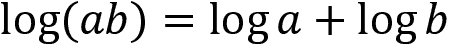
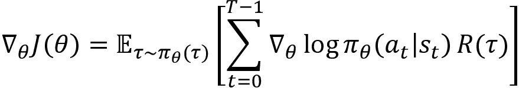
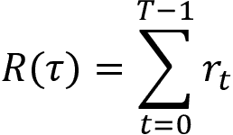
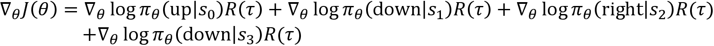
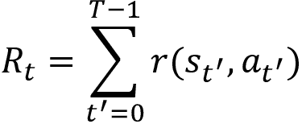

# 第十章：策略梯度方法

在前几章中，我们学习了如何使用基于值的强化学习算法来计算最优策略。也就是说，我们学到的是，使用基于值的方法时，我们迭代地计算最优 Q 函数，并从最优 Q 函数中提取最优策略。在本章中，我们将学习基于策略的方法，在这种方法中，我们可以在不计算最优 Q 函数的情况下直接计算最优策略。

我们将通过分析从 Q 函数计算策略的缺点来开始本章的学习，然后我们将学习基于策略的方法如何直接学习最优策略，而无需计算 Q 函数。接下来，我们将研究一种最流行的基于策略的方法——策略梯度。我们将首先概览策略梯度算法，然后详细学习它。

在接下来的内容中，我们还将学习如何一步步推导策略梯度，并更加详细地研究策略梯度方法的算法。章节最后，我们将学习策略梯度方法中的方差减少技术。

本章我们将学习以下内容：

+   为什么选择基于策略的方法？

+   策略梯度直觉

+   推导策略梯度

+   策略梯度算法

+   使用奖励到达的策略梯度

+   带基准的策略梯度

+   带基准的策略梯度算法

# 为什么选择基于策略的方法？

强化学习的目标是找到最优策略，也就是提供最大回报的策略。到目前为止，我们已经学习了几种计算最优策略的不同算法，这些算法都是基于值的方法。等等，什么是基于值的方法？让我们回顾一下基于值的方法以及它们的问题，然后我们将学习基于策略的方法。回顾一下总是有益的，不是吗？

使用基于值的方法时，我们从最优 Q 函数（Q 值）中提取最优策略，这意味着我们计算所有状态-动作对的 Q 值，以找到策略。我们通过在每个状态中选择具有最大 Q 值的动作来提取策略。例如，假设我们有两个状态`s[0]`和`s[1]`，我们的动作空间有两个动作，分别为 0 和 1。首先，我们计算所有状态-动作对的 Q 值，如下表所示。现在，我们通过在状态`s[0]`中选择动作 0，在状态`s[1]`中选择动作 1 来从 Q 函数（Q 值）中提取策略，因为它们具有最大 Q 值：


表 10.1：Q 表

后来我们了解到，当环境具有大量的状态和动作时，计算 Q 函数会很困难，因为计算所有可能状态-动作对的 Q 值非常昂贵。因此，我们转向了**深度 Q 网络**（**DQN**）。在 DQN 中，我们使用神经网络来逼近 Q 函数（Q 值）。给定一个状态，网络将返回该状态下所有可能动作的 Q 值。例如，考虑网格世界环境。给定一个状态，我们的 DQN 会返回该状态下所有可能动作的 Q 值。然后我们选择具有最高 Q 值的动作。如在*图 10.1*中所示，给定状态*`E`*，DQN 返回所有可能动作（*上、下、左、右*）的 Q 值。然后我们在状态*`E`*中选择*右*动作，因为它具有最大 Q 值：


图 10.1: DQN

因此，在基于值的方法中，我们会迭代地改善 Q 函数，一旦我们得到最优的 Q 函数，就可以通过选择每个状态下具有最大 Q 值的动作来提取最优策略。

基于值的方法的一个缺点是，它仅适用于离散环境（具有离散动作空间的环境），我们不能在连续环境（具有连续动作空间的环境）中应用基于值的方法。

我们了解到，离散的动作空间有一组离散的动作；例如，网格世界环境中有离散的动作（上、下、左、右），而连续的动作空间包含的是连续值的动作，例如控制汽车的速度。

到目前为止，我们只处理了一个离散的环境，其中有离散的动作空间，因此我们可以轻松计算所有可能状态-动作对的 Q 值。但当我们的动作空间是连续的，我们该如何计算所有可能状态-动作对的 Q 值呢？假设我们正在训练一个智能体驾驶汽车，并且我们在动作空间中有一个连续的动作。假设这个动作是汽车的速度，而汽车速度的范围是从 0 到 150 公里每小时。在这种情况下，我们该如何计算所有可能状态-动作对的 Q 值，其中动作是一个连续的值呢？

在这种情况下，我们可以将连续的动作离散化为速度（0 到 10）作为动作 1，速度（10 到 20）作为动作 2，依此类推。离散化之后，我们可以计算所有可能的状态-动作对的 Q 值。然而，离散化并不总是可取的。我们可能会丧失一些重要特征，并且可能最终会得到一个包含大量动作的动作空间。

大多数现实世界的问题都有连续的动作空间，比如自动驾驶汽车，或者机器人学习走路等。除了拥有连续的动作空间，它们还具有高维度。因此，DQN 及其他基于值的方法无法有效地处理连续的动作空间。

因此，我们使用基于策略的方法。在基于策略的方法中，我们不需要计算 Q 函数（Q 值）来找到最优策略；相反，我们可以直接计算它们。也就是说，我们不需要 Q 函数来提取策略。与基于值的方法相比，基于策略的方法有几个优点，并且它们能够处理离散和连续的动作空间。

我们了解到，DQN 通过使用 epsilon-greedy 策略来解决探索与利用的困境。使用 epsilon-greedy 策略时，我们以 1-epsilon 的概率选择最佳动作，或者以 epsilon 的概率选择随机动作。大多数基于策略的方法使用随机策略。我们知道，使用随机策略时，我们根据动作空间的概率分布选择动作，这使得智能体能够探索不同的动作，而不是每次都执行相同的动作。因此，基于策略的方法通过使用随机策略隐式地解决了探索与利用的权衡。然而，也有一些基于策略的方法使用确定性策略。我们将在接下来的章节中了解更多关于这些方法的内容。

好的，基于策略的方法究竟是如何工作的呢？它们是如何在不计算 Q 函数的情况下找到最优策略的？我们将在下一节中学习这一点。现在，我们已经对什么是策略梯度方法以及基于值的方法的缺点有了基本的理解，在接下来的章节中，我们将学习一种基本且有趣的基于策略的方法，称为策略梯度。

# 策略梯度直觉

策略梯度是深度强化学习中最流行的算法之一。正如我们所了解的，策略梯度是一种基于策略的方法，我们可以通过它在不计算 Q 函数的情况下找到最优策略。它通过使用某些参数  来直接参数化策略，从而找到最优策略。

策略梯度方法使用的是随机策略。我们已经了解到，使用随机策略时，我们根据动作空间的概率分布来选择一个动作。假设我们有一个随机策略 ，那么它给出了在状态 `s` 下采取动作 `a` 的概率。可以表示为 。在策略梯度方法中，我们使用参数化的策略，因此我们可以将我们的策略表示为 ，其中  表示我们的策略是参数化的。

等等！当我们说一个参数化的策略时，这是什么意思呢？它到底是什么？记住，在 DQN 中，我们学到我们将 Q 函数参数化来计算 Q 值？我们在这里也可以做类似的事，只不过不是参数化 Q 函数，而是直接参数化策略来计算最优策略。也就是说，我们可以使用任何函数逼近器来学习最优策略，且  是我们函数逼近器的参数。我们通常使用神经网络作为函数逼近器。因此，我们有一个由  参数化的策略 ，其中  是神经网络的参数。

假设我们有一个带有参数的神经网络 。首先，我们将环境的状态作为输入传递给网络，网络会输出在该状态下可以执行的所有动作的概率。也就是说，它输出的是动作空间上的概率分布。我们已经学过，使用策略梯度时，我们采用的是一个随机策略。所以，这个随机策略是基于神经网络给出的概率分布来选择一个动作的。通过这种方式，我们可以直接计算策略，而无需使用 Q 函数。

让我们通过一个例子来理解策略梯度方法是如何工作的。为了更好地理解，我们以我们最喜欢的网格世界环境为例。我们知道，在网格世界环境中，我们的动作空间有四个可能的动作：*上*、*下*、*左*和*右*。

给定任何状态作为输入，神经网络将输出一个动作空间上的概率分布。也就是说，如*图 10.2*所示，当我们将状态*`E`*作为输入传递给网络时，网络会返回所有动作的概率分布。现在，我们的随机策略将基于神经网络给出的概率分布选择一个动作。因此，它会在 10%的时间里选择*上*，10%的时间里选择*下*，10%的时间里选择*左*，70%的时间里选择*右*：


图 10.2：一个策略网络

我们不应该把 DQN 和策略梯度方法弄混淆。使用 DQN 时，我们将状态作为输入传递给网络，网络会返回该状态下所有可能动作的 Q 值，然后我们选择具有最大 Q 值的动作。但在策略梯度方法中，我们将状态作为输入传递给网络，网络会返回一个动作空间上的概率分布，然后我们的随机策略使用神经网络返回的概率分布来选择一个动作。

好的，在策略梯度方法中，网络返回的是动作空间上各个动作的概率分布（动作概率），那么这些概率有多准确呢？网络是如何学习的呢？

与监督学习不同，在这里我们没有任何标签数据来训练我们的网络。因此，我们的网络不知道在给定状态下应该执行哪个正确的动作；也就是说，网络不知道哪个动作能获得最大的奖励。因此，在初始迭代中，我们的神经网络给出的动作概率将不准确，从而我们可能会得到不好的回报。

但是这没关系。我们只是根据网络给出的概率分布选择动作，存储回报，并在本回合结束前进入下一个状态。也就是说，我们玩一个回合，并存储状态、动作和回报。现在，这些就成了我们的训练数据。如果我们赢得了本回合，也就是如果我们得到了正回报或高回报（本回合所有奖励的总和），那么我们会增加本回合中所有动作的概率。如果我们得到了负回报或低回报，那么我们会降低本回合中所有动作的概率，直到本回合结束。

让我们通过一个例子来理解这一点。假设我们有从 `s[1]` 到 `s[8]` 的状态，我们的目标是到达 `s[8]` 状态。假设我们的动作空间仅包含两个动作：*left* 和 *right*。因此，当我们将任何状态输入到网络时，它会返回关于这两个动作的概率分布。

考虑以下轨迹（回合） ，其中我们基于网络返回的概率分布，通过随机策略在每个状态中选择一个动作：


图 10.3：轨迹 

该轨迹的回报是 。由于我们得到了正回报，我们会增加每个状态中所有动作的概率，直到本回合结束。也就是说，我们会增加在 `s[1]` 中执行 *left* 动作的概率，在 `s[2]` 中执行 *right* 动作的概率，依此类推，直到本回合结束。

假设我们生成了另一条轨迹 ，在其中，我们根据网络返回的概率分布，通过随机策略在每个状态中选择一个动作，如 *图 10.4* 所示：


图 10.4：轨迹 

该轨迹的回报是 。由于我们得到了负回报，我们会降低每个状态中所有动作的概率，直到本回合结束。也就是说，我们将降低在 `s[1]` 中执行 *right* 动作的概率，在 `s[3]` 中执行 *right* 动作的概率，依此类推，直到本回合结束。

好的，但我们究竟如何增加或减少这些概率呢？我们已经知道，如果轨迹的回报是正的，那么我们会增加本回合中所有动作的概率；否则我们会减少它。那么我们究竟该如何操作呢？这正是反向传播的帮助所在。我们知道，我们通过反向传播来训练神经网络。

因此，在反向传播过程中，网络计算梯度并更新网络参数 。梯度更新的方式是，高回报的动作会获得高概率，而低回报的动作会获得低概率。

简而言之，在策略梯度方法中，我们使用神经网络来找到最优策略。我们将网络参数  初始化为随机值。我们将状态作为输入传入网络，网络会返回动作概率。在初始迭代中，由于网络没有经过任何数据的训练，它会给出随机的动作概率。但我们根据网络给定的动作概率分布选择动作，并将状态、动作和奖励存储到剧集结束为止。现在，这些数据成为了我们的训练数据。如果我们赢得了这一轮，即得到了高回报，那么我们会给这一轮的所有动作分配高概率，否则，我们会给这一轮的所有动作分配低概率。

由于我们使用神经网络来找到最优策略，我们可以将这个神经网络称为策略网络。现在我们对策略梯度方法有了基本的理解，在下一节中，我们将学习神经网络如何精确找到最优策略；也就是说，我们将学习梯度计算是如何进行的，以及如何训练网络。

## 理解策略梯度

在上一节中，我们学到了，在策略梯度方法中，我们以一种方式更新梯度，使得高回报的动作会得到高概率，低回报的动作会得到低概率。在本节中，我们将学习如何精确做到这一点。

策略梯度方法的目标是找到神经网络的最优参数 ，使得网络能够返回正确的动作空间概率分布。因此，我们网络的目标是将高概率分配给那些最大化轨迹期望回报的动作。所以，我们可以将目标函数 `J` 写作：


在前面的方程中，以下内容适用：

+    是轨迹。

+    表示我们根据由  参数化的网络给定的策略  来采样轨迹。

+    是轨迹  的回报。

因此，最大化我们的目标函数即最大化轨迹的回报。那么，如何最大化前面的目标函数呢？我们通常处理的是最小化问题，通过计算损失函数的梯度并使用梯度下降法更新参数，来最小化损失函数（即目标函数）。但在这里，我们的目标是最大化目标函数，因此我们计算目标函数的梯度并进行梯度上升。即：


其中  表示我们目标函数的梯度。因此，我们可以使用梯度上升法找到我们网络的最优参数 。

梯度  是通过  推导出来的。我们将在下一节学习如何推导这个梯度。在本节中，我们暂时只关注如何获得对策略梯度的良好基础理解。

我们了解到，我们通过以下方式更新我们的网络参数：


将梯度的值代入后，我们的参数更新方程变为：


在前面的方程中，以下内容适用：

+    代表在时间 `t` 给定状态 `s` 时采取动作 `a` 的对数概率。

+    代表轨迹的回报。

我们了解到，我们以这样的方式更新梯度：使得产生高回报的动作获得较高的概率，而产生低回报的动作获得较低的概率。现在让我们来看看到底是怎么做到的。

**情况 1**：

假设我们使用策略  生成一个回合（轨迹），其中  是网络的参数。在生成回合后，我们计算该回合的回报。如果回合的回报是负的，比如 -1，即 ，那么我们会减少我们在每个状态下采取的所有动作的概率，直到回合结束。

我们了解到，我们的参数更新方程可以表示为：


在前面的方程中，将  乘以负回报  表示我们正在减少在状态 `s[t]` 下，采取动作 `a[t]` 的对数概率。因此，我们执行一个负向更新。即：

对于回合中的每一步，`t` = 0, . . ., `T`-1，我们按照以下方式更新参数 ：


这意味着我们在每个状态下，直到回合结束，都会减少我们采取的所有动作的概率。

**情况 2**：

假设我们使用策略  生成一个剧集（轨迹），其中  是网络的参数。生成剧集后，我们计算该剧集的回报。如果剧集的回报为正，比如 +1，也就是 ，那么我们会增加每个状态下采取的所有行动的概率，直到剧集结束。

我们了解到我们的参数更新方程如下：


在上述方程中，将  乘以正回报  意味着我们正在增加在状态 `s[t]` 中执行动作 `a[t]` 的对数概率。因此，我们执行一个正向更新。也就是：

对于剧集中的每一步，`t` = 0, . . ., `T`-1，我们更新参数  如下：


因此，如果我们得到一个正回报，我们会增加该剧集中所有执行动作的概率，否则我们会降低其概率。

我们了解到，对于剧集中的每一步，`t` = 0, . . ., `T`-1，我们更新参数  如下：


我们可以简化前述方程为：


因此，如果剧集（轨迹）给出了较高的回报，我们将增加剧集中所有动作的概率，否则我们会降低它们的概率。我们了解到 。那期望值呢？我们在更新方程中还没有考虑到这一点。当我们查看蒙特卡洛方法时，我们了解到可以通过平均值来近似期望值。因此，使用蒙特卡洛近似方法，我们将期望项改为对 `N` 条轨迹的求和。因此，我们的更新方程变为：


它表明，与其基于单一轨迹更新参数，我们收集一组 `N` 条轨迹来跟随策略 ，并根据平均值更新参数，即：


因此，首先，我们收集 `N` 条轨迹  来跟随策略 ，并计算梯度如下：


然后我们更新参数如下：


但是我们无法仅通过更新参数一次迭代来找到最优参数 。因此，我们需要重复之前的步骤进行多次迭代，以找到最优参数。

现在我们对策略梯度方法的工作原理有了基本的了解，在下一节中，我们将学习如何推导策略梯度 。之后，我们将一步一步地详细学习策略梯度算法。

## 推导策略梯度

在这一节中，我们将深入了解并学习如何计算梯度 ，以及它如何等于 。

让我们深入探讨一下有趣的数学，并看看如何简单地计算目标函数 `J` 关于模型参数  的导数。不要被接下来的方程吓到，其实这只是一个相当简单的推导。在继续之前，让我们复习一些数学基础知识，以便更好地理解我们的推导。

期望的定义：

设 `X` 是一个离散随机变量，其 **概率质量函数** (**pmf**) 为 `p`(`x`)。设 `f` 是离散随机变量 `X` 的一个函数。那么，函数 `f`(`X`) 的期望可以定义为：


设 `X` 是一个连续随机变量，其 **概率密度函数** (**pdf**) 为 `p`(`x`)。设 `f` 是连续随机变量 `X` 的一个函数。那么，函数 `f`(`X`) 的期望可以定义为：


一个对数导数技巧如下：


我们了解到，网络的目标是最大化轨迹的期望回报。因此，我们可以将目标函数 `J` 写成：


在上述方程中，以下条件适用：

+    是轨迹。

+    表示我们正在基于由  参数化的网络给定的策略  对轨迹进行采样。

+    是轨迹的回报。

正如我们所看到的，我们的目标函数，方程 (4)，处于期望形式。根据方程 (2) 中给出的期望定义，我们可以展开期望并将方程 (4) 重写为：


现在，我们计算目标函数 `J` 关于  的导数：


通过乘以并除以 ，我们可以写成：


通过重新排列上述方程，我们可以写成：


从方程 (3) 中，将  代入上面的方程，我们可以写成：


从方程 (2) 给出的期望定义，我们可以将上面的方程重新写成期望形式：


上面的方程给出了目标函数的梯度。但我们仍然没有解决方程。正如我们所看到的，在上述方程中，我们有项 。现在我们来看一下如何计算它。

轨迹的概率分布可以表示为：


其中 `p`(`s[0]`) 是初始状态分布。对两边取对数，我们可以写成：


我们知道，乘积的对数等于对数的和，也就是说，。将这个对数规则应用到上面的方程中，我们可以写成：


再次应用相同的规则，乘积的对数 = 对数之和，并将对数更改为的对数，如下所示：


现在，我们计算相对于的导数：


注意，我们正在计算相对于的导数，正如我们在前面的方程中看到的，**右侧**（**RHS**）的第一项和最后一项不依赖于，因此在计算导数时它们会变为零。因此，我们的方程变为：


现在我们已经找到了的值，将其代入方程（5）中可以写出：



就是这样。但我们能否也去掉那个期望？是的！我们可以使用蒙特卡罗近似方法，将期望改为`N`个轨迹的总和。因此，我们的最终梯度变为：


方程（6）表明，代替基于单一轨迹更新参数，我们收集`N`个轨迹，并基于这`N`个轨迹的平均值来更新参数。

因此，在计算梯度之后，我们可以更新我们的参数为：


因此，在这一部分中，我们学会了如何推导策略梯度。在下一部分中，我们将深入了解更多细节，逐步学习策略梯度算法。

## 算法 – 策略梯度

我们目前讨论的策略梯度算法通常称为 REINFORCE 或**蒙特卡罗策略梯度**。REINFORCE 方法的算法如下所示：

1.  使用随机值初始化网络参数

1.  生成`N`个轨迹，遵循策略

1.  计算轨迹的回报

1.  计算梯度！

1.  更新网络参数为

1.  重复*步骤 2*至`5`进行多次迭代

正如我们从这个算法中看到的，参数在每次迭代中都在更新。由于我们使用了参数化策略，我们的策略在每次迭代中都在更新。

我们刚刚学习的策略梯度算法是一种在线方法，因为我们只使用单一策略。也就是说，我们使用一个策略生成轨迹，并且通过在每次迭代中更新网络参数来改进同一个策略。

我们了解到，使用策略梯度方法（REINFORCE 方法）时，我们使用一个策略网络，该网络返回动作空间的概率分布，然后我们根据网络返回的概率分布使用随机策略选择一个动作。但这仅适用于离散的动作空间，并且我们使用类别策略作为我们的随机策略。

如果我们的动作空间是连续的呢？也就是说，当动作空间是连续的时，我们如何选择动作？在这种情况下，我们的策略网络不能返回动作空间上的概率分布，因为动作空间是连续的。所以，在这种情况下，我们的策略网络将返回动作的均值和方差作为输出，然后我们使用这个均值和方差生成一个高斯分布，并通过从该高斯分布中采样来选择动作，采用高斯策略。我们将在接下来的章节中详细学习这个方法。因此，我们可以将策略梯度方法应用于离散和连续的动作空间。接下来，我们将学习两种减少策略梯度更新方差的方法。

# 方差减少方法

在上一节中，我们学到了最简单的策略梯度方法之一，叫做 REINFORCE 方法。我们在上一节学到的策略梯度方法面临的一个主要问题是，梯度  在每次更新中会有很高的方差。高方差主要是由于每次回合的回报差异较大。也就是说，我们学到策略梯度是一种在策略上的方法，这意味着我们在每次迭代中都使用相同的策略来生成回合。由于策略在每次迭代中都在改进，我们的回报在每个回合中差异很大，这在梯度更新中引入了很高的方差。当梯度具有高方差时，将需要很长时间才能达到收敛。

因此，现在我们将学习以下两种减少方差的重要方法：

+   带有奖励到达（因果关系）的策略梯度

+   带有基线的策略梯度

## 带有奖励到达的策略梯度

我们学到，策略梯度的计算方式是：


现在，我们对前面的公式做一个小的修改。我们知道，轨迹的回报是该轨迹奖励的总和，即：



我们不是使用轨迹的回报 ，而是使用一种叫做奖励到达 `R[t]` 的东西。奖励到达基本上是从状态 `s[t]` 开始的轨迹的回报。也就是说，我们不是在每个回合的每一步都将对数概率乘以整个轨迹的回报 ，而是将其乘以奖励到达 `R[t]`。奖励到达意味着从状态 `s[t]` 开始的轨迹的回报。但为什么我们要这么做呢？让我们通过一个例子更详细地理解这一点。

我们学到，我们生成 `N` 个轨迹并计算梯度如下：


为了更好地理解，我们只取一个轨迹，设置 `N`=1，所以我们可以写成：


比如，我们用策略  生成了以下轨迹：


图 10.5：轨迹

前述轨迹的回报是 。

现在，我们可以计算梯度为：



正如我们从之前的方程中观察到的那样，在每一步中，我们都在将动作的对数概率与整个轨迹的回报相乘 ，在前面的例子中它是 2。

假设我们想知道在状态 `s[2]` 下 *right* 动作的效果。如果我们理解到 *right* 是状态 `s[2]` 下一个好的动作，那么我们可以增加在状态 `s[2]` 下向右移动的概率，否则我们降低它。好，那么我们如何判断 *right* 动作在状态 `s[2]` 下是否好呢？正如我们在前一部分中所学到的（讨论 REINFORCE 方法时），如果轨迹的回报  很高，那么我们增加状态 `s[2]` 下 *right* 动作的概率，否则我们降低它。

但是现在我们不必这样做。相反，我们可以只从状态 `s[2]` 开始计算回报（轨迹的奖励总和），因为在采取 *right* 动作时，包含从轨迹开始到达状态 `s[2]` 之前获得的所有奖励并没有用处。正如 *图 10.6* 所示，包含所有这些奖励并不会帮助我们理解在状态 `s[2]` 下 *right* 动作的效果：


图 10.6：轨迹

因此，我们不再在所有步骤中使用整个轨迹的回报，而是使用奖励到达 `R[t]`，它表示从状态 `s[t]` 开始的轨迹的回报。

因此，现在我们可以写出：


其中 `R[0]` 表示从状态 `s[0]` 开始的轨迹的回报，`R[1]` 表示从状态 `s[1]` 开始的轨迹的回报，依此类推。如果 `R[0]` 值较高，则我们增加状态 `s[0]` 下 *up* 动作的概率，否则我们降低它。如果 `R[1]` 值较高，则我们增加状态 `s[1]` 下 *down* 动作的概率，否则我们降低它。

因此，现在我们可以将奖励到达定义为：



前述方程表示奖励到达 `R[t]` 是从状态 `s[t]` 开始的轨迹的奖励总和。因此，现在我们可以将梯度用奖励到达替代轨迹的回报重新写为：


我们可以简单地将前述方程表示为：


奖励到达（reward-to-go）是 。

计算梯度后，我们可以按以下方式更新参数：


现在我们已经理解了带有奖励到达的策略梯度，接下来的部分将探讨该算法以更清楚地说明。

### 算法 – 奖励到达策略梯度

带有回报后续（reward-to-go）的策略梯度算法与 REINFORCE 方法类似，不同的是我们现在计算回报后续（从状态 `s[t]` 开始的轨迹的回报），而不是使用轨迹的完整回报，如下所示：

1.  使用随机值初始化网络参数 

1.  根据策略  生成 `N` 条轨迹 ：

1.  计算回报（回报后续） `R[t]`

1.  计算梯度：

1.  更新网络参数为 

1.  重复 *步骤 2* 到 *步骤 5* 多次迭代

从前面的算法中，我们可以观察到我们使用了回报后续（reward-to-go），而不是轨迹的回报。为了清楚理解回报后续策略梯度的工作原理，让我们在下一节中实现它。

## 使用策略梯度进行倒立摆平衡

现在，让我们学习如何实现具有回报后续（reward-to-go）的策略梯度算法来进行倒立摆平衡任务。

为了清楚地理解策略梯度方法如何工作，我们通过禁用 TensorFlow 2 的行为，使用非急切模式来实现 TensorFlow。

首先，让我们导入所需的库：

```py
import tensorflow.compat.v1 as tf
tf.disable_v2_behavior()
import numpy as np
import gym 
```

使用 gym 创建倒立摆环境：

```py
env = gym.make('CartPole-v0') 
```

获取状态的形状：

```py
state_shape = env.observation_space.shape[0] 
```

获取动作的数量：

```py
num_actions = env.action_space.n 
```

### 计算折扣和归一化奖励

我们可以使用折扣和归一化奖励，而不是直接使用奖励。

设置折扣因子，：

```py
gamma = 0.95 
```

定义一个名为 `discount_and_normalize_rewards` 的函数，用于计算折扣和归一化的奖励：

```py
def discount_and_normalize_rewards(episode_rewards): 
```

初始化一个数组来存储折扣奖励：

```py
 discounted_rewards = np.zeros_like(episode_rewards) 
```

计算折扣奖励：

```py
 reward_to_go = 0.0
    for i in reversed(range(len(episode_rewards))):
        reward_to_go = reward_to_go * gamma + episode_rewards[i]
        discounted_rewards[i] = reward_to_go 
```

归一化并返回奖励：

```py
 discounted_rewards -= np.mean(discounted_rewards)
    discounted_rewards /= np.std(discounted_rewards)

    return discounted_rewards 
```

### 构建策略网络

首先，让我们定义状态的占位符：

```py
state_ph = tf.placeholder(tf.float32, [None, state_shape], name="state_ph") 
```

定义动作的占位符：

```py
action_ph = tf.placeholder(tf.int32, [None, num_actions], name="action_ph") 
```

定义折扣奖励的占位符：

```py
discounted_rewards_ph = tf.placeholder(tf.float32, [None,], name="discounted_rewards") 
```

定义第 1 层：

```py
layer1 = tf.layers.dense(state_ph, units=32, activation=tf.nn.relu) 
```

定义第 2 层。请注意，第 2 层的单元数量设置为动作的数量：

```py
layer2 = tf.layers.dense(layer1, units=num_actions) 
```

通过对第 2 层的结果应用 softmax 函数，获得动作空间上的概率分布作为网络的输出：

```py
prob_dist = tf.nn.softmax(layer2) 
```

我们了解到梯度的计算方式为：


在计算出梯度后，我们使用梯度上升法来更新网络的参数：


然而，通常的约定是进行最小化而不是最大化。因此，我们可以通过仅添加一个负号将前面的最大化目标转化为最小化目标。我们可以使用 `tf.nn.softmax_cross_entropy_with_logits_v2` 来实现这一点。因此，我们可以定义负对数策略为：

```py
neg_log_policy = tf.nn.softmax_cross_entropy_with_logits_v2(logits = layer2, labels = action_ph) 
```

现在，让我们定义损失函数：

```py
loss = tf.reduce_mean(neg_log_policy * discounted_rewards_ph) 
```

定义用于最小化损失的训练操作，并使用 Adam 优化器：

```py
train = tf.train.AdamOptimizer(0.01).minimize(loss) 
```

### 训练网络

现在，让我们训练网络进行多次迭代。为了简化起见，我们在每次迭代中只生成一个回合。

设置迭代次数：

```py
num_iterations = 1000 
```

启动 TensorFlow 会话：

```py
with tf.Session() as sess: 
```

初始化所有 TensorFlow 变量：

```py
 sess.run(tf.global_variables_initializer()) 
```

对每次迭代：

```py
 for i in range(num_iterations): 
```

初始化一个空列表，用于存储回合中获得的状态、动作和奖励：

```py
 episode_states, episode_actions, episode_rewards = [],[],[] 
```

将`done`设置为`False`：

```py
 done = False 
```

初始化`Return`：

```py
 Return = 0 
```

通过重置环境初始化状态：

```py
 state = env.reset() 
```

当回合尚未结束时：

```py
 while not done: 
```

改变状态形状：

```py
 state = state.reshape([1,4]) 
```

将状态输入到策略网络中，网络返回动作空间的概率分布作为输出，这就是我们的随机策略：

```py
 pi = sess.run(prob_dist, feed_dict={state_ph: state}) 
```

现在，我们使用这个随机策略选择一个动作：

```py
 a = np.random.choice(range(pi.shape[1]), p=pi.ravel()) 
```

执行所选动作：

```py
 next_state, reward, done, info = env.step(a) 
```

渲染环境：

```py
 env.render() 
```

更新回报：

```py
 Return += reward 
```

对动作进行独热编码：

```py
 action = np.zeros(num_actions)
            action[a] = 1 
```

将状态、动作和奖励存储到各自的列表中：

```py
 episode_states.append(state)
            episode_actions.append(action)
            episode_rewards.append(reward) 
```

将状态更新为下一个状态：

```py
 state=next_state 
```

计算折扣化和归一化后的奖励：

```py
 discounted_rewards= discount_and_normalize_rewards(episode_rewards) 
```

定义输入字典：

```py
 feed_dict = {state_ph: np.vstack(np.array(episode_states)),
                     action_ph: np.vstack(np.array(episode_actions)),
                     discounted_rewards_ph: discounted_rewards 
                    } 
```

训练网络：

```py
 loss_, _ = sess.run([loss, train], feed_dict=feed_dict) 
```

每 10 次迭代打印一次回报：

```py
 if i%10==0:
            print("Iteration:{}, Return: {}".format(i,Return)) 
```

现在我们已经学会了如何实现带有奖励的策略梯度算法，在下一节中，我们将学习另一种有趣的方差减少技术——带基准的策略梯度。

## 带基准的策略梯度

我们已经学会了如何通过使用神经网络找到最优策略，并且通过梯度上升更新网络的参数：


其中，梯度的值为：


现在，为了减少方差，我们引入一个新的函数，称为基准函数。将基准`b`从回报（未来奖励）`R[t]`中减去可以减少方差，因此我们可以将梯度重写为：


等等，什么是基准函数？减去基准函数后，`R[t]`如何减少方差？基准的目的是减少回报的方差。因此，如果基准`b`是一个可以为我们提供从智能体所在状态开始的预期回报的值，那么在每一步减去`b`就会减少回报的方差。

基准函数有几种选择。我们可以选择任何函数作为基准函数，但基准函数不应依赖于我们的网络参数。一个简单的基准可能是采样轨迹的平均回报：


因此，减去当前回报`R[t]`和平均回报有助于减少方差。如我们所见，我们的基准函数不依赖于网络参数。所以，我们可以使用任何函数作为基准函数，它不应影响我们的网络参数。

基准的最常见功能之一是值函数。我们了解到，值函数或状态的值是从该状态开始，按照策略执行的智能体预期获得的回报。因此，减去状态的值（即预期回报）和当前回报`R[t]`可以减少方差。所以，我们可以将梯度重写为：


除了值函数，我们还可以使用不同的基准函数，例如 Q 函数、优势函数等。我们将在下一章中详细了解它们。

但现在的问题是，我们如何学习基准函数？假设我们使用值函数作为基准函数。我们如何学习最优的值函数？就像我们在近似策略一样，我们也可以使用另一个由！[](img/B15558_10_148.png)参数化的神经网络来近似值函数。

也就是说，我们使用另一个网络来近似值函数（一个状态的值），我们可以称这个网络为值网络。那么，我们如何训练这个值网络呢？

由于状态的值是一个连续值，我们可以通过最小化**均方误差**（**MSE**）来训练网络。MSE 可以定义为实际回报`R[t]`与预测回报！[](img/B15558_10_170.png)之间的均方差。因此，值网络的目标函数可以定义为：


我们可以使用梯度下降最小化误差，并更新网络参数如下：


因此，在带基准的策略梯度方法中，我们通过使用基准函数来最小化梯度更新中的方差。基准函数可以是任何函数，并且不应依赖于网络参数！[](img/B15558_09_118.png)。我们使用值函数作为基准函数，然后为了近似值函数，我们使用另一个由！[](img/B15558_10_152.png)参数化的神经网络，并通过最小化均方误差（MSE）来找到最优的值函数。

简而言之，在带基准函数的策略梯度中，我们使用两个神经网络：

**由！[](img/B15558_10_153.png)参数化的策略网络**：通过执行梯度上升来寻找最优策略：


**由！[](img/B15558_10_156.png)参数化的值网络**：通过作为基准来修正梯度更新中的方差，并通过执行梯度下降来找到状态的最优值：


请注意，带基准函数的策略梯度通常被称为**带基准的 REINFORCE**方法。

现在我们已经看到了带基准的策略梯度方法是如何通过使用策略和值网络工作的，在接下来的部分，我们将研究该算法以获得更清晰的理解。

### 算法 – 带基准的 REINFORCE

带基准函数的策略梯度方法（REINFORCE 带基准）的算法如下所示：

1.  初始化策略网络参数！[](img/B15558_10_159.png)和值网络参数！[](img/B15558_10_148.png)

1.  生成`N`个轨迹！[](img/B15558_10_058.png)，按照策略！[](img/B15558_10_044.png)执行。

1.  计算回报（未来奖励）`R[t]`

1.  计算策略梯度：！[](img/B15558_10_163.png)

1.  使用梯度上升法更新策略网络参数  ，如 

1.  计算值网络的均方误差（MSE）：

1.  计算梯度  并使用梯度下降更新值网络参数  ，如 

1.  重复 *步骤 2* 到 *步骤 7* 若干次

# 总结

我们通过学习基于值的方法开始本章，在基于值的方法中，我们从最优 Q 函数（Q 值）中提取最优策略。然后我们了解到，当我们的动作空间是连续时，计算 Q 函数是困难的。我们可以对动作空间进行离散化；然而，离散化并不总是可取的，它会导致丧失若干重要特征，并生成一个包含大量动作的巨大动作空间。

因此，我们采用了基于策略的方法。在基于策略的方法中，我们在没有 Q 函数的情况下计算最优策略。我们了解了一种最受欢迎的基于策略的方法，称为策略梯度，其中我们通过使用某些参数来对策略进行参数化，从而直接找到最优策略！[](img/B15558_09_008.png)。

我们还了解到，在策略梯度方法中，我们根据网络给出的动作概率分布来选择动作，如果我们赢得了这一回合，也就是获得了高回报，那么我们会为回合中的所有动作分配高概率，否则我们会为回合中的所有动作分配低概率。之后，我们学习了如何一步步推导策略梯度，并进一步详细研究了策略梯度方法的算法。

接下来，我们了解了方差减少方法，如奖励到达（reward-to-go）和带基准函数的策略梯度方法。在带基准函数的策略梯度方法中，我们使用两个网络，分别是策略网络和价值网络。策略网络的作用是找到最优策略，价值网络的作用是通过估计值函数来修正策略网络中的梯度更新。

在下一章中，我们将学习一组有趣的算法，称为演员-评论家方法（actor-critic methods）。

# 问题

让我们通过回答以下问题来评估我们对策略梯度方法的理解：

1.  什么是基于值的方法？

1.  为什么我们需要基于策略的方法？

1.  策略梯度方法是如何工作的？

1.  如何计算策略梯度方法中的梯度？

1.  什么是奖励到达（reward-to-go）？

1.  什么是带基准函数的策略梯度？

1.  定义基准函数。

# 进一步阅读

关于策略梯度的更多信息，我们可以参考以下论文：

+   **具有函数逼近的强化学习策略梯度方法**，作者 *理查德·S·萨顿 等*，[`papers.nips.cc/paper/1713-policy-gradient-methods-for-reinforcement-learning-with-function-approximation.pdf`](https://papers.nips.cc/paper/1713-policy-gradient-methods-for-reinforcement-learning-with-function-a)
