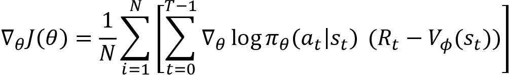
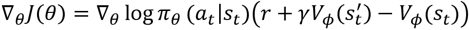
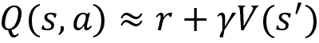
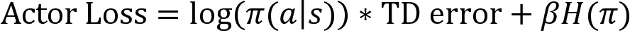

# 第十一章：演员-评论家方法——A2C 和 A3C

到目前为止，我们已经介绍了两种学习最优策略的方法。一种是基于价值的方法，另一种是基于策略的方法。在基于价值的方法中，我们使用 Q 函数来提取最优策略。在基于策略的方法中，我们无需使用 Q 函数就能计算出最优策略。

本章将介绍一种有趣的方法，称为演员-评论家方法，用于寻找最优策略。演员-评论家方法结合了基于价值和基于策略的方法。我们将从了解演员-评论家方法是什么以及它如何结合基于价值和基于策略的方法开始。我们将获得演员-评论家方法的基本理解，之后会详细学习它们。

接下来，我们还将了解演员-评论家方法与带基线的策略梯度方法的不同，并将详细学习演员-评论家方法的算法。接下来，我们将理解**优势演员-评论家**（**A2C**）是什么，以及它如何利用优势函数。

本章结束时，我们将学习一种最常用的演员-评论家算法，称为**异步优势演员-评论家**（**A3C**）。我们将理解 A3C 是什么，以及它的工作原理和架构。

本章将涵盖以下主题：

+   演员-评论家方法概述

+   理解演员-评论家方法

+   演员-评论家方法算法

+   优势演员-评论家（A2C）

+   异步优势演员-评论家（A3C）

+   异步优势演员-评论家（A3C）的架构

+   使用 A3C 进行山地车攀爬

我们将通过首先获得演员-评论家方法的基本理解，来开始本章的内容。

# 演员-评论家方法概述

演员-评论家方法是深度强化学习中最受欢迎的算法之一。许多现代深度强化学习算法都是基于演员-评论家方法设计的。演员-评论家方法位于基于价值方法和基于策略方法的交集处。也就是说，它结合了基于价值和基于策略的方法。

在本节中，我们首先不深入细节，简单了解演员-评论家方法如何工作，接下来我们将深入探讨，并理解演员-评论家方法背后的数学原理。

如其名所示，演员-评论家方法由两种网络组成——演员网络和评论家网络。演员网络的作用是找到最优策略，而评论家网络的作用是评估演员网络生成的策略。因此，我们可以将评论家网络视为一个反馈网络，它评估并引导演员网络找到最优策略，正如*图 11.1*所示：


图 11.1：演员-评论家网络

好的，那么，演员和评论员网络到底是什么？它们如何协同工作并改进策略？演员网络基本上就是策略网络，它通过策略梯度方法找到最优策略。评论员网络基本上就是价值网络，它估计状态值。

因此，评论员网络利用其状态值评估由演员网络产生的动作，并将其反馈发送给演员。根据评论员的反馈，演员网络然后更新其参数。

因此，在演员-评论员方法中，我们使用两个网络——演员网络（策略网络），它计算策略，和评论员网络（价值网络），它通过计算价值函数（状态值）来评估演员网络产生的策略。这不就是我们在上一章刚学到的东西吗？

是的！如果你还记得，它类似于我们在上一章中学习的带基准的策略梯度方法（带基准的 REINFORCE）。与带基准的 REINFORCE 类似，在这里，我们也有一个演员（策略网络）和一个评论员（价值网络）。然而，演员-评论员并不等同于带基准的 REINFORCE。在带基准的 REINFORCE 方法中，我们了解到，我们使用价值网络作为基准，它有助于减少梯度更新中的方差。而在演员-评论员方法中，我们也使用评论员来减少演员的梯度更新中的方差，但它还帮助以在线方式迭代地改进策略。这两者之间的区别将在下一节中进一步阐明。

现在我们对演员-评论员方法有了基本的了解，在下一节中，我们将详细学习演员-评论员方法的工作原理。

## 理解演员-评论员方法

在带基准的 REINFORCE 方法中，我们学习到，我们有两个网络——策略网络和价值网络。策略网络找到最优策略，而价值网络作为基准，修正梯度更新中的方差。类似于带基准的 REINFORCE，演员-评论员方法也由策略网络（称为演员网络）和价值网络（称为评论员网络）组成。

带基准的 REINFORCE 方法和演员-评论员方法的根本区别在于，在带基准的 REINFORCE 方法中，我们在每一集的结束时更新网络的参数。但在演员-评论员方法中，我们在每一步都更新网络的参数。但为什么我们必须这样做？在每一步更新网络参数有什么用呢？让我们进一步探讨这个问题。

我们可以认为带基线的 REINFORCE 方法类似于我们在*第四章*“蒙特卡洛方法”中讨论的**蒙特卡洛**（**MC**）方法，而演员-评论员方法类似于我们在*第五章*“理解时序差分学习”中讨论的 TD 学习方法。因此，首先，让我们回顾一下这两种方法。

在 MC 方法中，计算一个状态的值时，我们生成`N`条轨迹，并计算状态的值作为`N`条轨迹中该状态的平均回报。我们了解到，当轨迹过长时，MC 方法会花费大量时间计算状态值，并且不适用于非序列任务。因此，我们转向了 TD 学习方法。

在 TD 学习方法中，我们了解到，我们可以利用引导法，而不是等到每集结束才计算状态值，估计状态值为即时奖励与下一个状态折扣值之和。

现在，让我们看看 MC 和 TD 方法分别如何与带基线的 REINFORCE 方法和演员-评论员方法相关联。

首先，让我们回顾一下我们在带基线的 REINFORCE 方法中学到的内容。在带基线的 REINFORCE 方法中，我们使用策略生成`N`条轨迹，并计算梯度如下：



正如我们所观察到的，为了计算梯度，我们需要一个完整的轨迹。也就是说，正如以下方程所示，为了计算梯度，我们需要计算轨迹的回报。我们知道回报是轨迹中所有奖励的总和，因此为了计算回报（奖励-目标），首先，我们需要一个使用策略生成的完整轨迹。因此，我们使用策略生成多个轨迹，然后计算梯度：


计算梯度后，我们更新参数如下：


我们可以像在 TD 学习中学到的那样，利用引导法，而不是生成完整轨迹后再计算回报吗？是的！在演员-评论员方法中，我们通过仅使用即时奖励和下一个状态的折扣值来近似回报，公式为：


其中，`r`是即时奖励，是下一个状态的折扣值。

因此，我们可以通过将回报`R`替换为引导估计来重写策略梯度，如下所示：



现在，我们不必等到每一集的结束才能计算回报。相反，我们采用引导法，在每个步骤中计算梯度并更新网络参数。

我们在带基线的 REINFORCE 和演员-评论方法中计算梯度并更新策略网络参数的方式的区别如 *图 11.2* 所示。正如我们在带基线的 REINFORCE 中看到的那样，首先生成完整的回合（轨迹），然后更新网络参数。而在演员-评论方法中，我们在每个回合的每一步更新网络参数：


图 11.2：带基线的 REINFORCE 方法与演员-评论方法的区别

好的，那么评论网络（值网络）呢？我们如何更新评论网络的参数？与演员网络类似，我们在每个回合的每一步更新评论网络的参数。评论网络的损失是 TD 误差，即状态的目标值与网络预测的状态值之间的差异。状态的目标值可以通过奖励与下一个状态值的折现值之和来计算。因此，评论网络的损失表示为：


其中  是状态的目标值，！[](img/B15558_11_012.png) 是网络预测的状态值。

计算评论网络的损失后，我们计算梯度！[](img/B15558_11_014.png)，并在每个回合的每一步使用梯度下降更新评论网络的参数！[](img/B15558_11_043.png)：


现在我们已经了解了演员（策略网络）和评论（值网络）在演员-评论方法中的工作原理；接下来让我们看看演员-评论方法的算法，以便更清楚地理解。

## 演员-评论算法

演员-评论算法的步骤如下：

1.  初始化演员网络参数！[](img/B15558_09_008.png) 和评论网络参数！[](img/B15558_11_016.png)

1.  对于 `N` 个回合，重复 *步骤 3*

1.  对于每一步骤，即对于 `t` = 0, . . . , `T`-1：

    1.  使用策略选择动作，！[](img/B15558_11_017.png)

    1.  在状态 `sₜ` 中采取动作 `aₜ`，观察奖励 `r`，并转移到下一个状态！[](img/B15558_11_018.png)

    1.  计算策略梯度：

    1.  使用梯度上升更新演员网络参数！[](img/B15558_09_054.png)：

    1.  计算评论网络的损失：

    1.  计算梯度！[](img/B15558_11_014.png) 并使用梯度下降更新评论网络参数！[](img/B15558_11_023.png)：

从上面的算法中我们可以观察到，演员网络（策略网络）的参数在每个步骤都会被更新。因此，在每个步骤中，我们都会根据更新后的策略选择一个动作，而评论员网络（价值网络）的参数也会在每个步骤中更新，因此评论员在每个步骤中都会提高对演员网络的评估。而在 REINFORCE 与基准方法中，我们只会在生成完整的轨迹后才更新网络的参数。

我们还应该注意到，REINFORCE 与基准方法和演员-评论员方法之间的一个重要区别是，在 REINFORCE 与基准方法中，我们使用轨迹的完整回报，而在演员-评论员方法中，我们使用引导回报。

我们刚刚学习的演员-评论员算法通常被称为**优势演员-评论员**（**A2C**）。在下一节中，我们将深入探讨优势函数，并更详细地了解为什么我们的算法被称为优势演员-评论员。

# 优势演员-评论员（A2C）

在继续之前，首先让我们回顾一下优势函数。优势函数被定义为 Q 函数与价值函数之间的差异。我们可以将优势函数表示为：


优势函数告诉我们，在状态`s`下，动作`a`相对于平均动作的优劣。

在 A2C 中，我们使用优势函数计算策略梯度。因此，首先让我们看看如何计算优势函数。我们知道，优势函数是 Q 函数与价值函数之间的差异，即`Q`(`s`, `a`) – `V(s)`，因此我们可以使用两个函数逼近器（神经网络），一个用于估计 Q 函数，另一个用于估计价值函数。然后，我们可以通过减去这两个网络的值来得到优势值。但这肯定不是一种最优方法，并且在计算上会很昂贵。

因此，我们可以将 Q 值逼近为：



那么我们如何像这样逼近 Q 值呢？你还记得在*第三章*中，*贝尔曼方程和动态规划*部分，在*价值函数与 Q 函数的关系*这一节中，我们学习过如何从价值函数推导出 Q 函数吗？利用这一公式，我们可以将 Q 函数逼近为即时奖励和下一个状态的折扣价值之和。

将前面提到的 Q 值代入优势函数中的方程（1），我们可以写出如下公式：


因此，现在我们已经有了优势函数。我们了解到，在 A2C 中，我们使用优势函数计算策略梯度。因此，我们可以写出如下公式：


展开优势函数，我们可以写出如下公式：


如我们所见，我们的策略梯度现在是使用优势函数来计算的：


现在，检查前面的公式与我们在上一部分中计算梯度的方法。我们可以观察到两者本质上是相同的。因此，A2C 方法与我们在前一部分学到的内容是一样的。

# 异步优势演员-评论员（A3C）

异步优势演员-评论员，以下简称 A3C，是一种流行的演员-评论员算法。异步优势演员-评论员方法背后的主要思想是，它使用多个代理并行学习，并汇总它们的整体经验。

在 A3C 中，我们将有两种类型的网络，一种是全局网络（全局代理），另一种是工作网络（工作代理）。我们将有多个工作代理，每个工作代理使用不同的探索策略，并在它们自己的环境副本中进行学习并收集经验。然后，从这些工作代理获得的经验将被汇总并发送到全局代理。全局代理汇总这些学习。

现在我们对 A3C 的工作原理有了一个基本的了解，让我们深入细节。

## 三个 A

在深入探讨之前，我们先了解一下 A3C 中的三个 A 代表什么。

**异步**：异步意味着 A3C 的工作方式。也就是说，A3C 并不是只有一个代理尝试学习最优策略，而是有多个代理与环境进行交互。由于我们有多个代理同时与环境进行交互，因此我们为每个代理提供环境副本，这样每个代理就可以与它们自己的环境副本进行交互。因此，这些多个代理被称为工作代理，我们有一个单独的代理称为全局代理。所有工作代理异步地向全局代理报告，全局代理汇总这些学习。

**优势**：我们已经在前一部分学过什么是优势函数。优势函数可以定义为 Q 函数与价值函数之间的差异。

**演员-评论员**：每个工作网络（工作代理）和全局网络（全局代理）基本上遵循演员-评论员架构。也就是说，每个代理由一个演员网络用于估计策略和一个评论员网络用于评估由演员网络生成的策略组成。

现在，让我们继续了解 A3C 的架构，并详细理解 A3C 是如何工作的。

## A3C 的架构

现在，让我们理解 A3C 的架构。A3C 的架构如下图所示：


图 11.3：A3C 的架构

正如我们从前面的图中看到的，我们有多个工作代理，每个工作代理与它们自己的环境副本进行交互并收集经验。我们还可以看到，每个工作代理遵循演员-评论员架构。因此，工作代理计算演员网络损失（策略损失）和评论员网络损失（价值损失）。

在前一节中，我们学到了如何通过计算策略梯度来更新我们的演员网络：


因此，演员损失基本上是以下内容：


如我们所观察到的，演员损失是动作的对数概率与 TD（时间差分）误差的乘积。现在，我们在演员损失中加入一个新项，即策略的熵（随机性度量），并将演员损失重新定义为：


其中  表示策略的熵。加入策略的熵可以促进足够的探索，参数  用于控制熵的显著性。

评论家损失仅仅是均方 TD 误差。

在计算完演员和评论家网络的损失后，工作代理计算损失的梯度，然后将这些梯度发送给全局代理。也就是说，工作代理计算梯度，并将其梯度异步地累积到全局代理中。全局代理使用从工作代理异步接收到的梯度更新其参数。然后，全局代理周期性地将更新后的参数发送给工作代理，这样工作代理就会得到更新。

通过这种方式，每个工作代理计算损失、计算梯度，并异步地将这些梯度发送给全局代理。然后，全局代理通过从工作代理接收到的梯度更新其参数。接着，全局代理周期性地将更新后的参数发送给工作代理。

由于我们有许多工作代理与它们自己的环境副本进行交互，并将信息汇聚到全局网络，因此经验之间几乎没有相关性。

A3C 涉及的步骤如下：

1.  工作代理与它们自己的环境副本进行交互。

1.  每个工作代理遵循不同的策略并收集经验。

1.  接下来，工作代理计算演员和评论家网络的损失。

1.  计算完损失后，他们计算损失的梯度，并异步地将这些梯度发送给全局代理。

1.  全局代理使用从工作代理接收到的梯度更新其参数。

1.  现在，全局代理更新后的参数将周期性地发送给工作代理。

我们重复上述步骤进行若干次迭代，以找到最优策略。为了更清晰地了解 A3C 是如何工作的，在下一节中，我们将学习如何实现它。

## 使用 A3C 攀爬山地车

让我们为山地车爬坡任务实现 A3C 算法。在山地车爬坡环境中，一辆车被放置在两座山之间，代理的目标是驱车爬上右侧的山。但是问题是，代理不能一次性爬上山。所以，代理必须来回驾驶以积累动能，才能爬上右侧的山。如果代理在上山时消耗较少的能量，则会分配更高的奖励。*图 11.4*展示了山地车环境：


图 11.4：山地车环境

本节使用的代码改编自 Stefan Boschenriedter 提供的 A3C 开源实现（[`github.com/stefanbo92/A3C-Continuous`](https://github.com/stefanbo92/A3C-Continuous)）。

首先，让我们导入必要的库：

```py
import warnings
warnings.filterwarnings('ignore')
import gym
import multiprocessing
import threading
import numpy as np
import os
import shutil
import matplotlib.pyplot as plt
import tensorflow.compat.v1 as tf
tf.disable_v2_behavior() 
```

### 创建山地车环境

让我们使用 Gym 创建一个山地车环境。请注意，我们的山地车环境是连续环境，意味着我们的动作空间是连续的：

```py
env = gym.make('MountainCarContinuous-v0') 
```

获取环境的状态形状：

```py
state_shape = env.observation_space.shape[0] 
```

获取环境的动作形状：

```py
action_shape = env.action_space.shape[0] 
```

请注意，我们创建了连续的山地车环境，因此我们的动作空间由连续值组成。所以，我们获取动作空间的边界：

```py
action_bound = [env.action_space.low, env.action_space.high] 
```

### 定义变量

现在，让我们定义一些重要的变量。

定义工作者的数量为 CPU 的数量：

```py
num_workers = multiprocessing.cpu_count() 
```

定义回合数：

```py
num_episodes = 2000 
```

定义时间步长的数量：

```py
num_timesteps = 200 
```

定义全球网络（全球代理）作用域：

```py
global_net_scope = 'Global_Net' 
```

定义我们希望更新全球网络的时间步长：

```py
update_global = 10 
```

定义折扣因子， ：

```py
gamma = 0.90 
```

定义 beta 值：

```py
beta = 0.01 
```

定义我们希望存储日志的目录：

```py
log_dir = 'logs' 
```

### 定义演员-评论家类

我们了解到，在 A3C 中，全球网络和工作代理都遵循演员-评论家架构。所以，让我们定义一个名为`ActorCritic`的类，在其中实现演员-评论家算法。为了清晰理解，让我们逐行查看代码。你也可以从本书的 GitHub 仓库中获取完整的代码。

```py
class ActorCritic(object): 
```

#### 定义初始化方法：

首先，让我们定义初始化方法：

```py
 def __init__(self, scope, sess, globalAC=None): 
```

初始化 TensorFlow 会话：

```py
 self.sess=sess 
```

将演员网络优化器定义为 RMS prop：

```py
 self.actor_optimizer = tf.train.RMSPropOptimizer(0.0001, name='RMSPropA') 
```

将评论家网络优化器定义为 RMS prop：

```py
 self.critic_optimizer = tf.train.RMSPropOptimizer(0.001, name='RMSPropC') 
```

如果作用域是全球网络（全球代理）：

```py
 if scope == global_net_scope:
            with tf.variable_scope(scope): 
```

定义状态的占位符：

```py
 self.state = tf.placeholder(tf.float32, [None, state_shape], 'state') 
```

构建全球网络（全球代理），并获取演员和评论家参数：

```py
 self.actor_params, self.critic_params = self.build_network(scope)[-2:] 
```

如果网络不是全球网络，则：

```py
 else:
            with tf.variable_scope(scope): 
```

定义状态的占位符：

```py
 self.state = tf.placeholder(tf.float32, [None, state_shape], 'state') 
```

我们了解到我们的环境是连续环境，因此我们的演员网络（策略网络）返回动作的均值和方差，然后我们根据这些均值和方差构建动作分布，并基于该分布选择动作。

定义占位符以获取动作分布：

```py
 self.action_dist = tf.placeholder(tf.float32, [None, action_shape], 'action') 
```

定义目标值的占位符：

```py
 self.target_value = tf.placeholder(tf.float32, [None, 1], 'Vtarget') 
```

构建工作网络（工作代理），并获取动作的均值和方差、状态的值以及演员和评论家网络的参数：

```py
 mean, variance, self.value, self.actor_params, self.critic_params = self.build_network(scope) 
```

计算时间差误差（TD 误差），它是状态的目标值与预测值之间的差：

```py
 td_error = tf.subtract(self.target_value, self.value, name='TD_error') 
```

现在，让我们定义评论家网络的损失：

```py
 with tf.name_scope('critic_loss'):
                    self.critic_loss = tf.reduce_mean(tf.square(td_error)) 
```

基于动作的均值和方差创建正态分布：

```py
 normal_dist = tf.distributions.Normal(mean, variance) 
```

现在，让我们定义演员网络的损失。我们了解到，演员网络的损失定义为：



```py
 with tf.name_scope('actor_loss'): 
```

计算动作的对数概率：

```py
 log_prob = normal_dist.log_prob(self.action_dist) 
```

定义策略的熵：

```py
 entropy_pi = normal_dist.entropy() 
```

计算演员网络损失：

```py
 self.loss = log_prob * td_error + (beta * entropy_pi)
                    self.actor_loss = tf.reduce_mean(-self.loss) 
```

基于正态分布选择动作：

```py
 with tf.name_scope('select_action'):
                    self.action = tf.clip_by_value(tf.squeeze(normal_dist.sample(1), axis=0), action_bound[0], action_bound[1]) 
```

计算工作代理（本地代理）演员和评论家网络损失的梯度：

```py
 with tf.name_scope('local_grad'):
                    self.actor_grads = tf.gradients(self.actor_loss, self.actor_params)
                    self.critic_grads = tf.gradients(self.critic_loss, self.critic_params) 
```

现在，让我们执行同步操作：

```py
 with tf.name_scope('sync'): 
```

在计算完演员网络和评论家网络的损失的梯度后，工作代理将这些梯度发送（推送）到全局代理：

```py
 with tf.name_scope('push'):
                    self.update_actor_params = self.actor_optimizer.apply_gradients(zip(self.actor_grads, globalAC.actor_params))
                    self.update_critic_params = self.critic_optimizer.apply_gradients(zip(self.critic_grads, globalAC.critic_params)) 
```

全局代理使用从工作代理（本地代理）接收到的梯度更新他们的参数。然后，工作代理从全局代理拉取更新后的参数：

```py
 with tf.name_scope('pull'):
                    self.pull_actor_params = [l_p.assign(g_p) for l_p, g_p in zip(self.actor_params, globalAC.actor_params)]
                    self.pull_critic_params = [l_p.assign(g_p) for l_p, g_p in zip(self.critic_params, globalAC.critic_params)] 
```

#### 构建网络

现在，让我们定义构建演员-评论家网络的函数：

```py
 def build_network(self, scope): 
```

初始化权重：

```py
 w_init = tf.random_normal_initializer(0., .1) 
```

定义演员网络，它返回动作的均值和方差：

```py
 with tf.variable_scope('actor'):
            l_a = tf.layers.dense(self.state, 200, tf.nn.relu, kernel_initializer=w_init, name='la')
            mean = tf.layers.dense(l_a, action_shape, tf.nn.tanh,kernel_initializer=w_init, name='mean')
            variance = tf.layers.dense(l_a, action_shape, tf.nn.softplus, kernel_initializer=w_init, name='variance') 
```

定义评论家网络，它返回状态的值：

```py
 with tf.variable_scope('critic'):
            l_c = tf.layers.dense(self.state, 100, tf.nn.relu, kernel_initializer=w_init, name='lc')
            value = tf.layers.dense(l_c, 1, kernel_initializer=w_init, name='value') 
```

获取演员和评论家网络的参数：

```py
 actor_params = tf.get_collection(tf.GraphKeys.TRAINABLE_VARIABLES, scope=scope + '/actor')
        critic_params = tf.get_collection(tf.GraphKeys.TRAINABLE_VARIABLES, scope=scope + '/critic') 
```

返回由演员网络生成的动作的均值和方差，评论家网络计算的状态值，以及演员和评论家网络的参数：

```py
 return mean, variance, value, actor_params, critic_params 
```

#### 更新全局网络

让我们定义一个名为`update_global`的函数，用于通过工作网络计算的损失梯度更新全局网络的参数，即推送操作：

```py
 def update_global(self, feed_dict):
        self.sess.run([self.update_actor_params, self.update_critic_params], feed_dict) 
```

#### 更新工作网络

我们还定义了一个名为`pull_from_global`的函数，用于通过从全局网络拉取来更新工作网络的参数，即拉取操作：

```py
 def pull_from_global(self):
        self.sess.run([self.pull_actor_params, self.pull_critic_params]) 
```

#### 选择动作

定义一个名为`select_action`的函数来选择动作：

```py
 def select_action(self, state):

        state = state[np.newaxis, :]

        return self.sess.run(self.action, {self.state: state})[0] 
```

### 定义工作类

让我们定义一个名为`Worker`的类，在这里我们将实现工作代理：

```py
class Worker(object): 
```

#### 定义初始化方法

首先，让我们定义`init`方法：

```py
 def __init__(self, name, globalAC, sess): 
```

我们了解到，每个工作代理与他们自己的环境副本一起工作。所以，让我们创建一个山地车环境：

```py
 self.env = gym.make('MountainCarContinuous-v0').unwrapped 
```

定义工作代理的名称：

```py
 self.name = name 
```

创建我们的`ActorCritic`类的对象：

```py
 self.AC = ActorCritic(name, sess, globalAC) 
```

初始化 TensorFlow 会话：

```py
 self.sess=sess 
```

定义一个名为`work`的函数供工作代理学习：

```py
 def work(self):
        global global_rewards, global_episodes 
```

初始化时间步长：

```py
 total_step = 1 
```

初始化一个列表来存储状态、动作和奖励：

```py
 batch_states, batch_actions, batch_rewards = [], [], [] 
```

当全局回合数小于回合总数且协调器处于激活状态时：

```py
 while not coord.should_stop() and global_episodes < num_episodes: 
```

通过重置环境来初始化状态：

```py
 state = self.env.reset() 
```

初始化返回值：

```py
 Return = 0 
```

对于环境中的每一步：

```py
 for t in range(num_timesteps): 
```

仅渲染工作代理 0 的环境：

```py
 if self.name == 'W_0':
                    self.env.render() 
```

选择动作：

```py
 action = self.AC.select_action(state) 
```

执行所选动作：

```py
 next_state, reward, done, _ = self.env.step(action) 
```

如果已经到达回合的最后一步，则将 `done` 设置为 `True`，否则设置为 `False`：

```py
 done = True if t == num_timesteps - 1 else False 
```

更新回报：

```py
 Return += reward 
```

将状态、动作和奖励存储到列表中：

```py
 batch_states.append(state)
                batch_actions.append(action)
                batch_rewards.append((reward+8)/8) 
```

现在，让我们更新全局网络。如果 `done` 为 `True`，则将下一个状态的值设置为 `0`，否则计算下一个状态的值：

```py
 if total_step % update_global == 0 or done:
                    if done:
                        v_s_ = 0
                    else:
                        v_s_ = self.sess.run(self.AC.value, {self.AC.state: next_state[np.newaxis, :]})[0, 0] 
```

计算目标值，公式为 ：

```py
 batch_target_value = []
                    for reward in batch_rewards[::-1]:
                        v_s_ = reward + gamma * v_s_
                        batch_target_value.append(v_s_) 
```

反转目标值：

```py
 batch_target_value.reverse() 
```

堆叠状态、动作和目标值：

```py
 batch_states, batch_actions, batch_target_value = np.vstack(batch_states), np.vstack(batch_actions), np.vstack(batch_target_value) 
```

定义馈送字典：

```py
 feed_dict = {
                                 self.AC.state: batch_states,
                                 self.AC. action_dist: batch_actions,
                                 self.AC.target_value: batch_target_value,
                                 } 
```

更新全局网络：

```py
 self.AC.update_global(feed_dict) 
```

清空列表：

```py
 batch_states, batch_actions, batch_rewards = [], [], [] 
```

通过从全局网络拉取参数来更新工作网络：

```py
 self.AC.pull_from_global() 
```

将状态更新到下一个状态，并增加总步数：

```py
 state = next_state
                total_step += 1 
```

更新全局奖励：

```py
 if done:
                    if len(global_rewards) < 5:
                        global_rewards.append(Return)
                    else:
                        global_rewards.append(Return)
                        global_rewards[-1] =(np.mean(global_rewards[-5:]))

                    global_episodes += 1
                    break 
```

### 训练网络

现在，让我们开始训练网络。初始化全局奖励列表，并初始化全局回合计数器：

```py
global_rewards = []
global_episodes = 0 
```

启动 TensorFlow 会话：

```py
sess = tf.Session() 
```

创建全局代理：

```py
with tf.device("/cpu:0"):

    global_agent = ActorCritic(global_net_scope,sess) 
```

创建 `n` 个工作代理：

```py
 worker_agents = []
    for i in range(num_workers):
        i_name = 'W_%i' % i
        worker_agents.append(Worker(i_name, global_agent,sess)) 
```

创建 TensorFlow 协调器：

```py
coord = tf.train.Coordinator() 
```

初始化所有 TensorFlow 变量：

```py
sess.run(tf.global_variables_initializer()) 
```

将 TensorFlow 计算图存储在日志目录中：

```py
if os.path.exists(log_dir):
    shutil.rmtree(log_dir)
tf.summary.FileWriter(log_dir, sess.graph) 
```

现在，运行工作线程：

```py
worker_threads = []
for worker in worker_agents:
    job = lambda: worker.work()
    t = threading.Thread(target=job)
    t.start()
    worker_threads.append(t)
coord.join(worker_threads) 
```

为了更好地理解 A3C 架构，让我们在下一节中查看 A3C 的计算图。

### 可视化计算图

正如我们所观察到的，我们有四个工作代理（工作网络）和一个全局代理（全局网络）：


图 11.5：A3C 的计算图

让我们来看看工作代理的架构。正如我们所观察到的，工作代理遵循演员-评论家架构：


图 11.6：A3C 的计算图，展示了展开的 W_0 节点

现在，让我们检查同步节点。正如 *图 11.7* 所示，我们在同步节点中有两个操作，分别是 *推送* 和 *拉取*：


图 11.7：A3C 的计算图，展示了同步节点的推送和拉取操作

在计算了演员和评论家网络的损失的梯度之后，工作代理将这些梯度推送到全局代理：


图 11.8：A3C 的计算图——工作代理将其梯度推送到全局代理

全局代理通过从工作代理接收到的梯度来更新其参数。然后，工作代理从全局代理拉取更新后的参数：


图 11.9：A3C 的计算图——工作代理从全局代理拉取更新后的参数

现在我们已经了解了 A3C 的工作原理，在接下来的章节中，让我们回顾一下 A2C 方法。

# 再次审视 A2C

我们可以像 A3C 算法一样设计具有多个工作代理的 A2C 算法。然而，不同于 A3C，A2C 是一个同步算法，意味着在 A2C 中，我们可以有多个工作代理，每个工作代理与它们自己的环境副本进行交互，且所有工作代理执行同步更新，而 A3C 中工作代理执行的是异步更新。

也就是说，在 A2C 中，每个工作代理与环境互动，计算损失并计算梯度。然而，它不会独立地将这些梯度发送到全局网络。相反，它会等待所有其他工作代理完成工作，然后以同步的方式将权重更新到全局网络。进行同步的权重更新可以减少 A3C 引入的不一致性。

# 总结

我们通过理解演员-评论员方法是什么开始了本章的学习。我们了解到，在演员-评论员方法中，演员计算最优策略，而评论员通过估计价值函数来评估演员网络计算的策略。接下来，我们学习了演员-评论员方法与带基线的策略梯度方法的不同之处。

我们了解到，在带基线的策略梯度方法中，首先生成完整的回合（轨迹），然后更新网络的参数。而在演员-评论员方法中，我们在每一步回合中更新网络的参数。接下来，我们了解了优势演员-评论员算法是什么，以及它如何在梯度更新中使用优势函数。

在本章结束时，我们了解了另一种有趣的演员-评论员算法，称为异步优势演员-评论员方法。我们了解到，A3C 由多个工作代理和一个全局代理组成。所有工作代理异步地将它们的梯度发送到全局代理，然后全局代理使用从工作代理接收到的梯度更新它们的参数。更新参数后，全局代理会定期将更新后的参数发送给工作代理。

因此，在本章中，我们了解了两种有趣的演员-评论员算法——A2C 和 A3C。在下一章中，我们将了解几种最先进的演员-评论员算法，包括 DDPG、TD3 和 SAC。

# 问题

让我们通过回答以下问题来评估我们对演员-评论员方法的理解：

1.  演员-评论员方法是什么？

1.  演员网络和评论员网络的作用是什么？

1.  演员-评论员方法与基线策略梯度方法有何不同？

1.  演员网络的梯度更新方程是什么？

1.  A2C 是如何工作的？

1.  *异步*在 A3C 中意味着什么？

1.  A2C 与 A3C 有何不同？

# 进一步阅读

若要了解更多，请参考以下论文：

+   *深度强化学习的异步方法*，Volodymyr Mnih 等著：[`arxiv.org/pdf/1602.01783.pdf`](https://arxiv.org/pdf/1602.01783.pdf)
