# 第十二章：学习 DDPG、TD3 和 SAC

在前一章中，我们了解了有趣的演员-评论家方法，如 **优势演员-评论家** (**A2C**) 和 **异步优势演员-评论家** (**A3C**)。在本章中，我们将学习几种最先进的演员-评论家方法。我们将从理解一种流行的演员-评论家方法 **深度确定性策略梯度** (**DDPG**) 开始。DDPG 仅在连续环境中使用，即具有连续动作空间的环境。我们将详细了解 DDPG 是什么以及它如何工作。我们还将逐步学习 DDPG 算法。

接下来，我们将了解 **双延迟深度确定性策略梯度** (**TD3**)。TD3 是对 DDPG 算法的改进，包括解决 DDPG 中面临的几个问题的一些有趣特性。我们将详细了解 TD3 的关键特性，还将逐步学习 TD3 的算法。

最后，我们将学习另一种有趣的演员-评论家算法，称为 **软演员-评论家 (SAC)**。我们将学习 SAC 是什么以及它如何通过目标函数中的熵项工作。我们将详细了解 SAC 的演员和评论家组件，然后逐步学习 SAC 算法。

在本章中，我们将学习以下主题：

+   深度确定性策略梯度 (DDPG)

+   DDPG 的组成部分

+   DDPG 算法

+   双延迟深度确定性策略梯度 (TD3)

+   TD3 的关键特性

+   TD3 算法

+   软演员-评论家（SAC）

+   SAC 的组成部分

+   SAC 算法

# 深度确定性策略梯度

DDPG 是一种离策略、无模型的算法，专为动作空间连续的环境设计。在前一章中，我们学习了演员-评论家方法的工作原理。DDPG 是一种演员-评论家方法，其中演员使用策略梯度估计策略，评论家使用 Q 函数评估演员产生的策略。

DDPG 使用策略网络作为演员和深度 Q 网络作为评论家。我们在前一章中学到的 DPPG 和演员-评论家算法之间的一个重要区别是，DDPG 尝试学习确定性策略而不是随机策略。

首先，我们将直观地了解 DDPG 的工作原理，然后详细学习算法。

## DDPG 概述

DDPG 是一种演员-评论家方法，充分利用了基于策略的方法和基于值的方法。它使用确定性策略  而不是随机策略 。

我们了解到，确定性策略告诉代理在给定状态下执行一种特定的动作，这意味着确定性策略将状态映射到一个特定的动作：


而随机策略将状态映射到动作空间上的概率分布：


在确定性策略中，每当智能体访问某个状态时，它总是执行相同的特定动作。但是在随机策略中，智能体不是每次访问状态时都执行相同的动作，而是根据动作空间中的概率分布每次执行不同的动作。

现在，我们将概览 DDPG 算法中的演员和评论员网络。

### 演员

DDPG 中的演员本质上就是策略网络。演员的目标是学习状态与动作之间的映射关系。也就是说，演员的作用是学习能带来最大回报的最优策略。因此，演员使用策略梯度方法来学习最优策略。

### 评论员

评论员本质上就是价值网络。评论员的目标是评估演员网络所产生的动作。评论员网络如何评估演员网络产生的动作呢？假设我们有一个 Q 函数，我们能否使用 Q 函数来评估一个动作呢？当然可以！首先，让我们稍微绕一下路，回顾一下 Q 函数的使用。

我们知道，Q 函数给出了一个智能体从状态`s`开始并执行动作`a`时，按照特定策略所获得的预期回报。Q 函数产生的预期回报通常称为 Q 值。因此，给定一个状态和动作，我们可以得到一个 Q 值：

+   如果 Q 值很高，我们可以说在该状态下执行的动作是一个好的动作。也就是说，如果 Q 值很高，意味着当我们在状态`s`中执行动作`a`时，预期回报很高，我们可以说动作`a`是一个好的动作。

+   如果 Q 值很低，我们可以说在该状态下执行的动作不是一个好的动作。也就是说，如果 Q 值很低，意味着当我们在状态`s`中执行动作`a`时，预期回报很低，我们可以说动作`a`不是一个好的动作。

好的，那么评论网络如何基于 Q 函数（Q 值）来评估演员网络所产生的动作呢？假设演员网络在状态*`A`*下执行了一个*down*动作。那么，现在，评论网络计算在状态*`A`*下执行*down*动作的 Q 值。如果 Q 值很高，那么评论网络会给演员网络反馈，表示在状态*`A`*下，*down*动作是一个好的动作。如果 Q 值很低，那么评论网络会给演员网络反馈，表示在状态*`A`*下，*down*动作不是一个好的动作，因此演员网络会尝试在状态*`A`*下执行一个不同的动作。

因此，借助 Q 函数，评论网络可以评估演员网络执行的动作。但是，等等，评论网络怎么学习 Q 函数呢？因为只有当它知道 Q 函数时，才能评估演员执行的动作。那么，评论网络如何学习 Q 函数呢？这就是我们使用**深度 Q 网络**（**DQN**）的地方。我们了解到，利用 DQN，可以使用神经网络来近似 Q 函数。因此，现在我们使用 DQN 作为评论网络来计算 Q 函数。

因此，简而言之，DDPG 是一种演员-评论方法，它结合了基于策略和基于价值的方法。DDPG 由演员（一个策略网络）和评论（一个深度 Q 网络）组成，演员通过策略梯度方法来学习最优策略，评论则评估演员产生的动作。

## DDPG 组件

现在我们对 DDPG 算法的基本工作原理有了了解，接下来我们将深入探讨。通过分别查看演员和评论网络，我们将更好地理解它们的具体工作原理。

### 评论网络

我们了解到，评论网络基本上就是 DQN，它利用 DQN 来估计 Q 值。现在，让我们更详细地了解评论网络如何使用 DQN 来估计 Q 值，并回顾一下 DQN。

评论网络评估演员产生的动作。因此，评论的输入将是状态以及在该状态下由演员产生的动作，评论返回给定状态-动作对的 Q 值，如*图 12.1*所示：


图 12.1：评论网络

为了在评论中近似 Q 值，我们可以使用深度神经网络，如果我们用深度神经网络来近似 Q 值，那么这个网络就叫做 DQN。由于我们使用神经网络来近似评论中的 Q 值，所以我们可以用  来表示 Q 函数，其中  是网络的参数。

因此，在评论网络中，我们使用 DQN 来近似 Q 值，评论网络的参数由  表示，如*图 12.2*所示：


图 12.2：评论网络

如从*图 12.2*中可以观察到，给定状态 `s` 和由演员生成的动作 `a`，评论网络返回 Q 值。

现在，让我们看看如何获得演员产生的动作 `a`。我们了解到，演员基本上是策略网络，它通过策略梯度方法来学习最优策略。在 DDPG 中，我们学习的是确定性策略，而不是随机策略，因此我们可以用  来表示策略，而不是 。演员网络的参数由  表示。因此，我们可以将参数化策略表示为 。

给定一个状态 `s` 作为输入，演员网络返回在该状态下执行的动作 `a`：


因此，评论家网络将状态 `s` 和演员网络在该状态下产生的动作  作为输入，返回 Q 值，如 *图 12.3* 所示：

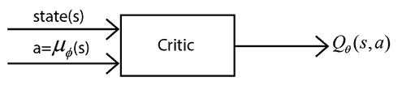

图 12.3：评论家网络

好的，我们如何训练评论家网络（DQN）呢？我们通常通过最小化损失来训练网络，损失是目标值和预测值之间的差异。因此，我们可以通过最小化损失来训练评论家网络，损失是目标 Q 值与网络预测的 Q 值之间的差异。但我们如何获得目标 Q 值呢？目标 Q 值是最优 Q 值，我们可以使用贝尔曼方程来获得最优 Q 值。

我们了解到，最优 Q 函数（Q 值）可以通过使用贝尔曼最优性方程来获得。因此，最优 Q 函数可以通过以下贝尔曼最优性方程来获得：


我们知道， 表示我们在状态 `s` 中执行动作 `a` 并转移到下一个状态  时获得的即时奖励 `r`，因此我们可以将  简单表示为 `r`：


在上面的方程中，我们可以去除期望。我们将通过从重放缓冲区中采样 `K` 数量的过渡状态并取平均值来逼近期望。稍后我们将更详细地了解这个过程。所以，我们可以将目标 Q 值表示为即时奖励和下一个状态-动作对的折扣最大 Q 值的和，如下所示：


因此，我们可以将评论家网络的损失函数表示为目标值（最优贝尔曼 Q 值）和预测值（评论家网络预测的 Q 值）之间的差异：


这里，动作 `a` 是由演员网络产生的动作，即 。

我们可以不将损失作为目标值和预测值之间的差异，而是将均方误差作为我们的损失函数。我们知道，在 DQN 中，我们使用重放缓冲区并存储过渡状态为 。因此，我们从重放缓冲区中随机抽取一个 `K` 数量的过渡状态小批量，并通过最小化目标值（最优贝尔曼 Q 值）和预测值（评论家网络预测的 Q 值）之间的均方损失来训练网络。因此，我们的损失函数表示为：

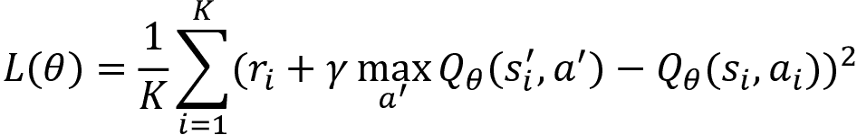

从前面的方程中，我们可以观察到目标 Q 函数和预测的 Q 函数都由相同的参数  参数化。这将导致均方误差的不稳定，网络的学习效果会很差。

因此，我们引入了另一个神经网络来学习目标值，通常称为目标评论家网络。目标评论家网络的参数用表示。我们的主要评论家网络用于预测 Q 值，并通过梯度下降学习正确的参数。目标评论家网络参数通过直接复制主要评论家网络的参数来更新。

因此，评论家网络的损失函数可以写作：


请记住，前面方程中的动作`a[i]`是由演员网络生成的动作，即！[](img/B15558_12_030.png)。

由于最大项的存在，在目标值计算中有一个小问题，如下所示：


最大项意味着我们计算所有可能动作的 Q 值！[](img/B15558_12_031.png)，在状态！[](img/B15558_12_016.png)下，并选择具有最大 Q 值的动作！[](img/B15558_12_031.png)。但是，当动作空间是连续时，我们无法计算所有可能动作！[](img/B15558_12_031.png)在状态！[](img/B15558_12_016.png)下的 Q 值。因此，我们需要去掉损失函数中的最大项。我们该如何做呢？

正如我们在评论家中使用目标网络一样，我们也可以使用目标演员网络，目标演员网络的参数用表示。现在，我们不再选择具有最大 Q 值的动作！[](img/B15558_12_031.png)，而是可以使用目标演员网络生成一个动作！[](img/B15558_12_031.png)，即！[](img/B15558_12_039.png)。

因此，如*图 12.4*所示，为了计算目标中的下一个状态-动作对的 Q 值，我们将状态！[](img/B15558_12_016.png)和由目标演员网络（参数化为！[](img/B15558_12_042.png)）生成的动作！[](img/B15558_12_031.png)输入到目标评论家网络中，它返回下一个状态-动作对的 Q 值：


图 12.4：目标评论家网络

因此，在我们的损失函数中，方程（1），我们可以去掉最大项，而是将写作，如下所示：


为了保持符号的一致性，我们用`J`表示损失函数：


为了减少杂乱，我们可以用`y`表示目标值，并写作：


其中`y[i]`是评论家的目标值，即！[](img/B15558_12_048.png)，而动作`a[i]`是由主要演员网络生成的动作，即！[](img/B15558_12_030.png)。

为了最小化损失，我们计算目标函数的梯度，并通过梯度下降更新主要的评论家网络参数：

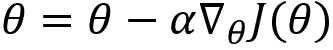

好的，那目标评论网络的参数呢？我们如何更新它？我们可以通过直接复制主评论网络参数的参数来更新目标评论网络的参数，如下所示：


这通常被称为软替代，并且的值通常设置为 0.001。

因此，我们学到评论网络如何使用 DQN 来计算 Q 值，以评估演员网络产生的动作。在下一节中，我们将学习演员网络如何学习最优策略。

### 演员网络

我们已经学到演员网络是策略网络，它使用策略梯度来计算最优策略。我们还学到我们通过表示演员网络的参数，因此参数化的策略表示为。

演员网络以状态 `s` 作为输入，并返回动作 `a`：


这里我们可能需要注意的一个重要点是，我们使用的是确定性策略。由于我们使用的是确定性策略，我们需要处理探索-开发困境，因为我们知道确定性策略总是选择相同的动作，而不会探索新的动作，这与基于动作空间概率分布选择不同动作的随机策略不同。

好的，在使用确定性策略时，我们如何探索新的动作呢？请注意，DDPG 是为动作空间连续的环境设计的。因此，我们在连续动作空间中使用确定性策略。

与离散动作空间不同，在连续动作空间中，我们有连续的值。因此，为了探索新的动作，我们可以直接在演员网络产生的动作上添加一些噪声，因为动作是一个连续值。我们通过一种叫做奥恩斯坦-乌伦贝克随机过程的方式生成这个噪声。因此，我们修改后的动作可以表示为：


例如，假设演员网络产生的动作是 13。假设噪声是 0.1，那么我们的动作变成了 `a` = 13+0.1 = 13.1。

我们已经学到评论网络通过表示，它使用 Q 值来评估演员产生的动作。如果 Q 值很高，那么评论网络告诉演员它产生了一个好的动作；但当 Q 值很低时，评论网络告诉演员它产生了一个不好的动作。

但等等！我们了解到当动作空间是连续时，计算 Q 值是困难的。也就是说，当动作空间是连续的时，计算状态中所有可能动作的 Q 值并取最大 Q 值是困难的。这就是为什么我们转向策略梯度方法。但现在，我们正在计算具有连续动作空间的 Q 值。这会怎么样？

请注意，在 DDPG 中，我们并不计算所有可能的状态-动作对的 Q 值。我们只是简单地计算演员网络生成的状态 `s` 和动作 `a` 的 Q 值。

演员的目标是让评论者说出它产生的动作是一个好动作。也就是说，演员希望从评论者网络获得良好的反馈。评论者何时会给演员良好的反馈？当演员产生的动作具有最大的 Q 值时，评论者会给出良好的反馈。因此，演员试图以一种方式生成动作，使得它可以最大化评论者生成的 Q 值。

因此，演员的目标函数是生成一个动作，最大化评论者网络生成的 Q 值。因此，我们可以将演员的目标函数写为：


其中动作为 。最大化上述目标函数  意味着我们在最大化评论者网络生成的 Q 值。好的，我们如何最大化前述目标函数呢？我们可以通过执行梯度上升来最大化目标函数，并更新演员网络参数如下：


等等。我们不仅仅为单个状态  更新演员网络参数 ，而是从重播缓冲区  中采样  个状态并更新参数。因此，我们的目标函数现在变成：


其中动作为 。最大化前述目标函数意味着演员试图以一种方式生成动作，使得在所有采样状态下最大化 Q 值。我们可以通过执行梯度上升来最大化目标函数，并更新演员网络参数如下：


总结一下，演员的目标是以一种方式生成动作，使得它最大化评论者生成的 Q 值。因此，我们执行梯度上升，并更新演员网络参数。

好的，那么目标演员网络的参数如何更新？我们可以通过软替换仅复制主要演员网络参数  来更新目标演员网络参数，如下所示：

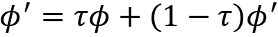

现在我们已经理解了演员和评论家网络是如何工作的，让我们整理一下到目前为止所学的内容，并通过将所有概念整合起来，来深入理解 DDPG 是如何工作的。

## 将所有内容整合在一起

为了避免在符号中迷失，首先，让我们回顾一下符号，以便更好地理解 DDPG。我们使用四个网络，两个演员网络和两个评论家网络：

+   主评论家网络参数表示为 

+   目标评论家网络参数表示为 

+   主演员网络参数表示为 

+   目标演员网络参数表示为 

请注意，DDPG 是一种演员-评论家方法，因此它的参数将在每个回合的每一步都更新，这与策略梯度方法不同，后者是先生成完整的回合，然后再更新参数。好了，让我们开始，理解 DDPG 是如何工作的。

首先，我们用随机值初始化主评论家网络参数  和主演员网络参数 。我们了解到，目标网络参数只是主网络参数的副本。因此，我们通过简单地复制主评论家网络参数  来初始化目标评论家网络参数 。类似地，我们通过复制主演员网络参数  来初始化目标演员网络参数 。我们还初始化了回放缓冲区 。

现在，在每个回合的每一步，首先，我们使用演员网络选择一个动作 `a`：


然而，为了确保探索，我们不是直接使用动作 `a`，而是添加一些噪声 ，因此动作变为：


然后，我们执行动作 `a`，移动到下一个状态 ，并获得奖励 `r`。我们将这个过渡信息存储在回放缓冲区  中。

接下来，我们从回放缓冲区随机采样一个 `K` 过渡（`s`，`a`，`r`，*s'*）的小批量。这些 `K` 个过渡将用于更新评论家和演员网络。

首先，让我们计算评论家网络的损失。我们了解到，评论家网络的损失函数是：


其中 `y[i]` 是评论家的目标值，即 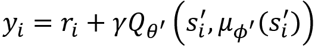，而动作 `a[i]` 是由演员网络生成的动作，即 。

在计算评论家网络的损失后，我们计算梯度 ，并使用梯度下降法更新评论家网络参数 ：


现在，让我们更新演员网络。我们了解到，演员网络的目标函数是：


请注意，在上述方程中，我们仅使用从采样的 `K` 过渡 (`s`, `a`, `r`, *s'*) 中的状态 (`s[i]`)。动作 `a` 由演员网络选择，。现在，我们需要最大化前面的目标函数。最大化上述目标函数有助于演员以一种方式生成动作，从而最大化评论员生成的 Q 值。我们可以通过计算目标函数  的梯度并使用梯度上升更新演员网络参数  来最大化目标函数：


然后，在最后一步，我们通过软替换更新目标评论员网络参数  和目标演员网络参数 ：


我们为多个回合重复这些步骤。因此，对于回合中的每一步，我们都会更新网络的参数。由于参数在每一步都会更新，我们的策略也会在每个回合的每一步得到改进。

为了更好地理解 DDPG 的工作原理，让我们在下一节中深入探讨 DDPG 算法。

## 算法 - DDPG

DDPG 算法如下所示：

1.  初始化主评论员网络参数  和主演员网络参数 。

1.  通过直接复制主评论员网络参数  初始化目标评论员网络参数 。

1.  通过直接复制主演员网络参数  初始化目标演员网络参数 。

1.  初始化重放缓冲区 。

1.  对于 `N` 个回合，重复步骤 6 和 7。

1.  初始化 Ornstein-Uhlenbeck 随机过程 ，用于动作空间的探索。

1.  对于每个回合的每一步，即 `t` = 0,…,`T` – 1：

    1.  基于策略  和探索噪声选择动作 `a`，即 。

    1.  执行选定的动作 `a`，移动到下一个状态 ，获得奖励 `r`，并将这一过渡信息存储在重放缓冲区  中。

    1.  从重放缓冲区  随机抽取一个 `K` 过渡的小批量。

    1.  计算评论员的目标值，即 。

    1.  计算评论员网络的损失，。

    1.  计算损失的梯度 ，并使用梯度下降更新评论员网络参数，。

    1.  计算演员网络的梯度 ，并通过梯度上升更新演员网络参数，。

    1.  更新目标评论员和目标演员网络参数，分别为  和 。

## 使用 DDPG 摆动一个摆锤

在本节中，让我们实现 DDPG 算法来训练智能体摆动一个摆锤。也就是说，我们将有一个从随机位置开始摆动的摆锤，智能体的目标是使摆锤摆动起来并保持直立。

首先，让我们导入所需的库：

```py
import warnings
warnings.filterwarnings('ignore')
import tensorflow as tf
tf.compat.v1.disable_v2_behavior() 
import numpy as np
import gym 
```

### 创建 Gym 环境

让我们使用 Gym 创建一个摆锤环境：

```py
env = gym.make("Pendulum-v0").unwrapped 
```

获取环境的状态形状：

```py
state_shape = env.observation_space.shape[0] 
```

获取环境的动作形状：

```py
action_shape = env.action_space.shape[0] 
```

请注意，摆锤是一个连续环境，因此我们的动作空间由连续值组成。因此，我们获取动作空间的边界：

```py
action_bound = [env.action_space.low, env.action_space.high] 
```

### 定义变量

现在，让我们定义一些重要的变量。

设置折扣因子：

```py
gamma = 0.9 
```

设置的值，用于软替代：

```py
tau = 0.001 
```

设置我们的重放缓冲区的大小：

```py
replay_buffer = 10000 
```

设置批量大小：

```py
batch_size = 32 
```

### 定义 DDPG 类

让我们定义一个名为`DDPG`的类，在其中实现 DDPG 算法。为了便于理解，让我们逐行查看代码。你也可以通过本书的 GitHub 仓库访问完整代码：

```py
class DDPG(object): 
```

#### 定义初始化方法

首先，让我们定义`init`方法：

```py
 def __init__(self, state_shape, action_shape, high_action_value,): 
```

定义重放缓冲区，用于存储转移：

```py
 self.replay_buffer = np.zeros((replay_buffer, state_shape * 2 + action_shape + 1), dtype=np.float32) 
```

将`num_transitions`初始化为`0`，这意味着我们的重放缓冲区中的转移数为零：

```py
 self.num_transitions = 0 
```

启动 TensorFlow 会话：

```py
 self.sess = tf.Session() 
```

我们了解到，在 DDPG 中，为了确保探索，而不是直接选择动作`a`，我们通过使用奥恩斯坦-乌伦贝克过程添加了一些噪声。因此，我们首先初始化噪声：

```py
 self.noise = 3.0 
```

然后，初始化状态形状、动作形状和高动作值：

```py
 self.state_shape, self.action_shape, self.high_action_value = state_shape, action_shape, high_action_value 
```

定义状态的占位符：

```py
 self.state = tf.placeholder(tf.float32, [None, state_shape], 'state') 
```

定义下一个状态的占位符：

```py
 self.next_state = tf.placeholder(tf.float32, [None, state_shape], 'next_state') 
```

定义奖励的占位符：

```py
 self.reward = tf.placeholder(tf.float32, [None, 1], 'reward') 
```

在演员变量作用域内：

```py
 with tf.variable_scope('Actor'): 
```

定义主演员网络，该网络由进行参数化。演员网络以状态为输入，并返回在该状态下执行的动作：

```py
 self.actor = self.build_actor_network(self.state, scope='main', trainable=True) 
```

定义目标演员网络，该网络由进行参数化。目标演员网络以下一个状态为输入，并返回在该状态下执行的动作：

```py
 target_actor = self.build_actor_network(self.next_state, scope='target', trainable=False) 
```

在评论变量作用域内：

```py
 with tf.variable_scope('Critic'): 
```

定义主评论网络，该网络由进行参数化。评论网络以状态和演员在该状态下产生的动作作为输入，并返回 Q 值：

```py
 critic = self.build_critic_network(self.state, self.actor, scope='main', trainable=True) 
```

定义目标评论网络，该网络由进行参数化。目标评论网络以下一个状态和目标演员网络在该下一个状态下产生的动作作为输入，并返回 Q 值：

```py
 target_critic = self.build_critic_network(self.next_state, target_actor, scope='target', trainable=False) 
```

获取主演员网络的参数：

```py
 self.main_actor_params = tf.get_collection(tf.GraphKeys.GLOBAL_VARIABLES, scope='Actor/main') 
```

获取目标演员网络的参数：

```py
 self.target_actor_params = tf.get_collection(tf.GraphKeys.GLOBAL_VARIABLES, scope='Actor/target') 
```

获取主评论网络的参数：

```py
 self.main_critic_params = tf.get_collection(tf.GraphKeys.GLOBAL_VARIABLES, scope='Critic/main') 
```

获取目标评论家网络的参数 ：

```py
 self.target_critic_params = tf.get_collection(tf.GraphKeys.GLOBAL_VARIABLES, scope='Critic/target') 
```

执行软替换，更新目标演员网络的参数为 ，并更新目标评论家网络的参数为 ：

```py
 self.soft_replacement = [
            [tf.assign(phi_, tau*phi + (1-tau)*phi_), tf.assign(theta_, tau*theta + (1-tau)*theta_)]
            for phi, phi_, theta, theta_ in zip(self.main_actor_params, self.target_actor_params, self.main_critic_params, self.target_critic_params)
            ] 
```

计算目标 Q 值。我们了解到目标 Q 值可以通过将奖励与下一个状态-动作对的折扣 Q 值相加来计算，：

```py
 y = self.reward + gamma * target_critic 
```

现在，让我们计算评论家网络的损失。评论家网络的损失是目标 Q 值与预测 Q 值之间的均方误差：


因此，我们可以定义均方误差为：

```py
 MSE = tf.losses.mean_squared_error(labels=y, predictions=critic) 
```

通过使用 Adam 优化器最小化均方误差来训练评论家网络：

```py
 self.train_critic = tf.train.AdamOptimizer(0.01).minimize(MSE, name="adam-ink", var_list = self.main_critic_params) 
```

我们了解到，演员的目标函数是生成一个动作，使评论家网络产生的 Q 值最大化，如下所示：


动作发生在 ，我们可以通过计算梯度并进行梯度上升来最大化这个目标。然而，通常的约定是执行最小化而不是最大化。因此，我们可以通过仅添加一个负号，将前面的最大化目标转换为最小化目标。因此，我们可以定义演员网络目标为：

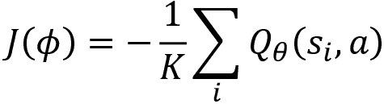

现在，我们可以通过计算梯度并执行梯度下降来最小化演员网络目标。因此，我们可以写出：

```py
 actor_loss = -tf.reduce_mean(critic) 
```

通过使用 Adam 优化器最小化损失来训练演员网络：

```py
 self.train_actor = tf.train.AdamOptimizer(0.001).minimize(actor_loss, var_list=self.main_actor_params) 
```

初始化所有的 TensorFlow 变量：

```py
 self.sess.run(tf.global_variables_initializer()) 
```

#### 选择动作

让我们定义一个叫做`select_action`的函数，通过加入噪声来选择动作，以确保探索：

```py
 def select_action(self, state): 
```

运行演员网络并获取动作：

```py
 action = self.sess.run(self.actor, {self.state: state[np.newaxis, :]})[0] 
```

现在，我们生成一个均值为动作、标准差为噪声的正态分布，并从该正态分布中随机选择一个动作：

```py
 action = np.random.normal(action, self.noise) 
```

我们需要确保我们的动作不会超出动作的边界。所以，我们将动作裁剪到动作边界内，然后返回这个动作：

```py
 action = np.clip(action, action_bound[0],action_bound[1])

        return action 
```

#### 定义训练函数

现在，让我们定义训练函数：

```py
 def train(self): 
```

执行软替换：

```py
 self.sess.run(self.soft_replacement) 
```

从回放缓冲区中随机选择给定批次大小的索引：

```py
 indices = np.random.choice(replay_buffer, size=batch_size) 
```

从回放缓冲区中选择具有选定索引的状态转移批次：

```py
 batch_transition = self.replay_buffer[indices, :] 
```

获取状态、动作、奖励和下一个状态的批次：

```py
 batch_states = batch_transition[:, :self.state_shape]
        batch_actions = batch_transition[:, self.state_shape: self.state_shape + self.action_shape]
        batch_rewards = batch_transition[:, -self.state_shape - 1: -self.state_shape]
        batch_next_state = batch_transition[:, -self.state_shape:] 
```

训练演员网络：

```py
 self.sess.run(self.train_actor, {self.state: batch_states}) 
```

训练评论家网络：

```py
 self.sess.run(self.train_critic, {self.state: batch_states, self.actor: batch_actions, self.reward: batch_rewards, self.next_state: batch_next_state}) 
```

#### 存储状态转移

现在，让我们将状态转移存储到回放缓冲区中：

```py
 def store_transition(self, state, actor, reward, next_state): 
```

首先，将状态、动作、奖励和下一个状态堆叠起来：

```py
 trans = np.hstack((state,actor,[reward],next_state)) 
```

获取索引：

```py
 index = self.num_transitions % replay_buffer 
```

存储状态转移：

```py
 self.replay_buffer[index, :] = trans 
```

更新状态转移的数量：

```py
 self.num_transitions += 1 
```

如果状态转移的数量大于回放缓冲区，则训练网络：

```py
 if self.num_transitions > replay_buffer:
            self.noise *= 0.99995
            self.train() 
```

#### 构建演员网络

我们定义一个叫做`build_actor_network`的函数来构建演员网络。演员网络接收状态并返回在该状态下执行的动作：

```py
 def build_actor_network(self, state, scope, trainable):
        with tf.variable_scope(scope):
            layer_1 = tf.layers.dense(state, 30, activation = tf.nn.tanh, name = 'layer_1', trainable = trainable)
            actor = tf.layers.dense(layer_1, self.action_shape, activation = tf.nn.tanh, name = 'actor', trainable = trainable) 
            return tf.multiply(actor, self.high_action_value, name = "scaled_a") 
```

#### 构建评论员网络

我们定义了一个名为`build_critic_network`的函数来构建评论员网络。评论员网络接收状态和由演员在该状态下产生的动作，并返回 Q 值：

```py
 def build_critic_network(self, state, actor, scope, trainable):
        with tf.variable_scope(scope):
            w1_s = tf.get_variable('w1_s', [self.state_shape, 30], trainable = trainable)
            w1_a = tf.get_variable('w1_a', [self.action_shape, 30], trainable = trainable)
            b1 = tf.get_variable('b1', [1, 30], trainable = trainable)
            net = tf.nn.tanh( tf.matmul(state, w1_s) + tf.matmul(actor, w1_a) + b1 )
            critic = tf.layers.dense(net, 1, trainable = trainable)
            return critic 
```

### 训练网络

现在，让我们开始训练网络。首先，我们创建一个 DDPG 类的对象：

```py
ddpg = DDPG(state_shape, action_shape, action_bound[1]) 
```

设置回合数：

```py
num_episodes = 300 
```

设置每个回合的时间步数：

```py
num_timesteps = 500 
```

对于每个回合：

```py
for i in range(num_episodes): 
```

通过重置环境初始化状态：

```py
 state = env.reset() 
```

初始化返回值：

```py
 Return = 0 
```

每一步：

```py
 for t in range(num_timesteps): 
```

渲染环境：

```py
 env.render() 
```

选择动作：

```py
 action = ddpg.select_action(state) 
```

执行选定的动作：

```py
 next_state, reward, done, info = env.step(action) 
```

将过渡存储在回放缓冲区中：

```py
 ddpg.store_transition(state, action, reward, next_state) 
```

更新返回值：

```py
 Return += reward 
```

如果状态是终止状态，则中断：

```py
 if done:
            break 
```

将状态更新到下一个状态：

```py
 state = next_state 
```

打印每 10 个回合的返回值：

```py
 if i %10 ==0:
         print("Episode:{}, Return: {}".format(i,Return)) 
```

通过渲染环境，我们可以观察到代理是如何学习摆动摆钟的：


图 12.5：Gym 摆钟环境

现在我们已经了解了 DDPG 是如何工作的以及如何实现它，在下一节中，我们将了解另一个有趣的算法，称为双延迟 DDPG。

# 双延迟 DDPG

现在，我们将深入了解另一个有趣的演员-评论员算法，称为 TD3。TD3 是对我们刚才讨论的 DDPG 算法的改进（基本上是继任者）。

在上一节中，我们了解了 DDPG 如何使用确定性策略在连续动作空间上工作。DDPG 有几个优点，并且已经成功地应用于各种连续动作空间环境。

我们理解到 DDPG 是一种演员-评论员方法，其中演员是一个策略网络，负责寻找最优策略，而评论员通过使用 DQN 估计 Q 函数来评估演员产生的策略。

DDPG 的一个问题是评论员高估了目标 Q 值。这种高估导致了几个问题。我们了解到，策略是基于评论员给出的 Q 值来改进的，但当 Q 值存在近似误差时，会导致策略的不稳定，且策略可能会收敛到局部最优解。

因此，为了解决这个问题，TD3 提出了三项重要的功能，分别是：

1.  裁剪双 Q 学习

1.  延迟策略更新

1.  目标策略平滑

首先，我们将直观地了解 TD3 是如何工作的，然后再详细查看算法。

## TD3 的关键特点

TD3 本质上与 DDPG 相同，不同之处在于它提出了三项重要功能来缓解 DDPG 中的问题。在本节中，我们首先了解 TD3 的关键特点。TD3 的三大关键特点是：

+   **裁剪双 Q 学习**：我们不再使用一个评论员网络，而是使用两个主要的评论员网络来计算 Q 值，同时使用两个目标评论员网络来计算目标值。

    我们使用两个目标 Q 值来计算两个目标评论网络，并在计算损失时使用这两个中的最小值。这有助于防止目标 Q 值的高估。我们将在下一节中更详细地学习这一点。

+   **延迟策略更新**：在 DDPG 中，我们了解到我们在每个 episode 的每一步都更新演员（策略网络）和评论员（DQN）网络的参数。与 DDPG 不同，在这里我们延迟更新演员网络的参数。

    也就是说，评论员网络的参数在每个 episode 的每一步都更新，而演员网络（策略网络）的参数则延迟更新，仅在每两步之后更新一次。

+   **目标策略平滑**：DDPG 方法即使对于相同的动作也会产生不同的目标值。因此，即使对于相同的动作，目标值的方差也会很高，因此我们通过给目标动作添加一些噪声来减少这种方差。

    现在我们已经对 TD3 的关键特性有了一个基本的了解，我们将深入探讨这三个关键特性是如何工作的，并了解它们是如何解决与 DDPG 相关的问题的。

### 剪切双重 Q 学习

记得在*第九章*，*深度 Q 网络及其变种*中，我们在学习 DQN 时发现，它倾向于高估目标状态-动作对的 Q 值吗？如图所示：


为了减轻高估问题，我们使用了双重 Q 学习。通过双重 Q 学习，我们使用两个不同的网络，换句话说，两个不同的 Q 函数，一个用于选择动作，另一个用于计算 Q 值，如图所示：


因此，通过使用前面的公式计算目标值可以防止 DQN 中 Q 值的高估。

我们了解到在 DDPG 中，评论员网络就是 DQN，因此它也会遭遇目标中的 Q 值高估问题。那么我们能否在 DDPG 中应用双重 Q 学习来尝试解决高估偏差呢？当然可以！但问题是，在演员-评论员方法中，策略和目标网络的参数更新过程较慢，这将不会帮助我们消除高估偏差。

所以，我们将使用一种稍微不同的双重 Q 学习版本，称为*剪切双重 Q 学习*。在剪切双重 Q 学习中，我们使用两个目标评论网络来计算 Q 值。

我们使用两个目标评论网络并计算两个 Q 值，从这两个 Q 值中选择最小值来计算目标值。这有助于防止高估偏差。让我们更详细地理解这一点。

如果我们需要两个目标评论网络，那么我们也需要两个主评论网络。我们知道，目标网络参数只是主网络参数的延迟副本。因此，我们定义了两个主评论网络，使用参数  和  来计算两个 Q 值，即  和 ，分别。

我们还定义了两个目标评论网络，使用参数 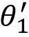 和  来计算目标中下一个状态-动作对的两个 Q 值，即  和 ，分别。让我们一步一步清楚地理解这一点。

在 DDPG 中，我们了解到目标值的计算方式是：


以这种方式计算目标中下一个状态-动作对的 Q 值会产生高估偏差：


因此，为了避免这种情况，在 TD3 中，首先，我们使用第一个目标评论网络计算下一个状态-动作对的 Q 值，使用的参数为 ，即 ，然后我们使用第二个目标评论网络计算下一个状态-动作对的 Q 值，使用的参数为 ，即 。然后，我们使用这两个 Q 值的最小值来计算目标值，如下所示：


其中动作为 。

我们可以简单地表示前面的方程为：


其中动作为 。

以这种方式计算目标值可以防止下一个状态-动作对的 Q 值被高估。

好的，我们计算了目标值。我们如何计算损失并更新评论网络参数？我们了解到我们使用两个主评论网络，因此，首先，我们计算第一个主评论网络的损失，使用参数 ：


计算损失后，我们计算梯度，并使用梯度下降法以 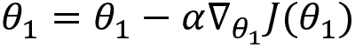 更新参数 。

接下来，我们计算第二个主评论网络的损失，使用的参数为 ：


计算损失后，我们计算梯度，并使用梯度下降法以 更新参数 。

我们可以简单地表示前面的更新为：


在更新了两个主评论网络参数后，和，我们可以通过软替换来更新两个目标评论网络的参数， 和 ，如图所示：


我们可以简单地表示前面的更新为：


### 延迟策略更新

延迟策略更新意味着我们更新演员网络（策略网络）的参数频率低于评论员网络的参数更新频率。但为什么我们要这样做呢？我们了解到，在 DDPG 中，演员和评论员网络的参数在每个回合的每一步都会更新。

当评论员网络的参数不好时，它估计的 Q 值就是错误的。如果评论员网络估计的 Q 值不正确，那么演员网络就无法正确地更新它的参数。也就是说，我们了解到，演员网络是根据评论员网络的反馈来学习的。这个反馈就是 Q 值。当评论员网络提供错误的反馈（错误的 Q 值）时，演员网络就无法学习到正确的动作，也无法正确更新它的参数。

因此，为了避免这种情况，我们暂时不更新演员网络的参数，而是只更新评论员网络，以使评论员估计正确的 Q 值。也就是说，我们在每个回合的每一步都更新评论员网络的参数，而延迟更新演员网络的参数，仅在回合中的某些特定步骤进行更新，因为我们不希望演员从错误的评论员反馈中学习。

简而言之，评论员网络的参数在每个回合的每一步都会更新，但演员网络的参数更新是延迟的。我们通常将更新延迟两步。

好的，在 DDPG 中，我们学到演员网络（策略网络）的目标是最大化 Q 值：


演员网络的前述目标在 TD3 中也是相同的。也就是说，类似于 DDPG，这里的演员目标是生成动作，使其最大化由评论员生成的 Q 值。但等等！与 DDPG 不同的是，这里我们有两个 Q 值，和，因为我们使用了两个评论员网络，参数分别为和。那么，我们的演员网络应该最大化哪个 Q 值呢？是还是？我们可以选择其中一个进行最大化。所以，我们可以选择。

因此，在 TD3 中，演员网络的目标是最大化 Q 值，，如下所示：


请记住，在上面的方程中，动作`a`是由演员网络选择的，。为了最大化目标函数，我们计算目标函数的梯度，，并使用梯度上升法更新网络的参数：


现在，我们不再在每个时间步更新演员网络的参数，而是延迟更新，只在每隔一个步骤（即每两个步骤）更新一次参数。设 `t` 为该回合的时间步，`d` 为我们希望延迟更新的时间步数（通常 `d` 设置为 2）；那么我们可以写出如下公式：

1.  如果 `t` mod `d` = 0，则：

    1.  计算目标函数的梯度 

    1.  使用梯度上升法更新演员网络参数 

当我们查看最终算法时，这一点会更加清晰。

### 目标策略平滑

为了理解这一点，让我们先回顾一下在 TD3 中如何计算目标值。我们了解到，在 TD3 中，我们使用剪切双 Q 学习和两个目标评估网络来更新目标值：


其中，动作为 。

正如我们所注意到的，我们使用目标演员网络生成的动作  来计算目标值，。我们并不直接使用目标演员网络给出的动作，而是向该动作添加一些噪声 ，然后将动作修改为 ，如下所示：


在这里，−`c` 到 +`c` 表示噪声被剪切，从而使目标保持接近实际的动作。因此，我们现在的目标值计算变为：


在上面的公式中，动作为 。

那么我们为什么要这样做呢？为什么需要给动作添加噪声，并用它来计算目标值呢？相似的动作应该具有相似的目标值，对吧？然而，DDPG 方法即使对于相似的动作，也会产生高方差的目标值。这是因为确定性策略会对价值估计中的尖锐峰值产生过拟合。因此，我们可以通过添加一些噪声来平滑这些相似动作的峰值。如此一来，目标策略平滑基本上充当了一个正则化器，并减少了目标值的方差。

现在我们已经理解了 TD3 算法的关键特性，让我们通过将所有概念结合起来，进一步澄清到目前为止学到的内容以及 TD3 算法是如何工作的。

## 将这些内容整合起来

首先，让我们回顾一下符号，以更好地理解 TD3。我们使用六个网络——四个评估网络和两个演员网络：

+   两个主要的评估网络参数用  和  表示。

+   两个目标评估网络参数用  和  表示。

+   主要演员网络参数用  表示。

+   目标演员网络参数用  表示。

TD3 是一种演员-评论者方法，因此 TD3 的参数将在每一轮的每一步进行更新，这与策略梯度方法不同，后者需要生成完整的回合，然后再更新参数。现在，让我们开始并了解 TD3 是如何工作的。

首先，我们初始化两个主要评论者网络参数， 和 ，以及主要演员网络参数 ，并赋予随机值。我们知道目标网络参数只是主网络参数的副本。所以，我们通过复制  和  来初始化两个目标评论者网络参数  和 ，同样，我们通过复制主要演员网络参数  来初始化目标演员网络参数 。我们还初始化回放缓冲区 。

现在，在每一轮中，首先，我们使用演员网络选择一个动作`a`：


但是，为了确保探索，我们不直接使用动作`a`，而是添加一些噪声 ，其中 。因此，我们的动作现在变为：

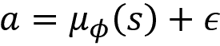

然后，我们执行动作`a`，移动到下一个状态 ，并获得奖励`r`。我们将这个转移信息存储在回放缓冲区中 。

接下来，我们从回放缓冲区随机抽取一个`K`个转移(`s`，`a`，`r`，*s'*)的小批量。这些`K`个转移将用于更新评论者和演员网络。

首先，我们来计算评论者网络的损失。我们已经知道评论者网络的损失函数是：


在前面的方程中，以下内容适用：

+   动作`a[i]` 是由演员网络产生的动作，即 

+   `y[i]` 是评论者的目标值，即 ，而动作  是目标演员网络产生的动作，即 ，其中 

在计算完评论者网络的损失后，我们计算梯度  并使用梯度下降法更新评论者网络的参数：


现在，让我们更新演员网络。我们已经知道，演员网络的目标函数是：


请注意，在上述方程中，我们仅使用来自采样的`K`个转移(`s`，`a`，`r`，*s'*)的状态 (`s[i]`)。动作`a` 是由演员网络选择的，。为了最大化目标函数，我们计算目标函数  的梯度，并使用梯度上升法更新网络的参数：


我们不是在每个回合的每个时间步都更新演员网络的参数，而是延迟更新。让 `t` 表示回合的时间步，`d` 表示我们希望延迟更新的时间步数（通常 `d` 设置为 2）；那么我们可以写出如下公式：

1.  如果 `t` mod `d` = 0，则：

    1.  计算目标函数的梯度 

    1.  使用梯度上升法更新演员网络参数 。

最后，我们通过软替换更新目标评论员网络的参数  和 ，以及目标演员网络的参数 ：


更新目标网络参数时有一个小的变化。就像我们延迟更新演员网络参数 `d` 步骤一样，我们每 `d` 步骤更新目标网络参数；因此，我们可以写出如下公式：

1.  如果 `t` mod `d` = 0，则：

    1.  计算目标函数的梯度 ，并使用梯度上升法更新演员网络的参数 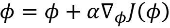。

    1.  更新目标评论员网络参数和目标演员网络参数，分别为  和 。

我们重复上述步骤若干回合，并改进策略。为了更好地理解 TD3 如何工作，让我们在下一节深入研究 TD3 算法。

## 算法 – TD3

TD3 算法与 DDPG 算法完全相似，除了它包含了我们在前面部分学习的三个关键特性。所以，在直接查看 TD3 算法之前，您可以复习一下 TD3 的所有关键特性。

TD3 算法如下所示：

1.  初始化两个主评论员网络参数  和 ，以及主演员网络的参数 。

1.  通过复制主评论员网络参数  和 ，初始化两个目标评论员网络参数  和 。

1.  通过复制主演员网络参数 ，初始化目标演员网络的参数 。

1.  初始化回放缓冲区 

1.  对于 `N` 个回合，重复第 6 步。

1.  对于回合中的每个步骤，即 `t` = 0,…,`T` – 1：

    1.  基于策略  和探索噪声  选择动作 `a`，即 ，其中，

    1.  执行选定的动作 `a`，移动到下一个状态 ，获得奖励 `r`，并将转换信息存储到回放缓冲区 。

    1.  从回放缓冲区  随机抽取一个 `K` 的小批量转换。

    1.  选择动作  来计算目标值，，其中 

    1.  计算评论家的目标值，即 

    1.  计算评论家网络的损失，

    1.  计算损失的梯度 ，并使用梯度下降法最小化损失，

    1.  如果 `t` mod `d` =0，则：

        1.  计算目标函数的梯度 ，并使用梯度上升法更新演员网络参数，

        1.  更新目标评论家网络参数和目标演员网络参数，分别为  和 

现在我们已经了解了 TD3 的工作原理，在接下来的章节中，我们将学习另一个有趣的算法，叫做 SAC。

# Soft Actor-Critic

现在，我们将研究另一个有趣的演员-评论家算法，叫做 SAC。这是一个离策略算法，它借用了 TD3 算法的几个特性。但与 TD3 不同的是，它使用了一个随机策略 。SAC 基于熵的概念。那么首先，让我们理解一下什么是熵。熵是衡量变量随机性的一个指标。它基本上告诉我们随机变量的不确定性或不可预测性，表示为 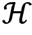。

如果随机变量每次都给出相同的值，那么我们可以说它的熵是低的，因为没有随机性。但是如果随机变量给出不同的值，那么我们可以说它的熵是高的。

例如，考虑一个掷骰子的实验。每次掷骰子时，如果我们得到一个不同的数字，那么我们可以说熵是高的，因为每次我们得到的数字都不同，且有较大的不确定性，因为我们不知道下一次掷骰子会出现哪个数字。但如果每次掷骰子得到的数字都是相同的，例如 3，那么我们可以说熵是低的，因为这里没有随机性，我们每次掷骰子都得到相同的数字。

我们知道策略  指定了在给定状态下执行的动作。当策略的熵  高或低时会发生什么？如果策略的熵高，意味着我们的策略会执行不同的动作，而不是每次都执行相同的动作。但如果策略的熵低，那么这意味着我们的策略每次都执行相同的动作。正如你可能已经猜到的，增加策略的熵有助于探索，而减少策略的熵意味着减少探索。

我们知道，在强化学习中，我们的目标是最大化回报。因此，我们可以定义我们的目标函数，如下所示：

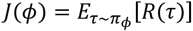

其中  是我们随机策略  的参数。

我们知道，轨迹的回报就是奖励的总和，即：


所以，我们可以通过展开回报来重写我们的目标函数：


最大化前述目标函数即是最大化回报。在 SAC 方法中，我们使用稍微修改过的带有熵项的目标函数，如下所示：


如我们所见，我们的目标函数现在有两个项，一个是奖励，另一个是策略的熵。因此，我们不仅仅最大化奖励，还最大化策略的熵。那么这么做的意义是什么呢？最大化策略的熵使我们能够探索新的行动。但我们不希望探索那些给我们带来不良奖励的行动。因此，最大化熵和奖励的结合意味着我们可以在保持最大奖励的同时，探索新的行动。前述目标函数通常被称为**最大熵强化学习**，或**熵正则化强化学习**。增加熵项也常常被称为熵奖励。

此外，目标函数中的项叫做温度，用来设置熵项的重要性，或者我们可以说它用于控制探索。当较高时，我们允许策略中的探索，但当它较低时，则不允许探索。

好的，现在我们对 SAC 有了一个基本了解，接下来我们将深入一些细节。

## 理解软演员-评论家方法

SAC，顾名思义，是一种类似于我们在前面章节中学习的 DDPG 和 TD3 的演员-评论家方法。与使用确定性策略的 DDPG 和 TD3 不同，SAC 使用的是随机策略。SAC 的工作方式与 TD3 非常相似。我们学到，在演员-评论家架构中，演员使用策略梯度来寻找最优策略，评论家则使用 Q 函数来评估演员产生的策略。

同样地，在 SAC 中，演员使用策略梯度来找到最优策略，评论家则评估演员产生的策略。然而，评论家不仅使用 Q 函数来评估演员的策略，还同时使用 Q 函数和价值函数。那么，为什么我们需要 Q 函数和价值函数来共同评估演员的策略呢？这一点将在接下来的章节中详细解释。

在 SAC 中，我们有三个网络，一个是演员网络（策略网络）用来寻找最优策略，另外两个是评论家网络——价值网络和 Q 网络，分别用来计算价值函数和 Q 函数，以评估演员产生的策略。

在继续之前，让我们看看带有熵项的价值函数和 Q 函数的修改版本。

### 带有熵项的 V 和 Q 函数

我们知道，价值函数（状态值）是从状态`s`开始，遵循策略！[](img/B15558_03_008.png)的轨迹的期望回报：


我们了解到，回报是轨迹奖励的总和，因此我们可以通过扩展回报来重写前述方程：


现在，我们可以通过添加熵项来重写价值函数，如下所示：


我们知道，Q 函数（状态-动作值）是从状态`s`和动作`a`开始，遵循策略！[](img/B15558_03_140.png)的轨迹的期望回报：


扩展轨迹的回报，我们可以写出以下公式：


现在，我们可以通过添加熵项来重写 Q 函数，如下所示：


带有熵项的前述 Q 函数的修改版贝尔曼方程给出如下：


在这里，价值函数可以通过 Q 函数与价值函数之间的关系计算得到，如下所示：


要了解我们是如何精确得出公式（2）和（3）的，可以查看论文《Soft Actor-Critic: Off-Policy Maximum Entropy Deep Reinforcement Learning with a Stochastic Actor》中关于软策略迭代的推导，作者为 Tuomas Haarnoja 等人：[`arxiv.org/pdf/1801.01290.pdf`](https://arxiv.org/pdf/1801.01290.pdf)

## SAC 的组成部分

现在我们对 SAC 有了基本了解，让我们更详细地探讨并分别了解 SAC 中每个组件是如何工作的。

### 评论网络

我们了解到，与之前看到的其他演员-评论家方法不同，SAC 中的评论家同时使用价值函数和 Q 函数来评估演员网络产生的策略。但为什么会这样呢？

在之前的算法中，我们使用评论网络来计算 Q 函数，以评估演员产生的动作。此外，评论网络中的目标 Q 值是通过贝尔曼方程计算的。我们在这里也可以这样做。然而，由于熵项的存在，这里我们对 Q 函数的贝尔曼方程进行了修改，正如我们在公式（2）中学到的那样：

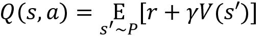

从前述方程中，我们可以观察到，为了计算 Q 函数，我们首先需要计算价值函数。因此，我们需要计算 Q 函数和价值函数，以便评估演员产生的策略。我们可以使用单个网络来逼近 Q 函数和价值函数。然而，我们并没有使用一个网络，而是使用了两个不同的网络，一个 Q 网络用来估计 Q 函数，另一个价值网络用来估计价值函数。使用两个不同的网络来计算 Q 函数和价值函数有助于稳定训练。

如 SAC 论文中所述，"*原则上不需要为状态值包含一个独立的函数逼近器（神经网络），因为它根据方程(2)与 Q 函数和策略相关。但在实际操作中，包含一个独立的函数逼近器（神经网络）来处理状态值可以稳定训练，并且便于与其他网络同时训练*。"

首先，我们将学习价值网络是如何工作的，然后再学习 Q 网络。

#### 价值网络

价值网络用`V`表示，价值网络的参数用表示，目标价值网络的参数用表示。

因此，表示我们通过神经网络（由表示）来逼近价值函数（状态值）。好的，如何训练价值网络呢？我们可以通过最小化目标状态值与我们网络预测的状态值之间的损失来训练网络。我们如何得到目标状态值？我们可以使用方程（3）给出的价值函数来计算目标状态值。

我们学到，根据方程（3），状态值是通过以下方式计算的：


在前面的方程中，我们可以去掉期望值。我们将通过从重放缓冲区中采样`K`个转移来逼近期望值。因此，我们可以使用前面的方程计算目标状态值`y[v]`：


如果我们看一下前面的方程，我们有一个 Q 函数。为了计算 Q 函数，我们使用一个 Q 网络，参数由表示，类似地，我们的策略由表示，因此我们可以将前面的方程用参数化的 Q 函数和策略重新写出，如下所示：


但是，如果我们使用前面的方程来计算目标值，Q 值将会高估。因此，为了避免这种高估，我们使用裁剪的双 Q 学习，就像我们在 TD3 中学到的一样。也就是说，我们通过两个 Q 网络来计算两个 Q 值，这两个 Q 网络的参数分别由和表示，并取这两个值的最小值，如下所示：


如我们在前面的方程中所观察到的，对于裁剪的双 Q 学习，我们使用了两个主要的 Q 网络，这两个 Q 网络的参数分别由和表示，而在 TD3 中，我们使用了两个目标 Q 网络，这两个目标 Q 网络的参数分别由和表示。为什么会这样呢？

因为这里我们正在计算状态动作对  的 Q 值，所以我们可以使用由  和  参数化的两个主要 Q 网络，但在 TD3 中，我们计算下一个状态动作对的 Q 值 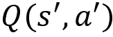，所以我们使用由  和  参数化的两个目标 Q 网络。因此，在这里，我们不需要目标 Q 网络。

我们可以简单地表达上述方程为：


现在，我们可以定义我们的值网络的目标函数  为目标状态值与我们的网络预测的状态值之间的均方差，如下所示：


其中 `K` 表示我们从重播缓冲区中抽样的转换数。

我们可以计算我们的目标函数的梯度，然后更新我们的主值网络参数  如下：


注意，我们使用 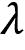 表示学习率，因为我们已经使用  表示温度。

我们可以使用软替换来更新目标值网络的参数 ：


下一节我们将学习目标值网络的确切应用位置。

#### Q 网络

Q 网络由`Q`表示，并且其参数为 。因此， 意味着我们使用由  参数化的神经网络来近似 Q 函数。我们如何训练 Q 网络呢？我们可以通过最小化目标 Q 值与网络预测的 Q 值之间的损失来训练网络。我们如何获取目标 Q 值呢？这就是我们使用贝尔曼方程的地方。

我们了解到根据贝尔曼方程（2），可以计算 Q 值如下：


我们可以通过抽样 `K` 个转换从重播缓冲区中近似期望。因此，我们可以使用上述方程计算目标 Q 值 `y[q]`。


如果我们看一下上述方程，我们有一个下一个状态的值 。为了计算下一个状态的值 ，我们使用由  参数化的目标值网络，因此我们可以用参数化值函数重写上述方程，如下所示：


现在，我们可以定义我们 Q 网络的目标函数  为目标 Q 值与网络预测的 Q 值之间的均方差，如下所示：


其中 `K` 表示我们从重播缓冲区中抽样的转换数。

在上一节中，我们学习了如何使用由  和  参数化的两个 Q 网络来防止过估计偏差。因此，首先，我们计算由  参数化的第一个 Q 网络的损失：


然后，我们计算梯度并使用梯度下降法更新参数 ，如  所示。

接下来，我们计算由  参数化的第二个 Q 网络的损失：


然后，我们计算梯度并使用梯度下降法更新参数 ，如  所示。

我们可以简单地将上述更新表示为：


### 演员网络

演员网络（策略网络）由  参数化。让我们回顾一下我们在 TD3 中学到的演员网络的目标函数：


其中 `a` 是由演员产生的动作。

上述目标函数意味着，演员的目标是生成一种动作，使其最大化由评论员计算的 Q 值。

SAC 中的演员网络的目标函数与我们在 TD3 中学到的相同，不同之处在于，这里我们使用了一个随机策略 ，同时，我们还最大化了熵。因此，我们可以将 SAC 中演员网络的目标函数写成：


现在，我们如何计算上述目标函数的导数呢？因为与 TD3 不同，在这里，我们的动作是使用随机策略计算的。应用反向传播并计算使用随机策略计算的动作的目标函数梯度将会很困难。因此，我们使用了重参数化技巧。重参数化技巧保证了从我们的策略中采样是可微的。因此，我们可以将我们的动作重新写为如下所示：


在上述方程中，我们可以观察到，我们用神经网络 `f` 参数化策略，并且  是从球形高斯分布中采样的噪声。

因此，我们可以将目标函数重新写为如下所示：


请注意，在上述方程中，我们的动作是 。记得我们是如何使用由 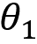 和  参数化的两个 Q 函数来避免过估计偏差的吗？现在，在上述目标函数中，我们应该使用哪个 Q 函数？我们可以使用任一函数，因此我们使用由  参数化的 Q 函数，并将最终目标函数写为：


现在我们已经理解了 SAC 算法的工作原理，让我们回顾一下迄今为止所学的内容，并通过将所有概念结合起来，准确地了解 SAC 算法是如何工作的。

## 将所有内容结合起来

首先，让我们回顾一下符号，以便更好地理解 SAC。我们使用五个网络——四个评论员网络（两个值网络和两个 Q 网络）和一个演员网络：

+   主要值网络参数用  表示。

+   目标值网络参数用  表示。

+   两个主要 Q 网络参数分别用  和  表示。

+   演员网络（策略网络）参数用  表示。

+   目标状态值用 `y[v]` 表示，目标 Q 值用 `y[q]` 表示。

SAC 是一种演员-评论员方法，因此 SAC 的参数会在每个回合的每一步进行更新。现在，让我们开始并了解 SAC 是如何工作的。

首先，我们初始化值网络的主要网络参数 ，两个 Q 网络参数  和 ，以及演员网络参数 。接下来，我们通过复制主要网络参数  来初始化目标值网络参数 ，然后初始化回放缓冲区 。

现在，对于回合中的每一步，首先，我们使用演员网络选择一个动作 `a`：


然后，我们执行动作 `a`，移动到下一个状态 ，并获得奖励 `r`。我们将这个转移信息存储在回放缓冲区  中。

接下来，我们从回放缓冲区随机抽取一个 `K` 的小批量转移。这个 `K` 的转移（`s`，`a`，`r`，*s'*）用于更新我们的值、Q 和演员网络。

首先，让我们计算值网络的损失。我们已经知道值网络的损失函数是：


其中  是目标状态值，它表示为 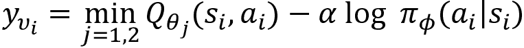。

计算损失后，我们计算梯度并使用梯度下降更新值网络的参数 ：。

现在，我们计算 Q 网络的损失。我们已经知道 Q 网络的损失函数是：

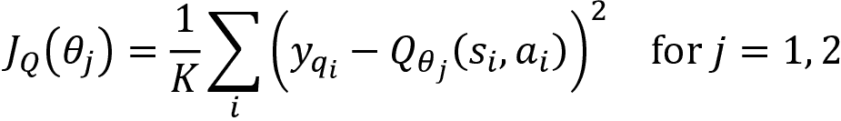

其中  是目标 Q 值，它表示为 。

计算损失后，我们计算梯度并使用梯度下降更新 Q 网络的参数：

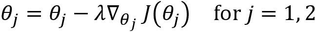

接下来，我们更新演员网络。我们已经知道演员网络的目标是：


现在，我们计算梯度并使用梯度上升更新演员网络的参数 ：


最后，我们通过软替换更新目标值网络参数，如下所示：


我们对前述步骤进行了多次迭代，并改进了策略。为了更好地理解 SAC 的工作原理，我们将在下一节深入探讨 SAC 算法。

## 算法 – SAC

SAC 算法如下所示：

1.  初始化主值网络参数，Q 网络参数 和，以及演员网络参数

1.  通过仅复制主值网络参数，初始化目标值网络

1.  初始化回放缓冲区

1.  对于`N`个回合，重复步骤 5

1.  对于回合中的每个步骤，即对于`t` = 0,…, `T` – 1:

    1.  根据策略选择一个动作`a`，即

    1.  执行选择的动作`a`，移动到下一个状态，获取奖励`r`，并将过渡信息存储到回放缓冲区

    1.  从回放缓冲区随机抽取一个大小为`K`的迷你批次过渡

    1.  计算目标状态值

    1.  计算值网络的损失，并使用梯度下降法更新参数，

    1.  计算目标 Q 值

    1.  计算 Q 网络的损失，并使用梯度下降法更新参数，

    1.  计算演员目标函数的梯度，，并使用梯度上升法更新参数，

    1.  更新目标值网络参数为

恭喜你学习了多个重要的最先进演员-评论家算法，包括 DDPG、双延迟 DDPG 和 SAC。在下一章中，我们将研究几个最先进的策略梯度算法。

# 总结

我们通过理解 DDPG 算法开始了本章的内容。我们了解到 DDPG 是一个演员-评论家算法，其中演员使用策略梯度估计策略，评论家使用 Q 函数评估演员产生的策略。我们还学习了 DDPG 如何使用确定性策略以及它如何应用于具有连续动作空间的环境。

后来，我们详细研究了 DDPG 的演员和评论家组件，理解了它们是如何工作的，然后最终学习了 DDPG 算法。

接下来，我们了解了双延迟 DDPG，它是 DDPG 的继任者，并对 DDPG 算法进行了改进。我们详细学习了 TD3 的关键特性，包括剪切双 Q 学习、延迟策略更新和目标策略平滑，最后，我们深入了解了 TD3 算法。

在本章末尾，我们学习了 SAC 算法。我们了解到，与 DDPG 和 TD3 不同，SAC 方法使用的是随机策略。我们还理解了 SAC 如何在目标函数中与熵奖励一起工作，并且我们了解了最大熵强化学习的含义。

在下一章，我们将学习最先进的策略梯度算法，如信任区域策略优化（TRPO）、近端策略优化（PPO）和使用克罗内克因子信任区域的演员-评论家方法。

# 问题

让我们将演员-评论家方法的知识付诸实践。试着回答以下问题：

1.  在 DDPG 中，演员和评论家网络的作用是什么？

1.  DDPG 中的评论家是如何工作的？

1.  TD3 的关键特性是什么？

1.  为什么我们需要剪切双重 Q 学习？

1.  什么是目标策略平滑？

1.  什么是最大熵强化学习？

1.  在 SAC 中，评论家网络的作用是什么？

# 进一步阅读

欲了解更多信息，请参阅以下文献：

+   **使用深度强化学习进行连续控制**，作者 *Timothy P. Lillicrap, 等人*, [`arxiv.org/pdf/1509.02971.pdf`](https://arxiv.org/pdf/1509.02971.pdf)

+   **演员-评论家方法中的函数逼近误差**，作者 *Scott Fujimoto, Herke van Hoof, David Meger,* [`arxiv.org/pdf/1802.09477.pdf`](https://arxiv.org/pdf/1802.09477.pdf)

+   **软演员-评论家：使用随机演员的离策略最大熵深度强化学习**，作者 *Tuomas Haarnoja, Aurick Zhou, Pieter Abbeel, Sergey Levine*, [`arxiv.org/pdf/1801.01290.pdf`](https://arxiv.org/pdf/1801.01290.pdf)
