# 第十三章：TRPO、PPO 和 ACKTR 方法

在本章中，我们将学习两种有趣的最先进的策略梯度算法：信任区域策略优化和近端策略优化。这两种算法都是对我们在*第十章*中学习的策略梯度算法（带基线的 REINFORCE）的改进，*策略梯度方法*。

我们通过了解**信任区域策略优化**（**TRPO**）方法及其如何作为策略梯度方法的改进来开始本章内容。随后，我们将理解理解 TRPO 所需的几个重要数学概念。接下来，我们将学习如何设计和求解 TRPO 目标函数。在本节结束时，我们将了解 TRPO 算法是如何一步步工作的。

接下来，我们将了解**近端策略优化**（**PPO**）。我们将详细了解 PPO 的工作原理以及它如何作为 TRPO 算法的改进。我们还将学习两种 PPO 算法，分别是 PPO-clipped 和 PPO-penalty。

在本章结束时，我们将学习一种有趣的演员-评论家方法，叫做**使用克罗内克因子信任区域的演员-评论家**（**ACKTR**）方法，该方法利用克罗内克分解来近似二阶导数。我们将探讨 ACKTR 是如何工作的，以及它如何在其更新规则中使用信任区域。

在本章中，我们将学习以下主题：

+   信任区域策略优化

+   设计 TRPO 目标函数

+   求解 TRPO 目标函数

+   近端策略优化

+   PPO 算法

+   使用克罗内克因子信任区域的演员-评论家

# 信任区域策略优化

TRPO 是深度强化学习中最常用的算法之一。TRPO 是一种策略梯度算法，它是对我们在*第十章*中学习的带基线的策略梯度方法的改进。我们了解到，策略梯度是一种在线方法，这意味着在每次迭代中，我们都会改进与生成轨迹所用的相同策略。在每次迭代中，我们更新网络的参数，并试图找到改进后的策略。更新网络参数  的更新规则如下：


其中  是梯度， 被称为步长或学习率。如果步长较大，则会有较大的策略更新，如果步长较小，则策略更新较小。我们如何找到最佳步长？在策略梯度方法中，我们保持步长较小，因此在每次迭代时，策略都会有小幅改进。

但是，如果我们在每次迭代中都迈出很大的一步会发生什么呢？假设我们有一个由  参数化的策略 。因此，在每次迭代中，更新  意味着我们在改进我们的策略。如果步长很大，那么每次迭代中的策略变化会很大，这意味着旧政策（上一迭代中使用的策略）和新政策（当前迭代中使用的策略）变化很大。由于我们使用的是参数化的策略，这意味着如果我们进行大规模的更新（大步长），则旧政策和新政策的参数变化会非常大，这会导致一个叫做模型崩溃的问题。

这就是为什么在策略梯度方法中，我们不是采取更大步骤来更新网络参数，而是采取小步伐并更新参数，以保持旧政策和新政策接近。但我们如何改进这个方法呢？

我们能否在保持旧政策和新政策接近的情况下，迈出更大的一步，从而不会影响我们的模型表现，并帮助我们快速学习？是的，这个问题通过 TRPO 得到了解决。

TRPO 尝试在施加约束的情况下进行大规模的策略更新，即旧政策和新政策不应变化太大。好的，这个约束是什么呢？但首先，我们如何衡量和理解旧政策和新政策的变化是否过大呢？这里我们使用了一种叫做**Kullback-Leibler**（**KL**）散度的度量。KL 散度在强化学习中无处不在。它告诉我们两个概率分布彼此之间的差异。因此，我们可以使用 KL 散度来理解旧政策和新政策是否变化过大。TRPO 增加了一个约束，要求旧政策和新政策之间的 KL 散度应小于或等于某个常数 。也就是说，当我们进行策略更新时，旧政策和新政策的变化应不超过某个常数。这个约束被称为信任区域约束。

因此，TRPO 尝试在施加约束的情况下进行大规模的策略更新，要求旧政策和新政策的参数应保持在信任区域内。请注意，在策略梯度方法中，我们使用的是参数化的策略。因此，保持旧政策和新政策的参数在信任区域内，意味着旧政策和新政策也在信任区域内。

TRPO 保证了策略的单调改进；也就是说，它保证在每次迭代中都会有策略改进。这是 TRPO 算法背后的基本思想。

为了理解 TRPO 是如何工作的，我们需要理解 TRPO 背后的数学。TRPO 包含了相当复杂的数学内容。但是别担心！只要我们理解了理解 TRPO 所需的基本数学概念，它就会变得简单。因此，在深入了解 TRPO 算法之前，我们首先会理解一些必备的数学概念。然后，我们将学习如何设计带有信任区域约束的 TRPO 目标函数，最后，我们将看看如何求解 TRPO 目标函数。

## 数学基础

在理解 TRPO 是如何工作的之前，我们首先会理解以下重要的数学概念：

+   泰勒级数

+   信任区域方法

+   共轭梯度方法

+   拉格朗日乘数

+   重要抽样

### 泰勒级数

泰勒级数是一个无限项的级数，用于逼近一个函数。假设我们有一个以 `x` = `a` 为中心的函数 `f`(`x`)；我们可以使用一个无限的多项式项和来进行逼近，如下所示：


前面的方程可以用 sigma 符号表示为：


所以，对于泰勒级数中的每一项，我们计算 `n`^(次) 导数，将它们除以 `n`!，并乘以 (`x` – `a`)^n。

让我们通过一个例子来理解泰勒级数是如何逼近一个函数的。假设我们有一个指数函数 `e`^x，如图 *13.1* 所示：

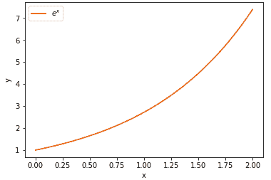

图 13.1：指数函数

我们能否使用泰勒级数逼近指数函数 `e`^x？我们知道，泰勒级数给出的是：


这里，我们要逼近的函数 `f`(`x`) 是 `e`^x，也就是说：


假设我们的函数 `f`(`x`) = `e`^x 以 `x` = `a` 为中心，首先我们来计算该函数的前三阶导数。指数函数的导数就是函数本身，所以我们可以写成：


将前面的项代入方程（1），我们可以写成：


假设 `a` = 0；那么我们的方程变为：


我们知道 `e`⁰ = 1；因此，指数函数的泰勒级数表示为：


这意味着右侧项的和可以逼近指数函数 `e`^x。让我们通过一个图形来理解这一点。我们只取泰勒级数（方程 2）中的 0^(次) 导数项，也就是 `e`^x = 1，并绘制它们：


图 13.2：泰勒级数逼近至 0^(次) 导数

从前面的图中可以看出，仅取 0^(次) 导数，我们与实际的 `e`^x 函数相差甚远。也就是说，我们的逼近效果不好。那么，接下来我们取泰勒级数（方程 2）中的 1^(次) 导数项，即 `e`^x = 1 + `x`，并绘制它们：


图 13.3：泰勒级数近似到一阶导数

从前面的图中我们可以观察到，将泰勒级数展开到一阶导数能够使我们更接近实际的函数`e`^x。所以，让我们取泰勒级数展开到二阶导数的项（方程 2），即 ，并绘制它们。从以下图中我们可以观察到，我们的近似值变得更好，且更加接近实际的函数`e`^x：


图 13.4：泰勒级数近似到二阶导数

现在，让我们取泰勒级数到三阶导数的项，即 ，并绘制它们：


图 13.5：泰勒级数近似到三阶导数

通过查看前面的图表，我们可以理解，加入三阶导数项的泰勒级数后，我们的近似值明显提高。正如你可能猜到的，加入更多的泰勒级数项使得我们对`e`^x 的近似更加准确。因此，使用泰勒级数，我们可以近似任何函数。

泰勒多项式到一阶被称为**线性近似**。在线性近似中，我们只计算泰勒级数到一阶导数。因此，函数`f`(`x`)在点`a`附近的线性近似（一阶）可以表示为：


我们可以用  来表示一阶导数，所以我们可以将  替换为 ，并将前面的方程重写为：


泰勒多项式到二阶被称为**二次近似**。在二次近似中，我们只计算泰勒级数到二阶导数。因此，函数`f`(`x`)在点`a`附近的二次近似（二阶）可以表示为：


我们可以用  来表示一阶导数，用  来表示二阶导数；因此，我们可以将  替换为 ，将 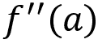 替换为 ，并将前面的方程重写为：


Hessian 是二阶导数，所以我们可以用 `H`(`a`) 来表示 ，并将前面的方程重写为：


因此，总结来说，函数`f`(`x`)的**线性近似**表示为：


函数`f`(`x`)的**二次近似**表示为：


### 信赖域方法

假设我们有一个函数 `f`(`x`)，并且我们需要找到该函数的最小值。假设找出 `f`(`x`) 的最小值是困难的。那么，我们可以做的是使用泰勒级数来近似给定函数 `f`(`x`)，并尝试通过近似函数来寻找最小值。我们可以用  来表示近似函数。

假设我们使用二次近似法，我们了解到，在二次近似法中，我们只计算泰勒级数的二阶导数。因此，给定函数 `f`(`x`) 在区域 `a` 周围的二次近似（第二阶）可以表示为：


所以，我们可以直接使用近似函数  来计算最小值。但等等！如果我们的近似函数  在某一点（例如 `a`）上不准确，而 `a` 是最优解，那么我们就会错过找到最优值的机会。

因此，我们将引入一个新的约束，称为信任区域约束。信任区域意味着我们的实际函数 `f`(`x`) 和近似函数  之间接近的区域。因此，我们可以说，如果我们的近似函数  在信任区域内，我们的近似将是准确的。

例如，如图 13.6 所示，我们的近似函数  在信任区域内，因此我们的近似将是准确的，因为近似函数  更接近实际函数 `f`(`x`)：


图 13.6：近似函数在信任区域内

但当  不在信任区域内时，我们的近似将不准确，因为近似函数  与实际函数 `f`(`x`) 相距较远：


图 13.7：近似函数不在信任区域内

因此，我们需要确保我们的近似函数保持在信任区域内，这样它就会接近实际函数。

### 共轭梯度法

共轭梯度法是一种迭代方法，用于求解线性方程组。它也用于求解优化问题。当系统形式为以下时，使用共轭梯度法：


其中，`A` 是正定的、方形的对称矩阵，`x` 是我们要找的向量，`b` 是已知向量。我们考虑以下二次函数：


当`A`是正半定矩阵时；找到该函数的最小值等同于求解系统*Ax* = `b`。与梯度下降法一样，共轭梯度下降法也试图找到函数的最小值；然而，共轭梯度下降法的搜索方向将与梯度下降法不同，而且共轭梯度下降法在`N`次迭代中达到收敛。让我们通过等高线图来理解共轭梯度下降法与梯度下降法的区别。

首先，让我们看看梯度下降法的等高线图。正如我们在下图中看到的那样，为了找到一个函数的最小值，梯度下降法需要多次搜索方向，最终形成一个锯齿形的方向模式：


图 13.8：梯度下降法的等高线图

与梯度下降法不同，在共轭梯度下降法中，搜索方向与前一个搜索方向是正交的，如*图 13.9*所示：


图 13.9：共轭梯度下降法的等高线图

因此，使用共轭梯度下降法，我们可以求解形如*Ax* = `b`的系统。

### 拉格朗日乘子

假设我们有一个函数`f`(`x`) = `x`²：我们如何找到该函数的最小值？我们可以通过找到梯度为零的点来找到该函数的最小值。函数`f`(`x`) = `x`²的梯度为：


当`x` = 0 时，函数的梯度为零；即，当`x` = 0 时，。因此，我们可以说，函数`f`(`x`) = `x`²的最小值出现在`x` = 0 处。我们刚才看到的问题称为无约束优化问题。

考虑一个有约束的情况——假设我们需要最小化函数`f`(`x`)，同时满足约束`g`(`x`) = 1，如下所示：


那么，我们该如何解决这个问题呢？也就是说，我们如何在满足约束`g`(`x`)的情况下找到函数`f`(`x`)的最小值？当目标函数`f`(`x`)的梯度和约束`g`(`x`)的梯度指向相同方向时，我们可以找到最小值。也就是说，当`f`(`x`)的梯度和`g`(`x`)的梯度平行或反平行时，我们可以找到最小值：


尽管`f`(`x`)和`g`(`x`)的梯度方向相同，但它们的大小并不相同。因此，我们将把`g`(`x`)的梯度乘以一个叫做的变量，如下所示：


其中被称为拉格朗日乘子。因此，我们可以将前面的方程重新写为：


解前面的方程意味着我们需要找到函数`f`(`x`)的最小值，同时满足约束`g`(`x`)。因此，我们可以将目标函数重新写为：


前述函数的梯度为：


当 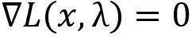 时，我们可以找到最小值。拉格朗日乘子被广泛用于求解约束优化问题。

让我们通过另一个例子来理解这一点。假设我们想要求解函数  的最小值，同时满足约束 ，如下所示：


我们可以将目标函数重写为带有拉格朗日乘子的约束形式：


通过求解 ，我们可以找到函数  的最小值，同时满足约束条件 。

### 重要性采样

让我们回顾一下我们在 *第四章*，*蒙特卡罗方法* 中学到的 重要性采样方法。假设我们想计算函数 `f`(`x`) 的期望，其中 `x` 的值是从分布 `p`(`x`) 中采样的，也就是说，；我们可以写为：


我们能否近似函数 `f`(`x`) 的期望？我们已经学到，使用蒙特卡罗方法时，可以通过如下方式近似期望：


也就是说，使用蒙特卡罗方法时，我们从分布 `p`(`x`) 中采样 `x` 进行 `N` 次，并计算 *f(x)* 的平均值来近似期望。

我们不仅可以使用蒙特卡罗方法，还可以使用重要性采样来近似期望。在重要性采样方法中，我们使用不同的分布 `q`(`x`) 来估计期望；也就是说，代替从 `p`(`x`) 中采样 `x`，我们使用不同的分布 `q`(`x`)：


该比率  被称为重要性采样比率或重要性修正。

现在我们已经理解了几个重要的数学先决条件，接下来我们将学习 TRPO 算法是如何工作的。

## 设计 TRPO 目标函数

在本章开始时，我们学到 TRPO 试图在施加约束的同时进行大幅度的策略更新，要求旧策略和新策略的参数保持在信任区域内。在本节中，我们将学习如何设计 TRPO 目标函数以及信任区域约束，以确保旧策略和新策略之间不会有太大差异。

本节内容可能比较复杂且是可选的。如果你对数学不感兴趣，可以直接跳转到 *求解 TRPO 目标函数* 这一节，在那里我们将一步步学习如何求解 TRPO 目标函数。

假设我们有一个策略 ；我们可以表示遵循该策略  的期望折扣回报  如下：


我们知道，在策略梯度方法中，每次迭代时，我们都在不断改进策略 。假设我们更新了旧策略 ，并得到了一个新策略 ；那么，我们可以将新策略  下的期望折扣回报  表示为相对于旧策略  的优势，如下所示：


正如我们从前面的方程中可以注意到的，遵循新政策的期望回报 ，也就是 ，仅仅是遵循旧政策的期望回报 ，也就是 ，以及旧政策的期望折扣优势  的总和。也就是说：

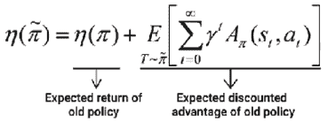

但是，为什么我们要使用旧政策的优势呢？因为我们是在衡量新政策  相对于旧政策  的平均表现有多好。

我们可以简化方程（2），并将时间步的求和替换为状态和动作的求和，如下所示：


其中  是新政策的折扣访问频率。我们已经学过，新政策的期望回报  是通过将旧政策的期望回报  和旧政策的优势  相加得到的。

在前面的方程（3）中，如果优势  始终为正，那么这意味着我们的政策在改进，并且我们有更好的 。也就是说，如果优势  始终为 ，那么我们将始终在我们的政策中看到改进。

然而，方程（3）很难优化，因此我们用局部近似值  来逼近 ：


如你所注意到的，与方程（3）不同，在方程（4）中，我们使用  而不是 。也就是说，我们使用旧政策的折扣访问频率 ，而不是新政策的折扣访问频率 。但为什么我们要这么做呢？因为我们已经有了从旧政策采样的轨迹，所以比起新政策，获取  更容易。

替代函数是目标函数的近似函数；因此，我们可以称  为替代函数，因为它是我们目标函数  的局部近似。

因此， 是我们目标函数  的局部近似。我们需要确保我们的局部近似是准确的。还记得在*信任区域方法*部分，我们学习到如果函数的局部近似在信任区域内，它将是准确的吗？因此，如果我们的局部近似  在信任区域内，它将是准确的。因此，在更新  的值时，我们需要确保它仍然保持在信任区域内；也就是说，策略更新应保持在信任区域内。

所以，当我们将旧策略  更新为新策略  时，我们只需确保新的策略更新保持在信任区域内。为了做到这一点，我们必须衡量新策略与旧策略之间的距离，因此，我们使用 KL 散度来衡量这一点：


因此，在更新策略时，我们检查策略更新之间的 KL 散度，并确保我们的策略更新保持在信任区域内。为了满足这一 KL 约束，Kakade 和 Langford 提出了一个新的策略更新方案，称为保守策略迭代，并推导出了以下下界：

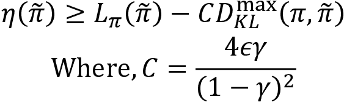

如我们所观察到的，在前面的方程中，我们将 KL 散度作为惩罚项，`C` 是惩罚系数。

现在，我们的代理目标函数 (4) 以及惩罚的 KL 项被写为：


最大化代理函数  可以改进我们的真实目标函数 ，并保证策略的单调改进。前面的目标函数被称为 **KL 惩罚目标**。

### 策略的参数化

我们了解到，最大化代理目标函数可以最大化我们的真实目标函数。我们知道在策略梯度方法中，我们使用参数化策略；也就是说，我们使用像神经网络这样的函数逼近器，该网络通过某些参数  进行参数化，并学习最优策略。

我们用  对旧策略进行参数化，表示为 ，用  对新策略进行参数化，表示为 。因此，我们可以将我们的方程 (5) 用参数化策略重新写成如下形式：


如前面的方程所示，我们使用旧策略与新策略之间的最大 KL 散度，即 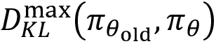。使用最大 KL 项优化目标是困难的，因此我们可以取平均 KL 散度 ，并将代理目标函数重写为：


上述目标函数的问题在于，当我们将惩罚系数 `C` 的值替换为  时，会减少步长，这使得我们需要花费很多时间才能达到收敛。

因此，我们可以将代理目标函数重新定义为一个约束目标函数，如下所示：


上述方程意味着我们在最大化代理目标函数  的同时，保持约束条件，即旧策略  和新策略 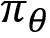 之间的 KL 散度小于等于常数 ，并确保我们的旧策略和新策略不会发生太大变化。上述目标函数称为 **KL 约束目标**。

### 基于样本的估计

在前面的部分中，我们学习了如何将目标函数框架设置为带有参数化策略的 KL 约束目标。在本节中，我们将学习如何简化我们的目标函数。

我们了解到我们的 KL 约束目标函数如下所示：


从方程（4）开始，在前面的方程中将  替换为 ，我们可以写成：


现在我们将看到如何通过使用采样来去除两个求和项，从而简化方程（9）。

第一个求和项 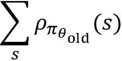 表示状态访问频率的求和；我们可以通过从状态访问中采样状态来替换它，记为 。然后，我们的方程变为：


接下来，我们将通过重要性采样估计器替换求和操作！[](img/B15558_13_142.png)。设 `q` 为采样分布，`a` 从 `q` 中采样，即 。然后，我们可以将前面的方程重写为：


将采样分布 `q` 替换为 ，我们可以写成：


因此，我们的方程（9）变为：

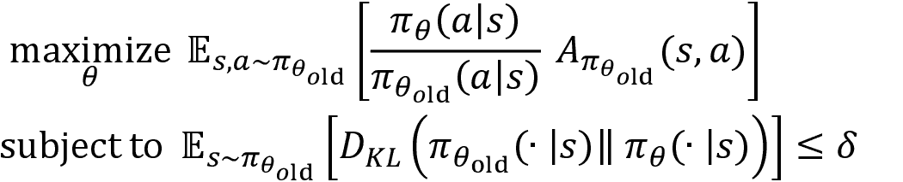

在下一部分，我们将学习如何求解前面的目标函数，以找到最优策略。

## 求解 TRPO 目标函数

在前一节中，我们学习了 TRPO 目标函数的表示：


上述方程意味着我们尝试找到一个策略，使其在满足旧策略和新策略之间的 KL 散度小于等于  的约束条件下，能够提供最大的回报。这个 KL 约束确保我们的新策略不会离旧策略太远。

为了简化符号表示，我们用  表示我们的目标函数，用  表示 KL 约束，并将前面的方程重写为：


通过最大化我们的目标函数 ，我们可以找到最优策略。我们可以通过计算相对于  的梯度，并使用梯度上升法更新参数，从而最大化目标 ：


其中  是搜索方向（梯度）， 是回溯系数。

也就是说，为了更新参数 ，我们执行以下两个步骤：

+   首先，我们使用泰勒级数近似计算搜索方向 

+   接下来，我们通过回溯线搜索方法，在计算出的搜索方向  中执行线搜索，找到  的值。

我们将在*在搜索方向中执行线搜索*部分学习回溯系数是什么，以及回溯线搜索方法是如何工作的。好的，但为什么我们需要执行这两个步骤呢？如果你看一下我们的目标函数（10），你会发现我们有一个约束优化问题。我们的约束是，在更新参数  时，我们需要确保参数更新在可信区域内；也就是说，旧参数和新参数之间的 KL 散度应该小于或等于 。

因此，执行这两个步骤并更新我们的参数有助于我们满足 KL 约束，并且还确保单调改进。让我们深入了解这两个步骤是如何工作的。

### 计算搜索方向

直接优化我们的目标函数（10）是困难的，因此首先我们使用泰勒级数来近似我们的函数。我们使用线性近似来近似替代目标函数 ，并使用二次近似来近似我们的约束条件 。

为了更好地理解接下来的步骤，回顾一下*泰勒级数*，可以参考*数学基础*部分。

我们目标函数在点  处的**线性近似**为：


我们用`g`表示梯度 ，因此前面的方程变为：


在求解前面的方程时， 的值变为零，因此我们可以写作：


我们约束条件在点  处的**二次近似**为：


其中 `H` 是二阶导数，即 。在前面的方程中，第一项  变为零，因为两个相同分布之间的 KL 散度为零，且一阶导数  在  处变为零。

因此，我们的最终方程变为：


将 (11) 和 (12) 代入方程 (10)，我们可以写成：


注意，在前面的方程中， 代表旧策略的参数， 代表新策略的参数。

如我们所见，在方程 (13) 中，我们有一个约束优化问题。我们如何解决这个问题？我们可以使用拉格朗日乘子法来求解。

因此，使用拉格朗日乘子 ，我们可以将我们的目标函数 (13) 重写为：


为了简化符号，设 `s` 代表 ，因此我们可以将方程 (14) 重写为：


我们的目标是找到最优参数 。因此，我们需要计算前述函数的梯度，并使用梯度上升法更新参数，如下所示：


其中  是学习率，`s` 是梯度。现在我们来看一下如何确定学习率  和梯度 `s`。

首先，我们计算 `s`。通过对方程 (15) 中给出的目标函数 `L` 关于梯度 `s` 的导数，我们可以写成：


因此，我们可以写成：


 只是我们的拉格朗日乘子，它不会影响我们的梯度，所以我们可以写成：


因此，我们可以写成：


然而，直接计算 `s` 的值并不是最优的。这是因为在前述方程中，我们有 ，这意味着需要计算二阶导数的逆。计算二阶导数及其逆是一个昂贵的任务。所以，我们需要找到一种更好的方法来计算 `s`；我们该如何做呢？

从 (17) 中，我们了解到：


从上述方程中，我们可以观察到该方程的形式是 *Ax* = `B`。因此，使用共轭梯度下降法，我们可以近似计算 `s` 的值为：


因此，我们的更新方程变为：


其中  的值是使用共轭梯度下降法计算得到的。

现在我们已经计算出了梯度，我们需要确定学习率 。我们需要记住，更新应当在信任区域内，因此在计算  的值时，我们需要保持 KL 约束。

在方程 (18) 中，我们了解到我们的更新规则是：


通过调整项的顺序，我们可以写成：


从方程 (13) 中，我们可以将 KL 约束写为：


将 (19) 代入前述方程中，我们可以写成：


上述方程可以解为：


因此，我们可以将前面学习率  的值代入方程（18），并将我们的参数更新改写为：


其中，的值通过共轭梯度下降法计算得出。

因此，我们通过泰勒级数近似和拉格朗日乘子计算了搜索方向：


在下一节中，让我们学习如何执行线性搜索。

### 在搜索方向上执行线性搜索

为了确保我们的策略更新满足 KL 约束，我们使用回溯线性搜索方法。因此，我们的更新方程变为：


好的，这是什么意思？那个新的参数  在那里做什么？它被称为回溯系数， 的值在 0 到 1 之间。它帮助我们采取大步长更新我们的参数。也就是说，我们可以将  设置为一个较高的值，并进行大幅更新。然而，我们需要确保在满足约束条件  的同时，最大化我们的目标 。

所以，我们只需尝试从 0 到`N`的不同值，并将  计算为 。如果  且  对于某些 `j` 的值成立，则我们停止并将参数更新为 。

以下步骤阐明了回溯线性搜索方法是如何工作的：

1.  对于迭代次数 `j` = 0, 1, 2, 3, . . . , `N`：

    1.  计算 

    1.  如果  且 ，则：

        1.  更新 

        1.  终止

因此，TRPO 的最终参数更新规则如下：


在下一节中，我们将通过使用前面的更新规则，学习 TRPO 算法是如何工作的。

## 算法 – TRPO

TRPO 作为我们在*第十章*《策略梯度方法》中学习的策略梯度算法的改进。它确保我们可以采取较大的步伐更新参数，同时保持旧策略与新策略之间的差异尽可能小。TRPO 的更新规则如下：


现在，让我们看看 TRPO 的算法，看看 TRPO 是如何使用前面的更新规则并找到最优策略的。在继续之前，我们先回顾一下在策略梯度方法中我们是如何计算梯度的。在策略梯度方法中，我们计算梯度 `g` 如下：


其中，`Rₜ`是回报。回报是从状态`s`和动作`a`开始的轨迹的奖励总和；它表示为：


奖励累计（reward-to-go）不正是我们之前学到的内容吗？没错！如果你回忆一下，我们学到 Q 函数是从状态 `s` 和动作 `a` 开始的轨迹的奖励和。因此，我们可以将奖励累计替换为 Q 函数，并将梯度写成：


在前面的方程中，我们看到 Q 函数与价值函数之间的差异。我们学到，优势函数是 Q 函数和价值函数之间的差异，因此我们可以将我们的梯度与优势函数重写为：

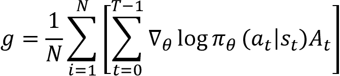

现在，让我们来看看 TRPO 的算法。记住，TRPO 是一种策略梯度方法，因此与演员-评论员方法不同，在这里我们首先生成 `N` 个轨迹，然后更新策略和价值网络的参数。

TRPO 中涉及的步骤如下：

1.  初始化策略网络参数  和价值网络参数 

1.  生成 `N` 个轨迹 ，按照策略  执行

1.  计算回报（奖励累计） `Rₜ`

1.  计算优势值 `Aₜ`

1.  计算策略梯度：

1.  使用共轭梯度法计算 

1.  使用更新规则更新策略网络参数 ：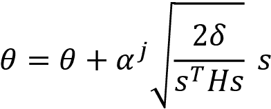

1.  计算价值网络的均方误差：

1.  使用梯度下降法更新价值网络参数 ，如  所示

1.  对步骤 2 到 9 进行若干次迭代

现在我们已经了解了 TRPO 的工作原理，在下一节中，我们将学习另一个有趣的算法，称为邻近策略优化。

# 邻近策略优化

在上一节中，我们了解了 TRPO 的工作原理。我们了解到 TRPO 通过施加一个约束条件，使得旧策略和新策略之间的 KL 散度小于等于 ，从而保持策略更新在可信区域内。TRPO 方法的问题在于其实现困难且计算开销大。因此，现在我们将学习一种最受欢迎且最先进的策略梯度算法，称为 **邻近策略优化**（**PPO**）。

PPO 改进了 TRPO 算法，并且实现简单。与 TRPO 类似，PPO 确保策略更新处于可信区域。但与 TRPO 不同的是，PPO 在目标函数中不使用任何约束。接下来，我们将学习 PPO 的具体工作原理，以及 PPO 如何确保策略更新处于可信区域。

PPO 算法有两种不同的类型：

+   **PPO-裁剪法 –** 在 PPO-裁剪法中，为了确保策略更新在信任区域内（即新策略不会偏离旧策略太远），PPO 增加了一个新的函数，称为裁剪函数，确保新旧策略不会相差太远。

+   **PPO-惩罚法 –** 在 PPO-惩罚法中，我们通过将 KL 约束项转换为惩罚项来修改目标函数，并在训练过程中自适应地更新惩罚系数，确保策略更新在信任区域内。

现在我们将详细探讨前面提到的两种 PPO 算法。

## PPO 与裁剪目标

首先，让我们回顾一下 TRPO 的目标函数。我们了解到，TRPO 的目标函数表示为：


这意味着我们试图在约束条件下最大化我们的策略，即旧策略和新策略应保持在信任区域内，即旧策略与新策略之间的 KL 散度应小于或等于 。

让我们只考虑目标函数，不考虑约束条件，将 PPO 目标函数写为：


在前面的方程中，项  表示概率比率，即新策略与旧策略的比率。我们用  来表示这个比率，并将 PPO 目标函数写为：


如果我们使用前面的目标函数来更新策略，那么策略更新将不在信任区域内。因此，为了确保我们的策略更新在信任区域内（即新策略不会偏离旧策略太远），我们通过添加一个新的裁剪函数来修改目标函数，并将目标函数重写为：


前面的函数意味着我们取两个项中的最小值：一个是 ，另一个是 。

我们知道，第一个项  基本上就是我们的目标，见方程（20），第二个项称为裁剪目标。因此，我们的最终目标函数就是未裁剪目标和裁剪目标中的最小值。那么，这有什么用呢？加入这个裁剪目标是如何帮助我们确保新策略不会偏离旧策略太远的呢？

让我们通过仔细研究来理解这一点：


我们知道，第一个项（未裁剪目标）正是由方程（20）给出。那么，我们来看看第二个项——裁剪目标。它表示为：


通过观察前面的项，我们可以说我们在将概率比率  限制在  范围内。但为什么我们需要对  进行裁剪呢？这可以通过考虑优势函数的两种情况来解释——当优势为正时和当优势为负时。

**情况 1: 当优势为正时**

当优势为正时，，这意味着对应的动作应该比所有其他动作的平均值更受偏好。因此，我们可以增加该动作的  值，以便它有更大的被选择的机会。然而，在增加  的值时，我们不应增加得太多，以免远离旧的策略。因此，为了防止这种情况，我们将  的值裁剪到 。

*图 13.10* 显示了当优势为正时我们如何增加  的值，以及如何将其裁剪到 ：


图 13.10: 当优势为正时， 的值

**情况 2: 当优势为负时**

当优势为负时，，这意味着对应的动作不应该比所有其他动作的平均值更受偏好。因此，我们可以降低该动作的  值，以便它有更小的被选择的机会。然而，在降低  的值时，我们不应降低得太多，以免远离旧的策略。因此，为了防止这种情况，我们将  的值裁剪到 。

*图 13.11* 显示了当优势为负时我们如何降低  的值，以及如何将其裁剪到 ：


图 13.11: 当优势为负时， 的值

 的值通常设置为 0.1 或 0.2。因此，我们了解到，裁剪后的目标通过根据优势函数将我们的策略更新保持接近旧策略，裁剪点为  和 。因此，我们的最终目标函数取未裁剪目标和裁剪目标中的最小值，公式如下：


现在我们已经了解了带裁剪目标的 PPO 算法如何工作，接下来让我们研究下一节中的算法。

### 算法 – PPO 裁剪版

PPO 裁剪版算法的步骤如下：

1.  初始化策略网络参数  和价值网络参数 

1.  收集 `N` 个符合策略  的轨迹 

1.  计算回报（奖励目标） `Rₜ`

1.  计算目标函数的梯度 

1.  使用梯度上升法更新策略网络参数 ，如 

1.  计算价值网络的均方误差: 

1.  计算价值网络的梯度 

1.  使用梯度下降更新值网络参数 ，如  所示：

1.  重复步骤 2 到 8 多次迭代：

## 实现 PPO 剪切方法：

让我们为摆动摆任务实现 PPO 剪切方法。本节中使用的代码改编自 Morvan 的一个很好的 PPO 实现（[`github.com/MorvanZhou/Reinforcement-learning-with-tensorflow/tree/master/contents/12_Proximal_Policy_Optimization`](https://github.com/MorvanZhou/Reinforcement-learning-with-tensorflow/tree/master/contents/12_Proxima)）：

首先，让我们导入必要的库：

```py
import warnings
warnings.filterwarnings('ignore')
import tensorflow.compat.v1 as tf
tf.disable_v2_behavior()
import numpy as np
import matplotlib.pyplot as plt
import gym 
```

### 创建 Gym 环境：

让我们使用 Gym 创建一个摆动环境：

```py
env = gym.make('Pendulum-v0').unwrapped 
```

获取环境的状态形状：

```py
state_shape = env.observation_space.shape[0] 
```

获取环境的动作形状：

```py
action_shape = env.action_space.shape[0] 
```

请注意，摆动摆的环境是连续的，因此我们的动作空间由连续值组成。所以，我们获取动作空间的边界：

```py
action_bound = [env.action_space.low, env.action_space.high] 
```

设置在剪切目标中使用的 epsilon 值：

```py
epsilon = 0.2 
```

### 定义 PPO 类：

让我们定义一个名为 `PPO` 的类，在其中实现 PPO 算法。为了更清楚地理解，我们逐行查看代码：

```py
class PPO(object): 
```

#### 定义 `init` 方法：

首先，让我们定义 `init` 方法：

```py
 def __init__(self): 
```

启动 TensorFlow 会话：

```py
 self.sess = tf.Session() 
```

定义状态的占位符：

```py
 self.state_ph = tf.placeholder(tf.float32, [None, state_shape], 'state') 
```

现在，让我们构建返回状态值的值网络：

```py
 with tf.variable_scope('value'):
            layer1 = tf.layers.dense(self.state_ph, 100, tf.nn.relu)
            self.v = tf.layers.dense(layer1, 1) 
```

定义 Q 值的占位符：

```py
 self.Q = tf.placeholder(tf.float32, [None, 1], 'discounted_r') 
```

定义优势值为 Q 值与状态值之间的差：

```py
 self.advantage = self.Q - self.v 
```

计算值网络的损失：

```py
 self.value_loss = tf.reduce_mean(tf.square(self.advantage)) 
```

通过使用 Adam 优化器最小化损失来训练值网络：

```py
 self.train_value_nw = tf.train.AdamOptimizer(0.002).minimize(self.value_loss) 
```

现在，我们从策略网络获取新的策略及其参数：

```py
 pi, pi_params = self.build_policy_network('pi', trainable=True) 
```

从策略网络获取旧策略及其参数：

```py
 oldpi, oldpi_params = self.build_policy_network('oldpi', trainable=False) 
```

从新策略中采样一个动作：

```py
 with tf.variable_scope('sample_action'):
            self.sample_op = tf.squeeze(pi.sample(1), axis=0) 
```

更新旧策略的参数：

```py
 with tf.variable_scope('update_oldpi'):
            self.update_oldpi_op = [oldp.assign(p) for p, oldp in zip(pi_params, oldpi_params)] 
```

定义动作的占位符：

```py
 self.action_ph = tf.placeholder(tf.float32, [None, action_shape], 'action') 
```

定义优势的占位符：

```py
 self.advantage_ph = tf.placeholder(tf.float32, [None, 1], 'advantage') 
```

现在，让我们定义策略网络的代理目标函数：

```py
 with tf.variable_scope('loss'):
            with tf.variable_scope('surrogate'): 
```

我们了解到策略网络的目标是：


首先，我们定义比率  为 ：

```py
 ratio = pi.prob(self.action_ph) / oldpi.prob(self.action_ph) 
```

通过将比率  和优势值 `Aₜ` 相乘来定义目标：

```py
 objective = ratio * self.advantage_ph 
```

使用剪切和未剪切的目标定义目标函数：

```py
 L = tf.reduce_mean(tf.minimum(objective, tf.clip_by_value(ratio, 1.-epsilon, 1.+ epsilon)*self.advantage_ph)) 
```

现在，我们可以计算梯度并使用梯度上升法最大化目标函数。然而，实际上我们可以通过添加一个负号将上述最大化目标转换为最小化目标。所以，我们可以将策略网络的损失表示为：

```py
 self.policy_loss = -L 
```

通过使用 Adam 优化器最小化损失来训练策略网络：

```py
 with tf.variable_scope('train_policy'):
            self.train_policy_nw = tf.train.AdamOptimizer(0.001).minimize(self.policy_loss) 
```

初始化所有 TensorFlow 变量：

```py
 self.sess.run(tf.global_variables_initializer()) 
```

#### 定义训练函数：

现在，让我们定义 `train` 函数：

```py
 def train(self, state, action, reward): 
```

更新旧策略：

```py
 self.sess.run(self.update_oldpi_op) 
```

计算优势值：

```py
 adv = self.sess.run(self.advantage, {self.state_ph: state, self.Q: reward}) 
```

训练策略网络：

```py
 [self.sess.run(self.train_policy_nw, {self.state_ph: state, self.action_ph: action, self.advantage_ph: adv}) for _ in range(10)] 
```

训练值网络：

```py
 [self.sess.run(self.train_value_nw, {self.state_ph: state, self.Q: reward}) for _ in range(10)] 
```

#### 构建策略网络：

我们定义一个名为`build_policy_network`的函数，用于构建策略网络。请注意，这里我们的动作空间是连续的，因此我们的策略网络返回动作的均值和方差作为输出，然后我们使用这个均值和方差生成一个正态分布，并通过从这个正态分布中采样来选择一个动作：

```py
 def build_policy_network(self, name, trainable):
        with tf.variable_scope(name): 
```

定义网络的层：

```py
 layer = tf.layers.dense(self.state_ph, 100, tf.nn.relu, trainable=trainable) 
```

计算均值：

```py
 mu = 2 * tf.layers.dense(layer, action_shape, tf.nn.tanh, trainable=trainable) 
```

计算标准差：

```py
 sigma = tf.layers.dense(layer, action_shape, tf.nn.softplus, trainable=trainable) 
```

计算正态分布：

```py
 norm_dist = tf.distributions.Normal(loc=mu, scale=sigma) 
```

获取策略网络的参数：

```py
 params = tf.get_collection(tf.GraphKeys.GLOBAL_VARIABLES, scope=name)
        return norm_dist, params 
```

#### 选择动作

定义一个名为`select_action`的函数，用于选择动作：

```py
 def select_action(self, state):
        state = state[np.newaxis, :] 
```

从策略网络生成的正态分布中采样一个动作：

```py
 action = self.sess.run(self.sample_op, {self.state_ph: state})[0] 
```

我们将动作裁剪到动作范围内，然后返回该动作：

```py
 action = np.clip(action, action_bound[0], action_bound[1])
        return action 
```

#### 计算状态值

我们定义一个名为`get_state_value`的函数，用于获取通过价值网络计算的状态值：

```py
 def get_state_value(self, state):
        if state.ndim < 2: state = state[np.newaxis, :]
        return self.sess.run(self.v, {self.state_ph: state})[0, 0] 
```

### 训练网络

现在，让我们开始训练网络。首先，创建一个 PPO 类的对象：

```py
ppo = PPO() 
```

设置回合数：

```py
num_episodes = 1000 
```

设置每回合的时间步数：

```py
num_timesteps = 200 
```

设置折扣因子，：

```py
gamma = 0.9 
```

设置批量大小：

```py
batch_size = 32 
```

对每个回合：

```py
for i in range(num_episodes): 
```

通过重置环境来初始化状态：

```py
 state = env.reset() 
```

初始化用于保存回合中获得的状态、动作和奖励的列表：

```py
 episode_states, episode_actions, episode_rewards = [], [], [] 
```

初始化回报：

```py
 Return = 0 
```

每一步：

```py
 for t in range(num_timesteps): 
```

渲染环境：

```py
 env.render() 
```

选择动作：

```py
 action = ppo.select_action(state) 
```

执行所选择的动作：

```py
 next_state, reward, done, _ = env.step(action) 
```

将状态、动作和奖励存储在列表中：

```py
 episode_states.append(state)
        episode_actions.append(action)
        episode_rewards.append((reward+8)/8) 
```

更新状态到下一个状态：

```py
 state = next_state 
```

更新回报：

```py
 Return += reward 
```

如果我们达到了批量大小或达到了回合的最后一步：

```py
 if (t+1) % batch_size == 0 or t == num_timesteps-1: 
```

计算下一个状态的值：

```py
 v_s_ = ppo.get_state_value(next_state) 
```

计算 Q 值为 ：

```py
 discounted_r = []
            for reward in episode_rewards[::-1]:
                v_s_ = reward + gamma * v_s_
                discounted_r.append(v_s_)
            discounted_r.reverse() 
```

堆叠回合状态、动作和奖励：

```py
 es, ea, er = np.vstack(episode_states), np.vstack(episode_actions), np.array(discounted_r)[:, np.newaxis] 
```

训练网络：

```py
 ppo.train(es, ea, er) 
```

清空列表：

```py
 episode_states, episode_actions, episode_rewards = [], [], [] 
```

每 10 回合打印一次回报：

```py
 if i %10 ==0:
         print("Episode:{}, Return: {}".format(i,Return)) 
```

现在我们已经了解了带剪切目标的 PPO 是如何工作的以及如何实现它，在接下来的部分，我们将学习另一种有趣的 PPO 算法类型，称为带惩罚目标的 PPO。

## 带惩罚目标的 PPO

在 PPO 惩罚方法中，我们将约束项转换为惩罚项。首先，让我们回顾一下 TRPO 的目标函数。我们知道 TRPO 的目标函数为：


在 PPO 惩罚方法中，我们可以通过将 KL 约束项转换为惩罚项，像这样重写前面的目标：


其中  被称为惩罚系数。

令  和  为目标 KL 散度；然后，我们自适应地设置  的值为：

+   如果`d`大于或等于 ，那么我们设置 

+   如果`d`小于或等于 ，那么我们设置 

我们可以通过查看接下来的部分中的 PPO 惩罚算法，来准确理解它是如何工作的。

### 算法 – PPO-penalty

PPO-penalty 算法的步骤如下：

1.  初始化策略网络参数  和值网络参数 ，并初始化惩罚系数 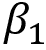 和目标 KL 散度 

1.  对于迭代 ：

    1.  按照策略  收集 `N` 条轨迹

    1.  计算回报（奖励） `Rₜ`

    1.  计算 

    1.  计算目标函数的梯度 

    1.  使用梯度上升法更新策略网络参数 ，如 

    1.  如果 `d` 大于或等于 ，则设置 ；如果 `d` 小于或等于 ，则设置 

    1.  计算值网络的均方误差：

    1.  计算值网络的梯度 

    1.  使用梯度下降法更新值网络参数 ，如 

因此，我们了解了 PPO-clipped 和 PPO-penalized 目标的工作原理。一般而言，带有裁剪目标的 PPO 方法比带有惩罚目标的 PPO 方法使用得更多。

在下一节中，我们将学习另一个有趣的算法，称为 ACKTR。

# 使用 Kronecker 分解信任域的演员-评论家

ACKTR，如其名所示，是基于 Kronecker 分解和信任区域的演员-评论家算法。

我们知道，演员-评论家架构由演员网络和评论家网络组成，演员的角色是生成策略，而评论家的角色是评估演员网络生成的策略。我们已经了解到，在演员网络（策略网络）中，我们通过计算梯度并使用梯度上升更新演员网络的参数：


我们可以通过计算自然梯度来更新演员网络的参数，而不是使用前述更新规则：


其中 `F` 称为费舍尔信息矩阵。因此，自然梯度就是费舍尔矩阵的逆与标准梯度的乘积：


自然梯度的使用在于它能保证策略的单调改进。然而，使用上述更新规则更新演员网络（策略网络）参数是一项计算量大的任务，因为计算费舍尔信息矩阵并求其逆是一个计算量巨大的过程。因此，为了避免这项繁重的计算，我们可以通过克罗内克分解近似来逼近  的值。一旦我们使用克罗内克分解近似了 ，就可以按照公式（21）中给出的自然梯度更新规则更新我们的策略网络参数，在更新策略网络参数时，我们还要确保策略更新位于信任区域内，这样新策略就不会偏离旧策略太远。这就是 ACKTR 算法的核心思想。

现在，我们已经对 ACKTR 有了基本的了解，接下来让我们详细了解它是如何工作的。首先，我们将理解克罗内克分解是什么，然后我们将学习它如何在演员-评论家设置中使用，之后我们将学习如何在策略更新中结合信任区域。

在继续之前，让我们学习一些理解 ACKTR 所必需的数学概念。

## 数学基础

为了理解克罗内克分解如何工作，我们将学习以下重要概念：

+   块矩阵

+   块对角矩阵

+   克罗内克积

+   vec 运算符

+   克罗内克积的性质

### 块矩阵

块矩阵被定义为一个可以分解为称为块的子矩阵的矩阵，或者我们可以说，块矩阵是由一组子矩阵或块构成的。例如，假设我们考虑一个如图所示的块矩阵 `A`：


矩阵 `A` 可以分解成四个子矩阵，如下所示： 


现在，我们可以简单地将块矩阵 `A` 写成：


### 块对角矩阵

块对角矩阵是一个包含方阵对角线元素，非对角线元素设为 0 的块矩阵。块对角矩阵 `A` 可表示为：


其中对角线部分  是方阵。

一个块对角矩阵的例子如下所示：


如我们所见，对角线部分基本上是一个方阵，而非对角线元素被设为零：


因此，我们可以写成：


现在，我们可以简单地将我们的块对角矩阵 `A` 表示为：


### 克罗内克积

克罗内克积是两个矩阵之间执行的运算。克罗内克积不同于矩阵乘法。当我们执行两个矩阵之间的克罗内克积时，它会输出块矩阵。克罗内克积用表示。假设我们有一个阶数为的矩阵`A`和一个阶数为的矩阵`B`，那么矩阵`A`和`B`的克罗内克积表示为：


这意味着我们将矩阵`A`中的每个元素与矩阵`B`相乘。让我们通过一个例子来理解这一点。假设我们有两个矩阵`A`和`B`，如下所示：


然后，矩阵`A`和`B`的克罗内克积表示为：


### vec 运算符

vec 运算符通过将矩阵中的所有列堆叠在一起，创建一个列向量。例如，假设我们有如下所示的矩阵`A`：


对* A *应用 vec 运算符会将矩阵中的所有列堆叠在一起，形成如下所示的矩阵：


### 克罗内克积的性质

克罗内克积有几个有用的性质，包括：

+   

+   

+   

现在我们已经学习了几个重要概念，接下来让我们理解什么是克罗内克因式分解。

## 克罗内克因式近似曲率（K-FAC）

假设我们有一个由参数化的神经网络，并且我们使用梯度下降法训练神经网络。我们可以写出更新规则，包括自然梯度，如下所示：


其中`F`是费舍尔信息矩阵。问题在于计算`F`并求解其逆是一个昂贵的任务。为了避免这种情况，我们使用克罗内克因式分解近似来估算的值。

让我们学习如何使用克罗内克因式近似。假设我们的网络有层，网络的权重表示为。因此，表示层的权重。让表示网络的输出分布，我们将使用负对数似然作为损失函数`J`：


然后，费舍尔信息矩阵可以写成：


K-FAC 近似费舍尔信息矩阵`F`，将其表示为块对角矩阵，每个块代表特定层的权重梯度。例如，块`F[1]`表示损失函数相对于第 1 层权重的梯度。块`F[2]`表示损失函数相对于第 2 层权重的梯度。块`F[l]`表示损失函数相对于第`l`层权重的梯度：


即，，其中：

+   

+   

+   

+   

正如我们所观察到的，每个块`F[1]`到`F[L]`包含了损失`J`相对于相应层权重的导数。那么，我们如何计算每个块呢？也就是说，如何计算前面这个对角矩阵中的值？

为了理解这一点，让我们先看一个块，假设是`F[l]`，并学习它是如何计算的。假设我们有一层`l`，让`a`是输入激活向量，是该层的权重，`s`是输出前激活向量，它可以传递给下一层`l` + 1。

我们知道，在神经网络中，我们将激活向量与权重相乘并将其传递到下一层；因此，我们可以写成：


我们可以将对应于层`l`的块`F[l]`近似为：


上述方程`F[l]`表示损失对层`l`权重的梯度。

从(22)可得，损失函数`J`相对于层`l`的权重的偏导数可以写为：


将(24)代入(23)，我们可以写为：


上述方程表明`F[l]`仅仅是克罗内克积的期望值。因此，我们可以将其重新写为期望值的克罗内克积；也就是说，`F[l]`可以近似为期望值的克罗内克积：


令和。我们可以写成：


这被称为克罗内克分解，`A`和`S`被称为克罗内克因子。现在我们已经了解了如何计算块`F[l]`，接下来我们来学习如何更新层`l`的权重。

更新层`l`权重的更新规则为：


令。我们可以写成：


让我们看看如何计算的值：


对两边应用 vec 运算符，我们可以写成：


从(25)我们可以代入`F[l]`的值并写成：


使用属性和，我们可以写成：

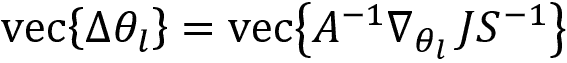

如你所见，我们已经在不需要通过克罗内克因子进行昂贵的费舍尔信息矩阵逆运算的情况下计算了的值。现在，利用我们刚推导出的的值，我们可以更新层`l`的权重：


简而言之，K-FAC 将 Fisher 信息矩阵近似为一个块对角矩阵，其中每个块包含导数。然后，每个块被近似为两个矩阵的 Kronecker 积，这就是所谓的 Kronecker 因式分解。

因此，我们已经学会了如何使用 Kronecker 因子近似自然梯度。在下一节中，我们将学习如何在演员-评论者方法中应用这一点。

## K-FAC 在演员-评论者方法中

我们知道，在演员-评论者方法中，有演员网络和评论者网络。演员的角色是生成策略，评论者的角色是评估演员网络生成的策略。

首先，让我们看看演员网络。在演员网络中，我们的目标是找到最优策略。因此，我们试图找到最优参数 ，通过该参数可以获得最优策略。我们计算梯度并使用梯度上升法更新演员网络的参数：


我们可以通过计算自然梯度来更新演员网络的参数，而不是使用前述的更新规则，具体方法如下：


但是计算  是一项昂贵的任务。因此，我们可以使用 Kronecker 因式分解来近似  的值。我们可以将演员网络的 Fisher 信息矩阵 `F` 定义为：


正如我们在上一节中所学到的，我们可以将 Fisher 信息矩阵近似为一个块对角矩阵，其中每个块包含导数，然后我们可以将每个块近似为两个矩阵的 Kronecker 积。

令 。我们可以写为：


 的值可以通过 Kronecker 因式分解计算为：


这正是我们在上一节中学到的内容。

现在，让我们来看一下评论者网络。我们知道，评论者通过估计 Q 函数来评估由演员网络生成的策略。因此，我们通过最小化目标值和预测值之间的均方误差来训练评论者。

我们使用梯度下降法最小化损失，并更新评论者网络的参数  ，具体方法如下：


其中  是标准的一阶梯度。

我们能否不使用一阶梯度，而是使用二阶梯度来更新评论员网络的参数 ，类似于我们对演员所做的操作？是的，在像最小二乘法（MSE）这样的设置中，我们可以使用一个叫做高斯-牛顿法的算法来找到二阶导数。你可以在这里了解更多关于高斯-牛顿法的信息：[`www.seas.ucla.edu/~vandenbe/236C/lectures/gn.pdf`](http://www.seas.ucla.edu/~vandenbe/236C/lectures/gn.pdf)。让我们用  表示我们的误差。根据高斯-牛顿法，更新评论员网络参数  的更新规则为：


其中 `G` 被称为高斯-牛顿矩阵，其形式为 ，而 `J` 是雅可比矩阵。（雅可比矩阵是一个包含向量值函数的一阶偏导数的矩阵。）

如果你查看前面的方程式，计算  相当于计算我们在演员网络中看到的 。也就是说，计算高斯-牛顿矩阵的逆相当于计算费舍尔信息矩阵的逆。因此，我们可以使用克罗内克因子（K-FAC）来近似计算  的值，就像我们近似计算  的值一样。

我们可以不仅仅单独应用 K-FAC 于演员和评论员网络，还可以在共享模式下应用。正如 Yuhuai Wu、Elman Mansimov、Shun Liao、Roger Grosse 和 Jimmy Ba 在论文 **Scalable trust-region method for deep reinforcement learning using Kronecker-factored approximation** 中所述，"*我们可以设计一个单一架构，其中演员和评论员共享底层表示，但它们具有不同的输出层*。" 该论文可访问：[`arxiv.org/pdf/1708.05144.pdf`](https://arxiv.org/pdf/1708.05144.pdf)

简而言之，在 ACKTR 方法中，我们通过计算二阶导数来更新演员和评论员网络的参数。由于计算二阶导数是一项昂贵的任务，我们使用了一种叫做克罗内克因子近似的方法来近似二阶导数。

在下一节中，我们将学习如何将信任区域融入我们的更新规则，使得新旧策略更新不会相差太远。

## 融入信任区域

我们已经学会了如何使用自然梯度来更新我们网络的参数，如下所示：


在上一节中，我们学习了如何使用 K-FAC 来近似矩阵。在更新策略时，我们需要确保策略更新处于信任区域内；也就是说，新策略不应与旧策略相差太远。为了确保这一点，我们可以选择步长作为，其中和信任区域半径是超参数，如 ACKTR 论文中所提到的（参见*进一步阅读*部分）。使用此步长更新网络参数可确保我们的策略更新处于信任区域内。

# 总结

我们从了解 TRPO 是什么以及它如何作为策略梯度算法的改进开始本章内容。我们了解到，当新旧策略差异过大时，会导致模型崩溃。

因此，在 TRPO 中，我们在更新策略时强加一个约束，要求新旧策略的参数保持在信任区域内。我们还了解到，TRPO 保证了单调的策略改进；也就是说，它确保每次迭代都会有策略改进。

后来，我们学习了 PPO 算法，它是 TRPO 算法的改进版。我们了解了两种 PPO 算法：PPO-clipped 和 PPO-penalty。在 PPO-clipped 方法中，为了确保策略更新处于信任区域，PPO 添加了一个名为裁剪函数的新功能，以确保新旧策略不会相差太远。在 PPO-penalty 方法中，我们通过将 KL 约束项转化为惩罚项来修改目标函数，并在训练过程中自适应地更新惩罚系数，确保策略更新位于信任区域内。

在本章结束时，我们学习了 ACKTR。在 ACKTR 方法中，我们通过计算二阶导数来更新演员网络和评论员网络的参数。由于计算二阶导数是一项昂贵的任务，我们使用一种叫做 Kronecker-分解近似法的方法来近似二阶导数，在更新策略网络参数时，我们还确保策略更新位于信任区域内，以确保新策略不会与旧策略相差太远。

在下一章中，我们将学习一些有趣的分布式强化学习算法。

# 问题

让我们评估一下我们对本章所学算法的理解。试着回答以下问题：

1.  什么是信任区域？

1.  为什么 TRPO 有用？

1.  共轭梯度法与梯度下降法有何不同？

1.  TRPO 的更新规则是什么？

1.  PPO 与 TRPO 有何不同？

1.  解释 PPO-clipped 方法。

1.  什么是 Kronecker 分解？

# 进一步阅读

如需更多信息，请参考以下论文：

+   **信赖域策略优化** 由 *约翰·舒尔曼*、*谢尔盖·莱文*、*菲利普·莫里茨*、*迈克尔·I·乔丹*、*皮特·阿贝尔* 发表，[`arxiv.org/pdf/1502.05477.pdf`](https://arxiv.org/pdf/1502.05477.pdf)

+   **邻近策略优化算法** 由 *约翰·舒尔曼*、*菲利普·沃尔斯基*、*普拉夫拉·达里瓦尔*、*阿列克·拉德福德*、*奥列格·克利莫夫* 发表，[`arxiv.org/pdf/1707.06347.pdf`](https://arxiv.org/pdf/1707.06347.pdf)

+   **使用克罗内克因子近似的可扩展信赖域方法应用于深度强化学习** 由 *余槐·吴*、*埃尔曼·曼西莫夫*、*邵·廖*、*罗杰·格罗斯*、*吉米·巴* 发表，[`arxiv.org/pdf/1708.05144.pdf`](https://arxiv.org/pdf/1708.05144.pdf)
