# 第十四章：分布式强化学习

在本章中，我们将学习分布式强化学习。我们将通过理解分布式强化学习究竟是什么以及它为何有用来开始本章。接下来，我们将学习一种非常流行的分布式强化学习算法，叫做 **分类 DQN**。我们将了解分类 DQN 是什么，它与我们在 *第九章*，*深度 Q 网络及其变体* 中学习的 DQN 有什么不同，然后我们将详细探讨分类 DQN 算法。

接下来，我们将学习另一个有趣的算法，叫做 **分位数回归 DQN**（**QR-DQN**）。我们将了解 QR-DQN 是什么，它与分类 DQN 有什么不同，然后我们将详细探讨 QR-DQN 算法。

在本章结束时，我们将学习一种名为 **分布式分布式深度确定性策略梯度**（**D4PG**）的策略梯度算法。我们将详细了解 D4PG 是什么，以及它与我们在 *第十二章*，*学习 DDPG、TD3 和 SAC* 中学习的 DDPG 有什么不同。

在本章中，我们将涵盖以下主题：

+   为什么使用分布式强化学习？

+   分类 DQN

+   分位数回归 DQN

+   分布式分布式深度确定性策略梯度

让我们通过理解什么是分布式强化学习以及我们为什么需要它来开始本章。

# 为什么使用分布式强化学习？

假设我们处于状态 `s`，并且在这个状态下有两种可能的动作可以执行。设这两种动作分别是 *上* 和 *下*。我们如何决定在这个状态下执行哪个动作呢？我们为该状态下的所有动作计算 Q 值，并选择 Q 值最大的动作。因此，我们计算 `Q`(`s`, 上) 和 `Q`(`s`, 下)，并选择 Q 值最大的动作。

我们了解到，Q 值是一个智能体从状态 `s` 开始并执行一个动作 `a` 后，根据策略获得的预期回报！[](img/B15558_14_001.png)：


但使用这种方法计算 Q 值时有一个小问题，因为 Q 值仅仅是回报的期望值，而期望值并未包含内在的随机性。让我们通过一个例子来准确理解这意味着什么。

假设我们要从工作地点开车回家，我们有两条路线 `A` 和 `B`。现在，我们需要决定哪条路线更好，也就是说，哪条路线帮助我们在最短的时间内到达家里。为了找出哪条路线更好，我们可以计算 Q 值，并选择 Q 值最大的路线，也就是给我们最大期望回报的路线。

假设选择路线*Ａ*的 Q 值为`Q`(`s`, `A`) = 31，选择路线`B`的 Q 值为`Q`(`s`, `B`) = 28。由于 Q 值（路线`A`的期望回报）较高，我们可以选择路线`A`回家。但这里是不是遗漏了什么呢？我们能不能直接看回报的分布，而不是把 Q 值看作回报的期望，从而做出更好的决策？

是的！

但首先，让我们看看路线`A`和路线`B`的分布，并理解哪条路线更优。以下图表显示了路线`A`的分布。它告诉我们，有 70%的概率在 10 分钟内到家，而有 30%的概率需要 80 分钟才能到家。也就是说，如果选择路线`A`，我们通常能在 10 分钟内到家，但当遇到交通拥堵时，我们需要 80 分钟才能到家：


图 14.1：路线 A 的分布

*图 14.2*显示了路线`B`的分布。它告诉我们，有 80%的概率在 20 分钟内到家，20%的概率需要 60 分钟才能到家。

也就是说，如果我们选择路线`B`，通常在 20 分钟内到家，但当遇到交通拥堵时，我们需要 60 分钟才能到家：


图 14.2：路线 B 的分布

看过这两种分布后，我们会发现选择路线`B`比选择路线`A`更有意义。选择路线`B`时，即使在最糟糕的情况下，也就是遇到交通拥堵时，我们能在 60 分钟内到家。但选择路线`A`时，在交通繁忙时，我们需要 80 分钟才能到家。因此，选择路线`B`而不是`A`是明智的决定。

类似地，如果我们观察路线`A`和路线`B`的回报分布，我们就能获得更多信息。如果我们仅仅根据最大期望回报（即最大 Q 值）来采取行动，那么这些细节将会被忽略。因此，我们不是用期望回报来选择行动，而是使用回报的分布，然后根据分布选择最优的行动。

这是分布式强化学习的基本思想和动机。在下一节中，我们将学习一种最流行的分布式强化学习算法——分类 DQN，也叫做 C51 算法。

# 分类 DQN

在上一节中，我们了解了为什么基于回报分布来选择行动比仅仅基于 Q 值（即期望回报）来选择行动更有利。在这一节中，我们将学习如何使用一种名为分类 DQN 的算法来计算回报的分布。

回报的分布通常被称为值分布或回报分布。设`Z`为随机变量，`Z`(`s`, `a`)表示状态`s`和动作`a`的值分布。我们知道 Q 函数表示为`Q`(`s`, `a`)，它给出一个状态-动作对的值。同样，现在我们有了`Z`(`s`, `a`)，它给出状态-动作对的值分布（回报分布）。

好的，我们如何计算`Z`(`s`, `a`)？首先，让我们回顾一下如何计算`Q`(`s`, `a`)。

在 DQN 中，我们学习到使用神经网络来逼近 Q 函数，`Q`(`s`, `a`)。由于我们使用神经网络来逼近 Q 函数，我们可以通过来表示 Q 函数，其中是网络的参数。给定一个状态作为输入到网络，它输出所有可以在该状态下执行的动作的 Q 值，然后我们选择具有最大 Q 值的动作。

类似地，在分类 DQN 中，我们使用神经网络来逼近`Z`(`s`, `a`)的值。我们可以通过来表示这一点，其中是网络的参数。给定一个状态作为输入到网络，它输出所有可以在该状态下执行的动作的值分布（回报分布），然后我们根据这个值分布选择一个动作。

让我们通过一个例子来理解 DQN 和分类 DQN 之间的区别。假设我们处于状态`s`，并且假设我们的动作空间有两个动作`a`和`b`。现在，如*图 14.3*所示，给定状态`s`作为输入，DQN 返回所有动作的 Q 值，然后我们选择具有最大 Q 值的动作，而在分类 DQN 中，给定状态`s`作为输入，它返回所有动作的值分布，然后我们根据这个值分布选择一个动作：


图 14.3：DQN 与分类 DQN

好的，我们如何训练网络？在 DQN 中，我们学习到通过最小化目标 Q 值与网络预测的 Q 值之间的损失来训练网络。我们知道目标 Q 值是通过贝尔曼最优方程获得的。因此，我们最小化目标值（最优贝尔曼 Q 值）与预测值（网络预测的 Q 值）之间的损失并训练网络。

类似地，在分类 DQN 中，我们通过最小化目标值分布与网络预测的值分布之间的损失来训练网络。好的，我们如何获得目标值分布？在 DQN 中，我们使用贝尔曼方程来获得目标 Q 值；类似地，在分类 DQN 中，我们可以使用分布式贝尔曼方程来获得目标值分布。那么，什么是分布式贝尔曼方程？首先，在学习分布式贝尔曼方程之前，让我们回顾一下贝尔曼方程。

我们了解到，Q 函数`Q`(`s`, `a`)的贝尔曼方程表示为：


类似地，值分布`Z`(`s`, `a`)的贝尔曼方程表示为：


这个方程被称为分布式贝尔曼方程。因此，在分类 DQN 中，我们通过最小化目标值分布（由分布式贝尔曼方程给出）和网络预测的值分布之间的损失来训练网络。

好的，我们应该使用什么样的损失函数呢？在 DQN 中，我们使用**均方误差**（**MSE**）作为我们的损失函数。与 DQN 不同的是，在分类 DQN 中，我们不能使用 MSE 作为损失函数，因为在分类 DQN 中，我们预测的是概率分布，而不是 Q 值。由于我们处理的是分布，因此我们使用交叉熵损失作为我们的损失函数。因此，在分类 DQN 中，我们通过最小化目标值分布与网络预测的值分布之间的交叉熵损失来训练网络。

简而言之，分类 DQN 与 DQN 相似，唯一不同的是在分类 DQN 中，我们预测的是值分布，而在 DQN 中，我们预测的是 Q 值。因此，给定一个状态作为输入，分类 DQN 返回该状态下每个动作的值分布。我们通过最小化目标值分布（由分布式贝尔曼方程给出）和网络预测的值分布之间的交叉熵损失来训练网络。

现在我们已经理解了分类 DQN 是什么以及它与 DQN 的区别，在接下来的部分中，我们将学习分类 DQN 是如何准确预测值分布的。

## 预测值分布

*图 14.4*展示了一个简单的值分布：

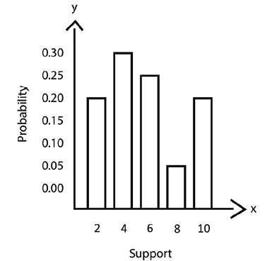

图 14.4：值分布

水平轴的值称为支持或原子，垂直轴的值则是概率。我们用`Z`表示支持，用`P`表示概率。为了预测值的分布以及状态，我们的网络将分布的支持作为输入，并返回支持中每个值的概率。

那么，现在我们将看到如何计算分布的支持。为了计算支持，首先我们需要决定支持的值的数量`N`、支持的最小值和支持的最大值。给定支持的数量`N`，我们将其从到分成`N`个相等的部分。

让我们通过一个例子来理解这一点。假设支撑值数量 `N` = 5，支撑值的最小值为 ，最大值为 。现在，如何找到支撑值呢？为了找到支撑值，首先，我们需要计算一个步长，记作 。值  可以通过以下公式计算：


现在，为了计算支撑值，我们从支撑值的最小值开始 ，并将  加到每个值上，直到我们达到支撑值数量 `N`。在我们的示例中，我们从  开始，它是 2，然后我们将  加到每个值上，直到我们达到支撑值数量 `N`。因此，支撑值变为：


因此，我们可以将支撑值表示为 。以下 Python 代码片段可以帮助我们更清楚地了解如何获得支撑值：

```py
def get_support(N, V_min, V_max):
    dz = (V_max – V_min) / (N-1)
    return [V_min + i * dz for i in range(N)] 
```

好的，我们已经了解了如何计算分布的支撑值，现在神经网络是如何将这个支撑值作为输入并返回概率的呢？

为了预测价值分布，除了状态外，我们还需要将分布的支撑值作为输入，然后网络返回我们价值分布的概率作为输出。让我们通过一个例子来理解这一点。假设我们处于状态 `s`，并且在这个状态下有两个动作可供选择，分别是 *上* 和 *下*。假设我们计算得到的支撑值是 `z₁`、`z₂` 和 `z₃`。

正如 *图 14.5* 所示，在将状态 `s` 作为输入传入网络的同时，我们还将分布的支撑值 `z₁`、`z₂` 和 `z₃` 输入。然后，网络返回给定支撑值对应的动作 *上* 和动作 *下* 的分布概率 `p`i：


图 14.5：分类 DQN

分类 DQN 论文的作者（详见 *进一步阅读* 部分）建议将支撑值数量 `N` 设置为 51，因此分类 DQN 也被称为 C51 算法。因此，我们已经了解了分类 DQN 如何预测价值分布。在下一部分，我们将学习如何基于这个预测的价值分布选择动作。

## 基于价值分布选择动作

我们已经学过分类 DQN 返回给定状态下每个动作的价值分布。但我们如何根据网络预测的价值分布来选择最佳动作呢？

我们通常基于 Q 值选择动作，也就是说，我们通常选择具有最大 Q 值的动作。但现在我们没有 Q 值，而是有一个价值分布。那我们如何基于价值分布选择动作呢？

首先，我们将从价值分布中提取 Q 值，然后选择具有最大 Q 值的动作。好的，如何提取 Q 值呢？我们可以通过计算价值分布的期望值来获得 Q 值。分布的期望值可以表示为支持度`zᵢ`与它们相应的概率`pᵢ`的乘积的总和。因此，价值分布`Z`的期望值为：


其中`zᵢ`是支持度，`pᵢ`是概率。

因此，价值分布的 Q 值可以计算为：


在计算 Q 值后，我们选择 Q 值最大的动作作为最佳动作：


让我们准确理解这一过程。假设我们处于状态`s`，并且在该状态下有两个动作。假设这两个动作分别为*up*和*down*。首先，我们需要计算支持度。假设支持度的数量`N` = 3，支持度的最小值为 ，最大值为 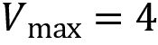。然后，我们计算出的支持度值为[2,3,4]。

现在，我们将支持度与状态`s`一起输入，然后类别 DQN 返回给定支持度下的动作*up*和动作*down*的价值分布概率`p`i，如图所示：


图 14.6：类别 DQN

现在，如何根据这两个价值分布选择最佳动作呢？首先，我们将从价值分布中提取 Q 值，然后选择具有最大 Q 值的动作。

我们了解到，Q 值可以通过将支持度与相应的概率相乘的和从价值分布中提取出来：


所以，我们可以计算在状态`s`中动作*up*的 Q 值，如下所示：


现在，我们可以计算在状态`s`中动作*down*的 Q 值，如下所示：


现在，我们选择具有最大 Q 值的动作。由于动作*up*具有较高的 Q 值，因此我们选择动作*up*作为最佳动作。

等等！那么，类别 DQN 究竟有什么特别之处？因为像 DQN 一样，我们最终也是根据 Q 值选择动作。一个我们必须注意的重要点是，在 DQN 中，我们是直接根据回报的期望来计算 Q 值的，但在类别 DQN 中，我们首先学习回报分布，然后基于回报分布的期望来计算 Q 值，这样能够捕捉到内在的随机性。

我们已经了解到，类别 DQN 输出给定状态下所有动作的价值分布，然后从中提取 Q 值并选择具有最大 Q 值的动作作为最佳动作。但问题是，我们的类别 DQN 到底是如何学习的？我们如何训练类别 DQN 以预测准确的价值分布？我们将在下一节讨论这个问题。

## 训练分类 DQN

我们通过最小化目标值分布和预测值分布之间的交叉熵损失来训练分类 DQN。我们如何计算目标分布呢？我们可以通过以下的分布贝尔曼方程来计算目标分布：


其中  表示即时奖励`r`，这是在执行动作`a`并从状态`s`移动到下一个状态  时获得的奖励，因此我们可以将  简单表示为`r`：


记得在 DQN 中，我们使用由  参数化的目标网络计算目标值吗？同样地，这里我们使用由  参数化的目标分类 DQN 来计算目标分布。

计算目标分布后，我们通过最小化目标值分布与预测值分布之间的交叉熵损失来训练网络。这里有一个重要的点需要注意：只有在目标分布和预测分布的支持相等时，才能应用交叉熵损失；如果它们的支持不相等，我们就无法应用交叉熵损失。

例如，*图 14.7* 显示了目标分布和预测分布的支持相同，(1,2,3,4)。因此，在这种情况下，我们可以应用交叉熵损失：

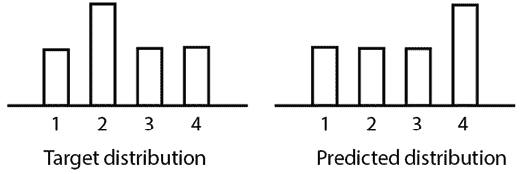

图 14.7：目标分布与预测分布

在*图 14.8*中，我们可以看到目标分布的支持（1,3,4,5）和预测分布的支持（1,2,3,4）是不同的，因此在这种情况下，我们无法应用交叉熵损失。


图 14.8：目标分布与预测分布

因此，当目标分布和预测分布的支持不同时，我们会执行一个特殊的步骤，称为投影步骤，借助这个步骤，我们可以使目标分布和预测分布的支持相等。一旦我们使目标和预测分布的支持相等，就可以应用交叉熵损失。

在接下来的部分中，我们将学习投影步骤是如何工作的，以及它如何使目标分布和预测分布的支持相等。

### 投影步骤

让我们通过一个例子来理解投影步骤是如何工作的。假设输入支持是`z` = [1, 2]。

设预测分布的概率为`p` = [0.5, 0.5]。*图 14.9* 显示了预测分布：


图 14.9：预测分布

设目标分布的概率为`p` = [0.3, 0.7]。设奖励`r` = 0.1，折扣因子为 。目标分布的支持值计算为 ，因此，我们可以写为：


因此，目标分布变为：


图 14.10：目标分布

从前面的图中我们可以看到，预测分布和目标分布的支持范围不同。预测分布的支持范围是[1, 2]，而目标分布的支持范围是[1, 1.9]，因此在这种情况下，我们无法直接应用交叉熵损失函数。

现在，使用投影步骤，我们可以将目标分布的支持范围转换为与预测分布相同的支持范围。一旦预测分布和目标分布的支持范围一致，我们就可以应用交叉熵损失函数。

好的，那么这个投影步骤到底是什么呢？我们该如何应用它，将目标分布的支持范围转换为与预测分布的支持范围一致呢？

让我们通过相同的例子来理解这个问题。如下面所示，我们的目标分布支持范围是[1, 1.9]，而我们需要将其调整为预测分布支持范围[1, 2]，我们该如何操作呢？


图 14.11：目标分布

所以，我们可以做的是将 0.7 的概率从支持 1.9 分配到支持 1 和 2：


图 14.12：目标分布

好的，但我们如何将概率从支持 1.9 分配到支持 1 和 2 呢？是不是应该均匀分配呢？当然不是。由于 2 比 1.9 更接近，我们将更多的概率分配给 2，较少的分配给 1。

如*图 14.13*所示，从 0.7 开始，我们将 0.63 的概率分配给支持 2，0.07 的概率分配给支持 1。


图 14.13：目标分布

因此，现在我们的目标分布将变为：


图 14.14：目标分布

从*图 14.14*中我们可以看到，目标分布的支持范围已从[1, 1.9]变化为[1, 2]，现在它与预测分布的支持范围一致。这一步被称为投影步骤。

我们所学到的只是一个简单的例子，假设目标分布和预测分布的支持范围差异很大。在这种情况下，我们无法手动确定该将多少概率分配到各个支持范围，使其相等。因此，我们引入了一套步骤来进行投影，具体步骤如下。执行这些步骤后，我们的目标分布支持范围将通过将概率分配到支持范围上，从而与预测分布支持范围匹配。

首先，我们初始化一个数组`m`，其形状为支持范围的数量，值为零。`m`表示在投影步骤后目标分布的分配概率。

对于* j *，遍历支持范围的数量：

1.  计算目标支持值：

1.  计算`b`的值：

1.  计算下限和上限：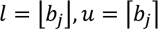

1.  在下限上分配概率：

1.  在上限上分配概率：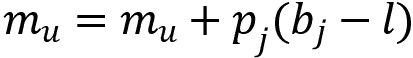

理解这些投影步骤如何工作有点棘手！所以，让我们通过考虑之前使用的相同示例来理解这一过程。设 z = [1, 2]，`N` = 2，，和 。

设预测分布的概率为 `p` = [0.5, 0.5]。*图 14.15* 显示了预测分布：


图 14.15：预测分布

设目标分布的概率为 `p` = [0.3, 0.7]。设奖励 `r` = 0.1 和折扣因子 ，我们知道 ，因此目标分布变为：


图 14.16：目标分布

从 *图 14.16* 中，我们可以推断目标分布的支持集与预测分布不同。现在，我们将学习如何使用前述步骤进行投影。

首先，我们初始化一个数组 `m`，其形状为支持集的大小，并将其值设置为零。即 `m` = [0, 0]。

**迭代，j=0**：

1.  计算目标支持值：

1.  计算 `b` 的值：

1.  计算下界和上界：

1.  在下界上分配概率：

1.  在上界上分配概率：

在第一次迭代后，`m` 的值变为 [0, 0]。

**迭代，j=1**：

1.  计算目标支持值：

1.  计算 `b` 的值：

1.  计算 `b` 的下界和上界：

1.  在下界上分配概率：

1.  在上界上分配概率：

在第二次迭代之后，`m` 的值变为 [0.07, 0.63]。迭代次数等于我们的支持集的长度。由于支持集的长度为 2，我们将在此停止，因此 `m` 的值成为我们为修改后的支持集分配的新概率，如 *图 14.17* 所示：


图 14.17：目标分布

以下代码片段将使我们更清楚投影步骤是如何工作的：

```py
m = np.zeros(num_support)
for j in range(num_support):
    Tz = min(v_max,max(v_min,r+gamma * z[j]))
    bj = (Tz - v_min) / delta_z
    l,u = math.floor(bj),math.ceil(bj)
    pj = p[j] 
    m[int(l)] += pj * (u - bj)
    m[int(u)] += pj * (bj - l) 
```

现在我们已经了解了如何计算目标值分布以及如何通过投影步骤使目标值分布的支持集等于预测值分布的支持集，接下来我们将学习如何计算交叉熵损失。交叉熵损失的计算公式为：


其中 `y` 是实际值， 是预测值。因此，我们可以写出：


其中 `m` 是目标值分布的目标概率，`p`(`s`, `a`) 是预测值分布的预测概率。我们通过最小化交叉熵损失来训练网络。

因此，使用分类 DQN 时，我们根据回报的分布（价值分布）选择动作。在下一节中，我们将把所有这些概念整合在一起，看看分类 DQN 是如何工作的。

## 将所有内容汇总

首先，我们将主网络参数初始化为随机值，并将目标网络参数初始化为仅通过复制主网络参数来实现。我们还初始化了重放缓冲区。

现在，对于每个步骤，在该回合中，我们将环境状态和支持值输入主分类 DQN，该网络由参数化。主网络将支持和环境状态作为输入，并返回每个支持的概率值。然后，可以计算价值分布的 Q 值，作为支持与其概率的乘积之和：


在计算状态中所有动作的 Q 值后，我们选择状态`s`中 Q 值最大的最佳动作：


然而，不是始终选择 Q 值最大的动作，我们使用 epsilon-greedy 策略选择动作。在 epsilon-greedy 策略中，我们以 epsilon 的概率选择一个随机动作，而以 1-epsilon 的概率选择 Q 值最大的最佳动作。我们执行选择的动作，移动到下一个状态，获得奖励，并将此转移信息存储在重放缓冲区中。

现在，我们从重放缓冲区中采样一个转移，并将下一个状态和支持值输入目标分类 DQN，该网络由参数化。目标网络将支持和下一个状态作为输入，并返回每个支持的概率值。

然后，Q 值可以作为支持与其概率的乘积之和来计算：


在计算所有下一个状态-动作对的 Q 值后，我们选择在状态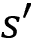中 Q 值最大的最佳动作：


现在，我们执行投影步骤。`m`表示投影步骤后目标分布的分布概率。

对于* j *，在支持数量的范围内：

1.  计算目标支持值：

1.  计算`b`的值：

1.  计算下界和上界：

1.  在下界上分配概率：

1.  在上界上分配概率：

执行投影步骤后，计算交叉熵损失：


其中`m`是目标值分布的目标概率，`p`(`s`, `a`)是从预测值分布中得到的预测概率。我们通过最小化交叉熵损失来训练网络。

我们并不会在每个时间步更新目标网络参数！[](img/B15558_14_040.png)。我们会在几个时间步内冻结目标网络参数！[](img/B15558_14_040.png)，然后将主网络参数！[](img/B15558_10_037.png)复制到目标网络参数！[](img/B15558_14_039.png)。我们会在多个回合中不断重复上述步骤，以逼近最优值分布。为了让我们有更详细的理解，接下来会介绍类别化 DQN 算法。

## 算法 – 类别化 DQN

类别化 DQN 算法的步骤如下：

1.  使用随机值初始化主网络参数！[](img/B15558_10_095.png)

1.  通过复制主网络参数！[](img/B15558_10_037.png)来初始化目标网络参数！[](img/B15558_14_039.png)

1.  初始化重放缓冲区！[](img/B15558_14_098.png)，支撑数量（原子数），以及！[](img/B15558_14_022.png)和！[](img/B15558_14_100.png)

1.  对于`N`个回合，执行*步骤 5*

1.  对于回合中的每一步，也就是，对于！[](img/B15558_14_101.png)：

    1.  将状态`s`和支撑值输入到主类别化 DQN 中，由！[](img/B15558_09_054.png)参数化，得到每个支撑的概率值。然后计算 Q 值为！[](img/B15558_14_103.png)

    1.  计算完 Q 值后，使用 epsilon-greedy 策略选择动作，即以概率 epsilon 选择随机动作`a`，以概率 1-epsilon 选择动作！[](img/B15558_14_028.png)

    1.  执行选择的动作并转移到下一个状态！[](img/B15558_14_105.png)，并获得奖励`r`

    1.  将转移信息存储在重放缓冲区！[](img/B15558_14_098.png)中

    1.  随机从重放缓冲区中采样一个转移！[](img/B15558_12_259.png)

    1.  将下一个状态！[](img/B15558_12_376.png)和支撑值输入到目标类别化 DQN 中，由！[](img/B15558_14_040.png)参数化，得到每个支撑的概率值。然后计算该值为！[](img/B15558_14_110.png)

    1.  计算完 Q 值后，我们选择状态！[](img/B15558_14_105.png)中的最佳动作，即选择具有最大 Q 值的动作！[](img/B15558_14_112.png)

    1.  用零值初始化数组`m`，其形状为支撑的数量

    1.  对于`j`，遍历支撑的数量：

        1.  计算目标支撑值：！[](img/B15558_14_113.png)

        1.  计算 b 的值：！[](img/B15558_14_114.png)

        1.  计算下界和上界：！[](img/B15558_14_047.png)

        1.  在下界上分配概率：！[](img/B15558_14_116.png)

        1.  在上界上分配概率：！[](img/B15558_14_117.png)

    1.  计算交叉熵损失：！[](img/B15558_14_118.png)

    1.  使用梯度下降最小化损失，并更新主网络的参数：

    1.  冻结目标网络参数  若干时间步长，然后通过简单地复制主网络参数  来更新它：

既然我们已经学习了类别 DQN 算法，为了理解类别 DQN 如何工作，我们将在下一节实现它。

## 使用类别 DQN 玩 Atari 游戏：

让我们实现类别 DQN 算法来玩 Atari 游戏。本节中使用的代码改编自开源的类别 DQN 实现，[`github.com/princewen/tensorflow_practice/tree/master/RL/Basic-DisRL-Demo`](https://github.com/princewen/tensorflow_practice/tree/master/RL/Basic-DisRL-Demo)，由 Prince Wen 提供。

首先，让我们导入必要的库：

```py
import numpy as np
import random
from collections import deque
import math
import tensorflow.compat.v1 as tf
tf.disable_v2_behavior()
import gym
from tensorflow.python.framework import ops 
```

### 定义变量：

现在，让我们定义一些重要的变量：

初始化  和 ：

```py
v_min = 0
v_max = 1000 
```

初始化原子数（支持）：

```py
atoms = 51 
```

设置折扣因子，：

```py
gamma = 0.99 
```

设置批处理大小：

```py
batch_size = 64 
```

设置我们希望更新目标网络的时间步长：

```py
update_target_net = 50 
```

设置在 epsilon-贪婪策略中使用的 epsilon 值：

```py
epsilon = 0.5 
```

### 定义重放缓冲区：

首先，让我们定义缓冲区长度：

```py
buffer_length = 20000 
```

将重放缓冲区定义为 deque 结构：

```py
replay_buffer = deque(maxlen=buffer_length) 
```

我们定义了一个名为 `sample_transitions` 的函数，它返回从重放缓冲区中随机采样的小批量转换：

```py
def sample_transitions(batch_size):
    batch = np.random.permutation(len(replay_buffer))[:batch_size]
    trans = np.array(replay_buffer)[batch]
    return trans 
```

### 定义类别 DQN 类：

定义一个名为 `Categorical_DQN` 的类，我们将在其中实现类别 DQN 算法。我们不会一次性查看整个代码，而是只查看重要部分。本节中使用的完整代码可以在本书的 GitHub 仓库中找到。

为了更清楚地理解，我们逐行查看代码：

```py
class Categorical_DQN(): 
```

#### 定义初始化方法：

首先，让我们定义初始化方法：

```py
 def __init__(self,env): 
```

启动 TensorFlow 会话：

```py
 self.sess = tf.InteractiveSession() 
```

初始化  和 ：

```py
 self.v_max = v_max
        self.v_min = v_min 
```

初始化原子数：

```py
 self.atoms = atoms 
```

初始化 epsilon 值：

```py
 self.epsilon = epsilon 
```

获取环境的状态形状：

```py
 self.state_shape = env.observation_space.shape 
```

获取环境的动作形状：

```py
 self.action_shape = env.action_space.n 
```

初始化时间步长：

```py
 self.time_step = 0 
```

初始化目标状态形状：

```py
 target_state_shape = [1]
        target_state_shape.extend(self.state_shape) 
```

定义状态的占位符：

```py
 self.state_ph = tf.placeholder(tf.float32,target_state_shape) 
```

定义动作的占位符：

```py
 self.action_ph = tf.placeholder(tf.int32,[1,1]) 
```

定义 `m` 值的占位符（目标分布的分布式概率）：

```py
 self.m_ph = tf.placeholder(tf.float32,[self.atoms]) 
```

计算  的值，作为 ：

```py
 self.delta_z = (self.v_max - self.v_min) / (self.atoms - 1) 
```

计算支持值，作为 ：

```py
 self.z = [self.v_min + i * self.delta_z for i in range(self.atoms)] 
```

构建类别 DQN：

```py
 self.build_categorical_DQN() 
```

初始化所有 TensorFlow 变量：

```py
 self.sess.run(tf.global_variables_initializer()) 
```

#### 构建类别 DQN：

定义一个名为 `build_network` 的函数，用于构建深度网络。由于我们处理的是 Atari 游戏，我们使用卷积神经网络：

```py
 def build_network(self, state, action, name, units_1, units_2, weights, bias): 
```

定义第一个卷积层：

```py
 with tf.variable_scope('conv1'):
            conv1 = conv(state, [5, 5, 3, 6], [6], [1, 2, 2, 1], weights, bias) 
```

定义第二卷积层：

```py
 with tf.variable_scope('conv2'):
            conv2 = conv(conv1, [3, 3, 6, 12], [12], [1, 2, 2, 1], weights, bias) 
```

将第二卷积层得到的特征图展平：

```py
 with tf.variable_scope('flatten'):
            flatten = tf.layers.flatten(conv2) 
```

定义第一个全连接层：

```py
 with tf.variable_scope('dense1'):
            dense1 = dense(flatten, units_1, [units_1], weights, bias) 
```

定义第二个全连接层：

```py
 with tf.variable_scope('dense2'):
            dense2 = dense(dense1, units_2, [units_2], weights, bias) 
```

将第二个全连接层与动作连接：

```py
 with tf.variable_scope('concat'):
            concatenated = tf.concat([dense2, tf.cast(action, tf.float32)], 1) 
```

定义第三层，并对第三层的结果应用 softmax 函数，获得每个原子的概率：

```py
 with tf.variable_scope('dense3'):
            dense3 = dense(concatenated, self.atoms, [self.atoms], weights, bias) 
        return tf.nn.softmax(dense3) 
```

现在，让我们定义一个名为 `build_categorical_DQN` 的函数，用于构建主类别和目标类别 DQN：

```py
 def build_categorical_DQN(self): 
```

定义主类别 DQN 并获取概率：

```py
 with tf.variable_scope('main_net'):
            name = ['main_net_params',tf.GraphKeys.GLOBAL_VARIABLES]
            weights = tf.random_uniform_initializer(-0.1,0.1)
            bias = tf.constant_initializer(0.1)
            self.main_p = self.build_network(self.state_ph,self.action_ph,name,24,24,weights,bias) 
```

定义目标类别 DQN 并获取概率：

```py
 with tf.variable_scope('target_net'):
            name = ['target_net_params',tf.GraphKeys.GLOBAL_VARIABLES]
            weights = tf.random_uniform_initializer(-0.1,0.1)
            bias = tf.constant_initializer(0.1)
            self.target_p = self.build_network(self.state_ph,self.action_ph,name,24,24,weights,bias) 
```

使用从主类别 DQN 获得的概率计算主要 Q 值，如  所示：

```py
 self.main_Q = tf.reduce_sum(self.main_p * self.z) 
```

类似地，使用从目标类别 DQN 获得的概率计算目标 Q 值，如  所示：

```py
 self.target_Q = tf.reduce_sum(self.target_p * self.z) 
```

定义交叉熵损失，如 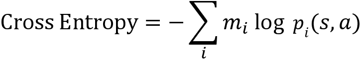 所示：

```py
 self.cross_entropy_loss = -tf.reduce_sum(self.m_ph * tf.log(self.main_p)) 
```

定义优化器，并使用 Adam 优化器最小化交叉熵损失：

```py
 self.optimizer = tf.train.AdamOptimizer(0.01).minimize(self.cross_entropy_loss) 
```

获取主网络参数：

```py
 main_net_params = tf.get_collection("main_net_params") 
```

获取目标网络参数：

```py
 target_net_params = tf.get_collection('target_net_params') 
```

定义 `update_target_net` 操作，通过复制主网络的参数来更新目标网络参数：

```py
 self.update_target_net = [tf.assign(t, e) for t, e in zip(target_net_params, main_net_params)] 
```

#### 定义训练函数：

让我们定义一个名为 `train` 的函数来训练网络：

```py
 def train(self,s,r,action,s_,gamma): 
```

增加时间步数：

```py
 self.time_step += 1 
```

获取目标 Q 值：

```py
 list_q_ = [self.sess.run(self.target_Q,feed_dict={self.state_ph:[s_],self.action_ph:[[a]]}) for a in range(self.action_shape)] 
```

选择下一个状态的动作 ，该动作具有最大 Q 值：

```py
 a_ = tf.argmax(list_q_).eval() 
```

初始化一个数组 `m`，其形状为支持的数量，并将其值设为零。`m` 表示在投影步骤后目标分布的分布概率：

```py
 m = np.zeros(self.atoms) 
```

使用目标类别 DQN 获取每个原子的概率：

```py
 p = self.sess.run(self.target_p,feed_dict = {self.state_ph:[s_],self.action_ph:[[a_]]})[0] 
```

执行投影步骤：

```py
 for j in range(self.atoms):
            Tz = min(self.v_max,max(self.v_min,r+gamma * self.z[j]))
            bj = (Tz - self.v_min) / self.delta_z 
            l,u = math.floor(bj),math.ceil(bj) 
            pj = p[j]
            m[int(l)] += pj * (u - bj)
            m[int(u)] += pj * (bj - l) 
```

通过最小化损失来训练网络：

```py
 self.sess.run(self.optimizer,feed_dict={self.state_ph:[s] , self.action_ph:[action], self.m_ph: m }) 
```

通过复制主网络参数来更新目标网络参数：

```py
 if self.time_step % update_target_net == 0:
            self.sess.run(self.update_target_net) 
```

#### 选择动作：

让我们定义一个名为 `select_action` 的函数，用于选择动作：

```py
 def select_action(self,s): 
```

我们生成一个随机数，如果该数字小于 epsilon，则选择随机动作，否则选择具有最大 Q 值的动作：

```py
 if random.random() <= self.epsilon:
            return random.randint(0, self.action_shape - 1)
        else: 
            return np.argmax([self.sess.run(self.main_Q,feed_dict={self.state_ph:[s],self.action_ph:[[a]]}) for a in range(self.action_shape)]) 
```

#### 训练网络：

现在，让我们开始训练网络。首先，使用 `gym` 创建 Atari 游戏环境。让我们创建一个网球游戏环境：

```py
env = gym.make("Tennis-v0") 
```

创建 `Categorical_DQN` 类的对象：

```py
agent = Categorical_DQN(env) 
```

设置回合数：

```py
num_episodes = 800 
```

对每一回合：

```py
for i in range(num_episodes): 
```

将 `done` 设置为 `False`：

```py
 done = False 
```

初始化回报：

```py
 Return = 0 
```

通过重置环境来初始化状态：

```py
 state = env.reset() 
```

当回合尚未结束时：

```py
 while not done: 
```

渲染环境：

```py
 env.render() 
```

选择一个动作：

```py
 action = agent.select_action(state) 
```

执行选定的动作：

```py
 next_state, reward, done, info = env.step(action) 
```

更新回报：

```py
 Return = Return + reward 
```

将过渡信息存储在回放缓冲区中：

```py
 replay_buffer.append([state, reward, [action], next_state]) 
```

如果回放缓冲区的长度大于或等于缓冲区大小，则开始通过从回放缓冲区中采样过渡来训练网络：

```py
 if len(replay_buffer) >= batch_size:
            trans = sample_transitions(batch_size)
            for item in trans:
                agent.train(item[0],item[1], item[2], item[3],gamma) 
```

将状态更新为下一个状态：

```py
 state = next_state 
```

打印回合中获得的回报：

```py
 print("Episode:{}, Return: {}".format(i,Return)) 
```

现在我们已经了解了类别 DQN 的工作原理及其实现方法，在接下来的章节中，我们将学习另一个有趣的算法。

# 分位回归 DQN：

在本节中，我们将研究另一种有趣的分布式强化学习算法，称为 QR-DQN。它是一种与类别 DQN 相似的分布式 DQN 算法；然而，它具有一些使其优于类别 DQN 的特性。

## 数学基础

在继续之前，让我们回顾一下在 QR-DQN 中使用的两个重要概念：

+   **分位数**

+   **反向累积分布函数**（**Inverse CDF**）

### 分位数

当我们将分布划分为均等的概率区域时，它们被称为分位数。例如，如*图 14.18*所示，我们将分布划分为两个均等的概率区域，并且我们有两个分位数，每个分位数的概率为 50%：


图 14.18：2-分位数图

### 反向 CDF（分位函数）

要理解 **反向累积分布函数**（**Inverse CDF**），首先，让我们了解什么是 **累积分布函数**（**CDF**）。

考虑一个随机变量 `X`，并且 `P`(`X`) 表示 `X` 的概率分布。那么，累积分布函数可以表示为：


这基本上意味着 `F`(`x`) 可以通过将所有小于或等于 `x` 的概率相加得到。

让我们看看下面的 CDF：


图 14.19：CDF

在前面的图表中， 表示累积概率，即 。假设 `i` = 1，那么 。

CDF 以 `x` 作为输入，返回累积概率 。因此，我们可以写为：


假设 `x` = 2，那么我们得到 。

现在，我们来看看反向 CDF。顾名思义，反向 CDF 是 CDF 的逆函数。也就是说，在 CDF 中，给定支持 `x`，我们可以得到累积概率 ，而在反向 CDF 中，给定累积概率 ，我们可以得到支持 `x`。反向 CDF 可以表示为：


以下图表显示了反向 CDF：


图 14.20：反向 CDF

如*图 14.20*所示，给定累积概率 ，我们可以得到支持 `x`。

假设 ，那么我们得到 `x` = 2。

我们已经学过分位数是均匀分布的概率。如*图 14.20*所示，我们有三个分位数 `q₁` 到 `q₃`，它们的概率均等，分位数的值分别为 [0.3,0.6,1.0]，这些正是我们的累积概率。因此，我们可以说，反向 CDF（分位函数）帮助我们在给定均等分布概率时，得到支持 `x` 的值。请注意，在反向 CDF 中，支持应该是递增的，因为它是基于累积概率的。

现在我们已经了解了分位数函数，我们将进一步了解如何使用名为 QR-DQN 的算法在分布式强化学习中利用分位数函数。

## 理解 QR-DQN

在类别 DQN（C51）中，我们了解到，为了预测价值分布，网络将分布的支持集作为输入并返回概率值。

为了计算支持集，我们还需要决定支持集的数量 `N`、支持集的最小值  和支持集的最大值 。

如果你还记得在 C51 中，我们的支持值是等间隔固定位置的 ，我们将这个等间隔的支持集作为输入，并得到非均匀概率 。正如 *图 14.21* 所示，在 C51 中，我们将等间隔的支持集  与状态(s)一起输入到网络，输出非均匀概率 ：


图 14.21：类别 DQN

QR-DQN 可以看作是 C51 的反向操作。在 QR-DQN 中，为了估算价值分布，我们输入均匀概率 ，网络输出在不同位置（不等间隔位置）的支持集 。如以下图所示，我们将均匀概率  与状态(s)一起输入到网络，输出位于不同位置的支持集 ：


图 14.22：QR-DQN

因此，从前两幅图中我们可以观察到，在类别 DQN 中，我们将等间距的固定支持集与状态一起输入到网络，网络返回非均匀概率；而在 QR-DQN 中，我们将均匀的概率与状态一起输入到网络，网络返回在不同位置（不等间隔位置）的支持集。

好的，但这有什么用呢？QR-DQN 究竟是如何工作的？我们来详细探讨一下。

我们理解到，QR-DQN 以均匀概率作为输入，并返回支持值，用于估算价值分布。我们能否利用分位数函数来估算价值分布呢？是的！我们了解到，分位数函数帮助我们根据等分概率获得支持值。因此，在 QR-DQN 中，我们通过估算分位数函数来估算价值分布。

分位数函数表示为：


其中 `z` 是支持集， 是等分的累积概率。因此，我们可以通过给定  来获得支持集 `z`。

设 `N` 为分位数的数量，则概率可以表示为：


例如，如果 `N` = 4，则 `p` = [0.25, 0.25, 0.25, 0.25]。如果 `N` = 5，则 p = [0.20, 0.20, 0.20, 0.20, 0.20]。

一旦我们决定了量化数 `N`，累积概率 （量化值）可以通过以下方式获得：


例如，如果 `N` = 4，则 。如果 `N` = 5，则 。

我们只需将这个均分的累积概率 （量化值）作为输入馈送给 QR-DQN，它返回支持值。也就是说，我们已经知道 QR-DQN 将值分布估计为量化函数，因此我们只需输入  就能获得值分布的支持值 `z`。

我们用一个简单的例子来理解这个问题。假设我们处于状态 `s`，并且在该状态下有两个可能的动作 *上* 和 *下*。如图所示，除了将状态 `s` 作为输入馈送给网络外，我们还将量化值  作为输入，量化值就是均分的累积概率。然后，我们的网络返回 *上* 动作的分布支持和 *下* 动作的分布支持：


图 14.23：QR-DQN

如果你回想一下，在 C51 中，我们计算了给定状态和动作的概率 `p`(`s`, `a`)，而在 QR-DQN 中，我们计算了给定状态和动作的支持 `z`(`s`, `a`)。

请注意，我们使用大写的 `Z`(`s`, `a`) 来表示值分布，小写的 `z`(`s`, `a`) 来表示分布的支持。

类似地，我们也可以使用量化函数来计算目标值分布。然后，我们通过最小化预测量化分布与目标量化分布之间的距离来训练我们的网络。

但根本问题是，我们为什么要这样做？它比 C51 更有利吗？量化回归 DQN 相比于类别 DQN 有几个优点。在量化回归 DQN 中：

+   我们不需要选择支持的数量和支持的界限，分别是  和 。

+   支持的界限没有限制，因此回报的范围可以在不同状态间变化。

+   我们还可以摆脱在 C51 中进行的投影步骤，这一步是为了匹配目标分布和预测分布的支持。

QR-DQN 的另一个重要优点是它最小化了预测分布和目标分布之间的 p-Wasserstein 距离。但为什么这很重要呢？最小化目标和预测分布之间的 Wasserstein 距离，帮助我们比最小化交叉熵更好地达到收敛。

好的，p-Wasserstein 距离到底是什么？p-Wasserstein 距离，`W[p]`，是逆 CDF 上的 `L`^p 度量。假设我们有两个分布 `U` 和 `V`，则这两个分布之间的 p-Wasserstein 度量为：


其中， 和  分别表示分布 `U` 和 `V` 的逆 CDF。因此，最小化两个逆 CDF 之间的距离意味着我们最小化 Wasserstein 距离。

我们了解到，在 QR-DQN 中，我们通过最小化预测分布和目标分布之间的距离来训练网络，而这两者都是分位数函数（逆 CDF）。因此，最小化预测分布和目标分布（逆 CDF）之间的距离意味着我们最小化 Wasserstein 距离。

QR-DQN 论文的作者（详见*进一步阅读*部分）还指出，与其计算分位数值  的支持值，他们建议使用分位数中点值 。分位数中点可以计算为：


即，可以使用分位数中点值来获得支持* z *，如 ，而不是使用分位数值来获得支持，如 。

那么，为什么使用分位数中点呢？分位数中点作为一个独特的最小化值，即，当我们使用分位数中点值  而不是分位数值  时，两个逆 CDF 之间的 Wasserstein 距离会更小。由于我们正在尝试最小化目标分布和预测分布之间的 Wasserstein 距离，我们可以使用分位数中点 ，使它们之间的距离更小。例如，如 *图 14.24* 所示，当我们使用分位数中点值  而不是分位数值  时，Wasserstein 距离会更小：


图 14.24：使用分位数中点值代替分位数值

来源 ([`arxiv.org/pdf/1710.10044.pdf`](https://arxiv.org/pdf/1710.10044.pdf))

简而言之，在 QR-DQN 中，我们将值分布计算为分位数函数。因此，我们只需将均等分配的累积概率输入网络，并获得分布的支持值，通过最小化目标分布和预测分布之间的 Wasserstein 距离来训练网络。

### 动作选择

在 QR-DQN 中，动作选择与 C51 相同。首先，我们从预测的值分布中提取 Q 值，然后选择具有最大 Q 值的动作。我们可以通过对值分布进行期望操作来提取 Q 值。分布的期望值为支持值与其对应概率的乘积之和。

在 C51 中，我们计算 Q 值的方法是：


其中，`p`i 是网络为状态 `s` 和动作 `a` 给出的概率，`zᵢ` 是支持。

而在 QR-DQN 中，我们的网络输出的是支撑而不是概率。所以，QR-DQN 中的 Q 值可以计算为：


其中`z`i 是网络为状态`s`和动作`a`提供的支撑，`pᵢ`是概率。

计算完 Q 值后，我们选择具有最大 Q 值的动作。例如，假设我们有一个状态`s`，并且在该状态下有两个动作，分别是*up*和*down*。在状态`s`下，动作*up*的 Q 值计算为：


在状态`s`下，动作*down*的 Q 值计算为：


计算完 Q 值后，我们选择具有最大 Q 值的最优动作：


现在我们已经了解了如何在 QR-DQN 中选择动作，在接下来的部分，我们将探讨 QR-DQN 的损失函数。

### 损失函数

在 C51 中，我们使用交叉熵损失作为我们的损失函数，因为我们的网络预测的是值分布的概率。因此，我们使用交叉熵损失来最小化目标分布和预测分布之间的概率。但在 QR-DQN 中，我们预测的是分布的支撑，而不是概率。也就是说，在 QR-DQN 中，我们将概率作为输入，并预测支撑作为输出。那么，我们如何定义 QR-DQN 的损失函数呢？

我们可以使用分位回归损失来最小化目标支撑和预测支撑之间的距离。但首先，让我们理解如何计算目标支撑值。

在继续之前，让我们回顾一下如何在 DQN 中计算目标值。在 DQN 中，我们使用贝尔曼方程并计算目标值为：


在前面的方程中，我们通过对所有可能的下一个状态-动作对取最大 Q 值来选择动作！[](img/B15558_14_187.png)。

类似地，在 QR-DQN 中，计算目标值时，我们可以使用分布式贝尔曼方程。分布式贝尔曼方程可以表示为：


所以，目标支撑`zⱼ`可以计算为：


要计算状态！[](img/B15558_14_036.png)的支撑`zⱼ`，我们还需要选择某个动作！[](img/B15558_14_132.png)。我们如何选择一个动作？我们只需使用目标网络计算所有下一个状态-动作对的回报分布，并选择具有最大 Q 值的动作！[](img/B15558_14_192.png)：


现在我们已经了解了如何计算目标支撑值，让我们来看一下如何计算分位回归损失。使用分位回归损失的优点在于它对过高估计和过低估计的误差添加了惩罚。让我们通过一个例子来理解这一点。

假设目标支撑值为[1, 5, 10, 15, 20]，而预测支撑值为[100, 5, 10, 15, 20]。如我们所见，预测的支撑值在初始量化时有一个非常高的值，然后开始递减。在逆 CDF 部分，我们学到支撑值应该始终递增，因为它是基于累积概率的。但是，如果你看预测值，支撑值从 100 开始，然后递减。

让我们考虑另一种情况。假设目标支撑值为[1, 5, 10, 15, 20]，而预测支撑值为[1, 5, 10, 15, 4]。如我们所见，预测的支撑值从初始量化值开始增加，然后在最后一个量化值时减少到 4。但这种情况不应该发生。因为我们使用的是逆 CDF，我们的支撑值应该始终是递增的。

因此，我们需要确保我们的支撑值应该是递增的，而不是递减的。所以，如果初始量化值被高估，而后续量化值被低估，我们可以对其进行惩罚。也就是说，我们将高估的值乘以，将低估的值乘以。好吧，我们如何判断一个值是高估还是低估的呢？

首先，我们计算目标值与预测值之间的差异。设`u`为目标支撑值与预测支撑值之间的差异。然后，如果`u`的值小于 0，我们将`u`乘以，否则我们将`u`乘以。这就是**量化回归损失**。

但是量化回归损失的问题在于它在 0 处不会平滑，并且会使梯度保持常数。因此，我们不使用量化回归损失，而是使用一种称为量化 Huber 损失的新修改版损失函数。

为了更好地理解量化 Huber 损失是如何工作的，我们首先来看一下 Huber 损失。设实际值与预测值之间的差异为`u`。那么 Huber 损失！[](img/B15558_14_198.png)可以表示为：


设！[](img/B15558_14_200.png)，那么，当绝对值！[](img/B15558_14_201.png)小于或等于！[](img/B15558_14_202.png)时，Huber 损失给出的是二次损失！[](img/B15558_14_203.png)，否则它是线性损失！[](img/B15558_14_204.png)。

以下 Python 代码片段有助于我们更好地理解 Huber 损失：

```py
def huber_loss(target,predicted, kappa=1):
    #compute u as difference between target and predicted value
    u = target – predicted
    #absolute value of u
    abs_u = abs(u)
    #compute quadratic loss
    quad_loss = 0.5 * (abs_u ** 2) 
    #compute linear loss
    linear_loss = kappa * (abs_u - 0.5 * kappa)
    #true where the absolute value is less than or equal to kappa
    flag = abs_u <= kappa
    #Loss is the quadratic loss where the absolute value is less than kappa 
    #else it is linear loss
    loss = (flag) * quad_loss + (~flag) * linear_loss

    return loss 
```

现在我们已经理解了 Huber 损失！[](img/B15558_14_198.png)，让我们来看看量化 Huber 损失。在量化 Huber 损失中，当`u`（目标支撑值与预测支撑值之间的差异）的值小于 0 时，我们将 Huber 损失！[](img/B15558_14_198.png)乘以，当`u`的值大于或等于 0 时，我们将 Huber 损失！[](img/B15558_14_198.png)乘以。

现在我们已经理解了 QR-DQN 的工作原理，在下一节中，我们将介绍另一种有趣的算法——D4PG。

# 分布式分布式 DDPG

**D4PG**，即**分布式分布式深度确定性策略梯度**，是最有趣的策略梯度算法之一。仅凭其名称，我们就可以猜测 D4PG 的工作原理。正如名字所示，D4PG 本质上是 **深度确定性策略梯度**（**DDPG**）与分布式强化学习的结合，并且以分布式方式工作。感到困惑？让我们更深入地探讨，了解 D4PG 的详细工作原理。

要理解 D4PG 是如何工作的，强烈建议复习我们在*第十二章*中讲解的 DDPG 算法，*学习 DDPG、TD3 和 SAC*。我们了解到，DDPG 是一种演员-评论员方法，其中演员尝试学习策略，而评论员则尝试通过 Q 函数评估演员产生的策略。评论员使用深度 Q 网络来估计 Q 函数，演员则使用策略网络来计算策略。因此，演员执行一个动作，而评论员对演员执行的动作给出反馈，并且根据评论员的反馈，演员网络会更新。

D4PG 的工作原理与 DDPG 类似，但在评论员网络中，我们不使用 DQN 来估计 Q 函数，而是可以使用分布式 DQN 来估计值分布。也就是说，在之前的章节中，我们已经学习了几种分布式 DQN 算法，如 C51 和 QR-DQN。因此，在评论员网络中，我们可以使用任何分布式 DQN 算法，例如 C51，而不是常规的 DQN。

除此之外，D4PG 还对 DDPG 架构提出了若干改进。因此，我们将深入探讨并了解 D4PG 与 DDPG 的具体差异。在继续之前，让我们先明确一下符号：

+   策略网络参数由  表示，目标策略网络参数由  表示。

+   评论员网络参数由  表示，目标评论员网络参数由  表示。

+   由于我们讨论的是确定性策略，假设它由  表示，并且我们的策略是通过策略网络参数化的，因此我们可以用  来表示该策略。

现在，我们将了解 D4PG 中评论员和演员网络的具体工作原理。

## 评论网络

在 DDPG 中，我们了解到我们使用评论员网络来估计 Q 函数。因此，给定一个状态和动作，评论员网络通过  来估计 Q 函数。为了训练评论员网络，我们最小化目标 Q 值（由贝尔曼最优方程给出）和网络预测的 Q 值之间的均方误差（MSE）。

在 DDPG 中，目标值是通过以下公式计算的：


一旦计算出目标值，我们计算目标值和预测值之间的均方误差（MSE）损失，公式为：

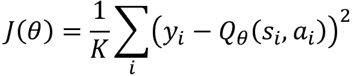

其中`K`表示从重放缓冲区随机采样的转移数量。计算损失后，我们计算梯度！[](img/B15558_14_219.png)，并使用梯度下降法更新评论员网络参数：


现在，让我们谈谈 D4PG 中的评论员。正如我们在 D4PG 中学到的那样，我们使用分布式 DQN 来估计 Q 值。因此，给定一个状态和动作，评论员网络估计价值分布，表示为！[](img/B15558_14_221.png)。

为了训练评论员网络，我们最小化目标值分布（由分布式 Bellman 方程给出）与网络预测的值分布之间的距离。

D4PG 中的目标值分布计算公式为：


如你所见，方程（2）与（1）相似，唯一的不同是我们将`Q`替换为`Z`，这表明我们正在计算目标值分布。D4PG 对目标值计算（2）提出了一个小的改动。我们不再使用一步回报`r`，而是使用**N 步回报**，其表达式为：


其中`N`是转移的长度，我们从重放缓冲区中采样。

在计算目标值分布后，我们可以计算目标值分布与预测值分布之间的距离，计算公式为：


其中`d`表示用于衡量两个分布之间距离的任何距离度量。假设我们使用 C51，那么`d`表示交叉熵，`K`表示从重放缓冲区采样的转移数量。计算损失后，我们计算梯度并更新评论员网络参数。梯度的计算公式为：


D4PG 对我们的梯度更新提出了一个小的改动。在 D4PG 中，我们使用**优先经验重放**。假设我们的经验重放缓冲区大小为`R`。重放缓冲区中的每个转移都有一个非均匀的概率`pᵢ`。这种非均匀概率帮助我们赋予某个转移比其他转移更高的权重。假设我们有一个样本`i`，那么它的概率可以表示为！[](img/B15558_14_226.png) 或者！[](img/B15558_14_227.png)。在更新评论员网络时，我们使用！[](img/B15558_14_228.png)对更新进行加权，从而赋予某些更新更大的重要性。

因此，我们的梯度计算公式为：

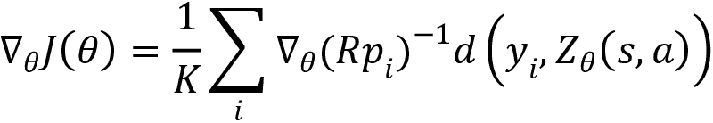

计算出梯度后，我们可以使用梯度下降法更新评论员网络参数，如！[](img/B15558_12_052.png)。现在我们已经理解了 D4PG 中评论员网络的工作原理，接下来让我们看看下一部分的演员网络。

## 演员网络

首先，让我们快速回顾一下 DDPG 中的演员网络是如何工作的。在 DDPG 中，我们了解到，演员网络将状态作为输入，返回动作：


请注意，我们在连续动作空间中使用确定性策略，并且为了探索新动作，我们只需向 actor 网络生成的动作中添加一些噪声 ，因为动作是连续值。

因此，我们修改后的动作可以表示为：


因此，actor 的目标函数是生成一个最大化评论员网络生成的 Q 值的动作：


其中 。

我们了解到，为了最大化目标，我们计算目标函数的梯度 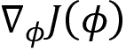，并通过执行梯度上升来更新 actor 网络参数。

现在让我们谈谈 D4PG。在 D4PG 中，我们执行相同的步骤，唯一的区别是。请注意，在这里我们没有使用评论员中的 Q 函数。相反，我们计算价值分布，因此我们的目标函数变为：


其中，动作为 ，就像我们在 DDPG 中看到的那样，为了最大化目标，我们首先计算目标函数的梯度 。在计算梯度之后，我们通过执行梯度上升来更新 actor 网络参数：


我们了解到，D4PG 是一个**分布式**算法，这意味着我们不是使用一个 actor，而是使用`L` **个 actor**，每个 actor 并行工作，独立于环境，收集经验，并将经验存储在重放缓冲区中。然后，我们定期更新网络参数给这些 actor。

因此，总结来说，D4PG 与 DDPG 相似，除了以下几点：

1.  我们在评论员网络中使用分布式 DQN，而不是使用常规的 DQN 来估计 Q 值。

1.  我们在目标中计算`N`步的回报，而不是计算一步回报。

1.  我们使用优先经验重放，并在评论员网络中为梯度更新增加重要性。

1.  我们使用`L`个独立的 actor，而不是一个 actor，每个 actor 并行工作，收集经验，并将经验存储在重放缓冲区中。

现在我们已经理解了 D4PG 是如何工作的，将我们学到的所有概念结合起来，接下来让我们看看 D4PG 的算法。

## 算法 – D4PG

令  表示我们希望更新目标评论员和 actor 网络参数的时间步骤。我们设置 ，表示我们每 2 步更新一次目标评论员网络和目标 actor 网络参数。类似地，令  表示我们希望将网络权重复制到`L`个 actor 的时间步骤。我们设置 ，表示我们每 2 步将网络权重复制到 actor。

D4PG 的算法如下所示：

1.  初始化评论员网络参数  和演员网络参数 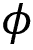

1.  初始化目标评论员网络参数  和目标演员网络参数 ，方法是从  和  复制

1.  初始化重放缓冲区 

1.  启动 `L` 个演员

1.  对于 `N` 个回合，重复 *步骤 6*

1.  对于每个回合中的每一步，即，！[](img/B15558_14_101.png)：

    1.  从重放缓冲区随机抽取 `K` 个过渡的迷你批次 

    1.  计算评论员的目标值分布，即，！[](img/B15558_14_253.png)

    1.  计算评论员网络的损失并计算梯度：

    1.  在计算梯度后，使用梯度下降更新评论员网络参数：

    1.  计算演员网络的梯度：

    1.  通过梯度上升更新演员网络参数：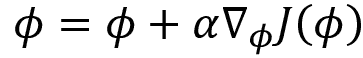

    1.  如果 `t` 对  取模，则：

        使用软替换更新目标评论员和目标演员网络参数，分别为  和 

    1.  如果 `t` 对 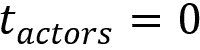 取模，则：

        将网络权重复制到演员中

然后我们在演员网络中执行以下步骤：

1.  基于策略  和探索噪声选择动作 `a`，即，！[](img/B15558_14_233.png)

1.  执行动作 `a`，移动到下一个状态 ，获得奖励 `r`，并将转换信息存储到重放缓冲区 

1.  重复 *步骤 1* 至 *步骤 2*，直到学习者完成

因此，我们已经了解了 D4PG 的工作原理。

# 总结

我们通过理解分布式强化学习的工作原理开始了本章的学习。我们了解到，在分布式强化学习中，不是基于期望回报来选择动作，而是根据回报的分布来选择动作，这通常被称为价值分布或回报分布。

接下来，我们了解了分类 DQN 算法，也称为 C51，其中我们将状态和分布的支持作为输入，网络返回价值分布的概率。我们还学习了投影步骤如何匹配目标和预测值分布的支持，以便我们可以应用交叉熵损失。

接下来，我们了解了分位回归 DQN，在这种方法中，我们将状态和等分的累积概率  作为输入馈送到网络中，网络返回分布的支持值。

在本章结束时，我们了解了 D4PG 的工作原理，也了解了它与 DDPG 的不同之处。

# 问题

让我们通过回答以下问题来测试我们对分布式强化学习的知识：

1.  什么是分布式强化学习？

1.  什么是分类 DQN？

1.  为什么分类 DQN 被称为 C51 算法？

1.  什么是分位数函数？

1.  QR-DQN 与分类 DQN 有何不同？

1.  D4PG 与 DDPG 有何不同？

# 进一步阅读

更多信息，请参考以下论文：

+   **从分布的角度看强化学习**，作者为*Marc G. Bellemare*、*Will Dabney*、*Remi Munos*，[`arxiv.org/pdf/1707.06887.pdf`](https://arxiv.org/pdf/1707.06887.pdf)

+   **使用分位回归的分布式强化学习**，作者为*Will Dabney*、*Mark Rowland*、*Marc G. Bellemare*、*Rémi Munos*，[`arxiv.org/pdf/1710.10044.pdf`](https://arxiv.org/pdf/1710.10044.pdf)

+   **分布式分布深度确定性策略梯度**，作者为*Gabriel Barth-Maron*、*等*，[`arxiv.org/pdf/1804.08617.pdf`](https://arxiv.org/pdf/1804.08617.pdf)
