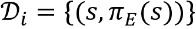
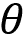
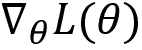
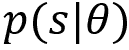

# 第十五章：模仿学习与逆向强化学习

从示范学习通常被称为模仿学习。在模仿学习的设置中，我们拥有专家的示范，并训练我们的智能体模仿这些专家的示范。通过示范学习有很多好处，包括帮助智能体更快地学习。执行模仿学习有几种方法，其中两种是**监督式模仿学习**和**逆向强化学习**（**IRL**）。

首先，我们将了解如何使用监督学习来执行模仿学习，然后我们将学习一种叫做**数据集聚合**（**DAgger**）的算法。接下来，我们将学习如何在 DQN 中使用示范数据，这里有一种叫做**深度 Q 学习从示范**（**DQfD**）的算法。

接下来，我们将了解 IRL 以及它如何与强化学习不同。我们将学习一种非常流行的 IRL 算法——**最大熵逆向强化学习**。在本章的最后，我们将了解**生成对抗模仿学习**（**GAIL**）是如何工作的。

在本章中，我们将学习以下主题：

+   监督式模仿学习

+   DAgger

+   深度 Q 学习与示范

+   逆向强化学习

+   最大熵逆向强化学习

+   生成对抗模仿学习

让我们通过理解监督式模仿学习如何工作来开始本章。

# 监督式模仿学习

在模仿学习的设置中，我们的目标是模仿专家。假设，我们想要训练我们的智能体开车。我们可以通过专家的示范来训练智能体，而不是让它从头开始与环境互动。好，那么什么是专家示范呢？专家示范是一组包含状态-动作对的轨迹，其中每个动作都是由专家执行的。

我们可以训练智能体模仿专家在各种相应状态下执行的动作。因此，我们可以将专家的示范视为训练数据，用来训练我们的智能体。模仿学习的基本思想是模仿（学习）专家的行为。

执行模仿学习的一种最简单和最直接的方法是将模仿学习任务视为监督学习任务。首先，我们收集一组专家示范，然后训练一个分类器，在相应的状态下执行专家所执行的相同动作。我们可以将其视为一个大的多类分类问题，并训练我们的智能体在相应状态下执行专家的动作。

我们的目标是最小化损失 ，其中  是专家的动作， 表示我们智能体执行的动作。

因此，在监督式模仿学习中，我们执行以下步骤：

1.  收集一组专家示范

1.  初始化一个策略 

1.  通过最小化损失函数  来学习策略

然而，这种方法存在一些挑战和缺点。智能体的知识仅限于专家的示范（训练数据），因此如果智能体遇到一个在专家示范中不存在的新状态，它将不知道在该状态下该执行什么动作。

比如，我们使用监督模仿学习训练一个智能体驾驶汽车，并让智能体在现实世界中执行任务。如果训练数据中没有智能体遇到交通信号灯的状态，那么我们的智能体将对交通信号灯一无所知。

此外，智能体的准确性高度依赖于专家的知识。如果专家的示范不佳或不最优，那么智能体就无法学习到正确的动作或最优策略。

为了克服监督模仿学习中的挑战，我们引入了一种新的算法，叫做 DAgger。在下一节中，我们将学习 DAgger 如何工作以及它如何克服监督模仿学习的局限性。

# DAgger

DAgger 是最常用的模仿学习算法之一。让我们通过一个例子来理解 DAgger 是如何工作的。我们重新回顾一下训练一个智能体驾驶汽车的例子。首先，我们初始化一个空数据集 。

**在第一次迭代中**，我们使用某个策略  来驾驶汽车。因此，我们利用该策略  生成一条轨迹 。我们知道，这条轨迹由一系列的状态和动作组成——即由我们的策略  访问的状态以及在这些状态下由我们的策略  执行的动作。现在，我们通过只取我们的策略  访问的状态来创建一个新数据集 ，并请专家为这些状态提供相应的动作。也就是说，我们取轨迹中的所有状态，并请专家为这些状态提供动作。

现在，我们将新数据集  与初始化的空数据集  结合，并更新 ，如：

接下来，我们在这个更新后的数据集上训练一个分类器 ，并学习一个新的策略 。

**在第二次迭代中**，我们使用新的策略  生成轨迹，创建一个新数据集 ，只取新的策略  访问的状态，并请专家为这些状态提供相应的动作。

现在，我们将数据集  与  结合，并更新 ，如：

接下来，我们在这个更新后的数据集上训练一个分类器 ，并学习一个新的策略 。

**在第三次迭代中**，我们使用新的策略  来生成轨迹，并通过只采集由新策略  访问的状态，创建一个新的数据集 ，然后我们要求专家提供这些状态的动作。

现在，我们将数据集  与  合并，并更新  为：

接下来，我们在这个更新后的数据集  上训练一个分类器，并学习一个新的策略 。通过这种方式，DAgger 通过一系列的迭代工作，直到找到最优策略。

现在我们对 Dagger 有了基本的理解；接下来，我们将深入探讨，了解 DAgger 如何找到最优策略。

## 了解 DAgger

假设我们有一个人类专家，并且用  表示专家策略。我们初始化一个空的数据集 ，并且初始化一个初学者策略 。

**迭代 1**：

在第一次迭代中，我们创建一个新的策略 ，表示为：

上述方程意味着我们通过结合一定量的专家策略  和一定量的初学者策略  来创建新的策略 。我们取多少专家策略和初学者策略是由参数  决定的。 的值为：

`p` 的值在 0.1 到 0.9 之间选择。由于我们处于第一次迭代，代入 `i` = 1，我们可以写成：

因此，代入方程 (1) 中的 ，我们可以写成：

如我们所见，在第一次迭代中，策略  只是一个专家策略 。现在，我们使用这个策略  来生成轨迹。接下来，我们通过收集我们策略  访问的所有状态，创建一个新的数据集 ，并要求专家提供这些状态的动作。因此，我们的数据集将包括 。

现在，我们将数据集  与初始化的空数据集  合并，并更新  为：

现在，我们有了更新后的数据集 ，我们在这个新数据集上训练一个分类器并提取一个新的策略。设新策略为 。

**迭代 2**：

在第二次迭代中，我们创建一个新的策略 ，表示为：

上述方程意味着我们通过结合一定量的专家策略  和我们在前一次迭代中获得的策略  来创建一个新的策略 。我们知道，beta 的值选取为： 。因此，我们得到 。

现在，我们使用这个策略  并生成轨迹。接下来，我们通过收集我们的策略  访问过的所有状态来创建一个新的数据集 ，并请求专家为这些状态提供动作。因此，我们的数据集将由  组成。

现在，我们将数据集  与  结合，并更新  如下：

现在，我们有了更新的数据集 ，我们在这个新数据集上训练分类器并提取新的策略。让我们将这个新策略命名为 。

我们重复这些步骤进行多次迭代，以获得最优策略。如我们在每次迭代中所观察到的，我们聚合数据集  并训练分类器以获得新的策略。请注意，值  正在指数衰减。这个现象是合理的，因为在多次迭代过程中，我们的策略会变得更好，因此可以减少专家策略的重要性。

现在我们已经了解了 DAgger 的工作原理，在接下来的章节中，我们将进一步研究 DAgger 算法以加深理解。

## 算法 – DAgger

DAgger 算法如下所示：

1.  初始化一个空数据集 。

1.  初始化策略 。

1.  对于迭代 `i` = 1 到 `N`：

    1.  创建策略 。

    1.  使用策略  生成轨迹。

    1.  通过收集策略  访问过的状态以及专家提供的这些状态的动作，创建一个数据集 。因此， 。

    1.  将数据集聚合为 。

    1.  在更新后的数据集上训练分类器  并提取新的策略 。

现在我们已经了解了 DAgger 算法，在接下来的章节中，我们将学习 DQfD。

# 来自演示的深度 Q 学习

我们了解到，在模仿学习中，我们尝试从专家演示中学习。我们能否在 DQN 中利用专家演示并获得更好的表现呢？答案是肯定的！在这一节中，我们将学习如何使用一种名为 DQfD 的算法，在 DQN 中利用专家演示。

在前面的章节中，我们学习了几种类型的 DQN。我们从基础的 vanilla DQN 开始，然后探索了各种对 DQN 的改进，如双重 DQN、对战 DQN、优先经验重放等。在所有这些方法中，智能体都试图通过与环境互动从零开始学习。智能体与环境互动，并将他们的互动经验存储在一个叫做重放缓冲区的地方，然后基于这些经验进行学习。

为了让智能体表现得更好，它必须从环境中获取大量经验，将其添加到重放缓冲区并进行自我训练。然而，这种方法会消耗大量的训练时间。在我们迄今为止学习的所有方法中，我们一直是在模拟器中训练智能体，因此智能体在模拟器环境中积累经验以提高表现。为了学习最优策略，智能体必须与环境进行大量的互动，其中一些互动可能会给智能体带来很差的奖励。在模拟器环境中，这种情况是可以容忍的。但是我们如何在真实环境中训练智能体呢？我们不能通过直接与真实环境互动并在真实环境中进行大量不良操作来训练智能体。

所以，在这些情况下，我们可以在一个对应于特定真实环境的模拟器中训练智能体。但是问题是，对于大多数用例，很难找到一个准确的模拟器来对应真实环境。不过，我们可以轻松地获得专家示范。

例如，假设我们要训练一个智能体来下棋。假设我们找不到一个准确的模拟器来训练智能体下棋。但是我们可以轻松地获得一个专家下棋的良好示范。

现在，我们能否利用这些专家示范来训练我们的智能体？可以！与其通过与环境互动从零开始学习，不如直接将专家示范添加到重放缓冲区，并基于这些专家示范预训练智能体，这样智能体可以更好、更快地学习。

这就是 DQfD 背后的基本理念。我们将专家示范填充到重放缓冲区中并预训练智能体。请注意，这些专家示范仅用于预训练智能体。一旦智能体完成预训练，它将与环境互动并获取更多经验，利用这些经验进行学习。因此，DQfD 包括两个阶段，分别是预训练和训练。

首先，我们基于专家示范对智能体进行预训练，然后通过与环境的交互来训练智能体。当智能体与环境进行交互时，它收集一些经验，并且智能体的经验（自生成数据）也被加入到回放缓冲区中。智能体利用专家示范和自生成的数据进行学习。我们使用优先经验回放缓冲区，给专家示范数据的优先级高于自生成数据。现在我们对 DQfD 有了基本的了解，让我们深入探讨并了解它是如何工作的。

## DQfD 的各个阶段

DQfD 由两个阶段组成：

+   预训练阶段

+   训练阶段

### 预训练阶段

在预训练阶段，智能体不会与环境进行交互。我们直接将专家示范添加到回放缓冲区中，智能体通过从回放缓冲区中抽取专家示范进行学习。

智能体通过最小化损失`J(Q)`来学习专家示范，使用的是梯度下降法。然而，仅仅通过专家示范进行预训练并不足以使智能体表现得更好，因为专家示范无法包含所有可能的转移。然而，通过专家示范进行预训练为训练我们的智能体提供了一个良好的起点。一旦智能体通过示范完成了预训练，在训练阶段，智能体将能够从初始迭代开始就执行更好的动作，而不是执行随机动作，因此智能体能够更快地学习。

### 训练阶段

一旦智能体完成预训练，我们就进入训练阶段，在此阶段智能体与环境进行交互，并根据其经验进行学习。由于智能体已经在预训练阶段从专家示范中学到了一些有用的信息，它在环境中将不再执行随机动作。

在训练阶段，智能体与环境进行交互，并将其转移信息（经验）存储在回放缓冲区中。我们了解到，回放缓冲区将预先填充专家示范数据。所以，现在我们的回放缓冲区将由专家示范和智能体的经验（自生成数据）混合组成。我们从回放缓冲区中抽取一个小批量经验并训练智能体。注意，这里我们使用的是优先回放缓冲区，所以在抽样时，我们会优先选择专家示范数据而非智能体生成的数据。通过这种方式，我们通过从回放缓冲区抽样经验并使用梯度下降来最小化损失，从而训练智能体。

我们了解到，智能体与环境进行交互，并将经验存储在重放缓冲区中。如果重放缓冲区已满，则我们会用智能体生成的新转移信息覆盖缓冲区。然而，我们不会覆盖专家示范。因此，专家示范将始终保留在重放缓冲区中，以便智能体可以利用这些专家示范进行学习。

因此，我们已经学习了如何使用专家示范对智能体进行预训练和训练。在下一节中，我们将了解 DQfD 的损失函数。

## DQfD 的损失函数

DQfD 的损失函数由四个损失的总和组成：

1.  双重 DQN 损失

1.  N 步双重 DQN 损失

1.  监督分类损失

1.  L2 损失

现在，我们将逐个查看这些损失。

**双重 DQN 损失** –  代表 1 步双重 DQN 损失。

**N 步双重 DQN 损失** –  代表 n 步双重 DQN 损失。

**监督分类损失** –  代表监督分类损失。其表达式为：

其中：

+   `a[E]` 是专家采取的动作。

+   `l(a[E], a)` 被称为边际函数或边际损失。当所采取的动作等于专家动作 `a = a[E]` 时，它为 0；否则，它为正值。

**L2 正则化损失** –  代表 L2 正则化损失。它可以防止智能体过度拟合示范数据。

因此，最终的损失函数将是前面四个损失的总和：

其中， 的值作为加权因子，帮助我们控制各个损失的相对重要性。

现在我们已经了解了 DQfD 的工作原理，接下来我们将在下一节中查看 DQfD 的算法。

## 算法 – DQfD

DQfD 的算法如下所示：

1.  初始化主网络参数 

1.  通过复制主网络参数  来初始化目标网络参数 

1.  使用专家示范初始化重放缓冲区 

1.  设置 `d`：我们希望延迟更新目标网络参数的时间步数

1.  **预训练阶段**：对于步骤 ：

    1.  从重放缓冲区中采样一个小批量经验 

    1.  计算损失 `J(Q)`

    1.  使用梯度下降更新网络参数

    1.  如果 `t` mod `d` = 0：

        通过复制主网络参数  来更新目标网络参数 

1.  **训练阶段**：对于步骤 `t = 1, 2, ..., T`：

    1.  选择一个动作

    1.  执行所选动作，进入下一个状态，观察奖励，并将该转移信息存储在重放缓冲区中 

    1.  从重放缓冲区中采样一个小批量经验，带有优先级 

    1.  计算损失 `J(Q)`

    1.  使用梯度下降更新网络参数

    1.  如果 `t mod d = 0`：

        通过复制主网络参数 ，更新目标网络参数 

就这样！在接下来的章节中，我们将学习一个非常有趣的概念——逆强化学习（IRL）。

# 逆强化学习

**逆强化学习（IRL）**是强化学习中最令人兴奋的领域之一。在强化学习中，我们的目标是学习最优策略。也就是说，我们的目标是找到能够提供最大回报（轨迹奖励总和）的最优策略。为了找到最优策略，首先，我们应该知道奖励函数是什么。奖励函数告诉我们，在状态 `s` 中执行一个动作 `a` 时，我们获得什么奖励。一旦我们拥有奖励函数，就可以训练我们的智能体学习能够提供最大奖励的最优策略。但问题是，对于复杂任务，设计奖励函数并不是一件容易的事。

考虑为一些任务设计奖励函数，比如智能体学习走路、自驾车等。在这些情况下，设计奖励函数并不简单，涉及为各种智能体行为分配奖励。例如，考虑为一个学习驾驶的智能体设计奖励函数。在这种情况下，我们需要为智能体的每个行为分配奖励。例如，如果智能体遵守交通信号、避开行人、没有撞到任何物体，我们可以为这些行为分配较高的奖励。但是以这种方式设计奖励函数并不是最优的，并且很可能会遗漏一些智能体的行为。

好的，现在问题是我们能否学习到奖励函数？当然可以！如果我们有专家演示，那么我们可以从专家演示中学习奖励函数。但是，我们具体该如何做呢？这就是 IRL 帮助我们的地方。顾名思义，IRL 是强化学习的逆过程。

在强化学习（RL）中，我们试图在给定奖励函数的情况下找到最优策略，但在逆强化学习（IRL）中，我们试图根据专家演示学习奖励函数。一旦我们通过 IRL 从专家演示中推导出奖励函数，就可以使用该奖励函数训练我们的智能体，通过任何强化学习算法学习最优策略。

IRL 包含几个有趣的算法。在接下来的章节中，我们将学习其中一个最流行的 IRL 算法——最大熵逆强化学习（maximum entropy IRL）。

## 最大熵逆强化学习

在这一节中，我们将学习如何使用一种名为最大熵逆强化学习（maximum entropy IRL）的 IRL 算法，从给定的专家演示集中提取奖励函数。在深入了解最大熵逆强化学习之前，让我们先学习一些理解最大熵逆强化学习运作所必需的重要术语。

### 关键术语

**特征向量** – 我们可以通过特征向量 `f` 来表示状态。假设我们有一个状态 `s`，那么它的特征向量可以定义为 `fₛ`。

**特征计数** – 假设我们有一条轨迹 ；那么该轨迹的特征计数定义为轨迹中所有状态的特征向量之和：

其中  表示轨迹  的特征计数。

**奖励函数** – 奖励函数可以定义为特征的线性组合，即特征向量乘以权重的和 ：

其中  表示权重，`fₛ` 表示特征向量。注意，这个  就是我们要学习的内容。当我们获得最优的  时，我们将拥有正确的奖励函数。我们将在下一节学习如何找到最优的 。

我们可以用 Sigma 表示法将前面的方程式表示为：

我们知道特征计数是轨迹中所有状态的特征向量之和，因此根据（2），我们可以将前面的方程式重写为：

因此，轨迹的奖励就是权重与轨迹的特征计数相乘。

### 回到最大熵逆向强化学习

现在，让我们了解最大熵逆向强化学习（IRL）是如何工作的。假设我们有专家演示 。我们的目标是从给定的专家演示中学习奖励函数。我们该如何做呢？

我们已经了解到奖励函数是 。找到最优参数  帮助我们学习正确的奖励函数。所以，我们将从专家演示中采样一条轨迹  并通过找到最优参数  来学习奖励函数。

从专家演示中采样轨迹的概率与奖励函数的指数成正比。也就是说，获得更多奖励的轨迹比获得更少奖励的轨迹更有可能从我们的演示中被采样：

概率应该在 0 到 1 之间，对吗？但是  的值不会在 0 到 1 之间。所以，为了归一化这个值，我们引入了 `z`，它作为归一化常数，并定义为 。我们可以用 `z` 重写前面的方程式：

现在，我们的目标是最大化 ，即最大化选择那些获得更多奖励的轨迹的对数概率。因此，我们可以定义我们的目标函数为：

其中 `M` 表示演示次数。

将 (3) 代入 (4)，我们可以写成：

根据对数规则，，我们可以写成：

对数项和指数项相互抵消，所以前面的方程变为：

我们知道 ；将 `z` 的值代入后，我们可以重写前面的方程为：

我们知道 ；将  的值代入后，最终简化后的目标函数为：

为了找到最优参数 ，我们计算前述目标函数  的梯度，并将  的值更新为 。在下一部分，我们将学习如何计算梯度 。

### 计算梯度

我们了解到我们的目标函数为：

现在，我们计算关于  的目标函数梯度。经过计算，我们得到的梯度为：

特征计数的平均值即为特征期望 ，因此我们可以代入  并将前面的方程重写为：

我们可以通过将轨迹的所有状态结合起来，重写前面的方程：

因此，使用前面的方程，我们计算梯度并更新参数 。如果你看前面的方程，我们可以轻松计算出第一个项，它就是特征期望 ，但是第二项中的  怎么办？ 被称为状态访问频率，它表示处于给定状态的概率。那么，我们如何计算  呢？

如果我们有一个策略 ，那么我们可以使用该策略计算状态访问频率。但我们还没有任何策略。因此，我们可以使用动态规划方法，比如值迭代，来计算策略。然而，为了通过值迭代方法计算策略，我们需要一个奖励函数。因此，我们只需输入我们的奖励函数 ，然后通过值迭代提取策略。接着，使用提取的策略计算状态访问频率。

使用策略  计算状态访问频率的步骤如下：

1.  设在时间 `t` 访问状态 `s` 的概率为 。我们可以写出在第一次时间步 `t` = 1 访问初始状态 `s₁` 的概率为： 

1.  然后对于时间步 `t` = 1 到 `T`：

    计算 

1.  计算状态访问频率为 。

为了清楚理解最大熵 IRL 的工作原理，让我们在下一节中深入研究该算法。

### 算法 – 最大熵 IRL

最大熵 IRL 算法如下所示：

1.  初始化参数  并收集演示 

1.  对于 `N` 次迭代：

    1.  计算奖励函数 

    1.  使用上一阶段获得的奖励函数通过价值迭代计算策略

    1.  使用上一阶段获得的策略计算状态访问频率 

    1.  计算相对于  的梯度，即 

    1.  更新  的值为 

因此，经过一系列迭代，我们将找到一个最优的参数 。一旦得到 ，我们就可以使用它来定义正确的奖励函数 。在下一节中，我们将学习 GAIL。

# 生成对抗模仿学习

**生成对抗模仿学习 (GAIL)** 是另一个非常流行的 IRL 算法。顾名思义，它基于 **生成对抗网络 (GANs)**，这是我们在 *第七章*《*深度学习基础*》中学习过的内容。要理解 GAIL 的工作原理，我们首先应该回顾 GAN 的工作原理。

在 GAN 中，我们有两个网络：一个是生成器，另一个是判别器。生成器的作用是通过学习输入数据集的分布生成新的数据点。判别器的作用是分类给定的数据点是由生成器（学习的分布）生成的，还是来自真实的数据分布。

最小化 GAN 的损失函数意味着最小化 **Jensen Shannon (JS)** 散度，JS 散度用于度量两个概率分布之间的差异。因此，当真实数据分布和假数据分布（学习的分布）之间的 JS 散度为零时，表示真实和假数据分布是相等的，即我们的生成器网络成功地学习到了真实分布。

现在，让我们学习如何在 IRL 设置中使用 GAN。首先，我们引入一个新的术语叫做 **占据度量**。它定义为我们的智能体在使用某个策略  探索环境时，遇到的状态和动作的分布。简单来说，它基本上是按照策略  跟随的状态-动作对的分布。策略  的占据度量用  表示。

在模仿学习设置中，我们有一个专家策略，记作 。同样，记智能体的策略为 。现在，我们的目标是让智能体学习专家策略。我们怎么做呢？如果我们使专家策略和智能体策略的占用度量相等，那么就意味着智能体已经成功学习了专家策略。也就是说，占用度量是遵循某个策略的状态-动作对的分布。如果我们能使智能体策略的状态-动作对分布等于专家策略的状态-动作对分布，那么就意味着我们的智能体学到了专家策略。接下来，我们将探讨如何使用 GAN 实现这一目标。

我们可以将专家策略的占用度量看作真实数据分布，将智能体策略的占用度量看作伪数据分布。因此，最小化专家策略  和智能体策略  的占用度量之间的 JS 散度，就意味着智能体会学习专家策略。

在 GAN 中，我们知道生成器的作用是通过学习给定数据集的分布来生成新的数据点。同样，在 GAIL 中，生成器的作用是通过学习专家策略的分布（占用度量）来生成新的策略。判别器的作用是分类给定的策略是专家策略还是智能体策略。

在 GAN 中，我们知道，对于生成器来说，最优的判别器是无法区分真实数据和伪数据分布的；同样，在 GAIL 中，最优的判别器是无法区分生成的状态-动作对是来自智能体策略还是来自专家策略。

为了更清楚地理解，我们通过将 GAIL 中的术语与 GAN 术语进行对比，来了解我们在 GAIL 中使用的术语：

+   **真实数据分布** – 专家策略的占用度量

+   **伪数据分布** – 智能体策略的占用度量

+   **真实数据** – 专家策略生成的状态-动作对

+   **伪数据** – 智能体策略生成的状态-动作对

简而言之，我们使用生成器生成状态-动作对，目的是让判别器无法分辨该状态-动作对是通过专家策略还是通过智能体策略生成的。生成器和判别器都是神经网络。我们通过 TRPO 训练生成器，生成一个与专家策略相似的策略。判别器是一个分类器，并使用 Adam 优化。因此，我们可以定义 GAIL 的目标函数如下：

其中  是生成器的参数， 是判别器的参数。

现在我们已经理解了 GAIL 是如何工作的，接下来让我们更详细地学习如何推导前面的方程。

## GAIL 的公式化

在本节中，我们探讨了 GAIL 的数学原理，并看它是如何工作的。如果你对数学不感兴趣，可以跳过这一部分。我们知道，在强化学习中，我们的目标是找到一个给出最大奖励的最优策略。它可以表示为：

我们可以通过添加策略的熵来重新定义我们的目标函数，如下所示：

前面的方程告诉我们，我们可以在最大化奖励的同时，也最大化策略的熵。我们可以将目标函数定义为成本，而不是奖励。

也就是说，我们可以将我们的 RL 目标函数定义为成本，因为我们的目标是找到一个最小化成本的最优策略；这可以表示为：

其中`c`是成本。因此，给定成本函数，我们的目标是找到最小化成本的最优策略。

现在，让我们谈谈 IRL。我们了解到，在 IRL 中，我们的目标是从给定的专家示范集中找出奖励函数。我们也可以将 IRL 的目标定义为成本，而不是奖励。也就是说，我们可以将 IRL 的目标函数定义为成本，因为我们的目标是找到一个使专家示范最优的成本函数。该目标可以通过最大因果熵 IRL 表示为：

前面的方程意味着什么？在 IRL 设置中，我们的目标是根据专家示范（专家策略）学习成本函数。我们知道专家策略的表现优于其他策略，因此我们尝试学习成本函数`c`，该函数将低成本分配给专家策略，并将高成本分配给其他策略。因此，前面的目标函数意味着我们尝试找到一个成本函数，该函数将低成本分配给专家策略，并将高成本分配给其他策略。

为了减少过拟合，我们引入正则化项！，并将前面的方程改写为：

从方程（6）我们了解到，在强化学习设置中，给定一个成本，我们可以获得最优策略；而从（7）我们了解到，在逆向强化学习（IRL）设置中，给定专家策略（专家示范），我们可以获得成本。因此，从（6）和（7）可以观察到，IRL 的输出可以作为 RL 的输入。也就是说，IRL 的结果是成本函数，我们可以将该成本函数作为输入，在 RL 中学习最优策略。因此，我们可以写出！，这意味着 IRL 的结果作为输入传递给 RL。

我们可以将其表示为函数组合形式：：

在方程（8）中，适用以下内容：

+    是正则化器  的凸共轭。

+    是智能体策略的占用度量。

+    是专家策略的占用度量。

要了解公式 (8) 是如何推导出来的，可以参考本章末尾的*进一步阅读*部分中的 GAIL 论文。目标函数（公式 (8)）意味着我们试图找到一个最优策略，其占用度量接近专家策略的占用度量。智能体策略和专家策略之间的占用度量通过  进行度量。对于正则化器 ，有几种选择。我们使用生成对抗正则化器 ，并将我们的方程写为：

因此，最小化  基本上意味着我们最小化智能体策略  和专家策略  之间的 JS 散度。因此，我们可以将方程 (9) 的右侧重写为：

其中  只是策略正则化器。我们知道，通过 GAN 最小化智能体策略  和专家策略  之间的 JS 散度，因此我们可以将前面的方程中的  替换为 GAN 目标函数，如下所示：

其中  是生成器的参数， 是判别器的参数。

因此，我们的 GAIL 最终目标函数变为：

目标方程意味着我们可以通过最小化专家策略和智能体策略的占用度量来找到最优策略，我们通过使用 GAN 来最小化它。

生成器的作用是通过学习专家策略的占用度量来生成一个策略，而判别器的作用是判断生成的策略是来自专家策略还是智能体策略。因此，我们使用 TRPO 训练生成器，而判别器基本上是一个神经网络，用来告诉我们生成的策略是专家策略还是智能体策略。

# 总结

我们通过了解模仿学习是什么以及监督模仿学习如何运作来开始本章内容。接下来，我们学习了 DAgger 算法，在该算法中，我们将通过一系列迭代获得的数据集进行聚合，并学习最优策略。

在看完 DAgger 后，我们学习了 DQfD，其中我们通过专家演示预填充回放缓冲区，并在训练阶段之前用专家演示预训练智能体。

接下来，我们学习了逆向强化学习（IRL）。我们理解到，在强化学习中，我们尝试根据奖励函数寻找最优策略，而在 IRL 中，我们则是根据专家示范来学习奖励函数。当我们通过 IRL 从专家示范中推导出奖励函数时，就可以使用该奖励函数来训练我们的智能体，借助任何强化学习算法来学习最优策略。然后，我们探索了如何使用最大熵 IRL 算法来学习奖励函数。

在本章的最后，我们了解了 GAIL，其中我们使用生成对抗网络（GAN）来学习最优策略。在下一章，我们将探索一个名为 Stable Baselines 的强化学习库。

# 问题

让我们评估一下我们对模仿学习和逆向强化学习（IRL）的理解。尝试回答以下问题：

1.  监督式模仿学习是如何工作的？

1.  DAgger 与监督式模仿学习有何不同？

1.  解释 DQfD 的不同阶段。

1.  我们为什么需要逆向强化学习（IRL）？

1.  什么是特征向量？

1.  GAIL 是如何工作的？

# 进一步阅读

更多信息，请参考以下论文：

+   **将模仿学习和结构化预测归结为无悔在线学习的简化** 由 *Stephane Ross*、*Geoffrey J. Gordon*、*J. Andrew Bagnell* 撰写，[`arxiv.org/pdf/1011.0686.pdf`](https://arxiv.org/pdf/1011.0686.pdf)

+   **深度 Q 学习与示范** 由 *Todd Hester*、*等人* 撰写，[`arxiv.org/pdf/1704.03732.pdf`](https://arxiv.org/pdf/1704.03732.pdf)

+   **最大熵逆向强化学习** 由 *Brian D. Ziebart*、*Andrew Maas*、*J.Andrew Bagnell*、*Anind K. Dey* 撰写，[`www.aaai.org/Papers/AAAI/2008/AAAI08-227.pdf`](https://www.aaai.org/Papers/AAAI/2008/AAAI08-227.pdf)

+   **生成对抗模仿学习** 由 *Jonathan Ho*、*Stefano Ermon* 撰写，[`arxiv.org/pdf/1606.03476.pdf`](https://arxiv.org/pdf/1606.03476.pdf)
