# 第十六章：使用 Stable Baselines 进行深度强化学习

到目前为止，我们已经学习了各种深度**强化学习**（**RL**）算法。如果我们有一个库，可以轻松实现深度 RL 算法，那该多好呢？是的！目前有多个库可以轻松构建深度 RL 算法。

一种流行的深度强化学习库是 OpenAI Baselines。OpenAI Baselines 提供了许多深度强化学习算法的高效实现，使得它们更容易使用。然而，OpenAI Baselines 并没有提供很好的文档。因此，我们将关注 OpenAI Baselines 的一个分支——**Stable Baselines**。

Stable Baselines 是 OpenAI Baselines 的改进版。Stable Baselines 更易于使用，它还包括最先进的深度 RL 算法和一些有用的功能。我们可以使用 Stable Baselines 快速原型化 RL 模型。

让我们从安装 Stable Baselines 开始本章内容，然后我们将学习如何使用该库创建第一个代理。接下来，我们将学习向量化环境。然后，我们将学习如何使用 Stable Baselines 实现几种深度强化学习算法，并探索基准库的各种功能。

本章我们将学习以下内容：

+   安装 Stable Baselines

+   使用 Stable Baselines 创建我们的第一个代理

+   使用向量化环境进行多进程处理

+   使用 DQN 及其变种玩 Atari 游戏

+   使用 A2C 进行月球着陆任务

+   使用 DDPG 摆动起摆锤

+   使用 TRPO 训练代理行走

+   实现 GAIL

让我们从安装 Stable Baselines 开始本章内容。

# 安装 Stable Baselines

首先，让我们安装所需的依赖项：

```py
sudo apt-get update && sudo apt-get install cmake libopenmpi-dev zlib1g-dev 
```

一些深度 RL 算法需要 MPI 才能运行，因此，让我们安装 MPI：

```py
sudo pip install mpi4py 
```

现在，我们可以通过`pip`安装 Stable Baselines：

```py
pip install stable-baselines[mpi] 
```

请注意，目前 Stable Baselines 仅支持 TensorFlow 1.x 版本。因此，请确保你在使用 TensorFlow 1.x 版本运行 Stable Baselines 实验。

现在我们已经安装了 Stable Baselines，让我们看看如何使用它创建第一个代理。

# 使用 Stable Baselines 创建我们的第一个代理

现在，让我们使用 Stable Baselines 构建我们的第一个深度 RL 算法。我们将使用**深度 Q 网络**（**DQN**）创建一个简单的代理，用于山地汽车爬坡任务。我们知道，在山地汽车爬坡任务中，汽车被放置在两座山之间，代理的目标是驾车爬上右边的山。

首先，我们从`stable_baselines`导入`gym`和`DQN`：

```py
import gym
from stable_baselines import DQN 
```

创建一个山地汽车环境：

```py
env = gym.make('MountainCar-v0') 
```

现在，让我们实例化我们的代理。正如我们在下面的代码中看到的，我们传递了`MlpPolicy`，这意味着我们的网络是一个多层感知机：

```py
agent = DQN('MlpPolicy', env, learning_rate=1e-3) 
```

现在，让我们通过指定训练的时间步数来训练代理：

```py
agent.learn(total_timesteps=25000) 
```

就这样。构建一个 DQN 代理并训练它就这么简单。

## 评估训练后的代理

我们还可以通过使用`evaluate_policy`来评估训练后的代理，查看平均奖励：

```py
from stable_baselines.common.evaluation import evaluate_policy 
```

在下面的代码中，`agent`是训练好的代理，`agent.get_env()`获取我们训练代理的环境，`n_eval_episodes`表示我们需要评估代理的集数：

```py
mean_reward, n_steps = evaluate_policy(agent, agent.get_env(), n_eval_episodes=10) 
```

## 存储和加载训练好的代理

使用 Stable Baselines，我们还可以将训练好的代理保存到磁盘并从磁盘加载。

我们可以如下保存代理：

```py
agent.save("DQN_mountain_car_agent") 
```

保存之后，我们可以如下加载代理：

```py
agent = DQN.load("DQN_mountain_car_agent") 
```

## 查看训练好的代理

训练后，我们还可以看看我们的训练代理在环境中的表现。

初始化状态：

```py
state = env.reset() 
```

对于 5000 步：

```py
for t in range(5000): 
```

使用我们训练好的代理预测在给定状态下执行的动作：

```py
 action, _ = agent.predict(state) 
```

执行预测的动作：

```py
 next_state, reward, done, info = env.step(action) 
```

将`state`更新为当前状态：

```py
 state = next_state 
```

渲染环境：

```py
 env.render() 
```

现在，我们可以看到训练好的代理在环境中的表现：

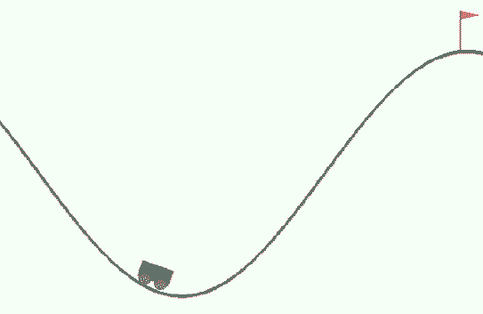

图 16.1：代理学习爬山

## 将所有内容结合起来

现在，让我们看一下结合我们迄今为止学到的所有内容的最终代码：

```py
#import the libraries
import gym
from stable_baselines import DQN
from stable_baselines.common.evaluation import evaluate_policy
#create the gym environment
env = gym.make('MountainCar-v0')
#instantiate the agent
agent = DQN('MlpPolicy', env, learning_rate=1e-3)
#train the agent
agent.learn(total_timesteps=25000)
#evaluate the agent
mean_reward, n_steps = evaluate_policy(agent, agent.get_env(), n_eval_episodes=10)
#save the trained agent
agent.save("DQN_mountain_car_agent")
#view the trained agent
state = env.reset()
for t in range(5000):
    action, _ = agent.predict(state)
    next_state, reward, done, info = env.step(action)
    state = next_state
    env.render() 
```

既然我们已经对如何使用 Stable Baselines 有了基本的了解，接下来我们将详细探讨它。

# 向量化环境

Stable Baselines 的一个非常有趣且有用的功能是，我们可以在多个独立环境中训练我们的代理，既可以在单独的进程中（使用**SubprocVecEnv**），也可以在同一个进程中（使用**DummyVecEnv**）。

例如，假设我们正在一个平衡小车环境中训练我们的代理——我们可以不只在一个小车平衡环境中训练，而是在多个小车平衡环境中训练我们的代理。

我们通常每一步训练代理时只使用一个环境，但现在我们可以每一步在多个环境中训练代理。这有助于代理更快地学习。现在，我们的状态、动作、奖励和结束状态将以向量的形式呈现，因为我们正在多个环境中训练代理。因此，我们称之为向量化环境。

Stable Baselines 提供了两种类型的向量化环境：

+   SubprocVecEnv

+   DummyVecEnv

## SubprocVecEnv

在子进程向量化环境中，我们在**单独**的进程中运行每个环境（利用多进程）。现在，让我们看看如何创建子进程向量化环境。

首先，让我们导入`SubprocVecEnv`：

```py
from stable_baselines.common.vec_env import SubprocVecEnv
from stable_baselines.common import set_global_seeds 
```

接下来，我们创建一个名为`make_env`的函数，用于初始化我们的环境：

```py
def make_env(env_name, rank, seed=0):
    def _init():
        env = gym.make(env_name)
        env.seed(seed + rank)
        return env
    set_global_seeds(seed)
    return _init 
```

然后，我们可以如下创建子进程向量化环境：

```py
env_name = 'Pendulum-v0'
num_process = 2
env = SubprocVecEnv([make_env(env_name, i) for i in range(num_process)]) 
```

## DummyVecEnv

在虚拟向量化环境中，我们在当前的 Python 进程中按顺序运行每个环境。它不支持多进程。现在，让我们看看如何创建虚拟向量化环境。

首先，让我们导入`DummyVecEnv`：

```py
from stable_baselines.common.vec_env import DummyVecEnv 
```

接下来，我们可以如下创建虚拟向量化环境：

```py
env_name = 'Pendulum-v0'
env = DummyVecEnv([lambda: gym.make(env_name)]) 
```

既然我们已经学会了如何在多个独立环境中使用向量化环境训练代理，接下来的部分，我们将学习如何将自定义环境集成到 Stable Baselines 中。

# 集成自定义环境

我们还可以使用 Stable Baselines 在自定义环境中训练智能体。在创建自定义环境时，我们需要确保我们的环境遵循 Gym 接口。也就是说，我们的环境应该包含如`step`、`reset`、`render`等方法。

假设我们自定义环境的名称是`CustomEnv`。首先，我们按如下方式实例化自定义环境：

```py
env = CustomEnv() 
```

接下来，我们可以像往常一样在自定义环境中训练我们的智能体：

```py
agent = DQN('MlpPolicy', env, learning_rate=1e-3)
agent.learn(total_timesteps=25000) 
```

就这样。在下一部分，让我们学习如何使用 DQN 及其变体来玩 Atari 游戏。

# 使用 DQN 及其变体玩 Atari 游戏

现在，让我们学习如何创建一个 DQN 来玩 Atari 游戏，使用 Stable Baselines。首先，让我们导入必要的模块：

```py
from stable_baselines import DQN 
```

由于我们处理的是 Atari 游戏，我们可以使用卷积神经网络（CNN）而不是普通的神经网络。所以，我们使用`CnnPolicy`：

```py
from stable_baselines.deepq.policies import CnnPolicy 
```

我们了解到，在将游戏画面输入智能体之前，我们需要对其进行预处理。使用 Stable Baselines 时，我们不需要手动预处理；相反，我们可以使用`make_atari`模块，它会负责预处理游戏画面：

```py
from stable_baselines.common.atari_wrappers import make_atari 
```

现在，让我们创建一个 Atari 游戏环境。我们先创建冰球游戏环境：

```py
env = make_atari('IceHockeyNoFrameskip-v4') 
```

实例化智能体：

```py
agent = DQN(CnnPolicy, env, verbose=1) 
```

训练智能体：

```py
agent.learn(total_timesteps=25000) 
```

在训练完智能体之后，我们可以查看训练后的智能体在环境中的表现：

```py
state = env.reset()
while True:
    action, _ = agent.predict(state)
    next_state, reward, done, info = env.step(action)
    state = next_state
    env.render() 
```

上述代码展示了我们的训练智能体如何玩冰球游戏：

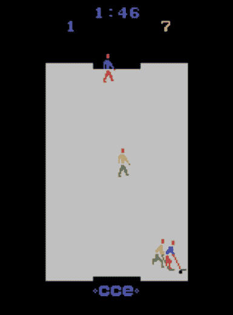

图 16.2：智能体正在玩冰球游戏

## 实现 DQN 变体

我们刚刚学习了如何使用 Stable Baselines 实现 DQN。现在，让我们看看如何实现 DQN 的变体，如双重 DQN、带优先经验回放的 DQN 和对抗 DQN。在 Baselines 中实现 DQN 变体非常简单。

首先，我们定义我们的关键字参数如下：

```py
kwargs = {"double_q": True, "prioritized_replay": True, "policy_kwargs": dict(dueling=True)} 
```

现在，在实例化智能体时，我们只需要传递关键字参数：

```py
agent = DQN(CnnPolicy, env, verbose=1, **kwargs) 
```

然后，我们可以像往常一样训练智能体：

```py
agent.learn(total_timesteps=25000) 
```

就这样！现在我们已经有了带优先经验回放的对抗双重 DQN。接下来的部分，我们将学习如何使用**优势演员-评论家算法**（**A2C**）玩月球着陆游戏。

# 使用 A2C 进行月球着陆

让我们学习如何使用 Stable Baselines 实现 A2C 来处理月球着陆任务。在月球着陆环境中，我们的智能体驾驶太空飞行器，目标是准确地在着陆平台上着陆。如果我们的智能体（着陆器）偏离着陆平台，那么它将失去奖励，且如果智能体坠毁或停下，回合将会终止。环境的动作空间包括四个离散动作：什么也不做、启动左侧定向引擎、启动主引擎以及启动右侧定向引擎。现在，让我们看看如何使用 A2C 训练智能体，以便正确地在着陆平台上着陆。

首先，让我们导入必要的库：

```py
import gym
from stable_baselines.common.policies import MlpPolicy
from stable_baselines.common.vec_env import DummyVecEnv
from stable_baselines.common.evaluation import evaluate_policy
from stable_baselines import A2C 
```

使用 Gym 创建月球着陆环境：

```py
env = gym.make('LunarLander-v2') 
```

让我们使用虚拟向量化环境。我们知道，在虚拟向量化环境中，我们在同一个进程中运行每个环境：

```py
env = DummyVecEnv([lambda: env]) 
```

创建智能体：

```py
agent = A2C(MlpPolicy, env, ent_coef=0.1, verbose=0) 
```

训练智能体：

```py
agent.learn(total_timesteps=25000) 
```

训练结束后，我们可以通过查看平均奖励来评估我们的智能体：

```py
mean_reward, n_steps = evaluate_policy(agent, agent.get_env(), n_eval_episodes=10) 
```

我们还可以看看训练后的智能体在环境中的表现：

```py
state = env.reset()
while True:
    action, _states = agent.predict(state)
    next_state, reward, done, info = env.step(action)
    state = next_state
    env.render() 
```

上述代码将展示我们训练后的智能体如何成功降落在着陆平台上：

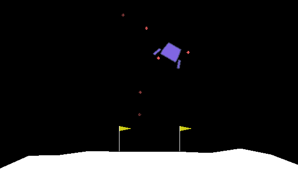

图 16.3：智能体玩月球着陆者游戏

## 创建自定义网络

在上一节中，我们学习了如何使用 Stable Baselines 创建 A2C。我们可以定制网络架构吗？当然可以！通过 Stable Baselines，我们还可以使用自定义的网络架构。让我们来看一下如何做到这一点。

首先，让我们导入前馈策略（前馈网络）：

```py
from stable_baselines.common.policies import FeedForwardPolicy 
net_arch=[dict(pi=[128, 128, 128], vf=[128, 128, 128])], which specifies our network architecture. pi represents the architecture of the policy network and vf represents the architecture of value network: 
```

```py
class CustomPolicy(FeedForwardPolicy):
    def __init__(self, *args, **kargs):
        super(CustomPolicy, self).__init__(*args, **kargs,
                                           net_arch=[dict(pi=[128, 128, 128], vf=[128, 128, 128])], feature_extraction="mlp") 
```

我们可以通过以下方式使用自定义策略来实例化智能体：

```py
agent = A2C(CustomPolicy, 'LunarLander-v2', verbose=1) 
```

现在，我们可以像往常一样训练智能体：

```py
agent.learn(total_timesteps=25000) 
```

就是这样。类似地，我们可以创建自己的自定义网络。在下一节中，让我们学习如何使用**深度确定性策略梯度（DDPG）**算法执行*倒立摆摆动*任务。

# 使用 DDPG 摆动倒立摆

让我们学习如何使用 Stable Baselines 实现倒立摆摆动任务的 DDPG。首先，让我们导入必要的库：

```py
import gym
import numpy as np
from stable_baselines.ddpg.policies import MlpPolicy
from stable_baselines.common.noise import NormalActionNoise, OrnsteinUhlenbeckActionNoise, AdaptiveParamNoiseSpec
from stable_baselines import DDPG 
```

使用 Gym 创建倒立摆环境：

```py
env = gym.make('Pendulum-v0') 
```

获取动作的数量：

```py
n_actions = env.action_space.shape[-1] 
```

我们知道，在 DDPG 中，我们不是直接选择动作，而是使用 Ornstein-Uhlenbeck 过程添加一些噪声，以确保探索。因此，我们创建动作噪声如下：

```py
action_noise = OrnsteinUhlenbeckActionNoise(mean=np.zeros(n_actions), sigma=float(0.5) * np.ones(n_actions)) 
```

实例化智能体：

```py
agent = DDPG(MlpPolicy, env, verbose=1, param_noise=None, action_noise=action_noise) 
```

训练智能体：

```py
agent.learn(total_timesteps=25000) 
```

在训练完智能体后，我们还可以通过渲染环境来查看训练后的智能体如何摆动倒立摆。我们也可以查看 DDPG 的计算图吗？是的！在下一节中，我们将学习如何做到这一点。

## 在 TensorBoard 中查看计算图

使用 Stable Baselines，我们可以更轻松地在 TensorBoard 中查看模型的计算图。为了做到这一点，我们只需要在实例化智能体时传递将存储日志文件的目录，如下所示：

```py
agent = DDPG(MlpPolicy, env, verbose=1, param_noise=None, action_noise=action_noise, tensorboard_log="logs") 
```

然后，我们可以训练智能体：

```py
agent.learn(total_timesteps=25000) 
```

训练结束后，打开终端并输入以下命令来运行 TensorBoard：

```py
tensorboard --logdir logs 
```

如我们所见，我们现在可以查看 DDPG 模型（智能体）的计算图：

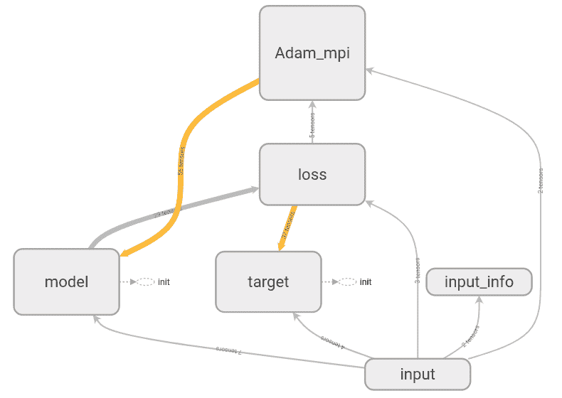

图 16.4：DDPG 的计算图

从*图 16.4*中，我们可以理解如何生成 DDPG 的计算图，就像我们在*第十二章*中学习的那样，*学习 DDPG、TD3 和 SAC*。

现在，让我们展开并深入查看模型节点，以便更清晰地理解：

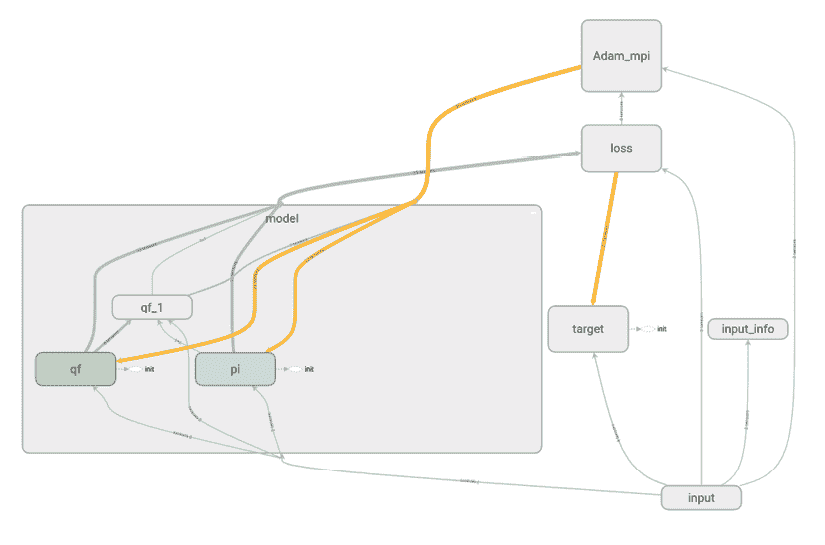

图 16.5：DDPG 的计算图

如从*图 16.5*所示，我们的模型包括策略（演员）和 Q（评论员）网络。

现在我们已经学习了如何使用 Stable Baselines 实现 DDPG 来完成倒立摆摆动任务，接下来我们将学习如何使用 Stable Baselines 实现 TRPO。

# 使用 TRPO 训练一个走路的智能体

在本节中，我们将学习如何使用 **信任区域策略优化** (**TRPO**) 训练智能体走路。我们将使用 MuJoCo 环境来训练智能体。**MuJoCo** 代表 **带接触的多关节动力学**，是用于训练智能体执行连续控制任务的最流行的模拟器之一。

请注意，MuJoCo 是一个专有物理引擎，因此我们需要获得许可证才能使用它。此外，MuJoCo 提供 30 天的免费试用期。安装 MuJoCo 需要一系列特定的步骤。接下来，我们将看到如何安装 MuJoCo 环境。

## 安装 MuJoCo 环境

首先，在您的主目录中创建一个新的隐藏文件夹，名为 `.mujoco`。接下来，访问 MuJoCo 网站 ([`www.roboti.us/`](https://www.roboti.us/))，并根据您的操作系统下载 MuJoCo。如 *图 16.6* 所示，MuJoCo 支持 Windows、Linux 和 macOS：

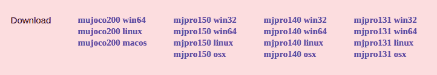

图 16.6：不同的 MuJoCo 版本

如果您使用的是 Linux，则可以下载名为 `mujoco200 linux` 的压缩文件。下载压缩文件后，解压文件并将其重命名为 `mujoco200`。现在，将 `mujoco200` 文件夹复制并将该文件夹放置在主目录中的 `.mujoco` 文件夹内。

如 *图 16.7* 所示，现在在我们的主目录中，我们有一个 `.mujoco` 文件夹，且在 `.mujoco` 文件夹内有一个 `mujoco200` 文件夹：

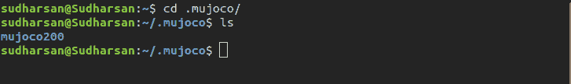

图 16.7：安装 MuJoCo

现在，我们需要获取试用许可证。首先，访问 [`www.roboti.us/license.html`](https://www.roboti.us/license.html) 并注册试用许可证，如 *图 16.8* 所示：

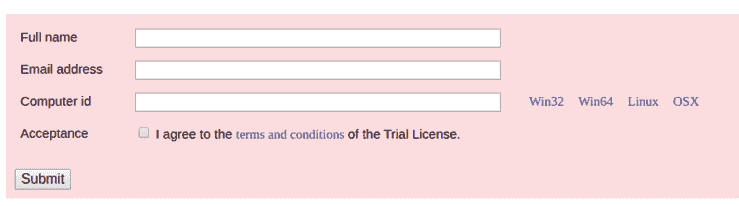

图 16.8：注册试用许可证

注册时，我们还需要计算机 ID。如 *图 16.8* 所示，在 **计算机 ID** 字段的右侧，我们有不同平台的名称。现在，只需点击您的操作系统，您就会获得相应的可执行 `getid` 文件。例如，如果您使用的是 Linux，则会获得名为 `getid_linux` 的文件。

下载 `getid_linux` 文件后，在终端中运行以下命令：

```py
chmod +x getid_linux 
```

然后，运行以下命令：

```py
./getid_linux 
```

上述命令将显示您的计算机 ID。获取计算机 ID 后，填写表格并注册以获取许可。点击 **提交** 按钮后，您将收到 Roboti LLC Licensing 发送的电子邮件。

从电子邮件中下载名为 `mjkey.txt` 的文件。接下来，将 `mjkey.txt` 文件放入 `.mujoco` 文件夹中。如 *图 16.9* 所示，现在我们的 `.mujoco` 隐藏文件夹中包含 `mjkey.txt` 文件和一个名为 `mujoco200` 的文件夹：

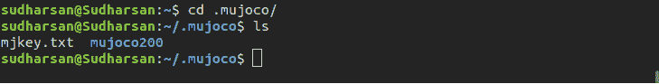

图 16.9：安装 MuJoCo

接下来，打开终端并运行以下命令来编辑 `bashrc` 文件：

```py
nano ~/.bashrc 
```

将以下行复制到 `bashrc` 文件中，并确保将用户名文本替换为您自己的用户名：

```py
export LD_LIBRARY_PATH=$LD_LIBRARY_PATH:/home/username/.mujoco/mujoco200/bin 
```

接下来，保存文件并退出 nano 编辑器。现在，在终端运行以下命令：

```py
source ~/.bashrc 
```

做得好！我们快完成了。现在，克隆 MuJoCo 的 GitHub 仓库：

```py
git clone https://github.com/openai/mujoco-py.git 
```

进入`mujoco-py`文件夹：

```py
cd mujoco-py 
```

更新软件包：

```py
sudo apt-get update 
```

安装依赖项：

```py
sudo apt-get install libgl1-mesa-dev libgl1-mesa-glx libosmesa6-dev python3-pip python3-numpy python3-scipy 
```

最后，安装 MuJoCo：

```py
pip3 install -r requirements.txt
sudo python3 setup.py install 
```

为了测试 MuJoCo 是否安装成功，让我们通过在环境中采取随机行动来运行一个 Humanoid 智能体。所以，创建一个名为`mujoco_test.py`的 Python 文件，内容如下：

```py
import gym
env = gym.make('Humanoid-v2')
env.reset()
for t in range(1000):
  env.render()
  env.step(env.action_space.sample())
env.close() 
```

接下来，打开终端并运行 Python 文件：

```py
python mujoco_test.py 
```

上述代码将渲染`Humanoid`环境，如*图 16.10 所示*：

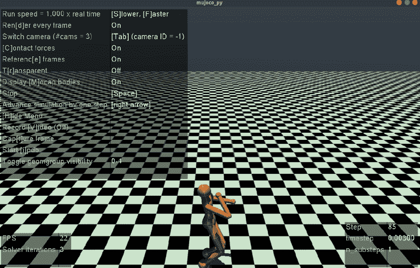

图 16.10：Humanoid 环境

现在我们已经成功安装了 MuJoCo，在下一节中，我们将开始实现 TRPO 训练我们的智能体走路。

## 实现 TRPO

导入必要的库：

```py
import gym
from stable_baselines.common.policies import MlpPolicy
from stable_baselines.common.vec_env import DummyVecEnv, VecNormalize
from stable_baselines import TRPO
from stable_baselines.common.vec_env import VecVideoRecorder 
```

使用`DummyVecEnv`创建一个向量化的`Humanoid`环境：

```py
env = DummyVecEnv([lambda: gym.make("Humanoid-v2")]) 
```

对状态（观测值）进行归一化：

```py
env = VecNormalize(env, norm_obs=True, norm_reward=False,
                   clip_obs=10.) 
```

实例化智能体：

```py
agent = TRPO(MlpPolicy, env) 
```

训练智能体：

```py
agent.learn(total_timesteps=250000) 
```

在训练完智能体后，我们可以通过渲染环境来看我们的训练智能体是如何学会走路的：

```py
state = env.reset()
while True:
    action, _ = agent.predict(state)
    next_state, reward, done, info = env.step(action)
    state = next_state
    env.render() 
```

将本节中使用的整个代码保存到一个名为`trpo.py`的 Python 文件中，然后打开终端并运行该文件：

```py
python trpo.py 
```

我们可以在*图 16.11*中看到我们的训练智能体是如何学会走路的：

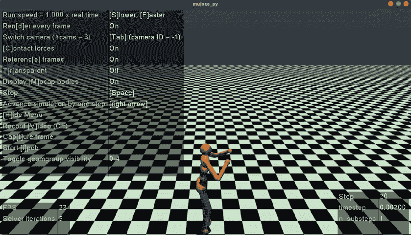

图 16.11：使用 TRPO 训练智能体走路

始终使用终端运行使用 MuJoCo 环境的程序。

就这样。在下一节中，我们将学习如何将我们训练过的智能体的动作录制成视频。

## 录制视频

在上一节中，我们使用 TRPO 训练了我们的智能体学会走路。我们也可以录制训练好的智能体的视频吗？可以！通过 Stable Baselines，我们可以轻松地使用`VecVideoRecorder`模块录制智能体的视频。

请注意，要录制视频，我们需要在机器上安装`ffmpeg`包。如果没有安装，可以使用以下命令集进行安装：

```py
sudo add-apt-repository ppa:mc3man/trusty-media
sudo apt-get update
sudo apt-get dist-upgrade
sudo apt-get install ffmpeg 
```

现在，让我们导入`VecVideoRecorder`模块：

```py
from stable_baselines.common.vec_env import VecVideoRecorder 
```

定义一个名为`record_video`的函数来录制视频：

```py
def record_video(env_name, agent, video_length=500, prefix='', video_folder='videos/'): 
```

创建环境：

```py
 env = DummyVecEnv([lambda: gym.make(env_name)]) 
```

实例化视频录制器：

```py
 env = VecVideoRecorder(env, video_folder=video_folder,
        record_video_trigger=lambda step: step == 0, video_length=video_length, name_prefix=prefix) 
```

在环境中选择动作时，我们的训练智能体会将时间步数设置为视频长度：

```py
 state = env.reset()
    for t in range(video_length):
        action, _ = agent.predict(state)
        next_state, reward, done, info = env.step(action)
        state = next_state
    env.close() 
```

就这样！现在，让我们调用我们的`record_video`函数。请注意，我们传递了环境名称、我们训练的智能体、视频时长和视频文件的名称：

```py
record_video('Humanoid-v2', agent, video_length=500, prefix='Humanoid_walk_TRPO') 
```

现在，我们将在`videos`文件夹中生成一个名为`Humanoid_walk_TRPO-step-0-to-step-500.mp4`的新文件：

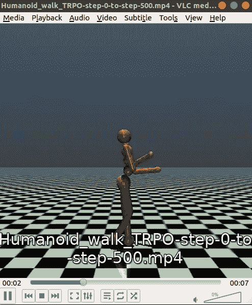

图 16.12：录制的视频

通过这种方式，我们可以录制训练智能体的动作。在下一节中，我们将学习如何使用 Stable Baselines 实现 PPO。

# 使用 PPO 训练猎豹机器人跑步

在本节中，我们将学习如何使用**近端策略优化**（**PPO**）训练 2D 猎豹机器人跑步。首先，导入必要的库：

```py
import gym
from stable_baselines.common.policies import MlpPolicy
from stable_baselines.common.vec_env import DummyVecEnv, VecNormalize
from stable_baselines import PPO2 
```

使用`DummyVecEnv`创建一个向量化环境：

```py
env = DummyVecEnv([lambda: gym.make("HalfCheetah-v2")]) 
```

对状态进行归一化：

```py
env = VecNormalize(env,norm_obs=True) 
```

实例化代理：

```py
agent = PPO2(MlpPolicy, env) 
```

训练代理：

```py
agent.learn(total_timesteps=250000) 
```

训练完成后，我们可以通过渲染环境看到我们训练的猎豹机器人是如何学会奔跑的：

```py
state = env.reset()
while True:
    action, _ = agent.predict(state)
    next_state, reward, done, info = env.step(action)
    state = next_state
    env.render() 
```

将本节中使用的整个代码保存在名为`ppo.py`的 Python 文件中，然后打开终端并运行该文件：

```py
python ppo.py 
```

我们可以看到我们训练的猎豹机器人是如何学会奔跑的，如*图 16.13*所示：

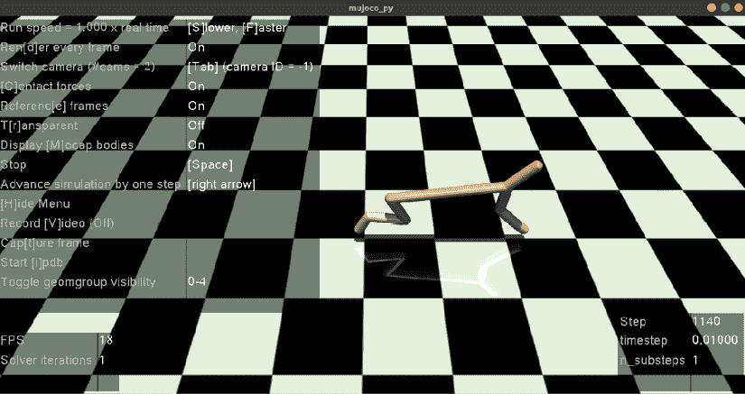

图 16.13：2D 猎豹机器人学习奔跑

## 制作一个训练代理的 GIF

在上一节中，我们学习了如何使用 PPO 训练猎豹机器人奔跑。我们能否也创建一个训练代理的 GIF 文件？当然可以！让我们看看如何做到这一点。

首先，导入必要的库：

```py
import imageio
import numpy as np 
```

初始化用于存储图像的列表：

```py
images = [] 
```

通过重置环境来初始化状态，其中`agent`是我们在前一节中训练的代理：

```py
state = agent.env.reset() 
```

渲染环境并获取图像：

```py
img = agent.env.render(mode='rgb_array') 
```

对环境中的每一步，保存图像：

```py
for i in range(500):
    images.append(img)
    action, _ = agent.predict(state)
    next_state, reward, done ,info = agent.env.step(action)
    state = next_state
    img = agent.env.render(mode='rgb_array') 
```

按如下方式创建 GIF 文件：

```py
imageio.mimsave('HalfCheetah.gif', [np.array(img) for i, img in enumerate(images) if i%2 == 0], fps=29) 
```

现在，我们将获得一个名为`HalfCheetah.gif`的新文件，如*图 16.14*所示：

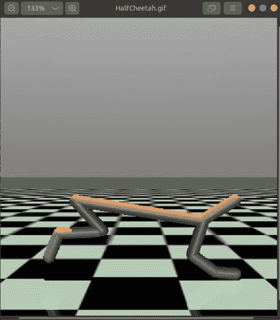

图 16.14：训练代理的 GIF

这样，我们就可以获得训练代理的 GIF。在下一节中，我们将学习如何使用 Stable Baselines 实现 GAIL。

# 实现 GAIL

在本节中，我们将探讨如何使用 Stable Baselines 实现**生成对抗模仿学习**（**GAIL**）。在*第十五章*，*模仿学习与逆向强化学习*中，我们了解到，使用生成器以一种方式生成状态-动作对，使得判别器无法区分该状态-动作对是使用专家策略还是代理策略生成的。我们训练生成器使用 TRPO 生成类似专家策略的策略，而判别器是一个分类器，使用 Adam 进行优化。

要实现 GAIL，我们需要专家轨迹，这样我们的生成器才能学习模仿专家轨迹。那么，如何获得专家轨迹呢？首先，我们使用 TD3 算法生成专家轨迹，然后创建专家数据集。接着，使用这个专家数据集，我们训练 GAIL 代理。注意，除了使用 TD3，我们还可以使用任何其他算法生成专家轨迹。

首先，让我们导入必要的库：

```py
import gym
from stable_baselines import GAIL, TD3
from stable_baselines.gail import ExpertDataset, generate_expert_traj 
```

实例化 TD3 代理：

```py
agent = TD3('MlpPolicy', 'MountainCarContinuous-v0', verbose=1) 
```

生成专家轨迹：

```py
generate_expert_traj(agent, 'expert_traj', n_timesteps=100, n_episodes=20) 
```

使用专家轨迹创建专家数据集：

```py
dataset = ExpertDataset(expert_path='expert_traj.npz', traj_limitation=10, verbose=1) 
```

使用专家数据集（专家轨迹）实例化 GAIL 代理：

```py
agent = GAIL('MlpPolicy', 'MountainCarContinuous-v0', dataset, verbose=1) 
```

训练 GAIL 代理：

```py
agent.learn(total_timesteps=25000) 
```

训练完成后，我们还可以渲染环境，看看我们训练的代理在环境中的表现。就这样，使用 Stable Baselines 实现 GAIL 就是这么简单。

# 总结

本章开始时，我们理解了 Stable Baselines 是什么以及如何安装它。然后，我们学习了如何使用 DQN 在 Stable Baselines 中创建我们的第一个智能体。我们还学习了如何保存和加载智能体。接下来，我们学习了如何通过向量化创建多个独立的环境。我们还学习了两种类型的向量化环境，分别是 SubprocVecEnv 和 DummyVecEnv。

我们了解到，在 SubprocVecEnv 中，我们将每个环境运行在不同的进程中，而在 DummyVecEnv 中，我们将每个环境运行在同一个进程中。

接下来，我们学习了如何使用 Stable Baselines 实现 DQN 及其变体来玩 Atari 游戏。之后，我们学习了如何实现 A2C，以及如何创建自定义策略网络。接着，我们学习了如何实现 DDPG，并且如何在 TensorBoard 中查看计算图。

更进一步，我们学习了如何设置 MuJoCo 环境，以及如何使用 TRPO 训练智能体行走。我们还学习了如何录制一个训练好的智能体的视频。接下来，我们学习了如何实现 PPO，并且如何制作训练好的智能体的 GIF 动图。在本章的最后，我们学习了如何使用 Stable Baselines 实现生成对抗模仿学习。

# 问题

让我们来检验一下我们对 Stable Baselines 的理解。试着回答以下问题：

1.  什么是 Stable Baselines？

1.  如何存储和加载一个训练好的智能体？

1.  什么是向量化环境？

1.  SubprocVecEnv 和 DummyVecEnv 环境有什么区别？

1.  如何在 TensorBoard 中可视化计算图？

1.  如何录制一个训练好的智能体的视频？

# 进一步阅读

要了解更多信息，请查看以下资源：

+   查看 Stable Baselines 文档，地址为 [`stable-baselines.readthedocs.io/en/master/index.html`](https://stable-baselines.readthedocs.io/en/master/index.html)
