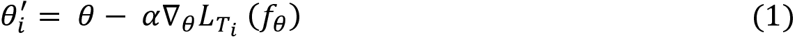
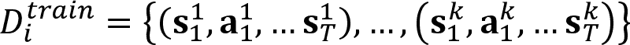
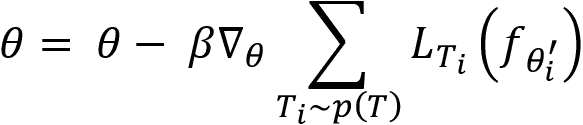
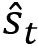
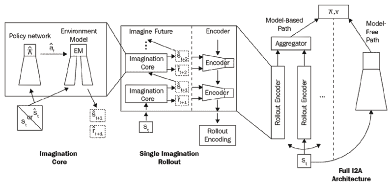

# 第十七章：强化学习前沿

恭喜！你已经来到了最后一章。我们走了很长一段路。我们从强化学习的基础开始，逐渐学习了最先进的深度强化学习算法。在本章中，我们将讨论一些激动人心且前景广阔的强化学习研究趋势。我们将从学习元学习是什么以及它与其他学习范式的区别开始。然后，我们将学习一个最常用的元学习算法——**模型无关元学习**（**MAML**）。

我们将详细了解 MAML，然后看看如何将其应用于强化学习环境。接着，我们将学习层次化强化学习，并深入研究一种流行的层次化强化学习算法——MAXQ 值函数分解。

在本章结束时，我们将介绍一个有趣的算法——**想象增强型智能体**（**I2As**），它同时利用基于模型和无模型学习。

本章将学习以下内容：

+   元强化学习

+   模型无关元学习

+   层次化强化学习

+   MAXQ 值函数分解

+   想象增强型智能体

让我们从理解元强化学习开始本章内容。

# 元强化学习

为了理解元强化学习是如何工作的，首先让我们了解元学习。

元学习是人工智能领域最有前景和最热门的研究方向之一。人们相信它是实现**人工通用智能**（**AGI**）的垫脚石。什么是元学习？我们为什么需要元学习？为了回答这些问题，让我们回顾一下深度学习是如何工作的。

我们知道，在深度学习中，我们训练一个深度神经网络来执行某个任务。但深度神经网络的问题在于，我们需要一个大量的训练数据集来训练我们的网络，因为当数据点较少时，它无法学习。

假设我们训练了一个深度学习模型来执行任务**A**。现在假设有一个新的任务**B**，它与任务**A**密切相关。尽管任务**B**与任务**A**密切相关，我们不能直接用为任务**A**训练的模型来执行任务**B**。我们需要从头开始为任务**B**训练一个新模型。因此，对于每个任务，我们都需要从头开始训练一个新模型，尽管它们可能是相关的。但这真的算是人工智能吗？其实不算。那么，我们人类是如何学习的呢？我们将学习概括到多个概念中，从中学习。然而，当前的学习算法只能掌握一个任务。所以，这就是元学习发挥作用的地方。

元学习生成了一个多功能的 AI 模型，它可以学习执行各种任务，而无需从头开始训练。我们在各种相关任务上训练我们的元学习模型，并且使用很少的数据点，因此对于一个新的相关任务，它可以利用在之前任务中获得的学习成果。许多研究人员和科学家认为，元学习可以让我们更接近实现通用人工智能（AGI）。学习如何学习是元学习的核心焦点。我们将在下一部分通过了解一种流行的元学习算法——MAML，来深入理解元学习到底是如何工作的。

## 模型无关元学习

**模型无关元学习**（**MAML**）是最受欢迎的元学习算法之一，它在元学习研究中取得了重大突破。MAML 的基本思想是找到更好的初始模型参数，这样通过一个好的初始参数，模型可以在新的任务上通过较少的梯度步骤快速学习。

那么，这意味着什么呢？假设我们正在执行一个使用神经网络的分类任务。我们如何训练网络？我们首先初始化随机权重，并通过最小化损失来训练网络。我们如何最小化损失？我们通过梯度下降最小化损失。好吧，如何使用梯度下降来最小化损失呢？我们使用梯度下降来找到能够给我们最小损失的最优权重。我们进行多次梯度步骤，以找到最优权重，从而达到收敛。

在 MAML 中，我们通过从相似任务的分布中学习来找到这些最优权重。因此，对于一个新任务，我们不必从随机初始化的权重开始；相反，我们可以从最优权重开始，这样只需较少的梯度步骤就能达到收敛，并且不需要更多的数据点来进行训练。

让我们用简单的术语来理解 MAML 是如何工作的。假设我们有三个相关的任务：*T*[1]、*T*[2] 和 *T*[3]。

首先，我们随机初始化我们的模型参数（权重），。我们在任务 *T*[1] 上训练我们的网络。然后，我们通过梯度下降来最小化损失 *L*。我们通过找到最优参数来最小化损失。令  为任务 *T*[1] 的最优参数。类似地，对于任务 *T*[2] 和 *T*[3]，我们将从随机初始化的模型参数  开始，并通过梯度下降找到最优参数来最小化损失。令  和  分别为任务 *T*[2] 和 *T*[3] 的最优参数。

如下图所示，我们从随机初始化的参数  开始每个任务，并通过找到任务 *T*[1]、*T*[2] 和 *T*[3] 的最优参数 、 和  来最小化损失：

图 17.1：  被初始化在一个随机位置

然而，不同于在随机位置初始化 ，即使用随机值，如果我们在一个所有任务共同的位置初始化 ，那么我们就不需要进行太多的梯度步骤，训练所需的时间会更少。MAML 就是为了实现这一目标。MAML 尝试找到这个最优参数 ，它对多个相关任务都适用，这样我们就能以更少的数据点更快速地训练新任务，而不需要进行过多的梯度步骤。

如 *图 17.2* 所示，我们将  调整到一个所有不同最优  值共同的位置：

图 17.2：  被初始化在最优位置

因此，对于一个新的相关任务，假设是 *T*[4]，我们不必从一个随机初始化的参数开始，。相反，我们可以从最优的  值（已偏移的 ）开始，这样就能减少梯度下降的步数，加快收敛。

因此，在 MAML 中，我们试图找到这个对相关任务通用的最优  值，帮助我们通过更少的数据点进行学习，并减少训练时间。MAML 是与模型无关的，这意味着我们可以将 MAML 应用到任何可以通过梯度下降训练的模型上。那么，MAML 究竟是如何工作的呢？我们如何将模型参数调整到最优位置？现在我们对 MAML 有了基本的了解，接下来我们将解决这些问题。

### 理解 MAML

假设我们有一个由  参数化的模型 *f*，即 ，并且我们有一个任务分布 *p(T)*。首先，我们用一些随机值初始化我们的参数 。接下来，我们从任务分布中抽取一批任务 *T*[i]―即 *T*[i]* ~ p(T)*。假设我们抽取了五个任务：*T*[1]、*T*[2]、*T*[3]、*T*[4]、*T*[5]。

对于每个任务 *T*[i]，我们抽取 *k* 个数据点并训练由  参数化的模型 *f*，即 。我们通过计算损失  来训练模型，并使用梯度下降最小化损失，找到最优参数 。使用梯度下降的参数更新规则如下：

在上述方程中，以下内容适用：

+    是任务 *T*[i] 的最优参数

+    是初始参数

+    是学习率

+    是任务 *T*[i] 的损失梯度，模型参数化为 

所以，在使用梯度下降进行前述参数更新后，我们将获得所有五个任务的最优参数。也就是说，对于任务 *T*[1]、*T*[2]、*T*[3]、*T*[4]、*T*[5]，我们将分别得到最优参数 。

现在，在下一次迭代之前，我们进行一次元更新或元优化。也就是说，在前一步中，我们通过在每个任务 *T*[i] 上训练，找到了最优参数 。现在我们拿到一组新的任务，对于这些新任务 *T*[i]，我们不必从随机位置  开始；相反，我们可以从最优位置  开始训练模型。

也就是说，对于每个新任务 *T*[i]，我们并不是使用随机初始化的参数 ，而是使用最优参数 。这意味着我们训练的是由  参数化的模型 *f*，也就是 ，而不是使用 。然后，我们计算损失 ，计算梯度，并更新参数 。这使得我们随机初始化的参数  移动到一个最优位置，避免了需要进行多次梯度更新。这一步称为元更新、元优化或元训练。可以表示为：

在方程 (2) 中，以下公式适用：

+    是初始参数

+    是学习率

+    是每个新任务 *T*[i] 的损失梯度，模型的参数化为 

如果仔细观察我们之前的元更新方程 (2)，我们可以看到，我们通过仅仅对每个新任务 *T*[i] 的梯度取平均，来更新我们的模型参数 ，而这个模型 *f* 是由  参数化的。

图 17.3 有助于我们更好地理解 MAML 算法。正如我们所观察到的，MAML 算法有两个循环——**内部循环**，我们在这个循环中使用初始参数 ，也就是 ，通过在每个任务 *T*[i] 上训练来找出最优参数 ；**外部循环**，我们在这个循环中使用在前一步获得的最优参数 ，也就是 ，并在新的一组任务上训练模型，计算损失，计算损失的梯度，并更新随机初始化的模型参数 ：

图 17.3：MAML 算法

请注意，在更新模型参数  时，我们不应该使用与找到最优参数时相同的一组任务 ，这些任务是在外循环中使用的。

简而言之，在 MAML 中，我们采样一批任务，对于批次中的每个任务 *T*[i]，我们使用梯度下降最小化损失并得到最优参数 。然后，我们通过为每个新任务 *T*[i] 计算梯度，并以  为参数化模型，来更新我们随机初始化的模型参数 。

仍然不清楚 MAML 到底是如何工作的？不用担心！接下来，我们将更详细地查看步骤，理解 MAML 在监督学习中的运作方式。

### 监督学习中的 MAML

正如我们所学，MAML 是与模型无关的，因此我们可以将 MAML 应用于任何可以通过梯度下降训练的模型。在这一节中，让我们学习如何在监督学习环境中应用 MAML 算法。在继续之前，我们先定义我们的损失函数。

如果我们进行回归任务，那么可以使用均方误差作为我们的损失函数：

如果我们进行分类任务，那么可以使用交叉熵损失作为我们的损失函数：

现在让我们一步步地看看 MAML 是如何在监督学习中使用的。

假设我们有一个由参数  参数化的模型 *f*，并且我们有一个任务分布 *p(T)*。首先，我们随机初始化模型参数 。

接下来，我们从任务分布中采样一批任务 *T*[i]，即 *T*[i] *~ p(T)*。假设我们已经采样了三个任务，那么我们将得到 *T*[1]、*T*[2]、*T*[3]。

**内循环：** 对于每个任务 *T*[i]，我们采样 *k* 个数据点，并准备训练和测试数据集：

等等！训练数据集和测试数据集是什么？我们在内循环中使用训练数据集来寻找最优参数 ，而在外循环中使用测试集来寻找最优参数 。测试数据集并不意味着我们在检查模型的性能，它基本上在外循环中作为训练集使用。我们也可以将测试集称为元训练集。

现在，我们在训练数据集  上训练模型 ，计算损失，使用梯度下降最小化损失，并得到最优参数 ，其值为 。

也就是说，对于每个任务 *T*[i]，我们采样 *k* 个数据点，并准备  和 。接下来，我们在训练数据集  上最小化损失并得到最优参数 。由于我们采样了三个任务，所以我们将得到三个最优参数，。

**外部循环**：现在，我们对测试集（元训练集）进行元优化；也就是说，我们尝试最小化测试集上的损失。在这里，我们使用之前步骤中计算出的最优参数对我们的模型*f*进行参数化。所以，我们计算模型的损失和损失的梯度，并使用我们的测试数据集（元训练数据集）更新我们随机初始化的参数，公式如下:

我们重复前面的步骤进行多次迭代，以找到最优参数。为了更清楚地理解 MAML 如何在监督学习中工作，接下来我们将深入研究该算法。

#### 算法——MAML 在监督学习中的应用

MAML 在监督学习中的算法如下所示：

1.  假设我们有一个由参数 参数化的模型*f*，并且我们有一个关于任务的分布*p(T)*。首先，我们随机初始化模型参数。

1.  从任务分布中采样一批任务*T*[i]，即*T*[i] *~ p(T)*。

1.  对于每个任务*T*[i]：

    1.  采样*k*个数据点，并准备我们的训练和测试数据集:

    1.  在训练数据集上训练模型，并计算损失。

    1.  使用梯度下降最小化损失，并获得最优参数，其公式为。

1.  现在，最小化测试集上的损失。使用之前步骤中计算出的最优参数对模型*f*进行参数化，计算损失。计算损失的梯度，并使用我们的测试（元训练）数据集更新我们随机初始化的参数，公式如下:。

1.  重复执行*步骤 2*到*步骤 4*，进行多次迭代。

下图展示了 MAML 算法在监督学习中的工作原理：

图 17.4：MAML 概览

现在我们已经了解了如何在监督学习中使用 MAML，在接下来的部分中，我们将探讨如何在强化学习中使用 MAML。

### MAML 在强化学习中的应用

现在，让我们了解如何在强化学习环境中应用 MAML 算法。我们知道强化学习的目标是找到最优策略，也就是能够提供最大回报的策略。我们已经了解了几种用于寻找最优策略的强化学习算法，并且也了解了几种深度强化学习算法，在这些算法中，我们使用了由参数化的神经网络。

我们可以将 MAML 应用于任何可以通过梯度下降进行训练的算法。例如，假设我们使用策略梯度方法。在策略梯度方法中，我们使用由参数化的神经网络来找到最优策略，并使用梯度下降来训练我们的网络。因此，我们可以将 MAML 算法应用于策略梯度方法。

让我们一步一步理解 MAML 如何在强化学习中工作。

假设我们有一个由参数参数化的模型（策略网络）*f*。该模型（策略网络）*f*试图通过学习最优参数来寻找最优策略。假设我们有一个任务分布*p(T)*。首先，我们随机初始化模型参数。

接下来，我们从任务分布中抽样一批任务*T*[i]，即*T*[i] *~ p(T)*。假设我们抽样了三个任务，那么我们有*T*[1]，*T*[2]，*T*[3]。

**内部循环**：对于每个任务*T*[i]，我们准备我们的训练数据集。好吧，我们如何在强化学习设置中创建训练数据集呢？

我们有一个模型（策略网络）。因此，我们使用我们的模型生成*k*条轨迹。我们知道这些轨迹由一系列状态-动作对组成。所以，我们有：

现在，我们计算损失并通过梯度下降最小化它，得到最优参数，即。

也就是说，对于每个任务*T*[i]，我们抽取*k*条轨迹并准备训练数据集。接下来，我们最小化训练数据集上的损失并得到最优参数。由于我们抽样了三个任务，因此我们将得到三个最优参数，。

我们还需要测试数据集，它将在外部循环中使用。我们如何准备我们的测试数据集？现在，我们使用由最优参数参数化的模型*f*；也就是说，我们使用并生成*k*条轨迹。所以，我们有：

记住，是由创建的，测试（元训练）数据集是由创建的。

**外部循环**：现在，我们在测试（元训练）数据集上执行元优化；也就是说，我们尝试最小化测试数据集中的损失。在这里，我们通过在前一步计算的最优参数参数化我们的模型*f*。因此，我们计算模型的损失及其梯度，并使用测试（元训练）数据集来更新我们随机初始化的参数，公式如下：

我们重复前面的步骤若干次，以找到最优参数。为了清楚理解 MAML 在强化学习中的工作原理，接下来我们将研究算法的细节。

#### 算法——强化学习中的 MAML

强化学习中的 MAML 算法如下所示：

1.  假设我们有一个由参数参数化的模型*f*，并且我们有一个任务分布*p(T)*。首先，我们随机初始化模型参数。

1.  从任务分布中采样一批任务*T*[i]，即*T*[i] *~ p(T)。

1.  对于每个任务 *T*[i]：

    1.  使用采样*k*轨迹并准备训练数据集：。

    1.  在训练数据集上训练模型，并计算损失。

    1.  使用梯度下降法最小化损失，并得到最优参数，即。

    1.  使用采样*k*轨迹并准备测试数据集：。

1.  现在，我们在测试数据集上最小化损失。用之前步骤中计算出的最优参数对模型*f*进行参数化，并计算损失。计算损失的梯度，并使用我们的测试（元训练）数据集更新我们随机初始化的参数，计算公式为:

1.  重复*步骤 2*到*步骤 4*若干次。

就这样！元学习是一个不断发展的研究领域。现在我们对元学习有了一个基本的了解，你可以进一步探索元学习，并了解元学习在强化学习中的应用。在下一部分，我们将学习层次化强化学习。

# 层次化强化学习

强化学习的问题在于，当状态空间和动作空间的数量较大时，它无法很好地扩展，最终会导致所谓的“维度灾难”问题。**层次化强化学习**（**HRL**）被提出用来解决维度灾难问题，在该方法中，我们将大型问题分解为层次结构中的小子问题。假设我们的智能体的目标是从学校回家。现在，我们的目标被分解为一组子目标，比如走出学校大门、叫出租车等等。

在 HRL 中使用了不同的方法，例如状态空间分解、状态抽象和时间抽象。在状态空间分解中，我们将状态空间分解为不同的子空间，并尝试在较小的子空间中解决问题。分解状态空间还可以加快探索速度，因为代理不需要探索整个状态空间。在状态抽象中，代理忽略当前状态空间中与完成当前子任务无关的变量。在时间抽象中，动作序列和动作集合被分组，将单步动作划分为多个步骤。

我们现在将探讨 HRL 中最常用的算法之一，叫做 MAXQ 值函数分解。

## MAXQ 值函数分解

MAXQ 值函数分解是 HRL 中最常用的算法之一。在本节中，让我们基本了解 MAXQ 值函数分解是如何工作的。我们通过一个例子来理解 MAXQ 值函数分解的工作原理。我们以*图 17.5*所示的出租车环境为例：

图 17.5：出租车环境

假设我们的代理正在驾驶一辆出租车。如*图 17.5*所示，黄色的矩形代表由我们代理驾驶的出租车。字母（**R**、**G**、**Y**、**B**）表示不同的位置。因此，我们总共有四个位置，代理需要在一个位置接乘客并在另一个位置将其放下。代理成功放下乘客后将获得+20 分，每个时间步骤消耗 1 分。如果代理进行非法接送，将失去-10 分。

因此，我们的代理的目标是在短时间内将乘客接送到正确的位置，并且不添加非法乘客。

现在，我们将把代理的目标分解为以下四个子任务：

+   **Navigate**：在 Navigate 子任务中，我们的代理的目标是将出租车从当前位置开到一个目标位置。Navigate(t)子任务将使用四个原始动作：*north*、*south*、*east*和*west*。

+   **Get**：在 Get 子任务中，我们的代理的目标是将出租车从当前位置开到乘客所在的位置并接载乘客。

+   **Put**：在 Put 子任务中，我们的代理的目标是将出租车从当前位置开到乘客的目的地并将乘客放下。

+   **Root**：Root 是整个任务。

我们可以通过一个有向无环图来表示所有这些子任务，这个图被称为任务图，如*图 17.6*所示：

图 17.6：任务图

从前面的图中我们可以观察到，所有的子任务都是按层次排列的。每个节点代表一个子任务或原始动作，每条边连接的方式使得一个子任务可以调用它的子子任务。如所示，**Navigate(t)**子任务有四个原始动作：**East**、**West**、**North**和**South**。**Get**子任务有一个**Pickup**原始动作和一个**Navigate(t)**子任务。类似地，**Put**子任务有一个**Putdown**（放下）原始动作和一个**Navigate(t)**子任务。

在 MAXQ 值函数分解中，我们将值函数分解为每个子任务的一组值函数。为了高效设计和调试 MAXQ 分解，我们可以像*图 17.7*所示那样重新设计我们的任务图：

图 17.7：任务图

从*图 17.7*中我们可以观察到，我们重新设计的图包含两种特殊类型的节点：最大节点和 Q 节点。最大节点定义了任务分解中的子任务，而 Q 节点定义了每个子任务可用的行动。

因此，在这一节中，我们对 MaxQ 值函数分解有了基本的了解。在下一节中，我们将学习 I2A。

# 想象增强代理

你是国际象棋的爱好者吗？如果我让你下棋，你会怎么下？在移动棋盘上的任何棋子之前，你可能会想象移动某个棋子的后果，并移动你认为能够帮助你赢得游戏的棋子。因此，基本上，在采取任何行动之前，我们会想象后果，如果后果是有利的，我们就会执行这个行动，否则我们会避免执行该行动。

类似地，**想象增强代理**（**I2As**）通过想象得到了增强。在环境中采取任何行动之前，代理会想象采取该行动的后果，如果他们认为该行动会带来好的奖励，他们就会执行这个行动。I2A 利用了基于模型和无模型学习的优势。*图 17.8*展示了 I2A 的架构：

图 17.8：I2A 架构

从*图 17.8*中我们可以观察到，I2A 架构既有基于模型的路径，也有无模型的路径。因此，代理采取的行动是基于模型路径和无模型路径的结果。在基于模型的路径中，我们有回滚编码器。

这些回滚编码器是代理执行想象任务的地方，让我们仔细看看回滚编码器。*图 17.9*展示了一个单一的回滚编码器：

图 17.9：单一的想象回滚

从*图 17.9*中我们可以观察到，回滚编码器有两层：想象未来层和编码器层。想象未来层是进行想象的地方。想象未来层由想象核心组成。

当我们将状态*s*[t]输入到想象核心时，我们得到下一个状态  和奖励 ，然后当我们将这个下一个状态  输入到下一个想象核心时，我们得到下一个状态  和奖励 。如果我们重复这些操作 *n* 步，我们得到一个展开（rollout），它基本上是一个状态和奖励的对，然后我们使用编码器，如**长短时记忆网络**（**LSTM**），来编码这个展开。结果，我们得到展开编码。这些展开编码实际上是描述未来想象路径的嵌入。我们将为不同的未来想象路径拥有多个展开编码器，并且我们使用一个聚合器来聚合这个展开编码器。

好的，但在想象核心中，想象究竟是如何发生的？想象核心中到底包含了什么？*图 17.10* 显示了一个单一的想象核心：

图 17.10：想象核心

正如我们从*图 17.10*中观察到的，想象核心由策略网络和环境模型组成。环境模型从代理迄今为止执行的所有动作中学习。它接收关于状态的信息 ，结合经验想象所有可能的未来，并选择能够获得高奖励的动作 。

*图 17.11* 显示了 I2A 的完整架构，所有组件都已展开：

图 17.11：完整的 I2A 架构

你玩过推箱子游戏吗？推箱子是一个经典的益智游戏，玩家需要将箱子推到目标位置。游戏规则非常简单：箱子只能被推，不能被拉。如果我们把箱子推错了方向，那么谜题就变得无法解决。

图 17.12：推箱子环境

I2A 架构在这些环境中提供了良好的结果，这些环境中代理必须在采取行动之前进行提前规划。论文的作者在推箱子游戏（Sokoban）上测试了 I2A 的性能，并取得了出色的结果。

深度强化学习领域正在发生各种令人兴奋的研究进展。现在你已经读完了这本书，你可以开始探索这些进展并尝试各种项目。学习并巩固！

# 总结

我们从理解元学习（meta learning）开始这一章。我们了解到，通过元学习，我们可以在各种相关任务上用少量数据点训练模型，这样对于一个新的相关任务，我们的模型就可以利用从之前任务中获得的学习成果。

接下来，我们学习了一种流行的元学习算法——MAML。在 MAML 中，我们从一批任务中采样，对于批次中的每个任务 *T*[i]，我们通过梯度下降最小化损失并获得最优参数 。然后，通过计算每个新任务 *T*[i] 的梯度并用模型参数化！，我们更新随机初始化的模型参数！。

接下来，我们学习了 HRL，在 HRL 中我们将大问题分解为层次化的小子问题。我们还研究了 HRL 中使用的不同方法，如状态空间分解、状态抽象和时间抽象。接下来，我们概述了 MAXQ 价值函数分解，我们将价值函数分解为每个子任务的价值函数集。

在本章结束时，我们学习了带有想象增强的 I2A。在采取任何行动之前，代理会想象采取该行动的后果，如果他们认为该行动会带来好的奖励，他们就会执行该行动。

深度强化学习每天都在发展，取得了有趣的进展。现在你已经了解了各种最先进的深度强化学习算法，可以开始构建有趣的项目，并为深度强化学习研究做出贡献。

# 问题

让我们测试一下你在本章中获得的知识；尝试回答以下问题：

1.  为什么我们需要元学习？

1.  什么是 MAML？

1.  什么是元目标？

1.  什么是元训练集？

1.  定义 HRL。

1.  I2A 是如何工作的？

# 深入阅读

更多信息，我们可以参考以下论文：

+   **面向模型无关的元学习：深度网络的快速适应** 由 *Chelsea Finn*、*Pieter Abbeel, Sergey Levine* 著，[`arxiv.org/pdf/1703.03400.pdf`](https://arxiv.org/pdf/1703.03400.pdf)

+   **MAXQ 价值函数分解的层次强化学习** 由 *Thomas G. Dietterich* 著，[`arxiv.org/pdf/cs/9905014.pdf`](https://arxiv.org/pdf/cs/9905014.pdf)

+   **想象增强的深度强化学习代理** 由 *Théophane Weber*、*等* 著，[`arxiv.org/pdf/1707.06203.pdf`](https://arxiv.org/pdf/1707.06203.pdf)
