# 附录 1 – 强化学习算法

让我们看看本书中介绍的所有强化学习算法。

# 强化学习算法

一般强化学习算法的步骤如下：

1.  首先，代理通过执行一个动作与环境进行互动。

1.  代理执行一个动作，并从一个状态转移到另一个状态。

1.  然后代理将根据它执行的动作获得奖励。

1.  根据奖励，代理会理解该动作是好还是坏。

1.  如果动作是好的，即代理收到了正向奖励，那么代理会偏向于执行该动作，否则代理会尝试执行其他可能导致正向奖励的动作。所以，强化学习本质上是一个试错学习过程。

# 值迭代

值迭代的算法如下：

1.  通过对 Q 函数取最大值来计算最优值函数，即！

1.  从计算出的最优值函数中提取最优策略

# 策略迭代

策略迭代的算法如下：

1.  初始化一个随机策略

1.  使用给定策略计算值函数

1.  使用从 *第 2 步* 获得的值函数提取新策略

1.  如果提取的策略与 *第 2 步* 中使用的策略相同，则停止，否则将提取的新的策略发送到 *第 2 步*，并重复 *第 2 步* 到 *第 4 步*

# 首次访问 MC 预测

首次访问 MC 预测的算法如下：

1.  让 `total_return(s)` 为一个状态在多个回合中的回报总和，`N(s)` 为计数器，即状态在多个回合中被访问的次数。将` total_return(s)` 和 `N(s)` 初始化为零，适用于所有状态。策略  作为输入给出。

1.  对于 `M` 次迭代：

    1.  使用策略  生成一个回合

    1.  将回合中获得的所有奖励存储在一个名为 rewards 的列表中

    1.  对于回合中的每个步骤 `t`：

    如果状态 `sₜ` 在回合中首次出现：

    1.  计算状态 `sₜ` 的回报 `$1($2)` = sum(rewards[t:])

    1.  更新状态 `sₜ` 的回报总和为 total_return(`sₜ`) = total_return(`sₜ`) + `$1($2)`

    1.  更新计数器为 `$1($2)` = `$1($2)` + 1

1.  通过取平均值来计算一个状态的值，即：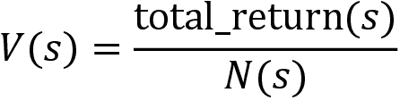

# 每次访问 MC 预测

每次访问 MC 预测的算法如下：

1.  让 `total_return(s)` 为一个状态在多个回合中的回报总和，`N(s)` 为计数器，即状态在多个回合中被访问的次数。将 `total_return(s)` 和 `N(s)` 初始化为零，适用于所有状态。策略  作为输入给出。

1.  对于 `M` 次迭代：

    1.  使用策略  生成一个回合

    1.  将回合中获得的所有奖励存储在名为 rewards 的列表中

    1.  对于每一步 `t` 在该回合中：

        1.  计算状态 `sₜ` 的回报为 `$1($2)` = sum(rewards[t:])

        1.  更新状态 `sₜ` 的总回报为 total_return(`sₜ`) = total_return(`sₜ`) + `$1($2)`

        1.  更新计数器为 `$1($2)` = `$1($2)` + 1

1.  通过简单地取平均值来计算状态的值，即：

# MC 预测 – Q 函数

MC 预测 Q 函数的算法如下：

1.  令 `total_return(s, a)` 为状态-动作对在多个回合中的回报总和，`N(s, a) `为状态-动作对在多个回合中被访问的次数。初始化所有状态-动作对的 `total_return(s, a)` 和 `N(s, a)` 为零。给定策略  作为输入。

1.  对于 `M` 次迭代：

    1.  使用策略  生成一个回合

    1.  将回合中获得的所有奖励存储在名为 rewards 的列表中

    1.  对于每一步 `t` 在该回合中：

        1.  计算状态-动作对的回报，`R(sₜ, aₜ) = sum(rewards[t:])`

        1.  更新状态-动作对的总回报，`total_return(sₜ, aₜ) = total_return(sₜ, aₜ) + R(sₜ, aₜ)`

        1.  更新计数器为 `N(sₜ, aₜ) = N(sₜ, aₜ) + 1`

1.  通过简单地取平均值来计算 Q 函数（Q 值），即：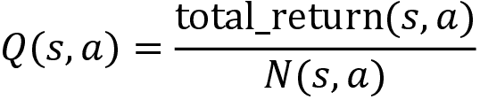

# MC 控制方法

MC 控制方法的算法如下：

1.  令 `total_return(s, a)` 为状态-动作对在多个回合中的回报总和，`N(s, a)` 为状态-动作对在多个回合中被访问的次数。初始化所有状态-动作对的 `total_return(s, a)` 和` N(s, a)` 为零，并初始化一个随机策略 。

1.  对于 `M` 次迭代：

    1.  使用策略  生成一个回合

    1.  将回合中获得的所有奖励存储在名为 rewards 的列表中

    1.  对于每一步 `t` 在该回合中：

        如果 (`sₜ`, `aₜ`) 是该回合中第一次出现：

        1.  计算状态-动作对的回报，`R(sₜ, aₜ) = sum(rewards[t:])`

        1.  更新状态-动作对的总回报为 `total_return(sₜ, aₜ) = total_return(sₜ, aₜ) + R(sₜ, aₜ)`

        1.  更新计数器为 `N(sₜ, aₜ) = N(sₜ, aₜ) + 1`

        1.  通过简单地取平均值来计算 Q 值，即 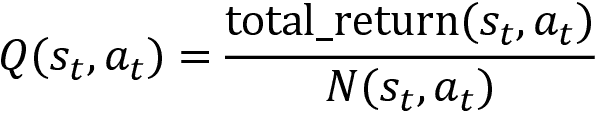

    1.  使用 Q 函数从  计算新的更新策略：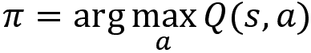

# 在政策 MC 控制 – 探索开始

基于探索开始方法的在政策 MC 控制算法如下：

1.  设 total_return(`s`, `a`) 为多次剧集中状态-动作对的回报总和，`N`(`s`, `a`) 为多次剧集中访问状态-动作对的次数。将所有状态-动作对的 total_return(`s`, `a`) 和 `N`(`s`, `a`) 初始化为零，并初始化随机策略 。

1.  对于 `M` 次迭代：

    1.  随机选择初始状态 `s₀` 和初始动作 `a₀`，使得所有状态-动作对的概率大于 0

    1.  使用策略  从选定的初始状态 `s₀` 和动作 `a₀` 生成一集

    1.  将剧集中获得的所有奖励存储在名为 rewards 的列表中

    1.  对于剧集中的每个步骤 `t`：

        如果 (`sₜ`, `aₜ`) 在这一集是首次出现：

        1.  计算状态-动作对的回报，`R`(`sₜ`, `aₜ`) = sum(rewards[t:])

        1.  更新状态-动作对的总回报为 total_return(`sₜ`, `aₜ`) = total_return(`sₜ`, `aₜ`) + `R`(`sₜ`, `aₜ`)

        1.  更新计数器为 `N`(`sₜ`, `aₜ`) = `N`(`sₜ`, `aₜ`) + 1

        1.  通过简单地取平均值来计算 Q 值，即 

        1.  使用 Q 函数从  计算更新后的策略：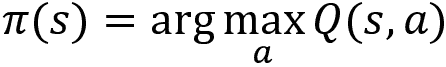

# 在线蒙特卡洛控制 - Epsilon-Greedy

使用 epsilon-greedy 策略的在线蒙特卡洛控制算法如下：

1.  设 total_return(`s`, `a`) 为多次剧集中状态-动作对的回报总和，`N`(`s`, `a`) 为多次剧集中访问状态-动作对的次数。将所有状态-动作对的 total_return(`s`, `a`) 和 `N`(`s`, `a`) 初始化为零，并初始化随机策略 。

1.  对于 `M` 次迭代：

    1.  使用策略  生成一集

    1.  将剧集中获得的所有奖励存储在名为 rewards 的列表中

    1.  对于剧集中的每个步骤 `t`：

        如果 (`sₜ`, `aₜ`) 在这一集是首次出现：

        1.  计算状态-动作对的回报，`R`(`sₜ`, `aₜ`) = sum(rewards[t:])。

        1.  更新状态-动作对的总回报为 total_return(`sₜ`, `aₜ`) = total_return(`sₜ`, `aₜ`) + `R`(`sₜ`, `aₜ`)。

        1.  更新计数器为 `N`(`sₜ`, `aₜ`) = `N`(`sₜ`, `aₜ`) + 1。

        1.  通过简单地取平均值来计算 Q 值，即 

    1.  使用 Q 函数计算更新后的策略 。设 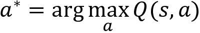。策略  以概率  选择最佳动作 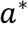，以概率  选择随机动作。

# 离策略蒙特卡洛控制

离策略蒙特卡洛控制方法的算法如下：

1.  初始化 Q 函数 `Q(s, a)`，赋值为随机值，设置行为策略 `b` 为 epsilon-greedy，设置目标策略 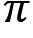 为贪婪策略，并初始化累积权重为 `C`(`s`, `a`) = 0

1.  对于 `M` 次迭代：

    1.  使用行为策略 `b` 生成一个序列

    1.  将回报 `R` 初始化为 0，权重 `W` 初始化为 1

    1.  对于每个步骤 `t`，`t` = `T` – 1, `T` – 2, . . . , 0：

        1.  计算回报为 `R` = `R` + `r[t+1]`

        1.  更新累积权重为 `C`(`sₜ`, `aₜ`) = `C`(`sₜ`, `aₜ`) +`W`

        1.  更新 Q 值为 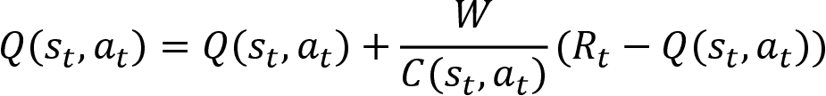

        1.  计算目标策略 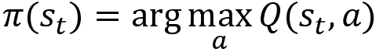

        1.  如果 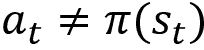 则跳出循环

        1.  更新权重为 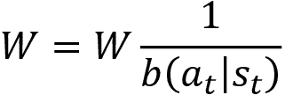

1.  返回目标策略 

# TD 预测

TD 预测方法的算法如下：

1.  使用随机值初始化值函数 `V(s)`。给定一个策略 。

1.  对于每一集：

    1.  初始化状态 `s`

    1.  对于每个步骤：

        1.  根据给定策略  在状态 `s` 中执行动作 `a`，获得奖励 `r`，并移动到下一个状态 

        1.  更新状态的值为 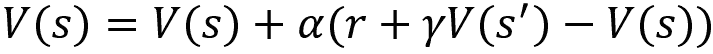

        1.  更新  （这一步表示我们将下一个状态  更改为当前状态 `s`）

        1.  如果 `s` 不是终止状态，重复执行 *步骤 1* 到 `4`

# 基于策略的 TD 控制 – SARSA

基于策略的 TD 控制 – SARSA 的算法如下：

1.  初始化 Q 函数 `Q(s, a)`，赋值为随机值

1.  对于每一集：

    1.  初始化状态 `s`

    1.  从 `Q(s, a)` 中提取一个策略，并选择一个动作 `a` 在状态 `s` 中执行

    1.  对于每个步骤：

        1.  执行动作 `a`，移动到新状态 ，并观察奖励 `r`

        1.  在状态  下，使用 epsilon-greedy 策略选择动作 

        1.  更新 Q 值为 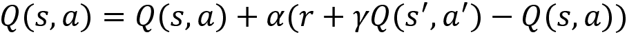

        1.  更新 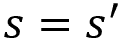 和 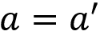 （更新下一个状态 -动作 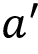 对为当前状态 `s`-动作 `a` 对）

        1.  如果 `s` 不是终止状态，重复执行 *步骤 1* 到 `5`

# 离策略的 TD 控制 – Q 学习

离策略的 TD 控制 – Q 学习的算法如下：

1.  初始化 Q 函数 `Q(s, a)`，赋值为随机值

1.  对于每一集：

    1.  初始化状态 `s`

    1.  对于每个步骤：

        1.  从 `Q(s, a)` 中提取一个策略，并选择一个动作 `a` 在状态 `s` 中执行

        1.  执行动作 `a`，移动到新状态 ，并观察奖励 `r`

        1.  更新 Q 值为 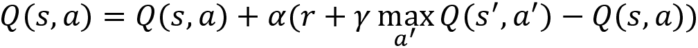

        1.  更新  （更新下一个状态  为当前状态 `s`）

        1.  如果 `s` 不是终止状态，重复执行 *步骤 1* 到 `5`

# 深度 Q 学习

深度 Q 学习算法如下所示：

1.  使用随机值初始化主网络参数 

1.  通过复制主网络参数  初始化目标网络参数 

1.  初始化重放缓冲区 

1.  对于 `N` 次训练周期，执行 *步骤 5*

1.  对于每个步骤，即对于 `t = 0, . . ., T – 1`：

    1.  观察状态 `s` 并使用 epsilon-贪婪策略选择动作，即以 epsilon 的概率选择随机动作 `a`，以 1-epsilon 的概率选择动作 

    1.  执行动作并转移到下一个状态 ，并获得奖励 `r`

    1.  将转移信息存储在重放缓冲区 

    1.  从重放缓冲区  随机抽取一个 `K` 转移的小批量

    1.  计算目标值，即 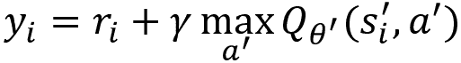

    1.  计算损失，

    1.  计算损失的梯度，并使用梯度下降法更新主网络参数 ，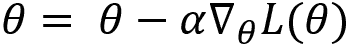

    1.  冻结目标网络参数  若干时间步，然后通过复制主网络参数  更新它

# 双重 DQN

双重 DQN 算法如下所示：

1.  使用随机值初始化主网络参数 

1.  通过复制主网络参数  初始化目标网络参数 

1.  初始化重放缓冲区 

1.  对于 `N` 次训练周期，重复 *步骤 5*

1.  对于每个步骤，即对于 `t = 0, . . ., T – 1`：

    1.  观察状态 `s` 并使用 epsilon-贪婪策略选择动作，即以 epsilon 的概率选择随机动作 `a`，以 1-epsilon 的概率选择动作 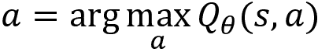

    1.  执行动作并转移到下一个状态 ，并获得奖励 `r`

    1.  将转移信息存储在重放缓冲区 

    1.  从重放缓冲区  随机抽取一个 `K` 转移的小批量

    1.  计算目标值，即 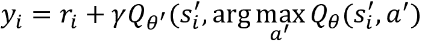

    1.  计算损失，

    1.  计算损失的梯度，并使用梯度下降法更新主网络参数 ，

    1.  冻结目标网络参数  若干时间步，然后通过复制主网络参数  更新它

# REINFORCE 策略梯度

REINFORCE 策略梯度算法如下所示：

1.  使用随机值初始化网络参数 

1.  根据策略  生成一些 `N` 条轨迹 

1.  计算轨迹的回报 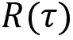

1.  计算梯度 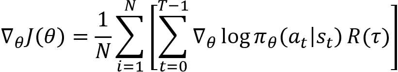

1.  更新网络参数，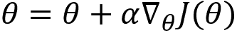

1.  重复 *步骤 2* 到 *步骤 5* 多次迭代

# 带奖励到达的策略梯度

带奖励到达的策略梯度算法如下：

1.  使用随机值初始化网络参数 

1.  根据策略 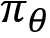 生成一些 `N` 条轨迹 

1.  计算回报（奖励到达） `Rₜ`

1.  计算梯度 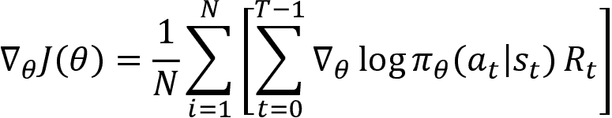

1.  更新网络参数：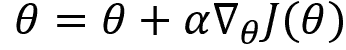

1.  重复 *步骤 2* 到 *步骤 5* 多次迭代

# REINFORCE 带基线

REINFORCE 带基线的算法如下：

1.  初始化策略网络参数  和价值网络参数 

1.  根据策略  生成一些 `N` 条轨迹 

1.  计算回报（奖励到达） `Rₜ`

1.  计算策略梯度，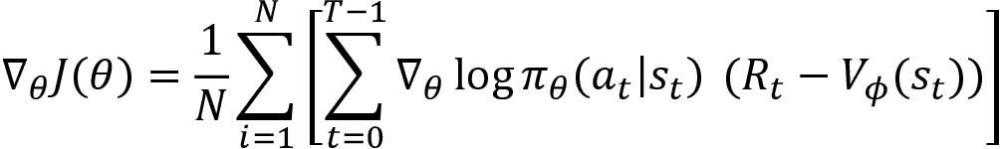

1.  使用梯度上升更新策略网络参数 ，

1.  计算价值网络的均方误差，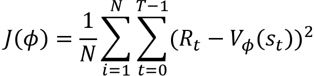

1.  使用梯度下降更新价值网络参数 ，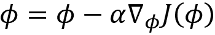

1.  重复 *步骤 2* 到 *步骤 7* 多次迭代

# 优势演员评论员

优势演员评论员方法的算法如下：

1.  初始化演员网络参数  和评论员网络参数 

1.  对于 `N` 条剧集，重复 *步骤 3*

1.  对于每个时间步，即 `t` = 0, . . ., `T` – 1：

    1.  使用策略 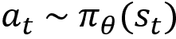 选择一个动作

    1.  在状态 `sₜ` 中采取动作 `aₜ`，观察奖励 `r` 并转到下一个状态 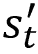

    1.  计算策略梯度：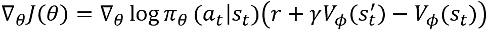

    1.  使用梯度上升更新演员网络参数 ：

    1.  计算评论员网络的损失：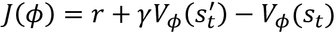

    1.  计算梯度 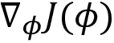 并使用梯度下降更新评论员网络参数 ：

# 异步优势演员评论员

**优势演员评论员**（**A3C**）的步骤如下：

1.  工作代理与其自己的环境副本交互

1.  每个工作代理遵循不同的策略并收集经验

1.  接下来，工作代理计算演员和评论员网络的损失

1.  在计算损失后，他们计算损失的梯度，并异步地将这些梯度发送给全局代理

1.  全局代理使用从工作代理接收到的梯度来更新其参数

1.  现在，全局代理更新的参数将定期发送到工作代理

# 深度确定性策略梯度

**深度确定性策略梯度** (**DDPG**) 算法如下所示：

1.  初始化主评论员网络参数  和主演员网络参数 

1.  通过仅复制主评论员网络参数  来初始化目标评论员网络参数 

1.  通过仅复制主演员网络参数  来初始化目标演员网络参数 。

1.  初始化重放缓冲区 

1.  对于 `N` 次实验，重复 *第 6 步* 到 *第 7 步*

1.  初始化 Ornstein-Uhlenbeck 随机过程  以进行动作空间的探索

1.  对于每个步骤，即对于 `t` = 0, . . ., `T` – 1：

    1.  根据策略 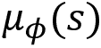 和探索噪声选择动作 `a`，即 

    1.  执行选定的动作 `a`，移动到下一个状态 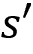 并获得奖励 `r`，并将此转换信息存储在重放缓冲区 

    1.  从重放缓冲区  随机抽取一个 `K` 的过渡小批量

    1.  计算评论员的目标值，即 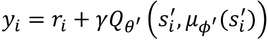

    1.  计算评论员网络的损失 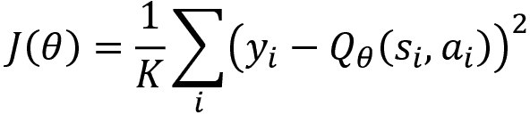

    1.  计算损失的梯度 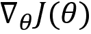 并使用梯度下降更新评论员网络参数，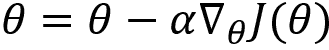

    1.  计算演员网络的梯度  并使用梯度上升更新演员网络参数，

    1.  更新目标评论员和目标演员网络参数，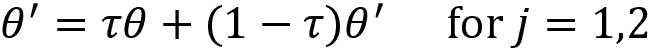 和 

# 双延迟 DDPG

**双延迟 DDPG** (**TD3**) 算法如下所示：

1.  初始化两个主评论员网络参数， 和 ，以及主演员网络参数 

1.  通过分别复制主评论员网络参数 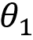 和  来初始化两个目标评论员网络参数  和 

1.  通过复制主演员网络参数  来初始化目标演员网络参数 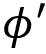

1.  初始化重放缓冲区 

1.  对于 `N` 次实验，重复 *第 6 步*

1.  对于每个步骤，即对于 `t` = 0, . . ., `T` – 1：

    1.  根据策略  和探索噪声 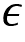 选择动作 `a`，即 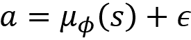，其中，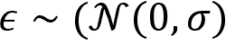

    1.  执行选择的动作 `a`，移动到下一个状态 ，获得奖励 `r`，并将转换信息存储在重放缓冲区 

    1.  从重放缓冲区  随机抽取 `K` 个转换的小批量

    1.  选择动作  来计算目标值 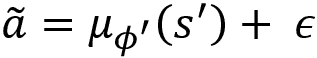，其中 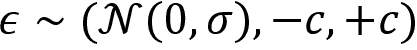

    1.  计算评论网络的目标值，即 

    1.  计算评论网络的损失 

    1.  计算损失的梯度 ，并使用梯度下降法最小化损失 

    1.  如果 `t` mod `d` =0，则：

        1.  计算目标函数的梯度 ，并使用梯度上升法更新演员网络参数 

        1.  更新目标评论网络参数和目标演员网络参数，分别为  和 

# Soft Actor-Critic

**Soft Actor-Critic** (**SAC**) 算法如下：

1.  初始化主价值网络参数 、Q 网络参数  和 ，以及演员网络参数 

1.  通过复制主价值网络参数  来初始化目标价值网络 

1.  初始化重放缓冲区 

1.  对于 `N` 个回合，重复 *步骤 5*

1.  对于每个回合中的步骤，即对于 `t` = 0, . . ., `T` – 1

    1.  基于策略  选择动作 `a`，即 

    1.  执行选择的动作 `a`，移动到下一个状态 ，获得奖励 `r`，并将转换信息存储在重放缓冲区 

    1.  从重放缓冲区随机抽取 `K` 个转换的小批量

    1.  计算目标状态值 

    1.  计算价值网络的损失 ，并使用梯度下降法更新参数 

    1.  计算目标 Q 值 

    1.  计算 Q 网络的损失 ，并使用梯度下降法更新参数 

    1.  计算演员目标函数的梯度 ，并使用梯度上升法更新参数 

    1.  更新目标值网络参数 

# 信任域策略优化

**信任域策略优化** (**TRPO**) 算法如下：

1.  初始化策略网络参数  和价值网络参数 

1.  生成 `N` 条轨迹 ，遵循策略 

1.  计算回报（奖励累积）`Rₜ`

1.  计算优势值 `Aₜ`

1.  计算策略梯度 

1.  使用共轭梯度法计算 

1.  使用更新规则  更新策略网络参数 

1.  计算值网络的均方误差，

1.  使用梯度下降更新值网络参数 ，

1.  重复 *步骤 2* 到 *步骤 9* 进行多次迭代

# PPO-Clipped

PPO-Clip 方法的算法如下所示：

1.  初始化策略网络参数  和值网络参数 

1.  收集一些 `N` 条轨迹 ，跟随策略 

1.  计算回报（奖励累积）`Rₜ`

1.  计算目标函数的梯度 

1.  使用梯度上升更新策略网络参数 ，

1.  计算值网络的均方误差，

1.  计算值网络的梯度 

1.  使用梯度下降更新值网络参数 ，

1.  重复 *步骤 2* 到 *步骤 8* 进行多次迭代

# PPO-Penalty

PPO-惩罚方法的算法如下所示：

1.  初始化策略网络参数  和值网络参数 ，并初始化惩罚系数  和目标 KL 散度 

1.  对于迭代次数 ：

    1.  收集一些 `N` 条轨迹，跟随策略 

    1.  计算回报（奖励累积）`Rₜ`

    1.  计算 

    1.  计算目标函数的梯度 

    1.  使用梯度上升更新策略网络参数 ，

    1.  如果 `d` 大于或等于 ，则设置 ；如果 `d` 小于或等于 ，则设置，

    1.  计算值网络的均方误差：

    1.  计算值网络的梯度 

    1.  使用梯度下降更新值网络参数 ，

# 类别 DQN

类别 DQN 的算法如下所示：

1.  用随机值初始化主网络参数 

1.  通过复制主网络参数  来初始化目标网络参数 

1.  初始化重放缓冲区 ，原子数，以及  和 

1.  对于 `N` 次实验，执行 *步骤 5*

1.  对于每一步骤，即对于 `t` = 0, . . ., `T` – 1：

    1.  将状态 `s` 和支持值输入主分类 DQN，参数化为 ，并获得每个支持值的概率值。然后计算 Q 值为 。

    1.  计算 Q 值后，使用 epsilon-greedy 策略选择一个动作，即以概率 epsilon 选择一个随机动作 `a`，并以概率 1-epsilon 选择一个动作，如 。

    1.  执行选定的动作并移动到下一个状态 ，并获得奖励 `r`。

    1.  将过渡信息存储在重放缓冲区  中。

    1.  从重放缓冲区  随机抽取一个过渡。

    1.  将下一个状态  和支持值输入目标分类 DQN，参数化为 ，并获得每个支持的概率值。然后计算值为 。

    1.  计算 Q 值后，我们在状态  中选择具有最大 Q 值  的最佳动作。

    1.  用零值初始化数组 `m`，其形状为支持值的数量。

    1.  对于 `j` 在支持值的范围内：

        1.  计算目标支持值： 

        1.  计算 `b` 的值： 

        1.  计算下界和上界： 

        1.  在下界上分布概率： 

        1.  在上界上分布概率： 

    1.  计算交叉熵损失 。

    1.  使用梯度下降最小化损失并更新主网络的参数

    1.  冻结目标网络参数  若干时间步，然后通过复制主网络参数  来更新它

# 分布式分布式 DDPG

**分布式分布式深度确定性策略梯度** (**D4PG**) 算法如下所示：

1.  初始化评论家网络参数  和演员网络参数 

1.  初始化目标评论家网络参数  和目标演员网络参数 ，通过从  和  复制初始化。

1.  初始化重放缓冲区 

1.  启动 `L` 个演员

1.  对于 `N` 次实验，重复 *步骤 6*

1.  对于每一步骤，即对于 `t` = 0, . . ., `T` – 1：

    1.  从重放缓冲区  随机抽取一个 `K` 的小批量过渡

    1.  计算评论员的目标值分布，即 

    1.  计算评论员网络的损失并计算梯度，如  所示

    1.  计算梯度后，使用梯度下降更新评论员网络参数： 

    1.  计算演员网络的梯度 

    1.  通过梯度上升更新演员网络参数： 

    1.  如果 `t` mod  则：

        使用软替换更新目标评论员和目标演员网络的参数，如  和  所示

    1.  如果 `t` mod  则：

        将网络权重复制到演员中

我们在演员网络中执行以下步骤：

1.  基于策略  和探索噪声选择动作 `a`，即 

1.  执行选择的动作 `a`，移动到下一个状态  并获得奖励 `r`，将过渡信息存储在重放缓冲区 

1.  重复执行 *步骤 1* 和 `2`，直到学习者完成

# DAgger

DAgger 算法如下：

1.  初始化空数据集 

1.  初始化一个策略 

1.  对于迭代 `i` = 1 到 `N`：

    1.  创建一个策略 。

    1.  使用策略  生成一个轨迹。

    1.  通过收集策略  访问的状态和专家提供的这些状态的动作来创建数据集 。因此， 。

    1.  将数据集汇总为 。

    1.  在更新后的数据集  上训练分类器，并提取新策略 。

# 深度 Q 学习来自演示

**来自演示的深度 Q 学习**（**DQfD**）的算法如下：

1.  初始化主网络参数 

1.  通过复制主网络参数  初始化目标网络参数 

1.  使用专家演示初始化重放缓冲区 

1.  设置 `d`，即我们希望延迟更新目标网络参数的时间步数

1.  **预训练阶段**：对于步骤 `t` = 1, 2, . . ., `T`：

    1.  从重放缓冲区  中抽取一个小批量经验

    1.  计算损失 `J(Q)`

    1.  使用梯度下降更新网络参数

    1.  如果 `t` mod `d` = 0：

        通过复制主网络参数  更新目标网络参数 

1.  **训练阶段**：对于步骤 `t` = 1, 2, . . ., `T`：

    1.  选择一个动作

    1.  执行选择的动作并进入下一个状态，观察奖励，并将此过渡信息存储在重放缓冲区中 

    1.  从回放缓冲区  采样一个优先级的经验小批量

    1.  计算损失 `J(Q)`

    1.  使用梯度下降更新网络的参数

    1.  如果 `t` mod `d` = 0：

        通过复制主网络参数  来更新目标网络参数 

# 最大熵逆强化学习

最大熵逆强化学习的算法如下所示：

1.  初始化参数  并收集专家示范 

1.  对于 `N` 次迭代：

    1.  计算奖励函数 

    1.  使用前一步骤获得的奖励函数通过值迭代计算策略

    1.  使用前一步骤获得的策略计算状态访问频率 

    1.  计算相对于  的梯度，即 

    1.  将  的值更新为 

# 强化学习中的 MAML

强化学习中 MAML 的算法如下所示：

1.  假设我们有一个由参数  参数化的模型 `f`，并且我们有一个关于任务的分布 `p(T)`。首先，我们随机初始化模型参数 。

1.  从任务分布中采样一批任务 `Tᵢ`，即 `Tᵢ` *~ p(T)。

1.  对于每个任务 `Tᵢ`：

    1.  使用  采样 `k` 条轨迹，并准备训练数据集：

    1.  在训练数据集  上训练模型 ，并计算损失

    1.  使用梯度下降最小化损失并得到最优参数 ，其值为 

    1.  使用  采样 `k` 条轨迹，并准备测试数据集：

1.  现在，我们在测试数据集  上最小化损失。使用在前一步骤计算得到的最优参数  对模型 `f` 进行参数化，并计算损失 。计算损失的梯度，并使用我们的测试（元训练）数据集  更新我们随机初始化的参数 。

1.  重复 *步骤 2* 到 `4` 进行若干次迭代。
