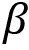
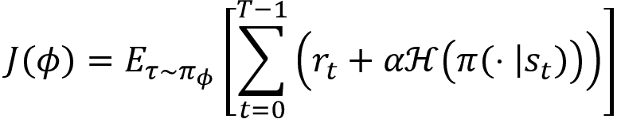

# 附录 2 – 评估

以下是每章结尾提到的问题的答案。

# 第一章 – 强化学习基础

1.  在监督学习和无监督学习中，模型（智能体）基于给定的训练数据集进行学习，而在**强化学习**（**RL**）中，智能体通过直接与环境互动进行学习。因此，RL 本质上是智能体与环境之间的互动。

1.  环境是智能体的世界。智能体存在于环境中。例如，在国际象棋游戏中，棋盘就是环境，因为棋手（智能体）在棋盘（环境）中学习如何下棋。同样，在超级马里奥兄弟游戏中，马里奥的世界就是环境。

1.  确定性策略将状态映射到一个特定的动作，而随机策略则将状态映射到动作空间上的概率分布。

1.  智能体通过执行动作与环境进行互动，从初始状态开始，直到到达最终状态。这个从初始状态到最终状态的智能体-环境交互过程称为一个回合。

1.  折扣因子帮助我们通过决定给未来奖励和即时奖励的权重，防止回报达到无穷大。

1.  价值函数（一个状态的价值）是从该状态开始的轨迹的期望回报，而 Q 函数（状态-动作对的 Q 值）是从该状态和动作开始的轨迹的期望回报。

1.  在确定性环境中，我们可以确定当智能体在状态`s`下执行动作`a`时，它总是到达状态 。在随机环境中，我们无法确定通过在状态`s`下执行某个动作`a`，智能体总是到达状态 ，因为随机环境中会有一些随机性。

# 第二章 – 健身工具包指南

1.  Gym 工具包提供了各种环境，用于训练 RL 智能体，从经典控制任务到 Atari 游戏环境。我们可以使用各种 RL 算法训练我们的 RL 智能体，让它在这些模拟环境中学习。

1.  我们可以使用`make`函数创建一个 Gym 环境。`make`函数需要环境 ID 作为参数。

1.  我们知道，动作空间包含环境中所有可能的动作。我们可以通过使用`env.action_space`来获取动作空间。

1.  我们可以使用`render()`函数来可视化 Gym 环境。

1.  Gym 提供的一些经典控制环境包括平衡杆环境、摆钟环境和山地车环境。

1.  我们可以通过在每个状态中选择一个动作来生成一个回合，使用`step()`函数。

1.  Atari 环境的状态空间将是游戏屏幕的像素值或 Atari 机器的 RAM。

1.  我们可以使用 Monitor 包装器记录智能体的游戏过程。它需要三个参数——环境、我们希望保存记录的目录以及强制选项。

# 第三章 – 贝尔曼方程与动态规划。

1.  贝尔曼方程表示，一个状态的值可以通过当前奖励和下一个状态的折现值之和来获得。与值函数的贝尔曼方程类似，Q 函数的贝尔曼方程表示，状态-动作对的 Q 值可以通过当前奖励和下一个状态-动作对的折现 Q 值之和来获得。

1.  贝尔曼期望方程给出了贝尔曼值函数和 Q 函数，而贝尔曼最优性方程给出了最优的贝尔曼值函数和 Q 函数。

1.  值函数可以从 Q 函数中推导出来，如下图所示：。

1.  Q 函数可以从值函数中推导出来，如下图所示：。

1.  在值迭代方法中，我们执行以下步骤：

    1.  通过对 Q 函数进行最大化计算最优值函数，即：。

    1.  从计算出的最优值函数中提取最优策略。

1.  在策略迭代方法中，我们执行以下步骤：

    1.  初始化随机策略。

    1.  使用给定策略计算值函数。

    1.  使用*步骤 2*中获得的值函数提取新策略。

    1.  如果提取的策略与*步骤 2*中使用的策略相同，则停止，否则将提取的新策略发送到*步骤 2*并重复*步骤 2*至*步骤 4*。

1.  在值迭代方法中，首先，我们通过对 Q 函数进行迭代最大化来计算最优值函数。一旦找到最优值函数，我们将使用它来提取最优策略。在策略迭代方法中，我们将尝试通过策略迭代的方式计算最优值函数。一旦我们找到了最优值函数，创建该最优值函数的策略将被提取为最优策略。

# 第四章 – 蒙特卡罗方法。

1.  在蒙特卡罗方法中，我们通过取`N`次实验中某个状态的回报平均值来近似该状态的值，而不是取预期回报。

1.  要使用动态规划方法计算值函数，我们需要了解模型动态。当我们不知道模型动态时，我们使用无模型方法。蒙特卡罗方法是一种无模型方法，意味着它不需要模型动态（转移概率）来计算值函数。

1.  在预测任务中，我们通过预测值函数或 Q 函数来评估给定的策略，这有助于我们理解智能体在使用给定策略时所能获得的预期回报。然而，在控制任务中，我们的目标是找到最优策略，并且不会给定任何策略作为输入，因此我们从初始化一个随机策略开始，并尝试通过迭代的方式找到最优策略。

1.  在 MC 预测方法中，状态值和状态-动作对的值可以通过分别取多个回合中的状态的平均回报和状态-动作对的平均回报来计算。

1.  在首次访问 MC 中，我们仅计算状态首次在回合中被访问时的回报。在每次访问 MC 中，我们每次访问状态时都会计算回报。

1.  当环境是非平稳的时，我们不需要从所有回合中取状态的回报并计算平均值。由于环境是非平稳的，我们可以忽略早期回合的回报，仅使用最新回合的回报来计算平均值。这样，我们可以使用增量平均值计算状态的值。

1.  在基于策略的方法中，我们使用一个策略生成回合，并且迭代地改进同一个策略来找到最优策略；而在基于策略外的蒙特卡罗控制方法中，我们使用两种不同的策略生成回合（行为策略）和寻找最优策略（目标策略）。

1.  epsilon-贪心策略是指我们以概率 epsilon 选择一个随机动作（探索），并以概率 1-epsilon 选择最佳动作（利用）。

# 第五章 – 理解时间差分学习

1.  与蒙特卡罗方法不同，**时间差分**（**TD**）学习方法利用自举技术，这样我们就不需要等到回合结束才能计算状态的值。

1.  TD 学习算法结合了动态规划和蒙特卡罗方法的优点。也就是说，像动态规划方法一样，我们执行自举操作，这样我们就不需要等到回合结束才能计算状态值或 Q 值；同时，像蒙特卡罗方法一样，它是一种无模型的方法，因此它不需要环境的模型动态来计算状态值或 Q 值。

1.  TD 误差可以定义为目标值与预测值之间的差异。

1.  TD 学习更新规则如图所示 。

1.  在 TD 预测任务中，给定一个策略，我们使用该策略估计值函数。因此，我们可以说，代理在每个状态下如果按照给定策略行动，期望获得的回报是多少。

1.  **SARSA**是一种基于策略的 TD 控制算法，代表**状态-动作-奖励-状态-动作**。使用 SARSA 计算 Q 函数的更新规则如图所示 。

1.  SARSA 是基于策略的算法，这意味着我们使用单一的 epsilon-贪心策略来选择环境中的动作，并计算下一个状态-动作对的 Q 值，而 Q 学习是基于策略外的算法，意味着我们使用 epsilon-贪心策略选择环境中的动作，但计算下一个状态-动作对的 Q 值时，我们使用贪心策略。

# 第六章 – 案例研究 – 多臂强盗问题

1.  **多臂强盗**（**MAB**）问题是强化学习中的经典问题之一。多臂强盗就像一个老虎机，我们拉动臂（杠杆），并根据某种概率分布获得奖励（回报）。单臂老虎机称为单臂强盗，当有多个老虎机时，称为多臂强盗或`k`臂强盗，其中`k`表示老虎机的数量。

1.  在 epsilon-贪心策略中，我们以 1-epsilon 的概率选择最佳臂，并以 epsilon 的概率选择随机臂。

1.  在软最大探索中，臂会根据概率进行选择。然而，在最初的回合中，我们不知道每个臂的正确平均奖励，因此基于平均奖励的概率来选择臂在初期会不准确。为了避免这种情况，我们引入了一个新的参数叫做`T`，`T`称为温度参数。

1.  上置信区间计算为。

1.  当的值大于时，我们将获得一个接近 1 的高概率，而不是接近 0 的低概率。

1.  Thomson 采样方法的步骤如下：

    1.  初始化贝塔分布时，将所有的`k`臂的 alpha 和 beta 设置为相等的值。

    1.  从所有`k`臂的贝塔分布中采样一个值

    1.  拉动采样值较高的臂

    1.  如果我们赢得了游戏，则将分布的 alpha 值更新为

    1.  如果我们输了游戏，则将分布的 beta 值更新为

    1.  重复*步骤 2*到`5`若干回合

1.  使用上下文强盗时，我们会根据环境的状态采取行动，状态持有上下文。上下文强盗广泛应用于根据用户行为个性化内容推荐。它们也用于解决推荐系统中面临的冷启动问题。

# 第七章 – 深度学习基础

1.  激活函数用于引入神经网络的非线性。

1.  Softmax 函数基本上是 sigmoid 函数的推广。它通常应用于网络的最后一层，并在进行多类分类任务时使用。它给出了每个类别的输出概率，因此，softmax 值的总和将始终等于 1。

1.  Epoch 指定神经网络看到整个训练数据的次数。因此，我们可以说一个 epoch 等于所有训练样本的一个前向传播和一个反向传播。

1.  RNN（循环神经网络）广泛应用于涉及序列数据的场景，如时间序列、文本、音频、语音、视频、天气等。它们已广泛用于各种**自然语言处理**（**NLP**）任务，如语言翻译、情感分析、文本生成等。

1.  在反向传播 RNN 时，我们在每个时间步骤上乘以权重和 tanh 函数的导数。当我们在每一步向后传播时，如果每次乘上较小的数字，我们的梯度会变得极小，导致计算机无法处理的数值；这就是所谓的消失梯度问题。

1.  池化层通过仅保留重要特征来减少空间维度。不同类型的池化操作包括最大池化、平均池化和求和池化。

1.  假设我们希望 GAN 生成手写数字。首先，我们将获取一个包含手写数字集合的数据集，比如 MNIST 数据集。生成器学习数据集中图像的分布。它学习训练集中手写数字的分布。我们将随机噪声输入生成器，它会将随机噪声转化为与训练集中的手写数字相似的新数字。判别器的目标是执行分类任务。给定一张图像，判别器将其分类为真实或伪造；即判断该图像是来自训练集还是由生成器生成的。

# 第八章 – TensorFlow 入门

1.  TensorFlow 会话用于执行计算图，其中包含节点上的操作和连接到边缘的张量。

1.  变量是用来存储值的容器。变量将作为输入，传递给计算图中的其他操作。我们可以将占位符看作是变量，其中我们只定义类型和维度，但不会赋予值。占位符的值将在运行时提供。我们使用占位符将数据输入到计算图中。占位符在定义时没有值。

1.  TensorBoard 是 TensorFlow 的可视化工具，可以用来可视化计算图。它还可以用于绘制各种定量指标以及一些中间计算的结果。当我们训练一个非常深的神经网络时，调试模型时可能会感到困惑。由于我们可以在 TensorBoard 中可视化计算图，因此我们可以轻松理解、调试和优化这些复杂的模型。它还支持共享功能。

1.  TensorFlow 中的急切执行方式更符合 Python 编程风格，并且支持快速原型开发。与图模式不同，图模式下我们每次进行操作时都需要构建一个计算图，而急切执行遵循命令式编程范式，任何操作都可以立即执行，而无需创建图，就像我们在 Python 中一样。

1.  在 Keras 中构建模型包含四个重要步骤：

    1.  定义模型

    1.  编译模型

    1.  拟合模型

    1.  评估模型

1.  功能模型提供的灵活性比顺序模型更大。例如，在功能模型中，我们可以轻松地将任何一层连接到另一层，而在顺序模型中，每一层都堆叠在另一个之上。

# 第九章 – 深度 Q 网络及其变种

1.  当环境由大量状态和动作组成时，采用穷举的方式计算所有可能的状态-动作对的 Q 值会非常昂贵。因此，我们使用深度 Q 网络来近似 Q 函数。

1.  我们使用一个叫做回放缓冲区（replay buffer）的缓存来收集智能体的经验，并基于这些经验来训练我们的网络。回放缓冲区通常实现为队列结构（先进先出），而不是列表。因此，如果缓冲区已满并且有新的经验进入，我们会删除旧的经验，并将新的经验添加到缓冲区中。

1.  当目标值和预测值依赖于相同的参数！时，会导致均方误差的不稳定，网络将学习得很差。它还会在训练过程中导致很多发散问题。因此，我们使用目标网络。

1.  与 DQN 不同，在双 DQN 中，我们使用两个 Q 函数来计算目标值。一个 Q 函数由主网络的参数！进行参数化，选择具有最大 Q 值的动作，另一个 Q 函数由目标网络的参数！进行参数化，计算由主网络选择的动作的 Q 值。

1.  一个具有较高 TD 误差的过渡意味着该过渡是不正确的，因此我们需要更多地学习这个过渡以减少误差。一个具有较低 TD 误差的过渡意味着该过渡已经很好。我们总是能从错误中学到更多，而不仅仅是关注我们已经做得好的部分，对吧？同样，我们可以从具有较高 TD 误差的过渡中学到更多，而不是从那些具有较低 TD 误差的过渡中学到的东西。因此，我们可以对具有较高 TD 误差的过渡赋予更高的优先级，而对那些误差较低的过渡赋予较低的优先级。

1.  优势函数可以定义为 Q 函数和价值函数之间的差异。

1.  LSTM 层在 DQN 中用于保持对过去状态的信息，直到不再需要。保持过去状态的信息对我们解决**部分可观察马尔可夫决策过程**（**POMDPs**）中的问题非常有帮助。

# 第十章 – 策略梯度方法

1.  在基于价值的方法中，我们从最优 Q 函数（Q 值）中提取最优策略。

1.  当我们的动作空间是连续时，使用基于价值的方法计算最优策略是困难的。因此，我们使用基于策略的方法。在基于策略的方法中，我们无需 Q 函数即可计算最优策略。

1.  在策略梯度方法中，我们根据网络给出的动作概率分布来选择动作。如果我们赢得了这一轮，也就是说，如果我们获得了较高的回报，那么我们会给该轮的所有动作分配较高的概率，否则我们会给该轮的所有动作分配较低的概率。

1.  策略梯度的计算公式是！。

1.  回报到达（Reward-to-go）基本上是从状态 `sₜ` 开始的轨迹的回报。它的计算公式为 。

1.  带基线函数的策略梯度方法是一种使用基线函数来减少回报方差的策略梯度方法。

1.  基线函数 `b` 给出的是智能体所在状态的期望回报，然后在每一步减去 `b` 可以减少回报的方差。

# 第十一章 – 演员-评论家方法 – A2C 和 A3C

1.  演员-评论家方法是深度强化学习中最流行的算法之一。许多现代深度强化学习算法是基于演员-评论家方法设计的。演员-评论家方法位于基于价值的方法与基于策略的方法的交汇处。也就是说，它同时利用了基于价值和基于策略的方法。

1.  在演员-评论家方法中，演员计算最优策略，评论家通过估计价值函数来评估演员网络计算的策略。

1.  在带基线的策略梯度方法中，我们首先生成完整的回合（轨迹），然后更新网络的参数；而在演员-评论家方法中，我们在每一步的回合中更新网络参数。

1.  在演员网络中，我们计算梯度为 **.**

1.  在**优势演员-评论家**（**A2C**）方法中，我们使用优势函数来计算策略梯度，优势函数是 Q 函数与价值函数之间的差异，也就是 `Q`(`s`, `a`) – `V`(`s`)。

1.  “异步”一词暗示了 A3C 的工作方式。也就是说，A3C 不是通过单个智能体来学习最优策略，而是有多个智能体与环境互动。由于多个智能体同时与环境互动，我们为每个智能体提供环境的副本，使得每个智能体都能与自己专属的环境副本互动。因此，这些多个智能体被称为工作智能体，而我们还有一个单独的智能体叫做全局智能体。所有工作智能体都异步地向全局智能体报告，全局智能体则聚合学习结果。

1.  在 A2C 中，我们可以有多个工作智能体，每个智能体与自己的环境副本进行互动，所有工作智能体都进行同步更新，不像 A3C 那样工作智能体进行异步更新。

# 第十二章 – 学习 DDPG、TD3 和 SAC

1.  DDPG 由演员和评论家组成。演员是一个策略网络，使用策略梯度方法来学习最优策略。评论家是一个 DQN，它评估演员产生的动作。

1.  评论家基本上是一个 DQN。评论家的目标是评估演员网络产生的动作。评论家使用 DQN 计算的 Q 值来评估演员产生的动作。

1.  TD3 的关键特性包括裁剪双 Q 学习、延迟的策略更新和目标策略平滑。

1.  我们不使用单一的评论者网络，而是使用两个主要评论者网络来计算 Q 值，同时使用两个目标评论者网络来计算目标值。我们使用两个目标评论者网络计算两个目标 Q 值，并在计算损失时取这两个值中的最小值。这有助于防止目标 Q 值的过高估计。

1.  DDPG 方法即使在相同的动作下也会产生不同的目标值，因此即使对于相同的动作，目标值的方差也会很高，因此我们通过向目标动作中加入一些噪声来减少这种方差。

1.  在 SAC 方法中，我们使用带有熵项的目标函数的略微修改版本，表示为：，它通常被称为**最大熵 RL**或**熵正则化 RL**。添加熵项也常常被称为熵奖励。

1.  评论者网络的作用是评估由行为者生成的策略。在 SAC 中，评论者不仅使用 Q 函数来评估行为者的策略，还使用价值函数。

# 第十三章 – TRPO、PPO 和 ACKTR 方法

1.  信任区域指的是实际函数`f`(`x`)和近似函数之间接近的区域。因此，我们可以说，如果我们的近似函数位于信任区域内，那么我们的近似将是准确的。

1.  TRPO 是一种策略梯度算法，是对带基准的策略梯度的改进。TRPO 试图进行一次大规模的策略更新，同时施加 KL 约束，确保旧策略和新策略之间的差异不会过大。TRPO 保证了单调的策略改进，确保每次迭代都会有策略的改进。

1.  就像梯度下降一样，共轭梯度下降也试图找到函数的最小值；然而，共轭梯度下降的搜索方向与梯度下降不同，并且共轭梯度下降在`N`次迭代内达到收敛。

1.  TRPO 的更新规则如图所示：。

1.  PPO 是对 TRPO 算法的改进，并且实现简单。与 TRPO 类似，PPO 确保策略更新位于信任区域内。但与 TRPO 不同，PPO 在目标函数中不使用任何约束。

1.  在 PPO 裁剪方法中，为了确保策略更新位于信任区域，即新策略不远离旧策略，PPO 添加了一个新的函数，称为裁剪函数，确保新旧策略不会相差太远。

1.  K-FAC 将费舍尔信息矩阵近似为一个块对角矩阵，其中每个块包含导数。然后，每个块被近似为两个矩阵的克罗内克积，这被称为克罗内克因式分解。

# 第十四章 – 分布式强化学习

1.  在分布式强化学习中，我们不是根据期望回报选择动作，而是根据回报的分布来选择动作，这通常被称为价值分布或回报分布。

1.  在分类 DQN 中，我们将状态和分布的支持作为输入，网络返回价值分布的概率。

1.  分类 DQN 的作者建议，选择支持的数量 `N` 为 51 会更高效，因此分类 DQN 也被称为 C51 算法。

1.  逆累积分布函数（Inverse CDF）也被称为分位数函数。顾名思义，逆累积分布函数是累积分布函数的逆函数。也就是说，在 CDF 中，给定支持 `x`，我们得到累积概率 ，而在逆 CDF 中，给定累积概率 ，我们得到支持 `x`。

1.  在分类 DQN 中，我们将固定支持（在均匀间隔下）与状态一起输入到网络中，网络返回非均匀的概率。然而，在 QR-DQN 中，我们将固定的均匀概率与状态一起输入到网络中，网络返回在变量位置的支持（不均匀间隔的支持）。

1.  D4PG 类似于 DDPG，区别如下：

    1.  我们在评论网络中使用分布式 DQN，而不是使用常规的 DQN 来估计 Q 值。

    1.  我们计算 `N` 步回报作为目标，而不是计算一步回报。

    1.  我们使用优先经验回放，并在评论网络中对梯度更新赋予重要性。

    1.  我们不使用一个演员，而是使用 `L` 个独立的演员，每个演员并行行动，收集经验并将经验存储在回放缓冲区中。

# 第十五章 – 模仿学习与逆强化学习

1.  执行模仿学习最简单和最直观的方法之一是将模仿学习任务视为监督学习任务。首先，我们收集一组专家示范，然后我们训练一个分类器，执行专家在特定状态下执行的相同动作。我们可以将其视为一个大的多类分类问题，并训练我们的智能体在相应状态下执行专家所执行的动作。

1.  在 DAgger 中，我们通过一系列迭代来聚合数据集，并在聚合后的数据集上训练分类器。

1.  在 DQfD 中，我们用专家示范填充回放缓冲区，并对智能体进行预训练。请注意，这些专家示范仅用于智能体的预训练。一旦智能体完成预训练，它将与环境交互，收集更多经验并利用这些经验进行学习。因此，DQfD 包括两个阶段：预训练和训练。

1.  IRL 用于当设计奖励函数很困难时。在 RL 中，我们尝试在给定奖励函数的情况下找到最优策略，但在 IRL 中，我们尝试根据专家演示学习奖励函数。一旦我们通过 IRL 从专家演示中推导出奖励函数，就可以使用这个奖励函数来训练我们的代理，使用任何强化学习算法来学习最优策略。

1.  我们可以用特征向量`f`表示状态。假设我们有一个状态`s`，那么它的特征向量可以定义为`f[s]`。

1.  在 GAIL 中，生成器的角色是通过学习专家策略的占用度量来生成一个策略，而判别器的角色是分类生成的策略是来自专家策略还是来自代理策略。因此，我们使用 TRPO 训练生成器。判别器基本上是一个神经网络，用于判断生成器生成的策略是专家策略还是代理策略。

# 第十六章 – 使用 Stable Baselines 进行深度强化学习

1.  Stable Baselines 是 OpenAI Baselines 的改进版。Stable Baselines 是一个更易于使用的高级库，提供了最新的深度强化学习算法，并且还包含了几个有用的功能。

1.  我们可以通过`agent.save()`保存代理，并通过`agent.load()`加载已训练的代理。

1.  我们通常在每个步骤中只在一个环境中训练我们的代理，但使用 Stable Baselines，我们可以在每个步骤中在多个环境中训练代理。这有助于我们的代理更快地学习。现在，我们的状态、动作、奖励和完成标志将以向量的形式呈现，因为我们在多个环境中训练代理。因此，我们称之为向量化环境。

1.  在 SubprocVecEnv 中，我们在不同的进程中运行每个环境，而在 DummyVecEnv 中，我们在同一个进程中运行每个环境。

1.  使用 Stable Baselines，查看我们模型的计算图在 TensorBoard 中变得更容易。为了做到这一点，我们只需在实例化代理时传递需要存储日志文件的目录。

1.  使用 Stable Baselines，我们可以轻松地通过`VecVideoRecorder`模块录制代理的视频。

# 第十七章 – 强化学习前沿

1.  元学习生成了一种多功能的 AI 模型，它可以学习执行各种任务，而无需从头开始训练。我们在多个相关任务上用少量数据点训练我们的元学习模型，因此对于一个新的但相关的任务，它可以利用从前一个任务中获得的学习成果，我们不必从头开始训练它。

1.  **模型无关元学习**（**MAML**）是最常用的元学习算法之一，它在元学习研究中取得了重大突破。MAML 的基本思路是找到更好的初始模型参数，这样通过好的初始参数，模型可以在新任务上快速学习，且只需较少的梯度更新步骤。

1.  在 MAML 的外循环中，我们更新模型参数，如 ，它被称为元目标。

1.  元训练集基本上充当外循环中的训练集，用于更新外循环中的模型参数。

1.  在层次化强化学习中，我们将一个大问题分解为层次结构中的小子问题。层次化强化学习中使用的不同方法包括状态空间分解、状态抽象和时间抽象。

1.  使用增强想象力的智能体，在采取任何行动之前，智能体会想象采取该行动的后果，如果他们认为该行动会带来好的奖励，他们就会执行这个行动。
