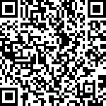

# 前言

在过去十年中，机器学习领域取得了巨大进展，并因此吸引了公众的关注。但我们必须牢记，尽管这些算法令人印象深刻，它们并非万无一失。通过本书，我们希望提供一种易于理解的介绍，说明如何在深度学习中应用贝叶斯推理，赋予读者开发“知道自己不知道”的模型的工具。通过这样做，你将能够开发出更强健的深度学习系统，更好地满足当今基于机器学习的应用需求。

## 本书适合人群

本书面向从事机器学习算法开发和应用的研究人员、开发人员和工程师，特别是那些希望开始使用具备不确定性感知的深度学习模型的人。

## 本书内容

*第一章*，*深度学习时代的贝叶斯推理* 介绍了传统深度学习方法的应用场景和局限性。

*第二章*，*贝叶斯推理基础* 讨论了贝叶斯建模和推理，并探讨了贝叶斯推理的黄金标准机器学习方法。

*第三章*，*深度学习基础* 介绍了深度学习模型的主要构建块。

*第四章*，*贝叶斯深度学习简介* 将 *第二章*，*贝叶斯推理基础* 和 *第三章*，*深度学习基础* 中介绍的概念结合起来，讨论贝叶斯深度学习。

*第五章*，*贝叶斯深度学习的原则方法* 介绍了贝叶斯神经网络近似的有原则的方法。

*第六章*，*使用标准工具箱进行贝叶斯深度学习* 介绍了利用常见深度学习方法来促进模型不确定性估计的方法。

*第七章*，*贝叶斯深度学习的实际考虑* 探讨并比较了在*第五章*，*贝叶斯深度学习的原则方法* 和 *第六章*，*使用标准工具箱进行贝叶斯深度学习* 中介绍的方法的优缺点。

*第八章*，*应用贝叶斯深度学习* 提供了贝叶斯深度学习多种应用的实际概述，如检测分布外数据或应对数据集偏移的鲁棒性。

*第九章*, *贝叶斯深度学习的下一步*，讨论了贝叶斯深度学习中的一些最新趋势。

## 充分利用本书

你需要具备一定的机器学习和深度学习的基础知识，并对贝叶斯推理的相关概念有所了解。具备 Python 和机器学习框架（如 TensorFlow 或 PyTorch）的一些实践经验也会很有帮助，但并不是必要的。

推荐使用 Python 3.8 或更高版本，因为所有代码都已在 Python 3.8 上进行了测试。*第一章*，*深度学习时代的贝叶斯推理*提供了关于设置本书代码示例环境的详细说明。

## 下载示例代码文件

本书的代码包也托管在 GitHub 上，地址是 [`github.com/PacktPublishing/Enhancing-Deep-Learning-with-Bayesian-Inference`](https://github.com/PacktPublishing/Enhancing-Deep-Learning-with-Bayesian-Inference)。如果代码有更新，它将会更新到现有的 GitHub 仓库中。

我们还提供了来自我们丰富的书籍和视频目录中的其他代码包，地址是 [`github.com/PacktPublishing/`](https://github.com/PacktPublishing/)。快去看看吧！

## 下载彩色图像

我们还提供了一个 PDF 文件，包含本书中使用的截图/图表的彩色图像。你可以在这里下载：[`packt.link/7xy1O`](https://packt.link/7xy1O)。

## 使用的约定

本书中使用了许多文本约定。

`CodeInText`：表示文本中的代码词汇、数据库表名、文件夹名、文件名、文件扩展名、路径名、虚拟网址和用户输入。示例：“任何尝试运行包含此类问题的代码都会立即导致解释器失败，并抛出 `SyntaxError` 异常。”

代码块如下设置：

```py

{const set = function(...items) { 
this.arr  = [...items]; 
this.add = {function}(item) { 
if( this._arr.includes(item) ) { 
            return false; (SC-Source)}
```

任何命令行输入或输出都如下书写：

```py

$ python3 script.py
```

一些代码示例将表示 shell 的输入。你可以通过特定的提示符号来识别它们：

+   `>>>` 表示交互式 Python shell

+   `$` 表示 Bash shell（macOS 和 Linux）

+   `>` 表示 CMD 或 PowerShell（Windows）

警告或重要提示会以这种方式出现。

重要提示

警告或重要提示会以这种方式出现。

提示和技巧以这种方式出现。

提示或技巧

以这种方式出现。

## 联系我们

我们欢迎读者的反馈。

**一般反馈**：如果你对本书的任何方面有疑问，请在邮件主题中提到书名，并发送至 customercare@packtpub.com。

**勘误表**：尽管我们已经尽力确保内容的准确性，但错误仍然可能发生。如果您在本书中发现了错误，我们将非常感激您能向我们报告。请访问 [www.packtpub.com/submit-errata](https://www.packtpub.com/submit-errata)，选择您的书籍，点击“勘误表提交表单”链接，并输入详细信息。

**盗版**：如果您在互联网上遇到我们作品的任何非法复制品，我们将非常感激您能提供该内容的地址或网站名称。请通过 copyright@packtpub.com 联系我们，并附上相关链接。

**如果您有兴趣成为作者**：如果您在某个领域有专业知识，并且有兴趣编写或为书籍贡献内容，请访问 [authors.packtpub.com](https://authors.packtpub.com)。

## 分享您的想法

一旦您阅读了**《通过贝叶斯推断增强深度学习》**，我们很希望听到您的想法！请 [点击这里直接前往 Amazon 评论页面](https://packt.link/r/180324688X) 以分享您的反馈。

您的评论对我们和技术社区至关重要，将帮助我们确保提供优质的内容。

## 下载这本书的免费 PDF 版本

感谢购买本书！

您喜欢随时随地阅读，但无法随身携带纸质书籍吗？

您购买的电子书是否与您选择的设备不兼容？

不用担心，现在每本 Packt 书籍都会免费提供无 DRM 保护的 PDF 版本。

您可以在任何地方、任何设备上阅读。直接从您最喜欢的技术书籍中搜索、复制并粘贴代码到您的应用程序中。

这些福利不止于此，您还可以每天收到独家的折扣、新闻通讯以及精彩的免费内容。

按照以下简单步骤获得福利：

1.  扫描二维码或访问下面的链接

    

    [`packt.link/free-ebook/9781803246888`](https://download.packt.com/free-ebook/9781803246888)

1.  提交您的购买凭证

1.  就是这样！我们将把您的免费 PDF 和其他福利直接发送到您的电子邮件中。
