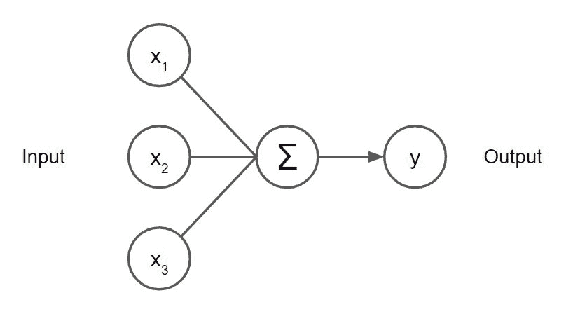
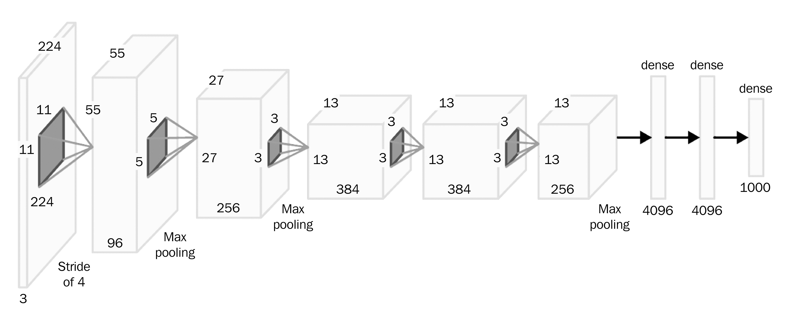
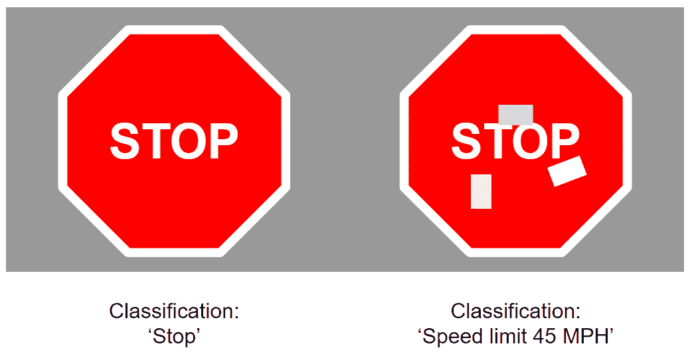

# 第一章

深度学习时代的贝叶斯推理

在过去的十五年里，**机器学习**（**ML**）从一个相对不为人知的领域，迅速成为科技圈的流行词。这在很大程度上归功于**神经网络**（**NNs**）的惊人成就。曾经是该领域中的一个冷门角色，**深度学习**在几乎每个可想象的应用中的成就，导致其人气的迅速飙升。它的成功如此广泛，以至于我们不再因深度学习所带来的特性而感到惊讶，反而开始*期望*它们的出现。从社交应用中的滤镜，到在海外度假时依赖谷歌翻译，深度学习无疑已经深深嵌入到技术领域中。

尽管深度学习取得了令人印象深刻的成就，并为我们带来了丰富的产品和特性，但它仍然没有跨越最后的障碍。随着复杂的神经网络越来越多地应用于关键任务和安全任务，关于它们稳健性的疑问变得越来越重要。许多深度学习算法的“黑箱”特性使得它们成为安全意识强的解决方案架构师的难题——以至于许多人宁愿接受次优的表现，也不愿承担使用不透明系统的潜在风险。

那么，我们如何克服围绕深度学习的疑虑，确保构建更加稳健、值得信赖的模型呢？虽然一些答案可以从**可解释人工智能**（**XAI**）的路径中找到，但一个重要的构建块在于**贝叶斯深度学习**（**BDL**）领域。通过本书，你将通过实际示例了解 BDL 背后的基本原理，帮助你深入理解该领域，并为你提供所需的知识和工具，以构建自己的 BDL 模型。

但在开始之前，让我们更深入地探讨贝叶斯深度学习（BDL）的理论依据，为什么典型的深度学习方法可能没有我们想象中的那么稳健。在本章中，我们将了解深度学习的一些关键成功与失败案例，以及 BDL 如何帮助我们避免标准深度模型可能带来的悲剧性后果。然后，我们将概述本书其余章节的核心内容，并介绍我们将在实际示例中使用的库和数据。

以下主题将在接下来的章节中讨论：

+   深度学习时代的奇迹

+   理解深度学习的局限性

+   核心主题

+   设置工作环境

## 1.1 技术要求

本书的所有代码都可以在本书的 GitHub 仓库中找到：[`github.com/PacktPublishing/Enhancing-Deep-Learning-with-Bayesian-Inference`](https://github.com/PacktPublishing/Enhancing-Deep-Learning-with-Bayesian-Inference)。

## 1.2 深度学习时代的奇迹

在过去的 10 到 15 年里，由于深度学习的巨大成功，我们见证了机器学习领域的剧变。深度学习影响力最广泛的成就之一，或许就是它已经渗透到从医学影像学、制造业到翻译工具和内容创作等各个领域。

尽管深度学习在最近几年才取得了巨大成功，但它的许多核心原理已经得到了很好的确立。研究人员已经在神经网络领域工作了一段时间——实际上，早在 1957 年，Frank Rosenblatt 就提出了第一个神经网络！当然，这比我们今天的模型要简单得多，但它是这些模型的重要组成部分：感知器，如*图 1.1*所示。



图 1.1：单一感知器的示意图

1980 年代引入了许多如今已熟知的概念，其中包括 Kunihiko Fukushima 于 1980 年提出的**卷积神经网络**（**CNNs**），以及 John Hopfield 于 1982 年开发的**递归神经网络**（**RNN**）。1980 年代和 1990 年代，这些技术进一步成熟：Yann LeCun 在 1989 年将反向传播应用于创建能够识别手写数字的 CNN，而长短期记忆（LSTM）RNN 的关键概念则由 Hochreiter 和 Schmidhuber 于 1997 年提出。

然而，尽管在世纪之交之前我们已经有了今天强大模型的基础，直到现代 GPU 的引入，整个领域才真正蓬勃发展。随着 GPU 带来的加速训练和推理，开发包含几十层（甚至几百层）网络成为可能。这为非常复杂的神经网络架构开辟了大门，这些架构能够学习高维数据的紧凑特征表示。



图 1.2：AlexNet 架构图

最早具有重大影响的网络架构之一是 AlexNet。这一网络由 Alex Krizhevsky、Ilya Sutskever 和 Geoffrey Hinton 开发，包含 11 层，能够将图像分类为 1000 种可能的类别之一。它在 2012 年的 ImageNet 大规模视觉识别挑战赛中取得了前所未有的成绩，展示了深度网络的强大能力。AlexNet 是许多具有影响力的神经网络架构中的第一个，接下来的几年里，许多现在熟知的架构相继问世，包括 VGG Net、Inception 架构、ResNet、EfficientNet、YOLO……这个列表还在继续！

但是神经网络不仅仅在计算机视觉应用中取得了成功。2014 年，Dzmitry Bahdanau、Kyunghyun Cho 和 Yoshua Bengio 的研究表明，端到端神经网络模型可以用于在机器翻译中取得最先进的成果。这是该领域的一个分水岭时刻，随后大规模的机器翻译服务迅速采用了这些端到端网络，进一步推动了自然语言处理领域的发展。时至今日，这些概念已经发展成熟，产生了**Transformer**架构——一种通过自监督学习获取丰富特征嵌入能力的架构，极大地推动了深度学习的发展。

借助各种架构赋予的令人印象深刻的灵活性，神经网络如今已在几乎每个可想象的领域的应用中达到了最先进的性能，并且它们已成为我们日常生活中熟悉的一部分。无论是我们在移动设备上使用的面部识别，还是像谷歌翻译这样的翻译服务，亦或是智能设备中的语音识别，显然这些网络不仅在图像分类挑战中具有竞争力，它们现在是我们开发的技术中不可或缺的一部分，甚至能够*超越* *人类*。

随着深度学习模型超越人类专家的报道越来越频繁，最深刻的例子或许是在医学影像领域。2020 年，由伦敦帝国学院和谷歌健康研究人员开发的一个网络在从乳腺 X 光片中检测乳腺癌时超越了六位放射科医生。几个月后，2021 年 2 月的一项研究表明，一个深度学习模型能够超越两位人类专家，诊断胆囊疾病。另一项在同年晚些时候发布的研究显示，一个卷积神经网络（CNN）在检测皮肤异常图像中的黑色素瘤时超越了 157 位皮肤科医生。

到目前为止，我们讨论的所有应用都是监督式的机器学习应用，其中模型被训练用于分类或回归问题。然而，深度学习最令人印象深刻的成就之一出现在其他应用中，包括生成建模和强化学习。也许最著名的强化学习例子之一是**AlphaGo**，这是 DeepMind 开发的一个强化学习模型。顾名思义，这个算法通过强化学习训练来下围棋。与象棋等一些游戏不同，象棋可以通过相对直接的人工智能方法来解决，而围棋在计算上要复杂得多。这是因为围棋的复杂性——众多可能的着法组合使得传统方法难以应对。因此，当 AlphaGo 在 2015 年和 2016 年分别战胜围棋冠军范辉和李世石时，这成了轰动一时的新闻。

DeepMind 通过创建一个自我对弈的版本进一步改进了 AlphaGo——AlphaGo Zero。这个模型优于任何以前的模型，在围棋中达到了超人类的表现。其成功的核心算法 AlphaZero 也在其他一系列游戏中实现了超人类的表现，证明了该算法能够推广到其他应用领域。

过去十年，深度学习的另一个重要里程碑是**生成对抗网络**（**GANs**）的出现。GAN 通过使用两个网络来工作。第一个网络的目标是生成与训练集具有相同统计特征的数据。第二个网络的目标是根据从数据集中学到的内容对第一个网络的输出进行分类。因为第一个网络并没有直接在数据上进行训练，它不会简单地复制数据——而是通过学习欺骗第二个网络来工作。这就是为什么使用*对抗*这一术语的原因。通过这一过程，第一个网络能够学习哪些输出能够成功欺骗第二个网络，从而生成符合数据分布的内容。

GAN 能够生成特别令人印象深刻的输出。例如，以下图像是由 StyleGAN2 模型生成的：


图 1.3：由 StyleGAN2 从 thispersondoesnotexist.com 生成的面孔。

但 GAN 不仅仅用于生成真实的面孔；它们在许多其他领域也有实际应用，比如为药物发现建议分子组合。它们还是通过数据增强提升其他机器学习方法的强大工具——使用 GAN 生成的数据来扩充数据集。

所有这些成功可能让深度学习看起来无懈可击。虽然它的成就令人印象深刻，但它们并没有讲述整个故事。在下一节中，我们将了解深度学习的一些失败，并开始理解贝叶斯方法如何帮助我们避免这些问题。

## 1.3 理解深度学习的局限性

正如我们所见，深度学习取得了一些显著的成就，不可否认它正在革新我们处理数据和预测建模的方式。但深度学习的短暂历史中也充满了更黑暗的故事：这些故事带来了重要的教训，帮助我们开发出更强大、更安全的系统。

在本节中，我们将介绍一些深度学习失败的关键案例，并讨论贝叶斯视角如何有助于产生更好的结果。

### 1.3.1 深度学习系统中的偏差

我们将从一个教科书式的**偏差**例子开始，这是数据驱动方法面临的一个关键问题。这个例子围绕着亚马逊展开。如今已经是家喻户晓的名字，亚马逊最初通过彻底改变书籍零售的世界而起步，随后成为了几乎任何商品的*一站式购物平台*：从花园家具到新笔记本电脑，甚至是家庭安全系统，如果你能想到它，你大概可以在亚马逊上购买到。该公司还在技术上取得了显著进展，通常是通过改进基础设施以促进其扩展。从硬件基础设施到优化方法中的理论和技术飞跃，最初的电子商务公司如今已经成为技术领域的关键人物之一。

虽然这些技术飞跃通常会设定行业标准，但这个例子却恰恰相反：它展示了数据驱动方法的一个关键弱点。我们所指的案例是亚马逊的 AI 招聘软件。由于自动化在亚马逊成功中的关键作用，将这一自动化扩展到简历审查是合情合理的。2014 年，亚马逊的机器学习工程师部署了一个工具来实现这一目标。该工具基于过去十年的申请者数据进行训练，旨在从公司庞大的申请者池中识别出有利的特征。然而，2015 年时，大家发现它学会了依赖某些特征，从而导致了深具负面影响的行为。

这个问题在很大程度上源于底层数据：由于当时科技行业的特性，亚马逊的简历数据集主要由男性申请者主导。这导致了模型预测中的巨大不平衡：它实际上学会了偏向男性，变得极其偏向男性申请者，严重歧视女性申请者。模型的歧视行为导致亚马逊放弃了这个项目，至今它已成为 AI 社区中偏差问题的一个重要案例。

在这里提出的问题中，一个重要的因素是，这种偏见不仅仅是由*显式*信息驱动的，比如一个人的名字（这可能是性别的线索）：算法会学习潜在的信息，进而驱动偏见。这意味着，问题不能仅仅通过匿名化人们来解决——需要工程师和科学家确保对偏见进行全面评估，以确保我们部署的算法是公平的。尽管贝叶斯方法无法消除偏见，但它为我们提供了一系列工具，帮助我们解决这些问题。正如我们在本书后面将看到的，贝叶斯方法使我们能够确定数据是否处于分布内（in-distribution）还是**分布外**（**OOD**）。在这种情况下，亚马逊本可以利用贝叶斯方法的这一能力：将分布外（OOD）数据分离出来，并进行分析，了解为何这些数据是 OOD 的。是因为它关注到了一些相关因素，比如经验不匹配的申请者？还是关注到了某些无关且具有歧视性的因素，比如申请者的性别？这本可以帮助亚马逊的机器学习团队尽早发现不良行为，从而开发出无偏的解决方案。

### 1.3.2 过度自信预测的危险

另一个广泛引用的深度学习失败案例，出现在 Kevin Eykholt *等人*的论文《深度学习视觉分类的稳健物理世界攻击》中（[`arxiv.org/abs/1707.08945`](https://arxiv.org/abs/1707.08945)）。这篇论文在揭示深度学习模型的**对抗攻击**问题上起到了重要作用：稍微修改输入数据，让模型做出错误预测。在他们论文中的一个关键例子中，他们在停车标志上粘贴了白色和黑色的贴纸。尽管对标志的修改非常微妙，计算机视觉模型却将修改后的标志误解为限速 45 标志。



图 1.4：展示了一个简单对抗攻击对模型解读停车标志的影响。

起初，这看起来可能无关紧要，但如果我们退一步，考虑特斯拉、优步等公司在自动驾驶汽车方面投入的巨大工作，就不难看出这种对抗性扰动如何导致灾难性后果。在这个标志的案例中，误分类可能导致自动驾驶汽车忽略停车标志，冲入交叉路口的交通中。这显然对乘客或其他道路使用者来说都不好。事实上，2016 年发生过一个与我们所描述的非常相似的事件，当时一辆特斯拉 Model S 在佛罗里达州北部与一辆卡车发生碰撞（[`www.reuters.com/article/us-tesla-crash-idUSKBN19A2XC`](https://www.reuters.com/article/us-tesla-crash-idUSKBN19A2XC)）。据特斯拉称，由于无法将卡车后面明亮的天空与拖车区分开来，特斯拉的自动驾驶系统没有检测到拖车。驾驶员也未能注意到拖车，最终导致了致命的碰撞。但如果自动驾驶系统的决策过程更为复杂呢？本书的一个关键主题是如何在我们的机器学习系统中做出*鲁棒*的决策，特别是在任务关键或安全关键的应用中。

虽然这个交通标志的例子直观地展示了误分类带来的危险，但这一点同样适用于广泛的其他场景，从用于制造的机器人设备到自动化手术程序。

对于这些系统而言，了解一定程度的信心（或不确定性）是提高其鲁棒性并确保一致性安全行为的重要步骤。在停车标志的案例中，拥有一个“知道自己不知道”的模型可以防止潜在的悲剧性后果。正如我们将在本书后面看到的，BDL 方法通过不确定性估计可以帮助我们检测对抗性输入。在我们的自动驾驶汽车示例中，可以将其纳入逻辑中，以便在模型不确定时，汽车安全停车并切换到手动模式，让驾驶员能够安全地应对这一情况。这就是具有不确定性感知模型的*智慧*：让我们设计出了解自己局限性的模型，从而在意外情况下更加鲁棒。

### 1.3.3 趋势变化

我们之前的例子探讨了应对数据随时间变化的挑战——这是现实世界应用中常见的问题。我们将考虑的第一个问题，通常被称为**数据集漂移**或**协变量漂移**，发生在模型推理时遇到的数据相对于训练时的数据发生了变化。这通常是由于现实世界问题的动态性以及训练集——即使是非常大的训练集——也很少能代表它们所代表现象的全部变化。一个重要的例子可以在论文《*Systematic Review of Approaches to Preserve Machine Learning* *Performance in the Presence of Temporal Dataset Shift in Clinical Medicine*》中找到，在这篇论文中，Lin Lawrence Guo *等*人强调了数据集漂移的问题（[`www.ncbi.nlm.nih.gov/pmc/articles/PMC8410238/`](https://www.ncbi.nlm.nih.gov/pmc/articles/PMC8410238/)）。他们的研究表明，关于如何解决临床环境中应用的机器学习模型中的数据集漂移问题的文献相对较少。这是一个问题，因为临床数据是动态的。让我们来看一个例子。

在我们的例子中，我们有一个模型，它被训练用来根据病人的症状自动开药。当病人向医生抱怨呼吸道症状时，医生使用该模型开药。由于模型接收到的数据，模型开出了抗生素。这个方法对许多病人有效，但随着时间的推移，情况发生了变化：一种新疾病在群体中变得流行。这种新疾病恰好与之前流行的细菌感染症状非常相似，但它是由病毒引起的。由于模型无法适应数据集的变化，它继续推荐抗生素。这不仅无法帮助病人，还可能导致局部群体中抗生素耐药性的产生。

为了能够应对现实世界数据中的这些变化，模型需要对数据集漂移保持敏感性。做到这一点的一种方法是通过使用贝叶斯方法，这些方法提供不确定性估计。将其应用到我们的自动开药示例中，当模型能够生成不确定性估计时，它对数据中的微小变化变得敏感。例如，可能会有一些微妙的症状差异，比如与我们新的病毒感染相关的不同类型的咳嗽。这将导致模型预测的不确定性上升，表明模型需要通过新数据进行更新。

一个相关问题，被称为**灾难性遗忘**，是由模型适应数据变化引起的。根据我们的例子，这听起来像是件好事：如果模型正在适应数据变化，那它们就永远是最新的，对吧？不幸的是，事情并没有那么简单。灾难性遗忘发生在模型从新数据中学习时，但在此过程中“忘记”了过去的数据。

例如，假设开发了一种机器学习算法来识别欺诈性文档。它可能一开始表现得非常好，但欺诈者很快会注意到曾经能够欺骗自动文档验证的方法不再有效，因此他们开发了新方法。虽然其中一些方法能成功突破，但模型通过其不确定性估计注意到它需要适应新数据。模型更新了其数据集，专注于当前流行的攻击方法，并进行几轮额外的训练。再次，它成功地阻止了欺诈者，但让模型设计师吃惊的是，模型开始放行一些较老、更不复杂的攻击：这些攻击曾经很容易被模型识别出来。

在新数据的训练中，模型的参数发生了变化。由于更新后的数据集中没有足够的旧数据支持，模型丧失了关于输入（文档）和其分类（是否欺诈）的旧关联信息。

尽管这个例子使用不确定性估计来解决数据集漂移问题，但它本可以进一步利用这些估计来确保数据集的平衡性。这可以通过**不确定性采样**等方法来实现，这些方法旨在从不确定区域进行采样，确保用于训练模型的数据集涵盖当前和过去数据中的所有可用信息。

## 1.4 核心主题

本书的目标是为您提供开发自己 BDL 解决方案所需的工具和知识。为此，尽管我们假设您对统计学习和深度学习的概念有所了解，但我们仍然会提供这些基础概念的复习。

在*第二章*，*贝叶斯推断基础*中，我们将回顾贝叶斯推断的一些关键概念，包括概率和模型不确定性估计。在*第三章*，*深度学习基础*中，我们将介绍深度学习的几个重要方面，包括通过反向传播学习以及神经网络的常见变种。在掌握这些基础后，我们将在*第四章*，*引入贝叶斯深度学习*中开始探索 BDL。在*第五章*和*第六章*中，我们将深入探讨 BDL；首先学习一些有原则的方法，然后继续了解更多用于逼近贝叶斯神经网络的实用方法。

在 *第七章* *贝叶斯深度学习的实际考虑* 中，我们将探讨一些贝叶斯深度学习的实际应用考虑，帮助我们理解如何最好地将这些方法应用于现实问题。在 *第八章* *应用贝叶斯深度学习* 中，我们应该已经对核心的贝叶斯深度学习方法有了扎实的理解，并通过一系列实际的示例进一步巩固这一知识。最后，在 *第九章* *贝叶斯深度学习的下一步* 中，我们将概述贝叶斯深度学习领域当前面临的挑战，并对技术的发展方向有所了解。

在本书的大多数章节中，理论内容将配以实践示例，帮助你通过自己动手实现这些方法来加深理解。为了跟随这些编码示例，你需要设置好 Python 环境并安装所需的先决条件。我们将在下一节中介绍这些内容。

## 1.5 设置工作环境

为了完成本书中的实践部分，你需要一个包含必要先决条件的 Python 3.9 环境。我们建议使用 `conda`，它是一个专为科学计算应用设计的 Python 包管理器。要安装 `conda`，只需访问 [`conda.io/projects/conda/en/latest/user-guide/install/index.html`](https://conda.io/projects/conda/en/latest/user-guide/install/index.html)，并按照你的操作系统的安装说明进行操作。

安装了 `conda` 后，你可以设置用于本书的 `conda` 环境：

```py

conda create -n bdl python=3.9
```

当你按下 *Enter* 键执行此命令时，系统会询问是否继续安装所需的软件包；只需输入 `y` 并按 **Enter**。`conda` 将继续安装核心软件包。

你现在可以通过输入以下命令激活你的环境：

```py

conda activate bdl
```

你现在会看到你的 shell 提示符中包含 `bdl`，这表示你的 `conda` 环境已激活。现在，你可以开始安装本书所需的先决条件了。本书所需的关键库如下：

+   **NumPy**：数值 Python，或 NumPy，是 Python 中进行数值编程的核心库。你可能已经非常熟悉这个库了。

+   **SciPy**：SciPy，或科学 Python，提供了科学计算应用程序所需的基础包。整个科学计算栈，包括 SciPy、matplotlib、NumPy 和其他库，通常被称为 SciPy 栈。

+   **scikit-learn**：这是核心的 Python 机器学习库。基于 SciPy 栈，它提供了许多流行机器学习方法的易用实现。它还提供了大量的辅助类和函数用于数据加载和处理，我们将在本书中多次使用。

+   **TensorFlow**：TensorFlow 与 PyTorch 和 JAX 一起，是流行的 Python 深度学习框架之一。它提供了开发深度学习模型所需的工具，并将在本书中的许多编程示例中提供基础。

+   **TensorFlow Probability**：基于 TensorFlow，TensorFlow Probability 提供了处理概率神经网络所需的工具。我们将在本书中使用它与 TensorFlow 一起进行许多贝叶斯神经网络的示例。

要安装本书所需的所有依赖项，请在激活 `conda` 环境后输入以下命令：

```py

conda install -c conda-forge scipy sklearn matplotlib seaborn 
tensorflow tensorflow-probability
```

让我们总结一下所学内容。

## 1.6 总结

在本章中，我们回顾了深度学习的成功，重新认识了它巨大的潜力以及它在当今技术中的普遍存在。我们还探索了一些它不足之处的关键例子：深度学习未能解决的场景，展示了潜在的灾难性后果。虽然 BDL 无法消除这些风险，但它可以帮助我们构建更强健的机器学习系统，结合深度学习的灵活性与贝叶斯推理的谨慎。

在下一章中，我们将深入探讨贝叶斯推理和概率的一些核心概念，为我们进入 BDL 做准备。
