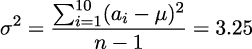
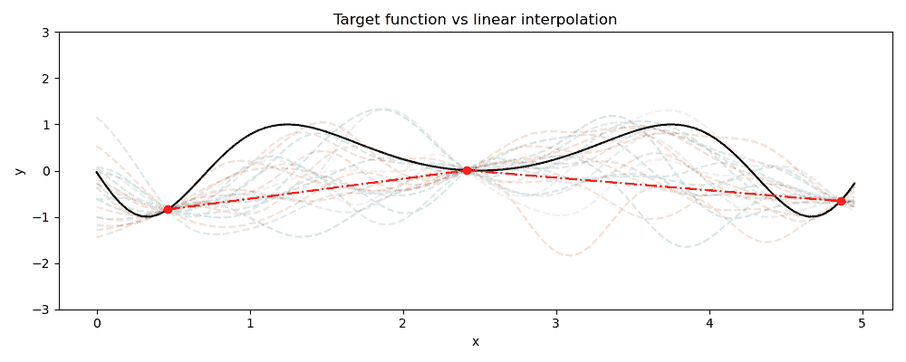

# 第二章

贝叶斯推理基础

在我们开始探讨使用**深度神经网络**（**DNNs**）进行贝叶斯推理之前，我们应该花一些时间理解基本原理。在本章中，我们将进行这样的探讨：探索贝叶斯建模的核心概念，并了解一些常用的贝叶斯推理方法。在本章结束时，你应该能很好地理解我们为何使用概率建模，以及我们在良好原则化的或良好条件化的模型中寻求什么样的特性。

本内容将涵盖以下部分：

+   刷新我们对贝叶斯建模的理解

+   通过采样进行贝叶斯推理

+   探索高斯过程

## 2.1 刷新我们对贝叶斯建模的理解

贝叶斯建模关注的是在一些先验假设和观察数据的基础上理解事件发生的概率。先验假设描述了我们对事件的初步信念或假设。例如，假设我们有两个六面骰子，并且我们想预测两个骰子和为 5 的概率。首先，我们需要了解有多少种可能的结果。因为每个骰子有 6 面，所有可能的结果数是 6 × 6 = 36。为了计算掷出和为 5 的可能性，我们需要算出哪些数值的组合加起来是 5：

图 2.1：展示掷出两个六面骰子时所有数值和为 5 的情况

如我们所见，有 4 种组合的和为 5，因此两个骰子和为 5 的概率是！-4 36，即。我们称这个初步的信念为**先验**。现在，如果我们加入来自观察的信息会发生什么呢？假设我们知道其中一个骰子的值是 3，这就将我们可能的值缩小到 6，因为我们只剩下另一个骰子要掷，为了使结果为 5，我们需要另一个骰子的值是 2。

图 2.2：展示剩余的值，在掷出第一个骰子后和为 5

因为我们假设骰子是公平的，现在两个骰子和为 5 的概率是。这个概率，称为**后验**，是通过我们的观察得到的信息计算出来的。贝叶斯统计的核心是贝叶斯定理（因此称为“贝叶斯”），我们用它来在有一些先验知识的情况下确定后验概率。贝叶斯定理定义如下：

在这里，我们可以定义`P`(`A`|`B`)为`P`(`d₁` + `d₂` = 5|`d₁` = `3`)，其中`d₁`和`d₂`分别代表骰子 1 和骰子 2。我们可以通过之前的例子看到这一点。从**似然**开始，即分子左侧的项，我们看到：

我们可以通过查看我们的网格来验证这一点。移动到分子部分的第二部分——先验——我们看到：

在分母部分，我们有我们的**归一化常数**（也称为**边际似然**），它就是：

将这一切结合在一起使用贝叶斯定理，我们得到：

这里我们得到的是，如果我们知道一个骰子的值，结果为 5 的*概率*。然而，在本书中，我们将经常提到**不确定性**，而不是概率——并且学习如何通过深度神经网络（DNN）获得不确定性估计。这些方法属于更广泛的**不确定性量化**类别，旨在量化来自机器学习模型预测中的不确定性。也就是说，我们希望预测 `P`(*ŷ*|*𝜃*)，其中 *ŷ* 是模型的预测值，而 *𝜃* 代表模型的参数。

正如我们从基础概率论中知道的那样，概率是介于 0 和 1 之间的。越接近 1，事件发生的可能性就越大——或称为概率越高。我们可以将我们的不确定性视为从 1 中减去概率。在这里的示例中，和为 5 的概率是 `P`(`d₁` + `d₂` = 5|`d₁` = 3) =  = 0*.*166。所以，我们的不确定性就是 1 − =  = 0*.*833，意味着结果*不会*是 5 的概率*大于* 80%。随着我们深入本书，我们将学习不同的不确定性来源，以及如何利用不确定性来开发更强大的深度学习系统。

让我们继续使用我们的骰子示例，以更好地理解模型不确定性估计。许多常见的机器学习模型基于**最大似然估计**（**MLE**）。也就是说，它们寻求预测最*可能*的值：在训练过程中调节其参数，以根据一些输入 `x` 产生最可能的输出 *ŷ*。作为简单的说明，假设我们要预测 `d₁` + `d₂` 的值，给定 `d₁` 的值。我们可以简单地将其定义为**期望**，即在 `d₁` 条件下，`d₁` + `d₂` 的期望值：

![ˆy = 𝔼 [d + d |d ] 1 2 1 ](img/file20.jpg)

即，`d₁` + `d₂` 的可能值的*均值*。

设置 `d₁` = 3，我们可能得到的 `d₁` + `d₂` 的值为 {4*,`5`,`6`,`7`,`8`,*9}（如*图 2.2*所示），使得我们的均值：

这是我们从简单线性模型中得到的值，比如由以下定义的线性回归模型：

在这种情况下，我们的交集和偏差值为*β* = 1，*ξ* = 3*.*5。如果我们将`d₁`的值更改为 1，我们会看到均值变为 4*.*5——即`d₁` + `d₂`|`d₁` = 1 的可能值集合的均值，换句话说，{2*,`3`,`4`,`5`,`6`,*7}。这种对我们模型预测的视角很重要：虽然这个例子非常简单，但同样的原则适用于更复杂的模型和数据。我们在机器学习模型中通常看到的值是*期望值*，也就是均值。如你所知，均值通常被称为**第一统计矩**——而**第二统计矩**就是**方差**，方差使我们能够量化不确定性。

我们简单示例的方差定义如下：

这些统计量对你应该是熟悉的，方差在这里表示为**标准差**的平方，*σ*。对于我们的示例，这里假设`d₂`是一个公平的骰子，方差始终是常数：*σ*² = 2*.*917。也就是说，给定任何`d₁`的值，我们知道`d₂`的所有值都是同等可能的，因此不确定性不会变化。但如果我们有一个不公平的骰子`d₂`，它有 50%的概率掷出 6，且每个其他数字的概率是 10%呢？这将改变我们的均值和方差。我们可以通过看如何表示这一点作为一组可能的值（换句话说，骰子的一个完美样本）来看到这一点——`d₁` + `d₂`|`d₁` = 1 的可能值集合现在变为{2*,`3`,`4`,`5`,`6`,`7`,`7`,`7`,`7`,*7}。我们的新模型现在将有一个偏差*ξ* = 4*.*5，这样我们的预测就变为：

我们看到，期望值由于骰子`d₁`的基础概率的变化而增加。然而，这里重要的区别在于方差值的变化：

我们的方差已经*增加*。由于方差本质上给出了每个可能值与均值的距离的平均值，这并不令人惊讶：考虑到加权骰子，结果更有可能远离均值，而不像不加权骰子那样，因此我们的方差增加。总结来说，在不确定性方面：结果距离均值越远的可能性越大，不确定性也就越大。

这对我们如何解读机器学习模型（以及更广泛的统计模型）预测结果具有重要意义。如果我们的预测是均值的近似值，而我们的不确定性量化了某个结果偏离均值的可能性，那么我们的不确定性告诉我们**我们的模型预测错误的可能性有多大**。因此，模型的不确定性让我们能够决定何时信任预测，何时需要更加谨慎。

这里给出的例子非常基础，但应该能帮助你理解我们希望通过模型不确定性量化实现的目标。随着我们学习一些贝叶斯推断的基准方法，我们将继续探索这些概念，了解它们如何应用于更复杂的现实问题。我们将从可能是贝叶斯推断最基本的方法——采样开始。

## 2.2 通过采样进行贝叶斯推断

在实际应用中，无法精确知道某个结果会是什么，类似地，也无法观察到所有可能的结果。在这种情况下，我们需要根据已有的证据做出最佳估计。证据由**样本**构成——即可能结果的观察。广义而言，机器学习的目标是学习能够从数据子集良好泛化的模型。贝叶斯机器学习的目标是在做到这一点的同时，还要提供一个模型预测的不确定性估计。在这一部分中，我们将学习如何利用采样来实现这一点，同时也会了解为什么采样可能不是最合理的方法。

### 2.2.1 近似分布

从最基础的层面来看，采样就是在进行分布的近似。假设我们想知道纽约人身高的分布。我们可以去测量每个人的身高，但那将涉及到测量 840 万人！虽然这会给我们最准确的答案，但这种方法在实践中是极为不切实际的。

相反，我们可以从总体中进行采样。这给我们提供了一个基本的**蒙特卡洛采样**的例子，在这个过程中，我们通过随机采样提供数据，从而近似一个分布。例如，假设我们有一个纽约居民的数据库，我们可以随机选择一部分居民，并用这些数据来近似所有居民的身高分布。通过随机采样——以及任何采样——这种近似的准确性取决于子总体的大小。我们希望实现的是一个**统计显著**的子样本，从而使我们对近似结果有信心。

为了更好地理解这一点，我们将通过从截尾正态分布生成 10 万个数据点来模拟这个问题，以近似看到 10 万人口的身高分布。假设我们随机抽取 10 个样本。这里是我们的分布图（右侧）与真实分布图（左侧）的对比：

图 2.3：真实分布图（左）与样本分布图（右）的绘制。

从这里我们可以看出，这并不是真实分布的一个很好的表示：这里看到的更接近一个三角形分布而不是一个截尾正态分布。如果我们仅仅基于这个分布推断人口的身高，我们会得出许多不准确的结论，比如忽略了 200 厘米以上的截尾，以及分布左侧的尾部。

通过增加样本量，我们可以得到更好的估计 —— 让我们尝试抽取 100 个样本：

图 2.4：真实分布图（左）与样本分布图（右）的绘制。

情况开始好转：我们开始看到左侧的一些尾部以及朝 200 厘米处的截尾。然而，这个样本从某些区域采样更多，导致了误代表：我们的平均数被拉低了，我们看到了两个明显的高峰，而不是真实分布中的单一高峰。让我们将样本量增加一个数量级，扩展到 1,000 个样本：

图 2.5：真实分布图（左）与样本分布图（右）的绘制。

现在看起来好多了 —— 通过一个比真实人口规模小一百倍的样本集，我们现在看到的分布与真实分布非常接近。这个例子展示了通过随机抽样，我们可以使用显著较小的观察池来近似真实分布。但是，这个池子仍然必须包含足够的信息，以使我们能够得出对真实分布良好近似的结论：样本太少，我们的子集将统计上不足，导致对潜在分布的近似不良。

但是，简单随机采样并不是逼近分布的最实际方法。为了实现这一点，我们转向**概率推断**。给定一个模型，概率推断提供了一种方法来找到最能描述我们数据的模型参数。为此，我们需要首先定义模型的类型——这就是我们的先验。在我们的例子中，我们使用截断的高斯分布：基于我们的直觉，假设人类的身高遵循正态分布是合理的，但很少有人会超过 6’5” （约 196 厘米）。因此，我们将指定一个截断的高斯分布，设定上限为 205 厘米，或者说稍超过 6’5”。由于它是一个高斯分布，换句话说，𝒩(*μ,σ*)，我们的模型参数是*𝜃* = {*μ,σ*}——并且有额外的约束条件，即我们的分布的上限为`b` = 205。

这让我们进入了一类基础的算法：**马尔科夫链蒙特卡罗**（**Markov Chain Monte Carlo**，或简称**MCMC**）方法。与简单随机采样一样，这些方法也允许我们构建真实底层分布的图像，但它们是顺序进行的，每个样本都依赖于之前的样本。这种顺序依赖性被称为**马尔科夫性质**，因此名字中的*马尔科夫链*部分。这个顺序方法考虑了样本之间的概率依赖性，使我们能够更好地逼近概率密度。

MCMC 通过顺序随机采样实现这一点。就像我们熟悉的随机采样一样，MCMC 从我们的分布中随机采样。但与简单随机采样不同，MCMC 考虑的是成对的样本：一些先前的样本 `x`[`t`−1] 和一些当前的样本 `x[t]`。对于每一对样本，我们有一些标准来指定是否保留该样本（这个标准取决于具体的 MCMC 变体）。如果新值符合这个标准，比如说 `x[t]` 比我们的先前值 `x`[`t`−1] “更优”，那么该样本会被加入到链中，并成为下一轮的 `x[t]`。如果样本不符合标准，我们则会保留当前的 `x[t]` 作为下一轮的样本。我们会在（通常是很大的）迭代次数中重复这个过程，最终应该能够得到我们分布的良好近似。

结果是一个高效的采样方法，能够密切地逼近我们分布的真实参数。让我们看看它是如何应用于我们的身高分布示例的。使用仅有 10 个样本的 MCMC，我们得到了以下的近似结果：

图 2.6：真实分布（左）与通过 MCMC 得到的近似分布（右）的对比图

十个样本的表现不错——显然比我们通过简单随机采样得到的三角分布要好得多。让我们看看使用 100 个样本的效果：

图 2.7：真实分布（左）与通过 MCMC 得到的近似分布（右）的对比图

这个结果看起来相当不错——实际上，通过使用 100 个 MCMC 样本，我们能够获得比使用 1,000 个简单随机样本更好的分布近似。如果我们继续增加样本数量，我们将得到越来越接近真实分布的近似值。但我们的简单例子并没有完全展现 MCMC 的强大：MCMC 的真正优势在于能够近似高维分布，这使得它成为在各种领域中近似难以求解的高维积分的宝贵技术。

本书的重点是如何估计机器学习模型参数的概率分布——这使我们能够估计与预测相关的不确定性。在下一节中，我们将实际演示如何通过将采样应用于贝叶斯线性回归来完成这一任务。

### 2.2.2 使用贝叶斯线性回归实现概率推断

在典型的线性回归中，我们希望使用线性函数`f`(`x`)从某个输入`x`预测输出*ŷ*，使得*ŷ* = *βx* + *ξ*。在贝叶斯线性回归中，我们以概率的方式进行预测，引入了另一个参数*σ*²，使得我们的回归方程变为：

也就是说，*ŷ*服从高斯分布。

在这里，我们看到了我们熟悉的偏置项*ξ*和截距*β*，并引入了方差参数*σ*²。为了拟合我们的模型，我们需要为这些参数定义先验——就像我们在上一节中的 MCMC 示例一样。我们将这些先验定义为：

请注意，方程 2.15 表示的是高斯分布的半正态分布（零均值高斯的正半部分，因为标准差不能为负）。我们将模型参数表示为*𝜃* = *β,ξ,σ*²，并使用采样来找到最大化给定数据下这些参数似然的参数，换句话说，就是在给定数据`D`的条件下，我们参数的条件概率`P`(*𝜃*|`D`)。

有多种 MCMC 采样方法可以用来寻找我们的模型参数。一种常见的方法是使用**Metropolis-Hastings**算法。Metropolis-Hastings 特别适合从难以求解的分布中进行采样。它通过使用一个提议分布`Q`(*𝜃*′|*𝜃*)来实现这一点，该分布与我们的真实分布成比例，但并不完全相同。这意味着，例如，如果某个值`x₁`在真实分布中是另一个值`x₂`的两倍可能性，那么在我们的提议分布中也会是如此。由于我们关心的是观察结果的概率，我们不需要知道在真实分布中的*精确*值——我们只需要知道我们的提议分布在比例上与真实分布等价。

下面是我们贝叶斯线性回归中 Metropolis-Hastings 的关键步骤。

首先，我们从根据每个参数的先验分布在参数空间中随机选择一个点 *𝜃* 作为初始化。然后，使用以我们的第一个参数集 *𝜃* 为中心的高斯分布，选择一个新的点 *𝜃*′。接着，对于每次迭代 `t` ∈ `T`，执行以下操作：

1.  计算接受准则，定义为：

    

1.  从均匀分布 *𝜖* ∈ [0*,*1] 中生成一个随机数。如果 *𝜖 <* = *α*，则接受新的候选参数——将这些加入到链中，设 *𝜃* = *𝜃*′。如果 *𝜖 > α*，则保持当前的 *𝜃* 并重新抽取一个新值。

这个接受准则意味着，如果我们的新参数集比上一个参数集具有更高的似然性，我们会看到 *α >* 1，在这种情况下 *α < 𝜖*。这意味着，当我们根据数据采样得到的参数更“可能”时，我们总是会接受这些参数。另一方面，如果 *α <* 1，虽然有可能会拒绝这些参数，但我们也可能会接受它们——允许我们探索低似然区域。

Metropolis-Hastings 的这些机制产生的样本可用于计算我们后验分布的高质量近似值。在实际操作中，Metropolis-Hastings（以及更一般的 MCMC 方法）需要一个预热阶段——一个初步采样阶段，用于逃离低密度区域，这些区域通常在给定任意初始化时会遇到。

让我们将其应用于一个简单的问题：我们将为函数 `y` = `x`² + 5 + *η* 生成一些数据，其中 *η* 是一个根据 *η* ≈𝒩(0*,*5) 分布的噪声参数。使用 Metropolis-Hastings 来拟合我们的贝叶斯线性回归器，得到以下拟合结果，该拟合使用从我们的函数中采样的点（通过交叉点表示）：

图 2.8：在低方差生成数据上的贝叶斯线性回归

我们看到我们的模型以标准线性回归预期的方式拟合数据。然而，与标准线性回归不同，我们的模型产生了预测不确定性：这通过阴影区域表示。这种预测不确定性提供了关于我们基础数据变化程度的一个近似；这使得这个模型比标准线性回归更有用，因为我们现在不仅可以得到数据的趋势，还能获取数据的变化幅度。如果我们生成新数据并重新拟合，增加数据的标准差，可以通过修改噪声分布为 *η* ≈𝒩(0*,*20) 来实现：

图 2.9：在高方差生成数据上的贝叶斯线性回归

我们看到，预测的不确定性与数据的标准差成正比增加。这是不确定性感知方法中的一个重要特性：当不确定性较小时，我们知道预测与数据拟合得很好；而当不确定性较大时，我们知道需要谨慎对待预测，因为这表明模型在该区域的拟合效果较差。我们将在下一节中看到一个更好的例子，展示数据更多或更少的区域如何影响我们模型的不确定性估计。

在这里，我们看到我们的预测与数据拟合得相当好。此外，我们还看到*σ*²根据不同区域中数据的可用性而变化。我们在这里看到的是一个非常重要的概念的极好例子，**良好校准的不确定性**——也称为**高质量** **不确定性**。这意味着，在预测不准确的区域，我们的不确定性也很高。如果我们在预测不准确的区域过于自信，或者在预测准确的区域过于不确定，我们的不确定性估计就是**校准不良**的。由于其良好的校准性，采样常常被作为不确定性量化的基准。

不幸的是，尽管采样对于许多应用非常有效，但每个参数需要获得多个样本，这意味着当参数维度很高时，采样很快变得在计算上无法承受。例如，如果我们想为复杂的非线性关系（例如神经网络权重的采样）开始进行采样，那么采样就不再具有实用性。尽管如此，它在某些情况下仍然有用，稍后我们将看到各种 BDL 方法如何利用采样。

在下一节中，我们将探讨高斯过程——一种贝叶斯推断的基本方法，并且是一种不像采样方法那样遭受计算开销的技术。

## 2.3 探索高斯过程

正如我们在前一节中所看到的，采样很快会变得非常昂贵。为了解决这个问题，我们可以使用专门设计的机器学习模型来产生不确定性估计——其中最为经典的就是**高斯** **过程**。

高斯过程，或称**GP**，已经成为一种基础的概率论机器学习模型，广泛应用于从药理学到机器人学等多个领域。它的成功主要归功于其能够以一种科学的方式生成对预测结果的高质量不确定性估计。那么，什么是高斯过程呢？

本质上，GP 是一个函数的分布。为了理解我们所说的这一点，我们来看一个典型的机器学习用例。我们希望学习某个函数 `f`(`x`)，它将一系列输入 `x` 映射到一系列输出 `y`，使得我们能够通过 `y` = `f`(`x`) 来近似我们的输出。在我们看到任何数据之前，我们对潜在的函数一无所知；它可能是无限多种可能的函数之一：

图 2.10：在看到数据之前，可能函数空间的示意图

这里，黑线表示我们希望学习的真实函数，而虚线表示在给定数据（在这种情况下，没有数据）下可能的函数。一旦我们观察到一些数据，就会发现可能函数的数量变得更加有限，如下所示：

图 2.11：在观察到一些数据后，可能函数空间的示意图

在这里，我们看到所有可能的函数都经过我们观察到的数据点，但在这些数据点之外，我们的函数会取一系列非常不同的值。在一个简单的线性模型中，我们不关心这些可能值的偏差：我们乐于在一个数据点和另一个数据点之间进行插值，正如我们在*图* 2.12 中看到的那样：

图 2.12：通过我们的观测值进行线性插值的示意图

但是这种插值可能导致非常不准确的预测，并且无法考虑与模型预测相关的不确定性程度。我们在没有数据点的区域看到的偏差，正是我们希望通过高斯过程捕捉的内容。当我们的函数可以取不同的可能值时，就会有不确定性——通过捕捉这种不确定性的程度，我们能够估计这些区域内可能的变化。

从形式上讲，高斯过程可以定义为一个函数：

这里，`m`(`x`) 仅仅是给定点 `x` 上我们可能函数值的均值：

![m (x) = 𝔼[f (x)] ](img/file42.jpg)

下一个项，`k`(`x`*,*`x`′) 是协方差函数，或称为核函数。这是高斯过程（GP）的一个基本组成部分，因为它定义了我们如何建模数据中不同点之间的关系。高斯过程使用均值和协方差函数来建模可能函数的空间，从而生成预测及其相关的不确定性。现在我们已经介绍了一些高层次的概念，接下来让我们更深入地理解它们如何建模可能函数的空间，并估计不确定性。为此，我们需要理解高斯过程的先验。

### 2.3.1 使用核函数定义我们的先验信念

高斯过程的核函数描述了我们对数据的先验信念，因此你会经常看到它们被称为高斯过程先验。就像方程 2.3 中的先验告诉我们关于两个骰子投掷结果的概率一样，高斯过程先验告诉我们有关我们期望从数据中得到的关系的重要信息。

虽然有一些高级方法可以根据我们的数据推断先验，但它们超出了本书的范围。我们将专注于高斯过程的更传统用法，其中我们使用对所处理数据的了解来选择先验。

在文献中以及你遇到的任何实现中，你会发现高斯过程先验常常被称为**核函数**或**协方差函数**（就像我们在这里一样）。这三个术语是可以互换的，但为了与其他工作的术语一致，今后我们将称之为核函数。核函数提供了一种计算两个数据点之间距离的方法，通常表示为 `k`(`x`, `x`′)，其中 `x` 和 `x`′ 是数据点，而 `k`() 表示核函数。虽然核函数可以有多种形式，但有少数几种基本核函数在大量高斯过程应用中被广泛使用。

也许最常见的核函数是**平方指数**或**径向基函数**（**RBF**）核函数。这个核函数的形式是：

这引入了几个常见的核参数：`l` 和 *σ*²。输出方差参数 *σ*² 只是一个缩放因子，用于控制函数与其均值之间的距离。长度尺度参数 `l` 控制函数的平滑度——换句话说，控制函数在特定维度上的变化幅度。这个参数可以是一个标量，应用于所有输入维度，或者是一个向量，每个输入维度有不同的标量值。后者通常是通过**自动相关性** **确定**（**ARD**）实现的，该方法识别输入空间中的相关值。

高斯过程通过基于核函数的协方差矩阵进行预测——本质上是将新数据点与之前观察到的数据点进行比较。然而，就像所有机器学习模型一样，高斯过程也需要训练，这就是长度尺度发挥作用的地方。长度尺度构成了我们高斯过程的参数，通过训练过程，它学习长度尺度的最佳值。这通常通过使用非线性优化器来完成，例如**Broyden-Fletcher-Goldfarb-Shanno**（**BFGS**）优化器。可以使用多种优化器，包括你可能熟悉的深度学习优化器，例如随机梯度下降及其变种。

让我们看看不同的核函数如何影响高斯过程预测。我们从一个简单的示例开始——一个简单的正弦波：

图 2.13：带有四个采样点的正弦波图

我们可以看到这里展示的函数，以及从这个函数中采样的一些点。现在，让我们为数据拟合一个具有周期性核的高斯过程。周期性核函数定义为：

在这里，我们看到一个新的参数：`p`。这只是周期函数的周期。设定 `p` = 1，并将具有周期性核的高斯过程应用到前面的示例中，我们得到如下结果：

图 2.14：周期性核函数预测结果图，`p` = 1

这看起来相当嘈杂，但你应该能够看到后验生成的函数中存在明显的周期性。它之所以嘈杂，原因有几个：数据不足和先验较差。如果数据有限，我们可以尝试通过改善先验来解决这个问题。在这种情况下，我们可以利用我们对函数周期性的知识，通过设置`p` = 6 来改进我们的先验：

图 2.15：周期性核函数的后验预测图，`p` = 6

我们看到这与数据拟合得相当好：我们仍然在数据稀缺的区域存在不确定性，但后验的周期性现在看起来合理。这之所以能实现，是因为我们使用了一个信息丰富的先验；即，包含了描述数据的关键信息的先验。这个先验由两个关键部分组成：

+   我们的周期性核函数

+   我们关于该函数周期性的知识

如果我们将高斯过程修改为使用 RBF 核函数，就能清楚看到这个差异：

图 2.16：RBF 核函数的后验预测图

使用 RBF 核函数时，我们看到情况又变得相当混乱：由于我们只有有限的数据和较差的先验，我们无法恰当地约束可能的函数空间以拟合我们的真实函数。在理想情况下，我们可以通过使用更合适的先验来解决这一问题，就像在*图* *2.15*中看到的那样——但这并不总是可行的。另一种解决方案是增加数据量。继续使用我们的 RBF 核函数，我们从函数中采样了 10 个数据点并重新训练了我们的高斯过程（GP）：

图 2.17：基于 10 个观测值训练的 RBF 核函数的后验预测图

这看起来好多了——但如果我们有更多数据*并且*一个信息丰富的先验呢？

图 2.18：周期性核函数的后验预测图，`p` = 6，基于 10 个观测值训练

现在后验预测非常接近真实函数。因为我们没有无限的数据，仍然存在一些不确定区域，但不确定性相对较小。

现在我们已经看到一些核心原理的实际应用，让我们回到*图* *2.10*-*2.12*中的例子。这里是我们目标函数、后验样本和之前看到的线性插值的快速回顾：

图 2.19：展示线性插值与真实函数差异的图

现在我们对高斯过程（GP）如何影响预测后验有了一些了解，很容易看出线性插值远远达不到我们通过高斯过程实现的效果。为了更清楚地说明这一点，让我们看看在给定三个样本的情况下，高斯过程预测这个函数的结果：

图 2.20：展示高斯过程预测与真实函数差异的图

在这里，虚线表示我们高斯过程（GP）的均值 (*μ*) 预测值，阴影区域表示与这些预测值相关的不确定性——即均值周围的标准差 (*σ*)。让我们将 *图* *2.20* 中看到的内容与 *图* *2.19* 进行对比。差异一开始可能看起来很微妙，但我们可以清楚地看到，这不再是一个简单的线性插值：高斯过程的预测值正在“拉”向我们的实际函数值。就像我们之前的正弦波示例一样，高斯过程预测的行为受两大关键因素的影响：先验（或核函数）和数据。

但在 *图* *2.20* 中还展示了另一个至关重要的细节：我们高斯过程（GP）的预测不确定性。我们可以看到，与许多典型的机器学习模型不同，高斯过程会给出与其预测相关的不确定性。这意味着我们可以更好地决定如何使用模型的预测——拥有这些信息将帮助我们确保我们的系统更为稳健。例如，如果不确定性太大，我们可以回退到手动系统。我们甚至可以追踪那些具有较高预测不确定性的数据点，以便不断改进我们的模型。

我们可以通过增加一些观测点来看到这种改进如何影响我们的预测——就像我们在之前的示例中做的那样：

图 2.21：展示在 5 个观测点上训练的高斯过程（GP）预测与真实函数之间差异的图表

*图* *2.21* 展示了我们的不确定性如何在不同数量观测的区域之间变化。我们可以看到，在 `x` = 3 和 `x` = 4 之间，我们的不确定性相当高。这很有道理，因为我们也可以看到，我们的高斯过程（GP）的均值预测值与真实函数值存在较大偏差。相反，如果我们查看 `x` = 0.5 和 `x` = 2 之间的区域，我们可以看到我们的 GP 预测值与真实函数非常接近，并且我们对这些预测也更有信心，因为我们可以从这个区域的不确定性间隔较小中看出。

我们在这里看到的是一个非常重要概念的典范：**良好** **校准的不确定性**——也称为 **高质量的不确定性**。这指的是在我们预测不准确的区域，我们的不确定性也很高。如果我们在预测不准确的区域非常自信，或在预测准确的区域非常不确定，那么我们的不确定性估计就是 **校准不良的**。

高斯过程（GP）是一种我们可以称之为 **原理明确** 的方法——这意味着它们有坚实的数学基础，因此具有强大的理论保障。其中之一是它们具有良好的校准性，这也是高斯过程如此受欢迎的原因：如果我们使用高斯过程，我们知道可以依赖它们的不确定性估计。

不幸的是，GP 并非没有缺点——我们将在接下来的章节中详细了解这些问题。

### 2.3.2 高斯过程的局限性

考虑到 GP 具有良好的原理基础，并且能够生成高质量的不确定性估计，您可能会认为它们是完美的、不确定性感知型机器学习模型。然而，GP 在几个关键情境下表现不佳：

+   高维数据

+   大量数据

+   高度复杂的数据

这里的前两点主要归因于 GP 在扩展性上的不足。为了理解这一点，我们只需要看看 GP 的训练和推理过程。尽管详细讨论这些内容超出了本书的范围，但关键点在于 GP 训练所需的矩阵运算。

在训练过程中，需要对一个 `D` × `D` 的矩阵进行求逆，其中 `D` 是数据的维度。因此，GP 的训练很快变得计算开销巨大。通过使用 Cholesky 分解来代替直接矩阵求逆，可以在一定程度上缓解这一问题。Cholesky 分解不仅在计算上更高效，而且数值稳定性也更好。不幸的是，Cholesky 分解也有其不足之处：在计算上，它的复杂度是 `O`(`n`³)。这意味着，随着数据集大小的增加，GP 训练变得越来越昂贵。

但受影响的不仅仅是训练过程：因为在推理时我们需要计算新数据点与所有已观察数据点之间的协方差，GP（高斯过程）在推理时的计算复杂度为 `O`(`n`²)。

除了计算成本，GP 在内存使用上也不轻便：因为我们需要存储协方差矩阵 `K`，GP 的内存复杂度为 `O`(`n`²)。因此，在大数据集的情况下，即使我们拥有训练它们所需的计算资源，由于其内存需求，使用它们进行实际应用可能也不现实。

我们清单中的最后一点涉及数据的复杂性。正如你可能已经知道的——并且我们将在 *第三章 深度学习基础* 中提到——DNN（深度神经网络）的一个主要优点是它们能够通过层层非线性变换处理复杂的高维数据。虽然 GP 很强大，但它们也是相对简单的模型，无法学习 DNN 所能实现的强大特征表示。

所有这些因素表明，虽然 GP 对于相对低维数据和较小的数据集是一个很好的选择，但对于我们在机器学习中面临的许多复杂问题来说，它们并不实用。因此，我们转向 BDL 方法：这些方法具备深度学习的灵活性和可扩展性，同时还能够提供模型的不确定性估计。

## 2.4 总结

在本章中，我们介绍了一些与贝叶斯推断相关的基本概念和方法。首先，我们回顾了贝叶斯定理和概率论的基础知识——使我们能够理解不确定性的概念，以及如何将其应用于机器学习模型的预测中。接下来，我们介绍了抽样和一个重要的算法类别：马尔可夫链蒙特卡洛方法（MCMC）。最后，我们讲解了高斯过程，并阐明了良好校准不确定性的关键概念。这些核心主题将为后续内容提供必要的基础，然而，我们鼓励您阅读推荐的参考材料，以便更全面地学习本章中介绍的主题。

在下一章中，我们将看到深度神经网络（DNN）如何在过去十年中改变机器学习的格局，探索深度学习带来的巨大优势，以及 BDL 方法发展的动机。

## 2.5 进一步阅读

为了提高高斯过程（GP）的灵活性和可扩展性，正在探索多种技术——例如深度高斯过程（Deep GPs）或稀疏高斯过程（Sparse GPs）。以下资源探讨了其中一些主题，并对本章内容进行了更深入的阐述：

+   *《Python 贝叶斯分析》*，马丁：这本书全面覆盖了统计建模和概率编程的核心主题，包括对各种抽样方法的实用演示，以及对高斯过程和其他多种贝叶斯分析核心技术的良好概述。

+   *《机器学习中的高斯过程》*，拉斯穆森和威廉姆斯：这本书通常被视为高斯过程的权威教材，提供了高斯过程背后理论的详细解释。对于任何认真学习贝叶斯推断的人来说，这是一本关键的教材。
