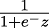
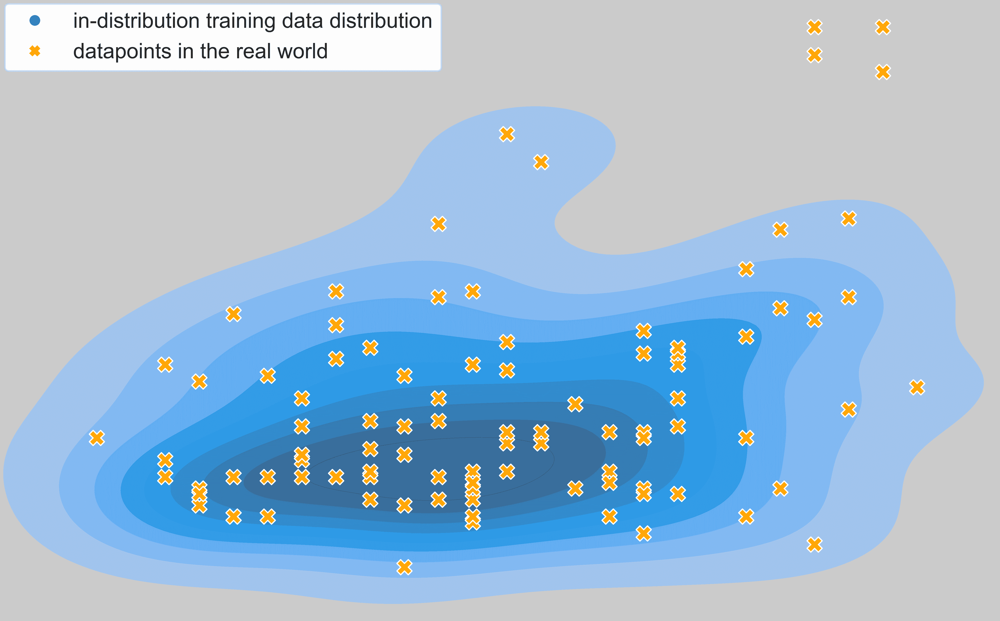

# 第三章

深度学习基础

在全书中，当我们学习如何将贝叶斯方法及其扩展应用于神经网络时，将会遇到不同的神经网络架构和应用。 本章将介绍常见架构类型，为稍后将贝叶斯扩展引入这些架构打下基础。我们还将回顾这些常见神经网络架构的一些局限性，特别是它们产生过度自信输出的倾向以及它们容易受到对抗性输入操控的影响。到本章结束时，您应该能够充分理解深度神经网络的基础知识，并知道如何用代码实现最常见的神经网络架构类型。这将帮助您跟上后续章节中的代码示例。

内容将在以下章节中讨论：

+   介绍多层感知机

+   审查神经网络架构

+   理解典型神经网络的问题

## 3.1 技术要求

要完成本章的实践任务，您需要一个 Python 3.8 环境，并安装 `pandas` 和 `scikit-learn` 堆栈，以及以下额外的 Python 包：

+   TensorFlow 2.0

+   Matplotlib 绘图库

本书的所有代码都可以在本书的 GitHub 仓库中找到：[`github.com/PacktPublishing/Enhancing-Deep-Learning-with-Bayesian-Inference`](https://github.com/PacktPublishing/Enhancing-Deep-Learning-with-Bayesian-Inference)。

## 3.2 介绍多层感知机

深度神经网络是深度学习革命的核心。本节的目的是介绍深度神经网络的基本概念和构建块。首先，我们将回顾**多层感知机**（**MLP**）的组成部分，并使用 `TensorFlow` 框架实现它。这将作为本书中其他代码示例的基础。如果您已经熟悉神经网络，并知道如何用代码实现它们，可以跳过，直接进入*理解典型神经网络的问题*部分，我们将在那里讨论深度神经网络的局限性。本章专注于架构构建块和原理，而不涉及学习规则和梯度。如果您需要更多关于这些主题的背景信息，我们推荐 Packt 出版社的 Sebastian Raschka 所著的优秀书籍 *Python Machine Learning*（特别是 *第二章*，*贝叶斯推断基础*）。

MLP 是一种前馈型全连接神经网络。前馈型意味着信息在 MLP 中仅在一个方向上传递，从输入层传递到输出层；没有反馈连接。全连接意味着每个神经元与前一层的所有神经元都有连接。为了更好地理解这些概念，让我们看一下*图* 3.1，它提供了 MLP 的示意图。在这个例子中，MLP 拥有一个包含三个神经元的**输入层**（红色表示），两个包含四个神经元的**隐藏层**（蓝色表示），以及一个包含单个输出节点的**输出层**（绿色表示）。例如，假设我们想要建立一个预测伦敦房价的模型。在这个例子中，三个输入神经元将代表模型的三个输入特征的值，如距离市中心的距离、房屋的楼面面积以及房屋的建造年份。如图中的黑色连接所示，这些输入值会传递到并被第一隐藏层的每个神经元汇总。然后，这些神经元的值会传递到并被第二隐藏层的神经元汇总，最后传递到输出神经元，该神经元将表示我们模型预测的房屋价值。


图 3.1：多层感知机的示意图

神经元聚合值究竟是什么意思？为了更好地理解这一点，让我们关注单个神经元及其对传递给它的值执行的操作。在*图* *3.2*中，我们展示了*图* *3.1*（左侧面板），并放大了第一隐藏层中的第一个神经元及其接收输入的神经元（中间面板）。在图的右面板中，我们略微重新排列了神经元，并将输入神经元命名为 `x₁`、`x₂` 和 `x₃`。我们还明确标出了它们的连接，并分别将与之相关的权重命名为 `w₁`、`w₂` 和 `w₃`。从图的右面板可以看到，一个人工神经元执行两个基本操作：

1.  首先，它对输入进行加权平均（由 Σ 表示）。

1.  其次，它对第一步的输出应用非线性函数（由 *σ* 表示。请注意，这里 *σ* 并不表示标准差——在本书的大部分内容中我们将使用 *σ* 表示标准差），例如使用 sigmoid 函数。

第一个操作可以更正式地表示为 `z` = ∑ [`n`=1]³ `x[`n`]` `w[`n`]`。第二个操作可以表示为 `a` = *σ*(`z`) = 。神经元的激活值 `a` = *σ*(`z`) 然后会传递给第二隐藏层中的神经元，重复相同的操作。


图 3.2：人工神经元在神经网络中的聚合与变换

现在我们已经回顾了 MLP 模型的不同部分，接下来让我们在 TensorFlow 中实现一个。首先，我们需要导入所有必要的函数。这些包括`Sequential`，用于构建像 MLP 这样的前馈模型，`Input`，用于构建输入层，以及`Dense`，用于构建全连接层：

```py

from tensorflow.keras.models import Sequential, Input, Dense
```

配备了这些工具，实现 MLP 就变得简单了，只需按正确的顺序和正确的神经元数量链接`Input`层和`Dense`层：

```py

multi_layer_perceptron = Sequential( 
[ 
# input layer with 3 neurons 
Input(shape=(3,)) 
# first hidden layer with 4 neurons 
Dense(4, activation="sigmoid"), 
# second hidden layer with 4 neurons 
Dense(4, activation="sigmoid"), 
# output layer 
Dense(1, activation="sigmoid"), 
] 
)
```

加权平均的聚合操作在使用`Dense`层对象时，由 TensorFlow 自动处理。此外，实现激活函数也变得非常简单，只需将所需函数的名称传递给`Dense`层的`activation`参数（如前面示例中的`sigmoid`）。

在我们转向 MLP 以外的其他神经网络架构之前，先谈一下“*深度*”这个词。一个神经网络被认为是深度的，如果它有多个隐藏层。例如，前面展示的 MLP 有两个隐藏层，可以视为一个深度神经网络。你可以添加更多的隐藏层，构建非常深的神经网络架构。训练这种深度架构有其自身的一套挑战，训练这类深度架构的科学（或艺术）被称为**深度学习**（**DL**）。

在下一节中，我们将了解一些常见的深度神经网络架构，而在随后的章节中，我们将探讨与这些架构相关的实际挑战。

## 3.3 回顾神经网络架构

在上一节中，我们看到如何实现一个以 MLP 形式的全连接网络。虽然这种网络在深度学习的早期非常流行，但随着时间的推移，机器学习研究人员开发了更为复杂的架构，通过包含领域特定的知识（如计算机视觉或**自然语言处理**（**NLP**））来取得更好的效果。在这一节中，我们将回顾一些最常见的神经网络架构，包括**卷积神经网络**（**CNNs**）和**递归神经网络**（**RNNs**），以及注意力机制和变换器。

### 3.3.1 探索 CNNs

回顾我们尝试使用 MLP 模型预测伦敦房价的例子，我们所使用的输入特征（距离市中心的距离、房屋的楼面面积以及建造年份）仍然是“手工设计”的，这意味着人类会根据问题来判断哪些输入可能与模型的价格预测相关。如果我们要构建一个模型，输入是图像并尝试预测图像中展示的对象，那些输入特征可能是什么样的呢？深度学习的一个突破性时刻是认识到神经网络可以直接从原始数据中学习并提取任务所需的最有用特征——在视觉对象分类的情况下，这些特征是直接从图像的像素中学习得到的。

如果我们想要从图像中提取最相关的输入特征用于物体分类任务，那么神经网络架构需要是什么样的呢？在尝试回答这个问题时，早期的机器学习研究者转向了哺乳动物的大脑。物体分类是我们的视觉系统相对轻松完成的任务。启发 CNN 发展的一个观察是，负责物体识别的哺乳动物视觉皮层实现了一个特征提取器的层级结构，这些提取器具有越来越大的感受野。**感受** **野**是生物神经元对图像中的区域的响应范围。视觉皮层早期层的神经元仅响应图像的相对小区域，而高层神经元则响应覆盖较大部分（甚至整个）输入图像的区域。

受大脑皮层层级结构的启发，CNN 实现了特征提取器的层级结构，其中高层的人工神经元具有更大的感受野。为了理解这个是如何工作的，让我们看一下 CNN 如何基于输入图像构建特征。*图* *3.3*展示了 CNN 中早期的卷积层如何对输入图像（左侧所示）进行操作，将特征提取到特征图中（右侧所示）。你可以将特征图想象成一个具有`n`行和`m`列的矩阵，特征图中的每个特征都是一个标量值。这个例子突出了卷积层在图像不同局部区域操作的两个实例。在第一个实例中，特征图中的特征接收来自小猫脸部的输入。在第二个实例中，特征接收来自小猫右爪的输入。最终的特征图将是将这个相同操作在输入图像的所有区域重复进行的结果，通过从左到右、从上到下滑动一个卷积核来填充特征图中的所有值。


图 3.3：从输入图像构建特征图

这样的单一操作在数值上是什么样的呢？这在*图* *3.4*中有说明。


图 3.4：卷积层执行的数值操作

在这里，我们放大了输入图像的一部分，并明确了其像素值（左侧）。你可以想象，卷积核（如图中所示）一步一步地滑过输入图像。在图中显示的这一步，卷积核正在操作输入图像的左上角（以红色高亮）。给定输入图像的值和卷积核的值，特征图中的最终值（示例中的**28**）是通过加权平均得到的：输入图像中的每个值都由对应的卷积核值加权，从而得到 9 ∗ 0 + 3 ∗ 1 + 1 ∗ 0 + 4 ∗ 0 + 8 ∗ 2 + 5 ∗ 0 + 5 ∗ 1 + 2 ∗ 1 + 2 ∗ 1 = 28。

稍微正式一点，我们用`x`表示输入图像，`w`表示卷积核。卷积神经网络中的卷积操作可以表示为`z` = ∑ [`i`=1]^(`n`) ∑ [`j`=1]^(`m`)`x[*i,j*]`w`[*i,j*]`。通常，这之后会有一个非线性操作，`a` = *σ*(`z`)，就像多层感知机（MLP）中一样。*σ*可以是之前介绍的 sigmoid 函数，但卷积神经网络（CNN）中更常用的选择是**修正线性单元**（**ReLU**），其定义为*ReLU*(`z`) = *max*(0*,z*)。

在现代 CNN 中，许多这些卷积层会堆叠在一起，使得一个卷积层的输出特征图将作为下一个卷积层的输入（图像），如此往复。将卷积层按顺序排列，这使得 CNN 能够构建越来越抽象的特征表示。在研究层级中不同位置的特征图时，Matthew Zeiler 等人（见*进一步阅读*）发现，早期卷积层的特征图通常显示边缘和简单纹理，而后期卷积层的特征图则展示了更复杂的图案和物体部件。类似于视觉皮层的层级结构，后期卷积层中的神经元倾向于具有更大的感受野，因为它们从多个早期神经元接收输入，而这些神经元又从图像的不同局部区域接收输入。

堆叠在一起的卷积层的数量决定了卷积神经网络（CNN）的深度：层数越多，网络越深。另一个重要的维度是 CNN 的宽度，这由每层的卷积核数量决定。你可以想象，在某一卷积层上，我们可以应用多个卷积核，这将导致额外的特征图——每增加一个卷积核，就增加一张特征图。在这种情况下，后续卷积层中的卷积核需要是三维的，以处理输入中多个特征图，其中卷积核的第三维由输入特征图的数量决定。

与卷积层一起，CNN（卷积神经网络）的另一个常见组成部分是**池化层**，特别是**均值池化**和**最大池化**层。这些层的作用是对输入进行子采样，从而减小图像的输入尺寸，进而减少网络中所需的参数数量（也减少了计算负担和内存占用）。

池化层是如何工作的？在*图* *3.5*中，我们看到均值池化（左）和最大池化（右）层的工作过程。我们可以看到，像卷积层一样，它们对输入的局部区域进行操作。它们执行的操作非常简单——要么取接收区域内像素值的均值，要么取最大值。


图 3.5: 池化层执行的数值操作

除了计算和内存方面的考虑外，池化层的另一个优点是它们可以使网络对输入的小变化更具鲁棒性。例如，假设示例中的一个输入像素值发生了变化，变为 0。这将对输出产生很小的影响（均值池化层）或根本没有影响（最大池化层）。

现在我们已经回顾了基本操作，接下来我们将在 TensorFlow 中实现一个 CNN。导入所有必要的函数，包括我们已经熟悉的`Sequential`函数，用于构建前馈模型，以及`Dense`层。此外，这次我们还导入了`Conv2D`用于卷积，`MaxPooling2D`用于最大池化。有了这些工具，我们可以通过按照正确顺序链接这些层函数来实现一个 CNN：

```py

from tensorflow.keras import Sequential 
from tensorflow.keras.layers import Flatten, Conv2D, MaxPooling2D, Dense 

convolutional_neural_network = Sequential([ 
Conv2D(32, (3,3), activation="relu", input_shape=(28, 28, 1)), 
MaxPooling2D((2,2)), 
Conv2D(64, (3,3), activation="relu"), 
MaxPooling2D((2,2)),    Flatten(), 
Dense(64, activation="relu"), 
Dense(10) 
])
```

我们已经通过将一个包含 32 个核的卷积层与一个最大池化操作串联起来，接着是一个包含 64 个核的卷积层，再加上另一个最大池化操作，最终添加了两个`Dense`层，构建了一个 CNN。最终的`Dense`层将用于将输出神经元的数量与分类问题中的类别数量匹配。在前面的示例中，类别数量是`10`。我们的网络现在已经准备好进行训练。

CNN 已经成为解决各种问题的关键工具，成为从自动驾驶汽车到医学影像等广泛问题中系统的关键组成部分。它们还为其他重要的神经网络架构提供了基础，例如**图卷积** **网络**（**GCNs**）。然而，仅凭 CNN，深度学习领域还无法主导机器学习的世界。在接下来的部分，我们将学习另一种重要架构：循环神经网络（RNN），这是一种处理序列数据的宝贵方法。

### 3.3.2 探索 RNN（循环神经网络）

到目前为止，我们所见到的神经网络是我们所称之为前馈网络的类型：网络的每一层都将信息传递给下一层；没有循环。此外，我们看到的卷积神经网络接受一个单一的输入（图像）并输出一个单一的结果：一个标签或该标签的评分。但在许多情况下，我们处理的任务比单一输入、单一输出任务更为复杂。在本节中，我们将重点介绍一类模型，称为**递归神经网络**（**RNN**），它们专注于处理输入序列，有些还会生成顺序输出。

RNN 任务的典型例子是机器翻译。例如，将英文句子“the apple is green”翻译成法语。为了使这类任务有效，网络需要考虑我们输入之间的关系。另一个任务可能是视频分类，其中我们需要查看视频的不同帧，以分类视频的内容。RNN 逐步处理每个输入，其中每个时间步可以表示为 [`t`]。在每个时间步，模型计算一个隐藏状态 `h[`t`]` 和一个输出 `y[`t`]`。但是为了计算 `h[`t`]`，模型不仅接收输入 `x[`t`]`，还接收前一个时间步的隐藏状态 `h`[`t`−1]。对于单个时间步，标准 RNN 计算如下：


其中：

+   `W[`x`]` 是 RNN 中输入 `x[`t`]` 的权重

+   `W[`h`]` 是来自前一个时间步 `h`[`t`−1] 的隐藏层输出的权重

+   `b` 是偏置项

+   `f` 是激活函数——在一个标准的 RNN 中，使用的是 *tanh* 激活函数

这样，在每个时间步，模型也能感知到前一个时间步发生了什么，因为有了额外的输入 `h`[`t`−1]。

我们可以如下可视化 RNN 的流程：


图 3.6：RNN 示例

我们可以看到，在时间步零时，我们还需要一个初始的隐藏状态。通常这只是一个全零向量。

一种常见的神经网络变体是**序列到序列**（**seq2seq**）神经网络，这是一种在机器翻译中非常流行的范式。正如其名字所示，这种网络的思路是将一个序列作为输入，并输出另一个序列。重要的是，这两个序列不需要是相同长度的。这使得该架构能够以更加灵活的方式进行句子翻译，这一点至关重要，因为不同语言在表达相同意思的句子时使用的单词数量可能不同。这种灵活性是通过编码器-解码器架构来实现的。这意味着我们的神经网络将有两个部分：一个初始部分将输入编码成一个单一的权重矩阵（多个输入被编码成一个隐藏向量），然后该矩阵作为解码器的输入，解码器根据它来生成多个输出（一个输入对应多个输出）。编码器和解码器有各自独立的权重矩阵。对于一个有两个输入和两个输出的模型，效果可以通过如下方式可视化：


图 3.7：序列到序列网络的示例

在这个图中，`w[`e`]`是编码器的权重，`w[`d`]`是解码器的权重。我们可以看到，与我们的 RNN 相比，我们现在有了解码器的新隐藏状态 `s₀`，并且我们还可以看到 `c`，这是一个上下文向量。在标准的序列到序列模型中，`c` 等于编码器结束时的隐藏状态，而 `s₀`，编码器的初始隐藏状态，通常是通过一个或多个前馈层来计算的。上下文向量是解码器每一部分的额外输入；它允许解码器的每一部分使用编码器的信息。

### 3.3.3 注意力机制

尽管递归神经网络模型（RNN）可能非常强大，但它们有一个重要的缺点：编码器传递给解码器的所有信息必须都在隐藏瓶颈层中——即解码器在开始时接收到的隐藏输入状态。这对于短句子来说是没问题的，但可以想象，当我们想要翻译整个段落或非常长的句子时，这就变得更加困难。我们不能指望一个单一的向量能包含翻译长句子所需的所有信息。这个缺点通过一个叫做“注意力机制”的方法得到了解决。稍后我们将会对注意力机制的概念进行概括，但首先让我们看看在 seq2seq 模型的上下文中，注意力机制是如何应用的。

注意力机制允许 seq2seq 模型的解码器根据某些注意力权重“关注”编码器的隐藏状态。这意味着解码器不再仅依赖瓶颈层来翻译输入，而是可以回溯到编码器的每个隐藏状态，并决定它希望使用多少信息。这是通过在解码器的每个时间步使用一个上下文向量来实现的，这个上下文向量现在充当概率向量，决定给予编码器每个隐藏状态的权重。我们可以将注意力机制在这个上下文中理解为在每个解码器时间步的以下序列：

+   `e[*t,i*]` = `f`(`s`[`t`−1]*,h*[`i`]) 计算每个编码器隐藏状态的 *alignment scores*。这个计算可以是一个多层感知机（MLP），针对编码器的每个隐藏状态，输入为解码器当前的隐藏状态 `s`[`t`−1]，以及编码器的隐藏状态 `h[`i`]`。

+   `e[*t,i*]` 给出了我们对齐分数；它们告诉我们编码器每个隐藏状态与解码器一个隐藏状态之间的关系。但 `f` 的输出是一个标量，这使得比较不同的对齐分数变得不可能。这就是为什么我们随后对所有对齐分数进行 softmax 操作，以获得一个概率向量；注意力权重：`a[*t,i*]` = *softmax*(`e[*t,i*]`)。这些权重现在是介于 0 和 1 之间的数值，告诉我们对于解码器的单个隐藏状态，应该给予编码器每个隐藏状态多少权重。

+   通过我们的注意力权重，我们现在对编码器的隐藏状态进行加权平均。这生成了上下文向量 `c₁`，它可以用于解码器的第一个时间步。

因为这个机制计算了解码器每个时间步的注意力权重，模型现在变得更加灵活：在每个时间步，它知道应该给予编码器每个部分多少权重。此外，由于我们在这里使用的是多层感知机（MLP）来计算注意力权重，这个机制可以端到端地训练。

这告诉你如何在序列到序列模型中使用注意力。但注意力机制可以被泛化，使其更加强大。这种泛化是如今最强大的神经网络应用中的构建块。它使用三个主要组件：

+   查询，记作 `Q`。你可以将其视为解码器的隐藏状态。

+   键，记作 `K`。你可以将键视为输入的隐藏状态 `h[`i`]`。

+   值，记作 `V`。在标准的注意力机制中，值与键相同，但被分开作为独立的值。

查询、键和值共同构成了注意力机制，形式为


我们可以区分出三种泛化：

+   使用 MLP 计算注意力权重对于每个时间步来说是一个相对繁重的操作。相反，我们可以使用一种更轻量的方式，使我们能够更快速地为解码器的每个隐状态计算注意力权重：我们使用解码器隐状态与编码器隐状态的缩放点积。我们通过`K`的维度的平方根来缩放点积：

    

    这是由于两个原因：

    +   softmax 操作可能导致极端值——接近零和接近一的值。这使得优化过程更加困难。通过缩放点积，我们避免了这个问题。

    +   注意力机制对高维向量计算点积。这导致点积值非常大。通过缩放点积，我们可以抵消这种趋势。

+   我们分别使用输入向量——将它们分别作为键和值，在不同的输入流中。这使得模型可以更灵活地以不同的方式处理它们。两者都是可学习的矩阵，因此模型可以以不同的方式优化它们。

+   注意力机制将一组输入作为查询向量。这种做法在计算上更高效；我们不需要为每一个查询向量单独计算点积，而是可以一次性计算所有查询向量。

这三种概括使得注意力成为一种非常广泛应用的算法。你可以在今天大多数表现最好的模型中看到它，包括一些最佳的图像分类模型——生成非常逼真文本的大型语言模型，或者能够创造最美丽、最具创意图像的文本到图像模型。由于注意力机制的广泛应用，它在 TensorFlow 等深度学习库中非常容易使用。在 TensorFlow 中，你可以这样使用注意力机制：

```py

from tensorflow.keras.layers import Attention 
attention = Attention(use_scale=True, score_mode='dot')
```

它可以通过我们的查询（query）、键（key）和值（value）来调用：

```py

context_vector, attention_weights = attention( 
inputs = [query, value, keys], 
return_attention_scores = True, 
)
```

在前面的章节中，我们讨论了神经网络的一些重要构建模块；我们讨论了基本的 MLP、卷积的概念、递归神经网络和注意力机制。还有其他一些我们未在此讨论的组件，以及更多我们讨论过的组件的变种和组合。如果你想了解更多关于这些构建模块的内容，请参考本章末尾的阅读列表。如果你想深入研究神经网络架构和组件，有许多优秀的资源可以参考。

## 3.4 理解典型神经网络中的问题

我们在前几节中讨论的深度神经网络非常强大，配合适当的训练数据，推动了机器感知领域的巨大进步。在机器视觉中，卷积神经网络使我们能够对图像进行分类、定位图像中的物体、将图像分割成不同的区域或实例，甚至生成全新的图像。在自然语言处理方面，循环神经网络和变压器使我们能够对文本进行分类、识别语音、生成新文本，或者如前所述，在两种语言之间进行翻译。

然而，这些标准类型的神经网络模型也有若干限制。在本节中，我们将探讨这些限制中的一些。我们将着眼于以下几个方面：

+   这样的神经网络模型的预测得分如何会过于自信

+   这样的模型如何能在 OOD 数据上产生非常自信的预测

+   微小、几乎不可察觉的输入图像变化如何导致模型做出完全错误的预测

### 3.4.1 未校准和过于自信的预测

现代普通神经网络的一个问题是，它们往往会产生未经过良好校准的输出。这意味着这些网络产生的置信度得分不再代表它们的经验正确性。为了更好地理解这意味着什么，我们来看一下理想校准网络的可靠性图，如 *图* *3.8* 所示。


图 3.8：良好校准的神经网络的可靠性图。经验确定的（"实际"）准确性与网络输出的预测值一致

如你所见，可靠性图展示了准确性（在 `y` 轴上）作为置信度（在 `x` 轴上）的函数。基本的思路是，对于一个经过良好校准的网络，预测结果（或置信度）所关联的得分应该与其经验正确性相匹配。这里，经验正确性被定义为一组具有相似输出值的样本的准确性，因此，这些样本会被分到可靠性图中的同一组。因此，例如，对于所有输出得分在 0.7 和 0.8 之间的样本组，一个经过良好校准的网络的期望是，其中 75% 的预测应该是正确的。

为了使这个想法更加正式，我们假设有一个数据集`X`，其中包含`N`个数据样本。每个数据样本`x`都有一个对应的目标标签`y`。在分类问题中，我们会有`y`，它表示属于`K`个类别中的一个。为了获得可靠性图，我们将使用神经网络模型对整个数据集`X`进行推理，并为每个样本`x`获得一个输出分数*ŷ*。然后，我们将使用输出分数将每个数据样本分配到可靠性图中的一个* m *区间。在前面的图中，我们选择了`M` = 10 个区间。`B[`m`]`将是落入区间`m`的样本的索引集合。最后，我们将测量并绘制每个区间内所有样本预测的平均准确度，定义为*acc*(`B[`m`]`) = ∑ [`i`∈`B[m]`]1(*ŷ*[`i`] = `y[`i`]`)。

对于一个经过良好校准的网络，给定区间内样本的平均准确度应该与该区间的置信度值匹配。在前面的图中，我们可以看到，例如，对于落在输出分数在 0.2 到 0.3 之间的区间的样本，我们观察到的平均准确度为 0.25。现在，让我们看看在一个对预测过度自信的未经校准的网络中会发生什么情况。图 3.9 展示了这种情况，这是许多现代原始神经网络架构所表现的行为的典型代表。


图 3.9：过度自信神经网络的可靠性图。由经验确定的“实际”准确度（紫色条）始终低于网络预测值（粉色条和灰色虚线）所建议的准确度。

我们可以观察到，对于所有的区间，区间内样本的实际准确度低于基于样本输出分数所期望的准确度。这就是过度自信预测的表现。网络的输出让我们相信它对预测具有很高的信心，而实际上，实际表现并不符合预期。

过度自信的预测在安全和任务关键应用中可能非常有问题，例如医学决策、自驾车以及法律或财务决策。具有过度自信预测的网络将缺乏向我们人类（或其他网络）指示它们何时可能出错的能力。这种缺乏意识可能变得危险，例如，当一个网络被用来帮助决定被告是否应该被允许保释时。假设一个网络接收到被告的数据（如过去的定罪记录、年龄、教育水平），并以 95%的置信度预测不应允许保释。基于这个输出，法官可能错误地认为该模型可以信任，并主要根据模型的输出作出裁决。相比之下，经过校准的置信度输出可以表明我们可以多大程度上信任模型的输出。如果模型不确定，这表明输入数据中有一些在模型的训练数据中没有得到很好的表示——这表明模型更可能出错。因此，良好校准的不确定性使我们能够决定是否将模型的预测纳入我们的决策中，或是否完全忽略模型。

绘制和检查可靠性图表对于可视化一些神经网络的校准非常有用。然而，有时我们希望比较多个神经网络的校准性能，可能每个网络都使用了多个配置。在需要比较多个网络和设置的情况下，将神经网络的校准总结为一个标量统计量是很有用的。**期望校准误差**（**ECE**）就是这样的总结统计量。对于可靠性图表中的每个区间，它衡量观察到的准确度 *acc*(`B[`m`]`) 和基于样本输出得分的预期准确度 *conf*(`B[`m`]`) 之间的差异，定义为 ∑ [`i`∈`B[m]`]*ŷ*。然后，它对所有区间进行加权平均，其中每个区间的权重由该区间中的样本数决定：


这为 ECE 的初步介绍以及如何衡量它提供了一个开端。我们将在*第八章*中详细回顾 ECE，章节中将提供一个代码实现，作为*通过贝叶斯方法揭示数据集偏移*案例研究的一部分。

在一个完全校准的神经网络输出情况下，*ECE*将为零。神经网络的校准程度越差，*ECE*将越大。让我们来看看神经网络校准差和过度自信的几个原因。

一个原因是，softmax 函数通常是分类网络的最后一个操作，它使用指数函数确保所有值都是正数：


结果是，输入到 softmax 函数的微小变化会导致其输出发生显著变化。

另一个导致过度自信的原因是现代深度神经网络增加了模型的容量（Chuan Guo 等人，2017）。随着时间的推移，神经网络架构变得更深（更多的层）和更宽（每层更多的神经元）。这样的深度和宽度的神经网络具有较高的方差，能够非常灵活地拟合大量的输入数据。当实验调整神经网络的层数或每层的滤波器数量时，Chuan Guo 等人观察到，随着网络架构的加深和加宽，错误的校准（从而导致过度自信）会变得更严重。他们还发现，使用批量归一化或训练时减少权重衰减会对校准产生负面影响。这些观察结果表明，现代深度神经网络的模型容量增加是其过度自信的原因之一。

最终，过度自信的估计可能源于选择特定的神经网络组件。例如，已经证明，使用 ReLU 函数的全连接网络会导致连续分段仿射分类器（[**?**]）。这反过来意味着，总是可以找到一些输入样本，使得 ReLU 网络会产生高度自信的输出。即使对于那些与训练数据不同的输入样本，这一结果依然成立，尽管此时网络的泛化性能可能较差，因此我们期望得到较低自信度的输出。这种任意高自信度的预测同样适用于使用最大池化或平均池化的卷积网络，或任何其他会导致分段仿射分类器函数的网络。

这个问题是这种神经网络架构固有的，只能通过改变架构本身来解决（[**?**]）。

### 3.4.2 在分布外数据上的预测

现在我们已经看到了模型可能会过度自信，因此未经过校准，我们再来看一个神经网络的问题。神经网络通常在假设测试数据和训练数据来自同一分布的前提下进行训练。然而，实际上，情况并非总是如此。当一个模型在真实世界中部署时，它所看到的数据可能会发生变化。我们称这些变化为数据集偏移，通常将其分为三类：

+   **协变量偏移**：特征分布 `p`(`x`) 发生变化，而 `p`(`y`|`x`) 保持不变

+   **开放集识别**：测试时会出现新标签

+   **标签偏移**：标签分布 `p`(`y`) 发生变化，而 `p`(`x`|`y`) 保持不变

以下是前述项目的示例：

+   协变量偏移：模型被训练用于识别面孔。训练数据主要由年轻人的面孔组成。在测试时，模型看到的是各个年龄段的面孔。

+   开集识别：模型被训练来分类有限数量的犬种。在测试时，模型会看到比训练数据集中更多的犬种。

+   标签偏移：一个模型被训练来预测不同的疾病，其中一些疾病在训练时非常罕见。然而，随着时间的推移，这些罕见疾病的发生频率发生变化，并且在测试时它们成为最常见的疾病之一。



图 3.10：训练数据分布与实际世界中的数据大多数重合，但我们不能期望模型在图中右上角的分布外点上表现良好。

由于这些变化，当模型在实际环境中部署时，如果遇到的数据显示与训练数据分布不同，模型的表现可能会降低。模型面临分布外数据的可能性在很大程度上取决于模型部署的环境：有些环境较为静态（较低的分布外数据出现概率），而其他环境则较为动态（较高的分布外数据出现概率）。

深度学习模型在处理分布外数据时的问题之一，是因为这些模型通常拥有大量的参数，因此可以记住训练数据中的特定模式和特征，而不是反映底层数据分布的稳健和有意义的表示。当测试时出现看起来与训练数据略有不同的新数据时，模型实际上并没有能力进行泛化并做出正确的预测。一个例子是海滩上的牛的图像（*图* *3.11*），而训练数据集中的牛恰好是在绿色草地上。模型通常利用数据中的上下文来进行预测。


图 3.11：在不同环境中的物体（这里是海滩上的牛）可能会使模型难以识别图像中包含该物体。

在我们深入探讨如何通过一个简单模型处理分布外数据的实际例子之前，让我们先看看几种方法，这些方法可以突出典型神经网络中分布外数据的问题。理想情况下，我们希望模型在遇到与其训练数据分布不同的数据时，能够表现出较高的不确定性。如果是这样，分布外数据在模型部署到实际环境中时就不会是一个大问题。例如，在任务关键型系统中，模型错误的代价很高，因此通常会有一个置信度阈值，模型的预测必须达到该阈值才会被信任。如果一个模型经过良好的标定，并且对分布外输入赋予较低的置信度评分，那么围绕该模型的业务逻辑可以抛出异常并且不使用模型的输出。例如，自动驾驶汽车可以提醒司机接管控制，或者它可以减速以避免发生事故。

然而，常见的*神经网络不知道自己什么时候不知道*；它们通常不会对外部分布数据赋予较低的置信度分数。

Google 论文《*你能信任你模型的不确定性吗？在数据集偏移下评估预测不确定性*》中给出了一个例子。论文表明，如果你对测试数据集应用模糊或噪声等扰动，使得图像变得越来越偏离分布，模型的准确度会下降。然而，模型的置信度校准也会下降。这意味着在外部分布数据上，模型的得分已经不再可信：它们无法准确反映模型对其预测的信心。我们将在*第八章*的案例研究《通过贝叶斯方法揭示数据集偏移》中探索这一行为，*应用* *贝叶斯深度学习*。

另一种确定模型如何处理外部分布数据的方法是输入与其训练数据集完全不同的数据，而不仅仅是扰动过的数据。衡量模型外部分布检测性能的过程如下：

1.  在内部分布数据集上训练一个模型。

1.  保存模型在内部分布测试集上的置信度分数。

1.  向模型输入一个完全不同的外部分布数据集，并保存模型对应的置信度分数。

1.  现在，将来自两个数据集的得分视为二分类问题的得分：内部分布或外部分布。计算二分类指标，例如**接收者操作特征**（**AUROC**）曲线下的面积或精确度-召回曲线下的面积。

这个策略告诉你模型在多大程度上能够区分内部分布数据和外部分布数据。假设内部分布数据应该始终比外部分布数据获得更高的置信度分数；在理想情况下，两者之间没有重叠。然而，实际上情况并非如此。模型确实经常会给外部分布数据较高的置信度分数。我们将在下一节中探讨一个例子，并在后续章节中提出一些解决方案。

### 3.4.3 自信的外部分布预测示例

让我们看看一个普通神经网络是如何对外部分布数据做出自信预测的。在这个例子中，我们首先训练一个模型，然后输入外部分布数据。为了简单起见，我们将使用一个包含不同种类狗和猫的数据集，并构建一个二分类器，预测图像中是狗还是猫。

我们首先下载我们的数据：

```py

curl -X GET https://s3.amazonaws.com/fast-ai-imageclas/oxford-iiit-pet.tgz  \ 
--output pets.tgz 
tar -xzf pets.tgz
```

然后，我们将数据加载到数据框中：

```py

import pandas as pd 

df = pd.read_csv("oxford-iiit-pet/annotations/trainval.txt", sep=" ") 
df.columns = ["path", "species", "breed", "ID"] 
df["breed"] = df.breed.apply(lambda x: x - 1) 
df["path"] = df["path"].apply( 
lambda x: f"/content/oxford-iiit-pet/images/{x}.jpg" 
)
```

然后，我们可以使用 scikit-learn 的`train_test_val()`函数来创建训练集和验证集：

```py

import tensorflow as tf 
from sklearn.model_selection import train_test_split 

paths_train, paths_val, labels_train, labels_val = train_test_split( 
df["path"], df["breed"], test_size=0.2, random_state=0 
)
```

然后我们创建我们的训练和验证数据。我们的`divprocess()`函数将下载的图像加载到内存中，并格式化标签以便模型处理。我们使用 256 的批量大小和 160x160 像素的图像大小：

```py

IMG_SIZE = (160, 160) 
AUTOTUNE = tf.data.AUTOTUNE 

@tf.function 
def divprocess_image(filename): 
raw = tf.io.read_file(filename) 
image = tf.image.decode_png(raw, channels=3) 
return tf.image.resize(image, IMG_SIZE) 

@tf.function 
def divprocess(filename, label): 
return divprocess_image(filename), tf.one_hot(label, 2) 

train_dataset = (tf.data.Dataset.from_tensor_slices( 
(paths_train, labels_train) 
).map(lambda x, y: divprocess(x, y)) 
.batch(256) 
.divfetch(buffer_size=AUTOTUNE) 
) 

validation_dataset = (tf.data.Dataset.from_tensor_slices( 
(paths_val, labels_val)) 
.map(lambda x, y: divprocess(x, y)) 
.batch(256) 
.divfetch(buffer_size=AUTOTUNE) 
)
```

现在我们可以创建我们的模型。为了加速学习，我们可以使用迁移学习，并从一个在 ImageNet 上预训练过的模型开始：

```py

def get_model(): 
IMG_SHAPE = IMG_SIZE + (3,) 
base_model = tf.keras.applications.ResNet50( 
input_shape=IMG_SHAPE, include_top=False, weights='imagenet' 
) 
base_model.trainable = False 
inputs = tf.keras.Input(shape=IMG_SHAPE) 
x = tf.keras.applications.resnet50.divprocess_input(inputs) 
x = base_model(x, training=False) 
x = tf.keras.layers.GlobalAveragePooling2D()(x) 
x = tf.keras.layers.Dropout(0.2)(x) 
outputs = tf.keras.layers.Dense(2)(x) 
  return tf.keras.Model(inputs, outputs)
```

在训练模型之前，我们首先需要编译它。编译意味着我们为模型指定一个损失函数和一个优化器，并可选地添加一些用于训练期间监控的度量。在以下代码中，我们指定模型应该使用二元交叉熵损失和 Adam 优化器进行训练，并且在训练期间我们想要监控模型的准确性：

```py

model = get_model() 
model.compile(optimizer=tf.keras.optimizers.Adam(learning_rate=0.01), 
loss=tf.keras.losses.BinaryCrossentropy(from_logits=True), 
              metrics=['accuracy'])
```

由于迁移学习，仅训练模型三轮就能获得大约 99%的验证准确率：

```py

model.fit(train_dataset, epochs=3, validation_data=validation_dataset)
```

我们还可以在该数据集的测试集上测试我们的模型。我们首先准备好数据集：

```py

df_test = pd.read_csv("oxford-iiit-pet/annotations/test.txt", sep=" ") 
df_test.columns = ["path", "species", "breed", "ID"] 
df_test["breed"] = df_test.breed.apply(lambda x: x - 1) 
df_test["path"] = df_test["path"].apply( 
lambda x: f"/content/oxford-iiit-pet/images/{x}.jpg" 
) 

test_dataset = tf.data.Dataset.from_tensor_slices( 
(df_test["path"], df_test["breed"]) 
).map(lambda x, y: divprocess(x, y)).batch(256)
```

然后我们将数据集输入到训练好的模型中。我们获得了大约 98.3%的测试集准确率：

```py

test_predictions = model.predict(test_dataset) 
softmax_scores = tf.nn.softmax(test_predictions, axis=1) 
df_test["predicted_label"] = tf.argmax(softmax_scores, axis=1) 
df_test["prediction_correct"] = df_test.apply( 
lambda x: x.predicted_label == x.breed, axis=1 
) 
accuracy = df_test.prediction_correct.value_counts(True)[True] 
print(accuracy)
```

现在我们有一个能够很好地分类猫和狗的模型。但是如果我们给这个模型一个既不是猫也不是狗的图像，会发生什么呢？理想情况下，模型应该识别出该图像不属于数据分布的一部分，并应该输出接近均匀分布的结果。让我们看看在实际操作中是否真的发生了这种情况。我们将一些来自 ImageNet 数据集的图像输入到模型中——这是用于预训练我们模型的实际数据集。ImageNet 数据集很大。这就是为什么我们下载了该数据集的一个子集：一个名为 Imagenette 的数据集。该数据集仅包含原始 ImageNet 数据集中的 10 个类别：

```py

curl -X GET https://s3.amazonaws.com/fast-ai-imageclas/imagenette-160.tgz \ 
--output imagenette.tgz 
tar -xzf imagenette.tgz
```

然后我们从`parachute`类中选取一张图像：

```py

image_path = "imagenette-160/val/n03888257/ILSVRC2012_val_00018229.JPEG" 
image = divprocess_image(image_path).numpy() 
plt.figure(figsize=(5,5)) 
plt.imshow(image.astype(int)) 
plt.axis("off") 
plt.show()
```

该图像显然不包含狗或猫；它显然是超出分布的：


图 3.12：来自 ImageNet 数据集的降落伞图像

我们将图像通过我们的模型并打印分数：

```py

logits = model.predict(tf.expand_dims(image, 0)) 
dog_score = tf.nn.softmax(logits, axis=1)[0][1].numpy() 
print(f"Image classified as a dog with {dog_score:.4%} confidence") 
# output: Image classified as a dog with 99.8226% confidence
```

我们可以看到，模型将降落伞图像分类为狗，且信心度超过 99%。

我们还可以更系统地测试模型在 ImageNet `parachute`类上的表现。让我们将所有来自训练集的降落伞图像通过模型，并绘制出`dog`类的分数直方图。

我们首先创建一个小函数，用来创建包含所有降落伞图像的特定数据集：

```py

from pathlib import Path 

parachute_image_dir = Path("imagenette-160/train/n03888257") 
parachute_image_paths = [ 
str(filepath) for filepath in parachute_image_dir.iterdir() 
] 
parachute_dataset = (tf.data.Dataset.from_tensor_slices(parachute_image_paths) 
.map(lambda x: divprocess_image(x)) 
.batch(256) 
.divfetch(buffer_size=AUTOTUNE))
```

然后我们可以将数据集输入到我们的模型，并创建与`dog`类相关的所有 softmax 分数列表：

```py

Predictions = model.predict(parachute_dataset) 
dog_scores = tf.nn.softmax(predictions, axis=1)[:, 1]
```

然后我们可以使用这些分数绘制直方图——这将显示 softmax 分数的分布：

```py

plt.rcParams.update({'font.size': 22}) 
plt.figure(figsize=(10,5)) 
plt.hist(dog_scores, bins=10) 
plt.xticks(tf.range(0, 1.1, 0.1)) 
plt.grid() 
plt.show()
```

理想情况下，我们希望这些分数分布接近 0.5，因为该数据集中的图像既不是狗也不是猫；模型应该非常不确定：


图 3.13：降落伞数据集的 softmax 分数分布

然而，我们看到的却是完全不同的情况。超过 800 张图像被错误分类为狗，且置信度至少为 90%。我们的模型显然不知道如何处理分布外数据。

### 3.4.4 对对抗性操作的易感性

大多数神经网络的另一个脆弱性是它们容易受到对抗性攻击。简单来说，对抗性攻击是欺骗深度学习系统的方式，通常这些方式是人类不会被欺骗的。这些攻击可以是无害的也可以是有害的。以下是一些对抗性攻击的例子：

+   一个分类器可以检测不同种类的动物。它将一张熊猫的图像以 57.7%的置信度分类为熊猫。通过对图像进行微小扰动，使其对人类不可见，图像现在以 93.3%的置信度被分类为长臂猿。

+   一个模型可以检测电影推荐是正面还是负面。它将给定的电影分类为负面。通过改变一个不会改变整体评论基调的词汇，例如，将“surprising”改为“astonishing”，模型的预测可以从负面推荐变为正面推荐。

+   停止标志检测器可以检测停止标志。然而，通过在停止标志上贴一个相对较小的贴纸，模型就不再识别停止标志了。

这些例子表明，有不同种类的对抗性攻击。一种有用的对抗性攻击分类方法是，尝试确定攻击者对模型了解多少信息（无论是人类还是机器）。攻击者总是可以将输入传递给模型，但模型返回什么或者攻击者如何检查模型是不同的。通过这个视角，我们可以看到以下类别：

+   *硬标签黑盒*：攻击者只能访问通过向模型输入获得的标签。

+   *软标签黑盒*：攻击者可以访问模型的分数和标签。

+   *白盒*设置：攻击者可以完全访问模型。他们可以访问权重，查看分数、模型结构等。

你可以想象，这些不同的设置使得攻击模型的难易程度有所不同。如果想要欺骗模型的人只能看到输入的标签结果，他们无法确定输入的细微变化是否会导致模型行为的变化，只要标签保持不变。当他们可以访问模型的标签和得分时，这种情况就变得更加容易。他们就可以看到输入变化是否增加或减少了模型的置信度。结果，他们可以更系统地尝试以减少模型对标签的置信度的方式来改变我们的输入。这可能会让我们找到模型的脆弱性，前提是有足够的时间以迭代的方式来改变输入。现在，如果有人拥有模型的完全访问权限（白盒设置），那么找到脆弱性可能会变得更容易。因为他们可以使用更多的信息来引导图像的变化，比如输入图像的损失梯度。

攻击者可获得的信息量并不是区分不同类型对抗性攻击的唯一标准；攻击方式有很多种。例如，在针对视觉模型的攻击中，有些攻击基于对图像的单一补丁调整（甚至是单个像素！），而其他攻击则会改变整个图像。有些攻击特定于某个模型，有些攻击可以应用于多个模型。我们还可以区分那些通过数字方式操控图像的攻击和那些能够在现实世界中实施、欺骗模型的攻击，或者是那些人眼可见的攻击与不可见的攻击。由于攻击方式种类繁多，关于这个话题的研究文献依然非常活跃——总是有新的方法来攻击模型，进而也需要找到应对这些攻击的防御方法。

在关于分布外数据的章节中，我们训练了一个模型来判断给定的图像是猫还是狗。我们看到分类器的表现非常好：它的测试准确率大约为 98.3%。这个模型对对抗性攻击是否具有鲁棒性？让我们创造一个攻击方法来验证一下。我们将使用**快速梯度符号方法**（**FGSM**）轻微扰动一张狗的图像，使得模型误认为它实际上是一张猫的图像。快速梯度符号方法是由 Ian Goodfellow 等人于 2014 年提出的，至今仍然是最著名的对抗性攻击之一。这可能是因为它的简单性；我们将看到，仅需几行代码就能创建这样的攻击。此外，这种攻击的结果令人震惊——Goodfellow 本人提到，当他第一次测试这个攻击时，他简直不敢相信结果，甚至需要验证输入给模型的扰动图像确实与原始图像不同。

为了创建有效的对抗图像，我们必须确保图像中的像素发生变化——但变化的幅度不能大到以至于人眼能察觉。如果我们以某种方式扰动狗的图像，使得图像看起来像猫，那么如果模型将其分类为猫，模型并没有犯错。我们确保不会对图像进行过多扰动，通过最大范数约束来限制扰动——这基本上告诉我们图像中任何像素的变化不能超过某个量*𝜖*：


其中 `x` 是我们的扰动图像，`x` 是我们原始的输入图像。

现在，为了使用快速梯度符号法创建我们的对抗样本，我们使用关于输入图像的损失梯度来创建新图像。与梯度下降法中最小化损失不同，我们现在想要最大化损失。给定我们的网络权重*𝜃*、输入`x`、标签`y`，以及用来计算损失的函数`J`，我们可以通过以下方式扰动图像来创建对抗图像：


在这个方程中，我们计算损失关于输入的梯度的符号，即确定梯度是正（1）、负（-1）还是 0。符号约束最大范数，通过将其乘以 epsilon，我们确保扰动很小——计算符号只是告诉我们，如果我们想通过加或减 epsilon 来扰动图像，以便对模型的图像识别产生影响。*η* 就是我们要添加到图像中的扰动：


让我们看一下在 Python 中的实现。给定我们已经训练好的网络，它可以将图像分类为狗或猫，我们可以创建一个函数，生成一个扰动，当它与 epsilon 相乘并加到我们的图像上时，会形成一次对抗攻击：

```py

import tensorflow as tf 

loss_object = tf.keras.losses.BinaryCrossentropy() 

def get_adversarial_perturbation(image, label): 
image = tf.expand_dims(image, 0) 
with tf.GradientTape() as tape: 
tape.watch(image) 
prediction = model(image) 
loss = loss_object(label, prediction) 

gradient = tape.gradient(loss, image) 
  return tf.sign(gradient)[0]
```

然后，我们创建一个小函数，将输入图像通过我们的模型，并返回模型认为该图像包含狗的置信度：

```py

def get_dog_score(image) -*>* float: 
scores = tf.nn.softmax( 
model.predict(np.expand_dims(image, 0)), axis=1 
).numpy()[0] 
  return scores[1]
```

我们下载了一张猫的图片：

```py

curl https://images.pexels.com/photos/1317844/pexels-photo-1317844.jpeg *>* \ 
cat.png
```

然后，我们对图像进行预处理，以便将其输入到模型中。我们将标签设置为 0，对应于 `cat` 标签：

```py

# divprocess function defined in the out-of-distribution section 
image, label = divprocess("cat.png", 0)
```

我们可以扰动我们的图像：

```py

epsilon = 0.05 
perturbation = get_adversarial_perturbation(image, label) 
image_perturbed = image + epsilon * perturbation
```

现在，让我们获取模型对原始图像为猫的置信度，以及模型对扰动图像为狗的置信度：

```py

cat_score_original_image = 1 - get_dog_score(image) 
dog_score_perturbed_image = get_dog_score(image_perturbed)
```

有了这个基础，我们可以创建以下图表，展示原始图像、施加在图像上的扰动以及扰动后的图像：

```py

import matplotlib.pyplot as plt 

ax = plt.subplots(1, 3, figsize=(20,10))[1] 
[ax.set_axis_off() for ax in ax.ravel()] 
ax[0].imshow(image.numpy().astype(int)) 
ax[0].title.set_text("Original image") 
ax[0].text( 
0.5, 
-.1, 
f"\"Cat\"\n {cat_score:.2%} confidence", 
size=12, 
ha="center", 
transform=ax[0].transAxes 
) 
ax[1].imshow(perturbations) 
ax[1].title.set_text( 
"Perturbation added to the image\n(multiplied by epsilon)" 
) 
ax[2].imshow(image_perturbed.numpy().astype(int)) 
ax[2].title.set_text("Perturbed image") 
ax[2].text( 
0.5, 
-.1, 
f"\"Dog\"\n {dog_score:.2%} confidence", 
size=12, 
ha="center", 
transform=ax[2].transAxes 
) 
plt.show()
```

*图 3.14* 展示了原始图像和扰动图像，并显示了每张图像的模型预测结果。


图 3.14：对抗攻击的示例

在*图* *3.14*中，我们可以看到，模型最初将图像分类为猫，置信度为 100%。当我们对原始猫图像（左侧）应用扰动（中间显示）后，右侧的图像现在被分类为狗，置信度为 98.73%，尽管该图像在视觉上看起来与原始输入图像相同。我们成功地创建了一个对抗性攻击，欺骗了我们的模型！

## 3.5 总结

在这一章中，我们介绍了几种常见的神经网络类型。首先，我们讨论了神经网络的关键构建块，特别关注了多层感知器。接着，我们回顾了常见的神经网络架构：卷积神经网络、递归神经网络和注意力机制。所有这些组件使我们能够构建非常强大的深度学习模型，这些模型有时可以达到超人类的表现。然而，在本章的第二部分，我们回顾了神经网络的一些问题。我们讨论了它们如何表现得过于自信，并且在处理分布外数据时表现不佳。我们还看到，神经网络输入的微小、不可察觉的变化可以导致模型做出错误的预测。

在下一章中，我们将结合本章和 *第三章*， *深度学习基础*中学到的概念，讨论贝叶斯深度学习，它有可能克服我们在本章中看到的标准神经网络的一些挑战。

## 3.6 进一步阅读

有很多优秀的资源可以帮助我们深入了解深度学习的基本构建块。以下是一些很好的起点资源：

+   Nielsen, M.A., 2015\. *神经网络与深度学习*（第 25 卷）。美国加州旧金山：Determination press。，[`neuralnetworksanddeeplearning.com/`](http://neuralnetworksanddeeplearning.com/)。

+   Chollet, F., 2021\. *Python 深度学习*。Simon 和 Schuster。

+   Raschka, S., 2015\. *Python 机器学习*。Packt Publishing Ltd.

+   Ng, Andrew, 2022，*深度学习专业化*。Coursera。

+   Johnson, Justin, 2019\. EECS 498-007 / 598-005, *深度学习与计算机视觉*。密歇根大学。

想了解更多关于深度学习模型问题的内容，你可以阅读以下一些资源：

+   过度自信与校准：

    +   Guo, C., Pleiss, G., Sun, Y. 和 Weinberger, K.Q., 2017 年 7 月。*现代神经网络的校准*。在国际机器学习会议（第 1321-1330 页）。PMLR。

    +   Ovadia, Y., Fertig, E., Ren, J., Nado, Z., Sculley, D., Nowozin, S., Dillon, J., Lakshminarayanan, B. 和 Snoek, J., 2019\. *你能信任模型的不确定性吗？评估数据集转移下的预测不确定性*。神经信息处理系统进展，32。

+   分布外检测：

    +   Hendrycks, D. 和 Gimpel, K., 2016\. *神经网络中* *错误分类和分布外样本的检测基准*。arXiv 预印本 arXiv:1610.02136。

    +   Liang, S., Li, Y. 和 Srikant, R., 2017\. *增强神经网络中分布外图像检测的可靠性。* arXiv 预印本 arXiv:1706.02690。

    +   Lee, K., Lee, K., Lee, H. 和 Shin, J., 2018\. *一个简单的* *统一框架用于检测分布外样本和* *对抗攻击。* 神经信息处理系统进展，31。

    +   Fort, S., Ren, J. 和 Lakshminarayanan, B., 2021\. *探索* *分布外检测的极限*。神经信息处理系统进展，34，第 7068-7081 页。

+   对抗攻击：

    +   Szegedy, C., Zaremba, W., Sutskever, I., Bruna, J., Erhan, D., Goodfellow, I. 和 Fergus, R., 2013\. *神经网络的* *有趣特性*。arXiv 预印本 arXiv:1312.6199。

    +   Goodfellow, I.J., Shlens, J. 和 Szegedy, C., 2014\. *解释和* *利用对抗样本*。arXiv 预印本 arXiv:1412.6572。

    +   Nicholas Carlini, 2019\. *对抗性机器学习阅读* *列表* [`nicholas.carlini.com/writing/2019/all-adversarial-example-papers.html`](https://nicholas.carlini.com/writing/2019/all-adversarial-example-papers.html)。

你可以查看以下资源，以深入了解本章所涵盖的主题和实验：

+   Jasper Snoek, MIT 6.S191：*深度学习中的不确定性*，2022 年 1 月。

+   TensorFlow 核心教程，*使用 FGSM 生成对抗样本*。

+   Goodfellow, I.J., Shlens, J. 和 Szegedy, C., 2014\. *解释和* *利用对抗样本*。arXiv 预印本 arXiv:1412.6572。

+   Chuan Guo, Geoff Pleiss, Yu Sun 和 Kilian Q Weinberger. 现代神经网络的标定问题。发表于 *国际机器学习会议*，第 1321-1330 页。PMLR, 2017。

+   斯坦福大学工程学院，CS231N，*第 16 讲 —* *对抗样本与对抗训练*。

+   Danilenka, Anastasiya, Maria Ganzha, Marcin Paprzycki 和 Jacek Mańdziuk, 2022\. *使用对抗图像改进非 IID 数据的* *联邦学习结果*。arXiv 预印本 arXiv:2206.08124。

+   Szegedy, C., Zaremba, W., Sutskever, I., Bruna, J., Erhan, D., Goodfellow, I. 和 Fergus, R., 2013\. *神经网络的* *有趣特性*。arXiv 预印本 arXiv:1312.6199。

+   Sharma, A., Bian, Y., Munz, P. 和 Narayan, A., 2022\. *基于视觉任务的对抗性* *补丁攻击与防御：一项调查*。arXiv 预印本 arXiv:2206.08304。

+   Nicholas Carlini, 2019\. *对抗性机器学习阅读列表* [`nicholas.carlini.com/writing/2019/all-adversarial-example-papers.html`](https://nicholas.carlini.com/writing/2019/all-adversarial-example-papers.html)。

+   Parkhi, O.M., Vedaldi, A., Zisserman, A. 和 Jawahar, C.V., 2012 年 6 月。*猫与狗*。发表于 2012 年 IEEE 计算机视觉与模式识别大会（第 3498-3505 页）。IEEE。（数据集：猫与狗）。

+   邓杰、董文、索彻、李俊杰、李凯和费菲，2009 年 6 月。*Imagenet：一个大规模的层次化图像数据库*。发表于 2009 年 IEEE 计算机视觉与模式识别会议（第 248-255 页）。IEEE。（ImageNet 数据集）。

+   马修·D·泽勒和罗布·费格斯。*可视化与理解* *卷积网络*。发表于欧洲计算机视觉会议，第 818–833 页。Springer，2014 年。
