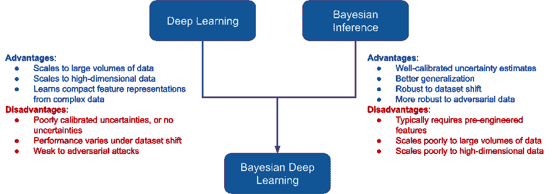

# 第四章

介绍贝叶斯深度学习

在*第二章*，*贝叶斯推断基础*，*贝叶斯推断基础*中，我们看到传统的贝叶斯推断方法如何用来产生模型的不确定性估计，并介绍了良好校准和有原则的不确定性估计方法的特性。尽管这些传统方法在许多应用中非常强大，*第二章*，*贝叶斯推断基础*也突出了它们在扩展性方面的一些局限性。在*第三章*，*深度学习基础*中，我们看到了 DNNs 在大量数据下所能展现的令人印象深刻的能力；但我们也了解到它们并不完美。特别是，它们往往缺乏对分布外数据的鲁棒性——这是我们考虑将这些方法部署到现实世界应用中的一个主要问题。



图 4.1：BDL 结合了深度学习和传统贝叶斯推断的优势

BDL 旨在改进传统贝叶斯推断和标准 DNN 的不足，利用一种方法的优势来弥补另一种方法的不足。基本思想相当直接：我们的 DNN 获得不确定性估计，因此可以更稳健地实施，而我们的贝叶斯推断方法则获得了 DNN 的可扩展性和高维非线性表示学习能力。

虽然从概念上讲，这相当直观，但实际上并不是简单地将两者拼接在一起。随着模型复杂性的增加，贝叶斯推断的计算成本也会增加——使得某些贝叶斯推断方法（例如通过采样）变得不可行。

在本章中，我们将介绍理想**贝叶斯神经网络**（**BNN**）的概念，并讨论其局限性，我们还将学习如何使用 BNN 创建更稳健的深度学习系统。具体来说，我们将涵盖以下内容：

+   理想的 BNN

+   BDL 基础

+   BDL 工具

## 4.1 技术要求

要完成本章中的实际任务，您需要一个安装了`SciPy`堆栈的 Python 3.8 环境，并安装以下额外的 Python 软件包：

+   TensorFlow 2.0

+   TensorFlow 概率

+   Seaborn 绘图库

本书的所有代码可以在书籍的 GitHub 仓库中找到：[`github.com/PacktPublishing/Enhancing-Deep-Learning-with-Bayesian-Inference`](https://github.com/PacktPublishing/Enhancing-Deep-Learning-with-Bayesian-Inference)。

## 4.2 理想的 BNN

正如我们在上一章所看到的，一个标准的神经网络由多个层组成。每一层由若干感知机组成——这些感知机包含乘法组件（权重）和加法组件（偏置）。每个权重和偏置参数都是单一的参数——或点估计——并且这些参数的组合将输入转换为感知机的输出。正如我们所见，通过反向传播训练的多个感知机层能够实现令人印象深刻的成就。然而，这些点估计包含的信息非常有限——我们来看看。

一般而言，深度学习的目标是找到（可能非常非常多的）参数值，最好的将一组输入映射到一组输出。也就是说，给定某些数据，对于网络中的每个参数，我们将选择最能描述数据的参数。这通常归结为取候选参数值的均值——或期望值。让我们看看这对于神经网络中的单一参数来说可能是什么样的：


图 4.2：展示如何在机器学习模型中对参数进行平均的数值表

为了更好地理解这一点，我们将使用表格来说明输入值、模型参数和输出值之间的关系。该表格显示了对于五个示例输入值（第一列），获得目标输出值（第四列）所需的理想参数（第二列）。在这种情况下，理想的意思是输入值乘以理想参数将完全等于目标输出值。因为我们需要找到一个最佳映射输入数据到输出数据的单一值，所以我们最终取理想参数的期望（或均值）。

如我们所见，取这些参数的均值是我们模型需要做出的折衷，以找到一个最适合示例中五个数据点的参数值。这是传统深度学习所做的折衷——通过使用分布，而不是点估计，BDL 能够在此基础上进行改进。如果我们查看标准差（*σ*）值，我们可以大致了解理想参数值的变化（从而输入值的方差）如何转化为损失的变化。那么，如果我们选择了不合适的参数值，会发生什么呢？


图 4.3：展示如何在参数不理想的情况下，参数*σ*值增大的数值表

如果我们比较*图 4.2*和*图 4.3*，我们会看到参数值的显著方差如何导致模型近似度降低，而较大的*σ*可能表明模型存在误差（至少对于经过良好校准的模型）。虽然在实际中事情要复杂一些，但我们在这里看到的本质上是在每个深度学习模型的参数中发生的事情：参数分布被压缩成点估计，过程中的信息丢失。在 BDL 中，我们关注的是从这些参数分布中获取额外信息，用于更强健的训练和创建具有不确定性意识的模型。

BNNs 通过对神经网络参数的分布建模来实现这一目标。在理想情况下，BNN 能够学习每个网络参数的任意分布。在推理时，我们将从神经网络中采样，获得输出值的分布。利用*第二章*中介绍的采样方法，*贝叶斯推断基础*，我们将重复这一过程，直到获得足够数量的样本，从而能够假设我们的输出分布已得到很好的近似。然后，我们可以利用这个输出分布推断输入数据的某些特征，无论是分类语音内容还是对房价进行回归分析。

因为我们会有参数分布，而不是点估计，所以我们的理想 BNN 将提供精确的不确定性估计。这些估计将告诉我们给定输入数据的情况下，参数值的可能性有多大。这样，它们可以帮助我们检测输入数据与训练时数据的偏离情况，并通过给定样本值与训练时学习到的分布之间的差异量化这种偏差的程度。有了这些信息，我们就能更智能地处理神经网络的输出——例如，如果输出的不确定性很高，我们可以回退到一些安全的、预定义的行为。这种基于不确定性来解读模型预测的概念应该很熟悉：我们在*第二章*，*贝叶斯推断基础*中学到，高不确定性表明模型预测存在误差。

回顾*第二章*，*贝叶斯推断基础*，我们看到采样很快变得计算上不可行。现在，假设从每个神经网络参数的分布中进行采样——即使我们选择一个相对较小的网络，如 MobileNet（一种专门设计以提高计算效率的架构），我们仍然需要处理多达 420 万个参数。对这样的网络进行基于采样的推断将非常计算密集，而对于其他网络架构，这种情况会更加糟糕（例如，AlexNet 有 6000 万个参数！）。

由于这种不可行性，BDL 方法采用了各种近似方法，以促进不确定性量化。在下一节中，我们将了解一些基本原理，这些原理被应用于使得使用深度神经网络（DNN）进行不确定性估计成为可能。

## 4.3 BDL 基础

在本书的其余部分，我们将介绍使得 BDL 成为可能的一系列方法。这些方法中有许多共同的主题。我们将在这里覆盖这些内容，以便在稍后遇到时能够很好地理解这些概念。

这些概念包括以下内容：

+   **高斯假设**：许多 BDL 方法使用高斯假设来使计算变得可行。

+   **不确定性来源**：我们将查看不同的不确定性来源，并了解如何确定这些来源在某些 BDL 方法中的贡献。

+   **似然**：我们在*第二章*和*贝叶斯推断基础*中介绍了似然，在这里我们将进一步了解似然作为评估概率模型校准的度量标准的重要性。

接下来我们将查看以下小节中的每个问题。

### 4.3.1 高斯假设

在前面描述的理想情况下，我们讨论了为每个神经网络参数学习分布。实际上，虽然每个参数将遵循特定的非高斯分布，但这将使本已困难的问题变得更加*复杂*。这是因为，对于贝叶斯神经网络（BNN），我们关注的是学习两个关键概率：

+   给定某些数据 `D`，权重 `W` 的概率：

    

+   给定某些输入 `x`，输出 *ŷ* 的概率：

    

对于任意概率分布，获得这些概率需要求解无法求解的积分。而高斯积分有封闭解——使得它们成为近似分布时的非常流行的选择。

因此，在贝叶斯深度学习（BDL）中，假设我们可以用高斯分布近似我们权重的真实底层分布是很常见的（这与我们在*第二章*，*贝叶斯推理基础*中看到的类似）。让我们看看这会是什么样子——以我们典型的线性感知机模型为例：


在这里，`x` 是我们输入到感知机的值，*β* 是我们学习到的权重值，*ξ* 是我们学习到的偏置值，而 `z` 是返回的值（通常传递给下一层）。采用贝叶斯方法，我们将 *β* 和 *ξ* 转换为分布，而不是点估计，具体来说：


现在学习过程将涉及学习四个参数，而不是两个，因为每个高斯分布由两个参数描述：均值（*μ*）和标准差（*σ*）。对我们神经网络中的每个感知机执行此操作后，我们最终需要学习的参数数量翻倍——我们可以通过从*图 4.4*（*Figure*）开始看到这一点：


图 4.4：标准 DNN 的示意图

引入一维高斯分布作为我们的权重后，网络变为如下：


图 4.5：带有高斯先验的贝叶斯神经网络（BNN）示意图

在*第五章，贝叶斯深度学习的原则方法*中，我们将看到正是这些方法。虽然这确实增加了网络的计算复杂性和内存占用，但它使得通过神经网络进行贝叶斯推理成为可能——这使得它成为一个非常值得的权衡。

那么，我们实际上想要在这些不确定性估计中捕获什么呢？在*第二章*，*贝叶斯推理基础*中，我们看到了不确定性是如何根据用于训练的数据样本而变化的——但是这种不确定性的来源是什么？为什么它在深度学习应用中很重要？让我们继续往下看，找出答案。

### 4.3.2 不确定性的来源

正如我们在*第二章*，*贝叶斯推理基础*中看到的，正如我们将在本书后续章节中看到的，我们通常将不确定性视为与某个参数或输出相关的标量变量。这些变量表示参数或输出的变化，但尽管它们只是标量变量，但有多个来源对它们的值产生影响。这些不确定性的来源可以分为两类：

+   **偶然性不确定性**，也称为观测不确定性或数据不确定性，是与输入相关的不确定性。它描述了我们**观测值**的变化，因此是**不可约的**。

+   **认知不确定性**，也称为模型不确定性，是源于我们模型的不确定性。在机器学习中，这指的是与我们模型的参数相关的方差，它*并非*来源于观察，而是模型本身或模型的训练方式的产物。例如，在*第二章*《*贝叶斯推理基础*》中，我们看到不同的先验如何影响高斯过程产生的不确定性。这是模型参数如何影响认知不确定性的一个例子——在这种情况下，因为它们明确地修改了模型对不同数据点之间关系的解释。

我们可以通过一些简单的例子来建立对这些概念的直觉。假设我们有一篮水果，其中包含苹果和香蕉。如果我们测量一些苹果和香蕉的高度和长度，我们会发现苹果通常是圆形的，而香蕉通常是长的，如*图* *4.6*所示。通过观察我们知道，每种水果的具体尺寸会有所不同：我们接受与任何给定的苹果分布的测量相关的随机性或随机性，但我们知道它们大致相似。这就是**不可减少的不确定性**：数据中的固有不确定性。


图 4.6：使用水果形状作为示例的偶然不确定性的插图

我们可以利用这些信息来构建一个模型，根据这些输入特征将水果分类为苹果或香蕉。但如果我们主要基于苹果来训练模型，而只有少量香蕉的测量数据会发生什么呢？这在*图* *4.7*中有示例。


图 4.7：基于水果示例的高认知不确定性的插图

在这里，我们看到——由于数据有限——我们的模型错误地将香蕉分类为苹果。虽然这些数据点落在我们模型的`苹果`边界内，但我们也看到它们离其他苹果非常远，这意味着，尽管它们被分类为苹果，但我们的模型（如果是贝叶斯模型）会对这些数据点具有较高的预测不确定性。这种认知不确定性在实际应用中非常有用：它能告诉我们何时可以信任模型，何时我们应该对模型的预测保持谨慎。与偶然不确定性不同，认知不确定性是**可减少**的——如果我们给模型更多的香蕉示例，它的分类边界会改善，认知不确定性将接近偶然不确定性。


图 4.8：低认知不确定性的插图

在*图**4.8*中，我们可以看到，随着我们的模型观察到更多数据，认识不确定性显著减少，它现在看起来更像是*图**4.6*中展示的随机不确定性。因此，认识不确定性在两方面都极其有用：它不仅能指示我们可以多大程度上信任模型，而且还能作为提高模型性能的一种手段。

随着深度学习方法越来越多地应用于任务关键和安全关键的应用，使用的方法能够估计与其预测相关的认识不确定性的程度变得至关重要。为了说明这一点，让我们将示例的领域从*图**4.7*中的水果分类，改为现在分类喷气引擎是否在安全参数范围内运行，如*图**4.9*所示。


图 4.9：高认识不确定性在安全关键应用中的示意图

在这里，我们可以看到我们的认识不确定性可能是引擎故障的一个生死攸关的指示。如果没有这个不确定性估计，我们的模型会假设一切正常，尽管在其他参数的情况下引擎的温度异常——这可能导致灾难性的后果。幸运的是，由于我们有不确定性估计，尽管我们的模型从未遇到过这种情况，它依然能够告诉我们出了问题。

#### 分离不确定性的来源

在本节中，我们介绍了两种不确定性的来源，并且我们看到认识不确定性对于理解如何解释模型输出非常有用。那么，你可能会想：我们能否将不确定性来源分离开来？

一般来说，在尝试将不确定性分解为认识性不确定性和随机性不确定性时，提供的保证有限，但有些模型允许我们获得较好的近似。集成方法提供了一个特别好的示例。

假设我们有一个包含`M`个模型的集合，它们为某些输入`x`和输出`y`从数据`D`中生成预测后验`P`（`y`|`x`*,D*）。对于给定的输入，我们的预测将具有熵：

![ 1 ∑M m m H [P (y|x, D)] ≈ H [M- P (y|x,𝜃 )],𝜃 ∼ p(𝜃|D ) m=1 ](img/file93.jpg)

在这里，`H`表示熵，*𝜃*表示我们的模型参数。这是我们已经讨论过的概念的正式表达，表明当我们的随机不确定性和/或认识不确定性较高时，预测后验的熵（换句话说，不确定性）将很高。因此，这代表了我们的**总**不确定性，这是本书中我们将处理的不确定性。我们可以用一种更符合本书内容的方式来表示这一点——以我们的预测标准差*σ*为单位：


其中，`a`和`e`分别表示偶然不确定性和认知不确定性。

因为我们正在使用集成方法，我们可以进一步超越总不确定性。集成方法的独特之处在于每个模型从数据中学习到的内容略有不同，原因在于不同的数据或参数初始化。由于我们为每个模型都获得了不确定性估计，我们可以对这些不确定性估计值进行期望（换句话说，即求平均）：

![ ∑M 𝔼 [H [P(y|x,𝜃)]] ≈ -1- H [P (y|x,𝜃m )],𝜃m ∼ p(𝜃|D ) p(𝜃|D) M m=1 ](img/file95.jpg)

这给了我们**期望的数据不确定性**——对偶然不确定性的估计。随着集成规模的增加，这种偶然不确定性的近似度量变得更为准确。这是因为集成成员从不同数据子集学习的方式。如果没有认知不确定性，那么模型是一致的，意味着它们的输出是相同的，总不确定性完全由偶然不确定性构成。

另一方面，如果存在认知不确定性，那么我们的总不确定性包括偶然不确定性和认知不确定性。我们可以使用期望的数据不确定性来确定我们总不确定性中存在多少认知不确定性。我们通过使用**互信息**来做到这一点，公式如下：

![I[y,𝜃|x,D ] = H [P (y|x, D)]− 𝔼p (𝜃|D )[H [P(y|x,𝜃)]] ](img/file96.jpg)

我们还可以通过方程 4.3.2 来表示这个问题：

![I[y,𝜃|x,D ] = σe = σ − σa ](img/file97.jpg)

正如我们所看到的，这个概念相当直接：简单地将我们的**偶然不确定性**从总不确定性中减去！能够估计偶然不确定性使得集成方法在不确定性量化中更具吸引力，因为它允许我们分解不确定性，从而提供通常无法获得的额外信息。在*第六章，贝叶斯推断与标准深度学习工具箱*中，我们将学习更多关于 BDL 的集成技术。对于非集成方法，我们只有一般的预测不确定性，*σ*（合并了偶然和认知不确定性），这在大多数情况下是合适的。

在下一节中，我们将看到如何将不确定性纳入到模型评估中，并且如何将其纳入损失函数以改善模型训练。

### 4.3.3 超越最大似然估计：似然的重要性

在上一节中，我们看到了不确定性量化如何帮助避免在机器学习的实际应用中出现潜在的危险场景。回顾更早之前的*第二章*的*贝叶斯推断基础*和*第三章*的*深度学习基础*，我们引入了校准的概念，并展示了校准良好的方法如何随着推理数据偏离训练数据而增加其不确定性——这一概念在*图* *4.7*中得到了说明。

虽然用简单数据来说明校准的概念很容易——正如我们在*第二章*中的*贝叶斯推断基础*（通过*图* *2.21*）中看到的那样——不幸的是，在大多数应用中，做这个并不容易或实际。理解给定方法的校准程度的一个更实际的方法是使用一个包含其不确定性的度量——这正是**似然**所提供的。

似然是某些参数描述某些数据的概率。如前所述，我们通常使用高斯分布来简化问题——因此我们对高斯似然感兴趣：即高斯分布的参数拟合一些观测数据的似然。高斯似然的公式如下：


让我们看看这些分布在我们之前在*图* *4.2* 和 *4.3* 中看到的参数值下会是什么样子：


图 4.10：与图 4.2 和 4.3 中的参数集对应的高斯分布图

可视化这两个分布突出了这两组参数的不确定性差异：我们的第一组参数具有高概率（实线），而我们的第二组参数具有低概率（虚线）。但是，这对与我们模型输出相关的似然值意味着什么呢？为了调查这些，我们需要将这些值代入方程 4.3.3。为此，我们需要一个`y`的值。我们将使用目标值的均值：24*.*03\. 对于我们的*μ*和*σ*值，我们将分别取预测输出值的均值和标准差：


我们看到，在参数集*𝜃*[1]与*𝜃*[2]之间，前者的似然得分显著高于后者。这与*图* *4.10*一致，表明根据数据，参数*𝜃*[1]比参数*𝜃*[2]具有更高的概率——换句话说，参数*𝜃*[1]更好地将输入映射到输出。

这些例子展示了引入不确定性估计的影响，使我们能够计算数据的似然性。虽然由于平均预测较差，我们的误差有所增加，但我们的似然性下降得更为显著——下降了多个数量级。这告诉我们，这些参数在描述数据方面表现得非常糟糕，而且它比仅仅计算输出和目标之间的误差更具原则性。

似然性的重要特征之一是它平衡了模型的准确性和不确定性。过于自信的模型在数据的预测不正确时，表现出较低的不确定性，而似然性会因这种过度自信而惩罚它们。同样，校准良好的模型在预测正确的数据上表现出信心，而在预测错误的数据上表现出不确定性。虽然模型仍会因错误的预测而受到惩罚，但它们也会因在正确的地方表现出不确定性而获得奖励，而不会过度自信。为了实践这一点，我们可以再次使用*图* *4.2*和*图* *4.3*中显示的目标输出值：`y` = 24*.*03，但我们也会使用一个不正确的预测值：*ŷ* = 5*.*00。如我们所见，这产生了一个相当大的误差：|`y` −*ŷ*| = |24*.*03 − 5*.*00| = 19*.*03。让我们来看一下，当我们增加与此预测相关的*σ*²值时，似然性会发生什么变化：


图 4.11：方差增加时似然值的变化图

如我们所见，当*σ*² = 0*.*00 时，我们的似然值非常小，但随着*σ*²增加到约 0*.*15 时，它又开始上升，然后再次下降。这表明，在预测不正确的情况下，与没有不确定性相比，一定的不确定性对于似然值更有利。因此，使用似然性可以帮助我们训练出更好校准的模型。

同样地，我们可以看到，如果我们固定不确定性，这里设为*σ*² = 0*.*1，并改变预测值，似然性在正确值处达到峰值，当预测*ŷ*变得不准确时，似然性在任一方向上都会下降，同时我们的误差|`y` −*ŷ*|也在增大：


图 4.12：随着预测变化的似然值图

实际上，我们通常不使用似然函数，而是使用**负对数似然**（**NLL**）。我们将其取负，因为在损失函数中，我们关心的是寻找最小值，而不是最大值。我们使用对数，因为这使得我们能够使用加法而非乘法，从而提高计算效率（利用对数恒等式*log*(`a` ∗ `b`) = *log*(`a`) + *log*(`b`)）。因此，我们通常使用的方程是：


现在我们已经熟悉了不确定性和似然性这两个核心概念，接下来我们准备进入下一部分，学习如何在代码中使用 TensorFlow 概率库处理概率概念。

## 4.4 BDL 工具

在本章中，正如在*第二章*，*贝叶斯推断基础*中所见，我们已经看到了许多涉及概率的方程。虽然没有概率库也能创建 BDL 模型，但有一个支持基本函数的库会使事情变得更容易。由于本书中的示例使用了 TensorFlow，我们将使用**TensorFlow** **概率**（**TFP**）库来帮助我们实现这些概率组件。在本节中，我们将介绍 TFP，并展示如何使用它轻松实现我们在*第二章*，*贝叶斯推断基础*和*第四章*，*介绍贝叶斯深度* *学习*中看到的许多概念。

到目前为止，很多内容都在介绍如何与分布进行工作。因此，我们将要学习的第一个 TFP 模块是`distributions`模块。让我们来看看：

```py

import tensorflow_probability as tfp 
tfd = tfp.distributions 
mu = 0 
sigma = 1.5 
gaussian_dist = tfd.Normal(loc=mu, scale=sigma)
```

在这里，我们有一个简单的例子，使用`distributions`模块初始化一个高斯（或正态）分布。我们现在可以从这个分布中进行采样——我们将使用`seaborn`和`matplotlib`可视化我们的样本分布：

```py

import seaborn as sns 
samples = gaussian_dist.sample(1000) 
sns.histplot(samples, stat="probability", kde=True) 
plt.show()
```

这将生成以下图表：


图 4.13：使用 TFP 从高斯分布中抽样得到的样本的概率分布

正如我们所见，样本遵循由我们的参数*μ* = 0 和*σ* = 1*.*5 定义的高斯分布。TFD 分布类还具有一些有用的函数方法，如**概率密度函数**（**PDF**）和**累积分布函数**（**CDF**）。让我们先从计算 PDF 在一系列值上的表现开始：

```py

pdf_range = np.arange(-4, 4, 0.1) 
pdf_values = [] 
for x in pdf_range: 
pdf_values.append(gaussian_dist.prob(x)) 
plt.figure(figsize=(10, 5)) 
plt.plot(pdf_range, pdf_values) 
plt.title("Probability density function", fontsize="15") 
plt.xlabel("x", fontsize="15") 
plt.ylabel("probability", fontsize="15") 
plt.show()
```

通过以下代码，我们将生成以下图表：


图 4.14：一系列输入（`x` = −4 到`x` = 4）对应的概率密度函数值的图

同样，我们也可以计算 CDF：

```py

cdf_range = np.arange(-4, 4, 0.1) 
cdf_values = [] 
for x in cdf_range: 
cdf_values.append(gaussian_dist.cdf(x)) 
plt.figure(figsize=(10, 5)) 
plt.plot(cdf_range, cdf_values) 
plt.title("Cumulative density function", fontsize="15") 
plt.xlabel("x", fontsize="15") 
plt.ylabel("CDF", fontsize="15") 
plt.show()
```

与 PDF 相比，CDF 生成累积概率值，范围从 0 到 1，正如我们在下面的图表中所看到的：


图 4.15：针对范围内输入值的累积分布函数值，`x` = −4 到`x` = 4

`tfp.distributions`类还为我们提供了轻松访问分布参数的方式，例如，我们可以通过以下方式恢复高斯分布的参数：

```py

mu = gaussian_dist.mean() 
sigma = gaussian_dist.stddev()
```

请注意，这些将返回`tf.Tensor`对象，但可以通过`.numpy()`函数轻松访问 NumPy 值，例如：

```py

mu = mu.numpy() 
sigma = sigma.numpy()
```

这给出了我们的`mu`和`sigma`变量的两个 NumPy 标量值：分别为 0*.*0 和 1*.*5。

就像我们可以使用`prob()`函数计算概率，从而得到 PDF 一样，我们也可以轻松地使用`log_prob()`函数计算对数概率或对数似然。这使得我们比每次都编写完整的似然方程（例如，方程 4.3.3）更简单一些：

```py

x = 5 
log_likelihood = gaussian_dist.log_prob(x) 
negative_log_likelihood = -log_likelihood
```

在这里，我们首先获得某个值`x` = 5 的对数似然值，然后获得 NLL，这在梯度下降的上下文中会用到。

随着我们继续阅读本书，我们将更多地了解 TFP 的功能——使用`distributions`模块从参数分布中采样，并探索强大的`tfp.layers`模块，该模块实现了常见神经网络层的概率版本。

## 4.5 总结

在本章中，我们介绍了实现并使用 BNN 所需的基本概念。最重要的是，我们了解了理想的 BNN，这使我们接触到 BDL 的核心思想，以及在实践中实现这一点的计算困难。我们还介绍了 BDL 中使用的基本实践方法，为我们实现计算可行的 BNN 打下了基础。

本章还介绍了不确定性来源的概念，描述了数据不确定性和模型不确定性之间的区别，这些如何影响总不确定性，并且我们如何通过不同的模型估计各种不确定性类型的贡献。我们还介绍了概率推断中最基本的组成部分之一——似然函数，并了解了它如何帮助我们训练更好的、原则性更强且更为精确的模型。最后，我们介绍了 TensorFlow 概率：一个强大的概率推断库，并且是本书后面实践例子中的一个关键组成部分。

既然我们已经涵盖了这些基础知识，我们准备好看看我们迄今为止遇到的概念如何应用到多个关键 BDL 模型的实现中。我们将了解这些方法的优缺点，并学习如何将它们应用于各种实际问题。继续阅读*第五章*，*贝叶斯深度学习的原则性方法*，在这里我们将学习两种关键的 BDL 原则性方法。

## 4.6 进一步阅读

本章介绍了开始使用 BDL 所需的材料；然而，还有许多资源可以更深入地探讨不确定性来源的相关主题。以下是一些推荐，供那些有兴趣更深入探索理论和代码的读者参考：

+   *机器学习：一种概率视角，Murphy*：凯文·墨菲（Kevin Murphy）关于机器学习的极为流行的书籍已成为该领域学生和研究人员的必备读物。本书从概率的角度详细介绍了机器学习，统一了统计学、机器学习和贝叶斯概率的概念。

+   *TensorFlow Probability* *教程*：在本书中，我们将看到如何使用 TensorFlow Probability 开发 BNNs，但他们的网站提供了广泛的教程，更广泛地涉及概率编程：[`www.tensorflow.org/probability/overview`](https://www.tensorflow.org/probability/overview)

+   *Pyro 教程*：Pyro 是一个基于 PyTorch 的概率编程库——这是一个强大的贝叶斯推断工具，Pyro 网站上有许多关于概率推断的优秀教程和示例：[`pyro.ai/`](https://pyro.ai/)
