# 第五章

贝叶斯深度学习的原理方法

现在我们已经介绍了**贝叶斯神经网络**（**BNN**）的概念，接下来我们准备探索实现它们的各种方法。正如我们之前讨论的，理想的 BNN 计算量巨大，随着更复杂的架构或更大数据量，变得不可处理。近年来，研究人员开发了一系列方法，使得 BNN 变得可处理，从而能够在更大且更复杂的神经网络架构中实现。

在本章中，我们将探讨两种特别流行的方法：**概率反向传播**（**PBP**）和**贝叶斯反向传播**（**BBB**）。这两种方法都可以称为*概率神经网络模型*：旨在学习其权重的概率，而不仅仅是学习点估计（这是 BNN 的一个基本特征，正如我们在*第四章*中学习的那样，*介绍贝叶斯深度学习*）。因为它们在训练时显式地学习权重的分布，所以我们称之为*原理性*方法；与我们将在下一章探讨的方法相比，后者更加宽松地近似贝叶斯推断与神经网络的结合。我们将在本章的以下部分讨论这些主题：

+   符号说明

+   深度学习中的常见概率概念

+   通过反向传播的贝叶斯推断

+   使用 TensorFlow 实现 BBB

+   使用 PBP 的可扩展贝叶斯深度学习

+   实现 PBP

首先，让我们快速回顾一下本章的技术要求。

## 5.1 技术要求

要完成本章的实际任务，你将需要一个安装了 Python 3.8 环境以及 Python SciPy 栈和以下附加 Python 包的环境：

+   TensorFlow 2.0

+   TensorFlow 概率

本书的所有代码都可以在本书的 GitHub 仓库中找到：[`github.com/PacktPublishing/Enhancing-Deep-Learning-with-Bayesian-Inference`](https://github.com/PacktPublishing/Enhancing-Deep-Learning-with-Bayesian-Inference)。

## 5.2 符号说明

尽管我们在前几章中介绍了书中使用的大部分符号，但在接下来的章节中，我们将介绍与 BDL 相关的更多符号。因此，我们在这里提供了符号的概述，供参考：

+   *μ*：均值。为了方便将本章与原始的概率反向传播论文进行交叉引用，讨论 PBP 时，这个符号用`m`表示。

+   *σ*：标准差。

+   *σ*²：方差（即标准差的平方）。为了方便将本章与论文进行交叉引用，在讨论 PBP 时，使用`v`表示。

+   *`x`*：输入模型的单一向量。如果考虑多个输入，我们将使用*`X`*表示由多个向量输入组成的矩阵。

+   *`x`*：我们输入的近似值*`x`*。

+   `y`：单个标量目标。当考虑多个目标时，我们将使用 *`y`* 来表示多个标量目标的向量。

+   *ŷ*：来自我们模型的单个标量输出。当考虑多个输出时，我们将使用 **ŷ** 来表示多个标量输出的向量。

+   *`z`*：我们模型中间层的输出。

+   `P`：某个理想或目标分布。

+   `Q`：近似分布。

+   *KL*[`Q`∥`P`]：我们的目标分布 `P` 和近似分布 `Q` 之间的 KL 散度。

+   ℒ：损失。

+   ：期望。

+   `N`(*μ,σ*)：一个由均值 *μ* 和标准差 *σ* 参数化的正态（或高斯）分布。

+   *𝜃*：一组模型参数。

+   Δ：梯度。

+   *∂*：偏导数。

+   `f`()：某个函数（例如 `y` = `f`(`x`) 表示 `y` 是通过对输入 `x` 应用函数 `f`() 得到的）。

我们将遇到不同变体的符号，使用不同的下标或变量组合。

## 5.3 深度学习中的常见概率概念

本书介绍了许多可能不熟悉的概念，但你可能会发现这里讨论的一些想法是你已经熟悉的。特别是，**变分推断**（**VI**）可能因为在**变分自编码器**（**VAE**）中的应用而为你所熟知。

快速回顾一下，VAE 是一种生成模型，它学习可以用于生成合理数据的编码。与标准自编码器类似，VAE 也采用编码器-解码器架构。

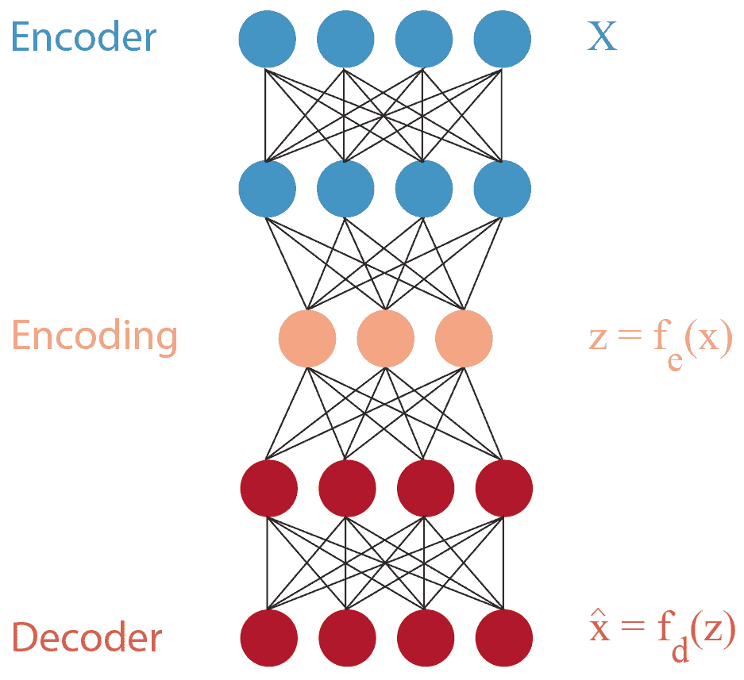

图 5.1：自编码器架构的示意图

对于标准自编码器，模型学习从编码器到潜在空间的映射，然后从潜在空间到解码器的映射。

如图所示，我们的输出简单地定义为 *`x`* = `f``d`，其中我们的编码 *`z`* 定义为：*`z`* = `f``e`，其中 `f`[`e`]() 和 `f`[`d`]() 分别是我们的编码器和解码器函数。如果我们想使用潜在空间中的值生成新数据，我们可以通过向解码器输入注入一些随机值；绕过编码器，直接从潜在空间中随机采样：

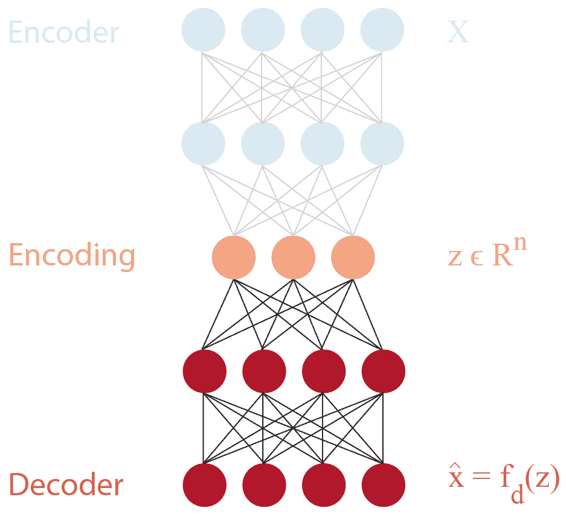

图 5.2：从标准自编码器的潜在空间中采样的示意图

这种方法的问题在于，标准自编码器在学习潜在空间的结构上表现不佳。这意味着，虽然我们可以自由地在该空间中随机采样点，但无法保证这些点能够被解码器处理，生成合理的数据。

在 VAE 中，潜在空间被建模为一个分布。因此，*`z`* = `f``e` 变为 *`z`* ≈𝒩(*μ*[x], *σ*[x])；也就是说，我们的潜在空间 *`z`* 现在变成了一个条件于输入 *`x`* 的高斯分布。现在，当我们想使用训练好的网络生成数据时，我们可以简单地从正态分布中采样。

为了实现这一点，我们需要确保潜在空间近似一个高斯分布。为此，我们在训练过程中使用**Kullback-Leibler 散度**（或 KL 散度），并将其作为正则化项加入：

![ 2 ℒ = ∥x− ˆx ∥ + KL [Q ∥P] ](img/file109.jpg)

这里，`P` 是我们的目标分布（在此情况下是多变量高斯分布），我们正试图用`Q`来逼近它，`Q`是与我们潜在空间相关的分布，在此情况下如下所示：

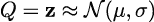

所以，我们的损失现在变为：

![ℒ = ∥x− ˆx ∥2 + KL [q(z|x)∥p(z )] ](img/file111.jpg)

我们可以如下扩展：

![ℒ = ∥x − ˆx∥2 + KL [𝒩 (μ,σ)∥𝒩 (0,I)] ](img/file112.jpg)

这里，`I` 是单位矩阵。这将使我们的潜在空间能够收敛到我们的高斯先验，同时最小化重构损失。KL 散度还可以重新写成如下形式：

![KL [q(z|x )∥p (z)] =q (z|x) logq(z|x )− q(z|x) log p(z) ](img/file113.jpg)

我们方程右侧的项是对数`q`(*`z`*|*`x`*)和对数`p`(*`z`*)的期望（或均值）。正如我们从*第二章*、*贝叶斯推断基础*和*第四章*、*引入贝叶斯深度学习*中了解到的那样，我们可以通过采样来获得给定分布的期望。因此，正如我们所见，KL 散度的所有项都是相对于我们近似分布`q`(*`z`*|*`x`*)计算的期望，我们可以通过从`q`(*`z`*|*`x`*)中采样来近似我们的 KL 散度，这正是我们接下来要做的！

现在我们的编码由方程 5.3 中显示的分布表示，我们的神经网络结构必须发生变化。我们需要学习我们分布的均值（*μ*）和标准差（*σ*）参数：

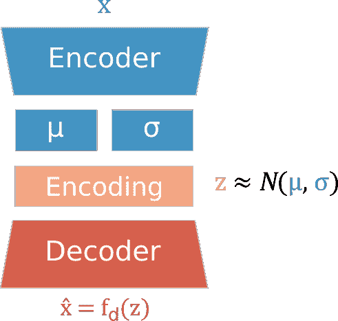

图 5.3：带有均值和标准差权重的自动编码器架构示意图

以这种方式构建 VAE 的问题在于我们的编码`z`现在是随机的，而不是确定性的。这是一个问题，因为我们无法为随机变量获得梯度——如果我们无法获得梯度，就无法进行反向传播——因此我们无法进行学习！

我们可以使用一种叫做**重参数化技巧**的方法来解决这个问题。重参数化技巧涉及到修改我们计算*`z`*的方式。我们不再从分布参数中抽样*`z`*，而是将其定义为如下：

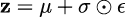

如你所见，我们引入了一个新的变量，*𝜖*，它是从一个均值为 0，标准差为 1 的高斯分布中采样的：

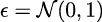

引入*𝜖*使我们能够将随机性移出反向传播路径。由于随机性仅存在于*𝜖*中，我们能够像正常情况一样通过权重进行反向传播：

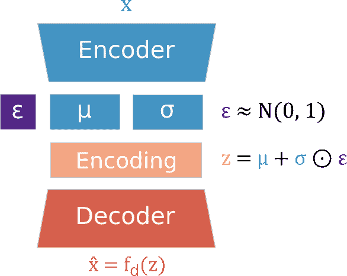

图 5.4：典型 VAE 架构的示意图，其中包含均值和标准差权重，并将采样组件移出了反向传播路径

这意味着我们能够将编码表示为一个分布，同时仍然能够反向传播 `z` 的梯度：学习 *μ* 和 *σ* 的参数，并使用 *𝜖* 从分布中进行采样。能够将 `z` 表示为分布意味着我们能够利用它来计算 KL 散度，从而将正则化项纳入方程 5.1，这反过来又使我们的嵌入在训练过程中向高斯分布收敛。

这些是变分学习的基本步骤，它们将我们的标准自编码器转变为 VAE。但这不仅仅是关于学习的。对于 VAE 来说，至关重要的是，因为我们已经学到了一个正态分布的潜在空间，我们现在可以从这个潜在空间有效地进行采样，使得我们可以使用 VAE 根据训练期间学到的数据景观生成新数据。与标准自编码器中的脆弱随机采样不同，我们的 VAE 现在能够生成*合理*的数据！

为了做到这一点，我们从正态分布中采样 *𝜖* 并将 *σ* 与该值相乘。这将给我们一个 `z` 的样本，传递给解码器，从而在输出端获得我们生成的数据，*`x`*。

现在我们已经熟悉了变分学习的基础，在下一节中，我们将看到如何将这些原理应用于创建 BNN。

## 5.4 通过反向传播进行贝叶斯推断

在 2015 年的论文《神经网络中的权重不确定性》中，Charles Blundell 及其在 DeepMind 的同事们提出了一种使用变分学习进行神经网络贝叶斯推断的方法。他们的方法通过标准反向传播来学习 BNN 参数，并且这个方法被恰当地命名为**贝叶斯反向传播**（**BBB**）。

在前一节中，我们看到了如何使用变分学习来估计我们编码的后验分布 `z`，学习 `P`(`z`|`x`)。对于 BBB，我们将做非常类似的事情，只是这一次我们不仅仅关心编码。我们这次要学习的是所有参数（或权重）的后验分布：`P`(*𝜃*|`D`)。

你可以将其看作是一个由 VAE 编码层组成的整个网络，类似于下面这样：

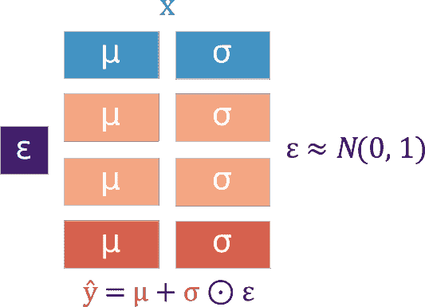

图 5.5：BBB 的示意图

因此，学习策略也与我们为 VAE 使用的策略类似，这是合乎逻辑的。我们再次使用变分学习的原理来学习 `Q` 的参数，并近似真实分布 `P`，但这一次我们要寻找的是最小化以下内容的参数 *𝜃*^(*⋆*)：

![𝜃⋆ = 𝜃 KL [q(w |𝜃)||P(w |D)] ](img/file119.jpg)

这里，`D` 是我们的数据，*`w`* 是我们的网络权重，*𝜃* 是我们的分布参数，例如在高斯分布中，*μ* 和 *σ* 是参数。为了做到这一点，我们使用了贝叶斯学习中的一个重要成本函数：**证据下界**（**ELBO**，也叫变分自由能）。我们用以下公式表示：

![ℒ(D,𝜃 ) = KL [q(w |𝜃)||P (w)]− q(w |𝜃) [log P(D |w)] ](img/file120.jpg)

这看起来相当复杂，但其实它只是我们在方程 5.4 中看到的内容的一种概括。我们可以按以下方式进行拆解：

1.  在左边，我们有先验 `P`(*`w`*) 和近似分布 `q`(*`w`*|*𝜃*) 之间的 KL 散度。这与我们在上一节的方程 5.1-5.4 中看到的内容类似。在损失中加入 KL 散度使得我们可以调整参数 *𝜃*，使得我们的近似分布收敛到先验分布。

1.  在右边，我们有关于给定神经网络权重 *`w`* 和变分分布的情况下，数据 `D` 的负对数似然的期望值。最小化这个（因为它是*负对数似然*）可以确保我们学习到的参数能最大化给定权重情况下数据的似然；我们的网络学会将输入映射到输出。

就像 VAE 一样，BBB 使用了重参数化技巧，使得我们能够通过网络参数反向传播梯度。和之前一样，我们从分布中采样。根据方程 5.5 中引入的 KL 散度形式，我们的损失函数变为如下：

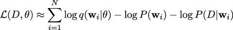

`N` 是样本的数量，`i` 表示某个特定样本。虽然我们这里使用的是高斯先验，但这个方法的一个有趣特点是，它可以应用于各种分布。

下一步是使用我们的权重样本来训练网络：

1.  首先，就像在 VAE 中一样，我们从高斯分布中采样 *𝜖*：

    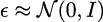

1.  接下来，我们将 *𝜖* 应用于某一层的权重，就像在 VAE 编码中一样：

    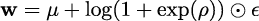

    注意，在 BBB 中，*σ* 被参数化为 *σ* = log(1 + exp(*ρ*))。这确保了它始终是非负的（因为标准差不能是负数！）。

1.  使用我们的参数 *𝜃* = (*μ,ρ*)，我们根据方程 3.10 定义我们的损失函数如下：

    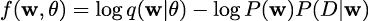

1.  因为我们的神经网络包含均值和标准差的权重，所以我们需要分别计算它们的梯度。我们首先计算相对于均值 *μ* 的梯度：

    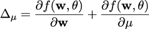

    然后我们计算相对于标准差参数 *ρ* 的梯度：

    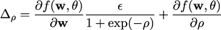

1.  现在，我们已经具备了通过反向传播更新权重所需的所有组件，这与典型的神经网络类似，唯一不同的是，我们使用各自的梯度更新均值和方差权重：

    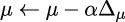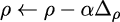

你可能注意到，在方程 5.14 和 5.15 中的梯度计算的第一项，正是你会为典型神经网络的反向传播计算的梯度；我们只是通过*μ*和*ρ*特定的更新规则增强了这些梯度。

虽然这部分内容在数学方面相对较重，但我们可以将其分解为几个简单的概念：

1.  与变分自编码器（VAE）中的编码类似，我们在这里使用表示多元分布均值和标准差的权重，唯一不同的是，这次这些权重构成了整个网络，而不仅仅是编码层。

1.  因此，我们再次使用一个包含 KL 散度的损失函数：我们的目标是最大化 ELBO。

1.  由于我们正在处理均值和标准差权重，我们将使用更新规则分别更新它们，规则使用的是各自权重集的梯度。

现在我们已经理解了 BBB 背后的核心原理，准备好看看它如何在代码中实现！

## 5.5 使用 TensorFlow 实现 BBB

在这一部分中，我们将看到如何在 TensorFlow 中实现 BBB。你将看到一些你已经熟悉的代码；层、损失函数和优化器的核心概念与我们在*第三章 深度学习基础*中所涵盖的非常相似。与*第三章*、*深度学习基础*中的例子不同，我们将看到如何创建能够进行概率推断的神经网络。

#### 第 1 步：导入包

我们首先导入相关包。重要的是，我们将导入`tensorflow-probability`，它将为我们提供网络的层，这些层用分布替代了点估计，并实现了重新参数化技巧。我们还设置了推理次数的全局参数，这将决定稍后我们从网络中采样的频率：

```py

import tensorflow as tf 
import numpy as np 
import matplotlib.pyplot as plt 
import tensorflow_probability as tfp 

NUM_INFERENCES = 7
```

#### 第 2 步：获取数据

然后我们下载 MNIST Fashion 数据集，这是一个包含十种不同衣物图像的数据集。我们还设置了类别名称，并推导出训练样本和类别的数量：

```py

# download MNIST fashion data set 
fashion_mnist = tf.keras.datasets.fashion_mnist 
(train_images, train_labels), (test_images, test_labels) = fashion_mnist.load_data() 

# set class names 
CLASS_NAMES = ['T-shirt', 'Trouser', 'Pullover', 'Dress', 'Coat', 
'Sandal', 'Shirt', 'Sneaker', 'Bag', 'Ankle boot'] 

# derive number training examples and classes 
NUM_TRAIN_EXAMPLES = len(train_images) 
NUM_CLASSES = len(CLASS_NAMES)
```

#### 第 3 步：辅助函数

接下来，我们创建一个辅助函数来定义我们的模型。如你所见，我们使用了一个非常简单的卷积神经网络结构进行图像分类，其中包括一个卷积层，随后是一个最大池化层和一个全连接层。卷积层和全连接层来自`tensorflow-probability`包，如*tfp*前缀所示。与定义权重的点估计不同，这里我们定义的是权重分布。

如`Convolution2DReparameterization`和`DenseReparameterization`的名称所示，这些层将使用重参数化技巧在反向传播过程中更新权重参数：

```py

def define_bayesian_model(): 
# define a function for computing the KL divergence 
kl_divergence_function = lambda q, p, _: tfp.distributions.kl_divergence( 
q, p 
) / tf.cast(NUM_TRAIN_EXAMPLES, dtype=tf.float32) 

# define our model 
model = tf.keras.models.Sequential([ 
tfp.layers.Convolution2DReparameterization( 
64, kernel_size=5, padding='SAME', 
kernel_divergence_fn=kl_divergence_function, 
activation=tf.nn.relu), 
tf.keras.layers.MaxPooling2D( 
pool_size=[2, 2], strides=[2, 2], 
padding='SAME'), 
tf.keras.layers.Flatten(), 
tfp.layers.DenseReparameterization( 
NUM_CLASSES, kernel_divergence_fn=kl_divergence_function, 
activation=tf.nn.softmax) 
]) 
  return model
```

我们还创建了另一个辅助函数来为我们编译模型，使用`Adam`作为优化器和分类交叉熵损失。提供了这个损失和前述的网络结构后，`tensorflow-probability`将自动将包含在卷积和密集层中的 KL 散度添加到交叉熵损失中。这种组合有效地相当于计算我们在方程式 5.9 中描述的 ELBO 损失：

```py

def compile_bayesian_model(model): 
# define the optimizer 
optimizer = tf.keras.optimizers.Adam() 
# compile the model 
model.compile(optimizer, loss='categorical_crossentropy', 
metrics=['accuracy'], experimental_run_tf_function=False) 
# build the model 
model.build(input_shape=[None, 28, 28, 1]) 
  return model
```

#### 步骤 4：模型训练

在我们能够训练模型之前，我们首先需要将训练数据的标签从整数转换为独热向量，因为这是 TensorFlow 对于分类交叉熵损失的期望。例如，如果一张图像显示一件 T 恤，而 T 恤的整数标签为 1，则该标签将被转换如下：`[1,`` 0,`` 0,`` 0,`` 0,`` 0,`` 0,`` 0,`` 0,`` 0]`：

```py

train_labels_dense = tf.one_hot(train_labels, NUM_CLASSES)
```

现在，我们准备在训练数据上训练我们的模型。我们将训练十个 epoch：

```py

# use helper function to define the model architecture 
bayesian_model = define_bayesian_model() 
# use helper function to compile the model 
bayesian_model = compile_bayesian_model(bayesian_model) 
# initiate model training 
bayesian_model.fit(train_images, train_labels_dense, epochs=10)
```

#### 步骤 5：推断

然后，我们可以使用训练好的模型对测试图像进行推断。在这里，我们预测测试集中前 50 张图像的类标签。对于每张图像，我们从网络中进行七次采样（由`NUM_INFERENCES`确定），这将为每张图像给出七个预测：

```py

NUM_SAMPLES_INFERENCE = 50 
softmax_predictions = tf.stack( 
[bayesian_model.predict(test_images[:NUM_SAMPLES_INFERENCE]) 
     for _ in range(NUM_INFERENCES)],axis=0)
```

就这样：我们有了一个可用的 BBB 模型！让我们可视化测试集中的第一张图像以及该图像的七个不同预测。首先，我们获取类别预测：

```py

# get the class predictions for the first image in the test set 
image_ind = 0 
# collect class predictions 
class_predictions = [] 
for ind in range(NUM_INFERENCES): 
prediction_this_inference = np.argmax(softmax_predictions[ind][image_ind]) 
class_predictions.append(prediction_this_inference) 
# get class predictions in human-readable form 
predicted_classes = [CLASS_NAMES[ind] for ind in class_predictions]
```

然后，我们可视化图像以及每次推断的预测类别：

```py

# define image caption 
image_caption = [] 
for caption in range(NUM_INFERENCES): 
image_caption.append(f"Sample {caption+1}: {predicted_classes[caption]}\n") 
image_caption = ' '.join(image_caption) 
# visualise image and predictions 
plt.figure(dpi=300) 
plt.title(f"Correct class: {CLASS_NAMES[test_labels[image_ind]]}") 
plt.imshow(test_images[image_ind], cmap=plt.cm.binary) 
plt.xlabel(image_caption) 
plt.show()
```

查看*Figure* *5.7*中的图像，在大多数样本中，网络预测为“踝靴”（这是正确的类别）。在两个样本中，网络还预测为“运动鞋”，这在图像显示鞋类时也是合理的。

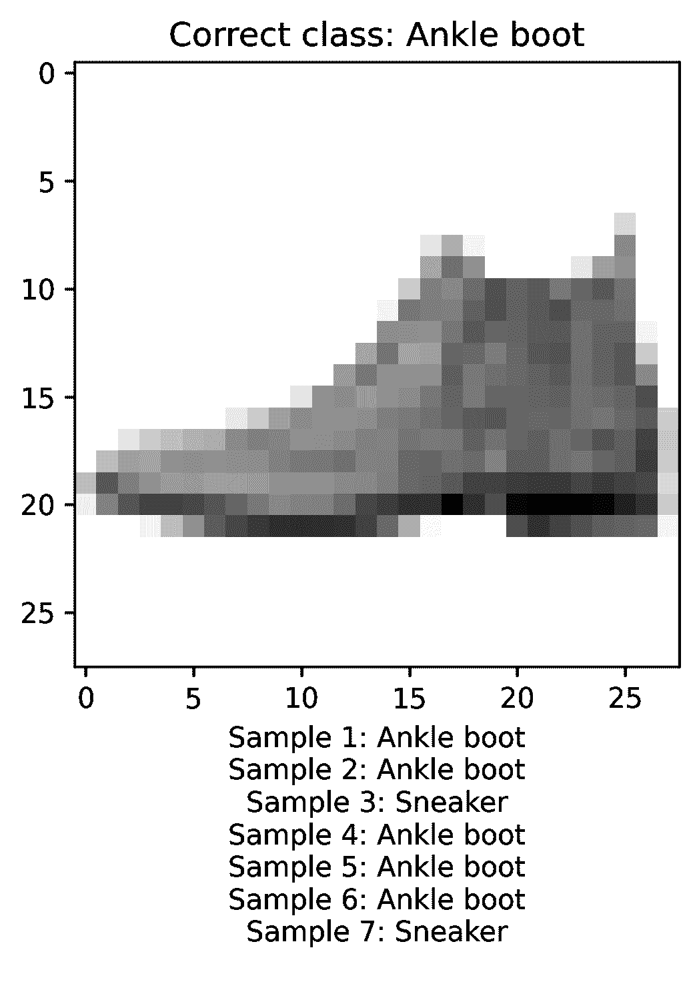

图 5.6：来自采用 BBB 方法训练的网络的七个不同样本中的第一张测试图像的类预测

现在，我们每张图像有了七个预测，我们还可以计算这些预测之间的平均方差，以近似不确定性值：

```py

# calculate variance across model predictions 
var_predictions = tf.reduce_mean( 
tf.math.reduce_variance(softmax_predictions, axis=0), 
    axis=1)
```

例如，时装 MNIST 数据集中第一张测试图像的不确定性值为 0*.*0000002。为了将此不确定性值置于上下文中，让我们从常规 MNIST 数据集加载一些图像，其中包含介于 0 到 9 之间的手写数字，并从我们训练过的模型中获取不确定性值。我们加载数据集，然后再次进行推断并获取不确定性值：

```py

# load regular MNIST data set 
(train_images_mnist, train_labels_mnist), 
(test_images_mnist, test_labels_mnist) = 
tf.keras.datasets.mnist.load_data() 

# get model predictions in MNIST data 
softmax_predictions_mnist = 
tf.stack([bayesian_model.predict( 
test_images_mnist[:NUM_SAMPLES_INFERENCE]) 
for _ in range(NUM_INFERENCES)], axis=0) 

# calculate variance across model predictions in MNIST data 
var_predictions_mnist = tf.reduce_mean( 
tf.math.reduce_variance(softmax_predictions_mnist, axis=0), 
    axis=1)
```

然后，我们可以可视化比较时装 MNIST 数据集中前 50 张图像和常规 MNIST 数据集之间的不确定性值。

在 *图* *5.7* 中，我们可以看到，来自常规 MNIST 数据集的图像的不确定性值远高于时尚 MNIST 数据集的图像。这是预期中的情况，因为我们的模型在训练时只看到了时尚 MNIST 图像，而常规 MNIST 数据集中的手写数字对于我们训练的模型来说是超出分布的。

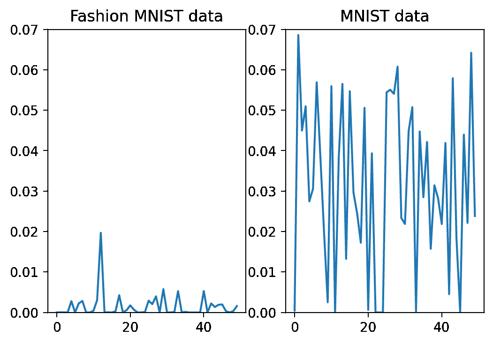

图 5.7：时尚 MNIST 数据集（左）与常规 MNIST 数据集（右）中图像的不确定性值

BBB 可能是最常遇到的高度原则化的贝叶斯深度学习方法，但对于那些关注更好原则性方法的人来说，它并不是唯一的选择。在接下来的章节中，我们将介绍另一种高度原则化的方法，并了解它与 BBB 的区别。

## 5.6 可扩展的贝叶斯深度学习与概率反向传播

BBB 为贝叶斯推断与神经网络的结合提供了很好的介绍，但变分方法有一个关键的缺点：它们依赖于训练和推理时的采样。与标准神经网络不同，我们需要使用一系列 *𝜖* 值从权重参数中进行采样，以生成进行概率训练和推理所需的分布。

在 BBB 被引入的同时，哈佛大学的研究人员也在研究他们自己的贝叶斯推断与神经网络相结合的方法：**概率反向传播**，或称 **PBP**。像 BBB 一样，PBP 的权重也构成了一个分布的参数，在这种情况下是均值和方差权重（使用方差 *σ*²，而不是 *σ*）。实际上，相似之处不仅限于此——我们将看到许多与 BBB 相似的地方，但关键是，我们最终会采用一种不同的 BNN 近似方法，这种方法有其独特的优缺点。那么，让我们开始吧。

为了简化问题，并与各种 PBP 论文保持一致，我们将在阐述 PBP 核心思想时坚持使用单个权重。以下是一个小型神经网络中这些权重如何关联的可视化：

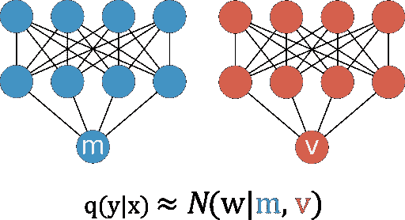

图 5.8：PBP 中神经网络权重的示意图

正如之前所见，我们的网络本质上是由两个子网络组成：一个用于均值权重，或者说 `m`，另一个用于方差权重，或者说 `v`。PBP 的核心思想是，对于每个权重，我们都有一个分布 `P`(`w`|`D`)，我们正在尝试对其进行近似：

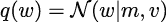

这个符号现在应该很熟悉了，其中 `P`() 是真实（不可解）分布，`q`() 是近似分布。在 PBP 中，如公式 5.18 所示，这是由均值 `m` 和方差 `v` 参数化的高斯分布。

在 BBB 中，我们看到变分学习通过 ELBO 使用 KL 散度确保我们的权重分布收敛到我们的先验 `P`(`w`)。在 PBP 中，我们将再次使用 KL 散度，尽管这一次我们是间接地实现的。我们通过使用一种叫做**假定密度滤波**（**ADF**）的过程来实现这一点。

ADF 是一种快速的顺序方法，用于最小化真实后验 `P`(`w`|`D`) 与某个近似 `q`(`w`|`D`) 之间的 KL 散度。这里的一个关键点是它是一个*顺序*算法：就像我们与标准神经网络一起使用的梯度下降一样，ADF 也是顺序地更新其参数。这使得它特别适合适应神经网络。ADF 算法可以通过两个关键步骤来描述：

1.  初始化我们的参数，`m` = 0，`v` = 1；也就是说，我们从单位高斯 𝒩(0*,*1) 开始。

1.  接下来，我们遍历每个数据点 `x`[`i`] ∈ *`x`*，并使用一组特定的更新方程更新我们的模型参数 `m` 和 `v`，这两个参数分别进行更新。

虽然在本书的范围之外提供 ADF 的完整推导，但你应该知道，在通过 ADF 更新参数时，我们也在最小化 KL 散度。

因此，对于 PBP，我们需要调整典型的神经网络更新规则，使得权重沿着 ADF 的方向进行更新。我们通过以下更新规则来实现这一点，这些规则是从原始 ADF 方程推导出来的：

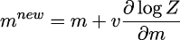![ [ ( ) ] new 2 ∂-log-Z- ∂-log-Z- v = v − v ∂m − 2 ∂v ](img/file134.jpg)

这里，log `Z` 表示高斯边际似然，其定义如下：

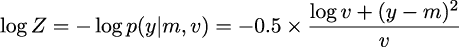

这是**负对数似然**（**NLL**）。方程 5.21 对于我们学习 PBP 的参数至关重要，因为这是我们试图优化的损失函数——所以我们需要花些时间来理解其中的含义。就像我们在 BBB 中的损失（方程 5.9）一样，我们可以看到我们的对数`Z`损失包含了几个重要的信息：

1.  在分子中，我们看到 (`y`−`m`)²。这类似于我们在标准神经网络训练中常见的典型损失（L2 损失）。它包含了目标 `y` 和我们对该值的均值估计 `m` 之间的惩罚。

1.  整个方程给出了 NLL 函数，它描述了我们的目标 `y` 作为我们由 `m` 和 `v` 参数化的分布的联合概率。

这具有一些重要的性质，我们可以通过几个简单的例子来探索。让我们看一下对于给定目标 `y` = 0*.*6，参数 `m` = 0*.*8 和 `v` = 0*.*4 的损失：

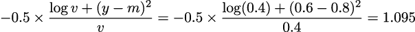

在这里，我们可以看到我们的典型误差，在这种情况下是平方误差，(0*.*6 − 0*.*8)² = 0*.*04，并且我们知道，当`m`趋近于`y`时，这个误差会缩小。此外，似然函数会缩放我们的误差。这很重要，因为一个用于不确定性量化的良好条件模型在错误时会*更不确定*，在正确时会*更自信*。似然函数为我们提供了一种方法，确保在我们对错误预测不确定时，它的似然值较大，而对正确预测时，则较为确定。

我们可以通过替换另一个`v`的值，查看它如何改变 NLL，来观察这个过程。例如，我们可以将方差增加到`v` = 0*.*9：

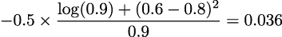

方差的显著增加会导致 NLL 的显著下降。类似地，如果我们对一个正确的预测`m` = `y`有很高的方差，我们会看到 NLL 再次增加：

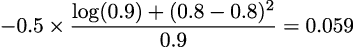

希望通过这个例子，你能看到使用 NLL 损失如何转化为我们输出的良好校准的不确定性估计。实际上，这个属性——利用方差来缩放目标函数——是所有有原则的 BNN 方法的基本组成部分：BBB 也做了这件事，尽管由于需要采样，它在纸面上展示起来有点复杂。

在实现过程中，我们将遇到一些 PBP 的低级细节。它们与 ADF 过程有关，我们鼓励你查看*进一步阅读*部分中的文章，以获得 PBP 和 ADF 的详细推导。

既然我们已经涵盖了 PBP 的核心概念，接下来让我们看看如何使用 TensorFlow 实现它。

## 5.7 实现 PBP

由于 PBP 相当复杂，我们将把它实现为一个类。这样做可以使我们的示例代码更加简洁，并且方便我们将不同的代码块进行模块化。它还将使得实验变得更容易，例如，如果你想探索改变网络中单元或层的数量。

#### 第一步：导入库

我们首先导入各种库。在这个例子中，我们将使用 scikit-learn 的加利福尼亚住房数据集来预测房价：

```py

from typing import List, Union, Iterable 
import math 
from sklearn import datasets 
from sklearn.model_selection import train_test_split 
import tensorflow as tf 
import numpy as np 
from tensorflow.python.framework import tensor_shape 
import tensorflow_probability as tfp
```

为了确保每次生成相同的输出，我们初始化我们的种子值：

```py

RANDOM_SEED = 0 
np.random.seed(RANDOM_SEED) 
tf.random.set_seed(RANDOM_SEED)
```

然后我们可以加载数据集并创建训练集和测试集：

```py

# load the California Housing dataset 
X, y = datasets.fetch_california_housing(return_X_y=True) 
# split the data (X) and targets (y) into train and test sets 
X_train, X_test, y_train, y_test = train_test_split( 
X, y, test_size=0.1, random_state=0 
)
```

#### 第二步：辅助函数

接下来，我们定义两个辅助函数，确保我们的数据格式正确，一个用于输入，另一个用于输出数据：

```py

def ensure_input(x, dtype, input_shape): 
# a function to ensure that our input is of the correct shape 
x = tf.constant(x, dtype=dtype) 
call_rank = tf.rank(tf.constant(0, shape=input_shape, dtype=dtype)) + 1 
if tf.rank(x) *<* call_rank: 
x = tf.reshape(x, [-1, * input_shape.as_list()]) 
return x 

def ensure_output(y, dtype, output_dim): 
# a function to ensure that our output is of the correct shape 
output_rank = 2 
y = tf.constant(y, dtype=dtype) 
if tf.rank(y) *<* output_rank: 
y = tf.reshape(y, [-1, output_dim]) 
    return y
```

我们还将创建一个简短的类来初始化一个伽玛分布：`ReciprocalGammaInitializer`。这个分布被用作 PBP 精度参数*λ*和噪声参数*γ*的先验。

```py

class ReciprocalGammaInitializer: 
def __init__(self, alpha, beta): 
self.Gamma = tfp.distributions.Gamma(concentration=alpha, rate=beta) 

def __call__(self, shape: Iterable, dtype=None): 
g = 1.0 / self.Gamma.sample(shape) 
if dtype: 
g = tf.cast(g, dtype=dtype) 

        return g
```

对这些变量的深入处理对于理解 PBP 并不是必需的。如需进一步了解， 请参见*进一步阅读*部分中列出的 PBP 论文。

#### 第三步：数据准备

在实现这些先决条件后，我们可以对数据进行归一化处理。在这里，我们将数据归一化为均值为零，标准差为单位。这是一个常见的预处理步骤，有助于模型更容易找到合适的权重：

```py

def get_mean_std_x_y(x, y): 
# compute the means and standard deviations of our inputs and targets 
std_X_train = np.std(x, 0) 
std_X_train[std_X_train == 0] = 1 
mean_X_train = np.mean(x, 0) 
std_y_train = np.std(y) 
if std_y_train == 0.0: 
std_y_train = 1.0 
mean_y_train = np.mean(y) 
return mean_X_train, mean_y_train, std_X_train, std_y_train 

def normalize(x, y, output_shape): 
# use the means and standard deviations to normalize our inputs and targets 
x = ensure_input(x, tf.float32, x.shape[1]) 
y = ensure_output(y, tf.float32, output_shape) 
mean_X_train, mean_y_train, std_X_train, std_y_train = get_mean_std_x_y(x, y) 
x = (x - np.full(x.shape, mean_X_train)) / np.full(x.shape, std_X_train) 
y = (y - mean_y_train) / std_y_train 
return x, y 

# run our normalize() function on our data 
x, y = normalize(X_train, y_train, 1)
```

#### 第 4 步：定义我们的模型类

现在我们可以开始定义我们的模型了。我们的模型将由三层组成：两层 ReLU 层和一层线性层。我们使用 Keras 的`Layer`来定义这些层。由于这一层的代码比较长，因此我们将其拆分成几个子部分。

首先，我们继承`Layer`类来创建我们自己的`PBPLayer`并定义`init`方法。我们的初始化方法设置了层中的单元数量：

```py

from tensorflow.keras.initializers import HeNormal 

# a class to handle our PBP layers 
class PBPLayer(tf.keras.layers.Layer): 
def __init__(self, units: int, dtype=tf.float32, *args, **kwargs): 
super().__init__(dtype=tf.as_dtype(dtype), *args, **kwargs) 
self.units = units 
    ...
```

然后我们创建一个`build()`方法，用于定义我们层的权重。正如我们在上一节中讨论的，PBP 包含了*均值*权重和*方差*权重。由于一个简单的 MLP 由乘法组件或权重和偏置组成，我们将权重和偏置分解为均值和方差变量：

```py

... 
def build(self, input_shape): 
input_shape = tensor_shape.TensorShape(input_shape) 
last_dim = tensor_shape.dimension_value(input_shape[-1]) 
self.input_spec = tf.keras.layers.InputSpec( 
min_ndim=2, axes={-1: last_dim} 
) 
self.inv_sqrtV1 = tf.cast( 
1.0 / tf.math.sqrt(1.0 * last_dim + 1), dtype=self.dtype 
) 
self.inv_V1 = tf.math.square(self.inv_sqrtV1) 

over_gamma = ReciprocalGammaInitializer(6.0, 6.0) 
self.weights_m = self.add_weight( 
"weights_mean", shape=[last_dim, self.units], 
initializer=HeNormal(), dtype=self.dtype, trainable=True, 
) 
self.weights_v = self.add_weight( 
"weights_variance", shape=[last_dim, self.units], 
initializer=over_gamma, dtype=self.dtype, trainable=True, 
) 
self.bias_m = self.add_weight( 
"bias_mean", shape=[self.units], 
initializer=HeNormal(), dtype=self.dtype, trainable=True, 
) 
self.bias_v = self.add_weight( 
"bias_variance", shape=[self.units], 
initializer=over_gamma, dtype=self.dtype, trainable=True, 
) 
self.Normal = tfp.distributions.Normal( 
loc=tf.constant(0.0, dtype=self.dtype), 
scale=tf.constant(1.0, dtype=self.dtype), 
) 
self.built = True 
    ...
```

`weights_m`和`weights_v`变量是我们的均值和方差权重，构成了 PBP 模型的核心。我们将在通过模型拟合函数时继续定义`PBPLayer`。现在，我们可以继承该类来创建我们的 ReLU 层：

```py

class PBdivLULayer(PBPLayer): 
@tf.function 
def call(self, x: tf.Tensor): 
"""Calculate deterministic output""" 
# x is of shape [batch, divv_units] 
x = super().call(x) 
z = tf.maximum(x, tf.zeros_like(x))  # [batch, units] 
return z 

@tf.function 
def predict(self, previous_mean: tf.Tensor, previous_variance: tf.Tensor): 
ma, va = super().predict(previous_mean, previous_variance) 
mb, vb = get_bias_mean_variance(ma, va, self.Normal) 
        return mb, vb
```

你可以看到我们重写了两个函数：`call()`和`predict()`函数。`call()`函数调用我们常规的线性`call()`函数，然后应用我们在*第三章*，《深度学习基础》*Chapter 3*中看到的 ReLU 最大操作。`predict()`函数调用我们常规的`predict()`函数，但随后也调用了一个新函数`get_bias_mean_variance()`。该函数以数值稳定的方式计算偏置的均值和方差，如下所示：

```py

def get_bias_mean_variance(ma, va, normal): 
variance_sqrt = tf.math.sqrt(tf.maximum(va, tf.zeros_like(va))) 
alpha = safe_div(ma, variance_sqrt) 
alpha_inv = safe_div(tf.constant(1.0, dtype=alpha.dtype), alpha) 
alpha_cdf = normal.cdf(alpha) 
gamma = tf.where( 
alpha *<* -30, 
-alpha + alpha_inv * (-1 + 2 * tf.math.square(alpha_inv)), 
safe_div(normal.prob(-alpha), alpha_cdf), 
) 
vp = ma + variance_sqrt * gamma 
bias_mean = alpha_cdf * vp 
bias_variance = bias_mean * vp * normal.cdf(-alpha) + alpha_cdf * va * ( 
1 - gamma * (gamma + alpha) 
) 
    return bias_mean, bias_variance
```

在我们定义好层之后，就可以构建我们的网络。我们首先创建一个包含网络中所有层的列表：

```py

units = [50, 50, 1] 
layers = [] 
last_shape = X_train.shape[1] 

for unit in units[:-1]: 
layer = PBdivLULayer(unit) 
layer.build(last_shape) 
layers.append(layer) 
last_shape = unit 
layer = PBPLayer(units[-1]) 
layer.build(last_shape) 
layers.append(layer)
```

然后，我们创建一个`PBP`类，包含模型的`fit()`和`predict()`函数，类似于你在使用 Keras 的`tf.keras.Model`类定义的模型。接下来，我们将看到一些重要的变量；让我们在这里一起了解它们：

+   `alpha`和`beta`：这些是我们伽马分布的参数

+   `Gamma`：一个`tfp.distributions.Gamma()`类的实例，用于我们的伽马分布，它是 PBP 精度参数*λ*的超先验

+   `layers`：这个变量指定了模型中的层数

+   `Normal`：在这里，我们实例化了`tfp.distributions.Normal()`类，它实现了一个高斯概率分布（此处均值为 0，标准差为 1）：

```py

class PBP: 
def __init__( 
self, 
layers: List[tf.keras.layers.Layer], 
dtype: Union[tf.dtypes.DType, np.dtype, str] = tf.float32 
): 
self.alpha = tf.Variable(6.0, trainable=True, dtype=dtype) 
self.beta = tf.Variable(6.0, trainable=True, dtype=dtype) 
self.layers = layers 
self.Normal = tfp.distributions.Normal( 
loc=tf.constant(0.0, dtype=dtype), 
scale=tf.constant(1.0, dtype=dtype), 
) 
self.Gamma = tfp.distributions.Gamma( 
concentration=self.alpha, rate=self.beta 
) 

def fit(self, x, y, batch_size: int = 16, n_epochs: int = 1): 
data = tf.data.Dataset.from_tensor_slices((x, y)).batch(batch_size) 
for epoch_index in range(n_epochs): 
print(f"{epoch_index=}") 
for x_batch, y_batch in data: 
diff_square, v, v0 = self.update_gradients(x_batch, y_batch) 
alpha, beta = update_alpha_beta( 
self.alpha, self.beta, diff_square, v, v0 
) 
self.alpha.assign(alpha) 
self.beta.assign(beta) 

@tf.function 
def predict(self, x: tf.Tensor): 
m, v = x, tf.zeros_like(x) 
for layer in self.layers: 
m, v = layer.predict(m, v) 
return m, v 
    ...
```

`PBP`类的`__init__`函数创建了多个参数，但本质上是通过正态分布和伽马分布初始化我们的*α*和*β*超先验。此外，我们还保存了在上一步创建的层。

`fit()`函数更新我们层的梯度，然后更新*α*和*β*参数。更新梯度的函数定义如下：

```py

... 
@tf.function 
def update_gradients(self, x, y): 
trainables = [layer.trainable_weights for layer in self.layers] 
with tf.GradientTape() as tape: 
tape.watch(trainables) 
m, v = self.predict(x) 
v0 = v + safe_div(self.beta, self.alpha - 1) 
diff_square = tf.math.square(y - m) 
logZ0 = logZ(diff_square, v0) 
grad = tape.gradient(logZ0, trainables) 
for l, g in zip(self.layers, grad): 
l.apply_gradient(g) 
        return diff_square, v, v0
```

在更新梯度之前，我们需要通过网络传播梯度。为此，我们将实现我们的`predict()`方法：

```py

# ... PBPLayer continued 

@tf.function 
def predict(self, previous_mean: tf.Tensor, previous_variance: tf.Tensor): 
mean = ( 
tf.tensordot(previous_mean, self.weights_m, axes=[1, 0]) 
+ tf.expand_dims(self.bias_m, axis=0) 
) * self.inv_sqrtV1 

variance = ( 
tf.tensordot( 
previous_variance, tf.math.square(self.weights_m), axes=[1, 0] 
) 
+ tf.tensordot( 
tf.math.square(previous_mean), self.weights_v, axes=[1, 0] 
) 
+ tf.expand_dims(self.bias_v, axis=0) 
+ tf.tensordot(previous_variance, self.weights_v, axes=[1, 0]) 
) * self.inv_V1 

        return mean, variance
```

现在我们可以通过网络传播值，我们准备好实现我们的损失函数了。正如我们在前一节所看到的，我们使用 NLL（负对数似然），在这里我们将定义它：

```py

pi = tf.math.atan(tf.constant(1.0, dtype=tf.float32)) * 4 
LOG_INV_SQRT2PI = -0.5 * tf.math.log(2.0 * pi) 

@tf.function 
def logZ(diff_square: tf.Tensor, v: tf.Tensor): 
v0 = v + 1e-6 
return tf.reduce_sum( 
-0.5 * (diff_square / v0) + LOG_INV_SQRT2PI - 0.5 * tf.math.log(v0) 
) 

@tf.function 
def logZ1_minus_logZ2(diff_square: tf.Tensor, v1: tf.Tensor, v2: tf.Tensor): 
return tf.reduce_sum( 
-0.5 * diff_square * safe_div(v2 - v1, v1 * v2) 
- 0.5 * tf.math.log(safe_div(v1, v2) + 1e-6) 
    )
```

现在我们可以通过网络传播值，并计算相对于损失的梯度（就像我们在标准神经网络中一样）。这意味着我们可以根据公式 5.19 和 5.20 中的更新规则，分别更新均值权重和方差权重：

```py

# ... PBPLayer continued 

@tf.function 
def apply_gradient(self, gradient): 
dlogZ_dwm, dlogZ_dwv, dlogZ_dbm, dlogZ_dbv = gradient 

# Weights 
self.weights_m.assign_add(self.weights_v * dlogZ_dwm) 
new_mean_variance = self.weights_v - ( 
tf.math.square(self.weights_v) 
* (tf.math.square(dlogZ_dwm) - 2 * dlogZ_dwv) 
) 
self.weights_v.assign(non_negative_constraint(new_mean_variance)) 

# Bias 
self.bias_m.assign_add(self.bias_v * dlogZ_dbm) 
new_bias_variance = self.bias_v - ( 
tf.math.square(self.bias_v) 
* (tf.math.square(dlogZ_dbm) - 2 * dlogZ_dbv) 
) 
        self.bias_v.assign(non_negative_constraint(new_bias_variance))
```

如前一节所讨论，PBP 属于**假设****密度滤波**（**ADF**）方法的类别。因此，我们根据 ADF 的更新规则更新*α*和*β*参数：

```py

def update_alpha_beta(alpha, beta, diff_square, v, v0): 
alpha1 = alpha + 1 
v1 = v + safe_div(beta, alpha) 
v2 = v + beta / alpha1 
logZ2_logZ1 = logZ1_minus_logZ2(diff_square, v1=v2, v2=v1) 
logZ1_logZ0 = logZ1_minus_logZ2(diff_square, v1=v1, v2=v0) 
logZ_diff = logZ2_logZ1 - logZ1_logZ0 
Z0Z2_Z1Z1 = safe_exp(logZ_diff) 
pos_where = safe_exp(logZ2_logZ1) * (alpha1 - safe_exp(-logZ_diff) * alpha) 
neg_where = safe_exp(logZ1_logZ0) * (Z0Z2_Z1Z1 * alpha1 - alpha) 
beta_denomi = tf.where(logZ_diff *>*= 0, pos_where, neg_where) 
beta = safe_div(beta, tf.maximum(beta_denomi, tf.zeros_like(beta))) 

alpha_denomi = Z0Z2_Z1Z1 * safe_div(alpha1, alpha) - 1.0 

alpha = safe_div( 
tf.constant(1.0, dtype=alpha_denomi.dtype), 
tf.maximum(alpha_denomi, tf.zeros_like(alpha)), 
) 

    return alpha, beta
```

#### 步骤 5：避免数值错误

最后，让我们定义一些辅助函数，以确保在拟合过程中避免数值错误：

```py

@tf.function 
def safe_div(x: tf.Tensor, y: tf.Tensor, eps: tf.Tensor = tf.constant(1e-6)): 
_eps = tf.cast(eps, dtype=y.dtype) 
return x / (tf.where(y *>*= 0, y + _eps, y - _eps)) 

@tf.function 
def safe_exp(x: tf.Tensor, BIG: tf.Tensor = tf.constant(20)): 
return tf.math.exp(tf.math.minimum(x, tf.cast(BIG, dtype=x.dtype))) 

@tf.function 
def non_negative_constraint(x: tf.Tensor): 
    return tf.maximum(x, tf.zeros_like(x))
```

#### 步骤 6：实例化我们的模型

就这样：训练 PBP 的核心代码完成了。现在我们准备实例化我们的模型，并在一些数据上进行训练。在这个例子中，我们使用较小的批次大小和一个训练周期：

```py

model = PBP(layers) 
model.fit(x, y, batch_size=1, n_epochs=1)
```

#### 步骤 7：使用我们的模型进行推理

现在我们已经得到了拟合的模型，接下来看看它在测试集上的表现如何。我们首先对测试集进行标准化：

```py

# Compute our means and standard deviations 
mean_X_train, mean_y_train, std_X_train, std_y_train = get_mean_std_x_y( 
X_train, y_train 
) 

# Normalize our inputs 
X_test = (X_test - np.full(X_test.shape, mean_X_train)) / 
np.full(X_test.shape, std_X_train) 

# Ensure that our inputs are of the correct shape 
X_test = ensure_input(X_test, tf.float32, X_test.shape[1])
```

然后我们得到模型预测结果：均值和方差：

```py

m, v = model.predict(X_test)
```

然后我们对这些值进行后处理，以确保它们具有正确的形状，并且在原始输入数据的范围内：

```py

# Compute our variance noise - the baseline variation we observe in our targets 
v_noise = (model.beta / (model.alpha - 1) * std_y_train**2) 

# Rescale our mean values 
m = m * std_y_train + mean_y_train 

# Rescale our variance values 
v = v * std_y_train**2 

# Reshape our variables 
m = np.squeeze(m.numpy()) 
v = np.squeeze(v.numpy()) 
v_noise = np.squeeze(v_noise.numpy().reshape(-1, 1))
```

现在我们得到了预测结果，可以计算我们的模型表现如何。我们将使用标准误差指标 RMSE，以及我们在损失函数中使用的指标：NLL。我们可以使用以下公式计算它们：

```py

rmse = np.sqrt(np.mean((y_test - m) ** 2)) 
test_log_likelihood = np.mean( 
-0.5 * np.log(2 * math.pi * v) 
- 0.5 * (y_test - m) ** 2 / v 
) 
test_log_likelihood_with_vnoise = np.mean( 
-0.5 * np.log(2 * math.pi * (v + v_noise)) 
- 0.5 * (y_test - m) ** 2 / (v + v_noise) 
)
```

评估这两个指标是任何回归任务的好做法，尤其是当你有模型不确定性估计时。RMSE 给出了标准误差指标，它允许你直接与非概率方法进行比较。NLL 则通过评估当模型表现好与表现差时模型的信心，来判断你的方法的校准程度，正如我们在本章前面讨论过的那样。总体来看，这些指标提供了贝叶斯模型性能的全面评估，你会在文献中反复看到它们的应用。

## 5.8 小结

在这一章中，我们学习了两个基础的、原则明确的贝叶斯深度学习模型。BBB 展示了如何利用变分推断高效地从权重空间进行采样并生成输出分布，而 PBP 则展示了通过不进行采样也能获得预测不确定性的可能性。这样，PBP 在计算上比 BBB 更高效，但每个模型都有其优缺点。

在 BBB 的情况下，虽然它在计算效率上不如 PBP，但它也更具适应性（特别是在 TensorFlow 中用于变分层的工具）。我们可以将其应用于各种不同的 DNN 架构，且相对不费力。代价则是在推理和训练时所需的采样：我们需要进行的不仅仅是一次前向传递才能获得输出分布。

相反，PBP 允许我们通过一次传递获得不确定性估计，但正如我们刚才所见，它的实现相当复杂。这使得它在适应其他网络架构时显得有些笨拙，尽管已经有实现（参见*进一步阅读*部分），但鉴于实施的技术开销以及与其他方法相比相对较小的收益，它并不是一种特别实用的方法。

总之，如果你需要稳健且原则清晰的 BNN 近似，并且在推理时不受内存或计算开销的限制，这些方法非常优秀。但如果你有有限的内存和/或计算资源，比如在边缘设备上运行，怎么办？在这种情况下，你可能需要转向更实用的方法来获得预测的不确定性。

在*第六章，使用标准深度学习工具箱的贝叶斯神经网络近似*中，我们将看到如何使用 TensorFlow 中更熟悉的组件来创建更实用的概率神经网络模型。

## 5.9 进一步阅读

+   *神经网络中的权重不确定性*，Charles Blundell *等人*：这篇论文介绍了 BBB，并且是 BDL 文献中的关键文献之一。

+   *神经网络的实用变分推断*，Alex Graves *等人*：这是一篇关于神经网络中使用变分推断的有影响力的论文，介绍了一种简单的随机变分方法，可以应用于各种神经网络架构。

+   *可扩展贝叶斯神经网络学习的概率反向传播*，José Miguel Hernández-Lobato *等人*：BDL 文献中的另一项重要工作，介绍了 PBP，展示了如何通过更具可扩展性的方法实现贝叶斯推断。

+   *概率反向传播的实用考虑*，Matt Benatan *等人*：在这项工作中，作者介绍了使 PBP 更适合实际应用的方法。

+   *用于安全强化学习的完全贝叶斯递归神经网络*，Matt Benatan *等人*：这篇论文展示了如何将 PBP 适应于 RNN 架构，并展示了 BNN 在安全关键系统中的优势。

*`1`* 本书的范围不包括引导读者推导 ELBO，但我们鼓励读者参阅进一步阅读部分中的文本，以获得对 ELBO 更全面的概述。
