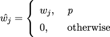
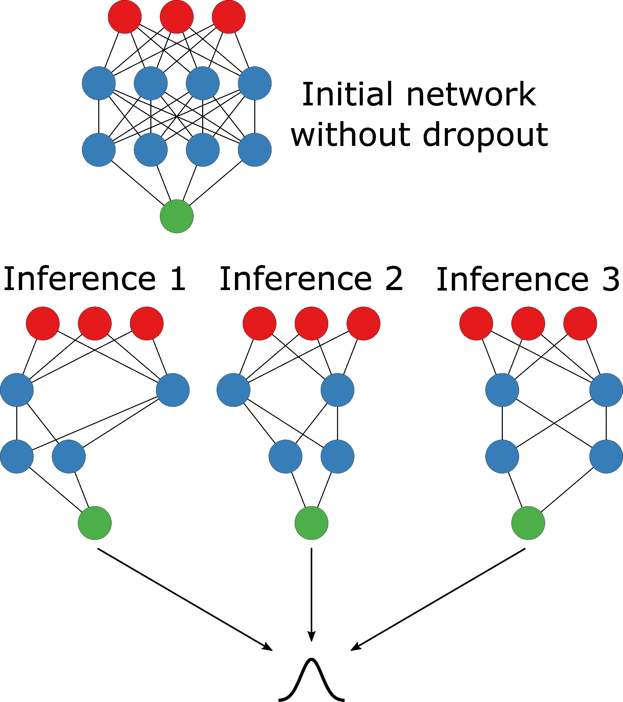
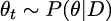
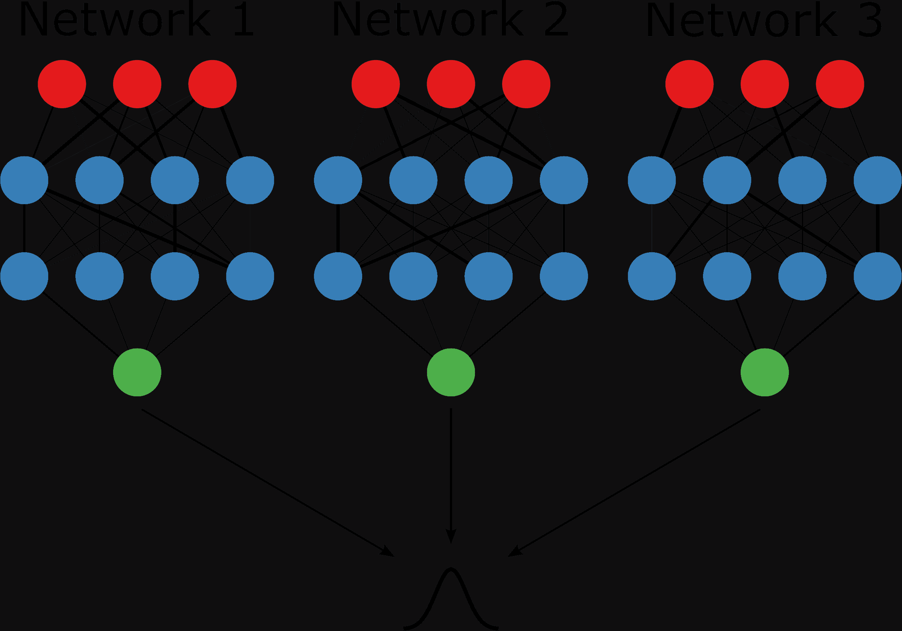
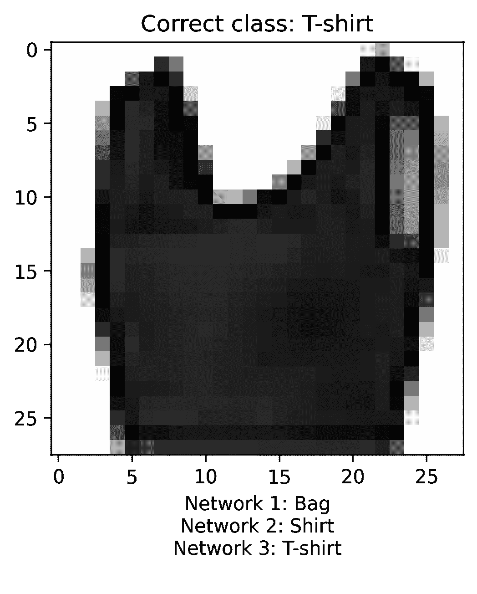
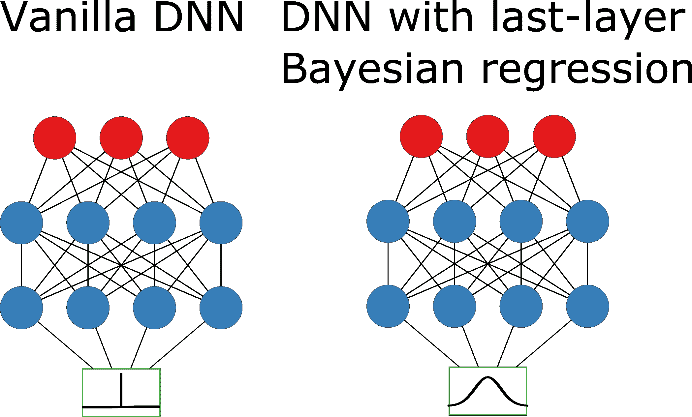
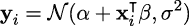
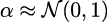
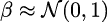
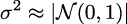

# 第六章

使用标准工具箱进行贝叶斯深度学习

正如我们在前面的章节中看到的，普通的神经网络往往产生较差的不确定性估计，并且往往会做出过于自信的预测，而有些甚至根本无法生成不确定性估计。相比之下，概率架构提供了获得高质量不确定性估计的原则性方法；然而，在扩展性和适应性方面，它们有一些局限性。

尽管 PBP 和 BBB 都可以通过流行的机器学习框架来实现（正如我们在之前的 TensorFlow 示例中所展示的），但它们非常复杂。正如我们在上一章中看到的，实现一个简单的网络也并非易事。这意味着将它们适应到新架构中是一个笨拙且耗时的过程（特别是 PBP，尽管是可能的——参见*完全贝叶斯递归神经网络用于安全强化* *学习*）。对于一些简单任务，例如*第五章，贝叶斯深度学习的原则性方法*中的示例，这并不是问题。但在许多现实世界的任务中，例如

机器翻译或物体识别等任务，需要更为复杂的网络架构。

虽然一些学术机构或大型研究组织可能具备足够的时间和资源来将这些复杂的概率方法适应到各种复杂的架构中，但在许多情况下，这并不可行。此外，越来越多的行业研究人员和工程师正在转向基于迁移学习的方法，使用预训练的网络作为模型的骨干。在这些情况下，简单地将概率机制添加到预定义架构中是不可行的。

为了解决这个问题，本章将探讨如何利用深度学习中的常见范式来开发概率模型。这里介绍的方法表明，通过相对较小的调整，您可以轻松地将大型复杂架构适应到高质量的不确定性估计中。我们甚至会介绍一些技术，使您能够从已训练的网络中获取不确定性估计！

本章将涵盖三种关键方法，以便在常见的深度学习框架中轻松进行模型不确定性估计。首先，我们将介绍**蒙特卡洛 Dropout**（**MC dropout**），一种通过在推理时使用 Dropout 来引入预测方差的方法。其次，我们将介绍深度集成方法，即通过结合多个神经网络来促进不确定性估计和提高模型性能。最后，我们将探索将贝叶斯层添加到模型中的各种方法，使任何模型都能产生不确定性估计。

以下内容将在接下来的章节中讨论：

+   通过 Dropout 引入近似贝叶斯推断

+   使用集成方法进行模型不确定性估计

+   探索通过贝叶斯最后一层方法增强神经网络

## 6.1 技术要求

要完成本章的实际任务，您需要一个 Python 3.8 环境，并安装 SciPy 堆栈以及以下附加的 Python 包：

+   TensorFlow 2.0

+   TensorFlow 概率

本书的所有代码可以在本书的 GitHub 仓库找到：[`github.com/PacktPublishing/Enhancing-Deep-Learning-with-Bayesian-Inference`](https://github.com/PacktPublishing/Enhancing-Deep-Learning-with-Bayesian-Inference)。

## 6.2 通过 dropout 引入近似贝叶斯推断

**Dropout** 传统上用于防止神经网络的过拟合。它最早在 2012 年提出，现在被广泛应用于许多常见的神经网络架构，并且是最简单且最常用的正则化方法之一。Dropout 的核心思想是在训练过程中随机关闭（或丢弃）神经网络的某些单元。因此，模型不能仅依赖某一小部分神经元来解决任务。相反，模型被迫找到不同的方式来完成任务。这提高了模型的鲁棒性，并使其不太可能过拟合。

如果我们简化一个网络为 `y` = *Wx*，其中 `y` 是我们网络的输出，`x` 是输入，`W` 是我们的模型权重，我们可以将 dropout 理解为：



其中 `w[`j`]` 是应用 dropout 后的新权重，`w[`j`]` 是应用 dropout 前的权重，`p` 是我们不应用 dropout 的概率。

原始的 dropout 论文建议随机丢弃网络中 50% 的单元，并对所有层应用 dropout。输入层的 dropout 概率不应相同，因为这意味着我们丢弃了 50% 的输入信息，这会使模型更难收敛。实际上，您可以尝试不同的 dropout 概率，找到最适合您的特定数据集和模型的丢弃率；这是另一个您可以优化的超参数。Dropout 通常作为一个独立的层，在所有标准的神经网络库中都可以找到。您通常在激活函数之后添加它：

```py

from tensorflow.keras import Sequential 
from tensorflow.keras.layers import Flatten, Conv2D, MaxPooling2D, Dropout, Dense 

model = Sequential([ 
Conv2D(32, (3,3), activation="relu", input_shape=(28, 28, 1)), 
MaxPooling2D((2,2)), 
Dropout(0.2), 
Conv2D(64, (3,3), activation="relu"), 
MaxPooling2D((2,2)), 
Dropout(0.5), 
Flatten(), 
Dense(64, activation="relu"), 
Dropout(0.5), 
Dense(10) 
]) 

```

现在我们已经回顾了 dropout 的基本应用，让我们看看如何将其用于贝叶斯推断。

### 6.2.1 使用 dropout 进行近似贝叶斯推断

传统的 dropout 方法使得在测试时 dropout 网络的预测是确定性的，因为在推理过程中关闭了 dropout。然而，我们也可以利用 dropout 的随机性来为我们带来优势。这就是所谓的 **蒙特卡罗 (MC)** dropout，其思想如下：

1.  我们在测试时使用 dropout。

1.  我们不是只运行一次推理，而是运行多次（例如，30-100 次）。

1.  然后我们对预测结果取平均，以获得我们的不确定性估计。

为什么这有益？正如我们之前所说，使用 dropout 可以迫使模型学习解决任务的不同方法。因此，当我们在推理过程中保持启用 dropout 时，我们使用的是稍微不同的网络，这些网络通过模型的不同路径处理输入数据。这种多样性在我们希望获得校准的**不确定性评分**时非常有用，正如我们在下一节中所看到的，我们将讨论深度集成的概念。我们现在不再为每个输入预测一个点估计（一个单一值），而是让网络生成一组值的分布（由多个前向传递组成）。我们可以使用这个分布来计算每个输入数据点的均值和方差，如*图* *6.1*所示。



图 6.1：MC dropout 示例

我们也可以用贝叶斯的方式来解释 MC dropout。使用这些稍微不同的网络进行 dropout 可以看作是从所有可能模型的分布中进行采样：网络所有参数（或权重）上的后验分布：



这里，*𝜃*[`t`]是一个 dropout 配置，∼表示从我们的后验分布`P`(*𝜃*|`D`)中抽取的单个样本。这样，MC dropout 就相当于一种近似贝叶斯推断的方法，类似于我们在*第五章*中看到的方法，*贝叶斯深度学习的原则性方法*。

现在我们已经对 MC dropout 的工作原理有所了解，让我们在 TensorFlow 中实现它。

### 6.2.2 实现 MC dropout

假设我们已经训练了本章第一个实践练习中描述的卷积架构的模型。现在，我们可以通过将`training=True`来在推理过程中使用 dropout：

```py

def mc_dropout_inference( 
imgs: np.ndarray, 
nb_inference: int, 
model: Sequential 
) -*>* np.ndarray: 
"""" 
Run inference nb_inference times with random dropout enabled 
(training=True) 
""" 
divds = [] 
for _ in range(nb_inference): 
divds.append(model(imgs, training=True)) 
return tf.nn.softmax(divds, axis=-1).numpy() 

Predictions = mc_dropout_inference(test_images, 50, model)
```

这使得我们能够为模型的每次预测计算均值和方差。我们的`Predictions`变量的每一行都包含与每个输入相关的预测结果，这些预测是通过连续的前向传递获得的。从这些预测中，我们可以计算均值和方差，如下所示：

```py

predictive_mean = np.mean(predictions, axis=0) 
predictive_variance = np.var(predictions, axis=0)
```

与所有神经网络一样，贝叶斯神经网络需要通过超参数进行一定程度的微调。以下三个超参数对于 MC dropout 尤为重要：

+   **Dropout 层数**：在我们的`Sequential`对象中，使用 dropout 的层数是多少，具体是哪些层。

+   **Dropout 率**：节点被丢弃的概率。

+   **MC dropout 样本数量**：这是 MC dropout 特有的一个新超参数。这里表示为`nb_inference`，它定义了在推理时从 MC dropout 网络中采样的次数。

我们现在已经看到 MC dropout 可以以一种新的方式使用，提供了一种简单直观的方法来利用熟悉的工具计算贝叶斯不确定性。但这并不是我们唯一可以使用的方法。在下一节中，我们将看到如何将集成方法应用于神经网络；这为我们提供了另一种逼近 BNN 的直接方法。

## 6.3 使用集成方法进行模型不确定性估计

本节将介绍深度集成方法：这是一种通过深度网络集成来获得贝叶斯不确定性估计的流行方法。

### 6.3.1 介绍集成方法

机器学习中一个常见的策略是将多个单一模型组合成一个模型委员会。学习这种模型组合的过程称为**集成学习**，而得到的模型委员会则称为集成模型。集成学习包含两个主要部分：首先，多个单一模型需要被训练。有多种策略可以从相同的训练数据中获得不同的模型：可以在不同的数据子集上训练模型，或者训练不同类型的模型或具有不同架构的模型，亦或是使用不同超参数初始化相同类型的模型。其次，需要将不同单一模型的输出进行组合。常见的组合单一模型预测的策略是直接取其平均值，或者对集成模型中的所有成员进行多数投票。更高级的策略包括取加权平均值，或者如果有更多的训练数据，则可以学习一个额外的模型来结合集成成员的不同预测结果。

集成方法在机器学习中非常流行，因为它们通常通过最小化意外选择性能较差模型的风险来提高预测性能。事实上，集成模型至少能够与任何单一模型一样好地执行。更重要的是，如果集成成员的预测存在足够的多样性，集成方法的表现将优于单一模型。这里的多样性意味着不同的集成成员在给定的数据样本上会犯不同的错误。例如，如果一些集成成员将一只狗的图像误分类为“猫”，但大多数集成成员做出了正确的预测（“狗”），那么集成模型的最终输出仍然是正确的（“狗”）。更一般来说，只要每个单一模型的准确率超过 50%，并且模型的错误是独立的，那么随着集成成员数量的增加，集成的预测性能将接近 100%的准确度。

除了提高预测性能外，我们还可以利用集成成员之间的一致性（或不一致性）来获得不确定性估计，并与集成的预测结果一起使用。例如，在图像分类的情况下，如果几乎所有集成成员都预测图像显示的是一只狗，那么我们可以说集成模型以高置信度（或低不确定性）预测为“狗”。相反，如果不同集成成员的预测存在显著的不一致，那么我们将观察到高不确定性，即集成成员输出之间的方差较大，这表明预测的置信度较低。

现在我们已经具备了对集成方法的基本理解，值得指出的是，我们在前一节中探讨的 MC Dropout 也可以看作一种集成方法。当我们在推理过程中启用 Dropout 时，我们实际上每次都在运行一个略有不同的（子）网络。这些不同子网络的组合可以看作是多个模型的委员会，因此也是一种集成方法。这一观察促使谷歌团队研究从深度神经网络（DNN）创建集成的替代方法，最终发现了深度集成（Lakshminarayan 等，2016），这一方法将在接下来的章节中介绍。

### 6.3.2 引入深度集成

深度集成的主要思想很简单：训练多个不同的深度神经网络（DNN）模型，然后通过平均它们的预测结果来提高模型性能，并利用这些模型预测结果的一致性来估计预测的不确定性。

更正式地说，假设我们有一些训练数据`X`，其中 `X` ∈ℝ^(`D`)，以及相应的目标标签`y`。例如，在图像分类中，训练数据是图像，目标标签是表示图像中显示的是哪一类物体的整数，所以 `y` ∈{1*,...,K*}，其中 `K` 是类别的总数。训练一个单一的神经网络意味着我们对标签建模概率预测分布 `p`*𝜃*，并优化 *𝜃*，即神经网络的参数。对于深度集成，我们训练`M`个神经网络，它们的参数可以表示为{*𝜃*[`m`]}[`m`=1]^(`M`)，其中每个 *𝜃*[`m`] 都是使用`X`和`y`独立优化的（这意味着我们在相同的数据上独立训练每个神经网络）。深度集成成员的预测通过平均值进行结合，使用 `p`(`y`|`x`) = `M`^(−1) ∑ [`m`=1]^(`M`)`p`[*𝜃*[m]](`y`|*x,𝜃*[`m`])。

*图* *6.2* 说明了深度集成的思想。在这里，我们训练了 `M` = 3 个不同的前馈神经网络。请注意，每个网络都有自己独特的网络权重集，正如通过连接网络节点的边缘厚度不同所示。三个网络中的每一个都会输出自己的预测分数，如绿色节点所示，我们通过平均这些分数来进行结合。



图 6.2：深度集成示例。请注意，三个网络在权重上有所不同，正如通过不同厚度的边缘所示。

如果只有一个数据集可供训练，我们如何训练多个不同的神经网络模型？原始论文提出的策略（也是目前最常用的策略）是每次训练都从网络权重的随机初始化开始。如果每次训练都从不同的权重集合开始，那么不同的训练运行可能会产生不同的网络，其训练数据的函数逼近方式也会有所不同。这是因为神经网络往往拥有比训练数据集中的样本数量更多的权重参数。因此，训练数据集中的相同观测值可以通过许多不同的权重参数组合来逼近。在训练过程中，不同的神经网络模型将各自收敛到自己的参数组合，并在损失函数的局部最优点上占据不同位置。因此，不同的神经网络通常会对给定的数据样本（例如，一只狗的图像）有不同的看法。这也意味着不同的神经网络在分类数据样本时可能会犯不同的错误。集成中不同网络之间的共识程度提供了关于集成模型对某一数据点预测的置信度信息：网络越一致，我们对预测的信心就越强。

使用相同训练数据集训练不同神经网络模型的替代方法包括：在训练过程中使用迷你批次的随机排序、为每次训练运行使用不同的超参数，或为每个模型使用不同的网络架构。这些策略也可以结合使用，精确理解哪些策略组合能带来最佳结果（无论是预测性能还是预测不确定性）仍然是一个活跃的研究领域。

### 6.3.3 实现深度集成

以下代码示例展示了如何使用随机权重初始化策略训练深度集成模型，以获得不同的集成成员。

#### 步骤 1：导入库

我们首先导入相关的包，并将集成数量设置为`3`，用于本代码示例：

```py

import tensorflow as tf 
import numpy as np 
import matplotlib.pyplot as plt 

ENSEMBLE_MEMBERS = 3
```

#### 步骤 2：获取数据

然后，我们下载`MNIST`` Fashion`数据集，这是一个包含十种不同服装项目图像的数据集：

```py

# download data set 
fashion_mnist = tf.keras.datasets.fashion_mnist 
# split in train and test, images and labels 
(train_images, train_labels), (test_images, test_labels) = fashion_mnist.load_data() 

# set class names 
CLASS_NAMES = ['T-shirt', 'Trouser', 'Pullover', 'Dress', 'Coat', 
               'Sandal', 'Shirt', 'Sneaker', 'Bag', 'Ankle boot']
```

#### 步骤 3：构建集成模型

接下来，我们创建一个辅助函数来定义我们的模型。如你所见，我们使用一个简单的图像分类器结构，包含两个卷积层，每个卷积层后跟一个最大池化操作，以及若干全连接层：

```py

def build_model(): 
# we build a forward neural network with tf.keras.Sequential 
model = tf.keras.Sequential([ 
# we define two convolutional layers followed by a max-pooling operation each 
tf.keras.layers.Conv2D(filters=32, kernel_size=(5,5), padding='same', 
activation='relu', input_shape=(28, 28, 1)), 
tf.keras.layers.MaxPool2D(strides=2), 
tf.keras.layers.Conv2D(filters=48, kernel_size=(5,5), padding='valid', 
activation='relu'), 
tf.keras.layers.MaxPool2D(strides=2), 
# we flatten the matrix output into a vector 
tf.keras.layers.Flatten(), 
# we apply three fully-connected layers 
tf.keras.layers.Dense(256, activation='relu'), 
tf.keras.layers.Dense(84, activation='relu'), 
tf.keras.layers.Dense(10) 
]) 

return model 

```

我们还创建了另一个辅助函数，使用`Adam`作为优化器，并采用类别交叉熵损失来编译模型：

```py

def compile_model(model): 
model.compile(optimizer='adam', 
loss=tf.keras.losses.SparseCategoricalCrossentropy(from_logits=True), 
metrics=['accuracy']) 
return model 

```

#### 步骤 4：训练

然后，我们在相同的数据集上训练三个不同的网络。由于网络权重是随机初始化的，这将导致三个不同的模型。你会看到不同模型的训练准确度略有差异：

```py

deep_ensemble = [] 
for ind in range(ENSEMBLE_MEMBERS): 
model = build_model() 
model = compile_model(model) 
print(f"Train model {ind:02}") 
model.fit(train_images, train_labels, epochs=10) 
    deep_ensemble.append(model)
```

#### 步骤 5：推理

然后，我们可以执行推理并获得测试集中的每个模型对所有图像的预测结果。我们还可以对三个模型的预测结果取平均值，这样每个图像就会有一个预测向量：

```py

# get logit predictions for all three models for images in the test split 
ensemble_logit_predictions = [model(test_images) for model in deep_ensemble] 
# convert logit predictions to softmax 
ensemble_softmax_predictions = [ 
tf.nn.softmax(logits, axis=-1) for logits in ensemble_logit_predictions] 

# take mean across models, this will result in one prediction vector per image 
ensemble_predictions = tf.reduce_mean(ensemble_softmax_predictions, axis=0)
```

就这样。我们已经训练了一个网络集成并进行了推理。由于现在每个图像都有多个预测，我们还可以查看三个模型预测结果不一致的图像。

比如，我们可以找到预测结果不一致最多的图像并将其可视化：

```py

# calculate variance across model predictions 
ensemble_std = tf.reduce_mean( 
tf.math.reduce_variance(ensemble_softmax_predictions, axis=0), 
axis=1) 
# find index of test image with highest variance across predictions 
ind_disagreement = np.argmax(ensemble_std) 

# get predictions per model for test image with highest variance 
ensemble_disagreement = [] 
for ind in range(ENSEMBLE_MEMBERS): 
model_prediction = np.argmax(ensemble_softmax_predictions[ind][ind_disagreement]) 
ensemble_disagreement.append(model_prediction) 
# get class predictions 
predicted_classes = [CLASS_NAMES[ind] for ind in ensemble_disagreement] 

# define image caption 
image_caption = \ 
f"Network 1: {predicted_classes[0]}\n" + \ 
f"Network 2: {predicted_classes[1]}\n" + \ 
f"Network 3: {predicted_classes[2]}\n" 

# visualise image and predictions 
plt.figure() 
plt.title(f"Correct class: {CLASS_NAMES[test_labels[ind_disagreement]]}") 
plt.imshow(test_images[ind_disagreement], cmap=plt.cm.binary) 
plt.xlabel(image_caption) 
plt.show()
```

看看*图* *6.3*中的图像，甚至对于人类来说，也很难判断图像中是 T 恤、衬衫还是包：



图 6.3：集成预测中方差最大的图像。正确的真实标签是"t-shirt"，但即使是人类也很难判断。

虽然我们已经看到深度集成有几个有利的特性，但它们也不是没有局限性。在下一节中，我们将探讨在考虑深度集成时可能需要注意的事项。

### 6.3.4 深度集成的实际局限性

从研究环境到大规模生产环境中应用集成模型时，一些实际局限性变得显而易见。我们知道，理论上，随着我们增加更多的集成成员，集成模型的预测性能和不确定性估计会有所提升。然而，增加更多集成成员是有代价的，因为集成模型的内存占用和推理成本会随着集成成员数量的增加而线性增长。这可能使得在生产环境中部署集成模型成为一个高成本的选择。对于我们添加到集成中的每一个神经网络，我们都需要存储一组额外的网络权重，这会显著增加内存需求。同样，对于每个网络，我们还需要在推理过程中进行额外的前向传递。尽管不同网络的推理可以并行进行，因此推理时间的影响可以得到缓解，但这种方法仍然需要比单一模型更多的计算资源。由于更多的计算资源往往意味着更高的成本，使用集成模型与单一模型之间的决策需要在更好的性能和不确定性估计的好处与成本增加之间进行权衡。

最近的研究尝试解决或减轻这些实际限制。例如，在一种叫做 BatchEnsembles（[**?**]）的方法中，所有集成成员共享一个基础权重矩阵。每个集成成员的最终权重矩阵是通过将该共享权重矩阵与一个唯一的秩一矩阵按元素相乘得到的，这个秩一矩阵对每个集成成员都是唯一的。这减少了每增加一个集成成员需要存储的参数数量，从而减小了内存占用。BatchEnsembles 的计算成本也得到了降低，因为它们可以利用向量化，并且所有集成成员的输出可以在一次前向传递中计算出来。在另一种方法中，称为**多输入/多输出**处理（**MIMO**；[**?**]），单个网络被鼓励学习多个独立的子网络。在训练过程中，多个输入与多个相应标注的输出一起传递。例如，网络会被呈现三张图片：一张狗的、一张猫的和一张鸡的。相应的输出标签也会传递，网络需要学习在第一个输出节点上预测“狗”，在第二个输出节点上预测“猫”，在第三个输出节点上预测“鸡”。在推理过程中，一张单独的图片会被重复三次，MIMO 集成会产生三个不同的预测（每个输出节点一个）。因此，MIMO 方法的内存占用和计算成本几乎与单一神经网络相当，同时仍能提供集成方法的所有优势。

## 6.4 探索贝叶斯最后一层方法在神经网络增强中的应用

通过*第五章*、《*贝叶斯深度学习的原则方法*》和*第六章*、《*使用标准工具箱进行贝叶斯深度学习*》，我们探索了多种用于深度神经网络（DNN）的贝叶斯推理方法。这些方法在每一层中都引入了某种形式的不确定性信息，无论是通过显式的概率方法，还是通过基于集成或丢弃法的近似。这些方法有其独特的优势。它们一致的贝叶斯（或者更准确地说，近似贝叶斯）机制意味着它们是一致的：相同的原理在每一层都得到应用，无论是在网络架构还是更新规则方面。这使得从理论角度解释它们变得更容易，因为我们知道任何理论上的保证都适用于每一层。除此之外，这还意味着我们能够在每一层访问不确定性：我们可以像在标准深度学习模型中利用嵌入一样，利用这些网络中的嵌入，并且我们将能够同时访问这些嵌入的不确定性。

然而，这些网络也有一些缺点。正如我们所看到的，像 PBP 和 BBB 这样的算法具有更复杂的机制，这使得它们更难应用于更复杂的神经网络架构。本章前面讨论的内容表明，我们可以通过使用 MC dropout 或深度集成来绕过这些问题，但它们会增加我们的计算和/或内存开销。此时，**贝叶斯最后一层**（**BLL**）方法（参见*图* *6.4*）便派上用场。这类方法既能让我们灵活地使用任何神经网络架构，同时比 MC dropout 或深度集成方法在计算和内存上更为高效。



图 6.4: Vanilla NN 与 BLL 网络的比较

正如你可能已经猜到的，BLL 方法背后的基本原理是仅在最后一层估计不确定性。但是你可能没有猜到的是，为什么这会成为可能。深度学习的成功归因于神经网络的非线性特性：连续的非线性变换使其能够学习高维数据的丰富低维表示。然而，这种非线性使得模型不确定性估计变得困难。线性模型的模型不确定性估计有现成的封闭形式解，但不幸的是，对于我们高度非线性的 DNN 来说，情况并非如此。那么，我们能做什么呢？

幸运的是，DNN 学到的表示也可以作为更简单线性模型的输入。通过这种方式，我们让 DNN 来承担繁重的工作：将高维输入空间压缩为特定任务的低维表示。因此，神经网络中的倒数第二层要处理起来容易得多；毕竟，在大多数情况下，我们的输出仅仅是该层的某种线性变换。这意味着我们可以将线性模型应用于该层，这也意味着我们可以应用封闭形式解来进行模型不确定性估计。

我们也可以利用其他最后一层方法；最近的研究表明，当仅在最后一层应用时，MC dropout 也很有效。尽管这仍然需要多次前向传播，但这些前向传播只需在单一层中完成，因此在计算上更加高效，尤其是对于较大的模型。

### 6.4.1 贝叶斯推理的最后一层方法

Jasper Snoek 等人在他们 2015 年的论文《*可扩展* *贝叶斯优化使用深度神经网络*》中提出的方法，引入了使用事后贝叶斯线性回归器来获得 DNN 模型不确定性的概念。该方法被设计为一种实现类似高斯过程的高质量不确定性估计的方式，并且具有更好的可扩展性。

该方法首先涉及在一些数据`X`和目标`y`上训练一个神经网络（NN）。这个训练阶段训练一个线性输出层，`z[`i`]`，结果是一个生成点估计的网络（这在标准的深度神经网络中是典型的）。然后，我们将倒数第二层（或最后一层隐藏层）`z`[`i`−1]作为我们的基础函数集。从这里开始，只需要将最后一层替换为贝叶斯线性回归器。现在，我们的网络将生成预测的均值和方差，而不是点估计。关于该方法和自适应基础回归的更多细节，请参阅 Jasper Snoek 等人的论文，以及 Christopher Bishop 的*模式识别与机器学习*。

现在，让我们看看如何通过代码实现这一过程。

#### 步骤 1：创建和训练我们的基础模型

首先，我们设置并训练我们的网络：

```py

from tensorflow.keras import Model, Sequential, layers, optimizers, metrics, losses 
import tensorflow as tf 
import tensorflow_probability as tfp 
from sklearn.datasets import load_boston 
from sklearn.model_selection import train_test_split 
from sklearn.preprocessing import StandardScaler 
from sklearn.metrics import mean_squared_error 
import pandas as pd 
import numpy as np 

seed = 213 
np.random.seed(seed) 
tf.random.set_seed(seed) 
dtype = tf.float32 

boston = load_boston() 
data = boston.data 
targets = boston.target 

X_train, X_test, y_train, y_test = train_test_split(data, targets, test_size=0.2) 

# Scale our inputs 
scaler = StandardScaler() 
X_train = scaler.fit_transform(X_train) 
X_test = scaler.transform(X_test) 

model = Sequential() 
model.add(layers.Dense(20, input_dim=13, activation='relu', name='layer_1')) 
model.add(layers.Dense(8, activation='relu', name='layer_2')) 
model.add(layers.Dense(1, activation='relu', name='layer_3')) 

model.compile(optimizer=optimizers.Adam(), 
loss=losses.MeanSquaredError(), 
metrics=[metrics.RootMeanSquaredError()],) 

num_epochs = 200 
model.fit(X_train, y_train, epochs=num_epochs) 
mse, rmse = model.evaluate(X_test, y_test)
```

#### 步骤 2：使用神经网络层作为基础函数

现在我们已经有了基础网络，我们只需要访问倒数第二层，这样我们就可以将其作为基础函数传递给我们的贝叶斯回归器。这可以通过使用 TensorFlow 的高级 API 轻松完成，例如：

```py

basis_func = Model(inputs=self.model.input, 
                           outputs=self.model.get_layer('layer_2').output)
```

这将构建一个模型，允许我们通过简单地调用其`predict`方法来获得第二个隐藏层的输出：

```py

layer_2_output = basis_func.predict(X_test)
```

这就是我们为传递给贝叶斯线性回归器准备基础函数所需要做的一切。

#### 步骤 3：为贝叶斯线性回归准备我们的变量

对于贝叶斯回归器，我们假设我们的输出，`y[`i`]` ∈ `y`，根据与输入`x[`i`]` ∈ `X`的线性关系条件地服从正态分布：



这里，*α*是我们的偏置项，*β*是我们的模型系数，*σ*²是与我们的预测相关的方差。我们还将对这些参数做出一些先验假设，即：



请注意，公式 6.6 表示的是高斯分布的半正态分布。为了将贝叶斯回归器包装成易于（且实用地）与我们的 Keras 模型集成的形式，我们将创建一个`BayesianLastLayer`类。这个类将使用 TensorFlow Probability 库，使我们能够实现贝叶斯回归器所需的概率分布和采样函数。让我们逐步了解我们类的各个组件：

```py

class BayesianLastLayer(): 

def __init__(self, 
model, 
basis_layer, 
n_samples=1e4, 
n_burnin=5e3, 
step_size=1e-4, 
n_leapfrog=10, 
adaptive=False): 
# Setting up our model 
self.model = model 
self.basis_layer = basis_layer 
self.initialize_basis_function() 
# HMC Settings 
# number of hmc samples 
self.n_samples = int(n_samples) 
# number of burn-in steps 
self.n_burnin = int(n_burnin) 
# HMC step size 
self.step_size = step_size 
# HMC leapfrog steps 
self.n_leapfrog = n_leapfrog 
# whether to be adaptive or not 
        self.adaptive = adaptive
```

如我们所见，我们的类在实例化时至少需要两个参数：`model`，即我们的 Keras 模型；和`basis``_layer`，即我们希望馈送给贝叶斯回归器的层输出。接下来的参数都是**哈密顿蒙特卡罗**（**HMC**）采样的参数，我们为其定义了一些默认值。根据输入的不同，这些值可能需要调整。例如，对于更高维度的输入（例如，如果你使用的是`layer``_1`），你可能希望进一步减小步长并增加燃烧期步骤的数量以及总体样本数。

#### 第 4 步：连接我们的基础函数模型

接下来，我们简单定义几个函数，用于创建我们的基础函数模型并获取其输出：

```py

def initialize_basis_function(self): 
self.basis_func = Model(inputs=self.model.input, 
outputs=self.model.get_layer(self.basis_layer).output) 

def get_basis(self, X): 
        return self.basis_func.predict(X)
```

#### 第 5 步：创建适配贝叶斯线性回归参数的方法

现在事情变得有些复杂。我们需要定义`fit()`方法，它将使用 HMC 采样来找到我们的模型参数*α*、*β*和*σ*²。我们将在这里提供代码做了什么的概述，但关于采样的更多（实践）信息，我们推荐读者参考 Osvaldo Martin 的《Python 贝叶斯分析》。

首先，我们使用方程 4.3-4.5 中描述的先验定义一个联合分布。得益于 TensorFlow Probability 的`distributions`模块，这非常简单：

```py

def fit(self, X, y): 
X = tf.convert_to_tensor(self.get_basis(X), dtype=dtype) 
y = tf.convert_to_tensor(y, dtype=dtype) 
y = tf.reshape(y, (-1, 1)) 
D = X.shape[1] 

# Define our joint distribution 
distribution = tfp.distributions.JointDistributionNamedAutoBatched( 
dict( 
sigma=tfp.distributions.HalfNormal(scale=tf.ones([1])), 
alpha=tfp.distributions.Normal( 
loc=tf.zeros([1]), 
scale=tf.ones([1]), 
), 
beta=tfp.distributions.Normal( 
loc=tf.zeros([D,1]), 
scale=tf.ones([D,1]), 
), 
y=lambda beta, alpha, sigma: 
tfp.distributions.Normal( 
loc=tf.linalg.matmul(X, beta) + alpha, 
scale=sigma 
) 
) 
) 
. . .
```

然后，我们使用 TensorFlow Probability 的`HamiltonianMonteCarlo`采样器类来设置我们的采样器。为此，我们需要定义目标对数概率函数。`distributions`模块使得这一过程相当简单，但我们仍然需要定义一个函数，将我们的模型参数传递给分布对象的`log``_prob()`方法（第 28 行）。然后我们将其传递给`hmc``_kernel`的实例化：

```py

. . . 
# Define the log probability function 
def target_log_prob_fn(beta, alpha, sigma): 
return distribution.log_prob(beta=beta, alpha=alpha, sigma=sigma, y=y) 

# Define the HMC kernel we'll be using for sampling 
hmc_kernel  = tfp.mcmc.HamiltonianMonteCarlo( 
target_log_prob_fn=target_log_prob_fn, 
step_size=self.step_size, 
num_leapfrog_steps=self.n_leapfrog 
) 

# We can use adaptive HMC to automatically adjust the kernel step size 
if self.adaptive: 
adaptive_hmc = tfp.mcmc.SimpleStepSizeAdaptation( 
inner_kernel = hmc_kernel, 
num_adaptation_steps=int(self.n_burnin * 0.8) 
) 
. . .
```

现在一切已经设置好，我们准备运行采样器了。为此，我们调用`mcmc.sample``_chain()`函数，传入我们的 HMC 参数、模型参数的初始状态和我们的 HMC 采样器。然后我们运行采样，它会返回`states`，其中包含我们的参数样本，以及`kernel``_results`，其中包含一些关于采样过程的信息。我们关心的信息是关于接受样本的比例。如果采样器运行成功，我们将有一个较高比例的接受样本（表示接受率很高）。如果采样器没有成功，接受率会很低（甚至可能是 0%！），这时我们可能需要调整采样器的参数。我们会将这个信息打印到控制台，以便随时监控接受率（我们将对`sample``_chain()`的调用封装在`run``_chain()`函数中，这样它可以扩展为多链采样）：

```py

. . . 
# If we define a function, we can extend this to multiple chains. 
@tf.function 
def run_chain(): 
states, kernel_results = tfp.mcmc.sample_chain( 
num_results=self.n_samples, 
num_burnin_steps=self.n_burnin, 
current_state=[ 
tf.zeros((X.shape[1],1), name='init_model_coeffs'), 
tf.zeros((1), name='init_bias'), 
tf.ones((1), name='init_noise'), 
], 
kernel=hmc_kernel 
) 
return states, kernel_results 

print(f'Running HMC with {self.n_samples} samples.') 
states, kernel_results = run_chain() 

print('Completed HMC sampling.') 
coeffs, bias, noise_std = states 
accepted_samples = kernel_results.is_accepted[self.n_burnin:] 
acceptance_rate = 100*np.mean(accepted_samples) 
# Print the acceptance rate - if this is low, we need to check our 
# HMC parameters 
        print('Acceptance rate: %0.1f%%' % (acceptance_rate))
```

一旦我们运行了采样器，我们就可以获取我们的模型参数。我们从后燃烧样本中提取它们，并将其分配给类变量，以便后续推断使用：

```py

# Obtain the post-burnin samples 
self.model_coeffs = coeffs[self.n_burnin:,:,0] 
self.bias = bias[self.n_burnin:] 
        self.noise_std = noise_std[self.n_burnin:]
```

#### 第 6 步：推断

我们需要做的最后一件事是实现一个函数，利用我们联合分布的学习到的参数来进行预测。为此，我们将定义两个函数：`get``_divd``_dist()`，它将根据我们的输入获取后验预测分布；以及`predict()`，它将调用`get``_divd``_dist()`并计算我们后验分布的均值（*μ*）和标准差（*σ*）：

```py

def get_divd_dist(self, X): 
predictions = (tf.matmul(X, tf.transpose(self.model_coeffs)) + 
self.bias[:,0]) 
noise = (self.noise_std[:,0] * 
tf.random.normal([self.noise_std.shape[0]])) 
return predictions + noise 

def predict(self, X): 
X = tf.convert_to_tensor(self.get_basis(X), dtype=dtype) 
divd_dist = np.zeros((X.shape[0], self.model_coeffs.shape[0])) 
X = tf.reshape(X, (-1, 1, X.shape[1])) 
for i in range(X.shape[0]): 
divd_dist[i,:] = self.get_divd_dist(X[i,:]) 

y_divd = np.mean(divd_dist, axis=1) 
y_std = np.std(divd_dist, axis=1) 
        return y_divd, y_std
```

就这样！我们实现了 BLL！通过这个类，我们可以通过使用倒数第二层神经网络作为贝叶斯回归的基函数，获得强大而有原则的贝叶斯不确定性估计。使用它的方法非常简单，只需传入我们的模型并定义我们希望使用哪个层作为基函数：

```py

bll = BayesianLastLayer(model, 'layer_2') 

bll.fit(X_train, y_train) 

y_divd, y_std = bll.predict(X_test)
```

虽然这是一个强大的工具，但并不总是适合当前任务。你可以自己进行实验：尝试创建一个更大的嵌入层。随着层的大小增加，你应该会看到采样器的接受率下降。一旦它变得足够大，接受率甚至可能下降到 0%。因此，我们需要修改采样器的参数：减少步长，增加样本数，并增加烧入样本数。随着嵌入维度的增加，获取一个代表性样本集来描述分布变得越来越困难。

对于一些应用来说，这不是问题，但在处理复杂的高维数据时，这可能很快成为一个问题。计算机视觉、语音处理和分子建模等领域的应用都依赖于高维嵌入。这里的一个解决方案是进一步降低这些嵌入的维度，例如通过降维。但这样做可能会对这些编码产生不可预测的影响：事实上，通过降低维度，你可能会无意中去除一些不确定性的来源，从而导致更差的质量的不确定性估计。

那么，我们能做些什么呢？幸运的是，我们可以使用一些其他的最后一层选项。接下来，我们将看看如何使用最后一层的丢弃法（dropout）来逼近这里介绍的贝叶斯线性回归方法。

### 6.4.2 最后一层 MC 丢弃

在本章早些时候，我们看到如何在测试时使用丢弃法获取模型预测的分布。在这里，我们将这个概念与最后一层不确定性概念结合：添加一个 MC 丢弃层，但仅作为我们添加到预训练网络中的一个单一层。

#### 步骤 1：连接到我们的基础模型

与贝叶斯最后一层方法类似，我们首先需要从模型的倒数第二层获取输出：

```py

basis_func = Model(inputs=model.input, 
                   outputs=model.get_layer('layer_2').output)
```

#### 步骤 2：添加 MC 丢弃层

现在，我们不再实现一个贝叶斯回归器，而是简单地实例化一个新的输出层，应用丢弃法（dropout）到倒数第二层：

```py

ll_dropout = Sequential() 
ll_dropout.add(layers.Dropout(0.25)) 
ll_dropout.add(layers.Dense(1, input_dim=8, activation='relu', name='dropout_layer'))
```

#### 步骤 3：训练 MC 丢弃的最后一层

因为我们现在增加了一个新的最终层，我们需要进行额外的训练步骤，让它能够学习从倒数第二层到新输出的映射；但由于我们原始模型已经完成了大部分工作，这个训练过程既计算成本低，又运行快速：

```py

ll_dropout.compile(optimizer=optimizers.Adam(), 
loss=losses.MeanSquaredError(), 
metrics=[metrics.RootMeanSquaredError()],) 
num_epochs = 50 
ll_dropout.fit(basis_func.predict(X_train), y_train, epochs=num_epochs)
```

#### 第 4 步：获取不确定性

现在我们的最后一层已经训练完成，我们可以实现一个函数，通过对 MC dropout 层进行多次前向传递来获取预测的均值和标准差；从第 3 行开始应该和本章前面的内容相似，第 2 行只是获取我们原始模型倒数第二层的输出：

```py

def predict_ll_dropout(X, basis_func, ll_dropout, nb_inference): 
basis_feats = basis_func(X) 
ll_divd = [ll_dropout(basis_feats, training=True) for _ in range(nb_inference)] 
ll_divd = np.stack(ll_divd) 
    return ll_divd.mean(axis=0), ll_divd.std(axis=0)
```

#### 第 5 步：推理

剩下的就是调用这个函数，获取我们的新模型输出，并附带不确定性估计：

```py

y_divd, y_std = predict_ll_dropout(X_test, basis_func, ll_dropout, 50)
```

最后一层 MC dropout 迄今为止是从预训练网络中获得不确定性估计的最简单方法。与标准的 MC dropout 不同，它不需要从头开始训练模型，因此你可以将其应用于你已经训练好的网络。此外，与其他最后一层方法不同，它只需要几个简单的步骤即可实现，并且始终遵循 TensorFlow 的标准 API。

### 6.4.3 最后一层方法回顾

最后一层方法是当你需要从预训练网络中获取不确定性估计时的一个极好的工具。考虑到神经网络训练的高昂成本和耗时，能够在不从头开始的情况下仅因为需要预测不确定性而避免重新训练，实在是非常便利。此外，随着越来越多的机器学习从业者依赖于最先进的预训练模型，这些技术在事后结合模型不确定性是一个非常实用的方法。

但是，最后一层方法也有其缺点。与其他方法不同，我们依赖的是一个相对有限的方差来源：我们模型的倒数第二层。这限制了我们能够在模型输出上引入的随机性，因此我们有可能会面临过于自信的预测。在使用最后一层方法时请记住这一点，如果你看到过度自信的典型迹象，考虑使用更全面的方法来获取预测的不确定性。

## 6.5 小结

在这一章中，我们看到了如何利用熟悉的机器学习和深度学习概念开发带有预测不确定性的模型。我们还看到了，通过相对少量的修改，我们可以将不确定性估计添加到预训练模型中。这意味着我们可以超越标准神经网络的点估计方法：利用不确定性获得关于模型性能的宝贵见解，从而使我们能够开发更稳健的应用。

然而，就像*第五章*，*贝叶斯深度学习的原则方法*中介绍的方法一样，所有技术都有其优点和缺点。例如，最后一层方法可能使我们能够向任何模型添加不确定性，但它们受到模型已经学习到的表示的限制。这可能导致输出的方差非常低，从而产生过于自信的模型。同样，集成方法虽然允许我们捕获网络每一层的方差，但它们需要显著的计算成本，需要我们有多个网络，而不仅仅是单个网络。

在接下来的章节中，我们将更详细地探讨优缺点，并学习如何解决这些方法的一些缺点。
