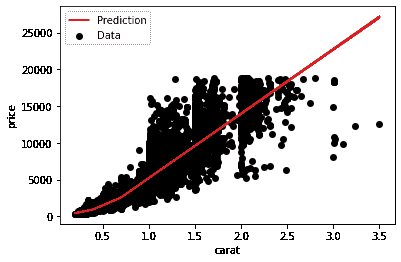

# 第七章

贝叶斯深度学习的实际考虑

在过去的两章中，*第五章*，*贝叶斯深度学习的原则性方法* 和 *第六章*，*使用标准工具箱进行贝叶斯深度学习*，我们介绍了一系列能够促进神经网络贝叶斯推断的方法。*第五章*，*贝叶斯深度学习的原则性方法* 介绍了专门设计的贝叶斯神经网络近似方法，而 *第六章*，*使用标准工具箱进行贝叶斯深度学习* 展示了如何使用机器学习的标准工具箱为我们的模型添加不确定性估计。这些方法家族各有其优缺点。在本章中，我们将探讨一些在实际场景中的差异，以帮助您理解如何为当前任务选择最佳方法。

我们还将探讨不同来源的不确定性，这有助于提升您对数据的理解，或根据不确定性的来源帮助您选择不同的异常路径。例如，如果一个模型因输入数据本身的噪声而产生不确定性，您可能需要将数据交给人类进行审查。然而，如果模型因未见过的输入数据而产生不确定性，将该数据添加到模型中可能会有所帮助，这样模型就能减少对这类数据的不确定性。贝叶斯深度学习技术能够帮助您区分这些不确定性的来源。以下部分将详细介绍这些内容：

+   平衡不确定性质量和计算考虑

+   BDL 与不确定性来源

## 7.1 技术要求

要完成本章的实际任务，您需要一个 Python 3.8 环境，安装有 SciPy 和 scikit-learn 堆栈，并且还需要安装以下额外的 Python 包：

+   TensorFlow 2.0

+   TensorFlow 概率

本书的所有代码都可以在书籍的 GitHub 仓库中找到：[`github.com/PacktPublishing/Enhancing-Deep-Learning-with-Bayesian-Inference`](https://github.com/PacktPublishing/Enhancing-Deep-Learning-with-Bayesian-Inference)。

## 7.2 平衡不确定性质量和计算考虑

虽然贝叶斯方法有许多优点，但在内存和计算开销方面也有需要考虑的权衡。这些因素在选择适用于实际应用的最佳方法时起着至关重要的作用。

在本节中，我们将考察不同方法在性能和不确定性质量方面的权衡，并学习如何使用 TensorFlow 的性能分析工具来衡量不同模型的计算成本。

### 7.2.1 设置实验环境

为了评估不同模型的性能，我们需要一些不同的数据集。其一是加利福尼亚住房数据集，scikit-learn 已经方便地提供了这个数据集。我们将使用的其他数据集是常见于不确定性模型比较论文中的：葡萄酒质量数据集和混凝土抗压强度数据集。让我们来看看这些数据集的详细信息：

+   **加利福尼亚住房**：这个数据集包含了从 1990 年加利福尼亚人口普查中得出的不同地区的多个特征。因变量是房屋价值，以每个住宅区的中位房价表示。在较早的论文中，您会看到使用波士顿住房数据集；由于波士顿住房数据集存在伦理问题，现在更倾向于使用加利福尼亚住房数据集。

+   **葡萄酒质量**：葡萄酒质量数据集包含与不同葡萄酒的化学成分相关的特征。我们要预测的值是葡萄酒的主观质量。

+   **混凝土抗压强度**：混凝土抗压强度数据集的特征描述了用于混合混凝土的成分，每个数据点代表不同的混凝土配方。因变量是混凝土的抗压强度。

以下实验将使用本书 GitHub 仓库中的代码（ [`github.com/PacktPublishing/Bayesian-Deep-Learning`](https://github.com/PacktPublishing/Bayesian-Deep-Learning)），我们在前几章中已经见过不同形式的代码示例。示例假定我们从这个仓库内部运行代码。

#### 导入我们的依赖库

像往常一样，我们将首先导入我们的依赖库：

```py

import tensorflow as tf 
import numpy as np 
import matplotlib.pyplot as plt 
import tensorflow_probability as tfp 
from sklearn.metrics import accuracy_score, mean_squared_error 
from sklearn.datasets import fetch_california_housing, load_diabetes 
from sklearn.model_selection import train_test_split 
import seaborn as sns 
import pandas as pd 
import os 

from bayes_by_backprop import BBBRegressor 
from pbp import PBP 
from mc_dropout import MCDropout 
from ensemble import Ensemble 
from bdl_ablation_data import load_wine_quality, load_concrete 
from bdl_metrics import likelihood
```

在这里，我们可以看到我们正在使用仓库中定义的多个模型类。虽然这些类支持不同架构的模型，但它们将使用默认结构，该结构在 `constants.py` 中定义。该结构包含一个 64 个单元的密集连接隐藏层，以及一个密集连接的输出层。BBB 和 PBP 等价物将使用并在各自的类中定义为其默认架构。

#### 准备数据和模型

现在我们需要准备数据和模型以运行实验。首先，我们将设置一个字典，便于我们遍历并访问不同数据集中的数据：

```py

datasets = { 
"california_housing": fetch_california_housing(return_X_y=True, as_frame=True), 
"diabetes": load_diabetes(return_X_y=True, as_frame=True), 
"wine_quality": load_wine_quality(), 
"concrete": load_concrete(), 
}
```

接下来，我们将创建另一个字典，以便我们可以遍历不同的 BDL 模型：

```py

models = { 
"BBB": BBBRegressor, 
"PBP": PBP, 
"MCDropout": MCDropout, 
"Ensemble": Ensemble, 
}
```

最后，我们将创建一个字典来保存我们的结果：

```py

results = { 
"LL": [], 
"MSE": [], 
"Method": [], 
"Dataset": [], 
}
```

在这里，我们看到我们将记录两个结果：对数似然和均方误差。我们使用这些指标是因为我们在处理回归问题，但对于分类问题，您可以选择使用 F 分数或准确度替代均方误差，使用预期校准误差替代（或与）对数似然。我们还将在 `Method` 字段中存储模型类型，在 `Dataset` 字段中存储数据集。

#### 运行我们的实验

现在我们准备开始运行实验了。然而，我们不仅对模型性能感兴趣，还对我们各种模型的计算考虑因素感兴趣。因此，我们将在接下来的代码中看到对`tf.profiler`的调用。首先，我们将设置一些参数：

```py

# Parameters 
epochs = 10 
batch_size = 16 
logdir_base = "profiling"
```

在这里，我们设置每个模型的训练周期数以及每个模型将使用的批次大小。我们还设置了`logdir_base`，即所有分析日志的存储位置。

现在我们准备好插入实验代码了。我们将首先遍历数据集：

```py

for dataset_key in datasets.keys(): 
X, y = datasets[dataset_key] 
X_train, X_test, y_train, y_test = train_test_split(X, y, test_size=0.33) 
    ...
```

在这里，我们看到对于每个数据集，我们将数据拆分，使用的数据进行训练，使用的数据进行测试。

接下来，我们遍历模型：

```py

... 
for model_key in models.keys(): 
logdir = os.path.join(logdir_base, model_key + "_train") 
os.makedirs(logdir, exist_ok=True) 
tf.profiler.experimental.start(logdir) 
    ...
```

对于每个模型，我们实例化一个新的日志目录来记录训练信息。然后我们实例化模型并运行`model.fit()`：

```py

... 
model = models[model_key]() 
        model.fit(X_train, y_train, batch_size=batch_size, n_epochs=epochs)
```

一旦模型拟合完成，我们停止分析器，并创建一个新目录来记录预测信息，之后我们再次启动分析器：

```py

... 
tf.profiler.experimental.stop() 
logdir = os.path.join(logdir_base, model_key + "_predict") 
os.makedirs(logdir, exist_ok=True) 
tf.profiler.experimental.start(logdir) 
        ...
```

在分析器运行的情况下，我们进行预测，然后再次停止分析器。手头有了预测后，我们可以计算均方误差和对数似然，并将其存储到`results`字典中。最后，我们在每次实验结束后运行`tf.keras.backend.clear_session()`来清理 TensorFlow 图：

```py

... 
y_divd, y_var = model.predict(X_test) 

tf.profiler.experimental.stop() 

y_divd = y_divd.reshape(-1) 
y_var = y_var.reshape(-1) 

mse = mean_squared_error(y_test, y_divd) 
ll = likelihood(y_test, y_divd, y_var) 
results["MSE"].append(mse) 
results["LL"].append(ll) 
results["Method"].append(model_key) 
results["Dataset"].append(dataset_key) 
tf.keras.backend.clear_session() 
...
```

一旦我们获得了所有模型和所有数据集的结果，我们将结果字典转换为 pandas DataFrame：

```py

... 
results = pd.DataFrame(results)
```

现在我们准备好分析数据了！

### 7.2.2 分析模型性能

利用从实验中获得的数据，我们可以绘制图表，查看哪些模型在不同的数据集上表现最佳。为此，我们将使用以下绘图代码：

```py

results['NLL'] = -1*results['LL'] 

i = 1 
for dataset in datasets.keys(): 
for metric in ["NLL", "MSE"]: 
df_plot = results[(results['Dataset']==dataset)] 
df_plot = groupedvalues = df_plot.groupby('Method').sum().reset_index() 
plt.subplot(3,2,i) 
ax = sns.barplot(data=df_plot, x="Method", y=metric) 
for index, row in groupedvalues.iterrows(): 
if metric == "NLL": 
ax.text(row.name, 0, round(row.NLL, 2), 
color='white', ha='center') 
else: 
ax.text(row.name, 0, round(row.MSE, 2), 
color='white', ha='center') 
plt.title(dataset) 
if metric == "NLL" and dataset == "california_housing": 
plt.ylim(0, 100) 
i+=1 
fig = plt.gcf() 
fig.set_size_inches(10, 8) 
plt.tight_layout()
```

请注意，最初我们将`'NLL'`字段添加到 pandas DataFrame 中。这为我们提供了负对数似然。这使得查看图表时不那么混乱，因为对于均方误差和负对数似然，较低的值是更好的。

代码遍历数据集和度量，借助 Seaborn 绘图库生成一些漂亮的条形图。此外，我们还使用`ax.text()`调用将度量值叠加到条形图上，以便清晰地看到数值。

还要注意，对于加利福尼亚住房数据，我们将负对数似然中的*y*值限制在 100。这是因为，在这个数据集中，我们的负对数似然值*极其*高，使得它与其他值一起显示时变得困难。因此，我们叠加了度量值，以便在某些值超过图表限制时，能够更容易地进行比较。


图 7.1：LL 和 MSE 实验结果的条形图

值得注意的是，为了公平比较，我们在所有模型中使用了等效的架构，使用了相同的批次大小，并进行了相同次数的训练周期。

如我们所见，并没有一种单一的最佳方法：每种模型根据数据的不同表现不同，而且具有较低均方误差的模型并不保证也会有较低的负对数似然分数。一般来说，MC dropout 表现出最差的均方误差分数；然而，它也产生了在我们实验中观察到的最佳负对数似然分数，对于葡萄酒质量数据集，它达到了 2.9 的负对数似然。这是因为，尽管它在误差方面通常表现较差，但它的不确定性非常高。因此，由于在其错误的区域表现出更大的不确定性，它会产生更有利的负对数似然分数。如果我们将误差与不确定性绘制出来，就能看到这一点：


图 7.2：误差与不确定性估计的散点图

在*图* *7.2*中，我们可以看到左侧图中是 BBB、PBP 和集成方法的结果，而右侧图则是 MC dropout 的结果。原因在于，MC dropout 的不确定性估计比其他方法高出两个数量级，因此它们无法在同一坐标轴上清晰地表示。这些极高的不确定性也是其相对较低负对数似然分数的原因。这是 MC dropout 的一个相当令人惊讶的例子，因为它通常是*过于自信的*，而在这种情况下，它显然是*不自信的*。

尽管 MC dropout 的低自信可能会导致更好的似然分数，但这些度量需要在具体背景下进行考虑；我们通常希望在似然与误差之间取得良好的平衡。因此，在葡萄酒质量数据集的情况下，PBP 可能是最佳选择，因为它具有最低的误差，同时也有合理的似然；它的负对数似然并不低到让人怀疑，但又足够低，可以知道其不确定性估计将会是合理一致和有原则的。

对于其他数据集，选择会更直接一些：对于加利福尼亚住房数据集，BBB 显然是最优选择，而在混凝土抗压强度数据集的情况下，PBP 再次被证明是最为理智的选择。需要注意的是，这些网络并未针对这些数据集进行专门优化：这只是一个说明性示例。

关键在于，最终决定将取决于具体应用以及强健的不确定性估计有多重要。例如，在安全关键的场景中，你会希望选择具有最强健不确定性估计的方法，因此你可能会偏向于选择低自信而非较低的误差，因为你想确保只有在对模型结果非常有信心时才会使用该模型。在这些情况下，你可能会选择一种不自信但高概率（低负概率）的方法，比如在葡萄酒质量数据集上的 MC dropout。

在其他情况下，也许不需要考虑不确定性，这时你可能会选择一个标准的神经网络。但在大多数关键任务或安全关键型应用中，你会希望找到一个平衡点，利用模型不确定性估计提供的附加信息，同时保持较低的错误率。然而，实际上，在开发机器学习系统时，性能指标并不是唯一需要考虑的因素。我们还关心实际的应用影响。在下一部分，我们将看看这些模型的计算要求如何相互比较。

### 7.2.3 贝叶斯深度学习模型的计算考虑

对于机器学习的每一个现实世界应用，除了性能之外，还有其他考虑因素：我们还需要理解计算基础设施的实际限制。它们通常由几个因素决定，但现有的基础设施和成本往往反复出现。

现有基础设施通常很重要，因为除非是一个全新的项目，否则需要解决如何将机器学习模型集成的问题，这意味着要么找到现有的计算资源，要么请求额外的硬件或软件资源。成本是一个显著的因素也不足为奇：每个项目都有预算，机器学习解决方案的开销需要与其带来的优势相平衡。预算往往会决定哪些机器学习解决方案是可行的，这取决于训练、部署和推理时所需计算资源的成本。

为了深入了解这些方法在计算要求方面的比较，我们将查看我们实验代码中包含的 TensorFlow 性能分析器的输出。为此，我们只需从命令行运行 TensorBoard，并指向我们感兴趣的特定模型的日志目录：

```py

tensorboard --logdir profiling/BBB_train/
```

这将启动一个 TensorBoard 实例（通常在 http://localhost:6006/）。将 URL 复制到浏览器中，你将看到 TensorBoard 的图形用户界面（GUI）。TensorBoard 为你提供了一套工具，用于理解 TensorFlow 模型的性能，从执行时间到不同进程的内存分配。你可以通过屏幕左上角的 **Tools** 选择框浏览可用的工具：


图 7.3：TensorBoard 图形用户界面的工具选择框

要更详细地了解发生了什么，请查看追踪查看器（Trace Viewer）：


图 7.4：TensorBoard 图形用户界面中的追踪查看器

在这里，我们可以获得一个整体视图，展示运行模型函数所需的时间，以及一个详细的视图，展示哪些进程在后台运行，以及每个进程的运行时间。我们甚至可以通过双击一个模块查看其统计信息。例如，我们可以双击 **train** 模块：


图 7.5：TensorBoard 图形界面中的追踪查看器，突出显示训练模块

这将在屏幕底部显示一些信息。这使我们能够密切检查此过程的运行时间。如果我们点击 **持续时间**，则会得到此过程的详细运行时统计数据：


图 7.6：在 TensorBoard 追踪查看器中检查模块的统计数据

在这里，我们看到该过程运行了 10 次（每个 epoch 运行一次），平均持续时间为 144,527,053 纳秒（ns）。让我们使用混凝土抗压强度数据集的性能分析结果，并通过 TensorBoard 收集运行时和内存分配信息。如果我们为每个模型的训练过程都进行此操作，就能得到以下信息：

|  |  | **模型训练的性能分析数据** |  |
| --- | --- | --- | --- |

|

* * *

|

* * *

|

* * *

|

* * *

|

| **模型** |  | **峰值内存使用量（MiB）** | **持续时间（ms）** |
| --- | --- | --- | --- |

|

* * *

|

* * *

|

* * *

|

* * *

|

| **BBB** |  | 0.09 | 4270 |
| --- | --- | --- | --- |
| **PBP** |  | 0.253 | 10754 |
| **MC Dropout** |  | 0.126 | 2198 |
| **集成模型** |  | 0.215 | 20630 |

|

* * *

|

* * *

|

* * *

|

* * *

|

|  |  |  |  |
| --- | --- | --- | --- |

图 7.7：混凝土抗压强度数据集模型训练的性能分析数据表

在这里，我们看到 MC dropout 是该数据集中训练速度最快的模型，训练时间仅为 BBB 的一半。我们还看到，尽管集成模型只包含 5 个模型，但其训练时间远远是最久的，几乎是 MC dropout 的 10 倍。就内存使用而言，我们看到集成模型的表现较差，而 PBP 是所有模型中内存最消耗的，BBB 则具有最低的峰值内存使用量。

但并非仅仅训练才是关键。我们还需要考虑推理的计算成本。查看我们模型预测函数的性能分析数据，我们看到如下信息：

|  |  | **模型预测的性能分析数据** |  |
| --- | --- | --- | --- |

|

* * *

|

* * *

|

* * *

|

* * *

|

| **模型** |  | **峰值内存使用量（MiB）** | **持续时间（ms）** |
| --- | --- | --- | --- |

|

* * *

|

* * *

|

* * *

|

* * *

|

| **BBB** |  | 0.116 | 849 |
| --- | --- | --- | --- |
| **PBP** |  | 1.27 | 176 |
| **MC Dropout** |  | 0.548 | 23 |
| **集成模型** |  | 0.389 | 17 |

|

* * *

|

* * *

|

* * *

|

* * *

|

|  |  |  |  |
| --- | --- | --- | --- |

图 7.8：混凝土抗压强度数据集模型预测的性能分析数据表

有趣的是，在模型推理速度方面，集成方法领先，而在预测时的峰值内存使用上也位居第二。相比之下，PBP 的峰值内存使用最高，而 BBB 推理所需的时间最长。

这里有多种因素导致了我们看到的结果。首先，需要注意的是，这些模型都没有针对计算性能进行优化。例如，我们可以通过并行训练所有集成成员来显著缩短集成方法的训练时长，而在这里我们并没有这么做。类似地，由于 PBP 在实现中使用了大量的高级代码（不同于其他方法，这些方法都是基于优化过的 TensorFlow 或 TensorFlow Probability 代码），因此其性能受到影响。

最关键的是，我们需要确保在选择适合的模型时，既要考虑计算影响，也要考虑典型的性能指标。那么，考虑到这一点，我们如何选择合适的模型呢？

### 7.2.4 选择合适的模型

有了我们的性能指标和分析信息，我们拥有了选择适合任务的模型所需的所有数据。但模型选择并不容易；正如我们在这里看到的，所有模型都有其优缺点。

如果我们从性能指标开始，那么我们看到 BBB 的均方误差最低，但它的负对数似然值却非常高。所以，仅从性能指标来看，最佳选择是 PBP：它的负对数似然得分最低，且均方误差也远远好于 MC dropout 的误差，这使得 PBP 在综合考虑下成为最佳选择。

然而，如果我们查看*图* *7.7* 和 *7.8*中的计算影响，我们会发现 PBP 在内存使用和执行时间方面都是最差的选择。在这里，综合来看，最好的选择是 MC dropout：它的预测时间仅比集成方法稍慢，而且训练时长最短。

归根结底，这完全取决于应用：也许推理不需要实时运行，那么我们可以选择 PBP 实现。或者，也许推理时间和低误差是我们关注的重点，在这种情况下，集成方法是一个不错的选择。正如我们在这里看到的，指标和计算开销需要在具体情况下加以考虑，正如任何一类机器学习模型一样，并没有一个适用于所有应用的最佳选择。一切都取决于选择合适的工具来完成工作。

在本节中，我们介绍了用于全面理解模型性能的工具，并演示了在选择模型时考虑多种因素的重要性。从根本上讲，性能分析和分析配置文件对帮助我们做出正确的实际选择与帮助我们发现进一步改进的机会同样重要。我们可能没有时间进一步优化代码，因此可能需要务实地选择我们手头上最优化的计算方法。或者，业务需求可能决定我们需要选择性能最好的模型，这可能值得花时间优化代码并减少某种方法的计算开销。在下一节中，我们将进一步探讨使用 BDL 方法时的另一个重要实际考虑因素，学习如何使用这些方法更好地理解不确定性的来源。

## 7.3 BDL 与不确定性来源

在这个案例研究中，我们将探讨如何在回归问题中建模 aleatoric 和 epistemic 不确定性，目标是预测一个连续的结果变量。我们将使用一个现实世界的钻石数据集，该数据集包含了超过 50,000 颗钻石的物理属性以及它们的价格。特别地，我们将关注钻石的重量（以 **克拉** 测量）和钻石价格之间的关系。

#### 步骤 1：设置环境

为了设置环境，我们导入了几个包。我们导入 `tensorflow` 和 `tensorflow_probability` 用于构建和训练传统的和概率神经网络，导入 `tensorflow_datasets` 用于导入钻石数据集，导入 `numpy` 用于对数值数组进行计算和操作（如计算均值），导入 `pandas` 用于处理 DataFrame，导入 `matplotlib` 用于绘图：

```py

import matplotlib.pyplot as plt 
import numpy as np 
import pandas as pd 
import tensorflow as tf 
import tensorflow_probability as tfp 
import tensorflow_datasets as tfds
```

首先，我们使用 `tensorflow_datasets` 提供的 `load` 函数加载钻石数据集。我们将数据集加载为一个 `pandas` DataFrame，这对于准备训练和推理数据非常方便。

```py

ds = tfds.load('diamonds', split='train') 
df = tfds.as_dataframe(ds)
```

数据集包含了钻石的许多不同属性，但在这里我们将重点关注克拉和价格，通过选择 DataFrame 中相应的列：

```py

df = df[["features/carat", "price"]]
```

然后，我们将数据集分为训练集和测试集。我们使用 80% 的数据进行训练，20% 的数据进行测试：

```py

train_df = df.sample(frac=0.8, random_state=0) 
test_df = df.drop(train_df.index)
```

为了进一步处理，我们将训练和测试 DataFrame 转换为 NumPy 数组：

```py

carat = np.array(train_df['features/carat']) 
price = np.array(train_df['price']) 
carat_test = np.array(test_df['features/carat']) 
price_test = np.array(test_df['price'])
```

我们还将训练样本的数量保存到一个变量中，因为我们在模型训练过程中需要它：

```py

NUM_TRAIN_SAMPLES = carat.shape[0]
```

最后，我们定义了一个绘图函数。这个函数将在接下来的案例研究中派上用场。它允许我们绘制数据点以及拟合模型的预测值和标准差：

```py

def plot_scatter(x_data, y_data, x_hat=None, y_hats=None, plot_std=False): 
# Plot the data as scatter points 
plt.scatter(x_data, y_data, color="k", label="Data") 
# Plot x and y values predicted by the model, if provided 
if x_hat is not None and y_hats is not None: 
if not isinstance(y_hats, list): 
y_hats = [y_hats] 
for ind, y_hat in enumerate(y_hats): 
plt.plot( 
x_hat, 
y_hat.mean(), 
color="#e41a1c", 
label="prediction" if ind == 0 else None, 
) 
# Plot standard deviation, if requested 
if plot_std: 
for ind, y_hat in enumerate(y_hats): 
plt.plot( 
x_hat, 
y_hat.mean() + 2 * y_hat.stddev(), 
color="#e41a1c", 
linestyle="dashed", 
label="prediction + stddev" if ind == 0 else None, 
) 
plt.plot( 
x_hat, 
y_hat.mean() - 2 * y_hat.stddev(), 
color="#e41a1c", 
linestyle="dashed", 
label="prediction - stddev" if ind == 0 else None, 
) 
# Plot x- and y-axis labels as well as a legend 
plt.xlabel("carat") 
plt.ylabel("price") 
    plt.legend()
```

使用这个函数，我们可以通过运行以下代码来首次查看训练数据：

```py

plot_scatter(carat, price)
```

训练数据分布如 *图 7.9* 所示。我们观察到，克拉和钻石价格之间的关系是非线性的，随着克拉数的增加，价格的增长速度也更快。


图 7.9：钻石克拉数与价格之间的关系

#### 步骤 2：拟合一个不带不确定性的模型

完成设置后，我们可以开始为数据拟合回归模型。首先，我们拟合一个神经网络模型，但不对预测中的不确定性进行量化。这使我们能够建立一个基准，并引入一些对本案例研究中所有模型都非常有用的工具（以函数的形式）。

建议对神经网络模型的输入特征进行归一化。在本示例中，这意味着对钻石的克拉重量进行归一化。归一化输入特征将使模型在训练过程中收敛得更快。`tensorflow.keras` 提供了一个方便的归一化函数，可以帮助我们实现这一点。我们可以按如下方式使用它：

```py

normalizer = tf.keras.layers.Normalization(input_shape=(1,), axis=None) 
normalizer.adapt(carat)
```

我们还需要一个损失函数，理想情况下，该损失函数可以用于本案例研究中的所有模型。回归模型可以表示为 *P*(*y*|*x,w*)，即给定输入 *x* 和模型参数 *w* 的标签 *y* 的概率分布。我们可以通过最小化负对数似然损失 −*logP*(*y*|*x*) 来拟合此类模型。用 `Python` 代码表示时，可以编写一个函数，该函数将真实结果值 `y_true` 和预测结果分布 `y_divd` 作为输入，并返回在预测结果分布下的结果值的负对数似然值，该方法由 `tensorflow_probability` 中的 `distributions` 模块提供的 `log_prob()` 实现：

```py

def negloglik(y_true, y_divd): 
    return -y_divd.log_prob(y_true)
```

有了这些工具，我们可以构建第一个模型。我们使用刚才定义的归一化函数来归一化模型的输入。然后，我们在其上堆叠两个全连接层。第一个全连接层包含 32 个节点，这使我们能够建模数据中观察到的非线性关系。第二个全连接层包含一个节点，用于将模型的预测压缩为一个单一的值。重要的是，我们不使用第二个全连接层产生的输出作为模型的最终输出。相反，我们使用该全连接层的输出作为正态分布均值的参数化，这意味着我们正在使用正态分布来建模真实标签。我们还将正态分布的方差设为 1。参数化分布的均值并将方差设为固定值，意味着我们正在建模数据的总体趋势，但尚未量化模型预测中的不确定性：

```py

model = tf.keras.Sequential( 
[ 
normalizer, 
tf.keras.layers.Dense(32, activation="relu"), 
tf.keras.layers.Dense(1), 
tfp.layers.DistributionLambda( 
lambda t: tfp.distributions.Normal(loc=t, scale=1) 
), 
] 
)
```

正如我们在之前的案例研究中看到的，训练模型时，我们使用`compile()`和`fit()`函数。在模型编译时，我们指定了`Adam`优化器和之前定义的损失函数。对于`fit`函数，我们指定了希望在克拉和价格数据上训练模型 100 个周期：

```py

# Compile 
model.compile(optimizer=tf.optimizers.Adam(learning_rate=0.01), loss=negloglik) 
# Fit 
model.fit(carat, price, epochs=100, verbose=0)
```

然后，我们可以通过我们的`plot_scatter()`函数获得模型在保留测试数据上的预测，并可视化所有结果：

```py

# Define range for model input 
carat_hat = tf.linspace(carat_test.min(), carat_test.max(), 100) 
# Obtain model's price predictions on test data 
price_hat = model(carat_hat) 
# Plot test data and model predictions 
plot_scatter(carat_test, price_test, carat_hat, price_hat)
```

这将生成以下图表：


图 7.10：没有不确定性的钻石测试数据预测

我们可以在*图* *7.10*中看到，模型捕捉到了数据的非线性趋势。随着钻石重量的增加，模型预测的价格也随着重量的增加而迅速上升。

然而，数据中还有另一个显而易见的趋势是模型未能捕捉到的。我们可以观察到，随着重量的增加，价格的变异性越来越大。在低重量时，我们仅观察到拟合线周围少量的散布，但在较高重量时，散布增大。我们可以将这种变异性视为问题的固有特性。也就是说，即使我们有更多的训练数据，我们仍然无法完美地预测价格，尤其是在高重量时。这种类型的变异性就是随机不确定性，我们在*第四章*中首次遇到过，将在下一小节中仔细探讨。

#### 第三步：拟合带有随机不确定性的模型

我们可以通过预测正态分布的标准差来考虑模型中的随机不确定性，除了预测其均值之外。和之前一样，我们构建了一个带有标准化层和两个全连接层的模型。然而，这次第二个全连接层将输出两个值，而不是一个。第一个输出值将再次用于参数化正态分布的均值。但第二个输出值将参数化正态分布的方差，从而使我们能够量化模型预测中的随机不确定性：

```py

model_aleatoric = tf.keras.Sequential( 
[ 
normalizer, 
tf.keras.layers.Dense(32, activation="relu"), 
tf.keras.layers.Dense(2), 
tfp.layers.DistributionLambda( 
lambda t: tfp.distributions.Normal( 
loc=t[..., :1], scale=1e-3 + tf.math.softplus(0.05 * t[..., 1:]) 
) 
), 
] 
)
```

我们再次在重量和价格数据上编译并拟合模型：

```py

# Compile 
model_aleatoric.compile( 
optimizer=tf.optimizers.Adam(learning_rate=0.05), loss=negloglik 
) 
# Fit 
model_aleatoric.fit(carat, price, epochs=100, verbose=0)
```

现在，我们可以获得并可视化测试数据的预测结果。请注意，这次我们传递了`plot_std=True`，以便同时绘制预测输出分布的标准差：

```py

carat_hat = tf.linspace(carat_test.min(), carat_test.max(), 100) 
price_hat = model_aleatoric(carat_hat) 
plot_scatter( 
carat_test, price_test, carat_hat, price_hat, plot_std=True, 
)
```

我们现在已经训练了一个模型，表示数据固有的变异性。*图* *7.11*中的虚线误差条显示了价格作为重量函数的预测变异性。我们可以观察到，模型确实对重量超过 1 克拉时的价格预测不太确定，这反映了我们在较高重量范围内观察到的数据的较大散布。


图 7.11：包含随机不确定性的钻石测试数据预测

#### 第四步：拟合带有认知不确定性的模型

除了偶然性不确定性，我们还需要处理认知不确定性——这种不确定性来源于我们的模型，而不是数据本身。回顾一下*图 7.11*，例如，实线代表我们模型预测的均值，它似乎能合理地捕捉数据的趋势。然而，由于训练数据有限，我们无法百分之百确定我们找到了数据分布的真实均值。也许真实均值实际上略大于或略小于我们估计的值。在这一部分，我们将研究如何建模这种不确定性，我们还将看到，通过观察更多的数据，认知不确定性是可以减少的。

模型认知不确定性的技巧再次是，将我们神经网络中的权重表示为分布，而不是点估计。我们可以通过将之前使用的密集层替换为`tensorflow_probability`中的 DenseVariational 层来实现这一点。在底层，这将实现我们在*第五章*中首次学习到的 BBB 方法，*贝叶斯深度学习的原则方法*。简而言之，使用 BBB 时，我们通过变分学习原理来学习网络权重的后验分布。为了实现这一点，我们需要定义先验和后验分布函数。

请注意，在*第五章*中展示的 BBB 代码示例，*贝叶斯深度学习的原则方法*使用了预定义的`tensorflow_probability`模块来处理 2D 卷积和密集层，并应用重参数化技巧，这样我们就隐式地定义了先验和后验函数。在本示例中，我们将自己定义密集层的先验和后验函数。

我们从定义密集层权重的先验开始（包括内核和偏置项）。先验分布描述了我们在观察到任何数据之前，对权重的猜测不确定性。它可以通过一个多元正态分布来定义，其中均值是可训练的，方差固定为 1：

```py

def prior(kernel_size, bias_size=0, dtype=None): 
n = kernel_size + bias_size 
return tf.keras.Sequential( 
[ 
tfp.layers.VariableLayer(n, dtype=dtype), 
tfp.layers.DistributionLambda( 
lambda t: tfp.distributions.Independent( 
tfp.distributions.Normal(loc=t, scale=1), 
reinterpreted_batch_ndims=1, 
) 
), 
] 
    )
```

我们还定义了变分后验。变分后验是我们观察到训练数据后，密集层权重分布的近似值。我们再次使用多元正态分布：

```py

def posterior(kernel_size, bias_size=0, dtype=None): 
n = kernel_size + bias_size 
c = np.log(np.expm1(1.0)) 
return tf.keras.Sequential( 
[ 
tfp.layers.VariableLayer(2 * n, dtype=dtype), 
tfp.layers.DistributionLambda( 
lambda t: tfp.distributions.Independent( 
tfp.distributions.Normal( 
loc=t[..., :n], 
scale=1e-5 + tf.nn.softplus(c + t[..., n:]), 
), 
reinterpreted_batch_ndims=1, 
) 
), 
] 
    )
```

有了这些先验和后验函数，我们就能定义我们的模型。和之前一样，我们使用归一化层对输入进行归一化，然后堆叠两个密集层。但这一次，密集层将把它们的参数表示为分布，而不是点估计。我们通过将`tensorflow_probability`中的 DenseVariational 层与我们的先验和后验函数结合使用来实现这一点。最终的输出层是一个正态分布，其方差设置为 1，均值由前一个 DenseVariational 层的输出来参数化：

```py

def build_epistemic_model(): 
model = tf.keras.Sequential( 
[ 
normalizer, 
tfp.layers.DenseVariational( 
32, 
make_prior_fn=prior, 
make_posterior_fn=posterior, 
kl_weight=1 / NUM_TRAIN_SAMPLES, 
activation="relu", 
), 
tfp.layers.DenseVariational( 
1, 
make_prior_fn=prior, 
make_posterior_fn=posterior, 
kl_weight=1 / NUM_TRAIN_SAMPLES, 
), 
tfp.layers.DistributionLambda( 
lambda t: tfp.distributions.Normal(loc=t, scale=1) 
), 
] 
) 
  return model
```

为了观察可用训练数据量对表征性不确定性估计的影响，我们首先在一个较小的数据子集上拟合模型，然后再用所有可用的训练数据拟合模型。我们取训练数据集中的前 500 个样本：

```py

carat_subset = carat[:500] 
price_subset = price[:500]
```

我们按之前的方式构建、编译并拟合模型：

```py

# Build 
model_epistemic = build_epistemic_model() 
# Compile 
model_epistemic.compile( 
optimizer=tf.optimizers.Adam(learning_rate=0.01), loss=negloglik 
) 
# Fit 
model_epistemic.fit(carat_subset, price_subset, epochs=100, verbose=0)
```

接着我们在测试数据上获得并绘制预测结果。请注意，这里我们从后验分布中抽取了 10 次样本，这使我们能够观察每次样本迭代时预测均值的变化。如果预测均值变化很大，说明表征性不确定性估计较大；如果均值变化非常小，则表示表征性不确定性较小：

```py

carat_hat = tf.linspace(carat_test.min(), carat_test.max(), 100) 
price_hats = [model_epistemic(carat_hat) for _ in range(10)] 
plot_scatter( 
carat_test, price_test, carat_hat, price_hats, 
)
```

在*图* *7.12*中，我们可以观察到，预测均值在 10 个不同的样本中有所变化。有趣的是，变化（因此表征性不确定性）在较低权重时似乎较低，而随着权重的增加，变化逐渐增大。


图 7.12：在钻石测试数据上，具有高表征性不确定性的预测

为了验证通过更多数据训练可以减少表征性不确定性，我们在完整的训练数据集上训练我们的模型：

```py

# Build 
model_epistemic_full = build_epistemic_model() 
# Compile 
model_epistemic_full.compile( 
optimizer=tf.optimizers.Adam(learning_rate=0.01), loss=negloglik 
) 
# Fit 
model_epistemic_full.fit(carat, price, epochs=100, verbose=0)
```

然后绘制完整数据模型的预测结果：

```py

carat_hat = tf.linspace(carat_test.min(), carat_test.max(), 100) 
price_hats = [model_epistemic_full(carat_hat) for _ in range(10)] 
plot_scatter( 
carat_test, price_test, carat_hat, price_hats, 
)
```

正如预期的那样，我们在*图* *7.13*中看到，表征性不确定性现在要低得多，且预测均值在 10 个样本中变化很小（以至于很难看到 10 条红色曲线之间的任何差异）：



图 7.13：在钻石测试数据上，具有低表征性不确定性的预测

#### 第 5 步：拟合具有偶然性和表征性不确定性的模型

作为最后的练习，我们可以将所有构建模块结合起来，构建一个同时建模偶然性和表征性不确定性的神经网络。我们可以通过使用两个 DenseVariational 层（这将使我们能够建模表征性不确定性），然后在其上堆叠一个正态分布层，该层的均值和方差由第二个 DenseVariational 层的输出参数化（这将使我们能够建模偶然性不确定性）：

```py

# Build model. 
model_epistemic_aleatoric = tf.keras.Sequential( 
[ 
normalizer, 
tfp.layers.DenseVariational( 
32, 
make_prior_fn=prior, 
make_posterior_fn=posterior, 
kl_weight=1 / NUM_TRAIN_SAMPLES, 
activation="relu", 
), 
tfp.layers.DenseVariational( 
1 + 1, 
make_prior_fn=prior, 
make_posterior_fn=posterior, 
kl_weight=1 / NUM_TRAIN_SAMPLES, 
), 
tfp.layers.DistributionLambda( 
lambda t: tfp.distributions.Normal( 
loc=t[..., :1], scale=1e-3 + tf.math.softplus(0.05 * t[..., 1:]) 
) 
), 
] 
)
```

我们可以按照之前的相同流程构建和训练该模型。然后我们可以再次在测试数据上进行 10 次推理，这会产生如*图* *7.14*所示的预测结果。每一次推理都会产生一个预测均值和标准差。标准差代表每次推理的偶然性不确定性，而在不同推理之间观察到的变化则代表表征性不确定性。


图 7.14：在钻石测试数据上，具有表征性和偶然性不确定性的预测

### 7.3.1 不确定性的来源：图像分类案例研究

在前面的案例研究中，我们看到如何在回归问题中建模随机不确定性和认知不确定性。在本节中，我们将再次查看 MNIST 数字数据集，以建模随机不确定性和认知不确定性。我们还将探讨随机不确定性如何难以减少，而认知不确定性则可以通过更多数据来减少。

让我们从数据开始。为了让我们的例子更具启发性，我们不仅使用标准的 MNIST 数据集，还使用一个名为 AmbiguousMNIST 的 MNIST 变体。这个数据集包含生成的图像，显然是固有模糊的。让我们首先加载数据，然后探索 AmbiguousMNIST 数据集。我们从必要的导入开始：

```py

import tensorflow as tf 
import tensorflow_probability as tfp 
import matplotlib.pyplot as plt 
import numpy as np 
from sklearn.utils import shuffle 
from sklearn.metrics import roc_auc_score 
import ddu_dirty_mnist 
from scipy.stats import entropy 
tfd = tfp.distributions
```

我们可以通过`ddu_dirty_mnist`库下载 AmbiguousMNIST 数据集：

```py

dirty_mnist_train = ddu_dirty_mnist.DirtyMNIST( 
".", 
train=True, 
download=True, 
normalize=False, 
noise_stddev=0 
) 

# regular MNIST 
train_imgs = dirty_mnist_train.datasets[0].data.numpy() 
train_labels = dirty_mnist_train.datasets[0].targets.numpy() 
# AmbiguousMNIST 
train_imgs_amb = dirty_mnist_train.datasets[1].data.numpy() 
train_labels_amb = dirty_mnist_train.datasets[1].targets.numpy()
```

然后我们将图像和标签进行拼接和混洗，以便在训练期间两种数据集能有良好的混合。我们还固定数据集的形状，以使其适应我们模型的设置：

```py

train_imgs, train_labels = shuffle( 
np.concatenate([train_imgs, train_imgs_amb]), 
np.concatenate([train_labels, train_labels_amb]) 
) 
train_imgs = np.expand_dims(train_imgs[:, 0, :, :], -1) 
train_labels = tf.one_hot(train_labels, 10)
```

*图 7.15*（*7.15*）给出了 AmbiguousMNIST 图像的示例。我们可以看到图像处于两类之间：一个 4 也可以被解释为 9，一个 0 可以被解释为 6，反之亦然。这意味着我们的模型很可能难以正确分类这些图像中的至少一部分，因为它们本质上是噪声。


图 7.15：来自 AmbiguousMNIST 数据集的图像示例

现在我们已经有了训练数据集，让我们也加载我们的测试数据集。我们将仅使用标准的 MNIST 测试数据集：

```py

(test_imgs, test_labels) = tf.keras.datasets.mnist.load_data()[1] 
test_imgs = test_imgs / 255\. 
test_imgs = np.expand_dims(test_imgs, -1) 
test_labels = tf.one_hot(test_labels, 10)
```

现在我们可以开始定义我们的模型。在这个例子中，我们使用一个小型的贝叶斯神经网络，带有**Flipout**层。这些层在前向传递过程中从内核和偏置的后验分布中采样，从而为我们的模型增加随机性。我们可以在以后需要计算不确定性值时使用它：

```py

kl_divergence_function = lambda q, p, _: tfd.kl_divergence(q, p) / tf.cast( 
60000, dtype=tf.float32 
) 

model = tf.keras.models.Sequential( 
[ 
*block(5), 
*block(16), 
*block(120, max_pool=False), 
tf.keras.layers.Flatten(), 
tfp.layers.DenseFlipout( 
84, 
kernel_divergence_fn=kl_divergence_function, 
activation=tf.nn.relu, 
), 
tfp.layers.DenseFlipout( 
10, 
kernel_divergence_fn=kl_divergence_function, 
activation=tf.nn.softmax, 
), 
] 
)
```

我们定义一个块如下：

```py

def block(filters: int, max_pool: bool = True): 
conv_layer =  tfp.layers.Convolution2DFlipout( 
filters, 
kernel_size=5, 
padding="same", 
kernel_divergence_fn=kl_divergence_function, 
activation=tf.nn.relu) 
if not max_pool: 
return (conv_layer,) 
max_pool = tf.keras.layers.MaxPooling2D( 
pool_size=[2, 2], strides=[2, 2], padding="same" 
) 
    return conv_layer, max_pool
```

我们编译我们的模型并开始训练：

```py

model.compile( 
tf.keras.optimizers.Adam(), 
loss="categorical_crossentropy", 
metrics=["accuracy"], 
experimental_run_tf_function=False, 
) 
model.fit( 
x=train_imgs, 
y=train_labels, 
validation_data=(test_imgs, test_labels), 
epochs=50 
)
```

现在我们有兴趣通过认知不确定性和随机不确定性来分离图像。认知不确定性应该将我们的分布内图像与分布外图像区分开，因为这些图像可以被视为未知的未知：我们的模型以前从未见过这些图像，因此应该对它们分配较高的认知不确定性（或*知识不确定性*）。尽管我们的模型是在 AmbiguousMNIST 数据集上训练的，但在测试时，当它看到这个数据集中的图像时，它仍然应该具有较高的随机不确定性：用这些图像进行训练并不会减少随机不确定性（或*数据不确定性*），因为这些图像本质上是模糊的。

我们使用 FashionMNIST 数据集作为分布外数据集。我们使用 AmbiguousMNIST 测试集作为我们用于测试的模糊数据集：

```py

(_, _), (ood_imgs, _) = tf.keras.datasets.fashion_mnist.load_data() 
ood_imgs = np.expand_dims(ood_imgs / 255., -1) 

ambiguous_mnist_test = ddu_dirty_mnist.AmbiguousMNIST( 
".", 
train=False, 
download=True, 
normalize=False, 
noise_stddev=0 
) 
amb_imgs = ambiguous_mnist_test.data.numpy().reshape(60000, 28, 28, 1)[:10000] 
amb_labels = tf.one_hot(ambiguous_mnist_test.targets.numpy(), 10).numpy()
```

让我们利用模型的随机性来生成多样的模型预测。我们对测试图像进行 50 次迭代：

```py

divds_id = [] 
divds_ood = [] 
divds_amb = [] 
for _ in range(50): 
divds_id.append(model(test_imgs)) 
divds_ood.append(model(ood_imgs)) 
divds_amb.append(model(amb_imgs)) 
# format data such that we have it in shape n_images, n_predictions, n_classes 
divds_id = np.moveaxis(np.stack(divds_id), 0, 1) 
divds_ood = np.moveaxis(np.stack(divds_ood), 0, 1) 
divds_amb = np.moveaxis(np.stack(divds_amb), 0, 1)
```

然后我们可以定义一些函数来计算不同类型的不确定性：

```py

def total_uncertainty(divds: np.ndarray) -*>* np.ndarray: 
return entropy(np.mean(divds, axis=1), axis=-1) 

def data_uncertainty(divds: np.ndarray) -*>* np.ndarray: 
return np.mean(entropy(divds, axis=2), axis=-1) 

def knowledge_uncertainty(divds: np.ndarray) -*>* np.ndarray: 
    return total_uncertainty(divds) - data_uncertainty(divds)
```

最后，我们可以看到我们的模型在区分分布内、模糊和分布外图像方面的表现。让我们根据不同的不确定性方法绘制不同分布的直方图：

```py

labels = ["In-distribution", "Out-of-distribution", "Ambiguous"] 
uncertainty_functions = [total_uncertainty, data_uncertainty, knowledge_uncertainty] 
fig, axes = plt.subplots(1, 3, figsize=(20,5)) 
for ax, uncertainty in zip(axes, uncertainty_functions): 
for scores, label in zip([divds_id, divds_ood, divds_amb], labels): 
ax.hist(uncertainty(scores), bins=20, label=label, alpha=.8) 
ax.title.set_text(uncertainty.__name__.replace("_", " ").capitalize()) 
ax.legend(loc="upper right") 
plt.legend() 
plt.savefig("uncertainty_types.png", dpi=300) 
plt.show()
```

这会生成以下输出：


图 7.16：MNIST 上的不同类型不确定性

我们能观察到什么？

+   总体不确定性和数据不确定性在区分分布内数据、分布外数据和模糊数据方面相对有效。

+   然而，数据不确定性和总体不确定性无法区分模糊数据与分布外数据。要做到这一点，我们需要知识不确定性。我们可以看到，知识不确定性能够清晰地区分模糊数据和分布外数据。

+   我们也对模糊样本进行了训练，但这并没有将模糊测试样本的不确定性降低到与原始分布内数据类似的水平。这表明数据不确定性不能轻易降低。无论模型看到多少模糊数据，数据本身就是模糊的。

我们可以通过查看不同分布组合的 AUROC 来验证这些观察结果。

我们可以首先计算 AUROC 分数，以评估我们模型区分分布内和模糊图像与分布外图像的能力：

```py

def auc_id_and_amb_vs_ood(uncertainty): 
scores_id = uncertainty(divds_id) 
scores_ood = uncertainty(divds_ood) 
scores_amb = uncertainty(divds_amb) 
scores_id = np.concatenate([scores_id, scores_amb]) 
labels = np.concatenate([np.zeros_like(scores_id), np.ones_like(scores_ood)]) 
return roc_auc_score(labels, np.concatenate([scores_id, scores_ood])) 

print(f"{auc_id_and_amb_vs_ood(total_uncertainty)=:.2%}") 
print(f"{auc_id_and_amb_vs_ood(knowledge_uncertainty)=:.2%}") 
print(f"{auc_id_and_amb_vs_ood(data_uncertainty)=:.2%}") 
# output: 
# auc_id_and_amb_vs_ood(total_uncertainty)=91.81% 
# auc_id_and_amb_vs_ood(knowledge_uncertainty)=98.87% 
# auc_id_and_amb_vs_ood(data_uncertainty)=84.29%
```

我们在直方图中看到的结果得到了确认：知识不确定性在区分分布内和模糊数据与分布外数据方面远胜于另外两种不确定性类型。

```py

def auc_id_vs_amb(uncertainty): 
scores_id, scores_amb = uncertainty(divds_id), uncertainty(divds_amb) 
labels = np.concatenate([np.zeros_like(scores_id), np.ones_like(scores_amb)]) 
return roc_auc_score(labels, np.concatenate([scores_id, scores_amb])) 

print(f"{auc_id_vs_amb(total_uncertainty)=:.2%}") 
print(f"{auc_id_vs_amb(knowledge_uncertainty)=:.2%}") 
print(f"{auc_id_vs_amb(data_uncertainty)=:.2%}") 
# output: 
# auc_id_vs_amb(total_uncertainty)=94.71% 
# auc_id_vs_amb(knowledge_uncertainty)=87.06% 
# auc_id_vs_amb(data_uncertainty)=95.21%
```

我们可以看到，整体不确定性和数据不确定性能够相当好地区分分布内和模糊数据。使用数据不确定性相较于使用总体不确定性有所改善。然而，知识不确定性无法区分分布内数据和模糊数据。

## 7.4 总结

在这一章中，我们探讨了使用贝叶斯深度学习的一些实际考虑因素：探索模型性能的权衡，并了解如何使用贝叶斯神经网络方法更好地理解不同不确定性来源对数据的影响。

在下一章中，我们将通过各种案例研究进一步探讨应用贝叶斯深度学习，展示这些方法在多种实际环境中的优势。

## 7.5 进一步阅读

+   *《概率反向传播的实践考虑》*，Matt Benatan *等*：在这篇论文中，作者探讨了如何最大限度地利用 PBP，展示了不同的早停方法如何改善训练，探讨了迷你批次的权衡，等等。

+   *《使用 TensorFlow 和 TensorFlow 概率建模阿莱托里克和认知不确定性》*，Alexander Molak：在这个 Jupyter 笔记本中，作者展示了如何在回归玩具数据上建模阿莱托里克不确定性和认知不确定性。

+   *神经网络中的权重不确定性*，Charles Blundell *等*：在本文中，作者介绍了 BBB，我们在回归案例研究中使用了它，它是贝叶斯深度学习文献中的关键部分。

+   *深度确定性不确定性：一个简单的基准*，Jishnu Mukhoti *等*：在这项工作中，作者描述了与不同类型的不确定性相关的几项实验，并介绍了我们在最后一个案例研究中使用的*AmbiguousMNIST*数据集。

+   *深度学习中的不确定性估计及其在语音语言评估中的应用*，Andrey Malinin：本论文通过直观的示例突出不同来源的不确定性。
