# 第八章

应用贝叶斯深度学习

本章将引导你了解贝叶斯深度学习（BDL）的多种应用。这些应用包括 BDL 在标准分类任务中的使用，以及展示如何在异常数据检测、数据选择和强化学习等更复杂的任务中使用 BDL。

我们将在接下来的章节中讨论这些主题：

+   检测异常数据

+   提高对数据集漂移的鲁棒性

+   使用基于不确定性的数据显示选择，保持模型的新鲜度

+   使用不确定性估计进行更智能的强化学习

+   对抗性输入的易感性

## 8.1 技术要求

本书的所有代码都可以在本书的 GitHub 仓库中找到：[`github.com/PacktPublishing/Enhancing-Deep-Learning-with-Bayesian-Inference`](https://github.com/PacktPublishing/Enhancing-Deep-Learning-with-Bayesian-Inference)

## 8.2 检测异常数据

典型的神经网络在处理异常数据时表现不佳。我们在*第三章*、*深度学习基础*中看到，猫狗分类器将一张降落伞的图像错误地分类为狗，并且置信度超过 99%。在本节中，我们将探讨如何解决神经网络这一弱点。我们将进行以下操作：

+   通过扰动`MNIST`数据集中的一个数字，直观地探索这个问题

+   解释文献中通常如何报告异常数据检测的性能

+   回顾我们在本章中讨论的几种标准实用贝叶斯深度学习（BDL）方法在异常数据检测中的表现

+   探索更多专门用于异常数据检测的实用方法

### 8.2.1 探索异常数据检测的问题

为了更好地帮助你理解异常数据检测的效果，我们将从一个视觉示例开始。以下是我们将要做的事情：

+   我们将在`MNIST`数字数据集上训练一个标准网络

+   然后，我们将扰动一个数字，并逐渐使其变得更加异常

+   我们将报告标准模型和 MC dropout 的置信度得分

通过这个视觉示例，我们可以看到简单的贝叶斯方法如何在异常数据检测上优于标准的深度学习模型。我们首先在`MNIST`数据集上训练一个简单的模型。

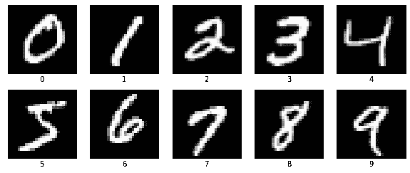

图 8.1：MNIST 数据集的类别：零到九的 28x28 像素数字图像

我们使用`TensorFlow`来训练模型，使用`numpy`让我们的图像更具异常性，使用`Matplotlib`来可视化数据。

```py

import tensorflow as tf 
from tensorflow.keras import datasets, layers, models 
import numpy as np 
import matplotlib.pyplot as plt
```

`MNIST`数据集可以在 TensorFlow 中找到，所以我们可以直接加载它：

```py

(train_images, train_labels), ( 
test_images, 
test_labels, 
) = datasets.mnist.load_data() 
train_images, test_images = train_images / 255.0, test_images / 255.0
```

`MNIST`是一个简单的数据集，因此使用简单的模型可以让我们在测试中达到超过 99%的准确率。我们使用一个标准的 CNN，包含三层卷积层：

```py

def get_model(): 
model = models.Sequential() 
model.add( 
layers.Conv2D(32, (3, 3), activation="relu", input_shape=(28, 28, 1)) 
) 
model.add(layers.MaxPooling2D((2, 2))) 
model.add(layers.Conv2D(64, (3, 3), activation="relu")) 
model.add(layers.MaxPooling2D((2, 2))) 
model.add(layers.Conv2D(64, (3, 3), activation="relu")) 
model.add(layers.Flatten()) 
model.add(layers.Dense(64, activation="relu")) 
model.add(layers.Dense(10)) 
return model 

model = get_model()
```

然后，我们可以编译并训练我们的模型。经过 5 个 epochs 后，我们的验证准确率超过 99%。

```py

def fit_model(model): 
model.compile( 
optimizer="adam", 
loss=tf.keras.losses.SparseCategoricalCrossentropy(from_logits=True), 
metrics=["accuracy"], 
) 

model.fit( 
train_images, 
train_labels, 
epochs=5, 
validation_data=(test_images, test_labels), 
) 
return model 

model = fit_model(model)
```

现在，让我们看看这个模型如何处理分布外数据。假设我们部署这个模型来识别数字，但用户有时无法写下完整的数字。当用户没有写下完整的数字时会发生什么？我们可以通过逐渐移除数字中的信息，观察模型如何处理这些扰动输入，来回答这个问题。我们可以这样定义移除`signal`的函数：

```py

def remove_signal(img: np.ndarray, num_lines: int) -*>* np.ndarray: 
img = img.copy() 
img[:num_lines] = 0 
   return img
```

然后我们对图像进行扰动：

```py

imgs = [] 
for i in range(28): 
img_perturbed = remove_signal(img, i) 
if np.array_equal(img, img_perturbed): 
continue 
imgs.append(img_perturbed) 
if img_perturbed.sum() == 0: 
     break
```

我们只有在将某一行设为 0 确实改变了原始图像时，才将扰动后的图像添加到我们的图像列表中（`if np.array_equal(img, img_perturbed))`），并且一旦图像完全变黑，即仅包含值为 0 的像素，我们就停止。我们对这些图像进行推理：

```py

softmax_predictions = tf.nn.softmax(model(np.expand_dims(imgs, -1)), axis=1)
```

然后，我们可以绘制所有图像及其预测标签和置信度分数：

```py

plt.figure(figsize=(10, 10)) 
bbox_dict = dict( 
fill=True, facecolor="white", alpha=0.5, edgecolor="white", linewidth=0 
) 
for i in range(len(imgs)): 
plt.subplot(5, 5, i + 1) 
plt.xticks([]) 
plt.yticks([]) 
plt.grid(False) 
plt.imshow(imgs[i], cmap="gray") 
prediction = softmax_predictions[i].numpy().max() 
label = np.argmax(softmax_predictions[i]) 
plt.xlabel(f"{label} - {prediction:.2%}") 
plt.text(0, 3, f" {i+1}", bbox=bbox_dict) 
plt.show()
```

这生成了如下的图：

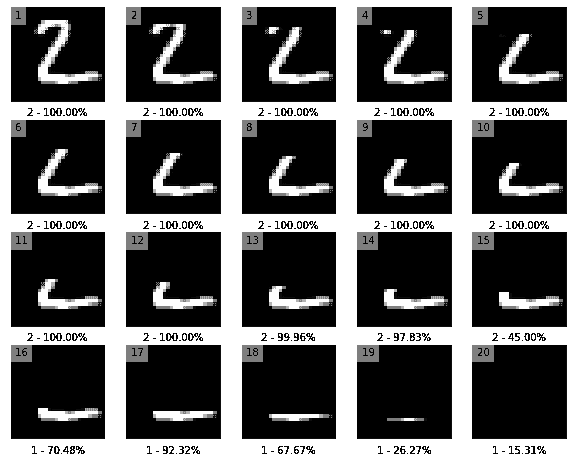

图 8.2：标准神经网络对于逐渐偏离分布的图像所预测的标签及相应的 softmax 分数

我们可以在*图* *8.2*中看到，最初，我们的模型非常自信地将图像分类为`2`。值得注意的是，即使在这种分类显得不合理时，这种自信依然存在。例如，模型仍然以 97.83%的置信度将图像 14 分类为`2`。此外，模型还预测完全水平的线条是`1`，置信度为 92.32%，正如我们在图像 17 中所见。这看起来我们的模型在预测时过于自信。

让我们看看一个稍有不同的模型会如何对这些图像做出预测。我们现在将使用 MC Dropout 作为我们的模型。通过采样，我们应该能够提高模型的不确定性，相较于标准的神经网络。我们先定义我们的模型：

```py

def get_dropout_model(): 
model = models.Sequential() 
model.add( 
layers.Conv2D(32, (3, 3), activation="relu", input_shape=(28, 28, 1)) 
) 
model.add(layers.Dropout(0.2)) 
model.add(layers.MaxPooling2D((2, 2))) 
model.add(layers.Conv2D(64, (3, 3), activation="relu")) 
model.add(layers.MaxPooling2D((2, 2))) 
model.add(layers.Dropout(0.5)) 
model.add(layers.Conv2D(64, (3, 3), activation="relu")) 
model.add(layers.Dropout(0.5)) 
model.add(layers.Flatten()) 
model.add(layers.Dense(64, activation="relu")) 
model.add(layers.Dropout(0.5)) 
model.add(layers.Dense(10)) 
    return model
```

那么我们来实例化它：

```py

dropout_model = get_dropout_model() 
dropout_model = fit_model(dropout_model)
```

使用 dropout 的模型将实现与原始模型类似的准确性。现在，我们使用 dropout 进行推理，并绘制 MC Dropout 的平均置信度分数：

```py

Predictions = np.array( 
[ 
tf.nn.softmax(dropout_model(imgs_np, training=True), axis=1) 
for _ in range(100) 
] 
) 
Predictions_mean = np.mean(predictions, axis=0) 
plot_predictions(predictions_mean)
```

这再次生成了一个图，显示了预测标签及其相关的置信度分数：

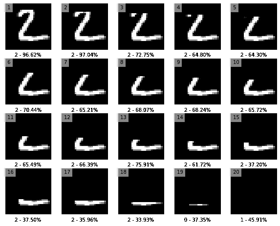

图 8.3：MC Dropout 网络对于逐渐偏离分布的图像所预测的标签及相应的 softmax 分数

我们可以在*图* *8.3*中看到，模型的自信度平均来说较低。当我们从图像中移除行时，模型的置信度大幅下降。这是期望的行为：当模型不知道输入时，它应该表现出不确定性。然而，我们也能看到模型并不完美：

+   对于那些看起来并不像`2`的图像，模型仍然保持较高的置信度。

+   当我们从图像中删除一行时，模型的置信度变化很大。例如，模型的置信度在图像 14 和图像 15 之间从 61.72%跃升至 37.20%。

+   模型似乎更有信心将没有任何白色像素的图像 20 分类为`1`。

在这种情况下，MC Dropout 是一个朝着正确方向迈出的步骤，但它并没有完美地处理分布外数据。

### 8.2.2 系统地评估 OOD 检测性能

上述示例表明，MC dropout 通常会给出分布外图像较低的置信度分数。但我们仅评估了 20 张图像，且变化有限——我们只是删除了一行。这一变化使得图像更加分布外，但前一部分展示的所有图像与`MNIST`的训练分布相比，还是相对相似的，如果拿它和自然物体图像比较。例如，飞机、汽车或鸟类的图像肯定比带有几行黑色的`MNIST`图像更具分布外特征。因此，似乎合理的是，如果我们想评估模型的 OOD 检测性能，我们应该在更加分布外的图像上进行测试，也就是说，来自完全不同数据集的图像。这正是文献中通常用于评估分布外检测性能的方法。具体步骤如下：

1.  我们在内部分布（ID）图像上训练模型。

1.  我们选取一个或多个完全不同的 OOD 数据集，并将这些数据喂给我们的模型。

1.  我们现在将模型在 ID 和 OOD 测试数据集上的预测视为一个二进制问题，并为每个图像计算一个单一的得分。

    +   在评估 softmax 分数的情况下，这意味着我们为每个 ID 和 OOD 图像取模型的最大 softmax 分数。

1.  使用这些得分，我们可以计算二进制指标，如接收者操作特征曲线下面积（AUROC）。

模型在这些二进制指标上的表现越好，模型的 OOD 检测性能就越好。

### 8.2.3 无需重新训练的简单分布外检测

尽管 MC dropout 可以有效检测出分布外数据，但它在推理时存在一个主要缺点：我们需要进行五次，甚至一百次推理，而不是仅仅一次。对于某些其他贝叶斯深度学习方法也可以说类似：虽然它们有理论依据，但并不总是获得良好 OOD 检测性能的最实际方法。主要的缺点是，它们通常需要重新训练网络，如果数据量很大，这可能会非常昂贵。这就是为什么有一整套不显式依赖贝叶斯理论的 OOD 检测方法，但能提供良好、简单，甚至是优秀的基线。这些方法通常不需要任何重新训练，可以直接在标准神经网络上应用。文献中经常使用的两种方法值得一提：

+   **ODIN**：使用预处理和缩放进行 OOD 检测

+   **马哈拉诺比斯**：使用中间特征进行 OOD 检测

#### ODIN：使用预处理和缩放进行 OOD 检测

`O`ut-of-*DI*stribution 检测器（ODIN）是实际应用中常用的标准分布外检测方法之一，因为它简单有效。尽管该方法在 2017 年被提出，但它仍然经常作为提出分布外检测方法的论文中的对比方法。

ODIN 包含两个关键思想：

+   对 logit 分数进行**温度缩放**，然后再应用 softmax 操作，以提高 softmax 分数区分在分布内和分布外图像的能力。

+   **输入预处理** 使分布内图像更符合分布内

让我们更详细地看看这两个思想。

温度缩放 ODIN 适用于分类模型。给定我们计算的 softmax 分数如下：

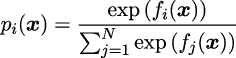

在这里，`f``i` 是单个 logit 输出，`f``j` 是单个示例中所有类别的 logits，温度缩放意味着我们将这些 logit 输出除以常数 `T`：

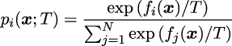

对于较大的 `T` 值，温度缩放使得 softmax 分数更接近均匀分布，从而有助于减少过于自信的预测。

我们可以在 Python 中应用温度缩放，假设有一个简单的模型输出 logits：

```py

logits = model.predict(images) 
logits_scaled = logits / temperature 
softmax = tf.nn.softmax(logits, axis=1)
```

输入预处理 我们在 *第三章*，*深度学习基础* 中看到，**快速梯度** **符号方法**（**FGSM**）使我们能够欺骗神经网络。通过稍微改变一张猫的图像，我们可以让模型以 99.41% 的置信度预测为“狗”。这里的想法是，我们可以获取损失相对于输入的梯度符号，将其乘以一个小值，并将该噪声添加到图像中——这将把我们的图像从分布内类别中移动。通过做相反的事情，即从图像中减去噪声，我们使得图像更接近分布内。ODIN 论文的作者表明，这导致分布内图像的 softmax 分数比分布外图像更高。这意味着我们增加了 OOD 和 ID softmax 分数之间的差异，从而提高了 OOD 检测性能。

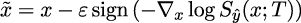

其中 `x` 是输入图像，我们从中减去扰动幅度 *𝜖* 乘以交叉熵损失相对于输入的梯度符号。有关该技术的 TensorFlow 实现，请参见 *第三章*，*深度学习基础*。

尽管输入预处理和温度缩放易于实现，ODIN 现在还需要调节两个超参数：用于缩放 logits 的温度和 *𝜖*（快速梯度符号法的逆）。ODIN 使用一个单独的分布外数据集来调节这些超参数（iSUN 数据集的验证集：8925 张图像）。

#### 马氏距离：使用中间特征进行 OOD 检测

在《*一种简单统一的框架用于检测分布外样本和* *对抗攻击*》一文中，Kimin Lee 等人提出了一种检测 OOD 输入的不同方法。该方法的核心思想是每个类别的分类器在网络的特征空间中遵循多元高斯分布。基于这一思想，我们可以定义`C`个类别条件高斯分布，并且具有共享的协方差 *σ*：

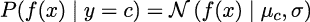

其中 *μ*[`c`] 是每个类别 `c` 的多元高斯分布的均值。这使得我们能够计算给定中间层输出的每个类别的经验均值和协方差。基于均值和协方差，我们可以计算单个测试图像与分布内数据的马氏距离。我们对与输入图像最接近的类别计算该距离：

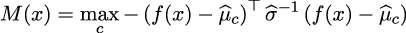

对于分布内的图像，这个距离应该较小，而对于分布外的图像，这个距离应该较大。

`numpy` 提供了方便的函数来计算数组的均值和协方差：

```py

mean = np.mean(features_of_class, axis=0) 
covariance = np.cov(features_of_class.T)
```

基于这些，我们可以按如下方式计算马氏距离：

```py

covariance_inverse = np.linalg.pinv(covariance) 
x_minus_mu = features_of_class - mean 
mahalanobis = np.dot(x_minus_mu, covariance_inverse).dot(x_minus_mu.T) 
mahalanobis = np.sqrt(mahalanobis).diagonal()
```

马氏距离计算不需要任何重新训练，一旦你存储了网络某一层特征的均值和（协方差的逆矩阵），这是一项相对廉价的操作。

为了提高方法的性能，作者表明我们还可以应用 ODIN 论文中提到的输入预处理，或者计算并平均从网络多个层提取的马氏距离。

## 8.3 抵抗数据集偏移

我们在*第三章*《*深度学习基础*》中已经遇到过数据集偏移。提醒一下，数据集偏移是机器学习中的一个常见问题，发生在模型训练阶段和模型推理阶段（例如，在测试模型或在生产环境中运行时）输入 `X` 和输出 `Y` 的联合分布 `P`(*X,Y*) 不同的情况下。协变量偏移是数据集偏移的一个特定案例，其中只有输入的分布发生变化，而条件分布 `P`(`Y` |`X`) 保持不变。

数据集偏移在大多数生产环境中普遍存在，因为在训练过程中很难包含所有可能的推理条件，而且大多数数据不是静态的，而是随着时间发生变化。在生产环境中，输入数据可能沿着许多不同的维度发生偏移。地理和时间数据集偏移是两种常见的偏移形式。例如，假设你已在一个地理区域（例如欧洲）获得的数据上训练了模型，然后将模型应用于另一个地理区域（例如拉丁美洲）。类似地，模型可能是在 2010 到 2020 年间的数据上训练的，然后应用于今天的生产数据。

我们将看到，在这样的数据偏移场景中，模型在新的偏移数据上的表现通常比在原始训练分布上的表现差。我们还将看到，普通神经网络通常无法指示输入数据何时偏离训练分布。最后，我们将探讨本书中介绍的各种方法如何通过不确定性估计来指示数据集偏移，以及这些方法如何增强模型的鲁棒性。以下代码示例将集中在图像分类问题上。然而，值得注意的是，这些见解通常可以推广到其他领域（如自然语言处理）和任务（如回归）。

### 8.3.1 测量模型对数据集偏移的响应

假设我们有一个训练数据集和一个单独的测试集，我们如何衡量模型在数据发生偏移时是否能及时反应？为了做到这一点，我们需要一个额外的测试集，其中数据已经发生偏移，以检查模型如何响应数据集偏移。一个常用的创建数据偏移测试集的方法最初由 Dan Hendrycks、Thomas Dietterich 及其他人于 2019 年提出。这个方法很简单：从你的初始测试集中取出图像，然后对其应用不同程度的图像质量损坏。Hendrycks 和 Dietterich 提出了一套包含 15 种不同类型图像质量损坏的方法，涵盖了图像噪声、模糊、天气损坏（如雾霾和雪）以及数字损坏等类型。每种损坏类型都有五个严重程度级别，从 1（轻度损坏）到 5（严重损坏）。*图* *8.4*展示了一只小猫的图像最初样子（左侧）以及在图像上施加噪声损坏后的效果，分别是严重程度为 1（中间）和 5（右侧）的情况。

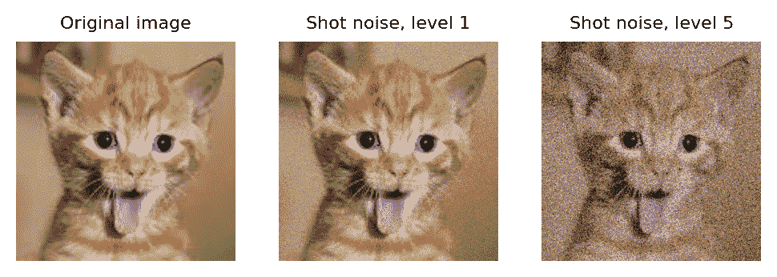

图 8.4：通过在不同损坏严重程度下应用图像质量损坏来生成人工数据集偏移

所有这些图像质量损坏可以方便地使用`imgaug` Python 包生成。以下代码假设我们磁盘上有一个名为"kitty.png"的图像。我们使用 PIL 包加载图像。然后，我们通过损坏函数的名称指定损坏类型（例如，`ShotNoise`），并使用通过传递相应整数给关键字参数`severity`来应用损坏函数，选择严重性等级 1 或 5。

```py

from PIL import Image 
import numpy as np 
import imgaug.augmenters.imgcorruptlike as icl 

image = np.asarray(Image.open("./kitty.png").convert("RGB")) 
corruption_function = icl.ShotNoise 
image_noise_level_01 = corruption_function(severity=1, seed=0)(image=image) 
image_noise_level_05 = corruption_function(severity=5, seed=0)(image=image)
```

通过这种方式生成数据偏移的优势在于，它可以应用于广泛的计算机视觉问题和数据集。应用这种方法的少数前提条件是数据由图像组成，并且在训练过程中没有使用过这些图像质量损坏（例如，用于数据增强）。此外，通过设置图像质量损坏的严重性，我们可以控制数据集偏移的程度。这使我们能够衡量模型对不同程度的数据集偏移的反应。我们可以衡量性能如何随着数据集偏移而变化，以及校准（在*第二章*，*贝叶斯推断基础*中引入）如何变化。我们预计使用贝叶斯方法或扩展方法训练的模型会有更好的校准，这意味着它们能够告诉我们数据相较于训练时已经发生了偏移，因此它们对输出的信心较低。

### 8.3.2 使用贝叶斯方法揭示数据集偏移

在以下的代码示例中，我们将查看书中到目前为止遇到的两种 BDL 方法（基于反向传播的贝叶斯方法和深度集成），并观察它们在前面描述的人工数据集偏移下的表现。我们将它们的表现与普通的神经网络进行比较。

#### 步骤 1：准备环境

我们通过导入一系列包来开始这个示例。这些包包括用于构建和训练神经网络的 TensorFlow 和 TensorFlow Probability；用于处理数值数组（如计算均值）的`numpy`；用于绘图的`Seaborn`、`Matplotlib`和`pandas`；用于加载和处理图像的`cv2`和`imgaug`；以及用于计算模型准确度的`scikit-learn`。

```py

import cv2 
import imgaug.augmenters as iaa 
import imgaug.augmenters.imgcorruptlike as icl 
import matplotlib.pyplot as plt 
import numpy as np 
import pandas as pd 
import seaborn as sns 
import tensorflow as tf 
import tensorflow_probability as tfp 
from sklearn.metrics import accuracy_score
```

在训练之前，我们将加载`CIFAR10`数据集，这是一个图像分类数据集，并指定不同类别的名称。该数据集包含 10 个不同的类别，我们将在以下代码中指定这些类别的名称，并提供 50,000 个训练图像和 10,000 个测试图像。我们还将保存训练图像的数量，这将在稍后使用重参数化技巧训练模型时用到。

```py

cifar = tf.keras.datasets.cifar10 
(train_images, train_labels), (test_images, test_labels) = cifar.load_data() 

CLASS_NAMES = [ 
"airplane","automobile", "bird", "cat", "deer", 
"dog", "frog", "horse", "ship", "truck" 
] 

NUM_TRAIN_EXAMPLES = train_images.shape[0]
```

#### 步骤 2：定义和训练模型

在这项准备工作完成后，我们可以定义并训练我们的模型。我们首先创建两个函数来定义和构建 CNN。我们将使用这两个函数来构建普通神经网络和深度集成网络。第一个函数简单地将卷积层与最大池化层结合起来——这是一种常见的做法，我们在*第三章*《深度学习基础》中介绍过。

```py

def cnn_building_block(num_filters): 
return tf.keras.Sequential( 
[ 
tf.keras.layers.Conv2D( 
filters=num_filters, kernel_size=(3, 3), activation="relu" 
), 
tf.keras.layers.MaxPool2D(strides=2), 
] 
    )
```

第二个函数则依次使用多个卷积/最大池化块，并在此序列后面跟着一个最终的密集层：

```py

def build_and_compile_model(): 
model = tf.keras.Sequential( 
[ 
tf.keras.layers.Rescaling(1.0 / 255, input_shape=(32, 32, 3)), 
cnn_building_block(16), 
cnn_building_block(32), 
cnn_building_block(64), 
tf.keras.layers.MaxPool2D(strides=2), 
tf.keras.layers.Flatten(), 
tf.keras.layers.Dense(64, activation="relu"), 
tf.keras.layers.Dense(10, activation="softmax"), 
] 
) 
model.compile( 
optimizer="adam", 
loss="sparse_categorical_crossentropy", 
metrics=["accuracy"], 
) 
    return model
```

我们还创建了两个类似的函数，用于基于重新参数化技巧定义和构建使用 Bayes By Backprop（BBB）的网络。策略与普通神经网络相同，只不过我们现在将使用来自 TensorFlow Probability 包的卷积层和密集层，而不是 TensorFlow 包。卷积/最大池化块定义如下：

```py

def cnn_building_block_bbb(num_filters, kl_divergence_function): 
return tf.keras.Sequential( 
[ 
tfp.layers.Convolution2DReparameterization( 
num_filters, 
kernel_size=(3, 3), 
kernel_divergence_fn=kl_divergence_function, 
activation=tf.nn.relu, 
), 
tf.keras.layers.MaxPool2D(strides=2), 
] 
    )
```

最终的网络定义如下：

```py

def build_and_compile_model_bbb(): 

kl_divergence_function = lambda q, p, _: tfp.distributions.kl_divergence( 
q, p 
) / tf.cast(NUM_TRAIN_EXAMPLES, dtype=tf.float32) 

model = tf.keras.models.Sequential( 
[ 
tf.keras.layers.Rescaling(1.0 / 255, input_shape=(32, 32, 3)), 
cnn_building_block_bbb(16, kl_divergence_function), 
cnn_building_block_bbb(32, kl_divergence_function), 
cnn_building_block_bbb(64, kl_divergence_function), 
tf.keras.layers.Flatten(), 
tfp.layers.DenseReparameterization( 
64, 
kernel_divergence_fn=kl_divergence_function, 
activation=tf.nn.relu, 
), 
tfp.layers.DenseReparameterization( 
10, 
kernel_divergence_fn=kl_divergence_function, 
activation=tf.nn.softmax, 
), 
] 
) 

model.compile( 
optimizer="adam", 
loss="sparse_categorical_crossentropy", 
metrics=["accuracy"], 
experimental_run_tf_function=False, 
) 

model.build(input_shape=[None, 32, 32, 3]) 
    return model
```

然后我们可以训练普通神经网络：

```py

vanilla_model = build_and_compile_model() 
vanilla_model.fit(train_images, train_labels, epochs=10)
```

我们还可以训练一个五成员的集成模型：

```py

NUM_ENSEMBLE_MEMBERS = 5 
ensemble_model = [] 
for ind in range(NUM_ENSEMBLE_MEMBERS): 
member = build_and_compile_model() 
print(f"Train model {ind:02}") 
member.fit(train_images, train_labels, epochs=10) 
    ensemble_model.append(member)
```

最后，我们训练 BBB 模型。注意，我们将训练 BBB 模型 15 个 epoch，而不是 10 个 epoch，因为它收敛的时间稍长。

```py

bbb_model = build_and_compile_model_bbb() 
bbb_model.fit(train_images, train_labels, epochs=15)
```

#### 步骤 3：获取预测结果

现在我们已经有了三个训练好的模型，可以使用它们对保留的测试集进行预测。为了保持计算的可控性，在这个例子中，我们将专注于测试集中的前 1000 张图像：

```py

NUM_SUBSET = 1000 
test_images_subset = test_images[:NUM_SUBSET] 
test_labels_subset = test_labels[:NUM_SUBSET]
```

如果我们想要衡量数据集偏移的响应，首先需要对数据集应用人工图像损坏。为此，我们首先指定一组来自`imgaug`包的函数。从这些函数的名称中，我们可以推断出每个函数实现的损坏类型：例如，函数`icl.GaussianNoise`通过向图像应用高斯噪声来损坏图像。我们还通过函数的数量推断出损坏类型的数量，并将其保存在`NUM_TYPES`变量中。最后，我们将损坏级别设置为 5。

```py

corruption_functions = [ 
icl.GaussianNoise, 
icl.ShotNoise, 
icl.ImpulseNoise, 
icl.DefocusBlur, 
icl.GlassBlur, 
icl.MotionBlur, 
icl.ZoomBlur, 
icl.Snow, 
icl.Frost, 
icl.Fog, 
icl.Brightness, 
icl.Contrast, 
icl.ElasticTransform, 
icl.Pixelate, 
icl.JpegComdivssion, 
] 
NUM_TYPES = len(corruption_functions) 
NUM_LEVELS = 5
```

配备了这些函数后，我们现在可以开始损坏图像了。在下一个代码块中，我们遍历不同的损坏级别和类型，并将所有损坏的图像收集到名为`corrupted_images`的变量中。

```py

corrupted_images = [] 
# loop over different corruption severities 
for corruption_severity in range(1, NUM_LEVELS+1): 
corruption_type_batch = [] 
# loop over different corruption types 
for corruption_type in corruption_functions: 
corrupted_image_batch = corruption_type( 
severity=corruption_severity, seed=0 
)(images=test_images_subset) 
corruption_type_batch.append(corrupted_image_batch) 
corruption_type_batch = np.stack(corruption_type_batch, axis=0) 
corrupted_images.append(corruption_type_batch) 
corrupted_images = np.stack(corrupted_images, axis=0)
```

在训练完三个模型并获得损坏图像后，我们现在可以看到模型对不同级别数据集偏移的反应。我们将首先获取三个模型对损坏图像的预测结果。为了进行推理，我们需要将损坏的图像调整为模型接受的输入形状。目前，这些图像仍然存储在针对损坏类型和级别的不同轴上。我们通过重新调整`corrupted_images`数组来改变这一点：

```py

corrupted_images = corrupted_images.reshape((-1, 32, 32, 3))
```

然后，我们可以使用普通 CNN 模型对原始图像和腐蚀图像进行推理。在推理模型预测后，我们将预测结果重塑，以便分离腐蚀类型和级别的预测：

```py

# Get predictions on original images 
vanilla_predictions = vanilla_model.predict(test_images_subset) 
# Get predictions on corrupted images 
vanilla_predictions_on_corrupted = vanilla_model.predict(corrupted_images) 
vanilla_predictions_on_corrupted = vanilla_predictions_on_corrupted.reshape( 
(NUM_LEVELS, NUM_TYPES, NUM_SUBSET, -1) 
)
```

为了使用集成模型进行推理，我们首先定义一个预测函数以避免代码重复。此函数处理对集成中不同成员模型的循环，并最终通过平均将不同的预测结果结合起来：

```py

def get_ensemble_predictions(images, num_inferences): 
ensemble_predictions = tf.stack( 
[ 
ensemble_model[ensemble_ind].predict(images) 
for ensemble_ind in range(num_inferences) 
], 
axis=0, 
) 
    return np.mean(ensemble_predictions, axis=0)
```

配备了这个函数后，我们可以对原始图像和腐蚀图像使用集成模型进行推理：

```py

# Get predictions on original images 
ensemble_predictions = get_ensemble_predictions( 
test_images_subset, NUM_ENSEMBLE_MEMBERS 
) 
# Get predictions on corrupted images 
ensemble_predictions_on_corrupted = get_ensemble_predictions( 
corrupted_images, NUM_ENSEMBLE_MEMBERS 
) 
ensemble_predictions_on_corrupted = ensemble_predictions_on_corrupted.reshape( 
(NUM_LEVELS, NUM_TYPES, NUM_SUBSET, -1) 
)
```

就像对于集成模型一样，我们为 BBB 模型编写了一个推理函数，该函数处理不同采样循环的迭代，并收集并结合结果：

```py

def get_bbb_predictions(images, num_inferences): 
bbb_predictions = tf.stack( 
[bbb_model.predict(images) for _ in range(num_inferences)], 
axis=0, 
) 
    return np.mean(bbb_predictions, axis=0)
```

然后，我们利用这个函数获取 BBB 模型在原始图像和腐蚀图像上的预测。我们从 BBB 模型中采样 20 次：

```py

NUM_INFERENCES_BBB = 20 
# Get predictions on original images 
bbb_predictions = get_bbb_predictions( 
test_images_subset, NUM_INFERENCES_BBB 
) 
# Get predictions on corrupted images 
bbb_predictions_on_corrupted = get_bbb_predictions( 
corrupted_images, NUM_INFERENCES_BBB 
) 
bbb_predictions_on_corrupted = bbb_predictions_on_corrupted.reshape( 
(NUM_LEVELS, NUM_TYPES, NUM_SUBSET, -1) 
)
```

我们可以通过返回具有最大 softmax 得分的类别索引和最大 softmax 得分，分别将三个模型的预测转换为预测类别及其相关的置信度得分：

```py

def get_classes_and_scores(model_predictions): 
model_predicted_classes = np.argmax(model_predictions, axis=-1) 
model_scores = np.max(model_predictions, axis=-1) 
    return model_predicted_classes, model_scores
```

然后可以应用此函数来获取我们三个模型的预测类别和置信度得分：

```py

# Vanilla model 
vanilla_predicted_classes, vanilla_scores = get_classes_and_scores( 
vanilla_predictions 
) 
( 
vanilla_predicted_classes_on_corrupted, 
vanilla_scores_on_corrupted, 
) = get_classes_and_scores(vanilla_predictions_on_corrupted) 

# Ensemble model 
( 
ensemble_predicted_classes, 
ensemble_scores, 
) = get_classes_and_scores(ensemble_predictions) 
( 
ensemble_predicted_classes_on_corrupted, 
ensemble_scores_on_corrupted, 
) = get_classes_and_scores(ensemble_predictions_on_corrupted) 

# BBB model 
( 
bbb_predicted_classes, 
bbb_scores, 
) = get_classes_and_scores(bbb_predictions) 
( 
bbb_predicted_classes_on_corrupted, 
bbb_scores_on_corrupted, 
) = get_classes_and_scores(bbb_predictions_on_corrupted)
```

让我们可视化这三个模型在一张展示汽车的选定图像上预测的类别和置信度得分。为了绘图，我们首先将包含腐蚀图像的数组重塑为更方便的格式：

```py

plot_images = corrupted_images.reshape( 
(NUM_LEVELS, NUM_TYPES, NUM_SUBSET, 32, 32, 3) 
)
```

然后，我们绘制了列表中前三种腐蚀类型的选定汽车图像，涵盖所有五个腐蚀级别。对于每种组合，我们在图像标题中显示每个模型的预测得分，并在方括号中显示预测类别。该图如*图**8.5*所示。

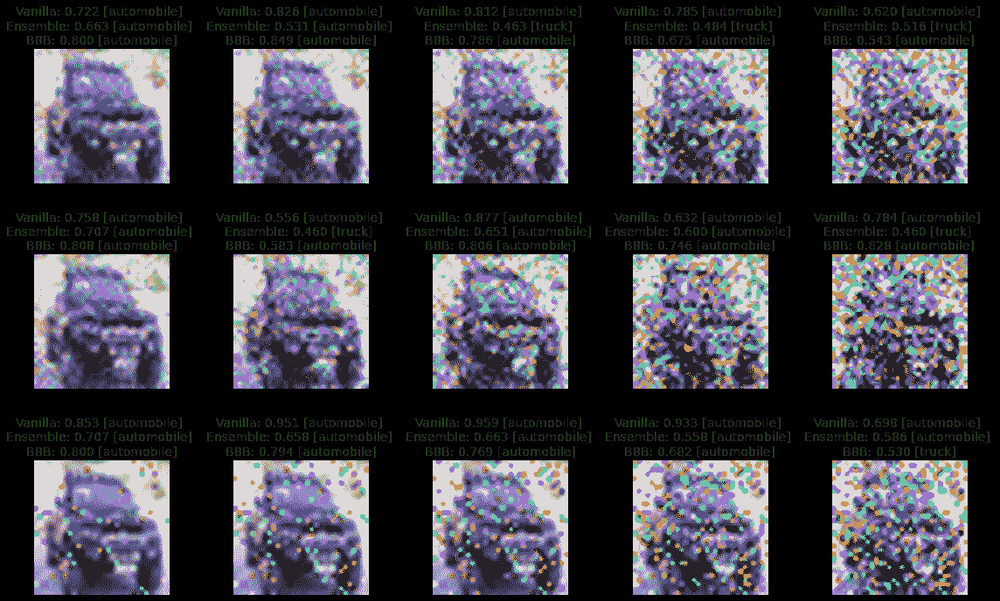

图 8.5：一张汽车图像已经被不同的腐蚀类型（行）和级别（列，严重程度从左到右增加）腐蚀

代码继续：

```py

# Index of the selected images 
ind_image = 9 
# Define figure 
fig, axes = plt.subplots(nrows=3, ncols=5, figsize=(16, 10)) 
# Loop over corruption levels 
for ind_level in range(NUM_LEVELS): 
# Loop over corruption types 
for ind_type in range(3): 
# Plot slightly upscaled image for easier inspection 
image = plot_images[ind_level, ind_type, ind_image, ...] 
image_upscaled = cv2.resize( 
image, dsize=(150, 150), interpolation=cv2.INTER_CUBIC 
) 
axes[ind_type, ind_level].imshow(image_upscaled) 
# Get score and class predicted by vanilla model 
vanilla_score = vanilla_scores_on_corrupted[ 
ind_level, ind_type, ind_image, ... 
] 
vanilla_prediction = vanilla_predicted_classes_on_corrupted[ 
ind_level, ind_type, ind_image, ... 
] 
# Get score and class predicted by ensemble model 
ensemble_score = ensemble_scores_on_corrupted[ 
ind_level, ind_type, ind_image, ... 
] 
ensemble_prediction = ensemble_predicted_classes_on_corrupted[ 
ind_level, ind_type, ind_image, ... 
] 
# Get score and class predicted by BBB model 
bbb_score = bbb_scores_on_corrupted[ind_level, ind_type, ind_image, ...] 
bbb_prediction = bbb_predicted_classes_on_corrupted[ 
ind_level, ind_type, ind_image, ... 
] 
# Plot prediction info in title 
title_text = ( 
f"Vanilla: {vanilla_score:.3f} " 
+ f"[{CLASS_NAMES[vanilla_prediction]}] \n" 
+ f"Ensemble: {ensemble_score:.3f} " 
+ f"[{CLASS_NAMES[ensemble_prediction]}] \n" 
+ f"BBB: {bbb_score:.3f} " 
+ f"[{CLASS_NAMES[bbb_prediction]}]" 
) 
axes[ind_type, ind_level].set_title(title_text, fontsize=14) 
# Remove axes ticks and labels 
axes[ind_type, ind_level].axis("off") 
fig.tight_layout() 
plt.show()
```

*图**8.5*只显示了单张图像的结果，因此我们不应过度解读这些结果。然而，我们已经可以观察到，两个贝叶斯方法（尤其是集成方法）的预测得分通常比普通神经网络更不极端，后者的预测得分高达 0.95。此外，我们看到，对于所有三个模型，预测得分通常随着腐蚀级别的增加而降低。这是预期的：由于图像中的汽车在腐蚀越严重时变得越难以辨认，我们希望模型的置信度也会随之降低。特别是，集成方法在增加腐蚀级别时显示出了预测得分的明显且一致的下降。

#### 第 4 步：衡量准确性

有些模型比其他模型更能适应数据集的偏移吗？我们可以通过查看三种模型在不同损坏水平下的准确性来回答这个问题。预计所有模型在输入图像逐渐损坏时准确性会降低。然而，更鲁棒的模型在损坏变得更严重时，准确性下降应该较少。

首先，我们可以计算三种模型在原始测试图像上的准确性：

```py

vanilla_acc = accuracy_score( 
test_labels_subset.flatten(), vanilla_predicted_classes 
) 
ensemble_acc = accuracy_score( 
test_labels_subset.flatten(), ensemble_predicted_classes 
) 
bbb_acc = accuracy_score( 
test_labels_subset.flatten(), bbb_predicted_classes 
)
```

我们可以将这些准确性存储在字典列表中，这将使我们更容易系统地绘制它们。我们传递相应的模型名称。对于损坏的`类型`和`级别`，我们传递`0`，因为这些是原始图像上的准确性。

```py

accuracies = [ 
{"model_name": "vanilla", "type": 0, "level": 0, "accuracy": vanilla_acc}, 
{"model_name": "ensemble", "type": 0, "level": 0, "accuracy": ensemble_acc}, 
{"model_name": "bbb", "type": 0, "level": 0, "accuracy": bbb_acc}, 
]
```

接下来，我们计算三种模型在不同损坏类型和损坏级别组合下的准确性。我们还将结果附加到之前开始的准确性列表中：

```py

for ind_type in range(NUM_TYPES): 
for ind_level in range(NUM_LEVELS): 
# Calculate accuracy for vanilla model 
vanilla_acc_on_corrupted = accuracy_score( 
test_labels_subset.flatten(), 
vanilla_predicted_classes_on_corrupted[ind_level, ind_type, :], 
) 
accuracies.append( 
{ 
"model_name": "vanilla", 
"type": ind_type + 1, 
"level": ind_level + 1, 
"accuracy": vanilla_acc_on_corrupted, 
} 
) 

# Calculate accuracy for ensemble model 
ensemble_acc_on_corrupted = accuracy_score( 
test_labels_subset.flatten(), 
ensemble_predicted_classes_on_corrupted[ind_level, ind_type, :], 
) 
accuracies.append( 
{ 
"model_name": "ensemble", 
"type": ind_type + 1, 
"level": ind_level + 1, 
"accuracy": ensemble_acc_on_corrupted, 
} 
) 

# Calculate accuracy for BBB model 
bbb_acc_on_corrupted = accuracy_score( 
test_labels_subset.flatten(), 
bbb_predicted_classes_on_corrupted[ind_level, ind_type, :], 
) 
accuracies.append( 
{ 
"model_name": "bbb", 
"type": ind_type + 1, 
"level": ind_level + 1, 
"accuracy": bbb_acc_on_corrupted, 
} 
        )
```

然后，我们可以绘制原始图像和逐渐损坏图像的准确性分布。我们首先将字典列表转换为 pandas dataframe。这有一个优势，即 dataframe 可以直接传递给绘图库`seaborn`，这样我们可以指定不同模型的结果以不同色调进行绘制。

```py

df = pd.DataFrame(accuracies) 
plt.figure(dpi=100) 
sns.boxplot(data=df, x="level", y="accuracy", hue="model_name") 
plt.legend(loc="center left", bbox_to_anchor=(1, 0.5)) 
plt.tight_layout 
plt.show()
```

这会生成以下输出：

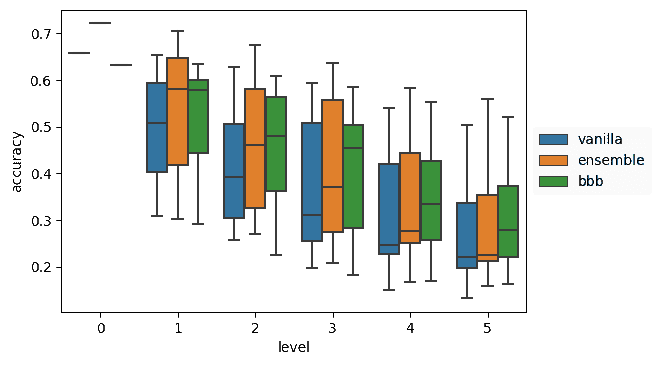

图 8.6：三种不同模型（不同色调）在原始测试图像（级别 0）以及不同程度的损坏（级别 1-5）上的准确性

结果图如*图**8.6*所示。我们可以看到，在原始测试图像上，普通模型和 BBB 模型的准确性相当，而集成模型的准确性稍高。随着损坏的引入，我们看到普通神经网络的表现比集成模型或 BBB 模型更差（通常是显著差）。BDL 模型性能的相对提升展示了贝叶斯方法的正则化效应：这些方法能更有效地捕捉数据的分布，使其对扰动更加鲁棒。BBB 模型特别能抵御数据损坏的增加，展示了变分学习的一个关键优势。

#### 步骤 5：衡量校准

查看准确度是确定模型在数据集变化下的鲁棒性的一种好方法。但它并没有真正告诉我们模型是否能够通过较低的置信度分数（当数据集发生变化时）提醒我们，并且模型在输出时变得不那么自信。这个问题可以通过观察模型在数据集变化下的校准表现来回答。我们在*第三章*的《深度学习基础》中已经介绍了校准和期望校准误差的概念。现在，我们将把这些概念付诸实践，以理解当图像变得越来越受损且难以预测时，模型是否适当地调整了它们的置信度。

首先，我们将实现*第三章*《深度学习基础》中介绍的期望校准误差（ECE），作为校准的标量衡量标准：

```py

def expected_calibration_error( 
divd_correct, 
divd_score, 
n_bins=5, 
): 
"""Compute expected calibration error. 
---------- 
divd_correct : np.ndarray (n_samples,) 
Whether the prediction is correct or not 
divd_score : np.ndarray (n_samples,) 
Confidence in the prediction 
n_bins : int, default=5 
Number of bins to discretize the [0, 1] interval. 
""" 
# Convert from bool to integer (makes counting easier) 
divd_correct = divd_correct.astype(np.int32) 

# Create bins and assign prediction scores to bins 
bins = np.linspace(0.0, 1.0, n_bins + 1) 
binids = np.searchsorted(bins[1:-1], divd_score) 

# Count number of samples and correct predictions per bin 
bin_true_counts = np.bincount( 
binids, weights=divd_correct, minlength=len(bins) 
) 
bin_counts = np.bincount(binids, minlength=len(bins)) 

# Calculate sum of confidence scores per bin 
bin_probs = np.bincount(binids, weights=divd_score, minlength=len(bins)) 

# Identify bins that contain samples 
nonzero = bin_counts != 0 
# Calculate accuracy for every bin 
bin_acc = bin_true_counts[nonzero] / bin_counts[nonzero] 
# Calculate average confidence scores per bin 
bin_conf = bin_probs[nonzero] / bin_counts[nonzero] 

    return np.average(np.abs(bin_acc - bin_conf), weights=bin_counts[nonzero])
```

然后，我们可以计算三个模型在原始测试图像上的期望校准误差（ECE）。我们将箱子的数量设置为`10`，这是计算 ECE 时常用的选择：

```py

NUM_BINS = 10 

vanilla_cal = expected_calibration_error( 
test_labels_subset.flatten() == vanilla_predicted_classes, 
vanilla_scores, 
n_bins=NUM_BINS, 
) 

ensemble_cal = expected_calibration_error( 
test_labels_subset.flatten() == ensemble_predicted_classes, 
ensemble_scores, 
n_bins=NUM_BINS, 
) 

bbb_cal = expected_calibration_error( 
test_labels_subset.flatten() == bbb_predicted_classes, 
bbb_scores, 
n_bins=NUM_BINS, 
)
```

就像我们之前处理准确度一样，我们将把校准结果存储在一个字典列表中，这样就更容易绘制它们：

```py

calibration = [ 
{ 
"model_name": "vanilla", 
"type": 0, 
"level": 0, 
"calibration_error": vanilla_cal, 
}, 
{ 
"model_name": "ensemble", 
"type": 0, 
"level": 0, 
"calibration_error": ensemble_cal, 
}, 
{ 
"model_name": "bbb", 
"type": 0, 
"level": 0, 
"calibration_error": bbb_cal, 
}, 
]
```

接下来，我们根据不同的腐蚀类型和腐蚀级别组合，计算三个模型的期望校准误差。我们还将结果附加到之前开始的校准结果列表中：

```py

for ind_type in range(NUM_TYPES): 
for ind_level in range(NUM_LEVELS): 
# Calculate calibration error for vanilla model 
vanilla_cal_on_corrupted = expected_calibration_error( 
test_labels_subset.flatten() 
== vanilla_predicted_classes_on_corrupted[ind_level, ind_type, :], 
vanilla_scores_on_corrupted[ind_level, ind_type, :], 
) 
calibration.append( 
{ 
"model_name": "vanilla", 
"type": ind_type + 1, 
"level": ind_level + 1, 
"calibration_error": vanilla_cal_on_corrupted, 
} 
) 

# Calculate calibration error for ensemble model 
ensemble_cal_on_corrupted = expected_calibration_error( 
test_labels_subset.flatten() 
== ensemble_predicted_classes_on_corrupted[ind_level, ind_type, :], 
ensemble_scores_on_corrupted[ind_level, ind_type, :], 
) 
calibration.append( 
{ 
"model_name": "ensemble", 
"type": ind_type + 1, 
"level": ind_level + 1, 
"calibration_error": ensemble_cal_on_corrupted, 
} 
) 

# Calculate calibration error for BBB model 
bbb_cal_on_corrupted = expected_calibration_error( 
test_labels_subset.flatten() 
== bbb_predicted_classes_on_corrupted[ind_level, ind_type, :], 
bbb_scores_on_corrupted[ind_level, ind_type, :], 
) 
calibration.append( 
{ 
"model_name": "bbb", 
"type": ind_type + 1, 
"level": ind_level + 1, 
"calibration_error": bbb_cal_on_corrupted, 
} 
        )
```

最后，我们将使用`pandas`和`seaborn`再次绘制校准结果的箱形图：

```py

df = pd.DataFrame(calibration) 
plt.figure(dpi=100) 
sns.boxplot(data=df, x="level", y="calibration_error", hue="model_name") 
plt.legend(loc="center left", bbox_to_anchor=(1, 0.5)) 
plt.tight_layout 
plt.show()
```

校准结果显示在*图**8.7*中。我们可以看到，在原始测试图像上，所有三个模型的校准误差都比较低，集成模型的表现略逊色于另外两个模型。随着数据集变化程度的增加，我们可以看到，传统模型的校准误差大幅增加。对于两种贝叶斯方法，校准误差也增加了，但比传统模型要少得多。这意味着贝叶斯方法在数据集发生变化时能够更好地通过较低的置信度分数来指示（即模型在输出时变得相对不那么自信，随着腐蚀程度的增加，表现出这种特征）。

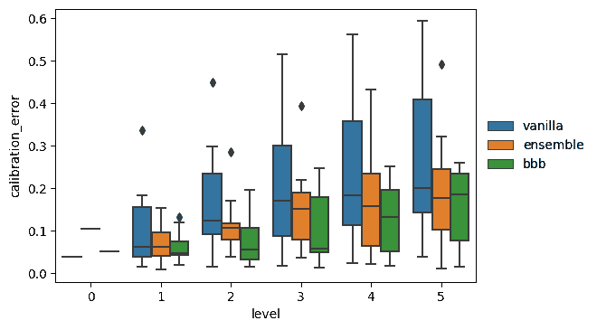

图 8.7：三种不同模型在原始测试图像（级别 0）和不同腐蚀级别（级别 1-5）上的期望校准误差

在下一节中，我们将讨论数据选择。

## 8.4 使用通过不确定性进行的数据选择来保持模型的更新

我们在本章开头看到，能够使用不确定性来判断数据是否是训练数据的一部分。在主动学习这一机器学习领域的背景下，我们可以进一步扩展这个想法。主动学习的承诺是，如果我们能够控制模型训练的数据类型，模型可以在更少的数据上更有效地学习。从概念上讲，这是有道理的：如果我们在质量不足的数据上训练模型，它的表现也不会很好。主动学习是一种通过提供可以从不属于训练数据的数据池中获取数据的函数，来引导模型学习过程和训练数据的方法。通过反复从数据池中选择正确的数据，我们可以训练出比随机选择数据时表现更好的模型。

主动学习可以应用于许多现代系统，在这些系统中有大量未标记的数据可供使用，我们需要仔细选择想要标记的数据量。一个例子是自动驾驶系统：车上的摄像头记录了大量数据，但通常没有预算标记所有数据。通过仔细选择最具信息量的数据点，我们可以以比随机选择数据标记时更低的成本提高模型性能。在主动学习的背景下，估计不确定性发挥着重要作用。模型通常会从数据分布中那些低置信度预测的区域学到更多。让我们通过一个案例研究来看看如何在主动学习的背景下使用不确定性。

在这个案例研究中，我们将重现一篇基础性主动学习论文的结果：*基于图像数据的深度贝叶斯主动学习*（2017）。我们将使用`MNIST`数据集，并在越来越多的数据上训练模型，通过不确定性方法选择要添加到训练集中的数据点。在这种情况下，我们将使用认知不确定性来选择最具信息量的数据点。具有高认知不确定性的图像应该是模型之前没有见过的图像；通过增加更多这样的图像，可以减少不确定性。作为对比，我们还将随机选择数据点。

#### 第一步：准备数据集

我们将首先创建加载数据集的函数。数据集函数需要以下库导入：

```py

import dataclasses 
from pathlib import Path 
import uuid 
from typing import Optional, Tuple 

import numpy as np 
import tensorflow as tf 
from sklearn.utils import shuffle
```

由于我们的总数据集将包含相当多的组件，我们将创建一个小的`dataclass`，以便轻松访问数据集的不同部分。我们还将修改`__repr__`函数，使其能够以更易读的格式打印数据集内容。

```py

@dataclasses.dataclass 
class Data: 
x_train: np.ndarray 
y_train: np.ndarray 
x_test: np.ndarray 
y_test: np.ndarray 
x_train_al: Optional[np.ndarray] = None 
y_train_al: Optional[np.ndarray] = None 

def __repr__(self) -*>* str: 
repr_str = "" 
for field in dataclasses.fields(self): 
repr_str += f"{field.name}: {getattr(self, field.name).shape} \n" 
        return repr_str
```

然后我们可以定义函数来加载标准数据集。

```py

def get_data() -*>* Data: 
num_classes = 10 
(x_train, y_train), (x_test, y_test) = tf.keras.datasets.mnist.load_data() 
# Scale images to the [0, 1] range 
x_train = x_train.astype("float32") / 255 
x_test = x_test.astype("float32") / 255 
# Make sure images have shape (28, 28, 1) 
x_train = np.expand_dims(x_train, -1) 
x_test = np.expand_dims(x_test, -1) 
y_train = tf.keras.utils.to_categorical(y_train, num_classes) 
y_test = tf.keras.utils.to_categorical(y_test, num_classes) 
    return Data(x_train, y_train, x_test, y_test)
```

最初，我们将从*MNIST*数据集中仅使用 20 个样本进行训练。然后我们每次获取 10 个数据点，并重新训练我们的模型。为了在开始时帮助我们的模型，我们将确保这 20 个数据点在数据集的不同类别之间是平衡的。以下函数给出了我们可以使用的索引，用于创建初始的 20 个样本，每个类别 2 个样本：

```py

def get_random_balanced_indices( 
data: Data, initial_n_samples: int 
) -*>* np.ndarray: 
labels = np.argmax(data.y_train, axis=1) 
indices = [] 
label_list = np.unique(labels) 
for label in label_list: 
indices_label = np.random.choice( 
np.argwhere(labels == label).flatten(), 
size=initial_n_samples // len(label_list), 
replace=False 
) 
indices.extend(indices_label) 
indices = np.array(indices) 
np.random.shuffle(indices) 
    return indices
```

然后我们可以定义一个小函数，实际获取我们的初始数据集：

```py

def get_initial_ds(data: Data, initial_n_samples: int) -*>* Data: 
indices = get_random_balanced_indices(data, initial_n_samples) 
x_train_al, y_train_al = data.x_train[indices], data.y_train[indices] 
x_train = np.delete(data.x_train, indices, axis=0) 
y_train = np.delete(data.y_train, indices, axis=0) 
return Data( 
x_train, y_train, data.x_test, data.y_test, x_train_al, y_train_al 
    )
```

#### 步骤 2：设置配置

在我们开始构建模型并创建主动学习循环之前，我们定义一个小的配置`dataclass`来存储一些在运行主动学习脚本时可能想要调整的主要变量。创建这样的配置类使你可以灵活调整不同的参数。

```py

@dataclasses.dataclass 
class Config: 
initial_n_samples: int 
n_total_samples: int 
n_epochs: int 
n_samples_per_iter: int 
# string representation of the acquisition function 
acquisition_type: str 
# number of mc_dropout iterations 
    n_iter: int
```

#### 步骤 3：定义模型

我们现在可以定义我们的模型。我们将使用一个简单的小型 CNN 并加入 Dropout。

```py

def build_model(): 
model = tf.keras.models.Sequential([ 
Input(shape=(28, 28, 1)), 
layers.Conv2D(32, kernel_size=(4, 4), activation="relu"), 
layers.Conv2D(32, kernel_size=(4, 4), activation="relu"), 
layers.MaxPooling2D(pool_size=(2, 2)), 
layers.Dropout(0.25), 
layers.Flatten(), 
layers.Dense(128, activation="relu"), 
layers.Dropout(0.5), 
layers.Dense(10, activation="softmax"), 
]) 
model.compile( 
tf.keras.optimizers.Adam(), 
loss="categorical_crossentropy", 
metrics=["accuracy"], 
experimental_run_tf_function=False, 
) 
    return model
```

#### 步骤 4：定义不确定性函数

如前所述，我们将使用认知不确定性（也称为知识不确定性）作为我们主要的不确定性函数来获取新样本。让我们定义一个函数来计算我们预测的认知不确定性。我们假设输入的预测（`divds`）的形状为`n_images`，`n_predictions`，`n_classes`。我们首先定义一个函数来计算总不确定性。给定一个集成模型的预测，它可以定义为集成平均预测的熵。

```py

def total_uncertainty( 
divds: np.ndarray, epsilon: float = 1e-10 
) -*>* np.ndarray: 
mean_divds = np.mean(divds, axis=1) 
log_divds = -np.log(mean_divds + epsilon) 
    return np.sum(mean_divds * log_divds, axis=1)
```

然后我们定义数据不确定性（或称为随机不确定性），对于一个集成模型来说，它是每个集成成员的熵的平均值。

```py

def data_uncertainty(divds: np.ndarray, epsilon: float = 1e-10) -*>* np.ndarray: 
log_divds = -np.log(divds + epsilon) 
    return np.mean(np.sum(divds * log_divds, axis=2), axis=1)
```

最终，我们得到了我们的知识（或认知）不确定性，这就是通过从预测的总不确定性中减去数据不确定性来得到的。

```py

def knowledge_uncertainty( 
divds: np.ndarray, epsilon: float = 1e-10 
) -*>* np.ndarray: 
    return total_uncertainty(divds, epsilon) - data_uncertainty(divds, epsilon)
```

定义了这些不确定性函数后，我们可以定义实际的获取函数，它们的主要输入是我们的训练数据和模型。为了通过知识不确定性来获取样本，我们进行以下操作：

1.  通过 MC Dropout 获取我们的集成预测。

1.  计算这个集成模型的知识不确定性值。

1.  对不确定性值进行排序，获取它们的索引，并返回我们训练数据中具有最高认知不确定性的索引。

然后，稍后我们可以重复使用这些索引来索引我们的训练数据，实际上获取我们想要添加的训练样本。

```py

from typing import Callable 
from keras import Model 
from tqdm import tqdm 

import numpy as np 

def acquire_knowledge_uncertainty( 
x_train: np.ndarray, 
n_samples: int, 
model: Model, 
n_iter: int, 
*args, 
**kwargs 
): 
divds = get_mc_predictions(model, n_iter, x_train) 
ku = knowledge_uncertainty(divds) 
    return np.argsort(ku, axis=-1)[-n_samples:]
```

我们通过以下方式获得 MC Dropout 预测：

```py

def get_mc_predictions( 
model: Model, n_iter: int, x_train: np.ndarray 
) -*>* np.ndarray: 
divds = [] 
for _ in tqdm(range(n_iter)): 
divds_iter = [ 
model(batch, training=True) 
for batch in np.array_split(x_train, 6) 
] 
divds.append(np.concatenate(divds_iter)) 
# format data such that we have n_images, n_predictions, n_classes 
divds = np.moveaxis(np.stack(divds), 0, 1) 
    return divds
```

为了避免内存溢出，我们将训练数据分批处理，每批 6 个样本，对于每一批，我们将计算`n_iter`次预测。为了确保我们的预测具有多样性，我们将模型的`training`参数设置为`True`。

对于我们的比较，我们还定义了一个获取函数，该函数返回一个随机的索引列表：

```py

def acquire_random(x_train: np.ndarray, n_samples: int, *args, **kwargs): 
    return np.random.randint(low=0, high=len(x_train), size=n_samples)
```

最后，我们根据*工厂方法模式*定义一个小函数，以确保我们可以在循环中使用相同的函数，使用随机采集函数或知识不确定性。像这样的工厂小函数有助于在你想用不同配置运行相同代码时保持代码模块化。

```py

def acquisition_factory(acquisition_type: str) -*>* Callable: 
if acquisition_type == "knowledge_uncertainty": 
return acquire_knowledge_uncertainty 
if acquisition_type == "random": 
        return acquire_random
```

现在我们已经定义了采集函数，我们已经准备好实际定义运行我们主动学习迭代的循环。

#### 第 5 步：定义循环

首先，我们定义我们的配置。在这种情况下，我们使用知识不确定性作为我们的不确定性函数。在另一个循环中，我们将使用一个随机采集函数来比较我们即将定义的循环结果。我们将从 20 个样本开始我们的数据集，直到我们达到 1,000 个样本。每个模型将训练 50 个 epoch，每次迭代我们获取 10 个样本。为了获得我们的 MC dropout 预测，我们将在整个训练集（减去已获取的样本）上运行 100 次。

```py

cfg = Config( 
initial_n_samples=20, 
n_total_samples=1000, 
n_epochs=50, 
n_samples_per_iteration=10, 
acquisition_type="knowledge_uncertainty", 
n_iter=100, 
)
```

然后我们可以获取数据，并定义一个空字典来跟踪每次迭代的测试准确率。我们还创建一个空列表，用于跟踪我们添加到训练数据中的所有索引。

```py

data: Data = get_initial_ds(get_data(), cfg.initial_n_samples) 
accuracies = {} 
added_indices = []
```

我们还为我们的运行分配了一个**全球唯一标识符**（**UUID**），以确保我们可以轻松找到它，并且不会覆盖我们作为循环一部分保存的结果。我们创建一个目录来保存我们的数据，并将配置保存到该目录，以确保我们始终知道`model_dir`中的数据是使用何种配置创建的。

```py

run_uuid = str(uuid.uuid4()) 
model_dir = Path("./models") / cfg.acquisition_type / run_uuid 
model_dir.mkdir(parents=True, exist_ok=True)
```

现在，我们可以实际运行我们的主动学习循环。我们将把这个循环分成三个部分：

1.  我们定义循环，并在已获取的样本上拟合模型：

    ```py

    for i in range(cfg.n_total_samples // cfg.n_samples_per_iter): 
    iter_dir = model_dir / str(i) 
    model = build_model() 
    model.fit( 
    x=data.x_train_al, 
    y=data.y_train_al, 
    validation_data=(data.x_test, data.y_test), 
    epochs=cfg.n_epochs, 
    callbacks=[get_callback(iter_dir)], 
    verbose=2, 
        )
    ```

1.  然后，我们加载具有最佳验证准确率的模型，并根据采集函数更新我们的数据集：

    ```py

    model = tf.keras.models.load_model(iter_dir) 
    indices_to_add = acquisition_factory(cfg.acquisition_type)( 
    data.x_train, 
    cfg.n_samples_per_iter, 
    n_iter=cfg.n_iter, 
    model=model, 
    ) 
    added_indices.append(indices_to_add) 
        data, (iter_x, iter_y) = update_ds(data, indices_to_add)
    ```

1.  最后，我们保存已添加的图片，计算测试准确率，并保存结果：

    ```py

    save_images_and_labels_added(iter_dir, iter_x, iter_y) 
    divds = model(data.x_test) 
    accuracy = get_accuracy(data.y_test, divds) 
    accuracies[i] = accuracy 
        save_results(accuracies, added_indices, model_dir)
    ```

在这个循环中，我们定义了一些小的辅助函数。首先，我们为我们的模型定义了一个回调，以将具有最高验证准确率的模型保存到我们的模型目录：

```py

def get_callback(model_dir: Path): 
model_checkpoint_callback = tf.keras.callbacks.ModelCheckpoint( 
str(model_dir), 
monitor="val_accuracy", 
verbose=0, 
save_best_only=True, 
) 
    return model_checkpoint_callback
```

我们还定义了一个函数来计算测试集的准确率：

```py

def get_accuracy(y_test: np.ndarray, divds: np.ndarray) -*>* float: 
acc = tf.keras.metrics.CategoricalAccuracy() 
acc.update_state(divds, y_test) 
    return acc.result().numpy() * 100
```

我们还定义了两个小函数，用于每次迭代保存结果：

```py

def save_images_and_labels_added( 
output_path: Path, iter_x: np.ndarray, iter_y: np.ndarray 
): 
df = pd.DataFrame() 
df["label"] = np.argmax(iter_y, axis=1) 
iter_x_normalised = (np.squeeze(iter_x, axis=-1) * 255).astype(np.uint8) 
df["image"] = iter_x_normalised.reshape(10, 28*28).tolist() 
df.to_parquet(output_path / "added.parquet", index=False) 

def save_results( 
accuracies: Dict[int, float], added_indices: List[int], model_dir: Path 
): 
df = pd.DataFrame(accuracies.items(), columns=["i", "accuracy"]) 
df["added"] = added_indices 
    df.to_parquet(f"{model_dir}/results.parquet", index=False)
```

请注意，运行主动学习循环需要相当长的时间：每次迭代，我们训练并评估模型 50 个 epoch，然后在我们的池集（完整的训练数据集减去已获取的样本）上运行 100 次。使用随机采集函数时，我们跳过最后一步，但仍然每次迭代将验证数据运行 50 次，以确保使用具有最佳验证准确率的模型。这需要时间，但仅仅选择具有最佳*训练*准确率的模型是有风险的：我们的模型在训练过程中多次看到相同的几张图片，因此很可能会过拟合训练数据。

#### 第 6 步：检查结果

现在，我们有了循环，可以检查这个过程的结果。我们将使用`seaborn`和`matplotlib`来可视化我们的结果：

```py

import seaborn as sns 
import matplotlib.pyplot as plt 
import pandas as pd 
import numpy as np 
sns.set_style("darkgrid") 
sns.set_context("paper")
```

我们最感兴趣的主要结果是两种模型的测试准确率随时间的变化，这些模型分别是基于随机获取函数训练的模型和通过知识不确定性获取数据训练的模型。为了可视化这个结果，我们定义一个函数，加载结果并返回一个图表，显示每个主动学习迭代周期的准确率：

```py

def plot(uuid: str, acquisition: str, ax=None): 
acq_name = acquisition.replace("_", " ") 
df = pd.read_parquet(f"./models/{acquisition}/{uuid}/results.parquet")[:-1] 
df = df.rename(columns={"accuracy": acq_name}) 
df["n_samples"] = df["i"].apply(lambda x: x*10 + 20) 
return df.plot.line( 
x="n_samples", y=acq_name, style='.-', figsize=(8,5), ax=ax 
    )
```

然后，我们可以使用这个函数绘制两个获取函数的结果：

```py

ax = plot("bc1adec5-bc34-44a6-a0eb-fa7cb67854e4", "random") 
ax = plot( 
"5c8d6001-a5fb-45d3-a7cb-2a8a46b93d18", "knowledge_uncertainty", ax=ax 
) 
plt.xticks(np.arange(0, 1050, 50)) 
plt.yticks(np.arange(54, 102, 2)) 
plt.ylabel("Accuracy") 
plt.xlabel("Number of acquired samples") 
plt.show()
```

这将产生以下输出：

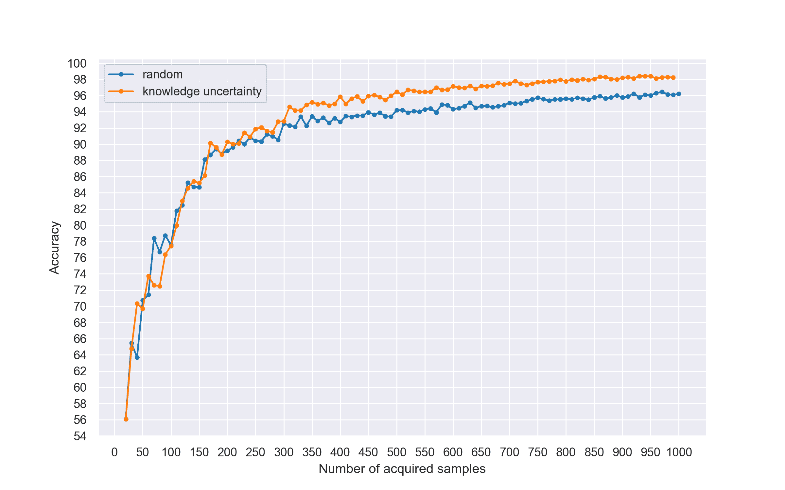

图 8.8：主动学习结果

*图* *8.8* 显示，通过知识不确定性获取样本开始显著提高模型的准确性，尤其是在大约获取了 300 个样本之后。该模型的最终准确率比随机样本训练的模型高出大约两个百分点。虽然这看起来不多，但我们也可以从另一个角度来分析数据：为了实现特定的准确率，需要多少样本？如果我们检查图表，可以看到，知识不确定性线在 400 个训练样本下达到了 96%的准确率。而随机样本训练的模型则至少需要 750 个样本才能达到相同的准确率。这意味着，在相同准确率下，知识不确定性方法只需要几乎一半的数据量。这表明，采用正确的获取函数进行主动学习非常有用，特别是在计算资源充足但标注成本昂贵的情况下：通过正确选择样本，我们可能能够将标注成本降低一倍，从而实现相同的准确率。

因为我们保存了每次迭代获取的样本，所以我们也可以检查两种模型选择的图像类型。为了使我们的可视化更易于解释，我们将可视化每种方法对于每个标签所选的最后五个图像。为此，我们首先定义一个函数，返回每个标签的图像集，对于一组模型目录：

```py

def get_imgs_per_label(model_dirs) -*>* Dict[int, np.ndarray]: 
imgs_per_label = {i: [] for i in range(10)} 
for model_dir in model_dirs: 
df = pd.read_parquet(model_dir / "images_added.parquet") 
df.image = df.image.apply( 
lambda x: x.reshape(28, 28).astype(np.uint8) 
) 
for label in df.label.unique(): 
dff = df[df.label == label] 
if len(dff) == 0: 
continue 
imgs_per_label[label].append(np.hstack(dff.image)) 
    return imgs_per_label
```

然后，我们定义一个函数，创建一个`PIL 图像`，其中按标签将图像进行拼接，以便用于特定的获取函数：

```py

from PIL import Image 
from pathlib import Path 

def get_added_images( 
acquisition: str, uuid: str, n_iter: int = 5 
) -*>* Image: 
base_dir = Path("./models") / acquisition / uuid 
model_dirs = filter(lambda x: x.is_dir(), base_dir.iterdir()) 
model_dirs = sorted(model_dirs, key=lambda x: int(x.stem)) 
imgs_per_label = get_imgs_per_label(model_dirs) 
imgs = [] 
for i in range(10): 
label_img = np.hstack(imgs_per_label[i])[:, -(28 * n_iter):] 
imgs.append(label_img) 
    return Image.fromarray(np.vstack(imgs))
```

然后，我们可以调用这些函数，在我们的案例中使用以下设置和*UUID*：

```py

uuid = "bc1adec5-bc34-44a6-a0eb-fa7cb67854e4" 
img_random = get_added_images("random", uuid) 
uuid = "5c8d6001-a5fb-45d3-a7cb-2a8a46b93d18" 
img_ku = get_added_images("knowledge_uncertainty", uuid)
```

让我们比较一下输出。

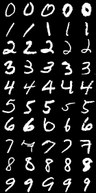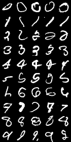

图 8.9：随机选择的图像（左）与通过知识不确定性和 MC 丢弃法选择的图像（右）。每一行显示每个标签所选的最后五个图像

我们可以在*图* *8.9*中看到，通过知识不确定性获取函数选取的图像相比随机选择的图像可能更难以分类。这个不确定性获取函数选择了数据集中一些不寻常的数字表示。由于我们的获取函数能够选取这些图像，模型能够更好地理解数据集的整体分布，从而随着时间的推移提高了准确率。

## 8.5 使用不确定性估计实现更智能的强化学习

**强化学习**旨在开发能够从环境中学习的机器学习技术。强化学习背后的基本原则在其名称中有一丝线索：目标是加强成功的行为。一般来说，在强化学习中，我们有一个智能体能够在环境中执行一系列的动作。在这些动作之后，智能体从环境中获得反馈，而这些反馈被用来帮助智能体更好地理解哪些动作更可能导致在当前环境状态下获得积极的结果。

从形式上讲，我们可以使用一组状态 `S`、一组动作 `A` 来描述它们如何从当前状态 `s` 转换到新的状态 `s`^′，以及奖励函数 `R`(*s,s*^′)，描述当前状态 `s` 和新状态 `s`^′ 之间的过渡奖励。状态集由环境状态集 `S`[`e`] 和智能体状态集 `S`[`a`] 组成，两者共同描述整个系统的状态。

我们可以将此类比为一场马可·波罗的游戏，其中一个玩家通过“喊叫”与“回应”的方式来找到另一个玩家。当寻找的玩家喊“Marco”时，另一个玩家回应“Polo”，根据声音的方向和幅度给出寻找者其位置的估计。如果我们将此简化为考虑距离，那么较近的状态是距离减少的状态，例如*δ* = `d` − `d`^′ *>* 0，其中 `d` 是状态 `s` 的距离，`d`^′ 是状态 `s`^′ 的距离。相反，较远的状态是*δ* = `d` − `d`^′ *<* 0。因此，在这个例子中，我们可以使用我们的*δ*值作为模型的反馈，使得我们的奖励函数为*δ* = `R`(*s,s*^′) = `d` − `d`^′。


图 8.10：马可·波罗强化学习场景的插图

让我们把智能体视为寻找玩家，把目标视为隐藏玩家。在每一步，智能体会收集更多关于环境的信息，从而更好地建模其行动 `A`(`s`) 和奖励函数 `R`(*s,s*^′) 之间的关系（换句话说，它在学习需要朝哪个方向移动，以便更接近目标）。在每一步，我们需要预测奖励函数，给定当前状态下的可能行动集 `A`[`s`]，以便选择最有可能最大化该奖励函数的行动。在这种情况下，行动集可以是我们可以移动的方向集，例如：前进、后退、左转和右转。

传统的强化学习使用一种叫做**Q 学习**的方法来学习状态、行动和奖励之间的关系。Q 学习不涉及神经网络模型，而是将状态、行动和奖励信息存储在一个表格中——Q 表格——然后用来确定在当前状态下最有可能产生最高奖励的行动。虽然 Q 学习非常强大，但对于大量的状态和行动，它的计算成本变得不可承受。为了解决这个问题，研究人员引入了**深度 Q 学习**的概念，其中 Q 表格被神经网络所替代。在通常经过大量迭代后，神经网络会学习在给定当前状态的情况下，哪些行动更有可能产生更高的奖励。

为了预测哪种行动可能产生最高的奖励值，我们使用一个经过训练的模型，该模型基于所有历史行动 `A`[`h`]、状态 `S`[`h`] 和奖励 `R`[`h`]。我们的训练输入 `X` 包含行动 `A`[`h`] 和状态 `S`[`h`]，而目标输出 `y` 包含奖励值 `R`[`h`]。然后，我们可以将该模型作为**模型预测控制器**（**MPC**）的一部分，选择行动，依据是哪个行动与最高预测奖励相关：

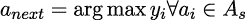

这里，`y`[`i`] 是我们的模型产生的奖励预测，`f`(`a`[`i`]*,s*)，它将当前状态 `s` 和可能的动作 `a`[`i`] ∈ `A`[`s`] 映射到奖励值。然而，在我们的模型有任何用处之前，我们需要收集数据进行训练。我们将在多个回合中积累数据，每个回合包括代理采取的一系列动作，直到满足某些终止标准。理想的终止标准是代理找到目标，但我们也可以设置其他标准，例如代理遇到障碍物或代理用尽最大动作数。由于模型开始时没有任何信息，我们使用一种在强化学习中常见的贪婪策略，叫做 *𝜖greedy* 策略，允许代理通过从环境中随机采样开始。这里的想法是，我们的代理以 *𝜖* 的概率执行随机动作，否则使用模型预测来选择动作。在每个回合之后，我们会减少 *𝜖*，使得代理最终仅根据模型来选择动作。让我们构建一个简单的强化学习示例，看看这一切是如何运作的。

#### 第一步：初始化我们的环境

我们的强化学习示例将围绕我们的环境展开：这定义了所有事件发生的空间。我们将使用`Environment`类来处理这个问题。首先，我们设置环境参数：

```py

import numpy as np 
import tensorflow as tf 
from scipy.spatial.distance import euclidean 
from tensorflow.keras import ( 
Model, 
Sequential, 
layers, 
optimizers, 
metrics, 
losses, 
) 
import pandas as pd 
from sklearn.preprocessing import StandardScaler 
import copy 

class Environment: 
def __init__(self, env_size=8, max_steps=2000): 
self.env_size = env_size 
self.max_steps = max_steps 
self.agent_location = np.zeros(2) 
self.target_location = np.random.randint(0, self.env_size, 2) 
self.action_space = { 
0: np.array([0, 1]), 
1: np.array([0, -1]), 
2: np.array([1, 0]), 
3: np.array([-1, 0]), 
} 
self.delta = self.compute_distance() 
self.is_done = False 
self.total_steps = 0 
self.ideal_steps = self.calculate_ideal_steps() 
    ...
```

在这里，注意我们的环境大小，用`env_size`表示，它定义了环境中的行数和列数——在这个例子中，我们将使用 8 × 8 的环境，结果是 64 个位置（为了简便，我们将使用一个方形环境）。我们还将设置一个`max_steps`限制，以确保在代理随机选择动作时，回合不会进行得太长。

我们还设置了`agent_location`和`target_location`变量——代理总是从 [0, 0] 点开始，而目标位置则是随机分配的。

接下来，我们创建一个字典，将整数值映射到一个动作。从 0 到 3，这些动作分别是：向前、向后、向右、向左。我们还设置了`delta`变量——这是代理与目标之间的初始距离（稍后我们将看到`compute_distance()`是如何实现的）。

最后，我们初始化一些变量，用于跟踪终止标准是否已满足（`is_done`）、总步骤数（`total_steps`）和理想步骤数（`ideal_steps`）。后者是代理从起始位置到达目标所需的最小步骤数。我们将用它来计算遗憾，这是强化学习和优化算法中一个有用的性能指标。为了计算遗憾，我们将向我们的类中添加以下两个函数：

```py

... 

def calculate_ideal_action(self, agent_location, target_location): 
min_delta = 1e1000 
ideal_action = -1 
for k in self.action_space.keys(): 
delta = euclidean( 
agent_location + self.action_space[k], target_location 
) 
if delta *<*= min_delta: 
min_delta = delta 
ideal_action = k 
return ideal_action, min_delta 

def calculate_ideal_steps(self): 
agent_location = copy.deepcopy(self.agent_location) 
target_location = copy.deepcopy(self.target_location) 
delta = 1e1000 
i = 0 
while delta *>* 0: 
ideal_action, delta = self.calculate_ideal_action( 
agent_location, target_location 
) 
agent_location += self.action_space[ideal_action] 
i += 1 
return i 
    ...
```

在这里，`calculate_ideal_steps()`将一直运行，直到代理与目标之间的距离（`delta`）为零。在每次迭代中，它使用`calculate_ideal_action()`来选择能使代理尽可能接近目标的动作。

#### 第二步：更新我们环境的状态

现在我们已经初始化了我们的环境，我们需要添加我们类中最关键的一个部分：`update`方法。这控制了当代理采取新动作时环境的变化：

```py

... 
def update(self, action_int): 
self.agent_location = ( 
self.agent_location + self.action_space[action_int] 
) 
# prevent the agent from moving outside the bounds of the environment 
self.agent_location[self.agent_location *>* (self.env_size - 1)] = ( 
self.env_size - 1 
) 
self.compute_reward() 
self.total_steps += 1 
self.is_done = (self.delta == 0) or (self.total_steps *>*= self.max_steps) 
return self.reward 
    ...
```

该方法接收一个动作整数，并使用它来访问我们之前定义的`action_space`字典中对应的动作。然后更新代理位置。因为代理位置和动作都是向量，所以我们可以简单地使用向量加法来完成这一点。接下来，我们检查代理是否移出了环境的边界 – 如果是，则调整其位置使其仍然保持在我们的环境边界内。

下一行是另一个关键的代码片段：使用`compute_reward()`计算奖励 – 我们马上就会看到这个。一旦计算出奖励，我们增加`total_steps`计数器，检查终止条件，并返回动作的奖励值。

我们使用以下函数来确定奖励。如果代理与目标之间的距离增加，则返回低奖励（`1`），如果减少，则返回高奖励（`10`）：

```py

... 
def compute_reward(self): 
d1 = self.delta 
self.delta = self.compute_distance() 
if self.delta *<* d1: 
self.reward = 10 
else: 
self.reward = 1 
    ...
```

这里使用了`compute_distance()`函数，计算代理与目标之间的欧氏距离：

```py

... 
def compute_distance(self): 
return euclidean(self.agent_location, self.target_location) 
    ...
```

最后，我们需要一个函数来允许我们获取环境的状态，以便将其与奖励值关联起来。我们将其定义如下：

```py

... 
def get_state(self): 
return np.concatenate([self.agent_location, self.target_location]) 
    ...
```

#### 第三步：定义我们的模型

现在我们已经设置好了环境，我们将创建一个模型类。这个类将处理模型训练和推断，以及根据模型预测选择最佳动作。和往常一样，我们从`__init__()`方法开始：

```py

class RLModel: 
def __init__(self, state_size, n_actions, num_epochs=500): 
self.state_size = state_size 
self.n_actions = n_actions 
self.num_epochs = 200 
self.model = Sequential() 
self.model.add( 
layers.Dense( 
20, input_dim=self.state_size, activation="relu", name="layer_1" 
) 
) 
self.model.add(layers.Dense(8, activation="relu", name="layer_2")) 
self.model.add(layers.Dense(1, activation="relu", name="layer_3")) 
self.model.compile( 
optimizer=optimizers.Adam(), 
loss=losses.Huber(), 
metrics=[metrics.RootMeanSquaredError()], 
) 
    ...
```

在这里，我们传递了一些与我们的环境相关的变量，如状态大小和动作数量。与模型定义相关的代码应该很熟悉 – 我们只是使用 Keras 实例化了一个神经网络。需要注意的一点是，我们在这里使用 Huber 损失，而不是更常见的均方误差。这是在强化学习和健壮回归任务中常见的选择。Huber 损失动态地在均方误差和平均绝对误差之间切换。前者非常擅长惩罚小误差，而后者对异常值更为健壮。通过 Huber 损失，我们得到了一个既对异常值健壮又惩罚小误差的损失函数。

这在强化学习中特别重要，因为算法具有探索性特征：我们经常会遇到一些极具探索性的样本，它们与其他数据相比偏离较大，从而在训练过程中导致较大的误差。

在完成类的初始化后，我们继续处理 `fit()` 和 `predict()` 函数：

```py

... 
def fit(self, X_train, y_train, batch_size=16): 
self.scaler = StandardScaler() 
X_train = self.scaler.fit_transform(X_train) 
self.model.fit( 
X_train, 
y_train, 
epochs=self.num_epochs, 
verbose=0, 
batch_size=batch_size, 
) 

def predict(self, state): 
rewards = [] 
X = np.zeros((self.n_actions, self.state_size)) 
for i in range(self.n_actions): 
X[i] = np.concatenate([state, [i]]) 
X = self.scaler.transform(X) 
rewards = self.model.predict(X) 
        return np.argmax(rewards)
```

`fit()` 函数应该非常熟悉——我们只是对输入进行缩放，然后再拟合我们的 Keras 模型。`predict()` 函数则稍微复杂一点。因为我们需要对每个可能的动作（前进、后退、右转、左转）进行预测，所以我们需要为这些动作生成输入。我们通过将与动作相关的整数值与状态进行拼接，来生成完整的状态-动作向量，正如第 11 行所示。对所有动作执行此操作后，我们得到输入矩阵 `X`，其中每一行都对应一个特定的动作。然后，我们对 `X` 进行缩放，并在其上运行推理，以获得预测的奖励值。为了选择一个动作，我们简单地使用 `np.argmax()` 来获取与最高预测奖励相关的索引。

#### 第 4 步：运行我们的强化学习

现在，我们已经定义了 `Environment` 和 `RLModel` 类，准备开始强化学习了！首先，我们设置一些重要的变量并实例化我们的模型：

```py

env_size = 8 
state_size = 5 
n_actions = 4 
epsilon = 1.0 
history = {"state": [], "reward": []} 
n_samples = 1000 
max_steps = 500 
regrets = [] 

model = RLModel(state_size, n_actions)
```

这些内容现在应该已经很熟悉了，但我们还是会再回顾一些尚未覆盖的部分。`history` 字典是我们存储状态和奖励信息的地方，在每一轮的每个步骤中，我们会更新这些信息。然后，我们会利用这些信息来训练我们的模型。另一个不太熟悉的变量是 `n_samples`——我们设置这个变量是因为每次训练模型时，并不是使用所有可用的数据，而是从数据中随机抽取 1,000 个数据点。这样可以避免随着数据量的不断增加，我们的训练时间也不断暴增。这里的最后一个新变量是 `regrets`。这个列表将存储每一轮的遗憾值。在我们的案例中，遗憾被简单地定义为模型所采取的步骤数与智能体到达目标所需的最小步骤数之间的差值：

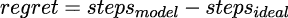

因此，遗憾为零 *⇔* *steps*[*model*] == *steps*[*ideal*]。遗憾值对于衡量模型学习过程中的表现非常有用，正如我们稍后将看到的那样。接下来就是强化学习过程的主循环：

```py

for i in range(100): 
env = Environment(env_size, max_steps=max_steps) 
while not env.is_done: 
state = env.get_state() 
if np.random.rand() *<* epsilon: 
action = np.random.randint(n_actions) 
else: 
action = model.predict(state) 
reward = env.update(action) 
history["state"].append(np.concatenate([state, [action]])) 
history["reward"].append(reward) 
print( 
f"Completed episode {i} in {env.total_steps} steps." 
f"Ideal steps: {env.ideal_steps}." 
f"Epsilon: {epsilon}" 
) 
regrets.append(np.abs(env.total_steps-env.ideal_steps)) 
idxs = np.random.choice(len(history["state"]), n_samples) 
model.fit( 
np.array(history["state"])[idxs], 
np.array(history["reward"])[idxs] 
) 
    epsilon-=epsilon/10
```

在这里，我们的强化学习过程会运行 100 轮，每次都重新初始化环境。通过内部的 `while` 循环可以看到，我们会不断地迭代——更新智能体并衡量奖励——直到满足其中一个终止条件（无论是智能体达到目标，还是我们达到最大允许的迭代次数）。

每一轮结束后，`print`语句会告诉我们该轮是否没有错误完成，并告诉我们我们的智能体与理想步数的对比结果。接着，我们计算遗憾值，并将其附加到`regrets`列表中，从`history`中的数据进行采样，并在这些样本数据上拟合我们的模型。最后，每次外循环迭代结束时，我们会减少 epsilon 值。

运行完之后，我们还可以绘制遗憾值图，以查看我们的表现：

```py

import matplotlib.pyplot as plt 
import seaborn as sns 

df_plot = pd.DataFrame({"regret": regrets, "episode": np.arange(len(regrets))}) 
sns.lineplot(x="episode", y="regret", data=df_plot) 
fig = plt.gcf() 
fig.set_size_inches(5, 10) 
plt.show()
```

这将生成以下图表，展示我们模型在 100 轮训练中的表现：

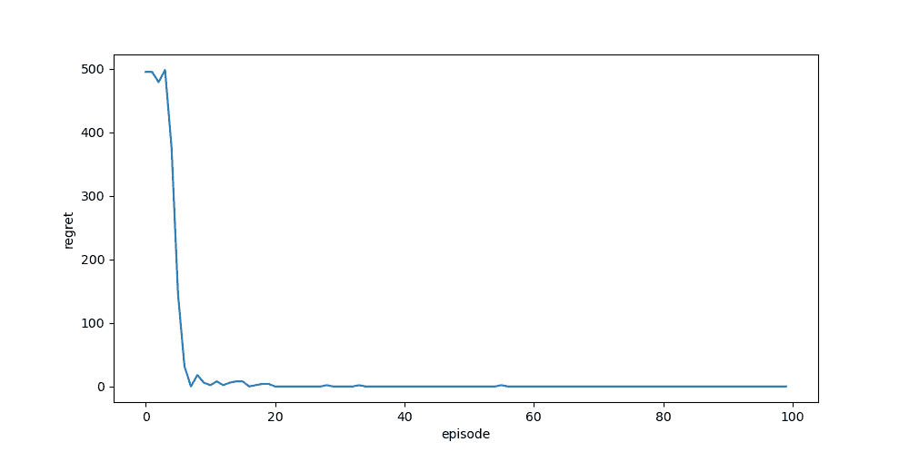

图 8.11：强化学习 100 轮后的遗憾值图

正如我们在这里看到的，它一开始表现得很差，但模型很快学会了预测奖励值，从而能够预测最优动作，将遗憾减少到 0。

到目前为止，事情还算简单。事实上，你可能会想，为什么我们需要模型呢——为什么不直接计算目标和拟议位置之间的距离，然后选择相应的动作呢？首先，强化学习的目标是让智能体在没有任何先验知识的情况下发现如何在给定环境中进行交互——所以，尽管我们的智能体可以执行动作，但它没有距离的概念。这是通过与环境的互动来学习的。其次，情况可能没有那么简单：如果环境中有障碍物呢？在这种情况下，我们的智能体需要比简单地朝声音源移动更聪明。

尽管这只是一个示范性的例子，但强化学习在现实世界中的应用涉及一些我们知识非常有限的情境，因此，设计一个能够探索环境并学习如何最优互动的智能体，使我们能够为那些无法使用监督学习方法的应用开发模型。

另一个在现实世界情境中需要考虑的因素是风险：我们希望我们的智能体做出*明智*的决策，而不仅仅是最大化奖励的决策：我们需要它能够理解风险/回报的权衡。这就是不确定性估计的作用所在。

### 8.5.1 带有不确定性的障碍物导航

通过不确定性估计，我们可以在奖励和模型对其预测的信心之间找到平衡。如果模型的信心较低（意味着不确定性较高），那么我们可能希望对如何整合模型的预测保持谨慎。例如，假设我们刚刚探讨的强化学习场景。在每一轮中，我们的模型预测哪个动作将获得最高的奖励，然后我们的智能体选择该动作。在现实世界中，事情并不是那么可预测——我们的环境可能会发生变化，导致意外的后果。如果我们的环境中出现了障碍物，并且与障碍物发生碰撞会阻止我们的智能体完成任务，那么显然，如果我们的智能体还没有遇到过这个障碍物，它注定会失败。幸运的是，在贝叶斯深度学习的情况下，情况并非如此。只要我们有某种方式来感知障碍物，我们的智能体就能够检测到障碍物并选择不同的路径——即使该障碍物在之前的回合中没有出现。


图 8.12：不确定性如何影响强化学习智能体行动的示意图

这一切之所以可能，得益于我们的不确定性估计。当模型遇到不寻常的情况时，它对该预测的不确定性估计将会较高。因此，如果我们将其融入到我们的 MPC 方程中，我们就能在奖励和不确定性之间找到平衡，确保我们优先考虑较低的风险，而非较高的奖励。为了做到这一点，我们修改了我们的 MPC 方程，具体如下：

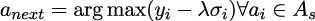

在这里，我们看到我们正在从我们的奖励预测 `y`[`i`] 中减去一个值，*λσ*[`i`]。这是因为 *σ*[`i`] 是与第 `i` 次预测相关的不确定性。我们使用 *λ* 来缩放不确定性，以便适当惩罚不确定的动作；这是一个可以根据应用进行调整的参数。通过一个经过良好校准的方法，我们将看到在模型对预测不确定时，*σ*[`i`] 的值会较大。让我们在之前的代码示例的基础上，看看这一过程如何实现。

#### 第一步：引入障碍物

为了给我们的智能体制造挑战，我们将向环境中引入障碍物。为了测试智能体如何应对不熟悉的输入，我们将改变障碍物的策略——它将根据我们的环境设置，选择遵循静态策略或动态策略。我们将修改 `Environment` 类的 `__init__()` 函数，以便整合这些更改：

```py

def __init__(self, env_size=8, max_steps=2000, dynamic_obstacle=False, lambda_val=2): 
self.env_size = env_size 
self.max_steps = max_steps 
self.agent_location = np.zeros(2) 
self.dynamic_obstacle = dynamic_obstacle 
self.lambda_val = lambda_val 
self.target_location = np.random.randint(0, self.env_size, 2) 
while euclidean(self.agent_location, self.target_location) *<* 4: 
self.target_location = np.random.randint(0, self.env_size, 2) 
self.action_space = { 
0: np.array([0, 1]), 
1: np.array([0, -1]), 
2: np.array([1, 0]), 
3: np.array([-1, 0]), 
} 
self.delta = self.compute_distance() 
self.is_done = False 
self.total_steps = 0 
self.obstacle_location = np.array( 
[self.env_size / 2, self.env_size / 2], dtype=int 
) 
self.ideal_steps = self.calculate_ideal_steps() 
self.collision = False 

```

这里涉及的内容比较复杂，所以我们将逐一讲解每个更改。首先，为了确定障碍物是静态的还是动态的，我们设置了 `dynamic_obstacle` 变量。如果该值为 `True`，我们将随机设置障碍物的位置。如果该值为 `False`，则我们的物体将停留在环境的中央。我们还在此设置了我们的 `lambda` (*λ*) 参数，默认值为 2。

我们还在设置 `target_location` 时引入了一个 `while` 循环：我们这么做是为了确保智能体和目标之间有一定的距离。我们需要这么做是为了确保在智能体和目标之间留有足够的空间，以便放置动态障碍物——否则，智能体可能永远无法遇到这个障碍物（这将稍微违背本示例的意义）。

最后，我们在第 17 行计算障碍物的位置：你会注意到这只是将它设置在环境的中央。这是因为我们稍后会使用 `dynamic_obstacle` 标志将障碍物放置在智能体和目标之间——我们在 `calculate_ideal_steps()` 函数中这么做，因为这样我们就知道障碍物将位于智能体的理想路径上（因此更有可能被遇到）。

#### 步骤 2：放置动态障碍物

当 `dynamic_obstacle` 为 `True` 时，我们希望在每个回合将障碍物放置在不同的位置，从而为我们的智能体带来更多挑战。为此，我们在之前提到的 `calculate_ideal_steps()` 函数中进行了一些修改：

```py

def calculate_ideal_steps(self): 
agent_location = copy.deepcopy(self.agent_location) 
target_location = copy.deepcopy(self.target_location) 
delta = 1e1000 
i = 0 
while delta *>* 0: 
ideal_action, delta = self.calculate_ideal_action( 
agent_location, target_location 
) 
agent_location += self.action_space[ideal_action] 
if np.random.randint(0, 2) and self.dynamic_obstacle: 
self.obstacle_location = copy.deepcopy(agent_location) 
i += 1 
        return i
```

在这里，我们看到我们在每次执行 `while` 循环时都调用了 `np.random.randint(0, 2)`。这是为了随机化障碍物沿理想路径的放置位置。

#### 步骤 3：添加感知功能

如果我们的智能体无法感知环境中引入的物体，那么它将没有任何希望避免这个物体。因此，我们将添加一个函数来模拟传感器：`get_obstacle_proximity()`。该传感器将为我们的智能体提供关于如果它执行某个特定动作时，它会接近物体的距离信息。根据给定动作将我们的智能体靠近物体的距离，我们将返回逐渐增大的数值。如果动作将智能体置于足够远的位置（在这种情况下，至少 4.5 个空间），则我们的传感器将返回零。这个感知功能使得我们的智能体能够有效地看到一步之遥，因此我们可以将该传感器视为具有一步的感知范围。

```py

def get_obstacle_proximity(self): 
obstacle_action_dists = np.array( 
[ 
euclidean( 
self.agent_location + self.action_space[k], 
self.obstacle_location, 
) 
for k in self.action_space.keys() 
] 
) 
return self.lambda_val * ( 
np.array(obstacle_action_dists *<* 2.5, dtype=float) 
+ np.array(obstacle_action_dists *<* 3.5, dtype=float) 
+ np.array(obstacle_action_dists *<* 4.5, dtype=float) 
        )
```

在这里，我们首先计算每个动作后智能体的未来接近度，然后计算整数“接近度”值。这些值是通过首先构造每个接近度条件的布尔数组来计算的，在这种情况下分别为 *δ*[`o`] *<* 2*.*5, *δ*[`o`] *<* 3*.*5 和 *δ*[`o`] *<* 4*.*5，其中 *δ*[`o`] 是与障碍物的距离。然后，我们将这些条件求和，使得接近度得分具有 3、2 或 1 的整数值，具体取决于满足多少个条件。这为我们提供了一个传感器，它会根据每个提议的动作返回有关障碍物未来接近度的基本信息。

#### 步骤 4：修改奖励函数

准备环境的最后一件事是更新我们的奖励函数：

```py

def compute_reward(self): 
d1 = self.delta 
self.delta = self.compute_distance() 
if euclidean(self.agent_location, self.obstacle_location) == 0: 
self.reward = 0 
self.collision = True 
self.is_done = True 
elif self.delta *<* d1: 
self.reward = 10 
else: 
            self.reward = 1
```

在这里，我们添加了一条语句来检查代理与障碍物是否发生碰撞（检查两者之间的距离是否为零）。如果发生碰撞，我们将返回奖励值 0，并将`collision`和`is_done`变量设置为`True`。这引入了新的终止标准——**碰撞**，并将允许我们的代理学习到碰撞是有害的，因为这些情况会得到最低的奖励。

#### 第 5 步：初始化我们的不确定性感知模型

现在我们的环境已经准备好，我们需要一个新的模型——一个能够生成不确定性估计的模型。对于这个模型，我们将使用一个带有单个隐藏层的 MC dropout 网络：

```py

class RLModelDropout: 
def __init__(self, state_size, n_actions, num_epochs=200, nb_inference=10): 
self.state_size = state_size 
self.n_actions = n_actions 
self.num_epochs = num_epochs 
self.nb_inference = nb_inference 
self.model = Sequential() 
self.model.add( 
layers.Dense( 
10, input_dim=self.state_size, activation="relu", name="layer_1" 
) 
) 
# self.model.add(layers.Dropout(0.15)) 
# self.model.add(layers.Dense(8, activation='relu', name='layer_2')) 
self.model.add(layers.Dropout(0.15)) 
self.model.add(layers.Dense(1, activation="relu", name="layer_2")) 
self.model.compile( 
optimizer=optimizers.Adam(), 
loss=losses.Huber(), 
metrics=[metrics.RootMeanSquaredError()], 
) 

self.proximity_dict = {"proximity sensor value": [], "uncertainty": []} 
    ...
```

这看起来应该很熟悉，但你会注意到几个关键的不同之处。首先，我们再次使用 Huber 损失函数。其次，我们引入了一个字典`proximity_dict`，它将记录从传感器接收到的邻近值和相关的模型不确定性。这将使我们能够稍后评估模型对异常邻近值的敏感性。

#### 第 6 步：拟合我们的 MC Dropout 网络

接下来，我们需要以下几行代码：

```py

... 
def fit(self, X_train, y_train, batch_size=16): 
self.scaler = StandardScaler() 
X_train = self.scaler.fit_transform(X_train) 
self.model.fit( 
X_train, 
y_train, 
epochs=self.num_epochs, 
verbose=0, 
batch_size=batch_size, 
) 
    ...
```

这应该再次看起来很熟悉——我们只是通过首先对输入进行缩放来准备数据，然后拟合我们的模型。

#### 第 7 步：进行预测

在这里，我们看到我们稍微修改了`predict()`函数：

```py

... 
def predict(self, state, obstacle_proximity, dynamic_obstacle=False): 
rewards = [] 
X = np.zeros((self.n_actions, self.state_size)) 
for i in range(self.n_actions): 
X[i] = np.concatenate([state, [i], [obstacle_proximity[i]]]) 
X = self.scaler.transform(X) 
rewards, y_std = self.predict_ll_dropout(X) 
# we subtract our standard deviations from our predicted reward values, 
# this way uncertain predictions are penalised 
rewards = rewards - (y_std * 2) 
best_action = np.argmax(rewards) 
if dynamic_obstacle: 
self.proximity_dict["proximity sensor value"].append( 
obstacle_proximity[best_action] 
) 
self.proximity_dict["uncertainty"].append(y_std[best_action][0]) 
return best_action 
    ...
```

更具体地说，我们添加了`obstacle_proximity`和`dynamic_obstacle`变量。前者允许我们接收传感器信息，并将其纳入传递给模型的输入中。后者是一个标志，告诉我们是否进入了动态障碍物阶段——如果是，我们希望在`proximity_dict`字典中记录传感器值和不确定性的相关信息。

下一段预测代码应该再次看起来很熟悉：

```py

... 
def predict_ll_dropout(self, X): 
ll_divd = [ 
self.model(X, training=True) for _ in range(self.nb_inference) 
] 
ll_divd = np.stack(ll_divd) 
        return ll_divd.mean(axis=0), ll_divd.std(axis=0)
```

该函数简单地实现了 MC dropout 推断，通过`nb_inference`次前向传递获得预测，并返回与我们的预测分布相关的均值和标准差。

#### 第 8 步：调整我们的标准模型

为了理解我们的贝叶斯模型带来的差异，我们需要将其与非贝叶斯模型进行比较。因此，我们将更新之前的`RLModel`类，添加从邻近传感器获取邻近信息的功能：

```py

class RLModel: 
def __init__(self, state_size, n_actions, num_epochs=500): 
self.state_size = state_size 
self.n_actions = n_actions 
self.num_epochs = 200 
self.model = Sequential() 
self.model.add( 
layers.Dense( 
20, input_dim=self.state_size, activation="relu", name="layer_1" 
) 
) 
self.model.add(layers.Dense(8, activation="relu", name="layer_2")) 
self.model.add(layers.Dense(1, activation="relu", name="layer_3")) 
self.model.compile( 
optimizer=optimizers.Adam(), 
loss=losses.Huber(), 
metrics=[metrics.RootMeanSquaredError()], 
) 

def fit(self, X_train, y_train, batch_size=16): 
self.scaler = StandardScaler() 
X_train = self.scaler.fit_transform(X_train) 
self.model.fit( 
X_train, 
y_train, 
epochs=self.num_epochs, 
verbose=0, 
batch_size=batch_size, 
) 

def predict(self, state, obstacle_proximity, obstacle=False): 
rewards = [] 
X = np.zeros((self.n_actions, self.state_size)) 
for i in range(self.n_actions): 
X[i] = np.concatenate([state, [i], [obstacle_proximity[i]]]) 
X = self.scaler.transform(X) 
rewards = self.model.predict(X) 
return np.argmax(rewards) 

```

至关重要的是，我们在这里看到我们的决策函数并没有变化：因为我们没有模型不确定性，我们的模型的`predict()`函数仅基于预测的奖励来选择动作。

#### 第 9 步：准备运行我们的新强化学习实验

现在我们准备好设置我们的新实验了。我们将初始化之前使用的变量，并引入几个新的变量：

```py

env_size = 8 
state_size = 6 
n_actions = 4 
epsilon = 1.0 
history = {"state": [], "reward": []} 
model = RLModelDropout(state_size, n_actions, num_epochs=400) 
n_samples = 1000 
max_steps = 500 
regrets = [] 
collisions = 0 
failed = 0
```

在这里，我们看到我们引入了一个`collisions`变量和一个`failed`变量。这些变量将追踪碰撞次数和失败的回合次数，以便我们可以将贝叶斯模型的表现与非贝叶斯模型的表现进行比较。现在我们准备好运行实验了！

#### 第 10 步：运行我们的 BDL 强化学习实验

如前所述，我们将对实验进行 100 回合的运行。然而，这次，我们只会在前 50 回合进行模型训练。之后，我们将停止训练，评估模型在找到安全路径到达目标方面的表现。在这最后 50 回合中，我们将`dynamic_obstacle`设置为`True`，意味着我们的环境将为每一回合随机选择一个新的障碍物位置。重要的是，这些随机位置将会位于代理与目标之间的*理想路径*上。

让我们来看一下代码：

```py

for i in range(100): 
if i *<* 50: 
env = Environment(env_size, max_steps=max_steps) 
dynamic_obstacle = False 
else: 
dynamic_obstacle = True 
epsilon = 0 
env = Environment( 
env_size, max_steps=max_steps, dynamic_obstacle=True 
) 
    ...
```

首先，我们检查回合是否在前 50 回合之内。如果是，我们通过设置`dynamic_obstacle=False`实例化环境，并将全局变量`dynamic_obstacle`设置为`False`。

如果回合是最后 50 回合之一，我们创建一个带有随机障碍物的环境，并将`epsilon`设置为 0，以确保我们在选择动作时总是使用模型预测。

接下来，我们进入`while`循环，使我们的代理开始移动。这与我们在上一个示例中看到的循环非常相似，只不过这次我们调用了`env.get_obstacle_proximity()`，并将返回的障碍物接近信息用于我们的预测，同时也将此信息存储在回合历史中：

```py

... 
while not env.is_done: 
state = env.get_state() 
obstacle_proximity = env.get_obstacle_proximity() 
if np.random.rand() *<* epsilon: 
action = np.random.randint(n_actions) 
else: 
action = model.predict(state, obstacle_proximity, dynamic_obstacle) 
reward = env.update(action) 
history["state"].append( 
np.concatenate([state, [action], 
[obstacle_proximity[action]]]) 
) 
history["reward"].append(reward) 
    ...
```

最后，我们将记录一些已完成回合的信息，并将最新回合的结果打印到终端。我们更新`failed`和`collisions`变量，并打印回合是否成功完成，代理是否未能找到目标，或代理是否与障碍物发生碰撞：

```py

if env.total_steps == max_steps: 
print(f"Failed to find target for episode {i}. Epsilon: {epsilon}") 
failed += 1 
elif env.total_steps *<* env.ideal_steps: 
print(f"Collided with obstacle during episode {i}. Epsilon: {epsilon}") 
collisions += 1 
else: 
print( 
f"Completed episode {i} in {env.total_steps} steps." 
f"Ideal steps: {env.ideal_steps}." 
f"Epsilon: {epsilon}" 
) 
regrets.append(np.abs(env.total_steps-env.ideal_steps)) 
if not dynamic_obstacle: 
idxs = np.random.choice(len(history["state"]), n_samples) 
model.fit( 
np.array(history["state"])[idxs], 
np.array(history["reward"])[idxs] 
) 
        epsilon-=epsilon/10
```

这里的最后一条语句还检查我们是否处于动态障碍物阶段，如果不是，则进行一次训练，并减少我们的 epsilon 值（如同上一个示例）。

那么，我们的表现如何？重复进行上述 100 回合的实验，对于`RLModel`和`RLModelDropout`模型，我们得到了以下结果：

|

* * *

|

* * *

|

* * *

|

* * *

|

| **模型** | **失败的回合数** | **碰撞次数** | **成功的回合数** |
| --- | --- | --- | --- |

|

* * *

|

* * *

|

* * *

|

* * *

|

| **RLModelDropout** | 19 | 3 | 31 |
| --- | --- | --- | --- |

|

* * *

|

* * *

|

* * *

|

* * *

|

| **RLModel** | 16 | 10 | 34 |
| --- | --- | --- | --- |

|

* * *

|

* * *

|

* * *

|

* * *

|

|  |  |  |  |
| --- | --- | --- | --- |

图 8.13：一张显示碰撞预测的表格

如我们所见，在选择使用标准神经网络还是贝叶斯神经网络时，都有其优缺点——标准神经网络完成了更多的成功回合。然而，关键是，使用贝叶斯神经网络的代理仅与障碍物发生了 3 次碰撞，而标准方法发生了 10 次碰撞——这意味着碰撞减少了 70%！

请注意，由于实验是随机的，您的结果可能会有所不同，但在 GitHub 仓库中，我们已包括完整的实验以及用于生成这些结果的种子。

我们可以通过查看在`RLModelDropout`的`proximity_dict`字典中记录的数据，更好地理解为什么会这样：

```py

import matplotlib.pyplot as plt 
import seaborn as sns 

df_plot = pd.DataFrame(model.proximity_dict) 
sns.boxplot(x="proximity sensor value", y="uncertainty", data=df_plot)
```

这将产生以下图表：

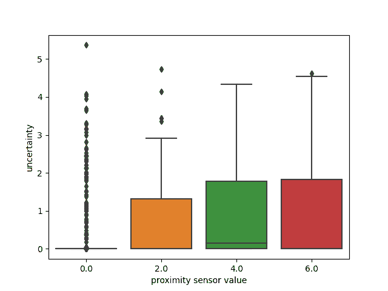

图 8.14：与增加的接近传感器值相关的不确定性估计分布

如我们所见，模型的不确定性估计随着传感器值的增加而增加。这是因为，在前 50 个回合中，我们的智能体学会了避开环境的中心（因为障碍物就在这里）——因此，它习惯了较低（或为零）的接近传感器值。这意味着较高的传感器值是异常的，因此能够被模型的不确定性估计所捕捉到。然后，我们的智能体通过使用不确定性感知 MPC 方程，成功地解决了这种不确定性。

在这个示例中，我们看到了如何将 BDL 应用于强化学习，以促进强化学习智能体更谨慎的行为。尽管这里的示例相对基础，但其含义却相当深远：想象一下将其应用于安全关键的应用场景。在这些环境中，如果满足更好的安全要求，我们往往愿意接受模型性能较差。因此，BDL 在安全强化学习领域中占有重要地位，能够开发出适用于安全关键场景的强化学习方法。

在下一节中，我们将看到如何使用 BDL 创建对抗性输入具有鲁棒性的模型，这是现实世界应用中的另一个关键考虑因素。

## 8.6 对抗性输入的易感性

在*第三章*、*深度学习基础*中，我们看到通过稍微扰动图像的输入像素，可以欺骗 CNN。原本清晰看起来像猫的图片，被高置信度地预测为狗。我们创建的对抗性攻击（*FSGM*）是许多对抗性攻击之一，BDL 可能提供一定的防护作用。让我们看看这在实践中是如何运作的。

#### 第一步：模型训练

我们不是使用预训练模型，如在*第三章*、*深度学习基础*中所做的那样，而是从零开始训练一个模型。我们使用与*第三章*、*深度学习基础*中相同的训练和测试数据——有关如何加载数据集，请参见该章节。提醒一下，数据集是一个相对较小的猫狗数据集。我们首先定义我们的模型。我们使用类似 VGG 的架构，但在每个`MaxPooling2D`层之后加入了 dropout：

```py

def conv_block(filters): 
return [ 
tf.keras.layers.Conv2D( 
filters, 
(3, 3), 
activation="relu", 
kernel_initializer="he_uniform", 
), 
tf.keras.layers.MaxPooling2D((2, 2)), 
tf.keras.layers.Dropout(0.5), 
] 

model = tf.keras.models.Sequential( 
[ 
tf.keras.layers.Conv2D( 
32, 
(3, 3), 
activation="relu", 
input_shape=(160, 160, 3), 
kernel_initializer="he_uniform", 
), 
tf.keras.layers.MaxPooling2D((2, 2)), 
tf.keras.layers.Dropout(0.2), 
*conv_block(64), 
*conv_block(128), 
*conv_block(256), 
*conv_block(128), 
tf.keras.layers.Conv2D( 
64, 
(3, 3), 
activation="relu", 
kernel_initializer="he_uniform", 
), 
tf.keras.layers.Flatten(), 
tf.keras.layers.Dense(64, activation="relu"), 
tf.keras.layers.Dropout(0.5), 
tf.keras.layers.Dense(2), 
] 
) 

```

然后，我们对数据进行归一化，并编译和训练模型：

```py

train_dataset_divprocessed = train_dataset.map(lambda x, y: (x / 255., y)) 
val_dataset_divprocessed = validation_dataset.map(lambda x, y: (x / 255., y)) 

model.compile(optimizer=tf.keras.optimizers.Adam(learning_rate=0.001), 
loss=tf.keras.losses.CategoricalCrossentropy(from_logits=True), 
metrics=['accuracy']) 
model.fit( 
train_dataset_divprocessed, 
epochs=200, 
validation_data=val_dataset_divprocessed, 
)
```

这将使我们的模型准确率达到大约 85%。

#### 第二步：运行推理并评估我们的标准模型

现在我们已经训练好了我们的模型，让我们看看它对抗对抗攻击的保护效果有多好。在*第三章**深度学习基础*中，我们从头开始创建了一个对抗攻击。在本章中，我们将使用`cleverhans`库来为多个图像一次性创建相同的攻击：

```py

from cleverhans.tf2.attacks.fast_gradient_method import ( 
fast_gradient_method as fgsm, 
)
```

首先，让我们衡量我们确定性模型在原始图像和对抗图像上的准确率：

```py

Predictions_standard, predictions_fgsm, labels = [], [], [] 
for imgs, labels_batch in test_dataset: 
imgs /= 255\. 
predictions_standard.extend(model.predict(imgs)) 
imgs_adv = fgsm(model, imgs, 0.01, np.inf) 
predictions_fgsm.extend(model.predict(imgs_adv)) 
  labels.extend(labels_batch)
```

现在我们有了我们的预测结果，我们可以打印出准确率：

```py

accuracy_standard = CategoricalAccuracy()( 
labels, predictions_standard 
).numpy() 
accuracy_fgsm = CategoricalAccuracy()( 
labels, predictions_fgsm 
).numpy() 
print(f"{accuracy_standard=.2%}, {accuracy_fsgm=:.2%}") 
# accuracy_standard=83.67%, accuracy_fsgm=30.70%
```

我们可以看到，我们的标准模型对这种对抗攻击几乎没有提供任何保护。尽管它在标准图像上的表现相当不错，但它在对抗图像上的准确率仅为 30.70%！让我们看看一个贝叶斯模型能否做得更好。因为我们训练了带 dropout 的模型，我们可以很容易地将其转变为 MC dropout 模型。我们创建一个推理函数，在推理过程中保持 dropout，如`training=True`参数所示：

```py

import numpy as np 

def mc_dropout(model, images, n_inference: int = 50): 
return np.swapaxes(np.stack([ 
model(images, training=True) for _ in range(n_inference) 
  ]), 0, 1)
```

有了这个函数，我们可以用 MC dropout 推理替代标准的循环。我们再次跟踪所有的预测，并对标准图像和对抗图像进行推理：

```py

Predictions_standard_mc, predictions_fgsm_mc, labels = [], [], [] 
for imgs, labels_batch in test_dataset: 
imgs /= 255\. 
predictions_standard_mc.extend( 
mc_dropout(model, imgs, 50) 
) 
imgs_adv = fgsm(model, imgs, 0.01, np.inf) 
predictions_fgsm_mc.extend( 
mc_dropout(model, imgs_adv, 50) 
) 
  labels.extend(labels_batch)
```

我们可以再次打印出我们的准确率：

```py

accuracy_standard_mc = CategoricalAccuracy()( 
labels, np.stack(predictions_standard_mc).mean(axis=1) 
).numpy() 
accuracy_fgsm_mc = CategoricalAccuracy()( 
labels, np.stack(predictions_fgsm_mc).mean(axis=1) 
).numpy() 
print(f"{accuracy_standard_mc=.2%}, {accuracy_fgsm_mc=:.2%}") 
# accuracy_standard_mc=86.60%, accuracy_fgsm_mc=80.75%
```

我们可以看到，简单的修改使得模型设置在面对对抗样本时更加稳健。准确率从约 30%提高到了 80%以上，接近于确定性模型在未扰动图像上的 83%的准确率。此外，我们还可以看到，MC dropout 也使得我们的标准图像准确率提高了几个百分点，从 83%提升到了 86%。几乎没有任何方法能够完美地对抗对抗样本，因此能够接近我们模型在标准图像上的准确率是一个伟大的成就。

因为我们的模型之前没有见过对抗图像，所以一个具有良好不确定性值的模型应该在对抗图像上相对于标准模型表现出更低的平均信心。让我们看看是否是这样。我们创建一个函数来计算我们确定性模型预测的平均 softmax 值，并为 MC dropout 预测创建一个类似的函数：

```py

def get_mean_softmax_value(predictions) -*>* float: 
mean_softmax = tf.nn.softmax(predictions, axis=1) 
max_softmax = np.max(mean_softmax, axis=1) 
mean_max_softmax = max_softmax.mean() 
return mean_max_softmax 

def get_mean_softmax_value_mc(predictions) -*>* float: 
predictions_np = np.stack(predictions) 
predictions_np_mean = predictions_np.mean(axis=1) 
  return get_mean_softmax_value(predictions_np_mean)
```

然后，我们可以打印出两个模型的平均 softmax 分数：

```py

mean_standard = get_mean_softmax_value(predictions_standard) 
mean_fgsm = get_mean_softmax_value(predictions_fgsm) 
mean_standard_mc = get_mean_softmax_value_mc(predictions_standard_mc) 
mean_fgsm_mc = get_mean_softmax_value_mc(predictions_fgsm_mc) 
print(f"{mean_standard=:.2%}, {mean_fgsm=:.2%}") 
print(f"{mean_standard_mc=:.2%}, {mean_fgsm_mc=:.2%}") 
# mean_standard=89.58%, mean_fgsm=89.91% 
# mean_standard_mc=89.48%, mean_fgsm_mc=85.25%
```

我们可以看到，与标准图像相比，我们的标准模型在对抗图像上的信心实际上稍微更高，尽管准确率显著下降。然而，我们的 MC dropout 模型在对抗图像上的信心低于标准图像。虽然信心的下降幅度不大，但我们很高兴看到，尽管准确率保持合理，模型在对抗图像上的平均信心下降了。

## 8.7 总结

在本章中，我们通过五个不同的案例研究展示了现代 BDL 的各种应用。每个案例研究都使用了代码示例，突出了 BDL 在应对应用机器学习实践中的各种常见问题时的特定优势。首先，我们看到如何使用 BDL 在分类任务中检测分布外图像。接着，我们探讨了 BDL 方法如何用于使模型更加鲁棒，以应对数据集偏移，这是生产环境中一个非常常见的问题。然后，我们学习了 BDL 如何帮助我们选择最有信息量的数据点，以训练和更新我们的机器学习模型。接着，我们转向强化学习，看到 BDL 如何帮助强化学习代理实现更加谨慎的行为。最后，我们看到了 BDL 在面对对抗性攻击时的应用。

在下一章中，我们将通过回顾当前趋势和最新方法来展望 BDL 的未来。

## 8.8 进一步阅读

以下阅读清单将帮助你更好地理解我们在本章中涉及的一些主题：

+   *基准测试神经网络对常见损坏和* *扰动*的鲁棒性，Dan Hendrycks 和 Thomas Dietterich，2019 年：这篇论文介绍了图像质量扰动，以基准测试模型的鲁棒性，正如我们在鲁棒性案例研究中看到的那样。

+   *你能信任模型的不确定性吗？评估数据集偏移下的* *预测不确定性*，Yaniv Ovadia、Emily Fertig 等，2019 年：这篇比较论文使用图像质量扰动，在不同的严重程度下引入人工数据集偏移，并衡量不同的深度神经网络在准确性和校准方面如何响应数据集偏移。

+   *用于检测神经网络中误分类和分布外* *样本的基准*，Dan Hendrycks 和 Kevin Gimpel，2016 年：这篇基础性的分布外检测论文介绍了该概念，并表明当涉及到分布外（OOD）检测时，softmax 值并不完美。

+   *提高神经网络中分布外图像检测的可靠性*，Shiyu Liang、Yixuan Li 和 R. Srikant，2017 年：表明输入扰动和温度缩放可以改善用于分布外检测的 softmax 基准。

+   *用于检测分布外* *样本和对抗性攻击的简单统一框架*，Kimin Lee、Kibok Lee、Honglak Lee 和 Jinwoo Shin，2018 年：表明使用马哈拉诺比斯距离在分布外检测中可能是有效的。
