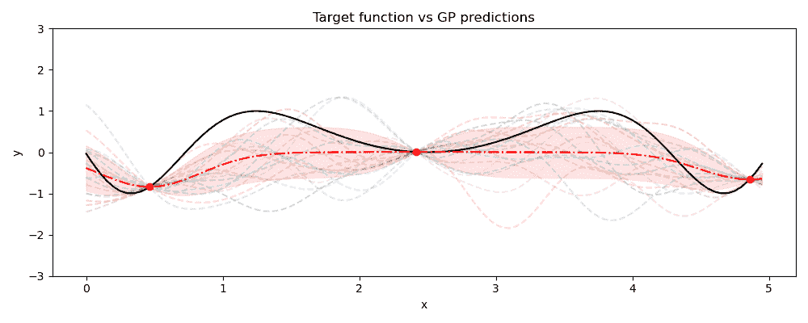

# 第九章

贝叶斯深度学习的下一步

在本书中，我们已经介绍了贝叶斯深度学习（BDL）的基本概念，从理解什么是不确定性及其在开发稳健的机器学习系统中的作用，到学习如何实现和分析几个基本 BDL 的性能。虽然你所学到的内容足以帮助你开始开发自己的 BDL 解决方案，但该领域发展迅速，许多新技术正在涌现。

在本章中，我们将回顾 BDL 的当前趋势，然后深入探讨该领域的一些最新发展。最后，我们将介绍一些 BDL 的替代方法，并提供一些建议，介绍你可以使用的额外资源，帮助你继续深入贝叶斯机器学习方法的探索。

我们将涵盖以下章节：

+   当前 BDL 的趋势

+   BDL 方法是如何应用于解决现实问题的？

+   BDL 的最新方法

+   BDL 的替代方法

+   你在 BDL 中的下一步

## 9.1 当前 BDL 的趋势

在本节中，我们将探讨 BDL 的当前趋势。我们将查看哪些模型在文献中尤为流行，并讨论为何某些模型被选用于特定应用。这将为你提供一个关于本书中涵盖的基础知识如何更广泛应用于各种应用领域的良好印象。

图 9.1：BDL 关键搜索词的流行度随时间的变化

正如我们在*图* 9.1 中看到的，过去十年与 BDL 相关的搜索词的流行度显著增加。毫不奇怪，这与深度学习相关搜索词的流行趋势一致，正如我们在*图* *9.2*中看到的；随着深度学习的普及，人们对量化 DNN 预测结果的不确定性的兴趣也随之增加。有趣的是，这些图表都显示了在 2021 年中至晚期流行度出现了类似的下降，表明只要深度学习受欢迎，BDL 也会受到关注。

图 9.2：关键深度学习搜索词的流行度随时间的变化

*图* 9.1 展示了另一个有趣的观点，一般而言，术语*变分推断*比我们在此使用的另外两个 BDL 相关的搜索词更受欢迎。如在*第五章*中提到的，*贝叶斯深度学习的原则性方法*中我们讨论了变分自编码器，变分推断是 BDL 的一部分，在机器学习社区产生了显著影响，现在已成为许多不同深度学习架构的一个特点。因此，它比明确包含“贝叶斯”一词的术语更受欢迎也就不足为奇了。

那么，我们在书中探讨的那些方法在它们的流行度和在各种深度学习解决方案中的应用情况如何呢？我们可以通过简单地查看每篇原始论文的引用次数来了解更多信息。

图 9.3：深度学习关键搜索词的流行度随时间变化

在*图 9.3*中，我们看到 MC dropout 论文在引用次数上遥遥领先——几乎是第二种最受欢迎方法的两倍。到目前为止，书中已经相当清楚地说明了这个原因：它不仅是最容易实现的方法之一（正如我们在*第六章*，*使用标准工具箱进行贝叶斯深度学习*中看到的），而且从计算角度来看，它也是最具吸引力的之一。它所需的内存与标准神经网络相同，而且正如我们在*第七章*中看到的，*贝叶斯深度学习的实际考虑*，它也是运行推理时最快的模型之一。这些实际因素在选择模型时通常比不确定性质量等因素更重要。

实际考虑因素很可能是第二种最流行方法——深度集成法的原因。虽然从训练时间来看，这可能不是最高效的方法，但通常推理的速度才是最重要的：再次回顾*第七章*，*贝叶斯深度学习的实际考虑*的结果，我们看到尽管需要对多个不同的网络进行推理，集成法在这里表现优异。

深度集成法通常在实现的简便性和理论考虑之间取得良好的平衡：正如在*第六章*，*使用标准工具箱进行贝叶斯深度学习*中讨论的那样，集成法是机器学习中的一个强大工具，因此，神经网络集成法表现良好并且通常能生成良好的不确定性估计也就不足为奇了。

排名第三和第四的最后两种方法是 BBB 和 PBP。虽然 BBB 比 PBP 更容易实现，但由于它需要一些概率组件，通常意味着——尽管在许多情况下它可能是最合适的工具——机器学习工程师可能不了解它，或者不习惯实现它。PBP 则更为极端：正如我们在*第五章*中所看到的，*贝叶斯深度学习的原则性方法*，实现 PBP 不是一项简单的任务。写作时，没有深度学习框架提供易用且经过优化的 PBP 实现——除了 BDL 社区外，许多机器学习研究人员和实践者根本不知道它的存在，这一点从它的引用次数较少可以看出（尽管它的引用数量仍然相当可观！）。

对贝叶斯深度学习方法流行度的分析似乎讲述了一个相当清晰的故事：BNN 方法的选择主要是基于实现的简便性。事实上，有大量文献讨论了使用 BDL 方法进行不确定性估计，而没有考虑模型不确定性估计的*质量*。幸运的是，随着不确定性感知方法的日益流行，这一趋势开始下降，我们希望本书已为你提供了必要的工具，使你在选择 BNN 方法时更加有原则。不论所使用的方法或其选择方式如何，很明显，机器学习研究人员和实践者对 BDL 方法越来越感兴趣——那么这些方法到底是用来做什么的呢？让我们来看看。

## 9.2 BDL 方法如何应用于解决实际问题？

就像深度学习正在对各种应用领域产生影响一样，BDL 正在成为越来越重要的工具，特别是在安全关键或任务关键系统中使用大量数据的情况下。在这些场景中——正如大多数实际应用所面临的情况——能够量化模型何时“知道自己不知道”对于开发可靠且稳健的系统至关重要。

BDL 的一个重要应用领域是安全关键系统。在他们 2019 年发表的论文《*具有模型不确定性估计的安全强化学习*》中，Björn Lütjens *等人*展示了使用 BDL 方法可以在避撞场景中产生更安全的行为（这是我们在*第八章*中强化学习示例的灵感来源，*应用贝叶斯深度学习*）。

类似地，在论文《*不确定性感知深度学习用于安全着陆点选择*》中，作者 Katharine Skinner *等人*探讨了如何利用贝叶斯神经网络进行行星表面着陆点的自主危险检测。这项技术对于促进自主着陆至关重要，最近深度神经网络（DNNs）在这一应用中展现了显著的能力。在他们的论文中，Skinner *等人*展示了不确定性感知模型的使用能够改善安全着陆点的选择，甚至使得能够从大量噪声的传感器数据中选择安全的着陆点。这证明了贝叶斯深度学习（BDL）在提高深度学习方法的*安全性*和*鲁棒性*方面的能力。

鉴于贝叶斯神经网络在安全关键场景中的日益流行，它们也被应用于医疗领域就不足为奇了。正如我们在*第一章*中提到的，*深度学习时代的贝叶斯推理*，深度学习在医学影像领域表现出了特别强的性能。然而，在这些关键应用中，不确定性量化至关重要：技术人员和诊断人员需要能够理解模型预测的误差范围。在论文《*迈向安全深度学习：精确量化神经网络预测中的生物标志物不确定性*》中，Zach Eaton-Rosen *等人*应用了贝叶斯深度学习（BDL）方法来量化使用深度网络进行肿瘤体积估计时的生物标志物不确定性。他们的工作展示了贝叶斯神经网络可以用来设计具有良好标定误差条的深度学习系统。这些高质量的不确定性估计对于深度网络模型在临床中的安全使用至关重要，因此贝叶斯深度学习方法在诊断应用中显得尤为重要。

随着技术的进步，我们收集和组织数据的能力也在不断提升。这一趋势将许多“少数据”问题转变为“海量数据”问题——这并非坏事，因为更多的数据意味着我们能够更深入地了解生成数据的底层过程。一个例子就是地震监测：近年来，密集的地震监测网络显著增加。这从监测的角度来看是极好的：科学家现在比以往拥有更多的数据，因此能够更好地理解和监测地球物理过程。然而，为了做到这一点，他们还需要能够从大量高维数据中进行学习。

在他们的论文《*贝叶斯深度学习与不确定性量化应用于荷兰格罗宁根天然气田的诱发地震位置：*我们需要什么才能确保 AI 安全？》中，作者陈谷*等人*探讨了格罗宁根气藏的地震监测问题。正如他们在论文中提到的，虽然深度学习已被应用于许多地球物理问题，但使用不确定性感知的深度网络仍然罕见。他们的工作展示了贝叶斯神经网络可以成功地应用于地球物理问题，并且在格罗宁根气藏的案例中，从安全关键和任务关键两个角度来看，都可能至关重要。从安全角度来看，这些方法可以利用大量数据开发模型，推测地面运动活动，并用于地震预警系统。从任务关键的角度来看，相同的数据可以通过这些方法输入，以生成能够进行储层生产估算的模型。

在这两种情况下，若要将这些方法应用于任何实际系统，**不确定性量化**是关键，因为信任错误预测的后果可能是代价高昂甚至灾难性的。

这些例子让我们对 BDL 在现实世界中的应用有了一些了解。与之前的其他机器学习解决方案一样，随着这些方法在越来越多样化的应用场景中被使用，我们也越来越了解其潜在的不足之处。在下一节中，我们将了解一些该领域的最新进展，基于书中介绍的核心方法，开发出越来越强大的 BNN 近似。

## 9.3 BDL 中的最新方法

在本书中，我们介绍了一些 BDL 中使用的核心技术：反向传播贝叶斯（BBB）、概率反向传播（PBP）、蒙特卡洛 dropout（MC dropout）和深度集成方法。你在文献中遇到的许多 BNN 方法都会基于这些技术，而掌握这些技术为你提供了一套多功能的工具箱，可以帮助你开发自己的 BDL 解决方案。然而，正如机器学习的其他方面一样，BDL 领域正在迅速发展，新的技术也在不断涌现。在本节中，我们将探讨该领域的一些最新进展。

### 9.3.1 结合 MC dropout 和深度集成方法

为什么只使用一种贝叶斯神经网络技术，而不使用两种呢？爱丁堡大学的研究人员 Remus Pop 和 Patric Fulop 在他们的论文《深度集成贝叶斯主动学习：通过集成解决蒙特卡罗 Dropout 中的模式崩溃问题》中正是采用了这种方法。在这项工作中，Pop 和 Fulop 描述了使用**主动学习**使深度学习方法在标签数据耗时或昂贵的应用中变得可行的问题。这里的问题是，正如我们之前讨论过的，深度学习方法已经在一系列医学影像任务中证明了其巨大的成功。问题在于，这些数据需要经过仔细标注，并且为了使深度网络达到高水平的性能，它们需要*大量*这样的数据。

因此，机器学习研究者提出了主动学习方法，通过使用**获取函数**来自动评估新数据点并将其添加到数据集中，以确定何时将新数据添加到训练集中。模型的不确定性估计是关键的一环：它提供了新数据点与模型当前理解领域的关系的关键衡量标准。在他们的论文中，Pop 和 Fulop 展示了一个流行的**深度贝叶斯主动学习（DBAL）**方法的关键缺陷：即 MC dropout 模型中使用的过度自信。在他们的论文中，作者通过将深度集成和 MC dropout 结合在一个模型中来解决这个问题。他们证明，得到的模型具有更好的校准不确定性估计，从而纠正了 MC dropout 所表现出的过度自信预测。最终提出的方法，被称为**深度** **集成贝叶斯主动学习**，为在数据获取困难或昂贵的应用中稳健地采用深度学习方法提供了一个框架——再次证明 BDL 在将深度网络应用于现实世界中的重要性。

图 9.4：结合 MC dropout 和深度集成网络的示意图

将深度集成和 MC dropout 结合的这种方法也已应用于其他领域。例如，Lütjens 等人之前提到的碰撞避免论文也使用了结合 MC dropout 和深度集成网络的方法。这表明，选择一种网络而非另一种网络并不总是最优解——有时，结合不同方法是开发稳健且更好校准的 BDL 解决方案的关键。

### 9.3.2 通过促进多样性来改进深度集成

正如我们在本章前面看到的，按照引用次数来判断，深度集成是本书中介绍的关键 BDL 技术中第二受欢迎的技术。因此，研究人员一直在探索改进深度集成标准实现的方法，这也就不足为奇了。

在 Tim Pearce *等*人的论文《神经网络中的不确定性：近似贝叶斯集成》中，作者强调，标准的深度集成方法因其非贝叶斯性质而受到批评，并认为标准方法在许多情况下缺乏多样性，从而产生了描述性较差的后验分布。换句话说，深度集成通常由于缺乏多样性，导致过于自信的预测。

为了弥补这一点，作者提出了一种他们称之为**锚定** **集成**的方法。锚定集成像深度集成一样，使用神经网络的集成。然而，它使用了一种特别适配的损失函数，惩罚集成成员的参数过度偏离其初始值。我们来看看：

这里，*Loss*[*j*] 是计算出的第 *j* 个网络的损失。我们在方程中看到了一个熟悉的损失形式，即 ||**y** − **y**||[2]²。Γ 是一个对角正则化矩阵，*𝜃*[*j*] 是网络的参数。这里的关键是 *𝜃*[*j*] 与 *𝜃*[*anc,j*] 变量之间的关系。这里，*anc* 表示该方法名称中的锚定。参数 *𝜃*[*anc,j*] 是第 *j* 个网络的初始参数集。因此（如通过乘法所示），如果该值很大——换句话说，如果 *𝜃*[*j*] 和 *𝜃*[*anc,j*] 相差很大——损失将增加。因此，如果网络的参数偏离其初始值太远，这会惩罚集成中的网络，迫使它们找到能够尽量保持接近初始值的参数，同时最小化方程中的第一项。

这一点非常重要，因为如果我们使用一种更可能产生多样化初始参数值的初始化策略，那么保持这种多样性将确保我们的集成在训练后包含多样化的网络。正如作者在论文中展示的那样，这种多样性是产生原则性不确定性估计的关键：确保网络预测在高数据区域收敛，而在低数据区域发散，就像我们在*第二章*和*贝叶斯推断基础*的高斯过程示例中看到的那样。

图 9.5：使用高斯过程获得的原则性不确定性估计示意图

提醒一下，这里的实线是实际函数，点是函数的样本，虚线是高斯过程的均值预测，浅灰色虚线是可能函数的样本，阴影区域表示不确定性。

在他们的论文中，Pearce *等*人展示了他们的锚定集成方法能够比标准深度集成方法更接近地逼近这样的描述性后验分布。

### 9.3.3 超大网络中的不确定性

本书的核心目标是介绍在 DNN 中近似贝叶斯推断的方法，但我们尚未讨论如何将其应用于近年来最成功的神经网络架构之一：变换器。变换器—就像之前的典型深度网络一样—在多种任务中实现了突破性性能。尽管深度网络已经能够处理大量数据，变换器将其推向了一个新高度：处理巨量数据，拥有数百亿的参数。其中最著名的变换器网络之一是 GPT-3，这是由 OpenAI 开发的变换器，包含超过 1750 亿个参数。

变换器最初用于**自然语言处理**（**NLP**）任务，并展示了通过使用自注意力机制和足够的数据量，可以在不使用递归神经网络的情况下实现竞争性性能。这是神经网络架构发展的一个重要步骤：展示了可以通过自注意力机制学习序列上下文，并提供能够从前所未有的数据量中学习的架构。

图 9.6：变换器架构示意图

然而，就像之前更典型的深度网络一样，变换器的参数是点估计，而不是分布，因此无法用于不确定性量化。作者徐博扬*等人*在他们的论文《*贝叶斯变换器语言模型用于语音识别*》中试图解决这个问题。在他们的工作中，他们展示了变分推断可以成功地应用于变换器模型，从而促进了近似贝叶斯推断。然而，由于变换器的庞大规模，对所有参数进行贝叶斯参数估计是非常昂贵的。因此，徐博扬*等人*将贝叶斯估计应用于模型参数的一个子集，特别是前馈和多头自注意力模块中的参数。正如我们在*图* *9.6*中看到的，这排除了相当多的层，从而节省了计算周期。

论文《*变换器可以进行贝叶斯推断*》中，由 Samuel Müller*等人*提出的另一种方法，通过利用训练变换器时使用的大量数据来近似贝叶斯推断。在他们的方法中，称为**先验数据拟合网络（PFNs）**，作者将后验近似问题重新表述为一个监督学习任务。也就是说，他们的方法不是通过采样获得预测分布，而是直接从数据集样本中学习近似后验预测分布。

算法 1：PFN 模型训练过程   **输入：** 数据集的先验分布 *p*(*D*)，从中可以抽取样本，抽取的样本数为 *K*

**输出：** 一个模型 *q𝜃* 用于近似 PPD，初始化神经网络 *q𝜃*

**for** i:=1 到 10 **do**- 1:    `采样` *D* ∪ (*x*[*i*]*,y*[*i*])[*i*=1]^(*m*) ≈ *p*(*D*)

2:  `计算随机损失近似` *l*[*𝜃*] = ∑ [*i*=1]^(*m*)(−log *q**𝜃*)

3:  *使用随机梯度下降更新参数* *𝜃* *，基于* ▿[*𝜃*]*l*[*𝜃*] =0

如此伪代码所示，在训练过程中，模型会采样多个数据子集，这些子集包含输入 *x* 和标签 *y*。接着，它会屏蔽掉一个标签，并学习基于其他数据点对该标签做出概率预测。这使得 PFN 能够在单次前向传递中进行概率推断——类似于我们在*第五章* 和 *贝叶斯深度学习的原则方法*中看到的 PBP。尽管在单次前向传递中逼近贝叶斯推断对于任何应用来说都是理想的，但对于具有大量参数的 transformers 来说，这种方法更具价值——因此，这里描述的 PFN 方法尤其具有吸引力。

当然，transformers 在迁移学习中被广泛应用：使用 transformers 提取的丰富特征嵌入作为输入，送入计算要求较低的较小网络。因此，在贝叶斯背景下，使用 transformers 的嵌入作为 BDL 网络的输入，可能是最明显的使用方式——事实上，在许多情况下，这可能是最合理的第一步。

在本节中，我们探讨了贝叶斯深度学习（BDL）中的一些最新进展。所有这些都建立在本书中介绍的方法之上，并直接应用于这些方法。当你为近似贝叶斯推断开发自己的深度网络解决方案时，你可能想考虑实现这些进展。然而，鉴于机器学习研究的快速进展，贝叶斯近似的改进列表不断增长，我们鼓励你亲自探索文献，了解研究人员如何在大规模实现贝叶斯推断，并利用各种计算和理论优势。不过，BDL 并不总是正确的解决方案，在下一节中，我们将探讨其原因。

## 9.4 贝叶斯深度学习的替代方法

尽管本书的重点是使用深度神经网络（DNN）进行贝叶斯推断，但它们并不总是最合适的选择。一般而言，当你拥有大量高维数据时，深度网络是一个很好的选择。正如我们在*第三章*，*深度学习基础*中所讨论的（以及你可能已经知道的），深度网络在这些场景中表现优异，因此将它们应用于贝叶斯推断是一个明智的选择。另一方面，如果你拥有的是少量低维数据（特征数十个，数据点少于 10,000），那么你可能更适合使用更传统、更有原则的贝叶斯推断方法，例如通过采样或高斯过程。

话虽如此，关于扩展高斯过程的研究一直备受关注，研究社区已经开发出能够处理大量数据并能进行复杂非线性变换的基于高斯过程的方法。在这一节中，我们将介绍这些替代方法，以便你如果有兴趣进一步探讨它们时，可以了解相关内容。

### 9.4.1 可扩展的高斯过程

在书的开头，我们介绍了高斯过程并讨论了为什么它们是机器学习中关于原则性和计算上可处理的不确定性量化的黄金标准。关键是，我们谈到了高斯过程的局限性：当数据维度高或数据量大时，它们变得计算上不可行。

然而，高斯过程（GP）是极其强大的工具，机器学习社区并没有准备放弃它们。在*第二章*，*贝叶斯推断基础*中，我们讨论了高斯过程训练和推断中的关键障碍因素：反转协方差矩阵。虽然有一些方法可以使这一过程更具计算可行性（例如，Cholesky 分解），但这些方法也只能做到一定程度。因此，使高斯过程可扩展的关键方法被称为*稀疏高斯过程*，它们通过稀疏高斯过程近似法来修改协方差矩阵，从而解决了不可处理的高斯过程训练问题。简单来说，如果我们能缩小或简化协方差矩阵（例如，通过减少数据点数量），就能使协方差矩阵的反演变得可行，从而使高斯过程训练和推断变得可处理。

其中最流行的方法之一是在 Edward Snelson 和 Zoubin Ghahramani 的论文《*使用伪输入的稀疏高斯过程*》中提出的。与其他稀疏高斯过程方法一样，作者们开发了一种利用大数据集的可处理高斯过程方法。在论文中，作者们展示了他们如何通过使用数据的子集来接近全数据集的训练：他们通过将*大数据*问题转化为*小数据*问题，实际上绕过了大数据问题。然而，做到这一点需要选择一个合适的数据子集，作者们称之为**伪** **输入**。

作者通过联合优化过程实现这一目标，该过程从完整数据集*N*中选择出数据子集*M*，同时优化核函数的超参数。这个优化过程实质上是寻找可以最好地描述整体数据的数据子集：我们在*图**9.7*中展示了这一点。

图 9.7：伪输入的简单示意图

在这个图示中，所有的数据点都有展示，但我们看到某些数据点被选中，因为它们描述了我们变量之间的关键关系。然而，这些点不仅需要描述关系，就像多项式回归可能做的那样——它们还需要复制底层数据中的*方差*，使得高斯过程（GP）依然能够产生良好校准的不确定性估计。换句话说，虽然伪输入有效地减少了数据点的数量，但伪输入的分布仍需近似真实输入的分布：如果真实数据分布中的某个区域数据丰富，从而在该区域产生有信心的预测，那么伪输入也需要满足这一点。

最近，由 Ke Wang *et* *al.*在他们的论文《*百万数据点上的精确高斯过程*》中提出了另一种可扩展高斯过程的方法。在这项工作中，作者利用了多 GPU 并行化方法的最新进展来实现可扩展高斯过程。使这一方法得以实现的技术被称为**黑盒矩阵-矩阵乘法**（**BBMM**），它将高斯过程推断问题简化为矩阵乘法的迭代过程。通过这样做，它使得该过程更容易进行并行化，因为矩阵乘法可以被划分并分配到多个 GPU 上。作者展示了这种方法将高斯过程训练的内存需求减少到每个 GPU 的*O*(*n*)。这使得高斯过程能够受益于深度学习方法在过去十多年里获得的计算优势！

这里呈现的两种方法都很好地解决了高斯过程（GP）面临的可扩展性问题。第二种方法尤其令人印象深刻，因为它实现了精确的高斯过程推断，但确实需要显著的计算基础设施。另一方面，伪输入方法在更大比例的使用场景中具有实用性。然而，这两种方法都未解决贝叶斯深度学习（BDL）的关键优势之一：深度网络通过复杂的非线性变换学习丰富的嵌入的能力。

### 9.4.2 深度高斯过程

深度高斯过程由 Andreas Damianou 和 Neil Lawrence 在他们标题直白的论文《*深度高斯过程*》中提出，深度高斯过程通过拥有多层高斯过程来解决丰富嵌入的问题，就像深度网络有多层神经元一样。与之前提到的可扩展高斯过程不同，深度高斯过程的提出正是受到可扩展性问题反向问题的启发：我们如何能用非常少的数据获得深度网络的性能？

面对这个问题，并且意识到高斯过程在少量数据上表现非常好，Damianou 和 Lawrence 着手研究是否可以将高斯过程分层，从而生成类似的丰富嵌入。

图 9.8：深度 GP 的示意图

它们的方法，尽管在实施上比较复杂，但原理很简单：正如一个深度神经网络（DNN）由许多层组成，每一层接收前一层的输入并将输出传递给后一层，深度高斯过程（GP）也假设有这种图形结构——正如我们在*图* *9.8*中看到的那样。从数学角度来看，就像深度网络一样，深度 GP 可以视为函数的组合。因此，之前展示的 GP 可以描述为：

虽然这将我们在深度学习中习惯的丰富非线性变换引入了高斯过程中，但这也带来了代价。正如我们已经知道的那样，标准的高斯过程在可扩展性方面存在限制。不幸的是，深度 GP 通过这种方式组合是分析上无法解决的。因此，Damianou 和 Lawrence 必须找到一种可行的实现深度 GP 的方法，他们通过一种现在你应该已经熟悉的工具：变分近似，解决了这一问题。正如它在本书中介绍的一些 BDL 方法中构成了重要的构建块一样，它也是使深度 GP 成为可能的关键组成部分。在他们的论文中，他们展示了如何借助变分近似实现深度 GP——这不仅使得使用 GP 生成丰富的非线性嵌入成为可能，而且使得在*少量* *数据*的情况下实现丰富的非线性嵌入成为可能。这使得深度 GP 成为贝叶斯方法工具箱中的一个重要工具，因此，它是一个值得记住的方法。

## 9.5 你在 BDL 中的下一步

在本章中，我们通过回顾一些可以帮助你改进书中探讨的基本方法的技术，完成了对 BDL 的介绍。我们还研究了如何将贝叶斯推理的强大标准——高斯过程——适应于一般用于深度学习的任务。虽然确实可以将高斯过程适应这些任务，但我们也建议，一般来说，使用本书中介绍的方法或从中衍生的方法会更容易且更实用。像往常一样，作为机器学习工程师，你需要自己判断什么方法最适合当前的任务，我们相信本书的内容将为你迎接未来的挑战提供充足的准备。

虽然本书为你提供了开始的必要基础，但在如此快速发展的领域中，总有更多的东西值得学习！在下一节中，我们将提供一些关键的最终建议，帮助你规划下一步的学习与应用 BDL 的过程。

我们希望您觉得这篇关于贝叶斯深度学习的介绍内容既全面、实用又有趣。感谢您的阅读——我们祝愿您在进一步探索这些方法并将其应用到您自己的机器学习解决方案中时取得成功。

## 9.6 进一步阅读

以下阅读推荐适合那些希望进一步了解本章所呈现的最新方法的读者。这些资源为当前领域中的挑战提供了极好的洞察，关注的不仅仅是贝叶斯神经网络，还包括更广泛的可扩展贝叶斯推断：

+   *深度集成贝叶斯主动学习*，Pop 和 Fulop：本文展示了将深度集成与 MC dropout 结合的优势，能够提供更精确的预测不确定性估计，正如在应用该方法到主动学习任务时所展示的那样。

+   *神经网络中的不确定性：近似贝叶斯集成*，Pearce 等人：本文介绍了一种简单且有效的方法，用于提高深度集成的性能。作者展示了通过对损失函数做简单调整来促进多样性，从而使得集成能够生成更为精确的不确定性估计。

+   *使用伪输入的稀疏高斯过程*，Snelson 和 Gharamani：本文介绍了基于伪输入的高斯过程概念，提出了可扩展高斯过程推断中的一个关键方法。

+   *百万数据点上的精确高斯过程*，Wang 等人：一篇重要论文，展示了通过使用 BBMM 技术，高斯过程可以受益于计算硬件的发展，使得大数据的精确高斯过程推断成为可能。

+   *深度高斯过程*，Damianou 和 Lawrence：引入深度高斯过程（GPs）这一概念，本文展示了如何使用高斯过程实现复杂的非线性变换，且所需的数据集远小于深度学习所需的数据集。

我们挑选了一些关键资源，帮助您进入贝叶斯深度学习的下一阶段，让您深入理论并帮助您更好地利用本章内容：

+   *机器学习：一种概率视角*，Murphy：该书于 2012 年发布，之后成为机器学习领域的核心教材之一，呈现了一种理解机器学习中所有关键方法的合理方法。该书的概率视角使其成为贝叶斯文献收藏中的一大亮点。

+   *概率机器学习：入门*，Murphy：另一篇较新的 Murphy 作品。该书于 2022 年发布，提供了关于概率机器学习（包括贝叶斯神经网络部分）的详细内容。尽管与 Murphy 之前的作品有所重叠，但两者都值得拥有，且各有其独到之处。

+   *机器学习中的高斯过程*，拉斯穆森和威廉姆斯：也许是关于高斯过程最重要的文本，这本书在贝叶斯推断中具有极高的价值。作者对高斯过程的详细解释将帮助你全面理解贝叶斯难题中的这一重要部分。

+   *Python 中的贝叶斯分析*，马丁：涵盖了贝叶斯分析的所有基础知识，这本书是一本出色的基础文献，将帮助你更深入地理解贝叶斯推断的基础。
