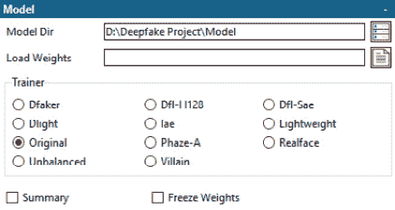

# 第四章：深度伪造工作流程

创建深度伪造是一个复杂的过程。各种软件应用程序中的工具有助于显著减少所需的手动工作量；然而，它们并不能完全消除这一需求。大部分手动工作涉及收集和整理原始材料，以及为最终交换清理数据。

尽管有各种用于创建深度伪造的应用程序，但本章将使用开源软件 Faceswap ([`www.Faceswap.dev`](http://www.Faceswap.dev))。创建深度伪造的一般工作流程在各个应用程序之间是相同的，但您会发现细微差别和可用选项在不同软件包之间有所不同。

值得注意的是，Faceswap 在本质上是一个命令行应用程序。然而，它还附带了一个图形用户界面（GUI），该界面作为包装器来启动各种进程。在本章中，我们将使用 GUI 来展示工作流程；然而，这里执行的大多数任务也可以从命令行运行。

本章将涵盖从交换的初始阶段到最终产品的整个深度伪造工作流程。具体来说，以下内容将被涉及：

+   确定适合交换的候选对象

+   准备训练图像

+   训练模型

+   将训练好的模型应用于执行交换

# 技术要求

与所有机器学习技术一样，深度伪造可以在具有至少 4 GB RAM 的任何 PC 上创建。然而，强烈建议使用具有 8 GB 或更高 RAM 和 GPU（显卡）的机器。在 CPU 上训练模型可能需要数月才能完成，这并不现实。显卡专门设计用于执行矩阵计算，这使得它们非常适合机器学习任务。

Faceswap 可在 Linux、Windows 和基于 Intel 的 macOS 系统上运行。至少，Faceswap 应该在具有 4 GB VRAM（GPU 内存）的系统上运行。理想情况下，应使用 NVIDIA GPU，因为 AMD GPU 的功能不如其 Nvidia 对手全面，且运行速度较慢。由于 NVIDIA 的专有 CUDA 库被接受为机器学习的行业标准，因此一些 NVIDIA 用户可用的功能对 AMD 用户不可用。具有更多 VRAM 的 GPU 可以运行比小 GPU 更多的较大 Faceswap 模型。

还可以通过租赁云服务（如 Google 的云计算或 Amazon 的 AWS）来远程运行 Faceswap。

本章将不涵盖软件的安装和设置，因为方法会因操作系统而异，详细的安装说明可以在 Faceswap 网站上找到 ([`forum.Faceswap.dev/viewforum.php?f=4`](https://forum.Faceswap.dev/viewforum.php?f=4))).

# 确定适合交换的候选对象

虽然技术上可以将任何面部与另一个面部交换，但要创建一个令人信服的深度伪造，需要关注源面和目标面的属性。根据你希望从你的深度伪造中实现的目标，这可能对你来说更重要或更不重要，但假设你希望创建一个令人信服的交换，你应该注意以下属性。

+   **面部/头部形状**：面部的形状是否相似？如果一个面部非常窄而另一个非常圆，那么尽管面部特征将是正确的，但如果最终交换包含一个与你要尝试针对的个人显著不同的头部形状，那么最终交换可能不会特别令人信服。

+   **发际线/发型**：虽然可以进行整个头部的交换，但这些通常更难实现，因为头发很复杂，发型也可能有显著变化。你通常会交换面部，但保留原始材料中的头发，因此当你考虑交换时，需要考虑发际线和发型。

+   **肤色**：神经网络将在匹配你训练模型时使用的面部之间的肤色方面做一些工作；然而，这只能在一定程度上起作用。由于原始面部的某些属性很可能仍然存在于最终交换中，当它融合到原始框架中时，确保两个面部的自然肤色没有显著差异是很重要的。

一旦你确定了用于创建深度伪造的候选人，就是时候收集数据来训练模型了。

# 准备训练图像

在本节中，我们将收集、提取和整理图像以训练我们的模型。收集面部数据最好的来源无疑是视频文件。视频只是一系列静态图像，但因为你可以在标准 25 FPS 文件中每秒获得 25 张静态图像，所以它们是一个宝贵且丰富的资源。视频还可能包含比照片更多的自然和多样的姿势，而照片往往是有姿势的，并且表情有限。

视频源应具有较高的质量。最佳的数据来源是高比特率编码的 HD 内容。您应谨慎对待从在线流媒体平台获取的视频内容，因为这些内容往往比特率较低，即使分辨率较高。出于类似原因，JPEG 图像也可能存在问题。神经网络将学会重现它所看到的内容，这包括从低比特率/高度压缩的源中学习压缩伪影。使用现代智能手机或更好的设备拍摄的素材，或从蓝光或 DVD 源中提取的素材，是理想的。但有一点需要注意，那就是您应不惜一切代价避免使用 HDR 素材。HDR 的本质是包含动态范围内的图像。神经网络期望接收到的数据在一致的范围内，因此它们在处理 HDR 数据时会有所困难，而且常常在提供这类数据时无法学习。

您希望尽可能从多个不同的来源收集材料。一个误区是模型是为特定场景训练的。深度伪造所使用的神经网络类型受益于高度多样化的数据。由于神经网络正在寻找为它看到的每个面部编码重要特征，因此尽可能多地提供多样化的数据将使它能够生成更好的编码和更好的特征图。这包括姿势、表情和光照条件的多样性。虽然神经网络会做一些工作来模拟不同的光照条件，但这是为了帮助增强已经多样化的数据，而不是作为缺失数据的替代。神经网络无法创建与之前所见内容显著不同的姿势和表情。

## 从您的源数据中提取面部

现在您有了多种来源，下一步是从这些来源中提取并**对齐**（一个将图像中的面部进行归一化的过程）面部，以构建您的训练集。您希望收集 500 到 50,000 张面部，以便对每一边进行训练。数据的多样性比数据量更重要。500 张高度多样的面部将比 50,000 张几乎相同的面部产生更好的结果。

在提取过程中，将创建一个“对齐文件”。此文件（具有`.fsa`扩展名）包含有关您每个来源中发现的每个面部的信息。考虑到这一点，设置一个项目文件夹结构来存储您的数据是一个好习惯，这样您可以轻松地找到并编辑所需的数据。一个合理的结构可能如下所示：

图 4.1 – 建议的 Faceswap 文件夹结构

对于模型的每一侧（*`A`*和*`B`*），我们都在创建一个文件夹来存储源视频以及相关的生成对齐文件（**Videos**），以及一个用于存储提取面部的**Faces**文件夹。如果您将图像作为面部源进行提取，则可以添加一个**Images**文件夹。

将视频和图像源文件复制到相应的文件夹，并启动 Faceswap 应用程序：

图 4.2 – Faceswap GUI

根据您当前执行的任务，应用程序被划分为不同的部分。在此阶段，我们正在提取面部，因此请确保已选择**提取**选项卡。

这里有许多选项可用，但我们只关注那些用于生成训练集所必需的选项。为了简洁，将跳过可选或不必要的选项，但您可以在 GUI 中查看工具提示以获取更多信息。

小贴士

Faceswap 内置了**工具提示**，解释每个选项的功能。将鼠标悬停在条目上以访问相应的工具提示。

### 数据

此部分是输入我们打算从中提取面部以及我们希望提取面部的位置的源材料的位置：

+   **输入目录**：源视频文件或包含您希望提取的面部的图像文件夹的位置。点击右侧的按钮将启动文件浏览器，以便轻松导航到正确的位置。如果从视频文件中提取面部，则选择左侧图标；如果从图像文件夹中提取面部，则选择右侧图标。

+   **输出目录**：识别的面部应提取到的位置。这应该是您在创建项目文件夹结构时设置的**Faces**文件夹中的新文件夹。

图 4.3 – 面部提取的数据部分

接下来，让我们看看我们可以使用的插件。

### 插件

插件部分是选择我们将用于在图像中识别面部以及识别面部关键地标和应用于提取面部任何基于神经网络的掩码的插件的区域：

+   **探测器**：探测器用于识别每张图像中的面部。截至编写时，最稳健的探测器是**S3Fd**（基于论文《单次射击尺度不变面部探测器》：https://arxiv.org/abs/1708.05237）。然而，它非常消耗资源，运行时至少需要 3 GB 的 GPU 内存。由于其复杂性，它也在 CPU 上运行得非常慢。但是，如果您有可用的资源，这就是您应该使用的探测器。否则，应使用**MTCneural 网络**（[`arxiv.org/abs/1604.02878`](https://arxiv.org/abs/1604.02878)）探测器，它将使用更少的资源，并且在 CPU 上运行得更快。

+   **对齐器**：负责识别关键面部地标。这些地标用于对齐检测到的任何面部，以便在训练期间输入模型时保持一致性。**FAN** ([`arxiv.org/pdf/1703.07332.pdf`](https://arxiv.org/pdf/1703.07332.pdf)) 是最佳对齐器，如果可能的话，应选择此选项。然而，它在 CPU 上运行较慢，在这种情况下，可使用**CV2-D**神经网络对齐器。虽然这将在 CPU 上运行得更快，但它的性能远不如 FAN。

+   **遮罩器**：在提取面部时，还可以使用神经网络来对感兴趣的区域进行遮罩。具体来说，我们只对在提取图像的面部区域进行模型训练感兴趣。包含在提取图像中的面部背景只会给模型增加噪声，这有利于排除。默认情况下，总是包括两个遮罩，基于对齐器生成的地标数据。基于地标的数据遮罩对于许多用例来说很好，但它们有限，因为它们不包括在遮罩区域内的额头（它们在眉毛上方裁剪）。基于神经网络的遮罩通过使用 AI 在提取面部上生成遮罩来尝试解决这个问题。通常，**BiSeNet-FP**遮罩效果最佳。

值得注意的是，遮罩不需要在提取时创建。Faceswap 包括一个工具，在提取完成后向训练集中添加遮罩。这可能是有益的，因为通常你不会想在提取的面部正确且正确对齐后才生成基于神经网络的遮罩。请注意，添加的基于神经网络的遮罩越多（可以选择多个遮罩），提取过程将需要更长的时间。

图 4.4 – BiSeNET-FP（基于神经网络）遮罩（顶部）和组件（基于地标）遮罩（底部）的并排比较。左侧图像是原始对齐面部，右侧图像是生成的遮罩，中间图像是应用遮罩的对齐面部

+   **归一化**：当对齐器正在寻找识别关键地标时，对插件输入的图像进行归一化可能会有所帮助。通常，**直方图归一化**（**Hist**）或**对比度受限自适应直方图均衡化**（**CLAHE**）效果最佳，但这将取决于原始材料。

+   **重新填充**/**旋转图像**：为了生成训练集，这些选项不是必需的，应保留其默认值（分别为*`1`*和空白）。

图 4.5 – 人脸提取的插件选择选项

### 人脸处理

人脸处理是在图像中识别人脸之后应执行的任务。这里需要关注的唯一选项是**最小尺寸**。检测器可能会找到假阳性（检测器认为是人脸但实际上不是的情况）。此选项允许你丢弃不符合此最小阈值（以像素为单位，从检测到的脸的角到角测量）的人脸。这里指定的值将根据输入帧的大小以及你感兴趣的人脸在图像中占据的多少而变化。无论如何，将其设置为低值可以帮助在下一阶段筛选数据。

本节中的另一个选项是人脸过滤器。通常建议避免使用过滤器，因为它在正确识别人脸方面可能不太准确，并且会显著减慢提取过程。

图 4.6 – 人脸提取的人脸处理选项

### 输出

最后关注的区域是**输出**部分。需要修改的默认选项只有**每 N 提取**。虽然你需要大量的图像来训练模型，但多样性更为重要。当使用视频作为训练图像的来源时，每一帧与其相邻帧极为相似。为了减少将要提取的相似人脸数量，可以跳过一些帧来解析人脸。这里设置的数字将取决于视频的帧率以及你打算从中提取人脸的源数量。通常，每秒 2 到 8 帧的视频是一个好的目标数字（例如，对于 30 fps 的视频，**每 N 提取**的值为 6 将在每秒视频中提取 5 帧的人脸）。

图 4.7 – 人脸提取的输出选项

### 提取

现在所有选项都已设置，可以按下**提取**按钮。这将把所有发现的人脸提取到指定的文件夹中，并生成相应的对齐文件。这个过程所需的时间将取决于可用硬件、源材料的长度以及所选的插件。

## 筛选训练图像

一旦提取了面部，就需要对数据进行整理。用于识别、提取和对齐面部的神经网络做得很好，但它们并不完美。除了正确检测和对齐的面部外，很可能还会收集到相当数量的不可用数据。这可能包括目标之外的面部、假阳性（神经网络认为是面部但实际上不是的面部部分）以及未正确对齐的面部（被正确识别但对齐器未能正确对齐的面部）。

图 4.8 – 不对齐的面部集中示例

检查包含大量不可用面部的文件夹，一开始可能看起来清理和整理训练图像是一项庞大的任务。幸运的是，可以再次利用神经网络使这项工作变得容易得多。

### 排序面部

面部将按照帧顺序提取 – 即，它们将按照在源视频或图像中发现它们的顺序存在于输出文件夹中。Faceswap 包含多种排序机制，可以将这些面部按顺序排列，以便更容易地进行修剪，这可以通过选择 **工具** 选项卡，然后选择 **排序** 子选项卡来访问：

图 4.9 – Faceswap 工具部分中的排序工具

最强大的排序方法，无疑是通过**面部**排序。这使用了由牛津大学视觉几何组研究人员开发的神经网络**VGG Face 2** ([`arxiv.org/abs/1710.08092`](https://arxiv.org/abs/1710.08092))。Faceswap 利用这个网络将相似的面部聚类在一起，使得数据处理变得容易得多。

在 Faceswap 的 **排序** 部分中，应选择以下选项：

+   **输入**：包含要整理的提取面部的文件夹

+   **排序方式**：选择**面部**

+   **最终步骤**：重命名（面部将就地排序，文件名将被重命名）

所有其他选项都可以保留默认值，如下面的截图所示：

图 4.10 – Faceswap 排序工具中的选择选项

点击**排序**按钮以启动排序过程。根据您的设置和要排序的面部数量，这可能需要一些时间。

### 删除面部

一旦排序过程完成，可以使用操作系统的标准文件管理器浏览文件夹并删除任何错误的面部。排序过程会将所有相似的面部分组在一起，这使得这项任务变得简单得多，因为所有误识别的面部都可以批量选择并删除。只需确保文件夹的排序顺序是按**文件名**排序。

在这个阶段，移除任何不适合训练的高质量面部图像也是一个好主意。这包括那些虽然是目标个体的图像，但在某些方面不符合标准的情况——例如，如果面部在框架内没有正确对齐，面部被严重遮挡，或者图像质量太低。通常，训练图像应该是高质量的。并非所有低质量/模糊的图像都需要从训练集中移除，因为神经网络也需要知道如何重新创建这些低质量/分辨率的图像；然而，它们应该只占训练集的一小部分。

现在文件夹中只包含适合训练的面部图像，最佳实践是清理对齐文件。这是从该文件中删除您刚刚删除的面部图像的过程。这使得我们可以回到视频源和对齐文件，重新提取面部图像，同时避免再次排序数据的需求。这一动作还有一个优点，即它还将所有面部重命名为它们的原始文件名。

再次强调，Faceswap 有一个工具可以帮助完成这项任务——具体来说，导航到**工具**标签，然后是**对齐**子标签：

图 4.11 – Alignments 工具在 Faceswap 中的位置

**对齐**工具允许对对齐文件执行多个操作。感兴趣的作业是**移除面部**，它检查一个面部文件夹，并从对齐文件中移除您已从对齐文件中删除的面部。应选择以下选项：

+   **作业**：选择**移除面部**

+   `.fsa`对齐文件

+   **面部文件夹**：浏览到包含您精选面部集的位置，并选择文件夹

所有其他选项都可以保留其默认值：

图 4.12 – Faceswap 对齐工具中的选择选项

按下**对齐**按钮。将对齐文件进行备份，然后过程将删除文件中未出现在面部文件夹中的所有面部。最后，面部将被重命名为它们最初提取的名称。

### 整理训练图像

现在训练源已经整理完毕，可以将图像整理成最终的训练集。

小贴士

如果在提取过程中没有生成所需的掩码，现在也可以使用**掩码**工具（**工具**标签 | **掩码**子标签）将其添加到面部。这应该在整理最终训练集之前完成。

这就像将每个源提取的面部内容的全部放入同一个文件夹中（一个文件夹用于*`A`*面，另一个文件夹用于*`B`*面）。Faceswap 训练这些图像所需的所有信息都存储在 PNG 图像的 EXIF 头部中。

可能需要进行一些最终的整理，以将训练图像的数量减少到可管理的规模，但模型每一边大约有 500 到 50,000 张图像是合理的。

现在数据已经收集和整理，是时候训练模型了。

# 训练模型

这个过程需要最少的手动干预，但在计算时间上会花费最长。根据所选模型和硬件，这个过程可能需要从 12 小时到几周不等才能完成。

建议在第一次创建深度伪造时使用相对轻量级的模型。创建交换操作相当复杂，而了解哪些有效哪些无效则需要经验。虽然 Faceswap 提供了多个模型，但开始时使用 **原始** 或 **轻量级** 模型将允许你相对快速地评估交换的性能，而不会必然给出最佳可能的结果。

Faceswap 为模型和训练提供了许多可配置的设置。这些设置在应用程序的 **设置** 菜单中可用。要涵盖所有这些设置超出了本指南的范围，因此除非另有说明，否则将使用默认设置。

## 设置

导航到 Faceswap 应用程序的 **训练** 选项卡：

图 4.13 – Faceswap 的训练选项部分

### 面部

这部分内容是告知我们的训练图像存储的位置。如果你遵循了提取和整理步骤，那么这些面部图像将存在于你的项目文件夹中，每一边都有一个单独的文件夹：

+   **输入 A**：包含模型 *`A`* 边提取的面部文件夹的路径（即要从最终视频中移除的原始面部）。

+   **输入 B**：包含模型 *`B`* 边提取的面部文件夹的路径（即你希望转置到最终视频中的面部）。

图 4.14 – 训练模型的面部选项

### 模型

模型部分是指导 Faceswap 使用哪个模型，模型应存储在哪里，以及在运行时执行任何特定于模型的操作：

+   **模型目录**：模型应存储的文件夹，或者如果你正在恢复一个现有的模型，那么应指向包含要恢复的模型的文件夹。

如果你正在开始一个新的模型，那么这个位置在硬盘上不应预先存在。当模型创建时，这里指定的文件夹将被创建并填充上 Faceswap 需要跟踪训练所需的模型和相关文件。

如果你正在恢复之前创建的模型，那么这个位置应指向最初设置模型时创建的文件夹（由 Faceswap 创建并包含相关模型文件的文件夹）。

+   **训练器**：Faceswap 有多个模型可供选择（出于历史原因命名为**训练器**）。这些模型在**设置**菜单中可配置性或多或少，取决于所选的模型。如前所述，如果您是初学者，那么建议使用**原始**或**轻量级**模型。

如果您正在开始一个新的模型，那么这里选择的模型将用于该模型所有未来的训练会话。一旦创建，就无法更改模型类型。

在此部分中的其他选项在您的第一个模型中可以忽略，尽管随着您使用软件经验的增加，它们可能变得更加相关。与所有选项一样，工具提示会告诉您这些附加选项的功能。

图 4.15 – Faceswap 中训练的模型选项

### 训练

这些选项与模型应该如何训练有关：

+   **批量大小**：一次通过模型传输的人脸数量。通常，较大的批量大小会导致更高的训练速度；然而，较大的批量大小意味着模型泛化能力更强。增加批量大小只有在一定范围内才是合理的。超过 128，模型将开始难以从每个批量中获得有用的信息。

批量大小也受 VRAM 限制。对于更复杂的模型，您可能别无选择，只能使用较小的批量大小，显然，GPU 上可用的 VRAM 越少，您的限制就越大。

+   **迭代次数**：除非希望模型在特定次数的迭代后停止，否则可以将其保留为默认值。何时停止模型取决于经验，并由输出质量决定，因此它永远不会在“设定次数的迭代”后停止。

+   **分布式**：此选项仅适用于多 GPU 用户。它允许使用多个视频卡，通过在多个设备上分割批量来加速训练。

小贴士

在较高的批量大小下开始训练模型以获得速度优势是有益的，然后在训练后期减少批量大小以获得深入细节的好处。

图 4.16 – Faceswap 中的训练选项

### 增强

**增强**部分允许您启用或禁用某些图像增强（这是神经网络人工增加训练图像数量的方式）。在开始一个新的模型时，这些都应该被禁用（所有增强都是激活的）。在训练会话的后期（当人脸变得可识别且更详细时），可能希望关闭一些这些增强：

+   **到特征点的扭曲**：这只是另一种扭曲技术。没有确凿的证据表明启用或禁用此选项会有任何真正的区别，因此建议始终将其禁用。

+   **无翻转**：人脸大致是对称的。神经网络通过翻转大约 50%的图像水平方向来利用这一知识。对于几乎所有用例，这是可以的，并且所有图像都可以随时翻转。然而，在人脸一侧有独特细节（例如，美人痣）的情况下，当你在训练预览窗口中看到人脸开始成形时，应启用此选项。

+   **无增强颜色**：颜色增强有助于神经网络通过人工着色和改变它所看到的图像的其他视觉属性，来匹配 A 面和 B 面之间的颜色和光照。通常，这总是期望的，并且应该保持开启状态，但对于某些用例，可能希望禁用此增强。

+   **无扭曲**：这是本节中可能最重要的选项。扭曲对于神经网络的学习至关重要。所有模型都必须在启用扭曲的情况下开始（未能这样做将不可避免地导致模型质量低下，或者更糟，模型崩溃）。然而，在训练的后期，尤其是在尝试深入更细致的细节时，这种扭曲实际上对模型的训练有害，因此应选择禁用扭曲的选项。

图 4.17 – 训练模型的增强部分

+   一个经验法则是，如果人脸在相当长的时间内没有变得更清晰，那么可能就是时候禁用扭曲了。清晰地看到牙齿和眼睛反光是一个很好的指标。重要的是要注意，禁用扭曲过晚几乎是不可能的，但确实有可能过早地禁用扭曲，因此应谨慎行事。

作者注

颜色增强和图像扭曲都是从数据中获得更多收益的无价方法。就像本节中的其他增强一样，它们稍微改变了图像，作为有效获取 AI 模型之前未见过的图像的一种方式。

颜色增强通过稍微改变图像的颜色来实现。这为模型提供了新的颜色来处理。这也帮助模型应对可能从数据中缺失的新光照情况。

扭曲通过稍微修改图像中人脸的形状来实现。如果数据中某些表情比较少见，这会有所帮助。它还帮助确保解码器从记忆中构建人脸，而不仅仅是复制原始图像。

## 启动和监控训练

一旦输入了模型配置并调整了所有设置到适当的值，就可以按下**训练**按钮来启动训练会话。训练可能需要很长时间才能完成，并且没有数学或数值指标可以知道何时模型完成训练。知道何时模型不太可能再进一步主要依赖于经验；然而，有一些指标可以帮助我们确定何时应该停止训练。

### 预览

模型的进步最重要的衡量标准可能是预览图像本身。在每次保存的迭代中，都会生成一系列预览图像，以便可视化模型进展情况。

图 4.18 – Faceswap 的 GUI 界面，右侧是预览窗口

这个预览包含从训练集中随机选取的 28 张人脸（每侧 14 张）。对于每个训练图像，首先展示原始图像，然后展示 AI 尝试重新创建原始人脸的图像。最后一张图像展示 AI 尝试将原始人脸与另一侧的身份进行交换的尝试。

当训练开始时，这些图像可能看起来像单一颜色或模糊的、大致呈人脸形状的图像；然而，它们会相当快地变成可识别的人脸，并且随着时间的推移逐渐改善。值得注意的是，模型改进并非线性。虽然最初人脸会迅速改善，但这种改善会逐渐减慢，直到迭代之间没有明显的差异。然而，在一段时间内，模型会持续改善。在比较预览时，比较相隔 10,000 到 100,000 次迭代的图像改进并不罕见。

### 损失

我们可以采用的另一个指标是每次迭代的损失。每当一批数据通过模型处理时，神经网络会为自己评分，以评估它认为重建图像的效果如何。虽然损失值可能会在批次之间大幅波动，但随时间推移，平均值会下降。需要注意的是，损失的真正值并不重要。事实上，这个值本身实际上是没有意义的。我们唯一需要关心的问题是这个值是否在下降。这有几个原因；首先，不同的损失函数会产生不同的数字，这些数字之间是不可比较的。其次，给出的损失值实际上并不代表对我们有用的任何东西的评分。损失是由神经网络认为它重建的*`A`*和*`B`*脸的效果来生成的。它是通过查看原始脸和它的重建版本，并根据重建的质量给自己评分来做到这一点的。然而，这个评分对我们来说并没有用。我们希望看到的是基于神经网络如何将一张脸与另一张脸交换的评分。由于没有现实世界中人脸交换的真实例子，这是一个无法实现的指标，所以我们只能使用损失值来进行人脸重建而不是人脸交换。

### 图表

虽然损失本身在任何给定时间都不是一个有用的衡量标准，但它在时间上的趋势是。最终，如果损失在下降，那么模型正在学习。模型训练得越久，就越难确定损失是否实际上仍在随时间下降。Faceswap 收集通过模型传递的每个批次的日志数据，形式为**TensorFlow 事件日志**。这些日志存储在与模型相同的文件夹中，可以用于在 Faceswap 的 GUI 中可视化数据，或使用**TensorBoard**（TensorFlow 的可视化工具包）进行分析。

要分析现有模型的学习进度，导航到模型文件夹中的`state.json`文件。一旦数据被解析，每个训练会话的会话摘要统计信息将显示出来：

图 4.19 – 一系列 Faceswap 训练会话的统计数据

点击任何会话行旁边的绿色**图形**图标，将显示该会话的训练图，显示每次迭代中的损失：

图 4.20 – 显示 Faceswap 训练会话随时间损失变化的训练图

对于长时间的会话，由于数据量庞大和范围广泛，很难确定损失是否仍在下降。幸运的是，可以通过选择屏幕右下角的**缩放到矩形**按钮并选择感兴趣的区域来放大图表的选定范围，从而获得更好的了解。在这个例子中，我们将放大最后 100,000 次迭代的训练，并确保我们正在查看损失值的滚动平均值。正如我们所看到的，损失仍在明显改善。

图 4.21 – 训练会话最后 100,000 次迭代的放大视图

## 手动干预

虽然训练模型主要是一个“点火后忘记”的任务，但在训练的后期，采取一些步骤来提高最终输出是有帮助的。这些步骤并非必需，但它们可以帮助提高最终产品。为了使任何这些动作生效，需要停止模型，调整相关设置，然后才能继续训练模型：

+   **禁用变形**：如前所述，变形对于模型学习至关重要；然而，当模型进入训练的中后期阶段时，变形增强实际上可能会损害模型的图像保真度和清晰度。启用**无变形**选项是进行高质量最终交换的良好实践。一般来说，这个选项不应在选择之前至少完成 50%的总训练，或者你能够清楚地看到定义明确的特点，例如单个牙齿和眼睛反光。禁用变形过晚是非常困难的，但过早禁用变形却非常容易。如果预览仍然看起来像是在改善，那么可能还太早禁用变形。

+   **降低学习率**：当模型进入训练的后期阶段时，降低学习率是有帮助的。这可以帮助模型深入到更细微的细节中。通常的做法是稍微降低学习率，然后继续训练，再降低一些，然后继续训练，重复这个循环，直到你对结果满意为止。

+   **拟合训练**：一种可以帮助的技术是将数据拟合到将要交换的实际场景中。虽然不建议仅使用最终交换中会出现的数据来完全训练模型，但使用这些数据可以用来微调其他已经完全训练好的模型。

当你满意地认为你已经尽可能多地训练了模型时，是时候将训练好的模型应用到源视频文件上以交换面部了。

# 应用训练好的模型进行交换

一旦模型完成训练，就可以用它来交换任何包含要交换个体的视频中的面部。成功执行交换需要三个项目——一个视频/一系列图像、一个训练模型以及要转换的媒体的对齐文件。前两项是显而易见的；对齐文件是我们需要创建的一项。

## 对齐文件

对齐文件是针对 Faceswap 定制的文件，具有`.fsa`扩展名。对于要转换的每个媒体源，都应该存在这样一个文件。它包含有关视频文件中面部位置的信息，对齐信息（每个帧中面部的方向），以及每个帧的任何相关掩码。

生成对齐文件相当简单。实际上，当我们构建训练集时，至少已经生成了一个。生成训练数据和生成对齐文件的过程是相同的，只是有一些变化。因此，许多步骤对你来说都很熟悉，因为它们与我们*从源数据中提取面部*部分中执行的是相同的步骤。本节最显著的区别是，需要对媒体源中的每个单独帧生成对齐信息，而在生成训练集时，通常只从源材料中提取一部分帧的面部图像。

请参考*从源数据中提取面部*以获取关于在运行用于生成训练数据的提取和运行用于执行交换的提取之间常见选项的更详细说明。

在 Faceswap 应用程序中，选择**提取**选项卡，然后按照以下部分进行操作。

### 数据

本节是生成对齐文件所需源材料的位置，以及面部将被提取到的输出文件夹。这里生成的面部在 Faceswap 过程中根本不使用，但它们对于清理我们的对齐文件非常有用：

+   **输入目录**: 我们打算在其中交换面部图像的媒体位置

+   **输出目录**: 识别出的面部将被提取到的位置

图 4.22 – Faceswap 提取设置中的数据选项

### 插件

选择的插件可能与生成训练集时选择的相同，因此请参考上一节以获取有关选项的更多信息。在本节中，可能只有一个选项在提取对齐文件时会发生变化：

+   **重新输入**：由于提取过程没有理解时间一致性（即每个帧与前一帧和后续帧的关系），这可能导致最终交换中的“抖动”对齐。这意味着最终交换中的面部在帧与帧之间移动一小段距离。虽然这对训练集来说并不重要，但在生成最终交换文件时却很重要。

重新输入是一种机制，通过将检测到的面部多次输入到对齐器中并取结果的平均值来帮助防止这种抖动。值得注意的是，重新输入量的每次增加都会减慢提取速度，因为数据需要多次通过该过程。此数值设置得越高，最终输出应该越平滑，但这是递减的回报。设置值过高不太可能带来任何明显的益处，但运行提取的时间会显著增加。

将其设置为能带来满意结果且运行速度可接受的价值。任何大于 1 的值都应该比不重新输入提取时提供更好的结果。重新输入值为 8-10 将可能使输出接近最佳。

图 4.23 – Faceswap 提取设置中的插件选项

### 面部处理

与提取训练面部一样，本节中可能需要调整的唯一选项是**最小尺寸**。此处指定的值通常对应于源材料中面部的大小，但无论怎样，将其设置为低值都可以帮助去除一些明显不是有效面部的误报。

图 4.24 – Faceswap 提取设置中的面部处理选项

### 输出

最后，应审查和更新**输出**部分。需要从用于提取训练集的设置中修改的唯一选项是**每 N 个提取**。确保每个帧在生成的对齐文件中都有一个对应的条目至关重要，因此应将其设置为*`1`*。

图 4.25 – Faceswap 提取设置中的输出选项

### 提取

一旦锁定了适当的设置，请按**提取**按钮，以生成对齐文件并将找到的面部提取到指定的文件夹中。这需要的时间将取决于可用硬件、源材料的长度以及已设置的重新输入值。

## 清理对齐文件

类似于我们收集面部以构建训练集时，提取过程会对识别面部做相当好的工作，但不会做到完美，因此现在需要一些手动处理来清理对齐文件。这个过程与*整理训练图像*部分相同，但增加了一个额外步骤，因此请遵循该部分中的步骤来执行对齐文件的初步清理。一旦从对齐文件中移除了不需要的面部，可以删除提取面部的文件夹。面部实际上并不用于转换过程；它们只是用作清理对齐文件的一种机制。

到目前为止，我们应该有一个目标面部交换的源视频和一个包含该文件中面部位置信息的对应对齐文件。在这个阶段进行转换是完全可行的，但为了获得最佳结果，还需要进行另一个步骤——修复对齐文件。

## 修复对齐文件

虽然我们已经从对齐文件中移除了不需要的面部、误报和任何明显错位的面部，但仍需进一步清理文件以进行最终转换。主要原因是为了修复以下场景中的帧：

+   识别出多个面部。有时，检测器会在一个帧中找到两个面部，但对齐器会对同一个面部进行两次对齐。这种情况通常发生在两个面部在帧中彼此靠近时。

+   面部对齐不正确。有时，当扫描图像文件夹时，面部可能看起来对齐正确，但检查地标将证明并非如此。这些面部有时可以正确转换，但通常这种错位会导致这些帧的交换变得混乱（交换看起来不太正确，可能看起来模糊，或者可能在帧之间闪烁）。

+   未识别到面部。确保所有需要交换的面部都已识别，否则，原始面部而不是交换的面部将出现在那些帧中。

+   没有正确检测到面具。根据源帧的条件，一些基于神经网络的 masks 可能没有正确检测到，因此需要修复。根据面具的渲染方式，一个不正确的面具可能意味着原始面部的一部分会显示出来，或者背景帧的部分渲染不正确。

再次强调，Faceswap 提供了工具来简化此过程——特别是**手动工具**，它允许在原始帧的上下文中可视化和编辑对齐/masks。

要启动手动工具，请导航到**工具**标签页，然后是**手动**子标签页：

图 4.26 – Faceswap 的 GUI 中手动工具的位置

假设要转换的视频的对齐文件位于默认位置，那么启动手动工具时只需要提供一个参数，即要转换的源视频/图像文件夹的位置。在**帧**框中指定此位置，然后点击**手动**按钮以启动工具。

图 4.27 – 启动 Faceswap 手动工具的数据选项

工具加载后，您将看到一个主要的“视频”窗口，显示正在处理的数据源，以及一个次要窗口，显示对齐文件中存在的所有面孔。

图 4.28 – Faceswap 手动工具显示顶部的视频窗口和底部的人脸查看器

左上角的按钮允许您对对齐执行不同的操作，因此将鼠标悬停在工具提示上以查看可用选项：

图 4.29 – Faceswap 手动工具中的编辑选择按钮

另一个值得关注的地方是**过滤器**。过滤器是一个下拉列表，位于帧和面孔窗口之间，允许您根据某些标准过滤工具中显示的帧和面孔：

图 4.30 – Faceswap 手动工具中的人脸过滤器选项

最后，人脸窗口的左侧也有一些按钮，这些按钮允许您切换人脸区域中显示的人脸特征网格和选定的面具：

图 4.31 – Faceswap 手动工具中的人脸查看器按钮

### 移除多个面孔

要从包含多个面孔的帧中移除任何额外的面孔，请选择**多个面孔**过滤器。此时，主视频窗口将只显示包含多个面孔的任何帧。如果顶部窗口中没有帧显示，底部窗口中也没有面孔显示，那么没有包含多个面孔的帧，您可以继续进行下一步操作。

有时知道要移除哪个面孔并不明显，因此请按人脸窗口左侧的**显示特征网格**按钮以显示特征叠加。如果没有任何面孔明显错位（当显示的特征网格与面部特征不对应时），则可以删除多个面孔中的任何一个；否则，尝试删除与面部特征对应最少的面孔。

有几种方法可以从框架中删除脸部。可以通过在主视频窗口中悬停在不想要的脸上并按 **Del** 键来删除，或者通过在视频或脸部窗口中右键单击不想要的脸上并选择 **删除脸部**。当一个框架不再包含多个脸部（框架中只剩下一个脸部）时，该框架的脸部将从脸部窗口中移除。使用此机制，通常最快的方法是右键单击，并在脸部窗口中选择 **删除脸部**，直到没有脸部为止。

一旦清理了所有包含多个脸部的框架，点击 **保存** 图标以将更改保存到对齐文件中。

### 修复错位脸部

手动工具内置了错位检测功能。它并不完美，但它有助于识别和修复最明显错位的脸部。虽然检测可以找到明显错位的脸部，但它不会找到脸部地标相对于彼此的位置正确，但与底层脸部不对应的情况。

选择 **错位脸部** 过滤器以仅显示检测到错位脸部的帧和脸部。过滤器列表框旁边将出现一个滑块来控制距离：

图 4.32 – 选择错位脸部的距离滑块

这是每个脸部内的特征点需要离“平均脸部”多远才能被认为是错位的。低值将限制较少，因此可能包含正确对齐但角度/姿势更极端的脸部。一般来说，6 到 **10** 之间的距离效果相当好。**10** 的距离应该只显示错位脸部。*`6`* 的距离可能会显示错位脸部和更极端姿势的混合，但它会捕捉到高值会错过的错位脸部。可以更容易地设置一个更高的距离（例如 **10**），并修复出现的错位脸部。然后，将距离设置为 8 并重复此过程，继续逐步降低，直到过滤器没有捕捉到足够多的错位脸部与更极端姿势的脸部相比。

无论已设置的距离是多少，要修复错位脸部，应采取以下行动：

1.  通过切换脸部查看器左侧的地标按钮来启用脸部查看器的地标网格。

1.  点击一个具有错位地标的脸部。

1.  在主框架编辑器中，确保已选择边界框编辑器。此编辑器允许控制脸部周围的蓝色框。这是在提取阶段由脸部检测器捕获的“检测到的脸部”框。调整此框将更新提供给对齐器的脸部，并计算新的地标。继续调整框，直到地标正确对齐。

1.  如果地标没有对齐，可以在右侧设置框中切换不同的**归一化方法**选项。不同的方法在不同情况下效果更好或更差，但**直方图**或**CLAHE**通常能返回最佳结果。

1.  一些面部可能很固执（困难的角度、遮挡或不良照明）。在这些情况下，对齐器可能几乎无法检测到地标。在这种情况下，可以使用几个其他编辑器：

    +   **提取框编辑器**：此编辑器显示一个绿色框，对应于如果运行面部提取将提取的框架区域。可以移动、调整大小和旋转此提取框，这将影响提取框内地标的位置。可以利用这一点通过从上一帧或下一帧复制地标（假设地标在帧之间没有太大变化——例如场景变化）并快速调整提取框以适应当前框架来快速对齐面部。

    +   **地标点编辑器**：此编辑器允许操作 68 个地标中每个单独点的位置。这种细粒度控制很少需要，但如果需要，它就存在。

一旦明显错位的地标被修复，点击**保存**按钮以更新对齐文件中的更改。

### 添加缺失面部

一些帧可能没有在应该出现面部的地方识别到面部。这种情况最常见的原因是检测器确实找到了面部，但对齐器未能正确对齐它，然后在排序过程中删除了面部。同样，手动工具有一个过滤器可以帮助解决这个问题。

选择**无面部**过滤器以过滤顶层窗口，只显示那些没有面部出现的帧。对于这个特定的过滤器，底层窗口将保持为空。导航视频，直到到达包含未检测到面部帧的位置，并确保已选择边界框编辑器。

可以通过在框架内点击面部来创建地标，或者从上一帧或下一帧复制并修改。然后可以像上一步一样编辑边界框，同时要注意关于难以处理的面部的注意事项。

当所有缺失面部帧都已被修复后，点击**保存**按钮以将更改保存到对齐文件中。

### 最终对齐修复

一旦修复了明显的缺失和错位面部，就到了对对齐文件进行任何最终修复的时候了。这就像在面部查看器中滚动所有面部并修复任何仍然错位的面部一样简单。面部查看器窗口可以扩展以在单个屏幕上显示更多面部，然后可以使用页面向上/向下按钮逐页滚动面部。当发现错位面部时，可以点击它，然后可以使用边界框编辑器将其正确对齐。

最后，一旦所有面部都被检查并修复，请按**保存**按钮以将最终更改保存到对齐文件。

现在对齐文件已经修复，您可以关闭手动工具。

### 重新生成面具

如果要使用基于神经网络的 masks 进行交换，那么在编辑了对齐数据后的任何面部都需要重新生成这些 masks。原因是，从地标生成的对齐面部用于生成输入到面具模型的面部。一旦这些地标被编辑，面具就无效了，因此当对齐更改时，这个过程会自动删除这些无效的面具。

再次强调，Faceswap 提供了一个工具来为现有的对齐文件添加面具——名为**面具工具**的适当工具。此工具可用于生成对齐文件中之前不存在的面具，重新生成所有面具，或者只为缺少指定面具的脸生成面具：

1.  导航到**工具**标签，然后是**面具**子标签：

图 4.33 – 面具工具在 Faceswap 的 GUI 中的位置

1.  在**数据**部分，将视频文件的路径添加到**输入**字段以重新生成面具，以及相应的对齐文件到**对齐**字段。由于要处理的源是最终要交换的帧，请确保在**输入类型**下选择**帧**：

图 4.34 – Faceswap 的面具工具的数据设置

1.  在**过程**部分，选择要填充到对齐文件中的面具到**面具器**。在**处理**下，如果已经生成了面具且目标是重新填充与已经修复对齐的面部关联的面具，请选择**缺失**；否则，选择**所有**以生成对齐文件中每个面部的面具：

图 4.35 – Faceswap 的面具工具的过程设置

1.  **输出**部分仅用于可视化面具，没有实际用途，因此可以忽略。

1.  按下**面具**按钮以生成缺失的面具并将它们保存到对齐文件。

### 修复面具

最后一个可选步骤是修复生成的面具。与面部对齐类似，生成面具的神经网络很好，但它们通常并不完美。这可能是由于多种原因，例如照明条件和图像质量。特别是，任何面具器都无法很好地处理面部前的障碍物，因此这些需要手动编辑。

这应该是对对齐文件执行的绝对最后一步操作。对对齐文件中地标数据进行的任何编辑都将从文件中移除任何神经网络掩码，并用最新的地标数据覆盖任何编辑过的基于地标的数据掩码，从而破坏任何已执行的手动编辑。

用于修复对齐的手动工具也可以用于修复掩码：

1.  通过选择 **工具** 选项卡，然后选择 **手动** 子选项卡来启动手动工具，并像之前一样启动。

1.  从帧查看器旁边的按钮中选择 **掩码编辑器** 按钮，然后从右侧选项面板中选择要编辑的掩码类型。

1.  按下位于面部查看器旁边的 **掩码显示** 切换按钮以在面部窗口中显示所选掩码。

1.  在面部窗口中滚动，寻找需要修复的掩码。如果发现需要编辑的面部，可以点击它将相关帧带到帧查看器中。然后可以使用 **画笔** 和 **橡皮擦** 工具来绘制或擦除所需的掩码区域。

一旦所有掩码都已修复，请按 **保存** 按钮将掩码编辑保存到对齐文件中。

## 使用预览工具

现在可以处理交换并查看最终输出。但是，某些设置需要根据具体情况调整，特别是各种后处理操作，如掩码腐蚀/混合、色彩校正和锐化。

Faceswap 包含 **预览工具**，用于在运行最终转换之前锁定这些设置，可以通过选择 **工具** 选项卡然后选择 **预览** 子选项卡来访问：

图 4.36 – 预览工具在 Faceswap GUI 中的位置

要启动此工具，请在 **输入目录** 字段中提供你打算交换的视频的位置，并在 **模型目录** 字段中提供包含训练模型的文件夹。**对齐** 字段可以留空，除非对齐文件已被移动或重命名，在这种情况下，需要明确指定：

图 4.37 – Faceswap 预览工具的数据设置

按 **预览** 按钮启动工具。

工具分为三个部分。主窗口显示顶部行中的原始帧中的面部，底部行显示应用当前设置后的交换。随着设置的调整，底部行将更新以反映这些更改。

图 4.38 – Faceswap 的预览工具

左下角的面板显示命令行选项，而右下角的面板显示插件设置。

### 命令行选项

这些是在每次运行转换过程时选择的参数（这些选项不是持久的），因此您需要记住在此处设置的值，以便在主 Faceswap 转换过程中复制它。具体来说，可以在此设置的选项如下：

图 4.39 – 预览工具的命令行选择

+   **颜色**：要使用的颜色匹配方法。最佳选择将取决于要转换的场景。**颜色平衡**、**手动平衡**和**匹配历史**选项有进一步的配置选项，可以从**插件****设置**部分进行调整。

+   **遮罩类型**：用于将交换的面叠加到原始帧上的遮罩类型。默认情况下，将提供基于地标的基础**扩展**和**组件**遮罩。任何存在于对齐文件中的额外基于神经网络遮罩也将可用，以及完全禁用遮罩的选项（**无**）。控制所选遮罩与背景帧混合的设置从**插件****设置**部分进行调整。

### 插件设置

此部分包含 Faceswap 中可用的各种后处理插件的配置设置。在此处选择的值一旦保存，将持久保存在所有未来的转换中。因此，与**命令行选择**选项不同，无需在此部分记录设置的值。

插件设置分为三个配置组：

+   **颜色**：颜色匹配插件的配置选项。实际要使用的方法在**命令行选择**部分进行选择，但其中一些选择有额外的配置参数可以在此处控制。请确保在**命令行选择**部分设置了正确的方法，以便在主窗口中观察任何变化。

+   **遮罩**：控制交换图像与背景帧混合的选项。这些设置分为两个更进一步的类别——**框混合**，它控制将包含面部提取的正方形与背景帧混合的设置，以及**遮罩混合**，它控制将面部周围的遮罩与背景帧混合的设置。（注意：如果在**命令行选择**部分已选择**无**作为遮罩类型，则在**遮罩混合**设置中进行的任何更改在预览窗口中都不会可见。）

这些设置中的每一个对最终输出的影响将很大程度上取决于在训练模型时选择的覆盖和居中选项。例如，对于低覆盖和传统居中（即非常紧密裁剪），提取的面部框完全位于遮罩内是完全可能的，在这种情况下，**遮罩混合**设置将没有可见效果。同样，对于高覆盖和面部或头部居中，整个遮罩可能存在于提取框内，在这种情况下，**框混合**设置将没有可见效果。在大多数情况下，调整这两种混合设置的组合将是必要的。

+   **缩放**：最终的配置插件控制应用于图像的任何人工锐化。通常，交换的面部需要放大以适应最终帧。本节允许您控制任何锐化效果，以帮助更好地放大图像。

小贴士

要更好地了解调整遮罩插件设置的效果，请将颜色命令行选择设置为**手动平衡**，然后在**手动平衡**插件设置中将**对比度**和**亮度**调整到**-100**。这将使交换区域显示为全黑色，这可以使正确调整遮罩更容易。

### 调整转换设置

实际使用的配置选项将根据每个视频而有所不同；没有固定的规则，所以只是调整设置直到达到满意的结果。一旦插件配置正确，可以通过点击右下角的**保存**按钮保存该插件的配置。要保存所有已调整插件的设置，请点击左下角的**保存**按钮。

当适当的设置已锁定时，记录**命令行选择**设置并退出预览工具。

## 生成交换

一旦模型经过训练，对齐文件已创建，交换设置已锁定，就可以创建最终产品。生成交换的过程称为**转换**——即，将源视频中的面部从原始形式转换为从训练模型生成的版本。

转换可能是 Faceswap 主要过程中最不复杂的一个。通过选择**转换**选项卡来访问 Faceswap 应用程序的**转换**部分：

图 4.40 – Faceswap GUI 中转换设置的位置

### 数据

本节用于说明执行交换操作时资产所在的位置，以及最终输出应导出的位置：

+   **输入目录**：源视频或待处理图像文件夹的位置。

+   **输出目录**：转换后的媒体应输出的位置。此文件夹不应预先存在。

+   **对齐**：可选地指定对齐文件的位置。如果对齐文件位于其默认位置（在源视频旁边）并使用默认名称，则可以将其留空，因为文件将被检测到。

+   **参考视频**：如果源是一个包含单独帧的文件夹，并且所需的输出是视频文件，则此选项是必需的。参考视频将是提取帧的文件夹所提取的原始视频文件，它为转换过程提供了音频轨道和应编译到最终视频中的帧率（FPS）。

+   **模型目录**：包含训练好的 Faceswap 模型的文件夹位置。

图 4.41 – Faceswap 的转换设置中的数据选项

### 插件

转换过程中有多个可用的插件可供选择，这里可以进行选择。其中两个插件在我们使用预览工具时已经见过（**颜色调整**和**遮罩类型**），因此请确保在此处选择与预览工具中选择的相同选项，以确保输出保持一致：

+   **颜色调整**：要使用的颜色校正。这已经使用预览工具预览并选择，因此请在此处选择相同的插件。实际要使用的插件将因项目而异。

+   **遮罩类型**：用于在原始帧上叠加交换人脸的遮罩类型。此处选择的遮罩必须在对齐文件中存在（**组件**和**扩展**始终存在；其他遮罩需要生成）。通常，这将与模型训练时使用的相同遮罩，并且已经使用预览工具进行了预览，因此请选择用于预览的相同遮罩。

+   **写入器**：用于创建最终媒体的插件。写入器插件用于生成最终产品。**Ffmpeg**用于创建视频文件，**Gif**用于创建动画 GIF，而**OpenCV**和**Pillow**将创建一个包含图像的文件夹，其中 OpenCV 比较快，但比 Pillow 具有更有限的文件格式选择。

可以通过选择**设置** | **配置设置**并选择**转换**节点下的相关写入器插件来配置每个写入器：

图 4.42 – Faceswap 的转换插件设置

可以在单独的透明层上创建交换，该层仅包含交换的人脸和遮罩，以覆盖原始帧，并在各种外部 VFX 应用程序中叠加。**OpenCV**和**Pillow**写入器都支持此功能，其中 OpenCV 允许生成四通道 PNG 图像，而 Pillow 允许生成四通道 PNG 或 TIFF 图像。此选项可以通过在任一插件配置设置中选择**绘制透明**选项来启用。

图 4.43 – Faceswap 转换设置中的插件选项

### 其他设置

在大多数情况下可以忽略**帧处理**。然而，最可能引起兴趣的选项是**输出缩放**，它通过指定的量缩放最终输出媒体。例如，将输入视频的输出缩放设置为**50**，最终输出将是 360p。

可以忽略**人脸处理**部分。如果对齐文件已正确创建，则这里没有相关的选项。同样，在**设置**部分的大多数选项在大多数情况下也可以忽略。唯一的可能例外是**交换模型**选项。这可以用来创建与模型训练方向相反的交换 – 也就是说，而不是*`A`* > *`B`*，转换将运行*`B`* > *`A`*。如果你有一个在人脸对上训练的模型，并且希望以相反的方向运行转换，或者如果模型意外地以错误的方式训练（原始人脸在*`B`*侧训练，所需交换在*`A`*侧训练），这可能会很有用。

一旦所有设置都正确设置，请按**转换**按钮，将训练的模型应用于你的源媒体，并在输出目标中生成交换。

# 摘要

在本章中，我们学习了使用开源 Faceswap 软件创建 deepfake 所需的工作流程。讨论了数据多样性的重要性，并演示了获取、整理和生成人脸集所需的步骤。我们学习了如何在 Faceswap 中训练模型，以及如何判断模型是否已经完全训练，还学习了一些提高模型质量的技巧。最后，我们学习了如何将我们的训练模型应用于源视频，以在视频中交换人脸。

在下一章中，我们将开始亲身体验使用 PyTorch 机器学习工具包从头开始构建 deepfake 管道的神经网络，从可用于从源图像中检测和提取人脸的模型开始。

EBSCOhost - 2023 年 11 月 27 日 6:20 AM 打印。所有使用均受 [`www.ebsco.com/terms-of-use`](https://www.ebsco.com/terms-of-use) 条款约束。

# 第二部分：亲身体验 Deepfake 流程

本书这部分内容全部关于亲身体验代码。我们将深入探讨从头到尾制作 deepfake 所需的每一步，不留任何遗漏或未解释的代码行。如果你是为了代码而来，这部分内容就是为你准备的。

在本节的第一章中，我们将探讨提取过程。这是从视频中提取所有人脸以便在过程的其它阶段使用的过程。我们将查看将视频转换为帧图像的过程，然后我们将通过所有必要的代码将帧转换为干净、对齐的人脸，并准备匹配的遮罩图像以供训练。之后，我们将探讨训练过程，从下至上检查神经网络，然后展示模型的整个学习过程。最后，我们将进入转换阶段，检查将新人脸交换到原始图像上的过程，包括将其转换回视频。

到本部分结束时，你将确切知道如何从头到尾编码你自己的深度伪造。

本部分包括以下章节：

+   *第五章*，*提取人脸*

+   *第六章*，*训练深度伪造模型*

+   *第七章*，*将人脸重新放回视频中*

EBSCOhost - 2023 年 11 月 27 日 6:20 AM 打印。所有使用均受[`www.ebsco.com/terms-of-use`](https://www.ebsco.com/terms-of-use)条款约束
