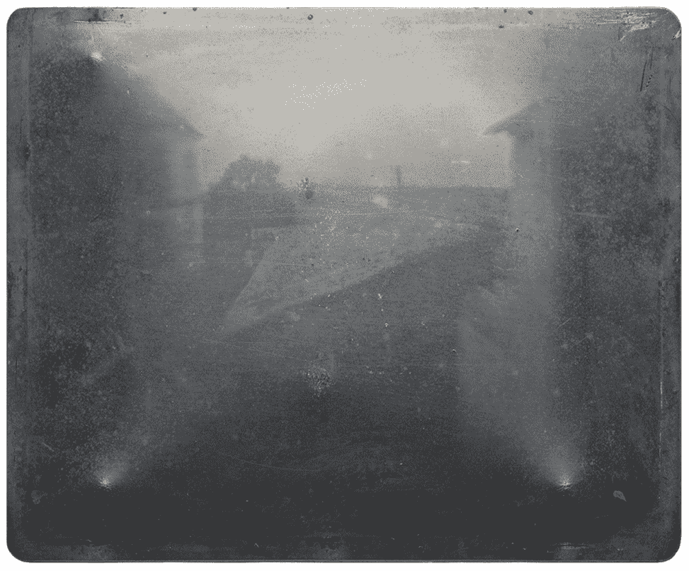
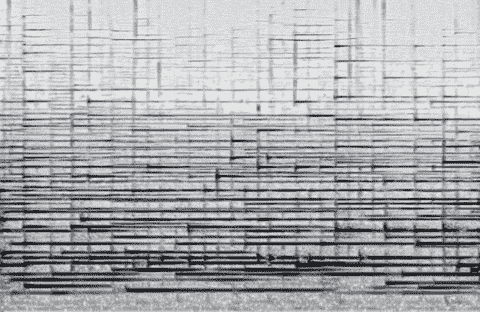

# 第九章：生成式 AI 的未来

虽然有时我们可能感觉我们已经生活在深度伪造和 AI 生成图像的未来，但它们背后的技术实际上才刚刚开始起飞。随着我们向前发展，这些生成式 AI 的能力将变得更加强大。

本章不是无边的未来主义，而是将探讨具体的生成式 AI 及其改进之处。我们将检查以下技术及其如何改变。我们将讨论以下 AI 领域的未来：

+   生成文本

+   提升图像质量

+   文本引导的图像生成

+   生成声音

+   深度伪造

# 生成文本

最近，随着 2022 年 OpenAI 在 ChatGPT 上的成功，文本生成模型在公众意识中产生了重大影响。然而，文本生成是 AI 最早的应用之一。Eliza 是 1966 年开发的第一个**聊天机器人**，那时除了技术倾向性最强的人之外，几乎没有人见过电脑。个人电脑甚至要到 5 年后的 1971 年才被发明。然而，只有最近才真正令人印象深刻的聊天机器人被开发出来。

## 近期发展

一种称为**transformers**的模型负责最近语言模型的激增。Transformers 是由一个称为**注意力层**的层组成的神经网络。注意力层的工作方式有点像聚光灯，聚焦于最可能重要的数据部分。这使得 transformers（以及使用注意力层的其他模型）可以更深而不失“焦点”（尽管这并不是实际的术语，但它是一个很好的比喻，用于描述这种效果）。

由于能够构建非常深的模型，transformers 在需要从复杂结构中提取意义的工作中表现出色。这对于语言任务和其他长序列来说是一个完美的匹配，其中单词的意义在很大程度上取决于周围的单词（想想“*我吃了一个橙子水果*”和“*我吃了一个橙子*”之间的区别）。Transformers 在翻译等任务中得到了广泛的应用，但它们在回答问题、总结信息和本节的主题：文本生成方面也非常出色。

大多数语言任务不仅需要“理解”文本的能力，还需要创造新文本的能力。例如，在摘要任务中，你不能简单地从文档中提取重要词汇并复制给用户。这些词汇将毫无意义，因为它们是任意顺序的，并且没有语言构建的基础上的重要上下文。因此，这些模型必须以正确构造的句子形式创建真实且可理解的输出，以便用户进行解释。

作者注记

关于是否可以用独特的人类理解概念来描述计算机所做的任何事情，存在很多争议。一个著名的例子是约翰·塞尔（John Searle）所谓的**中国房间**思想实验。

思想实验的基本原理是这样的：想象一个房间里有一排巨大的档案柜。在这些档案柜的每一个里，都有卡片将某个输入与某个输出配对。这个房间可以接收和输出写有汉字的卡片。在房间内部，有一个人（或某种东西）不懂中文，但通过将输入卡片与档案柜中的卡片匹配，然后将卡片上的输出字符复制到另一张卡片上，可以输出完美的中文。

在那个背景下，你能说机器（或机器内部的人或事物）“理解”中文吗？至于房间本身呢？这个问题在哲学家、计算机科学家、语言学家等众多领域引发了热烈的辩论。

## 构建句子

Eliza，那个第一个聊天机器人，通过简单地重复输入句子中的单词到预先精心编写的几个句子之一中来构建句子。这个过程将用户响应的部分重复回放是足够的，可以作为一个非常简单的弗洛伊德式顾问，许多人觉得这有助于他们度过一些困境。

今天的生成模型使用极其先进的句子结构来构建句子。它们这样做的方式与拼图类似。模型使用一个称为**光束**的概念来搜索最适合句子某个部分的单词，就像拼图解决者在一个零件集中搜索以找到最适合可用空间的零件一样。不幸的是，这里的比喻变得有些牵强。单一的光束只跟踪一个序列，而与正常的拼图不同，一个句子可以由几乎无限的单词组合构成。正因为如此，当句子完成时，最佳得分光束可能会改变，因此模型需要跟踪多个光束。更多的光束会导致生成的句子在语法和语义上（即结构和意义）都更好，但需要更多的计算，因为模型同时解决更多的句子。

## 文本生成的未来

随着我们进入未来，这些模型将在两个方面得到改进；计算可用性将增加，使得使用更大光束搜索的更大模型变得可行，而设计效率将允许设计出更好的模型，这些模型可以在相同的资源下做更多的事情。你可以将这想象成将箱子装进卡车：直到你需要一辆更大的卡车或找到一种使箱子变小的办法，你只能在卡车里装进这么多箱子。Transformer 是设计效率的例子，而计算机总是变得更快速、更好是一个计算可用性的例子。

文本生成似乎有无限的改进空间，但关于语言模型长期增长的可持续性存在疑问。有人担心我们可能很快就会达到**大型语言模型（LLMs**）的极限。存在多个可能限制模型的约束。

语言模型的第一项限制是，最大的模型已经需要数周或数月的时间来训练，分布在数千台强大的计算机上。这些类型模型的最大限制可能是经济因素。随着成本不断飙升，可能根本不会有足够的需求来继续扩大模型。

语言模型的第二个主要限制要难以克服得多：可能根本没有足够的数据来持续增长。大型语言模型（LLMs）需要大量的数据来学习语言，我们很快就会达到一个点，即它们可以训练整个人类书面历史的全部输出，但仍可能没有足够的数据来完全训练模型。Deepmind 发布了一项关于 LLMs 的研究（[`arxiv.org/abs/2203.15556`](https://arxiv.org/abs/2203.15556)），发现完全训练一个模型所需的计算和数据必须同步增长。这意味着，如果你将模型训练所需的计算量加倍，你也应该加倍数据。这意味着，模型可能很快就会在它们学习语言的能力上受到限制，因为它们已经被训练了人类所写的一切。

这两个问题都有潜在的解决方案，但它们并不像向问题投入更多的计算或更智能的模型设计那样容易获得。你可能会问一些像“*但人类如何在没有阅读人类所写的每一篇文本的情况下学习语言呢*？”或类似的问题。原因是人类是完全“智能”的，这个术语的定义似乎每次有非人类的东西接近它时都会改变。最终，我们可能无法让计算机完全理解语言，除非我们能让它们以一种哲学家无法辩论的方式“理解”。在此之前，语言模型需要比人类多得多的数据才能达到高水平的使用。

文本生成可能是 AI 最早的应用之一，但直到最近，它可能是一个更重要的应用，那就是提高图像质量。

# 提高图像质量

通过机械手段拍摄的最早已知图像是*尼埃普斯太阳仪*，这是约瑟夫·尼埃费尔·尼埃普斯在 1827 年拍摄的。它是通过将覆盖有一层由薰衣草和沥青制成的混合物的锡板暴露在工作室的窗户上拍摄的。这个板子被暴露在阳光下几天，以创建一个模糊的单色图像。

图 9.1 – 约瑟夫·尼埃费尔·尼埃普斯在 1827 年拍摄的尼埃普斯太阳仪

从那时起，图像在捕捉现实方面变得更好，但这个过程还没有*完善*。总会有各种限制，意味着图像在颜色上并不完全准确，无法捕捉所有细节，或者在图像中造成扭曲。一个真正完美的图像甚至让人难以想象：从一张完美的图像中，你甚至能够放大到宇宙另一侧的任何原子，而我们的图像根本无法达到这种细节水平。

## 各种策略

有时候，图像的限制超出了我们愿意接受的范围。在这种情况下，我们可以尝试通过修改它使其看起来更符合我们的期望来“改善”图像。其中一些编辑相对简单。也许你的照片是斜着拍的，一切都很歪曲。在物理照片打印的时代，这可以通过一把剪刀（也许还需要一块垫子来隐藏较小的尺寸）来修复。许多带有闪光灯的相机内置“红眼”去除功能，通过连续两次快速闪光来掩盖闪光灯在人们眼睛中的反射，一次是为了让眼睛适应闪光，另一次是为了真正拍照。

现在您可以在软件中修复这两个问题，并且可以修复比歪曲的照片或眼睛后反射的强光更多的东西。现代编辑软件甚至可以“修复”人们可能会争论实际上并没有损坏的东西。社会上正在进行的讨论是，杂志封面的图片是否应该“修饰”以使主题更具吸引力，或者这个过程是否通过延续不切实际的身体形象而造成更多的伤害。

随着我们进入神经网络时代，照片的自动改进变得比以往任何时候都容易。有许多服务和工具提供改善照片，无论是新拍摄的还是旧的。它们使用各种技术，但可以分为几个不同的类别，包括**上采样**、**色彩校正**（或**分级**）和**降噪**。让我们简要地看看这些。

### 上采样

上采样涉及将图像放大。也就是说，提高图像的分辨率。现代上采样 AI 不仅能够提高分辨率，还能提高保真度——它们可以使图像更大更好。这一创新来自从大量其他图像中学习，了解物体、纹理和图像在放大和缩小时的外观。模型在被输入人工缩小的图像后，被要求重新创建原始图像，然后根据其表现进行评估。

使图像更大、更高保真度可能是一种平衡行为。有可能使图像过于锐利或填充不应该存在的数据。例如，你不想给一个孩子添加皱纹，但一张没有皱纹的祖母照片看起来就不对劲。因此，大多数提升都有某种滑块或其他控件来设置 AI 应该为你的图像提供多少额外的保真度，让你能够根据具体情况选择应该添加多少细节级别。

有一种提升方式可以绕过这个限制，那就是**领域特定提升**。领域特定提升器是指只提升一种类型内容的提升器。最近流行的例子之一是面部提升。人类天生就能看到面孔，我们很容易就能注意到它们的问题。但是，当你用提升器训练它只针对面孔时，它能够专门学习关于面孔的知识，并在执行这一任务时获得更高的保真度结果，而不必担心提升所有内容。这使得 AI 能够学习到“老年人”通常会有皱纹，而通用目的的提升器根本就没有空间去学习这一点。

领域特定提升的技术需要额外的过程，如检测和合成，以检测提升器可以改进的对象，并确保它们被正确地放回图像中。这确实导致了一个潜在的问题，即对象的质量高于图像的其他部分，但除非差异很大，人们似乎不太会注意到这一点。

### 色彩校正

色彩校正是一个在任何地方的相机设备中都发生的进程。将相机传感器中的图像转换成我们可以观看的图像需要许多不同的过程，其中之一就是色彩校正——至少是为了纠正照片拍摄时的光照颜色。我们的眼睛和大脑会自动校正光色，但相机需要明确地这样做。即使照片已经拍摄，这也并不意味着色彩校正已经完成。大多数专业摄影师以“raw”格式拍摄照片，这允许他们精确设置颜色，而不会因为多次转换而损失。

作者注记

我们相机向我们撒的一个谎是，一张图片由许多具有红色、蓝色和绿色元素的像素组成。实际上，我们的相机会分别拍摄每种颜色的单独图像，然后通过一个称为**去马赛克**的过程将它们组合在一起。事实上，大多数相机甚至更过分，绿色子像素的数量是红色或蓝色的两倍，因为人眼对绿色的细节更敏感。问题是，这些像素在重新对齐时永远不会完全对齐，而做得不好的去马赛克意味着你的图像在颜色的边缘会有奇怪的色彩伪影。

然而，颜色不仅仅是客观的事物。想想电影《黑客帝国》。你有没有注意到矩阵内部的一切都是绿色的？这是故意的。这种颜色的使用被称为“调色”（尽管有时令人困惑，校正也被称作调色）。人类在情感层面上与颜色有着奇怪的联系，改变它们可以调整我们对图像的情感联系。例如，想想我们如何用“蓝色”来表示“悲伤”，或者一张充满棕色和红色的图像可能会让你感到像秋天刚刚开始一样的寒意。

这两项颜色任务都可以由 AI 完成。现在有一些 AI 工具可以将图像转换为匹配特定的情感风格，或者匹配你拥有的另一张图像。在这里，AI 的技巧不在于改变图像的颜色，而在于以某种特定方式改变它们，这样人类会感到愉悦。你可能不希望仅仅因为要求 AI 将照片转换为秋天的颜色，就把你的绿鞋变成红色，但绿色的树叶需要调整。

### 去噪

噪声是当今相机尽力隐藏的另一个不可避免的问题，但它是你拍摄的任何图像的一部分——尤其是在暗淡条件下。相机中的噪声减少通常是通过在图像的所有像素上应用轻微的模糊来实现的（通常在颜色校正之前）。这有助于平滑来自传感器的任何噪声，但它无法做到完美。随着现代相机现在拥有大量的计算机能力（许多都存在于我们的手机中），更复杂的技巧已经变得极其常见。事实上，今天的大多数手机处理器都有某种 AI 加速，以便它们可以改善正在拍摄的图片。

去噪可以通过许多不同的方式完成，但最近的一项创新是扩散模型。扩散模型实际上就是使用**扩散**过程来训练神经网络——在这个过程中，图像被模型以模糊或噪声的形式提供，并要求它提供原始图像。这个过程可以通过重复扩散过程多次，并要求模型每次都进行清理来加深。这使得模型能够从非常少的信息中创建出极其详细的图像。不幸的是，信息损失是信息损失，尽管扩散模型可以创造新的信息，但没有某种指导，恢复原始信息是不可能的。这种类型的 AI 去噪实际上是我们将在*文本引导图像生成*部分更详细讨论的一项创新。

## 图像质量提升的未来

有一个基本问题限制了 AI 对图像质量所能做的事情。AI“发明”一个不属于那里的新细节是否可以接受？如果答案是肯定的，那么 AI 升频所能实现的事情就没有实际限制了。如果我们足够放大，我们可能会拥有能够生成人的皮肤原子的 AI 升频器。不幸的是，通常认为答案是“不”。我们对图像很挑剔，希望它们不仅详细，而且准确。这意味着质量和细节总是有限的，我们无法做太多来避免这一点。

这并不意味着进一步改进是不可能的。有可能我们能够使 AI 能够从其他来源获取所需的细节。例如，目前，我们有一些视频升频器，可以通过借用周围帧的数据来提升视频帧。这使得 AI 能够超越当前帧，找到它可以复制回工作帧的图案和细节。你可能会通过提供照片来填补缺失的质量，从而提升你老家的家庭视频。此外，你可能有一个 AI 能够学习给定的人在其生活中的不同时间点看起来是什么样子（例如，你的学校年鉴和家庭照片），然后可以插值这些数据来填补视频中的特定时间。

对更高品质的追求永远不会结束，人们总是希望看到下一次的改进。然而，有一些实际限制阻止了某个图像永远得到改进。但是，如果你不在乎准确性，只想得到尽可能高的图像质量呢？也许是一个只由一两句话生成的图像？好吧，这正是我们接下来要探讨的。

# 文本引导的图像生成

文本引导的图像生成是生成式 AI 的一个有趣类别。OpenAI 有几位开发者发布了一篇名为《从自然语言监督中学习可迁移视觉模型》（https://arxiv.org/abs/2103.00020）的论文。尽管我更喜欢他们在博客上发布的总结标题“CLIP：连接文本和图像”。CLIP 在*第八章*，“应用深度伪造的教训”中被提及，但在这里我们还会进一步讨论。

## CLIP

CLIP 实际上是一对神经网络编码器。一个是在图像上训练的，另一个是在文本上训练的。到目前为止，这并不非常不寻常。真正的技巧在于这两个是如何连接的。本质上，两个编码器都从同一张图像中获取数据；图像编码器获取图像，文本编码器获取图像的描述，然后他们生成的编码进行比较。这种训练方法有效地训练了两个独立的模型，以便在给定的相关输入下创建相同的输出。

这可能仍然听起来很复杂，让我们换一种方式来看。想象一个房间里有一百多个小盒子排列成网格。两个男人轮流进入房间；一个人得到一个图像，另一个人得到一个句子。他们的任务是把自己的物品放在一个盒子里，但没有关于什么是“正确”的信息。他们可以研究自己的物品，但然后必须选择一个盒子。然后，他们根据他们放置的相似度评分，只根据这种相似度评分，没有任何假设说两个男人选择的物品中有一个更好的选择。

想法是，最终，他们会确定一套规则，其中图像和对象的文本描述都将放在同一个盒子里。这个比喻非常接近实际工作方式，除了不是仅仅把物体放在一个盒子里，他们还会根据文本和图像如何适应每个盒子中的数百个盒子来评分。

当完全训练后，相似图像应该得分相似，相似文本描述应该得分相似，匹配的图像和文本描述应该得分相似：

图 9.2 – CLIP 共享潜在空间的示例（由 Rohit Tandon 通过 Unsplash 提供的山景照片）

## 使用 CLIP 生成图像

因此，我们现在有一个将图像及其相关文本转换成 **共享潜在空间** 的模型。这是如何生成图像的呢？好吧，这正是其他技巧发挥作用的地方。在这里我们不会深入具体细节，因为最近出现了许多竞争模型，它们都有些不同，详细描述每一个模型将是一本专著，但它们的基本思想是相似的，所以我们就这样吧。

好吧，所以为了训练模型，第一步是获取 CLIP 潜在表示。一些模型同时使用图像和文本嵌入，一些随机选择一个或另一个，而其他一些只选择文本嵌入。无论使用哪种潜在表示，过程都是相似的。在生成 CLIP 嵌入后，模型被训练将这个嵌入转换成图像。

这里简要总结一下目前市场上的一些大型文本到图像模型：

+   Stability AI 的 **Stable Diffusion** 使用一种重复的扩散过程，这个过程从随机的噪声模式（或者在图像到图像模式下，一个图像）开始，然后在潜在空间中反复迭代扩散过程，并使用一个最终的解码器将嵌入转换回图像

+   Google 的 **Imagen** 使用类似的方法，但扩散过程发生在图像的像素空间中，不需要最终转换回图像空间

+   OpenAI 的 **Dall-E** 是一个基于转换器的模型，通过将文本表示通过多个注意力层和其他层来生成图像输出

在每种情况下，有效结果应该与用于引导生成的文本相匹配。

那么，图像生成将从哪里开始呢？

## 图像生成的未来

已经开发并宣布了许多其他技术，仅仅跟上各种发布就是一个重大的努力，超出了本书的范围。所有这些不同技术的真正令人难以置信之处在于，它们都是迅速连续开发的。速度似乎在持续加速，毫无疑问，在这本书出版后不久，所有这些信息都将被新的创新所取代。

这个领域正在快速发展，因此很难预测未来的局限性可能出现在哪里。有可能我们接近了这次发展热潮的尾声，在几年内我们将看到新的创新。但同样有可能，我们将在几个月内看到新功能的高速发展，使得今天的图像生成器看起来非常原始。

目前存在的局限性并非关于分辨率、细节甚至质量：这仅仅是一个学习获取最佳结果的最佳方式的问题。多亏了 Stable Diffusion 的公开分发，有一个庞大的社区正在尝试这项技术，而且几乎不可能连续几天没有出现一些新的技术或想法，这些新的技术或想法承诺开辟新的前沿。诸如**文本反转**、**LoRA**和**DreamBooth**等技术提供了在消费级硬件上调整 Stable Diffusion 结果的新方法，而诸如**修复**和**扩展**等新功能则允许你填充或扩展图像。

随着时间的推移，我们将更加习惯于使用这些图像生成模型，并将能够更好地设计它们以最大化其性能。到那时，我们将能够预测图像生成有哪些限制。目前，我们离眼前的山太近，以至于看不到山顶。

# 生成声音

声音生成是另一个我们可以不断细分下去的领域，直到书中的所有空间都被列出声音生成不同方法的标题所占据。为了简洁起见，我们将它们全部在这里分组，并覆盖几个大子领域。

## 语音交换

当大多数人得知他们可以交换面部时，首先想到的问题就是他们是否也可以交换声音。答案是相当令人不满意的：是的，但你可能并不想这么做。现在有一些 AI 可以交换声音，但它们都存在各种问题：从听起来像机器人，到缺乏抑扬顿挫，到与涉及的人不匹配，到非常昂贵且专属。如果你正在制作任何具有中等生产价值的东西，你将能够更好地利用*自然*智能：找到一个能够模仿声音的模仿者。AI 技术（目前）还达不到这个水平。即使是著名的电影《Fall》，它所做的“声音深度伪造”实际上只是在录音棚中重新录制了声音（这个过程被称为自动对话替换或循环），然后 AI 被用来调整他们的嘴巴以匹配新的对话。

语音交换技术无疑会改进，并且有一些公司为各种项目提供高质量的语音模型，但它们非常昂贵，并且仍然是一个利基用途案例。然而，如果需求持续存在，不可避免地会有某人推出新的技术或改进，使得高质量的语音交换像其他深度伪造一样容易。

## 文本引导的音乐生成

这种技术与文本到图像生成非常相似。事实上，大多数实现实际上在底层使用文本到图像生成器。基本技术是将音频转换为音频的频谱图图像，然后在上面训练一个文本到图像模型。这意味着相同的图像生成器可以用来生成音频频谱图，然后将其转换回音频流。

这种技术是有损的，并且限制了输出质量，因为频谱图图像只能容纳这么多频率。此外，还存在一个问题，即频谱图图像只代表一小段时间。这意味着生成音频必须以几秒钟的长度的小块进行。Riffusion（一个基于 Stable Diffusion 的音频生成模型）在约 8 秒长的频谱图上进行训练。这意味着即使你发明了将多个频谱图连接起来的技巧，你大约每 8 秒就会有一个新的生成。通过提高生成图像的分辨率，可以增加时间切片和频率，但限制仍然存在，只是更高。即使技术有合理的进步，当前技术也不太可能生成 3-4 分钟的全长歌曲。

图 9.3 – Riffusion 制作的频谱图示例

低频分辨率低且每几秒钟就发生显著变化的音乐，与我们通常作为音乐听众所期望的相去甚远。很可能会有人创建一个文本到音乐的生成器，它不会涉及音频图像转换过程，但这将是一个全新的创造，可能有其自身的怪癖，并且正在进入我们在这章中想要避免的推测性未来主义。

## 声音生成的未来

不可避免的是，有人将创造出一种工具或技术，将声音生成领域炸开，就像卷积层和扩散模型对图像以及变换器对语言所做的那样。当这种情况发生时，我们将看到一场类似淘金热式的创新爆发，人们将采用并扩展新技术，就像我们在图像和文本生成领域所看到的那样进行改进。不幸的是，目前我们无法依赖未来的伟大创新，所以我们必须立足于现在或近未来。

现代音频技术依赖于自动编码器或频谱图将音频转换为 AI 生成技术现在可以使用的形式。为此，这些方法可能会得到改进，以添加更多细节或信息。例如，通常频谱图是黑白色的。如果以某种方式添加颜色，而不仅仅是线性增加可生成的内容量，那会怎么样？例如，如果用红色表示重复的旋律，蓝色表示另一个主题，绿色表示两者在更大时间尺度上的相互作用，那会怎么样？如果与更大的频谱图结合，这能否将现代声音生成带到一次生成整首高质量歌曲的程度？

如果我们花时间去开发一种将口语转换为书面形式的编码系统，并将其训练成文本生成模型，那会怎么样？如果我们能将口音定义为将书面形式转换为音频的某种组合，我们能否创造出能够模仿口音的 AI，就像它们模仿绘画风格一样？我们有很多方法可以将音频修改成我们当前 AI 模型擅长处理的形式，这将使当前的声音生成 AI 得到全面改进。

即使不考虑类似于变换器或卷积的新范式类型的革命性改进，我认为如果计算机科学家像最近对图像和视频那样重视音频，音频领域还有几年的实质性进化空间。

# 深度伪造

当然，这本书的整个内容都是关于深度伪造的过去和现在，所以在结尾时回到它们的未来是有意义的。我们可以从本章中提到的其他 AI 中了解到很多关于深度伪造未来的信息。这是因为，偷偷地，本章的所有部分都是为了这一部分而构建的。毕竟，深度伪造是一种在特定领域图像上工作的图像生成 AI，它具有共享的嵌入。

本章中我们探索的每个领域都可以用于改进深度伪造，所以让我们逐一处理它们。

## 声音生成

这一点相当简单且明显。在交换面部之后，下一步就是交换声音。如果我们能够实现可靠的声音交换，那么深度伪造将进入一个新的能力。如果你在制作一部没有其他人帮助的电影时，制作音乐或其他效果也可能很有用，但它们的实用性在其他方面将是有限的（在深度伪造中，其他行业无疑会有更多的用途）。

## 文本引导的图像生成

目前，你可以将深度伪造视为“面部引导”的，也许这是最好的解决方案，因为它可以让演员的表演更加突出，即使他们戴着不同演员的面部。但文本引导的后期处理肯定可以满足某种需求。电影《银翼杀手》中有一个著名的场景，侦探德卡德使用语音命令检查图像，以探索环境（在完成不可能的任务，将视图转向侧面之前，这只能通过发明新的数据来实现，而且对于寻找线索是不可用的）。这可以被视为使用文本引导图像生成的图像修改的原型工作流程。

我们不必生成一张全新的图像，而是可以使用遮罩或过滤器修改其部分，并将 AI 的更改与原始图像结合。这样，我们可以做到像输入（或说出）“*让他笑得更开心*”这样的操作，从而在不替换整个图像的情况下生成对图像的修改。这利用了文本引导的力量，同时仍然允许面部引导的交换发生。

## 提升图像质量

很容易看出提升图像质量如何能改善深度伪造：你可以改进你的输入数据或输出结果，使其更准确、质量更高，或进行色彩校正。图像质量对于创建成功的深度伪造至关重要，但一些来源根本不提供你真正需要的数据来获得高质量的深度伪造。例如，不幸的是，阿尔伯特·爱因斯坦在高清摄像机能够捕捉我们想要的用于标准深度伪造的所有数据之前就去世了。虽然有一些我们可以使用的照片和一些视频，但这些来源质量低，大多是单色的，并且通常会导致交换效果不佳。如果我们能够足够改进这些数据以训练模型，那么我们就可以通过自举来创建一个全新的阿尔伯特·爱因斯坦视图。

尤其是特定领域的工具将对深度伪造有益。已经有专门用于面部提升的升缩器，可以用于 Faceswap 的输出，以增加深度伪造过程的实际分辨率。特别是当与非常高质量的视频一起使用时，提升输出可以弥合计算能力和交换面孔分辨率之间的差距。

## 文本生成

这似乎对深度伪造来说可能不是最重要的，从某种意义上说，“生成”部分确实是。但像 CLIP 这样的技术和技术可以通过新的和独特的方式应用于深度伪造。例如，如果我们摆脱了所有深度伪造的一部分的通用面孔编码器，并用一个像 CLIP 一样训练的新编码器来替换它，与各种面孔和数据进行对比，我们可能会能够裁剪模型的最大部分来单独运行，使我们能够将所有的精力（和计算）集中在构建面孔的解码器上，而不是浪费时间训练编码器，只是为了给我们一个可以输入解码器的嵌入。

## 深度伪造的未来

我认为，随着最近生成式人工智能的所有创新，我们可以确信深度伪造还没有走到尽头。这些其他领域中的创新正等待着在深度伪造中得到实施。这些改进将使深度伪造能够做新的和有趣的事情，同时仍然保持深度伪造的本质——即交换一个面孔与另一个面孔。

我们还没有看到电影中深度伪造的尽头。事实上，随着技术的日益成熟、强大和可用，电影中的深度伪造似乎只会增长。似乎合理的是，未来的整个演员可能会被深度伪造，以防止角色因年龄增长或去世而改变。想象一下，在导演的完全指导下，由 AI 动画的原始演员完成的《飘》的续集。如果 AI 继续增长和进步，我们可能很快就会看到这种情况。

深度伪造并非没有界限；仍然存在需要解决的问题，例如分辨率、训练时间和甚至数据收集。但现在，使用从黑白电影收集的数据，彩色化并干净地提升分辨率，已经可以制作出比早期蓝光分辨率更高的深度伪造人脸。10 年后，甚至 20 年后，我们会处于什么位置？或者，多久之后你甚至懒得起床参加一个全身生成并与你匹配的视频通话？

## 人工智能伦理的未来

我们从*第三章**，审视深度伪造的伦理和危险*中制定的指南仍然是伦理的坚实基础（毕竟，对人们友好永远不会过时），但随着我们走向未来，我们将面临全新的挑战，这些挑战将需要它们自己的伦理指南。

例如，在什么情况下可以用深度伪造技术替换演员？是否可以用一个仅由导演操纵的 AI 替换一个勤奋工作的人类？如果是一个没有人愿意（或能够）扮演的角色呢？彼得·杰克逊的《指环王》中的*Gollum*由极具天赋的角色演员*Andy Serkis*扮演（Serkis 还在迪士尼的《星球大战》续集中扮演了 Snoke，以及许多其他以数字为首要角色的角色）。用 AI 替换他是否道德？

很可能，一个完全由 AI 扮演的角色会被许多人认为是道德的（尽管可能不是演员）。但如果导演决定一个女演员的声音不够“女性化”，并在未经女演员同意的情况下用尖锐的乡村女孩声音替换，那会怎样？如果导演的创意愿景是用肤色较深的人替换扮演坏蛋的演员呢？关于上一节中你用一套协调的服装替换睡衣以进行视频通话的例子又如何呢？这些问题更难回答，这是我们随着社会的进步必须共同评估的事情。

# 摘要

生成式 AI 拥有悠久的历史和巨大的未来。我们正站在一个广阔的平面上，任何可能性都存在，我们只需朝着它前进。尽管如此，今天并非所有事物都可见，我们必须调整我们的期望。主要挑战是我们计算机、时间和研究的限制。如果我们把时间和精力投入到解决 AI 的一些限制上，我们不可避免地会提出全新的飞跃，这将帮助我们向前迈进。即使没有巨大的革命性改进，我们也可以做出许多较小的进化改进，以提升这些模型的能力。

创新的最大驱动力是需求。越来越多的人使用生成式 AI 并将其用于新颖的应用，将创造生成式 AI 继续在未来得到改进所需的经济学和社会推动力。

这本书一直致力于让我们，即作者，邀请你们一起前进，帮助 AI 走向这个我们希望所有人都能看到在远方的生成式未来。

EBSCOhost - 打印于 2023 年 11 月 27 日 上午 6:20。所有使用均受[`www.ebsco.com/terms-of-use`](https://www.ebsco.com/terms-of-use)条款约束。
