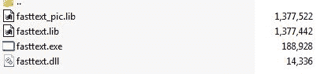

# 第二章：介绍 FastText

欢迎来到 *fastText 快速入门指南*。在本章中，你将学习如何安装 fastText，并创建一个稳定的环境，以便将 fastText 应用到你的自然语言处理应用中。

fastText 是一个库，它帮助你生成高效的词向量表示，并且提供开箱即用的文本分类支持。在本书中，我们将看一个特定的应用案例，即机器翻译，并使用 fastText 来实现。我们选择机器翻译作为案例，因为 fastText 声称它在处理未知词汇时具有优势，并且可以应对不同语言，即使这些语言的足够大数据集和语料库可能并不存在。在接下来的章节中，我们将看看 fastText 在这种情况下的表现。同时，我们还会讨论一些通用的技术，帮助你将这些技术扩展到你的特定应用场景。我们将在本章中涵盖以下主题：

+   介绍 fastText

+   在 Windows、Linux 和 macOS 上安装 fastText

+   使用 Docker 镜像部署 fastText

+   在 Mac 系统上安装依赖项

+   安装 Python 依赖项

+   使用 `yum` 包管理器在 RHEL 系统上安装依赖项

+   在基于 Debian 的机器（如 Ubuntu）上安装依赖项

+   使用 pacman 在 Arch Linux 上安装依赖项

# 介绍 fastText

在今天互联互通的世界中，全球各地生成了大量的文本数据。这些文本信息包含了对事物的描述。例如，人们在亚马逊评论中写关于产品的内容，或者通过 Facebook 帖子表达自己的想法。**自然语言处理**（**NLP**）是将机器学习和其他计算技术应用于理解和表示口语及书面文本。以下是 NLP 需要解决的主要挑战：

+   **主题建模**：一般来说，文本会涉及一个主题。主题建模常用于确定集合文档中可能存在的隐藏结构或“抽象主题”。主题建模的有效应用之一是摘要生成。例如，法律文件通常较为复杂且冗长，因此像这样的系统将帮助读者抓住文件的要点，并提供对事件的高层次描述。

+   **句子分类**：文本分类是一个重要的挑战，能够将一大段文本分类到不同的标签。例如，一个系统应该能够将“Shahrukh Khan 在迪拜活动中表现出色”正确分类为“娱乐”标签，而将“在 Breach Candy 医院对面的商店发生火灾”分类为“新闻”标签。

+   **机器翻译**：世界上语言的总数至少有 3,000 种。大约一半的语言使用者少于 10,000 人，约 25%的语言使用者不到 1,000 人。因此，我们可以想象，许多语言正在消失，而当一种语言消失时，我们共同失去了大量的文化遗产。目前最好的翻译系统是谷歌的，但在写作时它仅覆盖 103 种语言，因此开发能够从少量来源训练并具有高度预测能力的机器学习翻译模型非常重要。

+   **问答（QA）系统**：这里的重点是构建一个基于人们用自然语言提出的问题自动回答问题的系统。围绕封闭领域系统构建的问答系统可以非常精确，因为它们可以检索与搜索项目相关的文档和文本。

+   **情感分析**：情感分析是理解用户在谈论某事时分享的需求和意图。人们根据情感做出选择。许多人的需求在很大程度上是情感性的，通常人们会非常坦率地表达他们的感受。创建一个能够考虑这一点的系统，将始终为业务增添大量价值。

+   **事件提取**：使用场景涉及大量数据以文本形式存储。例如，某些法律文本可能描述一个“犯罪”事件，接着是一个“调查”事件，再接着是多个“听证”事件。事件本身可能是嵌套的，例如“听证”事件可能包含“陈述论点”事件和“呈现证据”事件。

+   **命名实体检测**：构建该系统的重点是提取并根据一些预定义的类别（如人名、组织、地理等）分类实体或特定信息。例如，如果我们看以下文本：“我们在德州南部习惯了辣味食物，”我们可以理解“买家”喜欢“辣味食物”，他的“地理位置”是德州南部。如果数据中有足够的证据表明德州南部的买家喜欢辣味食物，就可以向他们营销更多类似的食品。

+   **关系检测**：关系检测系统解析文本并识别焦点和主体，然后尝试找出它们之间的关系。例如，句子“Mike has the flu”可以转换为`Person-[RELATION:HAS]->Disease`。这些关系随后可以在商业环境中进行探讨，以构建智能应用。

前面的列表涵盖了许多 NLP 从业者所面临的问题。根据使用案例，你可以选择其中的任何挑战，并尝试在你的领域中解决它们。许多先前方法和建模技术的挑战在于，NLP 需要大量的文本数据，并且数据中包含了大量的上下文信息。计算模型很难高效地处理所有这些数据。

迄今为止，NLP 模型仅针对英语进行构建，因为英语文本数据较为丰富。但全球只有 20% 的人口讲英语，且其中大多数为非母语者。构建非英语 NLP 模型的最大障碍是数据的匮乏。因此，我们迫切需要能够在数据有限的情况下构建模型的库。fastText 有潜力改变这一切。fastText 团队发布了 294 种语言的预训练词向量。到本书发布时，更多语言将被添加到其中。

在本章中，我们将看到如何安装 fastText，以便你可以开始使用这个令人惊叹的软件。

提供的一些描述可能不适用于你；例如，针对 Mac 用户的说明可能与 Linux 用户不直接相关，反之亦然。不过，我建议你阅读每个依赖项的完整描述，以便更好地理解。

# 安装 fastText

根据你的操作系统，你需要确保你的计算机上安装了一些依赖项。在这一部分，你将了解如何根据自己使用的操作系统（Linux、Windows 或 macOS）来安装 fastText。此外，你还将了解根据你的使用需求，应该安装哪些额外的依赖项。我的建议是安装所有软件包，因为在本书中我们将探索使用 fastText 的各种方式。

# 前提条件

FastText 可以在 Windows、Linux 和 macOS 上运行。FastText 是使用 C++ 语言构建的，因此你首先需要一个良好的 C++ 编译器。

# Windows

官方的 Windows 二进制文件不可用，但你可以通过以下链接下载由孟轩霞编译的最新 Windows 二进制文件：[`github.com/xiamx/fastText/releases`](https://github.com/xiamx/fastText/releases)。要运行这些二进制文件，你需要安装 Visual C++ 2017。你可以从以下链接下载 Visual C++ 的 64 位版本：[`support.microsoft.com/en-in/help/2977003/the-latest-supported-visual-c-downloads`](https://support.microsoft.com/en-in/help/2977003/the-latest-supported-visual-c-downloads)。接下来，按照通常的安装方式，双击 Visual C++ 安装程序文件即可将其安装到你的 Windows 计算机上。

# Linux

你需要安装的前提软件列表如下：

+   GCC-C++；如果你使用 Clang，则需要 3.3 或更高版本。

+   Cmake

+   Python 3.5（你也可以使用 Python 2.7，但我们在本书中将重点讨论 Python 3）

+   NumPy 和 SciPy

+   pybind

可选的依赖项根据你的系统如下：

+   Zip

+   Docker

+   Git

# 在支持 yum 包管理器的 RHEL 机器上安装依赖项

在 Linux 系统中，你需要安装 `g++`。在支持 `yum` 包管理工具的 Fedora/CentOS 上，你可以使用以下命令安装 `g++`。打开终端或通过你喜欢的 SSH 工具连接到安装服务器并运行以下命令：

```py
$ sudo yum install gcc-c++
```

CMake 应该默认安装。官方文档中提供了 `make` 和 `cmake` 的安装说明。我建议在你的机器上安装 `cmake` 并使用它来构建 fastText。你可以像之前一样使用 `yum` 通用命令直接安装 `cmake`：

```py
$ sudo yum install cmake
```

要获取完整的 `cmake` 命令列表，请查看以下链接：[`cmake.org/cmake/help/v3.2/manual/cmake.1.html`](https://cmake.org/cmake/help/v3.2/manual/cmake.1.html)。

要安装可选软件，运行以下命令：

```py
$ sudo yum install zip docker git-core
```

如果你在新服务器上开始并在那里运行 `yum` 命令，你可能会遇到以下警告：

```py
Failed to set locale, defaulting to C
```

在这种情况下，安装 `glibc` 语言包：

```py
$ sudo yum install glibc-langpack-en
```

现在，你可以跳转到 Anaconda 安装说明部分，安装 Python 依赖项。

# 在基于 Debian 的机器（如 Ubuntu）上安装依赖项

在 Ubuntu 和 Debian 系统中，`apt-get` 或 `apt` 是你的包管理工具。`apt` 基本上是 `apt-get` 和其他类似工具的包装器，因此你应该能够互换使用它们。我将展示 `apt` 命令，如果你使用的是旧版本的 Ubuntu 或 Debian，发现 `apt` 在你的机器上不起作用，可以将 `apt` 替换为 `apt-get`，它应该可以正常工作。此外，如果可能的话，考虑升级你的机器。

类似于 Fedora，要安装 C++，打开终端或通过 SSH 连接到你要安装 fastText 的服务器并运行以下命令。这也会安装 `cmake` 命令：

```py
$ sudo apt update
$ sudo apt install build-essential
```

现在安装 `cmake`：

```py
$ sudo apt install cmake
```

要安装可选的依赖项，运行以下命令：

```py
$ sudo apt install zip docker git-core
```

现在，查看 Anaconda 部分，了解如何为 Python 依赖项安装 Anaconda。

`apt` 命令仅适用于 Ubuntu-16 及之后版本。如果你使用的是旧版 Ubuntu，应该使用 `apt-get` 命令。

# 使用 pacman 在 Arch Linux 上安装依赖项

Arch Linux 的首选包管理工具是 `pacman`，你可以运行以下命令安装必要的构建工具：

```py
$ sudo pacman -S cmake make gcc-multilib
```

这应该会安装你构建 fastText 所需要的 `make`、`cmake` 和 `g++` 编译器。虽然 Arch 系统已经安装了 Python 3.x，但我建议按照本章稍后的说明安装 Anaconda，这样你就不会错过任何 Python 依赖项。

要安装可选的依赖项，运行以下命令：

```py
$ sudo pacman -S p7zip git docker
```

# 在 Mac 系统上安装依赖项

在 macOS 上，你应该默认安装了 Clang，它设计为替代普通的 C、C++ 和其他类似语言的编译器。可以在终端中使用 `clang --version` 检查版本是否为 3.3 或更高版本。如果没有 Clang 或版本较旧，可以使用终端中的 `xcode` 命令行工具进行安装：

```py
$ xcode-select --install
```

接下来应该会弹出一个对话框，询问你是否要安装开发工具。点击安装按钮。

# 安装 Python 依赖项

我建议你安装 Anaconda，这样可以避免安装 Python 并使用它进行 fastText 时遇到问题。关于安装 Anaconda 的详细说明，请参考官方文档页面，网址为 [`conda.io/docs/user-guide/install/linux.html`](https://conda.io/docs/user-guide/install/linux.html)。简而言之，如果你使用 Windows，下载 Windows 安装程序，双击并按照屏幕上的指示操作。对于 macOS，也可以使用图形界面安装。

对于 Linux 和 macOS，下载相应的 bash 文件，然后在终端中运行以下命令：

```py
$ bash downloadedfile.sh
```

请确保使用标记为 Python 3.x 的安装程序来下载和安装。书中展示的 Python 代码片段将以 Python 3.x 的版本展示。

# 在 Windows 上安装 fastText

目前，Windows 上并未提供 fastText 的官方二进制文件，因此没有图形界面可以直接安装 fastText。在 Windows 上使用 fastText，你需要执行以下步骤：

1.  从 Xua 提供的发布页面下载最新的二进制文件，文件名为 [**fasttext-win64-latest-Release.zip**](https://github.com/xiamx/fastText/releases/download/fastText-latest-build40/fasttext-win64-latest-Release.zip) ([`github.com/xiamx/fastText/releases`](https://github.com/xiamx/fastText/releases))。

1.  这是一个 ZIP 文件，你需要解压缩内容。你会在解压后的文件夹中找到 `fasttext_pic.lib`、`fasttext.lib`、`fasttext.exe` 和 `fasttext.dll` 文件。这个文件夹将是你进行 fastText 操作的工作目录：



1.  创建一个文件夹 `data`，用于存放所有数据文件。现在，打开 PowerShell 并切换到该文件夹。

1.  在 PowerShell 中输入 `.\fasttext.exe`，你应该能看到输出。

如果没有任何输出，则可能是你的机器上没有安装 Visual C++ Redistributable，你需要安装它。

# 在 Linux 和 macOS 上安装 fastText

要安装 fastText，请运行以下命令在终端中克隆镜像并进行构建：

```py
 $ git clone https://github.com/facebookresearch/fastText.git
 $ cd fastText
 $ mkdir build && cd build && cmake ..
 $ make && make install
```

本书中将重点介绍为 Python 构建系统。因此，请在相同目录下运行以下命令：

```py
$ pip install .
```

`pip`是 Python 的包管理器。fastText 假设使用 UTF-8 编码的文本，这在 Python 3.x 中是默认的。本书中的 Python 代码示例将使用 Python 3.x 展示。fastText 的一个优点是您可以为多种语言构建 fastText 模型，如果您不使用 Python 3.x，则无法利用此功能。如果这不是问题，并且您尝试在 Python 2.7 中使用 fastText，则请参阅末尾的*附录*，其中将为您提供如何在 Python 2.7 中开发时考虑 UTF-8 的指导。

# 使用 Docker 镜像来运行 fastText

您还可以使用 Docker 在您的计算机上运行 fastText，无需担心构建它。这可以用来在特定版本之间保持版本控制，从而提供预测性和一致性。您可以从以下链接获取有关如何安装 Docker 的信息：[`docs.docker.com/install/#cloud`](https://docs.docker.com/install/#cloud)。

安装后，在运行以下命令之前，请启动 Docker 服务：

```py
 start the docker service.
 $ systemctl start docker

 # run the below commands to start the fasttext container.
 $ docker pull xebxeb/fasttext-docker
```

您现在应该能够运行 fastText 了：

```py
$ mkdir -p /tmp/data && mkdir -p /tmp/result $ docker run --rm -v /tmp/data:/data -v /tmp/result:/result \
 -it xebxeb/fasttext-docker ./classification-example.sh
```

若要运行`docker run`命令，您可能需要提供权限并创建特定目录。

# 总结

在本章中，您已经学习了如何在您选择的环境中安装并开始使用 fastText。

在下一章中，我们将看看如何使用命令行训练 fastText 模型以及如何使用它们。
