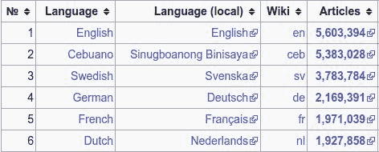

# 第三章：使用 FastText 命令行创建模型

FastText 拥有强大的命令行功能。事实上，可以将 fastText 称为一个“命令行优先”的库。现在，许多开发者和研究人员对命令行并不熟悉，我建议你在本章中更加专注于示例。我的希望是，在本章结束时，你能够对命令行文件操作有一定的信心。使用命令行的优势如下：

+   像`cat`、`grep`、`sed`和`awk`这样的命令已经有很长的历史，并且它们的行为在互联网上有很好的文档记录。很有可能，对于任何你可能遇到的使用场景，你都可以轻松在 Stack Overflow/Google 上找到代码片段（或者隔壁的同事可能也知道）。

+   由于它们通常是用 C 语言实现的，所以运行非常快速。

+   这些命令非常简洁明了，这意味着你不需要写很多代码，也不需要维护复杂的代码。

我们将了解在 fastText 中如何进行分类和词向量生成。在这一章中，我们将探讨如何使用命令行来实现它们：

+   使用 fastText 进行文本分类

+   FastText 词向量

+   创建词向量

+   Facebook 词向量

+   使用预训练的词向量

# 使用 fastText 进行文本分类

要访问命令行，打开 Linux 或 macOS 机器上的终端，或在 Windows 机器上按下 Windows + *R* 输入`cmd`后按*Enter*打开命令提示符，然后输入`fastText`。你应该看到一些输出。如果什么都没看到，或者遇到错误提示“命令未找到”，请查看上一章关于如何在计算机上安装 fastText 的内容。如果你能看到一些输出，说明成功运行，该输出是对所有选项的基本描述。fastText 的命令行选项描述可以在本书的*附录*中找到。

本章中提到的所有方法和命令行语句都适用于 Linux 和 Mac 机器。如果你是 Windows 用户，请更多关注描述和操作逻辑，按照步骤的逻辑进行操作。关于 Windows 和 Linux 之间命令行差异的有用指南，请参见*附录*。

在 fastText 中，命令行有两个主要的使用场景，分别如下：

+   文本分类

+   文本表示

fastText 的核心重点之一是文本分类。文本分类是一种技术，通过它我们可以学习输入文本属于哪一类。基本上，这是一个监督学习问题，因此首先，你需要一个包含文本及相应标签的数据集。

大致来说，机器学习算法会对一组矩阵和向量进行某种优化问题的处理。它们并不真正理解“原始文本”，这意味着你需要搭建一个管道，将原始文本转换为数字。以下是可以遵循的步骤：

+   首先，你需要数据，因此对于文本分类，你需要一系列会被标注的文本或文档。你将它们转换成一系列的文本-标签对。

+   下一步叫做**分词**。分词是将文本划分成独立的片段或词项的过程。分词主要通过理解给定文本中的词边界来完成。世界上许多语言是以空格分隔的，例如英语和法语。而在某些情况下，词边界可能并不清晰，例如在中文、泰米尔语和乌尔都语中。

+   一旦分词完成，依据这个过程，你可能会得到一个“词袋”，它本质上是一个向量，表示文档或句子中某个特定的词是否存在，以及它出现的次数。矩阵中的列是所有出现过的词集，称为字典，而行则表示文档中特定词的计数。这就是**词袋**-**模型**方法。

+   将词袋模型转换为 TF-IDF 矩阵，以减少常见术语的权重。使用 TF-IDF 是为了避免文档中常见的术语对结果矩阵产生过大影响。

+   现在你已经有了矩阵，可以将其作为输入传递给分类算法，这将基本上*训练一个模型*，在这个输入矩阵上进行训练。在这个阶段，比较常见的算法是逻辑回归，以及像 XGBoost、随机森林等算法。

可能需要进行的其他步骤如下：

+   移除停用词。

+   词干提取或启发式地去除词尾。这一过程主要适用于英语及相关语言，因为这些语言中派生词缀的使用非常普遍。

+   向模型中添加 n-grams。

+   同义词集。

+   词性标注。

# 文本预处理

根据数据集的不同，可能需要执行部分或所有这些步骤：

+   对文本进行分词。

+   将文本转换为小写。这只对使用拉丁字母、希腊字母、西里尔字母和亚美尼亚字母的语言要求。像英语、法语、德语等语言都属于此类。

+   去除空行及其对应内容。

+   移除包含 XML 标签的行（以`<`开始）。

这些步骤在两种情况中都应当执行，无论是句子分类还是词向量创建。

# 英文文本及其他使用拉丁字母的文本。

我们将通过一个示例数据集来理解文本处理。在这一章中，使用的是 Yelp 数据集。这个数据集非常流行，包含了用户的文本评论和评分。在这个数据集中，您将找到来自四个国家的 11 个大都市地区的商户信息。如果您从 Kaggle 的链接下载数据，[`www.kaggle.com/yelp-dataset/yelp-dataset/data`](https://www.kaggle.com/yelp-dataset/yelp-dataset/data)，您会看到各种文件，但在我们的例子中，我们只关心用户在 `yelp_review.csv` 文件中提供的评论文本。作为挑战，我们将尝试预测评分是否正确。

# 下载数据

由于这些信息与特定商户相关，并且如果您有兴趣下载并操作数据，请在下载数据之前查看以下步骤：

1.  请查看 Yelp 数据集的网页。

1.  请查看、同意并遵守 Yelp 的使用条款。

1.  从 Kaggle 下载 `yelp_review.csv`。下载链接在这里：[`www.kaggle.com/yelp-dataset/yelp-dataset/data`](https://www.kaggle.com/yelp-dataset/yelp-dataset/data)。

这是代码：

```py
$ mkdir -p data/yelp
$ cd data/yelp
$ mv ~/Downloads/yelp_review.csv.zip .
$ unzip yelp_review.csv.zip
Archive: yelp_review.csv.zip
 inflating: yelp_review.csv
```

# 预处理 Yelp 数据

查看数据。始终仔细查看数据。第一行包含表头：

```py
$ head -n1 yelp_review.csv
 "review_id","user_id","business_id","stars","date","text","useful","funny","cool"
```

当您查看其他行时，会发现所有的单个值都有引号。另外，文本字段中有许多地方有换行符。由于 fastText 在文本处理方面的优势，我们将只提取 "stars" 和 "text" 字段，并尝试基于文本字段中的内容预测评分。

您可以使用以下 Python 脚本将文本和评分保存到另一个文件中，因为评论文本包含很多换行符，我们需要将其移除。您可以选择保留换行符，或者将换行符更改为其他分隔符，使文件与 fastText 兼容，但在我们的示例中，我们将删除文本中的换行符。

以下是获取 `.csv` 文件中相关部分的 Python 代码：

```py
import csv
import sys
w = csv.writer(sys.stdout)
for row in csv.DictReader(sys.stdin):
    w.writerow([row['stars'], row['text'].replace('\n', '')])
```

将此内容保存为名为 `parse_yelp_dataset.py` 的文件，然后运行以下命令：

```py
$ cat data/yelp/yelp_review.csv | \
 python parse_yelp_dataset.py \
 > data/yelp/yelp_review.v1.csv
```

# 文本标准化

在本节中，我们将介绍一些您可以使用的文本标准化技术。

# 移除停用词

移除停用词可能会提高或不会提高您模型的性能。因此，请保留两个文件，一个包含停用词，另一个是移除停用词后的文件。我们将在 *模型测试与评估* 部分讨论如何检查模型性能。

您可以使用以下脚本来移除停用词。这是一个带有 `nltk` 等依赖项的 Python 脚本，因此请在您的 Anaconda 安装环境中使用它。运行此脚本之前，请确保您已经下载了 `nltk` 的 `'english'` 包：

```py
$ python -c "import nltk; nltk.download('stopwords')"
```

将以下代码保存为名为 `remove_stop_words.py` 的文件：

```py
import io
from nltk.corpus import stopwords
from nltk.tokenize import word_tokenize
import sys
def get_lines():
    lines = sys.stdin.readlines()
    for line in lines:
        yield line
stop_words = set(stopwords.words('english'))
for line in get_lines():
    words = line.lower().split()
    newwords = [w for w in words if w not in stop_words]
    print(' '.join(newwords))
```

要运行文件，您需要将文件内容传递给 Python 文件。不过，在以下解释中，为了简洁起见，我们并没有真正删除停用词。当然，您可以尝试这两种方法。

# 规范化

由于我们正在处理英语，建议首先将所有大写字母转换为小写字母，如下所示：

```py
$ cat data/yelp/yelp_review.v1.csv \
    | tr '[:upper:]' '[:lower:]' \
    > data/yelp/yelp_review.v2.csv
```

使用拉丁字母、希腊字母、西里尔字母和亚美尼亚字母的语言是双字母制的，这意味着有大写字母和小写字母。例如，英语、法语和德语就是这样的语言。只有在这些语言中，您才应小心将所有文本转换为小写字母。处理其他语言的语料库时，这一步是不需要的。

现在，文件的开头已经包含了所有标签。如果我们在所有句子的开头加上`__label__`，它将为所有标签添加`__label__`文本。这个标签前缀是必要的，因为库将整个文本作为输入，并且没有特定的方法来区分输入和标签，正如您在`scikit-learn`或其他库中看到的那样。您当然可以改变具体的标签前缀，正如您将在*附录*中看到的那样。

所以，要在 fastText 中读取文件并使 fastText 区分普通文本和标签文本，您需要在标签前加上`__label__`。以下是在命令行中轻松实现这一点的一种方式：

```py
$  cat data/yelp/yelp_review.v2.csv \
    | sed -e 's/^/__label__/g' \
    > data/yelp/yelp_review.v3.csv
```

分离并移除一些可能不相关的标点符号：

```py
$ cat data/yelp/yelp_review.v3.csv \
    | sed -e "s/'/ ' /g" \
 -e 's/"//g' -e 's/\./ \. /g' -e 's/<br \/>/ /g' \
 -e 's/,/ , /g' -e 's/(/ ( /g' -e 's/)/ ) /g' \
     -e 's/\!/ \! /g' \
 -e 's/\?/ \? /g' -e 's/\;/ /g' \
     -e 's/\:/ /g' > data/yelp/yelp_review.v4.csv
```

不要忘记在每次转换后继续检查数据是如何变化的。现在检查数据时，您会看到开头有一个逗号。还有很多点（`.`）：

```py
$ head -n 2 data/yelp/yelp_review.v4.csv
 __label__5 , super simple place but amazing nonetheless . it ' s been around since the 30 ' s and they still serve the same thing they started with a bologna and salami sandwich with mustard . staff was very helpful and friendly .
 __label__5 , small unassuming place that changes their menu every so often . cool decor and vibe inside their 30 seat restaurant . call for a reservation . we had their beef tartar and pork belly to start and a salmon dish and lamb meal for mains . everything was incredible ! i could go on at length about how all the listed ingredients really make their dishes amazing but honestly you just need to go . a bit outside of downtown montreal but take the metro out and it ' s less than a 10 minute walk from the station .
```

删除逗号和点。请记住，fastText 不要求删除标点符号和将所有字母转为小写；事实上，在某些情况下，这些可能是重要的。记住，这里提供的所有建议都应该谨慎对待，并尝试您能想到的所有可能的选项。最终目标是训练出最佳的模型。

```py
cat data/yelp/yelp_review.v4.csv | sed 's/\,//g' > data/yelp/yelp_review.v5.csv
cat data/yelp/yelp_review.v5.csv | sed 's/\.//g' > data/yelp/yelp_review.v6.csv
mv data/yelp/yelp_review.v6.csv data/yelp/yelp_review.v5.csv
```

最后，删除所有连续的空格。请注意，在以下示例中，经过所有这些转换后，文件不再是 `.csv` 格式，但这对我们来说是可以的，因为归根结底，`.csv` 文件也是文本文件，因此使用 `.txt` 或任何其他文本格式应该没有问题。只要文件是 UTF-8 格式的文本文件，您就可以继续使用。

```py
$ cat data/yelp/yelp_review.v5.csv | tr -s " " > data/yelp/yelp_review.v6.csv
```

# 打乱所有数据

在训练分类器之前打乱数据非常重要。如果数据的标签被聚集在一起，那么精度和召回率，进而模型的性能将较低。这是因为 fastText 使用随机梯度下降来学习模型。文件中的训练数据是按顺序处理的。在我们的例子中并非如此，因为同一类别的标签并不在一起，但仍然建议您记住这一点，并始终在训练前打乱数据。

在*Nix 系统中，你可以使用 shuffle 命令，如下所示：

```py
$ cat data/yelp/yelp_review.v6.csv | shuf > data/yelp/yelp_review.v7.csv
```

有时候，shuffle 命令可能会比较慢，在处理大文件时，你可以考虑使用`perl`单行命令：

```py
$ perl -MList::Util -e 'print List::Util::shuffle <>' \
    data/yelp/yelp_review.v6.csv \
    > data/yelp/yelp_review.v8.csv
```

# 划分训练集和验证集

模型性能评估应始终在独立数据上进行。你应该始终将整个数据集分为训练集和测试集。但是，过度划分数据集会减少用于训练的数据量，因此 80%的比例是一个不错的中间值。你可以使用以下命令将文件划分为 80-20 的比例：

```py
$ awk -v lines=$(wc -l < data/yelp/yelp_review.v9.csv) \
    -v fact=0.80 \
    'NR <= lines * fact {print > "train.txt"; next} {print > "val.txt"}' \
    data/yelp/yelp_review.v9.csv
```

# 模型构建

在本节中，我们将探讨模型训练和评估的步骤。

# 模型训练

现在，你可以开始训练步骤：

```py
$ fasttext supervised -input data/yelp/train.txt -output result/yelp/star_model
```

训练时将显示输出，最终你应该会看到类似以下的输出：

```py
Read 563M words
 Number of words: 1459620
 Number of labels: 5
 Progress: 100.0% words/sec/thread: 3327124 lr: 0.000000 loss: 0.789366 ETA: 0h 0m
```

如果你现在检查`result/yelp/`目录，你应该能看到两个扩展名为`.vec`和`.bin`的文件。`.bin`文件是训练好的分类器，而`.vec`文件包含了所有单词的词向量。你可以打开`.vec`文件，它只是一个文本文件。然而，注意使用轻量级文本编辑器，如 Sublime Text 或 Notepad++，来打开它，因为它会是一个大文件。或者，也可以使用命令行工具，如`head`或`tail`。

这是我们案例中创建的一些向量。第一行包含向量的维度，在我们案例中是（`1459620`，`100`）。接下来的两行是`.`和`the`的向量：

```py
1459620 100
 . -0.080999 ... -0.029536
 the -0.022696 ... 0.084717
```

# 模型测试与评估

现在你知道如何在 fastText 中创建模型文件，你需要测试并检查模型的性能，并以实际的方式报告其效能。这可以通过各种性能评估指标来完成。

# 精确度和召回率

为了测试分类模型的准确性，有两个非常流行的参数，它们被 fastText 支持，那就是精确度（precision）和召回率（recall）。召回率是正确召回的标签占所有实际存在标签的百分比，而精确度是所有正确预测标签占总预测标签的百分比。可以使用以下命令检查这两个参数值：

```py
$ fasttext test result/yelp/star_model.bin data/yelp/val.txt
 Now    1052334
 P@1    0.685
 R@1    0.685
 Number of examples: 1052334
```

目前精确度和召回率为 68%。让我们优化一些参数，看看是否能改进模型。

# 混淆矩阵

现在你有了一个模型，你还可以使用混淆矩阵查看模型在不同标签上的性能。与精确度和召回率一起，混淆矩阵能够很好地展示**真阴性**（**TN**）和**假阳性**（**FP**）。在理想情况下，所有对角线上的值都应该很高，而其余单元格的值应接近于零，但在实际情况下，你可能需要选择是否能接受较高的假阳性（FP）值，或者较高的**假阴性**（**FN**）值。

要获得混淆矩阵，你需要进行一些后处理。将句子与标签分开。然后，使用预测命令，你将能够预测每个测试行的标签。提供了一个 Python 脚本，可以用来获取混淆矩阵：

```py
$ mv data/yelp/val.testlabel data/yelp/val.testsentences
$ cut -f 1 -d ' ' data/yelp/val.txt > data/yelp/val.testlabel
$ cut -f 2- -d ' ' data/yelp/val.txt > data/yelp/val.testsentences
$ fasttext predict result/yelp/star_model.bin data/yelp/val.testsentences > pexp
$ python fasttext_confusion_matrix.py data/yelp/val.testlabel pexp
 Accuracy: 0.716503505541
 [[124224 16161 3347 864 1639]
 [ 24537 39460 19435 2748 1283]
 [ 5514 15646 63775 32668 5424]
 [ 1445 1815 22583 139956 78795]
 [ 1707 548 3071 59103 386586]]
```

你可以从这个 gist 下载 Python 脚本：[`gist.github.com/loretoparisi/41b918add11893d761d0ec12a3a4e1aa#file-fasttext_confusion_matrix-py`](https://gist.github.com/loretoparisi/41b918add11893d761d0ec12a3a4e1aa#file-fasttext_confusion_matrix-py)。或者，你也可以从 GitHub 仓库获取它：

```py
import argparse
import numpy as np
from sklearn.metrics import confusion_matrix
def parse_labels(path):
    with open(path, 'r') as f:
        return np.array(list(map(lambda x: x[9:], f.read().split())))
if __name__ == "__main__":
    parser = argparse.ArgumentParser(description='Display confusion matrix.')
    parser.add_argument('test', help='Path to test labels')
    parser.add_argument('predict', help='Path to predictions')
    args = parser.parse_args()
    test_labels = parse_labels(args.test)
    pred_labels = parse_labels(args.predict)
    eq = test_labels == pred_labels
    print("Accuracy: " + str(eq.sum() / len(test_labels)))
    print(confusion_matrix(test_labels, pred_labels))
```

# 超参数

在训练模型时，有多个超参数可以调整来提高模型性能。看看这里的一些超参数及其对模型训练的影响。

# 轮次

默认情况下，fastText 会查看每个数据点五次。你可以使用`-epoch`命令来改变这一点。在下面的示例中，我们将 epoch 参数改为 25，看看是否会改善我们的模型：

```py
$ fasttext supervised -input data/yelp/train.txt -output result/yelp/star_model -epoch 25
 Read 563M words
 Number of words: 1459620
 Number of labels: 5
 Progress: 100.0% words/sec/thread: 3451048 lr: 0.000000 loss: 0.761496 ETA: 0h 0m
```

模型的结果是 68.6%的精确度和召回率，只有 0.1%的提升：

```py
P@1 0.686
R@1 0.686
```

# 学习率

这可能是因为我们已经有了大量的样本。我们可以改变的另一个重要超参数是学习率，使用`-lr`参数。学习率控制模型在训练过程中的“更新速度”。这个参数控制应用于模型参数的更新大小。将学习率从 0.025 改为 1.0 意味着应用于模型的更新将变大 40 倍。在我们的模型中，我们还可以看到，学习率在最后变成了`0`。这意味着到最后，模型完全没有学习。我们试着将学习率设为`1`，看看会发生什么：

```py
$ fasttext supervised -input data/yelp/train.txt -output result/yelp/star_model -lr 1.0
 Read 563M words
 Number of words: 1459620
 Number of labels: 5
 Progress: 100.0% words/sec/thread: 3381014 lr: 0.000000 loss: 0.847610 ETA: 0h 0m
```

这个模型的结果和之前一样。改变学习率时没有任何区别：

```py
P@1 0.686
R@1 0.686
```

# N-gram

我们还有一个可能对模型性能产生巨大影响的超参数。默认情况下，在为模型创建词向量时，会使用单一词（unigrams）。单一词是 n-gram，其中*n*为 1。n-gram 可以通过以下图示来解释：


来源：[`stackoverflow.com/a/45477420/5417164`](https://stackoverflow.com/a/45477420/5417164)

你还可以使用`-wordNgrams`参数在 fastText 中固定`N`的值：

```py
$ fasttext supervised -input data/yelp/train.txt -output result/yelp/star_model -wordNgrams 2
 Read 563M words
 Number of words: 1459620
 Number of labels: 5
 Progress: 100.0% words/sec/thread: 1141636 lr: 0.000000 loss: 0.687991 ETA: 0h 0m
```

现在，精确度和召回率为 71.8%，提升了 3.2%。我们再试试更多的调整：

```py
$ fasttext supervised -input data/yelp/train.txt -output result/yelp/star_model -wordNgrams 3
 Read 563M words
 Number of words: 1459620
 Number of labels: 5
 Progress: 100.0% words/sec/thread: 620672 lr: 0.000000 loss: 0.633638 ETA: 0h 0m
 $ fasttext test result/yelp/star_model.bin data/yelp/val.txt
 Now1052334
 P@1   0.717
 R@1   0.717
 Number of examples: 1052334
```

将 N 设置为 3 导致了性能下降。所以，让我们将 N 的值保持为 2。

你可以结合所有这些参数来创建新的模型：

```py
$ fasttext supervised -input data/yelp/train.txt -output result/yelp/star_model -wordNgrams 2 -lr 1.0 -epoch 10
```

# 从预训练的词向量开始

如果你拥有的文本语料库不大，通常建议从为你训练分类器的语言预训练的词向量开始，否则分类结果可能较差。如何从你的语料库创建词向量将在下一节中深入讨论。

```py
$ fasttext supervised -input data/yelp/train.txt -output result/yelp/star_model_withprevecs -pretrainedVectors wiki-news-300d-1M.vec -dim 300
 Read 563M words
 Number of words: 1459620
 Number of labels: 5
 Progress: 100.0% words/sec/thread: 1959282 lr: 0.000000 loss: 0.788021 ETA: 0h 0m
```

在我们的案例中，结果并没有显著改善。精度和召回率略有提高，达到了 68.5%。

# 寻找最佳的 fastText 超参数

FastText 有许多可以优化的超参数，以便找到模型的最佳平衡点。对于分类器，你可以从损失函数开始，查看改变字符 n-grams 是否有意义，看看改变学习率和维度是否会产生效果。

实现超参数优化的一个流行算法是使用网格搜索方法。由于你的目标是找到一个好的模型，你将拥有一个训练数据集和一个测试数据集。假设训练数据是`train.txt`文件，测试数据是`test.txt`文件。你实际上是在解决一个优化问题（P），该问题是权重组合函数，在本例中是 *w*^' 和超参数的组合，可能是 n-grams、学习率或训练轮次。

所以，你明白了，对于一组固定的超参数值，解决优化问题会得到一个特定的模型。由于最佳模型（可以称之为模型*）是超参数的函数，我们可以将其表示如下：


现在，你可以使用这个模型*来预测训练数据的准确性。因此，超参数优化的目标是找到一组超参数，使得准确性最高。

请注意，计算最佳模型将是相当昂贵的。没有神奇的咒语，也没有魔法公式可以找到最佳模型的超参数。仅仅拿学习率作为超参数，就会让计算变得不切实际。学习率是一个连续变量，你需要输入每一个特定值，计算模型，并检查其性能。

因此，我们采用网格搜索：基本上，根据启发式方法选择一组超参数值，并根据所有这些值的组合，将它们输入计算，最终选出性能最好的那一组值。

这叫做网格搜索，因为当考虑的值集在图表上绘制时，它们看起来像一个网格。

你可以通过为你的超参数定义一个值数组来实现这一点：

```py
dim=(10 20)
lr=(0.1 0.3)
epochs=(5 10)
```

现在，我们有一个全局变量，用于保存每次找到的更好模型的单个变量，并将其初始化为 0。我们还将有一个全局性能变量来存储当前最佳性能，并初始设置为 0。在这个案例中，由于我们正在尝试三种超参数，因此我们将该变量的长度设置为 3，如下所示：

```py
final=(0 0 0)
performance=0
```

现在开始实现`for`循环，循环将遍历所有值的组合。请注意，`for`循环的深度将取决于你正在循环的超参数数量：

```py
for z in ${dim[@]}
do
    for y in ${lr[@]}
    do
        for x in ${epochs[@]}
        do
            # train with the current set of parameters
            ...

            # test the current model
            ...

            # see if current model is the best model and update the final variable.
            ...

        done
    done
done
```

正如你可能猜到的，由于我们检查三个超参数的每个值都有两个选项，训练将进行 2 x 2 x 2 = 8 次。因此，如果每次训练步骤大约需要 5 分钟，那么整个过程将需要 8 x 5 分钟，即 40 分钟。

现在，让我们进入平均值部分。以下是训练步骤：

```py
$ ./fasttext supervised -input train.txt -output model -dim "$z" -lr "$y" -epoch "$x"
```

训练完成后，接下来是测试阶段。我们将测试数据保存到文件中，以便稍后比较结果：

```py
$ ./fasttext test model.bin test.txt > performance.txt
```

接下来是比较并保存最佳模型：

```py
present_performance=$(cat performance.txt | awk 'NR==2 {print $2}') # get the precision values
if (( $(echo "$present_performance > $performance" | bc -l) )); then
    # if current performance is the best performance till date
    final[0]="$z"
    final[1]="$y"
    final[2]="$x"
    echo "Performance values changed to ${final[@]}"
    echo "present accuracy:"
    cat performance.txt
fi
```

现在，你可以扩展此脚本，加入更多超参数。你可以在仓库中的文件中找到完整代码。

# 模型量化

借助模型量化，最快的模型能够适应移动设备和小型设备，如 Raspberry Pi。由于代码是开源的，现有 Java 和 Swift 库可以用来加载量化后的模型，并分别在 Android 和 iOS 应用中提供服务。

压缩 fastText 模型的算法是 fastText 与 **Facebook AI Research** (**FAIR**) 团队合作创建的。这导致 fastText 模型的体积大幅减少。原本为数百 MB 的 fastText 模型，经过压缩后仅为 1-2 MB。

实现量化可以通过使用 quantize 参数来完成。不过，你仍然需要通过常规路线训练模型：

```py
$ DATADIR=data
$ RESULTDIR=result
$ ./fasttext supervised -input "${DATADIR}/train.txt" -output "${RESULTDIR}/model" -dim 10 -lr 0.1 -wordNgrams 2 -minCount 1 -bucket 10000000 -epoch 5 -thread 4
Read 298M words
Number of words: 1454893
Number of labels: 5
Progress: 100.0% words/sec/thread: 2992746 lr: 0.000000 loss: 0.634722 eta: 0h0m
$ fastText-0.1.0 git:(master) ./fasttext quantize -output "${RESULTDIR}/model" -input "${DATADIR}/train.txt" -qnorm -retrain -epoch 1 -cutoff 100000
Progress: 100.0% words/sec/thread: 2382426 lr: 0.000000 loss: 0.711356 eta: 0h0m h-14m
```

请注意，量化模型与未量化模型之间存在巨大差异：

```py
$ du -sh $RESULTDIR/model.bin
466M result/yelp/model.bin
$ du -sh $RESULTDIR/model.ftz
1.6M result/yelp/model.ftz
```

`.bin` 文件大小约为 466 MB，而量化后的模型只有 1.6 MB。

有趣的是，精度和召回率的数值似乎有所提升。

```py
$ ./fasttext test $RESULTDIR/model.bin $DATADIR/val.txt
N 1052334
P@1 0.699
R@1 0.699
Number of examples: 1052334
$ ./fasttext test $RESULTDIR/model.ftz $DATADIR/val.txt
N 1052334
P@1 0.7
R@1 0.7
Number of examples: 1052334
```

因此，你几乎不会在性能上看到差异，同时节省了大量空间。你现在可以将此模型部署到更小的设备上。在下一章中，我们将讨论模型量化的工作原理。此外，在第七章，*将模型部署到 Web 和移动设备*，我们将讨论如何将量化模型打包为 Android 应用的一部分。

不幸的是，目前量化只适用于有监督模型，但未来可能会有所改变，所以请保持你的 fastText 安装版本更新。

# 理解模型

一旦模型创建完成，你现在可以看到在生成模型时使用的参数。这在你深入思考数据并希望更改某些模型参数时，或作为一般文档记录时非常有用：

```py
$ fasttext dump result/yelp/star_model.bin args
 dim 100
 ws 5
 epoch 5
 minCount 1
 neg 5
 wordNgrams 2
 loss softmax
 model sup
 bucket 2000000
 minn 0
 maxn 0
 lrUpdateRate 100
 t 0.0001
```

`dict` 参数提供了训练中使用的单词字典信息。在之前的训练过程中，使用了 1,459,625 个单词，具体可以见下文。`was` 被使用了 8,272,495 次，`crinkle-also` 在整个句子集合中只使用了一次，等等。它还提供了单词是作为单词还是标签使用的信息。如你所见，标签位于列表的末尾：

```py
$ fasttext dump result/yelp/star_model.bin dict > dumpdict
$ ls -lhrt dumpdict
 -rw-rw-r-- 1 joydeep joydeep 27M Apr 2 11:05 dumpdict
$ head dumpdict
 1459625
. 34285218 word
the 23539464 word
, 16399539 word
and 16299051 word
i 14330427 word
a 12034982 word
to 11508988
' 8907643 word
was 8272495 word
$ tail dumpdict
m&m\/chocolate 1 word
drops-surprisingly 1 word
crinkle-also 1 word
cookie-humungo 1 word
dishes\/restaurants 1 word
__label__5 1802332 label
__label__4 978722 label
__label__1 585128 label
__label__3 492454 label
__label__2 350698 label
```

输入和输出的行在数据转储中对应于模型的参数。在我们的模型中，前 1,459,620 行输入是与单个单词相关联的向量，而剩余的 200 万行则用于表示子词。这 200 万个子词被选择来表示整体意义，并且可以通过数据转储中 `args` 的输出中的 bucket 参数理解。输出行是与上下文或我们的标签相关联的向量。通常，在学习无监督词表示时，这些向量在训练后不会保留下来：

```py
$ fasttext dump result/yelp/star_model.bin input > dumpinput
 $ cat dumpinput | wc -l
 3459621
 $ fasttext dump result/yelp/star_model.bin output > dumpoutput
 $ cat dumpoutput | wc -l
 5
```

本节中提到的转换可以在 GitHub 仓库中的`transformations.sh`文件中查看。

# FastText 词向量

fastText 的第二个主要关注点是为输入文本创建词嵌入。在训练过程中，fastText 会查看提供的文本语料库，并形成一个高维向量空间模型，其中它尝试尽可能地封装语义。创建词向量空间的目标是让相似的单词向量尽可能接近。在 fastText 中，这些词向量将保存在两个文件中，类似于你在文本分类中看到的：一个 `.bin` 文件和一个 `.vec` 文件。

在本节中，我们将通过使用 fastText 命令行来创建和使用词向量。

# 创建词向量

接下来，我们将介绍如何在 fastText 中创建词向量。你可能正在处理并为某个特定领域构建解决方案，在这种情况下，我的建议是从该特定领域生成原始文本。但如果原始文本不可用，你可以借助维基百科，它是一个包含多种语言的大型原始文本集合。

# 从维基百科下载

要开始使用词向量，你需要数据或文本语料库。如果你幸运的话，已经有了文本语料库。如果你不那么幸运，尤其是在你有兴趣解决 NLP 中有趣问题时，可能没有数据可用。在这种情况下，维基百科是你的朋友。维基百科的最佳之处在于，它是全球超过 250 种语言的书面文本的最佳来源。尽管这个数量相比于实际语言种类来说微不足道，但对于大多数用例来说，可能已经足够了。如果你正在处理某种语言，但维基百科资源不够丰富，也许你应该在你的语言社区中提高维基百科重要性的意识，并呼吁社区更多地贡献内容。一旦你确定了目标语言，就可以使用`get-wikimedia.sh`文件下载维基百科语料库。你可以从 fastText 的 GitHub 仓库获取此文件。稍作更新的版本可以从*附录*中复制。

使用`get-wikimedia.sh`文件下载维基百科语料库。

你可以在这个链接获取维基百科上所有语言的文章列表：[`meta.wikimedia.org/wiki/List_of_Wikipedias`](https://meta.wikimedia.org/wiki/List_of_Wikipedias)。在这个链接中，语言列表是以这种格式给出的：



需要注意的是第三列。记录下你选择的语言的第三个值，并运行`bash get-wikimedia.sh`：

```py
$ bash get-wikimedia.sh
 Saving data in data/wikimedia/20180402
 Choose a language (e.g. en, bh, fr, etc.): ja
 Chosen language: ja
 Continue to download (WARNING: This might be big and can take a long time!)(y/n)? y
 Starting download...
 --2018-04-02 19:32:40-- https://dumps.wikimedia.org/jawiki/latest/jawiki-latest-pages-articles.xml.bz2
 Resolving dumps.wikimedia.org (dumps.wikimedia.org)... 208.80.154.11, 2620:0:861:1:208:80:154:11
 Connecting to dumps.wikimedia.org (dumps.wikimedia.org)|208.80.154.11|:443... connected.
 HTTP request sent, awaiting response... 200 OK
 Length: 2656121742 (2.5G) [application/octet-stream]
 Saving to: ‘data/wikimedia/20180402/jawiki-latest-pages-articles.xml.bz2’

 jawiki-latest-pages-articles.xml.bz 0%[
```

你将收到一个 BZ2 文件。要解压 BZ2 文件，运行以下命令：

```py
bzip2 -d enwiki-20170820-pages-articles.xml.bz2
```

如果你打开这个文件（在操作时请小心，文件很大），你会发现很多不必要的内容，比如 HTML 标签和链接。所以，你需要用`wikifil.pl`脚本清理文本，这个脚本是 Matt Mahoney 编写的，并且随着 fastText 的 GitHub 文件一起分发。

# 文本规范化

如果你下载了英文语料库，你可以使用`wikifil.pl`脚本：

```py
perl wikifil.pl data/enwik9 > data/fil9
```

在我们的例子中，我们有日文文本，因此我们将使用 WikiExtractor（[`github.com/attardi/wikiextractor`](https://github.com/attardi/wikiextractor)）从 BZ2 文件中提取文本：

```py
find data/jap_wiki/cleaned_jap_text.txt/ -type f -exec cat {} \; | python japanese_parser.py -d /var/lib/mecab/dic/ipadic-utf8 > data/jap_wiki_parsed.txt
```

仍然有很多标签和属于标签的一部分的英语单词。你需要进行一些额外的处理和文本清理，以便准备好语料库进行训练：

```py
$ cat data/jap_wiki_parsed.txt | sed "s/^.*https.*$//g" > 
  data/jap_wiki_parsed1.txt
 $ cat data/jap_wiki_parsed1.txt | tr '[:upper:]' '[:lower:]' > data/jap_wiki_parsed2.txt
 $ cat data/jap_wiki_parsed2.txt | sed   
  "s/[abcdefghijklmnopqrstuvwxyz]//g" > data/jap_wiki_parsed3.txt
 $ cat data/jap_wiki_parsed3.txt | tr -s " " >             
   data/jap_wiki_parsed4.txt
 $ cat data/jap_wiki_parsed4.txt | awk 'NF' | awk '{$1=$1;print}' >  
   data/jap_wiki_parsed5.txt
```

现在，你可以开始训练过程了。我们将保留英语数字。

# 创建单词向量

现在，你可以创建单词向量了。创建`result`目录：

```py
$ mkdir -p result/jap_wiki
 fasttext skipgram -input data/jap_wiki_parsed5.txt -output    
  result/jap_wiki/jap
```

fastText 支持两种创建单词向量的算法，`skipgram`和`cbow`：

```py
$ fasttext skipgram -input data/jap_wiki/fil_cleaned_jap_text3.txt - 
  output result/jap_wiki/jap
```

和

```py
$ fasttext cbow -input data/jap_wiki/fil_cleaned_jap_text3.txt -output 
  result/jap_wiki/jap_cbow
```

# 模型评估

单词向量的模型评估在很大程度上是一个手动过程。在这种情况下，你可以尝试一些单词样本，看看模型是否给出了充分的结果。

你可以用来评估模型的一些方法包括查看模型的最近邻以及查看一些单词的类比。一个常用的方法是通过 t-SNE 可视化。我们将在第四章中讨论 t-SNE 可视化，

*FastText 中的句子分类*。

# 最近邻

要获取给定单词的最近邻，传递`nn`参数，然后你需要提供 BIN 文件的路径。为了简洁起见，我们在这里只显示三个结果：

```py
$ fasttext nn result/jap_wiki/jap.bin
 Pre-computing word vectors... done.
 Query word? 
  0.949732
  0.945276
  0.943492
```

类似于“sleep”的单词（）给出了先前的结果，意思是“返回本土”；“Hachinosu”，这是南极洲的一个山峰；以及“全国选举”。在我们的例子中，结果是随机的，因此不好。

# 单词类比

单词类比是判断模型是否有效的好方法。类比的原理是，具有相似关系的两个单词组在向量空间中应该彼此距离相似。因此，当你提供“man”（男人）、“woman”（女人）和“king”（国王）等单词时，结果应该是“queen”（女王），因为在一个好的向量空间中，表示“man”和表示“woman”的词向量之间的距离应接近表示“king”和表示“queen”的词向量之间的距离。命令显示了 10 个结果，但这里只显示了前三个：

```py
$ fasttext analogies result/jap_wiki/jap.bin
 Query triplet (A - B + C)?  (man woman king)
  0.856853
  0.855393
  0.852085
```

这个代码块中的符号含义分别是“cracking”（破解）、“Monkey King”（孙悟空）和“King”（国王），在我们的情况下并没有太大帮助。

# 训练时的其他参数

类似于监督学习，你可以更改各种超参数，并查看生成的模型是否表现更好。因此，你可以使用`-minCount`参数固定最小的单词出现次数，使用`-wordNgrams`参数固定单词 n-gram 的最大长度。你还可以更改 fastText 用于哈希单词和字符 n-gram 的桶的数量，从而限制内存使用。如果你的系统内存很大，可以通过传递大于 200 万的值来更改这个桶参数，看看使用`-bucket`参数时模型的表现是否有所提高。你可以使用`-minn`和`-maxn`参数更改字符 n-gram 的最小和最大长度。使用`-t`更改采样阈值，使用`-lr`更改学习率，使用`-lrUpdateRate`更改学习率更新的频率，使用`-dim`更改词向量的维度，使用`-ws`更改上下文窗口的大小，使用`-epoch`更改训练时每一行查看的次数（默认 5 次），使用`-neg`更改采样的负样本数量，以及更改使用的损失函数，从默认的**ns**（**负采样**）更改为 softmax 或**hs**（**分层 softmax**）。默认使用的线程数是 12，但通常计算机有四核或八核，因此你可以使用`-thread`参数更改线程数以优化核心使用。

# 词汇表外单词

FastText 也支持处理词汇表外的单词。FastText 之所以能够做到这一点，是因为它不仅跟踪单词级别的 n-gram，还跟踪字符级别的 n-gram。因此，像“learn”（学习）、“learns”（学习）和“learned”（学会）这些单词对于它来说看起来是相似的。要获得词汇表外单词的向量，你必须使用二进制模型，这意味着模型文件具有`.bin`扩展名：

```py
$ fasttext print-word-vectors wiki.it.300.bin < oov_words.txt
```

# Facebook 词向量

Facebook 发布了大量基于维基百科和常规爬虫的预训练词向量，你可以从他们的网站下载并在你的项目中使用（[`fasttext.cc/docs/en/pretrained-vectors.html`](https://fasttext.cc/docs/en/pretrained-vectors.html)）。常规爬虫模型是 CBOW 模型，而维基百科模型是 skip-gram 模型。词向量的维度是 300，使用了长度为 5 的字符 n-gram，窗口大小为 5，负样本数为 10。

# 使用预训练的词向量

你可以在监督学习任务中使用预训练词向量。这在监督学习部分已简要讨论过。一个示例命令如下所示：

```py
$ fasttext supervised -input train.txt -output model -epoch 25 - 
  wordNgrams 2 -dim 300 -loss hs -thread 7 -minCount 1 -lr 1.0 -verbose   
  2 -pretrainedVectors wiki.ru.vec
```

在使用预训练词向量时需要注意一些事项。你可以在[`stackoverflow.com/questions/47692906/fasttext-using-pre-trained-word-vector-for-text-classification`](https://stackoverflow.com/questions/47692906/fasttext-using-pre-trained-word-vector-for-text-classification)找到相关信息。

# 机器翻译

Facebook 在神经机器翻译方面做了大量工作，MUSE 就是其中之一。MUSE 是一个多语言无监督和监督式词嵌入库。MUSE 使用并基于 fastText 词嵌入。通过 fastText 得到的词嵌入是单语的，因此这些向量需要对齐才能有效地进行语言间翻译。作为 MUSE 的一部分，以下是一些功能：

+   fastText 发布了适用于 30 种语言的维基百科监督式词嵌入。这些词嵌入被对齐到一个单一的向量空间中。

+   还发布了 110 个大规模的双语词典，供你训练自己的模型。

# 总结

在本章中，你了解了如何结合*Nix shell 的命令行文本转换能力*和 fastText 库，来实现一个训练、验证和预测的流水线。你在本章中探索的命令不仅功能强大，而且执行速度也很快。掌握好命令行操作，再配合 fastText 应用，应该能帮助你快速创建原型并在快节奏的环境中部署它们。至此，本书的第一部分已经完成。

本书的下一部分将介绍构建这个包的理论和算法，下一章将介绍如何使用 fastText 进行无监督学习。
