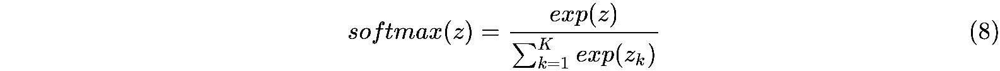
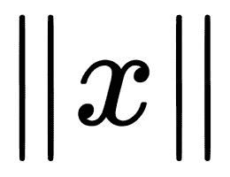

# 第五章：FastText 中的词表示

现在你已经了解了如何在命令行中创建模型，你可能会想知道 fastText 是如何创建这些词表示的。在本章中，你将了解背后发生的事情以及驱动 fastText 的算法。

本章将涵盖以下内容：

+   词到向量的表示

+   单词表示的类型

+   从文本中获取向量表示

+   fastText 中的模型架构

+   无监督模型

+   fastText skipgram 实现

+   **CBOW**（**连续词袋模型**）

+   skipgram 和 CBOW 的比较

+   损失函数和优化

+   Softmax

+   上下文定义

# 词到向量的表示

几乎所有的机器学习和深度学习算法都在处理向量和矩阵。它们之所以有效，是因为它们的基础数学原理深深根植于线性代数。因此，简而言之，无论是监督学习还是无监督学习，你都需要创建数字矩阵。在其他领域，这不是问题，因为信息通常以数字形式捕捉。例如，在零售行业，销售信息（如销售了多少单位或商店在当前月的收入）都是数字。即使是在计算机视觉这样的更抽象的领域，图像始终以三种基本颜色的像素强度存储：红色、绿色和蓝色。某种颜色的 0 表示没有强度，而 255 表示屏幕上可能的最高强度。同样，在声音的情况下，它被存储为功率谱密度系数。在声音的情况下，麦克风接收到的模拟信号会被转换为离散时间和离散振幅。振幅本质上是指在给定时间内能够传递的位数，因此它本质上是一个数字。

计算机系统中原始文本面临的挑战是，它们通常以字符串形式存储和分析，而这与这些矩阵系统不太兼容。因此，你需要一种方法将文本转换为矩阵。

# 单词表示的类型

根据目标语言，有各种概念需要注意，以便为给定语料库提供最佳的词表示：

+   **分布式词表示**：在分布式表示中，词的语义不应仅集中在一个维度上，而应分布在所有维度上。如果没有分布，那么生成的向量可能会过大，这可能在执行必要的向量变换时，既在内存方面也在执行变换所需的时间方面成为限制因素。分布式表示是紧凑的，并且能够表示一个维度数量上指数级的聚类。

+   **分布式词表示**：你可以认为“猫”和“狗”之间有某种相似性，而“猫”和“老虎”之间又是另一种相似性。专注于捕捉这些隐含关系的词表示被称为分布式词表示。为了获得这样的分布式特性，通常采用以下非常常见的范式：

你可以通过词汇所处的语境来理解其含义

- 约翰·鲁珀特·弗斯（1962）

所以，如果我们以两个句子为例，“玛丽有一只猫”和“玛丽有一只狗”，那么“狗”和“猫”周围的上下文是相同的，因此词表示应该能够通过阅读这两个句子来获得“宠物”这一语境。

+   **齐夫定律与海普定律**：当我们讲到 n-grams 时，我们会对齐夫定律进行更多讨论，但这里我们将陈述海普定律：

文档（或文档集）中不同词的数量与文档长度的关系（即所谓的词型-词令关系）。

总结来看，齐夫定律和海普定律基本上是在传达同一个意思，那就是你总会遇到新词。因此，你不应该将文档中的稀有词丢弃，而需要一种更能容纳新词的词表示方法。你不能通过构建语言模型并关闭词汇表来宣告任务完成。

# 从文本中获取词向量表示

在本节中，我们将探讨为目标文本群体提供向量表示的含义。我们将从最简单的一种词向量形式及其实现方法开始。接着，我们将探索其它类型词向量背后的理论依据，最后，我们将深入研究用于在 fastText 中创建词向量的算法。

# 独热编码

在最简单的方法中，可以将原始文本看作一个词汇的集合，假设每个“词”都以某种方式对整个句子的意义作出贡献。所有的词都有特定的含义，因此它们本身就是类别。一个词的出现意味着该词所代表的类别存在，而缺少该词则意味着该类别不存在。因此，传统方法是将分类变量表示为二进制变量。首先创建词汇表，然后为每个词分配一个唯一位置。接着，通过在相应的索引位置放置 1，其它位置则放置 0，来创建向量。这种创建向量的方式被称为独热编码：


独热模型的实现如下：

```py
# define input string
data = 'the quick brown fox jumped over the lazy dog'
consecutive_words = data.split()
print(data)

# construct the dictionary
all_words = list(set(consecutive_words))

# define a mapping of word to integers
word_to_int = dict((w, i) for i, w in enumerate(all_words))
int_to_word = dict((i, w) for i, w in enumerate(all_words))
# integer encode input data
integer_encoded = [word_to_int[w] for w in consecutive_words]

# one hot encode
onehot_encoded = list()
for value in integer_encoded:
    letter = [0 for _ in range(len(all_words))]
    letter[value] = 1
    onehot_encoded.append(letter)
_ = [print(x) for x in onehot_encoded]

def argmax(vector):
    # since vector is actually a list and its one hot encoding hence the
    # maximum value is always 1
    return vector.index(1)

# invert encoding
inverted = int_to_word[argmax(onehot_encoded[0])]
print(inverted)
```

尽管独热编码简单易懂且易于实现，但它也有一些缺点：

+   **不是分布式表示**：每个向量的维度随着词汇表的大小增长而增加。形成的矩阵非常稀疏——这意味着大多数单独的值都是 0。因此，矩阵操作变得计算上非常昂贵，即使是对于一个正常大小的语料库。

+   **超出词汇表的词**：它无法处理测试时的新词。

+   **不是分布式表示**：在独热编码中，所有的向量彼此间是等距的。

# 词袋模型

词袋模型关注的是已知词汇在文档中是否出现，并且只考虑文档中词汇的频率。因此，为了使用词袋方法创建文档矩阵，使用以下算法：

1.  查找在所有文档中使用的独立词汇数量。词汇通过空格和标点符号作为分隔符进行识别。

1.  使用这些词汇，创建特征空间。对于每个文档，每个特征值是该特征在文档中出现的次数。因此，结果矩阵中的每一行将对应于每个文档。计算每个文档中的词汇数。这是因为每个文档都会生成自己的向量。

1.  归一化向量。

例如，假设有两个文档构成整个语料库：

```py
Document1: "John likes to watch movies. Mary likes too."
Document2: "John also likes to watch football games."
```

所以对于所有的句子，我们的词汇表如下：

```py
['also', 'football', 'games', 'john', 'likes', 'mary', 'movies', 'to', 'too', 'watch']
```

要获取词袋，我们统计每个词在句子中出现的次数。因此，以下是为每个文档形成的向量：

```py
Document1: {'likes': 2, 'John': 1, 'to': 1, 'watch': 1, 'movies': 1, 'Mary': 1, 'too': 1}
Document2: {'John': 1, 'also': 1, 'likes': 1, 'to': 1, 'watch': 1, 'football': 1, 'games': 1}
```

词袋方法的主要缺点是丧失了词汇的上下文。例如，“玩具狗”和“狗玩具”这两个词组并不意味着相同的事情，但它们会共享相同的向量。这里展示了词袋方法的一个简单实现：

```py
import collections, re
texts = ['John likes to watch movies. Mary likes too.', 'John also likes to watch football games.']
bagsofwords = [collections.Counter(re.findall(r'\w+', txt)) for txt in texts]
```

```py

print(bagsofwords[0])
print(bagsofwords[1])
sumbags = sum(bagsofwords, collections.Counter())
print(sumbags)
```

# TF-IDF

仅仅计算文档中词汇的数量可能无法提供足够的有关整个语料库的信息。这个想法是，稀有词汇能提供更多关于文档内容的信息。在 TF-IDF 中，词频被文档频率归一化。直观地说，TF-IDF 让稀有词汇更加突出，同时减小了常见词汇的影响。

# N-gram（N-元组）

基于 N-gram 的方法基于 Zipf 定律，Zipf 定律指出：

在人类语言文本中，第 n 个最常见的词出现的频率与 n 成反比。

在所有语言中，有一些词汇比其他词汇使用得更频繁。常见词汇与不常见词汇之间的差异并不是剧烈的，而是连续的。这个定律的另一个重要推论是，如果一个特定频率的文档类别被切断，这不会大幅影响 N-gram 频率的分布。因此，如果我们比较同一类别的文档，它们的频率分布应该是相似的。

N-gram 频率是指重叠词序列的频率。这里有一句话：

“即使现在，他们也在自己的坟墓中交谈。”

- H.P. 洛夫克拉夫特

从这个句子你可以得到以下 n-grams。"_"用来表示句子的开始和结束：

+   **1**-**grams (单元组)**：Even, now, They, talked, in, Their, tombs（特征数量：7）。

+   **2**-**grams (双元组)**：(_, Even)，(Even, now)，(now, They)，(They, talked)，(talked, in)，(in, Their)，(Their, tombs)，(tombs, _)（特征数量：8）。

+   **3**-**grams (三元组)**：(_, _, Even)，(_, Even, now)，(Even, now, They)，(now, They, talked)，(They, talked, in)，(talked, in, Their)，(in, Their, tombs)，(Their, tombs, _)，(tombs, _, _)（特征：9）。

+   **4**-**grams (三元组)**：(_, _, _, Even)，(_, _, Even, now)，(_, Even, now, They)，(Even, now, They, talked)，(now, They, talked, in)，(They, talked, in, Their)，(talked, in, Their, tombs)，(in, Their, tombs, _)，(Their, tombs, _, _)，(tombs, _, _, _)（特征：10）。

依此类推。

当只处理单元组时，整个句子的概率可以写成如下：

```py
P("Even now They talked in Their tombs.") = P("Even") * P("now") * P("They") * P("talked") * P("in") * P("Their") * P("tombs")
```

类似地，在双元组的情况下，整个句子的概率可以写成如下：

```py
P("Even now They talked in Their tombs.") = P("Even" | start of sentence) * ("now" | "Even") * ("They" | "now") * ("talked" | "They") * ("in" | "talked") * ("Their" | "in") * ("tombs" | "Their") * (end of sentence | "tombs")
```

根据最大似然估计，类似 P("now" | "Even")的条件概率可以表示为“Even now”出现的观测次数与“Even”出现的观测次数之比。这个概率模型现在可以用于预测新的句子。

让我们在双元组的情况下构建一个模型。这个文件已从马里兰大学高级计算机研究所的服务器上获取，[`www.umiacs.umd.edu/`](http://www.umiacs.umd.edu/)，你也可以使用自己的语料库。将它保存在`data`文件夹中。

现在，以下命令将删除换行符，然后将所有连续的空格压缩为一个空格，接着获取所有的双元组并根据频率进行排序：

```py
$ cat data/persuasion.txt | tr '\n' ' ' | tr -s ' ' | tr -sc 'A-Za-z' '\012' |   sed -e '1!{$!p' -e '}' | paste -d' ' - - | sort | uniq -c | sort -nr > data/persuasion_bigrams.txt
```

现在我们可以使用这个 n-grams 文件构建一个句子生成器：

```py
def get_next_word(ngram_file, word1=None, sentence_length=0):
    with open(ngram_file) as f:
        for line in f:
            _, w1, w2 = line.split()
            if word1 is None or word1 == w1:
                sentence_length -= 1
                word1 = w2
                return w1, word1, sentence_length

def build_sentence(ngram_file, sentence_length):
    first_word = None
    sentence = ''
    while sentence_length > 0:
        w1, first_word, sentence_length = get_next_word(ngram_file, first_word, sentence_length)
        sentence = sentence + ' ' + w1
    final_sentence = sentence + ' ' + first_word + '.'
    return final_sentence

print(build_sentence('data/persuasion_bigrams.txt', 10))
```

使用这个 n-gram 句子生成器，我们得到如下句子：

```py
$ python build_sentence_ngrams.py
 of the same time to be a very well as she.
```

如果这让你感兴趣，可以尝试用三元组或更多来构建。

n-grams 的主要缺点是它们非常稀疏，并且在测试数据中遇到新词时无法区分。

# fastText 中的模型架构

fastText 模型会有些不同，取决于它们是无监督模型还是有监督模型。在本章中，我们主要讨论无监督模型。

# 无监督模型

在 fastText 中，你可以选择使用两种模型架构来计算词汇的分布式表示。这些模型分别是 skipgram 和 CBOW。fastText 中使用的模型架构都是分布式架构。因此，目标是为每个词汇项学习一个高维度的密集表示。这个表示应该是分布式的，并且尝试从上下文中学习。

在这两种架构中，你训练一个两层的浅层神经网络来构建词汇的上下文。

# Skipgram

在 skipgram 中，考虑了一个大小为*k*的上下文窗口。所有其他位置都会被跳过，只有面板和单词之间的关系会被探讨。这是通过将单词的 one-hot 编码输入到一个两层的浅层神经网络来实现的。由于输入是 one-hot 编码，隐藏层只包含一行输入隐藏权重矩阵。神经网络的任务是根据单词预测第*i*个上下文：


每个单词的得分是通过以下方程计算的：


这里，*h*是隐藏层中的一个向量，*W*是隐藏输出权重矩阵。在计算出*u*之后，*c*多项式权重分布被计算出来，其中*c*是窗口大小。这些分布是通过以下方程计算的：


这里，*w[c,j]*是输出层中第*c*面板上的第*j*个单词；*w[O,c]*是输出上下文单词中实际的第*c*个单词；*w[I]*是唯一的输入单词；*u[c,j]*是输出层第*c*面板上第*j*个单元的净输入。所以你可以看到，实际上这是试图根据输入单词预测上下文单词。然后，概率会被转换为 softmax。如果你尝试将上面的架构可视化，它应该转化为如下所示：


此外，通过随机采样，较远的单词会被赋予较小的权重。当你给定窗口大小参数时，实际上只配置了最大窗口大小。实际上，实际窗口大小会在 1 和最大窗口大小之间随机选择，适用于每个训练样本。因此，最远的单词以 1/*c*的概率被选择，而最近的单词则始终被选择。

# 子词信息 skipgram

skipgram 模型是从 word2vec 实现中直接采用的原始形式。skipgram 模型之所以有效，是因为它强调了特定单词和与之相关联的单词。但是，除了特定的单词，n-grams 的特性也可能包含大量的信息。对于形态学丰富的语言尤其如此。在 fastText 中，作者采用了 word2vec 中的 skipgram 实现，这只是将整个单词的向量表示取出，然后表示为该单词向量实际上是 n-grams 向量表示的总和。因此，在 fastText 中，你之前看到的得分函数（*u*）实际上被改成了以下形式：


*得分* = [*3-6 字符级 n-grams*] + [*单词*]

在库中，n-grams 的范围是大于或等于 3 且小于或等于 6 的，因此像`Schadenfreude`这样的词汇所采集的 n-grams 如下：

```py
"shadenfreude" = {"sha", "had", "ade", ..., "shad", "frue", ..., "freude", ..., "shadenfreude"}
```

这种方法的主要优势在于，对于超出词汇表的单词，[word]向量不存在，因此得分函数会转变为以下形式：

*得分* = [*3-6 字符级 n-grams*]

# 实现 skipgram

现在让我们通过一些 Python 代码来理解 skipgram 方法。Keras 库提供了一个非常好且易于理解的 skipgram 函数，你可以查看并理解 skipgram 应该如何实现。在本节的代码中，你可以查看 `fasttext skipgram cbow.ipynb` 笔记本，它灵感来源于 Keras 的实现。

正如在 skipgram 中讨论的那样，模型的任务是根据单词预测第 *i* 个上下文。实践中，这是通过从文档中提取词对，然后在第二个词是上下文词时，输出为 `1` 来实现的。

现在，给定一个序列或一个单独的文档（在此情况下，可能是一个特定的句子），首先创建两个列表：`couples` 和 `labels`。现在，对于每个目标词，获取上下文窗口，并在上下文窗口中，对于目标词和上下文词的每一个组合，将该组合捕捉到 `couples` 列表中，并将标签捕捉到 `labels` 列表中：

```py
couples = []
labels = []
for i, wi in enumerate(sequence):
    if not wi:
        continue

    window_start = max(0, i - window_size)
    window_end = min(len(sequence), i + window_size + 1)
    for j in range(window_start, window_end):
        if j != i:
            wj = sequence[j]
            if not wj:
                continue
            couples.append([wi, wj])
            if categorical:
                labels.append([0, 1])
            else:
                labels.append(1)
```

由于我们目前只捕捉了正例，我们还需要捕捉一些负例，以便有效地训练模型。在负采样的情况下，对于负样本的数量，需要随机生成一些与目标单词无关的词索引：

```py
num_negative_samples = int(len(labels) * negative_samples)
words = [c[0] for c in couples]
random.shuffle(words)

couples += [[words[i % len(words)],
            random.randint(1, vocabulary_size - 1)] # basically get some out of context word indices
            for i in range(num_negative_samples)]
```

```py

if categorical:
    labels += [[1, 0]] * num_negative_samples # opposite of what you would define for positive samples
else:
    labels += [0] * num_negative_samples
```

你可以将之前的逻辑封装到一个函数中，就像在 Keras 函数 `skipgrams` 中所做的那样，然后返回组合（由 `couples` 列表表示）和标签。接下来，这些将传递给神经网络，神经网络将基于这些组合和对应的标签进行训练：

```py
for _ in range(epochs):
    loss = 0.
    for i, doc in enumerate(tokenizer.texts_to_sequences(corpus)):
        data, labels = skipgrams(sequence=doc, vocabulary_size=V, window_size=5, negative_samples=5.)
        x = [np.array(x) for x in zip(*data)]
        y = np.array(labels, dtype=np.int32)
        if x:
            loss += model.train_on_batch(x, y)

    print(loss)
```

skipgram 模型本质上是一个隐藏层，夹在输入层和输出层之间。我们可以创建一个简单的 Keras 模型来捕捉这一点：

```py
embedding_dim = 100

# inputs
w_inputs = Input(shape=(1, ), dtype='int32')
w = Embedding(V, embedding_dim)(w_inputs)

# context
c_inputs = Input(shape=(1, ), dtype='int32')
c = Embedding(V, embedding_dim)(c_inputs)
o = Dot(axes=2)([w, c])
o = Reshape((1,), input_shape=(1, 1))(o)
o = Activation('sigmoid')(o)

ft_model = Model(inputs=[w_inputs, c_inputs], outputs=o)
# ft_model.summary()
ft_model.compile(loss='binary_crossentropy', optimizer='adam')

Image(model_to_dot(ft_model, show_shapes=True).create(prog='dot', format='png'))
```

这将创建以下模型：


最后，一旦模型训练完成，我们将从训练好的嵌入维度的权重中获取向量：

```py
with open('vectors.txt' ,'w') as f:
    f.write('{} {}\n'.format(V-1, embedding_dim))
    vectors = ft_model.get_weights()[0]
    for word, i in tokenizer.word_index.items():
        f.write('{} {}\n'.format(word, ' '.join(map(str, list(vectors[i, :])))))
```

现在我们可以将向量保存在文件中，并在需要时加载它们。

# CBOW

CBOW 是 skipgram 的反向操作，其中给定上下文时，特定的词被作为目标。用作上下文词的词数取决于上下文词。所以在这个例子中，假设句子是 "Even now They talked in Their tombs"，我们可以取整个上下文 `["Even" "now" "They" "in" "Their" "tombs."]`，并从中生成单词 "talked"。

所以该算法是将所有单词的一热编码向量作为输入，因为现在我们将所有上下文词作为输入。考虑到窗口大小为 k，那么将有 200 万个一热向量。接着取所有单词的嵌入向量。将词向量平均以得到累积上下文。隐藏层的输出由以下公式生成：


值得注意的是，隐藏层是 skipgram 和 CBOW 之间的主要区别之一，它们是彼此的镜像。

使用我们在定义 skipgram 时看到的相同评分函数生成得分。这个方程几乎是相同的，唯一不同的是，因为我们是根据上下文预测输出中的所有单词，因此需要计算不同列的 u 和ν（由 j 表示）：


使用 softmax 将得分转换为概率。现在，我们需要训练这个模型，以使得这些概率与单词的真实概率匹配，即实际单词的 one-hot 编码：


CBOW 架构看起来像下面这样：


# CBOW 实现

CBOW 实现比 skipgram 更容易编写代码，因为`cbow`方法相当直接。对于每个目标单词，你需要获取上下文并尝试预测目标单词，同时保持上下文作为输入。

因此，从实现的角度来看，编写 CBOW 的代码更简单。对于序列中的每个单词，都会创建相同的标签列表，但这个列表将是当前关注的实际目标单词。另一个列表是上下文列表，取决于窗口，它会包含上下文单词。现在，一旦输入和输出确定，我们就可以将它们传递出去，以便模型进行训练：

```py
def generate_data_for_cbow(corpus, window_size, V):
    maxlen = window_size*2
    corpus = tokenizer.texts_to_sequences(corpus)
    for words in corpus:
        L = len(words)
        for index, word in enumerate(words):
            contexts = []
            labels = [] 
            s = index - window_size
            e = index + window_size + 1

            contexts.append([words[i] for i in range(s, e) if 0 <= i < L and i != index])
            labels.append(word)
            x = sequence.pad_sequences(contexts, maxlen=maxlen)
            y = np_utils.to_categorical(labels, V)
            yield (x, y)
```

上述模型的输出将是 NumPy 向量，可以传递给 keras 模型进行批量训练，类似于你在*实现 skipgram*部分看到的内容。在这里，`cbow`是 Keras 模型：

```py
for ite in range(5):
    loss = 0.
    for x, y in generate_data_for_cbow(corpus, window_size, V):
        loss += cbow.train_on_batch(x, y)

    print(ite, loss)
```

对于 CBOW 模型，你需要首先定义一个输入层。嵌入层可以是嵌入层的平均值，然后通过`softmax`函数传递到输出层。因此，我们得到以下内容：

```py
cbow = Sequential()
cbow.add(Embedding(input_dim=V, output_dim=embedding_dim, input_length=window_size*2))
cbow.add(Lambda(lambda x: K.mean(x, axis=1), output_shape=(embedding_dim,)))
cbow.add(Dense(V, activation='softmax'))
```

你应该看到以下架构正在构建：


在`fasttext skipgram cbow.ipynb`笔记本中运行代码。你将能够比较使用 skipgram 和 CBOW 创建的向量。

# skipgram 和 CBOW 的比较

现在，你可能会想知道在实际训练数据时应该使用哪种架构。以下是一些区分 CBOW 和 skipgram 的指南，帮助你在选择训练数据时做出决策：

+   Skipgram 在少量训练数据上表现良好。即使在稀有单词和短语上，它也能很好地工作。

+   CBOW 的训练速度比 skipgram 更快。在频繁出现的单词和短语上，它也具有更高的准确性。

# 损失函数和优化

选择损失函数和优化算法是机器学习的基本策略之一。损失函数是一种将成本与当前模型和实际数据分布之间的差异相关联的方法。其思路是，对于特定的损失函数和优化算法配对，优化模型的参数使其尽可能模仿真实数据。

使用神经概率网络的语言模型通常使用最大似然原理进行训练。任务是最大化下一个单词*w[t]*的概率，将其视为目标，给定前面的单词 h 作为“历史”。我们可以通过 softmax 函数来建模这一点，接下来我们将讨论该函数。

# Softmax

最流行的学习模型参数的方法是使用梯度下降。梯度下降基本上是一个优化算法，旨在最小化一个函数，基于负梯度指向的方向。在机器学习中，梯度下降作用的输入函数是为模型决定的损失函数。这个想法是，如果我们朝着最小化损失函数的方向移动，实际模型将“学习”理想的参数，并且理想情况下也能够很好地推广到外部样本或新数据。在实践中，通常会看到这种情况，并且随机梯度下降，作为梯度下降的一种变种，具有较快的训练时间。

为了使梯度下降有效，我们需要一个凸优化函数，并且希望模型输出的对数对于基于梯度的似然优化是良好的，采用**最大似然估计**（**MLE**）原理。现在，考虑到对一系列乘积取对数会将其转换为一系列加法，并且由于整个训练数据集的似然实际上是每个样本的个别似然的乘积，因此最大化对数似然变得更加容易，因为这意味着你正在优化每个样本的对数似然和，样本由 k 索引：


现在，我们需要选择一个合适的函数来确定概率，在这种情况下由 P 给出。有一些很好的函数可以使用，其中一个流行的函数是 sigmoid 函数。sigmoid 函数的形状像一个 S：


sigmoid 函数最适用于二分类任务，并且在逻辑回归中使用。

由于我们需要获得单词的后验分布，我们的问题陈述更像是一个多项式分布而不是二项式分布。因此，我们可以选择 softmax 分布，它是 sigmoid 函数在多类问题上的推广。

softmax 函数计算事件在 n 个不同事件上的概率分布。softmax 将一类值转换为概率，且总和为 1。因此，你可以说它有效地将一个 k 维的任意实数值向量压缩成一个 0 到 1 范围内的 k 维实数值向量。该函数由以下方程给出：



你可以使用以下代码查看 softmax 函数的表现：

```py
import numpy as np
import matplotlib.pyplot as plt
def softmax(arr):
    return np.exp(arr)/float(sum(np.exp(arr)))
def line_graph(x, y, x_title, y_title):
    plt.plot(x, y)
    plt.xlabel(x_title)
    plt.ylabel(y_title)
    plt.show()
graph_x = range(10)
graph_y = softmax(graph_x)
print('Graph X readings: {}'.format(graph_x))
print('Graph Y readings: {}'.format(graph_y))
line_graph(graph_x, graph_y, 'Inputs', 'softmax scores')
```

如果你在 Jupyter notebook 中运行之前的代码，你应该会看到类似下面的图表。你也可以在 `softmax function.ipynb` 笔记本中看到这个内容，位于 `chapter 3` 文件夹下：


注意到随着数值的增大，概率也随之增大。这是 softmax 的一个有趣特性，即对低刺激的反应是一个相当均匀的分布，而对高刺激的反应是接近 0 和 1 的概率。如果你想知道为什么会这样，这是因为指数函数的影响，它聚焦于极端值。

因此，对于给定的输入单词，这个函数将计算所有可能单词的概率。如果你使用 softmax 函数进行训练，那么与实际单词相关的概率应该是最高的：


这里，分数函数可以看作是单词 *w[t]* 与上下文 *h* 的兼容性。

由于我们正在使用训练集上的负对数似然来训练这个模型：


现在我们需要使用梯度下降来学习我们的 softmax 模型，因此我们需要计算关于输入单词的梯度：


参数模型的更新将与梯度的方向相反：


在我们的上下文中，设词汇表为 *V*，隐藏层的大小为 *N*。相邻层之间的单元是完全连接的。输入是一个独热编码向量，这意味着对于给定的单词输入上下文，只有 *V* 单元中的一个， {*x[1], x[2], ..., x[V]}*，会是 1，其他所有单元都是 0。

输入层和输出层之间的权重可以通过一个 *V* x *N* 矩阵 *W* 来表示。*W* 的每一行是与输入层相关的单词的 *N* 维向量表示 *v[w]*。形式上，*W* 的第 *i* 行是 *v[w]^T*。给定一个上下文，假设 *x[k]* = *1* 代表一个特定的上下文单词，其它情况下为 0，我们得到以下公式：


本质上，这就是 *W* 的第 *k^(th)* 行。我们称之为 *ν[wI^T]*。从隐藏层到输出矩阵，有一个不同的权重 *W^' = {w[ij]^'}*，它是一个 *N* x *V* 矩阵。使用这些权重，你可以为词汇表中的每个单词计算一个分数 *u[j]*：


这里，*ν[w]^'[j]* 是矩阵 *W^'* 的第 *j* 列。现在，使用 softmax 方程，我们可以得到以下结果：


*ν[w]* 和 *ν[w]^'* 是单词 *w* 的两种表示。 *ν[w]* 来自 *W* 的行，*W* 是输入到隐藏权重矩阵的，而 *ν[w]^'* 来自 *W^'* 的列，*W^'* 是隐藏输出矩阵。在后续分析中，我们将称 *ν[w]* 为单词 *w* 的“输入向量”，而 *ν[w]^'* 为其“输出向量”。考虑 *u[j]* 为描述的分数，我们可以将损失函数从方程 (6) 转换为如下形式：


# 分层 softmax

计算 softmax 是高度计算密集型的。对于每个训练实例，我们必须遍历词汇表中的每个单词并计算 softmax。因此，在大词汇表和大规模训练语料库下，这种方法是不可行的。为了解决这个问题，fastText 使用了两种方法：层次化软最大化和负采样方法。在本节中，我们将讨论层次化软最大化，并将在下一节中讨论负采样。在这两种方法中，技巧是认识到我们不需要在每个训练实例中更新所有的输出向量。

在层次化软最大化中，计算出一棵二叉树来表示词汇表中的所有单词。*V* 个单词必须是树的叶子节点。可以证明，树中有 *V-1* 个内部节点。对于每个节点，从树的根到该节点存在一条唯一的路径，并且这条路径用于估计表示在叶节点中的单词的概率：


每个单词可以通过从根节点经过内节点的路径到达，这些内节点表示路径上概率质量。这些值是通过简单的 sigmoid 函数生成的，只要我们计算的路径是这些概率质量函数的乘积，定义如下：


在我们特定的情况下，*x* 是如何计算的？它是通过输入和输出词向量表示的点积来计算的：


在这里，*n(w, j)* 是从根到 *w* 的路径上的第 *j* 个节点。

在层次化软最大化模型中，单词没有输出表示。相反，每个 *V - 1* 的内部单元都有一个输出向量 *ν[n(w,j)]^'*。而一个单词作为输出单词的概率定义如下：


在这里，*ch(n)* 是单元 *n* 的左孩子；*ν[n(w,j)]^'* 是内部单元 *n(w,j)* 的向量表示（"输出向量"）；*h* 是隐藏层的输出值（在 skipgram 模型中 *h = ν[ω]*，而在 CBOW 中，）； 是一个特殊的函数，定义如下：


为了计算任何输出单词的概率，我们需要知道从根节点到输出单词路径中每个中间节点的概率。

我们定义在一个中间节点上向右走的概率如下：


由于我们计算的是一棵二叉树，向左走的概率如下：


理论上，可以使用许多不同类型的树来实现层次化软最大化（hierarchical softmax）。你可以随机生成树，或者使用现有的语言学资源，如 WordNet。Morin 和 Benzio 使用了这种方法，并展示了相对于随机生成树，效果提升了 258 倍。但这种方式构建的树中的节点通常具有多个边。另一种策略是使用递归划分策略或聚类策略来学习层次结构。聚类算法可以采用贪心方法，正如 Yikang Shen、Shawn Tan、Christopher Pal 和 Aaron Courville 在*自组织层次化软最大化*中所展示的那样。我们还可以选择 Huffman 编码，这在数据压缩领域传统上被使用。由于我们对通过 Nikhil Pawar（2012）进行的文档聚类非常感兴趣，研究表明，当使用 Huffman 编码将字符串编码为整数时，基于整数实例的聚类效果要有效得多。在 word2vec 和 fastText 中，使用了 Huffman 树。Huffman 树的一个有趣属性是，虽然二叉树的内部节点可能并不总是具有两个子节点，但二叉 Huffman 树的内部节点总是具有两个子节点：


使用 http://huffman.ooz.ie/?text=abcab 生成的树

在构建 Huffman 树时，代码被分配给令牌，代码的长度取决于令牌的相对频率或权重。例如，在前面的例子中，单词 E 的代码是 0000，这是其中一个最长的代码，因此你可以认为这个词在语料库中出现的次数最多。

用于构建树的代码可以在[`github.com/facebookresearch/fastText/blob/d72255386b8cd00981f4a83ae346754697a8f4b4/src/model.cc#L279`](https://github.com/facebookresearch/fastText/blob/d72255386b8cd00981f4a83ae346754697a8f4b4/src/model.cc#L279)找到。

你可以在`Vocab`类中的`encode_huffman`方法找到 Python 实现。对于更简单的实现，你可以在仓库中的`chapter3`文件夹下的`huffman coding.ipynb`笔记本中找到 Python 实现。

对于更新方程，每个训练实例的计算复杂度从*O(V)*降低到*O(log(V))*，这在速度方面是一个巨大的提升。我们仍然大致保留相同数量的参数（与最初的*V*个输出向量相比，内节点的*V-1*个向量）。

Google Allo 使用层次化软最大化层使得短语推荐更快速。

# 负采样

层次化软最大化的替代方法是**噪声对比估计（NCE）**，该方法由 Gutmann 和 Hyvarinen 提出，并由 Mnih 和 Teh 应用于语言建模。NCE 认为，一个好的模型应该能够通过逻辑回归区分数据与噪声。

尽管可以证明 NCE 近似了 softmax 的对数概率，skipgram 模型只关心学习高质量的向量表示，因此只要向量表示保持其质量，我们可以自由简化 NCE。我们通过以下目标定义负采样：


这用于替代 skipgram 目标中的 *log(P(W[O] | W[I]))* 项。因此，任务是通过逻辑回归区分目标词 *w[O]* 和来自噪声分布 *Pn* 的抽样，其中每个数据样本都有 *k* 个负样本。在 fastText 中，默认情况下会采样五个负样本。

# 常见词的子采样

在一个非常大的语料库中，最常见的单词可能会出现数亿次，例如 "in"、"the" 和 "a" 这样的词。此类单词提供的信息价值通常低于稀有词。你可以很容易地看出，尽管 fastText 模型通过观察 "France" 和 "Paris" 的共现获益，但通过观察 "France" 和 "the" 的共现获得的收益则要小得多，因为几乎每个单词都频繁地与 "the" 一起出现在句子中。这一思想也可以反向应用。频繁单词的向量表示在训练了几百万个额外的示例后不会发生显著变化。

为了应对稀有词和常见词之间的不平衡，我们使用一种简单的子采样方法：训练集中每个单词 *w[i]* 被以以下公式计算的概率丢弃：


其中，函数 *f* 是第 i 个单词 *w* 的频率，*t* 是选择的阈值，因此是一个超参数。在 fastText 中，默认的 t 值选择为 0.0001。相关代码可以在 [`github.com/facebookresearch/fastText/blob/53dd4c5cefec39f4cc9f988f9f39ab55eec6a02f/src/dictionary.cc#L281`](https://github.com/facebookresearch/fastText/blob/53dd4c5cefec39f4cc9f988f9f39ab55eec6a02f/src/dictionary.cc#L281) 找到。

# 上下文定义

一般来说，对于一个包含 n 个单词 *w[1]*, *w[2]*, ..., *w[n]* 的句子，单词 *w[i]* 的上下文来自于围绕该单词的大小为 *k* 的窗口：


这里，*k* 是一个参数。但有两个细节：

+   **动态窗口大小**：所使用的窗口大小是动态的——参数 *k* 表示最大窗口大小。对于语料库中的每个单词，从 *1* 到 *k* 中均匀地采样一个窗口大小 *k^'*。

+   **子采样和稀有词修剪的效果：**与 word2vec 类似，fastText 有两个额外的参数用于丢弃一些输入词：出现频率低于 `minCount` 的词既不被视为词汇也不被视为上下文，此外，频繁词汇（由 *-t* 参数定义）会被下采样。重要的是，这些词会在生成上下文之前从文本中移除。这种方法增加了某些词的有效窗口大小。对频繁词的下采样应该会提高结果嵌入的质量。

# 摘要

在这一章中，你已经了解了 fastText 中的无监督学习，以及使其成为可能的算法和方法。

下一章将介绍 fastText 如何进行监督学习，你还将了解模型量化在 fastText 中的工作原理。
