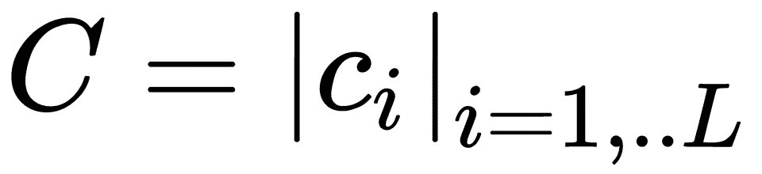

# 第六章：FastText 中的句子分类

本章将涵盖以下主题：

+   句子分类

+   fastText 监督学习：

    +   架构

    +   层次化软最大架构

    +   N-gram 特征与哈希技巧：

        +   **Fowler**-**Noll**-**Vo**（**FNV**）哈希

    +   词嵌入及其在句子分类中的应用

+   fastText 模型离散化：

    +   压缩：

        +   离散化

        +   向量离散化：

            +   寻找高维空间的代码书

        +   产品离散化

        +   额外步骤

# 句子分类

句子分类涉及理解自然语言中的文本，并确定其可能属于的类别。在文本分类问题集中，你将拥有一组文档 *d*，它属于语料库 *X*（包含所有文档）。你还将拥有一组有限的类别 *C* = *{c[1], c[2], ..., c[n]}*。类别也称为类别或标签。为了训练一个模型，你需要一个分类器，通常是一个经过充分测试的算法（虽然不一定，但在这里我们讨论的是一个在 fastText 中使用的经过充分测试的算法），你还需要一个包含文档和关联标签的语料库，用来标识每个文档属于哪个类别。

文本分类有许多实际应用，如下所示：

+   创建电子邮件垃圾邮件分类器

+   搜索引擎中的页面排名和索引

+   评论中的情感检测，可以了解客户是否对产品满意

文本分类通常是对人工分类的一种补充。标注文档在很大程度上是主观的，取决于语料库。举例来说，一个示例文档“我喜欢去夏威夷旅行”，可能会被图书馆员视为属于“旅行”类，但医生可能会认为它属于“无关”类。因此，想法是：一组文档将由领域专家进行标注，标注数据将用于训练文本分类器，然后该文本分类器可以用于预测新的输入文本，从而节省领域专家的时间和资源（也许领域专家可以定期检查并审核分类器对输入文本的表现）。此外，所提议的思路是针对一般人群的，并不适用于像 Stack Overflow 这类通过众包进行标注的方式；大多数商业问题没有这种*自动*标注的奢侈，因此你必须花费一些时间手动标注文档。

为了评估分类模型的表现，我们将训练语料库分为测试集和训练集。只有训练集用于模型训练。完成训练后，我们对测试集进行分类，将预测结果与实际结果进行比较，并衡量性能。正确分类文档的比例与实际文档的比例称为准确率。我们还可以查看另外两个参数，它们可以衡量模型的表现。一个是 *召回率*，它表示我们回忆出的所有正确标签的百分比，而不是实际存在的标签。我们还可以查看模型的 *精准度*，即我们查看所有预测标签，并判断其中哪些是最初的实际标签。

# fastText 有监督学习

fastText 分类器是建立在线性分类器之上的，特别是 BoW 分类器。在这一节中，你将了解 fastText 分类器的架构以及它是如何工作的。

# 架构

你可以认为每一段文本和每一个标签实际上都是空间中的一个向量，而这个向量的坐标是我们实际上试图调整和训练的目标，目的是使文本向量和其相关标签的向量在空间中非常接近：


文本的向量表示

在这个示例中，这是一个二维空间中的示例，你会看到类似于“Nigerian Tommy Thompson 也是摔跤界的一个新面孔”以及“James 在开场的第一节得到了 46 分中的 20 分”的文本，它们更接近“体育”标签而非“旅游”标签。

我们可以通过这样的方式来实现：我们将代表文本的向量和代表标签的向量输入评分函数。然后我们得到一个分数，并对所有文本向量与每个可能标签的向量表示之间的分数进行归一化。这样就可以得出给定文本与该标签的概率。分数是单独的值，我们使用之前章节中讨论过的 softmax 函数将它们转换为概率。

fastText 使用类似的向量空间模型进行文本分类，其中单词被压缩成称为嵌入的低维向量。其目的是训练并得到一个向量空间，使得句子向量和标签向量彼此非常接近。要将向量空间模型应用于句子或文档，首先需要选择一个适当的函数，这是一个将多个单词结合起来的数学过程。

组合函数分为两类：无序和句法。无序函数将输入文本视为**词袋模型**（**BoW**）嵌入，而句法表示则考虑单词顺序和句子结构。fastText 大多采用无序方法，因为它采用词袋方法，但也通过使用 n-gram 有少量的句法表示，正如我们稍后将看到的那样。

接下来，你可以做的是获取表示并在其上训练一个线性分类器。可以使用的优秀线性分类器有逻辑回归和**支持向量机**（**SVM**）。然而，线性分类器有一个小问题。它们在特征和类别之间不共享参数。因此，这可能会限制其对训练样本较少的类别的泛化能力。解决这个问题的方法是使用多层神经网络，或者将线性分类器分解为低秩矩阵，然后在其上运行一个神经网络。

句法表示比 BoW 方法更加稀疏，因此需要更多的训练时间。这使得它们在处理大数据集或计算资源有限时非常昂贵。例如，如果你构建一个递归神经网络来训练句法词表示，这会再次计算昂贵的张量积，并且每个句法分析树的节点中都会有非线性，那么你的训练时间可能会延长至数天，这对于快速反馈周期来说是无法接受的。

因此，你可以使用一个平均网络，它是一个无序模型，可以通过三个简单的步骤来解释：

1.  对与输入序列相关联的嵌入向量取平均。

1.  将平均值通过一个或多个前馈层。

1.  在最终层的表示上执行线性分类。

通过应用一种新的受 dropout 启发的正则化器，可以改进模型。在这种情况下，对于每个训练实例，在计算平均值之前，部分词嵌入将被随机丢弃。在 fastText 中，这是通过子采样频繁词汇来实现的，这在上一章也有讨论，并且同样用于分类器中。

该架构的一般形式如下：


在这种情况下，我们希望将输入的词元序列映射到 k 个标签。我们首先对词嵌入序列ν[ω]（其中ω ∈ X）应用组合函数 g。这个组合函数的输出是一个向量 z，作为逻辑回归函数的输入。分类架构与上一章讨论的 cbow 模型相似。

首先，取词嵌入的加权平均值：


将*z*输入到 softmax 层中会为每个输出标签产生估计的概率：


这里，softmax 函数如下所示：


这里，`W_s` 是一个 *k* x *d* 的矩阵，表示具有 *k* 个输出标签的数据集，*b* 是一个偏置项。fastText 使用一个通用的偏置项，形式是一个句子结束字符`<s>`，该字符会被添加到所有输入样本中。

这个模型可以通过最小化交叉熵误差来训练，对于具有真实标签 *y* 的单个训练实例，误差计算如下：


在 fastText 中，这被转换为计算预定义类别的概率分布。对于 *N* 个文档的集合，这将导致最小化类别上的负对数似然：


这里，*x[n]* 是第 *n* 个文档的标准化特征袋，*y[n]* 是标签，A 和 B 是权重矩阵。A 只是 fastText 中单词的查找表。

然后，我们可以使用随机梯度下降不断调整这些坐标，直到我们最大化每个文本正确标签的概率。fastText 通过使用随机梯度下降和线性衰减的学习率，在多个 CPU 上异步地训练这个模型。

fastText 中使用的架构如下：


fastText 的模型架构对于具有 N 元词特征 *x[1]*、*x[2]*、...、*x[N]* 的句子。特征会被嵌入并平均，形成隐藏变量。

现在让我们总结一下架构：

+   它从单词表示开始，单词表示被平均成文本表示，然后输入到线性分类器中。

+   该分类器本质上是一个具有秩约束和快速损失近似的线性模型。

+   文本表示是一个隐藏状态，可以在特征和类别之间共享。

+   使用 softmax 层来获得预定义类别的概率分布。

+   高计算复杂度 *O(kh)*，其中 *k* 是类别数，*h* 是文本表示的维度。

# 层次化 softmax 架构。

计算 softmax 是计算上非常昂贵的，并且对于大规模语料库来说是不可行的，因为这意味着我们不仅要为带有标签的文本找到分数，还要为所有标签的文本找到分数。因此，对于 *n* 个文本和 *m* 个标签，这种情况的最坏性能为 *O(n²)*，显然这不是一个好的选择。

此外，softmax 及其他类似的方法在计算概率时并没有考虑类别的语义组织结构。分类器应该知道，将狗分类为潜艇的惩罚应大于将狗分类为狼的惩罚。我们可能有的直觉是，目标标签可能并不是平面的，而是类似树状结构的。

所以现在我们有 *k* 个类别，我们希望每个输入都能被分类到其中一个类别。我们可以认为这些类别是树的叶节点。此树的结构是有意义的层次结构。进一步假设我们的分类器将输入映射到叶节点上的输出概率分布。希望这个叶节点能代表对应输入的正确类别。树中任何节点的概率就是从根节点到该节点路径的概率。如果该节点位于深度 *l + 1*，其父节点为 *n[1]*，*n[2]*，...，*n[l]*，则该节点的概率为：


如果一个叶节点位于从根节点到叶节点的路径上，则该叶节点属于该路径上的节点。我们将“胜利”或“赢得”的金额定义为沿从根节点到叶节点路径上对应正确类别节点的概率的加权和。在优化或训练过程中，我们希望最大化这种“赢得”，相反，最小化“损失”。在这种情况下，损失被认为是胜利的负值。

因此，在 fastText 中，使用的是层级分类器，它类似于你在前面章节中看到的层级 softmax。此方法将标签表示为二叉树中的节点，每个节点表示一个概率，因此标签通过从根节点到给定标签路径上的概率来表示。在这种方法中，正确的标签是使用**广度优先搜索**（**BFS**）算法生成的。BFS 搜索非常快速，因此可以将复杂度降低到 *log[2]n*。现在我们只需要计算到正确标签路径的概率。当标签数量很多时，这会显著提高所有标签的计算速度，从而加速模型训练。正如你在上一章节中看到的，层级概率表示趋近于 softmax 概率，因此这种近似方法实际上可以提供相同的模型性能，而且训练速度要快得多。

正如你在前一章节中看到的，在这种情况下，层级分类器的输出是标签。类似于训练词向量，在此情况下会形成一个 Huffman 树。由于我们已经在上一章讨论了 Huffman 树的内部结构，在此我们将稍微修改代码，尝试查看形成的确切树，并找到与之相关的概率。

为了简单起见，我们将使用一个非常小的数据集，标签数量也很少。在这个例子中，以下是一组带有标签的句子，已保存在名为 `labeledtextfile.txt` 的文件中：

```py
__label__sauce How much does potato starch affect a cheese sauce recipe?
 __label__food-safety Dangerous pathogens capable of growing in acidic environments
 __label__restaurant Michelin Three Star Restaurant; but if the chef is not there
 __label__baking how to seperate peanut oil from roasted peanuts at home?
 __label__baking Fan bake vs bake
 __label__sauce Regulation and balancing of readymade packed mayonnaise and other sauces
```

由于 fastText 是用 C++ 编写的，出于性能考虑，它并不直接操作和处理标签字符串。要获取标签的 Huffman 码，你可以将 `model.cc` 文件中第 `81` 行的 `hierarchicalSoftmax` 函数修改为以下内容：

```py
real Model::hierarchicalSoftmax(int32_t target, real lr) {
  real loss = 0.0;
  grad_.zero();
  const std::vector<bool>& binaryCode = codes[target];

  std::cout << "\ntarget: " << target << ", vector: ";
  for (std::vector<bool>::const_iterator i = binaryCode.begin(); i != binaryCode.end(); ++i)
      std::cout << *i << ' ';
  std::cout << '\n';

  const std::vector<int32_t>& pathToRoot = paths[target];

  if (target == 0)
  {
      std::cout << "will check the path to root for bakings: " << ' ';
      for (int32_t i = 0; i < pathToRoot.size(); i++) {
          std::cout << pathToRoot[i] << '_' << "target_" << target << "_Individual loss_" << binaryLogistic(pathToRoot[i], binaryCode[i], lr) << ' ';
      }
      std::cout << '\n';
  }

  if (target == 1)
  {
      std::cout << "will check the path to root for sauce: " << '\n';
      for (int32_t i = 0; i < pathToRoot.size(); i++) {
          std::cout << pathToRoot[i] << '_' << "target_" << target << "_Individual loss_" << binaryLogistic(pathToRoot[i], binaryCode[i], lr) << ' ';
      }
      std::cout << '\n';
  }

  if (target == 2)
  {
      std::cout << "will check the path to root for sauce: " << '\n';
      for (int32_t i = 0; i < pathToRoot.size(); i++) {
          std::cout << pathToRoot[i] << '_' << "target_" << target << "_Individual loss_" << binaryLogistic(pathToRoot[i], binaryCode[i], lr) << ' ';
      }
      std::cout << '\n';
  }

  if (target == 3)
  {
      std::cout << "will check the path to root for restaurant: " << '\n';
      for (int32_t i = 0; i < pathToRoot.size(); i++) {
          std::cout << pathToRoot[i] << '_' << "target_" << target << "_Individual loss_" << binaryLogistic(pathToRoot[i], binaryCode[i], lr) << ' ';
      }
      std::cout << '\n';
  }

  for (int32_t i = 0; i < pathToRoot.size(); i++) {
    loss += binaryLogistic(pathToRoot[i], binaryCode[i], lr);
  }

  // std::cout << "total loss for target: " << target << " is: " << loss;
  // std::cout << '\n';

  return loss;
}
```

如你所见，我正在列举多个标签。但是你可以选择你想要的标签。你将得到类似于这样的输出。你需要获取目标值的最后出现以获得向量：

```py
target: 2, vector: 1 0 1
 will check the path to root for sauce:
 0_target_2_Individual loss_0.693147 1_target_2_Individual loss_0.681497 2_target_2_Individual loss_0.693147
```

所以，对应于目标 2 的相似向量是 101。

# n-gram 特征和哈希技巧

正如你所见，词汇的词袋（Bag of Words，BoW）用于生成后续分类过程中使用的单词表示。但是词袋是无序的，并且没有任何语法信息。因此，n-gram 词袋被用作额外的特征，以捕捉部分语法信息。

正如我们已经讨论过的那样，大规模的自然语言处理问题几乎总是涉及使用大型语料库。这个语料库总是具有*无限*数量的唯一单词，正如我们从 Zipf 定律中所看到的那样。单词通常被定义为由分隔符分隔的字符串，例如英语中的空格。因此，采用单词 n-gram 对于大型语料库来说是*不可扩展的*，这对于准确分类至关重要。

因为这两个因素，天真地形成的矩阵总是稀疏且高维的。你可以尝试使用 PCA 等技术来减少矩阵的维数，但这仍然需要进行矩阵操作，需要如此大量的内存，以至于使整个计算变得不可行。

如果你能做些什么以避免创建字典？类似的问题可以通过所谓的核技巧来解决。核技巧使我们能够在非线性数据上使用线性分类器。在这种方法中，输入数据被转换为高维特征空间。有趣的是，你只需要为这一步指定核函数，而不需要将所有数据转换为特征空间，它就会起作用。换句话说，当你计算距离并应用核函数时，你会得到一个数字。这个数字与如果你将初始点扩展到你的核心指向的更高阶空间并计算它们的内积，你会得到相同的数字：


来源：https://towardsdatascience.com/understanding-the-kernel-trick-e0bc6112ef78

在高维空间中获得内积比在实际点中获得更容易。

文本分类的挑战是互补的。原始输入空间通常是线性可分的（因为通常是人类根据标记选择特征），但训练集的大小和高维度非常大。针对这种常见情况，核技巧的一种互补变体被使用。这种方法被称为哈希技巧。在这里，高维向量在*ℜ^d*空间中被映射到一个低维特征空间*ℜ^m*，使得*m << d*。我们将在*ℜ^m*空间中训练分类器。

哈希技巧的核心思想就是哈希函数。因此，在文本分类和类似的 NLP 任务中，我们会使用一种非加密的哈希，如 murmur 或 FNV（后面一章会详细介绍），并将工作映射到一个有限的整数（通常是 32 位或 64 位整数，通常是一个质数的模数）。

以下是定义哈希函数的一些特征：

+   最重要的一点是——如果你将相同的输入传递给哈希函数，它始终会返回相同的输出。

+   哈希函数的选择决定了输出可能的范围。这个范围通常是固定的。例如，现代网站使用 SHA256 哈希，它们会被截断为 128 位。

+   哈希函数是单向的。给定一个哈希值，输入是无法计算出来的。

由于哈希函数具有固定范围，使用哈希函数的一个好处是固定的内存需求。另一个优势是它同样在**词汇表外**（**OOV**）方面有所帮助。这一点可能不太明显，让我解释一下。首先，我们不需要处理词汇表。当我们使用词袋表示法（BoW）时，我们将使用一个大的列向量（在我们的例子中是 200 万维），为每个训练样本分配许多元素：

```py
FastText is an open-source, free, lightweight library that allows users to learn text representations and text classifiers
-> [0 0 0 0 ... 0 0 0 0] (2000000 elements)
```

现在我们将选择一个哈希函数*f*，它接受字符串作为输入并输出值。换句话说，我们确保我们的哈希函数不会访问超出特征维度的索引。

与维持一个庞大的词汇表的*朴素*的词袋（BoW）方法相比，哈希函数在处理 OOV（Out-Of-Vocabulary，词汇表外）单词时具有优势。由于向量表示是通过哈希函数创建的，任何字符串，即使是 OOV 单词，也会在哈希空间中有一个对应的向量。确实，新词会降低我们分类器的准确性，但它依然能正常工作。预测时不需要丢弃这些新词。

之所以这样有效的原因来自我们不断提到的 Zipf 定律。可能发生的哈希碰撞（如果有的话），很可能发生在不常见的单词之间，或者是常见单词与不常见单词之间。这是因为常见单词按照定义会更早出现，因此倾向于首先占据位置。因此，碰撞的特征用于分类时，要么不太可能被选为特征选择的对象，要么代表着引导分类器选择它的那个词。

既然我们已经阐明了哈希技巧的好处，现在我们需要集中讨论哈希函数。有许多哈希函数可用于实现哈希技巧，例如，Vowpal Wabbit 和 scikit-learn 的 murmurhash v3。可以在以下维基链接中找到一个很好的非加密哈希函数列表：[`en.wikipedia.org/wiki/List_of_hash_functions#Non-cryptographic_hash_functions`](https://en.wikipedia.org/wiki/List_of_hash_functions#Non-cryptographic_hash_functions)。FastText 使用 FNV-1a 哈希，下面将进行详细讨论。

# FNV 哈希

fastText 使用 FNV-1a 哈希算法，它是 FNV 哈希的衍生算法。实现该算法时，首先从初始哈希值`FNV_offset_basis`开始。对于输入中的每个字节，将哈希值与该字节进行 XOR 运算。然后，将结果与 FNV 质数相乘。伪代码如下：

```py
hash = FNV_offset_basis
   for each byte_of_data to be hashed
        hash = hash XOR byte_of_data
        hash = hash × FNV_prime
   return hash
```

来源：维基百科，[`en.wikipedia.org/wiki/Fowler%E2%80%93Noll%E2%80%93Vo_hash_function`](https://en.wikipedia.org/wiki/Fowler%E2%80%93Noll%E2%80%93Vo_hash_function)

在 fastText 中，这在`dictionary.cc`哈希函数中实现（[`github.com/facebookresearch/fastText/blob/master/src/dictionary.cc#L143`](https://github.com/facebookresearch/fastText/blob/master/src/dictionary.cc#L143)）：

```py
uint32_t Dictionary::hash(const std::string& str) const {
  uint32_t h = 2166136261;
  for (size_t i = 0; i < str.size(); i++) {
```

```py

    h = h ^ uint32_t(str[i]);
    h = h * 16777619;
  }
  return h;
}
```

如你所见，考虑的偏移量基础值是`2166136261`，对应的质数是`16777619`。

FNV 并非加密哈希，但它具有很高的分散性质量，并且其哈希结果的大小可变，从 32 位到 1024 位之间的任何 2 的幂。生成它的公式是有史以来最简单的哈希函数之一，且能实现良好的分散性。它还具有较好的碰撞和偏差抵抗能力。FNV 的一个最佳特性是，尽管它不被视为加密哈希，但对超过 64 位的位数进行反向工程几乎是不可解决的。由于需要将计算开销保持在最小，fastText 使用 32 位，这具有 FNV 偏移量基础值为 2166136261。

查看仓库中`chapter4`文件夹下的`fnv1a.py`文件中的 Python 实现。

在 fastText 中，单词级和字符级的 n-gram 被哈希到一个固定数量的桶中。这可以防止在训练模型时占用过多的内存。你可以通过`-buckets`参数来更改桶的数量。默认情况下，桶的数量固定为 2M（200 万）。

# 词嵌入及其在句子分类中的应用

正如你在上一章中看到的，词嵌入是将单词表示为**ℜ^d**形状的向量的数值表示。它们是无监督学习的词表示向量，其中应存在语义相似性的关联。我们还在第七章中讨论了什么是分布式表示和分布式表示，*部署模型到 Web 和移动端*。

在进行句子分类时，有一个假设是可以利用现有的、接近最新技术的监督式 NLP 系统，并通过使用词嵌入来改进它。你可以使用第二章中展示的 fastText 的 cbow/skipgram 方法来创建你自己的无监督词嵌入，*使用 FastText 命令行创建模型*，或者你可以从`fasttext.cc`网站下载现成的词嵌入。

一个可能会出现的问题是，某些词向量表示是否对某些任务更有效。当前对一些特定领域的研究表明，在某些任务中效果较好的词向量表示在其他任务中可能表现不佳。一个常见的例子是，适用于命名实体识别任务的词向量表示，在搜索查询分类等问题领域中可能无法发挥良好效果，反之亦然。

# fastText 模型量化

由于 Facebook AI 研究团队的努力，现在有了一种方法，可以得到极小的模型（就硬盘占用空间而言），正如你在第二章的*M**odel 量化*部分中看到的那样，*使用 FastText 命令行创建模型*。占用数百 MB 的模型可以被量化到仅为几 MB。例如，你可以查看 Facebook 发布的 DBpedia 模型，网址是[`fasttext.cc/docs/en/supervised-models.html`](https://fasttext.cc/docs/en/supervised-models.html)，你会注意到，常规模型（这是 BIN 文件）的大小为 427MB，而较小的模型（FTZ 文件）仅为 1.7MB。

这种体积的减小是通过舍弃一些在 BIN 文件（或更大模型）中编码的信息来实现的。这里需要解决的问题是如何保留重要信息，并识别不那么重要的信息，从而确保模型的整体准确性和性能不会受到显著影响。在本节中，我们将探讨一些相关的考虑因素。

# 压缩技术

由于我们对如何压缩大型 fastText 模型文件感兴趣，让我们来看看一些可以使用的压缩技术。

不同的压缩技术可以分为以下几类：

+   **无损压缩**：顾名思义，无损压缩技术是指那些在压缩然后解压后能恢复相同信息结构的技术，信息没有丢失。此类压缩主要使用统计建模方法。你已经遇到过一种用于这种压缩类型的算法，即霍夫曼编码。

+   **有损压缩**：有损压缩是尽可能丢弃数据而不丢失数据的利益或有用性的过程。这是一种好的技术，适用于我们不关心重新创建原始数据，而更关注原始数据所代表的意义的情况。正如你可以正确推测的那样，通常使用有损压缩时，你将能够获得更高程度的压缩。

FastText 采用了一种称为产品量化的有损压缩方法。在接下来的部分中，我们将尝试理解什么是量化，然后如何从中得出向量量化的概念，以及它如何实现压缩。接着，我们将看看产品量化是如何成为向量量化在这一任务中的更好变体。

# 量化

量化的概念来自**数字信号处理**（**DSP**）领域。在 DSP 中，当将模拟信号（例如声音波）转换为数字信号时，信号会根据位深度被分解为一系列单独的样本，位深度决定了量化信号将具有的级别数。在 8 比特量化的情况下，你将拥有 2⁸=256 种可能的振幅信号组合，类似地，在 16 比特量化的情况下，你将拥有 2¹⁶=65536 种可能的组合。

在下面的例子中，一个正弦波被量化为 3 比特级别，因此它将支持 8 个值来表示连续的正弦波。你可以查看以下代码，获取`product quantization.ipynb`笔记本中的图像：


# 向量量化

向量量化是一种将量化思想应用于向量空间的技术。假设你有一个向量空间*ℜ[k]*，并且一个包含*N*个*k*维向量的训练集，目标向量空间为*ℜ[k]*。向量量化的过程是将你的向量映射到一个有限的向量集合 Y，这些向量属于目标向量空间。每个向量*y[i]*被称为**代码向量**或**代码字**，所有**代码字**的集合称为**代码本**：


实现的压缩量取决于代码本的大小。如果我们有一个大小为*k*的代码本，而输入向量的维度是*L*，我们需要指定  比特来确定从代码本中选择了哪些代码字。因此，对于一个具有大小*k*的代码本的 L 维向量量化器，其速率是 。

让我们更详细地了解这一过程。如果你有一个*L*维的向量，其中*L=8*，它表示如下：


现在有 8 个数字，因此你需要 3 个比特来将其存储在内存中，前提是你选择使用二进制编码。将数组转换为二进制，你将得到以下向量：


因此，如果你想将每个数字存储为 3 位，那么你需要 24 位来存储之前的数组。如果你想将每个数字的内存消耗减少 1 位呢？如果你能够实现这一点，你就可以只用 16 位来存储之前的数组，从而节省 8 位，达到压缩的效果。为此，你可以考虑将 0、2、4、6 作为你的代码书，这些将映射到向量 00、01、10、11：


在转换过程中，所有介于 0 和 2 之间的数字都会映射到 00，所有从 2 到 4 的数字映射到 01，以此类推。因此，你的原始向量将被更改为以下内容：


该向量在内存中占用的空间只有 8 位。

请注意，我们还可以将目标设置为将表示编码为 1 位。在这种情况下，数组只会使用 2 位的总内存。但我们会丧失更多关于原始分布的信息。因此，推广这个理解，减小代码书的大小会增加压缩比，但原始数据的失真也会增加。

# 为高维空间找到代码书

设计向量量化器的主要目标是找到一个代码书，指定解码器，以及指定编码器的规则，使得向量空间的整体性能最优。

一类重要的量化器是 Voronoi 或最近邻量化器。给定一组大小为 N 的 L 个代码向量 ，以及一个距离度量 ，R^k 空间被划分为 L 个不相交的区域，称为 Voronoi 区域，每个代码向量与每个区域相关联。与代码向量 *v[j]* 相关的特定 Voronoi 区域 Ω[j] 包含所有在 *R^k* 空间中比任何其他代码向量更接近 *v[j]* 的点，并且是 *v[j]* 的最近邻域。以下是一个给定空间的 Voronoi 图示例，相关的代码向量用点表示：


获取上述图表的代码也可以在该仓库的 Jupyter notebook 中找到：[`github.com/PacktPublishing/Learn-fastText/blob/master/chapter4/product%20quantization.ipynb`](https://github.com/PacktPublishing/Learn-fastText/blob/master/chapter4/product%20quantization.ipynb)。

因此，本质上，你可以看到这个过程分为两步：

1.  **构建 Voronoi 空间**：构建 Voronoi 空间的预处理阶段，将其表示为图数据结构，并将每个面（例如，顶点、边和区域）与最接近的代码向量集合关联。

1.  **寻找代码向量**：给定 Voronoi 划分，确定包含查询向量的划分面，关联的代码向量即为所需的最近邻。

# 产品量化

到目前为止，你可能已经理解了在矢量量化中，如何根据与聚类中心的距离将搜索空间划分为多个区域。如果查询向量被量化到某个区域，那么该区域内的所有其他向量都是潜在的好候选。

不幸的是，如果查询位于边缘位置，那么还必须考虑所有相邻的区域。这看起来可能没什么大不了，直到你意识到，每个 Voronoi 单元格的相邻邻居数会随着空间维度 *N* 的增加而呈指数增长。请注意，在创建 fastText 向量时，我们通常处理的是高维数据，如 100 维、300 维等。

fastText 中的默认向量是 100 维的向量。一个处理 50 位编码的量化器意味着我们每个分量只有 0.5 位，它包含！[](img/00076.jpeg)个质心（大约 150 TB）。产品量化是一种高效的解决方案来解决这个问题。输入向量 *x[i]* 被分成 m 个不同的子向量 j ，每个子向量的维度为 *D** = *D/m*，其中*D*是*m*的倍数。这些子向量被使用 m 个不同的量化器分别进行量化。给定向量ν因此按以下方式映射：

_

在这里，*q[j]*是与第*j*个子向量相关的低复杂度量化器。通过子量化器*q[j]*，我们关联索引*Ι[j]*、码本*C[j]*和相应的重构值*c[j,i]*。

**产品量化器**（**PQ**）的重构值通过产品索引集中的一个元素来识别！[](img/00079.jpeg)。因此，码本被定义为笛卡尔积：


该集合的质心是 m 个子量化器的质心的连接。从现在开始，我们假设所有子量化器都有相同的有限个重构值 *k**。在这种情况下，总质心数由以下公式给出：


在 fastText 中，涉及产品量化的两个参数，即子量化器的数量 m 和每个量化索引的位数 b，通常设置为！[](img/00082.jpeg)，且*b*=8。

因此，PQ 可以以非常低的内存/时间成本生成一个指数级大的码本。PQ 的本质是将高维向量空间分解为子空间的笛卡尔积，然后分别对这些子空间进行量化。最佳的空间分解对于良好的产品量化实现至关重要，根据目前的知识，这通常是通过最小化与空间分解和量化码本相关的量化失真来完成的。解决此优化问题有两种已知方法。其中一种是使用迭代量化。一个简单的迭代找到码向量的例子在笔记本中有展示，可以认为它是一个特定的子量化器。如果你有兴趣，可以查看 Kaiming He 等人的《优化产品量化》。

另一种方法，也是 fastText 采用的方法，是对输入向量假设高斯分布，并通过期望最大化来寻找 k-means。请查看此 k-means 函数中的算法：[src/productquantizer.cc#L115.](https://github.com/facebookresearch/fastText/blob/d647be03243d2b83d0b4659a9dbfb01e1d1e1bf7/src/productquantizer.cc#L115)

在对输入矩阵进行量化后，在输出矩阵上进行再训练，同时保持输入矩阵不变。这样做是为了让网络重新调整以适应量化。

# 附加步骤

以下是可以采取的附加步骤：

+   **特征选择与剪枝**：剪枝会对那些对分类器决策影响较小的特征进行处理。在分类步骤中，只选择有限数量的*K*词汇和 n-gram。因此，对于每个文档，首先验证它是否被再训练的特征所覆盖，如果没有，则将具有最高范数的特征添加到再训练特征的集合中。

+   **哈希化**：词汇和 n-gram 也会进行哈希处理，以进一步节省内存。

如果你决定将这些在模型压缩方法中讨论的技术应用于自己的模型，可以调整其中的各种思路，看看在你的具体领域中是否能获得更好的性能。

+   你可以探索是否有其他距离度量适合用于找到 k-means。

+   你可以根据邻域、熵等因素来改变剪枝策略。

# 总结

本章内容，你已经深入了解了 fastText 模型设计和实现背后的理论，模型的优势，以及在将其应用到你的机器学习管道时需要考虑的事项。

本书的下一部分将讲解实现与部署，我们将在下一章开始介绍如何在 Python 环境中使用 fastText。
