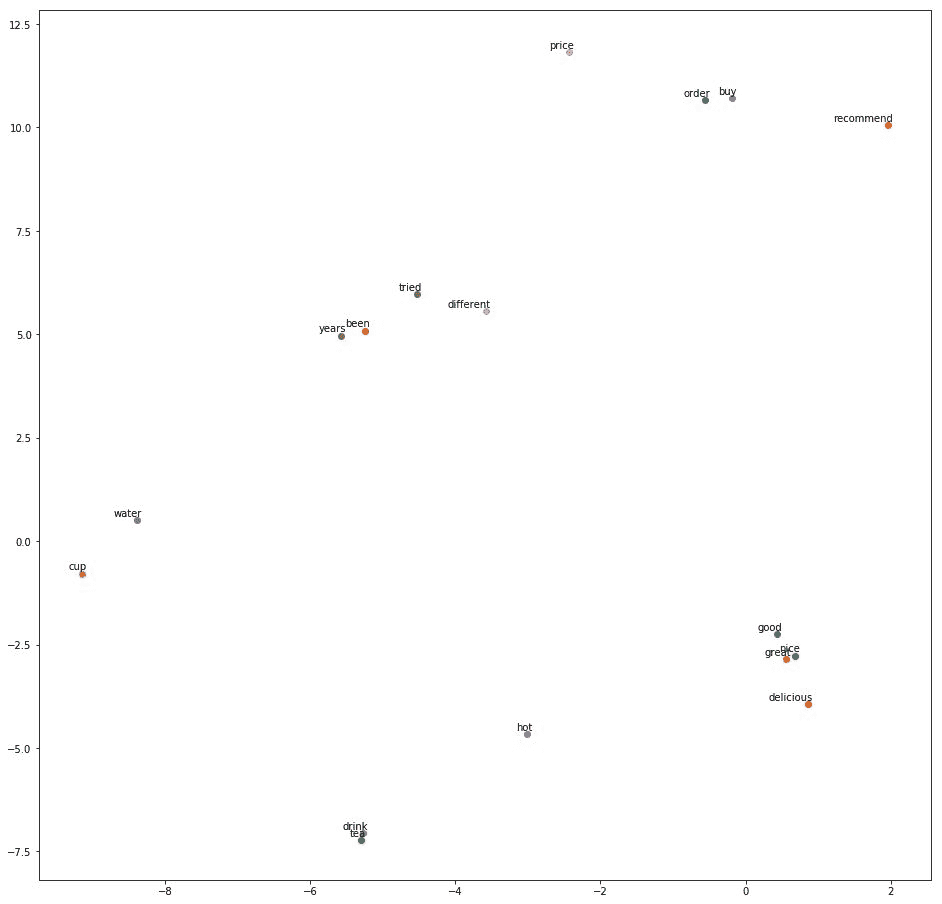
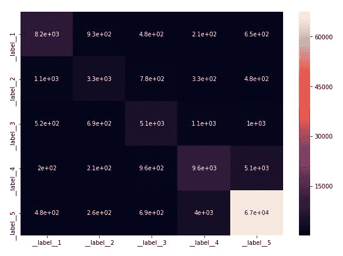
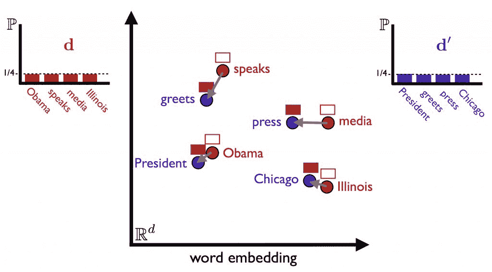
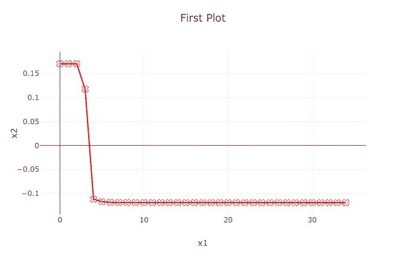
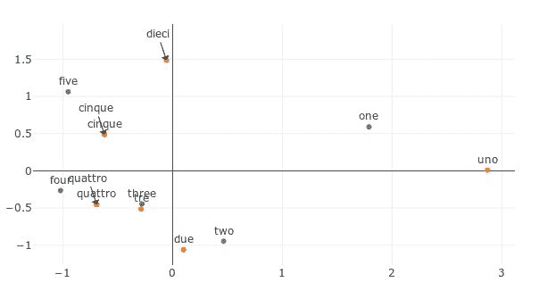

# 第八章：Python 中的 FastText

fastText 的使用专门是为了将单词和句子转换为高效的向量表示。尽管 fastText 是用 C++编写的，但有社区编写的 Python 绑定可以训练和使用这些模型。同时，Python 是自然语言处理（NLP）中最流行的语言之一，因此有许多其他流行的 Python 库支持 fastText 模型及其训练。Gensim 和 Spacy 是两个受欢迎的库，它们使得加载这些向量、转换、词形还原以及高效地执行其他 NLP 任务变得简单。本章将重点介绍如何使用 Python 与 fastText 及其流行库配合使用，同时展示这两个库在处理 fastText 模型时可以完成的一些常见任务。

本章将涵盖以下主题：

+   FastText 官方绑定

+   PyBind

+   预处理数据

+   无监督学习

+   监督学习

+   Gensim

+   训练 fastText 模型

+   使用 Gensim 进行机器翻译

# FastText 官方绑定

安装 Python 官方绑定的步骤在第一章中已经介绍。本节将介绍如何使用官方的 fastText Python 包来训练、加载和使用模型。

使用 Python fastText 库，你将能够实现所有通过命令行可以完成的必要功能。让我们看看如何通过 Python fastText 实现无监督学习和监督学习。

注意：在本章中，我们将使用 Python3，因此代码示例将基于此。如果你使用的是 Python2，请查阅*附录*，其中包含使用 Python2 时需要注意的事项。

# PyBind

Python 绑定是通过优秀的 PyBind 库创建的。PyBind 是一个轻量级的库，旨在将 C++类型暴露给 Python，反之亦然，因此它是创建 fastText 的 Python 绑定的绝佳选择。它支持几乎所有流行的 C++编译器，如 Clang、GCC、Visual Studio 等。此外，PyBind 的创建者声称生成的二进制文件更小。

Python-fastText 库使用 fastText 的 C++ API。

# 数据预处理

尽管 fastText 在原始文本上的性能相当不错，但在运行无监督算法或分类器之前，建议对数据进行预处理。需要记住的一些要点如下：

+   要训练 fastText，编码需要使用 UTF-8 编码。如果是 Python3 中的字符串，PyBind 可以非常好地将几乎所有文本转换为 UTF-8。如果你使用的是 Python2，则需要注意一个额外的技术细节：你必须将使用的所有字符串都编码为 UTF-8。

+   实现一些基本的字符串处理和规范化操作将使模型表现得更好。

以下是一个简单的函数，可用于规范化你的文档。这个函数在 Python fastText 笔记本中使用：

```py
def normalize(s):
    """
    Given a text, cleans and normalizes it. Feel free to add your own stuff.
    """
    s = s.lower()
    # Replace ips
    s = re.sub(r'\d{1,3}\.\d{1,3}\.\d{1,3}\.\d{1,3}', ' _ip_ ', s)
    # Isolate punctuation
    s = re.sub(r'([\'\"\.\(\)\!\?\-\\\/\,])', r' \1 ', s)
    # Remove some special characters
    s = re.sub(r'([\;\:\|•«\n])', ' ', s)
    # Replace numbers and symbols with language
    s = s.replace('&', ' and ')
    s = s.replace('@', ' at ')
    s = s.replace('0', ' zero ')
    s = s.replace('1', ' one ')
    s = s.replace('2', ' two ')
    s = s.replace('3', ' three ')
    s = s.replace('4', ' four ')
    s = s.replace('5', ' five ')
    s = s.replace('6', ' six ')
    s = s.replace('7', ' seven ')
    s = s.replace('8', ' eight ')
    s = s.replace('9', ' nine ')
    return s
```

如果你正在使用 pandas 从数据集中提取文本并清理它，你还可以将数据集中缺失的文本值替换为 `_empty_` 标签：

```py
train = pd.read_csv('train.csv')
test = pd.read_csv('test.csv')
train['Text'] = train['Text'].fillna('_empty_')
test['Text'] = test['Text'].fillna('_empty_')
```

# 无监督学习

fastText 命令行实现了两种算法：`cbow` 和 `skip-gram`。使用 Python 库，你应该能够在这两种算法中训练模型。

# 在 fastText 中进行训练

在 fastText 中进行训练是通过 `train_unsupervised` 函数完成的。你可以从 `model` 参数中选择使用哪种算法。

然后，你可以使用以下 Python 代码训练一个 `skipgram` 模型：

```py
sg_model = fastText.train_unsupervised(input='data.txt', model='skipgram')
```

这与命令行类似：

```py
./fasttext skipgram -input data.train -output model
```

同样，要训练一个 `cbow` 模型，你可以使用以下 Python 代码：

```py
cbow_model = fastText.train_unsupervised(input='data.txt', model='cbow')
```

命令行中的等效语句是：

```py
./fasttext cbow -input data.train -output model
```

Python 代码与命令行的区别在于，命令行会将模型保存在文件中，而在 Python 代码中，模型会存在内存中，通过变量引用。如果要保存模型，你需要在 Python 应用中显式地传递命令，例如：

```py
sg_model.save_model("sg_model.bin")
```

你应该能够传入所有其他训练参数。这些参数以及默认值在这里列出：

```py
sg_model = fastText.train_unsupervised(input, model='skipgram', lr=0.05, dim=100, ws=5, epoch=5, minCount=5, minCountLabel=0, minn=3, maxn=6, neg=5, wordNgrams=1, loss="ns", bucket=2000000, thread=12, lrUpdateRate=100, t=1e-4, label="__label__", verbose=2, pretrainedVectors="")
```

这些参数的意义与在探索命令行时看到的相同。

# 评估模型

在无监督学习的情况下，由于缺乏标签，评估变得有些棘手，因为没有可以用来有意义地比较模型结果的标准。在词嵌入的情况下，我们遇到了相同的问题，但由于这是一个相对狭窄的领域，我们可以做出一些主观的判断。fastText 命令行提供了最近邻和查找词语相似度的选项，我们可以在 Python 库中复现这一过程，稍后会看到。

其他技术包括使用基于问题的单词句法和语义表现——例如 Google 发布的 `words.txt`，以及使用斯坦福稀有词数据库来衡量稀有词的形态学相似性。如果你正在为某个特定领域创建词表示，请记住，这些特定的模型评估技术可能不会产生良好的结果，但这些技术应该是适用的。

# 词向量

默认情况下，创建的词向量是 100 维的。它们以 NumPy 数组的形式保存在内存中。所以，你应该能够使用 `get_word_vector` 方法查看词向量：

```py
>>> model.get_word_vector('targetword')
array([ 0.09973086,  ...  0.14613365], dtype=float32)
```

# 最近邻查询

通常，k 最近邻用于区分模型之间的差异。目标词的向量表示被取出，找到这些向量的邻居，然后查看邻居是否更接近它的含义。由于 fastText 的表示是分布式的，这一假设应该成立。

fastText 命令行提供了一个工具，可以轻松获取最近邻词，但在 Python 中没有简单的方法可以找到它们。`util`中有一个 `find_nearest_neighbor` 函数，但它需要向量作为输入。因此，我们需要编写一些代码，创建一个函数，该函数接受单词和目标模型作为输入，并根据模型返回最近邻词。你可以查看 `python fastText unsupervised learning.ipynb` 文件中的代码来获取最近邻词：

```py
>>> nn(sg_model, ['dog', 'pizza', 'hungry'], k=5)
words similar to dog:
dogs
pup
treats
puppy
dogie
#########################################
words similar to pizza:
pizza;
pizza"
pizzas
"pizza
bread
#########################################
words similar to hungry:
hungry";
hungrygirl
>hungry
hungry-girl
hungries
#########################################
```

输出结果可以通过对数据进行一些预归一化处理来进行优化。

# 单词相似性

有多种方法可以找到单词之间的相似性。以 fastText 为例，其中一种找到单词相似性的方法是计算单词在向量空间中的余弦距离。然而，这种方法可能无法找到同义词和反义词之间的相似性，也无法捕捉其他细微的语言构造，而仅仅是基于单词在上下文中的使用给出一个相似度分数。单词“water”和“cup”之间不一定有相似之处，但在特定上下文中，它们通常是一起出现的，因此你可能会发现它们之间的相似度分数较高。

在 Python 库中，你可以编写一个小函数来计算余弦相似度：

```py
def similarity(v1, v2):
    n1 = np.linalg.norm(v1)
    n2 = np.linalg.norm(v2)
    return np.dot(v1, v2) / n1 / n2

v1 = sg_model.get_word_vector('drink')
v2 = sg_model.get_word_vector('drinks')
print(similarity(v1, v2))
```

本质上，你是通过 `get_word_vector` 方法获取两个目标单词的词向量，然后计算它们之间的余弦相似度。

# 模型性能

你可以使用斯坦福 NLP 发布的稀有词数据集来评估模型的性能。通过 `examples` 文件夹中共享的 `compute_similarity` 函数，我们可以稍微修改该函数，使其能够在 Python 应用中工作。函数的实现可以在无监督学习笔记本中看到。下载稀有词数据集，你可以在参考文献中找到下载链接，解压后，将文本文件作为第一个参数，模型作为第二个参数传入。你应该能够看到模型如何评估这些稀有单词：

```py
>>> dataset, corr, oov = compute_similarity('data/rw/rw.txt', sg_model)
>>> print("{0:20s}: {1:2.0f}  (OOV: {2:2.0f}%)".format(dataset, corr, 0))
rw.txt              : 32  (OOV:  0%)
```

# 模型可视化

可视化词向量在空间中的分布是一种有效理解模型分布特性的方式。由于词向量的维度非常高，因此你需要一个好的降维技术，以便将向量显示在二维框架中。

t-SNE 是一种流行的降维技术，特别适用于高维数据集的可视化。其思路是尽可能地将相似的单词靠近，同时最大化不相似单词之间的距离。无监督学习笔记本中展示了 t-SNE 模型的代码。在我们的例子中，我们选取了一些单词并将它们绘制在图中：



绘制在图中的单词

如你所见，“water”和“cup”是一起的，因为它们通常在相同的上下文中使用。另两个在一起的词向量是“drink”和“tea”。使用 t-SNE 来理解你的模型可以让你更好地了解模型的效果。

# 有监督学习

与无监督学习类似，fastText 库也提供了内部 API 来运行有监督学习。因此，运行 fastText 有监督的 Python API 也会创建相同的模型，可以使用命令行应用进行训练。其优势在于，你能够利用所有 Python 数据科学工具来构建 NLP 分类器。

为了展示如何利用 fastText 分类器在 Python 中进行训练，你可以查看代码中的`python fastText supervised learning.ipynb`笔记本。数据集包含来自亚马逊的精美食品评论，并可以从 Kaggle 网站下载，笔记本中提供了下载链接。

# 数据预处理和归一化

数据预处理和归一化步骤与无监督学习中的类似。不同之处在于，你需要在标签前添加`__label__`前缀，或选择你喜欢的标签前缀。同时，它必须以类似于 fastText 命令行的格式保存在 fastText 文件中。由于这是一个分类器，你需要实际创建两个文件，一个用于训练，另一个用于模型验证。将数据集分为训练集和测试集的常见方法是使用 scikit-learn 中的`train_test_split`函数。

# 训练模型

要训练模型，你需要在训练文件上使用`train_supervised`方法：

```py
>>> su_model = fastText.train_supervised(input=train_file, epoch=25, lr=1.0, wordNgrams=2, verbose=2, minCount=1)
```

这与命令行中的操作类似：

```py
$ ./fasttext supervised -input train_file -output su_model
```

超参数与有监督学习中的相同。与无监督学习的区别在于，默认的损失函数是`softmax`而不是`ns`，并且还有一个额外的`label`参数：

```py
>>> su_model = fastText.train_supervised(input=train_file, lr=0.1, dim=100, ws=5, epoch=5, minCount=1, minCountLabel=0, minn=0, maxn=0, neg=5, wordNgrams=1, loss="softmax", bucket=2000000, thread=12,  lrUpdateRate=100, t=1e-4, label="__label__", verbose=2, pretrainedVectors="")
```

类似于无监督学习的情况，Python 代码不会将模型保存到文件中，而是将其保存到你定义的变量中，这里是`su_model`。这个变量`su_model`是一个 Python NumPy 矩阵，因此我们可以按照标准方式操作它。

要保存模型，你需要调用`save_model`方法：

```py
>>> su_model.save_model("su_model.bin")
```

# 预测

你可以使用`get_word_vector`方法获取单词的词向量，使用`get_sentence_vector`方法获取文档的句子向量，并使用`predict`方法获取模型的预测标签：

```py
>>> su_model.get_word_vector('restaurant')
array([ 0.9739366 , ..., -0.17078586], dtype=float32)
>>> su_model.get_sentence_vector('I love this restaurant')
array([ 0.31301185,  ... , -0.21543942], dtype=float32)
>>> su_model.predict('I love this restaurant')
(('__label__5',), array([1.00001001]))
```

你也可以对测试文档进行预测概率计算：

```py
>>> su_model.predict("I love this restaurant", k=3)
```

```py
(('__label__5', '__label__2', '__label__3'),
 array([1.00001001e+00, 1.00000034e-05, 1.00000034e-05]))
```

这与命令行中的操作类似：

```py
$ echo "I love this restaurant" | ./fasttext predict-prob su_model.bin - 3
__label__5 1.00001 __label__2 1e-05 __label__3 1e-05
```

# 测试模型

获取模型的精度和召回率类似于命令行中看到的操作。与命令行类似，你需要传递测试文件和你需要计算精度和召回率的标签数量。

在下面的示例中，`test_file`包含测试文件的路径，第二个参数是标签的数量：

```py
>>> n, p, r = su_model.test(test_file, 5)
>>> print("N\t" + str(n))
>>> print("P@{}\t{:.3f}".format(5, p))
>>> print("R@{}\t{:.3f}".format(5, r))
N 113691
P@5 0.200
R@5 1.000
```

# 混淆矩阵

混淆矩阵是一种很好的方式来可视化监督模型的性能，特别是分类器。当你在创建混淆矩阵时，实际上是在描述模型分类器在测试集上的表现，而测试集的真实标签是已知的。混淆矩阵在多类分类器中尤其有效，它帮助你了解哪些类别表现更好。由于 fastText 支持分类器，你可以使用它来创建混淆矩阵。

如何获取混淆矩阵，已在监督学习的笔记本中展示。`fasttext_confusion_matrix`函数接收一个模型变量、pandas 测试数据、标签列名和文本列名：



预测的标签与真实值进行对比。

# Gensim

Gensim 是一个流行的开源库，用于处理由 Radim Řehůřek 创建的原始、非结构化的人工生成文本。Gensim 的一些特点包括：

+   内存独立性是 Gensim 的核心价值主张之一，即它应该具有可扩展性，并且不需要将所有文档都保存在 RAM 中。因此，你将能够训练比你机器的内存大得多的文档。

+   Gensim 对各种流行的向量空间算法有高效的实现。最近，fastText 在 Gensim 中的实现也已经完成。

+   还有一些流行数据格式的 IO/包装器和转换器。请记住，fastText 仅支持 UTF-8 格式，因此，如果你有不同格式的数据，Gensim 可能是一个不错的选择。

+   不同的相似度查询算法。因此，你不必局限于 fastText 中提供的算法。

你可以通过 Gensim 使用 fastText 的两种方式：使用 Gensim 本地实现的 fastText，或者通过 Gensim 对 fastText 的包装器。

现在，让我们来看看如何使用 Gensim 训练一个 fastText 模型。

# 训练 fastText 模型

对于这里展示的示例，我们将使用 Lee 语料库来训练模型。为了获取所需的数据，我建议你从 GitHub 克隆 Gensim 的代码库。

在这里展示的代码示例中，我们将使用 Kaggle 的假新闻数据集来演示 Gensim 的 fastText。首先，下载数据并清理文本：

```py
In [1]: from gensim.models.fasttext import FastText
   ...: from gensim.corpora import Dictionary
   ...: import pandas as pd
   ...: import re
   ...: from gensim.parsing.preprocessing import remove_stopwords, strip_punctuation
   ...: import numpy as np
   ...: 

In [2]: df_fake = pd.read_csv('fake.csv')
   ...: df_fake[['title', 'text', 'language']].head()
   ...: df_fake = df_fake.loc[(pd.notnull(df_fake.text)) & (df_fake.language == 'english')]
   ...: 

In [3]: # remove stopwords and punctuations
   ...: def preprocess(row):
   ...: return strip_punctuation(remove_stopwords(row.lower()))
   ...: 
   ...: df_fake['text'] = df_fake['text'].apply(preprocess)
   ...: 

In [4]: # Convert data to required input format by LDA
   ...: texts = []
   ...: for line in df_fake.text:
   ...: lowered = line.lower()
   ...: words = re.findall(r'\w+', lowered)
   ...: texts.append(words)
   ...: 
```

我们将首先看一下如何使用 fastText 包装器来训练模型。要使用 fastText 包装器，你需要在机器上安装 fastText。如果你按照第一章的说明，*介绍 FastText*，你应该已经安装了 fastText。然而，这个包装器已经被弃用，推荐使用 Gensim 的 fastText 实现：

```py
>>> from gensim.models.wrappers.fasttext import FastText as FT_wrapper

>>> # Set FastText home to the path to the FastText executable
>>> ft_home = '/usr/local/bin/fasttext'

>>> # train the model
>>> model_wrapper = FT_wrapper.train(ft_home, lee_train_file)

>>> print(model_wrapper)
```

如果你有兴趣在 Gensim 中使用 fastText 实现，你需要使用 `gensim.models` 中的 FastText 类，它不仅包含 fastText 还有 word2vec 和许多其他可以使用的模型：

```py
In [1]: 
   ...: import gensim
   ...: import os
   ...: from gensim.models.word2vec import LineSentence
   ...: from gensim.models.fasttext import FastText

In [2]: # Set file names for train and test data
   ...: data_dir = '{}'.format(os.sep).join([gensim.__path__[0], 'test', 'test_data']) + os.sep
   ...: lee_train_file = data_dir + 'lee_background.cor'
   ...: lee_data = LineSentence(lee_train_file)

In [3]: model = FastText(size=100)

In [4]: model.build_vocab(lee_data)

In [5]: # train the model
   ...: model.train(lee_data, total_examples=model.corpus_count, epochs=model.epochs)
   ...: print(model)
FastText(vocab=1762, size=100, alpha=0.025)
```

# 超参数

Gensim 支持与 fastText 原生实现相同的超参数。你应该能够设置 Facebook fastText 实现中的大多数超参数。默认值大多数已经存在。以下列出了一些差异：

+   `sentences`：这可以是一个包含多个标记的列表。通常建议使用标记流，例如你已经看到过的 word2vec 模块中的 `LineSentence`。在 Facebook 的 fastText 库中，这由文件路径表示，并通过 `-input` 参数提供。

+   `max_vocab_size`：用于限制内存大小。如果有更多独特的单词，这将修剪掉不太常见的单词。这个值需要根据你拥有的 RAM 来决定。例如，如果你的内存是 2 GB，那么 `max_vocab_size` 的值就是为这 2 GB 内存设置的。如果你没有手动设置这个值，则没有设置限制。

+   `cbow_mean`：与 fastText 命令有所不同。在原始实现中，对于 cbow，取向量的均值。但在这里，你可以选择通过传递 0 和 1 来使用向量的和，前提是你想尝试均值。

+   `batch_words`：这是传递的批次的目标大小。默认值为 10,000。这类似于命令行中的 `-lrUpdateRate`，批次数决定了权重何时更新。

+   `callbacks`：一个回调函数的列表，用于在训练过程中的特定阶段执行。

+   `-supervised` 和 `-labels` 参数没有对应的实现，因为 Gensim 只专注于无监督学习。

# 模型保存和加载

Gensim 提供了保存和加载方法来处理所有模型，fastText 的实现也遵循这一方式：

```py
In [6]: # saving a model trained via Gensim's fastText implementation
   ...: model.save('saved_model_gensim')
   ...: loaded_model = FastText.load('saved_model_gensim')
   ...: print(loaded_model)
   ...: 
FastText(vocab=1762, size=100, alpha=0.025)

In [7]: import os; print(os.path.exists('saved_model_gensim'))
True
```

通过 `load_fasttext_format` 类方法，也可以加载二进制 fastText 模型：

```py
In [1]: from gensim.models.fasttext import FastText
In [2]: modelpath = "wiki.simple.bin"
In [3]: model = FastText.load_fasttext_format(modelpath)
In [4]: print(model)
FastText(vocab=111051, size=300, alpha=0.025)
```

# 词向量

在 Gensim 中，你可以检查词汇表中是否包含某个词，并获取该词的词向量。由于 fastText 支持为词汇表中没有的词生成词向量，你应该能够即使词不在词汇表中也能获取其词向量。如果词汇表中没有任何字符 n-grams，可能就无法获取词向量：

```py
In [1]: import gensim
   ...: import os
   ...: from gensim.models.word2vec import LineSentence
   ...: from gensim.models.fasttext import FastText
   ...: 

In [2]: # Set file names for train and test data
   ...: data_dir = '{}'.format(os.sep).join([gensim.__path__[0], 'test', 'test_data']) + os.sep
   ...: lee_train_file = data_dir + 'lee_background.cor'
   ...: lee_data = LineSentence(lee_train_file)
   ...: 
```

```py

In [3]: model = FastText(size=100)

In [4]: # build the vocabulary
   ...: model.build_vocab(lee_data)

In [5]: # train the model
   ...: model.train(lee_data, total_examples=model.corpus_count, epochs=model.epochs)

In [6]: print('night' in model.wv.vocab)
True

In [7]: print('nights' in model.wv.vocab) # this is not present
False

In [8]: print(model.wv['night'])
[-0.02308581 ... 0.15816787]

In [9]: print(model.wv['nights'])
[-0.02073629 ... 0.1486301 ]

In [10]: # Raises a KeyError since none of the character ngrams of the word `axe` are present in the training data
    ...: model.wv['axe']
---------------------------------------------------------------------------
KeyError Traceback (most recent call last)
<ipython-input-10-902d47f807a0> in <module>()
      1 # Raises a KeyError since none of the character ngrams of the word `axe` are present in the training data
----> 2 model.wv['axe']

...

KeyError: 'all ngrams for word axe absent from model'
```

# 模型评估

由于 Gensim 实现了无监督算法，因此没有直接的方法来衡量最终模型的好坏。模型评估取决于你的使用场景以及它在最终应用中的表现。

Gensim fastText 提供了多种方法用于查找单词之间的相似度。以下结果是通过加载 `wiki.simple.bin` 模型得到的。

计算两个单词之间相似度的最简单方法是使用`similarity`方法：

```py
In []: model.wv.similarity('night', 'nights')
Out[]: 0.9999931241743173
```

FastText 仅在监督学习期间计算句子或文档向量。根据任务的不同，简单地对句子中所有标准化单词的词嵌入进行平均应该就足够了。

你可以使用`n_similarity`方法来获取两个文档之间的相似度。根据 Gensim 的文档，这个方法将返回两个文档之间的余弦相似度。这些文档需要作为列表传入：

```py
In []: model.wv.n_similarity(['sushi', 'shop'], ['japanese', 'restaurant'])
Out[]: 0.6041413398970296

In []: model.wv.n_similarity('Obama speaks to the media in Illinois'.lower().split(), 'The president greets the press in Chicago'.lower().spl
    ...: it())
Out[]: 0.7653119647179297
```

Gensim 还允许你查找最不相关的文档，类似于找到与众不同的那个：

```py
In []: model.wv.doesnt_match("breakfast cereal dinner lunch".split())
Out[]: 'cereal'
```

`most_similar`方法将根据模型给出最相似的单词：

```py
In []: model.wv.most_similar('food')
Out[]: 
[('foods', 0.6859725713729858),
 ('foodstuffs', 0.679445743560791),
 ('seafood', 0.6695178151130676),
 ('eat', 0.5922832489013672),
 ('meals', 0.5820232629776001),
 ('meat', 0.5773770213127136),
 ('eaten', 0.5611693263053894),
 ('nutritious', 0.5602636337280273),
 ('snacks', 0.5574883818626404),
 ('cooked', 0.5470614433288574)]
=
```

Gensim 提供了一个易于使用的方法来在 WordSim 353 基准测试上评估模型。这个数据集是评估向量空间模型的标准数据集。每个单词没有上下文，它们之间的相似度评分在 0 到 10 的范围内逐渐增加。你可以在 Gensim GitHub 仓库的`gensim/test/test_data/wordsim353.tsv`中找到该文件：

```py
In []: model.wv.evaluate_word_pairs('wordsim353.tsv')
Out[]: 
((0.6645467362164186, 2.4591009701535706e-46),
 SpearmanrResult(correlation=0.7179229895090848, pvalue=3.58449522917263e-57),
 0.0)
```

第一个结果是皮尔逊相关系数（即我们熟知的普通相关系数），第二个结果是斯皮尔曼相关系数。

你还可以使用`most_similar`方法来进行 *A - B + C* 类型的查询：

```py
In []: model.wv.most_similar(positive=['story', 'dove'], negative=['stories'])  # Vector('story') - Vector('stories') + Vector('dove')
Out[]: 
[('doves', 0.5111404657363892),
 ('dovepaw', 0.5014846324920654),
 ('turtledove', 0.4434218406677246),
 ('dovecote', 0.4430897831916809),
 ('warbler', 0.43106675148010254),
 ('warble', 0.40401384234428406),
 ('asshole', 0.4017521142959595),
 ('dovre', 0.39799436926841736),
 ('nothofagus', 0.389825701713562),
 ('moriarty', 0.388924241065979)]
```

类似于这种类型的语法和语义相似性测试，如果你正在创建英语单词向量，你可以使用 Google 准备并发布的`question-words.txt`任务。你可以在`gensim/docs/notebooks/datasets/question-words.txt`找到这个文本文件。

现在，你可以运行以下代码。同时，将日志设置为 info，这样你就能根据不同字段的百分比获得准确性。数据集中有九种语法比较类型：家族、比较级、最高级、现在分词、民族形容词、过去式和复数：

```py
model.accuracy("question-words.txt")
```

这将给你一个输出，显示哪里存在不匹配的地方，即答案与单词列表不符。你可以根据这个进行评估。如果你正在训练其他语言，考虑创建一个类似的`question-words.txt`文件，这个文件可以根据目标语言的不同语法焦点进行构建，这将是一个不错的投资。

# Word Mover's Distance

**Word Mover's Distance** (**WMD**) 是一种非常有效的方式来衡量两个文档之间的相似性，即使它们之间没有共同的单词。看看以下示例。如果我们考虑 WMD，像**greet**和**speaks**这样的词会非常接近：



来源: [`markroxor.github.io/gensim/static/notebooks/WMD_tutorial.html`](https://markroxor.github.io/gensim/static/notebooks/WMD_tutorial.html)

在 Gensim 中，你可以使用`wmdistance`方法来查找两个文档之间的距离，如下所示：

```py
In []: sentence_obama = 'Obama speaks to the media in Illinois'
   ...: sentence_president = 'The president greets the press in Chicago'
   ...: sentence_obama = sentence_obama.lower().split()
   ...: sentence_president = sentence_president.lower().split()
   ...: 

In []: # Remove stopwords.
   ...: stop_words = stopwords.words('english')
   ...: sentence_obama = [w for w in sentence_obama if w not in stop_words]
   ...: sentence_president = [w for w in sentence_president if w not in stop_words]
```

```py

In []: distance = model.wv.wmdistance(sentence_obama, sentence_president)
   ...: print('distance = %.4f' % distance)
distance = 4.9691
```

你可以在你的语料库上初始化一个单词移动相似度类：

```py
from gensim.similarities import WmdSimilarity
num_best = 10
instance = WmdSimilarity(wmd_corpus, model, num_best=10)
```

这里，`wmd_corpus`是您的语料库，`model`是您训练好的 fastText 模型。现在，您可以在实例上运行查询，这只是一个*查找*操作。

# 从训练过程中获取更多信息

在我们进行模型训练的过程中，您可能还会想了解模型的进展和性能。了解模型是如何学习的，这对调试模型和提高其性能非常有帮助。

另一个可能出现的问题是训练大型语料库。对大型语料库进行多个周期的训练可能需要很长时间，因此您可能希望在每个周期完成后保存模型。

在这种情况下，Gensim 实现了`CallbackAny2Vec`类的回调参数，`CallbackAny2Vec`是来自`gensim.models.callbacks`模块的子类序列。通过使用这个类，您可以创建在训练过程中某些特定点保存函数的类：

```py
from gensim.test.utils import common_texts as sentences
from gensim.models.callbacks import CallbackAny2Vec
from gensim.models import Word2Vec
from gensim.test.utils import get_tmpfile

class EpochSaver(CallbackAny2Vec):
    "Callback to save model after every epoch"
    def __init__(self, path_prefix):
        self.path_prefix = path_prefix
        self.epoch = 0
    def on_epoch_end(self, model):
        output_path = '{}_epoch{}.model'.format(self.path_prefix, self.epoch)
        print("Save model to {}".format(output_path))
        model.save(output_path)
        self.epoch += 1
```

```py
# to save the similarity scores
similarity = []

class EpochLogger(CallbackAny2Vec):
    "Callback to log information about training"
    def __init__(self):
        self.epoch = 0
    def on_epoch_begin(self, model):
        print("Epoch #{} start".format(self.epoch))
    def on_epoch_end(self, model):
        print("Epoch #{} end".format(self.epoch))
        self.epoch += 1
    def on_batch_begin(self, model):
        similarity.append(model.wv.similarity('woman', 'man'))
```

`EpochSaver`类在每个周期结束时保存模型。`EpochLogger`类做两件事。它打印周期的开始和结束，并且每当开始一个批次循环时，它将相似度分数保存到一个名为 similarity 的列表中。我们稍后会使用这个列表进行可视化。

现在，实例化这些类并将它们传递给模型训练过程：

```py
import gensim
from gensim.models.word2vec import LineSentence
from gensim.models.fasttext import FastText

# Set file names for train and test data
lee_train_file = './gensim/gensim/test/test_data/lee_background.cor'
lee_data = LineSentence(lee_train_file)

model_gensim = FastText(size=100)

# build the vocabulary
model_gensim.build_vocab(lee_data)

# instantiate the callbacks
epoch_saver = EpochSaver(get_tmpfile("temporary_model"))
epoch_logger = EpochLogger()

# train the model
model_gensim.train(lee_data, 
                   total_examples=model_gensim.corpus_count,
                   epochs=model_gensim.epochs,
                   callbacks=[epoch_saver, epoch_logger])

print(model_gensim)
```

当您运行此代码时，您应该能够看到日志记录器在工作并记录每个周期的日志。同时，不同的模型将被保存在磁盘上。

要查看相似度分数随着训练的进展，您可以启动一个 visdom 服务器。Visdom 是 Facebook 推出的可视化工具包，它作为服务器运行。它的优点是您可以将数据发送给它，并且可以使用网页浏览器监控更新的参数。要启动 visdom 服务器，您需要先安装 visdom，然后从命令行运行它：

```py
$ pip install visdom
$ python -m visdom.server
```

现在，您可以将相似度分数传递给服务器：

```py
import visdom
vis = visdom.Visdom()

trace = dict(x=list(range(len(similarity))), y=similarity, mode="markers+lines", type='custom',
             marker={'color': 'red', 'symbol': 104, 'size': "10"},
             text=["one", "two", "three"], name='1st Trace')
layout = dict(title="First Plot", xaxis={'title': 'x1'}, yaxis={'title': 'x2'})

vis._send({'data': [trace], 'layout': layout, 'win': 'mywin'})
```

如果您在`http://localhost:8097`打开服务器，您应该能够看到这个图：



一个生成的 visdom 图表示例

# 使用 Gensim 进行机器翻译

根据 Mikolov 2013 年的论文，参考文献中提供了该论文的链接，您可以使用以下方法，该方法包括两个步骤：

1.  首先，使用大量文本构建单语模型

1.  使用一个小型双语词典来学习语言间的线性投影

因此，对于第一步，您可以直接使用[fasttext.cc](https://fasttext.cc/)网站上预构建并共享的 fastText 模型。在这一部分，我们将看看如何使用 Gensim 实现第二步。

目标是训练一个翻译矩阵，它本质上是一个线性变换矩阵，将源语言词向量与目标语言词向量连接起来。

你可以从源语言到目标语言下载转换文件；一个好的来源是 Facebook muse 文档，你感兴趣的语言可能会列在那里。如果没有，你将需要付出努力自己创建转换文件。在本节的示例中，你可以在代码库中找到，`en-it.txt` 文件用于英到意大利语的翻译，并且它包含了 103,612 个相似单词，因此你可能需要为你的模型创建类似的单词转换文件，以便在性能上达到一定水准。一旦你有了模型和转换文件，将转换文件加载到 `word_pair` 元组，并将向量加载到各自的源目标模型中。完成后，你可以运行类似于以下代码：

```py
transmat = translation_matrix.TranslationMatrix(source_word_vec, target_word_vec, word_pair)
transmat.train(word_pair)
print ("the shape of translation matrix is: ", transmat.translation_matrix.shape)
```

在预测时，对于任何给定的新单词，我们可以通过计算 *z* = *Wx* 将其映射到另一个语言空间，然后我们找到在目标语言空间中与 *z* 向量表示最接近的单词。考虑的距离度量是余弦相似度。这与此处所示的代码类似：

```py
# The pair is in the form of (English, Italian), we can see whether the translated word is correct
words = [("one", "uno"), ("two", "due"), ("three", "tre"), ("four", "quattro"), ("five", "cinque")]
source_word, target_word = zip(*words)
translated_word = transmat.translate(source_word, 5)
for k, v in translated_word.iteritems():
    print ("word ", k, " and translated word", v)
```

你应该能够看到类似以下代码的输出：

```py
('word ', 'one', ' and translated word', [u'solo', u'due', u'tre', u'cinque', u'quattro'])
('word ', 'two', ' and translated word', [u'due', u'tre', u'quattro', u'cinque', u'otto'])
('word ', 'three', ' and translated word', [u'tre', u'quattro', u'due', u'cinque', u'sette'])
('word ', 'four', ' and translated word', [u'tre', u'quattro', u'cinque', u'due', u'sette'])
('word ', 'five', ' and translated word', [u'cinque', u'tre', u'quattro', u'otto', u'dieci'])
```

我们可以看到翻译结果是可信的。向量被绘制在以下图表中：



在图表中绘制的向量

模型训练代码和更详细的可视化评估可以在 Jupyter notebook `gensim translation matrix with fasttext.ipynb` 中找到。

# 总结

到此为止，我们已经结束了本章内容，讨论了如何在 Python 环境中进行训练、验证和预测。为了实现这一点，我们重点介绍了两个包：官方的 fastText Python 包和 Gensim 包。

在下一章中，我们将看看如何将 fastText 集成到机器学习或深度学习的工作流中。
