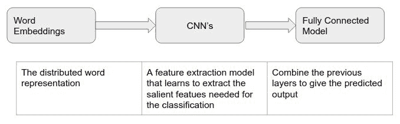
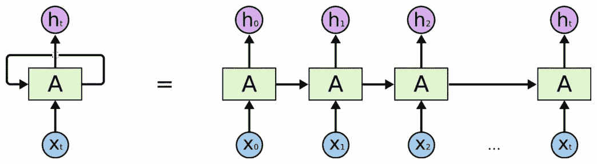

# 第九章：机器学习和深度学习模型

在我们到目前为止讨论的几乎所有应用中，都隐含着一个假设，那就是你正在创建一个新的机器学习 NLP 流水线。现在，情况不一定总是如此。如果你已经在一个成熟的平台上工作，fastText 可能也是一个很好的补充，可以使流水线更强大。

本章将为你提供一些使用流行框架（如 scikit-learn、Keras、TensorFlow 和 PyTorch）实现 fastText 的方法和示例。我们将讨论如何利用其他深度神经网络架构，如**卷积神经网络**（**CNN**）或注意力网络，来增强 fastText 词嵌入的能力，解决各种 NLP 问题。

本章涵盖的主题如下：

+   Scikit-learn 和 fastText

+   嵌入层

+   Keras

+   Keras 中的嵌入层

+   卷积神经网络架构

+   TensorFlow

+   PyTorch

+   Torchtext

# Scikit-learn 和 fastText

在本节中，我们将讨论如何将 fastText 集成到统计模型中。最常用和流行的统计机器学习库是 scikit-learn，因此我们将重点关注它。

scikit-learn 是最流行的机器学习工具之一，原因是其 API 非常简单且统一。流程如下：

1.  你基本上是将数据转换为矩阵格式。

1.  然后，你创建预测类的实例。

1.  使用实例，你在数据上运行`fit`方法。

1.  一旦模型创建完成，你可以在其上运行 `predict`。

这意味着你可以通过定义 `fit` 和 `predict` 方法来创建一个自定义分类器。

# fastText 的自定义分类器

由于我们有兴趣将 fastText 词向量与线性分类器结合使用，你不能直接传递整个向量，而是需要一种方法来定义一个单一的向量。在这种情况下，我们选择使用均值：

```py
class MeanEmbeddingVectorizer(object):
    def __init__(self, ft_wv):
        self.ft_wv = ft_wv
        if len(ft_wv)>0:
            self.dim = ft_wv[next(iter(all_words))].shape[0] 
        else:
            self.dim=0

    def fit(self, X, y):
        return self 

    def transform(self, X):
        return np.array([
            np.mean([self.ft_wv[w] for w in words if w in self.ft_wv] 
                    or [np.zeros(self.dim)], axis=0)
            for words in X
        ])
```

现在，你需要将令牌字典传递给模型，该字典可以通过 fastText 库构建：

```py
f = load_model(FT_MODEL)

all_words = set([x for tokens in data['tokens'].values for x in tokens])

wv_dictionary = {w: f.get_word_vector(w) for w in all_words}
```

# 将整个过程整合在一起

你可以使用 scikit-learn 的 `Pipeline` 来将整个流程组合在一起，如下所示：

```py
etree_w2v = Pipeline([("fasttext word-vector vectorizer",                                 MeanEmbeddingVectorizer(wv_dictionary)), 
                        ("extra trees", ExtraTreesClassifier(n_estimators=200))])
```

整个代码显示在统计机器学习笔记本中。为了进一步提高模型的效果，如果你能找到更好的方法来减少词向量，TF-IDF 已在共享笔记本中展示。另一种减少词向量的方法是使用哈希转换器。

在接下来的几节中，我们将探讨如何在深度学习模型中嵌入 fastText 向量。

# 嵌入层

正如你所看到的，当你需要在机器学习中处理文本时，你需要将文本转换为数值。神经网络架构中也有相同的逻辑。在神经网络中，你通过实现嵌入层来做到这一点。所有现代深度学习库都提供了嵌入 API 供使用。

嵌入层是一个有用且多功能的层，用于各种目的：

+   它可以用于学习词嵌入，以便稍后在应用中使用

+   它可以与更大的模型一起使用，在该模型中，嵌入也会作为模型的一部分进行调优

+   它可以用来加载预训练的词嵌入

本节的重点是第三点。我们的想法是利用 fastText 创建更优的词嵌入，然后通过这个嵌入层将其注入到你的模型中。通常，嵌入层会使用随机权重进行初始化，但在这种情况下，我们将通过 fastText 模型的词嵌入来初始化它。

# Keras

Keras 是一个广泛流行的高级神经网络 API。它支持 TensorFlow、CNTK 和 Theano 作为后端。由于 Keras 具有用户友好的 API，许多人使用它代替基础库。

# Keras 中的嵌入层

嵌入层将是 Keras 网络的第一个隐藏层，你需要指定三个参数：输入维度、输出维度和输入长度。由于我们将使用 fastText 来改善模型，因此还需要传递带有嵌入矩阵的权重参数，并将训练矩阵设置为不可训练：

```py
embedding_layer = Embedding(num_words,
                            EMBEDDING_DIM, 
                            weights=[embedding_matrix],
                            input_length=MAX_SEQUENCE_LENGTH,
                            trainable=False)
```

另外，我们需要注意的是，我们需要将词映射到整数，并将整数映射回词。在 Keras 中，你可以使用`Tokenizer`类来实现这一点。

让我们在卷积神经网络（CNN）中看看这一过程的实际应用。

# 卷积神经网络

当我们讨论将词嵌入和神经网络结合时，卷积神经网络是取得良好成果的一种方法。CNN 是通过在结果上应用多个卷积层和非线性激活函数（如 ReLu 或*tanh*）创建的。

让我们稍微谈一下什么是卷积。一个函数与另一个函数的卷积是一个积分，表示一个函数在经过另一个函数时的重叠量。你可以把它理解为将一个函数融合到另一个函数中。在信号理论中，专家是这样理解卷积的：输出信号是输入信号与环境冲击响应的卷积。任何环境的冲击响应本质上识别并区分该环境。

在传统的前馈神经网络中，我们将每个输入神经元连接到下一层中的每个输出神经元。而在 CNN 中，我们则使用卷积来计算输出。在训练阶段，CNN 会自动学习过滤器的值。

CNN 通常与词嵌入一起使用，在这里，fastText 就发挥了作用，它能够通过提供更好的词表示来在分类精度上带来巨大的提升。因此，架构由三个关键部分组成：



如果你在分类管道中已经有了这三个架构组件，你可以识别出词嵌入部分，看看是否将其更换为 fastText 能改善预测效果。

在这个示例中，我们将回顾之前的 Yelp 评论示例，并尝试使用卷积神经网络对其进行分类。为了简便起见，我们将使用一个已经发布的预训练数据集，但你可能会处理一个特定领域的用例，因此你应该按照前一章中的示范，整合模型的创建。如你所见，你可以使用 fastText 库或 Gensim 库。

从高层次来看，步骤如下：

1.  数据集中的文本样本会被转换为单词索引序列。*单词索引* 仅仅是一个整数 ID，表示某个单词。我们将只考虑数据集中最常见的 20,000 个单词，并将序列截断至最多 1,000 个单词。这么做是为了计算的方便。你可以尝试这种方法，并找到最能带来通用性的做法。

1.  准备一个嵌入矩阵，它将在索引`i`处包含单词索引中单词`i`的嵌入向量。

1.  然后将嵌入矩阵加载到 Keras 嵌入层，并将该层设置为冻结状态，以确保在训练过程中不会被更新。

1.  紧接其后的层将是卷积网络。最后将有一个 softmax 层，将输出收敛到我们的五个类别。

在这种情况下，我们可以使用 pandas 库来创建输入文本的列表和输出标签的列表：

```py
>>> df = pd.read_csv('yelp_review.csv')
>>> texts = df.text.values
>>> labels = df.stars.values
>>> texts = texts[:20000]
>>> labels = labels[:20000]
>>> print('Found %s texts.' % len(texts))
Found 20000 texts.
```

现在，我们需要将文本样本和标签格式化为可以输入神经网络的张量。在这一部分，我们将使用`Tokenizer`类。我们还需要对序列进行填充，以保证所有矩阵的长度相等：

```py
>>> # finally, vectorize the text samples into a 2D integer tensor
>>> tokenizer = Tokenizer(num_words=MAX_NUM_WORDS)
>>> tokenizer.fit_on_texts(texts)
>>> sequences = tokenizer.texts_to_sequences(texts)
>>> word_index = tokenizer.word_index
>>> print('Found %s unique tokens.' % len(word_index))
Found 45611 unique tokens.
>>> data = pad_sequences(sequences, maxlen=MAX_SEQUENCE_LENGTH)
>>> labels = to_categorical(np.asarray(labels))
>>> print('Shape of data tensor:', data.shape)
>>> print('Shape of label tensor:', labels.shape)
Shape of data tensor: (20000, 1000)
Shape of label tensor: (20000, 6)
>>> # split the data into a training set and a validation set
>>> indices = np.arange(data.shape[0])
>>> np.random.shuffle(indices)
>>> data = data[indices]
>>> labels = labels[indices]
>>> num_validation_samples = int(VALIDATION_SPLIT * data.shape[0])
>>> x_train = data[:-num_validation_samples]
>>> y_train = labels[:-num_validation_samples]
>>> x_val = data[-num_validation_samples:]
>>> y_val = labels[-num_validation_samples:]
```

现在我们将使用我们的 fastText 嵌入。在这个案例中，我们使用的是预训练嵌入，但你也可以在训练过程中动态地训练自己的嵌入。你可以选择从`.vec`文件加载，但由于这是 fastText，我们将从 BIN 文件加载。使用 BIN 文件的优势在于，它可以在很大程度上避免词汇表外的情况。我们将使用 fastText 模型并生成一个嵌入矩阵：

```py
>>> print('Preparing embedding matrix.')

>>># load the fasttext model
>>> f = load_model(FT_MODEL)

>>> # prepare embedding matrix
>>> num_words = min(MAX_NUM_WORDS, len(word_index) + 1)
>>> embedding_matrix = np.zeros((num_words, EMBEDDING_DIM))
>>> for word, i in word_index.items():
...     if i >= MAX_NUM_WORDS:
...         continue
...     embedding_vector = f.get_word_vector(word)
...     if embedding_vector is not None:
...         # words not found in embedding index will be all-zeros.
...         embedding_matrix[i] = embedding_vector
```

我们将其加载到嵌入层。需要注意的是，`trainable`参数应该设置为`False`，以防止在训练过程中更新权重，如下所示：

```py
>>> # load pre-trained word embeddings into an Embedding layer
>>> embedding_layer = Embedding(num_words,
...                             EMBEDDING_DIM,
...                             weights=[embedding_matrix],
...                             input_length=MAX_SEQUENCE_LENGTH,
...                             trainable=False)
```

现在，我们可以构建一个 1D 卷积网络来应用于我们的 Yelp 分类问题：

```py
>>> # train a 1D convnet with global maxpooling
>>> sequence_input = Input(shape=(MAX_SEQUENCE_LENGTH,), dtype='int32')
>>> embedded_sequences = embedding_layer(sequence_input)
>>> x = Conv1D(128, 5, activation='relu')(embedded_sequences)
>>> x = MaxPooling1D(5)(x)
>>> x = Conv1D(128, 5, activation='relu')(x)
>>> x = MaxPooling1D(5)(x)
>>> x = Conv1D(128, 5, activation='relu')(x)
>>> x = GlobalMaxPooling1D()(x)
>>> x = Dense(128, activation='relu')(x)
>>> preds = Dense(6, activation='softmax')(x)
```

该模型的摘要如下所示：

```py
_________________________________________________________________ 
Layer (type) Output Shape Param #
=================================================================
input_1 (InputLayer) (None, 1000) 0
_______________________________________________________________
embedding_1 (Embedding) (None, 1000, 300) 6000000 _______________________________________________________________
conv1d_1 (Conv1D) (None, 996, 128) 192128
_______________________________________________________________
max_pooling1d_1 (MaxPooling1 (None, 199, 128) 0 _______________________________________________________________
conv1d_2 (Conv1D) (None, 195, 128) 82048
_______________________________________________________________
max_pooling1d_2 (MaxPooling1 (None, 39, 128) 0 _______________________________________________________________
conv1d_3 (Conv1D) (None, 35, 128) 82048
_______________________________________________________________
global_max_pooling1d_1 (Glob (None, 128) 0
_______________________________________________________________
dense_1 (Dense) (None, 128) 16512
_______________________________________________________________
dense_2 (Dense) (None, 6) 774
=================================================================
Total params: 6,373,510 
Trainable params: 373,510 
Non-trainable params: 6,000,000
_________________________________________________________________
```

现在，你可以尝试一些其他的超参数，看看能否提高准确度。

在本节中，你了解了如何将 fastText 词嵌入作为更大 CNN Keras 分类器的一部分。使用类似的方法，你可以在 Keras 中使用 fastText 嵌入与任何受益于词嵌入的神经网络架构。

# TensorFlow

TensorFlow 是由 Google 开发的一个计算库。它现在非常流行，许多公司使用它来创建他们的神经网络模型。在你在 Keras 中看到的内容之后，使用 fastText 增强 TensorFlow 模型的逻辑是相同的。

# TensorFlow 中的词嵌入

要在 TensorFlow 中创建词嵌入，你需要创建一个嵌入矩阵，其中所有文档列表中的标记都有唯一的 ID，因此每个文档都是这些 ID 的向量。现在，假设你有一个 NumPy 数组叫做`word_embedding`，它有`vocab_size`行和`embedding_dim`列，并且你想要创建一个张量`W`。以一个具体的例子，“I have a cat.”可以分解为["I", "have", "a", "cat", "." ]，对应的`word_ids`张量的形状将是 5。为了将这些单词 ID 映射到向量中，创建词嵌入变量并使用`tf.nn.embedding_lookup`函数：

```py
word_embeddings = tf.get_variable(“word_embeddings”,
                                  [vocabulary_size, embedding_size])
embedded_word_ids = tf.nn.embedding_lookup(word_embeddings, word_ids)
```

之后，`embedded_word_ids`张量将在我们的示例中具有`shape [5, embedding_size]`，并包含五个单词的嵌入（密集向量）。

为了能够使用带有预训练向量的词嵌入，创建`W`作为`tf.Variable`，并通过`tf.placeholder()`从 NumPy 数组初始化它：

```py
with tf.name_scope("embedding"):
    W = tf.Variable(tf.constant(0.0,
                                shape=[doc_vocab_size,
                                       embedding_dim]),
                    trainable=False, 
                    name="W")
 embedding_placeholder = tf.placeholder(tf.float32,
    [doc_vocab_size, embedding_dim])
 embedding_init = W.assign(embedding_placeholder)
 embedded_chars = tf.nn.embedding_lookup(W,x)
```

然后，你可以在 TensorFlow 会话中传递实际的嵌入：

```py
sess = tf.Session()
sess.run(embedding_init, feed_dict={embedding_placeholder: embedding})
```

这样可以避免在图中存储嵌入的副本，但它确实需要足够的内存来同时保留矩阵的两个副本（一个用于 NumPy 数组，一个用于`tf.Variable`）。你希望在训练过程中保持词嵌入不变，因此如前所述，词嵌入的可训练参数需要设置为`False`。

# RNN 架构

自然语言处理（NLP）一直被认为是 LSTM 和 RNN 类型神经网络架构的一个绝佳应用案例。LSTM 和 RNN 使用顺序处理。NLP 一直被认为是最大应用案例之一，因为任何句子的意义都是基于上下文的。一个单词的意义可以被认为是基于它之前的所有单词来确定的：



现在，当你运行 LSTM 网络时，你需要将单词转换成嵌入层。通常在这种情况下，会使用随机初始化器。但你可能应该能够通过使用 fastText 模型来提高模型的性能。让我们来看看在这种情况下如何使用 fastText 模型。

在这个例子中，由 Facebook 发布的爬取向量被加载到内存中。在你的使用案例中，你可能需要在你的文本语料库上训练一个 fastText 模型并加载该模型。我们在这里使用 VEC 文件来创建嵌入，但你也可以选择从`.bin`文件加载，如 Keras 示例中所示：

```py
#Load fasttext vectors
filepath_glove = 'crawl-300d-2M.vec'
glove_vocab = []
glove_embd=[]
embedding_dict = {}

with open(filepath_glove) as file:
    for index, line in enumerate(file):
        values = line.strip().split() # Word and weights separated by space
        if index == 0:
            glove_vocab_size = int(values[0])
            embedding_dim = int(values[1])
        else:
            row = line.strip().split(' ')
            vocab_word = row[0]
            glove_vocab.append(vocab_word)
            embed_vector = [float(i) for i in row[1:]] # convert to list of float
            embedding_dict[vocab_word]=embed_vector
```

调用你感兴趣的文本块，然后执行正常的清理步骤。类似于 Keras 中的示例，接下来你将需要一个机制，将标记映射到唯一的整数，并能通过整数获取回标记。因此，我们需要创建一个字典和一个反向字典来存储单词：

```py
#Create dictionary and reverse dictionary with word ids

def build_dictionaries(words):
    count = collections.Counter(words).most_common() #creates list of word/count pairs;
    dictionary = dict()
    for word, _ in count:
        dictionary[word] = len(dictionary) #len(dictionary) increases each iteration
        reverse_dictionary = dict(zip(dictionary.values(), dictionary.keys()))
    return dictionary, reverse_dictionary

dictionary, reverse_dictionary = build_dictionaries(training_data)
```

我们使用 fastText 模型创建的字典来创建嵌入数组：

```py
#Create embedding array

doc_vocab_size = len(dictionary)
dict_as_list = sorted(dictionary.items(), key = lambda x : x[1])

embeddings_tmp=[]

for i in range(doc_vocab_size):
    item = dict_as_list[i][0]
    if item in glove_vocab:
        embeddings_tmp.append(embedding_dict[item])
    else:
        rand_num = np.random.uniform(low=-0.2, high=0.2,size=embedding_dim)
        embeddings_tmp.append(rand_num)

# final embedding array corresponds to dictionary of words in the document
embedding = np.asarray(embeddings_tmp)

# create tree so that we can later search for closest vector to prediction
tree = spatial.KDTree(embedding)
```

接下来，我们设置 RNN 模型。我们将每次读取三个单词，因此我们的 `x` 是一个行数不确定、宽度为三列的矩阵。另一个需要注意的输入是 `embedding_placeholder`，它每个单词有一行，宽度为 300 维，对应输入词向量的维度数。

然后，TensorFlow 的 `tf.nn.embedding_lookup()` 函数可以用于从矩阵 `W` 中查找每个来自 `x` 的输入，从而生成 3D 张量 `embedded_chars`。接着，可以将其输入到 RNN 中：

```py
# create input placeholders
x = tf.placeholder(tf.int32, [None, n_input])
y = tf.placeholder(tf.float32, [None, embedding_dim])

# RNN output node weights and biases
weights = { 'out': tf.Variable(tf.random_normal([n_hidden, embedding_dim])) }
biases = { 'out': tf.Variable(tf.random_normal([embedding_dim])) }

with tf.name_scope("embedding"):
    W = tf.Variable(tf.constant(0.0, shape=[doc_vocab_size, embedding_dim]), trainable=False, name="W")
    embedding_placeholder = tf.placeholder(tf.float32, [doc_vocab_size, embedding_dim])
    embedding_init = W.assign(embedding_placeholder)
    embedded_chars = tf.nn.embedding_lookup(W,x)

# reshape input data
x_unstack = tf.unstack(embedded_chars, n_input, 1)

# create RNN cells
rnn_cell = rnn.MultiRNNCell([rnn.BasicLSTMCell(n_hidden),rnn.BasicLSTMCell(n_hidden)])
outputs, states = rnn.static_rnn(rnn_cell, x_unstack, dtype=tf.float32)

# capture only the last output
pred = tf.matmul(outputs[-1], weights['out']) + biases['out']
```

既然我们已经有了 RNN，接下来需要弄清楚如何训练它以及可以使用什么样的代价函数。FastText 内部使用 softmax 函数。softmax 函数在这里可能不适合作为代价函数，因为按照定义，softmax 会在比较之前对向量进行归一化。因此，实际的向量可能会以任意的方式变大或变小。也许有必要让最终的向量与训练集中的向量具有相同的大小，从而与预训练向量的大小相同。在这个例子中，重点是 L2 损失：

```py
cost = tf.reduce_mean(tf.nn.l2_loss(pred-y))
optimizer = tf.train.AdamOptimizer(learning_rate=learning_rate).minimize(cost)
chapter6 folder: https://github.com/PacktPublishing/Learn-fastText/blob/master/chapter6/TensorFlow%20rnn.ipynb.
```

# PyTorch

按照与前两个库相同的逻辑，你可以使用 `torch.nn.EmbeddingBag` 类来注入预训练的嵌入。虽然有一个小缺点。Keras 和 TensorFlow 假设你的张量实际上是作为 NumPy 数组实现的，而在 PyTorch 中并非如此。PyTorch 实现了 torch 张量。通常这不是问题，但这意味着你需要编写自己的文本转换和分词管道。为了避免重写和重新发明轮子，你可以使用 torchtext 库。

# torchtext 库

torchtext 是一个出色的库，能够处理你构建 NLP 模型所需的大部分预处理步骤。基本上，可以将 torchtext 看作是以一种松散的方式充当 *配置即代码* 的工具。因此，理解 torchtext 数据范式是有意义的，学习大约需要三小时，而不是编写定制代码，虽然看起来可能更简单，但会涉及无数的困惑和调试。而且，torchtext 还能构建预构建的模型，包括 fastText。

现在，让我们来看看是如何实现的。

# torchtext 中的数据类

我们将首先调用所有必要的库。请注意，你正在调用包含我们使用所需数据类的数据：

```py
from torchtext import data
import spacy
...
```

我们将使用 `spacy` 进行分词步骤，torchtext 在这方面有很好的支持。torchtext 提供了对调用和加载 fastText 库的优异支持：

```py
from torchtext.vocab import FastText
vectors = FastText('simple')
```

这将下载 `wiki.simple.bin` 模型。如果你提供名称 `en`，它将下载并加载 `wiki.en.bin`。如果加载 `fr`，它将加载 `wiki.fr.bin`，以此类推。

你可能会从 CSV 文件或文本文件中加载数据。在这种情况下，你需要打开文件，可能在 pandas 中提取相关字段，然后将其保存到单独的文件中。torchtext 无法区分训练集和验证集，因此你可能还需要将这些文件分开：

```py
def clean_str(string):
    string = re.sub(r"[^A-Za-z0-9(),!?\'\`]", " ", string)
    string = re.sub(r"\'s", " \'s", string)
    string = re.sub(r"\'ve", " \'ve", string)
    string = re.sub(r"n\'t", " n\'t", string)
    string = re.sub(r"\'re", " \'re", string)
    string = re.sub(r"\'d", " \'d", string)
    string = re.sub(r"\'ll", " \'ll", string)
    string = re.sub(r",", " , ", string)
    string = re.sub(r"!", " ! ", string)
    string = re.sub(r"\(", " \( ", string)
    string = re.sub(r"\)", " \) ", string)
    string = re.sub(r"\?", " \? ", string)
    string = re.sub(r"\s{2,}", " ", string)

    return string.strip().lower()

def prepare_csv(df, seed=999):
    df['text'] = df['text'].apply(clean_str)
    df_train, df_test = train_test_split(df, test_size=0.2)
    df_train.to_csv("yelp_tmp/dataset_train.csv", index=False)
    df_test.to_csv("yelp_tmp/dataset_val.csv", index=False)
```

现在你需要定义数据并构建词汇表。你可以使用数据模块来实现这一点。该模块有数据类来定义管道步骤并运行批处理、填充和数字化。首先，你需要使用 `data.Fields` 定义字段类型。此类定义了可以用来创建所需张量的常见数据类型。你还可以定义一些常见指令来定义张量应如何创建。一旦字段创建完成，你可以调用 `TabularDataset` 来使用字段中定义的指令创建数据集。常见的指令作为参数传递：

```py
# Define all the types of fields
# pip install spacy for the tokenizer to work (or remove to use default)
TEXT = data.Field(lower=True, include_lengths=True, fix_length=150, tokenize='spacy')
LABEL = data.Field(sequential=True, use_vocab=False)

# we use the index field to re-sort test data after processing
INDEX = data.Field(sequential=False)

train_fields=[
    (text_label, TEXT),
    (stars_label, LABEL)
]

train_fields=[
    (text_label, TEXT),
    (stars_label, LABEL)
]

train = data.TabularDataset(
    path='yelp_tmp/dataset_train.csv', format='csv', skip_header=True,
    fields=train_fields)

test_fields=[
    (id_label, INDEX),
    (text_label, TEXT),
    (stars_label, LABEL)
]
test = data.TabularDataset(
        path='yelp_tmp/dataset_val.csv', format='csv', skip_header=True,
        fields=test_fields)
```

+   `sequential=True` 表示该列包含序列。对于标签，我们可能希望保持这种设置，因为示例基本上是一个比较，但在不是这种情况的情况下，可以将其设置为 false。

+   我们在此指定使用 spacy 作为分词器，但你可以指定自定义函数。

+   `fix_length` 将所有序列填充或裁剪到固定长度，这里是 150。

+   `lower` 指定我们将所有英文字母设置为小写。

一旦数据集创建完成，你需要创建词汇表，以便稍后将标记转换为整数。在这里，我们将从之前加载的 fastText 向量构建词汇表：

```py
max_size = 30000
TEXT.build_vocab(train, test, vectors=vectors, max_size=max_size)
INDEX.build_vocab(test)
```

# 使用迭代器

现在你可以使用迭代器来遍历数据集。在这种情况下，我们使用 `BucketIterator`，它的额外优势是将相似长度的示例聚集在一起批处理。这减少了所需的填充量：

```py
train = data.BucketIterator(train, batch_size=32,
                            sort_key=lambda x: len(x.text),
                            sort_within_batch=True, repeat=False)
test = data.BucketIterator(test, batch_size=128,
                           sort_key=lambda x: len(x.text),
                           sort_within_batch=True, train=False,
                           repeat=False)
```

所以，你将能够在这些迭代器上运行简单的 `for` 循环，并根据批次提供输入。

# 将所有步骤结合起来

最后，一旦完成所有这些步骤，你可以初始化你的 PyTorch 模型，并需要将预训练的向量作为模型的权重。在示例中，创建了一个 RNN 模型，并且词向量是从之前的字段向量初始化的。这将处理 PyTorch 中的 `lookup_table`：

```py
model = RNNModel('GRU', ntokens, emsize, nhidden, 6,
                  nlayers, dropemb=dropemb, droprnn=droprnn, 
                  bidirectional=True)
model.encoder.weight.data.copy_(TEXT.vocab.vectors)
```

这里展示的代码仅包括你可能不熟悉的部分。完整的代码可以查看仓库中的 `pytorch torchtext rnn.ipynb` 笔记本。

# 总结

在本章中，我们探讨了如何将 fastText 词向量集成到线性机器学习模型或在 Keras、TensorFlow 和 PyTorch 中创建的深度学习模型中。你还看到如何将词向量轻松地融入到你可能在业务应用中使用的现有神经网络架构中。如果你是通过随机值初始化嵌入，我强烈建议你尝试使用 fastText 值进行初始化，然后观察模型的性能是否有所提升。
