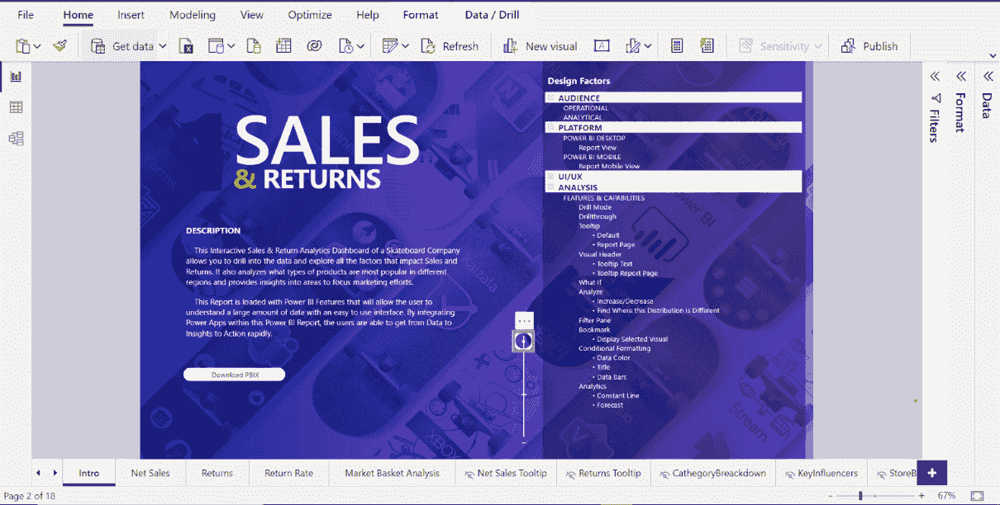
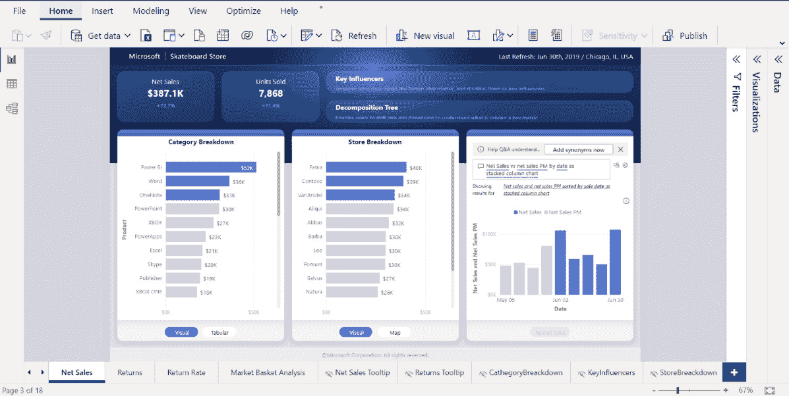
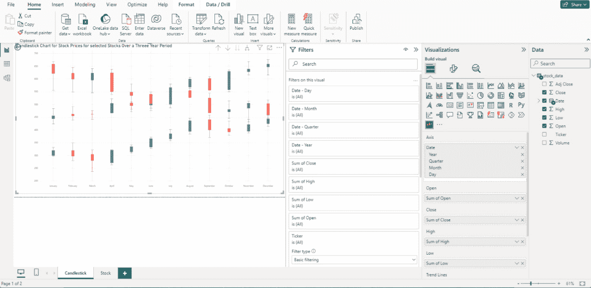
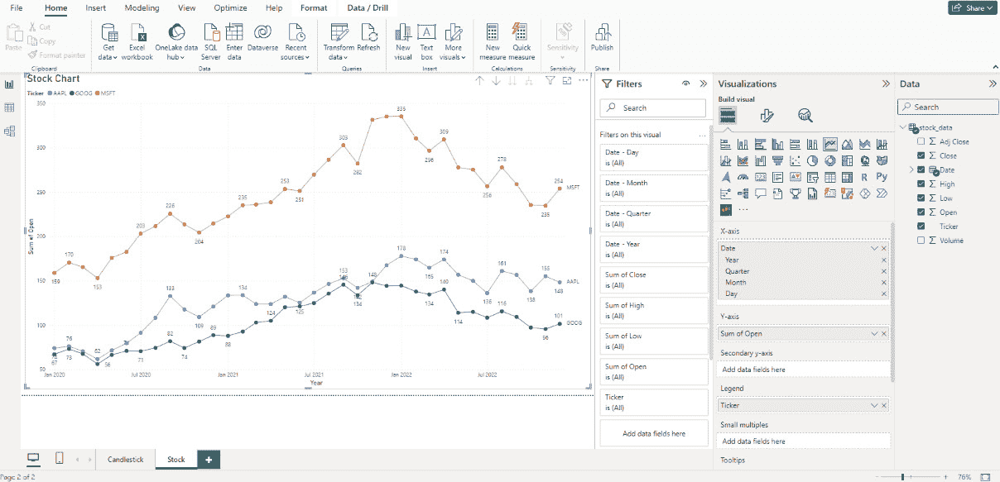
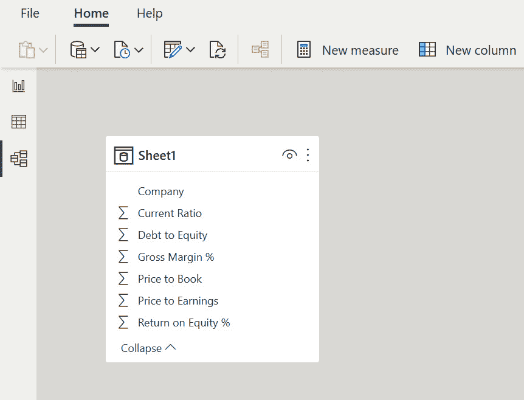
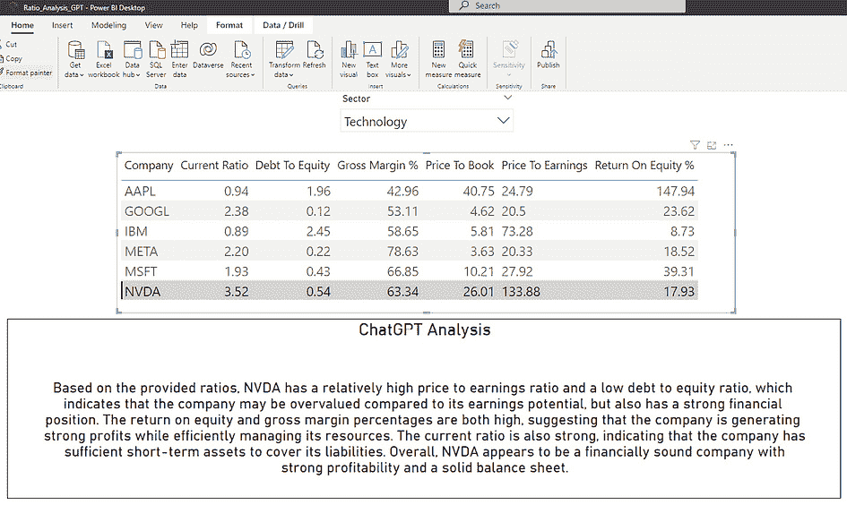

# 第二章：使用 Power BI 和 ChatGPT 创建财务叙事

本章简要概述了 Microsoft Power BI 及其在金融领域的应用。我们还将介绍 Power BI 的益处及其在金融领域的应用，然后考虑数据建模在财务分析中的重要性，并提供创建有效财务可视化的技巧。最后，我们将讨论数据建模、可视化和 ChatGPT 集成的最佳实践。

在本章中，我们将涵盖以下主题：

+   Power BI 及其在金融领域应用的简要概述

+   数据结构在财务分析中的重要性

+   Power BI 中的可视化技术

+   使用 Power BI 创建财务仪表板

+   数据建模、可视化和 ChatGPT 集成的最佳实践

+   案例分析 - 使用 Power BI 分析财务数据

+   案例分析 - 使用 Power BI 和 ChatGPT 分析财务比率

到本章结束时，您应该对 Microsoft Power BI 在可视化财务信息方面的功能有一个良好的理解，以及我们如何利用 ChatGPT 和 AI 通过强大的洞察力来增强这些功能。

# 技术要求

如果您想跟随并自己理解和尝试示例，您需要解决一些技术问题。您需要以下内容：

+   访问稳定且速度合理的互联网连接。

+   在您的桌面电脑上安装较新版本的 Microsoft Power BI。Microsoft 销售包含 Power BI 的 Office 版本之一，价格各异。

+   在您的桌面电脑上安装 Python 3.5 或更高版本。寻找最新的稳定版本。

+   对使用 Power BI 进行可视化的基本理解 - 简单的报告和图表。

+   对 Python 脚本的基本理解以及 Python 中包的使用。

+   Open AI 的账户。您还必须理解“API”的含义。

+   对金融的基本理解。你必须熟悉公司资产负债表和利润表，并理解两者之间的区别。

拥有这套知识和工具，我们相信您将能够理解接下来的章节。

# Power BI 及其在金融领域应用的简要概述

本节是关于 Power BI 及其在金融领域应用的介绍。

Power BI 是由 Microsoft 开发的一款强大的数据分析与可视化工具。由于其易用性、多功能性和处理大量数据的能力，近年来它越来越受欢迎。

在金融领域，Power BI 可用于分析和可视化财务数据，以提供对一家公司财务表现的更深入洞察。财务专业人士可以连接到各种数据源，包括电子表格、数据库和基于云的应用程序，以创建可以跨组织共享的动态和可视化报告。

Power BI 在金融领域的一个关键应用是创建财务仪表板。Power BI 使财务专业人士能够创建交互式仪表板，提供公司财务表现的实时视图。仪表板可以包括**关键绩效指标**（**KPIs**）如收入、毛利率和运营费用，以及如折线图、柱状图和饼图等可视化。这些仪表板为决策者提供了一个快速简便的方法来了解组织的财务状况并做出明智的决策。

Power BI 的另一个应用是分析财务报表。Power BI 可以用于分析财务报表，如利润表、资产负债表和现金流量表。通过这种方式可视化财务数据，财务专业人士可以识别可能难以发现的趋势和模式。例如，他们可以按部门或地点分析收入和支出，或识别营运资本随时间的变化。

Power BI 也可以用于预测和预算。财务专业人士可以创建预测模型，根据历史数据预测财务结果，例如收入和支出。这有助于财务专业人士做出更准确的预测并制定更好的预算。通过识别数据中的趋势和模式，他们还可以实时调整预算，做出更明智的资源分配决策。

Power BI 还有助于识别节省成本的机会。通过在 Power BI 中分析财务数据，财务专业人士可以确定可以降低或消除成本的区域。例如，他们可以识别供应链中的低效或减少过剩库存。通过降低成本，他们可以帮助提高盈利能力并推动业务增长。

最后，Power BI 使财务专业人士能够与其他部门协作。通过共享交互式仪表板和报告，团队可以做出基于数据的决策，这些决策围绕共同目标，推动业务增长。

总体而言，Power BI 是财务专业人士的一个宝贵工具，可以帮助他们从复杂财务数据中获得洞察力，并做出推动业务增长的基于数据的决策。通过这种方式可视化和分析财务数据，财务专业人士可以识别趋势、发现机会并做出有助于组织成功的明智决策。

在下一节中，我们将回顾将 Power BI 与 ChatGPT 洞察力结合使用的益处。

## 将 Power BI 与 ChatGPT 洞察力结合使用的益处

在本节中，我们将回顾将 Power BI 与 ChatGPT 洞察力结合使用的益处。

在财务分析中使用 Power BI 的一个主要优势是提高了数据准确性。Power BI 使财务专业人士能够连接到各种数据源并实时分析数据。这意味着数据始终是最新的且准确的，这提高了财务分析的准确性。

Power BI 还提供了一系列可视化选项，允许财务专业人士以清晰和易于消费的方式展示复杂的财务数据。通过这种方式可视化数据，决策者可以快速理解趋势、模式和不同财务指标之间的关系。

此外，Power BI 通过共享报告和仪表板，使团队能够在财务分析中协作。这意味着多个利益相关者可以共同进行财务分析，分享洞察力，并做出更明智的决策。这有助于财务专业人士打破壁垒，与其他组织部分更有效地合作。

由于 Power BI 可以处理大量数据，它非常适合财务分析。随着公司的发展产生更多财务数据，Power BI 可以扩展以满足组织的需要。

它可以是一个节省时间的工具，因为有了 Power BI，财务专业人士可以快速创建报告和仪表板，提供对财务表现的洞察力。与传统的财务分析方法，如手动数据输入和电子表格分析相比。

Power BI 能够创建交互式仪表板。它们提供了财务表现的实时视图。仪表板可以包括关键绩效指标（KPIs）、可视化和其他数据，为决策者提供快速轻松了解组织财务状况的方法。通过这种方式可视化财务数据，财务专业人士可以识别出可能难以发现的趋势和模式。例如，他们可以识别出可以降低成本的区域或识别增长机会。通过基于数据的决策，组织可以更好地围绕共同目标进行协调，并推动业务成功。

Power BI 可以用来创建预测模型，预测财务结果。通过识别数据中的趋势和模式，财务专业人士可以做出更准确的预测并制定更好的预算。

由于 Power BI 是 Microsoft Power 平台的一部分，包括 Power Apps 和 Power Automate，并且作为基于云的服务或本地解决方案提供，因此它可以作为一个成本效益高的财务分析解决方案。这意味着组织可以选择最适合其需求和预算的部署选项。

ChatGPT 及其**大型语言模型（LLM**）的基础，扩展了 Power BI 已经非常出色的功能。Power BI 和 ChatGPT 之间存在多个潜在的协同作用领域。

ChatGPT 的洞察力可以用来根据历史财务数据预测未来的趋势和模式。然后可以使用 Power BI 来可视化这些洞察力，并快速提供对财务表现的更深入理解。

使用 ChatGPT 的**自然语言处理**（**NLP**）功能，它提供的洞察可以用于处理非结构化数据，如客户反馈、社交媒体帖子以及电子邮件。然后，Power BI 可以用来以提供对客户行为和偏好洞察的方式可视化这些数据。

ChatGPT 洞察可用于提供对客户行为和偏好的洞察，这些洞察随后可以用来指导财务决策。然后，Power BI 可以用来以易于决策者理解的方式可视化这些数据。

Power BI 可以连接到各种数据源，包括 ChatGPT 洞察。这使得财务专业人士能够结合来自多个来源的洞察，并创建对财务绩效的更全面视图。此外，通过结合这些工具，团队可以共同进行财务分析，共享洞察，并做出更明智的决策。结合 ChatGPT 和 Power BI 的另一个用途是自动化与财务分析相关的许多任务。这可以包括数据准备、数据清洗和报告创建等任务。通过自动化这些任务，财务专业人士可以有更多时间专注于分析和决策。

总体而言，Power BI 和 ChatGPT 洞察的结合为财务专业人士提供了一套强大的工具，可用于深入了解财务绩效。通过这种方式可视化和分析财务数据，决策者可以识别趋势，发现机会，并做出有助于其组织成功的明智决策。

在下一节中，我们将讨论在财务分析中结构化数据的重要性。

# 在财务分析中结构化数据的重要性

在本节中，我们将探讨在执行财务分析时结构化数据的重要性。

Power BI 提供了几种结构化财务数据的技术，包括数据建模、数据塑形和数据转换：

+   **数据建模**：正如我们之前所述，数据建模是创建一个数据模型或模式的过程，它定义了不同数据点之间的关系。在 Power BI 中，数据建模涉及使用 Power Pivot 数据建模引擎创建模型。这使得财务专业人士能够定义表之间的关系，创建计算列和度量，以及创建层次结构。一个设计良好的数据模型可以使得分析财务数据并获得洞察变得更加容易。数据建模是财务分析的一个关键方面。它使财务专业人士能够将原始数据转化为有用的洞察，从而可以指导财务决策。

+   **数据塑形**：数据塑形是过滤、排序和聚合数据的过程，使其对分析更有用。在 Power BI 中，数据塑形是通过 Power Query 编辑器完成的，它提供了一个图形界面来塑形数据，包括过滤数据、删除列和合并表。通过塑形数据，财务专业人士可以消除无关数据，并专注于与其分析最相关的数据。

+   **数据转换**：数据转换是将数据从一种形式转换为另一种形式的过程。在 Power BI 中，数据转换可以通过 Power Query 编辑器完成，它提供了广泛的数据转换选项，包括拆分列、合并表和数据透视。通过转换数据，财务专业人士可以创建新的见解和可视化，这些在以前是不可能的。

+   `DATESYTD`、`TOTALYTD` 和 `SAMEPERIODLASTYEAR`。时间智能可用于分析趋势、识别季节性并预测未来表现。

+   **自定义可视化**：Power BI 提供了广泛的自定义可视化，可用于创建更具吸引力和信息量的可视化。自定义可视化包括图表、仪表盘和地图，以及更专业的可视化，如子弹图和甘特图。通过使用自定义可视化，财务专业人士可以创建符合其特定需求和要求的可视化。

因此，Power BI 提供了一系列用于结构化财务数据的技巧，包括数据建模、数据塑形和数据转换。这些技巧可用于创建设计良好的数据模型，消除无关数据，分析时间趋势，并创建更具吸引力和信息量的可视化。通过使用这些技巧，财务专业人士可以更全面地了解财务表现，并做出更明智的决策。

为了有效地使用 Power BI 进行财务分析，了解如何连接数据源并在表之间创建关系至关重要。这个过程允许用户创建强大的报告和可视化，为财务表现提供有价值的见解。

使用 Power BI 进行财务分析的第一步是连接包含财务数据的数据源。在 Power BI 中连接数据源时，有几种选项可供选择，包括导入数据、直接连接到数据库或使用自定义数据连接器。Power BI 可以连接到大量数据源，包括 Excel 文件、CSV 文件、SQL 数据库和基于云的数据源，如 Azure 和 Salesforce。一旦连接了数据源，下一步就是将数据导入 Power BI。

## 将数据导入 Power BI

将数据导入 Power BI 是一个简单的过程。用户可以选择他们想要导入的表格，然后点击**加载**按钮。Power BI 将导入数据并为每个源创建一个表格。一旦数据被导入，下一步就是创建表格之间的关系。

在使用 Power BI 进行财务分析时，创建表格之间的关系是一个关键步骤。关系允许用户创建显示不同数据集之间关系的报告和可视化。为了在表格之间创建关系，用户需要理解关系键的概念。

关系键是一个用于将两个表格链接在一起的唯一标识符。例如，如果我们正在分析销售数据和库存数据，我们可能会使用产品 ID 作为关系键。产品 ID 是分配给每个产品的唯一标识符，它可以用来将销售表和库存表链接在一起。

Power BI 提供了几个工具来建立关系，包括图表视图，它允许以可视化的方式表示数据模型和关系。在这个视图中，可以拖放表格来创建关系，并选择字段作为建立关系的键。

要在 Power BI 中创建两个表格之间的关系，用户需要从**主页**选项卡中选择**管理关系**选项。然后他们可以选择他们想要链接的表格并选择他们想要用作关系键的列。一旦创建了关系，用户就可以使用它来创建强大的报告和可视化，以显示不同数据集之间的关系。

除了图表视图之外，Power BI 还提供了关系视图，这允许更高级的关系管理。在这个视图中，用户可以定义关系属性，例如基数和交叉筛选，以确保关系得到正确定义并按预期工作。

让我们通过一个例子来了解如何在 Power BI 中创建表格之间的关系。假设我们正在分析一家零售公司的财务表现，并且我们有来自两个来源的数据：销售数据和库存数据。销售数据在一个 Excel 文件中，而库存数据在一个 SQL 数据库中。我们想要创建一个报告来显示销售和库存水平之间的关系。

在这种情况下，我们首先会在 Power BI 中连接到 Excel 文件和 SQL 数据库。然后我们将销售数据和库存数据导入 Power BI。一旦数据被导入，我们可以通过选择**管理关系**选项并选择产品 ID 列作为关系键，在销售表和库存表之间创建关系。

一旦建立了关系，我们就可以创建一个报告，显示销售和库存水平之间的关系。例如，我们可以创建一个报告，按产品类别显示销售情况，并使用可视化显示每个类别的库存水平。然后，我们可以利用销售表和库存表之间的关系，来展示库存水平的变化如何影响销售。

总之，连接数据源并在表之间创建关系是使用 Power BI 进行财务分析的关键步骤。通过连接数据源并创建关系，财务专业人士可以创建强大的报告和可视化，从而提供对财务表现的宝贵见解。通过使用 Power BI 数据建模引擎，财务专业人士可以轻松地在表之间创建关系并分析复杂财务数据。

这引出了下一个部分，我们将探讨 Power BI 中的可视化技术。

# Power BI 中的可视化技术

如我们之前所述，Power BI 提供了广泛的可视化技术，以帮助用户有效地传达数据洞察。这些包括标准图表，如柱状图、折线图和散点图，以及更高级的视觉元素，如热图、树图和仪表盘。Power BI 还允许使用 JavaScript 或 R 创建自定义可视化。除了这些视觉元素外，Power BI 还提供了交互式选项，如钻取和筛选，使用户能够探索数据并获得更深入的见解。总的来说，Power BI 的可视化能力允许清晰且有力地传达数据驱动的洞察。

## 选择适合财务数据的可视化

选择合适的可视化是创建有效的 Power BI 财务仪表板和报告的重要方面。在选择财务数据的可视化时，以下五个考虑因素需要牢记：

+   **确定可视化的目的**：你试图用数据讲述什么故事？你是想比较值、显示时间趋势，还是显示比例？可视化的目的将决定最合适的图表或图形类型。

+   **考虑数据的性质**：正在可视化的数据类型也很重要。例如，堆积柱状图可能适合比较不同产品线的收入，但不适合显示多年收入增长的时间序列。

+   **注重简洁性**：虽然使用复杂的可视化来展示数据分析技能可能很有吸引力，但简洁性通常更有效。选择易于理解且能传达预期信息的视觉元素。

+   **有效地使用颜色**：颜色在可视化财务数据时可以是一个强大的工具，但如果使用不当，也可能令人感到压倒。应谨慎且有意地使用颜色，以吸引对关键数据点的注意或突出趋势。

+   **利用交互性**：Power BI 允许交互性，如钻取和筛选，这对于财务数据尤其有用。考虑用户将如何与数据交互，并提供适当的选项。

下面是一些常见的财务数据可视化列表：

+   **条形图**：用于比较不同类别的值

+   **折线图**：用于显示随时间变化的趋势

+   **饼图**：用于显示比例或百分比

+   **面积图**：类似于折线图，但带有阴影区域来表示值的幅度

+   **热图**：用于以视觉格式显示大量数据，颜色编码表示值的幅度

最终，合适的可视化将取决于正在分析的特定财务数据和您试图用这些数据讲述的故事。通过考虑可视化的目的、数据的性质以及其他因素，如简洁性和交互性，您可以在 Power BI 中创建有影响力和信息丰富的财务仪表板和报告。

## 创建有效财务可视化的技巧

在 Power BI 中创建有效的财务可视化的几个技巧：

+   **了解你的受众**：在创建任何可视化之前，了解你的受众是谁以及他们需要什么信息非常重要。考虑他们可能提出的问题以及他们寻求的见解。

+   **保持简单**：避免在可视化中添加不必要的信息。专注于将提供最有价值见解的关键数据点。

+   **使用正确的图表类型**：不同的图表类型适用于不同类型的数据。选择合适的图表类型对于有效地传达数据至关重要。例如，折线图非常适合显示随时间变化的趋势，而条形图更适合比较不同类别的数据。

+   **利用颜色**：颜色在可视化中可以是一个强大的工具，用于突出显示关键数据点或趋势。然而，重要的是要有效地使用颜色，不要过度使用，因为过多的颜色可能会令人眼花缭乱。

+   **使用数据标签**：数据标签可以为可视化提供额外的上下文和清晰度。使用它们来突出显示重要的数据点或提供额外信息。

+   **提供上下文**：可视化应提供所显示数据的上下文。这可以通过使用坐标轴标签、标题和注释来实现。

+   **考虑交互性**：Power BI 提供了一系列交互式功能，如钻取和筛选。考虑如何使用这些功能来提供对数据的更深入见解。

+   **利用品牌化**：品牌化可以使可视化更加专业和统一。使用公司颜色、标志和字体来帮助将可视化与整体品牌联系起来。

+   **测试和迭代**：可视化应该经过测试和迭代，以确保它们有效地传达了所需的见解。征求利益相关者的反馈并根据需要做出调整。

+   **保持更新**：可视化应该定期更新，以确保它们反映最新的数据和见解。

通过遵循这些提示，你可以使用 Power BI 创建有效的、有影响力的财务可视化，为你的观众提供有价值的见解。

让我们看看 Power BI 如何用于分析公司产品的销售数据的一个例子，使用前几节中详细说明的信息。假设你正在分析公司产品的销售数据。你已经从多个来源拉取了数据，使用 Power BI 的数据建模功能对其进行清理和转换，现在你想要创建一个可视化来帮助你更好地理解数据。

你决定创建一个柱状图来比较每个产品的销售表现。你选择根据产品类别对条形进行着色编码，以帮助区分它们。你还为每个条形添加数据标签，以显示每个产品的确切销售额。

为了提供上下文，你为销售额和产品名称添加了轴标签。你还添加了一个标题到图表中，以清楚地表明它所代表的内容。

当你审查图表时，你会注意到某个产品类别显著优于其他类别。为了进一步调查，你使用 Power BI 的交互式功能深入到该类别的数据中，发现某个特定产品是销售额的主要来源。

通过创建这个可视化，你能够快速识别哪些产品表现良好，哪些需要改进，并且可以轻松深入到数据中获取更深入的见解。

这只是 Power BI 可以用来创建有效的财务可视化并提供了有价值的见解的一个例子。

在本节中，我们学习了 Power BI 中的可视化技术以及这些视觉如何提供图形和可理解的数据视图。在下一节中，我们将更详细地讨论使用 Power BI 创建财务仪表板的过程。

# 使用 Power BI 创建财务仪表板

在 Power BI 中规划和设计财务仪表板涉及几个关键步骤，以确保仪表板满足其用户的需求。

第一步是确定仪表板的目的以及应包含哪些关键指标和 KPI。这将取决于组织或业务单元的具体需求。

第二步是收集必要的数据，并以对仪表板有意义的组织方式整理它。这可能涉及连接到多个数据源，并将数据转换成适合分析格式的格式。

一旦数据被组织好，下一步就是选择合适的可视化方式来展示数据。这涉及到考虑显示的数据类型，并选择既美观又易于理解的可视化。

下一步是设计仪表板的布局。这包括确定哪些可视化应该放在哪里，以及它们应该如何排列以创建一个既有效又美观的仪表板。

要使仪表板成为一个自助式可视化，有必要使仪表板更具交互性和用户友好性。考虑添加交互式元素，如钻取、筛选器和切片器。这些元素使用户能够更详细地探索数据，并根据他们的特定需求自定义仪表板。

一旦设计好仪表板，重要的是要彻底测试它并根据需要对其进行改进。这可能涉及从用户那里收集反馈并对布局、可视化和交互元素进行调整，以确保仪表板满足用户的需求。

在 Power BI 中规划和设计财务仪表板时，考虑最终用户并设计仪表板以满足他们的特定需求非常重要。通过遵循这些关键步骤，可以创建一个既有效又美观的仪表板，为用户提供他们做出明智决策所需的洞察力。

在下一节中，我们将专注于使用 Power BI 安排财务信息以提高视觉清晰度。

## 在 Power BI 中安排财务可视化以提高清晰度

当在 Power BI 中设计财务仪表板时，安排可视化以提高清晰度至关重要，以便有效地向用户传达洞察力。以下是安排财务可视化以增强清晰度的关键考虑因素：

+   **分组相关可视化**：将相关的可视化放在一起有助于用户理解财务分析中不同元素之间的关系。例如，可以将与收入和支出相关的可视化并排放置，或者将展示同一财务指标不同方面的可视化分组。这种分组使用户能够轻松比较和分析相关数据。

+   **优先考虑重要可视化**：将最重要的可视化放置在仪表板布局的显眼位置。重要的指标或 KPI 应放置在能够立即吸引用户注意的位置。考虑将这些可视化放置在仪表板的顶部或中心，以确保它们易于可见和访问。

+   **使用清晰简洁的标题**：为每个可视化提供清晰简洁的标题，以传达其目的和上下文。标题应有效地描述所展示的数据，并使用户能够快速理解显示的信息。使用与财务分析整体目标一致的描述性标题。

+   **对齐视觉以保持一致性**：在仪表板上对齐视觉以创建一致性和有序感。沿公共轴或网格对齐视觉有助于创建视觉上令人愉悦且有序的布局。考虑对齐图例、数据标签和轴标题等视觉元素，以获得更统一的视觉效果。

+   **利用空白空间**：不要在仪表板上过度拥挤地放置视觉和信息。在视觉之间留出足够的空白空间以提高可读性并防止视觉杂乱。空白空间有助于用户专注于重要信息，而不会感到不知所措。它还增强了仪表板的整体美观。

+   **提供清晰的数据标签**：数据标签在传达精确信息方面发挥着关键作用。确保数据标签可读且位置适当，以避免任何混淆。使用适当的格式化选项，如字体大小和颜色，使标签突出并提高可读性。

+   **考虑信息流**：以逻辑顺序排列视觉，引导用户通过故事或分析。考虑信息的自然流动，从上到下或从左到右，以确保用户可以轻松地跟随财务分析的故事。

+   **包含相关的工具提示**：工具提示可以为视觉中的特定数据点提供额外的细节或上下文。通过整合信息丰富的工具提示，您可以使用户能够探索数据的细微之处，而不会使主要视觉信息过载。

通过遵循这些指南并在 Power BI 中安排财务视觉以保持清晰，您可以创建能够有效传达洞察、实现高效数据分析并提供用户友好体验的仪表板。请记住，迭代并从用户那里获取反馈，以持续改进财务视觉的清晰度和有效性。

现在我们对数据建模和使用 Power BI 有了更多了解，我们可以开始探讨使用 Power BI 共享可视化洞察。

在下一节中，我们将提供一个插图，总结我们在前几节中讨论的内容。我们将从 Microsoft Learn 网站上取一个例子。它分析了有关一家滑板公司销售和退货的财务数据。

## 插图 – 财务数据 Power BI 仪表板

以下是一个交互式 Power BI 仪表板的示例。此示例可以从 Microsoft 网站下载作为示例。它被称为**销售与退货** **样本 v201912**。

您可以从 Microsoft Learn 网站下载销售和退货样本 Power BI 报告（一个 `.pbix` 文件）[`learn.microsoft.com/en-us/power-bi/create-reports/sample-datasets`](https://learn.microsoft.com/en-us/power-bi/create-reports/sample-datasets)。您可以在数据故事画廊中查看它，在 Power BI Desktop 中打开并探索它，或将其上传到 Power BI 服务。以下是一些更多资源：

+   *Power BI 店面销售样本：参观 – Power BI* | Microsoft Learn: [`learn.microsoft.com/en-us/power-bi/create-reports/sample-store-sales`](https://learn.microsoft.com/en-us/power-bi/create-reports/sample-store-sales)

+   *Power BI 销售和营销样本：参观*：[`learn.microsoft.com/en-us/power-bi/create-reports/sample-sales-and-marketing`](https://learn.microsoft.com/en-us/power-bi/create-reports/sample-sales-and-marketing)

+   *参观新的销售和退货样本报告* | *Microsoft*: [`powerbi.microsoft.com/en-us/blog/take_a_tour_of_the_new_sales_returns_sample_report/`](https://powerbi.microsoft.com/en-us/blog/take_a_tour_of_the_new_sales_returns_sample_report/)

此滑板公司的仪表板允许您深入数据，探索影响销售和退货的所有因素。它还分析了在不同地区最受欢迎的产品类型，并为营销努力的重点领域提供了见解。

此报告集成了许多 Power BI 功能，使用户能够通过易于使用的界面轻松理解大量数据。通过在此 Power BI 报告中集成 Power Apps，用户可以快速从数据到洞察到行动：



图 2.1 – 滑板公司销售和退货仪表板

下图显示了公司销售和退货的仪表板：



图 2.2 – 滑板公司销售和退货仪表板，显示净销售额和销售单位

最好将此样本下载到您的 Power BI 桌面，并浏览其交互式功能——利用 Power BI 提供的许多功能。如本节开头所述，您可以从 [`learn.microsoft.com/en-us/power-bi/create-reports/sample-datasets`](https://learn.microsoft.com/en-us/power-bi/create-reports/sample-datasets) 下载此示例。

在本节中，我们学习了如何使用 Microsoft Learn 中的样本资源以及可用的可视化技术和工具创建 Power BI 仪表板。当在财务分析中使用 Power BI 时，有一些最佳实践值得遵循。我们将在下一节中探讨它们。

# 数据建模、可视化和 ChatGPT 集成的最佳实践

有效的数据建模、可视化以及 ChatGPT 集成是利用 Power BI 进行增强财务分析的关键方面。本节探讨了确保干净和良好结构的数据建模、选择合适的可视化以进行有效沟通以及利用 ChatGPT 洞察力来增强财务分析的最佳实践。

## 确保数据建模干净且结构良好

+   **从数据清理开始**。在 Power BI 中建模财务数据之前，确保数据是干净的且没有错误、不一致性和重复项。这包括删除无关或不完整的记录、处理缺失值和标准化数据格式。

+   这里有一个例子说明您可能如何进行：

+   **导入数据**：将您的财务数据导入 Power BI。这可能来自 CSV 文件、数据库或其他来源。

+   **识别无关记录**：检查数据并识别任何与您的分析无关的记录。例如，如果您正在分析销售数据，您可能希望删除与内部交易相关的任何记录。

+   **删除重复项**：检查数据中的重复记录并将其删除。Power BI 提供了一个**删除重复项**功能，您可以使用它来完成这项工作。

+   **处理缺失值**：识别数据中的任何缺失值。根据数据的性质和您分析的目的，您可能选择用默认值填充缺失值，在现有值之间进行插值，或者完全排除包含缺失值的记录。

+   **标准化数据格式**：确保所有数据都处于一致格式。例如，日期应采用相同的格式（DD-MM-YYYY、MM-DD-YYYY 等），货币值应具有相同的小数位数。

+   **检查不一致性**：最后，检查数据中是否存在任何不一致性。例如，如果您有一个“销售区域”列和一个“销售代表”列，请确保每个代表都正确地与其区域匹配。

+   **建立关系**。根据客户 ID、产品 ID 或交易 ID 等关键字段在表之间建立适当的关系。这允许在不同维度上无缝导航和分析财务数据。以下是在 Power BI 中建立表之间关系的一个例子：

+   **导入表**：将您的财务数据表导入 Power BI。这可能包括销售数据、客户数据、产品数据等。

+   `客户 ID`、`产品 ID`或`交易 ID`

+   **创建关系**：在 Power BI Desktop 中，转到**模型**视图。在这里，您可以查看所有表和字段。要创建关系，只需单击并拖动一个表中的键字段到另一个表中的对应字段。将出现一条线连接这两个表，表示已建立关系。

+   **设置关系属性**：一旦创建了关系，您就可以设置其属性。例如，您可以指定关系的类型（一对一、一对多等）和交叉筛选方向。

+   **测试您的模型**：在设置关系后，通过创建一些视觉元素来测试您的模型。您应该能够无缝地分析不同表中的数据。

例如，如果您有一个包含 `Transaction ID`、`Product ID` 和 `Sales Amount` 的 `Sales` 表，以及一个包含 `Product ID`、`Product Name` 和 `Product Category` 的 `Product` 表，您可以根据 `Product ID` 字段建立关系。这将允许您按产品名称或类别分析销售数据。

+   **实现数据验证**。应用数据验证规则以确保数据完整性和准确性。将数据与预定义的业务规则进行验证，检测异常值，并标记潜在错误以供进一步调查。以下是您如何在 Power BI 中实现数据验证的示例：

+   **定义业务规则**：定义您的数据必须遵守的业务规则。例如，销售额必须是正数，客户 ID 必须是唯一的，等等。

+   **创建验证度量**：在 Power BI 中创建度量以验证您的数据是否符合这些规则。例如，您可以创建一个度量来计算负销售额数量或重复的客户 ID。

+   使用 `STDEV.P` 函数计算数据集的标准差，并标记任何与平均值相差三个标准差以上的值。

+   如果销售额为负或客户 ID 重复，则返回 `ERROR`。

+   **调查错误**：使用 Power BI 的数据探索功能调查由您的验证度量标记的任何潜在错误。这可能涉及过滤或深入数据以确定错误的原因。

+   **实现计算列和度量**。利用计算列和度量来执行必要的计算、聚合和财务指标。这有助于得出有意义的见解并简化在 Power BI 中的分析。以下是如何在 Power BI 中实现计算列和度量的示例：

+   对于每笔交易，使用 `Quantity Sold` 和 `Price Per Unit`。您可以使用 *总销售额 = [销售数量] * [单价]* 公式创建一个名为 `Total Sales` 的计算列。这将计算每笔交易的总销售额。

+   **度量**：现在，如果您想计算所有交易的总销售额，您可以创建一个度量，例如 *总销售额 = SUM('Sales'[总销售额]*)。此度量将根据您报告的当前筛选上下文动态计算总销售额。

## 选择合适的可视化以实现有效沟通

+   **了解数据特征**。深入了解财务数据的特征，例如趋势、比较、分布和相关性。这种理解将指导适当视觉化的选择。

+   **使用简单明了的视觉元素**。避免在财务可视化中造成杂乱和复杂。选择干净直观的视觉元素，有效地传达预期的信息，而不会使观众感到不知所措。

**利用** **关键可视化**：

+   **折线图**：使用折线图来描绘随时间变化的趋势，例如收入增长或支出波动。

+   **柱状图**：利用柱状图来比较财务数据，例如各种产品的销售表现或地区的销售情况。

+   **饼图**：使用饼图来展示比例，例如支出构成或收入来源。

+   **表格**：使用表格来展示详细的财务数据，例如交易信息或财务报表。

## 利用 ChatGPT 见解来增强财务分析

+   **上下文对话**：将 ChatGPT 集成到 Power BI 中，使用户能够进行交互式对话并寻求与财务数据相关的见解。上下文对话为查询财务信息和获得额外见解提供了一个自然语言界面。

+   **解释用户查询**：开发能够理解和解释与财务分析相关的用户查询的 ChatGPT 模型。训练模型以识别常见的财务术语、指标和上下文，以提供准确的响应。

+   **生成可操作的见解**：利用 ChatGPT 根据用户查询生成有洞察力的响应。该模型可以提供建议、预测或解释，以增强对财务数据的理解和分析。

+   **持续改进**：收集用户反馈并对 ChatGPT 集成进行迭代，以改进生成的见解质量。优化模型的训练数据，纳入用户建议，并根据财务分析不断变化的需求更新响应。

## 确保数据安全和隐私

+   **数据匿名化**：通过匿名化敏感财务数据来优先考虑数据隐私和保密性。确保**个人身份信息**（**PII**）或敏感财务细节被屏蔽或加密，以保护用户隐私。

+   **访问控制**：在 Power BI 中实施强大的访问控制机制，根据用户角色和责任限制数据访问。确保只有授权的个人可以访问和交互敏感财务信息。

总之，通过遵循数据建模、可视化和 ChatGPT 集成的最佳实践，财务分析师可以充分发挥 Power BI 的潜力，以增强财务分析。干净且结构良好的数据建模能够提供准确的洞察，而选择合适的可视化则有助于有效的沟通。集成 ChatGPT 将自然语言理解的力量带入财务分析，使交互式对话和生成有价值的洞察成为可能。采用这些最佳实践赋予财务专业人士做出明智决策、揭示隐藏模式并推动更好的业务成果的能力。下一节将介绍使用 Power BI 进行财务分析的操作步骤。

# 案例分析 - 使用 Power BI 分析财务数据

在投资的世界里，理解一家公司的独立表现固然重要，但同样重要的是理解其相对于同行的表现。这正是我们的 Power BI 可视化的用武之地。让我们一步步地查看如何获取数据集并创建一个 Power BI 可视化，比较苹果公司与科技行业的主要竞争对手。

我们将使用可用的财务数据，将其转化为直观的叙事，让您一眼就能了解苹果公司如何与竞争对手相比。我们将检查苹果、谷歌和微软的历史股票数据，并使用这些数据创建使数据生动起来的 Power BI 可视化。

在以下步骤中，我们将展示如何在 Python 中安装必要的包，从不同位置获取数据，提取相关信息，并构建 Power BI 仪表板。

1.  **步骤 1 – 安装必要的** **Python 库**

    在此步骤中，我们必须设置必要的 Python 库：

小贴士

Python 库是提供特定功能的模块集合，这使得我们的编程任务更加容易。我们将使用 `pandas` 进行数据处理和分析，使用 `yfinance` 下载 Yahoo! Finance 数据，使用 `requests` 发送 HTTP 请求，以及使用 `BeautifulSoup` 从 HTML 和 XML 文件中提取数据。通过安装这些库，我们可以为后续的数据提取和分析任务准备我们的 Python 环境。

```py
pip install pandas
yfinance library is a convenient tool that allows you to access Yahoo! Finance’s historical stock price data. You can use the following code to download the data:

```

import yfinance as yf

import pandas as pd

# 定义股票代码

tickers = ['AAPL', 'GOOG', 'MSFT']

# 定义起始和结束日期

start_date = '2020-01-01'

end_date = '2022-12-31'

# 创建一个空的 DataFrame 来存储数据

data = pd.DataFrame()

# 下载数据

for ticker in tickers:

df = yf.download(ticker, start=start_date, end=end_date, interval='1mo')

df['Ticker'] = ticker # 添加一个包含股票代码的列

data = pd.concat([data, df])

# 重置索引

data.reset_index(inplace=True)

# 将数据保存到 CSV 文件

data.to_csv('stock_data.csv', index=False)

```py

 Here’s a step-by-step breakdown:

*   `yfinance` for downloading stock data from Yahoo! Finance and `pandas` for data manipulation.
*   `AAPL` for Apple, `GOOG` for Google, and `MSFT` for Microsoft.
*   `2020-01-01` and `2022-12-31`, respectively.
*   `pandas` DataFrame is created to store the downloaded data.
*   `yf.download()` function, adds a new column to the downloaded data to store the ticker symbol, and appends this data to the main DataFrame.
*   `reset_index()` function. This is done because when new DataFrames are concatenated, `pandas` keeps the original indices. Resetting the index ensures that we have a continuous index in the final DataFrame.
*   `stock_data.csv` using the `to_csv()` function. The `index=False` argument is used to prevent `pandas` from saving the index as a separate column in the CSV file.

Now, we will take this data and create visualizations with Power BI.
With the stock data you have, you can create several types of charts in Power BI. Here are a few examples:

*   **Candlestick chart**: This chart is used to show price movement for the securities in the stock market. It contains information about the open, high, low, and closing prices of stock.
*   **Stock chart**: A stock chart in a Power BI paginated report is specifically designed for financial or scientific data that uses up to four values per data point. These values align with the high, low, open, and close values that are used to plot financial stock data.

The following are some other custom visualizations available in Power BI:

*   Mekko charts
*   Hexbin scatterplot
*   Word cloud
*   Pulse charts
*   Interactive chord diagrams

To create a candlestick chart in Power BI, follow these steps:

1.  Open Power BI and connect to your dataset.
2.  Select the candlestick chart visualization from the **Visualizations** pane.
3.  Drag and drop the required fields onto the chart, such as date, high, low, open, and close prices.
4.  The chart will automatically generate based on the data you have selected.

Tip
You might need to download the candlestick visualization from the web. Click on the ellipsis in the `candlestick`; it should show up as a free add-on. Please select it and add it to the **Visualizations** pane.
Remember, the candlestick chart is a powerful tool that can help you understand market trends and identify potential opportunities:


Figure 2.3 – Illustration of a candlestick chart from stock data
To create a stock chart in Power BI using the data you’ve downloaded from `yfinance`, you can follow these steps:

1.  `stock_data.csv`). You can do this by clicking on **Home** > **External Data** > **Get Data** > **Text/CSV**.
2.  **Create a new chart**: Click on the **Report** view (the bar chart icon on the left), and then click on the line chart icon in the **Visualizations** pane.
3.  **Add data to the chart**: In the **Fields** pane, drag and drop the required fields onto the chart. For a basic stock chart, you would typically use the following values:
    *   **Date** for the axis
    *   **Open**, **High**, **Low**, and **Close** as values
    *   **Ticker** for the legend (optional)
4.  **Customize the chart**: You can further customize your chart by clicking on the paint roller icon in the **Visualizations** pane. Here, you can change things such as colors, add a title, modify axis settings, and more.
5.  **Save your report**: Once you’re happy with your chart, don’t forget to save your report by clicking on **File** > **Save**.

Remember, these are just basic steps to create a simple line chart for stock data. Power BI offers many other types of charts and advanced features that you can explore to create more complex and insightful visualizations:


Figure 2.4 – Illustration of a stock chart in Power BI using the stock data
Tip
Remember to format and label your charts clearly to make them easy to understand. You can also add filters to allow viewers to drill down into specific periods or companies.
Finally, you can ask ChatGPT for insights and interpretations based on the visualizations you’ve created. For example, you might ask why there was a spike in patent filings in a particular year, or how a company’s R&D spending compares to its competitors.
In the next section, we’ll look at a different walkthrough, this time incorporating ChatGPT insights with Power BI.
Walk-through use case – analyzing financial ratios using Power BI and ChatGPT
The following is an example that you can try to emulate. It is a simple illustration of how you can integrate Power BI and ChatGPT. (Note: this example is courtesy of Amer Mahmood, who posted this article on medium.com).
In this example, we will create a report in Power BI and feed the data to ChatGPT, asking for insights. Some steps need to be completed before we start:

1.  Install Python and enable Python in Power BI:
    1.  First, install Python, if you have not done so already. Please visit the official website ([`www.python.org/downloads/`](https://www.python.org/downloads/)) to download it. We recommend versions 3.9 and 3.10.
    2.  Once Python has been installed, enable Python scripting in Power BI. To do so, open Power BI Desktop. Then, click **File** > **Options** and go to **Settings** > **Options** > **Python scripting**. Select the checkbox and click **OK**.
    3.  Next, set the Python path in Power BI. Go to **File** > **Options** and then to **Settings** > **Options** > **Python scripting**. Here, click **Detect**. This selects the Python installation path automatically. You can also do this manually by clicking on the ellipsis (**…**) and selecting the Python executable file.
    4.  Restart Power BI Desktop for the changes you made to take effect.
2.  Follow these steps to set up ChatGPT using the ChatGPT API:
    1.  First, you will need to obtain an API key from Open AI. Navigate to the Open AI website ([`openai.com`](https://openai.com)) and create a (personal) account.
    2.  Next, ask for and get an API key. You will use this in all your integration projects.

Tip
These API keys are not free. When you sign up with Open AI, you get about $18 worth of tokens for use with your API Key. After that, you are billed (pay-as-you-go). The details are available on the Open AI site under **Pricing** ([`openai.com/pricing`](https://openai.com/pricing)).

1.  The ChatGPT API has SDKs and libraries available in several programming languages. Select **Python**. We will use Python extensively in this book and recommend it.
2.  Install the SDK with a package manager such as `pip`:

    ```

    pip install openai

    ```py

1.  Now, we need to create a dataset to analyze. Follow these steps:
    1.  Use Excel to create a sample dataset similar to the following. Name it `Tech Stocks`:

  **Current Ratio**
 |
  **Debt** **to Equity**
 |
  **Gross** **Margin %**
 |
  **Price** **to Book**
 |
  **Price** **to Earnings**
 |
  **Return on** **Equity %**
 |

  0.94
 |
  1.96
 |
  42.96
 |
  40.75
 |
  24.79
 |
  147.94
 |

  2.38
 |
  0.12
 |
  53.11
 |
  4.63
 |
  20.5
 |
  23.62
 |

  0.89
 |
  2.45
 |
  58.65
 |
  5.81
 |
  73.28
 |
  8.73
 |

  2.2
 |
  0.22
 |
  78.63
 |
  3.63
 |
  20.33
 |
  18.52
 |

  1.93
 |
  0.43
 |
  66.85
 |
  10.21
 |
  27.92
 |
  39.31
 |

  3.52
 |
  0.54
 |
  63.34
 |
  26.01
 |
  133.88
 |
  17.93
 |

1.  Create a simple report in Power BI Desktop by connecting this dataset to Power BI.  Go to the **Modeling** tab via the left column. This is what should appear:



Figure 2.5 – A view of the Modeling tab in Power BI

1.  Select the third icon from the left in the ribbon to **Transform** the data.
2.  Add **Run Python script** to the **Applied** **Steps** section.
3.  Now, we can put the code in the next section directly into Power BI and run it.

1.  Now, we must call the ChatGPT API from Power BI. Here, we will integrate ChatGPT with Power BI using the Power Query Editor in Power BI and writing an executable Python code. The code is as follows:
    1.  To start, import the necessary Python libraries:

        ```

        # 'dataset' 包含此脚本的输入数据

        # 导入库

        import openai

        import os

        ```py

    2.  Next, add your Open AI key to the code:

        ```

        # 在 Windows 环境中获取 Open AI API

        openai.api_key = "您的 Open AI API 密钥"

        ```py

    3.  To pass data to the API, loop through each row of the dataset and create a single string:

        ```

        # 遍历 dataset 中的每一行，将数据合并成单个字符串。将生成的字符串传递给 API

        for index,row in dataset.iterrows():

        messages="我要给你提供一系列公司信息，按照以下顺序：公司，市盈率，市净率，净资产收益率%，资产负债率，流动比率，毛利率%，分析每家公司的比率，用公司名称进行引用，并撰写简明扼要的回复"

        message = ''.join ([str(col) for col in row])

        ```py

    4.  Now, build the API request so tha–t it includes the row-level data and makes a chat completion request for the API. Once we’ve done this, we can process the response and write it back to the report:

        ```

        #构建 API 请求以包含来自源数据的行级数据

        messages += " " + str(message)

        #向 API 发送聊天完成请求

        chat = openai.ChatCompletion.create(

        model = "gpt-3.5-turbo",

        messages = [{"role":"user","content":messages}],

        temperature = 0.9,

        max_tokens = 500,

        top_p = 1,

        frequency_penalty = 0,

        presence_penalty = 0.6

        )

        #处理 API 的响应

        reply = chat.choices[0].message.content

        #将响应写回报告

        dataset.at[index, "reslt"] = reply

        ```py

    When we run this script, the Python code loops through each row of the Power BI table and uses the report data to construct the prompt for ChatGPT. This prompt is passed to ChatGPT with the API response being written back to the Power BI DataFrame and table one row (company) at a time.

    Keep in mind that the dataset is a built-in `pandas` DataFrame-like structure that allows the Power BI developer to access and manipulate data from the Power BI table using Python.

    The result of the ChatGPT response can be rendered as a visual in the Power BI report you’ve created. It should look like this:



Figure 2.6 – Power BI dashboard showing ChatGPT insights
You can use this format to pass through any number of datasets and leverage insights using ChatGPT. Try using this with existing reports in Power BI.
Next, we’ll summarize the key takeaways from this chapter.
Summary
In this chapter, we learned about Power BI in finance and that it is a powerful tool for financial analysis, offering features such as data modeling, visualization, and integration with ChatGPT for enhanced insights.
We followed this up with a section on data modeling and visualization techniques. We explained why clean and well-structured data modeling is essential for effective financial analysis in Power BI. This involves data cleansing, establishing relationships, implementing validation, and utilizing calculated columns and measures. We detailed how choosing the right visualizations is crucial for communicating financial information effectively, understanding the characteristics of the data, and leveraging visuals such as line charts, bar charts, pie charts, and tables for clear and concise representation.
Then, we learned about ChatGPT integration with Power BI. Integrating ChatGPT with Power BI allows users to have contextual conversations and seek insights related to financial data. We also learned how to develop ChatGPT models that interpret user queries and generate actionable insights for improved financial analysis.
Next, we listed some best practices, which included the following:

*   Ensuring data security and privacy by anonymizing sensitive information and implementing access control
*   Continuously refining and improving data models, visualizations, and ChatGPT integration based on user feedback and evolving needs
*   Planning and designing financial dashboards with a focus on clarity, interactivity, and relevant KPIs

Finally, we listed the benefits of Power BI – how Power BI provides real-time, interactive, and visually appealing dashboards that enable stakeholders to gain valuable insights into financial performance, analyze trends, identify opportunities, and make data-driven decisions.
Get ready to shift gears in *Chapter 3* as we delve deep into the electrifying intersection of ChatGPT, AI, and the financial world, all through the lens of Tesla. We’ll kickstart your journey by unveiling how ChatGPT can decode intricate data and transform it into actionable investment insights. Ready to disrupt conventional wisdom? We’ll reveal Tesla’s unique data sources and KPIs, offering you an edge in your financial decisions. Take a spin through the world of sentiment analysis as we dissect news articles and earnings call transcripts to gauge market sentiment like never before. Whether you’re an investor or a planner, our AI-driven trading strategies will have something tailored just for you. We’ll dazzle you with Power BI visualizations that make complex financial metrics as easy to read as your car’s dashboard. And because fairness matters, we’ll guide you on how to ensure your AI models are unbiased.

```
