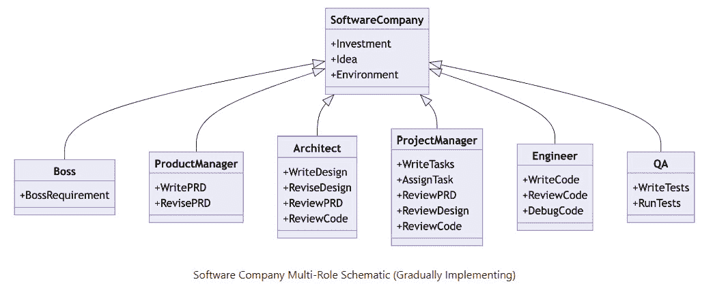

# 第八章：CrowdStrike：深度伪造时代的网络安全

*第七章* 打开了通往一个迷人世界的大门，在这个世界里，人工智能、金融和生物技术交织在一起，以 GPT-4 对 Moderna 药物发现变革性影响为例。我们见证了 Power BI 在金融分析中的魔力，揭开了 Moderna 广泛合作和雄心壮志的真相。我们探讨了如 Jarvis 和 HuggingGPT 等自主机器人的应用，OpenAI 的 AGI 倡议，以及 AI 和量子计算在未来的承诺。随着我们过渡到*第八章*，第七章的见解为我们提供了一个丰富的基石，为深入探索 AI 及其对我们金融信息安全的不断演变的应用领域做好准备。

欢迎来到*第八章*，在这里我们解码网络安全错综复杂的走廊，以及它与人工智能的共舞，并探讨它对金融信息的影响。随着我们进入数字交易和数据交换无处不在的时代，暴露的风险是巨大的。

想象一下参加一场艾德·希兰的演唱会：演唱会场地代表您的数字网络，观众是您的数据，而艾德·希兰——这场演出的明星——是您的关键数据或服务器。系好安全带，我们将解码 CrowdStrike 的复杂性，深入到深度伪造的阴影世界，并从 GPT-4 等先进人工智能技术的角度梳理金融交易的复杂性。在这里，您将发现由 Power BI 可视化增强的投资策略，应对伦理难题，并扩展您的 AI 素养。

本章涵盖的关键主题如下：

+   **GPT-4、多模态活动与金融风险**：了解将 GPT-4 整合到金融领域的诱人前景和潜在危险。

+   **理解 CrowdStrike**：揭示 CrowdStrike 云原生安全云平台背后的秘密。

+   **激进和保守的交易策略**：用我们激动人心的交易策略加速您的金融之旅，所有这些策略都通过 Power BI 可视化生动展示。

+   **HackerGPT 与监管变化**：认识 HackerGPT，您的新式预言家，用于剖析网络安全变化及其金融影响。

+   **FinGPT——金融分析革命**：探索 FinGPT 如何成为金融数据分析、风险评估和预测分析的 AI 模型首选。

+   **MetaGPT——多智能体系统大师**：深入了解 MetaGPT，这是一种新兴的 AI 解决方案，它协调多个 GPT 模型以提供前所未有的金融洞察。

+   **现实世界大型语言模型中的间接提示注入——风险与伦理困境**：揭示现实世界大型语言模型（LLM）应用中常被忽视的间接提示注入风险，并深入探讨随之而来的伦理迷宫。

+   **深度伪造和 AI 素养——金融领域的风险和韧性**：开始一段引人入胜的旅程，探索令人不安的深度伪造世界，了解其财务风险和机遇。通过掌握关键的 AI 素养技能来结束这一章节，这些技能是你在这些危险的技术水域中的第一道防线。

在网络安全的世界中导航可能感觉就像穿越一个复杂的数字迷宫。但如果理解它就像参加一场艾德·希兰的演唱会一样亲切——一场你可以视觉化和欣赏的激动人心的现场体验呢？这正是我们的音乐会和网络安全类比提供的一种共同语言，它简化了数字安全的复杂领域。GPT-4 这样的高级工具可以为你提供财务策略建议并生成动态的 Power BI 可视化。但一次网络错误就可能危及一切。准备好在这个高科技真正与高风险相遇的领域中享受一场激动人心的旅程，并学习如何像艾德·希兰保护他的演唱会一样细致地保护你的数字世界。

# 音乐会和网络安全类比——数字舞台的音乐会安全

作为一种类比，想象你正在参加一场艾德·希兰的演唱会：一个规模庞大、备受瞩目的活动，有数万名粉丝。音乐会代表一个数字网络，参与者是数据包和用户，舞台（以及表演艺术家）是核心数据或主要服务器：

+   **入场时的票务检查代表防火墙**。在你进入场地之前，你的票会被检查。这确保了只有授权的观众才能进入。同样，防火墙作为第一道防线，只允许合法流量通过。

+   **行李和身体扫描就像杀毒和恶意软件扫描**。安全人员会检查行李，有时会使用金属探测器以确保没有有害物品进入音乐会。同样，杀毒软件和恶意软件扫描会寻找试图进入系统的有害软件或文件。

+   **VIP 区域和后台通行证代表分级访问控制**。并非音乐会上的每个人都可以进入后台或访问 VIP 区域。只有那些有特殊通行证或手环的人可以。在数字领域，分级访问确保只有某些人可以访问网络的敏感部分或特定数据。

+   **监控可疑活动就像使用入侵检测系统**。在音乐会上，有安全人员在人群中扫描，寻找任何破坏性行为。同样，入侵检测系统会持续监控网络活动，标记任何异常。

+   **快速响应团队代表事件响应团队**。如果有骚动，音乐会上的专业安全团队会迅速部署来处理情况。同样，当检测到网络威胁时，一个专业团队会在数字领域迅速采取行动。

+   **持续的监控就像持续的监控**。在音乐会上，监控摄像头遍布整个场地，密切关注一切。在网络安全中，持续的监控确保任何恶意活动都能在发生时被发现。

+   **音乐会前的安全简报就像员工培训和威胁情报**。在音乐会开始之前，安全团队会了解潜在的已知威胁或问题，就像公司通知和培训员工关于潜在的钓鱼邮件或骗局一样。

+   **紧急出口和疏散计划代表了备份和恢复过程**。音乐会有明确的紧急出口，如果需要疏散，也有相应的计划。同样，在网络安全中，备份和恢复计划确保在发生违规或故障时，数据可以恢复，运营可以继续。

想象一下 GPT-4，一台如此聪明的机器，它可以为你提供股票选择建议并创建动态的 Power BI 可视化。听起来像是个梦，但有一个问题。你有没有想过背后潜伏的网络安全风险？如果黑客操纵你生成的 AI 金融建议怎么办？

在这个令人兴奋的部分，我们将深入了解 GPT-4 的能力和陷阱，了解其多模态才能，并面对可能破坏你的金融策略的网络安全威胁。所以准备好吧；这是高科技与高风险相遇的地方！

# GPT-4，多模态活动，和金融风险——一个警示故事

人工智能技术如 GPT-4 的进步，这是一个接受图像和文本输入的多模态模型，既令人着迷又充满危险，尤其是在金融领域。随着这些系统继续与我们的日常生活各个方面融合，了解风险至关重要，尤其是关于网络安全及其对投资、交易和金融分析的影响。

## GPT-4 的多模态能力

GPT-4 是 OpenAI 深度学习技术的最新成果，在专业和学术基准测试中表现出色，包括在模拟律师资格考试中排名前 10%。该模型甚至通过对抗性测试程序进行了微调，以实现事实性和可引导性的最佳结果。

## Amazon One 和生物识别时代

为了进行类比，让我们考虑亚马逊的新生物识别支付系统 Amazon One。只需挥动手，该服务就可以让你完成购买，提供了所谓的高安全性优势。然而，网络安全专家警告说，人工智能可能会被部署来生成虚假的生物识别数据。类似于 GPT-4 可以生成令人信服的人类文本，生物识别伪造可能会被用来欺骗 Amazon One 的安全机制。

## 金融中的网络安全风险

金融决策高度依赖准确的信息和安全的平台。想象一下，GPT-4 被集成到您的金融分析工具中，用于生成投资见解或创建 Power BI 可视化。黑客控制该模型可能会操纵生成的建议或数据可视化，导致您做出错误的投资选择。在交易世界中，这可能导致重大财务损失。

## 数据可视化的影响

此外，这些操纵可能会扭曲决策者经常依赖的 Power BI 可视化。不准确的数据可视化可能会扭曲从趋势分析到资产分配的各个方面，不仅影响个人投资组合，还可能破坏市场板块的稳定性。

## 保护敏感信息

与生物识别数据一样，流向或由如 GPT-4 这样的模型生成或输入的数据流需要得到严格保护。鉴于金融数据的敏感性和错误金融决策的连锁反应，实施强大的网络安全措施至关重要。

多模态人工智能模型如 GPT-4 和生物识别支付系统如 Amazon One 的兴起预示着一个新的便利时代，但也揭示了新的漏洞。在金融领域，这意味着对可能改变您的投资格局、扭曲您的财务分析并损害数据可视化可靠性的风险的高度暴露。随着我们进入快速技术进步的时代，谨慎和尽职调查不仅建议，而且绝对必要。

请坐稳，因为我们将与 CrowdStrike 一起探索金融网络安全领域的未来，CrowdStrike 是一家正在改变我们对数字安全看法的公司。想象一下：你是一位拥有宝贵资产和需要保护数据的投资者。在本节中，我们将深入探讨 CrowdStrike 的革命性 Falcon 平台，揭示其由人工智能驱动的武器库，并探讨其实时威胁预测如何为金融界人士带来变革。您将深入了解正在塑造安全金融交易和投资未来的创新技术。继续阅读，揭开 CrowdStrike 的网络安全魔法！

## 理解 CrowdStrike 的安全能力

CrowdStrike 成立于 2011 年，总部位于加利福尼亚州桑尼维尔，旨在重新定义网络安全领域。它使用其云原生 Security Cloud 平台来减轻各种网络威胁，主要关注端点、云工作负载、身份验证和数据保护。这个被称为 CrowdStrike Falcon® 的平台，使用一系列实时指标、威胁情报和遥测数据来增强检测和保护能力。

值得注意的是 Falcon 平台的关键特性：

+   **攻击实时指标**：这些允许进行主动威胁检测

+   **自动保护和修复**：这减少了人工劳动并加快了响应时间

+   **威胁狩猎**：熟练的专业人士使用该平台进行针对复杂威胁的识别

+   **优先观察漏洞**：这引导安全专业人士首先关注最关键的区域

CrowdStrike 因其在网络安全行业的努力而受到认可，赢得了来自福布斯和 Inc. 等各种渠道的认可。虽然这些荣誉证明了公司在行业中的影响力，但也强调了 CrowdStrike 为应对现代安全挑战而不断进化的速度。

## CrowdScore – 威胁管理的范式转变

CrowdStrike 的最新产品 CrowdScore 旨在简化组织对威胁的认知和反应。与传统指标不同，CrowdScore 提供了一个统一、实时的威胁景观视图，协助高管决策。

CrowdScore 的效用体现在几个方面：

+   **即时威胁级别指示**：这有助于组织更有效地分配资源

+   **历史趋势分析**：通过将当前数据与过去趋势进行比较，团队可以做出明智的决策

+   **优先事件**：这简化了分类过程，使响应时间更快

CrowdScore 中的事件工作台功能提供视觉辅助，以协助快速分析和修复。这标志着安全专业人士如何更有效地分配资源以应对威胁的战略转变。

总结来说，CrowdScore 旨在使组织能够及时了解其网络安全威胁景观，促进更快、更明智的反应。这体现了 CrowdStrike 不仅提供强大的保护，而且推动整体网络安全框架发展的承诺。

## CrowdStrike 的 SCORE 分析——导航金融网络安全风险和机遇

欢迎来到金融与网络安全的交汇点！遇见 CrowdStrike，这家在数字威胁无休止的时代改变我们保护金融资产方式的巨头。通过我们的 SCORE 视角，我们将剖析 CrowdStrike 的优势、挑战、机遇、风险和效率。准备好深入了解 AI 驱动的威胁预测、量子抗性算法等——这些是任何在充满高风险的网络安全风险世界中导航的人所必需的洞见。

以下为 CrowdStrike 的优势：

+   **AI 驱动的预测分析**：CrowdStrike 的 Falcon 平台利用人工智能预测和预防潜在的违规行为，使其能够领先于新兴威胁。这种方法可能重新定义了现代时代如何应对网络安全。

+   **研发投资（R&D）**：将相当比例的收入分配给研发，CrowdStrike 继续推动创新并保持其技术优势。

以下是其挑战：

+   **整合收购**：CrowdStrike 的增长战略包括收购具有创新技术的较小公司。将这些公司整合到现有结构中，而不会失去灵活性和专注力，可能是一个巨大的挑战。

以下是其机会：

+   **5G 和物联网安全**：随着 5G 和**物联网（IoT）**设备的普及，网络威胁的攻击面正在迅速扩大。CrowdStrike 的专业知识使其能够成为保护这些创新技术的领导者。

+   **与新兴技术玩家的合作**：与新兴技术公司的合作可以进一步多样化 CrowdStrike 的产品组合，并扩大其进入新市场的影响力。

以下是其风险：

+   **依赖第三方技术**：CrowdStrike 对第三方平台和技术的依赖可能会引入他们可能无法控制的风险，给他们的运营增加额外的风险层。

+   **潜在的监管变化**：世界各国政府正在考虑围绕数据隐私和网络安全的新法规。任何意外的变化都可能影响 CrowdStrike 的运营和成本结构。

以下是其效率：

+   **威胁响应自动化**：通过采用更多针对常见威胁的自动化响应，CrowdStrike 可以进一步简化其运营，减少人为干预和成本。

以下是其未来的潜在机会：

+   **量子抗性算法**：随着量子计算成为现实，传统的加密方法可能会变得过时。开发量子抗性算法可以使 CrowdStrike 成为下一代网络安全领域的先驱。

+   **将行为分析集成到 Power BI 中**：利用机器学习分析行为模式，并通过 Power BI 可视化这些洞察，可以为主动威胁管理提供无与伦比的见解。

CrowdStrike 的旅程代表了创新、战略规划和适应性的激动人心的交汇点。通过 SCORE 分析的视角，结合这些具体的例子和机会，投资者和分析师不仅可以了解 CrowdStrike 今天所处的位置，还可以了解这个网络安全巨头可能在数字安全的激动人心且不可预测的未来中可能走向何方。通过关注这些动态，人们可以做出明智的决定，利用我们数字时代的时代精神。

在这里，我们将探讨网络安全与金融的交汇点，这是一个关键领域，在这里技术遇到了保护金融资产和数据严格需求。这个领域的关键参与者之一是 CrowdStrike。

1.  **为金融机构提供云交付的保护**：CrowdStrike Falcon 确保漏洞在这里停止，为端点、云工作负载、身份等提供强大的保护，以保护金融数据。

1.  **实时威胁预测**：在交易和投资的快节奏世界中，CrowdStrike 的自动预测和预防功能充当哨兵，实时检测潜在威胁。

1.  **AI 驱动的洞察力**：CrowdStrike 威胁图展示了 AI 在金融领域网络安全中的实际应用。CrowdStrike 使用专门的 AI 算法筛选万亿数据点。它识别出新兴威胁和对抗策略的变化，这些变化可能对金融机构造成特别严重的损害。AI 驱动的洞察力与人类专业知识协同工作，加强这些公司的网络安全，确保他们始终领先于潜在风险。

1.  **金融领域的全面安全**：CrowdStrike 的方法不仅关乎阻止攻击，还关乎构建一个安全的金融环境。从精英级威胁狩猎到优先级漏洞管理，CrowdStrike 确保金融领域的关键风险区域得到充分保护。

CrowdStrike 的创新技术是网络安全领域的创新灯塔，尤其与金融行业密切相关。当我们深入金融、投资和交易的世界时，了解如何通过 CrowdStrike 等解决方案保护并赋予企业力量是至关重要的。该平台不仅仅是一个安全工具；它是对任何希望保护其在日益互联且充满危险的网络世界中运营的金融机构来说的战略性资产。

准备好深入探索 CrowdStrike 与 Dell Technologies 之间划时代的联盟——这一合作承诺将重新定义中小企业（SMB）领域商业网络安全规则。想象一下：CrowdStrike 最先进的 Falcon 平台无缝融入 Dell 庞大的技术织锦中。结果？一个不仅抵御威胁，而且重新定义我们在金融世界中数据安全方法的网络安全堡垒。

从数百万美元的交易到颠覆性的 Power BI 可视化，本节带您踏上一段引人入胜的旅程，探索为什么这一联盟是科技天堂中的完美匹配。

# CrowdStrike 与 Dell Technologies：商业网络安全战略联盟

准备迎接商业网络安全领域的地震性转变！进入 CrowdStrike 与 Dell Technologies 之间的战略联盟——这是一项定义行业、旨在大幅增强网络安全、特别是在高风险的金融世界中的合作伙伴关系。想象一下，尖端 CrowdStrike 解决方案与 Dell 广泛的技术套件交织在一起，所有这些都可以通过 Power BI 等实时数据仪表板进行可视化。这不仅仅是一个联盟；这是一场革命，打开了在网络安全领域的机会之窗，将赋予银行、交易平台和金融分析服务以力量。

## 联盟：构建全面的网络安全

CrowdStrike 和戴尔技术公司已形成战略联盟，专注于提供无缝且成本效益高的解决方案来应对网络威胁。CrowdStrike 的 Falcon 平台现在已集成到戴尔技术产品线的广泛范围内。

## 财务影响和网络安全

这个联盟为 CrowdStrike 开辟了重大机遇，尤其是在金融领域。随着银行、交易平台和金融分析服务变得越来越互联互通，对强大的网络安全解决方案的需求不断增长。CrowdStrike 增强的能力使其在这个领域成为领跑者。

## 数据可视化的力量

来自该联盟生成的安全指标可以通过实时威胁仪表板或预测分析显示，通过像 Power BI 这样的工具进行可视化。这将使金融机构对其网络安全状况有更深入的了解，有助于数据驱动的决策。

## 结论：网络安全和金融的未来

该联盟的早期成功——在一笔与大型区域医疗保健提供商的七位数交易中显而易见——树立了一个有希望的先例。它强调了联盟在推动网络安全领域创新、效率和增长方面的潜力，这对于保护金融部门变得越来越关键。

下一部分将带您进入 CrowdStrike 收益电话会议记录错综复杂的迷宫，所有这些都由创新的 AI 和自然语言处理（NLP）工具解码。通过 Python 库和 TextBlob 驱动的情感分析，我们将剖析 CrowdStrike 的最新业绩，并一窥公司的未来。如果您想深入了解 CrowdStrike 的财务健康和潜在风险，同时发现 AI 如何颠覆投资策略，您绝对不想错过这个。所以，请坐稳；演出即将开始！

# 利用 AI 和 NLP 分析 CrowdStrike 的收益电话会议记录

从收益电话会议记录中隐藏的宝贵见解到解码公司市场情绪的情感分析，这一部分是您了解 CrowdStrike 在不断演变的网络安全世界中的地位的路线图。我们将迅速穿越这些记录的重要性、数据提取的技术工作流程和情感分析。最后，我们将放大视角，看看这一切如何融入更广泛的网络安全格局。

## 收益电话会议记录在金融中的作用

收益电话会议记录是至关重要的财务文件，揭示了公司的业绩、战略和前瞻性声明。他们的分析可以为投资者和金融分析师提供宝贵的见解。

### 技术工作流程

使用 Python docx 库，可以毫秒内访问每个收益电话记录中的文本。这为更深入的数据分析奠定了基础。

### 使用 TextBlob 进行情感分析

这些记录的“问题与答案”部分尤其重要。利用 TextBlob 库，为每个季度计算了情感分数：

+   2023 年第三季度：0.172（略为积极）

+   2023 年第四季度：0.181（略为积极）

+   2024 年第一季度：0.184（略为积极）

这些分数从-1（负面）到 1（正面）提供了对情感的空中视角，揭示了一致的积极基调。

### 与 CrowdStrike 和网络安全的相关性

这样的情感分析可以帮助投资者和金融分析师理解 CrowdStrike 的市场地位和潜在风险，尤其是在与网络安全指标结合使用时。类似的 AI 模型嵌入在 CrowdStrike 等网络安全平台中，增强了它们预测和适应新威胁的能力。

我们即将飞入充满活力的交易策略世界！想象一下，如果你能通过结合网络保险的快速增长和针对高估的谨慎对冲来提升你的投资组合，那会怎样。让我们深入探讨一种双重策略：在保险行业的领导者如 Beazley 和 Hiscox 购买看涨期权，同时在网络安全巨头 CrowdStrike 出售看跌期权。

如果最大化收益同时有备选方案的想法让你兴奋，那么你就在正确的位置。无论你是经验丰富的交易者还是想要提升水平的爱好者，你准备好释放激进期权交易的力量了吗？

## 激进交易（使用期权）- 在 Beazley 和 Hiscox 购买看涨期权，在 CrowdStrike 出售看跌期权

在这种激进的交易策略中，我们正在购买 Beazley 和 Hiscox 的看涨期权，这表明我们对这些保险公司持看涨态度。同时，我们在 CrowdStrike 出售看跌期权，表达了一种更为谨慎的观点。这种策略旨在利用网络保险预期的增长，结合 CrowdStrike 可能的估值过高：

1.  使用`pip install yfinance`安装`yfinance`包

1.  运行以下 Python 代码：

    ```py
    # Import necessary libraries
    import yfinance as yf
    def buy_call_options(symbol, strike, expiration, contracts):
        print(f"Buying {contracts} call options for {symbol} with strike {strike} and expiration {expiration}.")
        # TODO: Add your actual trading logic here
    def sell_put_options(symbol, strike, expiration, contracts):
        print(f"Selling {contracts} put options for {symbol} with strike {strike} and expiration {expiration}.")
        # TODO: Add your actual trading logic here
    # Define the strike price, expiration date, and number of contracts
    # NOTE: Replace the following values with those relevant to your strategy
    beazley_strike = 150
    beazley_expiration = '2023-12-15'
    beazley_contracts = 10
    hiscox_strike = 120
    hiscox_expiration = '2023-12-15'
    hiscox_contracts = 10
    crowdstrike_strike = 200
    crowdstrike_expiration = '2023-12-15'
    crowdstrike_contracts = 10
    # Place trades
    buy_call_options('BEZ.L', beazley_strike, beazley_expiration, beazley_contracts)
    buy_call_options('HSX.L', hiscox_strike, hiscox_expiration, hiscox_contracts)
    sell_put_options('CRWD', crowdstrike_strike, crowdstrike_expiration, crowdstrike_contracts)
    ```

## 带有突出替换区域的示例函数

以下是一些示例函数，模拟了`buy_call_options`和`sell_put_options`函数可能具有的实际交易逻辑：

```py
# Example of what buy_call_options might look like
def buy_call_options(symbol, strike, expiration, contracts):
    your_trading_platform_api.buy_options(
        symbol = symbol,              # <-- Replace with your variable or hard-coded value
        strike_price = strike,        # <-- Replace with your variable or hard-coded value
        expiration_date = expiration, # <-- Replace with your variable or hard-coded value
        contract_type = 'CALL',
        num_of_contracts = contracts  # <-- Replace with your variable or hard-coded value
    )
# Example of what sell_put_options might look like
def sell_put_options(symbol, strike, expiration, contracts):
    your_trading_platform_api.sell_options(
        symbol = symbol,              # <-- Replace with your variable or hard-coded value
        strike_price = strike,        # <-- Replace with your variable or hard-coded value
        expiration_date = expiration, # <-- Replace with your variable or hard-coded value
        contract_type = 'PUT',
        num_of_contracts = contracts  # <-- Replace with your variable or hard-coded value
    )
```

在这些示例函数中，将占位符（your_trading_platform_api、symbol、strike、expiration、contracts）替换为与你的交易策略和平台相关的实际细节。

准备降低音量但保持智慧。欢迎来到保守交易策略的领域，在这里，缓慢而稳定可能真的会赢得比赛！在这个微妙的策略中，我们通过直接购买保险巨头 Beazley 和 Hiscox 的股票来采取看涨立场。但不仅如此。我们还在密切关注 CrowdStrike，等待其股价下跌 5%时介入并购买其股份。

你问为什么采取这种平衡的方法？因为在投资的世界里，时机和谨慎可能和任何高风险赌注一样令人兴奋。如果你是那种欣赏计算风险的艺术和稳定收益的吸引力的人，那么这一部分就是你的大师班。准备好以从容和精确的方式导航金融市场了吗？让我们开始吧！

## 保守交易（使用股票）- 在 Beazley 和 Hiscox 购买股票，并在股票从当前价格下跌 5%时购买 CrowdStrike 的股票

在这种保守交易策略中，我们直接购买 Beazley 和 Hiscox 的股票，表明对这些保险公司的看涨观点。同时，我们设定了一个限价单，一旦 CrowdStrike 的股票从当前水平下跌 5%，就购买其股票，这表明了一种更加谨慎的方法：

```py
a). Assumes yfinance library has already been installed on the PC.  If not, please complete this step first.
pip install yfinance
b). Run python code
# Import necessary libraries
import yfinance as yf
def buy_stock(symbol, num_shares):
    print(f"Buying {num_shares} shares of {symbol}.")
    # TODO: Add your actual trading logic here
def place_limit_order(symbol, target_price, num_shares):
    print(f"Placing limit order for {num_shares} shares of {symbol} at target price {target_price}.")
    # TODO: Add your actual trading logic here
# Define the stock symbols and number of shares to buy
# NOTE: Replace the following values with those relevant to your strategy
beazley_stock = 'BEZ.L'
hiscox_stock = 'HSX.L'
crowdstrike_stock = 'CRWD'
num_shares_beazley = 100
num_shares_hiscox = 100
num_shares_crowdstrike = 100
# Place trades
buy_stock(beazley_stock, num_shares_beazley)
buy_stock(hiscox_stock, num_shares_hiscox)
# Check current price of CrowdStrike
crowdstrike_price = yf.Ticker(crowdstrike_stock).history().tail(1)['Close'].iloc[0]
# Determine target price (5% below current price)
target_price = crowdstrike_price * 0.95
# Place limit order
place_limit_order(crowdstrike_stock, target_price, num_shares_crowdstrike)
```

## 示例函数中突出显示的替换区域

以下是一些示例函数，模拟了 buy_stock 和 place_limit_order 函数可能的样子，其中包含实际的交易逻辑：

```py
# Example of what buy_stock might look like
def buy_stock(symbol, num_shares):
    your_trading_platform_api.buy_stock(
        symbol = symbol,               # <-- Replace with your variable or hard-coded value
        num_of_shares = num_shares     # <-- Replace with your variable or hard-coded value
    )
# Example of what place_limit_order might look like
def place_limit_order(symbol, target_price, num_shares):
    your_trading_platform_api.place_limit_order(
        symbol = symbol,               # <-- Replace with your variable or hard-coded value
        target_price = target_price,   # <-- Replace with your variable or hard-coded value
        num_of_shares = num_shares     # <-- Replace with your variable or hard-coded value
    )
```

在这些示例函数中，将占位符（your_trading_platform_api，symbol，target_price，num_shares）替换为与你的交易策略和平台相关的实际细节。

两种投资策略都需要根据市场条件进行持续监控和调整。同样重要的是，要咨询财务顾问，以确保这些策略与个人的投资目标、风险承受能力和财务状况相一致。

想象一下你的交易仪表板的驾驶舱；听起来很棒，对吧？这就是当 Power BI 的惊人视觉与 ChatGPT 的直观自然语言能力相遇时你所得到的。无论你是期权战士还是股市策略家，这些仪表板就像你的个人指挥中心，提供实时洞察、警报，以及能够使用你的金融术语进行对话的界面。如果你一直在渴望可操作的分析和 AI 驱动的金融建议，那么请考虑这一节是你的绿洲。

# 投资仪表板的终极指南 - Power BI 遇见 ChatGPT

步入你的金融驾驶舱，在这里 Power BI 的炫目视觉与 ChatGPT 的敏锐语言学协同合作，引领你穿梭于交易和投资的激动人心的天空。在这本终极指南中，我们将你的梦想仪表板分解为关键组件。首先，激进交易和保守交易策略通过一系列定制可视化实时展开。然后，我们通过实时警报提高赌注，这些警报充当你的金融雷达。最后，欢迎 ChatGPT 融入这些仪表板，提供按需金融建议和洞察。

## Power BI 可视化

我们邀请您探索 Power BI 可视化世界，特别是针对使用 Beazley、Hiscox 和 CrowdStrike 期权进行积极交易策略的定制化可视化。我们将本节组织成三个关键组成部分。首先，我们提供了一个精心制作的仪表板概览，其中包括价格走势的时间序列图、一个开放职位表以跟踪您的合约，以及一个风险评估图表以评估潜在的盈亏情景。接下来，我们介绍了一个非常有价值的概念——警报，重点关注 CrowdStrike 的看跌期权，以确保您不会错过任何行动的良机。最后，我们增加了与 ChatGPT 的集成，您可以直接提问并接收基于数据的见解和建议。本节将快速概述本章前面提到的积极和保守交易。它将提供一些在 Power BI 中可视化数据并开启 Power BI 警报的建议。为了创建这些 Power BI 可视化，我们将从创建包含从第 18-22 页开始的积极和保守交易数据的 CSV 文件开始，然后详细的 Power BI 可视化步骤将从第 22 页开始。

## 使用 Beazley、Hiscox 和 CrowdStrike 期权的积极交易

1.  仪表板概览：

    +   **时间序列图**：显示 Beazley、Hiscox 和 CrowdStrike 期权价格走势的折线图。使用不同的线条颜色来区分看涨和看跌期权。

    +   **开放职位表**：显示当前持仓，包括行权价格、到期日、合约数量和当前价值。

    +   **风险评估图表**：显示在不同情景下期权持仓的潜在盈亏的散点图。

1.  警报：

    +   **CrowdStrike 看跌期权警报**：如果 CrowdStrike 的看跌期权进入盈利状态（股价低于行权价格），则设置警报。这可以通知用户可能采取行动。

1.  与 ChatGPT 的集成：

    +   一个文本输入字段，用户可以查询 ChatGPT 以获取见解，例如“CrowdStrike 看跌期权的潜在风险是什么？”

    +   ChatGPT 可以分析可视化数据并提供可操作的见解和建议

## 保守交易：在下跌 5%后购买 Beazley、Hiscox 和 CrowdStrike 的股票

我们转换方向，探索针对更保守交易方法的 Power BI 可视化，特别是关注在股价下跌 5%后购买 Beazley、Hiscox 和 CrowdStrike 的股票。这个定制指南分为三个主要部分。首先是仪表板概览，它展示了追踪股价走势的时间序列图、一个跟踪您当前持仓的开放职位表，以及一个跟踪您的限价订单的状态卡，确保您手头有所有必要的信息。其次，我们将向您介绍设置警报，例如当 CrowdStrike 的股价接近您的目标价 5%时触发的警报，以便及时采取行动。

最后，我们将集成 ChatGPT，针对积极交易，以实现交互式、实时的见解：

1.  仪表板概览：

    +   时间序列图：显示 Beazley、Hiscox 和 CrowdStrike 股票价格波动的折线图

    +   开仓头寸表：显示当前股票持仓的表格，包括符号、股数、平均成本和当前价值

    +   限价订单状态：显示在 CrowdStrike 上的限价订单状态卡片或部分，包括目标价格和当前价格

1.  警报：

    +   CrowdStrike 目标价格警报：如果 CrowdStrike 的价格在目标价格的 5% 以内，则设置警报。这可以通知用户密切监控或执行交易

1.  与 ChatGPT 的集成：

    +   按照在“积极交易 Power BI”部分中突出显示的相同步骤进行操作）

## Power BI 警报配置（以 CrowdStrike 空头期权警报为例，但也可用于 Crowdstrike 股票警报）

本节是一个六步之旅，为您提供在 Power BI 中设置自己警报的技能，这些警报是根据您独特的交易策略定制的。首先，您将学习如何选择适当的视觉元素，例如折线图，作为您警报的基础。接下来，我们将引导您通过 Power BI 的警报部分，在这里完成主要设置。在这里，您将设置新的警报规则、指定条件并选择您希望如何被通知。每一步都是一个构建块，最终形成一个配置好的警报，让您始终领先于市场曲线。通过掌握这些步骤，您不仅是在您的交易工具箱中添加另一个工具；您还在获得一个警惕的盟友，确保您永远不会错过重要的交易线索：

1.  点击您想要设置警报的具体视觉元素（例如，显示 CrowdStrike 股票价格与看跌期权执行价格对比的折线图）。

1.  前往 Power BI 服务中的 **警报** 部分。

1.  点击 **+ 新建** **警报**规则。

1.  设置警报的条件（例如，**股票价格 <** **执行价格**）。

1.  选择通知方法（例如，电子邮件或移动通知）。

1.  保存警报。

重要提示

可视化的具体实现和外观将取决于您的数据源、Power BI 设置和具体要求。

确保您符合所有相关的法律和监管要求，尤其是在集成如 ChatGPT 这样的 AI 时。

通过结合 Power BI 的可视化能力和 ChatGPT 的自然语言分析，这些投资策略可以有效地进行监控和管理，以易于访问和可操作的方式提供见解。请确保涉及财务专家，以根据个人情况调整策略。

准备好通过 Python 的动态能力体验一次过山车般的旅程，我们将使您的积极交易策略栩栩如生。想象一下，您能够通过几行代码创建 CSV 文件来快照您的期权头寸、跟踪实时价格和可视化潜在风险。欢迎来到 Python 是您的交易大厅，而您是这个金融交响乐指挥的世界。准备好通过编码走向动态、实时的交易洞察。

## 利用 Python 的力量进行积极交易：一个由代码驱动的探险

准备好开始一段扣人心弦的旅程——一个由 Python 驱动的、充满活力的交易世界探险。这一节不仅仅是教程；它是一个充满活力的课程，将 Python 代码变成您交易驾驶舱的动力室。我们首先在名为 options_df 的数据框中组装我们的交易期权，并将其保存为 CSV 文件以便于访问。我们的 get_option_price 函数作为实时期权定价的通道，根据股票代码、行权价格和到期日拉取关键数据。这些数据随后被整齐地组织在另一个数据框 positions_df 中，同样保存为 CSV 文件。随着我们向前推进，您将期待深入时间序列绘图和风险评估，您将学习如何可视化价格趋势并计算潜在的盈亏。

以下是为创建 CSV 文件而编写的 Python 代码：

```py
a). Install yfinance and pandas first (if this has not already been done)
pip install pandas
pip install yfinance
b). Run the following Python code:
import pandas as pd
import yfinance as yf
# Define your variables here
# NOTE: Replace the '...' with actual values
beazley_stock = 'BEZ.L'
hiscox_stock = 'HSX.L'
crowdstrike_stock = 'CRWD'
beazley_strike = ...
hiscox_strike = ...
crowdstrike_strike = ...
beazley_expiration = ...
hiscox_expiration = ...
crowdstrike_expiration = ...
beazley_contracts = ...
hiscox_contracts = ...
crowdstrike_contracts = ...
# Create DataFrame for option positions
options_df = pd.DataFrame({
    'Symbol': [beazley_stock, hiscox_stock, crowdstrike_stock],
    'Type': ['Call', 'Call', 'Put'],
    'Strike': [beazley_strike, hiscox_strike, crowdstrike_strike],
    'Expiration': [beazley_expiration, hiscox_expiration, crowdstrike_expiration],
    'Contracts': [beazley_contracts, hiscox_contracts, crowdstrike_contracts]
})
# Save DataFrame to CSV
options_df.to_csv('aggressive_trade_options.csv', index=False)
# Function to fetch real-time price
def get_option_price(ticker, strike, expiration, option_type='call'):
    # TODO: Add your actual trading logic here
    return ...
# Open Positions Table
positions = []
for symbol, strike, expiration, contracts in [(beazley_stock, beazley_strike, beazley_expiration, beazley_contracts),
                                               (hiscox_stock, hiscox_strike, hiscox_expiration, hiscox_contracts),
                                               (crowdstrike_stock, crowdstrike_strike, crowdstrike_expiration, crowdstrike_contracts)]:
    price = get_option_price(symbol, strike, expiration)
    positions.append([symbol, strike, expiration, contracts, price * contracts])
positions_df = pd.DataFrame(positions, columns=['Symbol', 'Strike', 'Expiration', 'Contracts', 'Value'])
positions_df.to_csv('aggressive_positions.csv', index=False)
# Time Series Plot
# TODO: Add your actual trading logic here
# Risk Analysis Chart
# TODO: Add your actual trading logic here
```

重要提示

将所有 `…` 替换为您想要使用的实际值。

您需要实现 `get_option_price()` 函数以获取实时期权价格。这取决于您所使用的数据库或经纪商。

时间序列图和风险评估图表部分被标记为 TODO，因为您需要根据您的需求添加实际的逻辑。

通过 Python 掌握保守交易，在股票市场的混乱世界中发掘宁静。如果您更喜欢逐渐增强的音调而不是市场波动的强烈刺激，这一节就是您的避风港。我们将使用 Python 创建分析仪表板，绘制您的交易头寸，跟踪实时价格，甚至使用 CSV 文件设置限价订单。准备好通过编码走向可持续、风险管理的利润？让我们开始吧。

## 保守交易的禅意：释放 Python 以实现稳定的收益

这一节是那些寻求计算、稳定交易方法的人的避风港。我们将使用 Python 代码执行贝茨利、希克斯和 CrowdStrike 等股票的保守交易策略。

首先，我们定义关键的变量，如股票代码、股数和目标价格。然后，使用 Python 的 pandas 库，我们创建一个数据框来整洁地记录这些变量。我们还将其保存为 CSV 文件以供将来使用。之后，脚本进入实时模式，获取最新的股票价格以填充你的开放头寸表——另一个我们将保存为 CSV 的数据框。最后，脚本通过更新一个监控当前股票价格与目标买入价格接近程度限制订单状态的数据框来结束。

以下是为创建 CSV 文件编写的 Python 代码：

1.  首先安装 yfinance 和 pandas（如果尚未安装）：

    ```py
    pip install pandas
    pip install yfinance
    ```

1.  运行以下 Python 代码：

    ```py
    import pandas as pd
    import yfinance as yf
    # Define your variables here
    # NOTE: Replace the '...' with actual values
    beazley_stock = ...
    hiscox_stock = ...
    crowdstrike_stock = ...
    num_shares_beazley = ...
    num_shares_hiscox = ...
    num_shares_crowdstrike = ...
    target_price = ...  # Target price for CrowdStrike
    # Create DataFrame for stock positions
    stock_df = pd.DataFrame({
        'Symbol': [beazley_stock, hiscox_stock, crowdstrike_stock],
        'Shares': [num_shares_beazley, num_shares_hiscox, num_shares_crowdstrike],
        'Target_Price': [None, None, target_price]
    })
    # Save DataFrame to CSV
    stock_df.to_csv('conservative_trade_stocks.csv', index=False)
    # Function to fetch real-time stock price
    def get_stock_price(ticker):
        return yf.Ticker(ticker).history().tail(1)['Close'].iloc[0]
    # Open Positions Table
    positions = []
    for symbol, shares in [(beazley_stock, num_shares_beazley),
                          (hiscox_stock, num_shares_hiscox)]:
        price = get_stock_price(symbol)
        positions.append([symbol, shares, price, price * shares])  # Adjust to include average cost
    positions_df = pd.DataFrame(positions, columns=['Symbol', 'Shares', 'Current Price', 'Value'])
    positions_df.to_csv('conservative_positions.csv', index=False)
    # Time Series Plot
    # TODO: Add your actual trading logic here
    # Limit Order Status
    limit_order_status = pd.DataFrame([[crowdstrike_stock, target_price, get_stock_price(crowdstrike_stock)]],
                                      columns=['Symbol', 'Target Price', 'Current Price'])
    limit_order_status.to_csv('limit_order_status.csv', index=False)
    ```

重要提示

将所有的`...`替换为你想要使用的实际值。

时间序列图部分标记为 TODO。你需要根据具体需求添加实际的逻辑。

你已经拥有了交易数据。接下来该做什么呢？为什么不将那些原始、未过滤的信息转化为令人惊叹、富有洞察力的可视化，讲述一个引人入胜的故事呢？欢迎来到 Power BI 可视化的艺术！从描绘激进的交易策略到描绘保守策略的禅意宁静，我们将把你的电子表格变成一场视觉交响乐。而且你知道吗？我们甚至还会设置实时警报，并与 ChatGPT 集成，以获得 AI 驱动的洞察。

# 视觉炼金术：使用 Power BI 将原始数据转化为金子般的洞察

踏入 Python 驱动的保守交易领域，在这里，每一行代码都是通往财务谨慎和优化收益的垫脚石。我们的部分通过介绍对数据操作和市场数据提取至关重要的 Python 库：pandas 和 yfinance 开始。脚本首先声明变量，如股票代码、股数和目标价格，有效地为你的保守交易策略打下基础。仅仅通过一小段代码，我们就将这些原始变量转换成一个结构化的数据框，称为 stock_df，然后将其保存为 CSV 文件以便于访问。我们的 get_stock_price 函数通过从雅虎财经获取实时股票价格，使你的策略与市场现实保持联系。这些数据滋养了另一个 DataFrame，positions_df，它作为你的实时账本，用于跟踪股票价值。我们还预留了一个跟踪限制订单状态的位置，确保你不会错过最佳的买入点。

## 创建 Power BI 可视化

现在你有了 CSV 文件，你可以按照以下步骤创建 Power BI 可视化：

1.  将 CSV 文件加载到 Power BI 中：

    +   打开 Power BI 桌面版。

    +   点击获取数据 > 文本/CSV。

    +   浏览到你的 CSV 文件位置，并将它们加载到 Power BI 中。

1.  创建激进的交易可视化：

    1.  对于时间序列图，使用折线图，并使用日期作为*x*轴，价格作为*y*轴。

    1.  对于一个开放头寸表，使用表格可视化并将相关字段从`aggressive_trade_options.csv`拖动。

    1.  对于风险分析图，使用散点图并添加利润/亏损的计算字段。

    1.  对于 CrowdStrike 的卖出警报，你可以按照上一条消息中描述的方法设置警报。

1.  创建保守交易的可视化：

    1.  对于时间序列图，类似于激进交易，使用折线图。

    1.  对于一个开放头寸表，使用包含`conservative_trade_stocks.csv`字段的表格可视化。

    1.  对于限价订单状态，使用卡片可视化来显示目标价格和当前价格。

    1.  对于 CrowdStrike 的目标价格警报，请按照之前解释的方法设置警报。

1.  集成 ChatGPT：

    +   虽然 Power BI 可以通过 API 连接到 GPT4，但你只需输入你的 OpenAI API 密钥，并确保你有足够的余额来覆盖 API 调用。

# 与 ChatGPT（GPT-4）集成

在 Power BI 中启用 Python 脚本：

1.  前往**文件 > 选项和设置 > 选项**。

1.  在**Python 脚本**下，选择你的安装 Python 目录。

1.  安装所需的 Python 包。

    确保安装 openai Python 包，这将允许你与 GPT-4 API 通信。你可以通过 pip 安装它：

    ```py
    Bash
    pip install openai
    ```

1.  在 Power BI 中创建一个 Python 可视化：

    +   在 Power BI 桌面版中，点击 Python 脚本可视化。

    +   在你的报告中将出现一个占位符 Python 脚本可视化，并会打开一个编辑器，你可以在其中输入 Python 代码。

1.  输入 GPT-4 API 调用的 Python 代码。

    使用以下示例 Python 代码作为基础。将`'your_openai_api_key_here'`替换为你的实际 OpenAI API 密钥：

    ```py
    import openai
    openai.api_key = "your_openai_api_key_here"
    # Your query based on Power BI data
    prompt = "Provide insights based on Power BI visualization of aggressive trade options."
    # API call to GPT-4 for text generation
    response = openai.Completion.create(
      engine="text-davinci-003",  # or your chosen engine
      prompt=prompt,
      max_tokens=100
    )
    insight = response.choices[0].text.strip()
    ```

1.  在 Power BI 中显示洞察力。

    你可以在 Power BI 中的文本框或其他可视化元素中显示生成的文本（存储在`insight`变量中）。

1.  测试集成

    确保在 Power BI 中测试 Python 脚本，以确保其成功运行并返回预期的洞察力。

1.  保存并应用更改。

    一旦你对设置满意，请点击 Power BI 中的“应用更改”以更新报告。

1.  添加 API 成本监控

    关注 OpenAI API 仪表板以监控使用情况和成本。确保你有足够的余额来覆盖 API 调用。

1.  安排刷新。

    如果你使用的是 Power BI 服务，请设置一个计划好的刷新来保持你的洞察力更新。

    通过遵循这些步骤，你应该能够将 GPT-4 集成到你的 Power BI 报告中，以便根据你的财务可视化进行动态和有洞察力的文本生成。

1.  如果你想要与他人分享，请保存 Power BI 报告并将其发布到 Power BI 服务。

重要提示

确保根据需要刷新数据以获取更新的信息。具体的字段和计算可能根据你交易的具体数据和需求而有所不同。

通过遵循这些步骤，你可以创建有洞察力的 Power BI 可视化，用于激进和保守交易，利用直接从你的 Python 交易代码生成的 CSV 文件。

想象一下，有一位经验丰富的网络安全专家全天候陪伴在你身边，穿梭于网络法律的迷宫中，剖析每一个重大违规行为，告诉你这对你的投资组合意味着什么。这听起来太好了，以至于不真实？来认识 HackerGPT（AIPersona）！这款模型旨在模仿网络安全情报领域的最佳实践，它不仅能够处理数据，还能思考、分析，甚至在快速发展的网络世界中识别投资金矿。坐稳了；你即将发现一个颠覆性的工具，它可能会重新定义你对网络安全和投资的看法。

# HackerGPT（AIPersona）- 监控和分析网络安全法规变化和违规行为

作为一款专注于网络安全复杂领域的超级智能模型，HackerGPT 致力于识别、理解和分析法规变化、网络安全违规行为及其对各个行业潜在的影响。HackerGPT 提供的见解可以指导网络安全保险和网络安全领域的投资决策。

以下是 HackerGPT 将评估的关键指标：

+   法规环境：监控和理解不同司法管辖区和行业相关的最新网络安全法规

+   网络安全违规行为：分析重大网络安全违规行为的性质、范围和影响，包括影响生成 AI 或 LLMs 等 AI 技术的违规行为

+   受影响行业：考察法规变化或违规行为如何影响特定行业，如金融、医疗保健、通信、能源、技术、公用事业、材料或工业

+   投资机会：根据法规或网络安全违规环境，识别网络安全保险和网络安全行业中的潜在投资途径

+   技术分析：评估网络安全技术的稳健性、漏洞和创新

+   风险缓解策略：评估和提出缓解网络风险的战略，包括保险解决方案

准备好开始一段激动人心的旅程，探索金融与网络安全的交汇点，由动态的 AI 双胞胎 FinGPT 和 HackerGPT 巧妙引导。FinGPT 以其数据驱动的实力奠定金融基础，而 HackerGPT 则专注于网络安全数据集，深入挖掘网络风险和投资机会的微妙之处。展示的 Python 代码提供了一种利用这些 AI 进行实时洞察的实用方法。它们共同构成了一个无与伦比的工具集，帮助利益相关者穿越金融和网络安全复杂的地形。

## HackerGPT – 反映顶级网络安全专家的特点

HackerGPT 旨在模拟网络安全专业人士的专长，专注于跟踪法规变化、分析网络安全违规行为以及识别相关领域的投资机会。

技能：

+   深厚的网络安全法规、趋势和技术知识

+   精通分析复杂的网络威胁景观和监管环境

+   精通于识别网络安全和保险领域的潜在投资机会

+   优秀的沟通技巧，能够以易于理解的方式呈现复杂的分析

HackerGPT 旨在支持投资者、政府和企业在网络安全复杂世界中导航。其首要目标是提供洞察力，以引导明智的决策，提高网络安全意识，并识别投资机会。

HackerGPT 进行全面的评估，重点关注网络安全的各个方面。它将这些因素置于当前技术进步、行业实践和监管框架的更广泛背景下进行考虑。

HackerGPT 具有分析性、客观性和创新性。它努力提供细致的评估，同时使不同网络安全和投资专业水平的用户都能理解。

虽然 HackerGPT 提供详细评估和建议，但最终决策应始终由相关专业人士负责。其洞察力应用于补充专业判断，并指导而非命令投资和监管策略。

想象一个世界，其中人工智能弥合了华尔街和硅谷之间的差距，解码复杂的网络安全挑战，同时保持对市场趋势的领先。欢迎来到 FinGPT 和 HackerGPT 开创性的融合！在接下来的页面中，您将通过创新人工智能的视角探索金融和网络安全之间的炼金术。这一合作承诺了一种革命性的实时数据分析、投资机会和网络安全管理的方法。

## HackerGPT 与 FinGPT 相遇 – 分析金融网络安全景观的全面指南

在深入了解 HackerGPT 人工智能角色之前，了解支撑它的基础结构至关重要：FinGPT 模型。作为一名对多智能体系统、人工智能和金融分析感兴趣的读者，您会发现 FinGPT 特别相关。

### FinGPT 简介 – 民主化金融数据

FinGPT 是一个专门为金融行业设计的开源 LLM。其使命是通过提供开源、以数据为中心的框架，自动化从各种在线来源收集和整理实时金融数据，从而民主化互联网规模的金融数据。在某些情况下，FinGPT 的表现优于 BloombergGPT 等类似模型，并优先考虑数据收集、清洗和预处理，这些是创建开源金融 LLM（FinLLMs）的关键步骤。通过促进数据可访问性，FinGPT 为开放金融实践奠定了基础，并促进了金融研究、合作和创新。

### 为什么 FinGPT 对 HackerGPT 很重要

现在，您可能想知道，为什么在讨论 HackerGPT 时 FinGPT 是相关的？答案是数据中心性和领域特定性。FinGPT 模型支撑了 HackerGPT 分析和理解与网络安全相关的内容的本领，特别是那些具有金融影响的内容，如网络安全保险和网络安全行业的投资机会。

### HackerGPT（集成 FinGPT）

HackerGPT 系列是使用 LoRA 方法在网络安全和监管数据集上微调的 LLMs。以 FinGPT 以数据为中心的方法作为其骨架，这个版本在网络安全情感分析等任务上表现出色。如果您想深入了解，我们正在准备一个详细的教程，通过基准测试重现我们实验的结果。

通过将 FinGPT 作为模型架构的一部分，HackerGPT 不仅获得了分析网络安全的本领，还利用实时金融数据，使其成为网络安全和金融生态系统中各利益相关者的综合工具。

FinGPT 来源：GitHub：MIT 许可证 AI4 基金会和杨博 [`github.com/AI4Finance-Foundation/FinGPT`](https://github.com/AI4Finance-Foundation/FinGPT)

使用 HackerGPT AI 角色的 FinGPT：

1.  安装

    ```py
    pip install transformers==4.30.2 peft==0.4.0
    pip install sentencepiece
    pip install accelerate
    pip install torch
    pip install peft
    ```

1.  运行以下 Python 代码：

    ```py
    # Import necessary libraries
    from transformers import AutoModel, AutoTokenizer
    from peft import PeftModel  # If you are not using PeftModel, you can comment out this line.
    # Initialize model and tokenizer paths
    # Replace with the actual model paths or API keys
    base_model = "THUDM/chatglm2-6b"
    hacker_model = "yourusername/HackerGPT_ChatGLM2_Cyber_Instruction_LoRA_FT"
    # Load tokenizer and models
    tokenizer = AutoTokenizer.from_pretrained(base_model)
    model = AutoModel.from_pretrained(base_model)
    # NOTE ABOUT PeftModel:
    # PeftModel is a custom model class that you may be using for fine-tuning or specific functionalities.
    # Ensure it's properly installed in your environment.
    # Uncomment the following line if you are using PeftModel.
    # model = PeftModel.from_pretrained(model, hacker_model)
    # Switch to evaluation mode (if needed, consult your model's documentation)
    model = model.eval()
    # Define prompts
    prompt = [
    '''Instruction: What is the potential impact of this regulatory change on the cybersecurity industry? Please provide an analysis.
    Input: New GDPR regulations have been introduced, strengthening data protection requirements for businesses across Europe.
    Answer: ''',
    '''Instruction: Assess the potential investment opportunities in the cyber insurance sector following this breach.
    Input: A major cybersecurity breach has affected several financial institutions, exposing sensitive customer data.
    Answer: ''',
    '''Instruction: How does this cybersecurity advancement affect the technology industry?
    Input: A leading tech company has developed advanced AI-powered cybersecurity solutions that can detect and prevent threats in real time.
    Answer: ''',
    ]
    # Generate responses
    tokens = tokenizer(prompt, return_tensors='pt', padding=True, max_length=512)
    res = model.generate(**tokens, max_length=512)
    res_sentences = [tokenizer.decode(i) for i in res]
    out_text = [o.split("Answer: ")[1] for o in res_sentences]
    # Display generated analyses
    for analysis in out_text:
        print(analysis)
    ```

重要注意事项

# 1. 在至少配备 T4 GPU 和高内存的机器上运行此代码。

# 2. 请记住将占位符模型名称替换为您想要使用的实际模型名称。

这段代码片段和模型配置是为了评估网络安全各个方面的各种方面，如监管影响、潜在的投资机会和技术进步。通过分析给定的输入，该模型可以提供与网络安全格局相关的见解和详细回应。

# 用 MetaGPT 革命性地推动 AI 驱动的开发未来——多智能体系统的终极催化剂

想象一个世界，在这个世界里，大型语言模型（LLMs）不仅仅能生成文本，还能像工程师、产品经理和架构师梦之队一样协作。它们不仅作为孤立的天才运作，而且作为一个具有明确角色和标准操作程序的协同单位。欢迎来到 MetaGPT 的世界，这是一个开创性的力量，将重新定义多智能体系统和 AI 驱动的软件开发的未来。

在这次激动人心的深入探讨中，您将揭开 MetaGPT 架构背后的天才，它设计要扮演的角色，以及它对以 AI 为主导的倡议的变革性影响。您还将探索它在金融领域识别网络安全投资机会的非凡能力。

本节是为对多智能体系统、AI 驱动的软件开发和大型语言模型感兴趣的专业人士和研究人员设计的。还请注意，基于传统 LLM 的多智能体系统通常存在一致性和协作问题，导致效率低下。

## 什么是 MetaGPT？

MetaGPT 是一种突破性的技术，通过整合**标准操作程序（SOPs**）来解决多代理系统协调的问题。

以下图表显示了 MetaGPT 的架构：



来源：MIT 许可证；github.com/geekan/MetaGPT

图 8.1 – MetaGPT：软件公司多角色示意图

想象一下，一个组织良好的软件公司被一个单独的图表所捕捉。图表中心是 MetaGPT，它是协调者，将单行需求转换为全面的可交付成果，如用户故事、竞争分析和**应用程序编程接口（APIs）**。围绕 MetaGPT 的是各种专业的 GPT 代理——每个代理代表产品经理、架构师、项目经理和工程师等角色。这些代理在 MetaGPT 的指导下共同处理复杂任务。

## MetaGPT 基于角色的协作

本节将深入探讨 MetaGPT 如何采用不同的代理角色——每个角色相当于产品经理、架构师或工程师——以前所未有的效率处理复杂的软件项目。与任何开创性技术一样，MetaGPT 也带来了一组自己的挑战和限制，例如可扩展性和复杂性——我们将剖析这些因素，为您提供全面的视角。随着我们将这些角色简化为领导和支持类别，我们为软件开发中的财务、概念和运营方面带来了清晰度。系好安全带，我们将带您了解 MetaGPT 的端到端工作流程，从启动和需求收集到最终审查阶段。到那时，您将看到 MetaGPT 不仅仅是一个 AI 模型；它代表了 AI 驱动软件开发的一次地震性转变，有望不仅革命化多代理系统，还将改变更广泛的技术和金融领域。

代理角色

MetaGPT 采用产品经理、架构师和工程师等角色，以与人类软件开发团队保持一致。每个角色都有特定领域的技能和责任，有助于高效的任务执行。

以下列出了 MetaGPT 的挑战和限制：

+   **可扩展性**：该模型可能需要大量的计算资源

+   **复杂性**：采用曲线可能很陡峭，尤其是对于不熟悉 SOPs 或元编程的团队

简化的角色分类

为了避免冗余，我们将典型软件公司设置中的角色合并为两大类：

+   领导角色：

    +   **投资**：财务管理及想法验证

    +   **想法**：概念化和与市场需求保持一致

    +   **老板（支持）**：整体项目监督

+   支持角色：

    +   **产品经理**：使产品与市场需求保持一致

    +   **架构师**：确保可维护和可扩展的设计

    +   **工程师**：代码创建和调试

    +   **质量保证（QA）**：质量保证

## MetaGPT 工作流程

工作流程包括启动、需求收集、设计、任务管理、开发、测试和审查阶段，有助于实现透明和高效的开发过程。

总之，MetaGPT 标志着 AI 驱动软件开发领域的重大转变。通过模仿类似人类的团队合作并实施 SOPs，它为复杂软件开发开辟了令人兴奋的途径，将自己定位为多智能体系统领域中的宝贵资产。

这些是关键见解：

+   基于角色的协作提高了效率

+   SOPs 的融入提供了一种结构化的方法

+   MetaGPT 在现实世界应用中表现出色，如案例研究所示

您的反馈和建议对于 MetaGPT 及其在 AI 和多智能体系统领域的更广泛影响持续改进至关重要。

# MetaGPT 模型简介（网络安全投资机会）

MetaGPT 模型是一个高度先进且可定制的模型，旨在满足各个领域内特定的研究和分析需求。在此特定背景下，它旨在识别受网络安全法规变化或网络攻击影响的美国市场中的投资机会。

## 角色和责任

该模型已被配置以执行各种专业角色，包括以下这些：

+   **网络安全法规研究**：了解网络安全法律和法规的变化及其对市场的影响

+   **网络攻击分析**：调查网络攻击，了解其性质，并识别潜在的投资风险或机会

+   **投资分析**：根据网络安全变化得出的见解评估投资机会

+   **交易决策**：在金融产品上进行明智的买卖决策

+   **投资组合管理**：监督和调整投资组合，以符合网络安全动态

这是它的工作原理：

+   **研究阶段**：模型根据角色启动给定主题的研究，无论是网络安全法规还是攻击。它将主题分解为可搜索的查询，收集相关数据，根据可信度对 URL 进行排序，并总结收集到的信息。

+   **分析阶段**：投资分析师随后评估总结信息，以识别趋势、见解以及潜在的投资机会或风险。他们将网络安全数据与市场行为、投资潜力和风险因素相关联。

+   **交易阶段**：根据分析，投资交易员执行适当的交易决策，买卖受网络安全环境影响的资产。

+   **管理阶段**：投资组合经理整合所有见解，就资产配置、风险管理以及投资组合的调整做出总体决策。

以下是其目的和好处：

+   **及时洞察**：通过自动化研究和分析过程，该模型为动态领域如网络安全提供快速洞察，其中变化可能立即对市场产生影响

+   **数据驱动决策**：该模型确保投资决策基于全面研究和客观分析，最小化偏见

+   **定制**：该模型可以根据网络安全的具体方面进行定制，例如监管变化或特定类型的违规行为，从而允许有针对性的投资策略

+   **协作**：通过定义不同的角色，该模型模拟了一种协作方法，其中各种专家贡献他们的专业知识以实现共同的投资目标

总之，MetaGPT 模型，凭借其多样化的角色和复杂的功能，成为投资者利用不断变化的网络安全领域的强大工具。通过整合研究、分析、交易和投资组合管理，它提供了一种全面、数据驱动的投资机会识别和利用方法，这些机会源于网络安全和金融之间复杂互动。它不仅简化了投资过程，还提高了在快速发展的领域中投资决策的准确性和相关性。

来源：GitHub：MIT 许可证：[`github.com/geekan/MetaGPT`](https://github.com/geekan/MetaGPT).

来源：MetaGPT：多智能体协作框架论文：

[2308.00352] MetaGPT：多智能体协作框架的元编程（arxiv.org）([`arxiv.org/abs/2308.00352`](https://arxiv.org/abs/2308.00352))

作者：洪思睿，郑晓武，陈俊彦，程宇恒，王金林，张策瑶，王紫丽，刘子轩，周立扬，陈瑞安，肖凌峰，吴成霖

以下是一个 Python 代码片段：

1.  从安装开始：

    ```py
    npm --version
    sudo npm install -g @mermaid-js/mermaid-cli
    git clone https://github.com/geekan/metagpt
    cd metagpt
    python setup.py install
    ```

1.  运行以下 Python 代码：

    ```py
    # Configuration: OpenAI API Key
    # Open the config/key.yaml file and insert your OpenAI API key in place of the placeholder.
    # cp config/config.yaml config/key.yaml
    # save and close file
    # Import Necessary Libraries
    import asyncio
    import json
    from typing import Callable
    from pydantic import parse_obj_as
    # Import MetaGPT Specific Modules
    from metagpt.actions import Action
    from metagpt.config import CONFIG
    from metagpt.logs import logger
    from metagpt.tools.search_engine import SearchEngine
    from metagpt.tools.web_browser_engine import WebBrowserEngine, WebBrowserEngineType
    from metagpt.utils.text import generate_prompt_chunk, reduce_message_length
    # Define Roles
    # NOTE: Replace these role definitions as per your project's needs.
    RESEARCHER_ROLES = {
        'cybersecurity_regulatory_researcher': "Cybersecurity Regulatory Researcher",
        'cyber_breach_researcher': "Cyber Breach Researcher",
        'investment_analyst': "Investment Analyst",
        'investment_trader': "Investment Trader",
        'portfolio_manager': "Portfolio Manager"
    }
    # Define Prompts
    # NOTE: Customize these prompts to suit your project's specific requirements.
    LANG_PROMPT = "Please respond in {language}."
    RESEARCH_BASE_SYSTEM = """You are a {role}. Your primary goal is to understand and analyze \
    changes in cybersecurity regulations or breaches, identify investment opportunities, and make informed \
    decisions on financial products, aligning with the current cybersecurity landscape."""
    RESEARCH_TOPIC_SYSTEM = "You are a {role}, and your research topic is \"{topic}\"."
    SEARCH_TOPIC_PROMPT = """Please provide up to 2 necessary keywords related to your \
    research topic on cybersecurity regulations or breaches that require Google search. \
    Your response must be in JSON format, for example: ["cybersecurity regulations", "cyber breach analysis"]."""
    SUMMARIZE_SEARCH_PROMPT = """### Requirements
    1\. The keywords related to your research topic and the search results are shown in the "Reference Information" section.
    2\. Provide up to {decomposition_nums} queries related to your research topic based on the search results.
    3\. Please respond in JSON format as follows: ["query1", "query2", "query3", ...].
    ### Reference Information
    {search}
    """
    DECOMPOSITION_PROMPT = """You are a {role}, and before delving into a research topic, you break it down into several \
    sub-questions. These sub-questions can be researched through online searches to gather objective opinions about the given \
    topic.
    ---
    The topic is: {topic}
    ---
    Now, please break down the provided research topic into {decomposition_nums} search questions. You should respond with an array of \
    strings in JSON format like ["question1", "question2", ...].
    """
    COLLECT_AND_RANKURLS_PROMPT = """### Reference Information
    1\. Research Topic: "{topic}"
    2\. Query: "{query}"
    3\. The online search results: {results}
    ---
    Please remove irrelevant search results that are not related to the query or research topic. Then, sort the remaining search results \
    based on link credibility. If two results have equal credibility, prioritize them based on relevance. Provide the ranked \
    results' indices in JSON format, like [0, 1, 3, 4, ...], without including other words.
    """
    WEB_BROWSE_AND_SUMMARIZE_PROMPT = '''### Requirements
    1\. Utilize the text in the "Reference Information" section to respond to the question "{query}".
    2\. If the question cannot be directly answered using the text, but the text is related to the research topic, please provide \
    a comprehensive summary of the text.
    3\. If the text is entirely unrelated to the research topic, please reply with a simple text "Not relevant."
    4\. Include all relevant factual information, numbers, statistics, etc., if available.
    ### Reference Information
    {content}
    '''
    CONDUCT_RESEARCH_PROMPT = '''### Reference Information
    {content}
    ### Requirements
    Please provide a detailed research report on the topic: "{topic}", focusing on investment opportunities arising \
    from changes in cybersecurity regulations or breaches. The report must:
    - Identify and analyze investment opportunities in the US market.
    - Detail how and when to invest, the structure for the investment, and the implementation and exit strategies.
    - Adhere to APA style guidelines and include a minimum word count of 2,000.
    - Include all source URLs in APA format at the end of the report.
    '''
    # Roles
    RESEARCHER_ROLES = {
        'cybersecurity_regulatory_researcher': "Cybersecurity Regulatory Researcher",
        'cyber_breach_researcher': "Cyber Breach Researcher",
        'investment_analyst': "Investment Analyst",
        'investment_trader': "Investment Trader",
        'portfolio_manager': "Portfolio Manager"
    }
    # The rest of the classes and functions remain unchanged
    ```

重要注意事项：

+   在运行 Python 脚本之前，请在您的终端中执行安装和设置命令

+   不要忘记将配置文件和 Python 脚本中的占位符文本替换为实际数据或 API 密钥

+   确保 MetaGPT 已在您的机器上正确安装和配置

在这场高风险的探索中，我们剖析了 LLM 集成应用的激动人心但充满风险的世界。我们深入探讨了它们如何改变金融，同时提出了无法忽视的突现伦理困境和安全风险。准备好通过真实世界的案例研究来了解 LLM 在金融中的应用，从击败市场的对冲基金到代价高昂的安全漏洞和道德陷阱。

因此，系好安全带，因为我们正一头扎进金融领域 LLM 集成问题的错综复杂的迷宫。在这里，你会发现令人耳目一新的发现，让你质疑我们如何使用，以及可能误用这项革命性技术。你准备好面对挑战和复杂性了吗？让我们开始吧！

# 利用间接提示注入损害现实世界的 LLM 集成应用

集成到应用程序中的语言模型（LLMs），如 ChatGPT，在技术创新的前沿，尤其是在金融、交易和投资领域。然而，它们带来了新兴的风险，包括伦理和安全相关风险，需要立即关注：

1.  金融领域的变革性应用：

    LLM 已经改变了金融运营的各个方面，从基于 AI 的金融预测到生成个性化的 Power BI 可视化。

    案例研究：对冲基金利润一家利用 ChatGPT 进行市场情绪分析的对冲基金成功穿越了动荡的市场，实现了 20%的利润增长。

1.  伦理迷宫：

    LLM 带来了道德负担，从安全担忧到虚假信息和监管挑战，影响了包括 Bing Chat 和 Microsoft 365 Copilot 在内的各种平台。

    案例研究：监管失误一家投资公司在使用 LLM 时未能遵守当地法规，导致法律和声誉受损。

1.  阿基里斯的脚踝：间接提示注入：

    发现诸如间接提示注入等漏洞，为 LLM 安全增加了另一层复杂性。这种漏洞允许攻击者远程发送误导性提示，使其成为需要立即修复的关键领域。

    案例研究：代价高昂的警报一名黑客利用间接提示注入漏洞发送虚假交易警报，导致交易者做出糟糕的投资决策并遭受重大损失。

1.  欺骗潜力：真实和实验证据：

    无论是合成实验还是现实世界测试，都表明 LLM 很容易被误导，做出错误或有害的决策。

    案例研究：未经授权的交易一个具有 LLM 功能的银行应用程序被诱骗批准未经授权的交易，展示了这些漏洞的现实影响。

1.  威胁格局的演变：

    随着 LLM 变得更加复杂，新的漏洞形式正在出现，而不仅仅是间接提示注入。持续的研究和警惕至关重要。

    案例研究：AI 辅助的钓鱼诈骗在最近的一次会议上突出了一种新的 AI 辅助钓鱼诈骗形式，警告行业注意演变的攻击向量。

# 为 LLM 提供未来保障——即将到来的解决方案

鉴于风险不断升级，尤其是间接提示注入，正在探索各种有前景的缓解方法：

+   **AI 引导的安全协议**：实时监控以立即检测和缓解威胁

+   **基于区块链的验证**：确保交易和数据完整性

+   **量子加密**：革命性的数据加密方法

+   **行为分析和生物识别**：定制、强大的身份验证机制

+   **合规性自动化**：自动检查以确保符合全球标准

以下是一些实际应用中的解决方案示例：

+   一家领先的银行正在使用人工智能引导的安全协议进行实时威胁识别

+   一家金融科技初创公司已在实施量子加密以实现超安全交易

在金融领域引入 LLM 是一次既令人兴奋又充满危险之旅。随着我们深入这一技术，解决随之而来的各种挑战，包括间接提示注入，变得至关重要。基于伦理考虑和技术创新的平衡方法将帮助我们安全、负责任地利用 LLM。

想象一个世界，在这个世界里，所见不再为所信。充斥你屏幕的图像和视频如此超现实，如此完美无瑕地制作，以至于模糊了真实与虚构之间的界限。欢迎来到令人不安却又迷人的深度伪造领域——这是人工智能最具吸引力同时也是最具警示性的故事。深度伪造拥有变革媒体、娱乐甚至社会正义的力量，同时也同样映射出社会、伦理和金融后果的黑暗面，而我们才刚刚开始理解这些后果。

借助数据可视化和人工智能工具，我们将揭示、分析和面对深度伪造对我们对现实本身理解所提出的存在性挑战。

你即将踏入一个看似一切皆非真实的世界，在这里，对真相的追求变成了一场与高级算法和人工智能的高风险赌博。准备好面对令人不安的事实与虚构之间的流动边界了吗？系好安全带，让我们深入探索我们人工智能驱动的未来的复杂性和意外漏洞。

来源

[2302.12173] 并非你所期望的：通过间接提示注入损害现实世界 LLM 集成应用 (arxiv.org)

作者：凯·格雷沙克，萨哈尔·阿布德尔纳比，沙伊勒什·米什拉，克里斯托夫·恩德斯，托尔斯滕·霍兹，马里奥·弗里茨

# 深度伪造及其多方面影响——借助人工智能和数据可视化进行深入探讨

由人工智能进步推动的深度伪造能够创造出超现实且完全虚构的视频和图像。这些深度伪造不仅挑战了我们对于现实的认识，而且在个人、企业和政府层面也带来了重大的风险。

这里有一个技术概述。深度伪造使用在数千张照片和声音样本上训练的神经网络来生成极其逼真的虚假内容。随着新算法的出现，复杂性扩展到了全头合成、联合视听合成，甚至全身合成。

伦理和法律方面：

+   Deepfakes 最初因在恶意活动中的应用而声名狼藉，从个人诽谤到政治操纵，其涉及的法律和伦理考量众多，鉴于其可能对社会和个人造成伤害。

以下是他们社会影响：

+   深度伪造内容可能对个人造成不可修复的损害，从情感痛苦到法律后果。

+   对于公司来说，欺诈视频可以在几分钟内操纵股价并破坏声誉。

+   深度伪造可能导致社会动荡和国际冲突。

以下是他们金融和网络安全的影响：

+   企业深度伪造可能导致误导性的财务指令，造成重大经济损失。

+   深度伪造内容的广泛传播可能会超载数字基础设施，导致网络安全漏洞。

通过生成式 AI 工具进行保护：

+   **AI 检测**：先进的 AI 模型可以识别甚至最细微的修改，并将它们标记为需要进一步调查。

+   **区块链水印**：通过区块链技术可以对真实内容进行水印和验证。

+   **教育推广**：由 ChatGPT 等 AI 驱动的工具可以告知和教育公众关于深度伪造的风险。

1.  **持续改进的反馈循环**

1.  当 AI 模型标记可疑内容时，结果可以由人类专家进行审查以确保准确性。这一审查过程会反馈到机器学习模型中，帮助它在未来的深度伪造检测工作中提高性能。

目前，微软和其他科技巨头正在开发深度伪造检测工具，这些工具分析视觉和听觉内容，提供操纵的可能性评分。

随着深度伪造技术的日益复杂，我们的识别和防御方法必须不断发展。通过整合机器学习模型和数据可视化技术，我们可以更好地理解深度伪造的格局，并制定更有效的对策。

想象一下你站在交易大厅。数字在屏幕上实时闪烁，经纪人通过电话大喊，紧张气氛令人窒息。但如果你告诉我，在这个混乱场景中真正的力量不是人类而是算法呢？欢迎来到金融的未来——一个越来越由 AI 塑造的领域。

AI 不仅仅是流行语；它是一种变革力量，正在重新书写金融规则，从股票推荐到欺诈检测。虽然它可能听起来很复杂，但理解 AI 并非只有科技巨头或华尔街大亨才能加入的精英俱乐部。本指南是您通往金融 AI 新世界的护照，无论您是新手投资者、科技爱好者还是经验丰富的金融专业人士。

我们将用对你有意义的方式解码人工智能。我们的旅程将通过道德陷阱和算法陷阱，展示人工智能带来的颠覆性机会和挑战。想象一下，拥有一个从不睡觉的个人财务顾问，一个从每次交易中学习的风险管理者，甚至是一个防止欺诈的数字看门狗——这就是人工智能在金融领域的承诺和警示故事。

那么，为什么你应该关心呢？因为人工智能不仅正在塑造未来，还在加速它。在一个变化是唯一不变的世界里，你适应和了解这一开创性技术的能力是你最终的优势。准备好揭开算法的神秘面纱，剖析现实世界的案例研究，并采取行动步骤，不仅生存，还要在这个由人工智能驱动的金融前沿蓬勃发展。

当我们在这激动人心的旅程中揭开人工智能和金融世界的帷幕时，我们达到了一个令人兴奋的高潮：人工智能素养——通往未来的通行证。无论你是好奇的初学者、技术娴熟的爱好者，还是金融专家，这一部分都是你最终指南，帮助你在这场人工智能革命中占据一席之地。我们将绘制一幅超越人工智能局限性和道德约束的路线图，涉及诸如 Kount 这样的实际案例研究，这些案例研究展示了人工智能在金融领域颠覆性潜力的典范。通过提供从正规教育、认证到社区参与和 DIY 项目的丰富资源，我们旨在为你提供终身掌握人工智能所需的工具。当我们到达这个叙述的结尾时，请记住，未来不是一个被动的景观，我们只是继承它，而是一个令人兴奋的前沿，我们积极构建它。凭借你所获得的见解和技能，你不仅仅是一个旁观者，而是人工智能和金融这场正在展开的传奇中的开拓者。

## 人工智能素养——通往未来的通行证

从人工智能的变革性影响到其在金融领域的实际应用，本指南面向所有行业和领域的读者。

初学者可以将人工智能视为一个个性化助手。一个不错的起点是安装使用人工智能进行个性化股票推荐的金融应用，例如 Robinhood。

技术爱好者可以从探索开源机器学习库，如 TensorFlow 开始。在 GitHub 上尝试现有的以金融为重点的人工智能项目。

如果你是一名金融专业人士，人工智能可以帮助你自动化风险评估。例如，DataRobot 提供针对金融数据分析的定制人工智能服务。

## 探索人工智能的领域——考虑事项和指南

+   **人工智能的局限性**：对人工智能的金融建议持批判态度。使用允许您查看算法置信度分数的平台，例如 Quantopian。

+   **道德使用**：在处理金融数据时，寻找符合 GDPR 或遵循道德人工智能指南的平台。

考虑以下案例研究。Kount 是一个使用 AI 防止金融交易欺诈的平台。想象一个不仅知道所有技巧，而且随着新技巧的出现而不断学习的安保人员；这就是 Kount 自适应 AI 所做的事情。它不断从数据中学习，以评估每笔交易的风险。通过这样做，它最大限度地减少了将合法交易错误标记为欺诈（称为错误拒绝）的情况，从而帮助企业避免收入损失并增强客户信任。

本案例研究显示，当 AI 被负责任和道德地使用时，可以在金融领域提供实质性的好处，使运营更加安全和高效。

以下是你通往 AI 精通的路线图：

+   **赋能自己**：在 Coursera 等平台上跟随入门课程，例如安德鲁·吴的《人人都能学 AI》。

+   **包容性的未来**：参与 AI4ALL 等倡议，旨在实现 AI 领域的更加多元化。

以下是金融 AI 的要点：

+   AlphaSense 等工具使用 AI 扫描、搜索和分析金融文件，提供前所未有的效率。

+   对于交易，考虑使用提供 AI 驱动交易 API 的平台，例如 Alpaca。对于金融可视化，Power BI 与 Azure AI 的集成提供了高级分析功能。

+   从 TradeStation 等入门友好型平台开始，它具有内置的算法交易功能。

以下是在金融 AI 领域终身学习的指南：

+   对于正规教育，麻省理工学院的《AI in Finance》等课程可以深入了解金融市场中 AI 的具体应用。

+   在在线课程方面，Udacity 的《AI for Trading》是一个全面的纳米学位，专注于金融领域的 AI。

+   如 IBM 的 AI for Financial Services 认证等证书可以为您的技能集添加一个信誉徽章。

+   加入如 Reddit 的 r/algotrading 等在线论坛，以保持对 AI 金融技术的最新动态。

+   定期参加来自《金融时报》或 KDNuggets 的在线研讨会，这些研讨会聚焦于金融领域的 AI。

+   如 Jannes Klaas 的《Machine Learning for Finance》等书籍提供了理论和实际案例研究。

+   Kaggle 等平台举办的挑战赛可以为您提供解决基于金融的 AI 问题的实践经验。

+   对于您自己的项目，请使用 QuantConnect 等平台，利用它们免费的数据和云资源来测试您自己的交易算法。

您在金融 AI 领域的旅程是一个持续的过程。本指南旨在成为一个全面的起点。始终记住，AI 是一个工具，而不是万能的银弹。您的判断仍然是您最重要的资产。有了这些资源和指南，您现在更有能力在金融 AI 不断发展的领域中导航、创新和繁荣。

随着我们结束这一章节和这次旅程，请记住：未来不是偶然发生在我们身上的事情——它是我们亲手建造的。有了正确的知识和工具，包括人工智能素养，我们都是明天的建筑师。所以，无论你是经验丰富的技术大师，还是金融专家，或者只是刚刚踏入人工智能世界的初学者，你现在都拥有了导航、创新和在这个新时代茁壮成长的知识。

# 摘要

在这一章节中，我们穿越了网络安全领域人工智能与金融交叉的最前沿发展。你了解了 GPT-4 在金融领域的潜力和风险，理解了 CrowdStrike 基于云的强大能力，并通过具有说服力的 Power BI 可视化，通过激进和保守的交易策略加速了你的金融洞察力。我们向你介绍了 HackerGPT 作为观察网络安全金融影响的视角，并探讨了 FinGPT 如何革新金融分析。我们深入研究了 MetaGPT 的多代理编排，以获得颠覆性的金融洞察。你还获得了关于在 LLM 中使用间接提示注入的宝贵伦理观点，以及随着深度伪造的兴起所带来的金融风险和机遇。

现在，随着我们结束这次不可思议旅程的最后一章，让我们以充满力量的话语告别：你不再是技术变革之船上的乘客，你是掌舵者，在人工智能和金融的动荡而令人兴奋的水域中引领方向。从这本书中获得洞察力和工具，你不仅为未来做好了准备——你已准备好去建造它。带着信心、智慧和无法满足的创新渴望前行。未来等待着你的印记；让它成为杰作！
